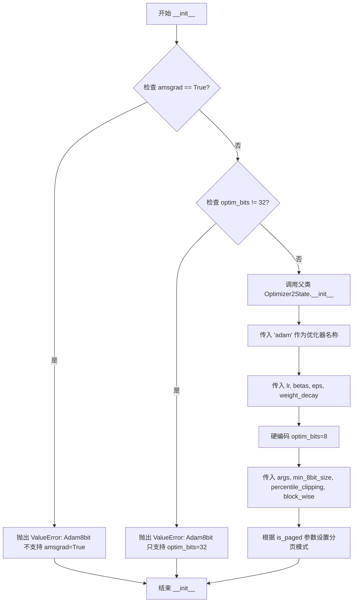
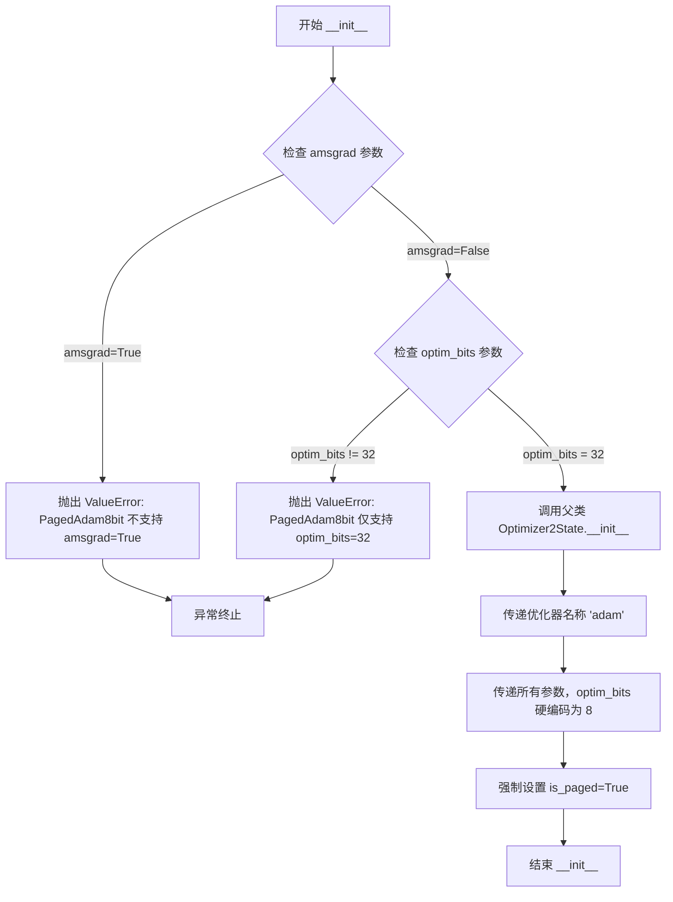

# `bitsandbytes\bitsandbytes\optim\adam.py` 详细设计文档

该模块实现了多种Adam优化器变体，包括标准Adam、8位Adam、32位Adam以及对应的分页版本，支持不同的数值精度（8-bit/32-bit）和内存管理策略，通过继承Optimizer2State基类实现参数的优化更新。

## 整体流程

```mermaid
graph TD
    A[开始] --> B[用户创建优化器实例]
    B --> C{选择优化器类型}
    C -->|Adam| D[创建Adam实例]
    C -->|Adam8bit| E[创建Adam8bit实例]
    C -->|Adam32bit| F[创建Adam32bit实例]
    C -->|PagedAdam| G[创建PagedAdam实例]
    C -->|PagedAdam8bit| H[创建PagedAdam8bit实例]
    C -->|PagedAdam32bit| I[创建PagedAdam32bit实例]
    E --> J{验证参数}
    H --> J
    J -->|amsgrad=True| K[抛出ValueError]
    J -->|optim_bits≠32| L[抛出ValueError]
    J -->|通过验证| M[调用super().__init__]
    D --> M
    F --> M
    G --> M
    I --> M
    M --> N[Optimizer2State初始化]
    N --> O[结束：优化器准备就绪]
```

## 类结构

```
Optimizer2State (抽象基类)
├── Adam
├── Adam8bit
├── Adam32bit
├── PagedAdam
├── PagedAdam8bit
└── PagedAdam32bit
```

## 全局变量及字段


### `Optimizer2State`
    
从bitsandbytes.optim.optimizer导入的基类optimizer

类型：`class`
    


### `Adam.params`
    
待优化的参数

类型：`torch.tensor`
    


### `Adam.lr`
    
学习率，默认1e-3

类型：`float`
    


### `Adam.betas`
    
动量衰减系数，默认(0.9, 0.999)

类型：`tuple`
    


### `Adam.eps`
    
防止除零的epsilon，默认1e-8

类型：`float`
    


### `Adam.weight_decay`
    
权重衰减，默认0

类型：`float`
    


### `Adam.amsgrad`
    
是否使用AMSGrad变体，默认False

类型：`bool`
    


### `Adam.optim_bits`
    
优化器状态位数，默认32

类型：`int`
    


### `Adam.args`
    
附加参数对象

类型：`object`
    


### `Adam.min_8bit_size`
    
8位优化的最小张量大小，默认4096

类型：`int`
    


### `Adam.percentile_clipping`
    
百分位裁剪阈值，默认100

类型：`int`
    


### `Adam.block_wise`
    
是否分块量化，默认True

类型：`bool`
    


### `Adam.is_paged`
    
是否为分页优化器，默认False

类型：`bool`
    


### `Adam.__init__`
    
初始化Adam优化器

类型：`method`
    


### `Adam8bit.params`
    
待优化的参数

类型：`torch.tensor`
    


### `Adam8bit.lr`
    
学习率，默认1e-3

类型：`float`
    


### `Adam8bit.betas`
    
动量衰减系数，默认(0.9, 0.999)

类型：`tuple`
    


### `Adam8bit.eps`
    
防止除零的epsilon，默认1e-8

类型：`float`
    


### `Adam8bit.weight_decay`
    
权重衰减，默认0

类型：`float`
    


### `Adam8bit.amsgrad`
    
是否使用AMSGrad变体，默认False（不支持）

类型：`bool`
    


### `Adam8bit.optim_bits`
    
优化器状态位数，默认32（实际强制8位）

类型：`int`
    


### `Adam8bit.args`
    
附加参数对象

类型：`object`
    


### `Adam8bit.min_8bit_size`
    
8位优化的最小张量大小，默认4096

类型：`int`
    


### `Adam8bit.percentile_clipping`
    
百分位裁剪阈值，默认100

类型：`int`
    


### `Adam8bit.block_wise`
    
是否分块量化，默认True

类型：`bool`
    


### `Adam8bit.is_paged`
    
是否为分页优化器，默认False

类型：`bool`
    


### `Adam8bit.__init__`
    
初始化8位Adam优化器，包含参数验证逻辑

类型：`method`
    


### `Adam32bit.params`
    
待优化的参数

类型：`torch.tensor`
    


### `Adam32bit.lr`
    
学习率，默认1e-3

类型：`float`
    


### `Adam32bit.betas`
    
动量衰减系数，默认(0.9, 0.999)

类型：`tuple`
    


### `Adam32bit.eps`
    
防止除零的epsilon，默认1e-8

类型：`float`
    


### `Adam32bit.weight_decay`
    
权重衰减，默认0

类型：`float`
    


### `Adam32bit.amsgrad`
    
是否使用AMSGrad变体，默认False

类型：`bool`
    


### `Adam32bit.optim_bits`
    
优化器状态位数，默认32

类型：`int`
    


### `Adam32bit.args`
    
附加参数对象

类型：`object`
    


### `Adam32bit.min_8bit_size`
    
8位优化的最小张量大小，默认4096

类型：`int`
    


### `Adam32bit.percentile_clipping`
    
百分位裁剪阈值，默认100

类型：`int`
    


### `Adam32bit.block_wise`
    
是否分块量化，默认True

类型：`bool`
    


### `Adam32bit.is_paged`
    
是否为分页优化器，默认False

类型：`bool`
    


### `Adam32bit.__init__`
    
初始化32位Adam优化器

类型：`method`
    


### `PagedAdam.params`
    
待优化的参数

类型：`torch.tensor`
    


### `PagedAdam.lr`
    
学习率，默认1e-3

类型：`float`
    


### `PagedAdam.betas`
    
动量衰减系数，默认(0.9, 0.999)

类型：`tuple`
    


### `PagedAdam.eps`
    
防止除零的epsilon，默认1e-8

类型：`float`
    


### `PagedAdam.weight_decay`
    
权重衰减，默认0

类型：`float`
    


### `PagedAdam.amsgrad`
    
是否使用AMSGrad变体，默认False

类型：`bool`
    


### `PagedAdam.optim_bits`
    
优化器状态位数，默认32

类型：`int`
    


### `PagedAdam.args`
    
附加参数对象

类型：`object`
    


### `PagedAdam.min_8bit_size`
    
8位优化的最小张量大小，默认4096

类型：`int`
    


### `PagedAdam.percentile_clipping`
    
百分位裁剪阈值，默认100

类型：`int`
    


### `PagedAdam.block_wise`
    
是否分块量化，默认True

类型：`bool`
    


### `PagedAdam.is_paged`
    
是否为分页优化器，默认False（内部强制设为True）

类型：`bool`
    


### `PagedAdam.__init__`
    
初始化分页Adam优化器

类型：`method`
    


### `PagedAdam8bit.params`
    
待优化的参数

类型：`torch.tensor`
    


### `PagedAdam8bit.lr`
    
学习率，默认1e-3

类型：`float`
    


### `PagedAdam8bit.betas`
    
动量衰减系数，默认(0.9, 0.999)

类型：`tuple`
    


### `PagedAdam8bit.eps`
    
防止除零的epsilon，默认1e-8

类型：`float`
    


### `PagedAdam8bit.weight_decay`
    
权重衰减，默认0

类型：`float`
    


### `PagedAdam8bit.amsgrad`
    
是否使用AMSGrad变体，默认False（不支持）

类型：`bool`
    


### `PagedAdam8bit.optim_bits`
    
优化器状态位数，默认32（实际强制8位）

类型：`int`
    


### `PagedAdam8bit.args`
    
附加参数对象

类型：`object`
    


### `PagedAdam8bit.min_8bit_size`
    
8位优化的最小张量大小，默认4096

类型：`int`
    


### `PagedAdam8bit.percentile_clipping`
    
百分位裁剪阈值，默认100

类型：`int`
    


### `PagedAdam8bit.block_wise`
    
是否分块量化，默认True

类型：`bool`
    


### `PagedAdam8bit.is_paged`
    
是否为分页优化器，默认False（内部强制设为True）

类型：`bool`
    


### `PagedAdam8bit.__init__`
    
初始化8位分页Adam优化器，包含参数验证逻辑

类型：`method`
    


### `PagedAdam32bit.params`
    
待优化的参数

类型：`torch.tensor`
    


### `PagedAdam32bit.lr`
    
学习率，默认1e-3

类型：`float`
    


### `PagedAdam32bit.betas`
    
动量衰减系数，默认(0.9, 0.999)

类型：`tuple`
    


### `PagedAdam32bit.eps`
    
防止除零的epsilon，默认1e-8

类型：`float`
    


### `PagedAdam32bit.weight_decay`
    
权重衰减，默认0

类型：`float`
    


### `PagedAdam32bit.amsgrad`
    
是否使用AMSGrad变体，默认False

类型：`bool`
    


### `PagedAdam32bit.optim_bits`
    
优化器状态位数，默认32

类型：`int`
    


### `PagedAdam32bit.args`
    
附加参数对象

类型：`object`
    


### `PagedAdam32bit.min_8bit_size`
    
8位优化的最小张量大小，默认4096

类型：`int`
    


### `PagedAdam32bit.percentile_clipping`
    
百分位裁剪阈值，默认100

类型：`int`
    


### `PagedAdam32bit.block_wise`
    
是否分块量化，默认True

类型：`bool`
    


### `PagedAdam32bit.is_paged`
    
是否为分页优化器，默认False（内部强制设为True）

类型：`bool`
    


### `PagedAdam32bit.__init__`
    
初始化32位分页Adam优化器

类型：`method`
    
    

## 全局函数及方法


### `Adam.__init__`

初始化Adam优化器基类，继承自Optimizer2State，用于管理神经网络参数的优化过程，支持标准Adam算法及其变体（如AMSGrad），同时提供了8位量化、百分位裁剪、分块量化等高级特性。

参数：

- `params`：`torch.tensor`，需要优化的输入参数张量
- `lr`：`float`，学习率，默认值为1e-3
- `betas`：`tuple(float, float)`，一阶和二阶矩的衰减率，默认值为(0.9, 0.999)
- `eps`：`float`，防止优化器除零的epsilon值，默认值为1e-8
- `weight_decay`：`float`，优化器的权重衰减值，默认值为0.0
- `amsgrad`：`bool`，是否使用AMSGrad变体，默认值为False
- `optim_bits`：`int`，优化器状态的位宽，默认值为32
- `args`：`object`，包含额外参数的对象，默认值为None
- `min_8bit_size`：`int`，张量元素用于8位优化的最小数量，默认值为4096
- `percentile_clipping`：`int`，自适应裁剪阈值，通过跟踪最后100个梯度范数并进行百分位裁剪以提高稳定性，默认值为100
- `block_wise`：`bool`，是否独立量化每个张量块以减少异常值影响和提高稳定性，默认值为True
- `is_paged`：`bool`，是否为分页优化器，默认值为False

返回值：`None`，该方法直接调用父类构造函数，不返回任何值

#### 流程图

```mermaid
flowchart TD
    A[开始 Adam.__init__] --> B[接收参数]
    B --> C[调用 super().__init__]
    C --> D[传入优化器类型 'adam']
    D --> E[传入所有配置参数]
    E --> F[Optimizer2State 初始化]
    F --> G[结束]
    
    style A fill:#e1f5fe
    style C fill:#fff3e0
    style F fill:#e8f5e9
    style G fill:#fce4ec
```

#### 带注释源码

```python
class Adam(Optimizer2State):
    def __init__(
        self,
        params,                  # torch.tensor: 需要优化的模型参数
        lr=1e-3,                 # float: 学习率，控制参数更新的步长
        betas=(0.9, 0.999),      # tuple: 一阶矩估计(b1)和二阶矩估计(b2)的衰减率
        eps=1e-8,                # float: 防止除零的数值稳定项
        weight_decay=0,          # float: L2正则化权重衰减系数
        amsgrad=False,           # bool: 是否使用AMSGrad变体（使用过去平方梯度的最大值）
        optim_bits=32,           # int: 优化器状态的位宽（8或32位）
        args=None,               # object: 包含额外配置参数的对象
        min_8bit_size=4096,      # int: 触发8位优化的最小参数元素数量
        percentile_clipping=100,# int: 百分位裁剪的窗口大小，用于自适应梯度裁剪
        block_wise=True,         # bool: 是否按块独立量化，减少异常值影响
        is_paged=False,          # bool: 是否使用分页内存管理（适用于大模型）
    ):
        """
        Base Adam optimizer.
        
        参数说明：
        - params: 模型的可训练参数
        - lr: 学习率，默认1e-3是Adam的推荐值
        - betas: (0.9, 0.999)是原始论文推荐的默认值
        - eps: 1e-8防止分母为零
        - weight_decay: 0表示默认不使用权重衰减
        - amsgrad: False使用标准Adam，True使用AMSGrad变体
        - optim_bits: 32位是标准精度，8位可减少内存
        - min_8bit_size: 只有参数数量大于此值时才使用8位优化
        - percentile_clipping: 100表示使用最近100个梯度范数计算裁剪阈值
        - block_wise: True可以提高量化稳定性
        - is_paged: False标准模式，True启用分页内存管理
        """
        # 调用父类Optimizer2State的初始化方法
        # 传入优化器名称'adam'以及所有配置参数
        super().__init__(
            "adam",              # 优化器类型标识符
            params,              # 待优化参数
            lr,                  # 学习率
            betas,               # 衰减率元组
            eps,                 # 数值稳定项
            weight_decay,        # 权重衰减
            optim_bits,          # 位宽配置
            args,                # 额外参数
            min_8bit_size,       # 8位优化最小尺寸
            percentile_clipping, # 百分位裁剪
            block_wise,          # 块式量化
            is_paged=is_paged,   # 分页模式标志
        )
```


### `Adam8bit.__init__`

初始化8位Adam优化器，包含参数验证逻辑，用于在训练过程中对参数进行8位量化优化。

参数：

- `params`：`torch.tensor`，要优化的输入参数
- `lr`：`float`，学习率，控制参数更新的步长，默认为 1e-3
- `betas`：`tuple[float, float]`，一阶和二阶矩的衰减率，用于计算梯度的指数移动平均，默认为 (0.9, 0.999)
- `eps`：`float`，防止除零的 epsilon 值，默认为 1e-8
- `weight_decay`：`float`，权重衰减系数，用于 L2 正则化，默认为 0
- `amsgrad`：`bool`，是否使用 AMSGrad 变体，Adam8bit 不支持此参数，必须为 False
- `optim_bits`：`int`，优化器状态的位数，Adam8bit 固定使用 8 位优化，只接受默认值 32
- `args`：`object`，包含额外配置参数的对象，默认为 None
- `min_8bit_size`：`int`，启用 8 位优化所需的参数张量最小元素数量，默认为 4096
- `percentile_clipping`：`int`，百分位裁剪的窗口大小，用于自动调整梯度裁剪阈值以提高稳定性，默认为 100
- `block_wise`：`bool`，是否对每个张量块独立进行量化，以减少异常值影响并提高稳定性，默认为 True
- `is_paged`：`bool`，是否使用分页优化器模式，默认为 False

返回值：`None`，无返回值（__init__ 方法）

#### 流程图



#### 带注释源码

```python
class Adam8bit(Optimizer2State):
    def __init__(
        self,
        params,
        lr=1e-3,
        betas=(0.9, 0.999),
        eps=1e-8,
        weight_decay=0,
        amsgrad=False,
        optim_bits=32,
        args=None,
        min_8bit_size=4096,
        percentile_clipping=100,
        block_wise=True,
        is_paged=False,
    ):
        """
        8-bit Adam optimizer.

        参数说明:
            params: 要优化的神经网络参数
            lr: 学习率，默认 1e-3
            betas: Adam 的一阶和二阶矩估计衰减率
            eps: 防止除零的 epsilon
            weight_decay: 权重衰减系数
            amsgrad: AMSGrad 变体开关（Adam8bit 不支持）
            optim_bits: 优化器状态位数（Adam8bit 固定为 8 位）
            args: 额外配置参数对象
            min_8bit_size: 启用 8 位优化的最小参数大小
            percentile_clipping: 百分位裁剪窗口大小
            block_wise: 块级别量化开关
            is_paged: 分页优化器模式开关
        """
        
        # 验证不支持的参数：amsgrad
        # Adam8bit 不支持 AMSGrad 变体，因为 8 位量化与 AMSGrad 的
        # 最大值计算不兼容，会导致内存和计算开销增加
        if amsgrad:
            raise ValueError("Adam8bit does not support amsgrad=True")

        # 验证不支持的参数：optim_bits
        # Adam8bit 固定使用 8 位优化，允许传入默认值 32 以保持 API 兼容性，
        # 但任何其他值都是无效的
        if optim_bits != 32:
            raise ValueError("Adam8bit only supports optim_bits=32 (default value for compatibility)")

        # 调用父类 Optimizer2State 的初始化方法
        # 传入 'adam' 指定优化器类型
        # 硬编码 8 位量化，忽略传入的 optim_bits 参数
        super().__init__(
            "adam",          # 优化器名称
            params,          # 待优化参数
            lr,              # 学习率
            betas,           # 衰减率元组
            eps,             # epsilon 值
            weight_decay,    # 权重衰减
            8,               # 硬编码为 8 位优化
            args,            # 额外参数
            min_8bit_size,   # 最小 8 位大小阈值
            percentile_clipping,  # 百分位裁剪
            block_wise,      # 块级别量化
            is_paged=is_paged,  # 分页模式
        )
```


### `Adam32bit.__init__`

初始化32位Adam优化器，继承自Optimizer2State基类，配置Adam优化器的各项超参数并传递给父类进行状态初始化。

参数：

- `params`：`torch.tensor`，需要优化的输入参数
- `lr`：`float`，默认`1e-3`，学习率，控制参数更新的步长
- `betas`：`tuple(float, float)`，默认`(0.9, 0.999)`，一阶和二阶矩的衰减率，用于计算梯度的一阶和二阶矩估计
- `eps`：`float`，默认`1e-8`， epsilon值，防止优化器中除零的错误
- `weight_decay`：`float`，默认`0.0`，权重衰减系数，用于L2正则化
- `amsgrad`：`bool`，默认`False`，是否使用AMSGrad变体，使用过去平方梯度的最大值
- `optim_bits`：`int`，默认`32`，优化器状态的位数，这里固定为32位
- `args`：`object`，默认`None`，包含额外配置参数的对象
- `min_8bit_size`：`int`，默认`4096`，参数张量进行8位优化的最小元素数量
- `percentile_clipping`：`int`，默认`100`，自适应裁剪阈值，通过跟踪最后100个梯度范数并按百分位裁剪梯度以提高稳定性
- `block_wise`：`bool`，默认`True`，是否独立量化每个张量块，以减少异常值影响和提高稳定性
- `is_paged`：`bool`，默认`False`，是否为分页优化器

返回值：`None`，无返回值（构造函数）

#### 流程图

```mermaid
flowchart TD
    A[开始 __init__] --> B[接收参数列表]
    B --> C[调用 super().__init__]
    C --> D[传递 'adam' 字符串标识]
    D --> E[传递 params 参数]
    E --> F[传递 lr, betas, eps, weight_decay]
    F --> G[传递 optim_bits=32 固定值]
    G --> H[传递 args, min_8bit_size, percentile_clipping, block_wise]
    H --> I[传递 is_paged=is_paged]
    I --> J[Optimizer2State 初始化完成]
    J --> K[结束 __init__]
```

#### 带注释源码

```python
class Adam32bit(Optimizer2State):
    def __init__(
        self,
        params,                  # torch.tensor: 需要优化的模型参数
        lr=1e-3,                 # float: 学习率，默认1e-3
        betas=(0.9, 0.999),      # tuple(float, float): 一阶和二阶矩的衰减率
        eps=1e-8,                # float: 防止除零的epsilon值
        weight_decay=0,         # float: 权重衰减系数，用于L2正则化
        amsgrad=False,           # bool: 是否使用AMSGrad变体
        optim_bits=32,          # int: 优化器状态位数，此处固定为32
        args=None,               # object: 额外的配置参数对象
        min_8bit_size=4096,     # int: 8位优化的最小元素数量阈值
        percentile_clipping=100, # int: 百分位裁剪的窗口大小
        block_wise=True,        # bool: 是否按块进行量化
        is_paged=False,         # bool: 是否使用分页优化器
    ):
        """
        32-bit Adam optimizer.

        Arguments:
            params (`torch.tensor`):
                The input parameters to optimize.
            lr (`float`, defaults to 1e-3):
                The learning rate.
            betas (`tuple(float, float)`, defaults to (0.9, 0.999)):
                The beta values are the decay rates of the first and second-order moment of the optimizer.
            eps (`float`, defaults to 1e-8):
                The epsilon value prevents division by zero in the optimizer.
            weight_decay (`float`, defaults to 0.0):
                The weight decay value for the optimizer.
            amsgrad (`bool`, defaults to `False`):
                Whether to use the [AMSGrad](https://hf.co/papers/1904.09237) variant of Adam that uses the maximum of past squared gradients instead.
            optim_bits (`int`, defaults to 32):
                The number of bits of the optimizer state.
            args (`object`, defaults to `None`):
                An object with additional arguments.
            min_8bit_size (`int`, defaults to 4096):
                The minimum number of elements of the parameter tensors for 8-bit optimization.
            percentile_clipping (`int`, defaults to 100):
                Adapts clipping threshold automatically by tracking the last 100 gradient norms and clipping the gradient at a certain percentile to improve stability.
            block_wise (`bool`, defaults to `True`):
                Whether to independently quantize each block of tensors to reduce outlier effects and improve stability.
            is_paged (`bool`, defaults to `False`):
                Whether the optimizer is a paged optimizer or not.
        """
        # 调用父类Optimizer2State的初始化方法
        # 传递优化器类型名称'adam'和所有配置参数
        super().__init__(
            "adam",              # 优化器类型标识
            params,              # 需要优化的参数
            lr,                  # 学习率
            betas,               # 衰减率参数
            eps,                 # epsilon值
            weight_decay,        # 权重衰减
            32,                  # 固定使用32位优化器状态
            args,                # 额外参数
            min_8bit_size,       # 8位优化最小尺寸
            percentile_clipping, # 百分位裁剪
            block_wise,          # 是否按块量化
            is_paged=is_paged,   # 是否分页
        )
```


### `PagedAdam.__init__`

初始化分页Adam优化器，继承自Optimizer2State基类，通过设置is_paged=True启用分页内存管理功能，支持8位和32位优化模式以及AMSGrad变体。

参数：

- `params`：`torch.tensor`，要优化的输入参数
- `lr`：`float`，学习率，默认值为1e-3
- `betas`：`tuple(float, float)`，一阶和二阶矩的衰减率，默认值为(0.9, 0.999)
- `eps`：`float`，防止优化器除零的epsilon值，默认值为1e-8
- `weight_decay`：`float`，优化器的权重衰减值，默认值为0.0
- `amsgrad`：`bool`，是否使用AMSGrad变体（使用过去平方梯度的最大值），默认值为False
- `optim_bits`：`int`，优化器状态的位数，默认值为32
- `args`：`object`，包含额外参数的对象，默认值为None
- `min_8bit_size`：`int`，参数张量用于8位优化的最小元素数量，默认值为4096
- `percentile_clipping`：`int`，通过跟踪最后100个梯度范数并在某个百分位剪切梯度来自适应调整剪切阈值以提高稳定性，默认值为100
- `block_wise`：`bool`，是否独立量化每个张量块以减少异常值影响并提高稳定性，默认值为True
- `is_paged`：`bool`，优化器是否为分页优化器，默认值为False

返回值：`None`，无返回值，仅初始化优化器状态

#### 流程图

```mermaid
flowchart TD
    A[开始初始化PagedAdam] --> B[接收参数列表]
    B --> C{调用super().__init__}
    C --> D[传入优化器名称adam]
    D --> E[传入params、lr、betas、eps、weight_decay]
    E --> F[传入optim_bits、args、min_8bit_size]
    F --> G[传入percentile_clipping、block_wise]
    G --> H[设置is_paged=True强制启用分页]
    H --> I[调用Optimizer2State初始化]
    J[结束]
    
    style H fill:#f9f,stroke:#333,stroke-width:2px
```

#### 带注释源码

```python
class PagedAdam(Optimizer2State):
    def __init__(
        self,
        params,                  # torch.tensor: 要优化的模型参数
        lr=1e-3,                 # float: 学习率，控制参数更新步长
        betas=(0.9, 0.999),      # tuple: 一阶和二阶矩估计的指数衰减率
        eps=1e-8,                # float: 数值稳定性常数，防止除零
        weight_decay=0,          # float: L2正则化权重衰减系数
        amsgrad=False,           # bool: 是否使用AMSGrad变体
        optim_bits=32,           # int: 优化器状态精度（位数）
        args=None,               # object: 额外的配置参数对象
        min_8bit_size=4096,      # int: 启用8bit优化的最小参数规模
        percentile_clipping=100,# int: 梯度裁剪的百分位窗口大小
        block_wise=True,         # bool: 是否按块独立量化（减少异常值影响）
        is_paged=False,          # bool: 是否启用分页内存管理（此处会被覆盖为True）
    ):
        """
        Paged Adam optimizer.
        
        分页Adam优化器，通过将优化器状态分页到内存中实现更高效的内存管理，
        特别适用于大模型训练场景，可以减少显存占用。
        """
        # 调用父类Optimizer2State的初始化方法
        # 关键：强制将is_paged设置为True，启用分页功能
        super().__init__(
            "adam",               # 优化器类型名称
            params,               # 要优化的参数
            lr,                   # 学习率
            betas,                # 动量衰减参数
            eps,                  # 数值稳定性 epsilon
            weight_decay,         # 权重衰减
            optim_bits,           # 优化器状态精度
            args,                 # 额外参数
            min_8bit_size,        # 8bit优化最小尺寸
            percentile_clipping,  # 百分位裁剪
            block_wise,           # 块级量化
            is_paged=True,        # 强制启用分页：此处覆盖传入的is_paged参数
        )
```


### `PagedAdam8bit.__init__`

该方法是 `PagedAdam8bit` 类的构造函数，用于初始化8位分页Adam优化器。它继承自 `Optimizer2State` 基类，在调用父类初始化之前进行参数验证（检查 `amsgrad` 和 `optim_bits` 参数），并将优化位数硬编码为8位，同时强制设置 `is_paged=True` 以启用分页内存管理功能。

**参数：**

- `params`：`torch.tensor`，要优化的输入参数
- `lr`：`float`，学习率，默认值为 `1e-3`
- `betas`：`tuple(float, float)`，一阶和二阶矩的衰减率，默认值为 `(0.9, 0.999)`
- `eps`：`float`，防止优化器除零的epsilon值，默认值为 `1e-8`
- `weight_decay`：`float`，优化器的权重衰减值，默认值为 `0.0`
- `amsgrad`：`bool`，是否使用AMSGrad变体，默认值为 `False`（该优化器不支持，需为 `False`）
- `optim_bits`：`int`，优化器状态的位数，默认值为 `32`（该优化器仅支持8位，此参数需保持默认值）
- `args`：`object`，包含额外参数的对象，默认值为 `None`
- `min_8bit_size`：`int`，用于8位优化的参数张量的最小元素数，默认值为 `4096`
- `percentile_clipping`：`int`，通过跟踪最后100个梯度范数自动调整剪裁阈值，默认值为 `100`
- `block_wise`：`bool`，是否独立量化每个张量块以减少异常值影响并提高稳定性，默认值为 `True`
- `is_paged`：`bool`，是否为分页优化器，默认值为 `False`（该参数会被忽略，强制设为 `True`）

**返回值：** `None`，构造函数无返回值

#### 流程图



#### 带注释源码

```
class PagedAdam8bit(Optimizer2State):
    def __init__(
        self,
        params,                      # torch.tensor: 要优化的模型参数
        lr=1e-3,                     # float: 学习率，默认1e-3
        betas=(0.9, 0.999),          # tuple: 一阶和二阶矩的衰减率
        eps=1e-8,                    # float: 防止除零的epsilon值
        weight_decay=0,              # float: 权重衰减系数
        amsgrad=False,               # bool: AMSGrad变体标记（不支持）
        optim_bits=32,               # int: 优化器状态位数（仅支持32位默认值）
        args=None,                   # object: 额外参数对象
        min_8bit_size=4096,          # int: 8位优化的最小张量大小
        percentile_clipping=100,     # int: 百分位剪裁阈值
        block_wise=True,             # bool: 是否按块量化
        is_paged=False,              # bool: 分页优化器标记（会被忽略）
    ):
        """
        8位分页Adam优化器构造函数。
        
        该优化器结合了8位量化技术和分页内存管理，用于在有限GPU内存中
        高效训练大规模模型。
        """
        
        # 参数验证：检查是否传入了不支持的 amsgrad 参数
        if amsgrad:
            raise ValueError("PagedAdam8bit does not support amsgrad=True")
        
        # 参数验证：检查优化器位数参数
        # PagedAdam8bit 强制使用8位优化，不允许其他值
        # 允许默认值32是为了保持函数签名兼容性
        if optim_bits != 32:
            raise ValueError(
                "PagedAdam8bit only supports optim_bits=32 (default value for compatibility)"
            )
        
        # 调用父类 Optimizer2State 的构造函数进行初始化
        # 参数说明：
        #   - "adam": 优化器类型名称
        #   - params: 要优化的参数
        #   - lr: 学习率
        #   - betas: 动量衰减参数
        #   - eps: 数值稳定性参数
        #   - weight_decay: 权重衰减
        #   - 8: 硬编码为8位优化（忽略 optim_bits 参数）
        #   - args: 额外参数
        #   - min_8bit_size: 8位优化的最小张量大小
        #   - percentile_clipping: 百分位剪裁
        #   - block_wise: 块级量化
        #   - is_paged=True: 强制启用分页内存管理
        super().__init__(
            "adam",
            params,
            lr,
            betas,
            eps,
            weight_decay,
            8,  # 硬编码为8位优化
            args,
            min_8bit_size,
            percentile_clipping,
            block_wise,
            is_paged=True,  # 强制启用分页
        )
```


### `PagedAdam32bit.__init__`

初始化32位分页Adam优化器，继承自Optimizer2State基类，通过调用父类构造函数配置Adam优化算法相关参数，并将is_paged参数固定为True以启用分页内存优化功能。

参数：

- `params`：`torch.tensor`，待优化的输入参数张量
- `lr`：`float`，学习率，默认为1e-3
- `betas`：`tuple(float, float)`，一阶和二阶矩的衰减率，默认为(0.9, 0.999)
- `eps`：`float`，防止优化器除零的epsilon值，默认为1e-8
- `weight_decay`：`float`，优化器的权重衰减系数，默认为0.0
- `amsgrad`：`bool`，是否使用AMSGrad变体，默认为False
- `optim_bits`：`int`，优化器状态的位数，默认为32
- `args`：`object`，包含额外参数的对象，默认为None
- `min_8bit_size`：`int`，启用8位优化的张量元素最小数量，默认为4096
- `percentile_clipping`：`int`，自适应裁剪阈值，追踪最近100个梯度范数并裁剪到特定百分位以提高稳定性，默认为100
- `block_wise`：`bool`，是否独立量化每个张量块以减少异常值影响和提高稳定性，默认为True
- `is_paged`：`bool`，是否为分页优化器（此处传入True），默认为False

返回值：`None`，无返回值（构造函数）

#### 流程图

```mermaid
graph TD
    A[开始 PagedAdam32bit.__init__] --> B[接收参数列表]
    B --> C{继承自 Optimizer2State}
    C --> D[调用 super().__init__]
    D --> E[传递优化器名称 'adam']
    E --> F[传递params, lr, betas, eps, weight_decay]
    F --> G[传递optim_bits=32]
    G --> H[传递args, min_8bit_size, percentile_clipping, block_wise]
    H --> I[传递is_paged=True 启用分页]
    I --> J[完成初始化]
    J --> K[返回None]
    
    style D fill:#f9f,stroke:#333
    style I fill:#ff9,stroke:#333
```

#### 带注释源码

```python
class PagedAdam32bit(Optimizer2State):
    def __init__(
        self,
        params,                      # torch.tensor: 待优化的模型参数
        lr=1e-3,                     # float: 学习率，默认1e-3
        betas=(0.9, 0.999),          # tuple(float, float): Adam动量衰减系数
        eps=1e-8,                    # float: 防止除零的epsilon值
        weight_decay=0,             # float: L2权重衰减系数
        amsgrad=False,               # bool: 是否启用AMSGrad变体
        optim_bits=32,               # int: 优化器状态位数（此处固定为32）
        args=None,                   # object: 额外配置参数对象
        min_8bit_size=4096,          # int: 8位优化的最小张量大小
        percentile_clipping=100,    # int: 梯度裁剪百分位阈值
        block_wise=True,             # bool: 是否启用块级量化
        is_paged=False,              # bool: 是否分页（此处被覆盖为True）
    ):
        """
        Paged 32-bit Adam optimizer.
        
        参数说明：
            params: 待优化的输入参数张量
            lr: 学习率，控制参数更新步长
            betas: 一阶和二阶矩估计的衰减率
            eps: 防止分母为零的常数
            weight_decay: 权重衰减（L2正则化）
            amsgrad: 是否使用AMSGrad算法（使用过去平方梯度的最大值）
            optim_bits: 优化器状态精度位数
            args: 附加配置对象
            min_8bit_size: 启用8位优化的最小元素数阈值
            percentile_clipping: 百分位裁剪的窗口大小
            block_wise: 是否进行块级独立量化
            is_paged: 是否启用分页内存优化
        """
        # 调用父类Optimizer2State的初始化方法
        # 传入优化器类型名称'adam'并固定使用32位精度
        super().__init__(
            "adam",                  # 优化器名称标识
            params,                  # 待优化参数
            lr,                      # 学习率
            betas,                   # 衰减系数
            eps,                     # epsilon
            weight_decay,            # 权重衰减
            32,                      # 固定使用32位优化器状态
            args,                    # 额外参数
            min_8bit_size,           # 8位优化最小尺寸
            percentile_clipping,     # 百分位裁剪
            block_wise,              # 块级量化
            is_paged=True,           # 关键：强制启用分页模式
        )
```

## 关键组件


### 核心功能概述
该代码实现了一个基于Adam算法的神经网络优化器家族，支持8位和32位量化优化、分页内存管理、分块量化以及百分位梯度裁剪等高级特性，用于在保持训练稳定性的同时显著减少优化器状态的内存占用。

### 文件整体运行流程
该模块定义了六个Adam优化器类，它们都继承自`Optimizer2State`基类。当用户实例化任意一个Adam变体（如Adam8bit、PagedAdam32bit等）时，构造函数会接收优化器参数、学习率、beta值、权重衰减等配置，然后将这些参数传递给父类`Optimizer2State`的初始化方法。父类负责实际的优化器状态管理、梯度量化、分页内存分配等核心逻辑。各子类主要通过硬编码不同的优化位数（8或32）和分页标志来区分功能变体。

### 类详细信息

#### Adam类
- **类描述**：基础Adam优化器，支持32位浮点精度和可配置的优化器参数
- **类字段**：无自定义类字段，继承自Optimizer2State
- **类方法**：
  - `__init__(params, lr=1e-3, betas=(0.9, 0.999), eps=1e-8, weight_decay=0, amsgrad=False, optim_bits=32, args=None, min_8bit_size=4096, percentile_clipping=100, block_wise=True, is_paged=False)`：初始化基础Adam优化器

#### Adam8bit类
- **类描述**：8位量化Adam优化器，通过量化技术减少内存占用
- **类字段**：无自定义类字段，继承自Optimizer2State
- **类方法**：
  - `__init__`：包含参数验证逻辑，拒绝amsgrad=True和非32位的optim_bits参数，强制使用8位量化

#### Adam32bit类
- **类描述**：32位全精度Adam优化器变体
- **类字段**：无自定义类字段
- **类方法**：
  - `__init__`：显式传递optim_bits=32给父类

#### PagedAdam类
- **类描述**：支持分页内存管理的Adam优化器
- **类字段**：无自定义类字段
- **类方法**：
  - `__init__`：内部硬编码is_paged=True

#### PagedAdam8bit类
- **类描述**：结合8位量化和分页内存管理的Adam优化器
- **类字段**：无自定义类字段
- **类方法**：
  - `__init__`：包含参数验证逻辑，强制使用8位量化和分页模式

#### PagedAdam32bit类
- **类描述**：分页32位Adam优化器
- **类字段**：无自定义类字段
- **类方法**：
  - `__init__`：强制使用32位精度和分页模式

### 关键组件信息

#### Optimizer2State基类
从bitsandbytes.optim.optimizer导入的基类，封装了优化器的核心逻辑，包括状态管理、梯度量化、分页内存处理等功能。

#### 8位量化引擎
负责将优化器状态（动量、火门等）从32位浮点数压缩为8位整数存储，通过动态量化减少4倍内存占用。

#### 分页内存管理器
实现CPU-GPU内存分页交换机制，当GPU显存不足时将部分优化器状态卸载到CPU内存，支持更大规模模型的训练。

#### 分块量化器
将张量划分为独立块进行量化处理，每块有独立的量化scale和zero-point，有效减少异常值对整体量化精度的影响。

#### 百分位裁剪器
自适应梯度裁剪策略，通过追踪历史梯度范数的百分位数来确定裁剪阈值，提高训练稳定性。

### 潜在技术债务与优化空间

#### 重复代码重构
六个优化器类中存在大量重复的参数定义和文档字符串，建议提取公共配置类或使用工厂模式减少代码冗余。

#### 参数验证逻辑重复
Adam8bit和PagedAdam8bit中的参数验证逻辑几乎完全相同，可以提取为装饰器或基类方法。

#### 文档维护负担
每个类都有冗长的文档字符串，其中大部分参数描述重复，建议使用继承或混入类来共享文档。

#### 硬编码值暴露
8和32等常量直接硬编码在super()调用中，建议定义为类级常量提高可读性和可维护性。

### 其它项目

#### 设计目标与约束
- 主要目标：在保持训练稳定性的前提下最小化优化器内存占用
- 约束条件：8位变体不支持AMSGrad，optim_bits参数仅为兼容性保留

#### 错误处理与异常设计
- 使用ValueError异常拒绝不支持的参数组合
- 异常信息提供了清晰的错误原因和使用指导

#### 数据流与状态机
- 参数→量化状态转换（训练步骤中）
- 梯度→裁剪→更新量化状态的完整数据流

#### 外部依赖与接口契约
- 依赖bitsandbytes库的Optimizer2State基类
- 接口兼容PyTorch的optimizer标准接口
- 参数语义与PyTorch原生Adam优化器保持一致


## 问题及建议


### 已知问题

- **大量代码重复**：所有六个类的`__init__`方法参数定义和文档字符串几乎完全相同，仅在传递给父类的值（如`optim_bits`、`is_paged`）和验证逻辑上有差异，导致维护成本高。
- **参数`is_paged`语义混淆**：`PagedAdam`、`PagedAdam8bit`、`PagedAdam32bit`在构造函数中接收`is_paged=False`参数，但内部始终强制传入`is_paged=True`，用户传入的值被忽略，可能导致困惑。
- **`optim_bits`参数设计不一致**：`Adam8bit`和`PagedAdam8bit`允许`optim_bits=32`（默认值）以保持API兼容性，但内部强制使用8位，这种"允许但忽略"的设计容易误导用户。
- **`amsgrad`支持不明确**：`Adam8bit`和`PagedAdam8bit`不支持`amsgrad`参数，仅抛出异常，未在文档中明确说明是否应在基类中统一处理。
- **缺少参数验证**：未对`betas`、`eps`、`lr`等关键参数进行有效性检查（如`betas`是否为长度为2的元组、`eps`是否为正数、`lr`是否为正数等）。
- **文档冗余**：每个类都重复相同的完整文档字符串，增加了文件大小且难以维护。
- **缺少类型注解**：代码中未使用Python类型提示（Type Hints），降低了代码的可读性和静态分析能力。
- **硬编码字符串**：`"adam"`字符串在所有类的`super().__init__()`调用中重复出现，应提取为常量。

### 优化建议

- **提取基类或混合类**：将通用参数定义和验证逻辑提取到基类或使用Mixin，减少重复代码。
- **统一参数处理逻辑**：明确`is_paged`参数的处理方式，要么作为只读属性，要么允许用户通过参数覆盖。
- **简化`optim_bits`设计**：移除`Adam8bit`和`PagedAdam8bit`中的`optim_bits`参数，或在文档中明确说明其会被忽略。
- **添加参数验证**：在`__init__`方法开头添加参数有效性检查，提供明确的错误信息。
- **使用模板或代码生成**：对于高度相似的类定义，考虑使用代码生成工具或模板来减少手动维护。
- **引入类型注解**：为所有参数、返回值添加类型提示，提升代码可维护性。
- **提取常量**：将`"adam"`等硬编码字符串定义为模块级常量。

## 其它


### 设计目标与约束

本模块旨在提供多种Adam优化器变体，支持8位和32位量化优化以及分页内存管理，以降低大规模模型训练的显存占用。设计约束包括：仅支持PyTorch张量作为输入参数；8位优化器要求参数张量元素数量不低于min_8bit_size阈值；分页优化器需要底层内存管理支持；所有优化器必须继承自Optimizer2State基类以保证接口一致性。

### 错误处理与异常设计

参数校验逻辑主要在Adam8bit和PagedAdam8bit的构造函数中实现。当用户传递amsgrad=True时，8位优化器会抛出ValueError异常并提示不支持该参数。当optim_bits参数被设置为32以外的值时，同样抛出ValueError以确保8位优化的硬编码行为。基类Optimizer2State负责处理其他运行时错误，如梯度类型不匹配或参数维度错误。错误消息应保持简洁明了，便于用户定位问题。

### 数据流与状态机

优化器的核心数据流遵循以下流程：初始化阶段接收模型参数并创建对应的一阶和二阶矩估计状态；前向调用阶段接收梯度并根据betas参数更新动量；参数更新阶段应用学习率、epsilon和权重衰减计算新参数。状态机包含三个主要状态：初始化状态（创建优化器实例）、训练状态（执行step方法更新参数）和状态保存状态（通过state_dict方法序列化）。分页优化器在此基础上额外维护分页内存块的状态管理。

### 外部依赖与接口契约

本模块依赖bitsandbytes库的Optimizer2State基类，该基类实现了量化、状态管理和内存分页等核心逻辑。外部接口契约包括：所有优化器必须实现step(closure=None)方法用于执行单步参数更新；提供state_dict()和load_state_dict(state_dict)方法用于状态序列化；支持add_param_group(param_group)方法以处理参数组；初始化参数必须为可训练的可更新张量。PyTorch版本要求≥1.10以支持优化器相关的所有特性。

### 性能考虑与基准测试

8位量化优化器相比32位版本可减少约75%的优化器状态显存占用，适合拥有数十亿参数的大模型训练。block_wise参数通过独立量化每个张量块来减少离群值影响，但会增加约10%的计算开销。percentile_clipping参数通过自适应梯度裁剪提升训练稳定性，建议在训练不稳定的大模型时启用。性能基准测试应关注：单步更新延迟、显存峰值占用、梯度与参数更新的一致性。

### 内存管理与资源优化

分页优化器通过动态分配和释放显存页面来减少峰值显存占用，适合多任务训练或显存受限环境。min_8bit_size参数控制8位量化的最小阈值，小于此阈值的参数组保持32位精度以避免量化误差过大。优化器状态采用延迟初始化策略，仅在实际需要时创建中间变量。内存释放通过Python的垃圾回收机制和PyTorch的缓存清理机制协同完成。

### 兼容性考虑

本模块遵循PyTorch优化器的标准接口设计，与torch.optim.Adam接口保持高度兼容。所有公共参数名称和默认值与PyTorch原生实现一致，便于用户在不同优化器之间切换。优化_bits参数的设计保留了API扩展性，未来可支持16位或其他精度选项。序列化格式与PyTorch优化器兼容，支持通过torch.save进行模型检查点保存和恢复。


    