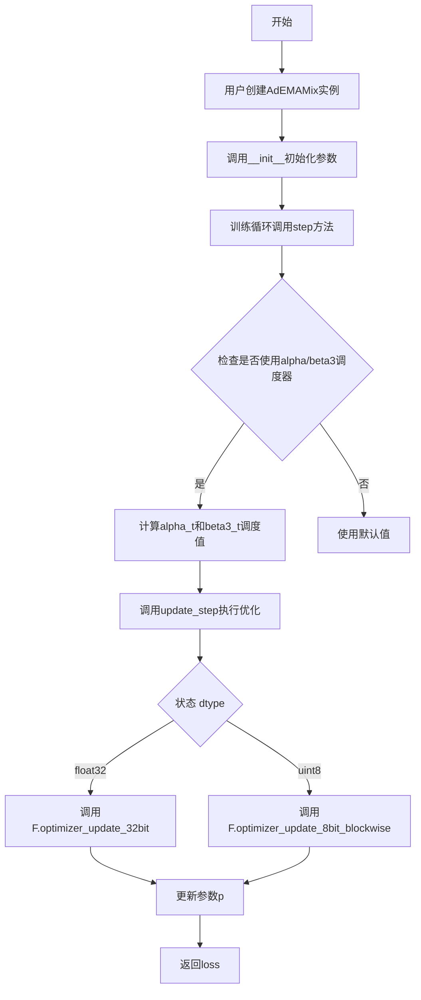
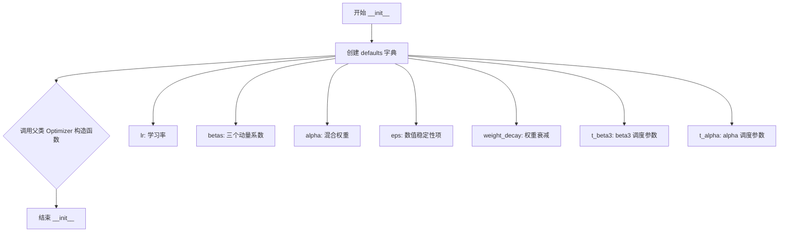
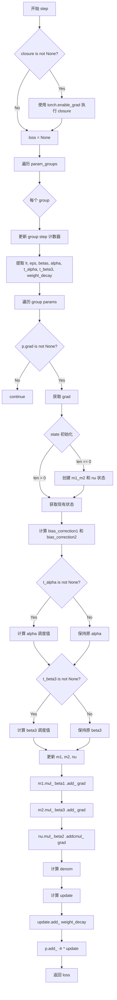
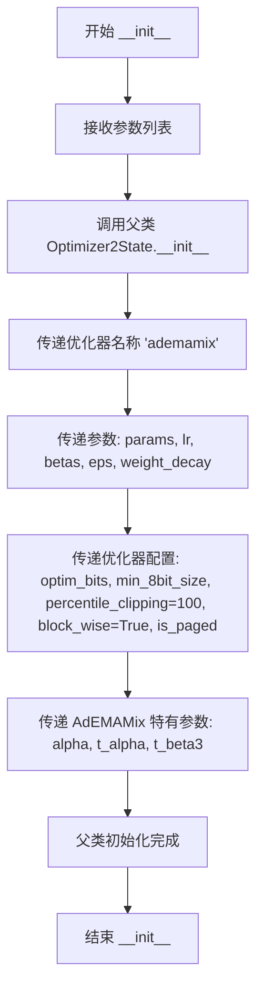
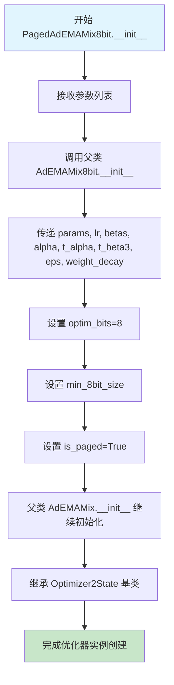
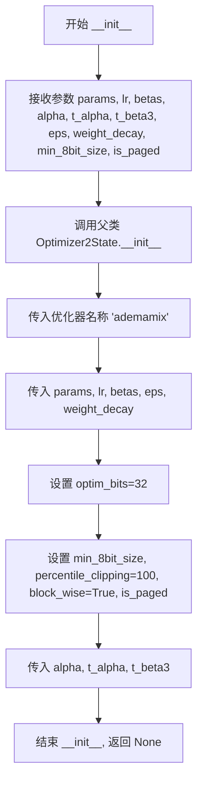
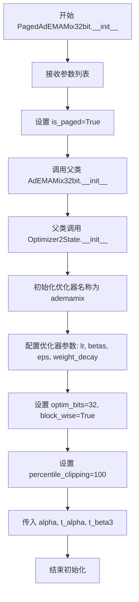
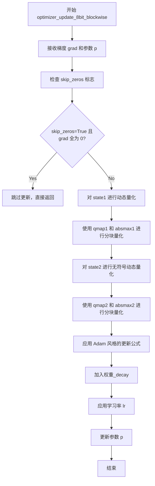
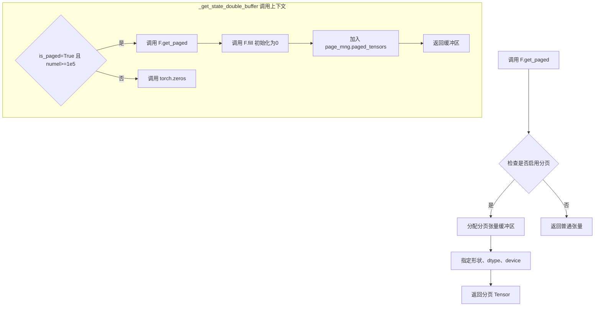
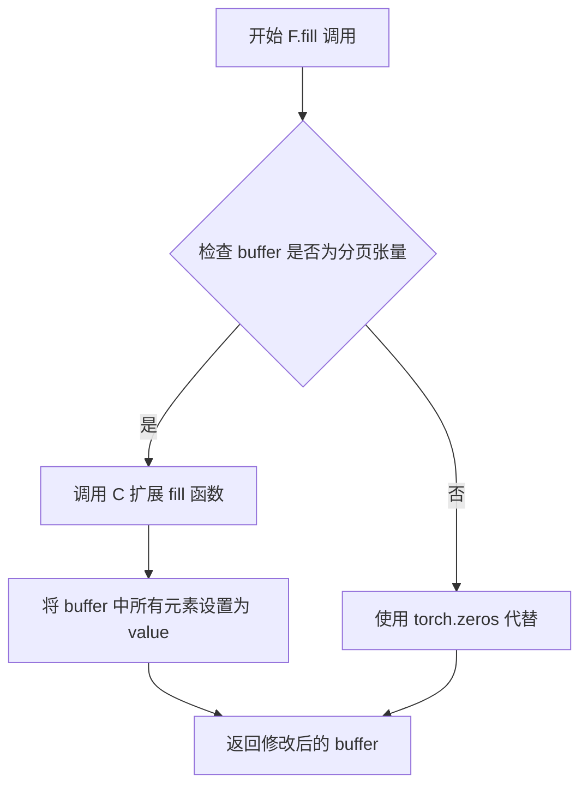

# `bitsandbytes\bitsandbytes\optim\ademamix.py` 详细设计文档

AdEMAMix优化器实现，结合多个指数移动平均(EMA)进行参数更新，支持8位/32位精度和分页内存管理，继承自bitsandbytes的Optimizer2State基类。

## 整体流程



## 类结构

```
torch.optim.Optimizer
└── _ReferenceAdEMAMix (参考实现)
Optimizer2State (bitsandbytes基类)
├── AdEMAMix (主实现)
│   ├── AdEMAMix8bit
│   │   └── PagedAdEMAMix8bit
│   └── PagedAdEMAMix
└── AdEMAMix32bit
    └── PagedAdEMAMix32bit
```

## 全局变量及字段


### `F`
    
bitsandbytes functional module providing low‑level optimized tensor operations.

类型：`module (bitsandbytes.functional)`
    


### `Optimizer2State`
    
Base optimizer class supporting 8‑bit and 32‑bit optimizer state quantization.

类型：`class (bitsandbytes.optim.optimizer.Optimizer2State)`
    


### `math`
    
Standard Python math module for logarithmic and exponential calculations.

类型：`module`
    


### `torch`
    
PyTorch core library for tensor computations and automatic differentiation.

类型：`module`
    


### `Iterable`
    
Type hint indicating an iterable object.

类型：`class (typing.Iterable)`
    


### `Literal`
    
Type hint for literal (exact) values.

类型：`class (typing.Literal)`
    


### `Optional`
    
Type hint indicating a value may be None.

类型：`class (typing.Optional)`
    


### `_ReferenceAdEMAMix.params`
    
Iterable of model parameters to be optimized.

类型：`Iterable[torch.nn.Parameter]`
    


### `_ReferenceAdEMAMix.lr`
    
Learning rate for parameter updates.

类型：`float`
    


### `_ReferenceAdEMAMix.betas`
    
Tuple of exponential decay rates for first, second and third moment estimates (beta1, beta2, beta3).

类型：`tuple[float, float, float]`
    


### `_ReferenceAdEMAMix.alpha`
    
Weight scaling factor for the slow EMA term.

类型：`float`
    


### `_ReferenceAdEMAMix.eps`
    
Small constant added to denominator for numerical stability.

类型：`float`
    


### `_ReferenceAdEMAMix.weight_decay`
    
Weight decay (L2 regularization) coefficient.

类型：`float`
    


### `_ReferenceAdEMAMix.t_beta3`
    
Number of training steps over which to linearly ramp beta3 (optional).

类型：`Optional[int]`
    


### `_ReferenceAdEMAMix.t_alpha`
    
Number of training steps over which to linearly ramp alpha (optional).

类型：`Optional[int]`
    


### `AdEMAMix.params`
    
Iterable of model parameters to be optimized.

类型：`Iterable[torch.nn.Parameter]`
    


### `AdEMAMix.lr`
    
Learning rate for parameter updates.

类型：`float`
    


### `AdEMAMix.betas`
    
Tuple of exponential decay rates for first, second and third moment estimates (beta1, beta2, beta3).

类型：`tuple[float, float, float]`
    


### `AdEMAMix.alpha`
    
Weight scaling factor for the slow EMA term.

类型：`float`
    


### `AdEMAMix.t_alpha`
    
Number of training steps over which to linearly ramp alpha (optional).

类型：`Optional[int]`
    


### `AdEMAMix.t_beta3`
    
Number of training steps over which to linearly ramp beta3 (optional).

类型：`Optional[int]`
    


### `AdEMAMix.eps`
    
Small constant added to denominator for numerical stability.

类型：`float`
    


### `AdEMAMix.weight_decay`
    
Weight decay (L2 regularization) coefficient.

类型：`float`
    


### `AdEMAMix.optim_bits`
    
Number of bits for quantization (8 or 32).

类型：`Literal[8, 32]`
    


### `AdEMAMix.min_8bit_size`
    
Minimum number of elements in a parameter tensor to enable 8‑bit quantization.

类型：`int`
    


### `AdEMAMix.is_paged`
    
Whether to use paged memory for optimizer states.

类型：`bool`
    


### `AdEMAMix8bit.params`
    
Iterable of model parameters to be optimized.

类型：`Iterable[torch.nn.Parameter]`
    


### `AdEMAMix8bit.lr`
    
Learning rate for parameter updates.

类型：`float`
    


### `AdEMAMix8bit.betas`
    
Tuple of exponential decay rates for first, second and third moment estimates (beta1, beta2, beta3).

类型：`tuple[float, float, float]`
    


### `AdEMAMix8bit.alpha`
    
Weight scaling factor for the slow EMA term.

类型：`float`
    


### `AdEMAMix8bit.t_alpha`
    
Number of training steps over which to linearly ramp alpha (optional).

类型：`Optional[int]`
    


### `AdEMAMix8bit.t_beta3`
    
Number of training steps over which to linearly ramp beta3 (optional).

类型：`Optional[int]`
    


### `AdEMAMix8bit.eps`
    
Small constant added to denominator for numerical stability.

类型：`float`
    


### `AdEMAMix8bit.weight_decay`
    
Weight decay (L2 regularization) coefficient.

类型：`float`
    


### `AdEMAMix8bit.min_8bit_size`
    
Minimum number of elements in a parameter tensor to enable 8‑bit quantization.

类型：`int`
    


### `AdEMAMix8bit.is_paged`
    
Whether to use paged memory for optimizer states.

类型：`bool`
    


### `PagedAdEMAMix8bit.params`
    
Iterable of model parameters to be optimized.

类型：`Iterable[torch.nn.Parameter]`
    


### `PagedAdEMAMix8bit.lr`
    
Learning rate for parameter updates.

类型：`float`
    


### `PagedAdEMAMix8bit.betas`
    
Tuple of exponential decay rates for first, second and third moment estimates (beta1, beta2, beta3).

类型：`tuple[float, float, float]`
    


### `PagedAdEMAMix8bit.alpha`
    
Weight scaling factor for the slow EMA term.

类型：`float`
    


### `PagedAdEMAMix8bit.t_alpha`
    
Number of training steps over which to linearly ramp alpha (optional).

类型：`Optional[int]`
    


### `PagedAdEMAMix8bit.t_beta3`
    
Number of training steps over which to linearly ramp beta3 (optional).

类型：`Optional[int]`
    


### `PagedAdEMAMix8bit.eps`
    
Small constant added to denominator for numerical stability.

类型：`float`
    


### `PagedAdEMAMix8bit.weight_decay`
    
Weight decay (L2 regularization) coefficient.

类型：`float`
    


### `PagedAdEMAMix8bit.min_8bit_size`
    
Minimum number of elements in a parameter tensor to enable 8‑bit quantization.

类型：`int`
    


### `PagedAdEMAMix.params`
    
Iterable of model parameters to be optimized.

类型：`Iterable[torch.nn.Parameter]`
    


### `PagedAdEMAMix.lr`
    
Learning rate for parameter updates.

类型：`float`
    


### `PagedAdEMAMix.betas`
    
Tuple of exponential decay rates for first, second and third moment estimates (beta1, beta2, beta3).

类型：`tuple[float, float, float]`
    


### `PagedAdEMAMix.alpha`
    
Weight scaling factor for the slow EMA term.

类型：`float`
    


### `PagedAdEMAMix.t_alpha`
    
Number of training steps over which to linearly ramp alpha (optional).

类型：`Optional[int]`
    


### `PagedAdEMAMix.t_beta3`
    
Number of training steps over which to linearly ramp beta3 (optional).

类型：`Optional[int]`
    


### `PagedAdEMAMix.eps`
    
Small constant added to denominator for numerical stability.

类型：`float`
    


### `PagedAdEMAMix.weight_decay`
    
Weight decay (L2 regularization) coefficient.

类型：`float`
    


### `PagedAdEMAMix.optim_bits`
    
Number of bits for quantization (8 or 32).

类型：`Literal[8, 32]`
    


### `PagedAdEMAMix.min_8bit_size`
    
Minimum number of elements in a parameter tensor to enable 8‑bit quantization.

类型：`int`
    


### `AdEMAMix32bit.params`
    
Iterable of model parameters to be optimized.

类型：`Iterable[torch.nn.Parameter]`
    


### `AdEMAMix32bit.lr`
    
Learning rate for parameter updates.

类型：`float`
    


### `AdEMAMix32bit.betas`
    
Tuple of exponential decay rates for first, second and third moment estimates (beta1, beta2, beta3).

类型：`tuple[float, float, float]`
    


### `AdEMAMix32bit.alpha`
    
Weight scaling factor for the slow EMA term.

类型：`float`
    


### `AdEMAMix32bit.t_alpha`
    
Number of training steps over which to linearly ramp alpha (optional).

类型：`Optional[int]`
    


### `AdEMAMix32bit.t_beta3`
    
Number of training steps over which to linearly ramp beta3 (optional).

类型：`Optional[int]`
    


### `AdEMAMix32bit.eps`
    
Small constant added to denominator for numerical stability.

类型：`float`
    


### `AdEMAMix32bit.weight_decay`
    
Weight decay (L2 regularization) coefficient.

类型：`float`
    


### `AdEMAMix32bit.min_8bit_size`
    
Minimum number of elements in a parameter tensor to enable 8‑bit quantization.

类型：`int`
    


### `AdEMAMix32bit.is_paged`
    
Whether to use paged memory for optimizer states.

类型：`bool`
    


### `PagedAdEMAMix32bit.params`
    
Iterable of model parameters to be optimized.

类型：`Iterable[torch.nn.Parameter]`
    


### `PagedAdEMAMix32bit.lr`
    
Learning rate for parameter updates.

类型：`float`
    


### `PagedAdEMAMix32bit.betas`
    
Tuple of exponential decay rates for first, second and third moment estimates (beta1, beta2, beta3).

类型：`tuple[float, float, float]`
    


### `PagedAdEMAMix32bit.alpha`
    
Weight scaling factor for the slow EMA term.

类型：`float`
    


### `PagedAdEMAMix32bit.t_alpha`
    
Number of training steps over which to linearly ramp alpha (optional).

类型：`Optional[int]`
    


### `PagedAdEMAMix32bit.t_beta3`
    
Number of training steps over which to linearly ramp beta3 (optional).

类型：`Optional[int]`
    


### `PagedAdEMAMix32bit.eps`
    
Small constant added to denominator for numerical stability.

类型：`float`
    


### `PagedAdEMAMix32bit.weight_decay`
    
Weight decay (L2 regularization) coefficient.

类型：`float`
    


### `PagedAdEMAMix32bit.min_8bit_size`
    
Minimum number of elements in a parameter tensor to enable 8‑bit quantization.

类型：`int`
    
    

## 全局函数及方法


### `_ReferenceAdEMAMix.__init__`

该方法是 `_ReferenceAdEMAMix` 优化器类的构造函数，用于初始化 AdEMAMix 优化器的参数状态，继承自 PyTorch 的 Optimizer 基类，并设置学习率、动量系数、Alpha 混合参数、epsilon 数值稳定性项、权重衰减以及可选的调度参数。

参数：

- `params`：`Iterable[torch.nn.Parameter]`（可迭代的参数对象），需要优化的模型参数
- `lr`：`float`（学习率），控制参数更新的步长，默认值为 `1e-3`
- `betas`：`tuple[float, float, float]`（动量系数元组），包含三个 Beta 参数 (beta1, beta2, beta3)，分别用于一阶矩估计、二阶矩估计和慢速 EMA，默认值为 `(0.9, 0.999, 0.9999)`
- `alpha`：`float`（混合权重），用于平衡快速和慢速 EMA 更新的权重，默认值为 `5.0`
- `eps`：`float`（epsilon 数值稳定性项），防止除零错误，默认值为 `1e-8`
- `weight_decay`：`float`（权重衰减系数），L2 正则化强度，默认值为 `1e-2`
- `t_beta3`：`Optional[int]`（beta3 调度步数），如果设置则启用 beta3 的调度机制，默认值为 `None`
- `t_alpha`：`Optional[int]`（alpha 调度步数），如果设置则启用 alpha 的调度机制，默认值为 `None`

返回值：`None`（构造函数无返回值）

#### 流程图



#### 带注释源码

```python
def __init__(
    self,
    params: Iterable[torch.nn.Parameter],  # 需要优化的参数迭代器
    lr: float = 1e-3,  # 学习率，控制参数更新的步长大小
    betas: tuple[float, float, float] = (0.9, 0.999, 0.9999),  # 三个动量系数：beta1用于快速EMA, beta2用于二阶矩估计, beta3用于慢速EMA
    alpha: float = 5.0,  # 混合系数，控制慢速EMA对更新的贡献程度
    eps: float = 1e-8,  # 数值稳定性常数，防止除零错误
    weight_decay: float = 1e-2,  # 权重衰减系数（L2正则化），默认使用0.01
    t_beta3: Optional[int] = None,  # beta3的调度总步数，用于动态调整beta3
    t_alpha: Optional[int] = None,  # alpha的调度总步数，用于动态调整alpha
):
    # 创建包含所有优化器超参数的字典，这些值将作为每组参数的默认值
    defaults = dict(
        lr=lr,
        betas=betas,
        alpha=alpha,
        eps=eps,
        weight_decay=weight_decay,
        t_beta3=t_beta3,
        t_alpha=t_alpha
    )

    # 调用 PyTorch Optimizer 基类的构造函数
    # params: 可迭代的参数集合
    # defaults: 包含默认超参数的字典，会被传递给每个参数组
    super().__init__(params, defaults)
```


### `_ReferenceAdEMAMix.step`

这是AdEMAMix优化器的参考实现方法，执行单步参数更新。该方法实现了一个结合两个EMA（指数移动平均）的优化器，包括fast EMA (m1)、slow EMA (m2)和二阶矩估计(nu)，支持学习率调度和权重衰减。

参数：

- `closure`：`Optional[Callable]`，可选的闭包函数，用于在单次迭代中重新计算损失（通常用于GAN训练等需要判别器的场景）

返回值：`Optional[torch.Tensor]`，如果提供了闭包则返回损失值，否则返回None

#### 流程图



#### 带注释源码

```python
@torch.no_grad()
def step(self, closure=None):
    """
    执行单步优化器更新
    
    参数:
        closure: 可选的闭包函数，用于计算损失。如果提供，闭包应该返回标量张量。
                 闭包内部应该执行前向传播、计算损失，并且需要 torch.enable_grad()
                 来确保梯度计算被启用。
    
    返回:
        如果提供了闭包则返回闭包的返回值（损失），否则返回 None
    """
    # 初始化损失为 None
    loss = None

    # 如果提供了闭包，执行闭包计算损失
    # 这通常用于需要多次前向传播的场景（如GAN训练）
    if closure is not None:
        with torch.enable_grad():
            loss = closure()

    # 遍历所有参数组
    for group in self.param_groups:
        # 更新或初始化全局 step 计数器
        # step 用于偏置校正和学习率调度
        if "step" in group:
            group["step"] += 1
        else:
            group["step"] = 1

        # 从参数组中提取超参数
        lr = group["lr"]                          # 学习率
        eps = group["eps"]                        # 防止除零的小常数
        beta1, beta2, beta3 = group["betas"]      # EMA 衰减系数
        alpha = group["alpha"]                    # slow EMA 权重系数
        t_alpha = group["t_alpha"]                # alpha 调度的时间步
        t_beta3 = group["t_beta3"]                # beta3 调度的时间步
        weight_decay = group["weight_decay"]     # L2 正则化系数

        # 遍历当前参数组中的所有参数
        for p in group["params"]:
            # 跳过没有梯度的参数（如某些冻结层）
            if p.grad is None:
                continue

            # 获取当前参数的梯度
            grad = p.grad
            
            # 获取或初始化优化器状态
            state = self.state[p]

            # 状态初始化：首次遇到参数时执行
            if len(state) == 0:
                # 创建组合的 fast/slow EMA 状态
                # m1_m2[0] = m1 (fast EMA)
                # m1_m2[1] = m2 (slow EMA)
                state["m1_m2"] = p.new_zeros((2, *p.size()))
                
                # nu: 二阶矩估计，用于自适应学习率（类似 Adam 的 v）
                state["nu"] = torch.zeros_like(p)

            # 从状态中提取 EMA 变量
            m1, m2, nu = state["m1_m2"][0], state["m1_m2"][1], state["nu"]

            # 计算偏置校正因子
            # 用于修正 EMA 初始化时从零开始带来的偏差
            bias_correction1 = 1 - beta1 ** group["step"]
            bias_correction2 = 1 - beta2 ** group["step"]

            # 应用 alpha 调度器（如果配置了 t_alpha）
            # 随着训练进行，逐渐增加 alpha（slow EMA 的贡献）
            if t_alpha is not None:
                alpha = min(group["step"] * alpha / t_alpha, alpha)

            # 应用 beta3 调度器（如果配置了 t_beta3）
            # beta3 从初始值逐渐过渡到 beta1，实现 fast -> slow EMA 的平滑过渡
            if t_beta3 is not None:
                ln_beta1 = math.log(beta1)
                ln_beta3 = math.log(beta3)
                step_scale = group["step"] / t_beta3
                # 几何平均插值
                beta3 = min(
                    math.exp(
                        (ln_beta1 * ln_beta3) / 
                        (((1 - step_scale) * ln_beta3) + (step_scale * ln_beta1))
                    ),
                    beta3,
                )

            # 更新 EMA 状态
            # m1: fast EMA，使用 beta1
            m1.mul_(beta1).add_(grad, alpha=1 - beta1)
            
            # m2: slow EMA，使用 beta3（调度后的值）
            m2.mul_(beta3).add_(grad, alpha=1 - beta3)
            
            # nu: 二阶矩估计，使用 beta2
            nu.mul_(beta2).addcmul_(grad, grad, value=1 - beta2)

            # 计算更新分母（自适应学习率）
            # 类似于 Adam: sqrt(v) / sqrt(bias_correction2) + eps
            denom = (nu.sqrt() / (bias_correction2**0.5)).add(eps)
            
            # 计算参数更新
            # 结合 fast EMA (m1) 和加权 slow EMA (m2)
            update = (m1.div(bias_correction1) + alpha * m2) / denom

            # 添加权重衰减（L2 正则化）
            update.add_(p, alpha=weight_decay)

            # 应用参数更新（学习率缩放）
            p.add_(-lr * update)

    # 返回损失值（如果有闭包）
    return loss
```


### `AdEMAMix.__init__`

这是 AdEMAMix 优化器的构造函数，负责初始化优化器的各项参数，并将配置传递给父类 `Optimizer2State` 进行底层状态的初始化。

参数：

- `params`：`Iterable[torch.nn.Parameter]`，需要优化的参数迭代器
- `lr`：`float`，学习率，默认 1e-3
- `betas`：`tuple[float, float, float]`，动量系数元组 (beta1, beta2, beta3)，默认 (0.9, 0.999, 0.9999)
- `alpha`：`float`，慢速 EMA 的权重系数，默认 5.0
- `t_alpha`：`Optional[int]`，alpha 调度器的周期参数，用于在训练过程中动态调整 alpha 值
- `t_beta3`：`Optional[int]`，beta3 调度器的周期参数，用于在训练过程中动态调整 beta3 值
- `eps`：`float`，防止除零的 epsilon 值，默认 1e-8
- `weight_decay`：`float`，权重衰减系数，默认 1e-2
- `optim_bits`：`Literal[8, 32]`，优化器状态精度位数，32 表示全精度，8 表示 8 位量化，默认 32
- `min_8bit_size`：`int`，使用 8 位优化的最小参数数量阈值，默认 4096
- `is_paged`：`bool`，是否使用分页内存管理技术，默认 False

返回值：`None`，构造函数无返回值，通过修改对象内部状态完成初始化

#### 流程图



#### 带注释源码

```python
def __init__(
    self,
    params: Iterable[torch.nn.Parameter],          # 需要优化的模型参数迭代器
    lr: float = 1e-3,                               # 学习率，控制参数更新步长
    betas: tuple[float, float, float] = (0.9, 0.999, 0.9999),  # (beta1, beta2, beta3) 动量系数
    alpha: float = 5.0,                             # 慢速 EMA 的权重系数
    t_alpha: Optional[int] = None,                  # alpha 调度器的周期，用于动态调整 alpha
    t_beta3: Optional[int] = None,                  # beta3 调度器的周期，用于动态调整 beta3
    eps: float = 1e-8,                              # 防止除零的小常数
    weight_decay: float = 1e-2,                     # 权重衰减系数（L2 正则化）
    optim_bits: Literal[8, 32] = 32,                # 优化器状态精度：8位量化或32位全精度
    min_8bit_size: int = 4096,                      # 使用8位优化的最小参数数量阈值
    is_paged: bool = False,                         # 是否使用分页内存管理
):
    # 调用父类 Optimizer2State 的初始化方法
    super().__init__(
        "ademamix",          # 优化器名称标识符
        params=params,       # 传递待优化参数
        lr=lr,               # 传递学习率
        betas=betas,         # 传递动量系数
        eps=eps,             # 传递 epsilon
        weight_decay=weight_decay,  # 传递权重衰减
        optim_bits=optim_bits,     # 传递优化器精度位数
        args=None,           # 额外参数（此处为 None）
        min_8bit_size=min_8bit_size,  # 传递 8 位优化最小尺寸
        percentile_clipping=100,      # 百分位裁剪（固定值 100）
        block_wise=True,             # 启用块级操作
        is_paged=is_paged,           # 传递分页标志
        alpha=alpha,       # 传递慢速 EMA 权重
        t_alpha=t_alpha,   # 传递 alpha 调度周期
        t_beta3=t_beta3,   # 传递 beta3 调度周期
    )
```


### `AdEMAMix.init_state`

该方法用于初始化 AdEMAMix 优化器中单个参数的状态，包括分配用于存储动量估计的缓冲区，并根据优化器位宽配置（8位或32位）设置相应的数据结构。

参数：

- `group`：`dict`，参数组配置，包含学习率、beta值、alpha等超参数
- `p`：`torch.nn.Parameter`，需要初始化状态的模型参数张量
- `gindex`：`int`，参数组索引，用于获取对应的配置
- `pindex`：`int`，参数在参数组中的索引，用于获取对应的配置

返回值：`None`，该方法直接在参数的状态字典中修改状态，不返回任何值

#### 流程图

```mermaid
flowchart TD
    A[开始 init_state] --> B[获取配置 config]
    B --> C{optim_bits == 32?}
    C -->|是| D[设置 dtype = torch.float32]
    C -->|否| E{optim_bits == 8?}
    E -->|是| F[继续判断]
    E -->|否| G[抛出 NotImplementedError]
    F --> H{p.numel() < min_8bit_size?}
    H -->|是| D
    H -->|否| I[保持 dtype]
    D --> J[初始化 state['step'] = 0]
    I --> J
    J --> K{dtype == uint8?}
    K -->|是| L[填充并复制 qmap 到设备]
    K -->|否| M[跳过 8-bit 特定初始化]
    L --> N[创建 absmax1 和 absmax2 缓冲区]
    M --> O[创建 state1 双缓冲区和 state2 缓冲区]
    N --> O
    O --> P[结束]
```

#### 带注释源码

```python
@torch.no_grad()
def init_state(self, group, p, gindex, pindex):
    # AdEMAMix 实现中，使用 state 来保存快慢 EMA 统计量。
    # 这里覆盖基类 Optimizer2State 来分配两倍大小的缓冲区。
    # 额外说明：不支持 block_wise=False、percentile clipping 或 max_unorm。

    # 获取当前参数组和参数索引对应的配置
    config = self.get_config(gindex, pindex, group)

    # 根据优化器位宽确定数据类型
    if config["optim_bits"] == 32:
        dtype = torch.float32  # 32位浮点优化器
    elif config["optim_bits"] == 8:
        dtype = torch.uint8     # 8位量化优化器
    else:
        # 不支持的位宽则抛出异常
        raise NotImplementedError(f"Amount of optimizer bits not supported: {config['optim_bits']}")

    # 如果参数元素数量小于最小8位阈值，强制使用32位
    if p.numel() < config["min_8bit_size"]:
        dtype = torch.float32

    # 获取参数的状态字典
    state = self.state[p]
    # 初始化训练步数
    state["step"] = 0

    # 8位优化器的特殊初始化
    if dtype == torch.uint8:
        # 确保动态量化映射已创建
        if "dynamic" not in self.name2qmap:
            self.fill_qmap()
        # 将量化映射复制到参数所在设备
        self.name2qmap["dynamic"] = state["qmap1"] = self.name2qmap["dynamic"].to(p.device)
        self.name2qmap["udynamic"] = state["qmap2"] = self.name2qmap["udynamic"].to(p.device)

        # 设置块大小和块数量
        blocksize = 256
        n = p.numel()
        blocks = (n // blocksize) + bool(n % blocksize)

        # 分配 absmax 缓冲区用于块级量化
        # absmax1 用于两个 EMA 状态，absmax2 用于动量
        state["absmax1"] = torch.zeros((2, blocks), dtype=torch.float32, device=p.device)
        state["absmax2"] = torch.zeros((blocks,), dtype=torch.float32, device=p.device)

    # 分配状态缓冲区
    # state1: 存储两个 EMA 状态（m1 和 m2）的双缓冲
    state["state1"] = self._get_state_double_buffer(p, dtype=dtype)
    # state2: 存储二阶动量估计（nu）
    state["state2"] = self.get_state_buffer(p, dtype=dtype)
```


### `AdEMAMix.update_step`

该方法是 AdEMAMix 优化器的核心更新步骤，用于执行单个参数张量的梯度更新。它首先检查是否配置了 alpha 或 beta3 的学习率调度器，若无则回退到父类实现；若有，则根据当前训练步骤动态计算调度后的 alpha_t 和 beta3_t 参数，并根据参数状态的数据类型（32位浮点或8位量化）调用 bitsandbytes 库中相应的底层优化器更新函数完成参数更新。

参数：

- `group`：`dict`，优化器参数组配置字典，包含 lr、betas、eps、weight_decay、alpha、t_alpha、t_beta3 等优化器超参数
- `p`：`torch.nn.Parameter`，待更新的模型参数张量
- `gindex`：`int`，参数组的索引，用于获取对应的配置
- `pindex`：`int`，参数在参数组内的索引，用于获取对应的配置

返回值：`None`，该方法直接原地更新参数 `p`，不返回任何值

#### 流程图

```mermaid
flowchart TD
    A[开始 update_step] --> B{config中 t_alpha 或 t_beta3 存在?}
    B -->|否| C[调用父类 Optimizer2State.update_step]
    C --> D[直接返回]
    B -->|是| E[确保 p.data 和 p.grad 为连续内存]
    E --> F[获取 state 和 grad]
    F --> G[state['step'] += 1]
    G --> H[提取 betas, alpha, t_alpha, t_beta3]
    H --> I{是否有 t_alpha?}
    I -->|是| J[计算 alpha_t = min(step * alpha / t_alpha, alpha)]
    I -->|否| K[alpha_t = alpha]
    J --> L{是否有 t_beta3?}
    K --> L
    L -->|是| M[计算 beta3_t 的对数调度公式]
    L -->|否| N[beta3_t = beta3]
    M --> O{state['state1'].dtype == torch.float32?}
    N --> O
    O -->|是| P[调用 F.optimizer_update_32bit<br/>传入 beta3_t, alpha_t 等参数]
    O -->|否| Q[调用 F.optimizer_update_8bit_blockwise<br/>传入 beta3_t, alpha_t 等参数]
    P --> R[结束]
    Q --> R
```

#### 带注释源码

```python
@torch.no_grad()
def update_step(self, group, p, gindex, pindex):
    """
    执行单个参数张量的 AdEMAMix 优化器更新步骤。
    
    参数:
        group: 优化器参数组配置字典
        p: 待更新的模型参数
        gindex: 参数组索引
        pindex: 参数在组内的索引
    """
    # 获取当前参数组和参数的配置信息
    config = self.get_config(gindex, pindex, group)

    # 如果没有配置 alpha 和 beta3 的调度器，则使用父类的默认实现
    if not config["t_alpha"] and not config["t_beta3"]:
        # Not using alpha/beta3 scheduler; we can fall through.
        super().update_step(group, p, gindex, pindex)
        return

    # 确保参数和梯度数据在内存中连续存储，以提高访问效率
    # 这是 bitsandbytes 库对输入数据的内部要求
    p.data = p.data.contiguous()
    p.grad = p.grad.contiguous()

    # 获取优化器状态和梯度
    state = self.state[p]
    grad = p.grad

    # 更新训练步骤计数
    state["step"] += 1
    step = state["step"]

    # 从配置中提取优化器超参数
    beta1, beta2, beta3 = config["betas"]      # 三个 EMA 衰减系数
    alpha = config["alpha"]                    # 慢速 EMA 的权重系数
    t_alpha = config["t_alpha"]                # alpha 调度的时间步长
    t_beta3 = config["t_beta3"]                # beta3 调度的时间步长

    # ----------------------- alpha 调度器 -----------------------
    # 根据训练步骤逐渐增加 alpha 值，从 0 增长到预设的 alpha 上限
    # 调度公式: alpha_t = min(step * alpha / t_alpha, alpha)
    if t_alpha:
        alpha_t = min(step * alpha / t_alpha, alpha)
    else:
        alpha_t = alpha

    # ----------------------- beta3 调度器 -----------------------
    # 使用对数插值方法在 beta1 和 beta3 之间进行调度
    # 使得 beta3 随训练进程逐渐接近 beta1，改善后期收敛性能
    if t_beta3:
        ln_beta1 = math.log(beta1)
        ln_beta3 = math.log(beta3)
        step_scale = step / t_beta3
        # 对数空间线性插值公式: exp((ln_b1 * ln_b3) / ((1-s)*ln_b3 + s*ln_b1))
        beta3_t = min(
            math.exp((ln_beta1 * ln_beta3) / (((1 - step_scale) * ln_beta3) + (step_scale * ln_beta1))), beta3
        )
    else:
        beta3_t = beta3

    # ----------------------- 根据精度选择更新路径 -----------------------
    # 根据状态缓冲区的数据类型选择 32 位或 8 位优化器更新实现
    
    if state["state1"].dtype == torch.float32:
        # 32 位浮点精度更新路径
        # 使用 F.optimizer_update_32bit 进行参数更新
        F.optimizer_update_32bit(
            self.optimizer_name,    # 优化器名称 "ademamix"
            grad,                    # 梯度张量
            p,                       # 参数张量
            state["state1"],         # 状态缓冲区1（包含 m1, m2 的组合）
            beta1,                   # 快速 EMA 衰减系数
            config["eps"],           # 数值稳定性常数
            step,                    # 当前训练步骤
            config["lr"],            # 学习率
            state["state2"],         # 状态缓冲区2（包含二阶矩估计 nu）
            beta2,                   # 二阶矩衰减系数
            beta3_t,                 # 调度后的慢速 EMA 衰减系数
            alpha_t,                 # 调度后的慢速 EMA 权重系数
            config["weight_decay"], # 权重衰减系数
            gnorm_scale=1.0,         # 梯度范数缩放因子
            # 最大范数约束相关参数（如果启用）
            unorm_vec=state["unorm_vec"] if config["max_unorm"] > 0.0 else None,
            max_unorm=config["max_unorm"],
            skip_zeros=config["skip_zeros"],
        )
    elif state["state1"].dtype == torch.uint8:
        # 8 位量化精度更新路径
        # 使用分块量化方式执行更新以节省显存
        F.optimizer_update_8bit_blockwise(
            self.optimizer_name,    # 优化器名称
            grad,                    # 梯度张量
            p,                       # 参数张量
            state["state1"],         # 量化状态缓冲区1
            state["state2"],         # 量化状态缓冲区2
            config["betas"][0],      # beta1
            config["betas"][1],      # beta2
            beta3_t,                 # 调度后的 beta3
            alpha_t,                 # 调度后的 alpha
            config["eps"],           # 数值稳定性常数
            step,                    # 当前训练步骤
            config["lr"],            # 学习率
            state["qmap1"],          # 量化映射表1
            state["qmap2"],          # 量化映射表2
            state["absmax1"],        # 分块绝对最大值缓冲区1
            state["absmax2"],        # 分块绝对最大值缓冲区2
            config["weight_decay"], # 权重衰减系数
            gnorm_scale=1.0,         # 梯度范数缩放
            skip_zeros=config["skip_zeros"],
        )
```


### `AdEMAMix._get_state_double_buffer`

该方法用于获取或创建一个双缓冲状态张量，专门用于存储 AdEMAMix 优化器中的快速和慢速 EMA（指数移动平均）状态。它根据是否启用分页内存（paged memory）以及参数张量的大小来决定分配普通张量还是分页张量。

参数：

- `p`：`torch.nn.Parameter` 或 `torch.Tensor`，需要为其分配状态缓冲区的模型参数
- `dtype`：`torch.dtype`，可选，默认值为 `torch.float32`，指定状态缓冲区的数据类型（可以是 float32 或 uint8）

返回值：`torch.Tensor`，返回分配的状态缓冲区张量，形状为 `(2, *p.size())`，其中第一维用于存储两个 EMA 状态

#### 流程图

```mermaid
flowchart TD
    A[_get_state_double_buffer 开始] --> B{检查条件:
    not self.is_paged or
    p.numel() < 1e5?}
    
    B -->|True| C[创建普通零张量]
    C --> D[torch.zeros<br/>形状: (2, *p.size())<br/>dtype: 指定dtype<br/>device: p.device]
    D --> E[返回张量]
    
    B -->|False| F[创建分页缓冲区]
    F --> G[F.get_paged<br/>形状: (2, *p.size())<br/>dtype: 指定dtype<br/>device: p.device]
    G --> H[F.fill 填充零值]
    H --> I[将缓冲区添加到<br/>self.page_mng.paged_tensors]
    I --> E
    
    E --> Z[结束]
```

#### 带注释源码

```python
def _get_state_double_buffer(self, p, dtype=torch.float32):
    """
    获取或创建一个双缓冲状态张量，用于存储 EMA 状态。
    
    该方法根据以下条件决定内存分配策略：
    1. 如果未启用分页内存(is_paged=False)，直接创建普通张量
    2. 如果启用了分页内存，但参数元素数量小于1e5，也创建普通张量
    3. 只有在启用分页且参数足够大时，才使用分页内存管理
    
    参数:
        p: torch.nn.Parameter - 需要分配状态缓冲区的模型参数
        dtype: torch.dtype - 状态缓冲区数据类型，默认为 float32
    
    返回:
        torch.Tensor - 形状为 (2, *p.size()) 的状态缓冲区
    """
    # 条件1 & 2: 非分页模式或参数规模较小(<1e5)时
    # 使用普通的 torch.zeros 创建连续内存的零张量
    if not self.is_paged or p.numel() < 1e5:
        # 创建形状为 (2, *p.size()) 的零张量
        # 2 表示两个 EMA 状态（快速和慢速）
        return torch.zeros((2, *p.size()), dtype=dtype, device=p.device)
    else:
        # 条件3: 分页模式且参数规模较大(>=1e5)时
        # 使用 bitsandbytes 的分页内存管理
        
        # 从分页内存池获取缓冲区
        buff = F.get_paged(*(2, *p.size()), dtype=dtype, device=p.device)
        
        # 将缓冲区填充为零（分页内存可能包含未初始化数据）
        F.fill(buff, 0)
        
        # 跟踪分页张量以便在需要时进行内存释放
        self.page_mng.paged_tensors.append(buff)
        
        return buff
```


### `AdEMAMix8bit.__init__`

该方法是 `AdEMAMix8bit` 类的构造函数，用于初始化一个支持8位优化的AdEMAMix优化器实例。它继承自 `AdEMAMix` 类，并通过调用父类构造函数设置优化器参数，同时将 `optim_bits` 固定为8以启用8位优化。

参数：

- `params`：`Iterable[torch.nn.Parameter]`，待优化的参数迭代器
- `lr`：`float`，学习率，默认值为 1e-3
- `betas`：`tuple[float, float, float]`，动量系数元组 (beta1, beta2, beta3)，默认值为 (0.9, 0.999, 0.9999)
- `alpha`：`float`，AdEMAMix中的alpha参数，控制慢速EMA的权重，默认值为 5.0
- `t_alpha`：`Optional[int]`，alpha参数的时间调度器周期，默认值为 None
- `t_beta3`：`Optional[int]`，beta3参数的时间调度器周期，默认值为 None
- `eps`：`float`，防止除零的 epsilon 值，默认值为 1e-8
- `weight_decay`：`float`，权重衰减系数，默认值为 1e-2
- `min_8bit_size`：`int`，使用8位优化的最小参数大小阈值，默认值为 4096
- `is_paged`：`bool`，是否使用分页内存管理，默认值为 False

返回值：`None`，该方法为构造函数，不返回任何值

#### 流程图

```mermaid
flowchart TD
    A[开始 __init__] --> B[接收参数]
    B --> C[调用 super().__init__]
    C --> D[传入 optim_bits=8]
    D --> E[调用 AdEMAMix 构造函数]
    E --> F[设置优化器名称为 ademamix]
    E --> G[配置参数组]
    E --> H[设置优化位数为8位]
    E --> I[启用块级别优化 block_wise=True]
    E --> J[结束]
```

#### 带注释源码

```python
class AdEMAMix8bit(AdEMAMix):
    def __init__(
        self,
        params: Iterable[torch.nn.Parameter],
        lr: float = 1e-3,
        betas: tuple[float, float, float] = (0.9, 0.999, 0.9999),
        alpha: float = 5.0,
        t_alpha: Optional[int] = None,
        t_beta3: Optional[int] = None,
        eps: float = 1e-8,
        weight_decay: float = 1e-2,
        min_8bit_size: int = 4096,
        is_paged: bool = False,
    ):
        """
        构造函数初始化8位AdEMAMix优化器
        
        参数:
            params: 待优化的神经网络参数迭代器
            lr: 学习率，控制参数更新步长
            betas: 三个动量系数 (beta1一阶矩, beta2二阶矩, beta3慢速EMA)
            alpha: 控制慢速EMA贡献的缩放因子
            t_alpha: alpha参数的时间调度周期，用于动态调整alpha
            t_beta3: beta3参数的时间调度周期，用于动态调整beta3
            eps: 数值稳定性参数，防止除零错误
            weight_decay: L2正则化系数，用于防止过拟合
            min_8bit_size: 小于此大小的参数将使用32位优化
            is_paged: 是否使用分页内存管理，适用于大模型
        """
        # 调用父类AdEMAMix的构造函数，传入optim_bits=8强制使用8位优化
        super().__init__(
            params,
            lr=lr,
            betas=betas,
            alpha=alpha,
            t_alpha=t_alpha,
            t_beta3=t_beta3,
            eps=eps,
            weight_decay=weight_decay,
            optim_bits=8,           # 关键参数：强制使用8位优化
            min_8bit_size=min_8bit_size,
            is_paged=is_paged,
        )
```


### `PagedAdEMAMix8bit.__init__`

该方法是分页8位AdEMAMix优化器的构造函数，继承自`AdEMAMix8bit`类，主要用于初始化优化器的各项超参数（如学习率、beta系数、alpha参数、时间步长等），并将分页标志`is_paged`设置为`True`以启用分页内存管理功能，从而支持大模型参数的高效优化。

参数：

- `params`：`Iterable[torch.nn.Parameter]`，待优化的参数迭代器，通常为模型的参数列表
- `lr`：`float`，学习率，默认为`1e-3`，控制参数更新的步长
- `betas`：`tuple[float, float, float]`，Adam优化器的动量系数元组，默认为`(0.9, 0.999, 0.9999)`，分别对应beta1、beta2和beta3
- `alpha`：`float`，AdEMA中的慢速EMA权重系数，默认为`5.0`，用于平衡快速和慢速指数移动平均的贡献
- `t_alpha`：`Optional[int]`，alpha参数的时间调度周期，默认为`None`，当设置后alpha会随训练步数线性增长至最大值
- `t_beta3`：`Optional[int]`，beta3参数的时间调度周期，默认为`None`，用于动态调整慢速EMA的衰减速率
- `eps`：`float`，用于数值稳定的常数，默认为`1e-8`，防止除零错误
- `weight_decay`：`float`，权重衰减系数，默认为`1e-2`，用于L2正则化防止过拟合
- `min_8bit_size`：`int`，使用8位优化的最小参数大小，默认为`4096`，小于此规模的参数将使用32位优化

返回值：`None`，构造函数不返回值，仅完成对象初始化

#### 流程图



#### 带注释源码

```
def __init__(
    self,
    params: Iterable[torch.nn.Parameter],
    lr: float = 1e-3,
    betas: tuple[float, float, float] = (0.9, 0.999, 0.9999),
    alpha: float = 5.0,
    t_alpha: Optional[int] = None,
    t_beta3: Optional[int] = None,
    eps: float = 1e-8,
    weight_decay: float = 1e-2,
    min_8bit_size: int = 4096,
):
    """
    PagedAdEMAMix8bit 优化器构造函数
    
    参数:
        params: 待优化的模型参数迭代器
        lr: 学习率，默认1e-3
        betas: 动量系数 (beta1, beta2, beta3)，默认(0.9, 0.999, 0.9999)
        alpha: 慢速EMA权重系数，默认5.0
        t_alpha: alpha参数的时间调度周期
        t_beta3: beta3参数的时间调度周期
        eps: 数值稳定常数，默认1e-8
        weight_decay: 权重衰减系数，默认1e-2
        min_8bit_size: 使用8位优化的最小参数大小，默认4096
    """
    # 调用父类 AdEMAMix8bit 的构造函数
    super().__init__(
        params,              # 待优化的参数列表
        lr=lr,               # 学习率
        betas=betas,         # Beta系数元组
        alpha=alpha,         # Alpha系数
        t_alpha=t_alpha,     # Alpha时间调度
        t_beta3=t_beta3,    # Beta3时间调度
        eps=eps,             # 数值稳定常数
        weight_decay=weight_decay,  # 权重衰减
        optim_bits=8,       # 强制使用8位优化
        min_8bit_size=min_8bit_size,  # 最小8位优化阈值
        is_paged=True,      # 启用分页内存管理（关键特性）
    )
```


### `PagedAdEMAMix.__init__`

该方法是分页AdEMAMix优化器的构造函数，继承自AdEMAMix类，用于初始化具有分页内存管理功能的Adam-EMA混合优化器，支持8位和32位优化器状态，通过父类AdEMAMix的初始化配置学习率、动量参数、权重衰减等优化超参数，并将is_paged标志设置为True以启用分页内存管理。

参数：

- `params`：`Iterable[torch.nn.Parameter]` ，要优化的参数可迭代对象
- `lr`：`float`，学习率，默认值为1e-3
- `betas`：`tuple[float, float, float]`，动量参数tuple(beta1, beta2, beta3)，默认值为(0.9, 0.999, 0.9999)
- `alpha`：`float`，EMA混合系数，默认值为5.0
- `t_alpha`：`Optional[int]`，alpha调度器的可选阈值参数，用于控制alpha随时间的变化
- `t_beta3`：`Optional[int]`，beta3调度器的可选阈值参数，用于控制beta3随时间的变化
- `eps`：`float`，防止除零的 epsilon 值，默认值为1e-8
- `weight_decay`：`float`，权重衰减系数，默认值为1e-2
- `optim_bits`：`Literal[8, 32]`，优化器位数选项，支持8位或32位，默认值为32
- `min_8bit_size`：`int`，使用8位优化的最小参数大小阈值，默认值为4096

返回值：`None`，该方法为构造函数，不返回任何值

#### 流程图

```mermaid
flowchart TD
    A[开始 PagedAdEMAMix.__init__] --> B[接收参数列表]
    B --> C[调用 super().__init__ 传递所有参数]
    C --> D[设置 is_paged=True 启用分页内存管理]
    D --> E[继承 AdEMAMix 初始化逻辑]
    E --> F[配置优化器基本参数]
    F --> G[根据 optim_bits 设置优化器精度]
    G --> H[配置分页内存管理相关参数]
    H --> I[初始化完成, 返回 None]
```

#### 带注释源码

```python
class PagedAdEMAMix(AdEMAMix):
    """
    分页版本的 AdEMAMix 优化器，继承自 AdEMAMix 类
    通过将 is_paged 参数设置为 True 启用分页内存管理功能
    用于在内存受限环境中高效管理优化器状态
    """
    
    def __init__(
        self,
        params: Iterable[torch.nn.Parameter],
        lr: float = 1e-3,
        betas: tuple[float, float, float] = (0.9, 0.999, 0.9999),
        alpha: float = 5.0,
        t_alpha: Optional[int] = None,
        t_beta3: Optional[int] = None,
        eps: float = 1e-8,
        weight_decay: float = 1e-2,
        optim_bits: Literal[8, 32] = 32,
        min_8bit_size: int = 4096,
    ):
        """
        初始化 PagedAdEMAMix 优化器
        
        参数:
            params: 要优化的参数可迭代对象（通常为模型参数）
            lr: 学习率，控制参数更新步长，默认1e-3
            betas: 三个beta参数tuple (beta1, beta2, beta3)
                   - beta1: 一阶矩估计的指数衰减率
                   - beta2: 二阶矩估计的指数衰减率  
                   - beta3: 慢速EMA的指数衰减率
            alpha: EMA混合系数，控制快速和慢速EMA的混合比例，默认5.0
            t_alpha: alpha调度器的阈值，用于动态调整alpha值
            t_beta3: beta3调度器的阈值，用于动态调整beta3值
            eps: 防止除零的小常数，默认1e-8
            weight_decay: 权重衰减系数，用于L2正则化，默认1e-2
            optim_bits: 优化器精度位数，8或32位，默认32位
            min_8bit_size: 使用8位优化的最小参数数量阈值，默认4096
        """
        # 调用父类 AdEMAMix 的初始化方法
        # 传递所有优化器参数，并将 is_paged 设置为 True
        super().__init__(
            params,
            lr=lr,
            betas=betas,
            alpha=alpha,
            t_alpha=t_alpha,
            t_beta3=t_beta3,
            eps=eps,
            weight_decay=weight_decay,
            optim_bits=optim_bits,
            min_8bit_size=min_8bit_size,
            is_paged=True,  # 关键参数：启用分页内存管理
        )
```


### `AdEMAMix32bit.__init__`

这是 `AdEMAMix32bit` 类的构造函数，用于初始化一个32位精度的 AdEMAMix 优化器实例。该类继承自 `Optimizer2State`，是 bitsandbytes 库中实现的自适应动量估计优化器（AdEMAMix）的 32 位版本，支持学习率、动量系数、alpha 参数、时间调度器参数等配置。

参数：

- `params`：`Iterable[torch.nn.Parameter]`，待优化的参数迭代器
- `lr`：`float`，学习率，默认值为 1e-3
- `betas`：`tuple[float, float, float]`，动量系数元组，包含 (beta1, beta2, beta3)，默认值为 (0.9, 0.999, 0.9999)
- `alpha`：`float`，AdEMAMix 中的慢速 EMA 权重系数，默认值为 5.0
- `t_alpha`：`Optional[int]`，alpha 参数的时间调度器阈值步数，默认值为 None
- `t_beta3`：`Optional[int]`，beta3 参数的时间调度器阈值步数，默认值为 None
- `eps`：`float`，用于数值稳定的 epsilon 值，默认值为 1e-8
- `weight_decay`：`float`，权重衰减系数，默认值为 1e-2
- `min_8bit_size`：`int`，启用 8 位优化的最小参数大小阈值，默认值为 4096
- `is_paged`：`bool`，是否使用分页内存管理，默认值为 False

返回值：`None`，构造函数不返回值，仅初始化对象状态

#### 流程图



#### 带注释源码

```python
class AdEMAMix32bit(Optimizer2State):
    def __init__(
        self,
        params: Iterable[torch.nn.Parameter],  # 待优化的参数迭代器
        lr: float = 1e-3,  # 学习率，控制参数更新步长
        betas: tuple[float, float, float] = (0.9, 0.999, 0.9999),  # (beta1, beta2, beta3) 动量系数
        alpha: float = 5.0,  # 慢速 EMA 权重系数，控制 m2 的贡献程度
        t_alpha: Optional[int] = None,  # alpha 参数的时间调度器阈值步数
        t_beta3: Optional[int] = None,  # beta3 参数的时间调度器阈值步数
        eps: float = 1e-8,  # 数值稳定性参数，防止除零
        weight_decay: float = 1e-2,  # 权重衰减系数，用于 L2 正则化
        min_8bit_size: int = 4096,  # 最小参数大小阈值，小于此值则强制使用 32 位
        is_paged: bool = False,  # 是否使用分页内存管理，适用于大模型
    ):
        # 调用父类 Optimizer2State 的初始化方法
        # 传入优化器配置参数，设置 32 位精度模式
        super().__init__(
            "ademamix",  # 优化器名称标识符
            params=params,  # 待优化参数
            lr=lr,  # 学习率
            betas=betas,  # 动量系数
            eps=eps,  # 数值稳定性参数
            weight_decay=weight_decay,  # 权重衰减
            optim_bits=32,  # 强制使用 32 位精度
            args=None,  # 额外的自定义参数占位符
            min_8bit_size=min_8bit_size,  # 8 位优化最小阈值
            percentile_clipping=100,  # 百分位裁剪参数（此处固定为 100）
            block_wise=True,  # 启用分块更新策略
            is_paged=is_paged,  # 分页内存管理标志
            alpha=alpha,  # 慢速 EMA 权重系数
            t_alpha=t_alpha,  # alpha 调度器阈值
            t_beta3=t_beta3,  # beta3 调度器阈值
        )
```


### `PagedAdEMAMix32bit.__init__`

PagedAdEMAMix32bit.__init__ 是一个优化器类的构造函数，用于初始化一个支持分页内存管理的32位 AdEMAMix 优化器实例。该优化器继承自 AdEMAMix32bit，结合了快速和慢速指数移动平均（EMA）技术，并支持通过分页机制优化大模型训练的内存使用。

参数：

- `params`：`Iterable[torch.nn.Parameter]`，待优化的参数迭代器，通常为模型的参数列表
- `lr`：`float`，学习率，默认值为 1e-3，控制参数更新的步长
- `betas`：`tuple[float, float, float]`，动量系数元组，包含 (beta1, beta2, beta3)，默认值为 (0.9, 0.999, 0.9999)，分别用于一阶矩、二阶矩和三阶矩估计
- `alpha`：`float`，快慢 EMA 混合权重，默认值为 5.0，用于平衡快速和慢速 EMA 的贡献
- `t_alpha`：`Optional[int]`，alpha 参数的时间步长调度器阈值，默认值为 None，表示不使用 alpha 调度
- `t_beta3`：`Optional[int]`，beta3 参数的时间步长调度器阈值，默认值为 None，表示不使用 beta3 调度
- `eps`：`float`，防止除零的常数，默认值为 1e-8
- `weight_decay`：`float`，权重衰减系数，默认值为 1e-2，用于 L2 正则化
- `min_8bit_size`：`int`，使用 8 位优化的最小参数大小阈值，默认值为 4096

返回值：`None`，构造函数无返回值，直接初始化对象状态

#### 流程图



#### 带注释源码

```python
class PagedAdEMAMix32bit(AdEMAMix32bit):
    """
    Paged 版本的 AdEMAMix32bit 优化器，使用分页内存管理来优化大模型训练。
    该类继承自 AdEMAMAMix32bit，主要区别在于将 is_paged 参数固定为 True。
    """

    def __init__(
        self,
        params: Iterable[torch.nn.Parameter],
        lr: float = 1e-3,
        betas: tuple[float, float, float] = (0.9, 0.999, 0.9999),
        alpha: float = 5.0,
        t_alpha: Optional[int] = None,
        t_beta3: Optional[int] = None,
        eps: float = 1e-8,
        weight_decay: float = 1e-2,
        min_8bit_size: int = 4096,
    ):
        """
        初始化 PagedAdEMAMix32bit 优化器实例。

        参数:
            params: 待优化的模型参数迭代器
            lr: 学习率，默认 1e-3
            betas: 动量系数 (beta1, beta2, beta3)，默认 (0.9, 0.999, 0.9999)
            alpha: 快慢 EMA 混合权重，默认 5.0
            t_alpha: alpha 调度的时间步长阈值，可选
            t_beta3: beta3 调度的时间步长阈值，可选
            eps: 防止除零的 epsilon 值，默认 1e-8
            weight_decay: 权重衰减系数，默认 1e-2
            min_8bit_size: 触发 8 位优化的最小参数数量，默认 4096
        """
        # 调用父类 AdEMAMAMix32bit 的初始化方法
        # 并将 is_paged 固定设置为 True，启用分页内存管理
        super().__init__(
            params,              # 模型参数
            lr=lr,               # 学习率
            betas=betas,         # 动量系数
            alpha=alpha,         # EMA 混合权重
            t_alpha=t_alpha,     # alpha 调度阈值
            t_beta3=t_beta3,     # beta3 调度阈值
            eps=eps,             # epsilon
            weight_decay=weight_decay,  # 权重衰减
            min_8bit_size=min_8bit_size, # 8位优化阈值
            is_paged=True,       # 关键：启用分页内存管理
        )
```


### `F.optimizer_update_32bit`

外部C扩展函数，bitsandbytes库的核心优化器更新操作，实现32位精度下的AdEMAMix优化器参数更新逻辑，包含动量估计、二阶矩估计、学习率调度、梯度裁剪和权重衰减等完整优化步骤。

参数：

- `optimizer_name`：`str`，优化器名称标识（"ademamix"）
- `grad`：`torch.Tensor`，当前参数的梯度张量
- `p`：`torch.Tensor`，待更新的参数张量
- `state1`：`torch.Tensor`，一阶矩（动量）状态缓冲区
- `beta1`：`float`，一阶矩（动量）的指数衰减率
- `eps`：`float`，用于数值稳定性的epsilon项
- `step`：`int`，当前优化步骤数
- `lr`：`float`，学习率
- `state2`：`torch.Tensor`，二阶矩（方差）状态缓冲区
- `beta2`：`float`，二阶矩的指数衰减率
- `beta3_t`：`float`，慢速EMA的当前衰减率（经调度后）
- `alpha_t`：`float`，慢速EMA的当前权重系数（经调度后）
- `weight_decay`：`float`，权重衰减系数
- `gnorm_scale`：`float`，梯度范数缩放因子（默认1.0）
- `unorm_vec`：`Optional[torch.Tensor]`，用于梯度裁剪的向量范数（当max_unorm > 0时）
- `max_unorm`：`float`，最大梯度范数阈值（0表示不裁剪）
- `skip_zeros`：`bool`，是否跳过零值梯度

返回值：`None`，该函数直接原地修改参数和状态缓冲区，无返回值

#### 流程图

```mermaid
graph TD
    A[开始 optimizer_update_32bit] --> B[获取optimizer_name标识]
    B --> C[读取输入参数和状态]
    C --> D{检查max_unorm > 0?}
    D -->|Yes| E[应用梯度裁剪: unorm_vec]
    D -->|No| F[跳过梯度裁剪]
    E --> G[计算动量更新: m1 = beta1 * m1 + (1-beta1) * grad]
    F --> G
    G --> H[计算慢速EMA更新: m2 = beta3 * m2 + (1-beta3) * grad]
    H --> I[计算二阶矩更新: nu = beta2 * nu + (1-beta2) * grad²]
    I --> J[应用偏置校正]
    J --> K[计算更新量: update = (m1/bias1 + alpha_t * m2) / sqrt(nu/bias2) + eps]
    K --> L[应用权重衰减: update + weight_decay * p]
    L --> M[应用学习率: p = p - lr * update]
    M --> N[结束]
```

#### 带注释源码

```python
# 注意：这是从调用点提取的函数签名和上下文，源代码为C扩展不可见
# 调用位置：bitsandbytes/optim/ademamix.py 的 AdEMAMix.update_step 方法

# 函数调用示例：
F.optimizer_update_32bit(
    self.optimizer_name,        # "ademamix" - 优化器名称
    grad,                        # 当前梯度 torch.Tensor
    p,                           # 参数张量 torch.Tensor
    state["state1"],             # 一阶矩状态 (2, *p.size()) torch.float32
    beta1,                       # 一阶矩衰减率 e.g. 0.9
    config["eps"],               # 数值稳定性 epsilon e.g. 1e-8
    step,                        # 当前步数 int
    config["lr"],                # 学习率 e.g. 1e-3
    state["state2"],             # 二阶矩状态 torch.Tensor
    beta2,                       # 二阶矩衰减率 e.g. 0.999
    beta3_t,                     # 慢速EMA当前衰减率（调度后）
    alpha_t,                     # 慢速EMA当前权重（调度后）
    config["weight_decay"],      # 权重衰减 e.g. 1e-2
    gnorm_scale=1.0,             # 梯度范数缩放
    unorm_vec=state["unorm_vec"] if config["max_unorm"] > 0.0 else None,  # 裁剪向量
    max_unorm=config["max_unorm"],  # 最大梯度范数
    skip_zeros=config["skip_zeros"]  # 是否跳过零梯度
)

# 内部实现逻辑推断（基于AdEMAMix算法）：
# 1. 更新快速EMA: m1 = beta1 * m1 + (1 - beta1) * grad
# 2. 更新慢速EMA: m2 = beta3_t * m2 + (1 - beta3_t) * grad  
# 3. 更新二阶矩: nu = beta2 * nu + (1 - beta2) * grad^2
# 4. 偏置校正: m1_corr = m1 / (1 - beta1^step), nu_corr = nu / (1 - beta2^step)
# 5. 计算更新: update = (m1_corr + alpha_t * m2) / (sqrt(nu_corr) + eps)
# 6. 权重衰减: update = update + weight_decay * p
# 7. 应用学习率: p = p - lr * update
```


### `F.optimizer_update_8bit_blockwise`

这是一个来自 bitsandbytes 库的外部 C 扩展函数，用于执行 8 位分块优化器更新操作。该函数结合了动态量化技术，通过分块处理的方式对模型参数进行高效的 8 位量化更新，是 AdEMAMix 优化器在 8 位模式下的核心计算内核。

参数：

- `optimizer_name`：`str`，优化器名称字符串，用于标识当前使用的优化器算法
- `grad`：`torch.Tensor`，当前参数的梯度张量
- `p`：`torch.Tensor`，待更新的模型参数张量
- `state1`：`torch.Tensor`，一阶矩估计（m1）的状态缓冲区，用于存储动量
- `state2`：`torch.Tensor`，二阶矩估计（nu）的状态缓冲区，用于存储自适应学习率因子
- `beta1`：`float`，一阶矩估计的指数衰减率，控制动量的更新速度
- `beta2`：`float`，二阶矩估计的指数衰减率，控制二阶动量的更新速度
- `beta3_t`：`float`，第三时刻的指数衰减率（调度后的值），用于慢速 EMA 更新
- `alpha_t`：`float`，慢速 EMA 的权重系数（调度后的值），控制慢速 EMA 的贡献程度
- `eps`：`float`，用于数值稳定性的 epsilon 常量，防止除零错误
- `step`：`int`，当前优化步骤计数，用于学习率预热和偏差修正
- `lr`：`float`，学习率，控制参数更新的步长
- `qmap1`：`dict`，动态量化映射表，用于将浮点数映射到 8 位无符号整数
- `qmap2`：`dict`，无符号动态量化映射表，用于处理负数值
- `absmax1`：`torch.Tensor`，分块绝对最大值缓冲区（2×blocks），用于量化状态1
- `absmax2`：`torch.Tensor`，分块绝对最大值缓冲区（blocks），用于量化状态2
- `weight_decay`：`float`，权重衰减系数，用于 L2 正则化
- `gnorm_scale`：`float`，梯度范数缩放因子，用于梯度裁剪
- `skip_zeros`：`bool`，是否跳过零值梯度更新，True 表示跳过，False 表示正常处理

返回值：`None`，该函数直接修改输入的张量（`p`、`state1`、`state2` 等），不返回任何值

#### 流程图



#### 带注释源码

```python
# 注意：这是基于 Python 调用方的推断代码
# 实际的 C 扩展实现位于 bitsandbytes 库中

def optimizer_update_8bit_blockwise(
    optimizer_name: str,          # 优化器名称标识符
    grad: torch.Tensor,           # 输入梯度张量
    p: torch.Tensor,              # 待更新的参数张量
    state1: torch.Tensor,         # 一阶矩状态缓冲区（量化后为 uint8）
    state2: torch.Tensor,         # 二阶矩状态缓冲区（量化后为 uint8）
    beta1: float,                 # 一阶矩衰减率
    beta2: float,                 # 二阶矩衰减率
    beta3_t: float,               # 第三时刻衰减率（时间调度后）
    alpha_t: float,               # alpha 权重（时间调度后）
    eps: float,                   # 数值稳定性常量
    step: int,                    # 当前优化步骤
    lr: float,                    # 学习率
    qmap1: dict,                  # 动态量化映射表（用于 state1）
    qmap2: dict,                  # 无符号动态量化映射表（用于 state2）
    absmax1: torch.Tensor,        # state1 的分块绝对最大值
    absmax2: torch.Tensor,        # state2 的分块绝对最大值
    weight_decay: float,          # 权重衰减系数
    gnorm_scale: float = 1.0,     # 梯度范数缩放因子
    skip_zeros: bool = False,     # 是否跳过零值梯度
):
    """
    外部 C 扩展函数：执行 8 位分块优化器更新
    
    该函数实现了以下核心逻辑：
    1. 对 state1 和 state2 进行 8 位动态量化
    2. 使用 Adam 风格的更新公式结合 beta3 和 alpha（慢速 EMA）
    3. 应用权重衰减和学习率
    4. 直接在 GPU 上执行以获得最佳性能
    """
    # 实际的 C 实现代码不可见
    # 此处为函数签名的文档说明
    pass
```


### `F.get_paged`

该函数是 bitsandbytes 库中的一个外部 C 扩展函数，用于分配分页（paged）内存缓冲区。在 AdEMAMix 优化器中，当启用分页且参数规模足够大时，使用此函数来分配具有特定形状和数据类型的分页张量缓冲区，用于存储优化器状态。

参数：

- `*shape`: `int`（可变长度参数），张量的形状维度，例如 `(2, *p.size())` 表示创建形状为 (2, param_size) 的张量
- `dtype`: `torch.dtype`，创建张量的数据类型（如 `torch.float32` 或 `torch.uint8`）
- `device`: `torch.device`，分配张量的目标设备（CPU 或 CUDA 设备）

返回值：`torch.Tensor`，返回新分配的分页张量缓冲区

#### 流程图



#### 带注释源码

```python
# 在 _get_state_double_buffer 方法中的调用
def _get_state_double_buffer(self, p, dtype=torch.float32):
    """
    获取用于存储双缓冲优化器状态的张量。
    当启用分页且参数规模足够大时，使用 F.get_paged 分配分页内存。
    
    参数:
        p: torch.nn.Parameter - 优化器的参数张量
        dtype: torch.dtype - 数据类型，默认为 torch.float32
        
    返回:
        torch.Tensor - 优化器状态缓冲区（分页或普通张量）
    """
    # 检查是否启用分页模式且参数规模 >= 100000
    if not self.is_paged or p.numel() < 1e5:
        # 条件不满足：返回普通连续内存的零张量
        return torch.zeros((2, *p.size()), dtype=dtype, device=p.device)
    else:
        # 条件满足：使用 F.get_paged 分配分页内存缓冲区
        # *shape: 可变参数，传递张量形状 (2, *p.size())
        # dtype: 指定数据类型 (float32 或 uint8)
        # device: 指定分配设备
        buff = F.get_paged(*(2, *p.size()), dtype=dtype, device=p.device)
        
        # 使用 F.fill 将缓冲区填充为 0
        F.fill(buff, 0)
        
        # 将分配的分页张量添加到页面管理器跟踪列表中
        self.page_mng.paged_tensors.append(buff)
        
        # 返回初始化后的分页缓冲区
        return buff
```


### `F.fill`

`F.fill` 是 `bitsandbytes.functional` 模块中的外部 C 扩展函数，用于将张量中的所有元素填充为指定的值。在 AdEMAMix 优化器中，该函数用于初始化分页内存缓冲区，将通过 `F.get_paged` 分配的分页张量填充为 0，以确保在使用前内存处于已初始化状态。

参数：

- `buffer`：`torch.Tensor`，要填充的张量，即通过 `F.get_paged` 分配的分页张量缓冲区
- `value`：标量（int/float），要填充的数值，在当前代码中传递的是 `0`，用于清零缓冲区

返回值：`None`，该函数为原地操作（in-place），直接修改传入的张量，不返回新张量

#### 流程图



#### 带注释源码

```
# F.fill 是 bitsandbytes.functional 模块中的外部 C 扩展函数
# 该函数的具体实现位于 C/C++ 扩展中，此处为调用方代码

# 在 AdEMAMix._get_state_double_buffer 方法中的使用：
else:
    # 获取分页张量缓冲区
    buff = F.get_paged(*(2, *p.size()), dtype=dtype, device=p.device)
    
    # 使用 F.fill 将缓冲区填充为 0
    # 参数1: buffer - 要填充的张量
    # 参数2: value - 填充值（此处为 0）
    F.fill(buff, 0)
    
    # 将分页张量添加到页面管理器以便追踪
    self.page_mng.paged_tensors.append(buff)
    
    # 返回填充后的缓冲区
    return buff

# 函数签名（推断自使用方式）：
# def fill(buffer: torch.Tensor, value: Union[int, float]) -> None:
#     """
#     将张量中的所有元素填充为指定值
#     
#     Args:
#         buffer: 要填充的 torch 张量
#         value: 填充的标量值
#     """
```

## 关键组件


### AdEMAMixOptimizer

核心的优化器类，继承自Optimizer2State，实现了AdEMAMix算法（结合快速和慢速指数移动平均），支持8位和32位量化优化，以及分页内存管理。

### _ReferenceAdEMAMix

纯PyTorch实现的参考版本，作为正确性基准，展示了AdEMAMix算法的核心逻辑，包括双EMA更新、alpha和beta3调度器、以及权重衰减。

### 双EMA机制 (m1, m2)

使用两个指数移动平均（快速m1和慢速m2）来加速训练，其中m1使用beta1更新，m2使用beta3更新，通过alpha参数混合两个梯度估计。

### Alpha调度器

实现学习率调度，根据训练步数动态调整alpha参数，使快速EMA的贡献在训练过程中逐渐增加。

### Beta3调度器

通过对数插值实现beta3的自适应调整，确保慢速EMA的时间尺度在训练过程中平滑变化。

### 8位量化支持

通过`init_state`和`update_step`方法支持uint8量化，使用动态量化映射（qmap）、absmax统计量和分块处理来减少内存占用。

### 分页内存管理

通过`PagedAdEMAMix`和相关类实现分页内存管理，使用`get_paged`分配器和page_mng跟踪分页张量，适用于大模型训练场景。

### Optimizer2State基类

bitsandbytes的基类，提供通用的优化器状态管理、量化配置处理和内存优化功能，AdEMAMix继承并扩展了这些能力。

### 状态缓冲区管理

使用`state1`和`state2`双缓冲区存储优化器状态，其中state1存储合并的m1_m2张量，state2存储二阶矩估计nu。

### 权重衰减应用

在计算更新后应用L2权重衰减，通过`update.add_(p, alpha=weight_decay)`将权重衰减合并到梯度更新中。


## 问题及建议


### 已知问题

- **类层次设计冗余**：`AdEMAMix8bit` 和 `AdEMAMix32bit` 继承自 `AdEMAMix`，但 `AdEMAMix` 本身已通过 `optim_bits` 参数支持 8/32 位切换，导致类继承关系冗余，增加了维护成本。
- **分页类重复实现**：`PagedAdEMAMix`、`PagedAdEMAMix8bit`、`PagedAdEMAMix32bit` 三个类仅通过设置 `is_paged=True` 区别于父类，可通过工厂函数或参数简化。
- **硬编码阈值无说明**：`_get_state_double_buffer` 中 `p.numel() < 1e5` 的阈值未提供注释说明其选择依据，且魔法数字难以维护。
- **缺少运行时参数校验**：类型注解 `Literal[8, 32]` 和 `tuple[float, float, float]` 仅在静态检查时有效，运行时未校验参数合法性，传入无效值可能导致隐蔽错误。
- **重复代码逻辑**：alpha 和 beta3 调度逻辑在 `_ReferenceAdEMAMix.step` 和 `AdEMAMix.update_step` 中几乎完全相同，未提取为共享函数。
- **不必要的内存操作**：`update_step` 中每次都执行 `p.data = p.data.contiguous()` 和 `p.grad = p.grad.contiguous()`，即使数据已连续也会触发拷贝，应先检查 `is_contiguous()`。
- **状态初始化分支不完整**：`init_state` 中仅处理 `uint8` 和 `float32`，若未来支持其他 dtype 可能遗漏处理。
- **update_step 缺失默认分支**：`state["state1"].dtype` 既非 `float32` 也非 `uint8` 时无显式错误处理，仅依赖后续操作失败。
- **缺失文档字符串**：多数类（如 `AdEMAMix8bit`、`PagedAdEMAMix` 等）无文档注释，新开发者难以理解设计意图。

### 优化建议

- 考虑使用工厂函数或配置对象替代多层继承，例如 `AdEMAMix(..., optim_bits=8, is_paged=True)` 直接生成所需实例。
- 将调度逻辑提取为独立函数（如 `_compute_alpha_schedule`、`_compute_beta3_schedule`），在两个实现中复用。
- 添加运行时参数校验函数，验证 `betas` 取值范围、，`optim_bits` 是否合法，并给出明确错误信息。
- 在调用 `.contiguous()` 前检查 `is_contiguous()`，避免不必要的内存拷贝。
- 为关键阈值（如 `1e5`、`4096`）定义具名常量，并添加注释说明其来源或实验依据。
- 完善所有类的文档字符串，说明各参数的用途、默认值及注意事项。
- 在 `update_step` 中对未支持的 dtype 添加显式 `raise ValueError` 提示，增强鲁棒性。

## 其它


### 设计目标与约束

本代码实现AdEMAMix优化器（基于论文https://hf.co/papers/2409.03137），通过结合快速EMA（m1）和慢速EMA（m2）来改善传统Adam优化器的收敛性能。支持8位和32位优化模式，支持分页内存管理。约束：不支持block_wise=False、percentile clipping（固定为100）、max_unorm（固定为0.0）。

### 错误处理与异常设计

代码中的错误处理主要体现在init_state方法中，当optim_bits不为8或32时抛出NotImplementedError。其他参数校验依赖PyTorch和bitsandbytes的底层实现。潜在异常：梯度为None时跳过参数更新；8位优化时参数数量小于min_8bit_size会自动切换为32位。

### 数据流与状态机

优化器状态机包含三个阶段：初始化（init_state）→ 更新（update_step）→ 参数应用。状态存储：state["m1_m2"]存储快速和慢速EMA（形状为2×param_size），state["nu"]存储二阶矩估计。数据流：grad → EMA更新（m1/m2/nu）→ 计算更新方向 → 权重衰减 → 学习率缩放 → 参数更新。

### 外部依赖与接口契约

核心依赖包括：torch（PyTorch张量操作）、torch.optim.Optimizer（优化器基类）、bitsandbytes.functional（F模块，提供optimizer_update_32bit和optimizer_update_8bit_blockwise函数）、bitsandbytes.optim.optimizer.Optimizer2State（提供8位优化状态管理）。接口契约：参数必须为Iterable[nn.Parameter]，支持梯度为None的参数（跳过更新）。

### 内存管理与分页策略

内存管理通过_get_state_double_buffer实现：对于小参数（numel < 1e5）或非分页模式，直接分配连续张量；对于大参数使用分页内存（F.get_paged），由page_mng管理生命周期。8位优化额外分配absmax、qmap等辅助张量进行动态量化。

### 调度器设计

Alpha调度：当t_alpha不为None时，alpha_t = min(step * alpha / t_alpha, alpha)，实现线性增长后饱和。Beta3调度：使用对数域插值公式实现beta3从beta1向beta3的平滑过渡，实现论文中的自适应衰减策略。

### 版本兼容性与平台支持

依赖PyTorch 1.8+和bitsandbytes 0.41+。8位优化仅支持CUDA设备。要求参数设备一致（p.device用于所有状态张量分配）。

    