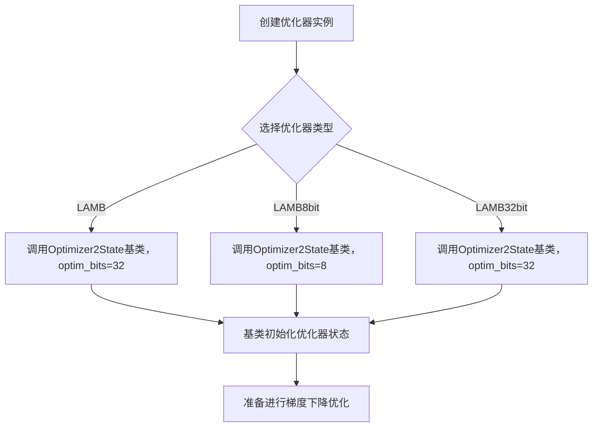
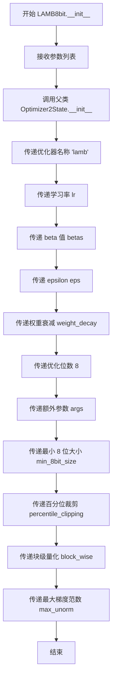
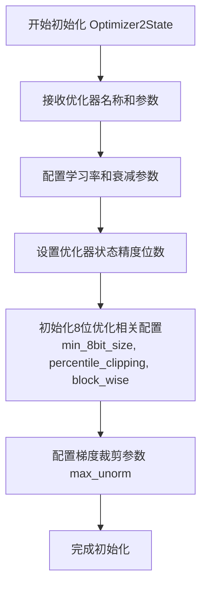

# `bitsandbytes\bitsandbytes\optim\lamb.py` 详细设计文档

该文件实现了LAMB（Layer-wise Adaptive Moments optimizer for Batch training）优化器的三个变体：标准LAMB、8位LAMB（LAMB8bit）和32位LAMB（LAMB32bit），均继承自Optimizer2State基类，提供基于层的自适应学习率调整和梯度裁剪功能，支持8位和32位优化器状态存储。

## 整体流程



## 类结构

```
Optimizer2State (抽象基类/父类)
├── LAMB (标准LAMB优化器)
├── LAMB8bit (8位量化LAMB优化器)
└── LAMB32bit (32位LAMB优化器)
```

## 全局变量及字段


### `Optimizer2State`
    
基础优化器状态类，提供优化器的核心功能和状态管理

类型：`class`
    


### `LAMB.LAMB`
    
LAMB优化器类，继承自Optimizer2State，支持32位优化

类型：`class`
    


### `LAMB8bit.LAMB8bit`
    
8位LAMB优化器类，继承自Optimizer2State，提供内存优化的LAMB实现

类型：`class`
    


### `LAMB32bit.LAMB32bit`
    
32位LAMB优化器类，继承自Optimizer2State，提供标准精度的LAMB实现

类型：`class`
    
    

## 全局函数及方法


### LAMB.__init__

LAMB（Layer-wise Adaptive Moments optimizer for Batch training）优化器的初始化方法，继承自Optimizer2State类，用于配置LAMB优化器的各种超参数并将参数传递给父类进行状态初始化。

参数：

- `params`：`torch.tensor`，要优化的输入参数
- `lr`：`float`，默认为 1e-3，学习率
- `bias_correction`：`bool`，默认为 True，是否对一阶和二阶矩应用偏置校正
- `betas`：`tuple(float, float)`，默认为 (0.9, 0.999)，一阶和二阶矩的衰减率
- `eps`：`float`，默认为 1e-8，防止优化器中除零的epsilon值
- `weight_decay`：`float`，默认为 0，权重衰减值
- `amsgrad`：`bool`，默认为 False，是否使用AMSGrad变体
- `adam_w_mode`：`bool`，默认为 True，是否使用AdamW变体
- `optim_bits`：`int`，默认为 32，优化器状态的位数
- `args`：`object`，默认为 None，包含附加参数的对象
- `min_8bit_size`：`int`，默认为 4096，8位优化所需的参数张量元素的最小数量
- `percentile_clipping`：`int`，默认为 100，通过跟踪最后100个梯度范数来自动调整裁剪阈值
- `block_wise`：`bool`，默认为 False，是否独立量化每个张量块以减少异常值影响和提高稳定性
- `max_unorm`：`float`，默认为 1.0，最大梯度范数

返回值：`None`，初始化方法不返回值，仅初始化对象状态

#### 流程图

```mermaid
flowchart TD
    A[开始 LAMB.__init__] --> B[接收优化器参数]
    B --> C[调用 super().__init__]
    C --> D[传递优化器名称 'lamb']
    D --> E[传递 params, lr, betas, eps, weight_decay]
    E --> F[传递 optim_bits=32, args, min_8bit_size]
    F --> G[传递 percentile_clipping, block_wise, max_unorm]
    G --> H[父类 Optimizer2State 初始化完成]
    H --> I[结束]
```

#### 带注释源码

```python
def __init__(
    self,
    params,                  # torch.tensor: 要优化的模型参数
    lr=1e-3,                 # float: 学习率，默认1e-3
    bias_correction=True,   # bool: 是否进行偏置校正，默认True
    betas=(0.9, 0.999),     # tuple: 一阶和二阶矩的衰减率
    eps=1e-8,               # float: 防止除零的epsilon值
    weight_decay=0,         # float: 权重衰减系数
    amsgrad=False,          # bool: 是否使用AMSGrad变体
    adam_w_mode=True,       # bool: 是否使用AdamW模式
    optim_bits=32,          # int: 优化器状态位数，32位或8位
    args=None,              # object: 附加参数对象
    min_8bit_size=4096,     # int: 8位优化的最小张量大小
    percentile_clipping=100,# int: 百分位裁剪阈值
    block_wise=False,       # bool: 是否按块量化
    max_unorm=1.0,          # float: 最大梯度范数
):
    """
    Base LAMB optimizer.

    Arguments:
        params (`torch.tensor`):
            The input parameters to optimize.
        lr (`float`, defaults to 1e-3):
            The learning rate.
        bias_correction (`bool`, defaults to `True`):
            Whether to apply bias correction to the first and second-order moments.
        betas (`tuple(float, float)`, defaults to (0.9, 0.999)):
            The beta values are the decay rates of the first and second-order moment of the optimizer.
        eps (`float`, defaults to 1e-8):
            The epsilon value prevents division by zero in the optimizer.
        weight_decay (`float`, defaults to 1e-2):
            The weight decay value for the optimizer.
        amsgrad (`bool`, defaults to `False`):
            Whether to use the AMSGrad variant of Adam that uses the maximum of past squared gradients instead.
        adam_w_mode (`bool`, defaults to `True`):
            Whether to use the AdamW variant.
        optim_bits (`int`, defaults to 32):
            The number of bits of the optimizer state.
        args (`object`, defaults to `None`):
            An object with additional arguments.
        min_8bit_size (`int`, defaults to 4096):
            The minimum number of elements of the parameter tensors for 8-bit optimization.
        percentile_clipping (`int`, defaults to 100):
            Adapts clipping threshold automatically by tracking the last 100 gradient norms and clipping the gradient at a certain percentile to improve stability.
        block_wise (`bool`, defaults to `True`):
            Whether to independently quantize each block of tensors to reduce outlier effects and improve stability.
        max_unorm (`float`, defaults to 1.0):
            The maximum gradient norm.
    """
    # 调用父类Optimizer2State的初始化方法
    # 传递'lamb'作为优化器名称，并传递所有配置参数
    super().__init__(
        "lamb",              # str: 优化器名称标识
        params,              # torch.tensor: 要优化的参数
        lr,                  # float: 学习率
        betas,               # tuple: beta值
        eps,                 # float: epsilon值
        weight_decay,        # float: 权重衰减
        optim_bits,          # int: 优化器位数（32位）
        args,                # object: 附加参数
        min_8bit_size,       # int: 最小8位大小
        percentile_clipping, # int: 百分位裁剪
        block_wise,          # bool: 块方式
        max_unorm=1.0,       # float: 最大无范数
    )
```


### `LAMB8bit.__init__`

该方法是 8 位 LAMB 优化器的初始化方法，继承自 Optimizer2State 基类，用于配置学习率、权重衰减、beta 值、8 位量化参数等优化器超参数，并通过调用父类构造函数完成优化器状态的初始化。

参数：

- `params`：`torch.tensor`，要优化的输入参数
- `lr`：`float`，学习率，默认值为 1e-3
- `bias_correction`：`bool`，是否对一二阶矩进行偏差校正，默认值为 True
- `betas`：`tuple(float, float)`，一二阶矩的衰减率，默认值为 (0.9, 0.999)
- `eps`：`float`，防止除零的 epsilon 值，默认值为 1e-8
- `weight_decay`：`float`，权重衰减系数，默认值为 0
- `amsgrad`：`bool`，是否使用 AMSGrad 变体，默认值为 False
- `adam_w_mode`：`bool`，是否使用 AdamW 变体，默认值为 True
- `args`：`object`，包含额外参数的对象，默认值为 None
- `min_8bit_size`：`int`，8 位优化的参数张量元素最小数量，默认值为 4096
- `percentile_clipping`：`int`，梯度范数百分位裁剪阈值，默认值为 100
- `block_wise`：`bool`，是否独立量化每个张量块，默认值为 True
- `max_unorm`：`float`，最大梯度范数，默认值为 1.0

返回值：`None`，无返回值（构造函数）

#### 流程图



#### 带注释源码

```python
class LAMB8bit(Optimizer2State):
    def __init__(
        self,
        params,                      # torch.tensor: 要优化的输入参数
        lr=1e-3,                     # float: 学习率
        bias_correction=True,        # bool: 是否进行偏差校正
        betas=(0.9, 0.999),          # tuple: 一二阶矩衰减率
        eps=1e-8,                    # float: 防止除零的 epsilon
        weight_decay=0,              # float: 权重衰减系数
        amsgrad=False,               # bool: 是否使用 AMSGrad
        adam_w_mode=True,            # bool: 是否使用 AdamW 模式
        args=None,                   # object: 额外配置参数
        min_8bit_size=4096,          # int: 8位优化的最小张量大小
        percentile_clipping=100,     # int: 百分位裁剪阈值
        block_wise=False,            # bool: 是否块级量化
        max_unorm=1.0,               # float: 最大梯度范数
    ):
        """
        8-bit LAMB optimizer.

        Arguments:
            params (`torch.tensor`):
                The input parameters to optimize.
            lr (`float`, defaults to 1e-3):
                The learning rate.
            bias_correction (`bool`, defaults to `True`):
                Whether to apply bias correction to the first and second-order moments.
            betas (`tuple(float, float)`, defaults to (0.9, 0.999)):
                The beta values are the decay rates of the first and second-order moment of the optimizer.
            eps (`float`, defaults to 1e-8):
                The epsilon value prevents division by zero in the optimizer.
            weight_decay (`float`, defaults to 1e-2):
                The weight decay value for the optimizer.
            amsgrad (`bool`, defaults to `False`):
                Whether to use the [AMSGrad](https://hf.co/papers/1904.09237) variant of Adam that uses the maximum of past squared gradients instead.
            adam_w_mode (`bool`, defaults to `True`):
                Whether to use the AdamW variant.
            args (`object`, defaults to `None`):
                An object with additional arguments.
            min_8bit_size (`int`, defaults to 4096):
                The minimum number of elements of the parameter tensors for 8-bit optimization.
            percentile_clipping (`int`, defaults to 100):
                Adapts clipping threshold automatically by tracking the last 100 gradient norms and clipping the gradient at a certain percentile to improve stability.
            block_wise (`bool`, defaults to `True`):
                Whether to independently quantize each block of tensors to reduce outlier effects and improve stability.
            max_unorm (`float`, defaults to 1.0):
                The maximum gradient norm.
        """
        # 调用父类 Optimizer2State 的初始化方法
        # 传递优化器名称为 'lamb'，优化位数为 8（8位优化）
        super().__init__(
            "lamb",               # 优化器名称
            params,               # 待优化参数
            lr,                   # 学习率
            betas,                # beta 衰减率
            eps,                  # epsilon
            weight_decay,         # 权重衰减
            8,                    # 优化位数为 8 位
            args,                 # 额外参数
            min_8bit_size,        # 最小 8 位大小
            percentile_clipping,  # 百分位裁剪
            block_wise,           # 块级量化
            max_unorm=1.0,        # 最大梯度范数
        )
```


### LAMB32bit.__init__

这是32位LAMB（Layer-wise Adaptive Moments optimizer）优化器的初始化方法，继承自`Optimizer2State`，用于深度学习模型参数优化，支持偏置校正、权重衰减、AMSGrad变体和梯度裁剪等高级特性。

参数：

- `params`：`torch.tensor`，待优化的输入参数张量
- `lr`：`float`，学习率，默认值为`1e-3`
- `bias_correction`：`bool`，是否对一二阶矩估计进行偏置校正，默认值为`True`
- `betas`：`tuple(float, float)`，一二阶矩的衰减率，默认值为`(0.9, 0.999)`
- `eps`：`float`，防止除零的epsilon值，默认值为`1e-8`
- `weight_decay`：`float`，权重衰减系数，默认值为`0`
- `amsgrad`：`bool`，是否使用AMSGrad变体（使用过去平方梯度的最大值），默认值为`False`
- `adam_w_mode`：`bool`，是否使用AdamW变体，默认值为`True`
- `args`：`object`，包含额外参数的对象，默认值为`None`
- `min_8bit_size`：`int`，8位优化的最小张量元素个数，默认值为`4096`
- `percentile_clipping`：`int`，自适应裁剪阈值，通过跟踪最近100个梯度范数进行百分位裁剪以提高稳定性，默认值为`100`
- `block_wise`：`bool`，是否独立量化每个张量块以减少异常值影响并提高稳定性，默认值为`False`
- `max_unorm`：`float`，最大梯度范数，用于梯度裁剪，默认值为`1.0`

返回值：`None`，该方法直接调用父类`Optimizer2State`的初始化方法完成状态设置，无显式返回值。

#### 流程图

```mermaid
flowchart TD
    A[开始 LAMB32bit.__init__] --> B[接收参数列表]
    B --> C{参数校验和默认值设置}
    C --> D[调用 super().__init__]
    D --> E[传递优化器名称 'lamb']
    E --> F[传递 params, lr, betas, eps, weight_decay]
    F --> G[传递 optim_bits=32]
    G --> H[传递 args, min_8bit_size, percentile_clipping, block_wise]
    H --> I[传递 max_unorm=1.0]
    I --> J[Optimizer2State 内部初始化]
    J --> K[结束]
```

#### 带注释源码

```python
class LAMB32bit(Optimizer2State):
    def __init__(
        self,
        params,                      # torch.tensor: 待优化的模型参数
        lr=1e-3,                     # float: 学习率，控制参数更新步长
        bias_correction=True,       # bool: 是否启用偏置校正以修正矩估计的初始偏差
        betas=(0.9, 0.999),          # tuple: 一阶和二阶矩的指数衰减率
        eps=1e-8,                    # float: 数值稳定性参数，防止除零错误
        weight_decay=0,              # float: L2正则化权重衰减系数
        amsgrad=False,               # bool: 是否使用AMSGrad变体（保留历史最大二阶矩）
        adam_w_mode=True,            # bool: 是否使用AdamW权重衰减模式（先衰减再应用学习率）
        args=None,                   # object: 额外配置参数对象
        min_8bit_size=4096,          # int: 触发8-bit优化的最小参数规模阈值
        percentile_clipping=100,     # int: 梯度裁剪的百分位窗口大小
        block_wise=False,            # bool: 是否启用块级量化（按块独立统计避免异常值）
        max_unorm=1.0,               # float: 梯度范数裁剪的最大阈值
    ):
        """
        32-bit LAMB optimizer.
        
        LAMB (Layer-wise Adaptive Moments) 是一种自适应学习率优化器，
        相比Adam增加了层-wise的梯度归一化，适用于大 batch size 训练场景。
        32-bit版本使用单精度浮点数存储优化器状态。
        """
        # 调用父类 Optimizer2State 的初始化方法
        # 参数顺序：优化器名称, 参数组, 学习率, betas, eps, weight_decay, 
        #          优化位数, 额外参数, 最小8bit尺寸, 百分位裁剪, 块级处理, 最大梯度范数
        super().__init__(
            "lamb",                  # 优化器名称标识
            params,                  # 待优化参数
            lr,                      # 学习率
            betas,                   # 衰减系数元组
            eps,                     # 数值稳定项
            weight_decay,            # 权重衰减
            32,                      # 优化器状态位数（32-bit单精度）
            args,                    # 附加参数
            min_8bit_size,           # 8-bit优化阈值
            percentile_clipping,     # 梯度裁剪策略
            block_wise,              # 块级量化开关
            max_unorm=1.0,           # 梯度范数上限
        )
```


### `Optimizer2State.__init__`

这是 `Optimizer2State` 类的初始化方法，负责配置优化器的核心参数和状态。由于 `Optimizer2State` 类是从 `bitsandbytes.optim.optimizer` 导入的，其具体实现不在本代码范围内，但可以通过其子类（LAMB、LAMB8bit、LAMB32bit）调用时传递的参数来推断其接口设计。

参数：

- `name`：`str`，优化器名称标识符（如 "lamb"）
- `params`：`torch.tensor`，待优化的参数张量
- `lr`：`float`，学习率，默认 1e-3
- `betas`：`tuple(float, float)`，一阶和二阶矩的衰减率，默认 (0.9, 0.999)
- `eps`：`float`，防止除零的 epsilon 值，默认 1e-8
- `weight_decay`：`float`，权重衰减系数，默认 0
- `optim_bits`：`int`，优化器状态的位数（8、16、32 等），默认 32
- `args`：`object`，包含额外参数的对象，默认 None
- `min_8bit_size`：`int`，启用 8-bit 优化的最小参数张量元素数，默认 4096
- `percentile_clipping`：`int`，百分位裁剪阈值，用于自适应梯度裁剪，默认 100
- `block_wise`：`bool`，是否对每个张量块独立量化以减少离群点影响，默认 False
- `max_unorm`：`float`，最大梯度范数，用于梯度裁剪，默认 1.0

返回值：`None`，构造函数无返回值

#### 流程图



#### 带注释源码

```python
# Optimizer2State.__init__ 签名（推断自子类调用）
def __init__(
    self,
    name: str,                      # 优化器名称标识符（如 "lamb", "adam" 等）
    params,                         # torch.tensor: 待优化的模型参数
    lr: float = 1e-3,               # 学习率，控制参数更新步长
    betas: tuple = (0.9, 0.999),    # 一阶和二阶矩估计的衰减率
    eps: float = 1e-8,              # 数值稳定性 epsilon
    weight_decay: float = 0,        # 权重衰减系数（L2 正则化）
    optim_bits: int = 32,           # 优化器状态精度位数（8/16/32）
    args: object = None,            # 额外配置参数对象
    min_8bit_size: int = 4096,      # 启用 8-bit 优化的最小张量大小阈值
    percentile_clipping: int = 100, # 梯度裁剪的百分位数值
    block_wise: bool = False,       # 是否采用块级量化
    max_unorm: float = 1.0          # 梯度范数裁剪上限
):
    """
    Optimizer2State 优化器状态初始化器。
    
    该基类封装了优化器状态的管理逻辑，包括：
    - 梯度动量（first moment）和方差动量（second moment）的初始化
    - 8-bit/16-bit 量化状态的配置
    - 百分位裁剪和梯度范数裁剪的设置
    
    子类（LAMB, Adam, AdamW 等）通过调用 super().__init__() 传入
    特定优化器名称和参数来完成初始化。
    """
    # 初始化逻辑（具体实现不在本代码范围内）
    pass
```

---

### 潜在技术债务与优化空间

1. **缺少 Optimizer2State 基类源码**：当前代码依赖外部导入的 `Optimizer2State` 类，但未提供其完整实现文档，建议补充该类的设计说明。

2. **参数冗余**：子类（LAMB、LAMB8bit、LAMB32bit）中存在重复的参数定义（如 `amsgrad`、`adam_w_mode` 在初始化列表中声明但未传递给父类），可能导致配置混淆。

3. **硬编码默认值**：如 `max_unorm=1.0` 在 `super().__init__()` 调用中硬编码，建议统一通过参数传递以提高灵活性。

4. **文档与实现不一致**：子类 docstring 中提及 `weight_decay` 默认值为 `1e-2`，但代码实际默认值为 `0`，存在文档错误。

## 关键组件


### LAMB (基础LAMB优化器类)

继承自Optimizer2State的LAMB（Layer-wise Adaptive Moments for Batch optimization）优化器实现，支持32位、8位量化等多种优化模式。

### LAMB8bit (8位量化LAMB优化器类)

专门使用8位量化状态的LAMB优化器变体，通过传递optim_bits=8参数实现，用于减少显存占用和提升计算效率。

### LAMB32bit (32位LAMB优化器类)

使用标准32位浮点数的LAMB优化器变体，通过传递optim_bits=32参数实现，提供更高精度但需要更多显存。

### Optimizer2State (基类)

LAMB系列优化器的基类，继承自bitsandbytes的Optimizer2State，提供状态管理和量化逻辑的核心实现。

### 张量量化支持 (optim_bits参数)

通过optim_bits参数支持32位和8位量化，8位量化通过量化optimizer状态来显著减少显存占用。

### 分块量化策略 (block_wise参数)

block_wise参数控制是否对张量的每个块独立量化，以减少离群值影响并提升量化稳定性。

### 百分位裁剪 (percentile_clipping参数)

自适应梯度裁剪机制，通过跟踪最近100个梯度范数并按特定百分位裁剪来提升训练稳定性。

### 8位优化最小尺寸阈值 (min_8bit_size参数)

min_8bit_size参数设定张量元素数量的最小阈值，只有超过该阈值的参数才会启用8位优化。

### LAMB核心参数 (betas, eps, weight_decay)

betas控制一二阶矩的衰减率，eps防止除零错误，weight_decay实现L2正则化，这些是LAMB优化器的核心超参数。


## 问题及建议


### 已知问题

-   **代码重复严重**：三个类（LAMB、LAMB8bit、LAMB32bit）的 docstring 和参数列表几乎完全相同，仅 optim_bits 参数不同，造成大量冗余。
-   **未使用的参数**：bias_correction、amsgrad、adam_w_mode 等参数在 __init__ 中接收，但传递给父类时未使用（父类可能不支持），属于无效接口设计。
-   **文档与实现不一致**：docstring 中声明 weight_decay 默认值为 1e-2，但实际代码中默认值为 0。
-   **参数冗余设计**：LAMB8bit 和 LAMB32bit 类固定了 optim_bits 参数值（分别为 8 和 32），但仍然接收该参数，违背了设计意图。
-   **缺少类型注解**：参数和返回值均未使用 Python 类型提示，降低了代码的可读性和可维护性。
-   **无实际业务逻辑**：三个类仅实现 __init__ 方法，核心优化逻辑全部委托给父类 Optimizer2State，缺乏透明性。
-   **默认值硬编码**：max_unorm=1.0 在 LAMB 类的 super().__init__() 调用中被重复指定，易产生混淆。

### 优化建议

-   **提取公共基类**：将共用的参数和 docstring 提取到一个中间基类中，减少代码重复。
-   **清理无效参数**：移除或明确处理未使用的参数（bias_correction、amsgrad、adam_w_mode），或添加注释说明其用途。
-   **修正文档错误**：将 weight_decay 的 docstring 描述修正为 0 或修改默认值为 0.01。
-   **移除冗余参数**：LAMB8bit 和 LAMB32bit 类不应接收 optim_bits 参数，直接在内部传递固定值。
-   **添加类型注解**：为 __init__ 方法的参数和返回值添加类型提示，提升代码可读性。
-   **统一参数顺序**：确保三个类的参数顺序与父类 Optimizer2State 保持一致，避免参数映射错误。
-   **添加参数验证**：在 __init__ 方法中加入对关键参数（如 lr、betas、eps 等）的合法性检查，提升鲁棒性。


## 其它


### 设计目标与约束

本模块实现LAMB（Layer-wise Adaptive Moments optimizer for Batch training）优化器，支持标准32位、8位量化以及自适应分块量化模式。设计目标包括：提供与PyTorch优化器接口兼容的API实现、支持大规模模型训练的高效内存占用、通过百分位裁剪提升训练稳定性、支持AdamW权重衰减模式。约束条件包括：依赖bitsandbytes框架的底层优化器状态管理、要求PyTorch环境、最小8位量化需要参数张量元素数量不少于min_8bit_size（默认4096）。

### 错误处理与异常设计

LAMB类继承自Optimizer2State，依赖父类处理参数验证和状态管理。可能的异常情况包括：参数类型不匹配导致父类抛出TypeError、lr或eps为非正数导致数值计算异常、min_8bit_size设置过小导致8位量化失效。当前代码未显式实现参数校验，建议在实例化前由调用方确保参数有效性。优化器的step()方法由父类实现，异常传播机制与PyTorch标准优化器一致。

### 数据流与状态机

数据流遵循PyTorch优化器标准范式：初始化阶段创建优化器状态存储（包含一阶矩估计、二阶矩估计、偏置校正系数等）→ 前向传播计算损失 → 反向传播计算梯度 → 调用step()更新参数。状态机包含三种状态：初始化态（创建状态字典）、训练态（累积梯度统计信息）、更新态（应用梯度更新参数）。8位量化版本在更新前增加量化/反量化步骤，百分位裁剪版本维护最近100个梯度范数的滑动窗口用于动态裁剪。

### 外部依赖与接口契约

主要依赖包括：torch（张量操作）、bitsandbytes.optim.optimizer.Optimizer2State（底层优化器状态管理）。接口契约遵循PyTorch优化器标准：构造函数接收可迭代的params和学习率等超参数、提供step()方法执行单步参数更新、提供zero_grad()方法清除梯度、提供state_dict()和load_state_dict()方法用于检查点保存与恢复。LAMB、LAMB8bit、LAMB32bit三个类仅在optim_bits参数上存在差异（分别为32/8/32），外部可通过统一接口切换量化策略。

### 性能考量与基准测试

8位量化模式相比32位可显著降低显存占用（约75%），但可能引入量化误差导致收敛性波动。block_wise=True通过独立量化每个分块减少离群值影响，建议在大型模型训练时启用。percentile_clipping=100表示使用全部历史梯度范数进行裁剪，可调整为更小值（如50、10）以获得更激进的裁剪但可能影响收敛。性能基准测试应关注：梯度计算吞吐量、参数更新延迟、显存峰值占用、收敛曲线对比。

### 配置参数详解

bias_correction控制是否对一二阶矩进行偏置校正，建议训练初期使用True以加速收敛。betas=(0.9, 0.999)控制指数移动平均衰减率，beta1影响梯度动量、beta2影响梯度方差估计。eps=1e-8防止除零，建议在数值不稳定场景（如大lr、混合精度训练）适当增大。weight_decay=0控制L2正则化强度，若adam_w_mode=True则应用AdamW解耦权重衰减。amsgrad=False控制是否使用AMSGrad变体，建议研究场景启用以获得更稳定收敛。max_unorm=1.0控制梯度裁剪的最大范数，超过此值的梯度将被缩放。

### 使用示例与最佳实践

基础用法：params为模型参数迭代器，lr通常设为1e-3或根据学习率调度器调整。8位量化用法：直接使用LAMB8bit或传入optim_bits=8给LAMB类，注意确保参数张量元素数量>=min_8bit_size。混合精度训练：配合PyTorch AMP使用，梯度自动转换为fp16。分布式训练：支持PyTorch DDP，使用optimizer.state_dict()保存检查点。最佳实践包括：大规模模型优先使用LAMB8bit以节省显存、小模型或研究场景使用LAMB32bit保证精度、启用block_wise=True提升稳定性、根据任务调整percentile_clipping和max_unorm。

### 与其他优化器的对比

LAMB相比Adam/AdamW主要改进在于使用_layer-wise_自适应学习率，通过计算每个参数层的梯度范数与更新范数的比率来缩放学习率，更适合训练深层网络（如BERT）。相比标准LAMB，本实现增加8位量化支持，可显著降低显存占用。AMSGrad变体通过保留历史最大二阶矩估计提升收敛稳定性，但可能略微影响收敛速度。AdamW相比Adam将权重衰减与梯度更新解耦，本实现通过adam_w_mode参数控制。

### 版本兼容性说明

代码依赖bitsandbytes>=0.37.0以确保Optimizer2State基类完整。建议配合PyTorch>=1.10以获得最佳兼容性。LAMB8bit和LAMB32bit在功能上可通过LAMB类的optim_bits参数等价替代，保留此二者主要为API兼容性和使用便利性。未来版本可能移除amsgrad和bias_correction参数，因最新研究表明可省略这些特性以简化实现。

    