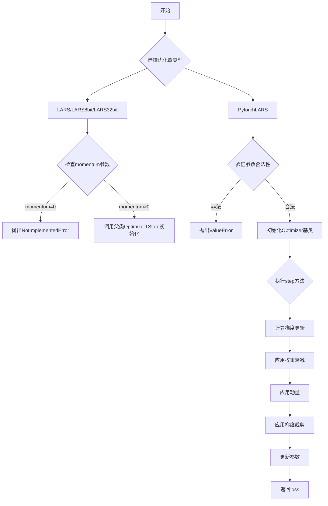
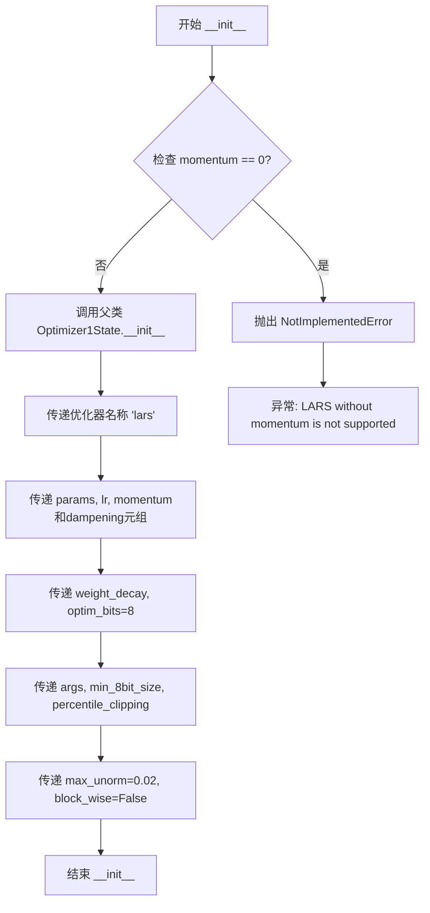
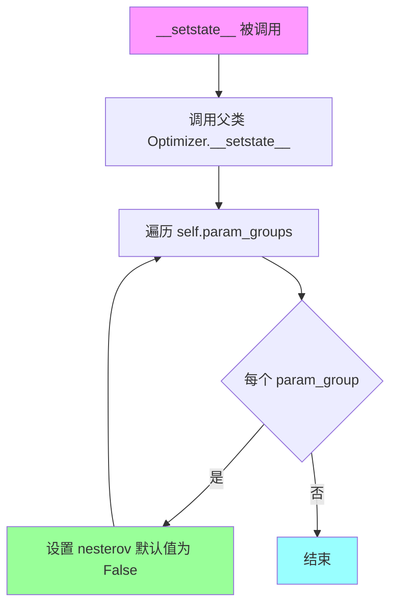

# `bitsandbytes\bitsandbytes\optim\lars.py` 详细设计文档

该文件实现了LARS（Layer-wise Adaptive Rate Scaling）优化器，包含三个基于bitsandbytes库的变体（LARS、LARS8bit、LARS32bit）以及一个纯PyTorch实现的PytorchLARS，用于大规模神经网络训练中的梯度下降优化。

## 整体流程



## 类结构

```
Optimizer (PyTorch基类)
└── Optimizer1State (bitsandbytes基类)
    ├── LARS
    ├── LARS8bit
    └── LARS32bit
Optimizer (PyTorch基类)
└── PytorchLARS
```

## 全局变量及字段


### `torch`
    
PyTorch 核心库，提供张量运算和自动求导机制

类型：`module`
    


### `Optimizer`
    
PyTorch 优化器基类，定义了优化器的基本接口

类型：`class`
    


### `Optimizer1State`
    
BitsAndBytes 库中的优化器状态封装类，支持 8 位和 32 位优化

类型：`class`
    


### `LARS`
    
基于 LARS 算法的优化器，支持动量、权重衰减和梯度裁剪

类型：`class`
    


### `LARS8bit`
    
8 位版本的 LARS 优化器，使用 8 位状态进行参数更新

类型：`class`
    


### `LARS32bit`
    
32 位版本的 LARS 优化器，使用 32 位状态进行参数更新

类型：`class`
    


### `PytorchLARS`
    
纯 PyTorch 实现的 LARS 优化器，直接继承 Optimizer

类型：`class`
    


### `LARS.params`
    
要优化的参数

类型：`torch.Tensor`
    


### `LARS.lr`
    
学习率

类型：`float`
    


### `LARS.momentum`
    
动量值

类型：`float`
    


### `LARS.dampening`
    
阻尼值

类型：`float`
    


### `LARS.weight_decay`
    
权重衰减系数

类型：`float`
    


### `LARS.nesterov`
    
是否使用 Nesterov 动量

类型：`bool`
    


### `LARS.optim_bits`
    
优化器状态位数

类型：`int`
    


### `LARS.args`
    
额外参数对象

类型：`object`
    


### `LARS.min_8bit_size`
    
8 位优化的最小张量大小

类型：`int`
    


### `LARS.percentile_clipping`
    
百分位裁剪阈值

类型：`int`
    


### `LARS.max_unorm`
    
最大梯度范数

类型：`float`
    


### `LARS8bit.params`
    
要优化的参数

类型：`torch.Tensor`
    


### `LARS8bit.lr`
    
学习率

类型：`float`
    


### `LARS8bit.momentum`
    
动量值

类型：`float`
    


### `LARS8bit.dampening`
    
阻尼值

类型：`float`
    


### `LARS8bit.weight_decay`
    
权重衰减系数

类型：`float`
    


### `LARS8bit.nesterov`
    
是否使用 Nesterov 动量

类型：`bool`
    


### `LARS8bit.args`
    
额外参数对象

类型：`object`
    


### `LARS8bit.min_8bit_size`
    
8 位优化的最小张量大小

类型：`int`
    


### `LARS8bit.percentile_clipping`
    
百分位裁剪阈值

类型：`int`
    


### `LARS8bit.max_unorm`
    
最大梯度范数

类型：`float`
    


### `LARS32bit.params`
    
要优化的参数

类型：`torch.Tensor`
    


### `LARS32bit.lr`
    
学习率

类型：`float`
    


### `LARS32bit.momentum`
    
动量值

类型：`float`
    


### `LARS32bit.dampening`
    
阻尼值

类型：`float`
    


### `LARS32bit.weight_decay`
    
权重衰减系数

类型：`float`
    


### `LARS32bit.nesterov`
    
是否使用 Nesterov 动量

类型：`bool`
    


### `LARS32bit.args`
    
额外参数对象

类型：`object`
    


### `LARS32bit.min_8bit_size`
    
8 位优化的最小张量大小

类型：`int`
    


### `LARS32bit.percentile_clipping`
    
百分位裁剪阈值

类型：`int`
    


### `LARS32bit.max_unorm`
    
最大梯度范数

类型：`float`
    


### `PytorchLARS.params`
    
要优化的参数

类型：`torch.Tensor`
    


### `PytorchLARS.lr`
    
学习率

类型：`float`
    


### `PytorchLARS.momentum`
    
动量值

类型：`float`
    


### `PytorchLARS.dampening`
    
阻尼值

类型：`float`
    


### `PytorchLARS.weight_decay`
    
权重衰减系数

类型：`float`
    


### `PytorchLARS.nesterov`
    
是否使用 Nesterov 动量

类型：`bool`
    


### `PytorchLARS.max_unorm`
    
最大梯度范数

类型：`float`
    


### `PytorchLARS.state`
    
优化器状态字典

类型：`dict`
    


### `PytorchLARS.param_groups`
    
参数组列表

类型：`list`
    
    

## 全局函数及方法


### LARS.__init__

该方法是LARS（Layer-wise Adaptive Rate Scaling）优化器的初始化方法，继承自Optimizer1State，用于配置带有动量、权重衰减、梯度裁剪等特性的LARS优化器，并验证动量参数的有效性。

参数：

- `params`：`torch.tensor`，要优化的输入参数
- `lr`：`float`，学习率，控制参数更新的步长
- `momentum`：`float`，默认值0，动量值，通过采用更大的步长来加速优化器
- `dampening`：`float`，默认值0，阻尼值，用于减少优化器的动量
- `weight_decay`：`float`，默认值0，权重衰减参数，用于正则化
- `nesterov`：`bool`，默认值False，是否使用Nesterov动量
- `optim_bits`：`int`，默认值32，优化器状态的位数（精度）
- `args`：`object`，默认值None，包含额外参数的对象
- `min_8bit_size`：`int`，默认值4096，张量元素最小数量，低于此值不使用8位优化
- `percentile_clipping`：`int`，默认值100，自适应裁剪阈值，跟踪最近100个梯度范数并裁剪
- `max_unorm`：`float`，默认值0.02，最大梯度范数，用于梯度裁剪

返回值：`None`，构造函数无返回值

#### 流程图

```mermaid
flowchart TD
    A[开始 __init__] --> B{检查 momentum == 0?}
    B -->|是| C[抛出 NotImplementedError]
    B -->|否| D[调用父类 Optimizer1State.__init__]
    D --> E[传入优化器名称 'lars']
    E --> F[传入参数列表和学习率]
    F --> G[传入动量元组 (momentum, dampening)]
    G --> H[传入权重衰减和其他配置]
    H --> I[设置 optim_bits, args, min_8bit_size]
    I --> J[设置 percentile_clipping, max_unorm, block_wise=False]
    J --> K[结束 __init__]
    
    C --> L[错误: LARS without momentum is not supported!]
```

#### 带注释源码

```python
class LARS(Optimizer1State):
    def __init__(
        self,
        params,                 # torch.tensor: 要优化的模型参数
        lr,                     # float: 学习率
        momentum=0,             # float: 动量系数，默认0
        dampening=0,            # float: 动量阻尼，默认0
        weight_decay=0,         # float: 权重衰减系数，默认0
        nesterov=False,         # bool: 是否使用Nesterov动量，默认False
        optim_bits=32,          # int: 优化器状态精度位数，默认32位
        args=None,              # object: 附加配置参数对象
        min_8bit_size=4096,    # int: 启用8bit优化的最小参数大小
        percentile_clipping=100, # int: 梯度裁剪百分位，默认100即不裁剪
        max_unorm=0.02,         # float: 最大梯度范数，用于自适应裁剪
    ):
        """
        Base LARS optimizer.

        Arguments:
            params (`torch.tensor`):
                The input parameters to optimize.
            lr (`float`):
                The learning rate.
            momentum (`float`, defaults to 0):
                The momentum value speeds up the optimizer by taking bigger steps.
            dampening (`float`, defaults to 0):
                The dampening value reduces the momentum of the optimizer.
            weight_decay (`float`, defaults to 1e-2):
                The weight decay value for the optimizer.
            nesterov (`bool`, defaults to `False`):
                Whether to use Nesterov momentum.
            optim_bits (`int`, defaults to 32):
                The number of bits of the optimizer state.
            args (`object`, defaults to `None`):
                An object with additional arguments.
            min_8bit_size (`int`, defaults to 4096):
                The minimum number of elements of the parameter tensors for 8-bit optimization.
            percentile_clipping (`int`, defaults to 100):
                Adapts clipping threshold automatically by tracking the last 100 gradient norms and clipping the gradient at a certain percentile to improve stability.
            max_unorm (`float`, defaults to 0.02):
                The maximum gradient norm.
        """
        # LARS算法必须有动量，否则无法工作
        if momentum == 0:
            raise NotImplementedError("LARS without momentum is not supported!")
        
        # 调用父类Optimizer1State的初始化方法
        # 传入优化器名称'lars'和各项配置参数
        super().__init__(
            "lars",              # 优化器名称
            params,              # 待优化参数
            lr,                  # 学习率
            (momentum, dampening), # 动量参数元组
            0.0,                 # 无AdaGrad的epsilon参数
            weight_decay,        # 权重衰减
            optim_bits,          # 优化器精度位数
            args,                # 附加参数
            min_8bit_size,       # 8bit优化最小尺寸
            percentile_clipping, # 百分位裁剪
            max_unorm=max_unorm, # 最大梯度范数
            block_wise=False,    # 禁用块级别优化
        )
```


### `LARS8bit.__init__`

该方法是8位LARS（Layer-wise Adaptive Rate Scaling）优化器的初始化函数，负责配置学习率、动量、权重衰减等优化参数，并验证动量必须大于零以确保LARS算法的有效性，最后将参数传递给父类Optimizer1State进行进一步的初始化设置。

参数：

- `params`：`torch.tensor`，待优化的输入参数张量
- `lr`：`float`，学习率，控制参数更新的步长
- `momentum`：`float`，动量值，默认为0，用于加速优化器更新
- `dampening`：`float`，阻尼值，默认为0，用于减少动量效果
- `weight_decay`：`float`，权重衰减系数，默认为0，用于L2正则化
- `nesterov`：`bool`，是否使用Nesterov动量，默认为False
- `args`：`object`，包含额外参数的对象，默认为None
- `min_8bit_size`：`int`，8位优化的最小张量元素数量，默认为4096
- `percentile_clipping`：`int`，梯度裁剪的百分位数，默认为100
- `max_unorm`：`float`，最大梯度范数，默认为0.02

返回值：`None`，该方法为构造函数，不返回任何值

#### 流程图



#### 带注释源码

```python
def __init__(
    self,
    params,                  # torch.tensor: 待优化的模型参数
    lr,                      # float: 学习率
    momentum=0,              # float: 动量因子，默认为0
    dampening=0,             # float: 动量阻尼，默认为0
    weight_decay=0,          # float: 权重衰减系数，默认为0
    nesterov=False,          # bool: 是否使用Nesterov动量，默认为False
    args=None,               # object: 额外配置参数对象，默认为None
    min_8bit_size=4096,      # int: 8位优化的最小张量大小，默认为4096
    percentile_clipping=100,# int: 梯度裁剪的百分位阈值，默认为100
    max_unorm=0.02,          # float: 最大梯度范数，默认为0.02
):
    """
    8-bit LARS optimizer.

    Arguments:
        params (`torch.tensor`):
            The input parameters to optimize.
        lr (`float`):
            The learning rate.
        momentum (`float`, defaults to 0):
            The momentum value speeds up the optimizer by taking bigger steps.
        dampening (`float`, defaults to 0):
            The dampening value reduces the momentum of the optimizer.
        weight_decay (`float`, defaults to 1e-2):
            The weight decay value for the optimizer.
        nesterov (`bool`, defaults to `False`):
            Whether to use Nesterov momentum.
        args (`object`, defaults to `None`):
            An object with additional arguments.
        min_8bit_size (`int`, defaults to 4096):
            The minimum number of elements of the parameter tensors for 8-bit optimization.
        percentile_clipping (`int`, defaults to 100):
            Adapts clipping threshold automatically by tracking the last 100 gradient norms and clipping the gradient at a certain percentile to improve stability.
        max_unorm (`float`, defaults to 0.02):
            The maximum gradient norm.
    """
    # LARS算法要求必须有动量，否则无法工作
    if momentum == 0:
        raise NotImplementedError("LARS without momentum is not supported!")
    
    # 调用父类Optimizer1State的初始化方法
    # 参数说明:
    # - "lars": 优化器名称标识
    # - params: 待优化参数
    # - lr: 学习率
    # - (momentum, dampening): 动量和阻尼组成的元组
    # - 0.0: epsilon参数
    # - weight_decay: 权重衰减
    # - 8: optim_bits，使用8位优化
    # - args: 额外参数
    # - min_8bit_size: 8位优化的最小张量大小
    # - percentile_clipping: 百分位裁剪值
    # - max_unorm: 最大梯度范数
    # - block_wise: 是否使用块级优化，False表示不使用
    super().__init__(
        "lars",
        params,
        lr,
        (momentum, dampening),
        0.0,
        weight_decay,
        8,
        args,
        min_8bit_size,
        percentile_clipping,
        max_unorm=max_unorm,
        block_wise=False,
    )
```


### `LARS32bit.__init__`

这是32位LARS（Layer-wise Adaptive Rate Scaling）优化器的初始化方法，继承自`Optimizer1State`，用于大规模神经网络训练中的梯度优化。该方法接收模型参数、学习率、动量等超参数，并进行基本验证后调用父类初始化器配置优化器状态。

参数：

- `params`：`torch.tensor` 或可迭代参数，待优化的模型参数
- `lr`：`float`，学习率，控制参数更新的步长
- `momentum`：`float`，默认值0，动量参数，用于加速优化过程
- `dampening`：`float`，默认值0，动量阻尼值，用于减少动量效果
- `weight_decay`：`float`，默认值0，权重衰减系数，用于L2正则化
- `nesterov`：`bool`，默认值False，是否使用Nesterov动量
- `args`：`object`，默认值None，包含额外配置参数的对象
- `min_8bit_size`：`int`，默认值4096，启用8位优化的最小参数数量阈值
- `percentile_clipping`：`int`，默认值100，梯度裁剪的百分位数，用于自适应裁剪阈值
- `max_unorm`：`float`，默认值0.02，最大梯度范数，用于防止梯度爆炸

返回值：`None`，无返回值，该方法仅完成对象初始化

#### 流程图

```mermaid
flowchart TD
    A[开始 __init__] --> B{检查 momentum == 0?}
    B -->|是| C[抛出 NotImplementedError]
    B -->|否| D[调用 super().__init__]
    D --> E[传入优化器名称 'lars']
    E --> F[传入 optim_bits=32]
    F --> G[传入其他参数]
    G --> H[完成初始化]
    C --> I[结束]
    H --> I
```

#### 带注释源码

```python
def __init__(
    self,
    params,                      # 待优化的模型参数（torch.tensor或可迭代对象）
    lr,                          # 学习率（float），控制参数更新步长
    momentum=0,                  # 动量（float），加速优化器收敛
    dampening=0,                 # 阻尼（float），减少动量效果
    weight_decay=0,              # 权重衰减（float），用于L2正则化
    nesterov=False,              # Nesterov动量（bool），是否启用
    args=None,                   # 额外参数对象（object）
    min_8bit_size=4096,          # 8位优化最小尺寸（int）
    percentile_clipping=100,     # 百分位裁剪（int），自适应裁剪阈值
    max_unorm=0.02,              # 最大梯度范数（float）
):
    """
    32-bit LARS optimizer.

    参数说明：
        params: 待优化的输入参数张量
        lr: 学习率
        momentum: 动量值，用于加速优化器
        dampening: 阻尼值，减少动量效果
        weight_decay: 权重衰减系数
        nesterov: 是否使用Nesterov动量
        args: 包含额外参数的对象
        min_8bit_size: 8位优化的最小参数元素数量
        percentile_clipping: 自适应裁剪阈值，通过跟踪最近100个梯度范数
        max_unorm: 最大梯度范数，用于梯度裁剪
    """
    
    # LARS优化器必须使用动量，不支持无动量版本
    if momentum == 0:
        raise NotImplementedError("LARS without momentum is not supported!")
    
    # 调用父类Optimizer1State的初始化方法
    # 参数说明：
    #   "lars" - 优化器名称标识
    #   params - 待优化参数
    #   lr - 学习率
    #   (momentum, dampening) - 动量参数元组
    #   0.0 - 固定参数（此处未使用）
    #   weight_decay - 权重衰减
    #   32 - 优化器状态位数（32位）
    #   args - 额外参数
    #   min_8bit_size - 8位优化阈值
    #   percentile_clipping - 百分位裁剪
    #   max_unorm=max_unorm - 最大梯度范数
    #   block_wise=False - 块级优化（False为逐元素优化）
    super().__init__(
        "lars",
        params,
        lr,
        (momentum, dampening),
        0.0,
        weight_decay,
        32,                      # 使用32位优化器状态
        args,
        min_8bit_size,
        percentile_clipping,
        max_unorm=max_unorm,
        block_wise=False,
    )
```


### PytorchLARS.__init__

用于初始化 PytorchLARS 优化器实例，接收模型参数和学习率、动量、权重衰减等超参数，进行合法性校验（如学习率非负、动量非负等），构建参数字典并传递给父类 Optimizer 完成初始化。

参数：

- `params`：`Iterable[torch.Tensor]`，待优化的模型参数迭代器。
- `lr`：`float`，学习率，默认值为 0.01。
- `momentum`：`float`，动量因子，默认值为 0。
- `dampening`：`float`，动量阻尼，用于减少动量的更新，默认值为 0。
- `weight_decay`：`float`，权重衰减（L2 正则化）系数，默认值为 0。
- `nesterov`：`bool`，是否启用 Nesterov 动量，默认值为 False。
- `max_unorm`：`float`，梯度裁剪的最大范数值，用于防止梯度爆炸，默认值为 0.02。

返回值：`None`，无返回值，仅完成对象初始化。

#### 流程图

```mermaid
flowchart TD
    A([开始 __init__]) --> B{校验: lr < 0?}
    B -- 是 --> C[抛出 ValueError]
    B -- 否 --> D{校验: momentum < 0?}
    D -- 是 --> E[抛出 ValueError]
    D -- 否 --> F{校验: weight_decay < 0?}
    F -- 是 --> G[抛出 ValueError]
    F -- 否 --> H[构建 defaults 字典]
    H --> I{校验: nesterov 且 (momentum <= 0 或 dampening != 0)?}
    I -- 是 --> J[抛出 ValueError]
    I -- 否 --> K[调用 super().__init__]
    K --> L([结束])
```

#### 带注释源码

```python
def __init__(
    self,
    params,
    lr=0.01,
    momentum=0,
    dampening=0,
    weight_decay=0,
    nesterov=False,
    max_unorm=0.02,
):
    # 校验学习率是否为负数
    if lr < 0.0:
        raise ValueError(f"Invalid learning rate: {lr}")
    # 校验动量值是否为负数
    if momentum < 0.0:
        raise ValueError(f"Invalid momentum value: {momentum}")
    # 校验权重衰减系数是否为负数
    if weight_decay < 0.0:
        raise ValueError(f"Invalid weight_decay value: {weight_decay}")

    # 构建参数字典，包含所有优化器超参数
    defaults = dict(
        lr=lr,
        momentum=momentum,
        dampening=dampening,
        weight_decay=weight_decay,
        nesterov=nesterov,
        max_unorm=max_unorm,
    )
    
    # 校验 Nesterov 动量的合法性：必须启用动量且阻尼为0
    if nesterov and (momentum <= 0 or dampening != 0):
        raise ValueError("Nesterov momentum requires a momentum and zero dampening")
        
    # 调用父类 Optimizer 的初始化方法
    super().__init__(params, defaults)
```


### `PytorchLARS.__setstate__`

该方法是 `PytorchLARS` 类的状态恢复（反序列化）特殊方法，继承自 PyTorch 的 `Optimizer` 基类。当对象被反序列化（如通过 pickle 加载）时自动调用，用于恢复优化器的状态，并确保每个参数组都具有 `nesterov` 属性，默认值为 `False`。

参数：

- `state`：`dict`，包含从持久化存储（如 pickle 文件）加载的优化器状态字典。该参数由 Python 的 pickle 模块在反序列化时自动传递，包含参数组和优化器内部状态的恢复信息。

返回值：`None`，该方法直接修改对象状态，无返回值。

#### 流程图



#### 带注释源码

```python
def __setstate__(self, state):
    """
    恢复优化器状态的反序列化方法。
    
    在对象被 pickle 反序列化时自动调用，确保所有参数组
    都包含 nesterov 键，防止后续代码访问不存在的键而出错。
    
    参数:
        state (dict): 包含优化器状态的字典，由 pickle 反序列化传入。
    """
    # 调用父类 Optimizer 的 __setstate__ 方法
    # 恢复基类定义的状态信息（如参数组等）
    super().__setstate__(state)
    
    # 遍历所有参数组（每个参数组可能对应不同的超参数配置）
    for group in self.param_groups:
        # 使用 setdefault 确保每个 group 都有 nesterov 键
        # 如果键已存在则保留原值，不存在则设置为 False
        # 这是为了向后兼容：旧版本序列化数据可能没有 nesterov 字段
        group.setdefault("nesterov", False)
```


### `PytorchLARS.step`

该方法是 PyTorchLARS 优化器的核心执行方法，执行单步参数更新操作。它遍历所有参数组，对每个参数计算梯度更新：先应用权重衰减，再根据动量配置更新动量缓冲区，然后应用 Nesterov 动量（如果启用），最后根据 max_unorm 进行梯度裁剪并更新参数。

参数：

- `closure`：`Callable`，可选，一个闭包函数，用于重新评估模型并返回损失值。如果提供，将在 `torch.enable_grad()` 上下文中执行以确保梯度计算启用。

返回值：`Optional[torch.Tensor]`，返回闭包的损失值（如果提供了 closure），否则返回 None。

#### 流程图

```mermaid
flowchart TD
    A[开始 step] --> B{closure 不为 None?}
    B -->|是| C[在 torch.enable_grad 上下文中执行 closure]
    C --> D[loss = closure]
    D --> E
    B -->|否| E[遍历 self.param_groups]
    E --> F[提取: weight_decay, momentum, dampening, nesterov, max_unorm, lr]
    F --> G[遍历 group 中的参数 p]
    G --> H{p.grad 是否为 None?}
    H -->|是| I[跳过该参数，继续下一个]
    I --> G
    H -->|否| J[d_p = p.grad 获取梯度]
    J --> K{weight_decay != 0?}
    K -->|是| L[d_p = d_p.add(p, alpha=weight_decay) 应用权重衰减]
    L --> M
    K -->|否| M
    M -->{momentum != 0?}
    M -->|是| N[从 state 获取 momentum_buffer]
    N --> O{buf 是否为 None?}
    O -->|是| P[buf = torch.clone(d_p).detach() 克隆梯度作为初始动量]
    P --> Q[state['momentum_buffer'] = buf 保存动量缓冲区]
    Q --> R
    O -->|否| S[buf.mul_(momentum).add_(d_p, alpha=1 - dampening) 更新动量]
    S --> R
    M -->|否| R
    R --> T{nesterov 为 True?}
    T -->|是| U[update = d_p + buf * momentum 应用 Nesterov 动量]
    T -->|否| V[update = buf 使用标准动量]
    U --> W
    V --> W
    W --> X{max_unorm > 0.0?}
    X -->|是| Y[pnorm = torch.norm(p.detach()) 计算参数范数]
    Y --> Z[unorm = torch.norm(update) 计算更新范数]
    Z --> AA{unorm > max_unorm * pnorm?}
    AA -->|是| AB[update_scale = max_unorm * pnorm / unorm 计算缩放因子]
    AA -->|否| AC[update_scale = 1.0 不缩放]
    AB --> AD
    AC --> AD
    X -->|否| AD[update_scale = 1.0 不进行裁剪]
    AD --> AE[p.add_(update, alpha=-lr * update_scale) 更新参数]
    AE --> AF{还有更多参数?}
    AF -->|是| G
    AF -->|否| AG{还有更多 param_groups?}
    AG -->|是| E
    AG -->|否| AH[返回 loss]
```

#### 带注释源码

```python
@torch.no_grad()
def step(self, closure=None):
    """Performs a single optimization step.

    Args:
        closure (callable, optional): A closure that reevaluates the model
            and returns the loss.
    """
    # 如果提供了 closure，用于计算损失；否则默认为 None
    loss = None
    # 评估闭包以获取当前损失值，并在 torch.enable_grad() 上下文中执行
    # 以确保梯度计算可用（因为 step 通常在 no_grad 模式下调用）
    if closure is not None:
        with torch.enable_grad():
            loss = closure()

    # 遍历所有参数组，每个参数组可能有不同的超参数
    for group in self.param_groups:
        # 从当前参数组中提取优化器超参数
        weight_decay = group["weight_decay"]       # 权重衰减系数
        momentum = group["momentum"]               # 动量系数
        dampening = group["dampening"]              # 动量阻尼系数
        nesterov = group["nesterov"]                # 是否使用 Nesterov 动量
        max_unorm = group["max_unorm"]              # 最大梯度范数阈值
        lr = group["lr"]                            # 学习率

        # 遍历当前参数组中的所有参数张量
        for p in group["params"]:
            # 如果参数没有梯度，跳过该参数
            if p.grad is None:
                continue

            # 获取该参数的优化器状态字典
            state = self.state[p]
            
            # 获取当前梯度
            d_p = p.grad

            # 应用权重衰减：d_p = d_p + weight_decay * p
            if weight_decay != 0:
                d_p = d_p.add(p, alpha=weight_decay)

            # 应用动量更新
            if momentum != 0:
                # 尝试获取已有的动量缓冲区，不存在则创建新的
                buf = state.get("momentum_buffer", None)

                if buf is None:
                    # 首次迭代：克隆梯度作为初始动量缓冲区
                    buf = torch.clone(d_p).detach()
                    state["momentum_buffer"] = buf
                else:
                    # 后续迭代：buf = momentum * buf + (1 - dampening) * d_p
                    buf.mul_(momentum).add_(d_p, alpha=1 - dampening)

                # 根据是否使用 Nesterov 动量计算最终更新量
                if nesterov:
                    # Nesterov: update = d_p + momentum * buf
                    update = d_p + buf * momentum
                else:
                    # 标准动量: update = buf
                    update = buf

            # 计算梯度裁剪缩放因子
            update_scale = 1.0
            if max_unorm > 0.0:
                # 确保参数是 float32 类型才能进行范数计算
                assert p.dtype == torch.float32
                # 计算参数范数和更新范数
                pnorm = torch.norm(p.detach())
                unorm = torch.norm(update)
                # 如果更新范数超过阈值，进行裁剪
                if unorm > max_unorm * pnorm:
                    update_scale = max_unorm * pnorm / unorm

            # 执行参数更新：p = p - lr * update_scale * update
            p.add_(update, alpha=-lr * update_scale)

    # 返回损失值（如果有）
    return loss
```


## 关键组件


### LARS

基础LARS优化器类，继承自Optimizer1State，支持32位和可配置位数的优化状态，通过LARS算法实现层-wise的学习率缩放，用于大规模神经网络训练。

### LARS8bit

8位量化LARS优化器，将optim_bits设置为8以启用8位优化状态存储，减少显存占用并加速训练，适用于大规模分布式训练场景。

### LARS32bit

32位LARS优化器，将optim_bits设置为32以保持全精度优化状态，提供与标准LARS相同的精度，适用于需要高精度梯度更新的场景。

### PytorchLARS

纯PyTorch实现的LARS优化器，继承自torch.optim.Optimizer，手动实现动量更新和梯度裁剪，包含momentum_buffer的惰性加载机制，通过max_unorm参数实现自适应学习率缩放。

### Optimizer1State基类

来自bitsandbytes库的优化器基类，提供量化优化状态的存储和管理功能，支持张量索引访问和动态反量化，是LARS、LARS8bit、LARS32bit的共同基类。

### 张量索引与惰性加载机制

在PytorchLARS中，momentum_buffer通过state.get("momentum_buffer", None)实现惰性初始化，只有在第一次需要动量时才会创建，避免不必要的内存分配。

### 量化策略

通过optim_bits参数（8或32）控制优化器状态的量化精度，Optimizer1State基类负责处理量化/反量化逻辑，支持动态切换不同精度的优化器实现。

### percentile_clipping机制

在Optimizer1State基类中实现的自适应梯度裁剪，通过追踪最近100个梯度范数并按照百分位进行裁剪，提高训练稳定性。

### max_unorm参数

LARS算法的核心参数，用于控制梯度的最大范数，通过计算参数范数(pnorm)和更新范数(unorm)的比例实现自适应的学习率缩放。


## 问题及建议


### 已知问题

-   **严重的代码重复**: LARS、LARS8bit、LARS32bit三个类除了optim_bits参数（32/8/32）外几乎完全相同，违反了DRY（Don't Repeat Yourself）原则，维护成本高。
-   **参数验证不一致**: PytorchLARS类对lr、momentum、weight_decay进行了负值检查，但LARS、LARS8bit、LARS32bit类完全没有参数验证。
-   **缺少参数边界检查**: 未对max_unorm、percentile_clipping、min_8bit_size等参数的合理范围进行校验，可能导致运行时错误或不可预测行为。
-   **PytorchLARS中梯度计算潜在问题**: 使用`p.detach()`计算pnorm可能导致梯度流不一致，且未检查梯度是否为NaN/Inf。
-   **类型提示缺失**: 完全没有类型注解（type hints），降低了代码的可读性和可维护性。
-   **错误信息不够具体**: 仅抛出"not supported"异常，未提供更多调试信息。
-   **硬编码magic number**: percentile_clipping默认100是magic number，缺乏解释。
-   **文档不完整**: 缺少对返回值、异常、使用示例的说明。

### 优化建议

-   **消除代码重复**: 将LARS、LARS8bit、LARS32bit合并为一个工厂函数或使用参数化方式创建，避免三个几乎相同的类。
-   **统一参数验证**: 在所有类中添加参数范围检查（lr>0, momentum>=0, weight_decay>=0等），保持接口一致性。
-   **添加类型提示**: 为所有方法参数和返回值添加类型注解。
-   **增强错误处理**: 添加对NaN/Inf梯度的检测和处理，提供更详细的错误信息。
-   **优化PytorchLARS实现**: 考虑使用torch.no_grad()包裹norm计算，避免不必要的detach()调用。
-   **添加单元测试**: 补充针对各种边界条件和异常情况的测试用例。
-   **文档增强**: 添加使用示例、返回值说明、异常列表等完整文档。


## 其它


### 设计目标与约束

LARS优化器的主要设计目标是解决大规模神经网络训练中的梯度消失和爆炸问题，通过层-wise的自适应学习率缩放来稳定训练过程。设计约束包括：必须使用动量（不支持无动量的LARS），仅支持float32参数（当max_unorm > 0时），8位优化器有最小张量大小限制（min_8bit_size=4096），Nesterov动量需要特定的参数组合（动量>0且dampening=0）。

### 错误处理与异常设计

代码实现了多层次错误处理机制：LARS、LARS8bit、LARS32bit类在momentum为0时抛出NotImplementedError("LARS without momentum is not supported!")；PytorchLARS类对参数进行了严格校验，包括学习率必须非负（ValueError: Invalid learning rate）、动量必须非负（ValueError: Invalid momentum value）、权重衰减必须非负（ValueError: Invalid weight_decay value）、Nesterov动量校验（ValueError: Nesterov momentum requires a momentum and zero dampening）。

### 数据流与状态机

优化器状态机包含两个主要状态：参数梯度计算和参数更新。对于PytorchLARS，每次step调用时，对于每个参数执行以下流程：获取梯度grad -> 应用权重衰减 -> 计算动量缓冲区 -> 应用Nesterov更新（可选）-> 计算LARS缩放因子 -> 更新参数。状态字典中存储momentum_buffer用于动量累积。

### 外部依赖与接口契约

主要外部依赖包括：torch（PyTorch核心库）、torch.optim.Optimizer（优化器基类）、bitsandbytes.optim.optimizer.Optimizer1State（8位优化器基类）。接口契约要求：params必须是可迭代的torch.tensor；lr、momentum、dampening、weight_decay、max_unorm必须是浮点数；nesterov必须是布尔值；optim_bits必须是整数（8或32）。

### 性能考虑

8位优化器（LARS8bit）通过量化技术减少内存占用，适用于大模型训练；32位优化器（LARS32bit）提供更精确的梯度更新；percentile_clipping通过自适应梯度裁剪提高训练稳定性；block_wise设置为False表示使用全局归一化而非分块归一化，可能影响内存使用和计算效率。

### 兼容性考虑

代码仅支持PyTorch张量操作；要求输入参数为float32类型（当使用max_unorm时）；LARS和LARS8bit/LARS32bit依赖bitsandbytes库；PytorchLARS是纯PyTorch实现，可独立使用；所有类都遵循PyTorch Optimizer接口规范。

### 配置参数详细说明

关键配置参数包括：lr（学习率，控制参数更新步长）、momentum（动量系数，加速收敛）、dampening（动量阻尼，减少振荡）、weight_decay（权重衰减，防止过拟合）、nesterov（是否使用Nesterov动量）、optim_bits（优化器状态位数，8或32）、min_8bit_size（8位优化的最小张量大小阈值）、percentile_clipping（梯度裁剪的百分位窗口）、max_unorm（最大梯度范数，用于LARS缩放）。

### 使用示例

```python
# 使用PytorchLARS
optimizer = PytorchLARS(model.parameters(), lr=0.01, momentum=0.9, max_unorm=0.02)

# 使用8位LARS优化器
optimizer = LARS8bit(model.parameters(), lr=0.01, momentum=0.9)

# 使用32位LARS优化器
optimizer = LARS32bit(model.parameters(), lr=0.01, momentum=0.9)
```


    