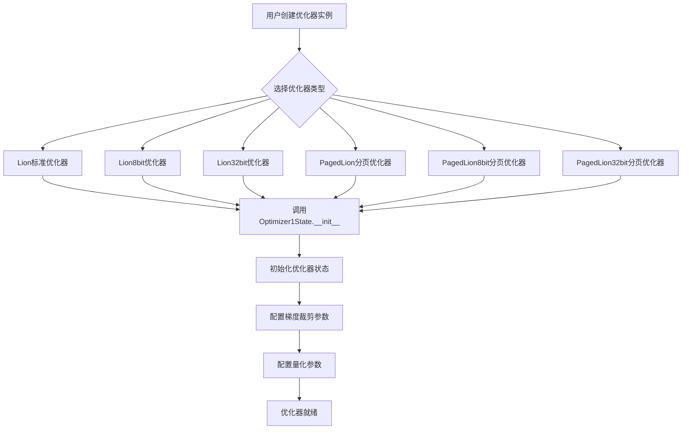
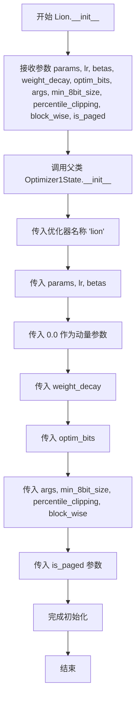
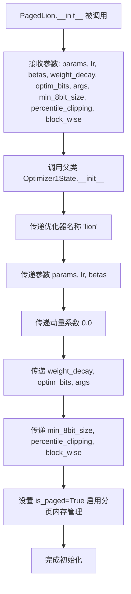
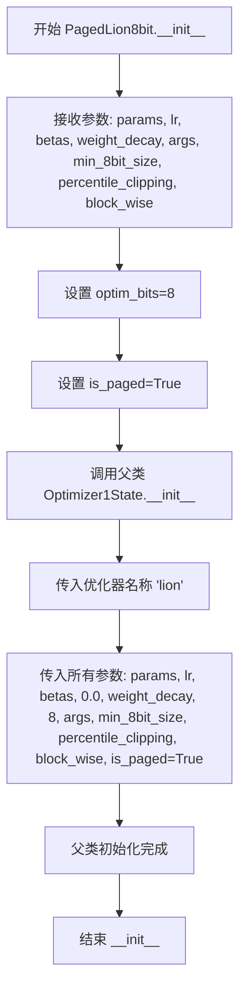

# `bitsandbytes\bitsandbytes\optim\lion.py` 详细设计文档

该文件实现了Facebook的Lion优化器的多个变体，包括标准版、8位版、32位版以及对应的分页版本，所有类都继承自Optimizer1State基类，提供高效的大规模模型参数优化功能，支持梯度裁剪、分块量化等高级特性。

## 整体流程



## 类结构

```
Optimizer1State (基类 - 外部依赖)
├── Lion (标准Lion优化器)
├── Lion8bit (8位量化Lion优化器)
├── Lion32bit (32位Lion优化器)
├── PagedLion (分页Lion优化器)
├── PagedLion8bit (分页8位Lion优化器)
└── PagedLion32bit (分页32位Lion优化器)
```

## 全局变量及字段


### `Lion.params`
    
待优化参数

类型：`torch.tensor`
    


### `Lion.lr`
    
学习率，默认1e-4

类型：`float`
    


### `Lion.betas`
    
动量衰减系数，默认(0.9, 0.99)

类型：`tuple`
    


### `Lion.weight_decay`
    
权重衰减，默认0

类型：`float`
    


### `Lion.optim_bits`
    
优化器状态位数，默认32

类型：`int`
    


### `Lion.args`
    
额外参数对象

类型：`object`
    


### `Lion.min_8bit_size`
    
8位优化最小张量大小，默认4096

类型：`int`
    


### `Lion.percentile_clipping`
    
百分位裁剪阈值，默认100

类型：`int`
    


### `Lion.block_wise`
    
是否分块量化，默认True

类型：`bool`
    


### `Lion.is_paged`
    
是否分页模式，默认False

类型：`bool`
    


### `Lion8bit.params`
    
待优化参数

类型：`torch.tensor`
    


### `Lion8bit.lr`
    
学习率，默认1e-4

类型：`float`
    


### `Lion8bit.betas`
    
动量衰减系数，默认(0.9, 0.99)

类型：`tuple`
    


### `Lion8bit.weight_decay`
    
权重衰减，默认0

类型：`float`
    


### `Lion8bit.args`
    
额外参数对象

类型：`object`
    


### `Lion8bit.min_8bit_size`
    
8位优化最小张量大小，默认4096

类型：`int`
    


### `Lion8bit.percentile_clipping`
    
百分位裁剪阈值，默认100

类型：`int`
    


### `Lion8bit.block_wise`
    
是否分块量化，默认True

类型：`bool`
    


### `Lion8bit.is_paged`
    
是否分页模式，默认False

类型：`bool`
    


### `Lion32bit.params`
    
待优化参数

类型：`torch.tensor`
    


### `Lion32bit.lr`
    
学习率，默认1e-4

类型：`float`
    


### `Lion32bit.betas`
    
动量衰减系数，默认(0.9, 0.99)

类型：`tuple`
    


### `Lion32bit.weight_decay`
    
权重衰减，默认0

类型：`float`
    


### `Lion32bit.args`
    
额外参数对象

类型：`object`
    


### `Lion32bit.min_8bit_size`
    
8位优化最小张量大小，默认4096

类型：`int`
    


### `Lion32bit.percentile_clipping`
    
百分位裁剪阈值，默认100

类型：`int`
    


### `Lion32bit.block_wise`
    
是否分块量化，默认True

类型：`bool`
    


### `Lion32bit.is_paged`
    
是否分页模式，默认False

类型：`bool`
    


### `PagedLion.params`
    
待优化参数

类型：`torch.tensor`
    


### `PagedLion.lr`
    
学习率，默认1e-4

类型：`float`
    


### `PagedLion.betas`
    
动量衰减系数，默认(0.9, 0.99)

类型：`tuple`
    


### `PagedLion.weight_decay`
    
权重衰减，默认0

类型：`float`
    


### `PagedLion.optim_bits`
    
优化器状态位数，默认32

类型：`int`
    


### `PagedLion.args`
    
额外参数对象

类型：`object`
    


### `PagedLion.min_8bit_size`
    
8位优化最小张量大小，默认4096

类型：`int`
    


### `PagedLion.percentile_clipping`
    
百分位裁剪阈值，默认100

类型：`int`
    


### `PagedLion.block_wise`
    
是否分块量化，默认True

类型：`bool`
    


### `PagedLion8bit.params`
    
待优化参数

类型：`torch.tensor`
    


### `PagedLion8bit.lr`
    
学习率，默认1e-4

类型：`float`
    


### `PagedLion8bit.betas`
    
动量衰减系数，默认(0.9, 0.99)

类型：`tuple`
    


### `PagedLion8bit.weight_decay`
    
权重衰减，默认0

类型：`float`
    


### `PagedLion8bit.args`
    
额外参数对象

类型：`object`
    


### `PagedLion8bit.min_8bit_size`
    
8位优化最小张量大小，默认4096

类型：`int`
    


### `PagedLion8bit.percentile_clipping`
    
百分位裁剪阈值，默认100

类型：`int`
    


### `PagedLion8bit.block_wise`
    
是否分块量化，默认True

类型：`bool`
    


### `PagedLion32bit.params`
    
待优化参数

类型：`torch.tensor`
    


### `PagedLion32bit.lr`
    
学习率，默认1e-4

类型：`float`
    


### `PagedLion32bit.betas`
    
动量衰减系数，默认(0.9, 0.99)

类型：`tuple`
    


### `PagedLion32bit.weight_decay`
    
权重衰减，默认0

类型：`float`
    


### `PagedLion32bit.args`
    
额外参数对象

类型：`object`
    


### `PagedLion32bit.min_8bit_size`
    
8位优化最小张量大小，默认4096

类型：`int`
    


### `PagedLion32bit.percentile_clipping`
    
百分位裁剪阈值，默认100

类型：`int`
    


### `PagedLion32bit.block_wise`
    
是否分块量化，默认True

类型：`bool`
    
    

## 全局函数及方法


### `Lion.__init__`

这是Lion优化器的初始化方法，继承自Optimizer1State，用于创建Lion优化器实例并配置学习率、动量衰减、权重衰减、量化位数等参数。

参数：

- `params`：`torch.tensor`，要优化的输入参数
- `lr`：`float`，学习率，默认值为 `1e-4`
- `betas`：`tuple(float, float)`，一阶和二阶矩的衰减率，默认值为 `(0.9, 0.99)`
- `weight_decay`：`float`，权重衰减值，默认值为 `0`
- `optim_bits`：`int`，优化器状态的位数，默认值为 `32`
- `args`：`object`，包含额外参数的对象，默认值为 `None`
- `min_8bit_size`：`int`，用于8位优化的参数张量的最小元素数，默认值为 `4096`
- `percentile_clipping`：`int`，自动调整剪辑阈值，通过跟踪最后100个梯度范数来改善稳定性，默认值为 `100`
- `block_wise`：`bool`，是否独立量化每个张量块以减少异常值影响和提高稳定性，默认值为 `True`
- `is_paged`：`bool`，是否是分页优化器，默认值为 `False`

返回值：`None`，无返回值（`__init__` 方法）

#### 流程图



#### 带注释源码

```python
def __init__(
    self,
    params,
    lr=1e-4,
    betas=(0.9, 0.99),
    weight_decay=0,
    optim_bits=32,
    args=None,
    min_8bit_size=4096,
    percentile_clipping=100,
    block_wise=True,
    is_paged=False,
):
    """
    Base Lion optimizer.

    Arguments:
        params (`torch.tensor`):
            The input parameters to optimize.
        lr (`float`, defaults to 1e-4):
            The learning rate.
        betas (`tuple(float, float)`, defaults to (0.9, 0.999)):
            The beta values are the decay rates of the first and second-order moment of the optimizer.
        weight_decay (`float`, defaults to 0):
            The weight decay value for the optimizer.
        optim_bits (`int`, defaults to 32):
            The number of bits of the optimizer state.
        args (`object`, defaults to `None`):
            An object with additional arguments.
        min_8bit_size (`int`, defaults to 4096):
            The minimum number of elements of the parameter tensors for 8-bit optimization.
        percentile_clipping (`int`, defaults to 100):
            Adapts clipping threshold automatically by tracking the last 100 gradient norms and clipping the gradient at a certain percentile to improve stability.
        block_wise (`bool`, defaults to `True`):
            Whether to independently quantize each block of tensors to reduce outlier effects and improve stability.
        is_paged (`bool`, defaults to `False`):
            Whether the optimizer is a paged optimizer or not.
    """
    # 调用父类 Optimizer1State 的初始化方法
    # 传入优化器名称 'lion' 和所有配置参数
    super().__init__(
        "lion",           # 优化器名称
        params,           # 要优化的参数
        lr,               # 学习率
        betas,            # 动量衰减系数
        0.0,              # 动量初始值（Lion 使用不同的动量机制）
        weight_decay,     # 权重衰减
        optim_bits,       # 优化器状态位数（8/32位）
        args,             # 额外参数对象
        min_8bit_size,    # 8位优化的最小张量大小
        percentile_clipping,  # 百分位剪辑阈值
        block_wise,       # 是否使用块级量化
        is_paged=is_paged,    # 是否使用分页模式
    )
```


### `Lion8bit.__init__`

该方法是 `Lion8bit` 类的构造函数，用于初始化8位Lion优化器。它继承自 `Optimizer1State`，配置学习率、动量参数、权重衰减、8位优化相关参数（最小8位大小、分位数裁剪、块级量化）以及分页状态，并将优化器类型设置为 "lion"，同时将优化位宽硬编码为8位。

参数：

- `params`：`torch.tensor`，要优化的输入参数张量
- `lr`：`float`，学习率，默认为 1e-4
- `betas`：`tuple(float, float)`，一阶和二阶矩的衰减率，默认为 (0.9, 0.99)
- `weight_decay`：`float`，权重衰减系数，默认为 0
- `args`：`object`，包含额外参数的对象，默认为 None
- `min_8bit_size`：`int`，触发8位优化的最小张量元素数量，默认为 4096
- `percentile_clipping`：`int`，用于自动调整裁剪阈值的梯度范数历史记录数量，默认为 100
- `block_wise`：`bool`，是否对每个张量块独立量化以减少异常值影响，默认为 True
- `is_paged`：`bool`，是否为分页优化器，默认为 False

返回值：`None`，构造函数无返回值

#### 流程图

```mermaid
flowchart TD
    A[开始 Lion8bit.__init__] --> B[接收参数: params, lr, betas, weight_decay, args, min_8bit_size, percentile_clipping, block_wise, is_paged]
    B --> C[调用 super().__init__ 传递参数]
    C --> D[设置优化器名称为 'lion']
    D --> E[传递 params, lr, betas]
    E --> F[传递 0.0 作为动量参数]
    F --> G[传递 weight_decay]
    G --> H[传递 optim_bits=8 硬编码为8位优化]
    H --> I[传递 args, min_8bit_size, percentile_clipping, block_wise]
    I --> J[传递 is_paged 参数]
    J --> K[结束]
```

#### 带注释源码

```python
class Lion8bit(Optimizer1State):
    def __init__(
        self,
        params,
        lr=1e-4,
        betas=(0.9, 0.99),
        weight_decay=0,
        args=None,
        min_8bit_size=4096,
        percentile_clipping=100,
        block_wise=True,
        is_paged=False,
    ):
        """
        8-bit Lion optimizer.

        Arguments:
            params (`torch.tensor`):
                The input parameters to optimize.
            lr (`float`, defaults to 1e-4):
                The learning rate.
            betas (`tuple(float, float)`, defaults to (0.9, 0.999)):
                The beta values are the decay rates of the first and second-order moment of the optimizer.
            weight_decay (`float`, defaults to 0):
                The weight decay value for the optimizer.
            args (`object`, defaults to `None`):
                An object with additional arguments.
            min_8bit_size (`int`, defaults to 4096):
                The minimum number of elements of the parameter tensors for 8-bit optimization.
            percentile_clipping (`int`, defaults to 100):
                Adapts clipping threshold automatically by tracking the last 100 gradient norms and clipping the gradient at a certain percentile to improve stability.
            block_wise (`bool`, defaults to `True`):
                Whether to independently quantize each block of tensors to reduce outlier effects and improve stability.
            is_paged (`bool`, defaults to `False`):
                Whether the optimizer is a paged optimizer or not.
        """
        # 调用父类 Optimizer1State 的构造函数
        # 关键区别：optim_bits 被硬编码为 8，实现了8位优化
        super().__init__(
            "lion",          # 优化器名称
            params,          # 要优化的参数
            lr,              # 学习率
            betas,           # 动量衰减参数
            0.0,             # 固定动量值（Lion不使用二阶动量）
            weight_decay,   # 权重衰减
            8,               # 优化器状态使用8位量化（核心差异）
            args,            # 额外参数对象
            min_8bit_size,   # 最小8位张量大小阈值
            percentile_clipping,  # 分位数裁剪窗口大小
            block_wise,      # 是否使用块级量化
            is_paged=is_paged,    # 是否启用分页优化
        )
```


### `Lion32bit.__init__`

这是 32 位 Lion 优化器的初始化方法，继承自 `Optimizer1State` 类，用于设置 Lion 优化器的各项参数，包括学习率、动量衰减、权重衰减、8 位优化的最小尺寸、百分位裁剪等，并最终调用父类的初始化方法完成配置。

参数：

- `params`：`torch.tensor`，要优化的输入参数
- `lr`：`float`，默认为 1e-4，学习率
- `betas`：`tuple(float, float)`，默认为 (0.9, 0.99)，一阶和二阶矩的衰减率
- `weight_decay`：`float`，默认为 0，权重衰减值
- `args`：`object`，默认为 None，包含额外参数的对象
- `min_8bit_size`：`int`，默认为 4096，8 位优化的最小参数张量元素数量
- `percentile_clipping`：`int`，默认为 100，通过跟踪最后 100 个梯度范数来自适应裁剪阈值以提高稳定性
- `block_wise`：`bool`，默认为 True，是否独立量化每个张量块以减少异常值影响和提高稳定性
- `is_paged`：`bool`，默认为 False，是否为分页优化器

返回值：`None`，无返回值（构造函数）

#### 流程图

```mermaid
flowchart TD
    A[开始 Lion32bit.__init__] --> B[接收参数]
    B --> C[调用 super().__init__]
    C --> D[传递优化器名称 'lion']
    D --> E[传递 params, lr, betas]
    E --> F[传递 weight_decay=0.0, optim_bits=32]
    F --> G[传递 args, min_8bit_size, percentile_clipping]
    G --> H[传递 block_wise, is_paged]
    H --> I[完成父类初始化]
    I --> J[结束]
```

#### 带注释源码

```python
class Lion32bit(Optimizer1State):
    def __init__(
        self,
        params,
        lr=1e-4,
        betas=(0.9, 0.99),
        weight_decay=0,
        args=None,
        min_8bit_size=4096,
        percentile_clipping=100,
        block_wise=True,
        is_paged=False,
    ):
        """
        32-bit Lion optimizer.

        Arguments:
            params (`torch.tensor`):
                The input parameters to optimize.
            lr (`float`, defaults to 1e-4):
                The learning rate.
            betas (`tuple(float, float)`, defaults to (0.9, 0.999)):
                The beta values are the decay rates of the first and second-order moment of the optimizer.
            weight_decay (`float`, defaults to 0):
                The weight decay value for the optimizer.
            args (`object`, defaults to `None`):
                An object with additional arguments.
            min_8bit_size (`int`, defaults to 4096):
                The minimum number of elements of the parameter tensors for 8-bit optimization.
            percentile_clipping (`int`, defaults to 100):
                Adapts clipping threshold automatically by tracking the last 100 gradient norms and clipping the gradient at a certain percentile to improve stability.
            block_wise (`bool`, defaults to `True`):
                Whether to independently quantize each block of tensors to reduce outlier effects and improve stability.
            is_paged (`bool`, defaults to `False`):
                Whether the optimizer is a paged optimizer or not.
        """
        # 调用父类 Optimizer1State 的初始化方法
        # 传入优化器名称 'lion' 和所有配置参数
        # 注意：weight_decay 在父类中被设置为第5个位置参数（值为 0.0）
        # optim_bits 被设置为 32，表示使用 32 位优化器
        super().__init__(
            "lion",               # 优化器名称
            params,               # 要优化的参数
            lr,                   # 学习率
            betas,                # 动量衰减系数
            0.0,                  # 内部使用的 weight_decay（实际权重衰减通过参数 weight_decay 传递）
            weight_decay,         # 用户指定的权重衰减
            32,                   # 优化器位数（32位）
            args,                 # 额外参数对象
            min_8bit_size,        # 8位优化的最小尺寸
            percentile_clipping, # 百分位裁剪值
            block_wise,           # 是否使用块-wise 量化
            is_paged=is_paged,   # 是否为分页优化器
        )
```


### `PagedLion.__init__`

这是 Paged Lion 优化器的初始化方法，继承自 Optimizer1State，用于创建具有分页内存管理功能的 Lion 优化器实例。该优化器主要用于大规模模型的参数更新，支持 8 位和 32 位优化器状态，并提供梯度分块量化以提高稳定性。

参数：

- `params`：`torch.tensor`，需要优化的输入参数
- `lr`：`float`，学习率，默认值为 1e-4
- `betas`：`tuple(float, float)`，一阶和二阶矩的衰减率，默认值为 (0.9, 0.99)
- `weight_decay`：`float`，权重衰减值，默认值为 0
- `optim_bits`：`int`，优化器状态的位数，默认值为 32
- `args`：`object`，包含额外参数的对象，默认值为 None
- `min_8bit_size`：`int`，张量参数启用 8 位优化的最小元素数量，默认值为 4096
- `percentile_clipping`：`int`，通过跟踪最近 100 个梯度范数并在其百分位处裁剪梯度来自动调整裁剪阈值以提高稳定性，默认值为 100
- `block_wise`：`bool`，是否独立量化每个张量块以减少异常值影响并提高稳定性，默认值为 True

返回值：`None`，该方法仅初始化对象状态，不返回任何值

#### 流程图



#### 带注释源码

```python
class PagedLion(Optimizer1State):
    def __init__(
        self,
        params,                      # torch.tensor: 需要优化的模型参数
        lr=1e-4,                     # float: 学习率，控制参数更新步长
        betas=(0.9, 0.99),           # tuple: 一阶和二阶矩估计的衰减率
        weight_decay=0,              # float: 权重衰减系数，用于L2正则化
        optim_bits=32,               # int: 优化器状态的位宽，支持8或32位
        args=None,                   # object: 包含额外配置参数的对象
        min_8bit_size=4096,          # int: 启用8位优化的最小参数规模
        percentile_clipping=100,     # int: 梯度裁剪的百分位数，用于稳定训练
        block_wise=True,             # bool: 是否按块独立量化，减少异常值影响
    ):
        """
        Paged Lion optimizer.
        
        Paged Lion 优化器是一种内存优化版本的 Lion 优化器，
        通过分页内存管理来减少大规模模型训练时的显存占用。
        
        Arguments:
            params: The input parameters to optimize.
            lr: The learning rate.
            betas: The beta values are the decay rates of the first and second-order moment.
            weight_decay: The weight decay value for the optimizer.
            optim_bits: The number of bits of the optimizer state.
            args: An object with additional arguments.
            min_8bit_size: The minimum number of elements for 8-bit optimization.
            percentile_clipping: Adapts clipping threshold by tracking gradient norms.
            block_wise: Whether to independently quantize each block of tensors.
        """
        # 调用父类 Optimizer1State 的初始化方法
        # 传入优化器名称 'lion' 和所有配置参数
        # 注意：is_paged 被硬编码为 True，启用分页内存管理
        super().__init__(
            "lion",                  # 优化器名称
            params,                  # 需要优化的参数
            lr,                      # 学习率
            betas,                   # 衰减率
            0.0,                     # 动量项（Lion 不使用二阶矩估计）
            weight_decay,            # 权重衰减
            optim_bits,              # 优化器位宽
            args,                    # 额外参数
            min_8bit_size,           # 8位优化最小规模
            percentile_clipping,     # 百分位裁剪
            block_wise,              # 块级量化
            is_paged=True,           # 启用分页内存管理（关键特性）
        )
```


### `PagedLion8bit.__init__`

PagedLion8bit 类的初始化方法，用于创建分页 8 位 Lion 优化器，继承自 Optimizer1State，将优化器状态分页以减少内存占用。

参数：

- `params`：`torch.tensor`，待优化的输入参数张量
- `lr`：`float`，学习率，默认为 1e-4
- `betas`：`tuple(float, float)`，一阶和二阶矩的衰减率，默认为 (0.9, 0.99)
- `weight_decay`：`float`，权重衰减系数，默认为 0
- `args`：`object`，包含额外参数的对象，默认为 None
- `min_8bit_size`：`int`，触发 8 位优化的最小张量元素数量，默认为 4096
- `percentile_clipping`：`int`，自适应梯度裁剪的百分位阈值，默认为 100
- `block_wise`：`bool`，是否独立量化每个张量块以减少异常值影响，默认为 True

返回值：`None`，__init__ 方法不返回值

#### 流程图



#### 带注释源码

```
class PagedLion8bit(Optimizer1State):
    def __init__(
        self,
        params,                      # torch.tensor: 待优化的模型参数
        lr=1e-4,                      # float: 学习率，默认 1e-4
        betas=(0.9, 0.99),            # tuple(float, float): 动量衰减系数
        weight_decay=0,               # float: 权重衰减系数
        args=None,                    # object: 额外配置参数对象
        min_8bit_size=4096,           # int: 8位优化的最小张量大小阈值
        percentile_clipping=100,      # int: 梯度裁剪的百分位阈值
        block_wise=True,              # bool: 是否使用块级量化
    ):
        """
        Paged 8-bit Lion optimizer.
        分页 8 位 Lion 优化器，继承自 Optimizer1State。
        通过分页内存管理优化器状态，适用于大模型训练场景。

        Arguments:
            params (`torch.tensor`):
                The input parameters to optimize.
                待优化的输入参数张量
            lr (`float`, defaults to 1e-4):
                The learning rate.
                学习率，控制参数更新步长
            betas (`tuple(float, float)`, defaults to (0.9, 0.999)):
                The beta values are the decay rates of the first and second-order moment of the optimizer.
                一阶和二阶矩估计的衰减率，用于计算梯度动量
            weight_decay (`float`, defaults to 0):
                The weight decay value for the optimizer.
                权重衰减系数，用于正则化
            args (`object`, defaults to `None`):
                An object with additional arguments.
                包含额外配置参数的对象
            min_8bit_size (`int`, defaults to 4096):
                The minimum number of elements of the parameter tensors for 8-bit optimization.
                触发 8 位优化的最小张量元素数量阈值
            percentile_clipping (`int`, defaults to 100):
                Adapts clipping threshold automatically by tracking the last 100 gradient norms and clipping the gradient at a certain percentile to improve stability.
                自适应梯度裁剪阈值，通过追踪最近 100 个梯度范数并裁剪到特定百分位来提高稳定性
            block_wise (`bool`, defaults to `True`):
                Whether to independently quantize each block of tensors to reduce outlier effects and improve stability.
                是否独立量化每个张量块，以减少异常值影响并提高稳定性
        """
        # 调用父类 Optimizer1State 的初始化方法
        # optim_bits 固定为 8，表示使用 8 位优化
        # is_paged 固定为 True，表示使用分页内存管理
        super().__init__(
            "lion",                    # 优化器名称
            params,                    # 待优化参数
            lr,                        # 学习率
            betas,                     # 动量衰减系数
            0.0,                       # 固定为 0.0（Lion 不使用动量）
            weight_decay,              # 权重衰减
            8,                         # 8 位优化（optim_bits）
            args,                      # 额外参数
            min_8bit_size,             # 8 位优化的最小尺寸
            percentile_clipping,       # 百分位裁剪
            block_wise,                # 块级量化
            is_paged=True,             # 启用分页优化器
        )
```


### `PagedLion32bit.__init__`

PagedLion32bit 类是 Lion 优化器的 32 位分页版本，通过继承 Optimizer1State 并配置特定参数（is_paged=True, optim_bits=32）来实现分页内存管理和 32 位优化。

参数：

- `params`：`torch.tensor`，需要优化的输入参数张量
- `lr`：`float`，学习率，默认值为 1e-4
- `betas`：`tuple(float, float)`，一阶和二阶矩的衰减率，默认值为 (0.9, 0.99)
- `weight_decay`：`float`，权重衰减系数，默认值为 0
- `args`：`object`，包含额外参数的对象，默认值为 None
- `min_8bit_size`：`int`，启用 8 位优化的张量元素最小数量，默认值为 4096
- `percentile_clipping`：`int`，百分位裁剪阈值，用于自动调整梯度裁剪以提高稳定性，默认值为 100
- `block_wise`：`bool`，是否独立量化每个张量块以减少异常值影响并提高稳定性，默认值为 True

返回值：`None`，构造函数不返回任何值

#### 流程图

```mermaid
flowchart TD
    A[开始 __init__] --> B[接收参数]
    B --> C[调用 super().__init__]
    C --> D[传入优化器名称 'lion']
    D --> E[传入 params, lr, betas]
    E --> F[传入 0.0 作为 momentum 值]
    F --> G[传入 weight_decay]
    G --> H[传入 optim_bits=32]
    H --> I[传入 args, min_8bit_size, percentile_clipping, block_wise]
    I --> J[传入 is_paged=True]
    J --> K[完成 Optimizer1State 初始化]
    K --> L[结束]
```

#### 带注释源码

```python
def __init__(
    self,
    params,                      # torch.tensor: 需要优化的模型参数
    lr=1e-4,                     # float: 学习率，默认 1e-4
    betas=(0.9, 0.99),          # tuple(float, float): 动量衰减系数 (beta1, beta2)
    weight_decay=0,             # float: 权重衰减系数，用于 L2 正则化
    args=None,                  # object: 包含额外配置参数的对象
    min_8bit_size=4096,        # int: 触发 8-bit 优化的最小张量大小
    percentile_clipping=100,   # int: 百分位裁剪阈值，用于梯度归一化
    block_wise=True,           # bool: 是否按块独立量化，优化精度
):
    """
    Paged 32-bit Lion optimizer.
    
    这是一个分页版本的 32 位 Lion 优化器，结合了分页内存管理
    和 32 位优化状态，用于大规模模型的训练优化。
    """
    # 调用父类 Optimizer1State 的初始化方法
    # 传入 'lion' 作为优化器名称
    # 0.0 作为 momentum 的初始值（Lion 使用一阶动量）
    # optim_bits=32 指定使用 32 位优化
    # is_paged=True 启用分页内存管理
    super().__init__(
        "lion",                 # 优化器名称
        params,                 # 需要优化的参数
        lr,                     # 学习率
        betas,                  # beta 值
        0.0,                    # momentum 初始值（Lion 不使用二阶动量）
        weight_decay,           # 权重衰减
        32,                     # optim_bits=32，32 位优化
        args,                   # 额外参数
        min_8bit_size,         # 8 位优化最小尺寸
        percentile_clipping,   # 百分位裁剪
        block_wise,             # 块级量化
        is_paged=True,          # 启用分页模式
    )
```

## 关键组件


### Optimizer1State

基类，提供核心优化器状态管理、量化支持、块级量化、百分比裁剪和分页内存管理等功能的抽象基类。

### Lion (基础优化器)

默认的Lion优化器实现，支持32位和8位优化，通过optim_bits参数控制，支持块级量化和百分比裁剪以提高稳定性。

### Lion8bit (8位量化优化器)

专门使用8位优化状态的Lion变体，通过固定的8位量化减少显存占用，适用于大规模模型训练场景。

### Lion32bit (32位优化器)

使用32位全精度优化器状态的Lion变体，提供更高的数值稳定性，适用于需要高精度优化的场景。

### PagedLion (分页优化器)

支持分页内存管理的Lion优化器变体，通过分页机制更高效地处理大模型优化器状态，可配置不同的优化精度。

### PagedLion8bit (分页8位优化器)

结合分页内存管理和8位量化的Lion优化器，在减少显存占用的同时支持分页内存管理，适用于超大模型。

### PagedLion32bit (分页32位优化器)

结合分页内存管理和32位精度的Lion优化器，提供分页内存优势和全精度数值稳定性。

### 量化策略 (optim_bits)

通过optim_bits参数控制优化器状态的量化位数（8位或32位），在显存效率和数值精度之间取得平衡。

### 块级量化 (block_wise)

独立量化每个张量块以减少离群点影响并提高量化稳定性的策略，通过block_wise参数控制。

### 百分比裁剪 (percentile_clipping)

自适应梯度裁剪阈值机制，通过追踪最近100个梯度范数并在特定百分位进行裁剪来提高训练稳定性。

### 分页内存管理 (is_paged)

通过分页机制管理优化器状态内存，允许在GPU显存不足时将部分状态溢出到CPU内存，适用于超大模型训练。


## 问题及建议


### 已知问题

-   **严重的代码重复**：六个优化器类（Lion, Lion8bit, Lion32bit, PagedLion, PagedLion8bit, PagedLion32bit）的构造函数几乎完全相同，仅在`optim_bits`和`is_paged`参数上有差异，导致大量冗余代码
-   **文档与代码不一致**：docstring中声明`betas`默认值为`(0.9, 0.999)`，但实际代码中默认值为`(0.9, 0.99)`
-   **API设计不一致**：
  - Lion和PagedLion类接受`optim_bits`参数
  - Lion8bit/Lion32bit和PagedLion8bit/PagedLion32bit类则将该值硬编码，不接受该参数
  - 这种不一致会导致用户困惑
-   **文档参数与实际参数不匹配**：PagedLion8bit和PagedLion32bit的docstring中提到`optim_bits`参数，但实际构造函数中并未定义此参数
-   **PagedLion文档缺失**：docstring中未说明`is_paged`参数（实际硬编码为True）
-   **缺少参数验证**：没有对输入参数进行有效性检查（如lr > 0、betas范围在0-1之间、optim_bits为有效值等）
-   **硬编码的魔数**：传递给父类的第三个参数`0.0`（可能是动量相关）在所有变体中都被硬编码，注释缺失

### 优化建议

-   **重构为工厂模式或参数化类**：创建一个通用的Lion类，通过参数区分8bit/32bit和paged/non-paged版本，消除代码重复
-   **修正文档错误**：将betas默认值统一修正为`(0.9, 0.99)`，或在代码中改为`(0.9, 0.999)`以匹配文档
-   **统一API设计**：所有类都应接受`optim_bits`和`is_paged`参数，或提供清晰的默认值
-   **添加参数验证**：在构造函数中加入参数校验逻辑，确保优化器配置的合理性
-   **补充缺失文档**：为PagedLion系列添加`is_paged`参数的说明，移除不存在参数的文档
-   **提取常量**：将硬编码的默认值和魔数定义为类常量或模块级常量，提高可维护性


## 其它


### 设计目标与约束

本模块的设计目标是提供LION（Learned INput Optimization）优化器的实现，支持8位和32位量化模式，以及分页（Paged）变体。主要约束包括：
- 继承自Optimizer1State基类，必须遵循其接口约定
- 参数必须为torch.tensor类型
- 仅支持PyTorch张量作为输入
- betas参数必须为长度为2的元组
- min_8bit_size必须为正整数
- percentile_clipping范围为1-100
- block_wise仅对8位优化生效
- is_paged参数控制是否使用分页内存管理

### 错误处理与异常设计

参数验证：
- params必须为可迭代的torch.Tensor或参数组
- lr必须为正数
- betas必须为(float, float)元组且值在[0, 1)范围内
- weight_decay必须为非负数
- optim_bits必须为8或32
- min_8bit_size必须为正整数
- percentile_clipping必须在1-100之间

异常传播：
- 底层Optimizer1State抛出的所有异常会直接传播
- 参数类型错误会在初始化时立即抛出TypeError
- 参数值错误会抛出ValueError

### 数据流与状态机

初始化流程：
```
用户调用Lion/Lion8bit/Lion32bit/PagedLion/PagedLion8bit/PagedLion32bit
    ↓
调用__init__初始化参数
    ↓
调用super().__init__将参数传递给Optimizer1State
    ↓
Optimizer1State内部创建优化器状态
```

更新流程（由Optimizer1State管理）：
```
训练循环调用optimizer.step()
    ↓
计算梯度更新值（基于LION算法）
    ↓
应用权重衰减
    ↓
更新参数
```

### 外部依赖与接口契约

依赖项：
- torch：必须安装，用于张量操作
- bitsandbytes.optim.optimizer.Optimizer1State：基类，必须可用

接口契约：
- 所有优化器类必须可调用为torch.optim.Optimizer的子类
- 必须实现step()、zero_grad()、state()、param_groups()等标准优化器方法
- params参数接受任何可迭代的参数组（单个张量或字典列表）
- 返回值为None（直接修改参数）

### 配置参数说明

| 参数名 | 类型 | 默认值 | 说明 |
|--------|------|--------|------|
| params | torch.Tensor | 必填 | 要优化的参数 |
| lr | float | 1e-4 | 学习率 |
| betas | tuple | (0.9, 0.99) | 一阶和二阶动量衰减系数 |
| weight_decay | float | 0 | 权重衰减系数 |
| optim_bits | int | 32 | 优化器状态位数（8或32） |
| args | object | None | 附加参数对象 |
| min_8bit_size | int | 4096 | 8位优化的最小张量大小 |
| percentile_clipping | int | 100 | 百分位裁剪阈值 |
| block_wise | bool | True | 是否按块量化 |
| is_paged | bool | False | 是否使用分页内存 |

### 使用示例

```python
import torch
from bitsandbytes.optim import Lion, Lion8bit, Lion32bit

# 标准使用
model = torch.nn.Linear(10, 2)
optimizer = Lion(model.parameters(), lr=1e-4)

# 8位优化
optimizer_8bit = Lion8bit(model.parameters(), lr=1e-4)

# 32位优化
optimizer_32bit = Lion32bit(model.parameters(), lr=1e-4)

# 训练循环
for input_data, target in dataloader:
    optimizer.zero_grad()
    output = model(input_data)
    loss = loss_fn(output, target)
    loss.backward()
    optimizer.step()
```

### 性能考虑

- 8位模式可显著减少显存使用（约75%）
- block_wise=True可提高量化稳定性但增加计算开销
- percentile_clipping=100表示不使用裁剪，低于100可提高稳定性
- is_paged=True可更好地管理内存碎片
- min_8bit_size较大时可避免小张量的量化开销

### 兼容性信息

- Python版本：3.7+
- PyTorch版本：1.10+
- CUDA版本：10.2+（用于GPU加速）
- 兼容bitsandbytes 0.37.0+
- 与标准PyTorch优化器接口完全兼容

### 安全性考虑

- weight_decay应用过度可能导致数值不稳定
- 8位量化可能在极端情况下导致精度损失
- 分页模式需要足够的系统内存作为缓存
- 参数组中的require_grad=False参数会被跳过

    