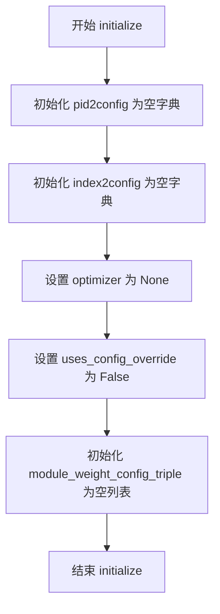
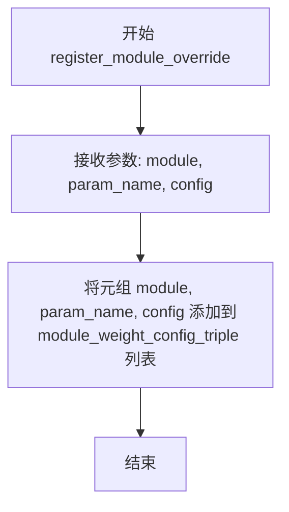
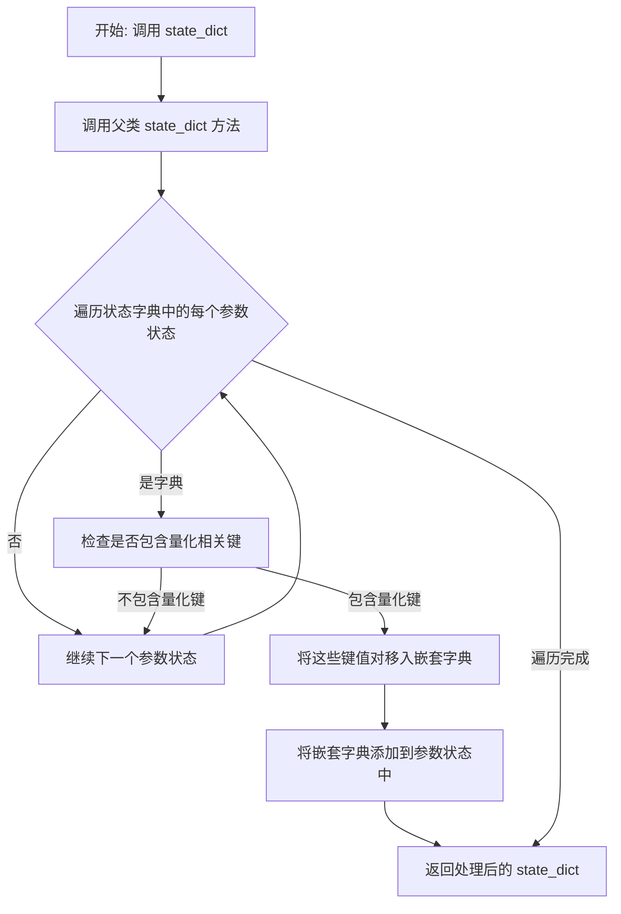
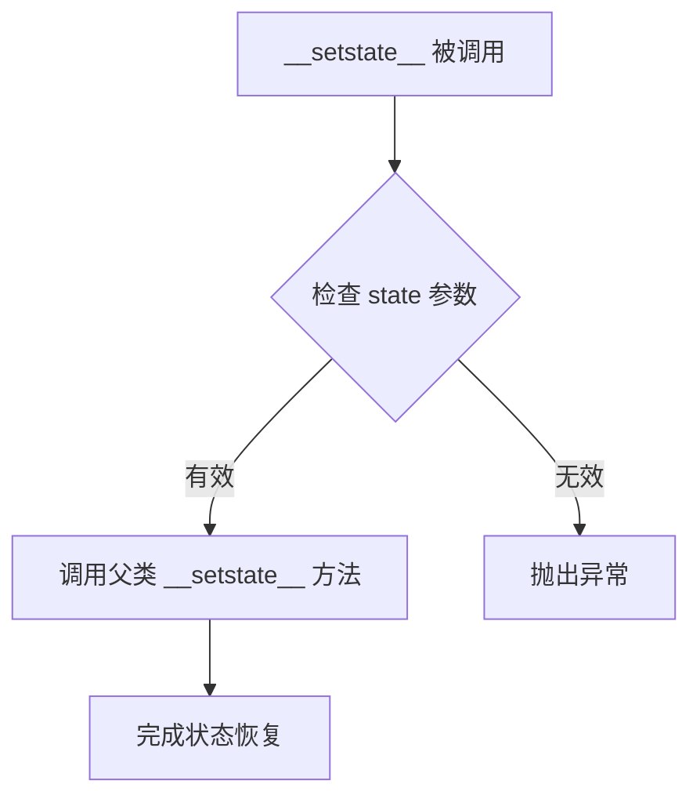
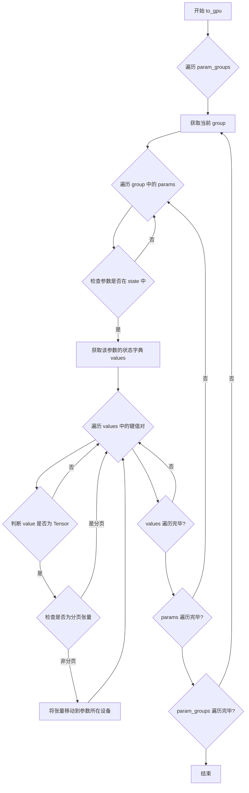
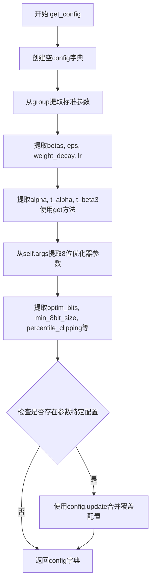
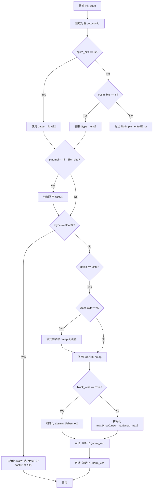
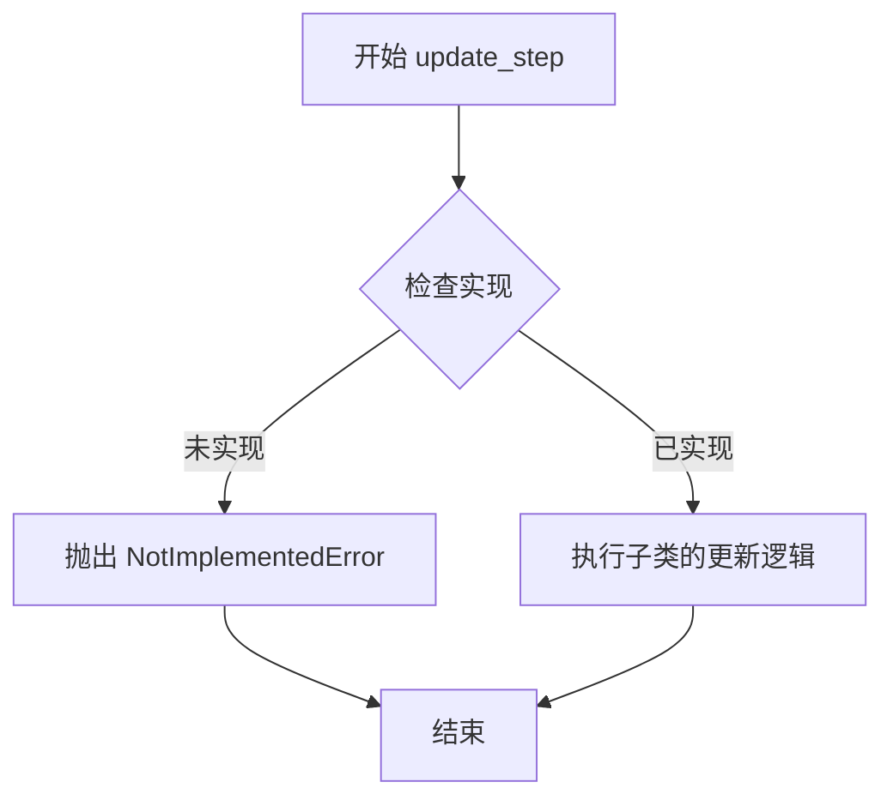
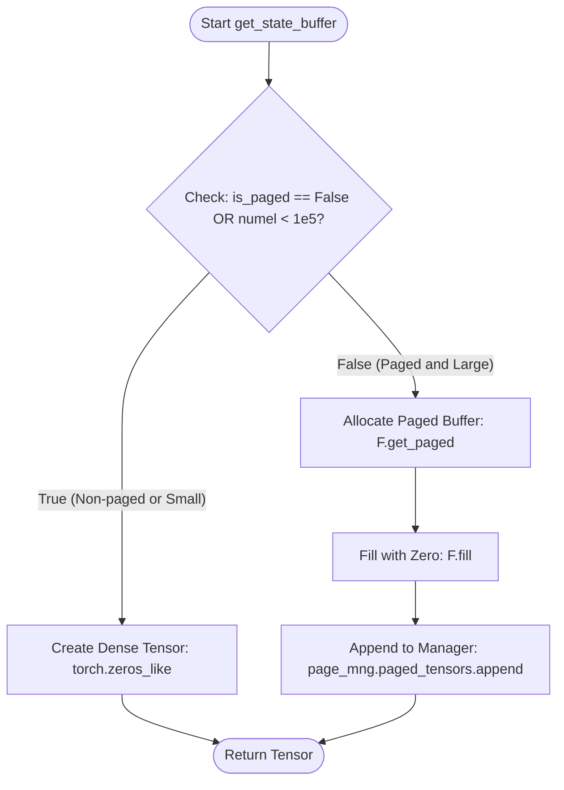

# `bitsandbytes\bitsandbytes\optim\optimizer.py` 详细设计文档

8位优化器核心实现模块，提供了8位和32位优化器基类，支持分页优化器、FSDP兼容性、参数配置覆盖、块级量化和百分位裁剪等高级功能，用于在GPU上高效训练深度学习模型。

## 整体流程

```mermaid
graph TD
    A[开始] --> B[创建优化器实例]
    B --> C{选择优化器类型}
    C -->|Optimizer2State| D[初始化2态优化器]
    C -->|Optimizer1State| E[初始化1态优化器]
    D --> F[调用Optimizer8bit.__init__]
    E --> F
    F --> G[注册参数到GlobalOptimManager]
    G --> H[创建优化器状态]
    H --> I[执行优化步骤 step()]
    I --> J{检查参数梯度}
    J -->|无梯度| K[跳过参数]
    J -->|有梯度| L{首次初始化状态?}
    L -->|是| M[调用init_state初始化状态]
    L -->|否| N[预取状态（如果分页）]
    M --> O[执行update_step更新参数]
    N --> O
    O --> P[同步GPU]
    P --> Q[返回loss]
```

## 类结构

```
MockArgs (工具类)
GlobalOptimManager (单例管理器)
Optimizer8bit (抽象基类)
├── Optimizer2State (2态优化器)
└── Optimizer1State (1态优化器)
```

## 全局变量及字段


### `container_abcs`
    
Alias for collections.abc, providing abstract base classes for container types.

类型：`module`
    


### `defaultdict`
    
A dict subclass that provides a default value for missing keys.

类型：`class`
    


### `deepcopy`
    
Creates a deep copy of an object, recursively copying all nested objects.

类型：`function`
    


### `chain`
    
Iterates over multiple iterables sequentially, chaining them together.

类型：`function`
    


### `Optional`
    
A type hint indicating that a value can be of the specified type or None.

类型：`type_hint`
    


### `torch`
    
The PyTorch library for tensor computations and deep learning.

类型：`module`
    


### `F`
    
bitsandbytes.functional module providing low-level operations for 8-bit optimizers.

类型：`module`
    


### `sync_gpu`
    
Synchronizes GPU operations to ensure consistency across CUDA streams.

类型：`function`
    


### `GlobalOptimManager.pid2config`
    
Maps parameter IDs to their optimizer configuration.

类型：`dict`
    


### `GlobalOptimManager.index2config`
    
Maps (group_index, p_index) tuples to optimizer configurations.

类型：`dict`
    


### `GlobalOptimManager.optimizer`
    
The current optimizer instance managed by the manager.

类型：`object`
    


### `GlobalOptimManager.uses_config_override`
    
Flag indicating whether custom optimizer config overrides are enabled.

类型：`bool`
    


### `GlobalOptimManager.module_weight_config_triple`
    
List of tuples containing (module, param_name, config) for module-specific overrides.

类型：`list`
    


### `Optimizer8bit.initialized`
    
Indicates whether the optimizer has been initialized.

类型：`bool`
    


### `Optimizer8bit.name2qmap`
    
Maps quantization map names to their corresponding quantization mappings.

类型：`dict`
    


### `Optimizer8bit.is_paged`
    
Whether the optimizer uses paged memory management for optimizer states.

类型：`bool`
    


### `Optimizer8bit.page_mng`
    
Instance of GlobalPageManager for handling paged optimizer states.

类型：`object`
    


### `Optimizer8bit.mng`
    
Instance of GlobalOptimManager for managing optimizer configurations.

类型：`GlobalOptimManager`
    


### `Optimizer8bit.non_castable_tensor_keys`
    
Set of tensor keys that should not be cast to other dtypes during state loading.

类型：`set`
    


### `Optimizer2State.args`
    
Object containing optimizer-specific arguments like optim_bits and block_wise.

类型：`MockArgs`
    


### `Optimizer2State.optimizer_name`
    
Name of the optimizer (e.g., 'adam', 'lion').

类型：`str`
    


### `Optimizer1State.args`
    
Object containing optimizer-specific arguments like optim_bits and block_wise.

类型：`MockArgs`
    


### `Optimizer1State.optimizer_name`
    
Name of the optimizer (e.g., 'adam', 'lion').

类型：`str`
    
    

## 全局函数及方法


### `MockArgs.__init__`

该方法是一个简单的构造函数，接收一个字典作为参数，并将字典中的所有键值对动态设置为类的实例属性。

参数：

- `initial_data`：`dict`，包含要设置为实例属性的键值对字典

返回值：`None`，构造函数无返回值

#### 流程图

```mermaid
flowchart TD
    A[开始 __init__] --> B[接收 initial_data 参数]
    B --> C{遍历 initial_data 中的键}
    C -->|对每个 key| D[setattr self, key, initial_data[key]]
    D --> C
    C -->|遍历完成| E[结束 __init__]
```

#### 带注释源码

```python
class MockArgs:
    def __init__(self, initial_data):
        """
        构造函数，将字典中的键值对动态设置为实例属性。
        
        参数:
            initial_data (dict): 包含要设置为实例属性的键值对字典
        """
        # 遍历字典中的所有键
        for key in initial_data:
            # 使用 setattr 将字典中的每个键值对设置为实例属性
            # key 作为属性名，initial_data[key] 作为属性值
            setattr(self, key, initial_data[key])
```


### `GlobalOptimManager.initialize`

初始化全局优化器管理器的内部状态，为管理自定义优化器配置做好准备。

参数：

- `self`：`GlobalOptimManager`，隐式参数，表示当前 GlobalOptimManager 实例

返回值：`None`，无返回值，仅初始化实例属性

#### 流程图



#### 带注释源码

```python
def initialize(self):
    """
    初始化 GlobalOptimManager 实例的内部状态。
    
    此方法在单例实例首次创建时由 get_instance() 调用，
    用于设置所有必要的内部数据结构来管理优化器配置。
    """
    # 存储参数ID到配置映射的字典
    # 键为参数的 id(p)，值为配置字典
    self.pid2config = {}
    
    # 存储参数组索引和参数索引到配置的映射
    # 键为 (group_index, p_index) 元组，值为配置字典
    self.index2config = {}
    
    # 存储当前关联的优化器实例
    # 初始化为 None，在实际使用时会关联具体的优化器
    self.optimizer = None
    
    # 标志位，指示是否使用了配置覆盖功能
    # 当调用 override_config 方法时，此标志会被设置为 True
    self.uses_config_override = False
    
    # 存储模块、参数名和配置的三元组列表
    # 用于通过 register_module_override 注册的模块级别配置
    self.module_weight_config_triple = []
```


### `GlobalOptimManager.get_instance`

获取 `GlobalOptimManager` 类的单例实例。如果实例不存在，则先创建并初始化该实例，然后返回。

参数：

- 该方法为类方法，无显式参数（隐式参数 `cls` 表示类本身）

返回值：`GlobalOptimManager`，返回全局优化器管理器的单例实例

#### 流程图

```mermaid
flowchart TD
    A[开始] --> B{cls._instance is None?}
    B -- 是 --> C[创建新实例: cls.__new__(cls)]
    C --> D[调用 initialize 初始化实例]
    D --> E[保存实例到 cls._instance]
    E --> F[返回 cls._instance]
    B -- 否 --> F
    F --> G[结束]
```

#### 带注释源码

```python
@classmethod
def get_instance(cls):
    """
    获取 GlobalOptimManager 单例实例的类方法。
    使用懒加载模式，在首次调用时创建唯一实例。
    
    Returns:
        GlobalOptimManager: 单例实例，包含了优化器配置管理状态
    """
    # 检查是否已存在实例
    if cls._instance is None:
        # 使用 __new__ 绕过 __init__ 避免直接实例化
        cls._instance = cls.__new__(cls)
        # 调用初始化方法设置初始状态
        cls._instance.initialize()
    # 返回单例实例
    return cls._instance
```


### `GlobalOptimManager.register_parameters`

该方法用于注册优化器的参数，构建参数 ID 到配置以及参数索引到配置的映射关系，以便后续对特定参数进行配置覆盖。

参数：

- `params`：`list[torch.Tensor] | list[dict]`，要注册的张量参数列表。可以是简单的张量列表，也可以是包含 "params" 键的字典列表（param_groups 格式）。

返回值：`None`，该方法无返回值，仅更新内部状态字典 `pid2config` 和 `index2config`。

#### 流程图

```mermaid
flowchart TD
    A[开始 register_parameters] --> B[将 params 转换为列表 param_groups]
    B --> C{检查 param_groups[0] 是否为字典}
    C -->|是| D[保持原样]
    C -->|否| E[将 param_groups 包装为 [{"params": param_groups}]
    D --> F[遍历 param_groups 获取 group_index 和 group]
    E --> F
    F --> G[遍历 group['params'] 获取 p_index 和参数 p]
    G --> H{检查 id(p) 是否在 pid2config 中}
    H -->|是| I[将 index2config[(group_index, p_index)] 设置为 pid2config[id(p)]]
    H -->|否| J[不做任何操作]
    I --> K[继续下一个参数]
    J --> K
    K --> L{是否还有更多参数}
    L -->|是| G
    L -->|否| M{是否还有更多组}
    M -->|是| F
    M -->|否| N[结束]
```

#### 带注释源码

```python
def register_parameters(self, params):
    """
    注册参数以便后续进行配置覆盖。
    
    该方法会遍历传入的参数列表，构建参数ID到配置以及参数索引到配置的映射关系。
    这样在后续优化器初始化时，可以根据参数的位置信息应用特定的优化配置。
    
    Arguments:
        params: 可以是 torch.Tensor 的列表，或者 param_groups 列表（即包含字典的列表，
                每个字典需包含 "params" 键）
    """
    # 将输入转换为列表
    param_groups = list(params)
    
    # 如果第一个元素不是字典，说明传入的是简单的参数列表
    # 需要将其包装为 param_groups 格式
    if not isinstance(param_groups[0], dict):
        param_groups = [{"params": param_groups}]

    # 遍历所有参数组
    for group_index, group in enumerate(param_groups):
        # 遍历当前组中的所有参数
        for p_index, p in enumerate(group["params"]):
            # 如果该参数的 ID 已经在 pid2config 中存在
            # （说明之前已经通过 override_config 设置了配置）
            # 则将该配置关联到当前的 (group_index, p_index) 位置
            if id(p) in self.pid2config:
                self.index2config[(group_index, p_index)] = self.pid2config[id(p)]
```


### GlobalOptimManager.override_config

该方法用于覆盖已注册参数的优化器配置，允许用户为特定的模型参数设置独立的超参数（如学习率、betas或8位优化特定参数如optim_bits），从而实现细粒度的优化器配置控制。

参数：

- `self`：`GlobalOptimManager`，隐式参数，表示类的实例本身
- `parameters`：`torch.nn.Parameter` 或 `list(torch.Tensor)`，需要覆盖配置的目标参数，可以是单个参数或参数列表
- `key`：`str`，要覆盖的超参数名称（如 'betas'、'lr'、'optim_bits' 等）
- `value`：任意类型，对应超参数的值
- `key_value_dict`：`dict`，包含多个键值对的字典，用于批量覆盖超参数

返回值：`None`，该方法直接修改实例状态，不返回任何值

#### 流程图

```mermaid
flowchart TD
    A[开始 override_config] --> B[设置 uses_config_override = True]
    B --> C{parameters 是 Parameter 或 Tensor?}
    C -->|是| D[将 parameters 转换为列表]
    C -->|否| E{key 和 value 都不为 None?}
    D --> E
    E -->|是| F[断言 key_value_dict 必须为 None]
    F --> G[构建 key_value_dict = {key: value}]
    E -->|否| H{key_value_dict 不为 None?}
    G --> H
    H -->|是| I[遍历 parameters 列表]
    H -->|否| J[结束]
    I --> K{p 的 id 在 pid2config 中?}
    K -->|是| L[更新现有配置: pid2config[id(p)].update]
    K -->|否| M[创建新配置: pid2config[id(p)] = key_value_dict]
    L --> N[处理下一个参数]
    M --> N
    N --> I
    I -->|遍历完成| J
```

#### 带注释源码

```
def override_config(self, parameters, key=None, value=None, key_value_dict=None):
    """
    Override initial optimizer config with specific hyperparameters.

    The key-values of the optimizer config for the input parameters are overridden
    This can be both, optimizer parameters like `betas` or `lr`, or it can be
    8-bit specific parameters like `optim_bits` or `percentile_clipping`.

    Arguments:
       parameters (`torch.Tensor` or `list(torch.Tensors)`):
         The input parameters.
       key (`str`):
         The hyperparameter to override.
       value:
         The hyperparameter value.
       key_value_dict (`dict`):
         A dictionary with multiple key-values to override.

    Example:

    ```py
    import torch
    import bitsandbytes as bnb

    mng = bnb.optim.GlobalOptimManager.get_instance()

    model = MyModel()
    mng.register_parameters(model.parameters()) # 1. register parameters while still on CPU

    model = model.cuda()
    # use 8-bit optimizer states for all parameters
    adam = bnb.optim.Adam(model.parameters(), lr=0.001, optim_bits=8)

    # 2. override: the parameter model.fc1.weight now uses 32-bit Adam
    mng.override_config(model.fc1.weight, 'optim_bits', 32)
    ```
    """
    # 标记已启用配置覆盖功能
    self.uses_config_override = True
    
    # 如果是单个 Parameter，转换为列表以便统一处理
    if isinstance(parameters, torch.nn.Parameter):
        parameters = [parameters]
    # 如果是单个 Tensor，转换为列表以便统一处理
    if isinstance(parameters, torch.Tensor):
        parameters = [parameters]
    
    # 如果提供了 key 和 value，则不能同时提供 key_value_dict
    if key is not None and value is not None:
        assert key_value_dict is None
        # 将 key-value 形式转换为字典形式
        key_value_dict = {key: value}

    # 遍历所有参数，为每个参数设置覆盖配置
    if key_value_dict is not None:
        for p in parameters:
            # 如果该参数已有配置，则更新配置（合并）
            if id(p) in self.pid2config:
                self.pid2config[id(p)].update(key_value_dict)
            # 否则创建新的配置条目
            else:
                self.pid2config[id(p)] = key_value_dict
```


### `GlobalOptimManager.register_module_override`

该方法用于注册模块参数的配置覆盖，将模块、参数名称和配置信息添加到全局优化管理器中，以便在后续优化步骤中应用自定义配置。

参数：

- `module`：`torch.nn.Module`，要覆盖配置的模块实例
- `param_name`：`str`，模块中参数的名称（属性名）
- `config`：`dict`，要应用的配置字典，包含优化器参数如 `optim_bits`、`betas` 等

返回值：`None`，该方法无返回值，仅执行配置注册操作

#### 流程图



#### 带注释源码

```python
def register_module_override(self, module, param_name, config):
    """
    注册模块参数的配置覆盖。
    
    该方法允许用户为特定模块的特定参数指定自定义优化器配置。
    在后续优化器初始化时，这些配置会被检查并应用到对应的参数上。
    
    Arguments:
        module (`torch.nn.Module`):
            要覆盖配置的模块实例。例如模型中的某个层 (如 model.fc1)。
        param_name (`str`):
            模块中参数的名称。例如 'weight' 或 'bias'。
        config (`dict`):
            要应用的配置字典。可以包含优化器参数如:
            - optim_bits: 优化器状态位数 (8 或 32)
            - betas: 动量系数
            - lr: 学习率
            - weight_decay: 权重衰减
            - 等等
    
    Example:
        ```py
        import bitsandbytes as bnb
        
        mng = bnb.optim.GlobalOptimManager.get_instance()
        
        # 为特定模块的权重参数注册8位优化配置
        mng.register_module_override(
            model.fc1, 
            'weight', 
            {'optim_bits': 8, 'betas': (0.9, 0.999)}
        )
        ```
    """
    # 将 (模块, 参数名, 配置) 元组添加到列表中保存
    # 后续 Optimizer8bit.check_overrides() 会遍历此列表来应用配置
    self.module_weight_config_triple.append((module, param_name, config))
```


### `Optimizer8bit.__init__`

初始化 8 位优化器基类，设置优化器的基本配置、量化映射、页面管理和全局优化管理器。

参数：

- `params`：`torch.Tensor` 或可迭代对象，需要优化的参数
- `defaults`：`dict`，优化器的默认参数
- `optim_bits`：`int`，默认值 32，优化器状态的位数（8 或 32）
- `is_paged`：`bool`，默认值 False，是否使用分页优化器

返回值：`None`，构造函数无返回值

#### 流程图

```mermaid
flowchart TD
    A[开始 __init__] --> B[调用父类 Optimizer 初始化]
    B --> C[设置 self.initialized = False]
    C --> D[初始化 self.name2qmap = {}]
    D --> E[设置 self.is_paged = is_paged]
    E --> F[获取 GlobalPageManager 单例]
    F --> G[获取 GlobalOptimManager 单例]
    G --> H[设置 non_castable_tensor_keys 集合]
    H --> I{optim_bits == 8?}
    I -->|是| J[调用 fill_qmap]
    I -->|否| K[结束]
    J --> K
```

#### 带注释源码

```
def __init__(self, params, defaults, optim_bits=32, is_paged=False):
    """
    Base 8-bit optimizer class.

    Arguments:
        params (`torch.Tensor`):
            The input parameters to optimize.
        optim_bits (`int`, defaults to 32):
            The number of bits of the optimizer state.
        is_paged (`bool`, defaults to `False`):
            Whether the optimizer is a paged optimizer or not.
    """
    # 调用父类 torch.optim.Optimizer 的初始化方法
    super().__init__(params, defaults)
    
    # 标记优化器是否已初始化（首次 step 时会完成初始化）
    self.initialized = False
    
    # 存储量化映射（quantization mapping）的字典
    self.name2qmap = {}
    
    # 标记是否为分页优化器（用于内存管理）
    self.is_paged = is_paged
    
    # 获取全局页面管理器单例（用于分页内存管理）
    self.page_mng = F.GlobalPageManager.get_instance()

    # 获取全局优化器配置管理器单例
    self.mng = GlobalOptimManager.get_instance()
    
    # 定义不能被类型转换的张量键集合（这些是量化特有的状态）
    self.non_castable_tensor_keys = {
        "qmap1",
        "qmap2",
        "max1",
        "max2",
        "new_max1",
        "new_max2",
        "state1",
        "state2",
        "gnorm_vec",
        "absmax1",
        "absmax2",
        "unorm_vec",
    }

    # 如果使用 8 位优化，则填充量化映射
    if optim_bits == 8:
        self.fill_qmap()
```


### `Optimizer8bit.fill_qmap`

该方法用于初始化8位优化器的动态量化映射表（quantization map），为有符号和无符号张量创建动态量化映射，以支持后续的参数状态量化操作。

参数：

- `self`：`Optimizer8bit` 类实例，隐含参数，表示优化器自身

返回值：`None`，该方法无返回值，直接修改 `self.name2qmap` 字典属性

#### 流程图

```mermaid
flowchart TD
    A[开始 fill_qmap] --> B[调用 F.create_dynamic_map signed=True]
    B --> C[创建有符号动态量化映射]
    C --> D[将映射存入 name2qmap['dynamic']]
    D --> E[调用 F.create_dynamic_map signed=False]
    E --> F[创建无符号动态量化映射]
    F --> G[将映射存入 name2qmap['udynamic']]
    G --> H[结束]
```

#### 带注释源码

```python
def fill_qmap(self):
    """
    初始化动态量化映射表（qmap）。
    
    该方法创建两种量化映射：
    1. dynamic：有符号（signed）映射，用于state1等需要表示负数的状态
    2. udynamic：无符号（unsigned）映射，用于state2等仅需非负数的状态
    
    这些映射在后续优化器更新步骤中用于将32位浮点状态量化为8位整数。
    """
    # 为有符号张量创建动态量化映射表
    # signed=True 表示映射范围包含负值（如 [-127, 127]）
    self.name2qmap["dynamic"] = F.create_dynamic_map(signed=True)
    
    # 为无符号张量创建动态量化映射表
    # signed=False 表示映射范围仅包含非负值（如 [0, 255]）
    self.name2qmap["udynamic"] = F.create_dynamic_map(signed=False)
```


### `Optimizer8bit.state_dict`

返回优化器状态，并将量化张量包装以实现 FSDP 兼容性。该方法通过将量化相关的状态张量（如 state1、state2、absmax 等）包装在嵌套字典中，使 FSDP 在收集完整优化器状态时能够跳过这些形状不匹配的张量，避免跨进程聚合失败。

参数：

- `self`：`Optimizer8bit`，隐式参数，当前优化器实例

返回值：`dict`，返回包含优化器状态的字典，其中量化相关的张量已被包装在嵌套字典中以适配 FSDP

#### 流程图



#### 带注释源码

```
def state_dict(self):
    """Return optimizer state, wrapping quantization tensors for FSDP compatibility.

    FSDP's full_optim_state_dict gathers all tensor states across ranks.
    Quantization states (state1, state2, absmax, etc.) have different shapes
    than model parameters, causing gather operations to fail. By wrapping
    these tensors in a nested dict, FSDP skips them during gathering.
    """
    # 调用父类的 state_dict 方法获取基础优化器状态
    state_dict = super().state_dict()

    # 深拷贝状态以避免修改原始优化器状态
    # PyTorch 的 state_dict() 只做浅拷贝
    state_dict["state"] = {
        k: {kk: vv for kk, vv in v.items()} if isinstance(v, dict) else v 
        for k, v in state_dict["state"].items()
    }

    # 将量化特定张量包装在嵌套字典中以对 FSDP 隐藏
    for param_state in state_dict["state"].values():
        if isinstance(param_state, dict):
            # 创建新的嵌套字典用于存放量化状态
            quant_state = {}
            # 识别需要包装的量化相关键
            keys_to_wrap = [k for k in param_state if k in self.non_castable_tensor_keys]
            # 将这些键值对从原状态中弹出并转移到嵌套字典
            for key in keys_to_wrap:
                quant_state[key] = param_state.pop(key)
            # 如果存在量化状态，将其添加到参数状态中
            if quant_state:
                param_state[self._FSDP_WRAPPED_QUANT_STATE_KEY] = quant_state

    return state_dict
```


### `Optimizer8bit.__setstate__`

该方法是Python序列化/反序列化机制的一部分，在对象被反序列化（unpickle）时调用。它负责恢复优化器对象的状态。此实现简单地调用父类 `torch.optim.Optimizer` 的 `__setstate__` 方法来完成状态的恢复。

参数：

- `state`：`dict`，包含优化器的状态字典，通常包含 `state`（参数状态映射）和 `param_groups`（参数组信息）

返回值：`None`，无返回值（方法默认返回 None）

#### 流程图



#### 带注释源码

```python
def __setstate__(self, state):
    """
    恢复优化器状态的反序列化方法。

    当优化器对象被反序列化（如通过 torch.load 加载）时，
    此方法会被自动调用以恢复优化器的内部状态。

    Arguments:
        state (dict): 包含优化器状态信息的字典，通常包含:
            - 'state': 参数ID到状态的映射
            - 'param_groups': 参数组列表

    Returns:
        None
    """
    # 调用父类 torch.optim.Optimizer 的 __setstate__ 方法
    # 父类方法会负责将传入的 state 字典内容设置到 self.__dict__ 中
    # 从而完成优化器状态的恢复
    super().__setstate__(state)
```


### `Optimizer8bit.load_state_dict`

该方法用于加载优化器的状态字典，支持从先前保存的状态恢复优化器状态。它包含了针对FSDP（FullyShardedDataParallel）兼容性的特殊处理，能够正确解包被包装的量化状态，并验证状态字典的有效性，最后将状态映射到当前参数上。

参数：

- `state_dict`：`dict`，要加载的优化器状态字典（应从 `state_dict()` 方法的返回值中获得）
- `move_to_device`：`bool`，默认为 `True`，是否将优化器状态移动到设备上

返回值：`None`，该方法直接修改优化器实例的内部状态

#### 流程图

```mermaid
flowchart TD
    A[开始 load_state_dict] --> B[深拷贝 state_dict]
    B --> C{遍历 state_dict['state'] 中的 param_state}
    C --> D{检查 FSDP_WRAPPED_QUANT_STATE_KEY 存在?}
    D -->|是| E[弹出量化状态并更新到 param_state]
    D -->|否| F[跳过]
    E --> C
    F --> G[验证 param_groups 数量匹配]
    G --> H{验证每个 group 的 params 数量匹配}
    H -->|不匹配| I[抛出 ValueError]
    H -->|匹配| J[构建 id_map 映射 old_id 到当前参数]
    J --> K[定义 cast 函数用于张量类型转换]
    K --> L{遍历 state_dict['state'] 中的 k, v}
    L --> M{k 在 id_map 中?}
    M -->|是| N[使用 cast 函数转换值并赋值]
    M -->|否| O[直接复制值]
    N --> P[构建新的 state 字典]
    O --> P
    L --> Q[定义 update_group 函数]
    Q --> R[更新 param_groups]
    R --> S[调用 __setstate__ 恢复状态]
    S --> T[结束]
```

#### 带注释源码

```python
def load_state_dict(self, state_dict, move_to_device=True):
    """Load an optimizer state.

    Arguments:
        state_dict (`dict`):
            An optimizer state (should be returned from a call to `state_dict`) to load.
        move_to_device (`bool`, defaults to `True`):
            Whether to move the optimizer's state to the device.
    """
    # deepcopy, to be consistent with module API
    # 深拷贝 state_dict 以保持与 module API 的一致性，避免修改原始状态
    state_dict = deepcopy(state_dict)

    # Unwrap quantization states that were wrapped for FSDP compatibility
    # 解包为 FSDP 兼容性而包装的量化状态
    for param_state in state_dict["state"].values():
        if isinstance(param_state, dict) and self._FSDP_WRAPPED_QUANT_STATE_KEY in param_state:
            quant_state = param_state.pop(self._FSDP_WRAPPED_QUANT_STATE_KEY)
            param_state.update(quant_state)

    # Validate the state_dict
    # 验证 state_dict 的有效性
    groups = self.param_groups
    saved_groups = state_dict["param_groups"]

    # 检查参数组数量是否匹配
    if len(groups) != len(saved_groups):
        raise ValueError("loaded state dict has a different number of parameter groups")
    
    # 检查每个参数组中的参数数量是否匹配
    param_lens = (len(g["params"]) for g in groups)
    saved_lens = (len(g["params"]) for g in saved_groups)
    if any(p_len != s_len for p_len, s_len in zip(param_lens, saved_lens)):
        raise ValueError(
            "loaded state dict contains a parameter group that doesn't match the size of optimizer's group",
        )

    # Update the state
    # 构建旧参数 ID 到当前参数的映射关系
    id_map = {
        old_id: p
        for old_id, p in zip(
            chain.from_iterable(g["params"] for g in saved_groups),
            chain.from_iterable(g["params"] for g in groups),
        )
    }

    def cast(param, value):
        r"""Make a deep copy of value, casting all tensors to device of param."""
        # 处理单个张量的转换
        if isinstance(value, torch.Tensor):
            # 浮点类型特殊处理，假设它们始终与参数类型匹配
            if param.is_floating_point() and value.dtype != torch.uint8:
                value = value.to(param.dtype)
            return value
        # 处理字典类型，递归转换其中的张量
        elif isinstance(value, dict):
            for k, v in value.items():
                if k in self.non_castable_tensor_keys:
                    # 对于量化相关键，根据 move_to_device 决定是否移动到设备
                    if move_to_device:
                        value[k] = v.to(param.device)
                else:
                    value[k] = cast(param, v)

            return value
        # 处理可迭代对象
        elif isinstance(value, container_abcs.Iterable):
            return type(value)(cast(param, v) for v in value)
        else:
            return value

    # Copy state assigned to params (and cast tensors to appropriate types).
    # State that is not assigned to params is copied as is (needed for
    # backward compatibility).
    # 复制分配给参数的状态，并对张量进行适当的类型转换
    state = defaultdict(dict)
    for k, v in state_dict["state"].items():
        if k in id_map:
            param = id_map[k]
            state[param] = cast(param, v)
        else:
            state[k] = v

    # Update parameter groups, setting their 'params' value
    # 更新参数组，设置其 'params' 值
    def update_group(group, new_group):
        new_group["params"] = group["params"]
        return new_group

    param_groups = [update_group(g, ng) for g, ng in zip(groups, saved_groups)]
    self.__setstate__({"state": state, "param_groups": param_groups})
```


### `Optimizer8bit.to_gpu`

该方法负责将优化器状态（optimizer state）中所有分页的张量移动到对应的参数设备上，确保在纯FP16训练等场景下，优化器状态与模型参数在同一设备上。

参数：空（无显式参数）

返回值：`None`，无返回值，仅修改对象内部状态

#### 流程图



#### 带注释源码

```python
def to_gpu(self):
    """
    将优化器状态中的张量移动到参数所在的GPU设备上。
    该方法主要用于Fairseq等框架的纯FP16训练场景，
    确保优化器状态与模型参数在同一设备。
    """
    # 遍历优化器的所有参数组（每个参数组可能有不同的超参数配置）
    for gindex, group in enumerate(self.param_groups):
        # 遍历当前参数组中的所有参数张量
        for pindex, p in enumerate(group["params"]):
            # 检查该参数是否有对应的优化器状态
            if p in self.state:
                # 获取该参数的优化器状态字典
                values = self.state[p]
                # 遍历状态字典中的所有键值对
                for k, v in values.items():
                    # 只处理张量类型的值（如state1, state2等）
                    if isinstance(v, torch.Tensor):
                        # 检查该张量是否为分页张量（paged optimizer使用）
                        is_paged = getattr(v, "is_paged", False)
                        # 如果不是分页张量，则移动到参数所在设备
                        if not is_paged:
                            # 将状态张量移动到参数p所在的设备上
                            self.state[p][k] = v.to(p.device)
```


### `Optimizer8bit.check_overrides`

该方法用于检查并应用通过 `GlobalOptimManager` 注册的模块参数配置覆盖。它遍历已注册的模块-参数-配置三元组，将优化器中的参数与注册的参数进行匹配，并将对应的配置应用到优化器的参数配置映射中。

**注意**：该方法没有显式参数，只有一个隐式的 `self` 参数。

参数：

-  `self`：`Optimizer8bit`（隐式），Optimizer8bit 实例本身

返回值：`None`，无返回值。该方法直接修改 `self.mng`（GlobalOptimManager 实例）的 `pid2config` 和 `index2config` 字典来应用配置覆盖。

#### 流程图

```mermaid
flowchart TD
    A[开始 check_overrides] --> B{遍历 module_weight_config_triple}
    B --> C[获取当前模块的指定属性参数 pmodule]
    D[断言 pmodule 不为 None]
    E[断言 pmodule 是 Tensor 或 Parameter]
    F[初始化 found = False]
    G{遍历 param_groups 查找匹配}
    H{遍历 group 中的 params}
    I{id(p) == id(pmodule)?}
    I -- 是 --> J[将 config 存入 pid2config]
    J --> K[将配置索引存入 index2config]
    K --> L[设置 found = True]
    L --> M[跳出循环]
    I -- 否 --> N[继续下一个 param]
    M --> O{继续下一个 module}
    O --> B
    B --> P[结束]
```

#### 带注释源码

```
def check_overrides(self):
    """
    检查并应用模块参数的配置覆盖。
    
    该方法遍历通过 GlobalOptimManager.register_module_override() 注册的
    所有模块参数配置，检查优化器参数组中是否存在对应的参数，
    如果找到匹配，则将配置应用到优化器的参数配置映射中。
    """
    # 遍历所有已注册的模块-属性-配置三元组
    # module: 神经网络模块
    # attr: 参数属性名（如 'weight', 'bias'）
    # config: 要覆盖的配置字典
    for module, attr, config in self.mng.module_weight_config_triple:
        
        # 通过 getattr 获取模块中的参数张量
        pmodule = getattr(module, attr)
        
        # 确保参数存在
        assert pmodule is not None
        
        # 确保是张量类型（Tensor 或 Parameter）
        assert isinstance(pmodule, torch.Tensor) or isinstance(pmodule, torch.Parameter)
        
        # 标记是否找到匹配的参数
        found = False
        
        # 遍历优化器的所有参数组
        for gindex, group in enumerate(self.param_groups):
            if found:
                break
            
            # 遍历当前参数组中的所有参数
            for pindex, p in enumerate(group["params"]):
                if found:
                    break
                
                # 检查当前参数是否与模块参数匹配（通过对象 ID 比较）
                if id(p) == id(pmodule):
                    # 找到匹配的参数
                    # 将配置存入 pid2config 字典，使用参数对象 ID 作为键
                    self.mng.pid2config[id(p)] = config
                    
                    # 同时在 index2config 中建立 (group_index, param_index) 到配置的映射
                    self.mng.index2config[(gindex, pindex)] = self.mng.pid2config[id(p)]
                    
                    # 设置标记并跳出循环
                    found = True
```


### `Optimizer8bit.step`

执行单个优化步骤，包括梯度下降、参数更新和状态同步。该方法是8位优化器的核心入口点，负责遍历参数组、初始化优化器状态、执行参数更新，并处理分页优化器的异步操作。

参数：

- `closure`：`Callable` 或 `None`，可选参数，默认值为 `None`。一个闭包函数，用于重新评估模型并返回损失值。如果提供，则在计算梯度前先执行前向传播和损失计算。

返回值：`torch.Tensor` 或 `None`，返回闭包的损失值（如果提供了闭包），否则返回 `None`。

#### 流程图

```mermaid
flowchart TD
    A[开始 step] --> B{closure is not None?}
    B -->|Yes| C[启用梯度计算<br/>执行 closure 获取 loss]
    B -->|No| D[loss = None]
    C --> E[loss = closure返回值]
    D --> F{self.initialized?}
    E --> F
    F -->|No| G[执行 check_overrides<br/>执行 to_gpu<br/>设置 initialized = True]
    F -->|Yes| H[跳过初始化]
    G --> I[初始化 p = None]
    H --> I
    I --> J[遍历 param_groups]
    J --> K[遍历 group 中的 params]
    K --> L{p.grad is None?}
    L -->|Yes| M[跳过该参数<br/>继续下一个参数]
    L -->|No| N[获取 state = self.state[p]]
    N --> O{len(state) == 0?}
    O -->|Yes| P[执行 init_state<br/>初始化优化器状态]
    O -->|No| Q[跳过初始化]
    P --> R[执行 prefetch_state<br/>预取分页状态]
    Q --> R
    R --> S[执行 update_step<br/>更新参数]
    S --> T[执行 sync_gpu<br/>同步GPU]
    M --> U{还有更多 params?}
    T --> U
    U -->|Yes| K
    U -->|No| V{还有更多 param_groups?}
    V -->|Yes| J
    V -->|No| W{self.is_paged and p is not None?}
    W -->|Yes| X[执行 sync_gpu<br/>同步分页操作]
    W -->|No| Y[返回 loss]
    X --> Y
```

#### 带注释源码

```python
@torch.no_grad()
def step(self, closure=None):
    """Perform a single optimization step.

    Arguments:
        closure (`Callable`, *optional*, defaults to `None`):
            A closure that reevaluates the model and returns the loss.
    """
    # 初始化损失值为 None
    loss = None
    
    # 如果提供了闭包函数，则执行闭包以计算损失
    # 闭包通常用于需要多次前向传播的优化算法（如 L-BFGS）
    if closure is not None:
        with torch.enable_grad():
            # 执行闭包并获取损失值
            loss = closure()

    # 首次调用时执行初始化操作
    if not self.initialized:
        # 检查并应用参数级别的配置覆盖
        self.check_overrides()
        
        # 将优化器状态移动到 GPU（用于 fairseq 纯 fp16 训练）
        self.to_gpu()
        
        # 标记已初始化，避免重复初始化
        self.initialized = True

    # 用于跟踪最后一个参数（用于分页同步）
    p = None
    
    # 遍历所有参数组
    for gindex, group in enumerate(self.param_groups):
        # 遍历当前参数组中的所有参数
        for pindex, p in enumerate(group["params"]):
            # 跳过没有梯度的参数（例如冻结的参数）
            if p.grad is None:
                continue
            
            # 获取该参数的优化器状态
            state = self.state[p]
            
            # 如果状态为空，则初始化该参数的优化器状态
            if len(state) == 0:
                self.init_state(group, p, gindex, pindex)

            # 预取分页内存中的状态数据（如果使用分页优化器）
            self.prefetch_state(p)
            
            # 执行实际的参数更新
            self.update_step(group, p, gindex, pindex)
            
            # 同步 GPU 操作，确保张量操作完成
            sync_gpu(p)
    
    # 如果是分页优化器，需要额外同步以确保所有异步操作完成
    # 分页操作是异步的，必须同步以确保张量处于正确状态
    if self.is_paged and p is not None:
        sync_gpu(p)

    # 返回损失值（如果提供了闭包）
    return loss
```


### `Optimizer8bit.get_config`

该方法用于获取给定参数组的优化器配置信息。它从参数组中提取标准优化器参数（如学习率、beta值、epsilon等），并结合8位优化器的特定参数（如optim_bits、block_wise等），同时检查是否存在针对特定参数的配置覆盖，最终返回完整的配置字典供优化器更新步骤使用。

**参数：**

- `gindex`：`int`，参数组的索引，用于标识当前处理的参数组
- `pindex`：`int`，参数在组内的索引，用于标识组内的具体参数
- `group`：`dict`，包含参数组优化器配置的字典，如lr、betas、eps、weight_decay等

**返回值：** `dict`，返回包含完整优化器配置的字典，包括标准优化器参数和8位优化器特定参数

#### 流程图



#### 带注释源码

```python
def get_config(self, gindex, pindex, group):
    """
    获取给定参数组的优化器配置。

    Arguments:
        gindex (int): 参数组的索引。
        pindex (int): 参数在组内的索引。
        group (dict): 参数组的配置字典。

    Returns:
        dict: 包含完整优化器配置的字典。
    """
    # 创建配置字典并初始化基础优化器参数
    config = {}
    config["betas"] = group["betas"]           # 动量衰减系数
    config["eps"] = group["eps"]                 # 防止除零的epsilon值
    config["weight_decay"] = group["weight_decay"]  # 权重衰减系数
    config["lr"] = group["lr"]                   # 学习率
    
    # 提取可选参数，使用默认值
    config["alpha"] = group.get("alpha", 0.0)    # AdEMAMix的alpha参数
    config["t_alpha"] = group.get("t_alpha", None)  # alpha调度迭代次数
    config["t_beta3"] = group.get("t_beta3", None)  # beta3调度迭代次数
    
    # 从self.args提取8位优化器特定参数
    config["optim_bits"] = self.args.optim_bits           # 优化器状态位数(8或32)
    config["min_8bit_size"] = self.args.min_8bit_size     # 启用8位优化的最小参数大小
    config["percentile_clipping"] = self.args.percentile_clipping  # 梯度百分位裁剪阈值
    config["block_wise"] = self.args.block_wise           # 是否使用块级量化
    config["max_unorm"] = self.args.max_unorm             # 最大无范数限制
    config["skip_zeros"] = self.args.skip_zeros           # 是否跳过零值梯度
    
    # 检查是否存在针对特定参数的配置覆盖
    # GlobalOptimManager允许对单个参数使用自定义配置
    if (gindex, pindex) in self.mng.index2config:
        # 如果存在覆盖配置，则合并到当前config中
        config.update(self.mng.index2config[(gindex, pindex)])
    
    return config
```


### Optimizer8bit.init_state

初始化优化器状态的抽象方法，用于为单个参数分配和初始化优化器状态缓冲区（如动量、梯度缩放因子等）。该方法在Optimizer8bit基类中声明为抽象方法，实际实现在子类Optimizer2State和Optimizer1State中，根据优化位数（8-bit或32-bit）采用不同的初始化策略。

参数：

- `group`：`dict`，包含优化器组的配置参数（如学习率、betas、weight_decay等）
- `p`：`torch.Tensor`，需要初始化状态的参数张量
- `gindex`：`int`，参数组索引，用于获取特定参数组的配置
- `pindex`：`int`，参数在参数组内的索引，用于获取特定参数的配置

返回值：`None`，该方法直接修改optimizer的state字典，不返回值

#### 流程图



#### 带注释源码

```python
@torch.no_grad()
def init_state(self, group, p, gindex, pindex):
    """
    初始化优化器状态，为参数分配状态缓冲区。
    
    根据配置中的optim_bits决定使用32位(float32)还是8位(uint8)优化器状态。
    对于小参数(min_8bit_size以下)，强制使用32位以避免量化开销。
    """
    # 1. 获取当前参数的配置信息（合并了全局配置和参数特定覆盖配置）
    config = self.get_config(gindex, pindex, group)

    # 2. 根据optim_bits确定数据类型：32位用float32，8位用uint8
    if config["optim_bits"] == 32:
        dtype = torch.float32
    elif config["optim_bits"] == 8:
        dtype = torch.uint8
    else:
        raise NotImplementedError(f"Amount of optimizer bits not supported: {config['optim_bits']}")

    # 3. 对于小参数，强制使用32位以减少量化开销
    if p.numel() < config["min_8bit_size"]:
        dtype = torch.float32

    # 4. 获取参数状态字典并初始化step计数器
    state = self.state[p]
    state["step"] = 0

    # 5. 根据dtype初始化状态缓冲区
    if dtype == torch.float32:
        # 32位优化：创建两个float32状态缓冲区(state1和state2对应一阶和二阶动量)
        state["state1"] = self.get_state_buffer(p, dtype=torch.float32)
        state["state2"] = self.get_state_buffer(p, dtype=torch.float32)
    elif dtype == torch.uint8:
        # 8位优化：首次初始化时填充量化映射并转移到设备
        if state["step"] == 0:
            if "dynamic" not in self.name2qmap:
                self.fill_qmap()
            self.name2qmap["dynamic"] = self.name2qmap["dynamic"].to(p.device)
            self.name2qmap["udynamic"] = self.name2qmap["udynamic"].to(p.device)

        # 创建uint8状态缓冲区和对应的量化映射
        state["state1"] = self.get_state_buffer(p, dtype=torch.uint8)
        state["qmap1"] = self.name2qmap["dynamic"]

        state["state2"] = self.get_state_buffer(p, dtype=torch.uint8)
        state["qmap2"] = self.name2qmap["udynamic"]

        # 根据block_wise配置选择不同的缩放因子存储方式
        if config["block_wise"]:
            # 块级量化：为每个256元素块存储独立的absmax值
            blocksize = 256
            n = p.numel()
            blocks = (n // blocksize) + bool(n % blocksize)

            state["absmax1"] = torch.zeros((blocks,), dtype=torch.float32, device=p.device)
            state["absmax2"] = torch.zeros((blocks,), dtype=torch.float32, device=p.device)
        else:
            # 全局量化：存储单个max值用于缩放
            state["max1"] = torch.zeros((1,), dtype=torch.float32, device=p.device)
            state["new_max1"] = torch.zeros((1,), dtype=torch.float32, device=p.device)
            state["max2"] = torch.zeros((1,), dtype=torch.float32, device=p.device)
            state["new_max2"] = torch.zeros((1,), dtype=torch.float32, device=p.device)

    # 6. 如果启用百分位裁剪，初始化梯度范数历史向量
    if config["percentile_clipping"] < 100:
        state["gnorm_vec"] = torch.zeros((100,), device=p.device)

    # 7. 如果启用最大归一化，初始化归一化向量
    if config["max_unorm"] > 0.0:
        state["unorm_vec"] = torch.zeros((1,), device=p.device)
```


### `Optimizer8bit.update_step`

该方法是 8 位优化器的抽象更新步骤方法，定义了参数更新的接口规范，由子类实现具体的更新逻辑。参数包括优化器参数组、当前参数张量以及对应的组索引和参数索引。

参数：

- `group`：`dict`，优化器参数组，包含学习率、权重衰减等超参数
- `p`：`torch.Tensor`，当前需要更新的参数张量
- `gindex`：`int`，参数组的索引
- `pindex`：`int`，参数在参数组中的索引

返回值：`None`，该方法为抽象方法，不返回任何值

#### 流程图



#### 带注释源码

```python
def update_step(self, group, p, gindex, pindex):
    """
    执行单个参数更新步骤的抽象方法。
    
    该方法定义了参数更新的接口，由子类实现具体的更新逻辑。
    子类需要根据优化算法（如 Adam、LAMB 等）实现参数更新公式，
    支持 8 位量化、块级量化、百分位裁剪等高级特性。
    
    参数:
        group (dict): 优化器参数组，包含以下键:
            - lr (float): 学习率
            - betas (tuple): 动量系数
            - eps (float): 数值稳定性常数
            - weight_decay (float): 权重衰减系数
        p (torch.Tensor): 需要更新的参数张量
        gindex (int): 参数组的索引
        pindex (int): 参数在参数组中的索引
    
    返回:
        None: 该方法不返回值
        
    注意:
        - 该方法为抽象方法，需要由子类重写
        - 子类实现时应处理以下情况:
            - 32 位浮点状态更新
            - 8 位量化状态更新（非块级）
            - 8 位量化状态更新（块级）
            - 百分位裁剪梯度处理
            - 最大范数归一化
            - 稀疏梯度零值跳过
    """
    raise NotImplementedError("The update_step method needs to be overridden")
```


### `Optimizer8bit.get_state_buffer`

该方法负责为优化器状态（如一阶或二阶动量）分配零初始化的缓冲区。它根据优化器是否启用分页模式以及参数张量的大小（阈值设定为 1e5 元素）来决定内存分配策略：对于小参数或非分页模式，使用标准的 `torch.zeros_like` 在 GPU 上创建密集张量；对于大参数且启用分页的模式，则调用底层分页内存管理器分配页级缓冲区，以优化大规模模型的显存占用。

参数：

- `self`：隐式参数，Optimizer8bit 类的实例。
- `p`：`torch.Tensor`，目标参数张量，用于确定缓冲区的形状（shape）和设备（device）。
- `dtype`：`torch.dtype`，可选，默认为 `torch.float32`，指定缓冲区创建时的数据类型。

返回值：`torch.Tensor`，返回一个形状与参数 `p` 相同、数据类型为 `dtype` 的全零张量；如果满足分页条件（大参数），则返回由分页管理器创建的分页缓冲区。

#### 流程图



#### 带注释源码

```python
def get_state_buffer(self, p, dtype=torch.float32):
    """
    获取优化器状态的缓冲区。

    参数:
        p (torch.Tensor): 参数张量。
        dtype (torch.dtype): 缓冲区数据类型，默认为 float32。

    返回:
        torch.Tensor: 零初始化的缓冲区。
    """
    # 判断条件：如果未启用分页模式，或者参数元素数量小于阈值（1e5）
    # 则直接创建标准的密集张量，避免分页带来的额外开销
    if not self.is_paged or p.numel() < 1e5:
        return torch.zeros_like(p, dtype=dtype, device=p.device)
    else:
        # 当启用分页且参数规模较大时（> 1MB），使用分页内存管理
        # 调用底层 functional 接口获取分页缓冲区
        buff = F.get_paged(*p.shape, dtype=dtype, device=p.device)
        
        # 将缓冲区填充为 0
        F.fill(buff, 0)
        
        # 将新创建的分页张量追加到页面管理器的列表中，以便后续统一释放
        self.page_mng.paged_tensors.append(buff)
        
        return buff
```


### `Optimizer8bit.prefetch_state`

该方法用于在paged（分页）优化器模式下，提前将当前参数对应的优化器状态（例如 `state1` 和 `state2`）从CPU分页内存预取到GPU，以隐藏数据传输延迟，提升优化器步骤的执行效率。

参数：

-  `p`：`torch.Tensor`，需要预取状态的模型参数（Tensor）。

返回值：`None`，无返回值。该操作通常为异步执行。

#### 流程图

```mermaid
flowchart TD
    A([Start prefetch_state]) --> B{self.is_paged?}
    B -- No --> C([Return / Do nothing])
    B -- Yes --> D[Get state = self.state[p]]
    D --> E{state1.is_paged?}
    E -- No or Missing --> C
    E -- Yes --> F[Call F.prefetch_tensor(state1)]
    F --> G{state2 in state?}
    G -- No --> C
    G -- Yes --> H[Call F.prefetch_tensor(state2)]
    H --> C
```

#### 带注释源码

```python
def prefetch_state(self, p):
    # 检查优化器是否配置为分页模式 (paged mode)
    if self.is_paged:
        # 获取参数 p 对应的优化器状态字典
        state = self.state[p]
        # 获取一阶动量状态 (state1)
        s1 = state["state1"]
        
        # 检查该状态张量是否处于分页状态 (即是否驻留在CPU内存中)
        is_paged = getattr(s1, "is_paged", False)
        
        # 如果状态确实被分页，则触发预取操作
        if is_paged:
            # 将一阶动量 state1 预取到计算设备 (通常是GPU)
            F.prefetch_tensor(state["state1"])
            
            # 如果存在二阶动量 (state2)，也进行预取
            if "state2" in state:
                F.prefetch_tensor(state["state2"])
```


### `Optimizer2State.__init__`

这是 `Optimizer2State` 类的构造函数，用于初始化一个支持2状态更新的8位优化器（如Adam）。该优化器支持多种高级特性，包括动态量化、分块量化、百分位裁剪和梯度归一化。

参数：

- `optimizer_name`：`str`，优化器的名称（如 "adam"、"lion" 等）
- `params`：`torch.Tensor`，要优化的输入参数
- `lr`：`float`，默认为 `1e-3`，学习率
- `betas`：`tuple`，默认为 `(0.9, 0.999)`，优化器的 beta 值（一阶和二阶动量衰减系数）
- `eps`：`float`，默认为 `1e-8`，用于数值稳定的 epsilon 值
- `weight_decay`：`float`，默认为 `0.0`，权重衰减系数
- `optim_bits`：`int`，默认为 `32`，优化器状态的位数（支持 8 位或 32 位）
- `args`：`object`，默认为 `None`，包含额外配置参数的对象
- `min_8bit_size`：`int`，默认为 `4096`，启用 8 位优化的最小参数张量元素数
- `percentile_clipping`：`int`，默认为 `100`，百分位裁剪阈值，用于自动调整梯度裁剪
- `block_wise`：`bool`，默认为 `True`，是否独立量化每个张量块以减少异常值影响
- `max_unorm`：`float`，默认为 `0.0`，每个块归一化的最大值
- `skip_zeros`：`bool`，默认为 `False`，是否跳过稀疏梯度的零值以确保正确更新
- `is_paged`：`bool`，默认为 `False`，是否为分页优化器（用于内存管理）
- `alpha`：`float`，默认为 `0.0`，AdEMAMix 优化器的 alpha 值
- `t_alpha`：`Optional[int]`，默认为 `None`，AdEMAMix 的 alpha 调度迭代次数
- `t_beta3`：`Optional[int]`，默认为 `None`，AdEMAMix 的 beta3 调度迭代次数

返回值：`None`，构造函数不返回值，仅初始化对象状态

#### 流程图

```mermaid
flowchart TD
    A[开始 __init__] --> B{验证 lr >= 0}
    B -->|否| C[抛出 ValueError]
    B -->|是| D{验证 eps >= 0}
    D -->|否| E[抛出 ValueError]
    D -->|是| F{betas 是字符串?}
    F -->|是| G[解析字符串为浮点数列表]
    F -->|否| H[直接使用 betas]
    G --> I[验证每个 beta 在 [0, 1) 范围内]
    H --> I
    I -->|无效| J[抛出 ValueError]
    I -->|有效| K{验证 weight_decay >= 0}
    K -->|否| L[抛出 ValueError]
    K -->|是| M[构建 defaults 字典]
    M --> N[调用父类 __init__]
    N --> O{args is None?}
    O -->|是| P[创建 args 字典并封装为 MockArgs]
    O -->|否| Q[直接使用 args]
    P --> R[设置 self.optimizer_name]
    Q --> R
    R --> S[结束 __init__]
```

#### 带注释源码

```python
def __init__(
    self,
    optimizer_name,
    params,
    lr=1e-3,
    betas=(0.9, 0.999),
    eps=1e-8,
    weight_decay=0.0,
    optim_bits=32,
    args=None,
    min_8bit_size=4096,
    percentile_clipping=100,
    block_wise=True,
    max_unorm=0.0,
    skip_zeros=False,
    is_paged=False,
    alpha=0.0,
    t_alpha: Optional[int] = None,
    t_beta3: Optional[int] = None,
):
    """
    Base 2-state update optimizer class.

    Arguments:
        optimizer_name (`str`):
            The name of the optimizer.
        params (`torch.Tensor`):
            The input parameters to optimize.
        lr (`float`, defaults to 1e-3):
            The learning rate.
        betas (`tuple`, defaults to (0.9, 0.999)):
            The beta values for the optimizer.
        eps (`float`, defaults to 1e-8):
            The epsilon value for the optimizer.
        weight_decay (`float`, defaults to 0.0):
            The weight decay value for the optimizer.
        optim_bits (`int`, defaults to 32):
            The number of bits of the optimizer state.
        args (`object`, defaults to `None`):
            An object with additional arguments.
        min_8bit_size (`int`, defaults to 4096):
            The minimum number of elements of the parameter tensors for 8-bit optimization.
        percentile_clipping (`int`, defaults to 100):
            Adapts clipping threshold automatically by tracking the last 100 gradient norms and clipping the gradient at a certain percentile to improve stability.
        block_wise (`bool`, defaults to `True`):
            Whether to independently quantize each block of tensors to reduce outlier effects and improve stability.
        max_unorm (`float`, defaults to 0.0):
            The maximum value to normalize each block with.
        skip_zeros (`bool`, defaults to `False`):
            Whether to skip zero values for sparse gradients and models to ensure correct updates.
        is_paged (`bool`, defaults to `False`):
            Whether the optimizer is a paged optimizer or not.
        alpha (`float`, defaults to 0.0):
            The alpha value for the AdEMAMix optimizer.
        t_alpha (`Optional[int]`, defaults to `None`):
            Number of iterations for alpha scheduling with AdEMAMix.
        t_beta3 (`Optional[int]`, defaults to `None`):
            Number of iterations for beta scheduling with AdEMAMix.

    """
    # 验证学习率的有效性
    if not 0.0 <= lr:
        raise ValueError(f"Invalid learning rate: {lr}")
    
    # 验证 epsilon 的有效性
    if not 0.0 <= eps:
        raise ValueError(f"Invalid epsilon value: {eps}")
    
    # 处理字符串格式的 betas（如 "(0.9, 0.999)"）
    if isinstance(betas, str):
        # format: '(beta1, beta2)'
        betas = betas.replace("(", "").replace(")", "").strip().split(",")
        betas = [float(b) for b in betas]
    
    # 验证每个 beta 值在 [0, 1) 范围内
    for i in range(len(betas)):
        if not 0.0 <= betas[i] < 1.0:
            raise ValueError(f"Invalid beta parameter at index {i}: {betas[i]}")
    
    # 验证 weight_decay 的有效性
    if not 0.0 <= weight_decay:
        raise ValueError(f"Invalid weight_decay value: {weight_decay}")

    # 构建默认参数字典，包含优化器的超参数
    defaults = dict(
        lr=lr, 
        betas=betas, 
        eps=eps, 
        weight_decay=weight_decay, 
        alpha=alpha, 
        t_alpha=t_alpha, 
        t_beta3=t_beta3
    )

    # 调用父类 Optimizer8bit 的初始化方法
    super().__init__(params, defaults, optim_bits, is_paged)

    # 如果没有提供 args，则创建默认配置字典
    if args is None:
        args = {}
        args["optim_bits"] = optim_bits
        args["min_8bit_size"] = min_8bit_size
        args["percentile_clipping"] = percentile_clipping
        args["block_wise"] = block_wise
        args["max_unorm"] = max_unorm
        args["skip_zeros"] = skip_zeros

        # 使用 MockArgs 封装字典为对象
        self.args = MockArgs(args)
    else:
        # 使用提供的 args 对象
        self.args = args

    # 设置优化器名称
    self.optimizer_name = optimizer_name
```


### `Optimizer2State.init_state`

初始化优化器状态，为给定的参数张量分配状态缓冲区（state buffers），根据优化器配置（optim_bits、block_wise等）决定使用32位浮点数还是8位量化来存储优化器状态。

参数：

- `group`：`dict`，包含优化器参数组配置（如lr、betas、eps等）
- `p`：`torch.Tensor`，需要初始化状态的参数张量
- `gindex`：`int`，参数组索引
- `pindex`：`int`，参数在参数组内的索引

返回值：`None`，该方法直接修改optimizer的内部state字典

#### 流程图

```mermaid
flowchart TD
    A[开始 init_state] --> B[获取配置 get_config]
    B --> C{optim_bits == 32?}
    C -->|Yes| D[ dtype = float32]
    C -->|No| E{optim_bits == 8?}
    E -->|Yes| F[ dtype = uint8]
    E -->|No| G[raise NotImplementedError]
    D --> H{p.numel < min_8bit_size?}
    F --> H
    H -->|Yes| I[ dtype = float32]
    H -->|No| J[保持dtype]
    I --> J
    J --> K[初始化 state.step = 0]
    K --> L{dtype == float32?}
    L -->|Yes| M[创建state1和state2缓冲区 float32]
    L -->|No| N{dtype == uint8?}
    N -->|Yes| O{state.step == 0?}
    O -->|Yes| P[确保qmap已创建并移动到设备]
    O -->|No| Q
    P --> Q[创建state1和state2缓冲区 uint8]
    Q --> R{qmap已存在?}
    R -->|No| S[动态创建qmap]
    R -->|Yes| T[直接使用]
    S --> T
    T --> U[设置qmap1和qmap2]
    U --> V{block_wise == True?}
    V -->|Yes| W[计算block数量创建absmax1/absmax2]
    V -->|No| X[创建max1/new_max1/max2/new_max2]
    W --> Y{percentile_clipping < 100?}
    X --> Y
    Y -->|Yes| Z[创建gnorm_vec]
    Y -->|No| AA{max_unorm > 0?}
    Z --> AA
    AA -->|Yes| AB[创建unorm_vec]
    AA -->|No| AC[结束]
    AB --> AC
```

#### 带注释源码

```python
@torch.no_grad()
def init_state(self, group, p, gindex, pindex):
    # 获取当前参数组和参数的配置信息
    # 包含: lr, betas, eps, weight_decay, optim_bits, min_8bit_size, 
    # percentile_clipping, block_wise, max_unorm, skip_zeros等
    config = self.get_config(gindex, pindex, group)

    # 根据optim_bits决定数据类型：32位用float32，8位用uint8
    if config["optim_bits"] == 32:
        dtype = torch.float32
    elif config["optim_bits"] == 8:
        dtype = torch.uint8
    else:
        raise NotImplementedError(f"Amount of optimizer bits not supported: {config['optim_bits']}")

    # 如果参数元素数量小于最小8位优化阈值，强制使用32位
    if p.numel() < config["min_8bit_size"]:
        dtype = torch.float32

    # 获取该参数对应的优化器状态字典
    state = self.state[p]
    # 初始化步数计数器
    state["step"] = 0

    # 分支1: 使用32位浮点数存储状态
    if dtype == torch.float32:
        # 创建两个状态缓冲区 (用于动量等)
        state["state1"] = self.get_state_buffer(p, dtype=torch.float32)
        state["state2"] = self.get_state_buffer(p, dtype=torch.float32)
    
    # 分支2: 使用8位量化存储状态
    elif dtype == torch.uint8:
        # 首次初始化时，确保量化映射表存在并移到正确设备
        if state["step"] == 0:
            if "dynamic" not in self.name2qmap:
                self.fill_qmap()
            self.name2qmap["dynamic"] = self.name2qmap["dynamic"].to(p.device)
            self.name2qmap["udynamic"] = self.name2qmap["udynamic"].to(p.device)

        # 创建量化状态缓冲区
        state["state1"] = self.get_state_buffer(p, dtype=torch.uint8)
        state["qmap1"] = self.name2qmap["dynamic"]

        state["state2"] = self.get_state_buffer(p, dtype=torch.uint8)
        state["qmap2"] = self.name2qmap["udynamic"]

        # 分支2a: 块级量化 (block-wise)
        if config["block_wise"]:
            blocksize = 256
            n = p.numel()
            blocks = (n // blocksize) + bool(n % blocksize)

            # 为每个块存储绝对最大值
            state["absmax1"] = torch.zeros((blocks,), dtype=torch.float32, device=p.device)
            state["absmax2"] = torch.zeros((blocks,), dtype=torch.float32, device=p.device)
        else:
            # 分支2b: 全局量化 (global-wise)
            state["max1"] = torch.zeros((1,), dtype=torch.float32, device=p.device)
            state["new_max1"] = torch.zeros((1,), dtype=torch.float32, device=p.device)
            state["max2"] = torch.zeros((1,), dtype=torch.float32, device=p.device)
            state["new_max2"] = torch.zeros((1,), dtype=torch.float32, device=p.device)

    # 可选: 百分位裁剪梯度归一化向量
    if config["percentile_clipping"] < 100:
        state["gnorm_vec"] = torch.zeros((100,), device=p.device)

    # 可选: 最大归一化向量
    if config["max_unorm"] > 0.0:
        state["unorm_vec"] = torch.zeros((1,), device=p.device)
```


### `Optimizer2State.update_step`

该方法是 Optimizer2State 类的核心更新方法，负责执行参数的单步优化更新。它根据优化器状态的数据类型（32位浮点或8位量化）选择不同的底层优化函数，并支持梯度百分位裁剪、块级量化、最大归一化等高级特性。

参数：

- `self`：Optimizer2State 实例本身
- `group`：`dict`，包含优化器参数组的配置信息（如学习率、beta值、权重衰减等）
- `p`：`torch.Tensor`，当前需要更新的参数张量
- `gindex`：`int`，参数组索引，用于获取特定参数组的配置
- `pindex`：`int`，参数在参数组内的索引，用于获取特定参数的配置

返回值：`None`，该方法直接原地更新参数张量 `p` 的值，不返回任何值

#### 流程图

```mermaid
flowchart TD
    A[开始 update_step] --> B[确保参数和梯度内存连续]
    B --> C[获取优化器状态 state 和梯度 grad]
    C --> D[获取参数配置 config]
    D --> E[更新步数 step = state.step + 1]
    E --> F{percentile_clipping < 100?}
    F -->|是| G[调用 F.percentile_clipping 计算 gnorm_scale]
    F -->|否| H[gnorm_scale = 1.0]
    G --> I
    H --> I
    I{state1.dtype == float32?}
    I -->|是| J[调用 F.optimizer_update_32bit]
    I -->|否| K{state1.dtype == uint8?}
    K -->|是| L{block_wise == False?}
    K -->|否| M[结束]
    L -->|是| N[调用 F.optimizer_update_8bit]
    L -->|否| O[调用 F.optimizer_update_8bit_blockwise]
    J --> M
    N --> P[交换 max1/max2 与 new_max1/new_max2]
    P --> M
    O --> M
```

#### 带注释源码

```python
@torch.no_grad()
def update_step(self, group, p, gindex, pindex):
    # 避免因非连续内存布局导致的更新错误
    # 确保参数数据和梯度数据在内存中是连续的
    p.data = p.data.contiguous()
    p.grad = p.grad.contiguous()

    # 获取当前参数 p 的优化器状态字典
    state = self.state[p]
    # 获取当前参数的梯度
    grad = p.grad

    # 获取该参数对应的优化器配置
    # 包含学习率、beta值、权重衰减、optim_bits等
    config = self.get_config(gindex, pindex, group)

    # 更新优化器步数
    state["step"] += 1
    step = state["step"]

    # 根据配置决定是否使用梯度百分位裁剪
    # percentile_clipping < 100 时启用，用于提高稳定性
    if config["percentile_clipping"] < 100:
        # 调用底层函数进行百分位裁剪
        # 返回：当前梯度范数、裁剪值、梯度缩放因子
        _current_gnorm, _clip_value, gnorm_scale = F.percentile_clipping(
            grad,
            state["gnorm_vec"],
            step,
            config["percentile_clipping"],
        )
    else:
        # 不使用裁剪时，缩放因子为1.0
        gnorm_scale = 1.0

    # 根据状态1的数据类型选择不同的优化路径
    # 路径1：32位浮点优化器状态
    if state["state1"].dtype == torch.float:
        F.optimizer_update_32bit(
            self.optimizer_name,      # 优化器名称（如 'adam', 'lion' 等）
            grad,                     # 梯度
            p,                        # 参数
            state["state1"],         # 一阶矩估计状态
            config["betas"][0],       # beta1
            config["eps"],           # epsilon
            step,                     # 步数
            config["lr"],             # 学习率
            state["state2"],         # 二阶矩估计状态
            config["betas"][1],       # beta2
            config["betas"][2] if len(config["betas"]) >= 3 else 0.0,  # beta3（可选）
            config.get("alpha", 0.0),  # alpha参数（用于AdEMAMix等）
            config["weight_decay"],   # 权重衰减
            gnorm_scale,               # 梯度范数缩放因子
            state["unorm_vec"] if config["max_unorm"] > 0.0 else None,  # 归一化向量
            max_unorm=config["max_unorm"],  # 最大归一化值
            skip_zeros=config["skip_zeros"],  # 是否跳过零值
        )

    # 路径2：8位量化优化器状态（非块级）
    elif state["state1"].dtype == torch.uint8 and not config["block_wise"]:
        F.optimizer_update_8bit(
            self.optimizer_name,
            grad,
            p,
            state["state1"],
            state["state2"],
            config["betas"][0],
            config["betas"][1],
            config["eps"],
            step,
            config["lr"],
            state["qmap1"],       # 有符号量化映射
            state["qmap2"],       # 无符号量化映射
            state["max1"],        # 一阶矩估计的最大值
            state["max2"],        # 二阶矩估计的最大值
            state["new_max1"],    # 新计算的一阶矩估计最大值
            state["new_max2"],    # 新计算的二阶矩估计最大值
            config["weight_decay"],
            gnorm_scale=gnorm_scale,
            unorm_vec=state["unorm_vec"] if config["max_unorm"] > 0.0 else None,
            max_unorm=config["max_unorm"],
        )

        # 交换新旧最大值，为下一次迭代做准备
        state["max1"], state["new_max1"] = state["new_max1"], state["max1"]
        state["max2"], state["new_max2"] = state["new_max2"], state["max2"]

    # 路径3：8位量化优化器状态（块级）
    elif state["state1"].dtype == torch.uint8 and config["block_wise"]:
        F.optimizer_update_8bit_blockwise(
            self.optimizer_name,
            grad,
            p,
            state["state1"],
            state["state2"],
            config["betas"][0],
            config["betas"][1],
            config["betas"][2] if len(config["betas"]) >= 3 else 0.0,
            config.get("alpha", 0.0),
            config["eps"],
            step,
            config["lr"],
            state["qmap1"],
            state["qmap2"],
            state["absmax1"],     # 每个块的绝对值最大值（一阶矩）
            state["absmax2"],     # 每个块的绝对值最大值（二阶矩）
            config["weight_decay"],
            gnorm_scale=gnorm_scale,
            skip_zeros=config["skip_zeros"],
        )
```


### `Optimizer1State.__init__`

Base 1-state update optimizer class initialization method that sets up optimizer parameters, validates input values (learning rate, epsilon, betas, weight decay), creates default configuration, initializes the parent Optimizer8bit class, and configures optimizer-specific arguments.

参数：

- `self`：隐式参数，Optimizer1State 实例本身
- `optimizer_name`：`str`，优化器的名称
- `params`：`torch.Tensor`，要优化的输入参数
- `lr`：`float`（默认值 1e-3），学习率
- `betas`：`tuple`（默认值 (0.9, 0.0)），优化器的 beta 值
- `eps`：`float`（默认值 1e-8），优化器的 epsilon 值
- `weight_decay`：`float`（默认值 0.0），权重衰减值
- `optim_bits`：`int`（默认值 32），优化器状态的位数
- `args`：`object`（默认值 None），包含额外参数的对象
- `min_8bit_size`：`int`（默认值 4096），用于 8-bit 优化的参数张量的最小元素数量
- `percentile_clipping`：`int`（默认值 100），自动调整裁剪阈值
- `block_wise`：`bool`（默认值 True），是否独立量化每个张量块
- `max_unorm`：`float`（默认值 0.0），每个块归一化的最大值
- `skip_zeros`：`bool`（默认值 False），是否跳过稀疏梯度的零值
- `is_paged`：`bool`（默认值 False），优化器是否为分页优化器

返回值：`None`，无返回值（构造函数）

#### 流程图

```mermaid
flowchart TD
    A[开始 __init__] --> B[验证 lr >= 0]
    B --> C{验证通过?}
    C -->|否| D[抛出 ValueError]
    C -->|是| E[验证 eps >= 0]
    E --> F{验证通过?}
    F -->|否| D
    F --> G[验证所有 betas 值在 [0, 1) 范围内]
    G --> H{验证通过?}
    H -->|否| D
    H --> I[验证 weight_decay >= 0]
    I --> J{验证通过?}
    J -->|否| D
    J --> K[创建 defaults 字典: lr, betas, eps, weight_decay]
    K --> L[调用父类 __init__: super().__init__]
    L --> M{args is None?}
    M -->|是| N[创建 args 字典并设置默认优化参数]
    M -->|否| O[使用传入的 args]
    N --> P[创建 MockArgs 对象封装 args]
    O --> P
    P --> Q[设置 self.optimizer_name]
    Q --> R[结束 __init__]
```

#### 带注释源码

```python
def __init__(
    self,
    optimizer_name,
    params,
    lr=1e-3,
    betas=(0.9, 0.0),
    eps=1e-8,
    weight_decay=0.0,
    optim_bits=32,
    args=None,
    min_8bit_size=4096,
    percentile_clipping=100,
    block_wise=True,
    max_unorm=0.0,
    skip_zeros=False,
    is_paged=False,
):
    """
    Base 1-state update optimizer class.

    Arguments:
        optimizer_name (`str`):
            The name of the optimizer.
        params (`torch.Tensor`):
            The input parameters to optimize.
        lr (`float`, defaults to 1e-3):
            The learning rate.
        betas (`tuple`, defaults to (0.9, 0.0)):
            The beta values for the optimizer.
        eps (`float`, defaults to 1e-8):
            The epsilon value for the optimizer.
        weight_decay (`float`, defaults to 0.0):
            The weight decay value for the optimizer.
        optim_bits (`int`, defaults to 32):
            The number of bits of the optimizer state.
        args (`object`, defaults to `None`):
            An object with additional arguments.
        min_8bit_size (`int`, defaults to 4096):
            The minimum number of elements of the parameter tensors for 8-bit optimization.
        percentile_clipping (`int`, defaults to 100):
            Adapts clipping threshold automatically by tracking the last 100 gradient norms and clipping the gradient at a certain percentile to improve stability.
        block_wise (`bool`, defaults to `True`):
            Whether to independently quantize each block of tensors to reduce outlier effects and improve stability.
        max_unorm (`float`, defaults to 0.0):
            The maximum value to normalize each block with.
        skip_zeros (`bool`, defaults to `False`):
            Whether to skip zero values for sparse gradients and models to ensure correct updates.
        is_paged (`bool`, defaults to `False`):
            Whether the optimizer is a paged optimizer or not.
    """
    # 验证学习率必须非负
    if not 0.0 <= lr:
        raise ValueError(f"Invalid learning rate: {lr}")
    # 验证 epsilon 必须非负
    if not 0.0 <= eps:
        raise ValueError(f"Invalid epsilon value: {eps}")
    # 验证所有 beta 值在 [0, 1) 范围内
    for i in range(len(betas)):
        if not 0.0 <= betas[i] < 1.0:
            raise ValueError(f"Invalid beta parameter at index {i}: {betas[i]}")
    # 验证权重衰减必须非负
    if not 0.0 <= weight_decay:
        raise ValueError(f"Invalid weight_decay value: {weight_decay}")
    
    # 创建默认参数字典
    defaults = dict(lr=lr, betas=betas, eps=eps, weight_decay=weight_decay)
    # 调用父类 Optimizer8bit 的初始化方法
    super().__init__(params, defaults, optim_bits, is_paged)

    # 如果没有提供 args，则创建默认配置
    if args is None:
        args = {}
        args["optim_bits"] = optim_bits
        args["min_8bit_size"] = min_8bit_size
        args["percentile_clipping"] = percentile_clipping
        args["block_wise"] = block_wise
        args["max_unorm"] = max_unorm
        args["skip_zeros"] = skip_zeros

        # 使用 MockArgs 封装参数
        self.args = MockArgs(args)
    else:
        # 使用传入的 args 对象
        self.args = args

    # 设置优化器名称
    self.optimizer_name = optimizer_name
```


### `Optimizer1State.init_state`

该方法负责初始化优化器的状态，包括根据优化器位数和数据类型分配相应的状态缓冲区（如 `state1`、`qmap1`、`absmax1` 等），并初始化辅助向量（如梯度范数向量和归一化向量），为后续的参数更新步骤准备必要的状态信息。

参数：

- `group`：`dict`，包含优化器超参数的字典（如 lr、betas、eps、weight_decay 等）
- `p`：`torch.Tensor`，要优化的参数张量
- `gindex`：`int`，参数组索引，用于获取特定参数组的配置
- `pindex`：`int`，参数在参数组内的索引，用于获取特定参数的配置

返回值：`None`，该方法直接修改优化器状态字典，不返回任何值

#### 流程图

```mermaid
flowchart TD
    A[开始 init_state] --> B[获取配置 config = get_config gindex, pindex, group]
    B --> C{config['optim_bits'] == 32?}
    C -->|是| D[dtype = torch.float32]
    C -->|否| E{config['optim_bits'] == 8?}
    E -->|是| F[dtype = torch.uint8]
    E -->|否| G[raise NotImplementedError]
    D --> H{p.numel < config['min_8bit_size']?}
    F --> H
    H -->|是| I[dtype = torch.float32]
    H -->|否| J[继续使用 dtype]
    I --> K[state = self.state[p]]
    J --> K
    K --> L[state['step'] = 0]
    L --> M{dtype == torch.float32?}
    M -->|是| N[state['state1'] = get_state_buffer float32]
    M -->|否| O{dtype == torch.uint8?}
    O -->|是| P{state['step'] == 0?}
    P -->|是| Q{动态映射不存在?}
    Q -->|是| R[fill_qmap]
    Q -->|否| S[继续]
    R --> T[name2qmap['dynamic'] 移到设备]
    S --> T
    T --> U[state['state1'] = get_state_buffer uint8]
    U --> V[state['qmap1'] = name2qmap['dynamic']]
    V --> W{config['block_wise']?}
    W -->|是| X[计算块数 blocks]
    W -->|否| Y[分配 max1 和 new_max1]
    X --> Z[state['absmax1'] = zeros blocks]
    Z --> AA{config['percentile_clipping'] < 100?}
    Y --> AA
    AA -->|是| AB[state['gnorm_vec'] = zeros 100]
    AA -->|否| AC{config['max_unorm'] > 0?}
    AB --> AC
    AC -->|是| AD[state['unorm_vec'] = zeros 1]
    AC -->|否| AE[结束]
    AD --> AE
```

#### 带注释源码

```python
@torch.no_grad()
def init_state(self, group, p, gindex, pindex):
    """
    初始化给定参数 p 的优化器状态。
    
    根据配置决定使用 32 位还是 8 位优化，并为参数分配相应的状态缓冲区。
    同时初始化辅助向量用于梯度裁剪和归一化。
    
    参数:
        group (dict): 优化器参数组字典，包含超参数如 lr、betas、eps、weight_decay 等
        p (torch.Tensor): 要优化的参数张量
        gindex (int): 参数组索引
        pindex (int): 参数在参数组内的索引
    """
    # 获取当前参数的具体配置（可能包含全局覆盖的配置）
    config = self.get_config(gindex, pindex, group)

    # 根据 optim_bits 确定使用的数据类型
    # 32 位使用 float32，8 位使用 uint8
    if config["optim_bits"] == 32:
        dtype = torch.float32
    elif config["optim_bits"] == 8:
        dtype = torch.uint8
    else:
        raise NotImplementedError(f"Amount of optimizer bits not supported: {config['optim_bits']}")

    # 如果参数元素数量小于最小 8 位优化阈值，回退到 32 位
    # 这避免了对小参数使用 8 位优化的开销
    if p.numel() < config["min_8bit_size"]:
        dtype = torch.float32

    # 获取或创建该参数的状态字典
    state = self.state[p]
    # 初始化训练步数
    state["step"] = 0

    # 根据数据类型分配状态缓冲区
    if dtype == torch.float32:
        # 32 位优化：分配单精度浮点缓冲区
        state["state1"] = self.get_state_buffer(p, dtype=torch.float32)
    elif dtype == torch.uint8:
        # 8 位优化：首次初始化时设置动态量化映射
        if state["step"] == 0:
            if "dynamic" not in self.name2qmap:
                self.fill_qmap()
            # 将量化映射移到参数所在设备
            self.name2qmap["dynamic"] = self.name2qmap["dynamic"].to(p.device)

        # 分配 8 位无符号整数缓冲区存储第一动量状态
        state["state1"] = self.get_state_buffer(p, dtype=torch.uint8)
        # 保存动态量化映射，用于后续量化/反量化
        state["qmap1"] = self.name2qmap["dynamic"]

        # 根据是否使用块级量化分配不同的最大绝对值存储
        if config["block_wise"]:
            # 块级量化：为每个块存储独立的 absmax
            blocksize = 256
            n = p.numel()
            blocks = (n // blocksize) + bool(n % blocksize)

            state["absmax1"] = torch.zeros((blocks,), dtype=torch.float32, device=p.device)
        else:
            # 非块级量化：存储单个全局最大值
            state["max1"] = torch.zeros((1,), dtype=torch.float32, device=p.device)
            state["new_max1"] = torch.zeros((1,), dtype=torch.float32, device=p.device)

    # 如果启用了百分位裁剪（< 100），分配梯度范数历史向量
    # 用于跟踪过去 100 步的梯度范数并计算裁剪阈值
    if config["percentile_clipping"] < 100:
        state["gnorm_vec"] = torch.zeros((100,), device=p.device)

    # 如果设置了最大归一化值，分配归一化向量
    if config["max_unorm"] > 0.0:
        state["unorm_vec"] = torch.zeros((1,), device=p.device)
```


### `Optimizer1State.update_step`

该方法是 1 状态优化器的核心更新方法，负责执行单个参数的单步优化更新。它根据配置选择 32 位浮点、8 位非分块或 8 位分块量化方式来更新参数，并支持梯度裁剪和归一化限制。

参数：

- `self`：隐含的实例引用
- `group`：`dict`，优化器参数组，包含学习率、beta 值、epsilon、权重衰减等超参数
- `p`：`torch.Tensor`，要优化的参数张量
- `gindex`：`int`，参数组索引，用于获取特定参数组的配置
- `pindex`：`int`，参数索引，用于获取特定参数的配置

返回值：无显式返回值（返回类型为 `None`），但继承的 `step` 方法会返回 `loss`

#### 流程图

```mermaid
flowchart TD
    A[开始 update_step] --> B[确保参数和梯度内存连续]
    B --> C[获取优化器状态 state]
    C --> D[获取梯度 grad]
    D --> E[获取配置 config]
    E --> F[step 计数加 1]
    F --> G{percentile_clipping < 100?}
    G -->|是| H[调用 percentile_clipping 计算 gnorm_scale]
    G -->|否| I[gnorm_scale = 1.0]
    H --> J{state1 dtype == float32?}
    I --> J
    J -->|是| K[调用 optimizer_update_32bit 更新参数]
    J -->|否| L{非分块 8 位?}
    K --> M[结束]
    L -->|是| M1[调用 optimizer_update_8bit 更新]
    L -->|否| M2[调用 optimizer_update_8bit_blockwise 更新]
    M1 --> M3[交换 max1 和 new_max1]
    M2 --> M
    M3 --> M
```

#### 带注释源码

```python
@torch.no_grad()
def update_step(self, group, p, gindex, pindex):
    # 避免因非连续内存布局导致的更新错误
    # 确保参数数据在内存中是连续的，这对某些 GPU 操作至关重要
    p.data = p.data.contiguous()
    # 确保梯度数据在内存中连续
    p.grad = p.grad.contiguous()

    # 获取当前参数 p 的优化器状态字典
    # 状态字典包含：step 计数、state1/2、qmap、absmax 等
    state = self.state[p]
    # 获取梯度
    grad = p.grad

    # 获取当前参数的配置
    # 配置包含：betas、eps、weight_decay、lr、optim_bits 等
    config = self.get_config(gindex, pindex, group)

    # 更新全局步数
    state["step"] += 1
    # 获取当前步数
    step = state["step"]

    # 百分比裁剪处理
    # 如果启用了百分比裁剪（<100），则根据历史梯度范数动态裁剪梯度
    if config["percentile_clipping"] < 100:
        _current_gnorm, _clip_value, gnorm_scale = F.percentile_clipping(
            grad,
            state["gnorm_vec"],
            step,
            config["percentile_clipping"],
        )
    else:
        # 未启用裁剪时，缩放因子为 1.0
        gnorm_scale = 1.0

    # 根据 state1 的数据类型选择不同的更新策略
    if state["state1"].dtype == torch.float:
        # 32 位浮点优化器更新
        # 使用完整的 32 位精度进行参数更新
        F.optimizer_update_32bit(
            self.optimizer_name,   # 优化器名称（如 'adam'）
            grad,                  # 梯度
            p,                     # 参数
            state["state1"],      # 状态1（一阶矩估计）
            config["betas"][0],   # beta1
            config["eps"],        # epsilon
            step,                 # 步数
            config["lr"],         # 学习率
            None,                 # 状态2（1 状态优化器为 None）
            config["betas"][1],   # beta2
            0.0,                  # beta3（未使用）
            0.0,                  # alpha（未使用）
            config["weight_decay"], # 权重衰减
            gnorm_scale,          # 梯度范数缩放因子
            state["unorm_vec"] if config["max_unorm"] > 0.0 else None, # 归一化向量
            max_unorm=config["max_unorm"],    # 最大归一化值
            skip_zeros=config["skip_zeros"],  # 是否跳过零值
        )

    elif state["state1"].dtype == torch.uint8 and not config["block_wise"]:
        # 8 位非分块量化优化器更新
        # 使用 8 位量化但不分块的方式更新参数
        F.optimizer_update_8bit(
            self.optimizer_name,
            grad,
            p,
            state["state1"],       # 量化状态1
            None,                 # 状态2（1 状态为 None）
            config["betas"][0],   # beta1
            config["betas"][1],   # beta2
            config["eps"],
            step,
            config["lr"],
            state["qmap1"],       # 量化映射
            None,                 # qmap2（1 状态为 None）
            state["max1"],        # 当前最大值
            None,                 # max2（1 状态为 None）
            state["new_max1"],    # 新最大值
            None,                 # new_max2（1 状态为 None）
            config["weight_decay"],
            gnorm_scale,
            state["unorm_vec"] if config["max_unorm"] > 0.0 else None,
            max_unorm=config["max_unorm"],
        )

        # 交换最大值和新最大值，为下一次迭代做准备
        state["max1"], state["new_max1"] = state["new_max1"], state["max1"]

    elif state["state1"].dtype == torch.uint8 and config["block_wise"]:
        # 8 位分块量化优化器更新
        # 将张量分成多个块，每块独立量化，减少离群值影响
        F.optimizer_update_8bit_blockwise(
            self.optimizer_name,
            grad,
            p,
            state["state1"],       # 量化状态1
            None,                 # 状态2（1 状态为 None）
            config["betas"][0],   # beta1
            config["betas"][1],   # beta2
            0.0,                  # beta3
            0.0,                  # alpha
            config["eps"],
            step,
            config["lr"],
            state["qmap1"],       # 量化映射
            None,                 # qmap2
            state["absmax1"],     # 块级绝对最大值
            None,                 # absmax2
            config["weight_decay"],
            gnorm_scale=gnorm_scale,
            skip_zeros=config["skip_zeros"],
        )
```

## 关键组件


### GlobalOptimManager

全局优化器管理器单例类，负责管理自定义优化器配置，允许注册参数和覆盖特定参数的优化器配置。

### Optimizer8bit

8位优化器的基类，继承自torch.optim.Optimizer，提供量化状态管理、FSDP兼容的状态字典包装、参数覆盖检查和GPU内存管理功能。

### Optimizer2State

实现2状态（两个优化器状态）更新逻辑的优化器类，支持8位和32位优化器状态，根据参数大小和配置自动选择量化策略。

### Optimizer1State

实现1状态（单个优化器状态）更新逻辑的优化器类，支持8位和32位优化器状态，适用于一阶优化算法如SGD。

### 张量索引与惰性加载

通过pid2config字典和index2config字典实现参数ID到配置的映射，以及组索引到配置的映射，支持延迟初始化优化器状态。

### 反量化支持

通过name2qmap存储动态量化映射表（signed和unsigned），在优化器状态初始化时创建量化映射，支持状态张量的反量化操作。

### 量化策略

支持动态量化（dynamic/udynamic）和块级量化（block_wise）两种策略，通过optim_bits参数控制8位或32位优化，通过min_8bit_size阈值决定是否对小型参数使用量化。

### Percentile Clipping

自适应梯度裁剪机制，通过跟踪最近100个梯度范数并按百分位裁剪来提高训练稳定性。

### FSDP状态封装

通过_FSDP_WRAPPED_QUANT_STATE_KEY将量化相关状态包装到嵌套字典中，使FSDP在gather操作时跳过这些形状不匹配的张量。

### Paged Memory Management

通过GlobalPageManager管理分页优化器状态，支持大型参数的分页内存分配和预取操作。


## 问题及建议


### 已知问题

- **代码重复**：Optimizer2State 和 Optimizer1State 中存在大量重复的代码逻辑（init_state 和 update_step 方法几乎完全相同），违反 DRY 原则，增加维护成本。
- **硬编码值**：blocksize=256 在 init_state 方法中被硬编码，缺乏可配置性，应该作为类属性或构造函数参数。
- **低效的类型检查**：大量使用 isinstance 进行类型判断，且在 load_state_dict 的 cast 函数中被递归调用，可能影响性能。
- **配置获取冗余**：get_config 方法在每次调用时都重新构建字典，未缓存配置，导致重复计算。
- **GlobalOptimManager 设计简单**：module_weight_config_triple 使用列表存储，查找效率为 O(n)，参数多时性能差。
- **缺少类型注解**：多处使用 dict 存储配置而非 TypedDict 或 dataclass，降低代码可读性和类型安全。
- **异常处理不足**：参数验证仅在构造函数中检查，但未在 register_parameters、override_config 等方法中验证参数有效性。
- **内存拷贝开销**：state_dict 方法中进行深层拷贝，load_state_dict 再次 deepcopy，对大模型场景内存开销显著。
- **FSDP 兼容性处理侵入性强**：通过包装键名绕过 FSDP 机制的方式不够优雅，缺乏官方 API 支持。
- **注释缺失**：step 方法核心逻辑、prefetch_state 等关键方法缺少文档说明。

### 优化建议

- **提取公共基类**：将 Optimizer2State 和 Optimizer1State 的共同逻辑抽取到混合类或模板方法中，减少约 60% 重复代码。
- **引入缓存机制**：在 Optimizer8bit 中缓存 get_config 结果，使用 LRU 缓存或首次计算后存储在状态中。
- **使用高效数据结构**：将 module_weight_config_triple 改为字典结构，按 module id 和 param_name 索引，提升查找效率。
- **参数化配置**：将 blocksize 等硬编码值提取为类属性或构造函数参数，添加对应的 setter。
- **类型增强**：使用 @dataclass 或 TypedDict 定义配置结构，添加完整的类型注解。
- **优化深拷贝策略**：在 state_dict 中仅拷贝必要字段，考虑使用视图或引用而非完整拷贝；对于 load_state_dict，考虑使用 movable 标志。
- **统一异常体系**：定义自定义异常类，在参数注册、配置覆盖等处添加完整的输入验证。
- **异步预取完善**：page_mng.prefetch_all() 被注释但逻辑存在，考虑实现完整的异步预取机制以提升性能。

## 其它


### 设计目标与约束

本代码库的核心设计目标是提供高效的8位优化器实现，通过量化技术显著降低深度学习模型训练的显存占用。代码支持FSDP（Fully Sharded Data Parallel）分布式训练框架的兼容性，确保在多GPU环境下能正确保存和加载优化器状态。设计约束包括：仅支持PyTorch张量作为输入参数；优化器状态精度支持32位和8位两种模式；当参数张量元素数量低于`min_8bit_size`阈值时自动回退到32位精度；分页优化器（paged optimizer）仅在参数数量超过1e5时启用分页内存管理。

### 错误处理与异常设计

代码中的错误处理主要通过参数验证实现。在`Optimizer2State`和`Optimizer1State`的构造函数中，对学习率（lr）进行非负检查，对eps参数进行非负验证，对betas元组中的每个值进行[0.0, 1.0)范围检查，对weight_decay进行非负验证。若参数不满足约束条件，将抛出`ValueError`异常并携带详细的错误信息。对于未实现的优化器位宽（如非8位或32位），`init_state`方法会抛出`NotImplementedError`异常。`Optimizer8bit`基类的`init_state`和`update_step`方法被声明为抽象方法，要求子类必须实现。

### 数据流与状态机

优化器状态在初始化和更新过程中遵循特定的数据流模式。在初始化阶段（`init_state`方法），根据`optim_bits`配置和参数大小，决定使用float32还是uint8存储优化器状态。对于8位优化器，会创建量化映射表（qmap）、最大绝对值（absmax/max）等辅助状态。对于分页优化器，当参数元素数量超过阈值时，会从页面管理器申请分页内存块。在更新阶段（`update_step`方法），首先进行梯度连续性检查，然后将参数和梯度传递给底层的C++/CUDA实现函数（如`F.optimizer_update_8bit`或`F.optimizer_update_32bit`）执行实际的参数更新操作。状态字典（state_dict）的序列化流程涉及将量化相关状态包装到特殊键`__bnb_optimizer_quant_state__`下，以避免FSDP在跨进程收集状态时因张量形状不匹配而失败。

### 外部依赖与接口契约

代码依赖于以下几个核心外部模块：torch（PyTorch核心库，提供张量操作和优化器基类）、bitsandbytes.functional（提供量化映射创建、页面管理、底层优化器更新函数等核心运算）、bitsandbytes.utils（提供GPU同步工具函数）。`GlobalOptimManager.get_instance()`采用单例模式返回全局优化器管理器实例；`F.GlobalPageManager.get_instance()`返回全局页面管理器实例用于分页内存分配；`F.create_dynamic_map()`创建动态量化映射表；`sync_gpu()`确保GPU操作同步完成。优化器状态字典的键名约定包括：state1和state2表示一阶和二阶动量状态；qmap1和qmap2表示量化映射；absmax1/absmax2或max1/max2表示块级别或全局的最大绝对值；gnorm_vec用于百分位梯度裁剪；unorm_vec用于最大归一化。

### 性能特性与优化建议

8位优化器通过量化技术可将优化器状态内存降低约75%（从32位到8位）。分页优化器采用异步内存分配策略，通过预取（prefetch）机制减少页面调入延迟。块级量化（block_wise=True）通过独立处理每个256元素块来减少离群值对量化精度的影响。百分位裁剪（percentile_clipping）通过追踪最近100个梯度范数并取指定百分位作为裁剪阈值来提升训练稳定性。代码中的`to_gpu`方法仅处理非分页状态的设备转移，分页状态由页面管理器统一管理。

### 配置参数详解

核心配置参数包括：optim_bits（优化器状态位数，支持8或32）、min_8bit_size（启用8位的最小参数元素数，默认4096）、percentile_clipping（百分位裁剪阈值，默认100表示不裁剪）、block_wise（是否启用块级量化，默认True）、max_unorm（最大归一化值，默认0.0表示不启用）、skip_zeros（是否跳过零值以处理稀疏梯度，默认False）、is_paged（是否使用分页优化器，默认False）。此外还支持AdEMAMix特有的alpha、t_alpha和t_beta3参数用于学习率调度。

### 使用示例与最佳实践

典型的使用流程为：首先实例化模型并将参数注册到GlobalOptimManager；然后创建优化器并可选地使用override_config或register_module_override对特定参数进行配置覆盖；在训练循环中正常调用optimizer.step()。对于FSDP场景，优化器状态会自动处理序列化与反序列化，无需额外配置。内存优化建议：将小参数（<4096元素）的optim_bits设为32以避免量化开销；对大模型使用分页优化器以减少显存峰值；启用block_wise以获得更稳定的量化效果。


    