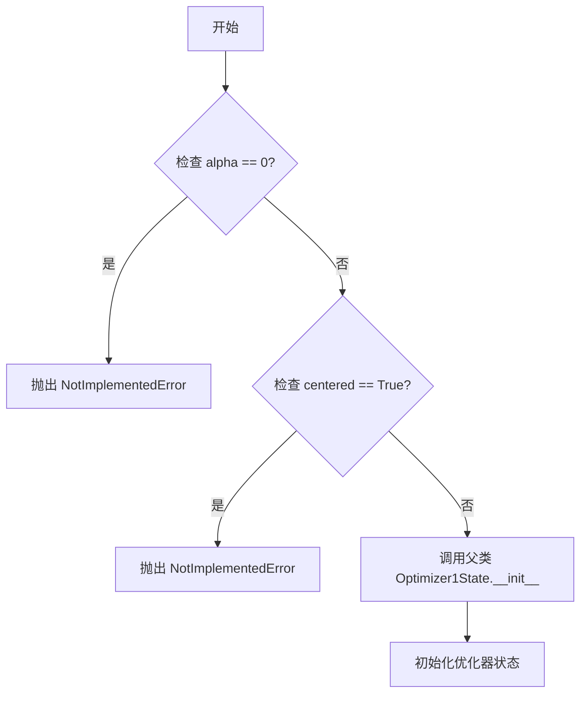

# `bitsandbytes\bitsandbytes\optim\rmsprop.py` 详细设计文档

该文件实现了RMSprop优化器的多个变体（标准版、8位量化版、32位量化版），继承自Optimizer1State基类，用于深度学习模型参数的优化更新，支持学习率衰减、动量、权重衰减、百分位裁剪和分块量化等高级特性。

## 整体流程



## 类结构

```
Optimizer1State (基类)
├── RMSprop (标准RMSprop优化器)
├── RMSprop8bit (8位量化RMSprop)
└── RMSprop32bit (32位量化RMSprop)
```

## 全局变量及字段


### `Optimizer1State`
    
Base optimizer class from bitsandbytes that handles state management and quantization for optimized training

类型：`class`
    


### `RMSprop.params`
    
The input parameters to optimize

类型：`torch.tensor`
    


### `RMSprop.lr`
    
The learning rate for the optimizer

类型：`float`
    


### `RMSprop.alpha`
    
The decay rate of the squared gradients

类型：`float`
    


### `RMSprop.eps`
    
The epsilon value prevents division by zero

类型：`float`
    


### `RMSprop.weight_decay`
    
The weight decay value for L2 regularization

类型：`float`
    


### `RMSprop.momentum`
    
The momentum value speeds up optimization by taking bigger steps

类型：`float`
    


### `RMSprop.centered`
    
Whether to normalize gradients by variance

类型：`bool`
    


### `RMSprop.optim_bits`
    
The number of bits for optimizer state quantization

类型：`int`
    


### `RMSprop.args`
    
An object with additional arguments

类型：`object`
    


### `RMSprop.min_8bit_size`
    
Minimum number of elements for 8-bit optimization

类型：`int`
    


### `RMSprop.percentile_clipping`
    
Adaptive clipping threshold based on gradient norms

类型：`int`
    


### `RMSprop.block_wise`
    
Whether to independently quantize each block of tensors

类型：`bool`
    


### `RMSprop8bit.params`
    
The input parameters to optimize

类型：`torch.tensor`
    


### `RMSprop8bit.lr`
    
The learning rate for the optimizer

类型：`float`
    


### `RMSprop8bit.alpha`
    
The decay rate of the squared gradients

类型：`float`
    


### `RMSprop8bit.eps`
    
The epsilon value prevents division by zero

类型：`float`
    


### `RMSprop8bit.weight_decay`
    
The weight decay value for L2 regularization

类型：`float`
    


### `RMSprop8bit.momentum`
    
The momentum value speeds up optimization by taking bigger steps

类型：`float`
    


### `RMSprop8bit.centered`
    
Whether to normalize gradients by variance

类型：`bool`
    


### `RMSprop8bit.args`
    
An object with additional arguments

类型：`object`
    


### `RMSprop8bit.min_8bit_size`
    
Minimum number of elements for 8-bit optimization

类型：`int`
    


### `RMSprop8bit.percentile_clipping`
    
Adaptive clipping threshold based on gradient norms

类型：`int`
    


### `RMSprop8bit.block_wise`
    
Whether to independently quantize each block of tensors

类型：`bool`
    


### `RMSprop32bit.params`
    
The input parameters to optimize

类型：`torch.tensor`
    


### `RMSprop32bit.lr`
    
The learning rate for the optimizer

类型：`float`
    


### `RMSprop32bit.alpha`
    
The decay rate of the squared gradients

类型：`float`
    


### `RMSprop32bit.eps`
    
The epsilon value prevents division by zero

类型：`float`
    


### `RMSprop32bit.weight_decay`
    
The weight decay value for L2 regularization

类型：`float`
    


### `RMSprop32bit.momentum`
    
The momentum value speeds up optimization by taking bigger steps

类型：`float`
    


### `RMSprop32bit.centered`
    
Whether to normalize gradients by variance

类型：`bool`
    


### `RMSprop32bit.args`
    
An object with additional arguments

类型：`object`
    


### `RMSprop32bit.min_8bit_size`
    
Minimum number of elements for 8-bit optimization

类型：`int`
    


### `RMSprop32bit.percentile_clipping`
    
Adaptive clipping threshold based on gradient norms

类型：`int`
    


### `RMSprop32bit.block_wise`
    
Whether to independently quantize each block of tensors

类型：`bool`
    
    

## 全局函数及方法


### `RMSprop.__init__`

这是 RMSprop 优化器的初始化方法，负责配置 RMSprop 优化器的各项参数，包括学习率、alpha 值、epsilon、权重衰减、动量等，并将其委托给父类 Optimizer1State 进行实际初始化。

参数：

- `params`：`torch.tensor`，需要优化的输入参数张量
- `lr`：`float`，学习率，默认值为 1e-2
- `alpha`：`float`，平方梯度的衰减率，默认值为 0.99
- `eps`：`float`，防止优化器中除以零的 epsilon 值，默认值为 1e-8
- `weight_decay`：`float`，优化器的权重衰减值，默认值为 0.0
- `momentum`：`float`，动量值，通过迈更大的步子来加速优化器，默认值为 0
- `centered`：`bool`，是否按方差归一化梯度，默认值为 False
- `optim_bits`：`int`，优化器状态的位数，默认值为 32
- `args`：`object`，包含额外参数的对象，默认值为 None
- `min_8bit_size`：`int`，参数张量进行 8 位优化的最小元素数量，默认值为 4096
- `percentile_clipping`：`int`，自适应裁剪阈值，通过跟踪最后 100 个梯度范数并在某个百分位数裁剪梯度来提高稳定性，默认值为 100
- `block_wise`：`bool`，是否独立量化每个张量块以减少异常值影响并提高稳定性，默认值为 True

返回值：`None`，该方法为初始化方法，不返回任何值

#### 流程图

```mermaid
flowchart TD
    A([开始 __init__]) --> B{alpha == 0?}
    B -->|是| C[raise NotImplementedError]
    B -->|否| D{centered == True?}
    D -->|是| E[raise NotImplementedError]
    D -->|否| F[调用 super().__init__]
    F --> G[传入优化器名称 'rmsprop']
    F --> H[传入参数 params]
    F --> I[传入学习率 lr]
    F --> J[传入元组 (alpha, momentum)]
    F --> K[传入 epsilon eps]
    F --> L[传入权重衰减 weight_decay]
    F --> M[传入优化位数 optim_bits]
    F --> N[传入额外参数 args]
    F --> O[传入最小8位大小 min_8bit_size]
    F --> P[传入百分位裁剪 percentile_clipping]
    F --> Q[传入块方式 block_wise]
    Q --> R([结束])
    C --> R
    E --> R
```

#### 带注释源码

```python
def __init__(
    self,
    params,
    lr=1e-2,
    alpha=0.99,
    eps=1e-8,
    weight_decay=0,
    momentum=0,
    centered=False,
    optim_bits=32,
    args=None,
    min_8bit_size=4096,
    percentile_clipping=100,
    block_wise=True,
):
    """
    Base RMSprop optimizer.

    Arguments:
        params (`torch.tensor`):
            The input parameters to optimize.
        lr (`float`, defaults to 1e-2):
            The learning rate.
        alpha (`float`, defaults to 0.99):
            The alpha value is the decay rate of the squared gradients of the optimizer.
        eps (`float`, defaults to 1e-8):
            The epsilon value prevents division by zero in the optimizer.
        weight_decay (`float`, defaults to 0.0):
            The weight decay value for the optimizer.
        momentum (`float`, defaults to 0):
            The momentum value speeds up the optimizer by taking bigger steps.
        centered (`bool`, defaults to `False`):
            Whether the gradients are normalized by the variance. If `True`, it can help training at the expense of additional compute.
        optim_bits (`int`, defaults to 32):
            The number of bits of the optimizer state.
        args (`object`, defaults to `None`):
            An object with additional arguments.
        min_8bit_size (`int`, defaults to 4096):
            The minimum number of elements of the parameter tensors for 8-bit optimization.
        percentile_clipping (`int`, defaults to 100):
            Adapts clipping threshold automatically by tracking the last 100 gradient norms and clipping the gradient at a certain percentile to improve stability.
        block_wise (`bool`, defaults to `True`):
            Whether to independently quantize each block of tensors to reduce outlier effects and improve stability.
    """
    # 检查 alpha 是否为 0，RMSprop 不支持 alpha==0
    if alpha == 0:
        raise NotImplementedError("RMSprop with alpha==0.0 is not supported!")
    # 检查是否启用 centered 模式，当前版本不支持 centered RMSprop
    if centered:
        raise NotImplementedError("Centered RMSprop is not supported!")
    # 调用父类 Optimizer1State 的初始化方法
    # 传入优化器名称、参数、学习率、alpha和动量的元组、epsilon、权重_decay、优化位数、额外参数、最小8位大小、百分位裁剪、块方式
    super().__init__(
        "rmsprop",          # 优化器名称
        params,             # 需要优化的参数
        lr,                 # 学习率
        (alpha, momentum), # alpha 和动量打包为元组
        eps,                # epsilon 防止除零
        weight_decay,       # 权重衰减
        optim_bits,         # 优化器状态位数
        args,               # 额外参数
        min_8bit_size,     # 8位优化的最小尺寸
        percentile_clipping, # 百分位裁剪
        block_wise,         # 是否按块量化
    )
```


### RMSprop8bit.__init__

这是 8 位 RMSprop 优化器的初始化方法，继承自 Optimizer1State，用于在训练过程中以 8 位精度更新模型参数，通过量化技术减少显存占用并加速计算。

参数：

- `self`：实例本身（隐式参数），`RMSprop8bit`，优化器实例
- `params`：`torch.tensor`，待优化的输入参数张量
- `lr`：`float`，学习率，默认 1e-2，控制参数更新的步长
- `alpha`：`float`，平方梯度衰减率，默认 0.99，用于指数移动平均
- `eps`：`float`，防止除零的 epsilon 值，默认 1e-8
- `weight_decay`：`float`，权重衰减系数，默认 0.0，用于 L2 正则化
- `momentum`：`float`，动量因子，默认 0，用于加速收敛
- `centered`：`bool`，是否按方差归一化梯度，默认 False
- `args`：`object`，包含额外参数的对象，默认 None
- `min_8bit_size`：`int`，触发 8 位优化的最小张量元素数，默认 4096
- `percentile_clipping`：`int`，自适应裁剪的梯度范数历史数量，默认 100
- `block_wise`：`bool`，是否独立量化每个张量块以减少异常值影响，默认 True

返回值：`None`，无返回值（构造函数）

#### 流程图

```mermaid
flowchart TD
    A[开始 __init__] --> B{alpha == 0?}
    B -->|是| C[抛出 NotImplementedError]
    B -->|否| D{centered == True?}
    D -->|是| E[抛出 NotImplementedError]
    D -->|否| F[调用 super().__init__]
    F --> G[传递 'rmsprop' 标识]
    F --> H[传递参数 params]
    F --> I[传递学习率 lr]
    F --> J[传递元组 (alpha, momentum)]
    F --> K[传递 eps 和 weight_decay]
    F --> L[传递优化位宽 8]
    F --> M[传递 args 和其他配置]
    N[结束 __init__]
    
    C --> N
    E --> N
```

#### 带注释源码

```python
class RMSprop8bit(Optimizer1State):
    def __init__(
        self,
        params,
        lr=1e-2,
        alpha=0.99,
        eps=1e-8,
        weight_decay=0,
        momentum=0,
        centered=False,
        args=None,
        min_8bit_size=4096,
        percentile_clipping=100,
        block_wise=True,
    ):
        """
        8-bit RMSprop 优化器。

        参数:
            params (torch.tensor): 待优化的输入参数
            lr (float, 默认 1e-2): 学习率
            alpha (float, 默认 0.99): 平方梯度衰减率
            eps (float, 默认 1e-8): 防止除零的 epsilon
            weight_decay (float, 默认 0.0): 权重衰减系数
            momentum (float, 默认 0): 动量因子
            centered (bool, 默认 False): 是否按方差归一化梯度
            args (object, 默认 None): 包含额外参数的对象
            min_8bit_size (int, 默认 4096): 最小 8 位优化元素数
            percentile_clipping (int, 默认 100): 梯度范数裁剪的历史数量
            block_wise (bool, 默认 True): 是否独立量化每个块
        """
        
        # 验证 alpha 参数：alpha=0 在数学上未定义，不被支持
        if alpha == 0:
            raise NotImplementedError("RMSprop with alpha==0.0 is not supported!")
        
        # 验证 centered 参数：中心化 RMSprop 尚未实现
        if centered:
            raise NotImplementedError("Centered RMSprop is not supported!")
        
        # 调用父类 Optimizer1State 的初始化方法
        # 传递优化器名称 'rmsprop' 和相关配置参数
        # 关键区别：使用 8 位精度 (8) 而非 32 位
        super().__init__(
            "rmsprop",          # 优化器名称标识
            params,             # 待优化的模型参数
            lr,                 # 学习率
            (alpha, momentum),  # 元组：(衰减率, 动量)
            eps,                # 数值稳定性 epsilon
            weight_decay,      # L2 正则化权重衰减
            8,                 # 优化器状态使用 8 位量化
            args,              # 额外的训练参数
            min_8bit_size,     # 触发 8 位优化的阈值
            percentile_clipping, # 自适应裁剪的百分位
            block_wise,        # 块级量化开关
        )
```


### RMSprop32bit.__init__

这是32位RMSprop优化器的初始化方法，继承自Optimizer1State类，用于配置和管理32位精度下的RMSprop优化算法的参数。

参数：

- `params`：`torch.tensor`，待优化的输入参数张量
- `lr`：`float`，学习率，默认值为 1e-2
- `alpha`：`float`，梯度平方的衰减率，默认值为 0.99
- `eps`：`float`，防止优化器除零的epsilon值，默认值为 1e-8
- `weight_decay`：`float`，优化器的权重衰减系数，默认值为 0
- `momentum`：`float`，动量值，用于通过更大的步长加速优化器，默认值为 0
- `centered`：`bool`，是否按方差归一化梯度，默认值为 False
- `args`：`object`，包含额外参数的对象，默认值为 None
- `min_8bit_size`：`int`，参数张量进行8位优化的最小元素数量，默认值为 4096
- `percentile_clipping`：`int`，自动调整裁剪阈值，通过跟踪最后100个梯度范数并在一定百分位裁剪梯度以提高稳定性，默认值为 100
- `block_wise`：`bool`，是否独立量化每个张量块以减少异常值影响并提高稳定性，默认值为 True

返回值：`None`，__init__ 方法不返回值

#### 流程图

```mermaid
flowchart TD
    A[开始初始化] --> B{alpha == 0?}
    B -->|是| C[抛出NotImplementedError]
    B -->|否| D{centered == True?}
    D -->|是| E[抛出NotImplementedError]
    D -->|否| F[调用super().__init__]
    F --> G[结束初始化]
    
    C --> G
    E --> G
```

#### 带注释源码

```python
class RMSprop32bit(Optimizer1State):
    def __init__(
        self,
        params,
        lr=1e-2,
        alpha=0.99,
        eps=1e-8,
        weight_decay=0,
        momentum=0,
        centered=False,
        args=None,
        min_8bit_size=4096,
        percentile_clipping=100,
        block_wise=True,
    ):
        """
        32-bit RMSprop optimizer.

        Arguments:
            params (`torch.tensor`):
                The input parameters to optimize.
            lr (`float`, defaults to 1e-2):
                The learning rate.
            alpha (`float`, defaults to 0.99):
                The alpha value is the decay rate of the squared gradients of the optimizer.
            eps (`float`, defaults to 1e-8):
                The epsilon value prevents division by zero in the optimizer.
            weight_decay (`float`, defaults to 0.0):
                The weight decay value for the optimizer.
            momentum (`float`, defaults to 0):
                The momentum value speeds up the optimizer by taking bigger steps.
            centered (`bool`, defaults to `False`):
                Whether the gradients are normalized by the variance. If `True`, it can help training at the expense of additional compute.
            optim_bits (`int`, defaults to 32):
                The number of bits of the optimizer state.
            args (`object`, defaults to `None`):
                An object with additional arguments.
            min_8bit_size (`int`, defaults to 4096):
                The minimum number of elements of the parameter tensors for 8-bit optimization.
            percentile_clipping (`int`, defaults to 100):
                Adapts clipping threshold automatically by tracking the last 100 gradient norms and clipping the gradient at a certain percentile to improve stability.
            block_wise (`bool`, defaults to `True`):
                Whether to independently quantize each block of tensors to reduce outlier effects and improve stability.
        """

        # 检查alpha是否为0，不支持alpha==0的RMSprop
        if alpha == 0:
            raise NotImplementedError("RMSprop with alpha==0.0 is not supported!")
        
        # 检查centered参数，暂不支持centered RMSprop
        if centered:
            raise NotImplementedError("Centered RMSprop is not supported!")
        
        # 调用父类Optimizer1State的初始化方法
        # 传入优化器名称"rmsprop"、参数、学习率、衰减系数元组(alpha, momentum)、
        # epsilon、权重衰减、优化器位数(32)、额外参数、最小8位大小、百分位裁剪和分块方式
        super().__init__(
            "rmsprop",
            params,
            lr,
            (alpha, momentum),
            eps,
            weight_decay,
            32,  # 显式指定32位优化器
            args,
            min_8bit_size,
            percentile_clipping,
            block_wise,
        )
```

## 关键组件


### RMSprop

基础RMSprop优化器类，继承自Optimizer1State，支持标准RMSprop算法的所有核心参数，包括学习率、alpha衰减、epsilon防止除零、权重衰减、动量等，并提供32位优化器状态支持。

### RMSprop8bit

8位量化版本的RMSprop优化器，通过将优化器状态量化为8位来减少显存占用，继承自Optimizer1State并固定使用8位优化器状态，适用于大规模模型的显存优化场景。

### RMSprop32bit

32位全精度版本的RMSprop优化器，与基础RMSprop功能相同但明确指定使用32位优化器状态，继承自Optimizer1State，显存占用较高但计算精度最好。

### Optimizer1State

父类抽象基类，提供实际的优化器实现逻辑，包含张量索引管理、惰性加载机制、反量化支持、块级量化等核心功能，子类通过传递优化器名称和参数进行初始化。

### 张量索引与惰性加载

关键优化组件，通过min_8bit_size参数控制，只有当参数张量元素数量超过阈值时才启用8位优化，实现显存优化与计算效率的平衡。

### 反量化支持

在参数更新过程中，将量化后的优化器状态反量化为全精度数值进行计算，确保梯度更新的数值精度。

### 量化策略

支持optim_bits参数控制优化器状态精度（8位或32位），以及block_wise参数实现块级独立量化，减少异常值影响并提高量化稳定性。

### Percentile Clipping

梯度裁剪策略，通过percentile_clipping参数自动跟踪最近N个梯度范数并使用百分位数进行裁剪，提高训练稳定性。


## 问题及建议


### 已知问题

-   **代码重复**：三个优化器类（RMSprop、RMSprop8bit、RMSprop32bit）的`__init__`方法几乎完全相同，包括参数列表、文档字符串和验证逻辑，造成大量重复代码
-   **文档字符串冗余**：三个类共享完全相同的文档字符串，未针对每个类的特性进行差异化描述
-   **参数验证重复**：`alpha == 0`和`centered`的验证逻辑在每个类中重复出现三次
-   **功能未实现**：`centered`参数被接受但始终抛出`NotImplementedError`，导致API具有欺骗性
-   **默认参数不一致**：RMSprop类显式接收`optim_bits`参数（默认32），而RMSprop8bit和RMSprop32bit则硬编码了该值，API设计不一致
-   **缺少类型提示**：方法签名中完全缺少类型注解，降低了代码的可读性和IDE支持
-   **参数冗余**：`optim_bits`在RMSprop8bit和RMSprop32bit中实际上是无效参数，因为它们内部硬编码为8和32

### 优化建议

-   **提取基类逻辑**：将共同的参数验证逻辑（alpha和centered检查）提取到父类`Optimizer1State`中，或使用装饰器/混入类实现
-   **简化类结构**：考虑使用工厂函数或单类多模式设计，通过参数区分8bit和32bit变体，减少三个独立类的维护成本
-   **文档差异化**：为每个类编写针对性的文档，突出其特定用途和与其它变体的区别
-   **移除无效参数**：RMSprop8bit和RMSprop32bit应移除`optim_bits`参数，或改为接受该参数但提供默认值覆盖
-   **添加类型提示**：为所有方法参数和返回值添加类型注解，提升代码可维护性
-   **实现centered功能**：若短期内不计划支持centered RMSprop，应从参数列表中移除，而非接受但始终抛出异常
-   **参数统一化**：统一三个类的接口设计，可考虑让optim_bits作为可选参数，根据传入值自动选择合适的量化策略


## 其它


### 设计目标与约束

该代码实现了RMSprop优化器，支持8位和32位两种精度模式，继承自bitsandbytes库的Optimizer1State基类。设计目标包括提供稳定的梯度下降优化算法，支持量化优化以减少显存占用，以及通过block_wise量化减少异常值影响。约束条件包括：不支持alpha为0的情况，不支持centered RMSprop变体，需要PyTorch环境支持。

### 错误处理与异常设计

代码在初始化方法中包含两处显式的错误处理：当alpha参数为0时抛出NotImplementedError("RMSprop with alpha==0.0 is not supported!")；当centered参数为True时抛出NotImplementedError("Centered RMSprop is not supported!")。这两处错误处理旨在防止不支持的优化器配置导致的潜在计算错误。

### 数据流与状态机

优化器的数据流主要包括：接收模型参数(params)和超参数配置，经过初始化后，基类Optimizer1State负责管理优化器状态（包括学习率、动量、梯度统计信息等），在训练循环中执行参数更新操作。状态机转换依赖于PyTorch的优化器接口，包括初始化状态、参数分组状态、step()执行状态等。

### 外部依赖与接口契约

主要外部依赖为bitsandbytes库中的Optimizer1State基类，该基类实现了优化器的核心逻辑。接口契约包括：构造函数接受params（模型参数）、lr（学习率，默认1e-2）、alpha（衰减率，默认0.99）、eps（ epsilon，默认1e-8）、weight_decay（权重衰减，默认0）、momentum（动量，默认0）、centered（是否居中，默认False）、optim_bits（优化位数，RMSprop默认32，RMSprop8bit固定为8，RMSprop32bit固定为32）、args（附加参数对象）、min_8bit_size（最小8位块大小，默认4096）、percentile_clipping（百分位裁剪，默认100）、block_wise（块级量化，默认True）。所有类都返回继承自Optimizer1State的优化器实例。

### 性能特性与基准

该优化器支持8位量化模式，可显著减少优化器状态的显存占用（相比32位节省约75%）。block_wise参数通过独立量化每个张量块来减少异常值影响，提高稳定性。percentile_clipping通过自适应裁剪梯度范数来改善训练稳定性。性能特性由底层bitsandbytes库的实现决定。

### 兼容性考虑

该代码需要PyTorch环境以及bitsandbytes库（版本需匹配Optimizer1State的实现）。RMSprop和RMSprop32bit在接口上与传统PyTorch RMSprop兼容，但提供了额外的量化功能。Python版本兼容性取决于bitsandbytes库的要求。

### 使用示例与用法

基本用法示例：创建优化器实例并应用于模型参数，例如定义一个简单的神经网络模型后，使用RMSprop8bit或RMSprop32bit作为优化器，在训练循环中调用optimizer.step()和optimizer.zero_grad()进行参数更新。不同精度版本可通过选择RMSprop8bit（节省显存）或RMSprop32bit（更高精度）来平衡性能和精度需求。

### 测试策略

测试应覆盖：alpha为0时的错误抛出验证，centered为True时的错误抛出验证，不同参数组合下的优化器实例化，基本训练步骤的执行验证，8位和32位模式的梯度更新正确性，以及与标准PyTorch RMSprop的结果一致性对比。

### 安全性考虑

该代码为纯Python实现，不涉及直接的文件IO或网络操作，安全性风险较低。主要安全考虑在于对输入参数的类型和范围验证，以及对底层bitsandbytes库的安全依赖管理。

### 监控与可观测性

优化器本身不提供内置的监控功能，但可通过PyTorch的训练循环监控学习率设置、梯度范数统计（通过percentile_clipping的内部状态）、以及手动记录优化器状态来进行观测。bitsandbytes库可能提供额外的量化统计信息。
    