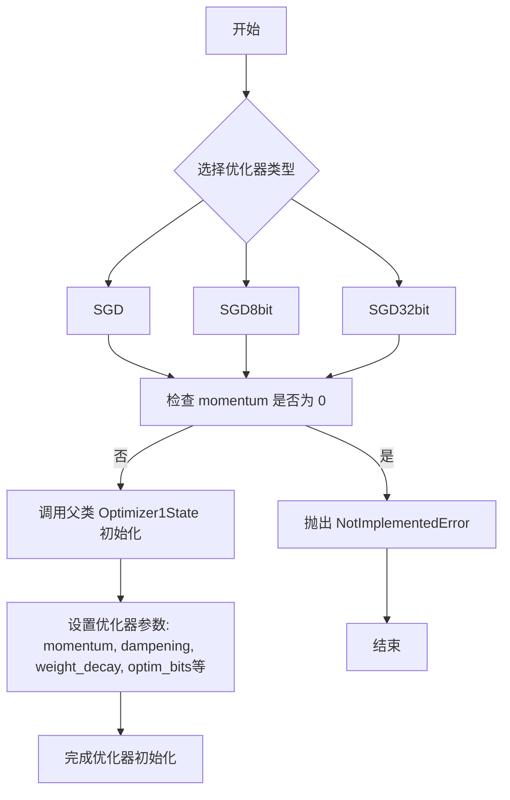

# `bitsandbytes\bitsandbytes\optim\sgd.py` 详细设计文档

该代码实现了三种SGD（随机梯度下降）优化器变体：标准SGD、8位量化SGD（SGD8bit）和32位量化SGD（SGD32bit），它们都继承自Optimizer1State基类，支持动量、权重衰减、Nesterov加速等优化特性，并提供了不同精度的 optimizer state 实现以减少内存占用。

## 整体流程



## 类结构

```
Optimizer1State (基类)
├── SGD
├── SGD8bit
└── SGD32bit
```

## 全局变量及字段


### `Optimizer1State`
    
bitsandbytes库中的基类优化器,用于管理优化器状态,支持8位和32位优化、动量更新、权重衰减和百分位裁剪等功能

类型：`class`
    


    

## 全局函数及方法


### SGD.__init__

该方法是 SGD（随机梯度下降）优化器的初始化方法，继承自 Optimizer1State 基类，用于配置带有动量特性的 SGD 优化器参数，支持 8-bit 和 32-bit 优化、梯度裁剪、分块量化等高级特性。

参数：

- `params`：`torch.tensor`，要优化的输入参数
- `lr`：`float`，学习率，控制参数更新的步长
- `momentum`：`float`，默认值 0，动量值，通过采用更大的步长来加速优化器
- `dampening`：`float`，默认值 0，阻尼值，用于减少优化器的动量
- `weight_decay`：`float`，默认值 0.0，权重衰减系数，用于正则化
- `nesterov`：`bool`，默认值 False，是否使用 Nesterov 动量
- `optim_bits`：`int`，默认值 32，优化器状态的位数（8、16 或 32）
- `args`：`object`，默认值 None，包含额外参数的对象
- `min_8bit_size`：`int`，默认值 4096，张量参数的最小元素数量，用于 8-bit 优化
- `percentile_clipping`：`int`，默认值 100，自适应裁剪阈值，通过跟踪最后 100 个梯度范数并在某个百分位裁剪梯度来提高稳定性
- `block_wise`：`bool`，默认值 True，是否独立量化每个张量块，以减少异常值影响并提高稳定性

返回值：`None`，无返回值，仅执行对象初始化逻辑

#### 流程图

```mermaid
flowchart TD
    A[开始 __init__] --> B{检查 momentum == 0?}
    B -->|是| C[抛出 NotImplementedError]
    B -->|否| D[调用 super().__init__]
    D --> E[传入优化器类型 'momentum']
    D --> F[传入 params 参数]
    D --> G[传入 lr 学习率]
    D --> H[传入 (momentum, dampening) 元组]
    D --> I[传入 0.0 初始动量]
    D --> J[传入 weight_decay]
    D --> K[传入 optim_bits]
    D --> L[传入 args]
    D --> M[传入 min_8bit_size]
    D --> N[传入 percentile_clipping]
    D --> O[传入 block_wise]
    E --> P[完成初始化]
    F --> P
    G --> P
    H --> P
    I --> P
    J --> P
    K --> P
    L --> P
    M --> P
    N --> P
    O --> P
    C --> Q[终止]
```

#### 带注释源码

```python
class SGD(Optimizer1State):
    def __init__(
        self,
        params,                  # torch.tensor: 要优化的输入参数
        lr,                      # float: 学习率
        momentum=0,              # float: 动量值，默认0
        dampening=0,             # float: 阻尼值，默认0
        weight_decay=0,          # float: 权重衰减，默认0.0
        nesterov=False,          # bool: 是否使用Nesterov动量，默认False
        optim_bits=32,           # int: 优化器状态位数，默认32
        args=None,               # object: 额外参数对象，默认None
        min_8bit_size=4096,      # int: 8位优化最小尺寸，默认4096
        percentile_clipping=100, # int: 百分位裁剪，默认100
        block_wise=True,         # bool: 是否分块量化，默认True
    ):
        """
        Base SGD optimizer.

        Arguments:
            params (`torch.tensor`):
                The input parameters to optimize.
            lr (`float`):
                The learning rate.
            momentum (`float`, defaults to 0):
                The momentum value speeds up the optimizer by taking bigger steps.
            dampening (`float`, defaults to 0):
                The dampening value reduces the momentum of the optimizer.
            weight_decay (`float`, defaults to 0.0):
                The weight decay value for the optimizer.
            nesterov (`bool`, defaults to `False`):
                Whether to use Nesterov momentum.
            optim_bits (`int`, defaults to 32):
                The number of bits of the optimizer state.
            args (`object`, defaults to `None`):
                An object with additional arguments.
            min_8bit_size (`int`, defaults to 4096):
                The minimum number of elements of the parameter tensors for 8-bit optimization.
            percentile_clipping (`int`, defaults to 100):
                Adapts clipping threshold automatically by tracking the last 100 gradient norms and clipping the gradient at a certain percentile to improve stability.
            block_wise (`bool`, defaults to `True`):
                Whether to independently quantize each block of tensors to reduce outlier effects and improve stability.
        """
        # 检查动量是否为0，若为0则抛出NotImplementedError
        # 因为SGD优化器需要动量才能正常工作
        if momentum == 0:
            raise NotImplementedError("SGD without momentum is not supported!")
        
        # 调用父类Optimizer1State的初始化方法
        # 传入参数：
        # - "momentum": 优化器类型
        # - params: 待优化参数
        # - lr: 学习率
        # - (momentum, dampening): 动量和阻尼的元组
        # - 0.0: 初始动量值
        # - weight_decay: 权重衰减系数
        # - optim_bits: 优化器位数
        # - args: 额外参数
        # - min_8bit_size: 8位优化最小尺寸
        # - percentile_clipping: 百分位裁剪值
        # - block_wise: 是否分块量化
        super().__init__(
            "momentum",
            params,
            lr,
            (momentum, dampening),
            0.0,
            weight_decay,
            optim_bits,
            args,
            min_8bit_size,
            percentile_clipping,
            block_wise,
        )
```


### SGD8bit.__init__

8位SGD优化器的初始化方法，继承自Optimizer1State，用于实现带有动量的8位随机梯度下降优化器，支持参数分组、动量加速、权重衰减、Nesterov动量、百分位裁剪和块级量化等高级特性。

参数：

- `self`：SGD8bit类实例
- `params`：`torch.tensor`，要优化的输入参数张量
- `lr`：`float`，学习率，控制参数更新的步长
- `momentum`：`float`，默认值0， momentum 动量值，通过使用更大的步长来加速优化器
- `dampening`：`float`，默认值0，dampening 阻尼值，用于减少动量
- `weight_decay`：`float`，默认值0.0，weight_decay 权重衰减系数，用于L2正则化
- `nesterov`：`bool`，默认值False，是否使用 Nesterov 动量
- `args`：`object`，默认值None，包含额外配置参数的对象
- `min_8bit_size`：`int`，默认值4096，min_8bit_size 参数张量的最小元素数量，低于此值不使用8位优化
- `percentile_clipping`：`int`，默认值100，percentile_clipping 通过跟踪最后100个梯度范数来自动调整裁剪阈值，以提高稳定性
- `block_wise`：`bool`，默认值True，block_wise 是否独立量化每个张量块，以减少异常值影响并提高稳定性

返回值：`None`，该方法不返回任何值（隐式返回None）

#### 流程图

```mermaid
flowchart TD
    A[开始 __init__] --> B{momentum == 0?}
    B -->|是| C[抛出 NotImplementedError: SGD without momentum is not supported!]
    B -->|否| D[调用 super().__init__ 初始化父类]
    D --> E[传入优化器类型 'momentum']
    E --> F[传入参数: params, lr, (momentum, dampening), 0.0, weight_decay, 8, args, min_8bit_size, percentile_clipping, block_wise]
    F --> G[结束 __init__]
    
    style C fill:#ffcccc
    style G fill:#ccffcc
```

#### 带注释源码

```python
class SGD8bit(Optimizer1State):
    def __init__(
        self,
        params,                   # torch.tensor: 要优化的参数
        lr,                       # float: 学习率
        momentum=0,               # float: 动量因子，默认0
        dampening=0,              # float: 动量阻尼，默认0
        weight_decay=0,           # float: 权重衰减系数，默认0.0
        nesterov=False,           # bool: 是否使用Nesterov动量，默认False
        args=None,                # object: 额外配置参数对象，默认None
        min_8bit_size=4096,       # int: 8位优化的最小张量大小，默认4096
        percentile_clipping=100, # int: 百分位裁剪阈值，默认100
        block_wise=True,          # bool: 是否块级量化，默认True
    ):
        """
        8-bit SGD optimizer.

        Arguments:
            params (`torch.tensor`):
                The input parameters to optimize.
            lr (`float`):
                The learning rate.
            momentum (`float`, defaults to 0):
                The momentum value speeds up the optimizer by taking bigger steps.
            dampening (`float`, defaults to 0):
                The dampening value reduces the momentum of the optimizer.
            weight_decay (`float`, defaults to 0.0):
                The weight decay value for the optimizer.
            nesterov (`bool`, defaults to `False`):
                Whether to use Nesterov momentum.
            args (`object`, defaults to `None`):
                An object with additional arguments.
            min_8bit_size (`int`, defaults to 4096):
                The minimum number of elements of the parameter tensors for 8-bit optimization.
            percentile_clipping (`int`, defaults to 100):
                Adapts clipping threshold automatically by tracking the last 100 gradient norms and clipping the gradient at a certain percentile to improve stability.
            block_wise (`bool`, defaults to `True`):
                Whether to independently quantize each block of tensors to reduce outlier effects and improve stability.
        """
        # 检查动量是否为0，8位SGD不支持无动量的优化
        if momentum == 0:
            raise NotImplementedError("SGD without momentum is not supported!")
        
        # 调用父类Optimizer1State的初始化方法
        # 参数说明：
        # - "momentum": 优化器类型
        # - params: 要优化的参数
        # - lr: 学习率
        # - (momentum, dampening): 动量和阻尼组成的元组
        # - 0.0: 第二个动量参数（用于Adam等优化器）
        # - weight_decay: 权重衰减
        # - 8: 使用8位优化
        # - args: 额外参数
        # - min_8bit_size: 最小8位大小
        # - percentile_clipping: 百分位裁剪
        # - block_wise: 块级量化
        super().__init__(
            "momentum",
            params,
            lr,
            (momentum, dampening),
            0.0,
            weight_decay,
            8,  # 8位优化
            args,
            min_8bit_size,
            percentile_clipping,
            block_wise,
        )
```


### SGD32bit.__init__

这是32位SGD优化器的初始化方法，继承自Optimizer1State，用于管理神经网络的参数优化，支持动量、权重衰减、Nesterov加速和8位优化等功能。

参数：

- `params`：`torch.tensor`，需要优化的输入参数
- `lr`：`float`，学习率
- `momentum`：`float`，默认为0，动量值通过更大的步长加速优化器
- `dampening`：`float`，默认为0，减少优化器的动量
- `weight_decay`：`float`，默认为0.0，权重衰减值
- `nesterov`：`bool`，默认为False，是否使用Nesterov动量
- `args`：`object`，默认为None，包含额外参数的对象
- `min_8bit_size`：`int`，默认为4096，参数张量进行8位优化的最小元素数量
- `percentile_clipping`：`int`，默认为100，自动调整裁剪阈值，通过跟踪最后100个梯度范数并在某个百分位裁剪梯度以提高稳定性
- `block_wise`：`bool`，默认为True，是否独立量化每个张量块以减少异常值影响和提高稳定性

返回值：`None`，该方法仅初始化对象状态，不返回任何值

#### 流程图

```mermaid
flowchart TD
    A[开始 __init__] --> B{检查 momentum == 0?}
    B -->|是| C[抛出 NotImplementedError]
    B -->|否| D[调用父类 Optimizer1State.__init__]
    D --> E[传入参数: 'momentum', params, lr, (momentum, dampening), 0.0, weight_decay, 32, args, min_8bit_size, percentile_clipping, block_wise]
    E --> F[结束 __init__]
```

#### 带注释源码

```python
class SGD32bit(Optimizer1State):
    def __init__(
        self,
        params,                      # torch.tensor: 需要优化的参数
        lr,                          # float: 学习率
        momentum=0,                  # float: 动量因子，默认0
        dampening=0,                 # float: 动量阻尼，默认0
        weight_decay=0,              # float: 权重衰减，默认0.0
        nesterov=False,             # bool: 是否使用Nesterov动量
        args=None,                   # object: 额外配置参数
        min_8bit_size=4096,          # int: 8位优化的最小张量大小
        percentile_clipping=100,    # int: 百分位裁剪阈值
        block_wise=True,             # bool: 是否按块量化
    ):
        """
        32-bit SGD optimizer.

        Arguments:
            params (`torch.tensor`):
                The input parameters to optimize.
            lr (`float`):
                The learning rate.
            momentum (`float`, defaults to 0):
                The momentum value speeds up the optimizer by taking bigger steps.
            dampening (`float`, defaults to 0):
                The dampening value reduces the momentum of the optimizer.
            weight_decay (`float`, defaults to 0.0):
                The weight decay value for the optimizer.
            nesterov (`bool`, defaults to `False`):
                Whether to use Nesterov momentum.
            args (`object`, defaults to `None`):
                An object with additional arguments.
            min_8bit_size (`int`, defaults to 4096):
                The minimum number of elements of the parameter tensors for 8-bit optimization.
            percentile_clipping (`int`, defaults to 100):
                Adapts clipping threshold automatically by tracking the last 100 gradient norms and clipping the gradient at a certain percentile to improve stability.
            block_wise (`bool`, defaults to `True`):
                Whether to independently quantize each block of tensors to reduce outlier effects and improve stability.
        """
        # 检查动量是否为0，SGD优化器必须使用动量
        if momentum == 0:
            raise NotImplementedError("SGD without momentum is not supported!")
        
        # 调用父类Optimizer1State的初始化方法
        super().__init__(
            "momentum",               # optimizer_type: 优化器类型为动量优化
            params,                   # params: 待优化参数
            lr,                       # lr: 学习率
            (momentum, dampening),    # momentum: 动量和阻尼组成的元组
            0.0,                      # beta: beta值（此处未使用）
            weight_decay,             # weight_decay: 权重衰减系数
            32,                       # optim_bits: 使用32位优化
            args,                     # args: 额外参数
            min_8bit_size,            # min_8bit_size: 8位优化最小尺寸
            percentile_clipping,     # percentile_clipping: 百分位裁剪
            block_wise,               # block_wise: 是否按块量化
        )
```


## 关键组件


### SGD（基础SGD优化器类）

SGD类是继承自Optimizer1State的基类优化器，实现了带有动量（Momentum）的随机梯度下降算法。该类封装了深度学习模型参数优化的核心逻辑，支持动量加速、权重衰减、Nesterov动量等高级优化特性，并集成了8-bit/32-bit量化、百分位裁剪和块级量化等技术创新，是bitsandbytes库中SGD优化器的标准实现。

### SGD8bit（8位量化SGD优化器）

SGD8bit是专门针对8-bit量化场景优化的SGD变体，通过将优化器状态量化至8位来显著减少显存占用。该类继承自Optimizer1State，使用固定的8位量化策略（optim_bits=8），适用于大规模模型训练场景，能够在保持模型性能的同时大幅降低显存消耗。

### SGD32bit（32位全精度SGD优化器）

SGD32bit是标准32位精度的SGD优化器实现，继承自Optimizer1State，使用32位浮点数存储优化器状态。该变体提供与标准PyTorch SGD类似的精度，适用于需要高精度优化但不需要量化存储的场景。

### 动量机制（Momentum）

动量机制通过引入历史梯度信息来加速优化过程，能够在相关方向上累积速度并抑制振荡。代码中通过momentum和dampening参数控制动量强度和阻尼效果，要求必须启用动量（momentum不能为0），体现了动量对优化稳定性的关键作用。

### 量化策略（Quantization Strategy）

量化策略通过optim_bits参数控制优化器状态的量化位数，支持8位和32位两种模式。8位量化通过减少状态存储精度来节省显存，32位保持全精度以获得更稳定的优化行为。这一设计允许用户根据显存约束和精度需求灵活选择。

### 百分位裁剪（Percentile Clipping）

百分位裁剪是一种自适应梯度裁剪技术，通过跟踪最近100个梯度范数并按特定百分位进行裁剪来提高优化稳定性。该机制能够有效处理梯度爆炸问题，特别适用于训练深层神经网络或使用大批次训练的场景。

### 块级量化（Block-wise Quantization）

块级量化将张量分割为独立的小块进行分别量化，这种策略能够有效减少离群点（outliers）对整体量化精度的影响，提高量化后的优化稳定性。block_wise参数控制是否启用此策略，默认启用以获得更好的量化效果。

### Optimizer1State基类

Optimizer1State是所有SGD优化器变体的基类，提供了优化器的核心实现逻辑。子类通过传入不同的optim_bits参数来实例化特定量化精度的优化器，实现了代码复用和接口统一的设计模式。


## 问题及建议


### 已知问题

- **代码重复严重**：三个类（SGD、SGD8bit、SGD32bit）的`__init__`方法实现几乎完全相同，仅`optim_bits`参数值不同（分别为参数传入、8、32），造成大量冗余代码。
- **参数设计不一致**：SGD8bit和SGD32bit接受`optim_bits`参数但实际忽略该参数（硬编码为8和32），导致API语义不清晰。
- **功能支持不完整**：`nesterov`参数在文档中提及但代码中未实际使用，无法实现Nesterov动量。
- **缺少参数校验**：未对学习率(lr)、动量(momentum)等关键参数进行有效性验证（如lr必须为正数）。
- **无类型提示**：整个文件没有任何类型注解，降低了代码的可维护性和IDE支持。
- **文档不精确**：`args`参数描述为"an object with additional arguments"过于模糊，未说明具体结构。

### 优化建议

- **消除重复代码**：考虑使用工厂模式或单一配置类，通过参数区分不同优化器变体，而非创建三个独立类。
- **移除无效参数**：从SGD8bit和SGD32bit的签名中移除未使用的`optim_bits`参数，或提供实际功能。
- **实现Nesterov动量**：若计划支持Nesterov，应在父类Optimizer1State中实现或在当前类中添加相应逻辑。
- **添加参数校验**：在初始化时验证lr > 0、momentum在[0,1]范围等约束条件。
- **补充类型注解**：为所有参数、返回值添加适当的类型提示。
- **改进文档**：明确定义args对象的结构和使用方式。

## 其它


### 设计目标与约束

**设计目标**：
- 提供基于SGD with Momentum的优化器实现，支持常规32位精度和内存高效的8位精度
- 实现梯度裁剪和分块量化以提升训练稳定性
- 继承Optimizer1State基类实现统一的优化器接口

**约束条件**：
- 必须启用momentum（momentum参数不能为0，否则抛出NotImplementedError）
- 8位优化模式受min_8bit_size参数约束，当参数张量元素数量小于该值时不会进行8位量化
- percentile_clipping默认值为100，表示不进行百分位裁剪；设置为其他值时才会启用动态裁剪
- block_wise参数控制是否使用分块量化以减少离群值影响

### 错误处理与异常设计

**异常类型**：
- `NotImplementedError`：当momentum==0时抛出，表示不支持无动量的SGD优化器
- 继承自Optimizer1State的异常：基类可能抛出其他类型的异常（如参数类型错误、内存不足等）

**错误处理策略**：
- 在__init__方法入口处检查momentum参数有效性
- 通过assert或if检查确保必需参数（params、lr）有效
- 基类Optimizer1State负责处理底层张量操作异常

### 数据流与状态机

**数据流**：
1. 初始化阶段：接收params、lr、momentum等参数 → 创建优化器状态 → 配置8位/32位量化参数
2. 训练循环阶段：接收梯度 → 应用百分位裁剪 → 更新动量 → 应用权重衰减 → 更新参数

**状态机转换**：
- 初始化状态（Optimizer1State创建）→ 就绪状态（参数注册完成）→ 更新状态（step方法调用）→ 返回就绪状态

**关键状态变量**：
- momentum缓冲区：存储动量状态
- 梯度状态：存储历史梯度用于百分位裁剪
- 参数状态：存储量化后的参数副本（8位模式）

### 外部依赖与接口契约

**依赖项**：
- `torch`：用于张量操作
- `bitsandbytes.optim.optimizer.Optimizer1State`：基类，提供核心优化逻辑

**导入路径**：
```python
from bitsandbytes.optim.optimizer import Optimizer1State
from bitsandbytes.optim.sgd import SGD, SGD8bit, SGD32bit
```

**接口契约**：
- 参数params：必须是torch.tensor或可迭代的参数组
- lr：学习率，float类型，必须为正数
- momentum：动量因子，float类型，默认为0（但实际必须>0）
- dampening：动量阻尼，float类型
- weight_decay：权重衰减系数，float类型
- nesterov：布尔值，启用Nesterov动量
- optim_bits：整数（仅SGD类），指定优化器状态位数
- args：可选的额外参数对象
- min_8bit_size：整数，8位优化的最小张量大小阈值
- percentile_clipping：整数，百分位裁剪的窗口大小
- block_wise：布尔值，是否启用分块量化

### 版本兼容性说明

- 代码基于MIT许可证
- 需要PyTorch环境
- 需要bitsandbytes库版本支持Optimizer1State基类
- 8位优化需要GPU支持（CUDA）

### 使用示例

```python
# 32位SGD
optimizer = SGD32bit(model.parameters(), lr=0.01, momentum=0.9)

# 8位SGD（内存优化）
optimizer = SGD8bit(model.parameters(), lr=0.01, momentum=0.9)

# 通用SGD（可配置位数）
optimizer = SGD(model.parameters(), lr=0.01, momentum=0.9, optim_bits=8)
```

    