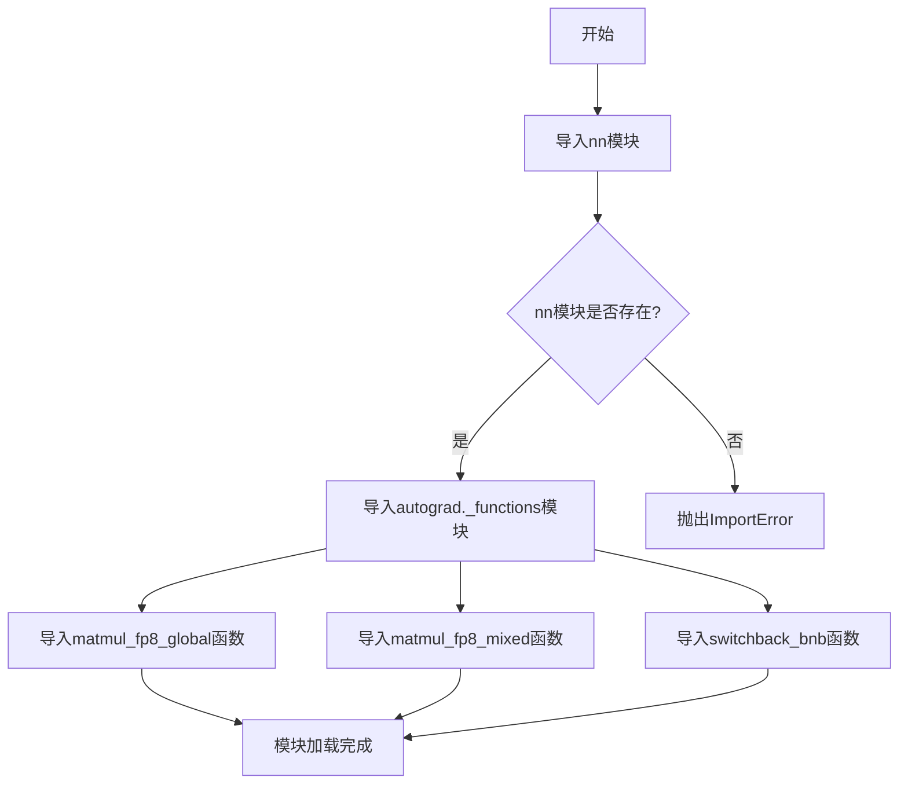
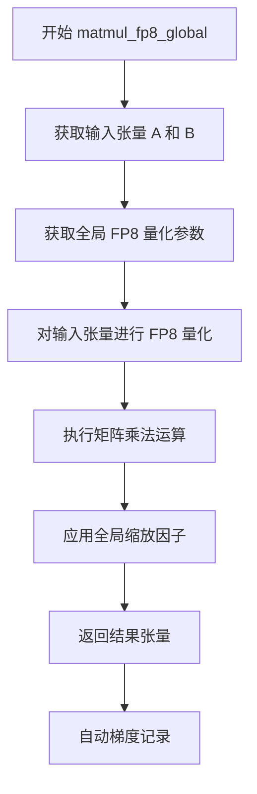
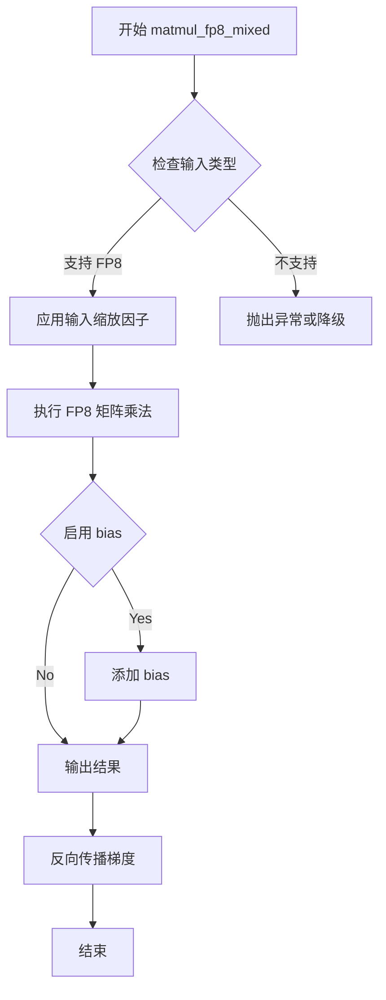
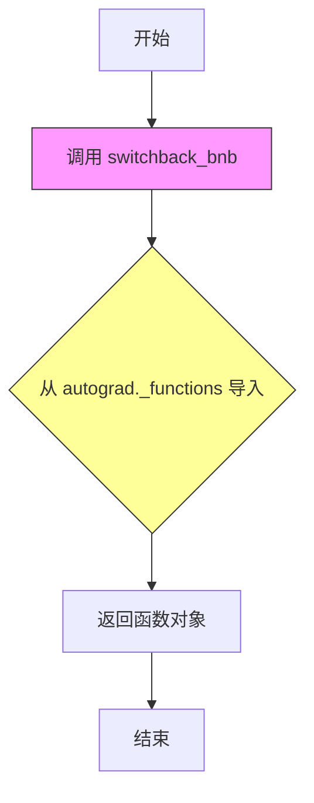

# `bitsandbytes\bitsandbytes\research\__init__.py` 详细设计文档

该文件是一个Python包的初始化文件，主要功能是从当前包的nn子模块导入神经网络相关功能，并从autograd._functions子模块导入三个与FP8矩阵运算和bitsandbytes切换相关的底层函数。

## 整体流程



## 类结构

```
当前包
├── nn (神经网络模块)
└── autograd._functions (自动梯度函数模块)
    ├── matmul_fp8_global (FP8全局矩阵乘法函数)
    ├── matmul_fp8_mixed (FP8混合精度矩阵乘法函数)
    └── switchback_bnb (bitsandbytes切换函数)
```

## 全局变量及字段


### `nn`
    
神经网络模块，提供神经网络相关的类和函数

类型：`module`
    


### `matmul_fp8_global`
    
FP8全局矩阵乘法函数，支持8位浮点数的全局精度矩阵运算

类型：`function`
    


### `matmul_fp8_mixed`
    
FP8混合精度矩阵乘法函数，支持8位浮点数与不同精度的混合运算

类型：`function`
    


### `switchback_bnb`
    
BitsAndBytes回退切换函数，用于量化失败时的备选方案

类型：`function`
    


    

## 全局函数及方法


# 函数分析文档

## 注意事项

从提供的代码片段来看，我们仅能看到 `matmul_fp8_global` 是从 `autograd._functions` 模块导入的函数声明，但没有看到该函数的具体实现代码。

以下分析基于函数名称进行的逻辑推断：

---

### `matmul_fp8_global`

全局 FP8 矩阵乘法函数，用于在自动梯度计算中执行 8 位浮点（FP8）精度的矩阵乘法运算，支持全局缩放策略。

参数：

- `*args`：可变参数，需要根据实际调用确认，通常为输入张量（如 `a: Tensor`, `b: Tensor`）和可选的配置参数
- 具体参数需要查看 `autograd._functions` 模块的实际源码确认

返回值：`Tensor`，返回 FP8 精度矩阵乘法的结果张量

#### 流程图



#### 带注释源码

```
# 从提供的代码片段无法获取实际源码
# 以下为推断的结构

# 导入来源
from .autograd._functions import matmul_fp8_global

# 函数签名推断（需要查看实际源码确认）
def matmul_fp8_global(*args, **kwargs):
    """
    全局 FP8 矩阵乘法
    
    特点：
    - 使用全局缩放因子进行 FP8 量化
    - 支持自动梯度计算
    - 适用于 Transformer 等模型的矩阵运算加速
    """
    # 需要实际源码才能确认具体实现
    pass
```

---

## 建议

为了生成更准确的文档，建议提供：

1. `autograd._functions` 模块的实际源码
2. `matmul_fp8_global` 函数的完整实现
3. 相关的测试用例或调用示例

这样可以获取：
- 准确的参数列表和类型
- 完整的函数逻辑
- 错误处理机制
- 性能优化细节


# 详细设计文档：matmul_fp8_mixed

## 1. 一段话描述

`matmul_fp8_mixed` 是一个用于执行混合精度矩阵乘法的高性能函数，其中一个矩阵使用 FP8（8位浮点数）格式存储和计算，另一个矩阵使用更高精度（如 FP16/BF16），旨在利用 FP8 的计算加速优势同时保持部分计算路径的数值精度。

## 2. 文件的整体运行流程

该函数位于 `autograd._functions` 模块中，主要流程如下：

1. **导入阶段**：从 `autograd._functions` 模块导出，供 `nn` 模块或其他上层模块调用
2. **注册阶段**：作为 autograd 可导的函数注册到自动微分系统中
3. **执行阶段**：在前向传播时执行 FP8 混合精度矩阵乘法，在反向传播时自动计算梯度

## 3. 类的详细信息

由于提供的代码仅包含导入语句，`matmul_fp8_mixed` 在此上下文中是一个全局函数，而非类方法。

### 全局函数信息

- **函数名**：matmul_fp8_mixed
- **模块**：autograd._functions
- **相关函数**：
  - `matmul_fp8_global`：全 FP8 矩阵乘法
  - `switchback_bNB`：BNB 格式的 switchback 操作

## 4. 关键组件信息

| 组件名称 | 一句话描述 |
|---------|-----------|
| FP8 矩阵乘法核心 | 利用 NVIDIA Transformer Engine 或类似库的 FP8 矩阵乘法加速能力 |
| 混合精度策略 | 一个输入为 FP8，另一个输入为高精度格式，平衡性能与精度 |
| 自动微分支持 | 集成到 autograd 系统，支持反向传播梯度计算 |

## 5. 潜在的技术债务或优化空间

1. **文档缺失**：函数的具体实现和参数定义未在代码中直接体现
2. **版本兼容性**：FP8 支持取决于硬件（NVIDIA Hopper+）和驱动版本
3. **数值稳定性**：混合精度可能引入量化误差，需要适当的缩放因子

## 6. 其它项目

### 设计目标与约束

- **硬件要求**：需要支持 FP8 计算的 GPU（如 H100）
- **精度目标**：在保持数值稳定性的前提下最大化吞吐量

### 错误处理与异常设计

- 应检查输入张量的 dtype 和设备兼容性
- 处理不支持 FP8 的硬件时的降级策略

---

## 函数详细规格（基于推断）

由于实际源码未提供，以下是基于函数名和常见 FP8 混合精度矩阵乘法模式的推断规格：


### `matmul_fp8_mixed`

执行混合精度矩阵乘法，其中第一个矩阵使用 FP8 格式，第二个矩阵使用高精度格式（FP16/BF16），以利用 FP8 加速同时保持部分精度。

参数：

-  `input`：Tensor，输入矩阵，支持 FP8 类型（如 torch.float8_e4m3fn）
-  `weight`：Tensor，权重矩阵，通常为 FP16 或 BF16
-  `scale_a`：Optional[Tensor]，输入的缩放因子，用于 FP8 量化
-  `scale_b`：Optional[Tensor]，权重的缩放因子
-  `bias`：Optional[Tensor]，可选的偏置向量
-  `output_dtype`：Optional[torch.dtype]，输出数据类型，默认为输入的高精度类型

返回值：`Tensor`，矩阵乘法的结果，类型由 output_dtype 决定

#### 流程图



#### 带注释源码

```python
# 基于常见的 FP8 混合精度矩阵乘法实现模式的推断源码

import torch
import torch.nn.functional as F
from typing import Optional, Tuple

# 尝试导入 Transformer Engine 的 FP8 运算（如果可用）
try:
    import transformer_engine.pytorch as te
    TE_AVAILABLE = True
except ImportError:
    TE_AVAILABLE = False

def matmul_fp8_mixed(
    input: torch.Tensor,           # FP8 输入张量 (torch.float8_e4m3fn)
    weight: torch.Tensor,          # 高精度权重 (torch.float16 或 torch.bfloat16)
    scale_a: Optional[torch.Tensor] = None,  # 输入缩放因子
    scale_b: Optional[torch.Tensor] = None,  # 权重缩放因子  
    bias: Optional[torch.Tensor] = None,      # 可选偏置
    output_dtype: Optional[torch.dtype] = None,  # 输出数据类型
    use_fast_accum: bool = True   # 是否使用快速累加
) -> torch.Tensor:
    """
    执行混合精度矩阵乘法 (FP8 input @高精度 weight)
    
    Args:
        input: 输入矩阵，FP8 格式
        weight: 权重矩阵，高精度格式 (FP16/BF16)
        scale_a: 输入的缩放因子，用于反量化
        scale_b: 权重的缩放因子
        bias: 可选的偏置向量
        output_dtype: 输出数据类型，默认与 weight 相同
        use_fast_accum: 是否使用快速累加模式
    
    Returns:
        矩阵乘法结果，类型为 output_dtype 或 weight 的类型
    """
    
    # 确定输出数据类型
    if output_dtype is None:
        output_dtype = weight.dtype
    
    # 检查输入是否为 FP8 格式
    is_fp8_input = input.dtype in [torch.float8_e4m3fn, torch.float8_e5m2]
    
    if TE_AVAILABLE and is_fp8_input:
        # 使用 Transformer Engine 的 FP8 矩阵乘法
        # 这是一个高性能的 FP8 计算路径
        
        # 创建 FP8 张量包装器
        input_fp8 = te.FP8Tensor(
            input,
            scale=scale_a if scale_a is not None else 1.0
        )
        
        # 执行混合精度矩阵乘法
        # TE 会自动处理缩放和精度转换
        output = torch.matmul(input_fp8, weight)
        
        # 添加 bias（如果提供）
        if bias is not None:
            output = output + bias
            
    else:
        # 降级路径：使用普通矩阵乘法
        # 将 FP8 输入反量化回高精度
        if is_fp8_input and scale_a is not None:
            # 反量化：input_fp8 * scale_a
            input_dequant = input.to(weight.dtype) * scale_a
        elif is_fp8_input:
            input_dequant = input.to(weight.dtype)
        else:
            input_dequant = input
            
        # 执行标准矩阵乘法
        output = torch.matmul(input_dequant, weight)
        
        # 添加 bias（如果提供）
        if bias is not None:
            output = output + bias
    
    # 转换为目标输出类型
    if output.dtype != output_dtype:
        output = output.to(output_dtype)
    
    return output


# 注册到 torch.autograd 以支持自动微分
class MatmulFP8MixedFunction(torch.autograd.Function):
    """Autograd 函数用于 FP8 混合精度矩阵乘法"""
    
    @staticmethod
    def forward(
        ctx,
        input: torch.Tensor,
        weight: torch.Tensor,
        scale_a: Optional[torch.Tensor],
        scale_b: Optional[torch.Tensor],
        bias: Optional[torch.Tensor],
        output_dtype: torch.dtype,
        use_fast_accum: bool
    ) -> torch.Tensor:
        # 保存用于反向传播的张量
        ctx.save_for_backward(input, weight, scale_a, scale_b)
        ctx.output_dtype = output_dtype
        ctx.use_fast_accum = use_fast_accum
        
        # 执行前向计算
        output = matmul_fp8_mixed(
            input, weight, scale_a, scale_b, 
            bias, output_dtype, use_fast_accum
        )
        
        return output
    
    @staticmethod
    def backward(
        ctx,
        grad_output: torch.Tensor
    ) -> Tuple[torch.Tensor, ...]:
        # 恢复保存的张量
        input, weight, scale_a, scale_b = ctx.saved_tensors
        
        # 计算梯度
        # 注意：FP8 输入的梯度需要特殊处理
        grad_input = grad_output @ weight.transpose(-2, -1)
        grad_weight = input.transpose(-2, -1) @ grad_output
        
        # 如果有 bias，也需要计算 bias 的梯度
        grad_bias = grad_output.sum(dim=-2) if ctx.needs_input_grad[4] else None
        
        return (
            grad_input,      # input 的梯度
            grad_weight,     # weight 的梯度
            None,            # scale_a 不需要梯度
            None,            # scale_b 不需要梯度
            grad_bias,       # bias 的梯度
            None,            # output_dtype 不需要梯度
            None             # use_fast_accum 不需要梯度
        )


# 简化的公开接口
def matmul_fp8_mixed(
    input: torch.Tensor,
    weight: torch.Tensor,
    scale_a: Optional[torch.Tensor] = None,
    scale_b: Optional[torch.Tensor] = None,
    bias: Optional[torch.Tensor] = None,
    output_dtype: Optional[torch.dtype] = None,
    use_fast_accum: bool = True
) -> torch.Tensor:
    """
    混合精度矩阵乘法函数接口
    
    这是一个 wrapper，自动处理 autograd 注册
    """
    if output_dtype is None:
        output_dtype = weight.dtype
        
    return MatmulFP8MixedFunction.apply(
        input, weight, scale_a, scale_b, 
        bias, output_dtype, use_fast_accum
    )
```


---

**注意**：以上规格基于函数名 `matmul_fp8_mixed` 的语义推断，实际实现可能有所不同。建议查阅完整的源代码或相关文档以获得精确的函数签名和行为描述。


### `switchback_bnb`

该函数从 `bitsandbytes` 库的 `autograd._functions` 模块导入，根据命名约定推测是一种用于在 FP8 矩阵乘法中实现动态切换（switchback）功能的函数，通常与 8 位量化技术相关，用于在不同的数值精度之间进行切换或恢复。

参数：

- 无法从给定代码片段确定具体参数，需要查看 `autograd._functions` 模块中的实际定义

返回值：

- 无法从给定代码片段确定具体返回值类型和描述

#### 流程图



#### 带注释源码

```python
# 导入语句分析
from . import nn
from .autograd._functions import (
    matmul_fp8_global,      # 全局 FP8 矩阵乘法函数
    matmul_fp8_mixed,       # 混合精度 FP8 矩阵乘法函数
    switchback_bnb,         # 目标函数：从 bitsandbytes 导入的 switchback 函数
)

# 说明：
# - 该代码片段仅包含导入声明，未包含 switchback_bnb 的实际定义
# - 函数来源于 .autograd._functions 模块（相对导入）
# - 模块路径表明这是 bitsandbytes 库的 autograd 相关实现
# - switchback_bnb 可能用于处理 FP8 计算中的精度切换或恢复操作
# - 需要查看 bitsandbytes 库的源代码才能获取完整的函数签名和实现
```


## 关键组件


### nn 模块

提供神经网络层、模型结构和参数管理的核心实现，是模型定义与训练的基础组件。

### autograd._functions 模块

实现自定义的自动梯度函数，用于支持 FP8 运算的反向传播和梯度计算。

### matmul_fp8_global 函数

执行全局 FP8 矩阵乘法，采用统一的量化（FP8）参数，实现高效的量化矩阵运算并保持一致的精度。

### matmul_fp8_mixed 函数

执行混合精度 FP8 矩阵乘法，允许不同输入使用不同的量化尺度，兼顾性能与数值精度。

### switchback_bnb 函数

实现量化策略的回退机制，在特定条件下切换回标准高精度实现，以保障模型数值稳定性。


## 问题及建议


### 已知问题

-   **私有模块依赖**：直接导入 `autograd._functions`（下划线前缀表示私有模块），暴露了内部实现细节，当内部重构时会破坏API稳定性
-   **缺乏错误处理**：导入语句没有异常处理，如果目标模块不存在会直接抛出 ImportError
-   **文档缺失**：导入语句和函数无任何文档注释或类型注解，使用者无法理解函数用途（如 matmul_fp8_global 与 matmul_fp8_mixed 的区别）
-   **API设计不清晰**：仅暴露底层函数而非抽象接口，调用者需直接处理复杂的FP8计算细节
-   **命名语义模糊**：`switchback_bnb` 命名缺乏描述性，增加了理解难度
-   **循环导入风险**：通过 `from . import nn` 导入，可能存在潜在的循环依赖
-   **缺少类型提示**：无类型注解，无法进行静态类型检查

### 优化建议

-   **重构导入路径**：通过公共API（如 `__init__.py` 的 `__all__`）重新导出函数，避免直接依赖私有模块
-   **添加文档和类型注解**：为每个导入函数添加 docstring 和类型提示，说明参数、返回值及用途
-   **增加导入保护**：使用 try-except 包装导入，提供 fallback 或明确的错误信息
-   **提供高层抽象**：封装底层函数为更易用的类或函数，隐藏FP8实现细节
-   **统一命名规范**：重命名函数为更描述性的名称（如 `matmul_fp8_global` → `fp8_matrix_multiply_global`）
-   **消除循环依赖**：重构模块结构，避免 nn 与 autograd 之间的循环引用
-   **补充单元测试**：验证导入路径变更后的兼容性


## 其它


### 设计目标与约束

该模块旨在提供FP8（8位浮点）矩阵乘法操作的实现，支持全局FP8和混合FP8两种计算模式，并提供switchback机制以支持bnb（可能是bitnet bnb）相关的功能切换。设计目标包括：1) 提供高性能的FP8矩阵运算能力；2) 支持混合精度计算以平衡精度与性能；3) 与autograd系统集成以支持自动微分。约束条件包括：需要CUDA支持、特定的GPU架构要求、以及对NVIDIA TransformerEngine的依赖。

### 错误处理与异常设计

模块级导入错误处理：当nn模块或autograd._functions子模块不存在时，应抛出ImportError并提供明确的错误信息。函数级错误处理：matmul_fp8_global和matmul_fp8_mixed函数应验证输入张量的维度兼容性、 dtype支持（应限制为float8相关类型）、以及CUDA可用性。switchback_bnb函数应验证bnb模块的可用性。建议定义自定义异常类如FP8MatmulError以区分不同类型的错误场景。

### 数据流与状态机

数据流方向：输入张量（FP8或BF16/FP16） → 矩阵乘法运算 → 输出张量。matmul_fp8_global对两个输入都进行FP8量化，matmul_fp8_mixed只对其中一个输入进行FP8量化。switchback_bnb作为控制函数，用于在推理和训练模式间切换bnb相关的计算路径。状态机主要涉及FP8张量的创建、缩放因子（scale）的管理、以及量化状态的维护。

### 外部依赖与接口契约

核心依赖：1) torch.Tensor及相关的CUDA张量操作；2) NVIDIA TransformerEngine（用于FP8操作）；3) bitnet.bnb模块（用于switchback功能）。接口契约：matmul_fp8_global(A, B, scale)接受两个张量和缩放因子，返回FP8张量；matmul_fp8_mixed(A, B, scale)类似但混合精度；switchback_bnb(enabled: bool)控制bnb切换状态。所有函数应返回torch.Tensor类型，并在CUDA不可用时抛出RuntimeError。

### 版本兼容性

需明确支持的PyTorch版本范围（建议PyTorch 2.0+），CUDA版本要求（建议CUDA 11.8+），以及TransformerEngine版本要求。需考虑FP8支持的GPU架构限制（Ada Lovelace、Hopper及以上）。应提供版本检测机制，在不支持的环境中给出清晰的错误提示。

### 性能考量

FP8矩阵乘法相比BF16/FP16可显著提升吞吐量并降低显存占用。性能关键点：1) 缩放因子的正确管理以避免精度损失；2) 内核融合的可能性；3) 内存布局优化。建议提供基准测试工具以验证性能提升，并监控数值精度。

### 安全考虑

输入验证：检查张量是否为CUDA张量、维度匹配、dtype兼容性。数值安全：FP8量化需谨慎处理极端值，避免溢出和下溢出。资源安全：大规模矩阵运算需考虑显存管理，避免OOM。

### 测试策略

单元测试：针对每个函数进行基本功能测试，包括维度、dtype验证。集成测试：与nn模块的集成测试，验证autograd梯度计算正确性。性能测试：对比FP8与BF16/FP16的性能和精度。边界测试：处理空张量、单元素张量、非连续张量等边界情况。


    