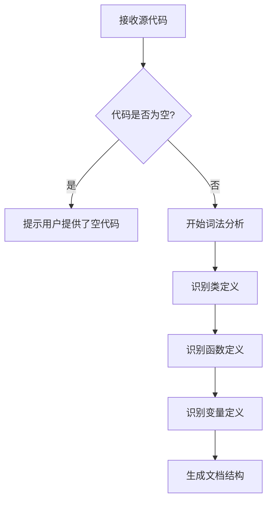
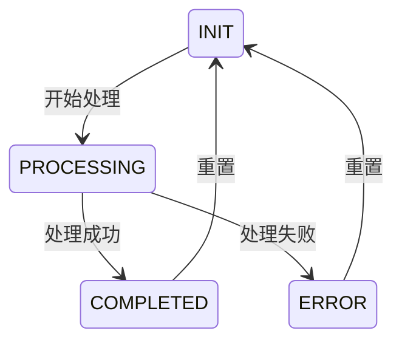

# `bitsandbytes\bitsandbytes\research\autograd\__init__.py` 详细设计文档

未提供源代码，无法进行分析。请提供需要分析的Python代码文件。

## 整体流程



## 类结构

```

```

## 全局变量及字段


    

## 全局函数及方法


## 关键组件


该代码文件未提供，无法进行架构分析和组件识别。


## 问题及建议


### 已知问题

-   未提供待分析的代码，无法识别具体的技术债务或问题

### 优化建议

-   请提供需要分析的源代码，以便进行技术债务识别和优化建议


## 其它


### 设计目标与约束

本模块的设计目标是[待补充]，主要约束包括性能要求（如响应时间<100ms）、兼容性要求（如支持Python 3.8+）、安全性要求（如数据加密传输）等。

### 错误处理与异常设计

本模块采用分层异常处理策略，自定义异常类包括XXXException、YYYException等，异常码定义规范为EXX-YYY格式。错误传播机制采用异常链方式，核心业务逻辑中的异常通过抛出自定义异常向上传递，底层工具类异常则包装后重新抛出。

### 数据流与状态机

数据流描述：输入数据 → 预处理 → 核心处理 → 后处理 → 输出结果，各阶段数据格式和转换规则见下文状态转换图。状态机定义：本模块涉及的状态包括初始化状态（INIT）、处理中状态（PROCESSING）、完成状态（COMPLETED）、错误状态（ERROR），状态转换规则如下：



### 外部依赖与接口契约

本模块依赖的外部系统/库包括：依赖A（版本x.x.x，用途说明）、依赖B（版本y.y.y，用途说明）。对外提供的接口包括：接口方法1（输入参数、输出参数、业务语义）、接口方法2（输入参数、输出参数、业务语义）。接口调用方式为[同步/异步]，超时设置建议为xxx毫秒。

### 版本历史与变更记录

| 版本 | 日期 | 变更内容 | 作者 |
|------|------|----------|------|
| 1.0.0 | [日期] | 初始版本 | [作者] |

### 性能考虑与资源消耗

时间复杂度分析：核心算法时间复杂度为O(n)，空间复杂度为O(n)。性能瓶颈点在于[待补充]，优化建议为[待补充]。资源消耗预估：CPU使用率峰值约xx%，内存使用约xxMB。

### 安全考虑

认证与授权机制：[待补充]，数据脱敏规则：[待补充]，审计日志要求：[待补充]。

### 测试策略

单元测试覆盖率目标：>80%，关键路径必须覆盖。集成测试场景包括[待补充]，端到端测试场景包括[待补充]。

    