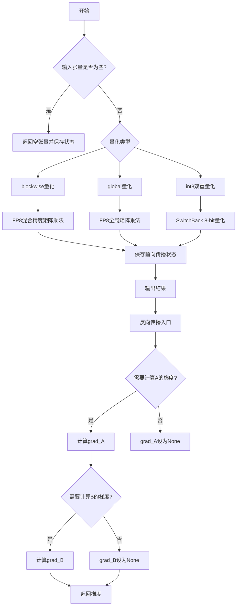
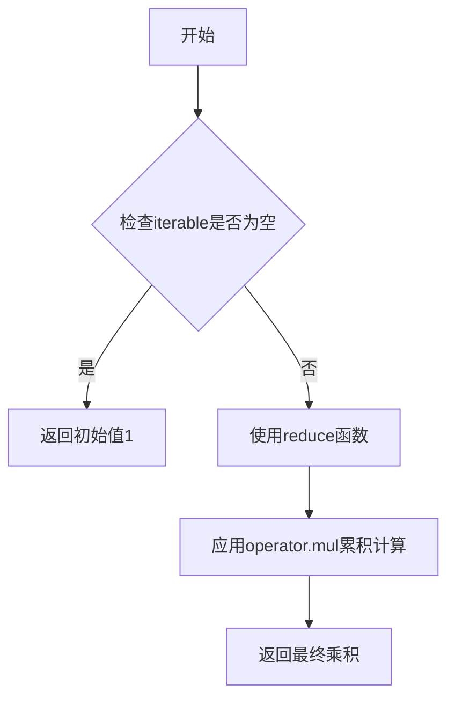
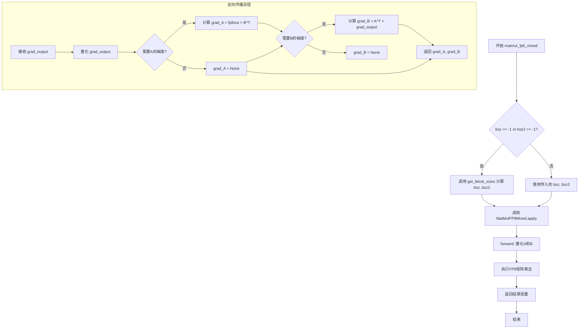
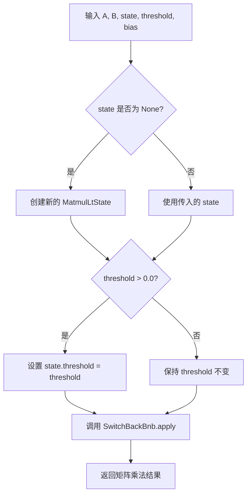
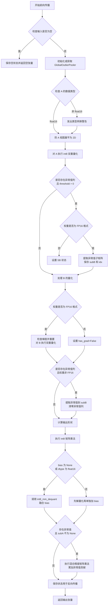
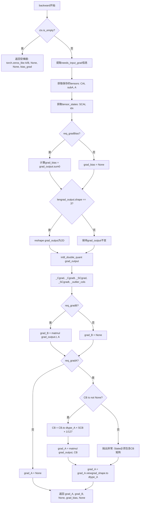

# `bitsandbytes\bitsandbytes\research\autograd\_functions.py` 详细设计文档

该代码实现了FP8（8位浮点）矩阵乘法和8-bit量化矩阵乘法的自定义PyTorch autograd函数，支持前向传播中的量化操作和反向传播中的梯度计算，主要用于大模型推理和训练的内存与计算优化。

## 整体流程



## 类结构

```
torch.autograd.Function (PyTorch基类)
├── MatMulFP8Mixed (FP8混合精度矩阵乘法)
├── MatMulFP8Global (FP8全局矩阵乘法)
└── SwitchBackBnb (8-bit量化矩阵乘法)
```

## 全局变量及字段


### `prod`
    
全局函数，计算迭代器中所有元素的乘积，使用reduce和operator.mul实现

类型：`function`
    


### `get_block_sizes`
    
根据输入矩阵和权重矩阵的维度计算量化块大小bsz和bsz2，用于FP8量化

类型：`function`
    


### `matmul_fp8_global`
    
全局FP8矩阵乘法封装函数，调用MatMulFP8Global.apply执行前向传播

类型：`function`
    


### `matmul_fp8_mixed`
    
混合FP8矩阵乘法封装函数，调用MatMulFP8Mixed.apply执行前向传播

类型：`function`
    


### `switchback_bnb`
    
SwitchBack BNB矩阵乘法封装函数，调用SwitchBackBnb.apply执行前向传播，支持int8双重量化和异常值分离

类型：`function`
    


### `F`
    
bitsandbytes.functional模块别名，提供量化、反量化、矩阵乘法等底层函数

类型：`module`
    


### `GlobalOutlierPooler`
    
全局异常值池化器类，用于管理和聚合异常值（outliers）

类型：`class`
    


### `MatmulLtState`
    
矩阵乘法状态类，保存量化过程中的中间状态、阈值、权重信息等

类型：`class`
    


### `torch`
    
PyTorch主模块，提供张量操作、自动求导等功能

类型：`module`
    


### `operator`
    
Python标准操作符模块，提供mul等基础运算函数

类型：`module`
    


### `warnings`
    
Python警告模块，用于发出类型转换等警告信息

类型：`module`
    


### `Optional`
    
类型提示工具，表示参数可以为None

类型：`typing.TypeVar`
    


### `MatMulFP8Mixed.MatMulFP8Mixed.forward`
    
前向传播函数，执行块级FP8量化与矩阵乘法，支持空张量处理

类型：`staticmethod`
    


### `MatMulFP8Mixed.MatMulFP8Mixed.backward`
    
反向传播函数，计算A和B的梯度，使用反向量化处理梯度

类型：`staticmethod`
    


### `MatMulFP8Mixed.ctx.is_empty`
    
标记输入张量是否为空，避免空张量矩阵乘法错误

类型：`bool`
    


### `MatMulFP8Mixed.ctx.A`
    
保存输入A张量用于反向传播梯度计算

类型：`Tensor`
    


### `MatMulFP8Mixed.ctx.B`
    
保存输入B张量用于反向传播梯度计算

类型：`Tensor`
    


### `MatMulFP8Mixed.ctx.fw_code`
    
前向传播量化码本，用于FP8量化配置

类型：`Tensor`
    


### `MatMulFP8Mixed.ctx.bw_code`
    
反向传播量化码本，用于梯度量化配置

类型：`Tensor`
    


### `MatMulFP8Mixed.ctx.bsz`
    
输入A的量化块大小，控制块级量化粒度

类型：`int`
    


### `MatMulFP8Mixed.ctx.bsz2`
    
输入B的量化块大小，控制输出梯度量化粒度

类型：`int`
    


### `MatMulFP8Mixed.ctx.dtype_A`
    
保存输入A的原始数据类型用于梯度转换

类型：`dtype`
    


### `MatMulFP8Mixed.ctx.dtype_B`
    
保存输入B的原始数据类型用于梯度转换

类型：`dtype`
    


### `MatMulFP8Mixed.ctx.tensors`
    
保存A和fp8B张量元组，用于反向传播计算

类型：`tuple`
    


### `MatMulFP8Global.MatMulFP8Global.forward`
    
前向传播函数，执行全局FP8量化与矩阵乘法

类型：`staticmethod`
    


### `MatMulFP8Global.MatMulFP8Global.backward`
    
反向传播函数，计算A和B的梯度

类型：`staticmethod`
    


### `MatMulFP8Global.ctx.is_empty`
    
标记输入张量是否为空

类型：`bool`
    


### `MatMulFP8Global.ctx.A`
    
保存输入A张量用于反向传播

类型：`Tensor`
    


### `MatMulFP8Global.ctx.B`
    
保存输入B张量用于反向传播

类型：`Tensor`
    


### `MatMulFP8Global.ctx.fw_code`
    
前向传播量化码本

类型：`Tensor`
    


### `MatMulFP8Global.ctx.bw_code`
    
反向传播量化码本

类型：`Tensor`
    


### `MatMulFP8Global.ctx.bsz`
    
全局量化块大小

类型：`int`
    


### `MatMulFP8Global.ctx.bsz2`
    
输出梯度量化块大小

类型：`int`
    


### `MatMulFP8Global.ctx.dtype_A`
    
输入A的数据类型

类型：`dtype`
    


### `MatMulFP8Global.ctx.dtype_B`
    
输入B的数据类型

类型：`dtype`
    


### `MatMulFP8Global.ctx.tensors`
    
保存的A和fp8B张量元组

类型：`tuple`
    


### `SwitchBackBnb.SwitchBackBnb.forward`
    
前向传播函数，执行int8双重量化、异常值分离和矩阵乘法

类型：`staticmethod`
    


### `SwitchBackBnb.SwitchBackBnb.backward`
    
反向传播函数，计算A、B和bias的梯度

类型：`staticmethod`
    


### `SwitchBackBnb.ctx.is_empty`
    
标记输入张量是否为空

类型：`bool`
    


### `SwitchBackBnb.ctx.A`
    
保存输入A张量

类型：`Tensor`
    


### `SwitchBackBnb.ctx.B`
    
保存输入B张量

类型：`Tensor`
    


### `SwitchBackBnb.ctx.bias`
    
保存偏置项用于反向传播计算

类型：`Tensor`
    


### `SwitchBackBnb.ctx.state`
    
量化状态对象，保存量化参数和中间结果

类型：`MatmulLtState`
    


### `SwitchBackBnb.ctx.grad_shape`
    
输入张量形状，用于梯度reshape

类型：`tuple`
    


### `SwitchBackBnb.ctx.dtype_A`
    
输入A的数据类型

类型：`dtype`
    


### `SwitchBackBnb.ctx.dtype_B`
    
输入B的数据类型

类型：`dtype`
    


### `SwitchBackBnb.ctx.dtype_bias`
    
偏置项的数据类型

类型：`dtype`
    


### `SwitchBackBnb.ctx.tensors`
    
保存的CAt、subA和A张量元组

类型：`tuple`
    


### `SwitchBackBnb.ctx.tensor_states`
    
保存的SCAt和idx元组，用于反向传播

类型：`tuple`
    
    

## 全局函数及方法


### `prod`

该函数用于计算可迭代对象中所有元素的乘积，通过使用 `reduce` 和 `operator.mul` 实现，兼容 Python 3.8 以下版本（因 Python 3.8+ 内置了 `math.prod`）。

参数：

- `iterable`：`Iterable`，需要计算乘积的可迭代对象（如列表、元组等）

返回值：`Any`，返回迭代器中所有元素的乘积，类型取决于输入元素的类型（通常为 `int` 或 `float`）

#### 流程图



#### 带注释源码

```python
# math.prod not compatible with python < 3.8
def prod(iterable):
    # 使用 functools.reduce 和 operator.mul 计算可迭代对象的乘积
    # 初始值设为 1，确保空迭代器返回 1 而不是抛出异常
    # 相当于: result = 1; for x in iterable: result *= x; return result
    return reduce(operator.mul, iterable, 1)
```


### `get_block_sizes`

根据输入矩阵和权重矩阵的维度计算量化块大小（block sizes），用于 FP8 量化中的分块处理。

参数：

- `input_matrix`：`torch.Tensor`，输入矩阵，用于提取最后一个维度的大小作为输入特征数
- `weight_matrix`：`torch.Tensor`，权重矩阵，用于提取第一个或第二个维度的大小作为输出特征数

返回值：`tuple[int, int]`，返回两个块大小元组 `(bsz, bsz2)`，其中 bsz 用于输入矩阵的块大小，bsz2 用于输出/梯度矩阵的块大小

#### 流程图

```mermaid
flowchart TD
    A[开始] --> B[获取 input_features = input_matrix.shape[-1]]
    B --> C[获取 output_features]
    C --> D{weight_matrix.shape[1] == input_features}
    D -->|Yes| E[output_features = weight_matrix.shape[0]]
    D -->|No| F[output_features = weight_matrix.shape[1]]
    E --> G[初始化 array = [4096, 2048, 1024, 512, 256, 128, 64, 0]]
    G --> H[初始化 bsz = 1024, bsz2 = 1024]
    H --> I[遍历 array 寻找 input_features 对应的 bsz]
    I --> J{input_features > array[i + 1]}
    J -->|Yes| K[bsz = array[i], 跳出循环]
    J -->|No| I
    K --> L[遍历 array 寻找 output_features 对应的 bsz2]
    L --> M{output_features > array[i + 1]}
    M -->|Yes| N[bsz2 = array[i], 跳出循环]
    M -->|No| L
    N --> O[返回 (bsz, bsz2)]
```

#### 带注释源码

```python
def get_block_sizes(input_matrix, weight_matrix):
    # 获取输入矩阵的最后一个维度大小（即输入特征数）
    input_features = input_matrix.shape[-1]
    
    # 根据权重矩阵的形状确定输出特征数
    # 如果权重矩阵的列数等于输入特征数，则输出特征数为第一维
    # 否则输出特征数为第二维
    output_features = weight_matrix.shape[0] if weight_matrix.shape[1] == input_features else weight_matrix.shape[1]
    
    # 定义可选的块大小数组（从大到小排列，用于寻找合适的块大小）
    array = [4096, 2048, 1024, 512, 256, 128, 64, 0]
    
    # 默认块大小为 1024
    bsz, bsz2 = 1024, 1024
    
    # 遍历数组，找到第一个大于 input_features 的块大小
    for i, k in enumerate(array):
        if input_features > array[i + 1]:
            bsz = k
            break
    
    # 遍历数组，找到第一个大于 output_features 的块大小
    for i, k in enumerate(array):
        if output_features > array[i + 1]:
            bsz2 = k
            break

    # 返回输入块大小和输出块大小
    return bsz, bsz2
```


### `matmul_fp8_global`

该函数是 FP8 全局矩阵乘法的封装器（wrapper），用于在给定的两个输入张量 A 和 B 之间执行 FP8 精度矩阵乘法运算。它内部调用 `MatMulFP8Global.apply()` 函数，并自动计算或使用提供的块大小（blocksize）参数来执行量化、反量化以及矩阵乘法操作。

参数：

- `A`：`torch.Tensor`，输入矩阵 A，用于矩阵乘法运算的左侧矩阵
- `B`：`torch.Tensor`，输入矩阵 B，用于矩阵乘法运算的右侧矩阵
- `fw_code`：`torch.Tensor`，前向传播（forward）过程中使用的量化编码（quantization code），用于对输入数据进行 FP8 量化
- `bw_code`：`torch.Tensor`，反向传播（backward）过程中使用的量化编码，用于对梯度进行 FP8 量化
- `out`：`Optional[torch.Tensor]`，可选的输出张量，如果提供，结果将写入该张量
- `bsz`：`int`，块大小参数，用于控制 A 矩阵和梯度的量化块大小，默认为 -1 表示自动计算
- `bsz2`：`int`，块大小参数2，用于控制输出梯度的量化块大小，默认为 -1 表示自动计算

返回值：`torch.Tensor`，返回矩阵乘法的结果张量，数据类型与输入矩阵 A 相同

#### 流程图

```mermaid
flowchart TD
    A[开始 matmul_fp8_global] --> B{bsz == -1 或 bsz2 == -1?}
    B -->|是| C[调用 get_block_sizes 计算块大小]
    B -->|否| D[使用传入的 bsz 和 bsz2]
    C --> E[调用 MatMulFP8Global.apply]
    D --> E
    E --> F[执行 FP8 矩阵乘法]
    F --> G{输入是否为空?}
    G -->|是| H[返回空张量]
    G -->|否| I[量化 A 和 B]
    I --> J[反量化得到 fp8A 和 fp8B]
    J --> K[执行 torch.matmul(fp8A, fp8B)]
    K --> L[保存前向传播状态用于反向传播]
    L --> M[返回输出张量]
    H --> M
```

#### 带注释源码

```python
def matmul_fp8_global(
    A: torch.Tensor,          # 输入张量 A，形状为 (..., m, k)
    B: torch.Tensor,          # 输入张量 B，形状为 (..., k, n)
    fw_code: torch.Tensor,    # 前向传播量化编码，用于量化输入矩阵
    bw_code: torch.Tensor,    # 反向传播量化编码，用于量化梯度
    out: Optional[torch.Tensor] = None,  # 可选输出张量
    bsz: int = -1,            # 块大小参数，-1 表示自动计算
    bsz2: int = -1,           # 块大小参数2，-1 表示自动计算
):
    """
    FP8 全局矩阵乘法 wrapper 函数。
    
    该函数封装了 MatMulFP8Global.autograd_function，提供更友好的接口，
    并支持自动计算块大小。
    
    参数:
        A: 输入矩阵 A
        B: 输入矩阵 B  
        fw_code: 前向传播量化编码
        bw_code: 反向传播量化编码
        out: 可选输出张量
        bsz: 块大小，默认自动计算
        bsz2: 块大小2，默认自动计算
    
    返回:
        矩阵乘法结果张量
    """
    # 检查块大小参数是否为默认值 -1
    # 如果是 -1，则根据输入矩阵的维度自动计算合适的块大小
    if bsz == -1 or bsz2 == -1:
        # 调用 get_block_sizes 函数根据输入和权重矩阵的形状计算块大小
        # 这有助于优化量化性能和内存使用
        bsz, bsz2 = get_block_sizes(A, B)
    
    # 调用 MatMulFP8Global 的 apply 方法执行实际的 FP8 矩阵乘法
    # MatMulFP8Global 是一个 torch.autograd.Function
    # 它封装了前向和反向传播逻辑，支持自动求导
    return MatMulFP8Global.apply(A, B, out, fw_code, bw_code, bsz, bsz2)
```


### `matmul_fp8_mixed`

FP8混合精度矩阵乘法wrapper函数，根据输入矩阵的维度自动计算分块量化的大小（blocksize），并调用`MatMulFP8Mixed`类的前向和反向传播实现混合精度矩阵乘法，支持动态计算梯度。

参数：

- `A`：`torch.Tensor`，输入矩阵A，可以是2D或3D张量
- `B`：`torch.Tensor`，输入矩阵B，必须与A的最后一个维度匹配
- `fw_code`：`torch.Tensor`，前向传播的量化编码/码本
- `bw_code`：`torch.Tensor`，反向传播的量化编码/码本
- `out`：`Optional[torch.Tensor]`，可选的输出张量，默认为None
- `bsz`：`int`，A矩阵的分块大小，-1表示自动计算，默认为-1
- `bsz2`：`int`，B矩阵的分块大小，-1表示自动计算，默认为-1

返回值：`torch.Tensor`，矩阵乘法的结果张量，类型与输入A相同

#### 流程图



#### 带注释源码

```python
def matmul_fp8_mixed(
    A: torch.Tensor,      # 输入矩阵A，类型为torch.Tensor
    B: torch.Tensor,      # 输入矩阵B，类型为torch.Tensor  
    fw_code: torch.Tensor,  # 前向传播量化码本，类型为torch.Tensor
    bw_code: torch.Tensor,  # 反向传播量化码本，类型为torch.Tensor
    out: Optional[torch.Tensor] = None,  # 可选输出张量，默认None
    bsz: int = -1,        # A的分块大小，-1表示自动计算
    bsz2: int = -1,       # B的分块大小，-1表示自动计算
):
    """
    FP8混合精度矩阵乘法wrapper函数
    
    参数:
        A: 输入矩阵，可以是2D (batch, features) 或 3D (batch, seq, features)
        B: 权重矩阵，必须与A的最后一个维度匹配
        fw_code: 前向传播使用的量化编码
        bw_code: 反向传播使用的量化编码  
        out: 可选的输出张量
        bsz: A矩阵的blockwise量化大小，-1自动计算
        bsz2: B矩阵的blockwise量化大小，-1自动计算
    
    返回:
        矩阵乘法结果，类型与输入A相同
    """
    # 如果bsz或bsz2为-1，根据输入矩阵维度自动计算合适的blocksize
    if bsz == -1 or bsz2 == -1:
        bsz, bsz2 = get_block_sizes(A, B)
    
    # 调用MatMulFP8Mixed的apply方法执行前向和反向传播
    # 该类继承自torch.autograd.Function，支持自动微分
    return MatMulFP8Mixed.apply(A, B, out, fw_code, bw_code, bsz, bsz2)
```


### `switchback_bnb`

`switchback_bnb` 是一个包装函数，用于执行 SwitchBack 8-bit 量化矩阵乘法。它作为入口点，负责初始化或更新 `MatmulLtState` 状态对象中的阈值参数，并将计算任务委托给底层的 `SwitchBackBnb` 自动求导函数。

参数：

- `A`：`torch.Tensor`，输入矩阵 A，用于矩阵乘法运算
- `B`：`torch.Tensor`，输入矩阵 B，用于矩阵乘法运算
- `out`：`Optional[torch.Tensor]`，可选的输出张量，如果提供则结果写入此张量
- `state`：`Optional[MatmulLtState]`，可选的矩阵乘法状态对象，用于存储量化参数和中间状态，若为 `None` 则创建新实例
- `threshold`：`float`，默认为 0.0，异常值检测阈值，用于决定是否启用混合精度分解
- `bias`：`torch.Tensor` 或 `None`，可选的偏置向量，会在矩阵乘法后添加到结果中

返回值：`torch.Tensor`，返回矩阵乘法的结果，类型与输入张量 A 相同

#### 流程图



#### 带注释源码

```python
def switchback_bnb(
    A: torch.Tensor,
    B: torch.Tensor,
    out: Optional[torch.Tensor] = None,
    state: Optional[MatmulLtState] = None,
    threshold=0.0,
    bias=None,
):
    # 如果未提供 state，则创建一个新的 MatmulLtState 实例
    # MatmulLtState 包含量化矩阵乘法的所有状态信息
    state = state or MatmulLtState()
    
    # 只有当 threshold 大于 0 时才更新状态中的阈值
    # 这个阈值用于决定是否启用异常值池化和混合精度计算
    if threshold > 0.0:
        state.threshold = threshold
    
    # 调用 SwitchBackBnb 的前向传播方法
    # 这是一个 torch.autograd.Function，通过 apply 方法调用
    # 会执行实际的 8-bit 量化矩阵乘法运算
    return SwitchBackBnb.apply(A, B, out, bias, state)
```


### `MatMulFP8Mixed.forward`

该方法执行前向传播，接收两个输入张量A和B，使用块级量化（blockwise quantization）对输入进行FP8量化，执行矩阵乘法，并在ctx中保存反向传播所需的状态信息。

参数：

- `ctx`：PyTorch.autograd.context，上下文对象，用于保存前向传播状态供反向传播使用
- `A`：`torch.Tensor`，输入矩阵A，通常为权重矩阵
- `B`：`torch.Tensor`，输入矩阵B，通常为激活值矩阵
- `out`：`Optional[torch.Tensor]`（可选），预分配的张量用于存储输出结果
- `fw_code`：`torch.Tensor` 或 `None`，前向传播的量化编码（quantization code）
- `bw_code`：`torch.Tensor` 或 `None`，反向传播的量化编码
- `bsz`：`int`，块级量化的大小（默认1024），用于A矩阵的块级量化
- `bsz2`：`int`，块级量化的大小2（默认1024），用于B矩阵的量化

返回值：`torch.Tensor`，返回A与B的FP8矩阵乘法结果，形状根据输入张量的维度确定

#### 流程图

```mermaid
flowchart TD
    A[输入 A, B] --> B{prod(A.shape) == 0?}
    B -->|是| C[标记 ctx.is_empty = True]
    C --> D[保存 A, B 到 ctx]
    D --> E{判断维度匹配}
    E -->|A.shape[-1] == B_shape[0]| F[返回空张量 A.shape[:-1] + B_shape[1:]]
    E -->|其他| G[返回空张量 A.shape[:-1] + B_shape[:1]]
    B -->|否| H[1. 量化 A 使用块级量化]
    H --> I[2. 反量化 fp8A]
    I --> J[3. 量化 B 使用普通量化]
    J --> K[4. 反量化 fp8B]
    K --> L[5. 执行矩阵乘法 output = fp8A @ fp8B]
    L --> M[6. 保存 ctx.fw_code, ctx.bw_code, ctx.bsz, ctx.bsz2]
    M --> N[7. 保存 ctx.dtype_A, ctx.dtype_B]
    N --> O{需要计算梯度?}
    O -->|是| P[保存 ctx.tensors = (A, fp8B)]
    O -->|否| Q[保存 ctx.tensors = (None, None)]
    P --> R[返回 output]
    Q --> R
```

#### 带注释源码

```python
@staticmethod
def forward(ctx, A, B, out=None, fw_code=None, bw_code=None, bsz=1024, bsz2=1024):
    # 如果输入为空，则使用 PyTorch 默认行为处理空张量
    ctx.is_empty = False
    if prod(A.shape) == 0:
        ctx.is_empty = True
        ctx.A = A
        ctx.B = B

        B_shape = B.shape
        # 根据维度匹配返回相应形状的空张量
        if A.shape[-1] == B_shape[0]:
            return torch.empty(A.shape[:-1] + B_shape[1:], dtype=A.dtype, device=A.device)
        else:
            return torch.empty(A.shape[:-1] + B_shape[:1], dtype=A.dtype, device=A.device)

    # 1. 对 A 进行块级量化（Blockwise Quantization）
    # 使用指定的块大小 bsz 和量化编码 fw_code
    cA, state = F.quantize_blockwise(A, code=fw_code, blocksize=bsz)
    # 2. 反量化回原始 dtype 得到 FP8 格式的 A
    fp8A = F.dequantize_blockwise(cA, state, blocksize=bsz).to(A.dtype)

    # 3. 对 B 进行普通量化（非块级）
    cB, state = F.quantize(B.float(), code=fw_code)
    # 4. 反量化得到 FP8 格式的 B
    fp8B = F.dequantize(cB, state).to(B.dtype)

    # 5. 执行 FP8 矩阵乘法
    output = torch.matmul(fp8A, fp8B)

    # 6. 保存反向传播所需的状态信息
    ctx.fw_code = fw_code
    ctx.bw_code = bw_code
    ctx.bsz = bsz
    ctx.bsz2 = bsz2
    ctx.dtype_A, ctx.dtype_B = A.dtype, B.dtype

    # 7. 根据是否需要梯度来决定保存哪些张量
    # 注意：保存 A 原始张量而非 fp8A，因为反向传播时需要重新量化
    if any(ctx.needs_input_grad[:2]):
        # NOTE: we send back A, and re-quant.
        ctx.tensors = (A, fp8B)
    else:
        ctx.tensors = (None, None)

    return output
```


### `MatMulFP8Mixed.backward`

该方法是 `MatMulFP8Mixed` 类的静态反向传播方法，用于在 FP8 混合精度矩阵乘法反向传播中计算输入张量 A 和 B 的梯度，并对梯度输出进行量化/反量化处理，最终返回对应输入的梯度张量。

参数：

- `ctx`：`Context` 类型，PyTorch 自动传入的上下文对象，包含前向传播时保存的张量、标量以及 `needs_input_grad` 信息，用于在反向传播中获取必要的状态和判断哪些输入需要梯度。
- `grad_output`：`torch.Tensor` 类型，来自后续层的梯度输出（上游传来的梯度）。

返回值：返回一个元组，包含 7 个元素，依次为：

- `grad_A`：`torch.Tensor` 或 `None`，输入矩阵 A 的梯度，若 A 不需要梯度则为 `None`。
- `grad_B`：`torch.Tensor` 或 `None`，输入矩阵 B 的梯度，若 B 不需要梯度则为 `None`。
- 后续 5 个元素均为 `None`，对应前向传播中其他非张量参数（`out`、`fw_code`、`bw_code`、`bsz`、`bsz2`）。

#### 流程图

```mermaid
flowchart TD
    A_start([反向传播开始]) --> A_check_empty{ctx.is_empty<br/>是否为空张量?}
    A_check_empty -- 是 --> A_empty_ret[返回 A 和 B 的<br/>零梯度张量]
    A_check_empty -- 否 --> A_extract[从 ctx 提取<br/>needs_input_grad 和 tensors]
    A_extract --> A_init[初始化 grad_A<br/>grad_B 为 None]
    A_init --> A_quant[使用 bw_code 对 grad_output<br/>进行块级量化]
    A_quant --> A_dequant[块级反量化得到 fp8out]
    A_dequant --> A_check_gradA{req_gradA<br/>需要 A 的梯度?}
    A_check_gradA -- 是 --> A_calc_gradA[grad_A = fp8out × Bᵀ<br/>并转换 dtype]
    A_check_gradA -- 否 --> A_skip_A[跳过]
    A_calc_gradA --> A_check_gradB
    A_skip_A --> A_check_gradB{req_gradB<br/>需要 B 的梯度?}
    A_check_gradB -- 是 --> B_transpose{A.shape 长度<br/>== 3?}
    B_transpose -- 是 --> B_trans_3d[At = A.transpose(2, 1)<br/>.contiguous]
    B_transpose -- 否 --> B_trans_2d[At = A.transpose(1, 0)<br/>.contiguous]
    B_trans_3d --> B_calc_gradB[grad_B = At × grad_output<br/>并转换 dtype]
    B_trans_2d --> B_calc_gradB
    A_check_gradB -- 否 --> B_skip_B[跳过]
    B_calc_gradB --> A_return[返回 grad_A, grad_B<br/>和 5 个 None]
    B_skip_B --> A_return
```

#### 带注释源码

```python
@staticmethod
def backward(ctx, grad_output):
    # 特殊处理：如果前向传播的输入为空张量，直接返回与输入形状相同的零梯度张量
    # 避免后续计算出现异常
    if ctx.is_empty:
        return torch.zeros_like(ctx.A), torch.zeros_like(ctx.B), None, None, None, None, None

    # 从 ctx.needs_input_grad 中提取前两个输入（A 和 B）是否需要梯度的标志
    # 后续 5 个下划线对应 out, fw_code, bw_code, bsz, bsz2 参数，这些参数通常不需要梯度
    req_gradA, req_gradB, _, _, _, _, _ = ctx.needs_input_grad
    
    # 取出前向传播中保存的原始输入张量 A 和 B
    # 注意：这里 B 实际上是 fp8B（反量化后的 FP8 格式 B）
    A, B = ctx.tensors

    # 初始化梯度变量，默认为 None
    grad_A, grad_B = None, None

    # 对梯度输出进行块级量化，使用反向传播专用的量化码（bw_code）
    # TODO: 修复 blocksize 为输出维度，目前使用固定的 bsz2
    cgrad_out, state = F.quantize_blockwise(grad_output, code=ctx.bw_code, blocksize=ctx.bsz2)
    
    # 对量化后的梯度进行块级反量化，恢复为浮点精度进行梯度计算
    fp8out = F.dequantize_blockwise(cgrad_out, state, blocksize=ctx.bsz2).to(grad_output.dtype)

    # 以下是一些被注释掉的替代量化方案，保留了不同实现方式的参考
    # cgrad_output_2, state_2 = F.quantize(grad_output.float(), code=ctx.bw_code)
    # fp8out_2 = F.dequantize(cgrad_output_2, state_2).to(grad_output.dtype)

    # 使用 vectorwise_quant 的替代方案（未使用）
    # grad_output_reshape = grad_output.reshape(-1, grad_output.shape[-1]).contiguous()
    # fp8grad_transpose, stategrad_transpose = F.vectorwise_quant(grad_output_reshape, dim=0, quant_type='vector')
    # fp8out_transpose = (fp8grad_transpose / 7) * stategrad_transpose
    # fp8out_transpose = fp8out_transpose.view(grad_output.shape[0], grad_output.shape[1], grad_output.shape[2])

    # 计算 A 的梯度：grad_A = grad_output × Bᵀ
    # 注意：PyTorch 不支持直接对转置张量求导，需要使用 B.t() 并确保连续性
    # not supported by PyTorch. TODO: create work-around
    if req_gradA:
        grad_A = torch.matmul(fp8out, B.t().to(fp8out.dtype)).to(A.dtype)

    # 计算 B 的梯度：grad_B = Aᵀ × grad_output
    if req_gradB:
        # 根据 A 的维度（2D 或 3D）选择合适的转置方式
        if len(A.shape) == 3:
            At = A.transpose(2, 1).contiguous()
        else:
            At = A.transpose(1, 0).contiguous()
        
        # 以下是另一种量化方案的被注释代码
        # cA, state = F.quantize(At.float(), code=ctx.fw_code)
        # fp8At = F.dequantize(cA, state).to(A.dtype)
        
        # 计算 B 的梯度并进行类型转换
        grad_B = torch.matmul(At.to(grad_output.dtype), grad_output).to(B.dtype)

    # 返回梯度和 5 个 None（对应非张量参数：out, fw_code, bw_code, bsz, bsz2）
    return grad_A, grad_B, None, None, None, None, None
```


### `MatMulFP8Global.forward`

该方法执行FP8矩阵乘法的前向传播，通过全局量化（不同于分块量化）对输入矩阵A和B进行量化和反量化，然后执行矩阵乘法，适用于支持FP8计算的GPU环境。

参数：

- `ctx`：`torch.autograd.function._ContextMethodWithGradients`，PyTorch自动梯度上下文，用于保存前向传播状态供反向传播使用
- `A`：`torch.Tensor`，输入矩阵，维度为2D或3D
- `B`：`torch.Tensor`，权重矩阵，维度为2D或3D，需与A的最后一个维度匹配
- `out`：`Optional[torch.Tensor]`，可选的输出张量，当前实现中未直接使用
- `fw_code`：`torch.Tensor`或`None`，前向传播的量化代码（quantization code），用于指定量化参数
- `bw_code`：`torch.Tensor`或`None`，反向传播的量化代码，用于梯度量化
- `bsz`：`int`，块大小（blocksize），用于A的分组量化，默认为1024
- `bsz2`：`int`，块大小2，用于B的分组量化，默认为1024

返回值：`torch.Tensor`，FP8矩阵乘法的结果，形状为 `A.shape[:-1] + B.shape[1:]`，数据类型为原始输入dtype

#### 流程图

```mermaid
flowchart TD
    A_start(["开始"]) --> B_check_empty{输入是否为空?}
    B_check_empty -->|是| C_save_empty[保存空状态标记<br/>ctx.is_empty = True<br/>保存A和B到ctx]
    C_save_empty --> D_return_empty[返回空张量<br/>torch.empty(...)]
    D_return_empty --> Z_end(["结束"])
    
    B_check_empty -->|否| E_quant_A[量化A: F.quantize<br/>cA, state = F.quantize(A.float(), code=fw_code)]
    E_quant_A --> F_dequant_A[反量化A: F.dequantize<br/>fp8A = F.dequantize(cA, state).to(A.dtype)]
    F_dequant_A --> G_quant_B[量化B: F.quantize<br/>cB, state = F.quantize(B.float(), code=fw_code)]
    G_quant_B --> H_dequant_B[反量化B: F.dequantize<br/>fp8B = F.dequantize(cB, state).to(B.dtype)]
    H_dequant_B --> I_matmul[矩阵乘法: torch.matmul<br/>output = torch.matmul(fp8A, fp8B)]
    I_matmul --> J_save_state[保存状态到ctx<br/>fw_code, bw_code, bsz, bsz2<br/>dtype_A, dtype_B<br/>tensors = (A, fp8B) 或 (None, None)]
    J_save_state --> Z_end
```

#### 带注释源码

```python
@staticmethod
def forward(ctx, A, B, out=None, fw_code=None, bw_code=None, bsz=1024, bsz2=1024):
    # 默认PyTorch行为：如果输入为空
    ctx.is_empty = False
    # 检查输入A的元素总数是否为0（空张量）
    if prod(A.shape) == 0:
        # 标记为空张量状态，供反向传播使用
        ctx.is_empty = True
        # 保存原始输入A和B到上下文，供反向传播时返回梯度
        ctx.A = A
        ctx.B = B
        
        # 获取B的形状用于确定输出形状
        B_shape = B.shape
        # 根据A的最后维度与B的第一个维度是否匹配来确定输出形状
        if A.shape[-1] == B_shape[0]:
            # 矩阵乘法结果: A.shape[:-1] + B.shape[1:]
            return torch.empty(A.shape[:-1] + B_shape[1:], dtype=A.dtype, device=A.device)
        else:
            # 不匹配时返回 A.shape[:-1] + B.shape[:1]
            return torch.empty(A.shape[:-1] + B_shape[:1], dtype=A.dtype, device=A.device)
    
    # 步骤1: 量化输入矩阵A (全局量化，非分块)
    # 使用fw_code指定的量化code对A进行量化
    cA, state = F.quantize(A.float(), code=fw_code)
    # 步骤2: 反量化得到FP8精度的A
    fp8A = F.dequantize(cA, state).to(A.dtype)
    
    # 步骤3: 量化权重矩阵B (全局量化)
    cB, state = F.quantize(B.float(), code=fw_code)
    # 步骤4: 反量化得到FP8精度的B
    fp8B = F.dequantize(cB, state).to(B.dtype)
    
    # 步骤5: 执行FP8矩阵乘法
    output = torch.matmul(fp8A, fp8B)
    
    # 输出为半精度(float16/bfloat16)
    
    # 步骤6: 保存反向传播所需的状态
    ctx.fw_code = fw_code    # 前向传播量化code
    ctx.bw_code = bw_code    # 反向传播量化code
    ctx.bsz = bsz            # A的块大小
    ctx.bsz2 = bsz2          # B的块大小
    ctx.dtype_A, ctx.dtype_B = A.dtype, B.dtype  # 保存原始数据类型
    
    # 如果A或B需要梯度，则保存用于反向传播
    # 注意：保存的是原始A和量化后的fp8B，而非cA和cB
    if any(ctx.needs_input_grad[:2]):
        # NOTE: 保存A用于重新计算梯度，B使用量化后的版本
        ctx.tensors = (A, fp8B)
    else:
        # 不需要梯度时保存None
        ctx.tensors = (None, None)
    
    # 返回FP8矩阵乘法结果
    return output
```


### `MatMulFP8Global.backward`

该方法是 `MatMulFP8Global` 类的反向传播实现，负责在 FP8 矩阵乘法操作中计算输入张量 A 和 B 的梯度。它首先检查是否为空的边缘情况，然后根据 `ctx.needs_input_grad` 确定哪些输入需要梯度计算，对梯度输出进行量化后执行矩阵乘法以得到 A 和 B 的梯度。

参数：

-  `ctx`：上下文对象，包含前向传播时保存的状态信息（如 `is_empty`、`needs_input_grad`、`tensors`、`fw_code`、`bw_code` 等）
-  `grad_output`：Tensor，反向传播时传入的梯度输出，即损失函数对该层输出的梯度

返回值：元组，包含 7 个元素，分别是：
-  `grad_A`：Tensor 或 None，输入矩阵 A 的梯度（如果需要）
-  `grad_B`：Tensor 或 None，输入矩阵 B 的梯度（如果需要）
-  其余 5 个 `None`：对应前向传播中不需要梯度的参数（`out`、`fw_code`、`bw_code`、`bsz`、`bsz2`）

#### 流程图

```mermaid
flowchart TD
    A[backward 开始] --> B{ctx.is_empty?}
    B -->|是| C[返回零梯度张量]
    B -->|否| D[从 ctx 获取 needs_input_grad 和 tensors]
    D --> E[初始化 grad_A 和 grad_B 为 None]
    E --> F[量化 grad_output 为 FP8]
    F --> G[反量化得到 fp8out]
    G --> H{req_gradA?}
    H -->|是| I[计算 grad_A = fp8out × B.T]
    H -->|否| J{req_gradB?}
    I --> J
    J -->|是| K{len(A.shape) == 3?}
    J -->|否| L[返回结果元组]
    K -->|是| M[At = A.transpose(2, 1)]
    K -->|否| N[At = A.transpose(1, 0)]
    M --> O[量化 At 为 FP8]
    N --> O
    O --> P[反量化得到 fp8At]
    P --> Q[计算 grad_B = fp8At × fp8out]
    Q --> L
```

#### 带注释源码

```python
@staticmethod
def backward(ctx, grad_output):
    # 如果输入为空（维度乘积为0），返回与 A、B 形状相同的零张量
    # 这是 PyTorch 对空张量的默认处理行为
    if ctx.is_empty:
        return torch.zeros_like(ctx.A), torch.zeros_like(ctx.B), None, None, None, None, None

    # 从 ctx.needs_input_grad 获取前向输入 A、B 是否需要梯度的标记
    # _ 表示不需要梯度的参数（out, fw_code, bw_code, bsz, bsz2）
    req_gradA, req_gradB, _, _, _, _, _ = ctx.needs_input_grad
    
    # 从 ctx.tensors 恢复前向传播时保存的 A 和 fp8B
    # 注意：这里保存的是原始 A 和量化后的 fp8B
    A, B = ctx.tensors

    # 初始化梯度为 None，后续根据需求计算
    grad_A, grad_B = None, None

    # TODO: Fix blocksize to be output_dim
    # 对 grad_output 进行量化，使用反向传播编码 (bw_code)
    cgrad_out, state = F.quantize(grad_output.float(), code=ctx.bw_code)
    # 反量化回原始 dtype
    fp8out = F.dequantize(cgrad_out, state).to(grad_output.dtype)

    # 下面是被注释掉的替代实现方案（保留用于参考）：
    # cgrad_output_2, state_2 = F.quantize(grad_output.float(), code=ctx.bw_code)
    # fp8out_2 = F.dequantize(cgrad_output_2, state_2).to(grad_output.dtype)

    # 另一种向量量化方案的注释代码（PyTorch 暂不支持）：
    # grad_output_reshape = grad_output.reshape(-1, grad_output.shape[-1]).contiguous()
    # fp8grad_transpose, stategrad_transpose = F.vectorwise_quant(grad_output_reshape, dim=0, quant_type='vector')
    # fp8out_transpose = (fp8grad_transpose / 7) * stategrad_transpose
    # fp8out_transpose = fp8out_transpose.view(grad_output.shape[0], grad_output.shape[1], grad_output.shape[2])

    # 计算 A 的梯度：grad_A = grad_output × B^T
    # not supported by PyTorch. TODO: create work-around
    if req_gradA:
        grad_A = torch.matmul(fp8out, B.t().to(fp8out.dtype)).to(A.dtype)

    # 计算 B 的梯度：grad_B = A^T × grad_output
    if req_gradB:
        # 根据 A 的维度选择转置方式（2D 或 3D 张量）
        if len(A.shape) == 3:
            At = A.transpose(2, 1).contiguous()
        else:
            At = A.transpose(1, 0).contiguous()
        # 对转置后的 A 进行量化
        cA, state = F.quantize(At.float(), code=ctx.fw_code)
        fp8At = F.dequantize(cA, state).to(A.dtype)
        # 计算 B 的梯度
        grad_B = torch.matmul(fp8At.to(fp8out.dtype), fp8out).to(B.dtype)

    # 返回 7 个元素的元组，对应 forward 的 7 个输入参数
    return grad_A, grad_B, None, None, None, None, None
```


### `SwitchBackBnb.forward`

该方法是 SwitchBackBnb 类的前向传播实现，执行 int8 双重量化、异常值分离和矩阵乘法运算，实现高效的 8 位矩阵乘法，支持混合精度分解以处理异常值，适用于大规模语言模型的推理加速。

参数：

- `ctx`：`torch.autograd.function.FunctionCtx`，PyTorch 自动梯度上下文，用于保存前向传播过程中的中间状态，供反向传播使用
- `A`：`torch.Tensor`，输入矩阵，可以是 2D 或 3D 张量，表示权重矩阵或激活值
- `B`：`torch.Tensor`，输入矩阵，表示权重矩阵，与 A 进行矩阵乘法
- `out`：`Optional[torch.Tensor]`，可选的输出张量，用于预分配内存，目前代码中未直接使用
- `bias`：`Optional[torch.Tensor]`，可选的偏置向量，在矩阵乘法后添加到输出
- `state`：`Optional[MatmulLtState]`，可选的矩阵乘法状态对象，包含量化参数、阈值、异常值列索引等状态信息，如果为 None 则创建新实例

返回值：`torch.Tensor`，经过 int8 双重量化、异常值处理和矩阵乘法后的输出张量，形状根据输入和权重维度确定

#### 流程图



#### 带注释源码

```python
@staticmethod
def forward(ctx, A, B, out=None, bias=None, state: Optional[MatmulLtState] = None):
    """
    SwitchBackBnb 前向传播：执行 int8 双重量化、异常值分离和矩阵乘法
    
    参数:
        ctx: PyTorch 自动梯度上下文，用于保存反向传播所需状态
        A: 输入张量 (torch.Tensor)
        B: 权重张量 (torch.Tensor)
        out: 预分配输出张量，可选 (Optional[torch.Tensor])
        bias: 偏置向量，可选 (Optional[torch.Tensor])
        state: 矩阵乘法状态对象，包含量化参数和阈值 (Optional[MatmulLtState])
    
    返回:
        torch.Tensor: 量化矩阵乘法的输出
    """
    # 如果 state 为 None，创建一个新的 MatmulLtState 实例
    # 这确保了状态管理的一致性，支持多次调用复用状态
    state = state or MatmulLtState()

    # 默认使用 PyTorch 行为处理空输入
    # 如果输入为空，直接返回空张量，避免后续计算错误
    ctx.is_empty = False
    if prod(A.shape) == 0:
        ctx.is_empty = True
        ctx.A = A  # 保存 A 用于反向传播
        ctx.B = B  # 保存 B 用于反向传播
        ctx.bias = bias  # 保存 bias 用于反向传播
        
        # 根据 A 和 B 的维度关系确定输出形状
        if A.shape[-1] == B.shape[0]:
            return torch.empty(A.shape[:-1] + B.shape[1:], dtype=A.dtype, device=A.device)
        else:
            return torch.empty(A.shape[:-1] + B.shape[:1], dtype=A.dtype, device=A.device)

    # ============ 步骤 1-5: 核心计算流程 ============
    # 1. Quantize A - 对输入 A 进行量化
    # 2. Quantize B - 对权重 B 进行量化  
    # 3. Matmul - 执行矩阵乘法
    # 4. Mixed-precision decomposition matmul - 混合精度分解处理异常值
    # 5. Save state - 保存状态供反向传播使用
    
    # 记录原始输入形状，用于后续 reshape
    input_shape = A.shape
    
    # 初始化异常值池化器
    # GlobalOutlierPooler 用于跟踪和管理异常值（超出阈值的激活值）
    if state.outlier_pool is None:
        state.outlier_pool = GlobalOutlierPooler.get_instance()

    # 将 A 转换为 float16
    # 8 位量化需要 float16 作为基础精度
    if A.dtype != torch.float16:
        warnings.warn(f"MatMul8bitLt: inputs will be cast from {A.dtype} to float16 during quantization")

    # ============ 1. Quantize A ============
    # 对 3D 输入进行展平处理，转换为 2D 以便量化
    # 3D 形状: (batch, seq, hidden) -> 2D 形状: (batch*seq, hidden)
    if len(A.shape) == 3:
        A = A.view(-1, A.shape[-1]).contiguous()
    
    # 执行 int8 双重量化
    # 返回: 
    #   CA: 量化的 A 矩阵 (int8)
    #   CAt: 转置的量化 A 矩阵
    #   SCA: A 的缩放因子
    #   SCAt: A 缩放因子的转置
    #   outlier_cols: 异常值列索引
    CA, CAt, SCA, SCAt, outlier_cols = F.int8_double_quant(A.to(torch.float16), threshold=state.threshold)

    # ============ 处理异常值列 ============
    # 当 threshold > 0 时，识别并分离异常值列
    # 异常值是超过阈值的激活值，需要特殊处理以保持精度
    if state.threshold > 0.0 and outlier_cols is not None:
        if state.has_fp16_weights:
            # 权重为 FP16 格式时的处理
            idx = outlier_cols  # 获取异常值列索引
            CA[:, idx] = 0  # 将异常值列置零
            subA = A[:, idx]  # 提取异常值子矩阵
            state.subB = B[:, idx].t().contiguous()  # 提取对应的权重子矩阵并转置
            state.idx = idx  # 保存索引供反向传播使用
        else:
            # 权重非 FP16 格式时
            if state.SB is None:
                state.SB = (state.CB.shape, "row")
    else:
        # 无异常值或 threshold <= 0 的情况
        if not state.has_fp16_weights and state.SB is None:
            state.SB = (state.CB.shape, "row")
        subA = None  # 无异常值子矩阵

    # ============ 2. Quantize B ============
    # 根据权重类型决定量化策略
    if state.has_fp16_weights:
        # 检查 B 是否需要转置
        # 非连续且形状满足转置条件时进行连续化
        has_grad = getattr(B, "grad", None) is not None  # 检查是否有梯度
        is_transposed = not B.is_contiguous() and B.shape[0] == B.stride(1)
        if is_transposed:
            B = B.contiguous()

        # 训练模式或首次量化时重新量化 B
        if (state.is_training and not has_grad) or state.SB is None:
            state.reset_grads()  # 重置梯度状态
            # 对 B 执行 int8 双重量化
            (
                state.CB,    # 量化的 B 矩阵
                state.CBt,   # 转置的量化 B
                state.SCB,   # B 的缩放因子
                state.SCBt,  # B 缩放因子的转置
                _,
            ) = F.int8_double_quant(B.to(torch.float16))
            state.SB = (state.CB.shape, "row")
    else:
        has_grad = False

    # 额外提取异常值处理（针对非 FP16 权重）
    if outlier_cols is not None and not state.has_fp16_weights:
        # 提取异常值列
        state.idx = outlier_cols
        # 从量化权重中提取异常值并反量化
        outliers = state.CB[:, state.idx.long()].clone()
        state.subB = (outliers * state.SCB.view(-1, 1) / 127.0).t().contiguous().to(A.dtype)
        # 清零 A 中的异常值列
        CA[:, state.idx.long()] = 0
        # 提取对应的 A 异常值
        subA = A[:, state.idx.long()]

    # ============ 计算输出形状 ============
    shapeB = state.SB[0]
    if len(input_shape) == 3:
        output_shape = (input_shape[0], input_shape[1], shapeB[0])
    else:
        output_shape = (input_shape[0], shapeB[0])

    # ============ 3. Matmul ============
    # 执行 int8 矩阵乘法，使用量化后的整数运算
    out32 = F.int8_linear_matmul(CA, state.CB)

    # 应用偏置并进行解量化
    # int8_mm_dequant 将 32 位整数结果解量化回原始精度
    if bias is None or bias.dtype == torch.float16:
        # 融合偏置的解量化路径
        output = F.int8_mm_dequant(out32, SCA, state.SCB, bias=bias).to(A.dtype)
    else:
        # 分离偏置路径：先解量化再加偏置
        # 处理 bias dtype 不兼容的情况
        output = F.int8_mm_dequant(out32, SCA, state.SCB, bias=None).to(A.dtype)
        output.add_(bias)  # 原地添加偏置

    # ============ 4. Mixed-precision decomposition matmul ============
    # 处理异常值的混合精度路径
    # 对于异常值列，使用原始精度进行矩阵乘法
    if outlier_cols is not None and subA is not None:
        # subA: 异常值子矩阵 (原始精度)
        # state.subB: 对应的权重子矩阵 (原始精度)
        output += torch.matmul(subA, state.subB)

    # ============ 5. Save state ============
    # 保存反向传播所需的状态
    ctx.state = state  # 保存整个状态对象
    ctx.grad_shape = input_shape  # 记录梯度形状
    ctx.dtype_A, ctx.dtype_B, ctx.dtype_bias = A.dtype, B.dtype, None if bias is None else bias.dtype

    # 根据是否需要梯度保存不同的张量
    if any(ctx.needs_input_grad[:2]):
        # 需要梯度时保存必要的张量和状态
        ctx.tensors = (CAt, subA, A)
        ctx.tensor_states = (SCAt, state.idx)
    else:
        # 不需要梯度时保存 None
        ctx.tensors = [None, None, None]
        ctx.tensor_states = (None, None)
        ctx.save_for_backward(None, None)

    # 处理 3D 输出的克隆操作
    # 3D 输出需要克隆以避免共享内存
    clone_func = torch.clone if len(output_shape) == 3 else lambda x: x
    return clone_func(output.view(output_shape))
```


### `SwitchBackBnb.backward`

反向传播函数，负责计算矩阵乘法操作中输入张量A、B以及偏置的梯度。该函数处理了空输入的特殊情况，并对梯度进行int8量化以适配量化感知训练的计算图。

参数：

- `ctx`：上下文对象，保存前向传播时的状态信息，包含 `is_empty`（是否空输入）、`needs_input_grad`（各输入是否需要梯度）、`tensors`（保存的CAt、subA、A）、`tensor_states`（保存的SCAt和idx）、`state`（MatmulLtState对象，包含量化状态）、`grad_shape`（输入A的形状）、`dtype_A/dtype_bias`（数据类型信息）
- `grad_output`：`torch.Tensor`，来自后层的梯度输出

返回值：`tuple`，包含5个元素：
- `grad_A`：`torch.Tensor` 或 `None`，输入矩阵A的梯度，如果不需要则返回None
- `grad_B`：`torch.Tensor` 或 None，输入矩阵B的梯度，如果不需要则返回None
- `None`：占位符，对应forward的out参数
- `grad_bias`：`torch.Tensor` 或 `None`，偏置的梯度，如果不需要则返回None
- `None`：占位符，对应forward的state参数

#### 流程图



#### 带注释源码

```python
@staticmethod
def backward(ctx, grad_output):
    # 空输入处理：直接返回与输入形状相同的零梯度
    if ctx.is_empty:
        bias_grad = None if ctx.bias is None else torch.zeros_like(ctx.bias)
        return torch.zeros_like(ctx.A), torch.zeros_like(ctx.B), None, bias_grad, None

    # 提取梯度需求标志：前两个元素对应A和B，第四个对应bias
    req_gradA, req_gradB, _, req_gradBias, _ = ctx.needs_input_grad
    
    # 获取前向保存的张量：CAt（转置后的A量化值）、subA（异常值部分）、A（原始输入）
    _CAt, _subA, A = ctx.tensors
    # 获取量化状态：SCAt（转置后的缩放因子）、idx（异常列索引）
    _SCAt, _idx = ctx.tensor_states
    # 获取前向创建的量化状态对象
    state = ctx.state
    
    # 初始化梯度为None
    grad_A = grad_B = grad_bias = None

    # 计算偏置梯度：沿第0维求和，保留原始数据类型
    if req_gradBias:
        # compute grad_bias first before changing grad_output dtype
        grad_bias = grad_output.sum(0, dtype=ctx.dtype_bias)

    # 对3D张量进行reshape以适配2D矩阵运算
    # Cast grad_output to fp16
    if len(grad_output.shape) == 3:
        grad_output = grad_output.reshape(-1, grad_output.shape[-1]).contiguous()

    # 对梯度输出进行int8双重量化：生成量化值和缩放因子
    _Cgrad, _Cgradt, _SCgrad, _SCgradt, _outlier_cols = F.int8_double_quant(grad_output.to(torch.float16))

    # 计算B的梯度：grad_B = grad_output^T × A
    if req_gradB:
        # print('back A shape', A.shape)
        # print('grad output t shape', grad_output.t().shape)
        grad_B = torch.matmul(grad_output.t(), A)

    # 计算A的梯度：需要从量化状态恢复B的原始值
    if req_gradA:
        # 检查状态中是否有CB矩阵
        if state.CB is not None:
            # 恢复B：CB × SCB × (1/127)，CB是int8量化值，SCB是缩放因子
            CB = state.CB.to(ctx.dtype_A, copy=True).mul_(state.SCB.unsqueeze(1).mul(1.0 / 127.0))
            # grad_A = grad_output × CB，恢复原始形状并转换类型
            grad_A = torch.matmul(grad_output, CB).view(ctx.grad_shape).to(ctx.dtype_A)
        else:
            raise Exception("State must contain either CBt or CB matrix for backward")

    # 返回5元组：grad_A, grad_B, None(占位out), grad_bias, None(占位state)
    return grad_A, grad_B, None, grad_bias, None
```

## 关键组件


### MatMulFP8Mixed

实现FP8混合精度矩阵乘法，使用块级量化对输入A进行量化，对B使用全局量化，支持反向传播梯度计算。

### MatMulFP8Global

实现FP8全局精度矩阵乘法，对输入A和B均使用全局量化策略，支持空张量处理和梯度反向传播。

### SwitchBackBnb

实现8位矩阵乘法的SwitchBack机制，支持异常值池化和混合精度分解，能够处理outlier列并执行int8线性_matmul后解量化。

### GlobalOutlierPooler

用于全局异常值池化的单例类，管理矩阵乘法中的异常值检测和处理。

### MatmulLtState

状态管理类，存储矩阵乘法的量化状态、阈值、权重矩阵、缩放因子和异常值索引等信息。

### get_block_sizes

根据输入矩阵和权重矩阵的特征维度动态计算块大小（blocksize），用于量化策略。

### matmul_fp8_global

全局FP8矩阵乘法的高层封装函数，自动计算块大小并调用MatMulFP8Global实现。

### matmul_fp8_mixed

混合FP8矩阵乘法的高层封装函数，自动确定量化块大小并调用MatMulFP8Mixed实现。

### switchback_bnb

SwitchBack 8位矩阵乘法的高层API，封装状态初始化和阈值设置逻辑。

### prod

辅助函数，计算可迭代对象的乘积，用于处理Python 3.8以下版本的兼容性。

### bitsandbytes.functional (F)

提供量化（quantize/dequantize）和矩阵乘法核心功能的底层函数库，包括int8_double_quant、int8_linear_matmul等。

### 张量索引与惰性加载

通过prod(A.shape)==0检查处理空张量，保存原始张量引用以支持后续梯度计算，避免无效计算。

### 反量化支持

在forward中通过F.dequantize_blockwise和F.dequantize将量化后的FP8张量还原为原始精度进行矩阵运算。

### 量化策略

支持块级量化（blockwise）和全局量化（global）两种策略，块级量化使用blocksize参数控制粒度，全局量化对整个张量使用单一缩放因子。


## 问题及建议


### 已知问题

-   **代码重复**: `MatMulFP8Mixed` 和 `MatMulFP8Global` 类存在大量重复代码，包括 forward 和 backward 方法的相似实现，应提取公共逻辑到基类或辅助函数中。
-   **TODO 未完成**: 代码中存在多个 TODO 注释，如 "TODO: Fix blocksize to be output_dim"，表示功能尚未完全实现。
-   **硬编码块大小**: `get_block_sizes` 函数中的数组 `[4096, 2048, 1024, 512, 256, 128, 64, 0]` 硬编码在代码中，缺乏灵活配置机制。
-   **被注释掉的代码未清理**: 存在多段被注释掉的代码（如 vectorwise_quant 相关代码），既不执行又影响代码可读性。
-   **缺少类型提示**: `get_block_sizes` 函数参数和返回值缺少类型注解，全局函数也缺乏详细的文档字符串。
-   **未使用的变量**: `backward` 方法中 `_Cgrad`, `_Cgradt`, `_SCgrad`, `_SCgradt`, `_outlier_cols` 等变量计算后未被使用。
-   **状态管理复杂**: `MatmulLtState` 对象在多处被修改和引用，状态流转不够清晰，增加了调试难度。
-   **错误处理不足**: 缺少对异常输入的验证（如输入维度不匹配时的处理），主要依赖 PyTorch 自动处理。
-   **警告信息不完善**: `SwitchBackBnb` 中对 A 类型的警告只针对 float16，未覆盖其他可能需要转换的类型。

### 优化建议

-   **重构公共逻辑**: 将 `MatMulFP8Mixed` 和 `MatMulFP8Global` 的共同逻辑提取到基类或工具函数中，减少重复代码。
-   **完成 TODO 项**: 实现 TODO 标记的功能，如动态调整 blocksize 为 output_dim。
-   **参数化块大小**: 将块大小数组提取为配置参数，允许用户自定义或自动调优。
-   **清理注释代码**: 删除不再需要的被注释代码，或使用 Git 管理历史版本。
-   **完善类型注解**: 为所有函数添加完整的类型提示，包括 `get_block_sizes` 的参数和返回值类型。
-   **移除未使用变量**: 清理 `backward` 方法中计算后未使用的变量，或确认其用途。
-   **增强错误处理**: 添加输入维度验证、类型检查等运行时保护，提供有意义的错误信息。
-   **改进文档**: 为每个类和函数添加详细的 docstring，说明参数、返回值和用途。
-   **状态管理重构**: 考虑将 `MatmulLtState` 的管理封装为更清晰的接口，减少副作用。

## 其它


### 设计目标与约束

本模块的设计目标是实现高效的FP8（8位浮点）和INT8（8位整数）矩阵乘法运算，以减少神经网络推理和训练的内存占用和计算开销。核心约束包括：1）仅支持PyTorch张量；2）需要CUDA-capable GPU以获得最佳性能；3）输入张量维度需满足矩阵乘法兼容性（A.shape[-1] == B.shape[0]）；4）主要针对Transformer架构的线性层优化；5）使用bitsandbytes库的量化函数进行张量量化。

### 错误处理与异常设计

代码通过以下方式处理错误：1）空张量检查：当输入张量维度乘积为0时，返回空张量并保存原始张量用于反向传播；2）dtype警告：当输入非float16时发出警告并自动转换；3）反向传播状态验证：在SwitchBackBnb.backward中检查state.CB是否有效，否则抛出异常；4）形状不匹配处理：返回适当形状的空张量。潜在改进：增加更多运行时检查，如数值溢出检测、NaN检测等。

### 数据流与状态机

数据流主要分为三个阶段：前向传播（forward）包括量化输入->矩阵乘法->反量化输出；反向传播（backward）包括梯度量化->梯度矩阵乘法->反量化梯度；状态管理通过ctx上下文对象保存fw_code、bw_code、bsz、bsz2等量化参数和A、B等张量。MatmulLtState状态机管理阈值、量化参数、异常值池等状态信息，在前向和反向传播中动态更新。

### 外部依赖与接口契约

主要依赖包括：1）PyTorch (torch) - 张量操作和自动求导；2）bitsandbytes.autograd._functions - GlobalOutlierPooler和MatmulLtState；3）bitsandbytes.functional (F) - 量化/反量化函数（quantize、dequantize、quantize_blockwise、dequantize_blockwise、int8_double_quant、int8_linear_matmul、int8_mm_dequant）。接口契约：输入A、B须为torch.Tensor；fw_code、bw_code为量化编码；bsz、bsz2为块大小；state为可选的MatmulLtState实例。

### 性能特性与基准

FP8量化可显著减少显存占用（约4x，相比float16）；矩阵乘法性能取决于GPU是否支持FP8计算；全局量化vs混合量化权衡：全局量化更简单但可能精度损失较大，混合量化对激活使用块级量化更灵活；8位量化（SwitchBackBnb）结合异常值处理可在保持模型精度的情况下实现约4x加速。

### 兼容性说明

最低Python版本：3.8（因使用math.prod）；PyTorch版本：1.12+推荐；CUDA版本：需要支持CUDA 11.0+；硬件支持：Turing架构及以后GPU（FP8支持），但代码包含pre-Turing回退机制；操作系统：Linux为主，理论支持Windows和macOS。

### 数值精度与稳定性

FP8格式动态范围有限，可能导致溢出；代码通过量化状态（state）保存缩放因子以尽量保持精度；块级量化（blockwise）相比全局量化有更好的数值范围适配；对极端值使用异常值池（GlobalOutlierPooler）单独处理；反向传播中使用float32累积以减少精度损失。

### 使用场景与最佳实践

推荐使用场景：1）大模型推理（LLM、Transformer）；2）显存受限的微调任务；3）需要高吞吐量的部署环境。使用建议：1）首次使用建议使用默认阈值0.0；2）根据任务精度需求调整threshold参数；3）混合量化（matmul_fp8_mixed）通常比全局量化精度更好；4）监控输出数值范围以检测可能的量化问题。

### 版本历史与变更记录

当前版本基于bitsandbytes库；变更记录：1）增加了对空张量的处理；2）添加了pre-Turing GPU的回退逻辑；3）优化了反向传播中的梯度流动；4）增加了对3D张量（batch matmul）的支持；5）添加了GlobalOutlierPooler用于异常值管理。

    