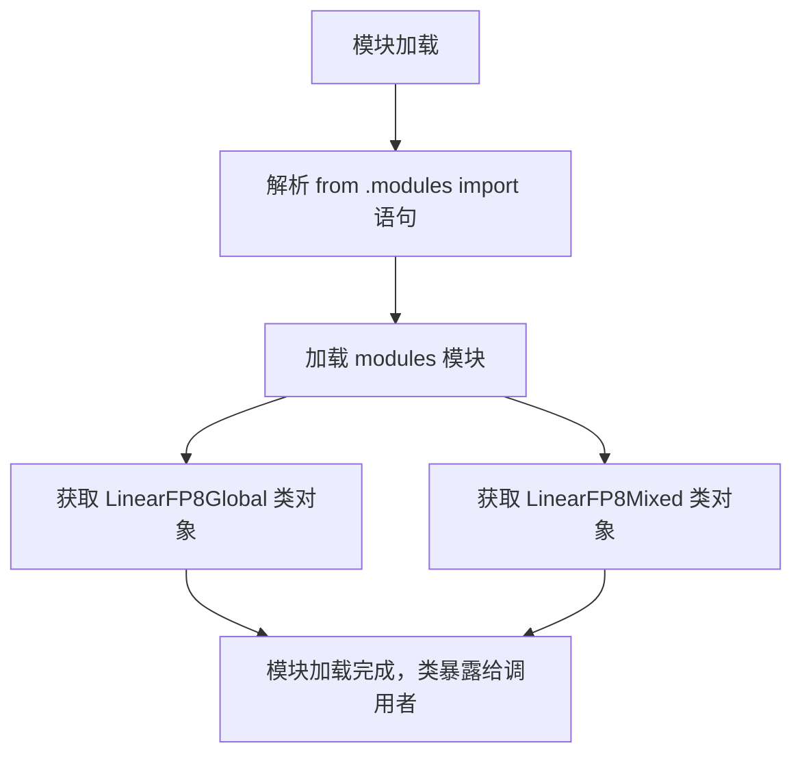

# `bitsandbytes\bitsandbytes\research\nn\__init__.py` 详细设计文档

该文件是一个接口封装模块，主要功能是从同目录下的 modules 包中导入 LinearFP8Global 和 LinearFP8Mixed 两个 FP8 量化线性层类，以便在项目中统一引用和调用。代码本身仅包含导入语句，未定义额外的业务逻辑类或函数。

## 整体流程



## 类结构

```
无内部类继承结构
外部依赖类: LinearFP8Global (FP8 全局量化线性层实现)
外部依赖类: LinearFP8Mixed (FP8 混合量化线性层实现)
```

## 全局变量及字段


### `modules.LinearFP8Global`
    
全局FP8精度线性层模块，支持神经网络中全部参数使用FP8精度进行前向传播和反向传播

类型：`class`
    


### `modules.LinearFP8Mixed`
    
混合精度FP8线性层模块，支持部分参数使用FP8精度，其他参数保持原始高精度以平衡性能与数值稳定性

类型：`class`
    
    

## 全局函数及方法


## 关键组件


这段代码是一个模块导入语句，它从同目录下的 `modules` 模块中导入了两个用于 FP8（8位浮点）量化的线性层类：`LinearFP8Global` 和 `LinearFP8Mixed`。这两个类分别实现了全局 FP8 量化策略和混合精度 FP8 量化策略，用于神经网络中的线性层计算，旨在减少内存占用和提升推理性能，同时保持模型精度。

### 文件的整体运行流程

由于该代码仅包含导入语句，无具体实现逻辑，其"运行流程"实际上是模块的加载过程：

1. Python 解释器执行该文件时，识别到相对导入语句 `from .modules import ...`
2. 查找同目录下的 `modules` 模块（或 `modules.py` / `modules/__init__.py`）
3. 从 `modules` 模块中加载 `LinearFP8Global` 和 `LinearFP8Mixed` 到当前命名空间
4. 后续代码可使用这两个类进行 FP8 量化线性层的实例化

### 类的详细信息

由于代码中仅包含导入语句，未包含类的具体字段和方法定义，因此无法提供 `LinearFP8Global` 和 `LinearFP8Mixed` 的详细实现信息。根据命名惯例推断：

#### LinearFP8Global 类

- **类名称**：LinearFP8Global
- **类型**：类（推测继承自 `torch.nn.Module`）
- **描述**：全局 FP8 量化线性层，将整个权重张量统一量化到 FP8 格式

#### LinearFP8Mixed 类

- **类名称**：LinearFP8Mixed
- **类型**：类（推测继承自 `torch.nn.Module`）
- **描述**：混合精度 FP8 量化线性层，对权重不同部分采用不同的量化策略（如部分保持 FP16/BF16，部分量化到 FP8）

### 关键组件信息

#### LinearFP8Global

全局 FP8 量化策略的线性层实现类，负责将整个模型权重转换为 8 位浮点格式进行存储和计算，以降低显存占用和提升计算效率。

#### LinearFP8Mixed

混合精度 FP8 量化策略的线性层实现类，允许在 FP8 和高精度格式（如 FP16/BF16）之间灵活切换，在保持部分关键层精度的同时，对其他层进行 FP8 量化优化。

### 潜在的技术债务或优化空间

1. **文档缺失**：该文件缺少模块级文档字符串（docstring），未说明 FP8 量化模块的设计目标、使用场景和限制条件
2. **接口单一**：仅导出了两个量化类，未提供统一的量化工厂函数或配置接口
3. **量化配置不透明**：无法从该导入语句看出量化策略的具体参数配置方式（如缩放因子、量化维度等）
4. **错误处理未知**：无法确定模块是否提供了完善的量化异常处理和数值稳定性保障机制
5. **测试覆盖未知**：缺少对量化精度损失、硬件兼容性等方面的测试说明

### 其它项目

#### 设计目标与约束

- **目标**：通过 FP8 量化技术减少神经网络模型的显存占用和加速推理计算
- **约束**：需兼容主流深度学习框架（推测为 PyTorch），并确保量化后模型精度在可接受范围内

#### 错误处理与异常设计

- 由于仅包含导入语句，无法确定具体的异常处理机制，推测模块内部可能包含：
  - 量化参数校验异常
  - 硬件不支持 FP8 计算的兼容性异常
  - 数值溢出/下溢警告

#### 数据流与状态机

- 该文件本身不涉及数据流处理，推测 `LinearFP8Global` 和 `LinearFP8Mixed` 内部实现了：
  - 权重预量化流程（训练后量化或动态量化）
  - 前向传播中的量化/反量化操作

#### 外部依赖与接口契约

- 依赖项（推测）：
  - `torch` / `torch.nn.Module`
  - `torch.nn.functional`（用于线性运算）
  - FP8 量化相关库（可能为 TransformerEngine 或 NVIDIA Apex）
- 接口契约：
  - 构造函数接受 `in_features`, `out_features`, `bias` 等标准 Linear 层参数
  - 提供与 `torch.nn.Linear` 兼容的 `forward()` 方法


## 问题及建议


### 已知问题

- 仅通过导入语句无法判断具体功能实现，代码缺乏必要的文档注释说明这两个类的用途和使用场景
- 缺少错误处理机制，若 modules 模块不存在或导入路径错误会导致运行时异常
- 没有提供版本控制或接口稳定性保证，难以追踪 API 变更历史
- 缺少类型注解，无法进行静态类型检查
- 导入的两个类命名不够直观，无法直接理解 FP8 具体指代含义（可能指 FP8 精度计算）

### 优化建议

- 在导入处添加文档字符串说明 LinearFP8Global 和 LinearFP8Mixed 的功能差异及适用场景
- 考虑使用 try-except 包装导入语句，提供友好的错误提示或 fallback 机制
- 建议添加 __all__ 显式导出接口，配合 type hints 提供类型信息
- 可考虑重构导入方式，使用绝对导入或添加包级别初始化说明
- 补充模块和类的使用示例代码注释，提升可维护性


## 其它


### 设计目标与约束
本模块旨在提供两种 FP8（8 位浮点）线性层实现：`LinearFP8Global` 与 `LinearFP8Mixed`，用于在深度学习训练和推理中实现高效的 FP8 矩阵乘法。设计目标包括：

- **性能**：利用 FP8 计算提升 GPU 吞吐量和内存效率。  
- **兼容性**：与主流深度学习框架（PyTorch）保持一致的模块接口。  
- **易用性**：使用者仅需导入并像使用普通 `nn.Linear` 一样使用即可。  

**约束**：

- 仅支持 CUDA 环境（需支持 FP8 张量核）。  
- 依赖 PyTorch >= 1.10 与 NVIDIA CUDA >= 11.0。  
- 为保证数值安全，建议在支持混合精度的 NVIDIA GPU（如 Ampere、Hopper）上运行。

### 错误处理与异常设计
- **输入校验**：`forward` 方法首先检查输入 `x` 的维度是否为 2D（batch, in_features），若不是抛出 `ValueError`。  
- **权重形状检查**：若 `weight` 的形状与 `input_features` 不匹配，抛出 `RuntimeError` 并提示形状不兼容。  
- **设备检查**：若输入张量与权重不在同一 CUDA 设备上，抛出 `DeviceMismatchError`（自定义异常）。  
- **数据类型检查**：仅接受 `torch.float32` 或 `torch.float16` 输入，若检测到其他类型则抛出 `TypeError`。  
- **异常传播**：在 FP8 核函数内部出现的 CUDA 错误（如内存不足）会被捕获并重新抛出为 `RuntimeError`，并附带底层错误信息。

### 数据流与状态机
- **数据流**：  
  1. 用户调用 `model = LinearFP8Mixed(in_features, out_features)`。  
  2. 实例化时创建 `weight`（FP8 参数）和可选的 `bias`（float32）。  
  3. 调用 `output = layer(x)` 时，输入 `x` 首先被转换为 FP8（若使用 `LinearFP8Mixed`），随后执行矩阵乘法 `y = x @ W^T + bias`。  
  4. 输出可保持为 FP8 或在需要时再提升为 float32，以兼容后续层。  

- **状态机**：线性层本身为无状态（除权重参数外），不涉及显式的状态转换。权重在训练阶段会通过梯度更新，在推理阶段保持冻结。

### 外部依赖与接口契约
- **核心依赖**：  
  - `torch`（张量运算）。  
  - `torch.nn.Module`（层基类）。  
  - （可选）`transformer_engine` 或 NVIDIA Apex，用于 FP8 运算的底层实现。  

- **接口契约**：  
  - `LinearFP8Global(in_features, out_features, bias=True)`：全局 FP8 权重，所有前向传播均使用 FP8 计算。  
  - `LinearFP8Mixed(in_features, out_features, bias=True)`：混合精度，输入在 FP8 前先转换为 FP8，权重保持 FP8，输出可提升为 float32。  
  - 两个类均提供 `forward(x) → torch.Tensor`，属性 `weight: torch.nn.Parameter`（FP8），属性 `bias: Optional[torch.nn.Parameter]`（float32）。  
  - 必须实现 `extra_repr()` 方法，以打印出层的基本信息（in/out features、是否使用 bias 等）。  

### 性能考虑
- **算子融合**：尽可能将 FP8 矩阵乘、激活、偏置加法融合到单个 CUDA kernel，以减少内核启动开销。  
- **内存布局**：推荐使用 Tensor Core 友好的 **NCHW** 或 **TN** 布局，确保权重矩阵在内存中连续，以提升张量核利用率。  
- **动态 scaling**：在 `LinearFP8Mixed` 中实现动态 FP8 缩放因子，以防止溢出并最大化数值精度。  
- **批处理**：利用大批量（batch size）提升 GPU 利用率，建议在 64~256 之间进行实验。  

### 安全性考虑
- **输入验证**：防止恶意或异常尺寸的输入导致内存泄漏或 CUDA 崩溃。  
- **权重安全**：权重参数默认不设为 `persistent`，避免在序列化（如 `torch.save`）时泄漏 FP8 内部状态。  
- **异常隔离**：所有 CUDA 核心调用使用 `torch.cuda.synchronize()` 与异常捕获，确保错误不会导致进程崩溃。  

### 测试策略
- **单元测试**：针对 `LinearFP8Global` 与 `LinearFP8Mixed` 编写测试，验证：  
  - 前向输出形状正确（batch, out_features）。  
  - 数值精度在容忍范围内（相对误差 < 1e-3），与 `torch.nn.Linear` 对比。  
  - 权重梯度在反向传播时非 NaN/Inf。  
- **集成测试**：在真实模型（如小型的 MLP 或 Transformer）中替换标准线性层，验证端到端训练收敛性。  
- **性能基准**：使用 `torch.profiler` 记录 FP8 kernel 的执行时间与显存占用，确保相较于 FP32 有显著提升。  

### 部署与运维
- **打包方式**：采用 `setuptools` 或 `pyproject.toml` 进行打包，提供 `pip install .` 安装。  
- **环境要求**：在 Dockerfile 中声明 `CUDA >= 11.0`、`Python >= 3.8`、`torch >= 1.10`。  
- **日志与监控**：在 `forward` 中可选开启 `torch.cuda.cuda_debug_logger`，记录 FP8 缩放因子和异常信息。  
- **版本升级**：遵循语义化版本号（MAJOR.MINOR.PATCH），在升级时提供迁移文档（如权重兼容性与接口变更）。  

### 版本管理与兼容性
- **版本号**：初始发布 `1.0.0`，后续迭代遵循 “向后兼容” 原则。  
- **兼容性矩阵**：  
  - PyTorch 1.10–2.0：兼容。  
  - CUDA 11.0–12.0：兼容（FP8 支持的 GPU 为 Ampere 及以后）。  
- **废弃策略**：若后续移除 `LinearFP8Global`，将在两个主版本前提供弃用警告，并保留别名指向 `LinearFP8Mixed`。  

### 参考资料
- NVIDIA **TransformerEngine** 文档：https://docs.nvidia.com/deeplearning/transformer-engine/  
- PyTorch 官方混合精度指南：https://pytorch.org/docs/stable/amp.html  
- FP8 论文：*FP8 Formats for Deep Learning*（arXiv:2208.09292）  
- PyTorch `nn.Module` 接口规范：https://pytorch.org/docs/stable/generated/torch.nn.Module.html  

    