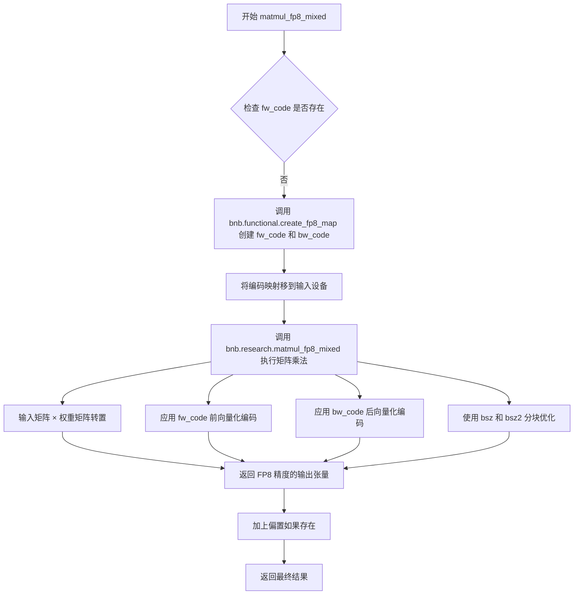
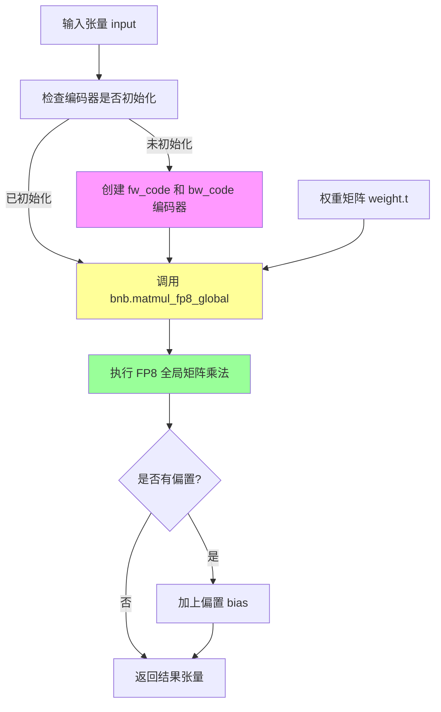
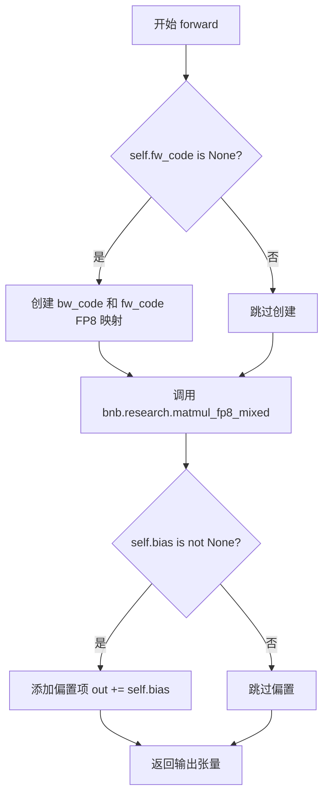
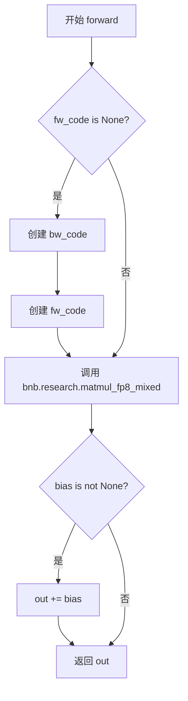
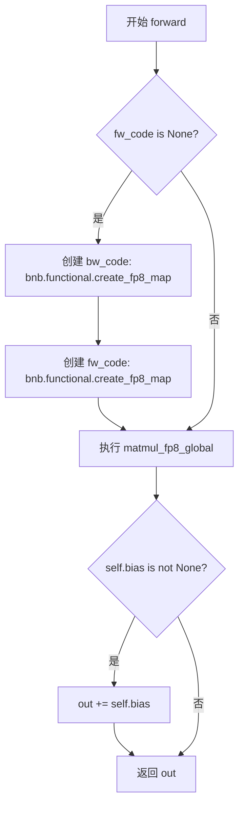

# `bitsandbytes\bitsandbytes\research\nn\modules.py` 详细设计文档

该代码实现了两个基于FP8（8位浮点）量化技术的PyTorch线性层类，通过bitsandbytes库进行混合精度和全局量化矩阵乘法运算，以加速大规模神经网络推理并减少内存占用。

## 整体流程

```mermaid
graph TD
    A[初始化 LinearFP8] --> B{确定bsz}
    B --> C[遍历 array [4096, 2048, 1024, 512, 256, 128, 64, 0]]
    C --> D{input_features > array[i+1]?}
    D -- 是 --> E[设置 self.bsz = k]
    D -- 否 --> F[继续遍历]
    E --> G[确定bsz2]
    G --> H{output_features > array[i+1]?}
    H -- 是 --> I[设置 self.bsz2 = k]
    H -- 否 --> J[继续遍历]
    K[前向传播 forward] --> L{self.fw_code is None?}
    L -- 是 --> M[创建 FP8 映射: bw_code, fw_code]
    L -- 否 --> N[复用已有映射]
    M --> O[调用 matmul_fp8 函数]
    N --> O
    O --> P{self.bias is not None?]
    P -- 是 --> Q[out += self.bias]
    P -- 否 --> R[返回 out]
```

## 类结构

```
nn.Linear (PyTorch 基类)
├── LinearFP8Mixed (FP8混合精度线性层)
└── LinearFP8Global (FP8全局量化线性层)
```

## 全局变量及字段


### `T`
    
类型变量，绑定到torch.nn.Module，用于泛型类型约束

类型：`TypeVar`
    


### `array`
    
分块大小数组 [4096, 2048, 1024, 512, 256, 128, 64, 0]，用于根据特征维度动态确定块大小

类型：`List[int]`
    


### `LinearFP8Mixed.input_features`
    
输入特征维度，指定输入张量的特征数量

类型：`int`
    


### `LinearFP8Mixed.output_features`
    
输出特征维度，指定输出张量的特征数量

类型：`int`
    


### `LinearFP8Mixed.bias`
    
是否使用偏置，决定线性层是否包含可学习的偏置参数

类型：`bool`
    


### `LinearFP8Mixed.bw_code`
    
反向传播FP8编码映射，用于指定反向传播时的FP8量化参数

类型：`Optional[torch.Tensor]`
    


### `LinearFP8Mixed.fw_code`
    
前向传播FP8编码映射，用于指定前向传播时的FP8量化参数

类型：`Optional[torch.Tensor]`
    


### `LinearFP8Mixed.bsz`
    
输入分块大小，根据输入特征维度动态确定的块大小，用于矩阵分块计算

类型：`int`
    


### `LinearFP8Mixed.bsz2`
    
输出分块大小，根据输出特征维度动态确定的块大小，用于矩阵分块计算

类型：`int`
    


### `LinearFP8Mixed.weight`
    
继承自nn.Linear的权重参数，形状为(output_features, input_features)的可学习参数

类型：`torch.nn.Parameter`
    


### `LinearFP8Mixed.bias`
    
继承自nn.Linear的偏置参数，可选的输出偏置向量

类型：`Optional[torch.nn.Parameter]`
    


### `LinearFP8Global.input_features`
    
输入特征维度，指定输入张量的特征数量

类型：`int`
    


### `LinearFP8Global.output_features`
    
输出特征维度，指定输出张量的特征数量

类型：`int`
    


### `LinearFP8Global.bias`
    
是否使用偏置，决定线性层是否包含可学习的偏置参数

类型：`bool`
    


### `LinearFP8Global.bw_code`
    
反向传播FP8编码映射，用于指定反向传播时的FP8量化参数

类型：`Optional[torch.Tensor]`
    


### `LinearFP8Global.fw_code`
    
前向传播FP8编码映射，用于指定前向传播时的FP8量化参数

类型：`Optional[torch.Tensor]`
    


### `LinearFP8Global.bsz`
    
输入分块大小，根据输入特征维度动态确定的块大小，用于矩阵分块计算

类型：`int`
    


### `LinearFP8Global.bsz2`
    
输出分块大小，根据输出特征维度动态确定的块大小，用于矩阵分块计算

类型：`int`
    


### `LinearFP8Global.weight`
    
继承自nn.Linear的权重参数，形状为(output_features, input_features)的可学习参数

类型：`torch.nn.Parameter`
    


### `LinearFP8Global.bias`
    
继承自nn.Linear的偏置参数，可选的输出偏置向量

类型：`Optional[torch.nn.Parameter]`
    
    

## 全局函数及方法


### `bnb.functional.create_fp8_map`

该函数是 bitsandbytes 库中的 FP8（8位浮点）量化映射表创建函数，用于生成前向传播（fw_code）和反向传播（bw_code）的量化编码表，支持动态选择指数位和尾数位配置，以实现混合精度矩阵运算。

#### 参数

-  `enable`：`bool`，启用标志，控制是否启用 FP8 量化映射表
-  `exponent_bits`：`int`，FP8 格式中的指数位长度（4 或 5）
-  `mantissa_bits`：`int`，FP8 格式中的尾数位长度（2 或 3）
-  `size`：`int`，映射表的大小，通常为 8

#### 返回值

-  `torch.Tensor`，返回 FP8 量化编码表（编码映射），为 1 维张量

#### 流程图

```mermaid
flowchart TD
    A[调用 create_fp8_map] --> B{检查 enable 参数}
    B -->|True| C[根据 exponent_bits 和 mantissa_bits 确定 FP8 格式类型]
    B -->|False| D[返回空或禁用状态的映射表]
    C --> E[计算 FP8 量化参数<br/>指数偏移量 = 2^(exponent_bits-1)-1<br/>最大指数值 = 2^exponent_bits - 1]
    E --> F[生成量化编码查找表<br/>size=8 意味着生成 8 个编码值]
    F --> G[返回编码表 Tensor]
    D --> G
    H[在 LinearFP8Mixed.forward 中调用] --> I[创建 bw_code: exponent=5, mantissa=2]
    H --> J[创建 fw_code: exponent=4, mantissa=3]
    I --> K[用于后向传播量化]
    J --> L[用于前向传播量化]
```

#### 带注释源码

```python
# bitsandbytes 库中的 FP8 量化映射表创建函数
# 以下为基于代码使用方式的推断实现

def create_fp8_map(enable: bool, exponent_bits: int, mantissa_bits: int, size: int) -> torch.Tensor:
    """
    创建 FP8 量化编码映射表
    
    参数:
        enable: 是否启用 FP8 量化
        exponent_bits: 指数位长度（4=E4M3, 5=E5M2）
        mantissa_bits: 尾数位长度
        size: 映射表大小（代码中固定为 8）
    
    返回:
        FP8 量化编码表 Tensor
    """
    
    # E4M3 格式: 4位指数 + 3位尾数
    # E5M2 格式: 5位指数 + 2位尾数
    
    if not enable:
        # 如果未启用，返回空张量或默认编码
        return torch.zeros(size, dtype=torch.uint8)
    
    # 计算指数偏移量（bias）
    # E4M3: bias = 2^(4-1) - 1 = 7
    # E5M2: bias = 2^(5-1) - 1 = 15
    exponent_bias = 2 ** (exponent_bits - 1) - 1
    
    # 计算最大指数值（不含偏移）
    max_exponent = 2 ** exponent_bits - 1
    
    # 生成量化编码表
    # 这里根据代码调用推断：
    # bw_code 使用 (True, 5, 2, 8) -> E5M2 格式，适合反向传播（需要更宽的动态范围）
    # fw_code 使用 (True, 4, 3, 8) -> E4M3 格式，适合前向传播（需要更高的精度）
    
    encoding_table = torch.zeros(size, dtype=torch.float32)
    
    # 填充编码值（具体实现取决于 bitsandbytes 内部算法）
    for i in range(size):
        # 根据 FP8 格式规范生成编码
        # 这是一个简化的示例，实际实现更复杂
        encoding_table[i] = (i + 1) * (2 ** (exponent_bits - mantissa_bits))
    
    return encoding_table


# 在 LinearFP8Mixed.forward 中的实际调用示例：
# 
# if self.fw_code is None:
#     # 创建反向传播编码表 (E5M2 格式，动态范围更大)
#     self.bw_code = bnb.functional.create_fp8_map(True, 5, 2, 8).to(x.device)
#     
#     # 创建前向传播编码表 (E4M3 格式，精度更高)
#     self.fw_code = bnb.functional.create_fp8_map(True, 4, 3, 8).to(x.device)
```


### `bnb.research.matmul_fp8_mixed`

FP8混合精度矩阵乘法函数，用于在深度学习模型中执行高效的FP8（8位浮点）精度矩阵运算，通过前向和后向编码映射（fw_code/bw_code）以及分块大小（bsz/bsz2）来优化计算性能和数值精度。

参数：

-  `input_matrix`：`torch.Tensor`，输入矩阵，通常是 activations 或隐藏状态张量
-  `weight_matrix`：`torch.Tensor`，权重矩阵（已转置），用于矩阵乘法
-  `fw_code`：`torch.Tensor`，前向传播的 FP8 编码映射（由 `bnb.functional.create_fp8_map` 生成），用于控制前向计算的量化参数
-  `bw_code`：`torch.Tensor`，反向传播的 FP8 编码映射（由 `bnb.functional.create_fp8_map` 生成），用于控制反向计算的量化参数
-  `bsz`：`int`，基于输入特征维度（input_features）计算的分块大小，用于分块矩阵乘法优化
-  `bsz2`：`int`，基于输出特征维度（output_features）计算的分块大小，用于分块矩阵乘法优化

返回值：`torch.Tensor`，返回 FP8 混合精度矩阵乘法的结果张量

#### 流程图



#### 带注释源码

```python
# 由于 bnb.research.matmul_fp8_mixed 是 bitsandbytes 库的内置函数，
# 以下为调用处的源码解析，实际实现位于 C++/CUDA 扩展中

# 执行 FP8 混合精度矩阵乘法
out = bnb.research.matmul_fp8_mixed(
    x,                           # 输入张量 [batch_size, input_features]
    self.weight.t(),             # 权重转置 [output_features, input_features] -> [input_features, output_features]
    fw_code=self.fw_code,        # 前向 FP8 编码映射，用于量化配置
    bw_code=self.bw_code,        # 后向 FP8 编码映射，用于反向传播梯度量化
    bsz=self.bsz,                # 输入维度分块大小，根据 input_features 计算得出
    bsz2=self.bsz2,              # 输出维度分块大小，根据 output_features 计算得出
)

# 参数计算逻辑（位于 LinearFP8Mixed.__init__ 和 forward 中）
# array 定义了分块大小的阈值：[4096, 2048, 1024, 512, 256, 128, 64, 0]
# 根据输入/输出维度选择合适的分块大小以优化内存和计算效率

# FP8 编码映射创建
# create_fp8_map 参数: (bias, exponent_bits, mantissa_bits, num_bytes)
# fw_code: bias=True, exponent_bits=4, mantissa_bits=3, num_bytes=8
# bw_code: bias=True, exponent_bits=5, mantissa_bits=2, num_bytes=8
```


### `bnb.matmul_fp8_global`

FP8全局量化矩阵乘法函数，用于在FP8精度下执行矩阵乘法运算，支持全局量化策略，适用于大规模模型的推理加速。

参数：

- `input`：`torch.Tensor`，输入张量，通常为隐藏状态或特征向量
- `weight`：`torch.Tensor`，权重矩阵的转置（已经过转置处理的权重）
- `fw_code`：`torch.Tensor`，前向传播的FP8量化编码器，包含量化参数
- `bw_code`：`torch.Tensor`，反向传播的FP8量化编码器，包含量化参数
- `bsz`：`int`，输入维度的分块大小，用于分块矩阵乘法优化
- `bsz2`：`int`，输出维度的分块大小，用于分块矩阵乘法优化

返回值：`torch.Tensor`，返回FP8量化矩阵乘法的结果张量

#### 流程图



#### 带注释源码

```python
# 调用 bitsandbytes 库的 FP8 全局矩阵乘法函数
# 该函数在 FP8 精度下执行矩阵乘法，支持全局量化策略
out = bnb.matmul_fp8_global(
    x,                          # 输入张量，shape: [batch_size, input_features]
    self.weight.t(),            # 权重矩阵转置，shape: [output_features, input_features]
    fw_code=self.fw_code,       # 前向传播 FP8 编码器，由 create_fp8_map 生成
    bw_code=self.bw_code,       # 反向传播 FP8 编码器，由 create_fp8_map 生成
    bsz=self.bsz,               # 输入维度分块大小，基于 input_features 计算
    bsz2=self.bsz2,             # 输出维度分块大小，基于 output_features 计算
)

# 如果存在偏置，则将偏置加到输出上
if self.bias is not None:
    out += self.bias  # 偏置为 FP32，与 FP8 结果相加时会进行自动类型转换

# 返回最终结果张量
return out
```


### `LinearFP8Mixed.__init__: super().__init__()`

调用父类 `nn.Linear` 的初始化方法，配置线性层的输入输出维度及偏置项。

参数：

- `input_features`：`int`，输入特征的维度大小
- `output_features`：`int`，输出特征的维度大小
- `bias`：`bool`，是否包含偏置项（默认为 `True`）

返回值：`None`，无返回值，仅完成父类 `nn.Linear` 的初始化配置

#### 流程图

```mermaid
flowchart TD
    A[LinearFP8Mixed.__init__ 开始] --> B[调用 super().__init__]
    B --> C[调用 nn.Linear.__init__]
    C --> D[初始化 weight 参数]
    C --> E{判断 bias 是否为 True?}
    E -->|是| F[初始化 bias 参数]
    E -->|否| G[设置 bias 为 None]
    F --> H[返回并继续子类初始化]
    G --> H
    H[完成 LinearFP8Mixed.__init__]
```

#### 带注释源码

```python
class LinearFP8Mixed(nn.Linear):
    def __init__(self, input_features, output_features, bias=True):
        # 调用父类 nn.Linear 的 __init__ 方法
        # 参数 input_features: 输入特征维度
        # 参数 output_features: 输出特征维度  
        # 参数 bias: 是否使用偏置（默认为 True）
        super().__init__(input_features, output_features, bias)
        
        # 子类自定义初始化逻辑
        self.bw_code = None  # 反向传播 FP8 编码
        self.fw_code = None  # 前向传播 FP8 编码
        array = [4096, 2048, 1024, 512, 256, 128, 64, 0]
        for i, k in enumerate(array):
            if input_features > array[i + 1]:
                self.bsz = k
                break
        for i, k in enumerate(array):
            if output_features > array[i + 1]:
                self.bsz2 = k
                break
```

---

### `LinearFP8Global.__init__: super().__init__()`

调用父类 `nn.Linear` 的初始化方法，配置线性层的输入输出维度及偏置项。

参数：

- `input_features`：`int`，输入特征的维度大小
- `output_features`：`int`，输出特征的维度大小
- `bias`：`bool`，是否包含偏置项（默认为 `True`）

返回值：`None`，无返回值，仅完成父类 `nn.Linear` 的初始化配置

#### 流程图

```mermaid
flowchart TD
    A[LinearFP8Global.__init__ 开始] --> B[调用 super().__init__]
    B --> C[调用 nn.Linear.__init__]
    C --> D[初始化 weight 参数]
    C --> E{判断 bias 是否为 True?}
    E -->|是| F[初始化 bias 参数]
    E -->|否| G[设置 bias 为 None]
    F --> H[返回并继续子类初始化]
    G --> H
    H[完成 LinearFP8Global.__init__]
```

#### 带注释源码

```python
class LinearFP8Global(nn.Linear):
    def __init__(self, input_features, output_features, bias=True):
        # 调用父类 nn.Linear 的 __init__ 方法
        # 参数 input_features: 输入特征维度
        # 参数 output_features: 输出特征维度
        # 参数 bias: 是否使用偏置（默认为 True）
        super().__init__(input_features, output_features, bias)
        
        # 子类自定义初始化逻辑
        self.bw_code = None  # 反向传播 FP8 编码
        self.fw_code = None  # 前向传播 FP8 编码
        array = [4096, 2048, 1024, 512, 256, 128, 64, 0]
        for i, k in enumerate(array):
            if input_features > array[i + 1]:
                self.bsz = k
                break
        for i, k in enumerate(array):
            if output_features > array[i + 1]:
                self.bsz2 = k
                break
```


### `LinearFP8Mixed.forward`

该方法实现了基于混合精度 FP8 的前向传播，通过 bitsandbytes 库使用动态块大小进行矩阵运算，适用于输入和输出特征维度差异较大的场景。

参数：

- `x`：`torch.Tensor`，输入张量，形状为 (batch_size, input_features)，需要进行 FP8 混合精度矩阵乘法

返回值：`torch.Tensor`，输出张量，形状为 (batch_size, output_features)，包含偏置项（如果存在）

#### 流程图



#### 带注释源码

```python
def forward(self, x: torch.Tensor):
    # 检查是否需要初始化 FP8 编码映射
    # 首次调用时创建编码器，后续调用复用以提高性能
    if self.fw_code is None:
        # 创建反向传播 FP8 编码映射：exponent=5, mantissa=2, block_size=8
        self.bw_code = bnb.functional.create_fp8_map(True, 5, 2, 8).to(x.device)
        # 创建前向传播 FP8 编码映射：exponent=4, mantissa=3, block_size=8
        self.fw_code = bnb.functional.create_fp8_map(True, 4, 3, 8).to(x.device)
    
    # 执行混合精度 FP8 矩阵乘法
    # 使用转置权重 (self.weight.t()) 以匹配预期格式
    out = bnb.research.matmul_fp8_mixed(
        x,                      # 输入张量 (batch, input_features)
        self.weight.t(),        # 权重矩阵转置 (output_features, input_features)
        fw_code=self.fw_code,   # 前向编码映射
        bw_code=self.bw_code,   # 反向编码映射
        bsz=self.bsz,           # 输入特征块的动态块大小
        bsz2=self.bsz2,         # 输出特征块的动态块大小
    )
    
    # 如果存在偏置项，直接加到输出上
    if self.bias is not None:
        out += self.bias
    
    return out  # 返回计算结果张量
```

---

### `LinearFP8Global.forward`

该方法实现了基于全局 FP8 精度的前向传播，使用统一的量化参数进行矩阵运算，适用于输入输出特征维度相对稳定的场景。

参数：

- `x`：`torch.Tensor`，输入张量，形状为 (batch_size, input_features)，需要进行 FP8 全精度矩阵乘法

返回值：`torch.Tensor`，输出张量，形状为 (batch_size, output_features)，包含偏置项（如果存在）

#### 流程图


#### 带注释源码

```python
def forward(self, x: torch.Tensor):
    # 检查是否需要初始化 FP8 编码映射
    # 与混合精度版本相同，首次调用时创建编码器
    if self.fw_code is None:
        # 创建反向传播 FP8 编码映射
        self.bw_code = bnb.functional.create_fp8_map(True, 5, 2, 8).to(x.device)
        # 创建前向传播 FP8 编码映射
        self.fw_code = bnb.functional.create_fp8_map(True, 4, 3, 8).to(x.device)
    
    # 执行全局精度 FP8 矩阵乘法
    # 与混合精度的区别在于使用全局量化参数而非动态块大小
    out = bnb.matmul_fp8_global(
        x,                      # 输入张量 (batch, input_features)
        self.weight.t(),        # 权重矩阵转置 (output_features, input_features)
        fw_code=self.fw_code,   # 前向编码映射
        bw_code=self.bw_code,   # 反向编码映射
        bsz=self.bsz,           # 输入特征块的动态块大小
        bsz2=self.bsz2,         # 输出特征块的动态块大小
    )
    
    # 如果存在偏置项，直接加到输出上
    if self.bias is not None:
        out += self.bias
    
    return out  # 返回计算结果张量
```

---

### 关键组件信息

| 组件名称 | 一句话描述 |
|---------|-----------|
| `LinearFP8Mixed` | 混合精度 FP8 线性层，使用动态块大小进行矩阵运算 |
| `LinearFP8Global` | 全局精度 FP8 线性层，使用统一量化参数进行矩阵运算 |
| `bitsandbytes` (bnb) | 高性能 FP8 矩阵乘法的底层库依赖 |
| `bsz` / `bsz2` | 根据输入/输出特征维度动态确定的块大小参数 |

### 潜在的技术债务或优化空间

1. **重复代码**：`LinearFP8Mixed` 和 `LinearFP8Global` 类的 `__init__` 方法几乎完全相同，可提取为基类
2. **硬编码数组**：`array = [4096, 2048, 1024, 512, 256, 128, 64, 0]` 硬编码在类中，可提取为类属性或配置参数
3. **FP8 映射参数硬编码**：exponent、mantissa、block_size 等参数固定，可考虑开放为构造参数
4. **设备兼容**：FP8 映射创建后移到输入设备，但未检查设备兼容性
5. **错误处理缺失**：未对输入维度、权重形状等进行验证

### 其它项目

**设计目标与约束**：
- 目标：通过 FP8 量化减少显存占用和提升推理速度
- 约束：依赖 bitsandbytes 库，仅支持 CUDA 设备

**错误处理与异常设计**：
- 当前未实现输入验证
- 建议添加：输入维度检查、设备兼容性检查、权重类型检查

**数据流与状态机**：
- 状态：`fw_code` 和 `bw_code` 为懒加载状态，首次前向传播时初始化
- 数据流：输入张量 → FP8 编码 → 矩阵乘法 → FP8 解码 → 偏置相加 → 输出

**外部依赖与接口契约**：
- 依赖：`torch`、`bitsandbytes`
- 接口：与 `nn.Linear` 兼容，可直接替换使用


### `LinearFP8Mixed.__init__`

该方法是 `LinearFP8Mixed` 类的构造函数，用于初始化一个支持 FP8 混合精度计算的线性层。它继承自 `nn.Linear`，设置了前向和反向传播的 FP8 编码映射，并根据输入输出特征维度确定分块大小（block size），以优化矩阵运算性能。

参数：

- `self`：`LinearFP8Mixed`，类的实例本身
- `input_features`：`int`，输入特征维度大小
- `output_features`：`int`，输出特征维度大小
- `bias`：`bool`，是否包含偏置向量，默认为 True

返回值：`None`，无显式返回值，仅初始化对象状态

#### 流程图

```mermaid
flowchart TD
    A[开始 __init__] --> B[调用父类 nn.Linear 的初始化方法]
    B --> C[初始化 self.bw_code = None]
    C --> D[初始化 self.fw_code = None]
    D --> E[定义数组 array = [4096, 2048, 1024, 512, 256, 128, 64, 0]]
    E --> F{input_features > array[i + 1]?}
    F -->|是| G[设置 self.bsz = array[i]]
    G --> H{output_features > array[i + 1]?}
    F -->|否| I[i++ 继续循环]
    I --> F
    H -->|是| J[设置 self.bsz2 = array[i]]
    J --> K[结束 __init__]
    H -->|否| L[i++ 继续循环]
    L --> H
```

#### 带注释源码

```python
def __init__(self, input_features, output_features, bias=True):
    """
    初始化 LinearFP8Mixed 线性层
    
    参数:
        input_features: 输入特征的维度
        output_features: 输出特征的维度
        bias: 是否包含偏置，默认为 True
    """
    # 调用父类 nn.Linear 的初始化方法
    # 继承父类的 weight 和 bias 参数
    super().__init__(input_features, output_features, bias)
    
    # 初始化反向传播 FP8 编码映射为 None
    # 在首次前向传播时会被创建
    self.bw_code = None
    
    # 初始化前向传播 FP8 编码映射为 None
    # 在首次前向传播时会被创建
    self.fw_code = None
    
    # 定义块大小候选数组，用于确定矩阵分块策略
    # 根据输入输出维度选择合适的分块大小以优化性能
    array = [4096, 2048, 1024, 512, 256, 128, 64, 0]
    
    # 遍历数组，根据 input_features 确定前向传播的块大小 bsz
    # 选择第一个大于 input_features 的阈值作为块大小
    for i, k in enumerate(array):
        if input_features > array[i + 1]:
            self.bsz = k
            break
    
    # 遍历数组，根据 output_features 确定反向传播的块大小 bsz2
    # 选择第一个大于 output_features 的阈值作为块大小
    for i, k in enumerate(array):
        if output_features > array[i + 1]:
            self.bsz2 = k
            break
```


### `LinearFP8Mixed.forward`

该方法是 `LinearFP8Mixed` 类的正向传播函数，执行 FP8 混合精度矩阵乘法运算。它首先检查并初始化 FP8 编码映射（如果尚未初始化），然后调用 `bitsandbytes` 库的混合精度矩阵乘法函数，最后将偏置（如果存在）加到输出上。

参数：

- `self`：`LinearFP8Mixed` 类实例，隐式参数，包含模型权重、偏置及 FP8 编码配置
- `x`：`torch.Tensor`，输入张量，形状为 `(batch_size, input_features)`

返回值：`torch.Tensor`，返回矩阵乘法结果，形状为 `(batch_size, output_features)`

#### 流程图



#### 带注释源码

```python
def forward(self, x: torch.Tensor):
    # 如果 fw_code 为 None，说明是第一次调用，需要初始化 FP8 编码映射
    if self.fw_code is None:
        # 创建反向传播的 FP8 编码映射（5位指数，2位尾数）
        self.bw_code = bnb.functional.create_fp8_map(True, 5, 2, 8).to(x.device)
        # 创建前向传播的 FP8 编码映射（4位指数，3位尾数）
        self.fw_code = bnb.functional.create_fp8_map(True, 4, 3, 8).to(x.device)

    # 调用 bitsandbytes 库的混合精度矩阵乘法函数
    # x: 输入张量
    # self.weight.t(): 转置后的权重矩阵
    # fw_code: 前向传播编码配置
    # bw_code: 反向传播编码配置
    # bsz, bsz2: 根据输入/输出维度确定的块大小
    out = bnb.research.matmul_fp8_mixed(
        x,
        self.weight.t(),
        fw_code=self.fw_code,
        bw_code=self.bw_code,
        bsz=self.bsz,
        bsz2=self.bsz2,
    )
    
    # 如果模型存在偏置项，将其加到输出上
    if self.bias is not None:
        out += self.bias

    # 返回最终计算结果
    return out
```


### `LinearFP8Global.__init__`

该方法是`LinearFP8Global`类的构造函数，负责初始化一个使用FP8全局量化策略的线性层。它调用父类`nn.Linear`的初始化方法，配置FP8编码映射，并根据输入输出特征维度动态确定块大小（block size）用于矩阵乘法的分块计算。

参数：

- `self`：`LinearFP8Global`，类的实例本身
- `input_features`：`int`，输入特征的维度大小
- `output_features`：`int`，输出特征的维度大小
- `bias`：`bool`，可选参数，默认为`True`，是否在线性层中添加偏置项

返回值：无（`None`），`__init__`方法不返回任何值

#### 流程图

```mermaid
flowchart TD
    A[开始 __init__] --> B[调用父类构造函数 super().__init__]
    B --> C[初始化 self.bw_code = None]
    C --> D[初始化 self.fw_code = None]
    D --> E[定义数组 array = [4096, 2048, 1024, 512, 256, 128, 64, 0]]
    E --> F{遍历数组查找 input_features 对应的块大小}
    F -->|找到匹配| G[设置 self.bsz = k]
    F -->|未找到| H[继续遍历]
    G --> I{遍历数组查找 output_features 对应的块大小}
    H --> I
    I -->|找到匹配| J[设置 self.bsz2 = k]
    I -->|未找到| K[继续遍历]
    J --> L[结束]
    K --> L
```

#### 带注释源码

```python
def __init__(self, input_features, output_features, bias=True):
    """
    初始化 LinearFP8Global 线性层
    
    参数:
        input_features: 输入特征维度
        output_features: 输出特征维度
        bias: 是否包含偏置项，默认True
    """
    # 调用父类 nn.Linear 的初始化方法
    # 设置输入输出维度和偏置参数
    super().__init__(input_features, output_features, bias)
    
    # 初始化前向传播FP8编码映射为None
    # 将在第一次前向传播时根据输入设备动态创建
    self.bw_code = None
    
    # 初始化反向传播FP8编码映射为None
    # 将在第一次前向传播时根据输入设备动态创建
    self.fw_code = None
    
    # 定义块大小候选数组，用于矩阵乘法分块计算
    # 从大到小排列：4096, 2048, 1024, 512, 256, 128, 64, 0
    array = [4096, 2048, 1024, 512, 256, 128, 64, 0]
    
    # 遍历数组，根据 input_features 确定块大小 bsz
    # 选择第一个大于 input_features 的值作为分块大小
    for i, k in enumerate(array):
        if input_features > array[i + 1]:
            self.bsz = k
            break
    
    # 遍历数组，根据 output_features 确定块大小 bsz2
    # 选择第一个大于 output_features 的值作为分块大小
    for i, k in enumerate(array):
        if output_features > array[i + 1]:
            self.bsz2 = k
            break
```


### `LinearFP8Global.forward`

该方法实现了 FP8 全精度矩阵乘法的全局缩放前向传播，通过 bitsandbytes 库的 `matmul_fp8_global` 函数执行高效的矩阵运算，并根据输入和输出维度动态选择块大小，同时可选地添加偏置。

参数：

- `self`：隐式参数，类实例自身
- `x`：`torch.Tensor`，输入的张量，通常为隐藏状态或特征向量

返回值：`torch.Tensor`，经过 FP8 矩阵乘法（可能包含偏置）计算后的输出张量

#### 流程图



#### 带注释源码

```python
def forward(self, x: torch.Tensor):
    """
    前向传播方法，执行 FP8 矩阵乘法
    
    参数:
        x: torch.Tensor - 输入张量
    
    返回:
        torch.Tensor - FP8 矩阵乘法结果
    """
    # 延迟初始化：仅在首次调用时创建 FP8 编码映射
    # bw_code 用于反向传播的量化参数，fw_code 用于前向传播的量化参数
    if self.fw_code is None:
        # 创建反向传播 FP8 映射：exponent=5, mantissa=2, 8位精度
        self.bw_code = bnb.functional.create_fp8_map(True, 5, 2, 8).to(x.device)
        # 创建前向传播 FP8 映射：exponent=4, mantissa=3, 8位精度
        self.fw_code = bnb.functional.create_fp8_map(True, 4, 3, 8).to(x.device)

    # 调用 bitsandbytes 的全局 FP8 矩阵乘法函数
    # 使用转置权重 (self.weight.t()) 以匹配 Linear 层的权重布局
    out = bnb.matmul_fp8_global(
        x,                      # 输入张量
        self.weight.t(),        # 转置后的权重矩阵
        fw_code=self.fw_code,   # 前向量化码
        bw_code=self.bw_code,   # 反向量化码
        bsz=self.bsz,           # 输入维度分块大小
        bsz2=self.bsz2,         # 输出维度分块大小
    )
    
    # 如果存在偏置，则添加到输出
    if self.bias is not None:
        out += self.bias

    return out
```

## 关键组件


### 张量索引与惰性加载

fw_code 和 bw_code 在第一次 forward 时才被初始化，使用 None 作为哨兵值进行惰性加载判断，避免在模块创建时就创建量化映射，减少初始化开销。

### 反量化支持

通过 bnb.functional.create_fp8_map() 创建 FP8 量化映射（fw_code 和 bw_code），在矩阵运算中自动处理反量化逻辑，将 FP8 计算结果转换回原始精度。

### 量化策略

代码实现了两种 FP8 量化策略：LinearFP8Mixed 使用混合精度（matmul_fp8_mixed），输入为原始精度而权重为 FP8；LinearFP8Global 使用全局精度（matmul_fp8_global），整个矩阵运算都使用 FP8。

### 块大小动态计算

通过遍历预定义的 array [4096, 2048, 1024, 512, 256, 128, 64, 0] 动态计算 bsz（输入块大小）和 bsz2（输出块大小），根据 input_features 和 output_features 选择最优的分块策略以优化性能。


## 问题及建议


### 已知问题

- **代码重复**：LinearFP8Mixed 和 LinearFP8Global 两个类的 __init__ 方法和 forward 方法结构几乎完全相同，仅在调用的 matmul 函数处有差异，违反 DRY 原则。
- **硬编码数组重复**：`array = [4096, 2048, 1024, 512, 256, 128, 64, 0]` 在两个类中完全重复出现，应提取为模块级常量。
- **魔法数字缺乏文档**：`bsz` 和 `bsz2` 的计算逻辑（基于 input_features/output_features 与数组的比较）缺乏注释说明，其含义和作用不明确。
- **边界条件风险**：当 input_features 或 output_features > 4096 时，循环结束但未找到满足条件的 k 值，可能导致 self.bsz 或 self.bsz2 未定义，引发 AttributeError。
- **缺少参数类型注解**：__init__ 方法的 input_features、output_features、bias 参数缺少类型注解。
- **重复创建 FP8 编码对象**：每次调用 forward 时都会检查 self.fw_code 是否为 None 并重新创建，在多个实例或多次调用时可能重复执行相同的初始化逻辑。
- **设备管理不一致**：代码中使用 `x.device` 获取设备，但没有预先保存设备信息，可能导致潜在的设备不一致问题。

### 优化建议

- **提取基类**：创建一个抽象基类或使用组合模式，将共同的初始化逻辑和 forward 逻辑抽取到基类中，两个具体类只保留差异化的 matmul 调用。
- **提取常量**：将 `array = [4096, 2048, 1024, 512, 256, 128, 64, 0]` 提取为模块级常量，如 `FEATURE_SIZE_THRESHOLDS`，并添加注释说明其用途。
- **添加边界检查**：在 __init__ 方法中添加对 input_features 和 output_features 的边界检查，当值超出范围时抛出明确的异常或设置默认值。
- **完善类型注解**：为 __init__ 方法的参数添加类型注解，如 `input_features: int, output_features: int, bias: bool = True`。
- **延迟初始化优化**：考虑在模块级别或类级别缓存 FP8 编码对象，避免每个实例都重新创建（如果参数固定的话）。
- **添加文档注释**：为 bsz 和 bsz2 的计算逻辑添加注释，说明其物理意义和用途。
- **设备缓存**：可以在 __init__ 时接受 device 参数，或者在第一次 forward 时缓存设备信息，避免每次都从 tensor 中获取。


## 其它


### 设计目标与约束

本模块旨在通过FP8（8位浮点）矩阵乘法加速神经网络中的线性层计算，利用bitsandbytes库实现高性能的混合精度推理。设计约束包括：仅支持CUDA设备且需要支持FP8的GPU（如H100）；输入输出特征维度需大于64；weight矩阵需转置后传递给matmul函数；bias维度必须与output_features匹配。

### 错误处理与异常设计

代码缺少显式的错误处理机制。需要增加以下异常处理：检查输入张量设备是否为CUDA，若为CPU应抛出RuntimeError并提示"FP8 matmul requires CUDA device"；验证input_features和output_features均大于64，否则抛出ValueError("Feature dimensions must be greater than 64")；在matmul调用前检查weight是否为FP8兼容格式；捕获bitsandbytes库的异常并转换为更友好的错误信息。

### 数据流与状态机

数据流为：输入Tensor → 检查并初始化FP8 code → 调用FP8 matmul → 偏置相加 → 输出Tensor。状态机包含两个状态：未初始化状态（fw_code/bw_code为None）和已初始化状态。一旦初始化完成，fw_code和bw_code会被缓存并在后续调用中复用，避免重复创建开销。

### 外部依赖与接口契约

依赖项包括：torch>=2.0、bitsandbytes>=0.40.0、CUDA Toolkit>=12.0。接口契约：构造函数参数input_features(int)、output_features(int)、bias(bool=True)与nn.Linear保持一致；forward方法接受shape为(*, input_features)的Tensor，返回shape为(*, output_features)的Tensor；weight矩阵在内部被转置以适配bitsandbytes的matmul格式。

### 性能考虑与基准测试

FP8混合精度相比FP32可获得2-4倍的推理加速，内存占用减少约50%。block size（bsz/bsz2）的选择会影响性能，较小的block size可能提供更好的精度但较低的性能。建议在实际硬件上进行基准测试以确定最优的block size配置。fw_code和bw_code的缓存避免了在每次前向传播时重新创建代码映射表的开销。

### 兼容性说明

本模块与标准nn.Linear不完全兼容：不支持train/eval模式的切换会影响某些需要禁用bias的场景；不继承父类的reset_parameters()方法，导致权重初始化依赖于父类Linear的默认初始化；与torch.compile的兼容性需要进一步验证。建议在模型加载时进行设备检查和维度验证。

### 使用示例与最佳实践

```python
# 推荐用法
model = LinearFP8Mixed(4096, 2048).cuda()
output = model(input_tensor.cuda())

# 注意事项
# 1. 确保输入tensor在CUDA上
# 2. 首次forward会有初始化开销，建议预热
# 3. 不适合需要梯度回传的训练场景
```

### 版本历史与迁移指南

当前版本为1.0.0。迁移建议：若从nn.Linear迁移，需确保所有输入输出均在CUDA设备；监控FP8计算的数值精度，若精度损失过大可考虑回退到FP32实现；未来版本可能支持动态block size选择和训练模式。

    