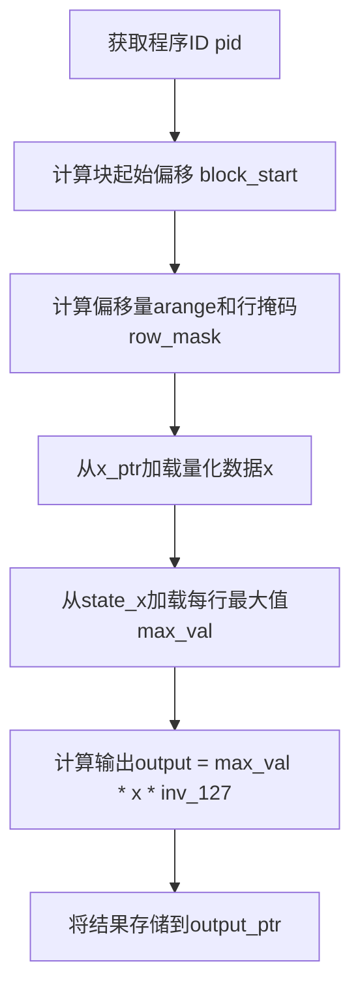
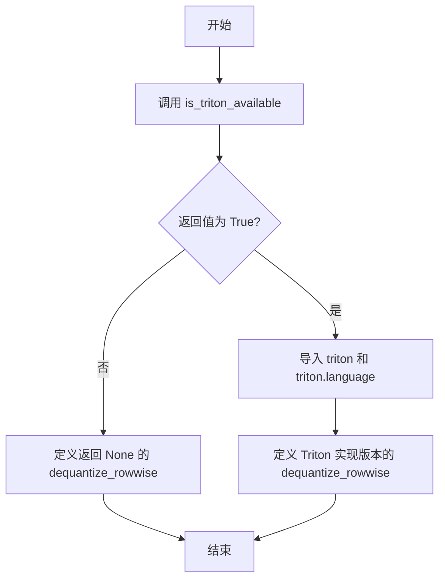
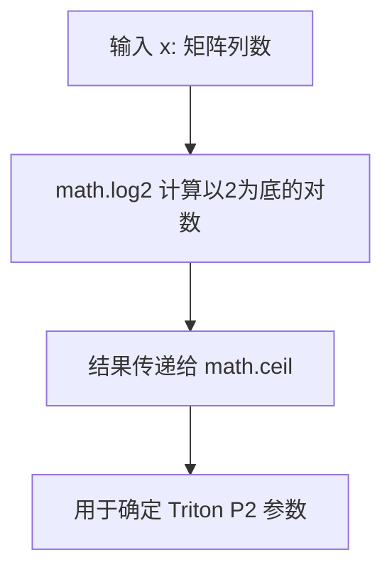
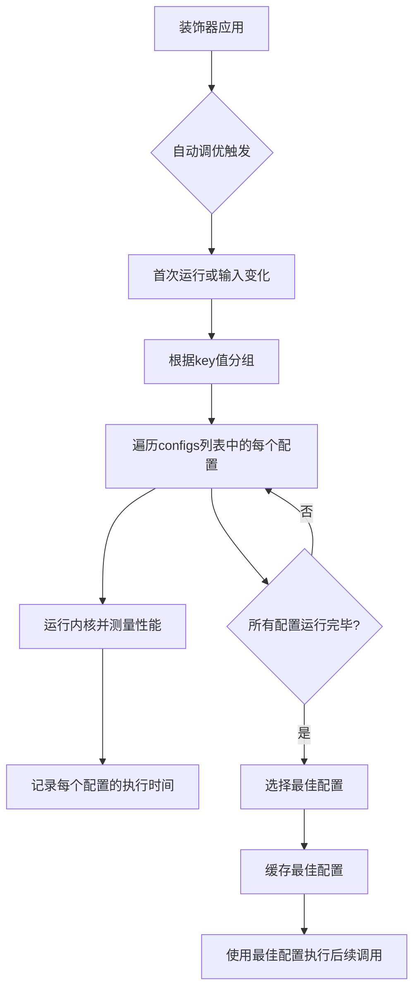
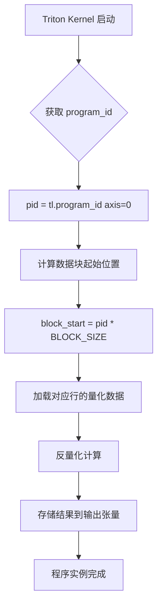
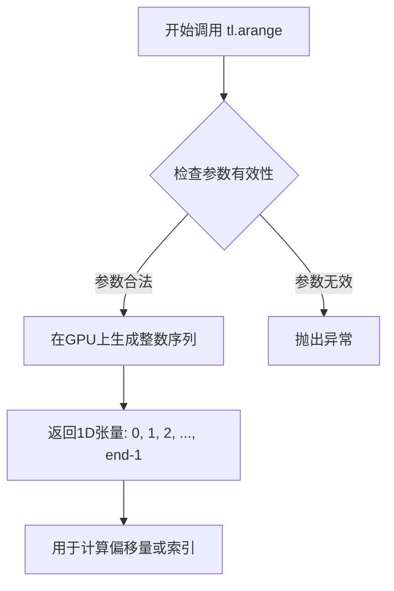
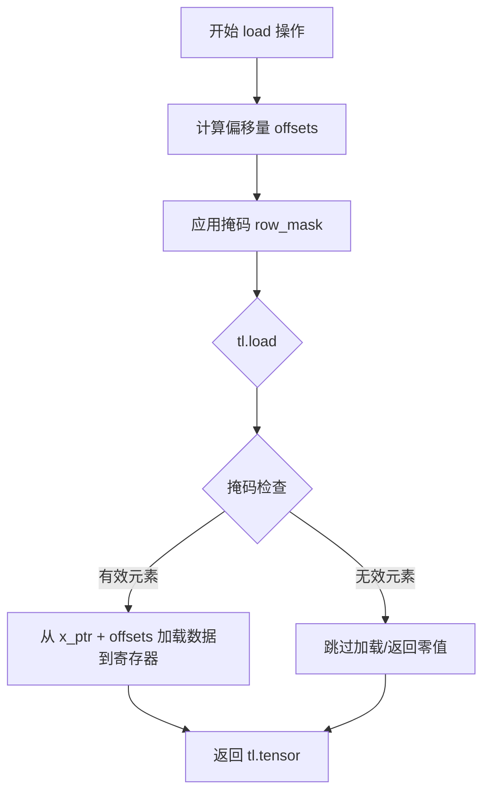

# `bitsandbytes\bitsandbytes\triton\dequantize_rowwise.py` 详细设计文档

该代码实现了一个基于Triton的行级量化反量化函数，用于将量化后的张量（行级量化）反量化为float16精度。当Triton不可用时，返回None；否则使用Triton kernel进行高效的GPU加速反量化操作。

## 整体流程

```mermaid
graph TD
    A[开始] --> B{检查Triton是否可用}
    B -- 否 --> C[定义dequantize_rowwise返回None]
    B -- 是 --> D[定义Triton kernel _dequantize_rowwise]
    D --> E[定义Python函数dequantize_rowwise]
    E --> F[创建输出张量output]
    F --> G[计算P2 = 2^(ceil(log2(列数)))]
    G --> H[验证CUDA可用性]
H --> I[计算n_elements = output元素总数]
I --> J[调用Triton kernel进行反量化]
J --> K[返回反量化后的output张量]
```

## 类结构

```
该文件为模块级代码，无类定义
├── 全局函数 (条件定义)
│   ├── dequantize_rowwise (Triton不可用时)
│   └── dequantize_rowwise (Triton可用时)
└── Triton Kernel
    └── _dequantize_rowwise
```

## 全局变量及字段


### `x`
    
输入的量化张量，包含行wise量化的数据

类型：`torch.Tensor`
    


### `state_x`
    
包含每行最大值的张量，用于反量化时的缩放

类型：`torch.Tensor`
    


### `output`
    
反量化后的输出张量，形状与输入相同，类型为float16

类型：`torch.Tensor`
    


### `inv_127`
    
127的倒数（1.0/127），作为反量化时的缩放因子

类型：`float`
    


### `n_elements`
    
输出张量的总元素数量，用于Triton网格配置

类型：`int`
    


### `P2`
    
输入张量列数的下一个2的幂次方，用于确定Triton内核的块大小

类型：`int`
    


### `BLOCK_SIZE`
    
Triton内核的块大小常量，在编译时确定

类型：`tl.constexpr`
    


### `pid`
    
Triton程序的ID，用于标识当前执行的块

类型：`int`
    


### `block_start`
    
当前块的起始偏移量，等于pid乘以块大小

类型：`int`
    


### `arange`
    
Triton生成的0到P2-1的连续张量，用于计算偏移

类型：`tl.tensor`
    


### `offsets`
    
当前块的元素偏移量，等于block_start加上arange

类型：`tl.tensor`
    


### `row_mask`
    
行掩码，用于确保加载和存储操作不越界

类型：`tl.tensor`
    


### `max_val`
    
当前行的最大量化值，用于反量化计算

类型：`tl.tensor`
    


### `x_ptr`
    
输入张量x在GPU内存中的指针

类型：`pointer`
    


### `state_x_ptr`
    
状态张量state_x在GPU内存中的指针

类型：`pointer`
    


### `output_ptr`
    
输出张量output在GPU内存中的指针

类型：`pointer`
    


    

## 全局函数及方法


### `dequantize_rowwise`

该函数用于对量化后的张量进行行级别（row-wise）反量化操作。它通过加载输入的量化张量及其对应的状态信息（每行的最大值），利用 Triton GPU 加速计算 `output = max_val * x * inv_127` 公式，将量化数据恢复为 float16 类型的浮点表示。如果 Triton 不可用，则返回 `None`。

参数：

- `x`：`torch.Tensor`，输入的量化张量，通常是 int8 类型的数据
- `state_x`：`torch.Tensor`，包含每行最大值的状态张量，用于反量化时的缩放因子

返回值：`torch.Tensor`，反量化后的浮点张量，类型为 float16，如果 Triton 不可用则返回 `None`

#### 流程图

```mermaid
flowchart TD
    A[开始] --> B{Triton 是否可用?}
    B -->|否| C[返回 None]
    B -->|是| D[创建输出张量<br/>device=x.device<br/>dtype=torch.float16]
    D --> E[计算 P2<br/>P2 = 2^ceil(log2(列数))]
    E --> F[验证 x 和 output 都在 CUDA 上]
    F --> G[计算 n_elements<br/>n_elements = output.numel()]
    G --> H[设置 grid = (x.shape[0],)<br/>每个 row 一个 program]
    H --> I[调用 Triton kernel<br/>_dequantize_rowwise]
    I --> J[kernel 内部执行:<br/>1. 获取 program_id<br/>2. 加载量化数据<br/>3. 加载 max_val<br/>4. 计算 output<br/>5. 存储结果]
    J --> K[返回 output 张量]
```

#### 带注释源码

```python
import math

import torch

from bitsandbytes.triton.triton_utils import is_triton_available

# 如果 Triton 不可用，定义一个 fallback 的空实现
if not is_triton_available():

    def dequantize_rowwise(x: torch.Tensor, state_x: torch.Tensor):
        """Triton 不可用时的 fallback 实现，直接返回 None"""
        return None

# 如果 Triton 可用，使用完整的 Triton 实现
else:
    import triton
    import triton.language as tl

    # rowwise quantize（行级别量化相关注释）

    # TODO: autotune this better.
    # 使用 Triton 的自动调优功能来选择最优的 kernel 配置
    @triton.autotune(
        configs=[
            triton.Config({}, num_stages=1, num_warps=8),
            triton.Config({}, num_stages=2, num_warps=8),
            triton.Config({}, num_stages=4, num_warps=8),
            triton.Config({}, num_stages=8, num_warps=8),
            triton.Config({}, num_stages=1),
            triton.Config({}, num_stages=2),
            triton.Config({}, num_stages=4),
            triton.Config({}, num_stages=8),
            triton.Config({}, num_warps=1),
            triton.Config({}, num_warps=2),
            triton.Config({}, num_warps=4),
            triton.Config({}, num_warps=8),
        ],
        key=["n_elements"],
    )
    @triton.jit
    def _dequantize_rowwise(
        x_ptr,          # 输入量化张量的指针
        state_x,        # 状态张量（每行最大值）的指针
        output_ptr,     # 输出张量的指针
        inv_127,        # 127 的倒数（1.0/127），用于反量化
        n_elements,     # 总元素数量
        BLOCK_SIZE: tl.constexpr,  # Block 大小（列数）
        P2: tl.constexpr,          # 2 的幂次，用于 tl.arange
    ):
        """Triton JIT 编译的反量化 kernel"""
        # 获取当前 program 的 ID（对应行号）
        pid = tl.program_id(axis=0)
        # 计算当前 block 的起始偏移
        block_start = pid * BLOCK_SIZE
        # 创建 [0, P2) 的范围数组
        arange = tl.arange(0, P2)
        # 计算当前 block 内所有元素的全局偏移
        offsets = block_start + arange
        # 创建行掩码，确保不越界
        row_mask = arange < BLOCK_SIZE
        # 从输入张量加载量化数据（int8 转换为 float）
        x = tl.load(x_ptr + offsets, mask=row_mask)
        # 加载当前行对应的最大值（状态信息）
        max_val = tl.load(state_x + pid)
        # 执行反量化：output = max_val * x * inv_127
        output = max_val * x * inv_127
        # 将结果存储到输出张量
        tl.store(output_ptr + offsets, output, mask=row_mask)

    def dequantize_rowwise(x: torch.Tensor, state_x: torch.Tensor):
        """
        对输入张量进行行级别反量化
        
        参数:
            x: 量化后的输入张量 (通常为 int8)
            state_x: 包含每行最大值的张量，用于反量化缩放
            
        返回:
            反量化后的 float16 张量
        """
        # 创建与输入 shape 相同的输出张量，类型为 float16
        output = torch.empty(*x.shape, device=x.device, dtype=torch.float16)

        # 计算 P2：大于等于列数的最小 2 的幂次
        # 用于 Triton kernel 中的 tl.arange 索引计算
        P2 = int(2 ** (math.ceil(math.log2(x.shape[1]))))

        # 断言确保输入和输出都在 CUDA 设备上
        assert x.is_cuda and output.is_cuda
        # 计算输出张量的总元素数量
        n_elements = output.numel()
        # 设置 grid：每个 row 对应一个 program
        grid = lambda meta: (x.shape[0],)
        # 调用 Triton kernel 进行反量化计算
        # 传入参数：输入张量、状态张量、输出张量、inv_127、n_elements
        # BLOCK_SIZE 设为输入的列数，P2 为计算得到的 2 的幂次
        _dequantize_rowwise[grid](
            x, 
            state_x, 
            output, 
            1.0 / 127, 
            n_elements, 
            BLOCK_SIZE=x.shape[1], 
            P2=P2
        )
        # 返回反量化后的结果
        return output
```


### `_dequantize_rowwise`

描述：Triton内核函数，用于对输入的量化张量进行行-wise反量化，基于每行的状态信息（如最大值）将量化值转换为浮点数。

参数：
- `x_ptr`: `pointer`， 输入的量化张量指针，指向待反量化的数据
- `state_x`: `pointer`， 状态张量指针，存储每行的缩放因子（如最大值）
- `output_ptr`: `pointer`， 输出张量指针，存储反量化后的浮点结果
- `inv_127`: `float`， 逆127缩放因子，用于反量化计算（通常为1.0/127）
- `n_elements`: `int`， 输入张量的总元素数
- `BLOCK_SIZE`: `tl.constexpr (int)`， 块大小常量，用于定义每个线程块处理的元素数量
- `P2`: `tl.constexpr (int)`， 2的幂次方维度，大于等于输入张量的列数，用于计算偏移量

返回值：`void`， 无返回值，结果通过output_ptr参数输出

#### 流程图



#### 带注释源码

```python
@triton.jit
def _dequantize_rowwise(
    x_ptr,           # 输入量化张量指针
    state_x,         # 状态张量指针，存储每行最大值
    output_ptr,      # 输出张量指针，存储反量化结果
    inv_127,         # 逆127缩放因子
    n_elements,      # 元素总数
    BLOCK_SIZE: tl.constexpr,  # 块大小常量
    P2: tl.constexpr,          # 2的幂次方维度
):
    # 获取当前程序ID，对应行索引
    pid = tl.program_id(axis=0)
    # 计算当前块的起始偏移量
    block_start = pid * BLOCK_SIZE
    # 创建0到P2-1的数组，用于计算偏移量
    arange = tl.arange(0, P2)
    # 计算当前块的全局偏移量
    offsets = block_start + arange
    # 创建行掩码，确保不越界
    row_mask = arange < BLOCK_SIZE
    # 从输入张量加载数据，使用掩码处理边界
    x = tl.load(x_ptr + offsets, mask=row_mask)
    # 加载当前行的状态信息（最大值）
    max_val = tl.load(state_x + pid)
    # 计算反量化结果：max_val * x * inv_127
    output = max_val * x * inv_127
    # 将结果存储到输出张量，使用掩码处理边界
    tl.store(output_ptr + offsets, output, mask=row_mask)
```


### `is_triton_available`

该函数用于检查当前环境是否支持 Triton（一个用于编写高效 GPU 程序的编译器和运行时）。它通过返回布尔值来决定是否导入和使用 Triton 相关的功能模块。

参数：

- （无参数）

返回值：`bool`，返回 `True` 表示 Triton 可用，返回 `False` 表示 Triton 不可用

#### 流程图



#### 带注释源码

```python
# 从 bitsandbytes 项目的 triton_utils 模块导入 is_triton_available 函数
# 该函数用于检测当前环境是否支持 Triton 运行时
from bitsandbytes.triton.triton_utils import is_triton_available

# 根据 Triton 可用性条件性地定义 dequantize_rowwise 函数
# 如果 Triton 不可用，函数返回 None
if not is_triton_available():
    def dequantize_rowwise(x: torch.Tensor, state_x: torch.Tensor):
        return None
else:
    # 仅在 Triton 可用时导入相关模块
    import triton
    import triton.language as tl
    # ... 定义 Triton kernel 和可用的 dequantize_rowwise 实现
```


### `math.ceil`

`math.ceil` 是 Python 标准库 `math` 模块中的数学函数，用于返回给定数值的上取整结果（即大于或等于该数的最小整数）。在本代码中，它被用于计算大于等于输入张量维度数的最小 2 的幂次，以确定 Triton 内核中的块大小参数 `P2`。

参数：

-  `x`：`int` 或 `float`，需要计算上取整的数值（在本代码中为 `math.log2(x.shape[1])` 的结果）

返回值：`int`，返回大于或等于 `x` 的最小整数

#### 流程图

```mermaid
flowchart TD
    A[开始] --> B[输入数值 x]
    B --> C{判断 x 是否为整数}
    C -->|是整数| D[如果 x 为整数且为浮点数类型<br/>则返回 math.floor(x) + 1]
    C -->|否| E[返回大于等于 x 的最小整数]
    D --> F[返回结果]
    E --> F
    F --> G[结束]
    
    style A fill:#f9f,color:#333
    style G fill:#9f9,color:#333
```

#### 带注释源码

```python
import math
import torch

# ... (省略其他导入)

def dequantize_rowwise(x: torch.Tensor, state_x: torch.Tensor):
    """
    行-wise 反量化函数
    
    参数:
        x: torch.Tensor，输入的量化张量
        state_x: torch.Tensor，包含量化状态（如最大值）的张量
    
    返回:
        output: torch.Tensor，反量化后的浮点张量
    """
    output = torch.empty(*x.shape, device=x.device, dtype=torch.float16)

    # 关键点：使用 math.ceil 计算最小 2 的幂次
    # 1. math.log2(x.shape[1]) 计算以 2 为底的对数，得到列数的对数值
    # 2. math.ceil(...) 对结果向上取整，确保得到最接近的整数
    # 3. int(...) 将浮点数转换为整数
    # 4. 2 ** (...) 计算 2 的该整数次幂，得到最小的满足 2^n >= x.shape[1] 的 P2 值
    # 这样可以确保 Triton 内核的 BLOCK_SIZE 是 2 的幂次，符合 GPU 计算优化
    P2 = int(2 ** (math.ceil(math.log2(x.shape[1]))))

    # 断言确保输入和输出都在 CUDA 设备上
    assert x.is_cuda and output.is_cuda
    
    # 计算输出张量的总元素数量
    n_elements = output.numel()
    
    # 定义 Triton 内核的启动网格，这里使用张量的行数作为网格维度
    grid = lambda meta: (x.shape[0],)
    
    # 启动 Triton 内核进行行-wise 反量化
    _dequantize_rowwise[grid](
        x,                          # 输入量化张量
        state_x,                    # 量化状态张量（包含每行的最大值）
        output,                     # 输出张量
        1.0 / 127,                  # 逆量化因子（127是量化系数）
        n_elements,                 # 总元素数量
        BLOCK_SIZE=x.shape[1],      # 块大小（列数）
        P2=P2                       # 最小 2 的幂次（用于内部计算）
    )
    
    return output
```


### `math.log2`

这是 Python 标准库中的数学函数，用于计算给定数字的以 2 为底的对数。在本代码中，它被导入并用于计算确保可以完全被 Triton 并行处理所需的最小幂次方（用于确定 P2 值）。

参数：

-  `x`：`float` 或 `int`，要计算以 2 为底对数的输入值。在代码中为 `x.shape[1]`（矩阵的列数）

返回值：`float`，输入值 x 的以 2 为底的对数（浮点数）

#### 流程图



#### 带注释源码

```python
# math.log2 是 Python 标准库 math 模块的函数
# 在本文件中通过 'import math' 导入

# 代码中的实际使用方式：
P2 = int(2 ** (math.ceil(math.log2(x.shape[1]))))
# 1. math.log2(x.shape[1]) 计算列数的以2为底的对数
# 2. math.ceil(...) 向上取整得到最小整数幂
# 3. 2 ** (...) 计算 2 的该次幂，得到 P2 值
# P2 用于确保 Triton kernel 中的并行处理块大小是 2 的幂次方
```


### `torch.empty`

在 `dequantize_rowwise` 函数中，`torch.empty` 用于创建一个未初始化的张量，作为反量化计算的输出容器。

参数：

-  `*shape`：`Tuple[int, ...]`（可变位置参数），输出张量的形状，此处传递 `x.shape`（输入张量的维度）
-  `device`：`torch.device`，指定张量存放的设备（CPU 或 CUDA），此处传递 `x.device`（与输入张量相同）
-  `dtype`：`torch.dtype`，指定张量的数据类型，此处固定为 `torch.float16`（半精度浮点数）

返回值：`torch.Tensor`，一个指定形状、设备和数据类型的未初始化张量，作为后续反量化计算的输出容器

#### 流程图

```mermaid
flowchart TD
    A[dequantize_rowwise 函数被调用] --> B[接收输入张量 x 和状态张量 state_x]
    B --> C[调用 torch.empty 创建输出张量]
    C --> D[计算 P2 值: 2 ** ceil(log2(列数))]
    D --> E[验证 CUDA 可用性]
    E --> F[配置 Triton 内核网格]
    F --> G[调用 _dequantize_rowwise Triton 内核]
    G --> H[执行反量化计算: output = max_val * x * inv_127]
    H --> I[返回反量化后的输出张量]
```

#### 带注释源码

```python
# 在 dequantize_rowwise 函数内部：
def dequantize_rowwise(x: torch.Tensor, state_x: torch.Tensor):
    # 使用 torch.empty 创建一个与输入张量 x 形状相同的未初始化张量
    # 参数说明：
    #   *x.shape: 解包输入张量的形状作为输出张量的形状
    #   device=x.device: 使用与输入张量相同的设备（确保是 CUDA 设备）
    #   dtype=torch.float16: 使用半精度浮点数作为数据类型
    output = torch.empty(*x.shape, device=x.device, dtype=torch.float16)

    # 计算 P2（下一个 2 的幂次），用于 Triton 内核的内存访问对齐
    P2 = int(2 ** (math.ceil(math.log2(x.shape[1]))))

    # 断言确保输入和输出都在 CUDA 设备上（Triton 内核要求）
    assert x.is_cuda and output.is_cuda
    
    # 获取输出张量的总元素数量
    n_elements = output.numel()
    
    # 配置 Triton 内核的网格维度（按行并行化）
    grid = lambda meta: (x.shape[0],)
    
    # 调用 Triton 内核进行反量化计算
    # 参数传递：
    #   x: 输入的量化张量
    #   state_x: 包含每行最大值的状态张量
    #   output: 输出张量（由 torch.empty 创建）
    #   1.0 / 127: 反量化缩放因子的倒数
    #   n_elements: 总元素数量
    #   BLOCK_SIZE: 块大小（等于输入列数）
    #   P2: 对齐后的列数
    _dequantize_rowwise[grid](
        x, state_x, output, 1.0 / 127, n_elements, 
        BLOCK_SIZE=x.shape[1], P2=P2
    )
    
    # 返回反量化后的张量
    return output
```


### `triton.autotune`

`triton.autotune` 是 Triton 库中的一个装饰器，用于对 Triton 内核函数进行自动调优。它通过预定义一组配置（包含不同的 `num_stages` 和 `num_warps` 组合），自动运行这些配置并选择性能最佳的配置，从而优化内核执行效率。

参数：

- `configs`：`List[triton.Config]`，一个包含多个 `triton.Config` 对象的列表，每个配置定义了不同的执行参数组合（`num_stages` 和 `num_warps`）
- `key`：`List[str]`，自动调优的键列表，用于确定在不同输入条件下选择不同的配置，这里使用 `"n_elements"` 作为键

返回值：`Callable`，返回一个装饰器函数，用于装饰 Triton 内核函数以启用自动调优功能

#### 流程图



#### 带注释源码

```python
# 使用 triton.autotune 装饰器对 _dequantize_rowwise 内核函数进行自动调优
@triton.autotune(
    # 定义一组配置列表，包含不同的 num_stages 和 num_warps 组合
    # num_stages: 流水线阶段数，影响指令级并行度
    # num_warps: 每个 SM 使用的 warp 数量，影响线程级并行度
    configs=[
        triton.Config({}, num_stages=1, num_warps=8),  # 配置1: 1阶段, 8 warps
        triton.Config({}, num_stages=2, num_warps=8),  # 配置2: 2阶段, 8 warps
        triton.Config({}, num_stages=4, num_warps=8),  # 配置3: 4阶段, 8 warps
        triton.Config({}, num_stages=8, num_warps=8),  # 配置4: 8阶段, 8 warps
        triton.Config({}, num_stages=1),                # 配置5: 1阶段, 默认warps
        triton.Config({}, num_stages=2),                # 配置6: 2阶段, 默认warps
        triton.Config({}, num_stages=4),                # 配置7: 4阶段, 默认warps
        triton.Config({}, num_stages=8),                # 配置8: 8阶段, 默认warps
        triton.Config({}, num_warps=1),                 # 配置9: 默认stages, 1 warp
        triton.Config({}, num_warps=2),                 # 配置10: 默认stages, 2 warps
        triton.Config({}, num_warps=4),                 # 配置11: 默认stages, 4 warps
        triton.Config({}, num_warps=8),                 # 配置12: 默认stages, 8 warps
    ],
    # key 参数指定自动调优的键，当输入的 key 值变化时，会重新进行调优
    # 这里使用 n_elements（输出元素总数）作为键，意味着不同大小的输入会使用不同的最优配置
    key=["n_elements"],
)
# 被装饰的 Triton 内核函数
@triton.jit
def _dequantize_rowwise(
    x_ptr,          # 输入量化数据的指针
    state_x,        # 状态张量（包含每行的最大值）
    output_ptr,     # 输出指针
    inv_127,        # 127的倒数（用于反量化）
    n_elements,     # 元素总数（自动调优的key）
    BLOCK_SIZE: tl.constexpr,   # 块大小（编译时常量）
    P2: tl.constexpr,           # 下一个2的幂（编译时常量）
):
    # Triton 内核函数体...
```


### `_dequantize_rowwise`

这是一个基于 Triton JIT 装饰器 `@triton.jit` 编译的内核函数。它负责执行“按行解量化”（Row-wise Dequantization）操作。函数接收量化后的整型数据指针、对应行的量化状态（如最大值）指针以及输出指针，通过计算 `output = max_val * x * inv_127` 还原出 `float16` 类型的浮点数，并写入输出内存。

参数：
- `x_ptr`：`ptr`，指向输入的量化 Tensor（通常是 int8 数据）的指针。
- `state_x`：`ptr`，指向存储每行最大值（Max value）的 Tensor 指针，用于作为解量化的缩放因子（Scale）。
- `output_ptr`：`ptr`，指向用于存储解量化后结果（float16）的输出指针。
- `inv_127`：`float`，值通常为 `1.0 / 127`，用于将量化值反解量为浮点数。
- `n_elements`：`int`，输入 Tensor 的总元素数量，用于计算网格和掩码。
- `BLOCK_SIZE`：`tl.constexpr`，编译时常量，定义每个程序实例（Program Instance）处理的元素块大小。
- `P2`：`tl.constexpr`，编译时常量，值为 `2 ** ceil(log2(dim_size))`，用于构造掩码数组的大小（padding 到 2 的幂次）。

返回值：`void`，该内核函数无直接返回值，结果通过 `tl.store` 直接写入 `output_ptr`。

#### 流程图

```mermaid
graph TD
    A([开始 Kernel]) --> B[获取程序ID: pid = tl.program_id]
    B --> C[计算块起始偏移: block_start = pid * BLOCK_SIZE]
    C --> D[生成索引范围: arange = tl.arange(0, P2)]
    D --> E[计算全局偏移: offsets = block_start + arange]
    E --> F[生成行掩码: row_mask = arange < BLOCK_SIZE]
    F --> G[加载量化数据: x = tl.load(x_ptr + offsets, mask=row_mask)]
    G --> H[加载行统计量: max_val = tl.load(state_x + pid)]
    H --> I[计算解量化结果: output = max_val * x * inv_127]
    I --> J[存储结果: tl.store(output_ptr + offsets, output, mask=row_mask)]
    J --> K([结束 Kernel])
```

#### 带注释源码

```python
@triton.jit
def _dequantize_rowwise(
    x_ptr,          # 输入：量化后的数据指针 (int8)
    state_x,        # 输入：行级最大值指针 (float16)
    output_ptr,     # 输出：解量化后数据指针 (float16)
    inv_127,        # 输入：反量化系数 (1.0/127)
    n_elements,     # 输入：总元素数
    BLOCK_SIZE: tl.constexpr, # 输入：编译时块大小
    P2: tl.constexpr,         # 输入：填充后的维度大小
):
    # 1. 获取当前程序实例的 ID (对应于当前的行索引)
    pid = tl.program_id(axis=0)
    
    # 2. 计算当前行处理的内存块起始位置
    block_start = pid * BLOCK_SIZE
    
    # 3. 创建一个从 0 到 P2 的数组，用于生成偏移量
    arange = tl.arange(0, P2)
    
    # 4. 计算全局内存偏移地址
    offsets = block_start + arange
    
    # 5. 创建掩码，确保只处理当前块内的有效元素（防止越界）
    row_mask = arange < BLOCK_SIZE
    
    # 6. 从 x_ptr 加载量化数据
    x = tl.load(x_ptr + offsets, mask=row_mask)
    
    # 7. 从 state_x 加载当前行的最大值（量化参数）
    max_val = tl.load(state_x + pid)
    
    # 8. 执行反量化计算: output = max_val * x * (1/127)
    output = max_val * x * inv_127
    
    # 9. 将计算结果存储到 output_ptr
    tl.store(output_ptr + offsets, output, mask=row_mask)
```


### `tl.program_id`

该函数是 Triton 编程语言中的内置函数，用于获取当前 Triton 内核（kernel）的程序 ID。在 `_dequantize_rowwise` 函数中，通过 `pid = tl.program_id(axis=0)` 获取当前程序实例的索引，用于计算每个程序处理的数据块的起始位置。

参数：

-  `axis`：`int`，可选参数，指定要获取的程序 ID 的轴号。默认为 0。在二维网格中，axis=0 表示块号，axis=1 表示其他维度索引。

返回值：`tl.tensor`，返回一个整数类型的标量张量，表示当前程序实例在指定轴上的索引。

#### 流程图



#### 带注释源码

```python
@triton.jit
def _dequantize_rowwise(
    x_ptr,           # 输入的量化数据指针
    state_x,         # 状态/缩放因子指针
    output_ptr,      # 输出指针
    inv_127,         # 127的倒数（用于反量化）
    n_elements,      # 总元素数量
    BLOCK_SIZE: tl.constexpr,  # 块大小（编译时常量）
    P2: tl.constexpr,          # 2的幂次（编译时常量）
):
    # ============================================================
    # 获取当前程序实例的ID
    # axis=0 表示沿第一个维度（即行维度）的索引
    # 这样每个程序实例处理一行数据
    # ============================================================
    pid = tl.program_id(axis=0)
    
    # 根据程序ID计算当前块（行）的起始偏移量
    block_start = pid * BLOCK_SIZE
    
    # 创建一个从0到P2-1的连续整数范围
    # 用于计算当前块内所有元素的偏移量
    arange = tl.arange(0, P2)
    
    # 计算所有元素的全局偏移量
    offsets = block_start + arange
    
    # 创建行掩码，确保只处理有效范围内的元素
    # 避免处理超出当前行边界的数据
    row_mask = arange < BLOCK_SIZE
    
    # 从输入张量中加载量化数据
    # 使用掩码防止越界访问
    x = tl.load(x_ptr + offsets, mask=row_mask)
    
    # 加载当前行的缩放因子（最大值）
    max_val = tl.load(state_x + pid)
    
    # 执行反量化计算：output = max_val * x * inv_127
    # 将量化值 [0, 127] 映射回原始浮点值
    output = max_val * x * inv_127
    
    # 将反量化结果存储到输出张量
    # 使用相同的掩码确保只写入有效位置
    tl.store(output_ptr + offsets, output, mask=row_mask)
```


### `tl.arange`

这是 Triton 库中的一个函数，用于在 Triton GPU kernel（内核）内部生成一个从 0 到指定值（不含）的连续整数序列（向量），通常用于计算数据加载/存储的偏移量。

参数：

- `start`：`int`，序列起始值（包含）
- `end`：`int`，序列结束值（不含）

返回值：`tl.Tensor`，返回一个 Triton 类型的 1D 张量，包含从 `start` 到 `end-1` 的整数序列

#### 流程图



#### 带注释源码

```python
# 在 _dequantize_rowwise Triton kernel 函数内部使用
@triton.jit
def _dequantize_rowwise(
    x_ptr,
    state_x,
    output_ptr,
    inv_127,
    n_elements,
    BLOCK_SIZE: tl.constexpr,
    P2: tl.constexpr,
):
    pid = tl.program_id(axis=0)                    # 获取当前程序/线程块ID
    block_start = pid * BLOCK_SIZE                 # 计算当前块的起始偏移
    arange = tl.arange(0, P2)                      # 生成序列 [0, 1, 2, ..., P2-1]
    offsets = block_start + arange                  # 计算全局偏移量
    row_mask = arange < BLOCK_SIZE                  # 创建掩码以处理边界情况
    x = tl.load(x_ptr + offsets, mask=row_mask)    # 从x_ptr加载数据
    max_val = tl.load(state_x + pid)               # 加载该行的最大值（用于反量化）
    output = max_val * x * inv_127                  # 执行反量化计算
    tl.store(output_ptr + offsets, output, mask=row_mask)  # 存储结果
```

#### 关键信息说明

| 项目 | 详情 |
|------|------|
| **函数类型** | Triton 库函数（`triton.language` 模块） |
| **使用场景** | 在 Triton GPU kernel 中生成索引/偏移量向量 |
| **P2 的含义** | `P2 = int(2 ** (math.ceil(math.log2(x.shape[1]))))`，即大于等于列数的最小2的幂次，用于内存对齐和向量化 |
| **生成序列的作用** | 配合 `tl.load` 和 `tl.store` 实现向量化数据访问，避免 Python 循环 |


### `tl.load`

描述：在 Triton kernel (`_dequantize_rowwise`) 中用于从全局内存加载数据到 Triton's lazy tensor 格式的内部函数。

注意：`tl.load` 是 Triton 框架（`triton.language`）的内置函数，并非在该代码文件中定义。以下信息基于其在给定代码中的使用上下文。

参数：

-  `x_ptr`：`torch.Tensor`，输入量化数据的指针，指向要反量化的张量
-  `offsets`：`tl.tensor`，计算得到的内存偏移量，用于指定要加载的元素位置
-  `mask`：`tl.tensor`，布尔掩码，用于指示哪些元素是有效的（避免越界访问）

返回值：`tl.tensor`，返回加载到 Triton's lazy tensor 格式的数据

#### 流程图



#### 带注释源码

```python
# 在 _dequantize_rowwise Triton kernel 中
@triton.jit
def _dequantize_rowwise(
    x_ptr,           # 输入量化数据的指针
    state_x,         # 状态张量（包含缩放因子）
    output_ptr,      # 输出指针
    inv_127,         # 127的倒数（用于反量化）
    n_elements,      # 元素总数
    BLOCK_SIZE: tl.constexpr,  # 块大小
    P2: tl.constexpr,          # 2的幂次大小
):
    pid = tl.program_id(axis=0)                    # 获取当前程序ID（行索引）
    block_start = pid * BLOCK_SIZE                 # 计算当前块的起始位置
    arange = tl.arange(0, P2)                      # 创建0到P2-1的范围
    offsets = block_start + arange                 # 计算所有偏移量
    row_mask = arange < BLOCK_SIZE                  # 创建行掩码（防止越界）
    
    # tl.load: 从 x_ptr + offsets 位置加载数据
    # mask=row_mask 确保只加载有效的元素
    x = tl.load(x_ptr + offsets, mask=row_mask)
    
    # 继续加载缩放因子
    max_val = tl.load(state_x + pid)
    
    # 执行反量化计算
    output = max_val * x * inv_127
    
    # 存储结果到输出指针
    tl.store(output_ptr + offsets, output, mask=row_mask)
```

#### 补充说明

**函数类型**：这是 Triton 框架的**内置函数**（intrinsic function），定义在 `triton.language` 模块中，非用户自定义函数。

**代码中的实际调用**：在 `_dequantize_rowwise` kernel 中被调用两次：
1. `tl.load(x_ptr + offsets, mask=row_mask)` - 加载量化数据
2. `tl.load(state_x + pid)` - 加载每行的最大缩放因子

**设计目标**：通过掩码机制安全地处理非均匀块大小，避免 Triton kernel 中的边界问题。


### `dequantize_rowwise`

这是一个使用Triton GPU加速的行-wise反量化函数，用于将量化后的int8张量（按行进行归一化存储）还原为float16张量。函数通过Triton JIT编译的GPU内核并行处理每一行的反量化操作，利用最大值的逆系数进行精确重建。

参数：

-  `x`：`torch.Tensor`，输入的量化张量，通常是int8类型，形状为 (batch_size, hidden_dim)
-  `state_x`：`torch.Tensor`，存储每行最大值的张量，用于反量化时的缩放，形状为 (batch_size,)

返回值：`torch.Tensor`，反量化后的float16张量，形状与输入x相同

#### 流程图

```mermaid
flowchart TD
    A[开始 dequantize_rowwise] --> B{检查Triton是否可用}
    B -->|是| C[创建空输出张量 output]
    B -->|否| D[返回 None]
    C --> E[计算P2: 2的幂次, 大于等于hidden_dim]
    F[断言 x 和 output 都在CUDA设备上]
    E --> F
    F --> G[计算总元素数 n_elements]
    G --> H[启动Triton Grid: grid(x.shape[0])]
    H --> I[在GPU上执行 _dequantize_rowwise 内核]
    I --> J[加载量化数据 x 和状态 state_x]
    J --> K[计算反量化结果: max_val * x * inv_127]
    K --> L[使用 tl.store 保存结果到 output]
    L --> M[返回 output 张量]
```

#### 带注释源码

```
import math

import torch

from bitsandbytes.triton.triton_utils import is_triton_available

# 如果Triton不可用，定义一个空的回退实现
if not is_triton_available():

    def dequantize_rowwise(x: torch.Tensor, state_x: torch.Tensor):
        return None
else:
    import triton
    import triton.language as tl

    # 行-wise 量化反量化内核

    # TODO: autotune this better.
    @triton.autotune(
        configs=[
            triton.Config({}, num_stages=1, num_warps=8),
            triton.Config({}, num_stages=2, num_warps=8),
            triton.Config({}, num_stages=4, num_warps=8),
            triton.Config({}, num_stages=8, num_warps=8),
            triton.Config({}, num_stages=1),
            triton.Config({}, num_stages=2),
            triton.Config({}, num_stages=4),
            triton.Config({}, num_stages=8),
            triton.Config({}, num_warps=1),
            triton.Config({}, num_warps=2),
            triton.Config({}, num_warps=4),
            triton.Config({}, num_warps=8),
        ],
        key=["n_elements"],
    )
    @triton.jit
    def _dequantize_rowwise(
        x_ptr,              # 输入量化数据的指针
        state_x,            # 存储每行最大值的指针
        output_ptr,         # 输出张量的指针
        inv_127,            # 1/127，用于反量化计算
        n_elements,         # 总元素数量
        BLOCK_SIZE: tl.constexpr,  # 块大小（编译时常量）
        P2: tl.constexpr,    # 2的幂次，用于生成地址范围
    ):
        # 获取当前程序实例的ID（用于区分不同行）
        pid = tl.program_id(axis=0)
        # 计算当前块的起始偏移
        block_start = pid * BLOCK_SIZE
        # 创建0到P2-1的地址范围
        arange = tl.arange(0, P2)
        # 计算当前块的全局偏移
        offsets = block_start + arange
        # 创建行掩码，确保不越界
        row_mask = arange < BLOCK_SIZE
        # 从全局内存加载量化数据
        x = tl.load(x_ptr + offsets, mask=row_mask)
        # 加载当前行的最大值（缩放因子）
        max_val = tl.load(state_x + pid)
        # 执行反量化：output = max_val * x * (1/127)
        output = max_val * x * inv_127
        # 将反量化结果存储回全局内存
        tl.store(output_ptr + offsets, output, mask=row_mask)

    def dequantize_rowwise(x: torch.Tensor, state_x: torch.Tensor):
        """
        对行-wise量化的张量进行反量化
        
        参数:
            x: 量化后的输入张量 (N, M)，通常为int8
            state_x: 每行的最大值张量 (N,)，用于反量化缩放
        
        返回:
            反量化后的float16张量 (N, M)
        """
        # 创建与输入形状相同的空输出张量
        output = torch.empty(*x.shape, device=x.device, dtype=torch.float16)

        # 计算P2：大于等于hidden_dim的最小2的幂次
        P2 = int(2 ** (math.ceil(math.log2(x.shape[1]))))

        # 断言确保输入在GPU上
        assert x.is_cuda and output.is_cuda
        # 计算输出张量的总元素数
        n_elements = output.numel()
        # 定义Triton启动grid，每行一个block
        grid = lambda meta: (x.shape[0],)
        # 启动Triton内核进行反量化
        _dequantize_rowwise[grid](
            x, 
            state_x, 
            output, 
            1.0 / 127, 
            n_elements, 
            BLOCK_SIZE=x.shape[1], 
            P2=P2
        )
        return output
```

## 关键组件


### dequantize_rowwise 函数

主入口函数，接收量化张量x和量化状态state_x，返回反量化后的float16张量。使用Triton进行GPU加速反计算。

### _dequantize_rowwise Triton内核

Triton JIT编译的内核函数，执行实际的反量化计算。通过加载量化值和对应的最大值状态，计算 output = max_val * x * inv_127 实现按行反量化。

### 量化状态 state_x

存储每行的最大值(max_val)，用于反量化计算时的缩放因子。每个量化行对应一个状态值。

### inv_127 缩放因子

值为1.0/127，用于将8位量化值反量化为浮点值。配合state_x中的最大值完成精确反量化。

### BLOCK_SIZE 和 P2 参数

BLOCK_SIZE对应输入张量的列数，P2为不小于列数的最小2的幂次，用于Triton内核的内存访问对齐。

### Triton自动调优配置

包含12种不同的num_stages和num_warps组合，用于自动选择最优的内核执行配置。


## 问题及建议


### 已知问题

-   **硬编码的量化参数**：反量化公式使用固定的 `inv_127` (1.0/127)，仅支持 8 位量化且零点为 127，无法适配其他量化配置（如 INT4、INT8 不同零点）
-   **输入验证缺失**：未检查输入张量是否为 2D、是否为 CUDA 张量、shape[1] 是否为正数等，可能导致运行时难以追踪的错误
-   **无 Triton 回退逻辑**：`is_triton_available()` 为 False 时返回 `None`，调用方若无防御性检查会导致空指针异常
-   **BLOCK_SIZE 静态传参冲突**：autotune 基于 `n_elements` 自动选择配置，但实际调用时将 `BLOCK_SIZE` 硬编码为 `x.shape[1]`，可能导致 autotune 失效或配置不匹配
-   **P2 计算对边界情况处理不当**：当 `x.shape[1]=1` 时 `log2(1)=0`，P2=1，但 BLOCK_SIZE=1 可能导致 kernel 效率低下或不符合 autotune 预期
-   **Grid 维度单一**：仅使用 `(x.shape[0],)` 作为 grid，无法充分利用多核 GPU，且未考虑将列维度纳入并行化

### 优化建议

-   **参数化量化配置**：将量化位宽、零点等作为参数传入，使函数支持 INT4/INT8/FP8 等多种量化格式
-   **增加输入校验**：在函数开头添加 `assert x.dim() == 2 and x.is_cuda` 等检查，提供清晰的错误信息
-   **提供 CPU 回退实现**：当 Triton 不可用时，使用 PyTorch 原生操作实现 CPU 版本，而非返回 None
-   **修正 BLOCK_SIZE 策略**：将 BLOCK_SIZE 交由 autotune 决策，或提供与 autotune configs 对应的预定义 BLOCK_SIZE 候选值
-   **优化 Grid 维度设计**：考虑将列维度也纳入并行计算，例如使用 2D grid `(x.shape[0], ceil(x.shape[1]/BLOCK_SIZE))`
-   **动态精度适配**：根据输入输出设备选择合适的 dtype，而非硬编码 float16

## 其它


### 设计目标与约束

本模块的核心设计目标是实现高效的量化张量行级别解量化操作，利用Triton GPU编程框架实现加速。设计约束包括：(1) 仅支持CUDA设备；(2) 输出类型固定为float16；(3) 输入张量维度必须为2D；(4) 依赖Triton编译器；(5) 量化参数基于127的倒数（8-bit量化）。

### 错误处理与异常设计

代码中的错误处理主要包括：(1) Triton不可用时提供降级方案（返回None）；(2) 运行时断言检查CUDA设备有效性（assert x.is_cuda and output.is_cuda）；(3) 未对输入维度、形状兼容性、state_x维度进行显式校验。异常设计缺陷：缺少对x.shape[1]与state_x长度匹配性的检查，BLOCK_SIZE为0或负数时可能导致内核执行失败。

### 数据流与状态机

数据流路径：输入量化张量x（shape: [M, N]）→ 加载到GPU内存 → Triton内核按行并行解量化 → 输出浮点张量（shape: [M, N], dtype: float16）。状态_x作为量化状态存储每行的最大值，用于反归一化计算。无显式状态机设计，属于单次前馈计算模式。

### 外部依赖与接口契约

外部依赖包括：(1) PyTorch（张量操作）；(2) Triton（GPU内核编译与执行）；(3) bitsandbytes.triton.triton_utils（运行时Triton可用性检测）。接口契约：dequantize_rowwise(x: torch.Tensor, state_x: torch.Tensor) -> torch.Tensor，输入必须是CUDA张量，state_x长度须等于x行数，返回float16类型的解量化结果。

### 性能特性与基准

Triton内核采用自动调优（autotune）策略，覆盖num_stages（1/2/4/8）和num_warps（1/2/4/8）的组合。P2计算使用向上取整的2的幂次，可能导致内存over-allocation（当N不是2的幂时）。grid配置为(x.shape[0],)，每个矩阵行分配一个线程块。预期性能优势：相比纯PyTorch实现，显著降低内存访问延迟并提高并行度。

### 安全性与边界条件

安全考量：(1) x和state_x必须在同一设备上；(2) 输出张量预分配避免动态分配开销。边界条件：空张量处理未定义；当x.shape[1]超过GPU共享内存容量时可能OOM；P2计算在极端大值时可能溢出。

### 版本兼容性

代码假设Triton API版本兼容，triton.Config、tl.program_id、tl.constexpr等API在不同版本间可能有细微差异。PyTorch版本需支持float16操作。bitsandbytes的triton_utils模块作为间接依赖。

### 测试与验证建议

建议添加测试用例：(1) Triton不可用时的降级测试；(2) 任意形状输入的兼容性测试；(3) CPU张量输入的错误抛出测试；(4) state_x维度不匹配时的异常测试；(5) 与PyTorch纯CPU实现的数值一致性验证；(6) 大规模张量的性能基准测试。


    