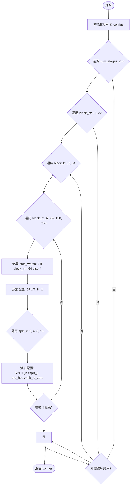
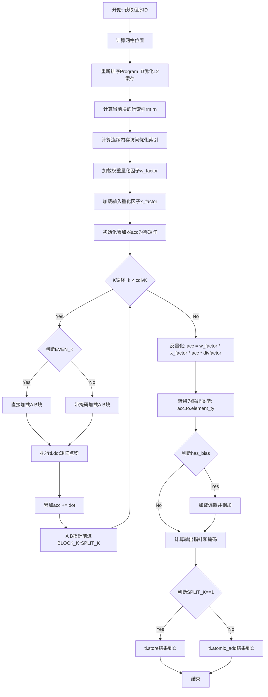

# `bitsandbytes\bitsandbytes\triton\int8_matmul_mixed_dequantize.py` 详细设计文档

这是一个基于Triton框架实现的int8矩阵乘法混合解量化内核，支持行级量化输入和全局量化权重，执行 fused matmul + dequantize 操作，可选添加偏置，主要用于加速大模型推理中的量化矩阵运算。

## 整体流程

```mermaid
graph TD
    A[开始 int8_matmul_mixed_dequantize] --> B{检查 Triton 是否可用}
    B -- 不可用 --> C[返回 None]
    B -- 可用 --> D[检查输入张量连续性]
    D --> E[确保输入连续]
    E --> F{验证维度兼容性}
    F -- 不兼容 --> G[抛出 AssertionError]
    F -- 兼容 --> H[分配输出张量 C]
    H --> I[计算 launch grid]
    I --> J[调用 Triton JIT 内核 _int8_matmul_mixed_dequantize]
    J --> K{执行矩阵乘法}
    K --> L[加载量化因子 w_factor, x_factor]
    L --> M[计算 acc * divfactor]
    M --> N[应用量化因子: w_factor * (x_factor * (acc * divfactor))]
    N --> O{has_bias?}
    O -- 是 --> P[加载偏置并相加]
    O -- 否 --> Q[跳过偏置]
    P --> R[写回结果到 C]
    Q --> R
    R --> S[返回结果张量 C]
```

## 类结构

```
该文件为模块级代码，无类层次结构
主要包含: 模块初始化 → 配置函数 → Triton内核定义 → 入口函数
```

## 全局变量及字段


### `configs`
    
存储Triton自动调优配置列表，包含不同分块大小、流水线阶段和warp数量的组合，用于矩阵乘法的性能优化

类型：`list[triton.Config]`
    


### `num_stages`
    
流水线阶段数，控制在计算过程中数据在共享内存中的传递次数，影响内存访问效率

类型：`int`
    


### `block_m`
    
矩阵A的分块行大小，决定每个计算块处理的行数，影响线程块的工作分配

类型：`int`
    


### `block_n`
    
矩阵B的分块列大小，决定每个计算块处理的列数，影响输出矩阵的写入模式

类型：`int`
    


### `block_k`
    
矩阵运算的共享维度分块大小，控制每次迭代加载的K维度元素数量，影响寄存器使用和计算效率

类型：`int`
    


### `num_warps`
    
Warp数量，控制每个SM上并行执行的线程束数，根据块大小动态调整以优化性能

类型：`int`
    


### `split_k`
    
分割K维度因子，用于将K维度分割成多个块进行并行计算，减少共享内存压力

类型：`int`
    


### `divfactor`
    
量化反因子 (1.0/(127*127))，用于8位量化矩阵乘法的反量化操作，恢复实际数值

类型：`float`
    


### `has_bias`
    
偏置存在标志，1表示有偏置需要加到输出，0表示无偏置

类型：`int`
    


### `state_x_ptr`
    
输入量化状态指针，存储输入矩阵的量化缩放因子，用于反量化计算

类型：`ptr`
    


### `state_w_ptr`
    
权重量化状态指针，存储权重矩阵的量化缩放因子，用于反量化计算

类型：`ptr`
    


### `M`
    
矩阵A的行数，也是输出矩阵C的行数，决定输出的高度

类型：`int`
    


### `N`
    
矩阵B的列数，也是输出矩阵C的列数，决定输出的宽度

类型：`int`
    


### `K`
    
矩阵A的列数，也是矩阵B的行数，即矩阵乘法的共享维度/内维

类型：`int`
    


### `ACC_TYPE`
    
累加器数据类型，用于指定中间计算结果的数据类型，通常为float32以保证精度

类型：`tl.constexpr`
    


    

## 全局函数及方法


### `init_to_zero`

这是一个工厂函数，用于创建一个将指定参数置零的lambda函数，常作为Triton Autotune的pre_hook使用，以确保在分块求和（split-k）场景下输出矩阵C被正确初始化。

参数：

- `name`：`str`，要置零的参数名称（如"C"表示输出矩阵）

返回值：`Callable`，返回一个匿名函数（lambda），该函数接受一个字典参数`nargs`，并将其指定键对应的张量置零。

#### 流程图

```mermaid
flowchart TD
    A[开始] --> B[接收参数 name: str]
    B --> C{返回 lambda 函数}
    C --> D[lambda nargs: nargs[name].zero_()]
    D --> E[结束]
    
    style A fill:#f9f,stroke:#333
    style E fill:#f9f,stroke:#333
```

#### 带注释源码

```python
def init_to_zero(name):
    """
    工厂函数：创建一个将指定参数置零的lambda函数。
    
    该函数主要用于Triton的autotune配置中作为pre_hook使用，
    特别是当SPLIT_K > 1时，需要在每次计算前将输出矩阵C清零，
    以避免累积错误。
    
    参数:
        name (str): 要置零的参数名称，对应于Triton kernel的参数名。
        
    返回:
        lambda: 一个接受字典nargs的lambda函数，
                调用nargs[name].zero_()将对应张量置零。
    """
    # 返回一个lambda表达式，捕获name参数
    # 当被调用时，会从nargs字典中获取name对应的张量，并调用其zero_()方法
    return lambda nargs: nargs[name].zero_()
```


### `get_configs_io_bound`

该函数是一个配置生成器，专门为I/O密集型（I/O Bound）的矩阵乘法操作设计Triton内核参数搜索空间。它通过嵌套循环遍历不同的块大小（Block M/N/K）、流水线深度（Stages）和Warp数量，并针对不同的Split-K策略生成配置列表，供Triton的自动调优机制（autotune）寻找最优性能参数。

参数：
- 无（该函数不接受任何输入参数）

返回值：`List[triton.Config]`，返回一组Triton内核配置对象，包含不同的块大小、Stage数量、Warp数量以及Split-K因子配置。

#### 流程图



#### 带注释源码

```python
def get_configs_io_bound():
    """
    生成针对I/O密集型场景的Triton Matmul配置列表。
    遍历各种块大小和流水线配置，以寻找硬件最优解。
    """
    configs = []
    # 遍历不同的流水线阶段数 (num_stages)，I/O bound通常需要更深的流水线来隐藏访存延迟
    for num_stages in [2, 3, 4, 5, 6]:
        # 遍历M轴块大小
        for block_m in [16, 32]:
            # 遍历K轴块大小
            for block_k in [32, 64]:
                # 遍历N轴块大小
                for block_n in [32, 64, 128, 256]:
                    # 根据N轴块大小决定Warp数，较大的块需要更多Warp
                    num_warps = 2 if block_n <= 64 else 4
                    
                    # 1. 添加基础配置 (SPLIT_K=1)
                    configs.append(
                        triton.Config(
                            {"BLOCK_M": block_m, "BLOCK_N": block_n, "BLOCK_K": block_k, "SPLIT_K": 1},
                            num_stages=num_stages,
                            num_warps=num_warps,
                        ),
                    )
                    
                    # 2. 添加Split-K配置，用于增加并行度
                    for split_k in [2, 4, 8, 16]:
                        configs.append(
                            triton.Config(
                                {"BLOCK_M": block_m, "BLOCK_N": block_n, "BLOCK_K": block_k, "SPLIT_K": split_k},
                                num_stages=num_stages,
                                num_warps=num_warps,
                                # pre_hook: 当使用split_k时，需要一个钩子将输出缓冲区C初始化为0
                                pre_hook=init_to_zero("C"),
                            ),
                        )
    return configs
```

#### 关键组件信息
- **`triton.Config`**: Triton的配置类，用于封装Block大小、Stage数量、Warp数量等执行参数。
- **`init_to_zero(name)`**: 辅助函数，返回一个闭包，用于在Split-K并行计算前将目标缓冲区清零。

#### 潜在的技术债务或优化空间
1.  **静态搜索空间**：所有的循环参数（块大小、Stage范围）都是硬编码的“魔法数字”。虽然这简化了实现，但无法自适应不同的GPU架构（如H100 vs V100）。理想情况下，应根据设备属性动态调整搜索范围。
2.  **配置爆炸**：该函数生成了大约 5 * 2 * 2 * 4 * (1 + 4) = 200 个配置。这会导致Triton内核在首次运行时进行大量的编译（Compile）和基准测试（Profile），显著增加冷启动时间。可以考虑根据问题规模（M, N, K）剪枝（Prune）部分配置。

#### 外部依赖与接口契约
- **依赖**：`triton`, `triton.language`。
- **上游调用**：该函数的返回值被直接解包（`*`）传入 `@triton.autotune` 装饰器的 `configs` 列表中，作为内核 `_int8_matmul_mixed_dequantize` 的候选配置。


### `_int8_matmul_mixed_dequantize`

Triton JIT编译的内核函数，执行混合量化矩阵乘法和反量化操作。该内核支持对输入矩阵进行逐行量化、对权重矩阵进行全局量化，并融合偏置项，最终输出浮点16位结果。

参数：

- `A`：`tl.ptr`，输入矩阵A的指针（INT8量化数据）
- `B`：`tl.ptr`，权重矩阵B的指针（INT8量化数据）
- `C`：`tl.ptr`，输出矩阵C的指针（FP16结果）
- `bias`：`tl.ptr`，偏置向量的指针（可为空）
- `state_x_ptr`：`tl.ptr`，输入矩阵的量化缩放因子指针（逐行缩放）
- `state_w_ptr`：`tl.ptr`，权重矩阵的量化缩放因子指针（全局缩放）
- `M`：`int`，输入矩阵A的行数
- `N`：`int`，权重矩阵B的列数
- `K`：`int`，输入矩阵A的列数/权重矩阵B的行数（矩阵乘法的公共维度）
- `divfactor`：`tl.constexpr`，反量化除法因子（1.0/(127.0*127.0)）
- `has_bias`：`tl.constexpr`，是否包含偏置的标志位
- `stride_am`：`int`，矩阵A在M维的步长
- `stride_ak`：`int`，矩阵A在K维的步长
- `stride_bk`：`int`，矩阵B在K维的步长
- `stride_bn`：`int`，矩阵B在N维的步长
- `stride_cm`：`int`，矩阵C在M维的步长
- `stride_cn`：`int`，矩阵C在N维的步长
- `BLOCK_M`：`tl.constexpr`，M维度的工作块大小
- `BLOCK_N`：`tl.constexpr`，N维度的工作块大小
- `BLOCK_K`：`tl.constexpr`，K维度的工作块大小
- `GROUP_M`：`tl.constexpr`，L2缓存优化的组大小
- `SPLIT_K`：`tl.constexpr`，K维度并行化分割因子
- `EVEN_K`：`tl.constexpr`，K是否可被BLOCK_K*SPLIT_K整除的标志
- `ACC_TYPE`：`tl.constexpr`，累加器数据类型（float32）

返回值：`void`，无返回值，结果直接写入C指针指向的内存

#### 流程图



#### 带注释源码

```python
@triton.heuristics(
    {
        "EVEN_K": lambda args: args["K"] % (args["BLOCK_K"] * args["SPLIT_K"]) == 0,
    },
)
@triton.jit
def _int8_matmul_mixed_dequantize(
    A,  # 输入矩阵A指针 (INT8)
    B,  # 权重矩阵B指针 (INT8)
    C,  # 输出矩阵C指针 (FP16)
    bias,  # 偏置向量指针
    state_x_ptr,  # 输入量化因子指针 (行-wise)
    state_w_ptr,  # 权重量化因子指针 (global)
    M,  # A的行数
    N,  # B的列数
    K,  # A的列数/B的行数
    divfactor: tl.constexpr,  # 反量化因子 1/(127*127)
    has_bias: tl.constexpr,  # 是否有偏置
    stride_am, stride_ak,  # A的步长
    stride_bk, stride_bn,  # B的步长
    stride_cm, stride_cn,  # C的步长
    BLOCK_M: tl.constexpr,  # M块大小
    BLOCK_N: tl.constexpr,  # N块大小
    BLOCK_K: tl.constexpr,  # K块大小
    GROUP_M: tl.constexpr,  # L2优化组大小
    SPLIT_K: tl.constexpr,  # K分割因子
    EVEN_K: tl.constexpr,  # K是否均匀
    ACC_TYPE: tl.constexpr,  # 累加器类型
):
    # --- 1. 获取程序ID ---
    pid = tl.program_id(0)  # 主程序ID
    pid_z = tl.program_id(1)  # SPLIT_K维度的ID
    
    # --- 2. 计算网格尺寸 ---
    grid_m = tl.cdiv(M, BLOCK_M)  # M方向块数
    grid_n = tl.cdiv(N, BLOCK_N)  # N方向块数
    
    # --- 3. 重新排序Program ID以优化L2缓存命中率 ---
    width = GROUP_M * grid_n  # 总宽度
    group_id = pid // width  # 当前组ID
    group_size = min(grid_m - group_id * GROUP_M, GROUP_M)  # 组大小
    pid_m = group_id * GROUP_M + (pid % group_size)  # M方向位置
    pid_n = (pid % width) // (group_size)  # N方向位置
    
    # --- 4. 计算当前块的行和列索引 ---
    rm = pid_m * BLOCK_M + tl.arange(0, BLOCK_M)  # M方向偏移
    rn = pid_n * BLOCK_N + tl.arange(0, BLOCK_N)  # N方向偏移
    
    # --- 5. 优化: 连续内存访问 + 4字节对齐 ---
    # 使用max_contiguous和multiple_of优化内存访问模式
    ram = tl.max_contiguous(tl.multiple_of(rm % M, BLOCK_M), BLOCK_M)
    rbn = tl.max_contiguous(tl.multiple_of(rn % N, BLOCK_N), BLOCK_N)
    
    # --- 6. K方向索引 ---
    rk = pid_z * BLOCK_K + tl.arange(0, BLOCK_K)
    
    # --- 7. 计算A和B的指针 ---
    # A: (ram[:, None] * stride_am + rk[None, :] * stride_ak)
    # B: (rk[:, None] * stride_bk + rbn[None, :] * stride_bn)
    A = A + (ram[:, None] * stride_am + rk[None, :] * stride_ak)
    B = B + (rk[:, None] * stride_bk + rbn[None, :] * stride_bn)
    
    # --- 8. 重新生成rm和rn以节省寄存器 ---
    rm = pid_m * BLOCK_M + tl.arange(0, BLOCK_M)
    rn = pid_n * BLOCK_N + tl.arange(0, BLOCK_N)
    
    # --- 9. 加载量化因子 ---
    w_factor = tl.load(state_w_ptr)  # 权重全局缩放因子
    x_factor = tl.load(state_x_ptr + ram)[:, None]  # 输入行-wise缩放因子
    
    # --- 10. 初始化累加器 ---
    acc = tl.zeros((BLOCK_M, BLOCK_N), dtype=tl.int32)  # INT32累加防止溢出
    
    # --- 11. 矩阵乘法循环 ---
    for k in range(0, tl.cdiv(K, BLOCK_K * SPLIT_K)):
        if EVEN_K:
            # K均匀分布，可直接加载无需掩码
            a = tl.load(A)
            b = tl.load(B)
        else:
            # K不均匀，需处理边界情况
            k_remaining = K - k * (BLOCK_K * SPLIT_K)
            a = tl.load(A, mask=rk[None, :] < k_remaining, other=0.0)
            b = tl.load(B, mask=rk[:, None] < k_remaining, other=0.0)
        
        # 执行INT8矩阵点积
        acc += tl.dot(a, b)
        
        # 指针前进到下一个K块
        A += BLOCK_K * SPLIT_K * stride_ak
        B += BLOCK_K * SPLIT_K * stride_bk
    
    # --- 12. 混合反量化 ---
    # 公式: result = w_factor * x_factor * acc * divfactor
    # INT32 -> FLOAT32 -> FLOAT16
    acc = w_factor * (x_factor * (acc * divfactor))
    acc = acc.to(C.dtype.element_ty)  # 转换为输出类型
    
    # --- 13. 条件添加偏置 ---
    if has_bias:
        bias = tl.load(bias + rn).to(C.dtype.element_ty)
        acc = acc + bias[None, :]  # 广播偏置到每行
    
    # --- 14. 计算输出指针和写入掩码 ---
    C = C + (rm[:, None] * stride_cm + rn[None, :] * stride_cn)
    mask = (rm < M)[:, None] & (rn < N)[None, :]
    
    # --- 15. 写回结果 ---
    if SPLIT_K == 1:
        # 普通模式: 直接存储
        tl.store(C, acc, mask=mask)
    else:
        # 分割K模式: 原子加法合并结果
        tl.atomic_add(C, acc, mask=mask)
```


### `int8_matmul_mixed_dequantize`

该函数是混合量化INT8矩阵乘法的Python入口函数，负责输入预处理（连续性检查、维度验证）和Triton CUDA内核启动，实现融合矩阵乘法、反量化及偏置加法运算，支持行wise量化输入和全局量化权重。

参数：

- `a`：`torch.Tensor`，输入矩阵A，形状为(M, K)的INT8张量
- `b`：`torch.Tensor`，输入矩阵B，形状为(K, N)的INT8张量
- `state_x`：`指针`，输入矩阵A的量化缩放因子状态指针
- `state_w`：`指针`，权重矩阵B的量化缩放因子状态指针
- `bias`：`torch.Tensor`或`None`，可选偏置向量，形状为(N,)

返回值：`torch.Tensor`，输出矩阵C，形状为(M, N)的float16张量

#### 流程图

```mermaid
flowchart TD
    A[开始 int8_matmul_mixed_dequantize] --> B{is_triton_available?}
    B -->|否| C[返回 None]
    B -->|是| D[获取设备 device]
    E[计算量化因子 divfactor = 1.0/(127*127)]
    E --> F[设置 has_bias 标志]
    F --> G{检查 a 是否连续}
    G -->|stride[0]>1 且 stride[1]>1| H[a = a.contiguous]
    G -->|否| I{检查 b 是否连续}
    H --> I
    I -->|stride[0]>1 且 stride[1]>1| J[b = b.contiguous]
    I -->|否| K[验证维度: a.shape[1] == b.shape[0]
    J --> K
    K --> L[提取 M, K, N 维度]
    L --> M[分配输出张量 c: (M, N) float16]
    M --> N[设置累加器类型 ACC_TYPE]
    N --> O[定义 grid 闭包函数]
    O --> P[启动 _int8_matmul_mixed_dequantize 内核]
    P --> Q[返回结果张量 c]
```

#### 带注释源码

```python
def int8_matmul_mixed_dequantize(a, b, state_x, state_w, bias):
    """
    混合量化INT8矩阵乘法Python入口函数
    支持行wise量化输入(A)和全局量化权重(B)的融合矩阵乘法和反量化
    
    参数:
        a: 输入矩阵A，INT8张量，形状(M, K)
        b: 输入矩阵B，INT8张量，形状(K, N)
        state_x: A的量化状态指针（缩放因子）
        state_w: B的量化状态指针（全局缩放因子）
        bias: 可选偏置向量，形状(N,)
    
    返回:
        c: 输出矩阵，float16，形状(M, N)
    """
    device = a.device  # 获取输入张量所在设备
    
    # 计算反量化因子: 1/(127*127)，用于将INT8乘积恢复为浮点值
    divfactor = 1.0 / (127.0 * 127.0)
    
    # 设置偏置标志：1表示有偏置，0表示无偏置
    has_bias = 0 if bias is None else 1
    
    # 处理非连续输入：如果两个维度都有stride，则转换为连续内存
    # 这是Triton内核的必需条件
    if a.stride(0) > 1 and a.stride(1) > 1:
        a = a.contiguous()
    if b.stride(0) > 1 and b.stride(1) > 1:
        b = b.contiguous()
    
    # 约束检查：矩阵乘法维度兼容性验证
    assert a.shape[1] == b.shape[0], "incompatible dimensions"
    
    # 提取矩阵维度
    M, K = a.shape  # A: M x K
    _, N = b.shape  # B: K x N
    
    # 分配输出张量：使用float16存储结果
    c = torch.empty((M, N), device=device, dtype=torch.float16)
    
    # 累加器类型选择：使用float32进行中间累加以保证精度
    ACC_TYPE = tl.float32  # if a.dtype in [torch.float16, torch.bfloat16, torch.float32] else tl.int32
    
    # 定义Triton网格：计算所需的block数量
    # grid[0] = cdiv(M, BLOCK_M) * cdiv(N, BLOCK_N) -> 2D网格
    # grid[1] = SPLIT_K -> 用于reduction split
    grid = lambda META: (
        triton.cdiv(M, META["BLOCK_M"]) * triton.cdiv(N, META["BLOCK_N"]), 
        META["SPLIT_K"]
    )
    
    # 启动Triton CUDA内核
    # @triton.autotune装饰器会自动选择最优配置
    # @triton.heuristics设置K维度均匀分割的启发式
    _int8_matmul_mixed_dequantize[grid](
        a,                              # 输入矩阵A指针
        b,                              # 输入矩阵B指针
        c,                              # 输出矩阵C指针
        bias,                           # 偏置向量指针
        state_x,                        # A的量化状态指针
        state_w,                        # B的量化状态指针
        M, N, K,                        # 矩阵维度
        divfactor,                      # 反量化因子
        has_bias,                       # 偏置标志
        a.stride(0), a.stride(1),       # A的stride (AM, AK)
        b.stride(0), b.stride(1),       # B的stride (BK, BN)
        c.stride(0), c.stride(1),       # C的stride (CM, CN)
        GROUP_M=8,                     # L2缓存友好分组大小
        ACC_TYPE=ACC_TYPE,             # 累加器数据类型
    )
    
    return c  # 返回反量化后的结果矩阵
```

## 关键组件


### 混合量化int8矩阵乘法核 (Mixed Quantization int8 Matmul Kernel)

基于Triton的矩阵乘法核心实现，支持行-wise量化的输入A与全局量化的权重B进行融合矩阵乘法后反量化，并可选地添加偏置。

### Triton内核函数 (_int8_matmul_mixed_dequantize)

实际的Triton JIT编译内核，执行分块矩阵乘法、量化缩放因子应用、反量化计算和偏置加法。内核通过program_id进行块划分，使用tl.dot执行int8矩阵乘法，使用tl.load获取量化缩放因子并通过乘法实现反量化。

### 量化/反量化逻辑 (Quantization/Dequantization)

实现从int8量化空间到float16输出空间的转换。通过divfactor = 1/(127*127)作为全局反量化因子，state_x_ptr提供输入A的行-wise缩放因子，state_w_ptr提供权重B的全局缩放因子，在计算结果上应用 x_factor * (acc * divfactor) * w_factor 完成反量化。

### 自动调优配置 (Autotune Configs)

通过@triton.autotune装饰器定义的大量配置候选，包括compute-bound和IO-bound两类场景，涵盖不同的BLOCK_M/N/K尺寸、num_stages和num_warps组合，并通过early_config_prune和estimate_matmul_time进行配置剪枝和性能预估。

### 行-wise量化输入支持 (Row-wise Quantized Input)

通过state_x_ptr传入的缩放因子实现对输入A的每行独立量化，tl.load(state_x_ptr + ram)获取对应行的缩放因子，实现细粒度的量化反量化处理。

### 全局量化权重支持 (Global Quantized Weight)

通过state_w_ptr传入的单一缩放因子实现对权重B的全局量化，tl.load(state_w_ptr)获取全局缩放因子并应用于整个计算结果。

### 偏置融合 (Bias Fusion)

通过has_bias标志位控制是否在反量化后添加偏置，使用tl.load加载偏置向量并通过广播机制加到输出矩阵的每一行。

### 非连续输入处理 (Non-contiguous Input Handling)

在主函数int8_matmul_mixed_dequantize中检查输入张量的stride属性，对非连续输入调用contiguous()方法确保内存布局连续，以保证Triton内核的正确执行。

### Split-K并行化 (Split-K Parallelization)

通过SPLIT_K参数支持在K维度上分割计算，使用tl.atomic_add进行结果聚合，可有效提高大矩阵乘法的并行度。

### 惰性加载机制 (Lazy Loading via Triton Heuristics)

通过@triton.heuristics装饰器实现编译时条件判断，EVEN_K lambda函数根据K、BLOCK_K、SPLIT_K的关系决定是否使用更高效的偶数K加载策略。


## 问题及建议


### 已知问题

- **硬编码的量化因子**: `divfactor = 1.0 / (127.0 * 127.0)` 被硬编码，假设使用127作为int8量化缩放因子，但实际量化可能使用不同的值（如128或动态值），导致量化结果不准确。
- **未清理的注释代码**: 存在被注释掉的代码 `acc = tl.zeros((BLOCK_M, BLOCK_N), dtype=ACC_TYPE)` 和未启用的条件逻辑，代码变更未完全清理。
- **内存访问效率问题**: `x_factor` 的加载（`tl.load(state_x_ptr + ram)[:, None]`）在每次循环迭代中都对整个 BLOCK_M 行进行重复加载，当 BLOCK_M 较大时会导致冗余内存访问。
- **配置数量过多**: `get_configs_io_bound()` 生成约400个配置组合，结合基础配置总计超过400个，过多的配置会增加自动调优的编译时间和内存开销。
- **缺乏输入验证**: 仅检查维度兼容性，未验证输入数据类型、设备一致性（如a和b是否在同一设备上）、连续性等关键约束。
- **状态指针处理不一致**: `state_w_ptr` 加载单个值而 `state_x_ptr` 加载向量，两者的语义和内存布局定义不清晰，可能导致使用时出错。
- **重复计算寄存器值**: `rm` 和 `rn` 在内核中计算两次（指针计算阶段和后续使用阶段），虽然注释说是为了重新物化以节省寄存器，但实际实现仍有优化空间。

### 优化建议

- 将 `divfactor` 参数化或从 `state_x`/`state_w` 中动态提取，使函数支持不同量化方案（如非对称量化）。
- 移除注释掉的代码，统一数据类型处理逻辑。
- 将 `x_factor` 预加载到寄存器中并在循环外共享，或采用更高效的向量加载策略。
- 减少自动调优配置数量，采用分层调优策略（先粗选再细调），或基于问题规模动态选择配置子集。
- 增加输入验证：检查设备一致性、数据类型支持（目前仅优化int8）、连续性，必要时自动转换。
- 明确 `state_x` 和 `state_w` 的数据结构和语义，添加文档说明或类型提示。
- 重新审视寄存器分配策略，确保关键变量（如 `rm`, `rn`）仅计算一次。

## 其它


### 设计目标与约束

本模块的设计目标是实现高效的int8矩阵乘法融合反量化操作，支持行-wise量化输入与全局量化权重的混合计算，并通过Triton自动调优实现性能最大化。约束条件包括：输入A必须为int8类型且按行量化，权重B为int8类型且全局量化，偏置可选且类型需与输出兼容，输出为float16类型。

### 错误处理与异常设计

代码主要通过assert语句进行维度兼容性检查，确保a.shape[1] == b.shape[0]。对于非连续输入张量，代码会自动调用contiguous()进行连续化处理。若Triton不可用，则int8_matmul_mixed_dequantize函数返回None。核函数内部通过mask机制处理边界情况，避免越界访问。

### 数据流与状态机

数据流遵循以下路径：输入张量a(int8) → 加载量化因子state_x → 矩阵乘法计算 → 乘以量化因子state_w和divfactor进行反量化 → 可选偏置加法 → 输出float16张量c。状态机主要体现在：初始化阶段 → 主循环计算阶段 → 反量化阶段 → 输出写入阶段。

### 外部依赖与接口契约

本模块依赖以下外部组件：PyTorch（张量操作）、Triton（核函数编译与调度）、bitsandbytes.triton.triton_utils（可用性检查）。公开接口为int8_matmul_mixed_dequantize函数，签名为(a: torch.Tensor, b: torch.Tensor, state_x: torch.Tensor, state_w: torch.Tensor, bias: Optional[torch.Tensor]) -> torch.Tensor，返回float16类型的输出张量。

### 精度与数值稳定性

反量化公式为 output = w_factor * (x_factor * (acc * divfactor))，其中divfactor = 1.0/(127.0*127.0)，用于将int8乘法结果反量化回浮点。累加器使用int32类型以避免中间结果溢出，最终转换为float16输出。量化因子通过tl.load从全局张量加载。

### 性能特性与基准

代码包含大量预定义的Triton配置（50+种），覆盖compute-bound和IO-bound场景。通过early_config_prune和estimate_matmul_time进行配置剪枝，自动选择top 10最优配置。默认配置针对128x256和256x128块大小优化，适合大多数矩阵尺寸。

### 并行策略与资源利用

采用2D程序ID映射：(pid, pid_z)分别控制M和N维度以及SPLIT_K维度。使用GROUP_M=8进行L2缓存友好的程序ID重排序。num_warps根据块大小动态调整（block_n≤64时为2，否则为4），以平衡计算密度和寄存器压力。

### 配置参数详解

BLOCK_M/N/K：控制tile大小，影响寄存器使用和计算效率；SPLIT_K：用于分割K维度以增加并行度；num_stages：控制流水线深度，值越大延迟隐藏能力越强但寄存器消耗越高；GROUP_M：控制L2缓存友好的数据布局。

    