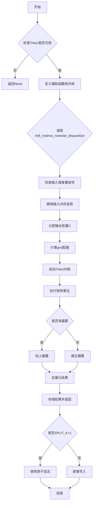
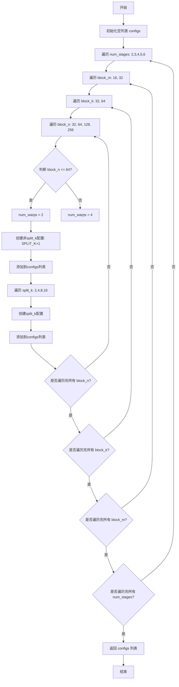

# `bitsandbytes\bitsandbytes\triton\int8_matmul_rowwise_dequantize.py` 详细设计文档

这是一个基于Triton的CUDA内核实现，用于执行高效的INT8矩阵乘法运算并融合行-wise反量化操作，支持可选的偏置加法，主要用于量化神经网络的推理加速。

## 整体流程



## 类结构

```
模块级: int8_matmul_rowwise_dequantize (主入口函数)
Triton内核: _int8_matmul_rowwise_dequantize (JIT编译内核)
辅助函数: init_to_zero, get_configs_io_bound
导入依赖: torch, triton, triton.language, matmul_perf_model
```

## 全局变量及字段


### `divfactor`
    
Dequantization factor calculated as 1.0/(127.0*127.0) for int8 dequantization

类型：`float`
    


### `has_bias`
    
Flag indicating whether bias is provided (1) or not (0)

类型：`int`
    


### `device`
    
Device of input tensor a, used for allocating output tensor

类型：`torch.device`
    


### `M`
    
Number of rows in matrix a and output matrix c

类型：`int`
    


### `K`
    
Number of columns in matrix a (and rows in matrix b)

类型：`int`
    


### `N`
    
Number of columns in matrix b and output matrix c

类型：`int`
    


### `ACC_TYPE`
    
Accumulator data type for Triton kernel, set to float32 for computation

类型：`tl.constexpr`
    


### `grid`
    
Lambda function that computes the Triton kernel grid dimensions based on block sizes and split_k

类型：`lambda function`
    


    

## 全局函数及方法


### `init_to_zero`

该函数是一个工厂函数，用于创建一个预钩子（pre-hook）函数，该钩子会在 Triton 内核执行前将指定的张量清零。主要用于分块 K（split-K）策略中，在并行计算完成后将输出张量初始化为0，以避免未初始化内存的问题。

参数：

- `name`：`str`，要初始化为零的张量在参数字典中的键名（例如 "C" 表示输出张量）

返回值：`Callable`，返回一个 lambda 函数，该函数接受包含所有参数的字典 `nargs`，并将该字典中键为 `name` 的张量调用 `zero_()` 方法原地清零

#### 流程图

```mermaid
flowchart TD
    A[开始: 输入 name] --> B{检查 name 是否有效}
    B -->|是| C[返回 lambda 函数: nargs => nargs[name].zero_()]
    B -->|否| D[返回空函数或抛出异常]
    C --> E[调用点: Triton Config 的 pre_hook]
    E --> F[获取 nargs 字典]
    F --> G[根据 name 查找对应张量]
    G --> H[调用 .zero_() 原地清零]
    H --> I[返回清零后的张量]
```

#### 带注释源码

```python
def init_to_zero(name):
    """
    创建一个预钩子函数，用于将指定名称的张量在 Triton 内核执行前清零。
    
    此函数主要用于分块 K (SPLIT_K) 并行计算场景：
    - 当 SPLIT_K > 1 时，多个线程块会向同一个输出张量累加结果
    - 如果输出张量未初始化，累加结果会包含随机值
    - 通过 pre_hook 在计算前将输出张量清零，确保结果正确
    
    参数:
        name (str): 要清零的张量在参数字典中的键名
        
    返回:
        lambda: 一个接受参数字典 nargs 的函数，调用 nargs[name].zero_() 进行原地清零
        
    示例:
        >>> hook = init_to_zero("C")
        >>> nargs = {"C": torch.ones(3, 3)}
        >>> hook(nargs)  # C 被原地清零为全零
    """
    return lambda nargs: nargs[name].zero_()
```


### `get_configs_io_bound`

该函数是一个用于生成Triton配置参数的辅助函数，主要服务于IO密集型矩阵乘法操作的分块参数搜索空间构建。它通过嵌套循环遍历不同的num_stages、block_m、block_k、block_n和split_k组合，为Triton自动调优器生成一系列配置选项，以寻找最优的矩阵分块大小和并行度配置。

参数： 无

返回值：`List[triton.Config]`，返回一个包含多个`triton.Config`对象的列表，这些配置将用于Triton内核的自动调优，涵盖IO密集型场景的不同分块策略。

#### 流程图



#### 带注释源码

```python
def get_configs_io_bound():
    """
    生成IO密集型矩阵乘法的Triton配置参数列表
    用于自动调优器探索不同的分块大小和并行度组合
    
    Returns:
        List[triton.Config]: 包含所有IO-bound配置选项的列表
    """
    configs = []
    # 遍历不同的流水线阶段数，影响计算与内存访问的重叠程度
    for num_stages in [2, 3, 4, 5, 6]:
        # 遍历M维度（输出行）的分块大小
        for block_m in [16, 32]:
            # 遍历K维度（中间维度）的分块大小，影响每次加载的数据量
            for block_k in [32, 64]:
                # 遍历N维度（输出列）的分块大小
                for block_n in [32, 64, 128, 256]:
                    # 根据N维度分块大小确定warps数量
                    # block_n较小时使用2个warps，较小时使用4个warps
                    num_warps = 2 if block_n <= 64 else 4
                    
                    # 添加非split_k的基础配置（SPLIT_K=1表示不分割K维度）
                    configs.append(
                        triton.Config(
                            {"BLOCK_M": block_m, "BLOCK_N": block_n, "BLOCK_K": block_k, "SPLIT_K": 1},
                            num_stages=num_stages,
                            num_warps=num_warps,
                        ),
                    )
                    
                    # 遍历不同的split_k选项，用于K维度的分割并行
                    # 适用于需要跨多个程序实例分割计算的场景
                    for split_k in [2, 4, 8, 16]:
                        configs.append(
                            triton.Config(
                                {"BLOCK_M": block_m, "BLOCK_N": block_n, "BLOCK_K": block_k, "SPLIT_K": split_k},
                                num_stages=num_stages,
                                num_warps=num_warps,
                                # pre_hook: 在计算前将输出C初始化为零，用于split_k时的累加
                                pre_hook=init_to_zero("C"),
                            ),
                        )
    return configs
```


### `int8_matmul_rowwise_dequantize`

该函数执行INT8矩阵乘法融合去量化操作，支持行-wise量化的输入矩阵A和列-wise量化的权重矩阵B，并可选地添加偏置。内部调用Triton自定义核函数实现高效的量化矩阵乘法和即时反量化。

参数：

- `a`：`torch.Tensor`，左矩阵（输入），行-wise量化
- `b`：`torch.Tensor`，右矩阵（权重），列-wise量化
- `state_x`：量化状态指针，用于输入矩阵A的去量化
- `state_w`：量化状态指针，用于权重矩阵B的去量化
- `bias`：`torch.Tensor` 或 `None`，可选的偏置向量

返回值：`torch.Tensor`，去量化后的矩阵乘法结果

#### 流程图

```mermaid
flowchart TD
    A[输入: a, b, state_x, state_w, bias] --> B[计算divfactor = 1.0/(127.0*127.0)]
    B --> C[判断bias是否存在<br/>has_bias = 0 或 1]
    C --> D{检查设备}
    D --> E[确保a连续存储]
    E --> F{检查bstride}
    F --> G[确保b连续存储]
    G --> H[验证维度兼容性<br/>a.shape[1] == b.shape[0]
    H --> I[提取M, K, N维度]
    I --> J[创建输出张量c<br/>torch.empty MxN float16]
    J --> K[设置累加器类型ACC_TYPE]
    K --> L[计算grid调度参数]
    L --> M[Launch Triton Kernel<br/>_int8_matmul_rowwise_dequantize]
    M --> N[返回结果c]
    
    subgraph Triton Kernel内部
        O[获取program_id] --> P[计算pid_m, pid_n]
        P --> Q[计算矩阵块索引]
        Q --> R[加载a, b数据块]
        R --> S[循环: k in range tl.cdiv]
        S --> T[执行INT8矩阵乘法<br/>acc += tl.dot]
        T --> S
        S --> U[应用去量化因子<br/>acc = w_factor * x_factor * acc * divfactor]
        U --> V[转换数据类型<br/>acc.to element_ty]
        V --> W{has_bias?}
        W -->|Yes| X[加载bias并相加]
        W -->|No| Y[跳过bias]
        X --> Z[写回结果C]
        Y --> Z
    end
    
    M -.-> O
    Z -.-> N
```

#### 带注释源码

```python
def int8_matmul_rowwise_dequantize(a, b, state_x, state_w, bias):
    """
    执行INT8矩阵乘法并融合去量化操作
    
    参数:
        a: 左矩阵 (M x K), 行-wise 量化
        b: 右矩阵 (K x N), 列-wise 量化  
        state_x: 输入矩阵A的量化状态（缩放因子）
        state_w: 权重矩阵B的量化状态（缩放因子）
        bias: 可选的偏置向量 (N,)
    
    返回:
        结果矩阵 (M x N), float16类型
    """
    # 计算去量化因子: 1/(127*127) 用于INT8->float16反量化
    divfactor = 1.0 / (127.0 * 127.0)

    # 判断是否存在偏置: Triton内核需要常量表达式
    has_bias = 0 if bias is None else 1

    # 获取计算设备
    device = a.device
    
    # 处理非连续输入: Triton要求输入必须是连续的
    if a.stride(0) > 1 and a.stride(1) > 1:
        a = a.contiguous()
    if b.stride(0) > 1 and b.stride(1) > 1:
        b = b.contiguous()
    
    # 验证矩阵维度兼容性: a的列数必须等于b的行数
    assert a.shape[1] == b.shape[0], "incompatible dimensions"
    M, K = a.shape
    _, N = b.shape
    
    # 分配输出矩阵: M x N, float16精度
    c = torch.empty((M, N), device=device, dtype=torch.float16)
    
    # 设置累加器类型: 使用float32进行中间计算以保证精度
    ACC_TYPE = tl.float32  # if a.dtype in [torch.float16, torch.bfloat16, torch.float32] else tl.int32
    
    # 定义Triton网格调度策略
    grid = lambda META: (
        triton.cdiv(M, META["BLOCK_M"]) * triton.cdiv(N, META["BLOCK_N"]), 
        META["SPLIT_K"]
    )
    
    # 启动Triton自定义矩阵乘法核函数
    _int8_matmul_rowwise_dequantize[grid](
        a,                          # 左矩阵 (M x K)
        b,                          # 右矩阵 (K x N) 
        c,                          # 输出矩阵 (M x N)
        bias,                       # 偏置向量 (N,) 或 None
        state_x,                    # A的量化状态指针
        state_w,                    # B的量化状态指针
        M, N, K,                    # 矩阵维度
        divfactor,                  # 去量化因子
        has_bias,                   # 偏置标志 (0或1)
        a.stride(0),                # A的行步长
        a.stride(1),                # A的列步长
        b.stride(0),                # B的行步长
        b.stride(1),                # B的列步长
        c.stride(0),                # C的行步长
        c.stride(1),                # C的列步长
        GROUP_M=8,                  # L2缓存优化分组大小
        ACC_TYPE=ACC_TYPE,          # 累加器数据类型
    )
    
    # 返回去量化后的矩阵乘法结果
    return c
```


### `int8_matmul_rowwise_dequantize`

这是一个基于Triton的融合矩阵乘法kernel，支持INT8量化输入（A矩阵行-wise量化，B矩阵列-wise量化），在执行矩阵乘法后自动进行反量化操作，并可选地添加偏置。

参数：

- `a`：`torch.Tensor`，输入矩阵A，shape为(M, K)，int8类型
- `b`：`torch.Tensor`，输入权重矩阵B，shape为(K, N)，int8类型
- `state_x`：`torch.Tensor`，A矩阵的行-wise量化缩放因子状态
- `state_w`：`torch.Tensor`，B矩阵的列-wise量化缩放因子状态
- `bias`：`torch.Tensor` 或 `None`，可选的偏置向量，shape为(N,)

返回值：`torch.Tensor`，结果矩阵C，shape为(M, N)，float16类型

#### 流程图

```mermaid
flowchart TD
    A[开始] --> B[计算divfactor = 1.0/(127.0*127.0)]
    B --> C{判断bias是否为None}
    C -->|是| D[has_bias = 0]
    C -->|否| E[has_bias = 1]
    D --> F[获取设备device]
    E --> F
    F --> G{检查a是否非连续}
    G -->|是| H[a = a.contiguous]
    G -->|否| I{a是否非连续}
    I -->|是| J[b = b.contiguous]
    I -->|否| K{断言检查<br/>a.shape[1] == b.shape[0]}
    H --> K
    J --> K
    K --> L[提取维度 M, K, N]
    L --> M[创建输出矩阵c<br/>shape=(M,N), dtype=float16]
    M --> N[设置ACC_TYPE=float32]
    N --> O[定义grid lambda函数]
    O --> P[启动Triton kernel<br/>_int8_matmul_rowwise_dequantize]
    P --> Q[返回结果矩阵c]
```

#### 带注释源码

```python
def int8_matmul_rowwise_dequantize(a, b, state_x, state_w, bias):
    """
    执行融合的INT8矩阵乘法并自动反量化
    
    参数:
        a: 输入矩阵A (M, K), int8类型
        b: 输入权重矩阵B (K, N), int8类型
        state_x: A矩阵的行-wise量化状态（缩放因子）
        state_w: B矩阵的列-wise量化状态（缩放因子）
        bias: 可选的偏置向量 (N,), float16类型
    
    返回:
        结果矩阵C (M, N), float16类型
    """
    # 计算反量化因子：1.0 / (127.0 * 127.0)
    # INT8有符号整数的最大绝对值为127
    divfactor = 1.0 / (127.0 * 127.0)

    # 判断是否存在偏置，转换为数值标志
    has_bias = 0 if bias is None else 1

    # 获取输入张量所在的设备
    device = a.device

    # 处理非连续输入，确保数据在内存中是连续的
    # 如果a的stride(0)和stride(1)都大于1，说明是非连续张量
    if a.stride(0) > 1 and a.stride(1) > 1:
        a = a.contiguous()
    if b.stride(0) > 1 and b.stride(1) > 1:
        b = b.contiguous()

    # 检查维度兼容性：a的列数必须等于b的行数
    assert a.shape[1] == b.shape[0], "incompatible dimensions"

    # 提取矩阵维度
    M, K = a.shape  # M行K列
    _, N = b.shape  # K行N列

    # 分配输出矩阵，float16类型
    c = torch.empty((M, N), device=device, dtype=torch.float16)

    # 设置累加器类型为float32以保证精度
    # 注意：原代码中保留了对其他数据类型支持的注释
    ACC_TYPE = tl.float32

    # 定义Triton kernel的启动网格
    # grid维度：(cdiv(M, BLOCK_M) * cdiv(N, BLOCK_N), SPLIT_K)
    grid = lambda META: (
        triton.cdiv(M, META["BLOCK_M"]) * triton.cdiv(N, META["BLOCK_N"]),
        META["SPLIT_K"]
    )

    # 启动融合的矩阵乘法+反量化kernel
    _int8_matmul_rowwise_dequantize[grid](
        a,                    # 输入矩阵A
        b,                    # 输入矩阵B
        c,                    # 输出矩阵C
        bias,                 # 偏置向量
        state_x,              # A的量化状态（行-wise缩放因子）
        state_w,              # B的量化状态（列-wise缩放因子）
        M, N, K,              # 矩阵维度
        divfactor,            # 反量化因子
        has_bias,             # 是否有偏置的标志
        a.stride(0),          # A的行stride
        a.stride(1),          # A的列stride
        b.stride(0),          # B的行stride
        b.stride(1),          # B的列stride
        c.stride(0),          # C的行stride
        c.stride(1),          # C的列stride
        GROUP_M=8,            # 用于L2缓存优化的group大小
        ACC_TYPE=ACC_TYPE,    # 累加器数据类型
    )

    # 返回反量化后的结果矩阵
    return c
```

## 关键组件


### int8_matmul_rowwise_dequantize

主入口函数，负责int8矩阵乘法的融合计算与反量化处理。该函数接收行wise量化的输入a、列wise量化的权重b、量化状态state_x和state_w以及可选偏置，执行非连续输入检查、维度验证、输出分配，最后launch Triton内核完成计算并返回float16类型的输出张量。

### _int8_matmul_rowwise_dequantize

Triton JIT编译内核函数，实现融合的矩阵乘法与反量化逻辑。内核通过program_id进行并行任务分配，使用BLOCK_M/BLOCK_N/BLOCK_K分块计算，加载量化缩放因子(w_factor和x_factor)，在循环中执行tl.dot计算矩阵乘法累加器，最后通过divfactor和缩放因子进行反量化，并可选地融合偏置项，支持SPLIT_K并行化策略。

### get_configs_io_bound

自动调优配置生成函数，针对IO绑定场景生成大量triton.Config配置。该函数遍历不同的num_stages(2-6)、block_m(16/32)、block_k(32/64)、block_n(32/64/128/256)组合，并根据block_n大小动态设置num_warps(2或4)，同时为split_k(2/4/8/16)生成额外配置，用于覆盖IO密集型矩阵运算的优化空间。

### 量化状态与反量化机制

代码通过state_x_ptr和state_w_ptr传递量化缩放因子，分别对应输入A和权重B的每行/每列缩放系数。在内核中使用tl.load加载这些因子，并与矩阵乘法结果进行元素级乘法运算，最后乘以divfactor(1.0/(127.0*127.0))完成反量化，将int8乘法结果转换为float16输出。

### Triton自动调优系统

代码使用@triton.autotune装饰器配置了大规模参数空间搜索，包括compute-bound和IO-bound两类配置方案，通过early_config_prune和estimate_matmul_time进行配置剪枝和性能预估，top_k=10保留最优配置。同时使用@triton.heuristics自动推导EVEN_K等编译时常量，优化内核编译效率。

### 矩阵分块与并行策略

内核采用二维分块策略(BLOCK_M/BLOCK_N)划分输出矩阵，并通过GROUP_M=8实现L2缓存友好的tile重排。SPLIT_K参数支持在K维度进行并行化，将计算分割为多个子任务通过tl.atomic_add合并结果，适应不同规模矩阵的计算需求。


## 问题及建议


### 已知问题

-   **硬编码的量化因子**：divfactor = 1.0 / (127.0 * 127.0) 是硬编码的magic number，假设量化范围为[-127, 127]，如果实际量化参数不同会导致计算错误
-   **缺少输入验证**：没有对输入张量a、b的dtype、shape进行验证，没有对state_x、state_w的shape和bias的shape进行校验，可能导致kernel运行时崩溃
-   **ACC_TYPE选择逻辑被注释**：累加器类型选择逻辑被注释掉，始终使用tl.float32，无法根据输入类型优化内存使用
-   **GROUP_M硬编码**：GROUP_M=8被硬编码，没有作为可调参数，可能不是所有硬件的最优值
-   **未使用的导入函数**：early_config_prune和estimate_matmul_time从matmul_perf_model导入但代码中未定义，存在依赖脆弱性
-   **contiguous检查冗余**：在kernel函数内部进行contiguous检查和复制，应该在调用前完成以减少kernel内部开销
-   **变量命名不清晰**：state_x、state_w、divfactor等命名过于简略，缺乏文档说明其具体用途
-   **get_configs_io_bound生成配置过多**：生成大量autotune配置(数百个)，可能导致autotune时间过长

### 优化建议

-   **动态计算量化因子**：从state_x和state_w中提取实际的量化参数（如scale、zero_point），动态计算divfactor而非硬编码
-   **添加输入验证函数**：在int8_matmul_rowwise_dequantize入口添加完整的输入验证，包括dtype检查、shape兼容性检查、bias维度检查
-   **恢复ACC_TYPE动态选择**：根据a.dtype动态选择ACC_TYPE，对于int8输入可以使用tl.int32累加以提高精度
-   **将GROUP_M移到autotune参数**：将GROUP_M作为可调参数加入autotune配置，探索不同硬件的最优值
-   **前置contiguous处理**：在调用kernel前进行stride检查和contiguous转换，kernel内只保留必要的指针操作
-   **添加详细的文档字符串**：为函数和关键变量添加docstring，说明量化机制、参数含义和返回值
-   **精简autotune配置**：评估并减少get_configs_io_bound生成的配置数量，可根据目标硬件特性选择性生成
-   **添加类型提示**：为Python函数添加完整的类型提示，提高代码可读性和可维护性


## 其它


### 设计目标与约束

本模块的设计目标是实现高效的int8矩阵乘法运算，通过Triton框架利用GPU并行计算能力，支持行wise量化的输入与列wise量化的权重融合计算，并自动进行反量化。主要约束包括：输入矩阵维度必须满足a.shape[1] == b.shape[0]，仅支持float16输出类型，要求CUDA设备支持，BLOCK_K和BLOCK_N的大小配置需符合硬件特性。

### 错误处理与异常设计

代码中的错误处理主要通过assert语句进行维度兼容性检查："incompatible dimensions"。当Triton不可用时，`int8_matmul_rowwise_dequantize`函数返回None。非连续输入会通过`.contiguous()`自动转换为连续张量。Triton内核加载时使用mask机制处理边界情况，对于非均匀K维度使用0填充。原子操作用于SPLIT_K > 1时的结果聚合，避免竞争条件。

### 数据流与状态机

数据流遵循以下路径：输入张量a(M×K)和b(K×N) → 连续性检查与转换 → Triton内核调度 → 分块矩阵乘法计算 → 加载量化状态state_x和state_w → 逐块反量化计算(acc * divfactor * x_factor * w_factor) → 可选偏置加法 → 结果存储到输出张量c(M×N)。内核执行采用2D网格划分，program_id(0)控制M×N块，program_id(1)控制SPLIT_K维度。

### 外部依赖与接口契约

主要外部依赖包括：PyTorch（张量操作）、Triton（内核调度与JIT编译）、triton.language（内联汇编）、bitsandbytes.triton.triton_utils（可用性检查）。公共接口为`int8_matmul_rowwise_dequantize(a, b, state_x, state_w, bias)`，参数a和b需为2D PyTorch张量，state_x和state_x为1D张量存储量化缩放因子，bias为可选1D张量或None。返回float16类型的(M, N)张量。

### 性能特征与基准

代码包含丰富的autotune配置，覆盖compute-bound和IO-bound场景。BLOCK_M取值16/32/64/128/256，BLOCK_N取值32/64/128/256，BLOCK_K取值32/64/128。num_stages从2到5，num_warps从2到8。early_config_prune和estimate_matmul_time用于配置剪枝和性能模型评估，top_k=10保留最优10个配置。divfactor = 1.0/(127.0*127.0)用于int8到fp16的反量化。

### 内存管理与优化策略

采用分块矩阵乘法策略，块大小由BLOCK_M/N/K控制。GROUP_M=8用于L2缓存优化，通过program ID重排序提升缓存命中率。使用tl.max_contiguous和tl.multiple_of提示编译器进行寄存器分配优化。SPLIT_K机制支持将K维度分割以减少中间结果内存压力。w_factor和x_factor通过tl.load在循环外加载以减少带宽压力。

### 并发与同步机制

Triton自动管理GPU线程并发。SPLIT_K > 1时使用tl.atomic_add进行多块结果聚合，确保线程安全。has_bias分支在加载偏置时通过mask同步处理边界。矩阵乘法循环内无显式同步，通过Triton的barrierless fma操作保证计算顺序。

### 测试策略与验证

代码依赖Triton的内置正确性验证。维度检查确保数学合法性。mask机制确保边界条件正确处理。divfactor的精确值(1/127^2)需与量化方案匹配验证。返回值c的dtype和shape需与输入维度对应验证。

### 配置与调优参数

autotune key: ["M", "N", "K"]根据矩阵维度自动选择最优配置。get_configs_io_bound生成大量IO密集型配置用于长序列场景。early_config_prune函数在编译早期过滤不可能最优的配置。estimate_matmul_time基于性能模型预测执行时间。GROUP_M固定为8，L2优化参数。ACC_TYPE根据输入dtype动态选择，当前固定为tl.float32。

    