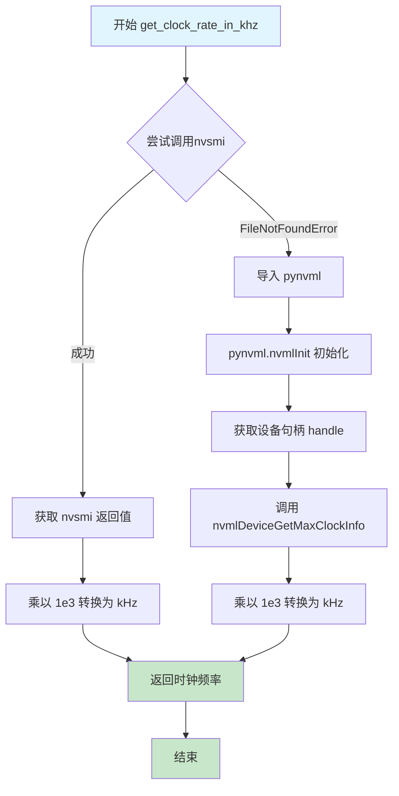
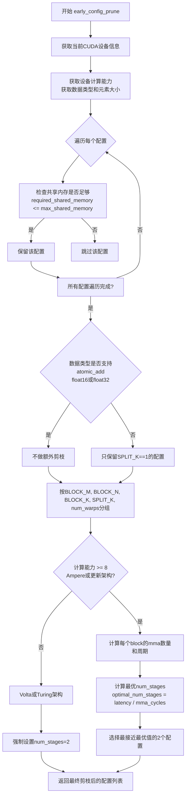

```mermaid
flowchart TD
    A[开始 estimate_matmul_time] --> B[获取当前 CUDA 设备]
    B --> C[获取张量 A 的 dtype 和元素大小]
    C --> D[计算 CTA 数量: num_cta_m × num_cta_n × num_cta_k]
    D --> E[调整 M, N 确保不小于块大小]
    E --> F[计算总操作数: 2 × M × N × K]
    F --> G[获取 GPU 算力吞吐量 TFLOPS]
    G --> H[计算计算时间: total_ops / tput]
    H --> I[计算活跃 CTA 比率]
    I --> J[计算 DRAM 带宽和 L2 带宽]
    J --> K[计算加载数据量: load_a_dram, load_a_l2, load_b_dram, load_b_l2]
    K --> L[计算加载时间: load_ms]
    L --> M[计算存储带宽和存储数据量]
    M --> N{ SPLIT_K == 1 ? }
    N -->|是| O[计算 store_ms]
    N -->|否| P[计算 store_ms 并加上 zero_ms]
    O --> Q[总时间 = max&#40;compute_ms, load_ms&#41; + store_ms]
    P --> Q
    Q --> R{ debug == true ? }
    R -->|是| S[打印详细时间信息]
    R -->|否| T[返回 total_time_ms]
    S --> T
```

# `bitsandbytes\bitsandbytes\triton\matmul_perf_model.py` 详细设计文档

这是一个用于估算NVIDIA GPU上矩阵乘法内核性能的Python模块。它通过计算理论计算吞吐量（TFLOPS）和内存带宽（加载/存储时间）来预测内核执行时间，并提供配置剪枝功能，以筛选出符合硬件限制（如共享内存、计算能力）的最优内核参数。

## 整体流程

```mermaid
graph TD
    A[开始: estimate_matmul_time] --> B[获取设备信息与数据类型]
B --> C[计算CTA网格数量 (num_cta_m, num_cta_n, num_cta_k)]
C --> D{计算时间估算}
D --> E[调用 get_tflops 获取算力]
E --> F[计算总操作数 OPS / 算力]
F --> G{内存加载时间估算}
G --> H[计算活跃CTA比率与带宽]
H --> I[计算DRAM和L2数据量]
I --> J{内存存储时间估算}
J --> K[计算Store带宽]
K --> L[总时间 = max(计算, 加载) + 存储]
L --> M[返回总时间]
```

## 类结构

```
matmul_perf_model (模块 - 无类定义)
├── get_clock_rate_in_khz (获取GPU SM时钟频率)
├── get_tensorcore_tflops (计算TensorCore算力)
├── get_simd_tflops (计算SIMD算力)
├── get_tflops (算力选择分发器)
├── estimate_matmul_time (核心性能估算函数)
└── early_config_prune (配置剪枝函数)
```

## 全局变量及字段


### `torch`
    
PyTorch深度学习框架模块

类型：`module`
    


### `functools`
    
Python函数式编程工具模块

类型：`module`
    


### `heapq`
    
堆队列算法模块，用于优先队列操作

类型：`module`
    


### `driver`
    
Triton运行时驱动模块，提供设备属性查询功能

类型：`module`
    


### `cdiv`
    
Triton库中的向上整除函数

类型：`function`
    


### `get_dram_gbps`
    
获取GPU DRAM带宽（GB/s）的函数

类型：`function`
    


### `get_max_simd_tflops`
    
获取SIMD最大TFLOPS的函数

类型：`function`
    


### `get_max_tensorcore_tflops`
    
获取Tensor Core最大TFLOPS的函数

类型：`function`
    


### `nvsmi`
    
NVIDIA系统管理接口命令行封装函数

类型：`function`
    


    

## 全局函数及方法


### `get_clock_rate_in_khz`

获取GPU SM（流多处理器）的最大时钟频率，单位为kHz。该函数优先尝试使用nvsmi命令行工具获取GPU时钟信息，如果工具不可用，则回退到使用pynvml库查询。

参数： 无

返回值：`int`，GPU SM最大时钟频率（单位：kHz）

#### 流程图



#### 带注释源码

```python
@functools.lru_cache  # 使用 LRU 缓存避免重复查询，提升性能
def get_clock_rate_in_khz():
    """
    获取GPU SM（流多处理器）的最大时钟频率
    
    尝试优先使用nvsmi命令行工具获取GPU时钟信息，
    如果失败则回退到使用pynvml库（NVIDIA Management Library）
    
    返回值:
        int: GPU SM最大时钟频率，单位为kHz
    """
    try:
        # 尝试使用nvsmi命令行工具获取最大SM时钟频率
        # nvsmi返回的值单位为MHz，需要乘以1e3转换为kHz
        return nvsmi(["clocks.max.sm"])[0] * 1e3
    except FileNotFoundError:
        # nvsmi命令不可用时的回退方案：使用pynvml库
        import pynvml
        
        # 初始化pynvml库（NVIDIA Management Library）
        pynvml.nvmlInit()
        
        # 获取GPU设备句柄（索引0表示第一个GPU）
        handle = pynvml.nvmlDeviceGetHandleByIndex(0)
        
        # 获取SM（流多处理器）的最大时钟信息
        # NVML_CLOCK_SM 指定获取SM时钟类型
        # 返回值单位为MHz，乘以1e3转换为kHz
        return pynvml.nvmlDeviceGetMaxClockInfo(handle, pynvml.NVML_CLOCK_SM) * 1e3
```


### `get_tensorcore_tflops`

该函数用于计算 GPU Tensor Core 的理论计算吞吐量（以 TOPS 为单位），通过考虑设备的核心数、CTA 数量、warps 数量和数据类型来估算矩阵乘法的最大性能。

参数：

- `device`：`int` 或 `torch.device`，CUDA 设备标识符，用于获取设备属性
- `num_ctas`：`int`，CTA（Cooperative Thread Arrays）数量，表示并行执行的线程块数量
- `num_warps`：`int`，每个 CTA 中的 warps 数量
- `dtype`：`torch.dtype`，输入矩阵的数据类型（如 float16、float32 等）

返回值：`float`，返回计算吞吐量，单位为 TOPS（Tera Operations Per Second）

#### 流程图

```mermaid
flowchart TD
    A[开始] --> B[计算 total_warps<br/>num_ctas * min(num_warps, 4)]
    B --> C[获取设备属性<br/>multiprocessor_count * 4]
    C --> D[计算 tflops<br/>min(num_subcores, total_warps) / num_subcores * get_max_tensorcore_tflops]
    D --> E[返回 tflops]
```

#### 带注释源码

```python
def get_tensorcore_tflops(device, num_ctas, num_warps, dtype):
    """return compute throughput in TOPS"""
    # 计算总的 warp 数量，但每个 CTA 最多使用 4 个 warps
    # 这是因为 Tensor Core 的资源限制
    total_warps = num_ctas * min(num_warps, 4)
    
    # 获取设备的子核心数量
    # 对于最近的 GPU，每个多处理器有 4 个子核心
    # 通过 multiprocessor_count * 4 计算得到
    num_subcores = driver.active.utils.get_device_properties(device)["multiprocessor_count"] * 4  # on recent GPUs
    
    # 计算实际可达的 TFLOPS
    # 公式：实际活跃子核心比例 * 最大 Tensor Core 理论性能
    # min(num_subcores, total_warps) 确保不超过实际可用的 warps 数量
    tflops = (
        min(num_subcores, total_warps)
        / num_subcores
        * get_max_tensorcore_tflops(dtype, get_clock_rate_in_khz(), device)
    )
    
    # 返回计算吞吐量（TOPS）
    return tflops
```


### `get_simd_tflops`

该函数用于估算GPU在执行SIMD操作时的计算吞吐量（TOPS），通过考虑CTA数量、warps数量、设备的多处理器数量以及数据类型来计算实际的浮点运算性能。

参数：

- `device`：`int` 或 `torch.device`，CUDA设备标识符，用于获取设备属性
- `num_ctas`：`int`，CTA（Cooperative Thread Array）数量，表示并行执行的线程块数量
- `num_warps`：`int`，每个CTA中的warps数量
- `dtype`：`torch.dtype`，操作的数据类型（如torch.float16、torch.float32等）

返回值：`float`，返回计算吞吐量（TOPS），表示每秒可执行的万亿次浮点运算次数

#### 流程图

```mermaid
flowchart TD
    A[开始 get_simd_tflops] --> B[计算 total_warps<br/>num_ctas × min(num_warps, 4)]
    --> C[获取设备属性<br/>multiprocessor_count × 4]
    --> D[计算 num_subcores]
    --> E[获取最大SIMD TFLOPS<br/>调用 get_max_simd_tflops]
    --> F[获取时钟频率<br/>调用 get_clock_rate_in_khz]
    --> G[计算实际吞吐量<br/>min(num_subcores, total_warps) / num_subcores × max_tflops]
    --> H[返回 tflops 值]
```

#### 带注释源码

```python
def get_simd_tflops(device, num_ctas, num_warps, dtype):
    """return compute throughput in TOPS"""
    # 计算总warps数量：CTA数量 × 每个CTA的warps数量（最多考虑4个warps）
    # 这是因为每个SM核心最多同时执行4个warps
    total_warps = num_ctas * min(num_warps, 4)
    
    # 获取设备的多处理器数量，并乘以4得到subcores数量
    # 在最近的GPU架构中，每个多处理器有4个subcores
    num_subcores = driver.active.utils.get_device_properties(device)["multiprocessor_count"] * 4  # on recent GPUs
    
    # 计算实际TFLOPS：
    # 1. min(num_subcores, total_warps) / num_subcores 表示subcores的实际利用率
    # 2. get_max_simd_tflops 根据数据类型、时钟频率和设备获取理论最大SIMD吞吐量
    tflops = (
        min(num_subcores, total_warps) / num_subcores * get_max_simd_tflops(dtype, get_clock_rate_in_khz(), device)
    )
    
    # 返回计算吞吐量（TOPS）
    return tflops
```


### `get_tflops`

该函数用于根据CUDA设备的计算能力、数据类型和硬件配置（CTA数量和Warp数量）估算矩阵运算的浮点计算吞吐量（TFLOPS）。函数内部根据设备Compute Capability版本决定调用SIMD Tensor Core还是普通的Tensor Core计算函数。

参数：

- `device`：`int` 或 `torch.device`，CUDA设备标识符，用于获取设备属性和计算能力
- `num_ctas`：`int`，CTA（Cooperative Thread Array）数量，表示并行的线程块数量
- `num_warps`：`int`，每个CTA中的Warp数量，决定并行度
- `dtype`：`torch.dtype`，输入矩阵的数据类型（如 `torch.float32`、`torch.float16`、`torch.bfloat16` 等）

返回值：`float`，返回计算吞吐量，单位为 TFLOPS（每秒万亿次浮点运算）

#### 流程图

```mermaid
flowchart TD
    A[开始: get_tflops] --> B[获取设备Compute Capability]
    B --> C{capability[0] < 8 且 dtype == float32?}
    C -->|是| D[调用 get_simd_tflops]
    C -->|否| E[调用 get_tensorcore_tflops]
    D --> F[返回 SIMD TFLOPS]
    E --> G[返回 Tensor Core TFLOPS]
    F --> H[结束]
    G --> H
```

#### 带注释源码

```python
def get_tflops(device, num_ctas, num_warps, dtype):
    """
    根据设备计算能力和数据类型返回对应的计算吞吐量（TFLOPS）
    
    参数:
        device: CUDA设备标识符
        num_ctas: CTA（Cooperative Thread Array）数量
        num_warps: 每个CTA中的Warp数量
        dtype: 数据类型，决定使用Tensor Core还是SIMD
    
    返回:
        float: 计算吞吐量（TFLOPS）
    """
    # 获取设备的Compute Capability版本号
    # 例如: (8, 6) 表示 Ampere 架构 (8.6)
    capability = torch.cuda.get_device_capability(device)
    
    # 判断逻辑:
    # - 如果计算能力小于8（Volta/Turing架构）
    # - 且数据类型为 float32（这些架构的Tensor Core不支持float32）
    # 则使用 SIMD (Tensor Core) 计算方式
    if capability[0] < 8 and dtype == torch.float32:
        return get_simd_tflops(device, num_ctas, num_warps, dtype)
    
    # 其他情况（计算能力>=8 或 非float32类型）
    # 使用Tensor Core计算方式（更高的计算吞吐量）
    return get_tensorcore_tflops(device, num_ctas, num_warps, dtype)
```


### `estimate_matmul_time`

该函数用于估算矩阵乘法（matmul）操作的运行时间，基于计算吞吐量、数据加载和存储带宽进行性能建模。它返回预估的执行时间（以毫秒为单位），帮助在编译时选择最优的核函数配置。

参数：

- `num_warps`：`int`，执行矩阵乘法所使用的 warp 数量
- `num_stages`：`int`，软件流水（software pipeline）的阶段数
- `A`：`torch.Tensor`，输入矩阵 A
- `B`：`torch.Tensor`，输入矩阵 B
- `C`：`torch.Tensor`，输出矩阵 C
- `M`：`int`，矩阵乘法的 M 维度
- `N`：`int`，矩阵乘法的 N 维度
- `K`：`int`，矩阵乘法的 K 维度（公共维度）
- `BLOCK_M`：`int`，块大小，用于 M 维度
- `BLOCK_N`：`int`，块大小，用于 N 维度
- `BLOCK_K`：`int`，块大小，用于 K 维度
- `SPLIT_K`：`int`，K 维度的分割因子，用于并行归约
- `debug`：`bool`，是否打印调试信息（默认为 False）
- `**kwargs`：`dict`，额外的关键字参数

返回值：`float`，预估的矩阵乘法执行时间（单位：毫秒）

#### 流程图



#### 带注释源码

```python
def estimate_matmul_time(
    # backend, device,
    num_warps,          # int: 并行执行的 warp 数量
    num_stages,         # int: 软件流水阶段数（当前函数中未直接使用）
    A,                  # torch.Tensor: 输入矩阵 A
    B,                  # torch.Tensor: 输入矩阵 B（当前函数中未直接使用）
    C,                  # torch.Tensor: 输出矩阵 C（当前函数中未直接使用）
    M,                  # int: 矩阵维度 M
    N,                  # int: 矩阵维度 N
    K,                  # int: 矩阵维度 K
    BLOCK_M,            # int: M 维度的分块大小
    BLOCK_N,            # int: N 维度的分块大小
    BLOCK_K,            # int: K 维度的分块大小
    SPLIT_K,            # int: K 维度分割因子，用于多 CTA 归约
    debug=False,        # bool: 是否输出调试信息
    **kwargs,           # dict: 额外参数（当前未使用）
):
    """return estimated running time in ms
    = max(compute, loading) + store"""
    
    # 获取当前 CUDA 设备
    device = torch.cuda.current_device()
    # 从输入张量 A 获取数据类型和元素大小
    dtype = A.dtype
    dtsize = A.element_size()

    # 计算每个维度需要的 CTA（Cooperative Thread Array）数量
    num_cta_m = cdiv(M, BLOCK_M)   # M 维度需要的 CTA 数
    num_cta_n = cdiv(N, BLOCK_N)   # N 维度需要的 CTA 数
    num_cta_k = SPLIT_K            # K 维度（分割）需要的 CTA 数
    num_ctas = num_cta_m * num_cta_n * num_cta_k  # 总 CTA 数量

    # 确保输入尺寸不小于块大小（避免边界问题）
    M, N = max(M, BLOCK_M), max(N, BLOCK_N)

    # ===== 计算时间估算 =====
    # 总操作数：矩阵乘法需要 2*M*N*K 次浮点运算（乘法和加法）
    total_ops = 2 * M * N * K / (1024 * 1024 * 1024)  # GOPS (Giga Operations)
    # 获取 GPU 算力吞吐量（TFLOPS）
    tput = get_tflops(device, num_ctas, num_warps, dtype)
    # 计算时间（毫秒）= 操作数 / 吞吐量
    compute_ms = total_ops / tput

    # ===== 加载时间估算 =====
    # 获取 GPU 的 SM（Streaming Multiprocessor）数量
    num_sm = driver.active.utils.get_device_properties(device)["multiprocessor_count"]
    # 计算活跃 CTA 比率（用于计算资源利用率）
    active_cta_ratio = min(1, num_ctas / num_sm)
    # 计算活跃 CTA 比率（用于带宽估算）- 32 个活跃 CTA 足以 saturate 带宽
    active_cta_ratio_bw1 = min(1, num_ctas / 32)
    # 计算活跃 CTA 比率（32-108 范围，剩余 5%）
    active_cta_ratio_bw2 = max(min(1, (num_ctas - 32) / (108 - 32)), 0)
    # 计算 DRAM 带宽（GB/s），考虑不同活跃比率的贡献
    dram_bw = get_dram_gbps(device) * (active_cta_ratio_bw1 * 0.95 + active_cta_ratio_bw2 * 0.05)
    # L2 缓存带宽约为 DRAM 的 4 倍（粗略估算，A100 约 4.7 倍）
    l2_bw = dram_bw * 4
    
    # 计算从 DRAM 加载的数据量（MB）
    # 公式考虑了对其他 CTA 数据的复用（系数 0.2 表示复用效率）
    load_a_dram = M * K * dtsize * (1 + 0.2 * (num_cta_n - 1))
    # 计算从 L2 缓存加载的数据量（假设 80% 的后续加载命中 L2）
    load_a_l2 = M * K * dtsize * 0.8 * (num_cta_n - 1)
    load_b_dram = N * K * dtsize * (1 + 0.2 * (num_cta_m - 1))
    load_b_l2 = N * K * dtsize * 0.8 * (num_cta_m - 1)
    
    # 总 DRAM 和 L2 数据量（MB）
    total_dram = (load_a_dram + load_b_dram) / (1024 * 1024)
    total_l2 = (load_a_l2 + load_b_l2) / (1024 * 1024)
    
    # 加载时间（毫秒）= 数据量 / 带宽
    load_ms = total_dram / dram_bw + total_l2 / l2_bw

    # ===== 存储时间估算 =====
    # 存储带宽约为 DRAM 带宽的 60%
    store_bw = dram_bw * 0.6
    # 输出矩阵 C 的大小（MB）
    store_c_dram = M * N * dtsize * SPLIT_K / (1024 * 1024)
    
    if SPLIT_K == 1:
        # 单一 CTA，无需归约
        store_ms = store_c_dram / store_bw
    else:
        # 多 CTA 需要归约
        reduce_bw = store_bw
        store_ms = store_c_dram / reduce_bw
        # 归约前需要将 C 置零
        zero_ms = M * N * 2 / (1024 * 1024) / store_bw
        store_ms += zero_ms

    # ===== 总时间 =====
    # 总时间 = max(计算时间, 加载时间) + 存储时间
    # 取最大值是因为计算和加载可以流水线执行
    total_time_ms = max(compute_ms, load_ms) + store_ms
    
    # 调试模式：打印详细时间信息
    if debug:
        print(
            f"Total time: {total_time_ms}ms, compute time: {compute_ms}ms, "
            f"loading time: {load_ms}ms, store time: {store_ms}ms, "
            f"Activate CTAs: {active_cta_ratio * 100}%"
        )
    
    return total_time_ms
```


### `early_config_prune`

该函数用于在Triton矩阵乘法kernel的自动调优过程中，对候选配置进行早期剪枝，移除不满足硬件约束（如共享内存不足、不支持atomic_add等）的配置，并对剩余配置进行分组和优化选择，以提高自动调优的效率。

参数：

- `configs`：`List`，Triton矩阵乘法kernel的候选配置列表，每个配置包含block大小、stage数量、warp数量等参数
- `named_args`：`Dict[str, torch.Tensor]`，包含矩阵A、B、C的字典，用于获取数据类型和元素大小信息
- `**kwargs`：`Any`，额外的关键字参数，目前未被使用

返回值：`List`，返回剪枝后的配置列表，包含满足所有约束条件的候选配置

#### 流程图



#### 带注释源码

```python
def early_config_prune(configs, named_args, **kwargs):
    """
    在Triton矩阵乘法自动调优过程中，对候选配置进行早期剪枝。
    
    剪枝策略：
    1. 移除超出设备共享内存限制的配置
    2. 对于不支持atomic_add的数据类型，移除SPLIT_K>1的配置
    3. 对配置进行分组，选取每个组的最优配置
    4. 根据GPU架构选择最优的num_stages
    """
    # 获取当前CUDA设备
    device = torch.cuda.current_device()
    # 获取设备计算能力，用于判断GPU架构
    capability = torch.cuda.get_device_capability()
    
    # 从输入矩阵A获取数据类型信息，用于后续判断
    dtsize = named_args["A"].element_size()  # 数据类型的字节大小
    dtype = named_args["A"].dtype  # 数据类型（float16, float32, bfloat16等）
    
    # -----------------------------------------------------------
    # 第一轮剪枝：检查共享内存约束
    # -----------------------------------------------------------
    # 遍历所有配置，保留满足共享内存限制的配置
    pruned_configs = []
    for config in configs:
        kw = config.kwargs
        BLOCK_M, BLOCK_N, BLOCK_K, num_stages = (
            kw["BLOCK_M"],
            kw["BLOCK_N"],
            kw["BLOCK_K"],
            config.num_stages,
        )
        
        # 获取设备最大共享内存
        max_shared_memory = driver.active.utils.get_device_properties(device)["max_shared_mem"]
        # 计算该配置所需的共享内存：(BLOCK_M + BLOCK_N) * BLOCK_K * num_stages * 数据类型字节数
        required_shared_memory = (BLOCK_M + BLOCK_N) * BLOCK_K * num_stages * dtsize
        if required_shared_memory <= max_shared_memory:
            pruned_configs.append(config)
    configs = pruned_configs
    
    # -----------------------------------------------------------
    # 第二轮剪枝：atomic_add支持性检查
    # -----------------------------------------------------------
    # 只有float16和float32支持atomic_add操作
    # 其他数据类型（如int8, bf16等）需要SPLIT_K=1
    if dtype not in [torch.float16, torch.float32]:
        configs = [config for config in configs if config.kwargs["SPLIT_K"] == 1]
    
    # -----------------------------------------------------------
    # 第三轮剪枝：配置分组与选择
    # -----------------------------------------------------------
    # 按关键参数分组，相同组的配置只在num_stages上有差异
    # 分组键：(BLOCK_M, BLOCK_N, BLOCK_K, SPLIT_K, num_warps)
    configs_map = {}
    for config in configs:
        kw = config.kwargs
        BLOCK_M, BLOCK_N, BLOCK_K, SPLIT_K, num_warps, num_stages = (
            kw["BLOCK_M"],
            kw["BLOCK_N"],
            kw["BLOCK_K"],
            kw["SPLIT_K"],
            config.num_warps,
            config.num_stages,
        )
        
        key = (BLOCK_M, BLOCK_N, BLOCK_K, SPLIT_K, num_warps)
        if key in configs_map:
            configs_map[key].append((config, num_stages))
        else:
            configs_map[key] = [(config, num_stages)]
    
    # -----------------------------------------------------------
    # 第四轮剪枝：根据架构选择最优num_stages
    # -----------------------------------------------------------
    pruned_configs = []
    for k, v in configs_map.items():
        BLOCK_M, BLOCK_N, BLOCK_K, SPLIT_K, num_warps = k
        
        # 计算能力>=8对应Ampere及更新架构（如A100, RTX30系列, A10等）
        if capability[0] >= 8:
            # 计算该配置下每个CTA的mma指令数量
            # mma指令计算：BLOCK_M * BLOCK_N * BLOCK_K / (16 * 8 * 16)
            # 其中16*8*16是每个mma指令处理的元素数量（对于Tensor Core）
            mmas = BLOCK_M * BLOCK_N * BLOCK_K / (16 * 8 * 16)
            # 计算mma周期数，考虑warp并行度
            # 每个warp最多4个mma流水线
            mma_cycles = mmas / min(4, num_warps) * 8
            
            # 加载指令的延迟估计（周期数）
            ldgsts_latency = 300
            # 计算最优的stage数量，使加载和计算尽可能重叠
            optimal_num_stages = ldgsts_latency / mma_cycles
            
            # 选择最接近最优值的2个配置
            # 优先选择大于等于最优值的配置（更好的隐藏延迟）
            nearest = heapq.nsmallest(
                2,
                v,
                key=lambda x: (
                    10 + abs(x[1] - optimal_num_stages)
                    if (x[1] - optimal_num_stages) < 0
                    else x[1] - optimal_num_stages
                ),
            )
            
            for n in nearest:
                pruned_configs.append(n[0])
        else:
            # Volta (sm_70) 和 Turing (sm_75) 只支持最多2个stages
            # 这些架构的共享内存和计算流水线有限
            random_config = v[0][0]
            random_config.num_stages = 2
            pruned_configs.append(random_config)
    
    return pruned_configs
```

## 关键组件


### 时钟频率获取组件

负责获取GPU SM的最大时钟频率，用于计算理论性能。提供两种获取方式：通过nvsmi命令或pynvml库。

### Tensor Core性能计算组件

根据设备参数计算Tensor Core的理论峰值TFLOPS。考虑总warp数、子核心数、时钟频率和数据类型，输出计算吞吐量。

### SIMD性能计算组件

计算SIMD（标量）单元的理论峰值TFLOPS。逻辑与Tensor Core版本类似，适用于非Tensor Core操作或旧架构设备。

### 统一性能获取组件

根据GPU计算能力自动选择合适的TFLOPS计算方式。对于计算能力小于8且使用float32的情况调用SIMD版本，否则使用Tensor Core版本。

### 矩阵乘法时间估算组件

估算矩阵乘法 kernel 的执行时间，包含计算时间、加载时间和存储时间的模型。通过设备属性、块大小、输入尺寸等参数预测实际运行时间。

### 配置剪枝组件

在自动调优过程中提前过滤掉不可行的配置。检查共享内存限制、atomic_add支持、计算能力适配等条件，输出优化后的候选配置列表。


## 问题及建议


### 已知问题

-   **魔法数字和硬编码系数缺乏文档说明**：代码中存在大量硬编码的数值（如`ldgsts_latency = 300`、`0.95`、`0.05`、`0.8`、`0.6`、`4`等），这些系数用于性能估算，但没有任何注释解释其来源或含义，增加了维护难度。
-   **`early_config_prune`函数中变量遮蔽**：在第109-110行，`configs`被重新赋值导致变量遮蔽（先用于存储剪枝后的配置，后又被覆盖），影响代码可读性。
-   **设备属性获取可能失败**：多处调用`driver.active.utils.get_device_properties(device)`但没有异常处理，如果驱动或CUDA环境异常会导致程序崩溃。
-   **`get_clock_rate_in_khz`的错误处理不完整**：当`nvsmi`和`pynvml`都无法获取时钟频率时，函数会抛出未处理的异常，导致程序无法继续运行。
-   **性能估算模型过于简化**：使用固定系数（如`l2_bw = dram_bw * 4`）进行估算，未考虑不同GPU架构（A100、RTX 3090等）的差异，估算精度有限。
-   **`num_subcores`计算逻辑假设过强**：假设"recent GPUs"的`multiprocessor_count * 4`逻辑可能不适用于所有NVIDIA GPU架构。
-   **缓存机制不完善**：`get_clock_rate_in_khz`使用了`lru_cache`，但其他频繁调用的函数（如`get_max_tensorcore_tflops`、`get_dram_gbps`）每次调用都重新计算，可以考虑添加缓存。

### 优化建议

-   **提取魔法数字为具名常量**：将所有硬编码的系数提取为模块级常量，并添加详细注释说明其含义和来源。
-   **改进变量命名和作用域**：将`early_config_prune`中的`pruned_configs`和`configs`变量明确区分，避免变量遮蔽问题。
-   **添加设备属性访问的容错机制**：对`get_device_properties`的调用添加try-except处理，提供默认值或降级策略。
-   **完善错误处理链**：在`get_clock_rate_in_khz`中添加更完整的异常处理逻辑，支持更多的GPU信息获取方式，或返回合理的默认值。
-   **引入GPU架构检测和适配**：根据实际GPU架构（如通过`torch.cuda.get_device_capability()`获取）动态调整性能估算模型参数，提高估算准确性。
-   **扩展缓存策略**：对`get_device_properties`等设备无关信息添加缓存，减少重复的CUDA API调用开销。
-   **考虑将估算模型参数化**：允许外部配置不同的GPU参数，提高框架的可扩展性和适应性。

## 其它


### 设计目标与约束

该模块旨在为Triton矩阵乘法kernel提供性能估算能力，支持自动调优过程中的配置筛选。设计目标包括：1）基于GPU硬件参数（计算能力、内存带宽、SM数量）估算实际运行时间；2）根据硬件限制剪枝不可行配置；3）针对不同GPU架构（Volta/Turing/Ampere）提供差异化估算逻辑。约束条件包括：仅支持CUDA设备，需预先安装pynvml或nvsmi工具，估算结果为近似值，实际性能可能因kernel实现细节有所偏差。

### 错误处理与异常设计

代码采用防御式编程策略。get_clock_rate_in_khz函数优先尝试nvsmi CLI工具，若FileNotFoundError则回退至pynvml库。early_config_prune中对缺失配置键采用隐式假设（如默认SPLIT_K=1）。性能估算函数estimate_matmul_time无显式异常处理，调用方需保证输入参数合法（正整数维度、非零BLOCK尺寸）。潜在的异常场景包括：CUDA未初始化、GPU设备索引越界、共享内存不足导致配置无法运行。

### 数据流与状态机

模块数据流为：输入配置参数（BLOCK_M/N/K、SPLIT_K、num_warps等）→硬件参数获取（SM数量、时钟频率、内存带宽）→计算时间估算（OPS/TOPS）→内存访问时间估算（DRAM/L2带宽）→存储时间估算→总时间输出。状态机主要体现在early_config_prune的剪枝流程：初始配置集→共享内存过滤→数据类型过滤→配置分组→架构特定筛选（ Ampere计算最优stages，Volta/Turing强制stages=2）→输出可行配置列表。

### 外部依赖与接口契约

核心依赖包括：torch（CUDA设备查询）、triton（cdiv工具、driver.runtime）、triton.testing（带宽/算力查询工具）、pynvml（GPU监控）、heapq（配置筛选）。接口契约如下：get_tensorcore_tflops/get_simd_tflops输入device/num_ctas/num_warps/dtype返回TOPS浮点数；estimate_matmul_time输入矩阵维度与block参数返回毫秒级时间估计；early_config_prune输入候选配置列表与命名参数返回剪枝后配置列表。所有函数均假设CUDA上下文已激活。

### 性能模型与算法

计算时间采用峰值算力模型：total_ops = 2×M×N×K（浮点运算数），实际算力 = min(num_subcores, total_warps)/num_subcores × peak_tflops。内存访问采用分层模型：DRAM带宽考虑active CTA比例（32为饱和点，108达到95%效率），L2带宽假设为DRAM的4倍，加载时间 = DRAM数据量/DRAM带宽 + L2数据量/L2带宽。存储时间包含结果写入与SPLIT_K>1时的清零操作。模型假设80%重复数据命中L2缓存。

### 配置空间定义

可调配置参数包括：BLOCK_M、BLOCK_N、BLOCK_K（块尺寸，通常为16/32/64的倍数）、SPLIT_K（K维度分割数，用于减少中间结果）、num_warps（线程束数量，1/2/4/8）、num_stages（软件流水线深度，1-5）。约束条件：BLOCK_M×BLOCK_K×num_stages×element_size + BLOCK_N×BLOCK_K×num_stages×element_size ≤ max_shared_mem；SPLIT_K>1时仅支持float16/float32以启用atomic_add。

### GPU架构适配策略

代码通过torch.cuda.get_device_capability()获取计算能力主版本号进行架构区分。计算能力≥8（ Ampere+）：使用tensor core算力查询函数，计算cycles考虑mma指令吞吐。计算能力<8（Volta/Turing）：强制num_stages≤2（硬件限制），使用SIMD算力查询函数。num_subcores计算公式：multiprocessor_count×4（假设每SM 4个sub-core，该假设对Ampere有效）。
    