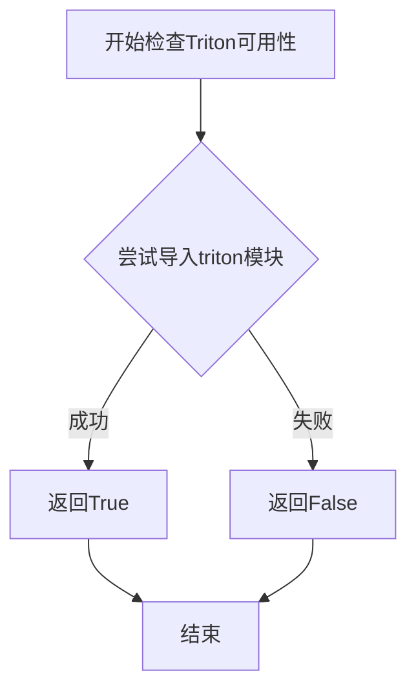

# `bitsandbytes\bitsandbytes\triton\quantize_columnwise_and_transpose.py` 详细设计文档

这是一个使用Triton实现的列向量化（columnwise quantization）和转置（transpose）融合的内核函数，用于深度学习模型量化场景。该函数对输入的二维张量按列进行量化，将数值范围映射到int8范围，并同时完成转置操作，以优化GPU内存访问模式。

## 整体流程

```mermaid
graph TD
    A[开始 quantize_columnwise_and_transpose] --> B{is_triton_available?}
    B -- 否 --> C[返回 None]
    B -- 是 --> D[获取输入tensor形状 M, N]
    D --> E[创建输出tensor: output(N, M, int8) 和 output_maxs(M, float16)]
    E --> F[计算P2: 2^(ceil(log2(M))) 补齐到2的幂次]
    F --> G[验证tensor在CUDA上]
    G --> H[计算grid: triton.cdiv(n_elements, BLOCK_SIZE)]
    H --> I[调用 _quantize_columnwise_and_transpose 内核]
    I --> J[内核: 加载数据并计算每列绝对值最大值]
    J --> K[内核: 量化: llrint(127.0 * x / max_val)]
    K --> L[内核: 转置存储到output和output_maxs]
    L --> M[返回 (output, output_maxs)]
```

## 类结构

```
quantize_columnwise_and_transpose (模块级函数)
└── _quantize_columnwise_and_transpose (Triton JIT内核)
```

## 全局变量及字段


### `x`
    
待量化的输入张量，形状为(M, N)

类型：`torch.Tensor`
    


### `M`
    
输入张量的行数

类型：`int`
    


### `N`
    
输入张量的列数

类型：`int`
    


### `output`
    
量化并转置后的输出张量，形状为(N, M)，类型为int8

类型：`torch.Tensor`
    


### `output_maxs`
    
每列的最大绝对值，用于反量化，形状为(M,)，类型为float16

类型：`torch.Tensor`
    


### `P2`
    
补齐到2的幂次的值，用于Triton kernel的向量加载

类型：`int`
    


### `n_elements`
    
输出tensor的总元素数

类型：`int`
    


### `pid`
    
Triton程序ID，用于并行计算

类型：`tl.program_id`
    


### `block_start`
    
当前块的起始位置

类型：`int`
    


### `p2_arange`
    
补齐后的索引数组

类型：`tl.arange`
    


### `p2_arange_mask`
    
有效索引的掩码

类型：`tl.Tensor`
    


### `arange`
    
偏移量计算数组

类型：`int`
    


### `offsets`
    
内存偏移量

类型：`tl.Tensor`
    


### `x`
    
加载的输入数据

类型：`tl.Tensor`
    


### `abs_x`
    
输入数据的绝对值

类型：`tl.Tensor`
    


### `max_val`
    
每行的最大绝对值

类型：`tl.Tensor`
    


### `output`
    
量化后的输出

类型：`tl.Tensor`
    


### `new_start`
    
转置后的新起始位置

类型：`int`
    


### `new_offsets`
    
转置后的新偏移量

类型：`tl.Tensor`
    


    

## 全局函数及方法


### `is_triton_available`

该函数用于检查当前环境中 Triton 是否可用（已安装且可以正常导入）。这是 bitsandbytes 库中的一个工具函数，用于条件性地启用或禁用 Triton 相关功能。

#### 参数

此函数不接受任何参数。

#### 返回值

- `bool`：返回 `True` 表示 Triton 可用，返回 `False` 表示 Triton 不可用。

#### 流程图



#### 带注释源码

由于 `is_triton_available` 函数是从 `bitsandbytes.triton.triton_utils` 外部模块导入的，源代码未在当前文件中提供。以下是基于其用途的推断实现：

```python
def is_triton_available():
    """
    检查Triton是否可在当前环境中使用。
    
    该函数尝试导入triton模块，如果成功则返回True，
    否则返回False。这允许库在Triton不可用时提供回退方案。
    
    Returns:
        bool: Triton是否可用
    """
    try:
        import triton
        return True
    except ImportError:
        return False
```

---

### 上下文说明：`quantize_columnwise_and_transpose` 函数

在当前代码中，`is_triton_available` 主要用于条件性地定义 `quantize_columnwise_and_transpose` 函数：

- **当 Triton 不可用时**：定义一个返回 `None` 的简单回退函数
- **当 Triton 可用时**：定义完整的 Triton 内核实现，实现高效的列-wise 量化和转置操作


### `quantize_columnwise_and_transpose`

该函数是列方向量化和转置的主入口，根据 Triton 加速库可用性动态选择实现路径：若 Triton 不可用则返回 None，否则执行高效的列方向 INT8 量化并将结果转置，同时输出每列的最大值用于反量化。

参数：

- `x`：`torch.Tensor`，输入的二维张量，要求为 CUDA 张量，待量化并转置的矩阵

返回值：

- 若 Triton 不可用：`None`，表示当前环境不支持 Triton 加速
- 若 Triton 可用：`Tuple[torch.Tensor, torch.Tensor]`，包含量化后的 INT8 转置张量（形状为 N×M）和每列的最大值张量（形状为 N），用于后续反量化

#### 流程图

```mermaid
flowchart TD
    A[开始 quantize_columnwise_and_transpose] --> B{is_triton_available?}
    B -->|否| C[返回 None]
    B -->|是| D[获取输入张量形状 M, N]
    D --> E[创建输出张量 output: N×M int8]
    E --> F[创建最大值的输出张量 output_maxs: N float16]
    F --> G[计算 P2 = 2^ceil(log2 M]
    G --> H[验证 x 和 output 都在 CUDA 上]
    H --> I[计算 grid 布局]
    I --> J[调用 Triton 内核 _quantize_columnwise_and_transpose]
    J --> K[返回 (output, output_maxs)]
```

#### 带注释源码

```python
import math
import torch
from bitsandbytes.triton.triton_utils import is_triton_available

# 如果 Triton 不可用，则定义一个返回 None 的版本
if not is_triton_available():
    def quantize_columnwise_and_transpose(x: torch.Tensor):
        return None
else:
    import triton
    import triton.language as tl

    # 这个内核执行融合的列方向量化和转置操作
    # TODO: 优化自动调参配置
    @triton.autotune(
        configs=[
            # 不同的 stage 和 warp 配置用于自动性能调优
            triton.Config({}, num_stages=1),
            triton.Config({}, num_stages=2),
            triton.Config({}, num_stages=4),
            triton.Config({}, num_stages=8),
            triton.Config({}, num_stages=16),
            triton.Config({}, num_stages=1, num_warps=8),
            triton.Config({}, num_stages=2, num_warps=8),
            triton.Config({}, num_stages=4, num_warps=8),
            triton.Config({}, num_stages=8, num_warps=8),
            triton.Config({}, num_stages=16, num_warps=8),
            triton.Config({}, num_warps=1),
            triton.Config({}, num_warps=2),
            triton.Config({}, num_warps=4),
            triton.Config({}, num_warps=8),
        ],
        key=["n_elements"],  # 根据元素数量选择最佳配置
    )
    @triton.jit
    def _quantize_columnwise_and_transpose(
        x_ptr,           # 输入张量指针
        output_ptr,      # 输出张量指针（转置后）
        output_maxs,     # 每列最大值输出指针
        n_elements,      # 总元素数量
        M: tl.constexpr, # 输入行数
        N: tl.constexpr, # 输入列数
        BLOCK_SIZE: tl.constexpr,  # 块大小
        P2: tl.constexpr,         # 2 的幂次，用于计算偏移
    ):
        # 获取程序 ID，用于并行处理不同的列
        pid = tl.program_id(axis=0)
        # 计算当前块的起始位置
        block_start = pid
        # 创建 P2 大小的范围数组，用于索引
        p2_arange = tl.arange(0, P2)
        # 创建掩码，确保不超出 M 行
        p2_arange_mask = p2_arange < M
        # 计算每行的偏移量（乘以列数 N）
        arange = p2_arange * N
        # 计算最终的偏移地址
        offsets = block_start + arange
        # 从输入张量加载数据，使用掩码处理边界
        x = tl.load(x_ptr + offsets, mask=p2_arange_mask)
        # 计算绝对值
        abs_x = tl.abs(x)
        # 计算每列的最大值（沿 axis=0）
        max_val = tl.max(tl.where(p2_arange_mask, abs_x, 0), axis=0)
        # 执行量化：x / max_val * 127 并四舍五入到整数
        output = tl.libdevice.llrint(127.0 * (x / max_val))

        # 计算转置后的新偏移：每列的数据需要连续存储
        new_start = pid * M
        new_offsets = new_start + p2_arange
        # 存储量化后的结果到输出张量
        tl.store(output_ptr + new_offsets, output, mask=p2_arange_mask)
        # 存储该列的最大值
        tl.store(output_maxs + pid, max_val)

    def quantize_columnwise_and_transpose(x: torch.Tensor):
        # 获取输入张量的形状
        M, N = x.shape
        # 创建转置后的输出张量：形状从 MxN 变为 NxM，int8 类型
        output = torch.empty(N, M, device=x.device, dtype=torch.int8)
        # 创建存储每列最大值的张量，形状为 N，float16 类型
        output_maxs = torch.empty(x.shape[1], device=x.device, dtype=torch.float16)

        # 计算 P2：大于等于 M 的最小 2 的幂次，用于高效计算
        P2 = int(2 ** (math.ceil(math.log2(M))))

        # 断言确保输入和输出都在 CUDA 设备上
        assert x.is_cuda and output.is_cuda
        # 计算总元素数量
        n_elements = output.numel()
        # 定义 Triton grid 布局
        grid = lambda meta: (triton.cdiv(n_elements, meta["BLOCK_SIZE"]),)
        # 调用 Triton 内核执行量化转置
        _quantize_columnwise_and_transpose[grid](
            x, output, output_maxs, n_elements, M, N, BLOCK_SIZE=M, P2=P2
        )
        # 返回量化后的张量和每列最大值
        return output, output_maxs
```


### quantize_columnwise_and_transpose

这是一个Triton JIT编译的内核函数，执行列-wise量化（将输入张量每列的值缩放到int8范围）和转置操作的融合，支持动态选择最优的num_stages和num_warps配置以提升性能。

参数：

- `x`：`torch.Tensor`，输入的二维张量，形状为(M, N)，要求位于CUDA设备上
- （Triton Kernel内部参数由JIT运行时自动管理，无需手动传入）

返回值：`(torch.Tensor, torch.Tensor)`，返回一个元组
- 第一个元素：量化并转置后的输出张量，形状为(N, M)，类型为torch.int8
- 第二个元素：每列的最大绝对值，用于反量化，形状为(N,)，类型为torch.float16

#### 流程图

```mermaid
flowchart TD
    A[输入: x (M×N float16)] --> B[计算P2 = 2^ceil(log2(M))]
    B --> C[初始化输出张量: output (N×M int8)]
    C --> D[初始化最大值张量: output_maxs (N, float16)]
    D --> E[启动Triton Kernel网格]
    E --> F{Triton Kernel并行执行}
    F --> G[每个program计算一列]
    G --> H[加载该列数据到寄存器]
    H --> I[计算列绝对值最大值]
    I --> J[量化: output = round(127 * x / max_val)]
    J --> K[转置存储到output的对应列]
    K --> L[保存列最大值到output_maxs]
    F --> M[返回 (output, output_maxs)]
```

#### 带注释源码

```python
import math
import torch

# 检查Triton是否可用，不可用时返回None的降级实现
from bitsandbytes.triton.triton_utils import is_triton_available

if not is_triton_available():
    def quantize_columnwise_and_transpose(x: torch.Tensor):
        return None
else:
    import triton
    import triton.language as tl

    # ============================================================
    # Triton JIT编译的内核函数：执行列-wise量化和转置
    # 输入x: (M, N) -> 输出: (N, M) int8 + 每列最大值
    # ============================================================
    
    # 自动调优配置：尝试不同的num_stages和num_warps组合
    # num_stages: 流水线阶段数，影响寄存器复用
    # num_warps: 每个SM的线程束数，影响并行度
    @triton.autotune(
        configs=[
            triton.Config({}, num_stages=1),
            triton.Config({}, num_stages=2),
            triton.Config({}, num_stages=4),
            triton.Config({}, num_stages=8),
            triton.Config({}, num_stages=16),
            triton.Config({}, num_stages=1, num_warps=8),
            triton.Config({}, num_stages=2, num_warps=8),
            triton.Config({}, num_stages=4, num_warps=8),
            triton.Config({}, num_stages=8, num_warps=8),
            triton.Config({}, num_stages=16, num_warps=8),
            triton.Config({}, num_warps=1),
            triton.Config({}, num_warps=2),
            triton.Config({}, num_warps=4),
            triton.Config({}, num_warps=8),
        ],
        key=["n_elements"],  # 根据元素数量选择最优配置
    )
    @triton.jit
    def _quantize_columnwise_and_transpose(
        x_ptr,          # 输入张量指针
        output_ptr,     # 输出张量指针
        output_maxs,    # 每列最大值输出指针
        n_elements,     # 总元素数
        M: tl.constexpr,    # 输入行数
        N: tl.constexpr,    # 输入列数
        BLOCK_SIZE: tl.constexpr,  # 块大小
        P2: tl.constexpr,         # 2的幂次方，用于计算偏移
    ):
        # 获取当前program ID，处理一列数据
        pid = tl.program_id(axis=0)
        
        # 计算当前列的偏移量
        block_start = pid
        p2_arange = tl.arange(0, P2)  # [0, 1, 2, ..., P2-1]
        p2_arange_mask = p2_arange < M  # 有效位置掩码
        
        # 计算从输入张量读取的偏移地址
        arange = p2_arange * N
        offsets = block_start + arange
        
        # 从全局内存加载当前列的数据
        x = tl.load(x_ptr + offsets, mask=p2_arange_mask)
        
        # 计算绝对值
        abs_x = tl.abs(x)
        
        # 计算当前列的最大绝对值
        max_val = tl.max(tl.where(p2_arange_mask, abs_x, 0), axis=0)
        
        # 量化: output = round(127 * x / max_val)
        # 将值缩放到[-127, 127]范围
        output = tl.libdevice.llrint(127.0 * (x / max_val))
        
        # 计算转置后的存储位置
        # 转置: 原列索引变为行索引
        new_start = pid * M
        new_offsets = new_start + p2_arange
        
        # 存储量化后的转置结果
        tl.store(output_ptr + new_offsets, output, mask=p2_arange_mask)
        
        # 存储该列的最大值，用于后续反量化
        tl.store(output_maxs + pid, max_val)

    def quantize_columnwise_and_transpose(x: torch.Tensor):
        # 获取输入张量形状
        M, N = x.shape
        
        # 创建输出张量: 转置后的形状 (N, M)，int8类型
        output = torch.empty(N, M, device=x.device, dtype=torch.int8)
        
        # 创建存储每列最大值的张量: 形状 (N,)
        output_maxs = torch.empty(x.shape[1], device=x.device, dtype=torch.float16)

        # 计算用于偏移计算的P2值（不小于M的最小2的幂次）
        P2 = int(2 ** (math.ceil(math.log2(M))))

        # 断言输入和输出都在CUDA设备上（Triton要求GPU执行）
        assert x.is_cuda and output.is_cuda
        
        # 计算网格大小，用于并行执行
        n_elements = output.numel()
        grid = lambda meta: (triton.cdiv(n_elements, meta["BLOCK_SIZE"]),)
        
        # 启动Triton Kernel
        _quantize_columnwise_and_transpose[grid](
            x, output, output_maxs, n_elements, 
            M, N, BLOCK_SIZE=M, P2=P2
        )
        
        # 返回量化后的转置张量和每列最大值
        return output, output_maxs
```

## 关键组件


### 列-wise量化与转置内核

使用Triton实现的融合内核，对输入张量进行列-wise量化（将值缩放到int8范围）并同时执行转置操作。

### Triton内核函数 `_quantize_columnwise_and_transpose`

Triton JIT编译的内核函数，执行实际的量化计算。使用BLOCK_SIZE=M的阻塞方式处理，每个program处理一列数据，计算该列的绝对值最大值作为缩放因子，将输入值量化为int8并存储到转置后的位置。

### Python封装函数 `quantize_columnwise_and_transpose`

对外暴露的Python接口函数，接收PyTorch张量，调用Triton内核执行量化转置操作，返回量化后的int8张量及每列的最大值（用于反量化）。

### Triton自动调优配置

使用triton.autotune装饰器定义多组配置参数，包括不同的num_stages（1/2/4/8/16）和num_warps（1/2/4/8）组合，用于自动选择最优执行配置。

### 条件导入与惰性加载

通过`is_triton_available()`检查Triton是否可用，不可用时提供None作为fallback实现，实现条件加载和优雅降级。

### 反量化支持数据

内核返回的`output_maxs`存储每列的最大绝对值，用于后续反量化时还原原始浮点值，实现对称量化。

### 量化策略

采用对称量化策略，使用127作为量化系数（-127到127范围），通过`llrint`函数进行四舍五入取整。


## 问题及建议


### 已知问题

-   **BLOCK_SIZE固定为M**：在调用内核时，`BLOCK_SIZE`被硬编码为输入的行数`M`。这会导致在`M`值非常大时可能超过GPU资源限制（如共享内存大小），或在`M`值较小时导致GPU利用率不足，因为网格大小（即线程块数量）会非常小（等于列数`N`）。
-   **P2计算可能不够优化**：`P2`被计算为大于等于`M`的最小2的幂。虽然这是为了满足Triton的常数要求，但可能导致在`M`不是2的幂时产生额外的计算和内存访问（因为`P2 > M`）。
-   **错误处理不充分**：代码仅使用断言检查输入和输出张量是否在CUDA设备上，缺少对以下关键条件的验证：
    - 输入张量维度（是否为2D）。
    - 输入张量是否连续（非连续张量可能导致错误的内存访问）。
    - 输入张量是否为空（`M`或`N`为0）。
    - 输入数据类型是否支持量化（通常应为浮点类型）。
-   **精度风险**：在Triton内核中，使用`float16`类型的`output_maxs`存储每列的最大值。在计算`abs_x`和`max_val`时，如果输入值很大或很小，`float16`可能因动态范围有限而导致精度损失，进而影响量化结果。
-   **Autotune配置不完整**：虽然代码使用了`@triton.autotune`装饰器，但只对`num_stages`和`num_warps`进行了搜索，而关键的`BLOCK_SIZE`被固定为`M`，这可能不是最优配置。代码中的TODO注释也表明作者意识到这一点。

### 优化建议

-   **引入BLOCK_SIZE的动态配置**：将`BLOCK_SIZE`从固定值改为可配置参数，并将其添加到`autotune`的`configs`列表中，例如允许Triton在多个候选值（如64, 128, 256, 512等）中自动选择最优值，以适应不同的`M`和`N`组合。
-   **增强输入验证**：在执行内核前添加全面的检查，例如：
    ```python
    if x.dim() != 2:
        raise ValueError(f"Expected 2D tensor, got {x.dim()}D")
    if not x.is_cuda:
        raise ValueError("Input tensor must be on CUDA device")
    if not x.is_contiguous():
        raise ValueError("Input tensor must be contiguous")
    if x.shape[0] == 0 or x.shape[1] == 0:
        raise ValueError("Input tensor must be non-empty")
    ```
-   **改进精度处理**：考虑在内核计算中使用`float32`进行中间累加和比较，仅在最终存储到`output_maxs`时转换为`float16`，以减少精度损失。或者，如果性能允许，直接使用`float32`存储`output_maxs`。
-   **优化P2策略**：当`M`较小时，可以评估是否可以直接使用`M`而无需扩展到2的幂，或者在`M`超过某个阈值（如1024）时才扩展，以减少不必要的计算。
-   **根据数据类型调整行为**：如果需要支持不同精度的输入（如`float32`和`float16`），可以在内核中根据输入的dtype动态调整计算逻辑，或者在量化公式中考虑dtype差异。

## 其它


### 设计目标与约束

该模块的核心设计目标是通过TritonGPU内核实现高效的列-wise量化与转置融合操作，以支持大模型推理中的权重量化需求。设计约束包括：1）仅支持CUDA设备上的float16类型的输入张量；2）量化方法采用对称量化，使用最大绝对值作为缩放因子，输出范围为[-127, 127]的int8类型；3）输入张量必须是二维矩阵且维度M（行数）必须为2的幂次方（P2计算）；4）依赖triton库进行GPU计算加速。

### 错误处理与异常设计

代码中的错误处理主要通过assert语句实现，包括：1）检查输入和输出张量是否在CUDA设备上（`x.is_cuda and output.is_cuda`），若不在CUDA设备上会抛出AssertionError；2）Triton不可用时返回None作为quantize_columnwise_and_transpose函数。潜在改进：可添加更详细的错误信息，包括张量设备类型、维度检查、dtype检查等，并考虑使用自定义异常类进行更细粒度的错误分类。

### 数据流与状态机

数据流主要分为三个阶段：1）初始化阶段：计算输入形状(M,N)，创建输出张量output(N,M)和output_maxs，計算P2（大于等于M的最小2的幂次方）；2）计算阶段：启动Triton内核，grid大小为triton.cdiv(n_elements, BLOCK_SIZE)，每个线程块处理一列数据，计算该列的最大绝对值并进行量化；3）存储阶段：量化结果存储到output转置位置，最大值存储到output_maxs对应索引。状态机相对简单，无复杂状态转换，主要为"就绪->计算中->完成"三状态。

### 外部依赖与接口契约

主要外部依赖包括：1）torch库：用于张量操作和内存分配；2）triton库：用于GPU内核定义和执行；3）triton.language：用于Triton领域特定语言操作；4）bitsandbytes.triton.triton_utils.is_triton_available：用于检查Triton可用性。接口契约方面：quantize_columnwise_and_transpose函数接收类型为torch.Tensor的输入x，返回两个torch.Tensor：output（int8类型的量化转置结果）和output_maxs（float16类型的每列最大值）。输入x必须满足：device为cuda、dtype为float16、dims为2D、M为2的幂次方。

### 性能考虑与基准测试

性能优化主要通过Triton的autotune机制实现，测试了不同的num_stages（1,2,4,8,16）和num_warps（1,2,4,8）配置组合。当前默认BLOCK_SIZE设置为M（行数），这意味着每个线程处理整列数据。性能考虑因素包括：1）内存访问模式：列-wise加载与转置存储；2）并行度：grid大小与线程块数量的权衡；3）warp效率：不同num_warps配置对计算效率的影响。基准测试建议：应在不同M,N尺寸下测试吞吐量、延迟和内存带宽利用率。

### 并发与线程安全

该模块本身不涉及多线程或并发控制，因为Triton内核执行由Triton运行时管理。函数级别的并发调用需要外部同步机制：1）同一CUDA流内的串行执行是安全的；2）不同流或设备上的并发执行需要用户自行管理；3）output和output_maxs张量不应在 kernel执行期间被修改。Triton内核内部通过tl.program_id(axis=0)区分不同线程块，每个线程块独立处理一列数据，无共享状态修改。

### 配置与参数说明

关键配置参数包括：1）BLOCK_SIZE：Triton内核的块大小，当前实现中设置为M（输入行数），意味着每个线程块处理一列；2）P2：计算得到的2的幂次方值，用于确定arange范围；3）num_stages：Triton配置参数，控制软件流水线的 stages数量，影响寄存器使用和内存访问效率；4）num_warps：Triton配置参数，控制每个线程块中的warp数量，影响计算密度。autotune配置覆盖了num_stages从1到16和num_warps从1到8的组合，以适应不同硬件和输入规模。

### 使用示例与调用方式

基本调用示例：
```python
import torch
from bitsandbytes.triton import quantize_columnwise_and_transpose

# 创建输入张量（必须为CUDA设备，float16类型）
x = torch.randn(64, 128, device='cuda', dtype=torch.float16)

# 执行列-wise量化并转置
quantized_output, maxs = quantize_columnwise_and_transpose(x)

# quantized_output shape: (128, 64), dtype: torch.int8
# maxs shape: (128,), dtype: torch.float16
```

典型应用场景：1）LLM权重量化：将全精度权重矩阵转换为int8格式以减少内存占用和加速推理；2）动态量化：在推理时根据输入动态计算缩放因子；3）与bitsandbytes其他量化函数配合使用。

### 局限性与已知问题

当前实现存在以下局限性：1）仅支持2的幂次方行数：非2的幂次方M值会导致P2计算引入额外计算和内存开销；2）仅支持CUDA设备：无法在CPU或其他设备上运行；3）仅支持float16输入：其他dtype需要额外支持；4）对称量化限制：无法支持非对称量化或零点（zero-point）量化；5）BLOCK_SIZE=M的限制：对于非常大的M值可能导致资源利用率不足。已知问题：TODO注释提到"autotune this better"，表明当前autotune配置可能未达到最优。

    