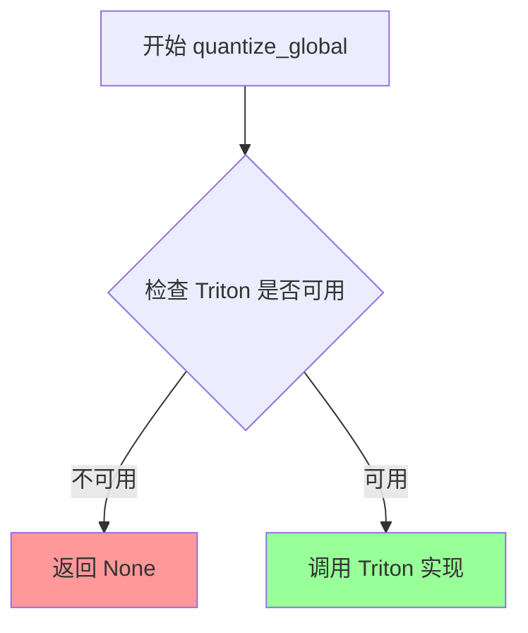
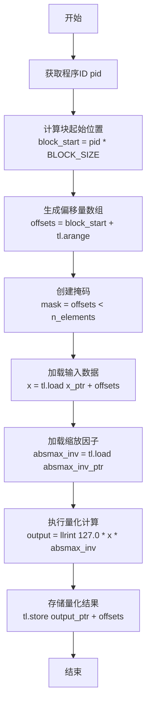
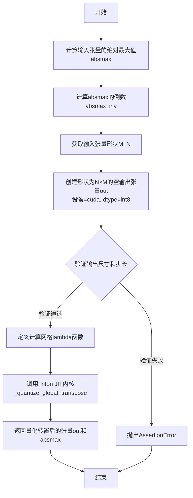
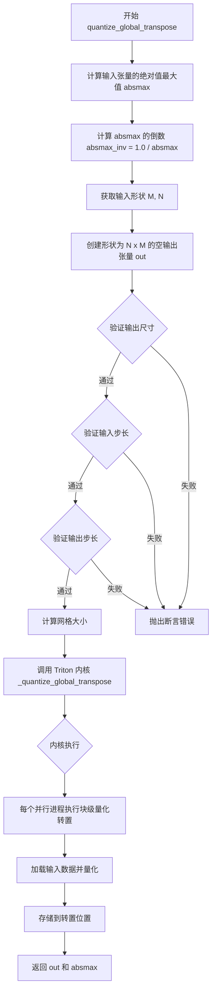
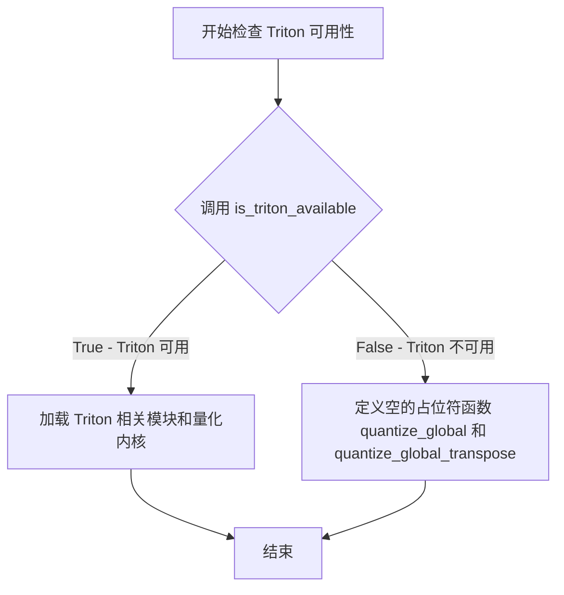

# `bitsandbytes\bitsandbytes\triton\quantize_global.py` 详细设计文档

该代码实现了基于Triton的全局量化（global quantization）和量化同时转置（quantize+transpose）操作，用于将PyTorch的float32张量量化到int8，同时计算并返回绝对最大值（absmax）以便后续反量化。如果Triton不可用，则返回None。

## 整体流程

```mermaid
graph TD
    A[开始] --> B{is_triton_available()?}
    B -- 否 --> C[定义空函数quantize_global和quantize_global_transpose返回None]
    B -- 是 --> D[定义_quantize_global Triton内核]
    D --> E[定义quantize_global函数]
    E --> F[计算absmax和absmax_inv]
    F --> G[创建int8输出张量]
    G --> H[调用_quantize_global内核]
    H --> I[返回output和absmax]
    I --> J[定义_quantize_global_transpose Triton内核]
    J --> K[定义quantize_global_transpose函数]
    K --> L[计算absmax和absmax_inv]
    L --> M[创建转置后的int8输出张量]
    M --> N[验证stride条件]
    N --> O[调用_quantize_global_transpose内核]
    O --> P[返回out和absmax]
```

## 类结构

```
Global Scope
├── quantize_global_transpose (条件定义-无Triton时)
├── quantize_global (条件定义-无Triton时)
├── _quantize_global (Triton JIT内核)
├── quantize_global (Triton版本)
├── _quantize_global_transpose (Triton JIT内核)
└── quantize_global_transpose (Triton版本)
```

## 全局变量及字段


### `absmax`
    
输入张量绝对值的最大值，经过unsqueeze(0)处理后的标量张量，用于计算量化因子

类型：`torch.Tensor`
    


### `absmax_inv`
    
absmax的倒数，用于量化计算中的归一化因子

类型：`torch.Tensor`
    


### `output`
    
量化后的int8类型输出张量，形状与输入相同

类型：`torch.Tensor`
    


### `out`
    
量化并转置后的int8类型输出张量，形状为(N, M)

类型：`torch.Tensor`
    


### `n_elements`
    
输出张量的总元素数量，用于计算grid和block大小

类型：`int`
    


### `M`
    
输入矩阵的行数

类型：`int`
    


### `N`
    
输入矩阵的列数

类型：`int`
    


### `BLOCK_SIZE`
    
Triton配置常量，一维量化kernel的block大小

类型：`int`
    


### `BLOCK_M`
    
Triton配置常量，转置kernel中行方向的block大小

类型：`int`
    


### `BLOCK_N`
    
Triton配置常量，转置kernel中列方向的block大小

类型：`int`
    


### `GROUP_M`
    
Triton配置常量，分组优化的组大小

类型：`int`
    


### `pid`
    
Triton程序ID，用于识别当前执行的block

类型：`int`
    


### `block_start`
    
当前block的起始偏移量

类型：`int`
    


### `offsets`
    
当前block内元素的偏移量数组

类型：`tl.tensor`
    


### `mask`
    
用于过滤有效元素的布尔掩码

类型：`tl.tensor`
    


### `x`
    
从全局内存加载的输入数据

类型：`tl.tensor`
    


### `a`
    
转置kernel中从A矩阵加载的输入数据

类型：`tl.tensor`
    


### `rm`
    
行索引数组，用于计算矩阵元素的行坐标

类型：`tl.tensor`
    


### `rn`
    
列索引数组，用于计算矩阵元素的列坐标

类型：`tl.tensor`
    


### `stride_am`
    
输入矩阵A在行方向的步长

类型：`int`
    


### `stride_an`
    
输入矩阵A在列方向的步长

类型：`int`
    


### `stride_bn`
    
输出矩阵B在列方向的步长

类型：`int`
    


### `stride_bm`
    
输出矩阵B在行方向的步长

类型：`int`
    


### `grid_m`
    
行方向上需要的block数量

类型：`int`
    


### `grid_n`
    
列方向上需要的block数量

类型：`int`
    


### `width`
    
分组优化的宽度，计算group_id用

类型：`int`
    


### `group_id`
    
当前block所属的分组ID

类型：`int`
    


### `group_size`
    
当前分组的大小

类型：`int`
    


### `pid_m`
    
当前block在行方向的逻辑ID

类型：`int`
    


### `pid_n`
    
当前block在列方向的逻辑ID

类型：`int`
    


    

## 全局函数及方法


### `quantize_global_transpose`

该函数执行全局量化并同时转置输入的张量，通过计算输入张量的绝对值最大值(absmax)进行归一化量化，并将结果存储在转置后的输出张量中。

参数：

- `input`：`torch.Tensor`，输入的二维张量，需要在CUDA设备上

返回值：`Tuple[torch.Tensor, torch.Tensor]`，返回转置后的量化结果(形状为N×M的int8张量)和absmax值(用于反量化)

#### 流程图

```mermaid
flowchart TD
    A[开始 quantize_global_transpose] --> B[计算 input.abs().max]
    B --> C[unsqueeze得到absmax]
    C --> D[计算 absmax_inv = 1.0 / absmax]
    D --> E[获取输入形状 M, N]
    E --> F[创建输出张量 out shape为N×M, dtype=int8, device=cuda]
    F --> G{验证输出形状和 strides}
    G -->|断言失败| H[抛出异常]
    G -->|断言通过| I[计算 grid 维度]
    I --> J[调用 Triton kernel _quantize_global_transpose]
    J --> K[返回 out 和 absmax]
```

#### 带注释源码

```python
def quantize_global_transpose(input):
    # 计算输入张量的绝对值最大值，作为全局缩放因子
    absmax = input.abs().max().unsqueeze(0)
    
    # 计算缩放因子的倒数，用于量化计算
    absmax_inv = 1.0 / absmax
    
    # 获取输入张量的维度
    M, N = input.shape
    
    # 创建一个转置后的空张量，形状为 N×M，类型为 int8
    out = torch.empty(N, M, device="cuda", dtype=torch.int8)

    # 断言验证：确保输出张量形状正确
    assert out.size(0) == N and out.size(1) == M
    
    # 断言验证：确保输入和输出的步长满足要求（至少有一个维度连续）
    # 这对于高效的Triton kernel执行很重要
    assert input.stride(0) == 1 or input.stride(1) == 1
    assert out.stride(0) == 1 or out.stride(1) == 1

    # 计算grid维度：M方向的分块数 × N方向的分块数
    grid = lambda META: (triton.cdiv(M, META["BLOCK_M"]) * triton.cdiv(N, META["BLOCK_N"]),)
    
    # 调用Triton kernel进行量化并转置
    # 参数包括：输入张量、缩放因子倒数、输出张量、各自的stride、M和N维度
    _quantize_global_transpose[grid](
        input,
        absmax_inv,
        out,
        input.stride(0),   # stride_am: 输入张量在M维度的步长
        input.stride(1),   # stride_an: 输入张量在N维度的步长
        out.stride(0),     # stride_bn: 输出张量在N维度的步长
        out.stride(1),     # stride_bm: 输出张量在M维度的步长
        M,
        N,
    )
    
    # 返回转置后的量化结果和absmax值（用于后续反量化）
    return out, absmax
```


### `quantize_global`

这是一个全局量化函数的存根实现，当 Triton 不可用时，直接返回 None，表示该功能不可用。

参数：

-  `x`：`torch.Tensor`，输入的需要进行全局量化处理的张量

返回值：`None`，当 Triton 不可用时返回，表示量化功能不可用

#### 流程图



#### 带注释源码

```python
# 当 Triton 不可用时，定义一个空实现的 quantize_global 函数
# 参数 x: 输入的 torch.Tensor 张量
# 返回值: None，表示该功能在当前环境下不可用
def quantize_global(x: torch.Tensor):
    return None
```


### `_quantize_global`

这是一个Triton JIT内核函数，用于对输入张量进行全局量化（Global Quantization）。该内核通过计算输入张量的绝对最大值倒数（absmax_inv），将输入值映射到int8范围（-127到127），利用Triton的并行计算能力实现高效的GPU加速量化操作。

参数：

- `x_ptr`：`tl.tensor`，输入张量的指针，指向待量化的原始数据
- `absmax_inv_ptr`：`tl.tensor`，绝对最大值倒数的指针，用于量化缩放因子
- `output_ptr`：`tl.tensor`，输出张量的指针，存储量化后的int8结果
- `n_elements`：`int`，输入张量的总元素数量，用于计算并行度和掩码
- `BLOCK_SIZE`：`tl.constexpr`，每个线程块处理的元素数量（编译时常量）

返回值：`None`，Triton JIT内核无返回值，结果通过指针参数output_ptr输出

#### 流程图



#### 带注释源码

```python
@triton.autotune(
    configs=[
        triton.Config({"BLOCK_SIZE": 1024}, num_warps=4),
        triton.Config({"BLOCK_SIZE": 2048}, num_stages=1),
    ],
    key=["n_elements"],
)
@triton.jit
def _quantize_global(
    x_ptr,              # 输入张量指针，指向待量化数据
    absmax_inv_ptr,     # 绝对最大值倒数指针，用于量化缩放
    output_ptr,         # 输出张量指针，存储量化结果
    n_elements,         # 总元素数量，用于并行度和掩码计算
    BLOCK_SIZE: tl.constexpr,  # 块大小，编译时常量
):
    """
    Triton JIT内核：全局量化
    
    该内核对输入张量进行全局量化，将浮点值映射到int8范围。
    量化公式: output = round(127.0 * x / absmax)
    使用llrint进行舍入到最近的整数。
    """
    
    # 获取当前程序ID，用于计算当前处理的数据块
    pid = tl.program_id(axis=0)
    
    # 计算当前线程块的起始位置
    block_start = pid * BLOCK_SIZE
    
    # 生成当前块的偏移量数组 [0, 1, 2, ..., BLOCK_SIZE-1]
    offsets = block_start + tl.arange(0, BLOCK_SIZE)
    
    # 创建掩码，只处理有效范围内的元素（防止越界）
    mask = offsets < n_elements
    
    # 从输入张量加载数据，使用掩码避免越界访问
    x = tl.load(x_ptr + offsets, mask=mask)
    
    # 加载全局缩放因子（绝对最大值的倒数）
    absmax_inv = tl.load(absmax_inv_ptr)
    
    # 执行量化计算：
    # 1. x * absmax_inv: 归一化到 [-1, 1] 范围
    # 2. * 127.0: 缩放到 [-127, 127] 范围
    # 3. llrint: 四舍五入到最近的整数
    output = tl.libdevice.llrint(127.0 * (x * absmax_inv))
    
    # 将量化结果存储到输出张量，使用相同掩码
    tl.store(output_ptr + offsets, output, mask=mask)
```


### `quantize_global`

该函数是 Triton 版本的全局量化函数，用于将输入的浮点张量量化到 int8 范围。函数通过计算输入张量的绝对最大值（absmax）并进行归一化，然后使用 Triton GPU kernel 并行执行量化操作，返回量化后的 int8 张量及其 absmax 值供后续反量化使用。

参数：

- `x`：`torch.Tensor`，待量化的输入张量，必须是 CUDA 张量

返回值：`(torch.Tensor, torch.Tensor)`，第一个元素是量化后的 int8 CUDA 张量，第二个元素是用于反量化的 absmax 值

#### 流程图

```mermaid
flowchart TD
    A[开始 quantize_global] --> B[计算 x.abs().max]
    B --> C[对 absmax 进行 unsqueeze 操作]
    C --> D[计算 absmax_inv = 1.0 / absmax]
    D --> E[创建 output 空张量<br/>device='cuda', dtype=torch.int8]
    E --> F{检查 x 和 output 是否为 CUDA 张量}
    F -->|是| G[计算 n_elements = output.numel]
    G --> H[计算 grid 配置<br/>cdiv(n_elements, BLOCK_SIZE)]
    H --> I[调用 Triton kernel _quantize_global]
    I --> J[在 GPU 上执行量化计算<br/>output = llrint127.0 \* (x \* absmax_inv)]
    J --> K[返回 output 和 absmax]
    F -->|否| L[抛出断言错误]
```

#### 带注释源码

```python
def quantize_global(x: torch.Tensor):
    # 计算输入张量的绝对最大值，并在第0维添加一个维度
    # 例如：输入 [M, N] -> absmax shape: [1]
    absmax = x.abs().max().unsqueeze(0)
    
    # 计算绝对最大值的倒数，用于量化时的归一化
    # 量化公式: output = round(127 * (x / absmax))
    # 等价于: output = round(127 * x * absmax_inv)
    absmax_inv = 1.0 / absmax
    
    # 创建输出张量，形状与输入相同，但类型为 int8
    # 使用 CUDA 设备以支持 GPU 加速
    output = torch.empty(*x.shape, device="cuda", dtype=torch.int8)
    
    # 断言确保输入和输出都在 CUDA 设备上
    assert x.is_cuda and output.is_cuda
    
    # 计算输出张量的总元素数量
    n_elements = output.numel()
    
    # 定义 Triton grid 调度函数
    # 根据 BLOCK_SIZE 自动计算需要启动的 block 数量
    # cdiv(n_elements, BLOCK_SIZE) 相当于 ceil 除法
    grid = lambda meta: (triton.cdiv(n_elements, meta["BLOCK_SIZE"]),)
    
    # 调用 Triton JIT 编译的 kernel 进行量化计算
    # kernel 会根据 n_elements 自动选择最优的 BLOCK_SIZE 配置
    _quantize_global[grid](x, absmax_inv, output, n_elements)
    
    # 返回量化后的张量和 absmax 值
    # absmax 可用于后续的反量化: x_reconstructed = output * absmax / 127
    return output, absmax
```


### `quantize_global_transpose`

该函数实现了一个全局量化并转置的操作，接受一个输入张量，计算其绝对最大值作为缩放因子，使用 Triton JIT 内核对张量进行 int8 量化，并将结果存储在转置后的输出张量中，同时返回量化后的张量和对应的缩放因子。

参数：

- `input`：`torch.Tensor`，需要进行量化并转置的输入张量，要求张量位于 CUDA 设备上

返回值：`(torch.Tensor, torch.Tensor)`，返回一个元组，其中第一个元素是量化并转置后的 int8 类型输出张量，第二个元素是输入张量的绝对最大值（用于反量化）

#### 流程图



#### 带注释源码

```python
def quantize_global_transpose(input):
    """
    对输入张量进行全局量化并转置的操作。
    
    参数:
        input: torch.Tensor，需要量化并转置的输入张量
        
    返回:
        tuple: (量化转置后的输出张量, 绝对最大值)
    """
    # 计算输入张量所有元素的绝对值，然后取最大值，最后添加一个维度
    # 例如：输入形状为 (M, N)，则 absmax 形状为 (1,)
    absmax = input.abs().max().unsqueeze(0)
    
    # 计算绝对最大值的倒数，用于量化时的缩放
    absmax_inv = 1.0 / absmax
    
    # 获取输入张量的维度
    M, N = input.shape
    
    # 创建输出张量，形状为 (N, M)，实现转置
    # 使用 int8 类型存储量化后的数据
    out = torch.empty(N, M, device="cuda", dtype=torch.int8)
    
    # 验证输出张量的第一维等于 N，第二维等于 M
    assert out.size(0) == N and out.size(1) == M
    
    # 验证输入张量至少有一个维度是连续的（步长为1）
    # 这是为了确保内存访问效率
    assert input.stride(0) == 1 or input.stride(1) == 1
    
    # 验证输出张量至少有一个维度是连续的（步长为1）
    assert out.stride(0) == 1 or out.stride(1) == 1
    
    # 定义 Triton 网格调度策略
    # 计算需要多少个 BLOCK_M 和 BLOCK_N 块来覆盖整个矩阵
    grid = lambda META: (triton.cdiv(M, META["BLOCK_M"]) * triton.cdiv(N, META["BLOCK_N"]),)
    
    # 调用 Triton JIT 编译的核函数进行量化转置
    # 参数包括：输入张量、缩放因子的倒数、输出张量、各自的步长、以及维度信息
    _quantize_global_transpose[grid](
        input,              # 输入矩阵 A
        absmax_inv,         # 量化缩放因子的倒数
        out,                # 输出矩阵 B（转置后）
        input.stride(0),    # 输入的 stride_am
        input.stride(1),    # 输入的 stride_an
        out.stride(0),      # 输出的 stride_bn
        out.stride(1),      # 输出的 stride_bm
        M,                  # 输入矩阵的行数
        N,                  # 输入矩阵的列数
    )
    
    # 返回量化转置后的张量和绝对最大值（用于后续反量化）
    return out, absmax
```


### `quantize_global_transpose`

该函数实现全局量化并转置的融合操作，通过计算输入张量的绝对值最大值（absmax）进行动态量化，同时在量化过程中完成矩阵转置，利用 Triton 内核实现高效的 CUDA 并行计算，适用于需要量化数据的模型推理场景。

参数：

- `input`：`torch.Tensor`，输入的二维张量，要求数据位于 CUDA 设备上，且至少有一个维度步长为 1（连续内存访问优化）

返回值：`Tuple[torch.Tensor, torch.Tensor]`，返回量化后的转置张量（int8 类型）和 absmax 值（元组顺序：输出张量，absmax）

#### 流程图



#### 带注释源码

```python
def quantize_global_transpose(input):
    """
    对输入张量进行全局量化并转置的融合操作。
    
    参数:
        input: 输入的二维 PyTorch 张量，必须位于 CUDA 设备上
    
    返回:
        Tuple[torch.Tensor, torch.Tensor]: (量化后的转置张量, absmax 值)
    """
    # Step 1: 计算输入张量所有元素的绝对值最大值
    # unsqueeze(0) 保持维度以便后续广播操作
    absmax = input.abs().max().unsqueeze(0)
    
    # Step 2: 计算量化缩放因子的倒数
    # 用于后续将数值映射到 [-127, 127] 范围
    absmax_inv = 1.0 / absmax
    
    # Step 3: 获取输入张量的形状维度
    M, N = input.shape
    
    # Step 4: 创建转置后的输出张量
    # 形状从 MxN 变为 NxM，类型为 int8 量化类型
    out = torch.empty(N, M, device="cuda", dtype=torch.int8)
    
    # Step 5: 验证输出张量维度正确性
    assert out.size(0) == N and out.size(1) == M, \
        "输出张量维度与预期转置形状不匹配"
    
    # Step 6: 验证内存布局优化条件
    # 要求输入或输出的某个维度是连续的（步长为1）
    # 这有助于提高内存访问效率
    assert input.stride(0) == 1 or input.stride(1) == 1, \
        "输入张量必须有一个维度步长为1（连续内存）"
    assert out.stride(0) == 1 or out.stride(1) == 1, \
        "输出张量必须有一个维度步长为1（连续内存）"
    
    # Step 7: 计算 Triton 并行网格大小
    # 根据 BLOCK_M 和 BLOCK_N 配置计算需要的并行块数量
    grid = lambda META: (
        triton.cdiv(M, META["BLOCK_M"]) * triton.cdiv(N, META["BLOCK_N"]),
    )
    
    # Step 8: 调用 Triton JIT 内核执行量化转置
    _quantize_global_transpose[grid](
        input,                    # 输入矩阵 A
        absmax_inv,              # 量化缩放因子倒数
        out,                     # 输出矩阵 B（转置后）
        input.stride(0),         # 输入步长 am
        input.stride(1),         # 输入步长 an
        out.stride(0),           # 输出步长 bn
        out.stride(1),           # 输出步长 bm
        M,                       # 输入行数
        N,                       # 输入列数
    )
    
    # Step 9: 返回量化后的转置张量和 absmax 值
    return out, absmax


@triton.autotune(
    configs=[
        triton.Config({"BLOCK_M": 128, "BLOCK_N": 128, "GROUP_M": 8}, num_warps=4),
        triton.Config({"BLOCK_M": 128, "BLOCK_N": 128, "GROUP_M": 8}, num_warps=4),
        # ... 其他配置省略
    ],
    key=["M", "N"],
)
@triton.jit
def _quantize_global_transpose(
    A,                      # 输入矩阵指针
    absmax_inv_ptr,         # absmax 倒数指针（标量）
    B,                      # 输出矩阵指针
    stride_am,              # 输入矩阵 A 的行步长
    stride_an,              # 输入矩阵 A 的列步长
    stride_bn,              # 输出矩阵 B 的列步长
    stride_bm,              # 输出矩阵 B 的行步长
    M,                      # 输入矩阵行数
    N,                      # 输入矩阵列数
    BLOCK_M: tl.constexpr, # 块行大小（编译时常量）
    BLOCK_N: tl.constexpr, # 块列大小（编译时常量）
    GROUP_M: tl.constexpr, # 组行大小（编译时常量）
):
    """
    Triton JIT 内核：执行全局量化并转置的融合操作
    
    每个线程块处理一个 BLOCK_M x BLOCK_N 的子矩阵块，
    并将结果存储到转置位置（BLOCK_N x BLOCK_M）
    """
    # 获取当前程序 ID
    pid = tl.program_id(0)
    
    # 计算网格维度
    grid_m = (M + BLOCK_M - 1) // BLOCK_M
    grid_n = (N + BLOCK_N - 1) // BLOCK_N
    
    # 计算组宽度和组 ID（用于优化的块调度）
    width = GROUP_M * grid_n
    group_id = pid // width
    group_size = min(grid_m - group_id * GROUP_M, GROUP_M)
    
    # 计算当前进程负责的矩阵块行号和列号
    pid_m = group_id * GROUP_M + (pid % group_size)
    pid_n = (pid % width) // group_size
    
    # 计算当前块在输入矩阵中的行偏移和列偏移
    rm = pid_m * BLOCK_M + tl.arange(0, BLOCK_M)
    rn = pid_n * BLOCK_N + tl.arange(0, BLOCK_N)
    
    # 计算实际数据指针偏移（支持非连续内存）
    A = A + (rm[:, None] * stride_am + rn[None, :] * stride_an)
    
    # 创建边界掩码，防止越界访问
    mask = (rm < M)[:, None] & (rn < N)[None, :]
    
    # 从全局内存加载输入数据块
    a = tl.load(A, mask=mask)
    
    # 加载量化缩放因子
    absmax_inv = tl.load(absmax_inv_ptr)
    
    # 重新计算输出矩阵的偏移量（寄存器重生成以节省寄存器）
    rm = pid_m * BLOCK_M + tl.arange(0, BLOCK_M)
    rn = pid_n * BLOCK_N + tl.arange(0, BLOCK_N)
    B = B + (rm[:, None] * stride_bm + rn[None, :] * stride_bn)
    
    # 重新计算边界掩码
    mask = (rm < M)[:, None] & (rn < N)[None, :]
    
    # 执行量化：乘以缩放因子并四舍五入到整数
    # 127.0 * (a * absmax_inv) 将数值映射到 [-127, 127] 范围
    output = tl.libdevice.llrint(127.0 * (a * absmax_inv))
    
    # 存储量化结果到转置位置
    tl.store(B, output, mask=mask)
```


### `is_triton_available`

该函数用于检查当前环境是否安装了 Triton 库，并根据检查结果决定是否加载基于 Triton 的量化内核实现。

参数： 无

返回值：`bool`，返回 `True` 表示 Triton 可用（将加载 Triton 实现），返回 `False` 表示 Triton 不可用（将使用 None 作为占位符实现）

#### 流程图



#### 带注释源码

```python
# 从 bitsandbytes.triton.triton_utils 模块导入 is_triton_available 函数
# 该函数定义在 bitsandbytes/triton/triton_utils.py 中，用于检测 Triton 是否可用
from bitsandbytes.triton.triton_utils import is_triton_available

# 根据 Triton 可用性条件性地定义后续函数
if not is_triton_available():
    # 当 Triton 不可用时，定义返回 None 的占位符函数
    def quantize_global_transpose(input):
        return None

    def quantize_global(x: torch.Tensor):
        return None
else:
    # 当 Triton 可用时，导入 Triton 并定义实际的量化内核实现
    import triton
    import triton.language as tl
    # ... (后续的 Triton 内核实现)
```

---

**注意**：该函数的实际实现位于 `bitsandbytes.triton.triton_utils` 模块中，本代码片段仅导入了该函数。从代码中的使用方式 `if not is_triton_available():` 可以推断，该函数不接受任何参数，并返回一个布尔值来指示 Triton 是否可用。

## 关键组件


### Triton 可用性检查与回退机制

该模块首先检查 Triton 是否可用，如果不可用，则提供两个返回 None 的存根函数 quantize_global_transpose 和 quantize_global，从而实现惰性加载和条件编译，确保代码在无 Triton 环境下不会崩溃。

### 全局量化核心函数 quantize_global

该函数接受一个 PyTorch 张量 x，计算其绝对值最大值 absmax 作为缩放因子，生成对应的逆缩放因子 absmax_inv，然后调用 Triton 内核 _quantize_global 将张量量化为 int8 类型并返回量化结果及 absmax，供后续反量化使用。

### 全局量化内核 _quantize_global

该 Triton JIT 内核采用块式处理策略，通过 BLOCK_SIZE 参数将输入张量分块，每个 GPU 线程块处理一个数据块，使用 mask 机制处理边界情况，将输入值乘以 absmax_inv 后通过 llrint 取整映射到 [-127, 127] 范围，实现高效的张量量化计算。

### 全局量化与转置函数 quantize_global_transpose

该函数在量化过程中同时完成矩阵转置操作，接收输入张量 input，计算全局 absmax 和 absmax_inv，根据输入输出形状断言 stride 条件，调用 Triton 内核实现转置后的量化输出，适用于需要内存布局转换的量化场景。

### 全局量化与转置内核 _quantize_global_transpose

该 Triton JIT 内核采用二维块划分策略（BLOCK_M × BLOCK_N），通过 GROUP_M 实现线程块分组以优化内存访问，利用 rematerialization 技术减少寄存器压力，同时完成矩阵转置和量化操作，使用 mask 处理边界元素，确保输出矩阵 B 的维度为 (N, M)。

### 量化策略与缩放因子计算

该模块采用全局最大值量化策略，通过 x.abs().max().unsqueeze(0) 提取整个张量的最大绝对值作为缩放基准，生成逆缩放因子 absmax_inv = 1.0 / absmax，量化公式为 output = llrint(127.0 * (x * absmax_inv))，将浮点值线性映射到 int8 有符号整数范围 [-127, 127]。


## 问题及建议


### 已知问题

- **硬编码量化参数**：量化因子 `127.0` 被硬编码在 Triton kernel 中，无法灵活适配不同的量化位数（如 int4 需要 7.0）
- **输入验证缺失**：未对输入 tensor 的设备类型、数据类型合法性进行校验，当输入非 CUDA tensor 时会导致运行时错误
- **autotune 配置重复**：`_quantize_global_transpose` 的两个 autotune 配置完全相同，未能提供实际的性能调优空间
- **缺少函数文档**：核心函数 `quantize_global` 和 `quantize_global_transpose` 均无 docstring，降低了代码可维护性
- **返回值不一致**：无 Triton 环境下函数返回 `None`，调用方需额外做空值判断，容易引发运行时异常
- **absmax 计算冗余**：两个量化函数各自独立计算 `absmax`，未提取公共逻辑，存在代码重复
- **stride 检查过于严格**：强制要求输入输出 tensor 至少有一个维度连续，可能拒绝合法的非连续内存布局输入

### 优化建议

- 将量化因子、量化位数等参数提取为函数签名参数或配置对象
- 在函数入口增加 `is_cuda`、`dtype` 校验，不符合时抛出明确异常或自动迁移到 CUDA
- 补充 autotune 多样化配置（如不同的 BLOCK_SIZE、num_warps 组合）
- 为所有公共函数添加完整的 docstring，说明参数、返回值及示例用法
- 定义统一的异常或统一返回值的结构（如包装为字典或 Optional[Tuple]）
- 抽取公共的 `compute_absmax` 逻辑为独立函数或合并到工具类中
- 放宽 stride 检查，改为在 kernel 内部使用 `tl.advance` 或重新组织数据布局，以支持更通用的输入

## 其它


### 设计目标与约束

本模块的设计目标是使用Triton JIT编译的CUDA内核实现高效的全局量化（global quantization）和量化+转置操作，将float32张量量化到int8表示，用于减少模型推理时的内存占用和提升计算效率。核心约束包括：1）仅支持CUDA张量；2）输入输出必须为2D张量；3）输入张量需满足行优先或列优先的连续内存布局；4）量化使用127作为缩放因子，假设输入值域在[-1, 1]范围内。

### 错误处理与异常设计

代码采用断言（assert）进行基本的运行时检查，主要包括：1）验证输入和输出张量是否位于CUDA设备上；2）验证量化+转置操作中输出维度与输入维度的正确对应；3）验证输入输出张量的stride符合连续内存布局要求。当前实现缺乏详细的错误信息和异常类型定义，当Triton不可用时，函数直接返回None而非抛出明确的异常，这可能导致调用方难以诊断问题。

### 外部依赖与接口契约

本模块依赖以下外部组件：1）PyTorch（torch模块），用于张量操作和内存分配；2）Triton JIT编译器及其语言库（triton.language）；3）bitsandbytes库的triton_utils模块用于检查Triton可用性。接口契约方面，quantize_global函数接收float32类型的CUDA张量x，返回量化后的int8张量output和absmax值；quantize_global_transpose函数接收float32类型的CUDA张量input，返回转置后的int8张量和absmax值。两个函数均要求输入张量位于CUDA设备上。

### 性能考虑与基准测试

模块使用Triton的autotune机制自动选择最优配置：quantize_global使用BLOCK_SIZE为1024（4个warps）或2048（1个stage）的配置；quantize_global_transpose使用BLOCK_M=128、BLOCK_N=128、GROUP_M=8的配置。量化kernel使用llrint（long long rounding）进行四舍五入，配合127.0缩放因子实现对称量化。性能优化技术包括：1）使用tl.libdevice.llrint替代显式乘法+ rounding以减少指令；2）在转置kernel中通过rematerialization策略节省寄存器使用；3）使用grouped-row-major tiling优化全局内存访问模式。当前缺少性能基准测试数据。

### 限制与假设

本模块存在以下限制：1）仅支持CUDA设备，不支持CPU或其他后端；2）量化范围固定为[-127, 127]，假设输入值域在[-absmax, absmax]且通常期望归一化到[-1, 1]；3）输入张量必须为2D，不支持更高维度的张量；4）输入输出stride必须满足连续内存布局（stride[0]==1或stride[1]==1）；5）当Triton不可用时，函数返回None而非抛出异常或使用PyTorch CPU实现替代。

### 配置与参数说明

量化核心参数：1）缩放因子127.0用于将浮点值映射到[-127, 127]的int8范围；2）absmax（绝对值最大值）作为全局缩放因子，通过absmax_inv = 1.0/absmax实现归一化；3）使用llrint进行最近舍入（Toward Nearest Integer Rounding）。Triton autotune配置：quantize_global的BLOCK_SIZE参数影响每个thread block处理的数据量；quantize_global_transpose的BLOCK_M、BLOCK_N、GROUP_M参数影响tile大小和grouped tiling的分组策略。

### 使用示例

```python
import torch
from bitsandbytes.triton.quantize_global import quantize_global, quantize_global_transpose

# 量化操作
x = torch.randn(1024, 512, device="cuda")
quantized, absmax = quantize_global(x)
# quantized.shape = (1024, 512), dtype = torch.int8
# absmax.shape = (1,)

# 量化+转置操作
x = torch.randn(1024, 512, device="cuda", stride=(512, 1))
quantized_t, absmax = quantize_global_transpose(x)
# quantized_t.shape = (512, 1024), dtype = torch.int8
```

    