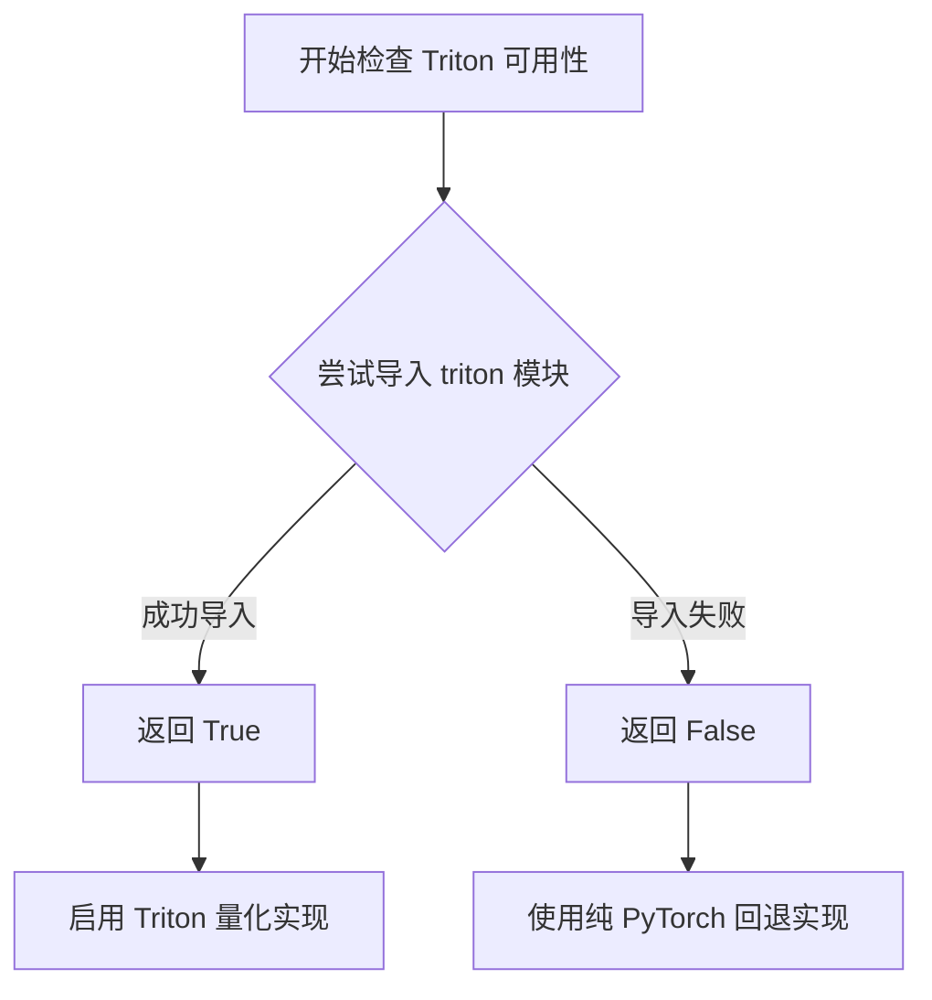
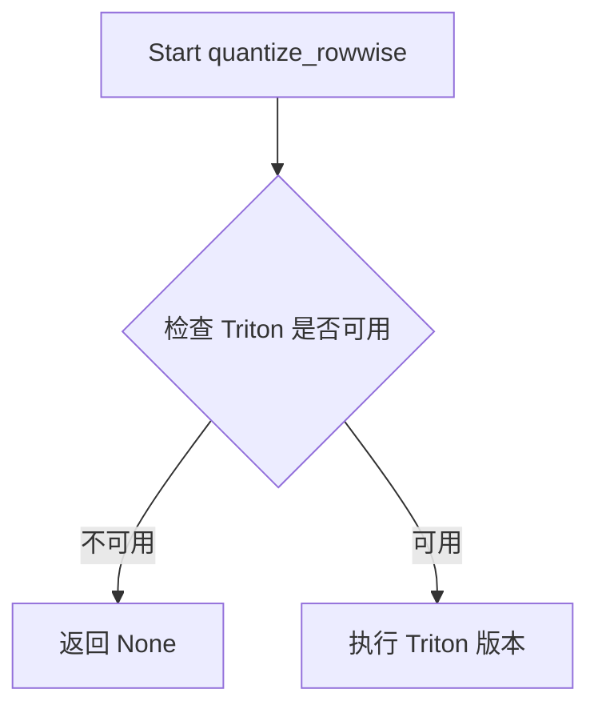

# `bitsandbytes\bitsandbytes\triton\quantize_rowwise.py` 详细设计文档

该代码实现了基于Triton的行级量化（row-wise quantization）功能，将PyTorch浮点张量转换为int8量化张量，同时保留每行的最大值用于反量化。如果Triton不可用，则返回None。

## 整体流程

```mermaid
graph TD
    A[开始] --> B{is_triton_available()?}
    B -- 否 --> C[定义空壳quantize_rowwise函数]
    C --> D[返回None]
    B -- 是 --> E[导入triton和triton.language]
    E --> F[定义_quantize_rowwise Triton内核]
    F --> G[定义quantize_rowwise函数]
    G --> H[创建output和output_maxs空张量]
    H --> I[计算P2 = 2^ceil(log2(列数))]
    I --> J[断言x和output在CUDA上]
    J --> K[计算n_elements]
    K --> L[设置grid = (行数,)]
    L --> M[_launch Triton内核]
    M --> N[返回output和output_maxs]
```

## 类结构

```
模块级: quantize_rowwise.py
├── 条件分支
│   ├── 分支1: Triton不可用 → 空壳函数
│   └── 分支2: Triton可用 → 完整实现
│       ├── _quantize_rowwise (Triton JIT内核)
│       └── quantize_rowwise (Python封装函数)
无类定义，全部为函数式实现
```

## 全局变量及字段


### `math`
    
Python标准数学模块，提供ceil、log2等数学函数

类型：`module`
    


### `torch`
    
PyTorch深度学习库，用于张量操作和GPU计算

类型：`module`
    


### `is_triton_available`
    
bitsandbytes.triton.triton_utils中的函数，用于检查Triton是否可用

类型：`function`
    


### `triton`
    
Triton GPU编译器库，用于编写高效的GPU内核（条件导入，仅在Triton可用时）

类型：`module`
    


### `tl`
    
Triton语言模块的别名，提供Triton特定的语言原语和函数

类型：`module`
    


### `quantize_rowwise`
    
主入口函数，对输入张量按行进行量化，返回量化后的int8张量和每行的最大值

类型：`function`
    


### `_quantize_rowwise`
    
Triton JIT编译的GPU内核函数，执行实际的行级量化计算

类型：`function`
    


### `P2`
    
计算得出的2的幂次方值，用于Triton内核的arange操作

类型：`int`
    


### `n_elements`
    
输出张量的总元素数量

类型：`int`
    


### `output`
    
量化后的int8类型输出张量，与输入形状相同

类型：`torch.Tensor`
    


### `output_maxs`
    
存储每行最大值的float16类型张量，长度等于输入张量的行数

类型：`torch.Tensor`
    


    

## 全局函数及方法


### `is_triton_available`

该函数用于检查当前环境中 Triton 库是否可用，以决定是否启用基于 Triton 的量化操作。

参数：无需参数

返回值：`bool`，返回 `True` 表示 Triton 可用，返回 `False` 表示 Triton 不可用

#### 流程图



#### 带注释源码

```
# 注意：此源码基于代码上下文推断，并非原始实现
def is_triton_available():
    """
    检查 Triton 库是否可用。
    
    通常实现方式可能为：
    1. 尝试导入 triton 模块
    2. 检查 triton 版本是否满足要求
    3. 验证 CUDA 环境是否就绪
    """
    try:
        import triton
        # 可选：检查版本兼容性
        # from packaging import version
        # if version.parse(triton.__version__) < version.parse("2.0.0"):
        #     return False
        return True
    except ImportError:
        return False
```


### `quantize_rowwise` (Triton不可用时的降级版本)

该函数是一个条件定义的降级实现。当检测到系统中未安装Triton时，此函数被调用，其核心功能仅为返回`None`，表示无法执行量化操作。

参数：

-  `x`：`torch.Tensor`，输入的张量（在此版本中实际不会被使用）。

返回值：`None`，表示未执行量化或Triton不可用。

#### 流程图



#### 带注释源码

```python
# 如果 Triton 不可用，定义一个返回 None 的空实现
if not is_triton_available():
    def quantize_rowwise(x: torch.Tensor):
        return None
```

---

### `quantize_rowwise` (Triton 加速的量化实现)

该函数是核心的量化实现，基于Triton编译器和CUDA运行时进行加速。它对输入的二维张量`x`进行**逐行量化 (Row-wise Quantization)**。量化原理是将每行的所有元素除以该行绝对值的最大值（归一化），然后乘以127并四舍五入到最近的整数（int8），从而将浮点数据压缩为int8表示。

参数：

-  `x`：`torch.Tensor`，待量化的输入张量。**必须为2D张量且位于CUDA设备上**。

返回值：`Tuple[torch.Tensor, torch.Tensor]`，返回一个元组，包含：
  - `output`：`torch.Tensor`，量化后的int8张量，形状与输入相同。
  - `output_maxs`：`torch.Tensor`，包含每行最大绝对值的float16张量，形状为 `[rows]`（用于后续反量化）。

#### 流程图

```mermaid
flowchart TD
    A[Start quantize_rowwise] --> B[分配输出张量: output(int8), output_maxs(float16)]
    B --> C[计算 P2: 下一个大于等于列数的 2 的幂]
    C --> D{检查 x 和 output 是否在 CUDA}
    D -- No --> E[抛出 AssertionError]
    D -- Yes --> F[计算 n_elements 和 Grid]
    F --> G[_launch Triton Kernel: _quantize_rowwise]
    G --> H[Kernel: 加载数据块并应用 Mask]
    H --> I[Kernel: 计算绝对值与行最大值 Max]
    I --> J[Kernel: 执行量化公式 llrint127 * x / max]
    J --> K[Kernel: 存储量化结果和最大值]
    K --> L[Return output, output_maxs]
```

#### 带注释源码

```python
# 导入 Triton 相关库
import triton
import triton.language as tl

# -----------------------------------------------------------
# Triton Kernel 定义: _quantize_rowwise
# -----------------------------------------------------------
# 注意: 此内核被装饰器 @triton.autotune 包裹，用于自动调优最佳的 num_stages 和 num_warps 配置
@triton.autotune(
    configs=[
        triton.Config({}, num_stages=1, num_warps=8),
        triton.Config({}, num_stages=2, num_warps=8),
        triton.Config({}, num_stages=4, num_warps=8),
        triton.Config({}, num_stages=8, num_warps=8),
        triton.Config({}, num_stages=1),
        triton.Config({}, num_stages=2),
        triton.Config({}, num_stages=4),
        triton.Config({}, num_warps=1),
        triton.Config({}, num_warps=2),
        triton.Config({}, num_warps=4),
        triton.Config({}, num_warps=8),
    ],
    key=["n_elements"], # 根据元素数量选择配置
)
@triton.jit
def _quantize_rowwise(
    x_ptr,         # 输入张量指针
    output_ptr,    # 输出张量指针
    output_maxs,   # 存储每行最大值的指针
    n_elements,    # 总元素数量
    BLOCK_SIZE: tl.constexpr, # 编译时常量，用于控制块大小
    P2: tl.constexpr,         # 编译时常量，列数的Power of 2 padding值
):
    # 获取当前线程块的ID (对应行号)
    pid = tl.program_id(axis=0)
    
    # 计算当前块的数据偏移量
    block_start = pid * BLOCK_SIZE
    
    # 创建一个 0 到 P2-1 的数组索引
    arange = tl.arange(0, P2)
    offsets = block_start + arange
    
    # 创建掩码，确保不越界 (处理非2的幂次的列宽)
    # 如果 P2 > BLOCK_SIZE (实际列数)，则超出部分掩码为 False
    row_mask = arange < BLOCK_SIZE
    
    # 从全局内存加载数据
    x = tl.load(x_ptr + offsets, mask=row_mask)

    # 1. 计算绝对值
    abs_x = tl.abs(x)
    
    # 2. 找出当前行的最大值 (在有掩码保护下)
    max_val = tl.max(tl.where(row_mask, abs_x, 0), axis=0)
    
    # 3. 量化公式: round(127 * (x / max_val))
    # llrint 执行 round 到最近整数 (rint) 并转为 long (int64/int32)
    output = tl.libdevice.llrint(127.0 * (x / max_val))
    
    # 4. 存储量化后的结果
    tl.store(output_ptr + offsets, output, mask=row_mask)
    
    # 5. 存储该行的最大值到专门的最大值数组中 (用于反量化)
    tl.store(output_maxs + pid, max_val)

# -----------------------------------------------------------
# Python Wrapper 函数: quantize_rowwise
# -----------------------------------------------------------
def quantize_rowwise(x: torch.Tensor):
    # 创建输出张量: int8 类型，形状与 x 相同
    output = torch.empty(*x.shape, device=x.device, dtype=torch.int8)
    
    # 创建最大值张量: float16 类型，形状为 [rows]
    output_maxs = torch.empty(x.shape[0], device=x.device, dtype=torch.float16)

    # 计算 P2 (Power of 2): 找到 >= 列数的最小 2 的幂
    # 例如: 10 -> 16, 1000 -> 1024
    # 这是为了方便 Triton 构建 arange 和 mask
    P2 = int(2 ** (math.ceil(math.log2(x.shape[1]))))

    # 断言检查：必须确保输入和输出都在 CUDA 设备上
    assert x.is_cuda and output.is_cuda
    
    n_elements = output.numel()
    
    # 定义 Triton Grid: 每个行处理一个块
    grid = lambda meta: (x.shape[0],)
    
    # 启动内核
    # BLOCK_SIZE 被设置为实际的列数 x.shape[1]
    _quantize_rowwise[grid](x, output, output_maxs, n_elements, BLOCK_SIZE=x.shape[1], P2=P2)
    
    return output, output_maxs
```


### `_quantize_rowwise`

这是一个Triton JIT编译的内核函数，用于对输入张量按行进行量化操作。它计算每行的最大绝对值，然后将张量元素量化到int8范围（-127到127），同时保存每行的最大值供后续反量化使用。

参数：

- `x_ptr`：`tl.tensor`，输入张量的指针，指向待量化的数据
- `output_ptr`：`tl.tensor`，输出张量的指针，存储量化后的int8数据
- `output_maxs`：`tl.tensor`，存储每行最大绝对值的张量指针
- `n_elements`：`int`，输入张量的总元素数量
- `BLOCK_SIZE`：`tl.constexpr`，Triton编译时常量，每个线程块处理的元素数量
- `P2`：`tl.constexpr`，Triton编译时常量，大于等于BLOCK_SIZE的2的幂次值，用于构造有效偏移

返回值：`None`（Triton内核函数无返回值，通过指针参数输出结果）

#### 流程图

```mermaid
flowchart TD
    A[开始: _quantize_rowwise内核] --> B[获取程序ID pid]
    B --> C[计算块起始位置: block_start = pid * BLOCK_SIZE]
    C --> D[生成偏移量数组: arange = 0到P2-1]
    D --> E[计算实际偏移: offsets = block_start + arange]
    E --> F[创建行掩码: row_mask = arange < BLOCK_SIZE]
    F --> G[从全局内存加载数据: x = tl.load x_ptr + offsets]
    G --> H[计算绝对值: abs_x = tl.abs x]
    H --> I[在有效掩码下求最大值: max_val = tl.max abs_x]
    I --> J[计算量化结果: output = llrint 127 * (x / max_val)]
    J --> K[存储量化结果到输出指针]
    K --> L[存储每行最大值到output_maxs + pid]
    L --> M[结束]
```

#### 带注释源码

```python
@triton.autotune(
    configs=[
        triton.Config({}, num_stages=1, num_warps=8),
        triton.Config({}, num_stages=2, num_warps=8),
        triton.Config({}, num_stages=4, num_warps=8),
        triton.Config({}, num_stages=8, num_warps=8),
        triton.Config({}, num_stages=1),
        triton.Config({}, num_stages=2),
        triton.Config({}, num_stages=4),
        triton.Config({}, num_stages=8),
        triton.Config({}, num_warps=1),
        triton.Config({}, num_warps=2),
        triton.Config({}, num_warps=4),
        triton.Config({}, num_warps=8),
    ],
    key=["n_elements"],
)
@triton.jit
def _quantize_rowwise(
    x_ptr,           # 输入张量指针
    output_ptr,      # 输出张量指针
    output_maxs,     # 存储每行最大值的指针
    n_elements,      # 总元素数量
    BLOCK_SIZE: tl.constexpr,  # 块大小常量
    P2: tl.constexpr,          # 2的幂次常量
):
    """
    Triton JIT内核函数：按行量化
    
    工作原理：
    1. 每个线程块处理一行数据
    2. 计算该行的最大绝对值
    3. 将所有元素缩放到[-127, 127]范围
    4. 存储量化结果和最大值供反量化使用
    """
    # 获取当前程序实例ID（对应行索引）
    pid = tl.program_id(axis=0)
    
    # 计算当前块的数据起始位置
    block_start = pid * BLOCK_SIZE
    
    # 生成0到P2-1的偏移数组，用于加载数据
    arange = tl.arange(0, P2)
    
    # 计算实际内存偏移量
    offsets = block_start + arange
    
    # 创建有效数据掩码（防止越界访问）
    row_mask = arange < BLOCK_SIZE
    
    # 从全局内存加载输入数据，使用掩码处理边界情况
    x = tl.load(x_ptr + offsets, mask=row_mask)
    
    # 计算输入数据的绝对值
    abs_x = tl.abs(x)
    
    # 在有效掩码条件下计算该行最大绝对值
    # tl.where(row_mask, abs_x, 0)确保无效位置不影响max计算
    max_val = tl.max(tl.where(row_mask, abs_x, 0), axis=0)
    
    # 量化公式: output = round(127 * (x / max_val))
    # 使用llrint进行舍入到最近整数
    output = tl.libdevice.llrint(127.0 * (x / max_val))
    
    # 存储量化后的结果到输出指针
    tl.store(output_ptr + offsets, output, mask=row_mask)
    
    # 存储该行的最大值，供后续反量化使用
    tl.store(output_maxs + pid, max_val)
```

---

### `quantize_rowwise`

这是一个Python封装函数，用于调用Triton GPU内核对输入张量进行行级量化。它创建输出张量并调度Triton内核执行量化操作，最终返回量化后的int8张量及每行的最大值。

参数：

- `x`：`torch.Tensor`，输入的二维张量，要求为CUDA张量

返回值：`(torch.Tensor, torch.Tensor)`，返回元组
- `output`：量化后的int8类型张量，形状与输入相同
- `output_maxs`：float16类型的一维张量，长度等于输入张量的行数，存储每行的最大绝对值

#### 流程图

```mermaid
flowchart TD
    A[开始: quantize_rowwise] --> B{检查Triton是否可用}
    B -->|否| C[返回None]
    B -->|是| D[创建输出张量: int8类型]
    D --> E[创建最大值张量: float16类型]
    E --> F[计算P2: 大于列数的最小2的幂]
    F --> G[断言输入为CUDA张量]
    G --> H[计算总元素数]
    H --> I[定义grid lambda函数]
    I --> J[调用Triton内核: _quantize_rowwise[grid]]
    J --> K[返回output和output_maxs]
```

#### 带注释源码

```python
def quantize_rowwise(x: torch.Tensor):
    """
    对输入张量按行进行量化
    
    量化算法：
    1. 对每一行计算最大绝对值max_val
    2. 将该行所有元素映射到[-127, 127]范围: quant = round(127 * x / max_val)
    3. 保存max_val供后续反量化使用
    
    参数:
        x: 输入的二维CUDA张量
        
    返回:
        output: 量化后的int8张量
        output_maxs: 每行的最大绝对值（float16）
    """
    # 创建输出张量，形状与输入相同，int8类型
    output = torch.empty(*x.shape, device=x.device, dtype=torch.int8)
    
    # 创建存储每行最大值的张量，float16类型
    output_maxs = torch.empty(x.shape[0], device=x.device, dtype=torch.float16)
    
    # 计算大于等于列数的最小2的幂次
    # 用于构造有效的tl.arange偏移数组
    P2 = int(2 ** (math.ceil(math.log2(x.shape[1]))))
    
    # 断言确保输入和输出都在CUDA设备上
    assert x.is_cuda and output.is_cuda
    
    # 计算输出张量的总元素数
    n_elements = output.numel()
    
    # 定义grid函数，返回grid维度
    # 这里grid维度等于输入张量的行数，每行由一个线程块处理
    grid = lambda meta: (x.shape[0],)
    
    # 调用Triton内核函数
    # BLOCK_SIZE设置为输入的列数
    # P2用于处理边界情况
    _quantize_rowwise[grid](
        x,              # 输入张量
        output,         # 输出张量
        output_maxs,    # 最大值输出
        n_elements,     # 元素总数
        BLOCK_SIZE=x.shape[1],  # 块大小
        P2=P2           # 2的幂次
    )
    
    # 返回量化结果和每行的最大值
    return output, output_maxs
```

---

### 关键组件信息

| 组件名称 | 描述 |
|---------|------|
| `triton.jit` | Triton的JIT编译装饰器，用于将Python函数编译为CUDA内核 |
| `triton.autotune` | 自动调优装饰器，测试多种配置并选择最优执行参数 |
| `tl.libdevice.llrint` | Triton的libdevice库函数，执行向量化舍入到最近整数 |
| `tl.program_id` | 获取当前线程块的ID，用于确定处理的数据行 |
| `tl.where` | 条件选择函数，类似NumPy的where，用于掩码操作 |

---

### 潜在技术债务与优化空间

1. **BLOCK_SIZE选择**：当前代码将BLOCK_SIZE硬编码为输入列数（`x.shape[1]`），这可能导致小列数时并行度不足，或大列数时共享内存不足。应该根据列数动态选择合适的BLOCK_SIZE。

2. **P2计算开销**：`math.log2`和`math.ceil`在每次调用时都会重新计算，可以考虑缓存或预计算。

3. **断言替代错误处理**：使用`assert`而非正式的异常处理，如果Python以-O标志运行，断言会被跳过。

4. **Triton可用性检查**：顶层有`is_triton_available()`检查，但返回`None`的设计不够优雅，可能导致调用方难以区分真正失败还是正常返回。

5. **缺少输入验证**：未验证输入张量的维度（是否为2D）、dtype等，可能导致运行时难以追踪的错误。

6. **autotune配置**：虽然提供了12种配置组合，但未针对不同规模的输入做特别优化（如小矩阵、大矩阵的不同策略）。

## 关键组件


### 行级量化函数 quantize_rowwise

对输入的二维张量进行行级量化，将浮点张量转换为int8表示，同时保存每行的最大值用于后续反量化。核心量化公式为 output = llrint(127.0 * (x / max_val))，其中max_val为每行的最大绝对值。

### Triton内核 _quantize_rowwise

Triton JIT编译的内核函数，负责在GPU上执行实际的量化操作。通过tl.load加载数据，计算每行的绝对值最大值，然后使用llrint进行四舍五入量化，最后通过tl.store将结果写回内存。

### 块大小自动调优配置

通过triton.autotune装饰器定义了12种不同的配置组合，包括num_stages（1/2/4/8）和num_warps（1/2/4/8）的各种组合，用于根据n_elements自动选择最优的执行配置。

### 量化状态存储

output_maxs - torch.float16类型，存储每行的最大绝对值，用于后续反量化计算；output - torch.int8类型，存储量化后的整数值。

### 边界处理机制

通过row_mask = arange < BLOCK_SIZE创建掩码，处理非完整块的数据加载和存储，确保在张量维度不是块大小整数倍时也能正确运行。

### 计算流程

1. 获取程序ID和块起始位置
2. 计算偏移量并创建掩码
3. 加载数据并进行条件掩码
4. 计算绝对值和行最大值
5. 执行量化公式：llrint(127 * x / max)
6. 存储量化结果和最大值


## 问题及建议


### 已知问题

-   **BLOCK_SIZE设置不当**：使用`BLOCK_SIZE=x.shape[1]`直接作为block size，这会导致每个block处理一整行，实际上是串行处理而非真正的并行化，无法充分利用GPU的并行计算能力
-   **autotune配置冗余**：12个autotune配置中存在大量冗余组合（如`num_stages`和`num_warps`的交叉组合），增加首次运行时的编译开销
-   **P2计算可能浪费资源**：使用`2 ** ceil(log2(n))`计算P2，当维度不是2的幂次时会向上取整，可能导致计算资源浪费
-   **缺少输入验证**：未对输入张量的形状（空张量检查）、数据类型进行验证，也未检查`output_maxs`是否在CUDA上
-   **硬编码量化参数**：量化因子127和最大值数据类型float16被硬编码，缺乏灵活性，可能不适合所有场景
-   **GPU利用率低**：grid配置为`(x.shape[0],)`，每个block处理一行，当batch size较小时会导致GPU SM利用率很低

### 优化建议

-   **优化block size策略**：使用更合理的固定block size（如1024或2048），通过循环处理长行，而非直接使用行维度作为block size
-   **精简autotune配置**：保留关键配置组合（如1/4 stages × 4/8 warps），减少到4-6个核心配置即可
-   **添加输入验证**：增加对空张量、非CUDA张量、不支持的数据类型的检查，并验证`output_maxs`设备一致性
-   **参数化量化配置**：将缩放因子127和最大值数据类型作为可选参数提供，提高通用性
-   **改进并行策略**：考虑将多行合并到同一block处理，或使用更细粒度的并行策略提高GPU利用率

## 其它


### 设计目标与约束

本模块的设计目标是为PyTorch张量提供高效的GPU加速行-wise量化功能，将浮点张量转换为int8表示并保留缩放因子（最大值），以支持后续的量化推理场景。约束条件包括：1）仅支持CUDA设备上的张量量化；2）输入张量维度必须为2D；3）依赖Triton框架进行GPU kernel编译；4）输出形状与输入形状保持一致。

### 错误处理与异常设计

代码中的错误处理主要通过以下方式实现：1）Triton不可用时，quantize_rowwise函数返回None；2）quantize_rowwise函数中包含assert断言检查输入输出张量是否位于CUDA设备上；3）使用mask机制处理边界情况下的内存访问。潜在改进：增加输入形状验证（需为2D）、数据类型检查、device兼容性验证，以及对P2计算结果的边界检查。

### 数据流与状态机

数据流如下：输入PyTorch float16/float32张量 → 计算P2（大于列数的最小2的幂次）→ 分配输出张量（int8）和缩放因子张量（float16）→ 启动Triton grid → Triton kernel执行：加载数据 → 计算绝对值 → 行维度求最大值 → 执行量化公式 (127.0 * x / max_val) → 存储量化结果和最大值。状态机相对简单，主要为"初始化 → GPU计算 → 结果返回"的三状态流程。

### 外部依赖与接口契约

外部依赖包括：1）torch库 - PyTorch张量操作；2）triton框架 - GPU kernel编译与执行；3）bitsandbytes.triton.triton_utils.is_triton_available - Triton可用性检查；4）math库 - 数学运算。接口契约：输入参数x为torch.Tensor类型（需为2D CUDA张量），返回值类型为tuple(torch.Tensor, torch.Tensor)，其中第一个为int8量化结果，第二个为float16的最大值数组。

### 性能考虑与优化空间

当前实现存在以下优化空间：1）BLOCK_SIZE直接使用x.shape[1]而非最优的2的幂次，导致autotuneConfigs中的BLOCK_SIZE优化失效；2）P2计算逻辑可以简化使用next_power_of_2函数；3）autotune的key仅使用n_elements，可考虑增加对输入shape的autotune；4）max_val的类型转换可能引入精度损失；5）可考虑增加对非连续张量的支持（通过contiguous()调用）。性能优势在于使用Triton的JIT编译和autotune机制，可以根据硬件自动调整执行配置。

### 内存管理

内存管理方面：1）使用torch.empty创建未初始化输出张量，避免额外初始化开销；2）输出张量与输入张量使用相同的device；3）Triton kernel内部使用tiled加载策略，通过row_mask控制有效数据边界；4）输出maxs数组大小为x.shape[0]，存储每行的缩放因子。需注意输入张量需为连续内存布局以获得最佳性能。

### 边界条件与输入验证

当前实现的边界条件处理：1）通过P2（2的幂次）和row_mask处理非对齐列数的情况；2）通过BLOCK_SIZE和grid机制处理非对齐行数；3）tl.where(row_mask, abs_x, 0)确保空位置不参与max计算。缺失的输入验证包括：非2D张量检查、device类型检查（is_cuda）、dtype检查、空张量检查等。

### 单元测试与集成测试建议

建议增加的测试用例：1）基本功能测试 - 验证量化输出的数值正确性；2）边界条件测试 - 1列、奇数列、大矩阵等；3）设备测试 - CUDA可用性检查；4）数据类型测试 - float16/float32输入；5）连续性测试 - contiguous vs non-contiguous输入；6）性能基准测试 - 与CPU实现或其他GPU实现的对比；7）autotune稳定性测试 - 多次运行结果一致性。

    