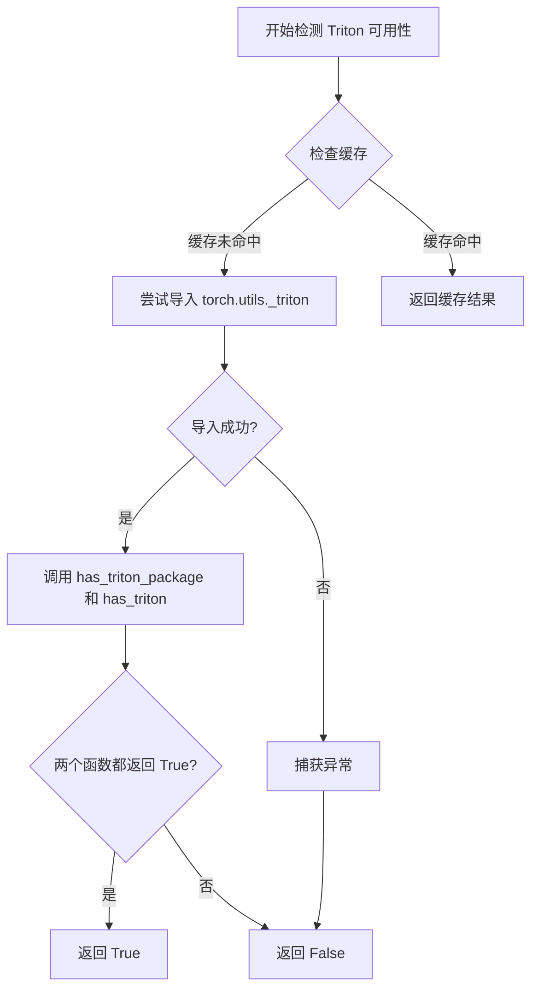
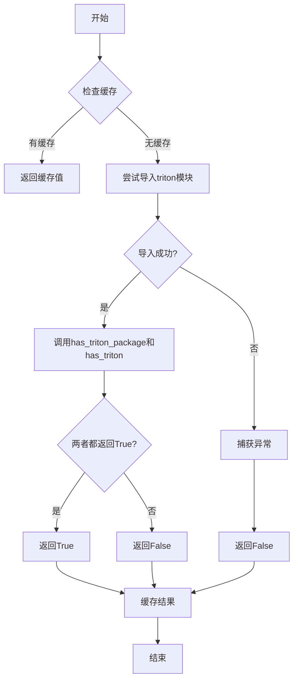

# `bitsandbytes\bitsandbytes\triton\triton_utils.py` 详细设计文档

该代码模块提供了一个用于检测Triton编译器是否可用的工具函数，通过尝试导入PyTorch的Triton相关模块来判断当前环境是否支持Triton，并利用lru_cache缓存检测结果以避免重复检测。

## 整体流程

```mermaid
graph TD
    A[开始 is_triton_available] --> B{导入torch.utils._triton模块}
    B --> C{导入成功?}
    C -- 否 --> D[捕获异常]
    D --> E[返回 False]
    C -- 是 --> F[调用 has_triton_package]
    F --> G[调用 has_triton]
    G --> H[返回 has_triton_package() AND has_triton()]
    E --> I[结束]
    H --> I
```

## 类结构

```
模块: triton_check (无类定义)
```

## 全局变量及字段


### `functools`
    
Python标准库模块，提供函数工具和装饰器

类型：`module`
    


### `is_triton_available`
    
检测Triton是否可用的缓存函数，通过尝试导入torch.utils._triton模块判断Triton环境

类型：`function`
    


    

## 全局函数及方法


### `is_triton_available`

该函数用于检测当前环境中 Triton（PyTorch 的 GPU 编程编译器）是否可用，通过尝试导入 PyTorch 内部的 `_triton` 模块并调用其检测函数来判断，同时使用 LRU 缓存避免重复检测。

参数：

- （无参数）

返回值：`bool`，返回 `True` 表示 Triton 可用，返回 `False` 表示 Triton 不可用或检测过程中发生异常。

#### 流程图



#### 带注释源码

```python
import functools


@functools.lru_cache(None)  # 使用 LRU 缓存装饰器，None 表示无限缓存大小
def is_triton_available():
    """
    检测当前环境中 Triton 是否可用。
    Triton 是 PyTorch 的 GPU 编程编译器，用于优化核函数性能。
    """
    try:
        # 尝试从 PyTorch 内部模块导入 Triton 检测函数
        from torch.utils._triton import has_triton, has_triton_package

        # has_triton_package() 检查 triton 包是否已安装
        # has_triton() 检查 triton 功能是否可用
        # 两个条件都满足时才返回 True
        return has_triton_package() and has_triton()
    except Exception:
        # 如果导入失败或任何检测函数抛出异常，返回 False
        # 这处理了多种情况：triton 未安装、PyTorch 版本不兼容等
        return False
```

## 关键组件


### 核心功能概述
该模块通过`functools.lru_cache`装饰器缓存Triton可用性检测结果，尝试导入torch.utils._triton模块并调用其`has_triton_package()`和`has_triton()`函数判断Triton是否可用，若发生异常则返回False。

### 文件运行流程
1. 模块加载时执行装饰器`@functools.lru_cache(None)`，为函数提供无限缓存能力
2. 调用`is_triton_available()`时，首先尝试从`torch.utils._triton`导入`has_triton`和`has_triton_package`
3. 若导入成功，调用这两个函数并返回它们的与运算结果
4. 若导入或执行过程中发生任何异常，捕获并返回False
5. 首次调用后结果被缓存，后续调用直接返回缓存值

### 全局函数详细信息

**函数名**: is_triton_available
**参数**: 无
**参数类型**: 无
**参数描述**: 无需参数
**返回值类型**: bool
**返回值描述**: 返回Triton是否可用的布尔值
**mermaid流程图**:

**源码**:
```python
@functools.lru_cache(None)
def is_triton_available():
    try:
        from torch.utils._triton import has_triton, has_triton_package
        return has_triton_package() and has_triton()
    except Exception:
        return False
```

### 关键组件信息

### functools.lru_cache装饰器
使用`lru_cache(None)`启用无限大小的LRU缓存，避免重复检测Triton可用性

### torch.utils._triton模块导入
动态导入PyTorch内部模块获取Triton检测函数

### 异常处理机制
捕获所有Exception确保函数始终返回布尔值，提高模块健壮性

### 潜在技术债务与优化空间

### 缓存策略
当前使用`lru_cache(None)`无限缓存，但未提供缓存清除机制，在Triton环境动态变化的场景下可能导致检测结果过时

### 异常处理过于宽泛
捕获所有Exception可能隐藏潜在问题，建议区分导入错误和运行时错误

### 缺少日志记录
异常发生时无日志输出，不利于调试和问题排查

### 其它项目

### 设计目标与约束
- 目标：提供快速且稳定的Triton可用性检测
- 约束：必须兼容Triton不可用的环境

### 错误处理与异常设计
采用静默失败策略，吞掉所有异常并返回False，这种设计避免了因Triton缺失导致的导入错误传播

### 外部依赖与接口契约
- 依赖：torch.utils._triton模块
- 接口契约：返回bool类型，True表示Triton可用，False表示不可用


## 问题及建议


### 已知问题

-   **缓存配置不当**：使用 `lru_cache(None)` 会导致无限大小的缓存，可能造成内存浪费，且如果 Triton 可用性可能动态变化（如运行时加载/卸载），缓存将返回过时结果
-   **异常处理过于宽泛**：使用 `except Exception` 捕获所有异常会隐藏非预期的编程错误，应只捕获特定的导入相关异常
-   **运行时导入开销**：每次调用函数时都会执行导入检查语句，即使有缓存也会产生一定的模块查找开销
-   **缺乏类型注解**：没有参数和返回值的类型提示，降低了代码的可读性和静态分析能力
-   **缺少文档字符串**：没有函数功能说明和返回值描述，不利于后续维护

### 优化建议

-   将 `lru_cache(None)` 改为 `lru_cache(maxsize=1)` 以限制缓存大小，节省内存
-   将导入语句移至函数外部的模块级别执行一次，或使用 `importlib` 延迟导入
-   仅捕获 `ImportError` 或 `ModuleNotFoundError` 等特定异常，而非所有 Exception
-   添加类型注解：`def is_triton_available() -> bool:`
-   添加文档字符串说明函数用途、Triton 是什么以及返回值含义

## 其它


### 设计目标与约束

本代码的核心设计目标是提供一个轻量级的工具函数，用于检测当前Python环境中Triton编译器是否可用。Triton是一个用于编写高效GPU代码的编译器，因此该检测函数主要用于支持需要Triton的PyTorch功能（如某些优化操作）。设计约束包括：必须能够处理Triton未安装的情况、检测结果应被缓存以避免重复导入开销、检测逻辑应足够健壮以应对各种环境配置。

### 错误处理与异常设计

代码采用了try-except包装来捕获所有可能的异常。异常处理策略为静默失败模式：当导入torch.utils._triton失败或其中的函数抛出任何异常时，直接返回False而不抛出错误。这种设计的理由是Triton可用性检测不应影响主程序的运行流程，属于优雅降级策略。异常被统一处理为"不可用"状态，避免了因环境问题导致的程序崩溃。

### 外部依赖与接口契约

本函数依赖两个外部组件：一是Python标准库的functools模块，用于提供lru_cache装饰器；二是PyTorch的内部模块torch.utils._triton。接口契约方面，is_triton_available()函数无需任何参数，返回布尔值True表示Triton可用，返回False表示不可用。调用者应将返回值作为条件判断使用，不应依赖异常机制。

### 性能考虑与优化空间

代码使用了functools.lru_cache(None)装饰器，这会将函数结果永久缓存。性能优势在于避免重复导入torch.utils._triton模块和调用has_triton函数。潜在优化空间包括：可以设置最大缓存数量而非无限缓存；可以考虑添加缓存清除机制以便在运行时动态检测Triton安装变化；当前实现为模块级缓存，如果需要每次导入都重新检测则应移除装饰器。

### 线程安全性分析

functools.lru_cache在Python 3.2+版本中是线程安全的。该函数在多线程环境下的行为是安全的：第一次调用会执行实际检测逻辑并缓存结果，后续并发调用会使用已缓存的值而不会导致竞态条件。然而需要注意的是，一旦缓存生效，即使后续Triton安装状态发生变化（如用户动态安装了Triton），返回的缓存结果也不会更新。

### 可测试性设计

该函数具有较好的可测试性。由于使用了try-except包装，测试重点应包括：验证在Triton可用时返回True、在Triton不可用时返回False、验证缓存机制正常工作（连续调用返回同一对象）、验证异常情况下的正确行为。测试可以通过mock torch.utils._triton模块或移除装饰器后进行。测试覆盖应包括正常路径和异常路径。

### 版本兼容性与环境要求

该代码对Python版本的要求取决于functools.lru_cache的支持（Python 3.2+）。对PyTorch版本的兼容性需要考虑torch.utils._triton模块的存在性，该模块在较新版本的PyTorch中引入。代码没有显式的版本检查机制，如果PyTorch版本过旧可能导致导入失败并被捕获为异常，最终返回False。

    