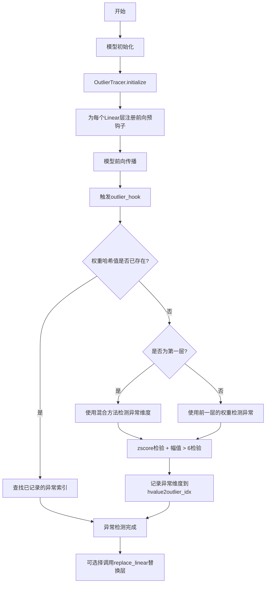
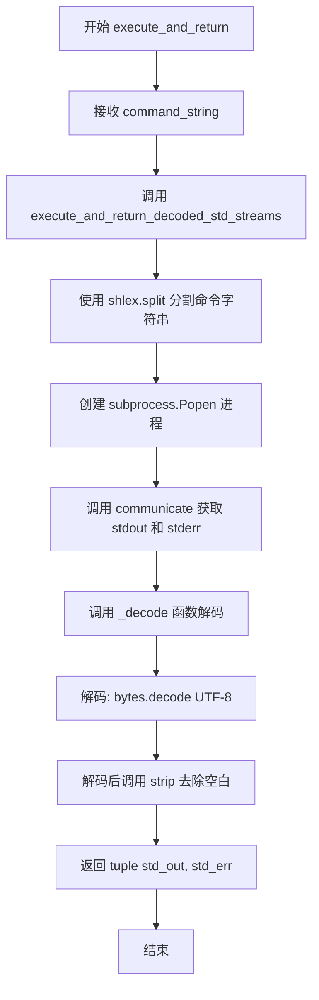
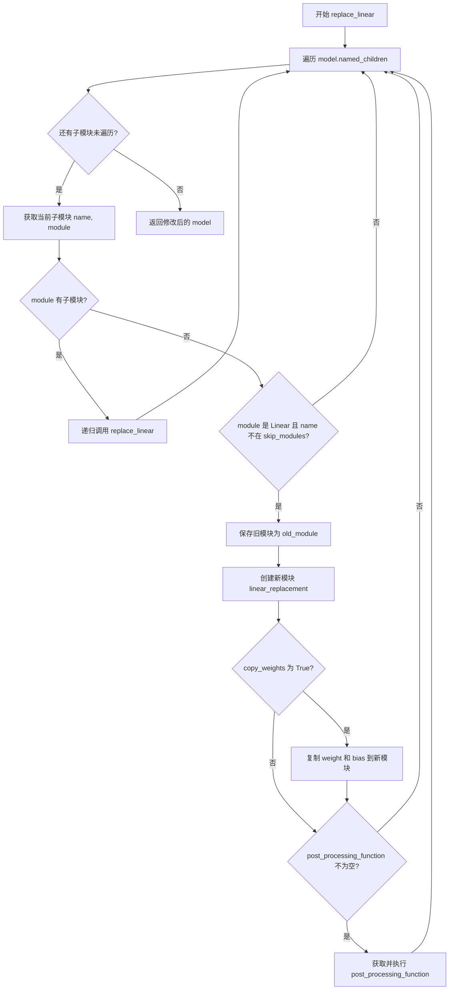
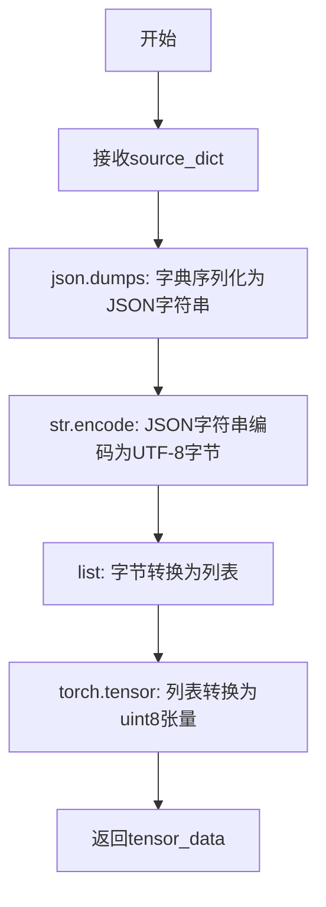
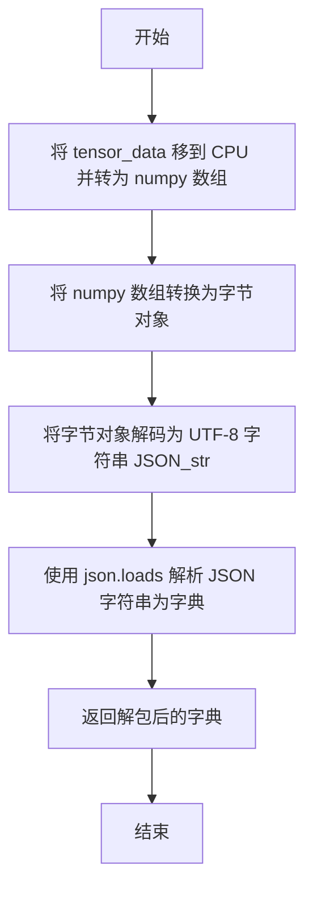
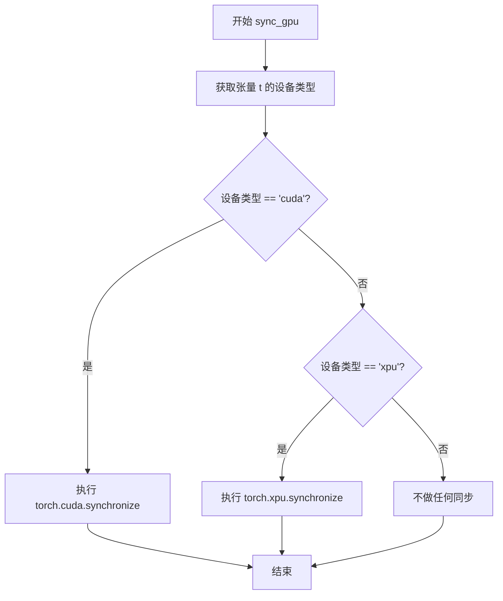
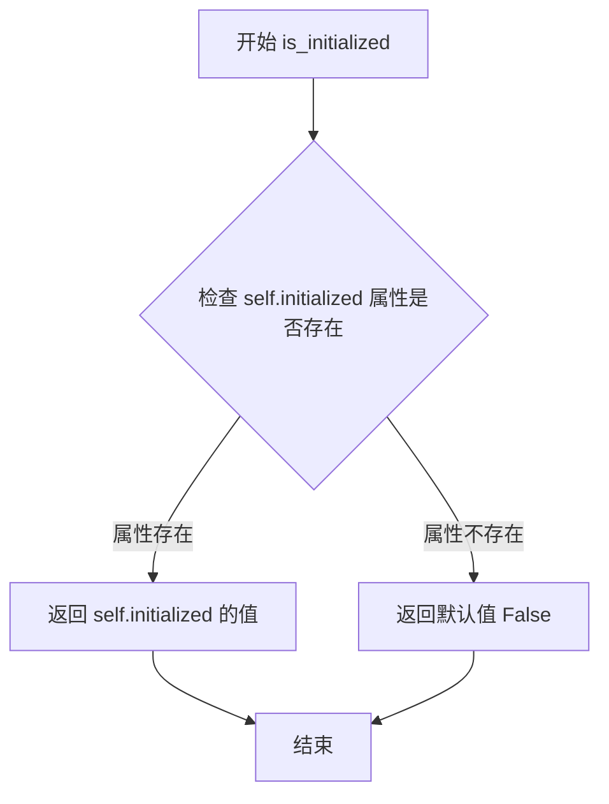
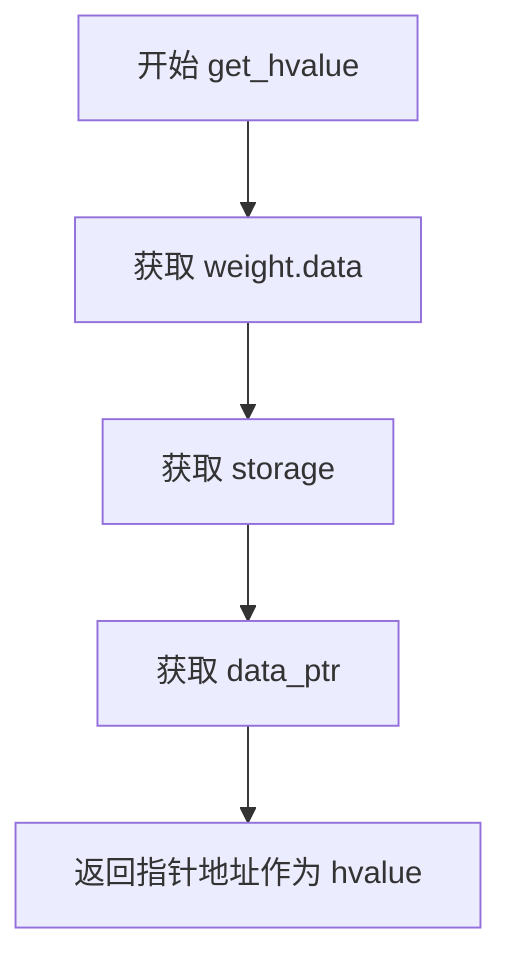

# `bitsandbytes\bitsandbytes\utils.py` 详细设计文档

该代码实现了一个PyTorch模型的异常值(Outlier)检测和线性层替换框架，通过前向钩子追踪神经网络中线性层的异常维度，支持动态替换模型中的Linear层，并提供字典与张量之间的序列化工具函数。

## 整体流程



## 类结构

```
OutlierTracer (单例模式)
├── 字段: last_w, current_outlier_dims, hvalues, outliers, hvalue2outlier_idx, initialized, hooks
└── 方法: initialize, is_initialized, get_hvalue, get_outliers, get_instance

全局函数 (无类归属)
├── outlier_hook (钩子函数)
├── find_outlier_dims (异常维度查找)
├── execute_and_return (命令执行)
├── replace_linear (线性层替换)
├── pack_dict_to_tensor (字典打包)
├── unpack_tensor_to_dict (张量解包)
└── sync_gpu (GPU同步)
```

## 全局变量及字段


### `LINEAR_8BIT_WEIGHTS_FORMAT_MAPPING`
    
线性8位权重格式映射字典，将格式名称映射到整数标识符

类型：`Dict[str, int]`
    


### `INVERSE_LINEAR_8BIT_WEIGHTS_FORMAT_MAPPING`
    
反向线性8位权重格式映射字典，将整数标识符映射回格式名称

类型：`Dict[int, str]`
    


### `OutlierTracer._instance`
    
类变量，单例实例，用于存储OutlierTracer的唯一实例

类型：`Optional[OutlierTracer]`
    


### `OutlierTracer.last_w`
    
上一层的权重数据，用于存储前一个线性层的权重张量

类型：`Optional[torch.Tensor]`
    


### `OutlierTracer.current_outlier_dims`
    
当前异常维度，存储检测到的异常维度索引

类型：`Optional[torch.Tensor]`
    


### `OutlierTracer.hvalues`
    
权重指针列表，存储每个权重矩阵的内存地址指针

类型：`List[int]`
    


### `OutlierTracer.outliers`
    
异常索引列表，存储每层检测到的异常维度索引张量

类型：`List[torch.Tensor]`
    


### `OutlierTracer.hvalue2outlier_idx`
    
哈希值到异常索引的映射，建立权重指针与异常维度的关联

类型：`Dict[int, torch.Tensor]`
    


### `OutlierTracer.initialized`
    
初始化标志，表示OutlierTracer是否已完成初始化

类型：`bool`
    


### `OutlierTracer.hooks`
    
钩子列表，存储注册到模型各层的forward_pre_hook句柄

类型：`List[torch.utils.hooks.RemovableHandle]`
    
    

## 全局函数及方法


### `outlier_hook`

这是一个PyTorch前向预钩子函数，用于检测Linear层的异常维度。它通过获取权重的内存指针作为唯一标识符，结合zscore统计检验和幅值阈值方法识别异常维度，并将结果缓存以供后续层使用。

参数：

- `module`：`torch.nn.Linear`，被钩子注册的PyTorch模块（Linear层）
- `input`：`tuple`，前向传播的输入张量元组

返回值：`None`，该函数作为钩子使用，不返回任何值

#### 流程图

```mermaid
flowchart TD
    A[开始: outlier_hook] --> B{断言module是Linear层}
    B -->|是| C[获取OutlierTracer单例]
    B -->|否| Z[抛出AssertionError]
    C --> D[获取权重的hvalue指针]
    E{hvalue是否在缓存中} -->|否| F[计算当前层权重的异常维度]
    F --> G{已处理层数>1?}
    G -->|是| H[使用前一层发现的异常维度]
    H --> I{异常维度非空}
    I -->|是| J[断言异常维度索引小于输入维度]
    J --> K[缓存hvalue到异常维度映射]
    I -->|否| K
    G -->|否| L[首层处理: 混合检测方法]
    L --> M[(1) zscore检验隐藏层标准差]
    L --> N[(2) 幅值>6检验]
    M --> O[合并两种方法结果]
    O --> K
    E -->|是| P[移除所有钩子]
    P --> Q[结束]
    K --> Q
```

#### 带注释源码

```python
def outlier_hook(module, input):
    """
    PyTorch前向预钩子函数，检测Linear层的异常维度
    
    工作原理：
    1. 使用权重数据的内存指针作为层的唯一标识符
    2. 对于首层：结合zscore统计检验和幅值阈值检测异常
    3. 对于后续层：复用前一层的异常维度结果
    4. 检测到的异常维度会被缓存，避免重复计算
    """
    # 断言确保该钩子只应用于Linear层
    assert isinstance(module, torch.nn.Linear)
    
    # 获取OutlierTracer单例（全局状态管理器）
    tracer = OutlierTracer.get_instance()
    
    # 获取权重的内存指针作为唯一标识符
    hvalue = tracer.get_hvalue(module.weight)
    
    # 如果该层的异常维度尚未被检测/缓存
    if hvalue not in tracer.hvalue2outlier_idx:
        # 使用权重数据检测异常维度（基于标准差统计）
        outlier_idx = find_outlier_dims(module.weight)
        
        # 保存当前层的异常维度和标识符
        tracer.outliers.append(outlier_idx)
        tracer.hvalues.append(hvalue)
        
        # 判断是否为第一个被处理的层
        if len(tracer.outliers) > 1:
            # 非首层：复用前一层发现的异常维度
            # （假设相邻线性层共享相同的异常维度模式）
            if tracer.outliers[-1].numel() > 0:
                # 验证异常维度索引不超过输入维度
                assert tracer.outliers[-1].max() < module.weight.shape[1]
            
            # 将前一层的结果映射到当前层
            tracer.hvalue2outlier_idx[hvalue] = tracer.outliers[-1]
        
        else:
            # 首层特殊处理：使用混合检测方法
            # (1) zscore检验 + (2) 幅值阈值检验
            
            # 将输入展平以便分析（保留最后一维作为隐藏维度）
            merged = input[0].view(-1, input[0].shape[-1])
            
            # (1) 对隐藏维度标准差进行zscore检验（阈值3）
            outlier_idx = find_outlier_dims(merged, reduction_dim=1, zscore=3)
            
            # (2) 幅值大于6的维度检验
            dims = (torch.abs(input[0]) > 6).sum(
                dim=list(range(len(input[0].shape) - 1))
            )
            outlier_idx2 = torch.where(dims > 0)[0]
            
            # 合并两种方法的结果并去重
            outlier_idx = torch.cat([outlier_idx, outlier_idx2]).unique()
            
            # 缓存首层的检测结果
            tracer.hvalue2outlier_idx[hvalue] = outlier_idx
    else:
        # 该层已有缓存结果，移除所有钩子避免重复执行
        # （优化：只执行一次完整检测）
        for hook in tracer.hooks:
            hook.remove()
```


### `find_outlier_dims`

该函数通过计算输入张量在指定维度上的标准差，并利用 Z-score（标准分数）统计方法识别出统计特性异常的维度（即标准差显著偏离平均水平的维度）。它支持随机模式（用于测试）、Top-K 模式（选取方差最大的维度）以及标准的 Z-score 阈值模式。

参数：

- `weight`：`torch.Tensor`，输入的张量，通常是模型的权重矩阵（weight）。
- `reduction_dim`：`int`，可选，默认为 0。计算标准差时 reduction 的维度。
- `zscore`：`float`，可选，默认为 4.0。Z-score 阈值，用于判定维度是否为异常值。
- `topk`：`int` 或 `None`，可选，默认为 `None`。如果指定了该值，函数将忽略 zscore 阈值，转而返回标准差绝对值最大的 topk 个维度索引。
- `rdm`：`bool`，可选，默认为 `False`。如果为 `True`，则忽略所有统计计算，随机返回指定数量的维度索引（通常用于 Debug 或对照实验）。

返回值：`torch.Tensor`，返回一维张量，包含检测到的异常维度的索引。

#### 流程图

```mermaid
flowchart TD
    A([开始 find_outlier_dims]) --> B{rdm == True?}
    B -- 是 --> C[生成随机维度索引]
    C --> D([返回随机索引])
    
    B -- 否 --> E[计算输入张量在 reduction_dim 上的标准差 std]
    E --> F[计算 std 的均值 stdm 和标准差 stdstd]
    F --> G[计算 Z-Score: zstd = (std - stdm) / stdstd]
    
    G --> H{topk is not None?}
    H -- 是 --> I[使用 torch.topk 选取 std 绝对值最大的 topk 个索引]
    I --> D
    
    H -- 否 --> J[使用 torch.where 选取 zstd > zscore 的索引]
    J --> D
```

#### 带注释源码

```python
def find_outlier_dims(weight, reduction_dim=0, zscore=4.0, topk=None, rdm=False):
    """
    根据标准差和zscore查找异常维度
    
    参数:
        weight: 输入权重张量
        reduction_dim: 计算std的维度
        zscore: 异常判定阈值
        topk: 如果设置，则返回std最大的前k个维度
        rdm: 随机模式
    返回:
        异常维度的索引
    """
    # 如果处于随机模式，直接返回随机索引，常用于Debug或对比实验
    if rdm:
        return torch.randint(0, weight.shape[1], size=(topk,), device=weight.device).long()

    # 1. 计算指定维度上的标准差 (std)
    std = weight.std(reduction_dim)
    
    # 2. 计算这些标准差的均值和标准差，用于后续的Z-Score归一化
    stdm = std.mean()
    stdstd = std.std()

    # 3. 计算Z-Score：表示当前维度的标准差偏离平均标准差的程度（以标准差为单位）
    zstd = (std - stdm) / stdstd

    # 4. 根据条件选择输出索引
    if topk is not None:
        # 模式A：Top-K 模式，忽略阈值，直接选取波动性最大的 K 个维度
        _, idx = torch.topk(std.abs(), k=topk, dim=0)
    else:
        # 模式B：Z-Score 模式，选取偏离程度超过阈值的维度
        idx = torch.where(zstd > zscore)[0]

    return idx
```


### `execute_and_return`

该函数用于执行传入的shell命令字符串，通过subprocess模块启动子进程并捕获其标准输出（stdout）和标准错误（stderr），将字节流解码为UTF-8格式的字符串后以元组形式返回。

参数：

- `command_string`：`str`，要执行的shell命令字符串

返回值：`tuple[str, str]`，返回包含标准输出和标准错误的元组，第一个元素为标准输出字符串，第二个元素为标准错误字符串

#### 流程图



#### 带注释源码

```python
def execute_and_return(command_string: str) -> tuple[str, str]:
    """
    执行shell命令并返回标准输出和标准错误
    
    Parameters:
        command_string (str): 要执行的shell命令字符串
        
    Returns:
        tuple[str, str]: (标准输出, 标准错误)
    """
    
    def _decode(subprocess_err_out_tuple):
        """
        内部函数：将子进程的输出和错误字节元组解码为字符串
        
        Parameters:
            subprocess_err_out_tuple: subprocess.communicate()返回的(stdout, stderr)字节元组
            
        Returns:
            tuple: 解码并strip后的(stdout, stderr)字符串元组
        """
        return tuple(to_decode.decode("UTF-8").strip() for to_decode in subprocess_err_out_tuple)

    def execute_and_return_decoded_std_streams(command_string):
        """
        内部函数：执行命令并解码标准输出和标准错误流
        
        Parameters:
            command_string: 要执行的命令字符串
            
        Returns:
            tuple: 解码后的(stdout, stderr)字符串
        """
        return _decode(
            subprocess.Popen(
                shlex.split(command_string),  # 使用shlex安全地分割命令字符串
                stdout=subprocess.PIPE,       # 捕获标准输出管道
                stderr=subprocess.PIPE,       # 捕获标准错误管道
            ).communicate(),                  # 等待进程完成并获取输出
        )

    # 执行命令并获取解码后的标准输出和标准错误
    std_out, std_err = execute_and_return_decoded_std_streams(command_string)
    return std_out, std_err
```


### `replace_linear`

该函数通过递归遍历模型的所有子模块，将指定的全连接层（`torch.nn.Linear`）替换为用户自定义的线性层实现，同时支持权重复制和替换后的自定义处理逻辑。

参数：

- `model`：`torch.nn.Module`，输入的 PyTorch 模型，将在该模型上执行线性层的替换操作
- `linear_replacement`：`torch.nn.Module`，用于替换旧线性层的新模块类，应接受 `in_features`、`out_features` 和 `bias` 参数构造
- `skip_modules`：`tuple[str]`，可选，默认为 `("lm_head",)`，指定哪些名称的模块不进行替换，通常用于保留原始输出层
- `copy_weights`：`bool`，可选，默认为 `False`，是否将原始线性层的权重和偏置复制到新的线性层中
- `post_processing_function`：`str | None`，可选，默认为 `None`，替换完成后要调用的原始模块的方法名称

返回值：`torch.nn.Module`，替换完成后的模型对象

#### 流程图



#### 带注释源码

```python
def replace_linear(
    model,
    linear_replacement,
    skip_modules=("lm_head",),
    copy_weights=False,
    post_processing_function=None,
):
    """
    Replace linear modules with a new Linear module.
    Parameters:
        model (`torch.nn.Module`):
            Input model or `torch.nn.Module` as the function is run recursively.
        linear_replacement (`torch.nn.Module`):
            The linear module that replaces the old one. Only expects standard arguments.
            If other arguments need to be passed, use a lambda.
        skip_modules (`List[str]`, *optional*, defaults to `lm_head`):
            List of modules names not to convert. Defaults to `lm_head`.
        copy_weights (`bool`):
            Copy the weights from the old linear module to the new one
        post_processing_function (`str`):
            A function name of the replacement linear class that is called
            after processing.
    """
    # 遍历模型的所有直接子模块（名称-模块对）
    for name, module in model.named_children():
        # 如果当前模块还包含子模块（不是叶子节点），递归处理
        if len(list(module.children())) > 0:
            replace_linear(module, linear_replacement, skip_modules, copy_weights, post_processing_function)

        # 判断当前模块是否为 Linear 层且不在跳过列表中
        if isinstance(module, torch.nn.Linear) and name not in skip_modules:
            # 保存原始模块的引用，以便复制权重
            old_module = model._modules[name]
            # 使用新的线性层替换原始模块
            # 传递原始模块的输入维度、输出维度和偏置是否存在的标志
            model._modules[name] = linear_replacement(
                module.in_features,
                module.out_features,
                module.bias is not None,
            )
            # 如果需要复制权重，将原始线性层的 weight 和 bias 复制到新模块
            if copy_weights:
                model._modules[name].weight = old_module.weight
                model._modules[name].bias = old_module.bias

            # 如果指定了后处理函数，在原始模块上调用该函数
            if post_processing_function is not None:
                # 获取原始模块上的后处理函数（如果有）
                func = getattr(module, post_processing_function, None)
                # 如果函数存在，则执行它
                if func is not None:
                    func(module)
    # 返回修改后的模型
    return model
```


### `pack_dict_to_tensor`

将Python字典序列化为JSON字符串，再编码为UTF-8字节序列，最后转换为torch张量，用于将字典数据存储到模型的state_dict中。

参数：

- `source_dict`：`dict`，需要进行打包的字典对象

返回值：`torch.Tensor`，包含打包后数据的uint8类型张量

#### 流程图



#### 带注释源码

```python
def pack_dict_to_tensor(source_dict):
    """
    Pack a dictionary into a torch tensor for storing quant_state items in state_dict.

    Parameters:
    - source_dict: The dictionary to be packed.

    Returns:
    A torch tensor containing the packed data.
    """
    # 步骤1: 使用json.dumps将Python字典序列化为JSON字符串
    json_str = json.dumps(source_dict)
    
    # 步骤2: 使用encode将JSON字符串编码为UTF-8字节序列
    json_bytes = json_str.encode("utf-8")
    
    # 步骤3: 将字节序列转换为列表，再转换为torch uint8张量
    tensor_data = torch.tensor(list(json_bytes), dtype=torch.uint8)

    # 返回打包后的张量，可用于存储到state_dict中
    return tensor_data
```


### `unpack_tensor_to_dict`

将序列化为 torch 张量的字典数据反序列化为原始的 Python 字典对象。该函数是 `pack_dict_to_tensor` 的逆操作，通过将张量转换为字节数组，再解码为 UTF-8 字符串，最后解析 JSON 来恢复原始字典结构。

参数：

-  `tensor_data`：`torch.Tensor`，包含序列化字典数据的 torch 张量（通常由 `pack_dict_to_tensor` 生成）

返回值：`dict`，反序列化后的 Python 字典

#### 流程图



#### 带注释源码

```
def unpack_tensor_to_dict(tensor_data):
    """
    Unpack a torch tensor into a Python dictionary.

    Parameters:
    - tensor_data: The torch tensor containing the packed data.

    Returns:
    A Python dictionary containing the unpacked data.
    """
    # 将张量数据转移到 CPU 并转换为 numpy 数组
    # 这是因为 tensor 的存储可能在不同设备上（GPU/XPU），需要统一到 CPU 进行处理
    json_bytes = bytes(tensor_data.cpu().numpy())
    
    # 将字节对象解码为 UTF-8 编码的字符串
    # 此时字符串内容为 JSON 格式
    json_str = json_bytes.decode("utf-8")
    
    # 使用 json.loads 将 JSON 字符串解析为 Python 字典
    unpacked_dict = json.loads(json_str)

    return unpacked_dict
```


### `sync_gpu`

同步 CUDA 或 XPU 设备，确保在指定设备上的所有操作已完成。

参数：

- `t`：`torch.Tensor`，需要同步的 PyTorch 张量，根据其所在设备类型执行对应的同步操作

返回值：`None`，无返回值，仅执行设备同步操作

#### 流程图



#### 带注释源码

```python
def sync_gpu(t: torch.Tensor):
    """
    同步 CUDA 或 XPU 设备，确保该张量上的所有 GPU 操作已完成。
    
    参数:
        t: torch.Tensor - 需要同步的 PyTorch 张量
        
    返回值:
        None - 无返回值
    """
    # 检查张量所在的设备类型
    if t.device.type == "cuda":
        # 如果是 CUDA 设备，执行 CUDA 同步操作
        # 确保所有 CUDA 流上的操作都已完成
        torch.cuda.synchronize()
    elif t.device.type == "xpu":
        # 如果是 XPU (Intel GPU) 设备，执行 XPU 同步操作
        # 确保所有 XPU 流上的操作都已完成
        torch.xpu.synchronize()
    # 对于其他设备类型（如 CPU），不做任何同步操作
```


### `OutlierTracer.__init__`

该方法是 OutlierTracer 类的构造函数，用于初始化单例实例。由于该类采用单例模式设计，此方法被重写为始终抛出 RuntimeError，强制调用者通过 `get_instance()` 方法获取实例，而不是直接创建新实例。

参数：

- `self`：`OutlierTracer`，调用此方法时自动传入的实例对象本身

返回值：`None`，不返回任何值，总是抛出 RuntimeError 异常以阻止直接实例化

#### 流程图

```mermaid
flowchart TD
    A[开始 __init__] --> B[抛出 RuntimeError 异常: Call get_instance() instead]
    B --> C[异常被调用者捕获或导致程序终止]
    
    style A fill:#f9f,stroke:#333
    style B fill:#ff6b6b,stroke:#333
    style C fill:#ffa,stroke:#333
```

#### 带注释源码

```python
def __init__(self):
    """
    OutlierTracer 类的构造函数。
    
    由于该类采用单例模式（Singleton Pattern），此方法被重写为始终抛出 RuntimeError，
    强制调用者通过类方法 get_instance() 获取唯一的实例，而不是创建新的实例。
    
    这防止了直接调用 __init__ 实例化类，确保整个程序生命周期内只有一个 OutlierTracer 实例存在。
    """
    raise RuntimeError("Call get_instance() instead")
```


### `OutlierTracer.initialize`

该方法用于初始化 OutlierTracer 单例实例，遍历模型中所有 Linear 层并为每个层注册前向预钩子（forward pre-hook），以便在模型运行时检测异常值维度。

参数：

- `model`：`torch.nn.Module`，需要进行异常值追踪的 PyTorch 模型

返回值：`None`，该方法无返回值，仅执行初始化操作

#### 流程图

```mermaid
flowchart TD
    A[开始 initialize] --> B[初始化实例变量]
    B --> C[last_w = None]
    C --> D[current_outlier_dims = None]
    D --> E[hvalues = []]
    E --> F[outliers = []]
    F --> G[hvalue2outlier_idx = {}]
    G --> H[initialized = True]
    H --> I[hooks = []]
    I --> J[遍历 model.named_modules]
    J --> K{当前模块是否为 Linear 层?}
    K -->|是| L[注册 forward_pre_hook]
    L --> M[将 hook 添加到 hooks 列表]
    M --> N[继续遍历下一个模块]
    K -->|否| N
    N --> O{还有更多模块?}
    O -->|是| J
    O -->|否| P[结束 initialize]
```

#### 带注释源码

```python
def initialize(self, model):
    """
    初始化 OutlierTracer 实例。
    
    该方法执行以下操作：
    1. 初始化各种实例变量用于存储异常值追踪状态
    2. 遍历模型中所有模块，找出所有 Linear 层
    3. 为每个 Linear 层注册前向预钩子，以便在前向传播前检测异常值
    
    参数:
        model (torch.nn.Module): 需要进行异常值追踪的 PyTorch 模型
        
    返回值:
        None
    """
    # 存储上一个线性层的权重（当前未使用，保留用于未来扩展）
    self.last_w = None
    # 存储当前层的异常值维度
    self.current_outlier_dims = None
    # 存储所有层的哈希值（权重指针）
    self.hvalues = []
    # 存储所有层的异常值索引
    self.outliers = []
    # 哈希值到异常值索引的映射字典
    self.hvalue2outlier_idx = {}
    # 标记初始化完成
    self.initialized = True
    # 存储所有注册的前向预钩子，用于后续移除
    
    # 遍历模型的所有命名模块
    for n, m in model.named_modules():
        # 检查当前模块是否是线性层
        if isinstance(m, torch.nn.Linear):
            # 为该线性层注册前向预钩子，钩子函数为 outlier_hook
            # 这样在每个线性层前向传播之前都会调用 outlier_hook
            self.hooks.append(m.register_forward_pre_hook(outlier_hook))
```


### `OutlierTracer.is_initialized`

该方法用于检查 OutlierTracer 单例是否已通过 initialize 方法完成初始化，返回布尔值表示初始化状态。

参数：
- 无（仅包含隐式 self 参数）

返回值：`bool`，返回 True 表示已初始化，返回 False 表示未初始化

#### 流程图



#### 带注释源码

```
def is_initialized(self):
    """
    检查 OutlierTracer 是否已初始化。
    
    该方法通过安全地获取实例的 initialized 属性来判断是否已完成初始化。
    使用 getattr 而不是直接访问属性，可以避免 AttributeError 当属性不存在时。
    
    Returns:
        bool: 如果已初始化返回 True，否则返回 False
    """
    # 使用 getattr 安全获取 initialized 属性，
    # 如果属性不存在则返回默认值 False
    return getattr(self, "initialized", False)
```


### `OutlierTracer.get_hvalue`

该方法用于获取给定权重张量的数据指针，作为该权重张量的唯一标识符，以便在后续操作中快速识别和查找对应的异常维度信息。

参数：

- `weight`：`torch.Tensor`，输入的权重张量，通常来自 `torch.nn.Linear` 层的权重

返回值：`int`，返回权重张量的数据存储指针地址，作为该权重的唯一哈希值标识

#### 流程图



#### 带注释源码

```python
def get_hvalue(self, weight):
    """
    获取权重张量的数据指针作为唯一标识符
    
    参数:
        weight: torch.Tensor - 权重张量
        
    返回:
        int - 权重数据存储的内存地址
    """
    # 访问权重张量的底层数据存储，并获取其指针地址
    # 这个指针地址在整个模型生命周期内保持稳定，可用作唯一标识
    return weight.data.storage().data_ptr()
```

---

## 补充上下文信息

### 1. 类 `OutlierTracer` 整体描述

`OutlierTracer` 是一个单例类，用于追踪神经网络中线性层的异常维度（outlier dimensions）。它通过在模型的前向传播前注册钩子（hook）来检测哪些隐藏维度可能存在异常值，以便后续进行量化或其他处理。

### 2. 类字段信息

| 字段名称 | 类型 | 描述 |
|---------|------|------|
| `_instance` | `OutlierTracer` | 单例实例 |
| `last_w` | `torch.Tensor` | 上一层的权重张量（当前未使用） |
| `current_outlier_dims` | `torch.Tensor` | 当前层的异常维度 |
| `hvalues` | `list` | 所有已处理权重的hvalue列表 |
| `outliers` | `list` | 所有已发现异常维度列表 |
| `hvalue2outlier_idx` | `dict` | hvalue到异常维度的映射字典 |
| `initialized` | `bool` | 初始化标志 |
| `hooks` | `list` | 注册的前向传播前钩子列表 |

### 3. 关键组件信息

| 组件名称 | 描述 |
|---------|------|
| `outlier_hook` | 神经网络前向传播前钩子，检测每一层的异常维度 |
| `find_outlier_dims` | 基于zscore或topk方法查找异常维度 |
| `get_hvalue` | 获取权重张量的唯一标识符 |
| `get_outliers` | 根据权重获取已存储的异常维度 |

### 4. 技术债务与优化空间

1. **未使用的字段**：`last_w` 和 `current_outlier_dims` 在代码中定义但未被使用，可能造成代码冗余
2. **硬编码阈值**：zscore=3 和 magnitude>6 的阈值硬编码在 `outlier_hook` 中，应作为参数可配置
3. **单例模式实现**：使用 `__new__` 实现单例，但 `__init__` 被禁用后手动调用 `initialize()`，语义不够清晰
4. **错误处理**：异常检测逻辑复杂，first layer 和后续层的处理逻辑差异大，可考虑重构为更统一的策略模式

### 5. 数据流与状态机

```
初始化 → 注册Hook → 前向传播触发Hook 
                            ↓
                    获取hvalue → 检查是否已存在
                            ↓
                    是 → 移除Hook / 否 → 执行异常检测
                            ↓
                    存储hvalue与outlier_idx映射
```

### 6. 外部依赖

- `torch`：核心张量操作库
- `json`、`shlex`、`subprocess`：辅助工具函数，与本方法无直接关联


### `OutlierTracer.get_outliers`

该方法用于根据权重张量的内存地址（hvalue）查询预计算的异常维度索引。如果 OutlierTracer 已初始化且该权重之前已被处理过，则返回对应的异常维度索引；否则返回 None。

参数：

- `weight`：`torch.Tensor`，要查询的线性层权重张量

返回值：`Optional[torch.Tensor]`，如果找到对应的异常维度索引则返回该张量，否则返回 None

#### 流程图

```mermaid
flowchart TD
    A[开始 get_outliers] --> B{is_initialized?}
    B -->|否| C[打印警告信息]
    C --> D[return None]
    B -->|是| E[获取 hvalue = get_hvalue(weight)]
    E --> F{hvalue in hvalue2outlier_idx?}
    F -->|是| G[return hvalue2outlier_idx[hvalue]]
    F -->|否| H[return None]
```

#### 带注释源码

```python
def get_outliers(self, weight):
    """
    根据权重张量查询已检测的异常维度索引。
    
    参数:
        weight: torch.Tensor - 线性层的权重张量
        
    返回:
        Optional[torch.Tensor] - 异常维度索引，如果未找到则返回 None
    """
    # 检查 OutlierTracer 是否已通过 initialize 方法初始化
    if not self.is_initialized():
        print("Outlier tracer is not initialized...")
        return None
    
    # 获取权重张量的唯一标识符（内存地址指针）
    hvalue = self.get_hvalue(weight)
    
    # 判断该权重是否已有对应的异常维度记录
    if hvalue in self.hvalue2outlier_idx:
        # 返回预先计算的异常维度索引
        return self.hvalue2outlier_idx[hvalue]
    else:
        # 该权重尚未被处理，返回 None
        return None
```


### `OutlierTracer.get_instance`

获取OutlierTracer类的单例实例，如果实例不存在则创建它。

参数：

- 无显式参数（隐式参数`cls`为类本身）

返回值：`OutlierTracer`，返回OutlierTracer的单例实例

#### 流程图

```mermaid
flowchart TD
    A[开始 get_instance] --> B{cls._instance is None?}
    B -->|是| C[创建新实例: cls._instance = cls.__new__(cls)]
    B -->|否| D[跳过创建]
    C --> E[返回 cls._instance]
    D --> E
```

#### 带注释源码

```python
@classmethod
def get_instance(cls):
    """
    获取OutlierTracer类的单例实例。
    使用单例模式确保全局只有一个OutlierTracer实例。
    
    Returns:
        OutlierTracer: 单例实例
    """
    if cls._instance is None:
        # 如果实例不存在，使用__new__创建新实例
        # 注意：这里不会调用__init__，因为__init__会抛出RuntimeError
        cls._instance = cls.__new__(cls)
    return cls._instance
```

## 关键组件


### OutlierTracer（异常值追踪器）

核心的单例类，用于在模型前向传播过程中检测和追踪Linear层的异常值维度。通过注册forward_pre_hook实现惰性加载，只有在首次遇到新权重时才执行异常检测，并将结果缓存到hvalue2outlier_idx字典中供后续查询。

### find_outlier_dims（异常维度检测）

使用z-score统计方法检测权重张量中的异常维度。支持两种模式：基于标准差z-score的异常检测（默认）和基于topk的维度选择。可选地支持随机模式（rdm）用于测试目的。

### replace_linear（线性层替换）

递归遍历模型结构，将指定的Linear层替换为自定义的linear_replacement。支持跳过特定模块（如lm_head）、权重复制以及后处理函数调用。用于实现量化层替换等场景。

### pack_dict_to_tensor / unpack_tensor_to_dict（字典与张量互转）

将Python字典序列化为JSON，然后转换为torch张量（用于state_dict存储），以及反向解析还原字典。用于存储量化状态等复杂数据结构。

### OutlierHook（异常值检测钩子）

注册在每个Linear层的前向传播前的钩子函数。首次遇到新权重时调用find_outlier_dims进行异常检测，使用z-score和 magnitude > 6 两种策略。对于首层使用输入数据检测，后续层复用前一层的异常索引。

### execute_and_return（命令执行）

安全地执行shell命令并返回标准输出和标准错误。使用shlex.split进行命令解析，通过subprocess.Popen和communicate()获取结果，支持UTF-8解码。

### sync_gpu（GPU同步）

跨平台的GPU同步函数，支持CUDA和XPU设备。确保GPU操作完成后才继续执行，用于需要精确时序控制的场景。

### LINEAR_8BIT_WEIGHTS_FORMAT_MAPPING（8位线性权重格式映射）

定义8位量化权重存储格式的枚举映射，包含row、col32、col_turing、col_ampere四种格式及其对应的整数值。


## 问题及建议


### 已知问题

- **单例模式实现不完整**：OutlierTracer 使用单例模式，但 `_instance` 在 `get_instance()` 中创建后没有自动调用 `initialize()` 方法，导致实例可能处于未初始化状态，使用 `is_initialized()` 检查只是打印信息而非抛出异常
- **异常处理缺失**：多个函数（如 `get_outliers`、`execute_and_return`、`replace_linear`）缺少异常处理机制，JSON 编解码过程没有捕获可能的异常
- **Hook 管理逻辑问题**：在 `outlier_hook` 的 `else` 分支中遍历 `tracer.hooks` 并调用 `hook.remove()`，但这个逻辑会导致在非首次 layer 时移除所有 hook，可能影响后续层的检测
- **私有属性直接访问**：`replace_linear` 函数使用 `model._modules[name]` 直接访问 PyTorch 的私有属性，这种做法不稳定且不符合封装原则
- **设备同步不全面**：`sync_gpu` 函数仅支持 cuda 和 xpu 设备，对其他设备类型（如 mps、cpu）未做处理或提示
- **未使用的全局常量**：`LINEAR_8BIT_WEIGHTS_FORMAT_MAPPING` 和 `INVERSE_LINEAR_8BIT_WEIGHTS_FORMAT_MAPPING` 定义后未被任何代码使用
- **类型注解不完整**：`execute_and_return` 内部函数 `execute_and_return_decoded_std_streams` 缺少类型注解，`replace_linear` 的返回值类型未标注
- **函数嵌套过深**：`execute_and_return` 包含两层嵌套函数定义，降低了代码可读性和可维护性

### 优化建议

- 重构单例模式，在 `get_instance()` 中添加自动初始化逻辑或确保使用前显式调用 `initialize()`
- 为所有可能失败的函数添加 try-except 异常处理，特别是 IO 操作、JSON 编解码和 subprocess 调用
- 修复 hook 管理逻辑，确保所有层的 hook 正确注册和移除，或使用 PyTorch 的 context manager 方式管理 hook 生命周期
- 使用 `model.named_modules()` 返回的迭代器进行替换，避免直接操作 `_modules` 私有字典
- 扩展 `sync_gpu` 函数支持更多设备类型，或对不支持的设备抛出明确的异常
- 移除未使用的全局常量或实现其预期功能
- 完善类型注解，使用 Python 3.10+ 的类型注解语法提升代码清晰度
- 重构 `execute_and_return` 函数，将嵌套函数提取为模块级函数或使用更简洁的实现方式
- 考虑为 `find_outlier_dims` 函数添加随机模式的种子参数，确保结果可复现
- 添加详细的文档字符串，说明每个函数的前提条件、副作用和可能的边界情况


## 其它


### 设计目标与约束

该代码库主要用于在神经网络（特别是大语言模型）的推理过程中检测和追踪异常维度（outlier dimensions），支持动态替换Linear层、GPU同步、状态字典序列化和反序列化等功能。设计约束包括：仅支持PyTorch框架，仅处理torch.nn.Linear层，依赖Python标准库（json、shlex、subprocess）和PyTorch。

### 错误处理与异常设计

代码中的异常处理主要包括：outlier_hook中使用assert进行参数验证（检查module类型为Linear）；OutlierTracer.get_outliers方法在未初始化时返回None并打印警告；find_outlier_dims在随机模式(rdm=True)时假设topk参数已提供。潜在的异常情况包括：权重指针无法获取、Z-score计算时标准差为0、GPU不可用等。

### 数据流与状态机

OutlierTracer的状态转换如下：未初始化(initialized=False) -> 已初始化(initialized=True) -> 追踪中(动态添加hooks) -> 完成追踪。数据流：模型初始化 -> OutlierTracer.initialize()注册hooks -> 前向传播时outlier_hook被触发 -> 根据hvalue查询或计算outlier indices -> 存储到hvalue2outlier_idx字典。replace_linear采用递归遍历模型结构，深度优先搜索。

### 外部依赖与接口契约

主要外部依赖：PyTorch (torch)、Python标准库(json/shlex/subprocess)。接口契约：outlier_hook必须作为torch.nn.Module的forward_pre_hook注册；replace_linear接受model、linear_replacement、skip_modules、copy_weights、post_processing_function参数；pack_dict_to_tensor/unpack_tensor_to_dict必须配对使用；sync_gpu支持cuda和xpu设备。

### 性能考虑

find_outlier_dims函数支持rdm模式快速返回随机索引；OutlierTracer使用单例模式避免重复初始化；hook在找到outlier后自动移除以减少开销；sync_gpu使用设备特定API避免不必要的同步。潜在瓶颈：每次前向传播都执行zscore计算和magnitude检查；递归遍历大型模型。

### 安全性考虑

execute_and_return函数存在命令注入风险，shlex.split仅作基本转义处理；pack_dict_to_tensor/unpack_tensor_to_dict不包含加密或完整性校验；模型权重复制(copy_weights=True)直接引用可能导致共享内存问题。

### 测试策略

建议测试场景：单层模型outlier检测、多层模型顺序检测、skip_modules参数生效性、pack/unpack字典完整性、cuda/xpu设备同步、不同zscore阈值效果、rdm模式输出维度。

### 使用示例

```python
# 初始化追踪器
tracer = OutlierTracer.get_instance()
tracer.initialize(model)

# 替换Linear层
model = replace_linear(model, CustomLinear, skip_modules=("lm_head",))

# 获取outliers
outliers = tracer.get_outliers(weight_tensor)

# 序列化状态
state_dict = {"key": pack_dict_to_tensor(data)}
# 反序列化
data = unpack_tensor_to_dict(state_dict["key"])
```

### 已知限制

仅支持torch.nn.Linear层类型；outlier检测依赖硬编码阈值(zscore=3或4)；不支持分布式训练场景；first layer使用混合策略与其他层不一致；hvalue使用data_ptr()可能在大规模模型中产生碰撞。

### 未来改进方向

支持更多层类型(Conv1d/Conv2d)；配置化阈值参数；添加日志系统替代print；支持多GPU分布式场景；增强命令执行安全性；添加状态持久化机制；考虑使用hash替代pointer作为hvalue。

    