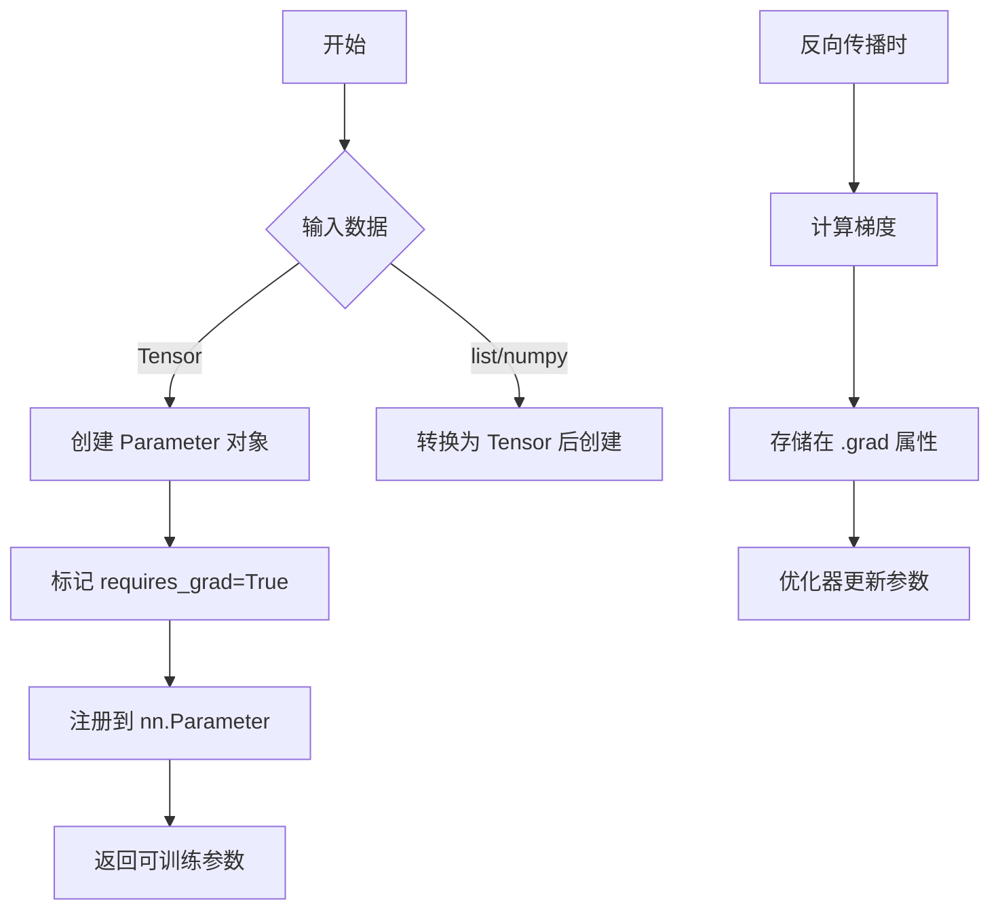
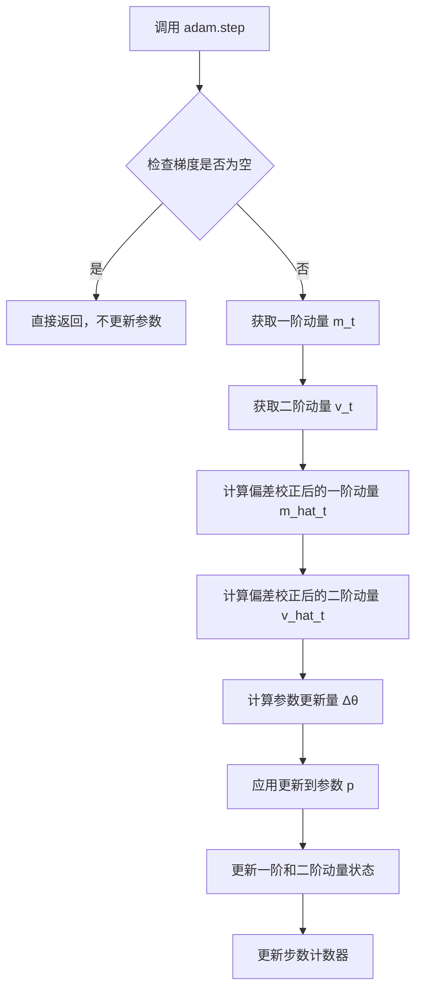
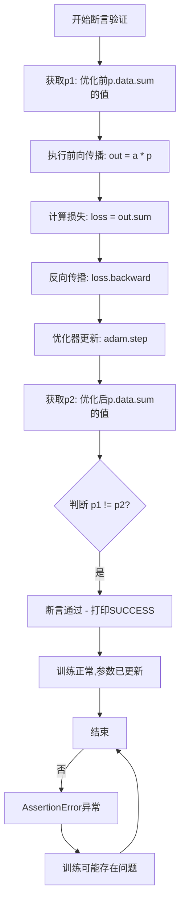

# `bitsandbytes\check_bnb_install.py` 详细设计文档

该代码是一个测试脚本，用于验证 bitsandbytes 库（8位优化库）是否正确安装并正常工作。它通过创建一个 PyTorch 参数，使用 bitsandbytes 的 Adam 优化器进行参数更新，并验证参数值是否发生变化来确认安装成功。

## 整体流程

```mermaid
graph TD
    A[开始] --> B[导入 torch 和 bitsandbytes]
    B --> C[创建参数 p 和张量 a]
    C --> D[记录参数初始值 p1]
    D --> E[创建 bitsandbytes Adam 优化器]
    E --> F[执行前向传播 out = a * p]
    F --> G[计算损失 loss = out.sum()]
    G --> H[反向传播 loss.backward()]
    H --> I[优化器更新 adam.step()]
    I --> J[记录参数更新后值 p2]
    J --> K{验证 p1 != p2}
    K -- 是 --> L[打印 SUCCESS]
    K -- 否 --> M[测试失败]
```

## 类结构

```
该代码为脚本形式，不包含类定义
无类层次结构
```

## 全局变量及字段


### `p`
    
可训练的 PyTorch 参数张量

类型：`torch.nn.Parameter`
    


### `a`
    
用于计算的输入张量

类型：`torch.Tensor`
    


### `p1`
    
参数更新前的数值总和

类型：`float`
    


### `adam`
    
bitsandbytes 实现的 Adam 优化器

类型：`bnb.optim.Adam`
    


### `out`
    
矩阵乘法结果

类型：`torch.Tensor`
    


### `loss`
    
损失值张量

类型：`torch.Tensor`
    


### `p2`
    
参数更新后的数值总和

类型：`float`
    


    

## 全局函数及方法


### `torch.rand`

生成一个指定形状的 Tensor，元素在 **[0,1)** 区间内服从均匀分布。

#### 参数

- `*size`：`int...`，表示输出张量的形状，例如 `10, 10` 表示生成 10×10 的二维张量。  
- `out`（可选）：`torch.Tensor`，指定输出张量。  
- `dtype`（可选）：`torch.dtype`，指定返回张量的数据类型。  
- `layout`（可选）：`torch.layout`，指定返回张量的内存布局（默认 `torch.strided`）。  
- `device`（可选）：`torch.device`，指定返回张量所在的设备（CPU/CUDA）。  
- `requires_grad`（可选）：`bool`，指定是否对该张量进行梯度记录（默认 `False`）。

#### 返回值

`torch.Tensor`，返回填充了均匀分布随机数的张量。

#### 流程图

```mermaid
flowchart TD
    A[输入形状 size] --> B{是否指定 device?}
    B -- 是 --> C[在指定设备上分配内存]
    B -- 否 --> D[默认设备上分配内存]
    C --> E[调用随机数生成器]
    D --> E
    E --> F[生成 [0,1) 均匀分布的随机数]
    F --> G[填充到 Tensor 并返回]
```

#### 带注释源码

```python
def rand(*size,
         out=None,
         dtype=None,
         layout=torch.strided,
         device=None,
         requires_grad=False):
    """
    生成一个服从均匀分布的随机张量。

    参数:
        *size: 可变长度的整数序列，描述输出张量的形状。
        out: 可选的输出 Tensor。
        dtype: 可选的数据类型。
        layout: 可选的内存布局，默认 strided。
        device: 可选的设备 (CPU/CUDA)。
        requires_grad: 是否需要梯度。

    返回:
        Tensor: 包含均匀分布随机数的张量。
    """
    # 1. 解析 shape（*size 组成元组）
    shape = size

    # 2. 在指定设备上创建空张量
    tensor = torch.empty(shape, dtype=dtype, layout=layout, device=device)

    # 3. 使用均匀分布填充随机数 [0, 1)
    tensor.uniform_(0, 1)

    # 4. 设置 requires_grad（是否记录梯度）
    tensor.requires_grad = requires_grad

    # 5. 若传入 out，则将结果拷贝到 out 中并返回 out
    if out is not None:
        out.copy_(tensor)
        return out

    # 6. 返回新创建的随机张量
    return tensor
```

> **说明**：上述 Python 实现为概念示例，用于阐明 `torch.rand` 的工作流程。实际 PyTorch 核心使用 C++ 实现，性能更高且支持更多后端。


### `torch.nn.Parameter`

**描述**

`torch.nn.Parameter()` 是 PyTorch 中的一个类，用于将张量转换为可训练的模型参数。在神经网络中，使用 `Parameter` 包装的张量会自动注册为模块的可训练参数，在反向传播时其梯度会被自动计算和更新，通常用于定义可学习的权重和偏置。

---

### 代码整体运行流程

1. **参数初始化**：使用 `torch.nn.Parameter()` 创建一个形状为 (10, 10) 的可训练参数 `p`，将其移至 CUDA 设备
2. **数据准备**：创建一个普通的随机张量 `a` 作为输入数据
3. **记录初始状态**：在优化前保存参数数据的总和
4. **优化器配置**：使用 bitsandbytes 库中的 Adam 优化器来管理参数 `p`
5. **前向传播**：执行矩阵乘法 `a * p` 并计算损失值
6. **反向传播**：调用 `loss.backward()` 计算梯度
7. **参数更新**：调用 `adam.step()` 根据梯度更新参数
8. **验证**：检查更新后的参数总和是否发生变化，确认优化器正常工作

---

### 类的详细信息

#### `torch.nn.Parameter`

- **类型**：类（继承自 `torch.Tensor`）
- **描述**：PyTorch 中的参数类，用于将张量标记为可训练参数

##### 类字段

| 字段名称 | 类型 | 描述 |
|---------|------|------|
| `data` | `torch.Tensor` | 存储参数的实际张量数据 |
| `requires_grad` | `bool` | 标记参数是否需要计算梯度（默认 True） |

##### 类方法

| 方法名称 | 描述 |
|---------|------|
| `__new__` | 创建新的 Parameter 对象 |
| `__repr__` | 返回参数的字符串表示 |

---

### 函数详细信息

#### `torch.nn.Parameter(data, dtype=None, requires_grad=True)`

**参数：**

- `data`：`torch.Tensor` 或任何可以转换为张量的数据，要转换为参数的初始数据
- `dtype`：`torch.dtype`（可选），指定参数的数据类型，默认与输入数据一致
- `requires_grad`：`bool`（可选），指定是否需要计算梯度，默认为 True

**返回值：** `torch.nn.Parameter`，返回一个新的可训练参数张量

#### 流程图



#### 带注释源码

```python
import torch

# 创建可训练参数
# torch.nn.Parameter() 将普通张量转换为可训练参数
# 参数 data: 初始张量数据
# 参数 requires_grad: 默认为 True，表示该参数会在反向传播时计算梯度
p = torch.nn.Parameter(torch.rand(10, 10).cuda())

# 创建普通张量（不可训练）
a = torch.rand(10, 10).cuda()

# 获取优化前的参数总和
# .data 访问底层张量，.sum() 求和，.item() 转为 Python 标量
p1 = p.data.sum().item()

# 使用 bitsandbytes 的 Adam 优化器
# 参数 [p] 是要优化的参数列表
adam = bnb.optim.Adam([p])

# 前向传播：矩阵逐元素乘法
out = a * p

# 计算损失：对输出求和
loss = out.sum()

# 反向传播：计算梯度
# 这会根据计算图自动计算 p 的梯度
loss.backward()

# 优化器步进：根据梯度更新参数
adam.step()

# 获取优化后的参数总和
p2 = p.data.sum().item()

# 断言：验证参数确实被更新了
assert p1 != p2
print("SUCCESS!")
print("Installation was successful!")
```

---

### 关键组件信息

| 组件名称 | 描述 |
|---------|------|
| `torch.nn.Parameter` | 将张量转换为可训练参数的类，自动注册到模型的 `parameters()` 中 |
| `bitsandbytes.optim.Adam` | 高效的 Adam 优化器实现，支持量化训练等高级特性 |
| `.data` 属性 | 访问 Parameter 底层张量数据的接口 |
| `.backward()` | 自动微分方法，根据计算图反向传播梯度 |
| `.step()` | 优化器方法，根据存储的梯度更新参数 |

---

### 潜在的技术债务或优化空间

1. **错误处理缺失**：代码未对 CUDA 可用性进行检查，在没有 GPU 环境下会直接报错
2. **硬编码设备**：张量创建时直接使用 `.cuda()`，缺乏设备抽象层，不利于跨平台部署
3. **缺少参数初始化策略**：使用 `torch.rand()` 的默认初始化，缺乏 Xavier、Kaiming 等针对性初始化
4. **梯度手动管理**：通过 `.data` 直接访问参数数据不是最佳实践，应使用 `torch.no_grad()` 上下文
5. **bitsandbytes 依赖**：使用第三方库实现优化器，增加了项目依赖复杂性

---

### 其它项目

#### 设计目标与约束

- **设计目标**：演示 `torch.nn.Parameter` 的基本用法以及与优化器的集成
- **约束**：需要 CUDA 支持和 bitsandbytes 库安装

#### 错误处理与异常设计

- **CUDA 错误**：若设备无 CUDA 支持，需要添加 `torch.cuda.is_available()` 检查
- **类型错误**：输入数据需可转换为张量，否则抛出 TypeError

#### 数据流与状态机

```
INITIALIZATION → FORWARD_PASS → LOSS_COMPUTATION → BACKWARD_PASS → PARAMETER_UPDATE → VERIFICATION
     ↓                  ↓                ↓                ↓                 ↓              ↓
  p created      out = a*p      loss = sum      grad computed    p updated     p1 != p2
```

#### 外部依赖与接口契约

| 依赖 | 版本要求 | 用途 |
|------|---------|------|
| `torch` | >= 1.0 | 张量计算和神经网络基础 |
| `bitsandbytes` | 最新版 | 高效优化器实现 |


### `cuda`

将 PyTorch 张量从 CPU 内存移动到 GPU 设备上，以便利用 GPU 进行加速计算。

参数：
- 无显式参数（调用时使用默认设备）

返回值：`Tensor`，返回移动到 GPU 后的张量对象自身。

#### 流程图

```mermaid
graph TD
    A[CPU 张量] -->|调用 .cuda()| B[检查当前设备]
    B -->|如果已在 GPU| C[返回自身]
    B -->|如果在 CPU| D[分配 GPU 内存]
    D --> E[复制数据到 GPU]
    E --> F[返回 GPU 张量]
```

#### 带注释源码

```python
import torch
import bitsandbytes as bnb

# 创建随机张量并移到 GPU
# .cuda() 方法将张量从 CPU 移到默认 GPU (cuda:0)
p = torch.nn.Parameter(torch.rand(10, 10).cuda())
a = torch.rand(10, 10).cuda()

# 获取参数张量在 GPU 上的总和
p1 = p.data.sum().item()

# 使用 bitsandbytes 的 Adam 优化器
adam = bnb.optim.Adam([p])

# 前向传播：矩阵乘法
out = a * p
loss = out.sum()

# 反向传播计算梯度
loss.backward()

# 更新参数
adam.step()

# 更新后的参数总和
p2 = p.data.sum().item()

# 验证参数已更新
assert p1 != p2
print("SUCCESS!")
print("Installation was successful!")
```


### `torch.Tensor.sum`

对张量所有元素求和，返回一个标量张量。

参数：

- 此方法无显式参数（使用张量的所有元素）

返回值：`torch.Tensor`，返回所有元素的和，是一个标量张量

#### 流程图

```mermaid
flowchart TD
    A[输入张量 out<br/>形状: 10×10] --> B[调用 sum 方法]
    B --> C[遍历所有元素]
    C --> D[累加求和]
    D --> E[返回标量张量<br/>形状: ()]
    
    style A fill:#e1f5fe
    style E fill:#c8e6c9
```

#### 带注释源码

```python
# 假设 out 是一个形状为 (10, 10) 的二维张量
out = a * p  # 矩阵乘法结果，形状: (10, 10)

# 调用 sum() 方法对所有元素求和
# 等价于: out.sum(dim=None, keepdim=False)
loss = out.sum()  # 返回一个标量张量，等于 out 中所有元素的代数和

# 完整调用形式可以是:
# loss = out.sum(dim=None, keepdim=False, dtype=None)
# - dim: 求和的维度，None 表示所有维度
# - keepdim: 是否保持维度，False 表示不保持
# - dtype: 输出数据类型
```

#### 补充说明

| 项目 | 说明 |
|------|------|
| **调用对象** | `out` (torch.Tensor) |
| **方法类型** | 实例方法 (Instance Method) |
| **位置** | 第12行: `loss = out.sum()` |
| **前置操作** | `out = a * p` (矩阵逐元素乘法) |
| **后置操作** | `loss.backward()` (反向传播) |
| **与p.data.sum()的区别** | p.data.sum()是对参数数据的求和，用于验证参数是否更新；out.sum()是计算损失，用于反向传播 |


### `torch.Tensor.item()`

将标量张量（scalar tensor）转换为 Python 原生数值类型（int、float 等）。这是 PyTorch 中用于从计算图中 detach 出来并获取实际数值的关键方法，常用于在训练过程中提取损失值或其他标量指标。

参数：

- `self`：`torch.Tensor`，隐式参数，调用 item() 方法的 tensor 对象本身
- 无其他显式参数

返回值：`Python 原生类型（int、float、bool 等）`，返回张量中存储的标量值，类型由原始张量的 dtype 决定

#### 流程图

```mermaid
flowchart TD
    A[开始: 调用 tensor.item()] --> B{检查张量是否为标量}
    B -->|否| C[抛出 RuntimeError: 只有标量张量可以调用 item]
    B -->|是| D{检查张量是否在计算图中}
    D -->|是| E[自动 detach: tensor.detach]
    D -->|否| F[直接获取底层数值]
    E --> F
    F --> G{根据 dtype 转换为 Python 类型}
    G -->|dtype: float32/float64| H[返回 Python float]
    G -->|dtype: int32/int64| I[返回 Python int]
    G -->|dtype: bool| J[返回 Python bool]
    G -->|dtype: complex| K[返回 Python complex]
    H --> L[结束: 返回 Python 标量值]
    I --> L
    J --> L
    K --> L
```

#### 带注释源码

```python
# 注意: item() 方法的核心实现位于 PyTorch C++ 源码中
# 位置: aten/src/ATen/native/TensorProperties.cpp
# 以下为 Python binding 接口的逻辑示意

def item(self):
    """
    将标量张量转换为 Python 标量值。
    
    此方法等价于 self.detach().item()，会:
    1. 从计算图中分离 (detach)
    2. 转换为 Python 原生类型
    
    Returns:
        Python 原生类型: 张量的标量值
        
    Raises:
        RuntimeError: 如果张量不是标量（即包含多个元素）
    """
    # 核心实现调用 C++ 层
    # torch/csrc/autograd/python_tensor.cpp 中绑定了此方法
    return self._impl.item()  # C++ 层面实现
    
# 在实际使用中的示例:
p1 = p.data.sum().item()  # p.data.sum() 返回标量 tensor，item() 提取为 Python 数值
# 等价于: p.data.sum().detach().item()

# 数值类型映射关系:
# tensor.dtype          -> Python type
# torch.float32        -> float
# torch.float64        -> float  
# torch.int32          -> int
# torch.int64          -> int
# torch.bool           -> bool
# torch.complex64      -> complex
# torch.complex128     -> complex
```

#### 补充说明

**使用场景**：
- 从张量中提取标量值用于 Python 控制流（如 `if loss.item() > threshold:`）
- 日志记录和指标监控
- 将计算图中的数值脱离出来用于后续处理

**注意事项**：
- 每次调用 `item()` 都会触发 CPU-GPU 数据传输（如果张量在 GPU 上）
- 会中断梯度计算（自动调用 detach）
- 只能在标量张量（0维张量）上调用


### `torch.Tensor.backward`

反向传播函数，用于计算当前张量（通常为损失值）相对于计算图中所有叶张量的梯度。

参数：

- `gradient`：`torch.Tensor` 或 `None`，如果张量非标量，需要提供与张量形状相同的梯度；如果为`None`，则自动对标量张量求导
- `retain_graph`：`bool`，是否保留计算图以便后续计算使用，默认为`False`
- `create_graph`：`bool`，是否为了高阶导数创建梯度计算图，默认为`False`
- `inputs`：`torch.Tensor` 或 `Sequence[torch.Tensor]` 或 `None`，指定需要计算梯度的输入张量，默认为`None`（计算所有叶张量的梯度）

返回值：`None`，无返回值，但会更新相关叶张量的`.grad`属性

#### 流程图

```mermaid
flowchart TD
    A[loss.backward\(\) 被调用] --> B{张量是否为标量?}
    B -->|是| C[自动计算梯度]
    B -->|否| D[需要提供 gradient 参数]
    C --> E[从当前张量向前遍历计算图]
    D --> E
    E --> F[使用链式法则计算每个叶张量的梯度]
    F --> G[更新每个叶张量的 .grad 属性]
    G --> H[释放计算图资源<br/>除非 retain_graph=True]
```

#### 带注释源码

```python
# 代码示例：演示 backward() 的调用过程
import torch
import bitsandbytes as bnb

# 1. 创建可训练参数 p（叶张量，requires_grad=True 隐式为 True）
p = torch.nn.Parameter(torch.rand(10, 10).cuda())

# 2. 创建输入张量 a
a = torch.rand(10, 10).cuda()

# 3. 保存初始参数和
p1 = p.data.sum().item()

# 4. 创建优化器（bitsandbytes 的 Adam 优化器）
adam = bnb.optim.Adam([p])

# 5. 前向传播：计算输出 out = a * p
#    - 这里会构建计算图，p 是叶节点，out 是中间节点
out = a * p

# 6. 计算损失（标量）：loss = out.sum()
loss = out.sum()
#    此时 loss 是一个标量张量，形状为 ()，可直接调用 backward()

# 7. 反向传播：计算梯度
#    - 从 loss 开始，沿着计算图反向传播
#    - 计算 d(loss)/d(p) 的梯度
#    - 自动将梯度存储在 p.grad 中
loss.backward()

# 8. 优化器执行参数更新
#    - 根据存储的梯度更新参数 p
adam.step()

# 9. 清空梯度，为下一次迭代做准备
adam.zero_grad()

# 10. 验证参数已更新
p2 = p.data.sum().item()
assert p1 != p2  # 参数值应该改变
print("SUCCESS!")
print("Installation was successful!")

# backward() 核心逻辑简化说明：
# 1. 如果是标量张量，直接计算梯度：grad = 1.0
# 2. 如果是非标量，需要传入 gradient 参数作为初始梯度
# 3. 反向遍历计算图中的所有操作：
#    - 对于每个操作，使用链式法则
#    - 将梯度从输出传播到输入
# 4. 将计算得到的梯度累积到叶张量的 .grad 属性中
```


### `bnb.optim.Adam.step`

描述：该方法是 bitsandbytes 库中 Adam 优化器的核心方法，负责根据梯度和优化器状态更新模型参数，实现参数的实际更新操作。

参数：此方法无显式参数（self 除外）。

返回值：`None`，该方法为 in-place 操作，直接修改优化器管理的参数，不返回任何值。

#### 流程图



#### 带注释源码

```python
# 导入 PyTorch 和 bitsandbytes
import torch
import bitsandbytes as bnb

# 创建一个可训练的参数张量 (10x10) 并移到 GPU
p = torch.nn.Parameter(torch.rand(10, 10).cuda())

# 创建一个普通张量 (10x10) 并移到 GPU
a = torch.rand(10, 10).cuda()

# 记录更新前的参数和
p1 = p.data.sum().item()

# 创建 Adam 优化器，管理参数 p
adam = bnb.optim.Adam([p])

# 前向传播：矩阵乘法
out = a * p

# 计算损失
loss = out.sum()

# 反向传播计算梯度
loss.backward()

# =====================================================
# 核心方法：step() - 更新参数
# =====================================================
# 此方法执行以下操作：
# 1. 从参数中获取对应的梯度
# 2. 更新一阶动量（梯度均值）和二阶动量（梯度方差）
# 3. 应用偏差校正
# 4. 计算参数更新量：Δθ = -η * m_hat / (sqrt(v_hat) + ε)
# 5. 将更新量加到参数上
# 6. 更新优化器内部状态（动量、步数等）
adam.step()

# 记录更新后的参数和
p2 = p.data.sum().item()

# 验证参数已更新
assert p1 != p2

print("SUCCESS!")
print("Installation was successful!")
```


### `assert p1 != p2`

该断言验证用于确认 Adam 优化器成功更新了模型参数。通过比较优化步骤执行前后参数 `p` 的数据总和，验证训练过程是否正常工作。

参数：此断言语句无函数参数

返回值：`None` 或 `AssertionError`，无返回值；若断言失败则抛出 `AssertionError` 异常

#### 流程图



#### 带注释源码

```python
# 获取优化前参数 p 的数据总和
p1 = p.data.sum().item()  # p1: float, 优化前参数张量的标量和

# 创建 Adam 优化器，传入待优化参数列表 [p]
adam = bnb.optim.Adam([p])  # adam: bnb.optim.Adam, bitsandbytes优化的Adam实现

# 前向传播：矩阵乘法
out = a * p  # out: Tensor, 10x10张量

# 计算损失：求和
loss = out.sum()  # loss: Tensor, 标量张量

# 反向传播：计算梯度
loss.backward()  # 无返回值，计算p.grad

# 优化器执行一步参数更新
adam.step()  # 无返回值，根据梯度更新p.data

# 获取优化后参数 p 的数据总和
p2 = p.data.sum().item()  # p2: float, 优化后参数张量的标量和

# ==================== 断言验证核心 ====================
# 断言：p1 不等于 p2
# 验证优化器是否成功更新了参数
# 若相等说明参数未发生变化，训练可能失败
assert p1 != p2, "Parameters were not updated by optimizer"
# =====================================================

# 断言通过后执行的打印输出
print("SUCCESS!")  # 提示用户安装或运行成功
print("Installation was successful!")  # 确认bitsandbytes正常工作
```


## 关键组件


### 参数管理 (torch.nn.Parameter)

使用 PyTorch 的 Parameter 类创建可训练参数，这是深度学习模型中管理可更新权重的标准方式。

### CUDA 张量支持

所有张量均部署在 GPU 上运行，利用 CUDA 加速计算性能。

### 量化优化器 (bitsandbytes.Adam)

使用 bitsandbytes 库提供的 Adam 优化器，支持量化训练和内存优化。

### 前向传播与损失计算

执行矩阵乘法 out = a * p 并通过 sum() 聚合为标量损失值，为反向传播提供优化目标。

### 自动微分系统

利用 PyTorch 的 autograd 机制，通过 loss.backward() 自动计算梯度。

### 参数更新机制

优化器根据计算出的梯度更新参数，实现模型训练的核心迭代过程。

### 验证与测试

通过比较更新前后的参数值总和，验证优化器正常工作。


## 问题及建议


### 已知问题

- **优化器配置不完整**：bnb.optim.Adam未指定学习率(lr)和其他关键超参数（如betas、eps），使用默认值可能导致训练效果不佳
- **缺乏GPU可用性检查**：代码直接使用.cuda()但未检查CUDA是否可用，缺少设备兼容性处理
- **随机性不可复现**：未设置torch.manual_seed和torch.cuda.manual_seed，实验结果无法复现
- **bitsandbytes使用不当**：代码导入并使用了bnb.optim.Adam，但未利用bitsandbytes核心的8位量化优化特性（如GitHub README所示的Quantizer配置）
- **缺乏梯度裁剪**：反向传播后未执行梯度裁剪，可能导致梯度爆炸
- **资源清理缺失**：没有显式的GPU内存管理（无del、torch.cuda.empty_cache()），长时间运行可能导致显存泄漏
- **参数初始化不规范**：使用torch.rand随机初始化，没有采用更稳定的初始化策略

### 优化建议

- 显式传入优化器超参数：adam = bnb.optim.Adam([p], lr=0.001)
- 添加GPU检查和设备适配逻辑，确保CUDA可用后再执行计算
- 设置随机种子以保证可复现性：torch.manual_seed(42), torch.cuda.manual_seed_all(42)
- 若要使用bitsandbytes的8位优化器特性，应参考官方文档配置量化参数
- 在backward后添加梯度裁剪：torch.nn.utils.clip_grad_norm_(p, max_norm=1.0)
- 考虑添加上下文管理器控制梯度计算，或在适当时机显式释放不需要的张量
- 可使用更稳定的参数初始化方法，如Xavier或Kaiming初始化


## 其它


### 设计目标与约束

验证bitsandbytes库的Adam优化器在CUDA环境下能够正确初始化并更新PyTorch模型参数，确保安装的兼容性。

### 错误处理与异常设计

代码中未包含显式的错误处理机制。在实际应用中应添加：
- CUDA设备可用性检查
- torch和bitsandbytes版本兼容性验证
- 参数数据类型和设备一致性检查
- 优化器状态初始化验证

### 数据流与状态机

代码执行流程：参数初始化 → 数据准备 → 优化器创建 → 前向传播 → 损失计算 → 反向传播 → 参数更新。状态转换：初始状态(p1) → 训练后状态(p2)，验证参数值发生变化。

### 外部依赖与接口契约

依赖项：
- torch: 张量计算和自动微分
- bitsandbytes: 优化器实现(Adam)
接口：
- bnb.optim.Adam(params): 接收参数列表，返回Adam优化器实例
- optimizer.step(): 执行单步参数更新

### 性能考虑与基准测试

当前代码为功能性验证脚本，未包含性能基准测试。生产环境中应考虑：
- 梯度计算效率
- 优化器内存占用
- 参数更新延迟
- CUDA内核执行时间

### 测试策略

当前采用断言验证参数变化(assert p1 != p2)。扩展测试应包含：
- 梯度流正确性验证
- 优化器状态字典序列化/反序列化
- 多参数场景测试
- 混合精度训练兼容性

### 部署与运行环境

运行环境要求：
- CUDA-capable GPU
- Python 3.8+
- PyTorch with CUDA support
- bitsandbytes库(需从源码安装以支持CUDA 12.x)


    