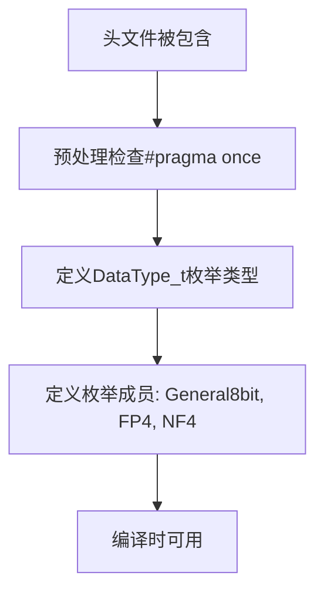

# `bitsandbytes\csrc\common.h` 详细设计文档

定义了一个数据类型枚举，用于标识不同的数据量化格式，包括通用8位、4位浮点(FP4)和4位归一化浮点(NF4)三种类型

## 整体流程



## 类结构

```
该文件为C语言头文件，不涉及类层次结构
仅包含枚举类型定义
```

## 全局变量及字段


### `General8bit`
    
通用8位数据类型枚举值，值为0

类型：`DataType_t`
    


### `FP4`
    
4位浮点数数据类型枚举值，值为1

类型：`DataType_t`
    


### `NF4`
    
4位归一化浮点数数据类型枚举值，值为2

类型：`DataType_t`
    


### `DataType_t`
    
数据类型枚举类型定义，用于表示不同的数据位宽和格式

类型：`typedef enum`
    


    

## 全局函数及方法


## 关键组件


### DataType_t 枚举类型

定义量化数据类型的枚举，用于支持不同的量化策略，包括通用8位量化、4位浮点量化和4位归一化浮点量化。


## 问题及建议


### 已知问题

-   **缺少末尾分号**：C++ 中枚举定义建议添加分号，虽然非强制但会影响代码风格一致性
-   **未使用强类型枚举**：使用普通 `enum` 而非 `enum class`，可能导致命名空间污染和隐式转换风险
-   **枚举值缺乏文档注释**：未说明 `FP4` 和 `NF4` 的具体含义（如 4-bit 浮点、4-bit 归一化浮点等）
-   **无扩展性设计**：枚举为固定值，未考虑未来新增数据类型的扩展方案
-   **缺乏辅助接口**：无类型名称获取、有效性验证等辅助函数，使用不便
-   **无版本控制**：头文件缺少版本号、版权声明或变更记录

### 优化建议

-   **采用强类型枚举**：改用 `enum class DataType_t` 避免隐式转换和命名冲突
-   **添加文档注释**：为每个枚举值添加一行注释说明其用途和含义
-   **添加辅助函数**：考虑提供 `toString()`、`isValid()` 等静态辅助方法
-   **声明底层类型**：显式指定枚举底层类型（如 `enum DataType_t : uint8_t`）确保跨平台一致性
-   **添加版本宏**：在头文件开头添加版本定义，如 `#define DATATYPE_VERSION_MAJOR 1`
-   **预留扩展空间**：在枚举末尾添加 `DataTypeCount` 或类似的哨兵值，便于迭代和边界检查


## 其它


### 设计目标与约束

定义统一的数据类型枚举，为量化推理框架提供基础类型支持，支持8位通用量化、4位浮点量化和4位归一化浮点量化三种数据格式。该枚举作为基础数据类型标识符，需要保持简洁性和可扩展性，以便后续添加新的量化格式。

### 错误处理与异常设计

由于该代码仅为类型定义枚举，不涉及运行时错误处理。对于枚举的使用方，应在数据加载或初始化阶段验证DataType_t值的有效性，例如检查值是否在有效枚举范围内（0-2），避免使用未定义的枚举值导致未定义行为。

### 数据流与状态机

该枚举为静态类型定义，不涉及运行时数据流或状态机。在数据处理流水线中，该枚举作为配置参数在初始化阶段被设置，随后传递给数据加载器或推理引擎，用于指示当前数据的数据类型格式。

### 外部依赖与接口契约

该枚举为无依赖的独立类型定义，可被其他模块直接引用。使用该枚举的模块应遵循以下接口契约：1）所有DataType_t类型的值必须来自预定义的枚举值；2）新增数据类型需在枚举中添加新值并更新相关文档；3）枚举值应与底层量化库或推理引擎的数据类型定义保持一致。

### 版本兼容性说明

当前版本（v1.0）定义了3种数据类型，保留未使用的枚举值范围（建议保留3-15）以供未来扩展。后续版本在添加新枚举值时应保持向后兼容，避免修改已有枚举值的含义。

### 单元测试建议

虽然该代码为简单的类型定义，但仍建议添加基础测试：1）验证枚举值的正确性（0、1、2）；2）验证枚举类型的大小；3）验证不同编译环境下枚举类型的一致性。


    