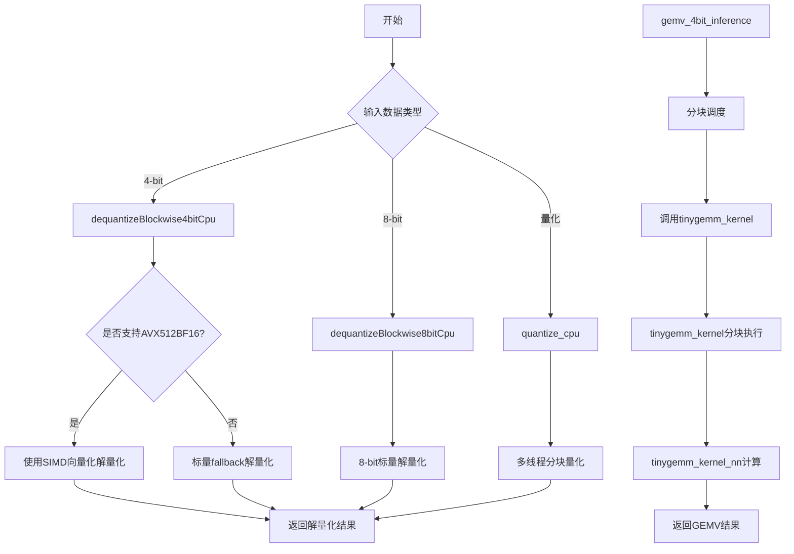
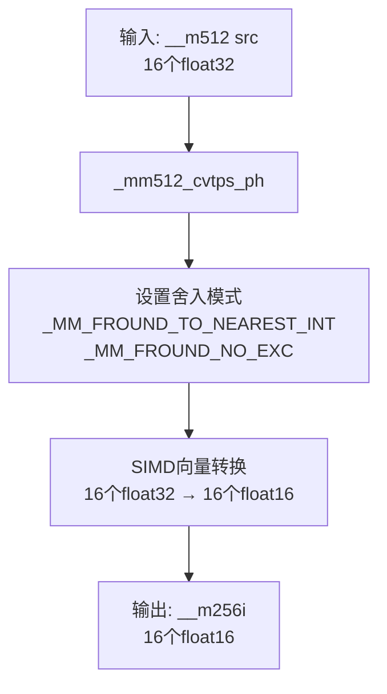
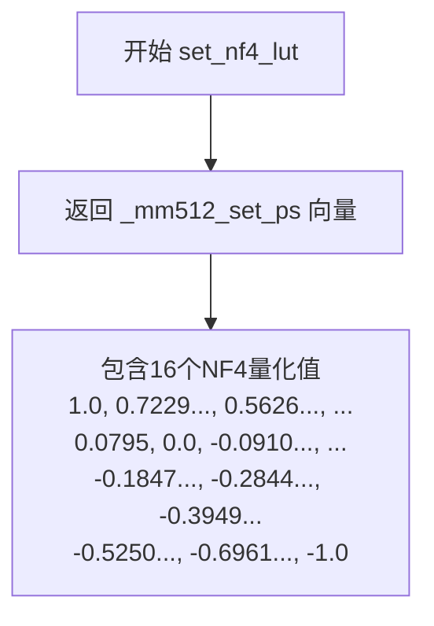
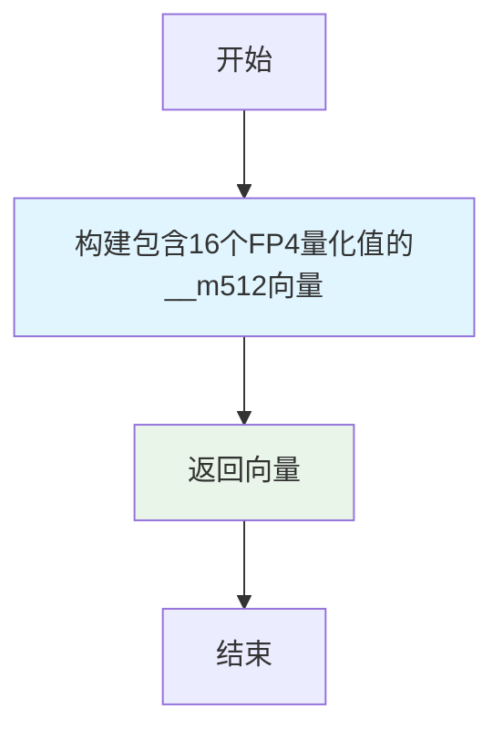
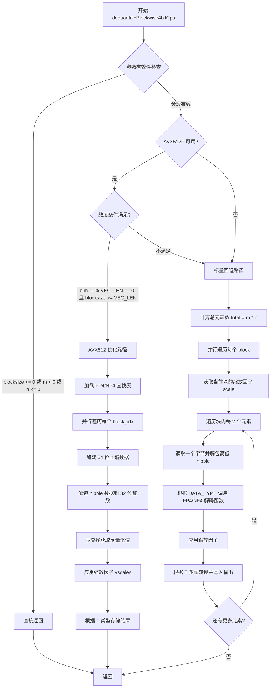
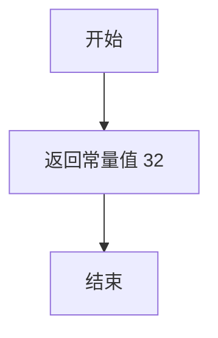
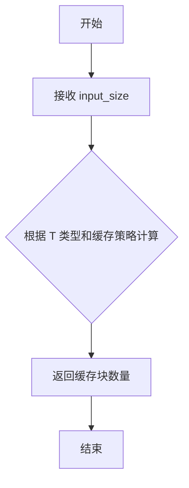
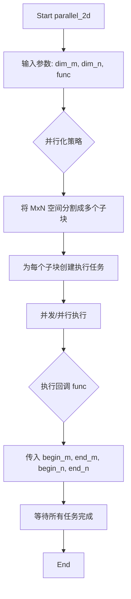
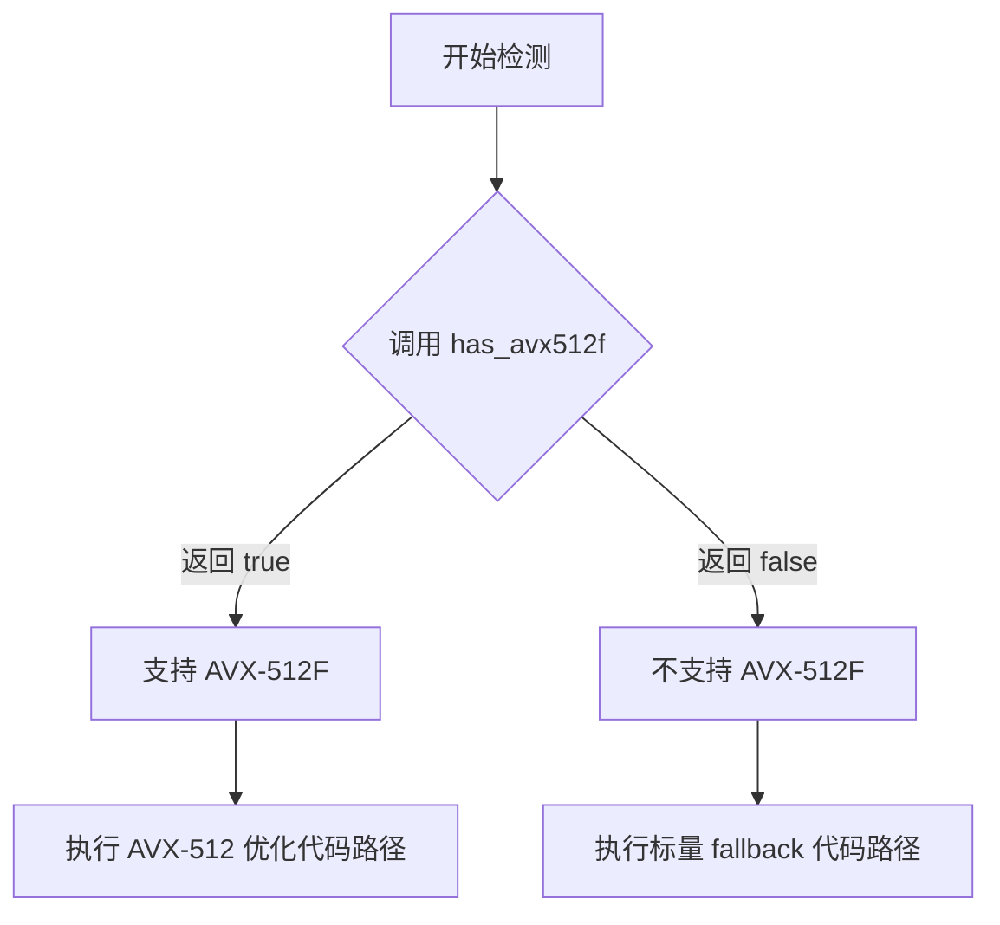
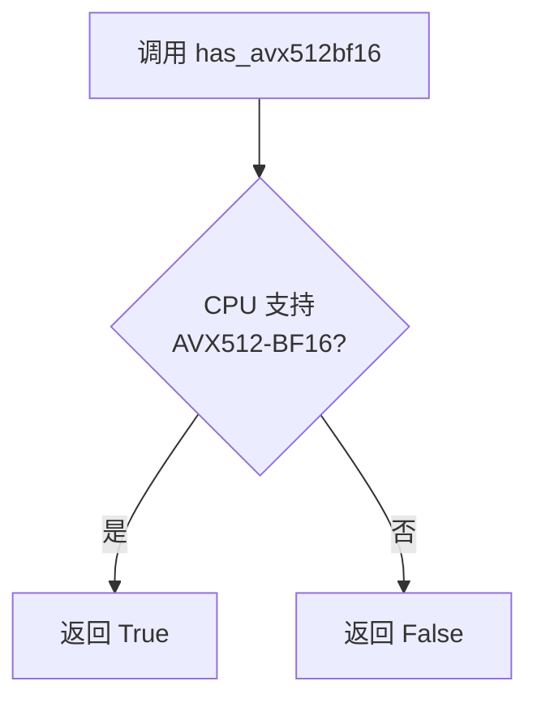

# `bitsandbytes\csrc\cpu_ops.cpp` 详细设计文档

该代码是一个高性能的CPU操作库，提供了4位(FP4/NF4)和8位量化权重的高效解量化、量化以及基于量化权重的矩阵乘法(GEMM)和向量乘法(GEMV)推理实现。代码利用AVX-512 SIMD指令集和OpenMP多线程并行优化，支持fp16/bf16/float多种输出类型，主要用于大语言模型的量化推理场景(如bitsandbytes库)。

## 整体流程



## 类结构

```
cpu_ops.h (头文件)
├── 匿名命名空间
│   ├── kCodebookSize (常量)
│   └── lookup_code_index (内联函数)
├── AVX512 intrinsics函数 (条件编译)
│   ├── cvt_fp32_to_fp16
│   ├── cvt_fp32_to_bf16
│   ├── set_nf4_lut
│   └── set_fp4_lut
├── 模板函数
│   ├── dequantizeBlockwise4bitCpu<T, DATA_TYPE>
│   ├── dequantizeBlockwise8bitCpu<T>
│   ├── quantize_cpu
│   ├── tinygemm_kernel_nn<scalar_t, BLOCK_M, BLOCK_N, DATA_TYPE> (特化)
│   ├── tinygemm_kernel<scalar_t, DATA_TYPE>
│   └── gemv_4bit_inference<T, DATA_TYPE>
└── 模板实例化声明
```

## 全局变量及字段


### `kCodebookSize`
    
量化码表大小常量，值为256

类型：`int (constexpr)`
    


### `code`
    
量化码表指针，存储4-bit或8-bit量化查找表

类型：`float*`
    


### `A`
    
输入数据指针，4-bit量化时为unsigned char*，8-bit量化或量化操作时为float*

类型：`unsigned char* / float*`
    


### `absmax`
    
块级最大值/缩放因子数组，每个块对应一个缩放因子

类型：`float* / const float*`
    


### `out`
    
输出缓冲区指针，支持float、fp16_t、bf16_t类型

类型：`T* (模板类型)`
    


### `blocksize`
    
量化块大小，定义每个块包含的元素数量

类型：`long long`
    


### `m`
    
矩阵行维度，输入/输出矩阵的高度

类型：`long long`
    


### `n`
    
矩阵列维度，输入/输出矩阵的宽度

类型：`long long`
    


### `BLOCK_M`
    
GEMM块行大小，值为4，定义矩阵分块计算的行块维度

类型：`int64_t (constexpr)`
    


### `BLOCK_N`
    
GEMM块列大小，值为64，定义矩阵分块计算的列块维度

类型：`int64_t (constexpr)`
    


### `BLOCK_K`
    
GEMM块K维度，值为128，定义矩阵分块计算的内维度（与4-bit量化相关）

类型：`int64_t (constexpr)`
    


### `PREFETCH_SIZE_K`
    
预取距离，值为64，用于CPU缓存预取的步进大小

类型：`int (constexpr)`
    


### `tinygemm_kernel_nn<bf16_t, BLOCK_M, BLOCK_N, DATA_TYPE>.tinygemm_kernel_nn`
    
bf16类型的4-bit量化GEMM kernel实现，提供静态apply方法执行矩阵乘法

类型：`模板结构体（静态类）`
    


### `tinygemm_kernel_nn.apply`
    
静态方法，执行bf16类型的4-bit量化矩阵乘法核心计算，使用AVX512和bf16指令集优化

类型：`static inline void`
    
    

## 全局函数及方法


### `lookup_code_index`

该函数用于在给定的浮点型代码本（codebook）中查找与输入值最接近的索引。它通过二分查找定位值的插入位置，然后比较左右相邻元素的距离，返回距离最近的代码本索引。

参数：

- `codebook`：`const float*`，指向包含256个浮点元素的代码本数组的指针
- `value`：`float`，需要查找最近索引的输入值

返回值：`unsigned char`，返回代码本中与输入值最接近的元素的索引（0-255）

#### 流程图

```mermaid
flowchart TD
    A[开始] --> B[将value限制在[-1.0f, 1.0f]范围内]
    B --> C[设置codebook起始和结束指针]
    C --> D[使用std::lower_bound二分查找value的插入位置right]
    D --> E{right == begin?}
    E -->|是| F[返回索引0]
    E -->|否| G{right == end?}
    G -->|是| H[返回索引kCodebookSize - 1]
    G -->|否| I[计算left指针 = right - 1]
    I --> J[计算value与left的距离dist_left]
    J --> K[计算value与right的距离dist_right]
    K --> L{dist_right < dist_left?}
    L -->|是| M[返回idx]
    L -->|否| N[返回idx - 1]
    F --> O[结束]
    H --> O
    M --> O
    N --> O
```

#### 带注释源码

```cpp
inline unsigned char lookup_code_index(const float* codebook, float value) {
    // 1. 将输入值限制在[-1.0f, 1.0f]范围内，确保在代码本的有效范围内
    value = std::clamp(value, -1.0f, 1.0f);
    
    // 2. 设置代码本的起始和结束指针
    const float* begin = codebook;
    const float* end = codebook + kCodebookSize;  // kCodebookSize = 256
    
    // 3. 使用二分查找找到第一个大于等于value的位置
    const float* right = std::lower_bound(begin, end, value);
    
    // 4. 处理边界情况：如果right指向开始位置，返回索引0
    if (right == begin) {
        return 0;
    }
    
    // 5. 处理边界情况：如果right指向结束位置，返回最后一个索引
    if (right == end) {
        return static_cast<unsigned char>(kCodebookSize - 1);
    }
    
    // 6. 获取左邻居指针
    const float* left = right - 1;
    
    // 7. 计算value与左右邻居的绝对距离
    const float dist_left = std::fabs(value - *left);    // value与左边元素的距离
    const float dist_right = std::fabs(*right - value);  // value与右边元素的距离
    
    // 8. 计算当前right相对于begin的索引位置
    const unsigned char idx = static_cast<unsigned char>(right - begin);
    
    // 9. 返回距离较近的元素的索引
    return dist_right < dist_left ? idx : idx - 1;
}
```


### `cvt_fp32_to_fp16`

该函数是 AVX-512  intrinsics 函数，用于将 16 个 IEEE-754 单精度浮点数（float32）批量转换为半精度浮点数（float16），采用向量化指令实现高效的数值类型转换。

参数：

- `src`：`const __m512`，输入的 AVX-512 浮点向量寄存器，包含 16 个 float32 值

返回值：`__m256i`，输出的 AVX-256 整数向量寄存器，包含 16 个 float16 值（每个占用 16 位）

#### 流程图



#### 带注释源码

```cpp
// AVX-512 intrinsic: 将512位浮点向量转换为256位半精度向量
// 参数: src - 输入的 __m512 寄存器，包含16个float32
// 返回: __m256i 寄存器，包含16个float16
inline __m256i cvt_fp32_to_fp16(const __m512 src) {
    // _mm512_cvtps_ph: AVX-512 内在函数，执行float32到float16的转换
    // 第一个参数: 输入的 __m512 浮点向量 (16个float32)
    // 第二个参数: 舍入模式和异常控制标志
    //   - _MM_FROUND_TO_NEAREST_INT: 使用最近舍入（偶数）模式
    //   - _MM_FROUND_NO_EXC: 禁止浮点异常
    return _mm512_cvtps_ph(src, (_MM_FROUND_TO_NEAREST_INT | _MM_FROUND_NO_EXC));
}
```


### `cvt_fp32_to_bf16`

该函数将 AVX512 位宽的 32 位浮点数向量（`__m512`）转换为 256 位宽的 Brain Float 16（bf16）格式向量（`__m256i`），同时支持通过硬件加速指令（`__AVX512BF16__`）或软件模拟方式完成转换，并正确处理 NaN 值。

参数：

- `src`：`const __m512`，输入的 512 位 SIMD 寄存器，包含 16 个 32 位浮点数

返回值：`__m256i`，返回的 256 位 SIMD 寄存器，包含 16 个 16 位 Brain Float 16 格式数值

#### 流程图

```mermaid
flowchart TD
    A[开始: cvt_fp32_to_bf16] --> B{是否支持 __AVX512BF16__?}
    B -->|是| C{运行时 has_avx512bf16()?}
    C -->|是| D[使用 _mm512_cvtneps_pbh 硬件指令]
    D --> K[返回 __m256i 结果]
    C -->|否| E[软件模拟转换]
    B -->|否| E
    E --> F[提取低 16 位并加上 0x7fff 偏置]
    F --> G[加上原始值]
    G --> H[右移 16 位完成截断]
    H --> I[检查 NaN: _mm512_cmp_ps_mask]
    I --> J[掩码混合处理 NaN]
    J --> K
```

#### 带注释源码

```cpp
inline __m256i cvt_fp32_to_bf16(const __m512 src) {
#if defined(__AVX512BF16__)
    // 编译期和运行时都支持 bf16 硬件指令时，使用专用转换指令
    if (has_avx512bf16()) {
        // _mm512_cvtneps_pbh: 直接将 16 个 fp32 转换为 16 个 bf16
        return reinterpret_cast<__m256i>(_mm512_cvtneps_pbh(src));
    }
#endif
    // ==================== 软件模拟转换路径 ====================
    // 将浮点寄存器转换为整数寄存器以便位操作
    __m512i value = _mm512_castps_si512(src);
    // 全 1 模式，用于替换 NaN 的位模式 (0xffff)
    __m512i nan = _mm512_set1_epi32(0xffff);
    // 生成有序比较掩码：src vs src，NaN 时掩码为 0
    auto mask_value = _mm512_cmp_ps_mask(src, src, _CMP_ORD_Q);
    // 常量 1，用于提取 LSB 位
    __m512i ones = _mm512_set1_epi32(0x1);
    // 0x7fff，用于构建舍入偏置
    __m512i vec_bias = _mm512_set1_epi32(0x7fff);
    
    // uint32_t lsb = (input >> 16) & 1;
    // 提取第 16 位（bf16 精度的临界位）
    auto t_value = _mm512_and_si512(_mm512_srli_epi32(value, 16), ones);
    
    // uint32_t rounding_bias = 0x7fff + lsb;
    // 根据 LSB 决定是否向上舍入
    t_value = _mm512_add_epi32(t_value, vec_bias);
    
    // input += rounding_bias;
    // 加上舍入偏置实现"四舍六入五成双"逻辑
    t_value = _mm512_add_epi32(t_value, value);
    
    // input = input >> 16;
    // 右移 16 位，保留高 16 位（bf16）
    t_value = _mm512_srli_epi32(t_value, 16);
    
    // Check NaN before converting back to bf16
    // NaN 值的比较掩码为 0，需替换为正确的 NaN 位模式
    t_value = _mm512_mask_blend_epi32(mask_value, nan, t_value);
    
    // 将 32 位整数向量压缩为 16 位整数向量
    return _mm512_cvtusepi32_epi16(t_value);
}
```


### `set_nf4_lut`

该函数用于生成 NF4（Normal Float 4-bit）格式的量化查找表（Look-Up Table），返回一个包含16个float数值的 `__m512` 向量，供 AVX-512 加速的4-bit反量化操作使用。

参数： 无

返回值：`__m512`，返回包含16个NF4量化值的512位向量，这些值构成了NF4格式的查找表，用于将4-bit索引映射回对应的浮点数值。

#### 流程图



#### 带注释源码

```cpp
// 这是一个静态内联函数，用于生成NF4格式的查找表
// NF4 (Normal Float 4-bit) 是一种用于大模型量化的4位浮点格式
// 返回 __m512 类型，包含16个float值（512位 = 16 * 32bit）
static inline __m512 set_nf4_lut() {
    // 使用 Intel AVX-512  intrinsics 构造512位向量
    // 返回值是一个查找表，包含16个预定义的NF4量化值
    // 这些值从大到小排列：1.0 -> -1.0
    // 用于在反量化时将4-bit索引映射回实际的浮点数值
    return _mm512_set_ps(
        1.0f,                                 // 最大正值
        0.7229568362236023,                  // 第2大
        0.5626170039176941,                  // 第3大
        0.44070982933044434,                 // 第4大
        0.33791524171829224,                 // 第5大
        0.24611230194568634,                  // 第6大
        0.16093020141124725,                  // 第7大
        0.07958029955625534,                  // 第8大（最小正数）
        0.0f,                                 // 零值
        -0.09105003625154495,                // 第1大负数（绝对值最小）
        -0.18477343022823334,
        -0.28444138169288635,
        -0.39491748809814453,
        -0.5250730514526367,
        -0.6961928009986877,
        -1.0f                                 // 最大负值
    );
}
```


### `set_fp4_lut`

该函数是一个静态内联函数，用于初始化 FP4（4位浮点数）格式的查找表（LUT），返回包含16个预定义 FP4 量化值的 AVX-512 512位浮点向量，供后续 SIMD 去量化操作中进行表查找使用。

参数： 无

返回值：`__m512`，返回包含16个FP4量化值的512位向量，用于4位浮点数去量化查找表

#### 流程图



#### 带注释源码

```cpp
// 设置 FP4 查找表
// 该函数返回一个包含16个FP4量化值的__m512向量
// FP4 格式使用4位表示，理论上有16种可能的值
// 这些值对称分布，涵盖正负范围，用于4-bit浮点数的去量化
static inline __m512 set_fp4_lut() {
    // 返回512位向量，包含16个单精度浮点数
    // 值按照特定顺序排列：
    // 负值: -0.25, -0.16666667, -0.5, -0.33333333, -1.0, -0.66666667, -0.00520833333, 0.0
    // 正值: 0.25, 0.16666667, 0.5, 0.33333333, 1.0, 0.66666667, 0.00520833333, 0.0
    return _mm512_set_ps(
        -0.2500f, -0.16666667f, -0.5000f, -0.33333333f, -1.0000f, -0.66666667f, -5.208333333e-03f, 0.0000f, 0.2500f,
        0.16666667f, 0.5000f, 0.33333333f, 1.0000f, 0.66666667f, 5.208333333e-03f, 0.0000f
    );
}
```


### `dequantizeBlockwise4bitCpu`

该函数是 4 位量化数据（FP4 或 NF4 格式）的块级反量化内核，支持 AVX512 SIMD 加速路径和标量回退路径。它将压缩的 4 位数据解包，并根据每块的缩放因子（absmax）将数值反量化为浮点格式（float/fp16/bf16）。

参数：

- `A`：`unsigned char*`，输入的 4 位量化数据（每字节存储两个 nibble）
- `absmax`：`const float*`，每块的绝对最大值缩放因子数组
- `out`：`T*`，输出缓冲区，存储反量化后的浮点数值
- `blocksize`：`long long`，每个块的元素数量
- `m`：`long long`，输入数据的行数（维度 0）
- `n`：`long long`，输入数据的列数（维度 1）

返回值：`void`，无返回值，结果直接写入 `out` 缓冲区

#### 流程图



#### 带注释源码

```cpp
// 4-bit (FP4 / NF4) dequantization helper extracted from the original else branch.
// DATA_TYPE: 1 = FP4, 2 = NF4
// 模板参数 T: 输出数据类型 (float, fp16_t, bf16_t)
// 模板参数 DATA_TYPE: 量化类型 (1=FP4, 2=NF4)
template <typename T, int DATA_TYPE>
void dequantizeBlockwise4bitCpu(
    unsigned char* A,       // 输入: 4位量化数据指针
    const float* absmax,    // 输入: 每块的缩放因子数组
    T* out,                 // 输出: 反量化结果缓冲区
    long long blocksize,    // 输入: 块大小
    long long m,            // 输入: 行数 (维度0)
    long long n             // 输入: 列数 (维度1)
) {
    // 静态断言: 确保 DATA_TYPE 是有效的 4-bit 类型
    static_assert(DATA_TYPE == 1 || DATA_TYPE == 2, "dequantizeBlockwise4bitCpu called with non 4-bit DATA_TYPE");
    
    // 参数有效性检查: 防止无效输入导致异常行为
    if (blocksize <= 0 || m < 0 || n <= 0)
        return;

#if defined(__AVX512F__)
    // 如果支持 AVX512F 指令集，尝试使用 SIMD 加速路径
    if (has_avx512f()) {
        long long dim_0 = m;
        long long dim_1 = n;
        long long input_dim_1 = dim_1 >> 1;         // 每个4-bit值占0.5字节，故列数除以2
        long long absmax_dim_1 = dim_1 / blocksize; // 缩放因子维度
        using Tcomp = float;
        
        // VEC_LEN = 16, 表示 AVX512 的 float 向量长度
        constexpr auto VEC_LEN = sizeof(__m512i) / sizeof(Tcomp); // 16
        
        // 检查是否满足 AVX512 优化的对齐和大小条件
        if (dim_1 % VEC_LEN == 0 && blocksize >= VEC_LEN) {
            // 根据 DATA_TYPE 选择 FP4 或 NF4 的查找表 (LUT)
            __m512 lut = DATA_TYPE == 1 ? set_fp4_lut() : set_nf4_lut();
            // 每次处理 8 个元素 (VEC_LEN / 2 = 16 / 2 = 8)
            constexpr auto k_step = VEC_LEN / 2; // 8
            
            // 使用 OpenMP 并行化外层循环
            BNB_OMP_PARALLEL_FOR
            for (int block_idx = 0; block_idx < dim_0; ++block_idx) {
                // 遍历每个 block 的数据块
                for (int k = 0; k < input_dim_1; k += k_step) {
                    // 加载 64 位的 NF4 数据和单个缩放因子数据
                    uint8_t* p = &A[block_idx * input_dim_1 + k];
                    uint64_t packed;
                    std::memcpy(&packed, p, sizeof(uint64_t)); // 安全地读取未对齐的 64 位数据
                    
                    // 计算缩放因子索引
                    auto scale_idx = k * 2 / blocksize;
                    // 广播当前块的缩放因子到 AVX512 寄存器
                    auto vscales = _mm512_set1_ps((float)absmax[block_idx * absmax_dim_1 + scale_idx]);
                    
                    // ========== 解包 nibble 数据到 32 位整数 ==========
                    uint64_t high = 0;
                    uint64_t low = 0;
                    // 将压缩的 4-bit 值解包到字节边界，以便扩展到 32 位
                    for (int i = 0; i < 4; ++i) {
                        low |= ((packed >> (2 * i * 4)) & 0xf) << ((2 * i + 1) * 8);
                        low |= ((packed >> ((2 * i + 1) * 4)) & 0xf) << (2 * i * 8);
                        high |= ((packed >> (2 * i * 4 + 32)) & 0xf) << ((2 * i + 1) * 8);
                        high |= ((packed >> ((2 * i + 1) * 4 + 32)) & 0xf) << (2 * i * 8);
                    }
                    
                    // 打包到 128 位寄存器并扩展到 512 位
                    __m128i packed_128 = _mm_set_epi64x(high, low);
                    __m512i vint32 = _mm512_cvtepu8_epi32(packed_128); // 零扩展 uint8 -> uint32
                    
                    // ========== 表查找 (使用 _mm512_permutexvar_ps) ==========
                    // 根据解码的索引从 LUT 中查找对应的反量化值
                    __m512 vout = _mm512_permutexvar_ps(vint32, lut);
                    
                    // ========== 应用缩放因子 ==========
                    vout = _mm512_mul_ps(vout, vscales);
                    
                    // ========== 存储结果 ==========
                    T* pout = &out[block_idx * dim_1 + k * 2];
                    if constexpr (std::is_same<T, float>()) {
                        // 直接存储 float 数组
                        _mm512_storeu_ps(pout, vout);
                    } else if constexpr (std::is_same<T, bf16_t>()) {
                        // 转换为 BF16 后存储
                        _mm256_storeu_si256((__m256i*)pout, cvt_fp32_to_bf16(vout));
                    } else if constexpr (std::is_same<T, fp16_t>()) {
                        // 转换为 FP16 后存储
                        _mm256_storeu_si256((__m256i*)pout, cvt_fp32_to_fp16(vout));
                    }
                }
            }
            return; // AVX512 路径完成，返回
        }
    }
#endif
    // ========== 标量回退路径 ==========
    // 当不支持 AVX512 或不满足向量化条件时使用
    long long total = m * n;
    BNB_OMP_PARALLEL_FOR
    for (long long block_idx = 0; block_idx < total; block_idx += blocksize) {
        // 计算当前块的有效元素数
        long long valid_items = (total - block_idx >= blocksize ? blocksize : total - block_idx);
        // 获取当前块的缩放因子
        float scale = absmax[block_idx / blocksize];
        
        // 每次处理 2 个元素 (一个字节包含两个 4-bit 值)
        for (long long i = 0; i < valid_items; i += 2) {
            long long byte_index = (block_idx + i) >> 1; // 等价于除以 2
            unsigned char byte = A[byte_index];

            // 高位 nibble 在前 (与之前代码逻辑一致)
            // 根据 DATA_TYPE 选择 FP4 或 NF4 解码函数
            float v0 = (DATA_TYPE == 1 ? dDequantizeFP4(byte >> 4) : dDequantizeNF4(byte >> 4)) * scale;
            // 低位 nibble 在后
            float v1 = (DATA_TYPE == 1 ? dDequantizeFP4(byte & 0x0F) : dDequantizeNF4(byte & 0x0F)) * scale;

            // 根据输出类型转换第一个值
            if constexpr (std::is_same<T, bf16_t>::value) {
                out[block_idx + i] = float_to_bf16(v0);
            } else if constexpr (std::is_same<T, fp16_t>::value) {
                out[block_idx + i] = float_to_fp16(v0);
            } else {
                out[block_idx + i] = static_cast<T>(v0);
            }

            // 处理可能存在的第二个值
            if (i + 1 < valid_items) {
                if constexpr (std::is_same<T, bf16_t>::value) {
                    out[block_idx + i + 1] = float_to_bf16(v1);
                } else if constexpr (std::is_same<T, fp16_t>::value) {
                    out[block_idx + i + 1] = float_to_fp16(v1);
                } else {
                    out[block_idx + i + 1] = static_cast<T>(v1);
                }
            }
        }
    }
}
```


### `dequantizeBlockwise8bitCpu`

该函数是一个模板函数，用于对8位量化数据进行块式反量化。它根据codebook将量化索引转换为浮点值，并乘以对应的缩放因子(absmax)，最终输出到目标缓冲区。支持float、fp16和bf16三种输出类型。

参数：

- `code`：`float*`，量化码本数组，包含256个浮点值，用于将量化索引映射回浮点数值
- `A`：`unsigned char*`，输入的8位量化数据数组，每个元素是一个量化索引(0-255)
- `absmax`：`const float*`，每个数据块的缩放因子数组，用于反量化时的缩放
- `out`：`T*`，输出缓冲区，存储反量化后的浮点值（T是模板参数，可以是float、fp16_t或bf16_t）
- `blocksize`：`long long`，每个块的元素数量，定义了数据分块的大小
- `n`：`long long`，输出数据的总元素数量，也是输入数据的长度

返回值：`void`，该函数无返回值，结果直接写入out参数指向的缓冲区

#### 流程图

```mermaid
flowchart TD
    A[开始 dequantizeBlockwise8bitCpu] --> B{blocksize <= 0 或 n <= 0?}
    B -->|是| C[直接返回]
    B -->|否| D[并行遍历每个数据块]
    D --> E[计算当前块有效元素数 valid_items]
    E --> F[计算块结束位置 block_end]
    F --> G[获取当前块的缩放因子 scale = absmax[block_idx / blocksize]]
    G --> H[遍历块内每个元素 i]
    H --> I[从码本查找值: v = code[A[i]] * scale]
    I --> J{输出类型 T?}
    J -->|bf16_t| K[转换为bf16: out[i] = float_to_bf16(v)]
    J -->|fp16_t| L[转换为fp16: out[i] = float_to_fp16(v)]
    J -->|float| M[转换为float: out[i] = static_cast<T>(v)]
    K --> N{i + 1 < valid_items?}
    L --> N
    M --> N
    N -->|是| O[处理下一个元素 i+1]
    N -->|否| P{所有块处理完毕?}
    O --> H
    P -->|否| Q[处理下一个块]
    Q --> D
    P -->|是| R[结束]
    C --> R
```

#### 带注释源码

```cpp
// 8位块式反量化函数模板
// T: 输出数据类型，可以是 float, fp16_t, bf16_t
template <typename T>
void dequantize8bitCpu(
    float* code,        // 量化码本，256个浮点值的查找表
    unsigned char* A,   // 输入的8位量化数据
    const float* absmax,// 每个块的缩放因子数组
    T* out,             // 输出缓冲区
    long long blocksize,// 块大小
    long long n         // 总元素数
) {
    // 参数校验，blocksize或n为负数时直接返回
    if (blocksize <= 0 || n <= 0)
        return;
    
    // 使用OpenMP并行化外层循环，按块处理数据
    // BNB_OMP_PARALLEL_FOR 是条件编译的宏，在有OpenMP时启用多线程
    BNB_OMP_PARALLEL_FOR
    // 遍历所有数据块，步长为blocksize
    for (long long block_idx = 0; block_idx < n; block_idx += blocksize) {
        // 计算当前块的有效元素数（处理最后一个不完整块）
        long long valid_items = (n - block_idx >= blocksize ? blocksize : n - block_idx);
        // 计算块结束位置
        long long block_end = block_idx + valid_items;
        
        // 获取当前块的缩放因子
        // 缩放因子数组索引 = 块索引 / 块大小
        float scale = absmax[block_idx / blocksize];
        
        // 遍历块内每个元素进行反量化
        for (long long i = block_idx; i < block_end; ++i) {
            // 从码本查找量化值并乘以缩放因子
            // A[i] 是量化索引(0-255)，code[A[i]]查找对应的浮点值
            float v = code[A[i]] * scale;
            
            // 根据输出类型进行适当的类型转换
            if constexpr (std::is_same<T, bf16_t>::value) {
                // 转换为Brain Float16格式
                out[i] = float_to_bf16(v);
            } else if constexpr (std::is_same<T, fp16_t>::value) {
                // 转换为Half Precision Float格式
                out[i] = float_to_fp16(v);
            } else {
                // 默认转换为单精度浮点
                out[i] = static_cast<T>(v);
            }
        }
    }
}
```


### `quantize_cpu`

该函数实现了对输入数据进行分块量化（block-wise quantization）的CPU实现。函数通过计算每个数据块的最大绝对值（absmax）进行归一化，然后使用查表方式将归一化后的浮点值映射到离散的量化索引值。为了处理大规模数据，函数采用多线程并行处理，以256个块为一个wave进行分批处理，避免创建过多线程导致系统资源耗尽。

参数：

- `code`：`float*`，量化码表指针，包含256个离散量化级别，用于将归一化后的值映射到对应的量化索引
- `A`：`float*`，待量化的输入数据数组
- `absmax`：`float*`，输出数组，用于存储每个数据块的最大绝对值（scale factor）
- `out`：`unsigned char*`，量化后的输出数组，每个元素存储对应的量化索引（0-255）
- `blocksize`：`long long`，每个数据块的大小
- `n`：`long long`，输入数据的总长度

返回值：`void`，该函数无返回值，结果通过`out`和`absmax`参数输出

#### 流程图

```mermaid
flowchart TD
    A[开始 quantize_cpu] --> B{blocksize <= 0 或 n <= 0?}
    B -->|是| C[直接返回]
    B -->|否| D[设置 code[0] = -1.0f]
    D --> E[计算总块数 num_blocks]
    E --> F[初始化 thread_wave_size = 256]
    F --> G[offset = 0 开始循环]
    G --> H{offset < num_blocks?}
    H -->|否| I[结束]
    H -->|是| J[计算当前wave的块数 wave_blocks]
    J --> K[创建线程向量]
    K --> L[计算第一个块的起始位置]
    L --> M{b < wave_blocks?}
    M -->|否| N[等待所有线程完成]
    M -->|是| O{block_start >= n?}
    O -->|是| P[break 跳出循环]
    O -->|否| Q[计算 block_end]
    Q --> R[创建线程执行 process_block]
    R --> M
    P --> N
    N --> G
```

#### 带注释源码

```cpp
// quantize_cpu: 对输入数据进行分块量化
// 参数:
//   code:      float*      量化码表，包含256个离散值
//   A:         float*      待量化的输入数据
//   absmax:    float*      输出数组，存储每个块的absmax值
//   out:       unsigned char* 量化后的输出
//   blocksize: long long   每个块的大小
//   n:         long long   输入数据总长度
void quantize_cpu(float* code, float* A, float* absmax, unsigned char* out, long long blocksize, long long n) {

    // 参数合法性检查
    if (blocksize <= 0 || n <= 0)
        return;

    // 确保码表覆盖完整的期望动态范围
    // 将码表的第一个值设置为-1.0，确保负数范围被正确覆盖
    code[0] = -1.0f;

    // 定义内部Lambda函数 process_block，用于处理单个数据块的量化
    const auto process_block = [&](long long block_start, long long block_end) {
        // 第一步：计算该块的最大绝对值（absmax）
        float absmax_block = 0.0f;
        for (long long i = block_start; i < block_end; ++i) {
            absmax_block = std::max(absmax_block, std::fabs(A[i]));
        }

        // 计算该块在absmax数组中的索引
        long long absmax_idx = block_start / blocksize;
        // 保存该块的absmax值，用于后续反量化
        absmax[absmax_idx] = absmax_block;

        // 如果该块的所有值都为0，则直接填充0并返回
        if (absmax_block == 0.0f) {
            std::fill(out + block_start, out + block_end, 0);
            return;
        }

        // 第二步：对块内每个值进行归一化并量化
        const float inv_absmax = 1.0f / absmax_block;
        for (long long i = block_start; i < block_end; ++i) {
            // 归一化：将值映射到[-1, 1]范围
            float normed_value = A[i] * inv_absmax;
            // 查表获取量化索引
            out[i] = lookup_code_index(code, normed_value);
        }
    };

    // 计算总块数：(n + blocksize - 1) / blocksize 向上取整
    const long long num_blocks = (n + blocksize - 1) / blocksize;
    
    // 线程波大小设置为256，避免创建过多线程
    // Linux系统上线程数限制通常在16k到64k之间
    // 当运行BLOOM-176B等大模型且batch size很大时可能会达到这个限制
    const int thread_wave_size = 256;

    // 分波处理所有块，每波最多处理256个块
    for (long long offset = 0; offset < num_blocks; offset += thread_wave_size) {
        // 计算当前wave实际处理的块数
        const long long wave_blocks = std::min<long long>(thread_wave_size, num_blocks - offset);
        
        // 创建线程向量，预分配空间
        std::vector<std::thread> threads;
        threads.reserve(wave_blocks);

        // 计算第一个块的起始位置
        const long long first_block_start = offset * blocksize;
        
        // 为当前wave中的每个块创建线程
        for (long long b = 0; b < wave_blocks; ++b) {
            const long long block_start = first_block_start + b * blocksize;
            // 如果块起始位置超过数据长度，跳出循环
            if (block_start >= n)
                break;
            // 计算块结束位置，不超过数据总长度n
            const long long block_end = std::min(block_start + blocksize, n);
            // 创建新线程执行该块的量化处理
            threads.emplace_back(process_block, block_start, block_end);
        }

        // 等待当前wave的所有线程完成
        for (auto& thread : threads) {
            if (thread.joinable()) {
                thread.join();
            }
        }
    }
}
```


### `tinygemm_kernel_nn<bf16_t, BLOCK_M, BLOCK_N, DATA_TYPE>::apply`

该函数是 TinyGEMM 核心计算内核的 BF16 特化实现，负责执行 4-bit 量化矩阵乘法（权重矩阵 B 以 FP4 或 NF4 格式存储）。函数通过 SIMD 指令（AVX512_BF16）实现高效的矩阵块乘法，支持组级别（group）的缩放因子应用。

参数：

- `A`：`const bf16_t* __restrict__`，输入矩阵 A 的指针，数据类型为 bfloat16
- `B`：`const unsigned char* __restrict__`，量化后的权重矩阵 B 的指针，存储 4-bit 权重（FP4 或 NF4）
- `C`：`bf16_t* __restrict__`，输出矩阵 C 的指针，存储 bf16_t 类型的矩阵乘法结果
- `Bs`：`const bf16_t* __restrict__`，量化组缩放因子数组的指针，每个组对应一个缩放值
- `K`：`int64_t`，矩阵 A 的列数（也是矩阵 B 的行数），表示矩阵乘法的内维度
- `group_size`：`int`，量化组大小，决定每多少个 K 元素使用同一个缩放因子
- `lda`：`int64_t`，矩阵 A 的主维度（leading dimension），用于计算 A 元素的内存偏移
- `ldb`：`int64_t`，矩阵 B 的主维度（leading dimension），用于计算 B 元素的内存偏移
- `ldc`：`int64_t`，矩阵 C 的主维度（leading dimension），用于计算 C 元素的内存偏移
- `strideBz`：`int64_t`，矩阵 B 在 K 维度上的跨距（stride），用于分块计算时的步进
- `strideBs`：`int64_t`，缩放因子数组 Bs 在 K 维度上的跨距

返回值：`void`，该函数无返回值，结果直接写入输出矩阵 C 中

#### 流程图

```mermaid
flowchart TD
    A1[初始化累加器 vc_master 为 0] --> A2[计算 K2 = K / 2, lda2 = lda / 2]
    A2 --> A3[初始化 ROWS = BLOCK_M, COLS = BLOCK_N / 16]
    
    B1[外循环: k = 0; k < K2; k += gs2] --> B2{计算 kgs = k / gs2}
    B2 --> B3[调用 Unroll 预计算: 加载缩放因子 scales]
    B3 --> B4[内循环: k_offset = 0; k_offset < gs2; k_offset++]
    B4 --> B5[调用 Unroll 计算: 加载 A 行向量 va]
    B5 --> B6[加载 B 块 vb 并解量化]
    B6 --> B7[执行 vc[i] += dpbf16(va, vb[col]) 累加]
    B7 --> B8{内循环结束?}
    B8 -->|否| B4
    B8 -->|是| B9[调用 Unroll 后处理: vc_master[i] += vc[i] * scales[i % COLS]]
    B9 --> B10{外循环结束?}
    B10 -->|否| B1
    B10 -->|是| C1
    
    C1[调用 Unroll 存储: 转换并写入 C 矩阵] --> C2[返回]
```

#### 带注释源码

```cpp
// 4-bit 量化矩阵乘法核心内核的 BF16 特化实现
// BLOCK_M: 输出矩阵块的行数, BLOCK_N: 输出矩阵块的列数 / 16, DATA_TYPE: 1=FP4, 2=NF4
template <int BLOCK_M, int BLOCK_N, int DATA_TYPE>
struct tinygemm_kernel_nn<bf16_t, BLOCK_M, BLOCK_N, DATA_TYPE> {
    static inline void apply(
        const bf16_t* __restrict__ A,      // 输入矩阵 A (M x K), bf16 类型
        const unsigned char* __restrict__ B, // 量化权重矩阵 B (K/2 x N), 4-bit 打包成 u8
        bf16_t* __restrict__ C,           // 输出矩阵 C (M x N), bf16 类型
        const bf16_t* __restrict__ Bs,    // 缩放因子数组 [N/block_size]
        int64_t K,                        // 矩阵乘法的内维度 K
        int group_size,                   // 量化组大小 (通常为 64)
        int64_t lda,                      // A 的 leading dimension
        int64_t ldb,                      // B 的 leading dimension
        int64_t ldc,                      // C 的 leading dimension
        int64_t strideBz,                 // B 矩阵在 K 维度的跨距
        int64_t strideBs                  // Bs 数组的跨距
    ) {
        // 确保 BLOCK_N 是 32 的倍数（SIMD 对齐要求）
        static_assert(BLOCK_N % 32 == 0);
        
        // 计算矩阵块的行列配置: ROWS 为行数, COLS 为每行包含的 16 元素块数
        constexpr int ROWS = BLOCK_M;      // 例如 32
        constexpr int COLS = BLOCK_N / 16; // 例如 2
        
        // 预取距离: 提前加载未来需要的数据到缓存
        constexpr int PREFETCH_SIZE_K = 16 * 4;
        
        // 定义 SIMD 寄存器变量
        __m512bh va;                        // A 矩阵当前行的广播向量
        __m512bh vb[COLS];                  // B 矩阵当前块的向量
        __m512 vc[ROWS * COLS];              // 累加器 (fp32 精度)
        __m512 vc_master[ROWS * COLS];       // 最终累加结果 (考虑缩放因子)
        
        // 用于 4-bit 解码的掩码和常量
        __m256i mask = _mm256_set1_epi8(0xF);  // 0x0F: 提取低 4 位
        __m256i fifteen = _mm256_set1_epi8(15); // 0x0F: 用于偏移调整
        
        // FP4 或 NF4 的查找表 (LUT), 将 4-bit 索引转换为 bf16 值
        __m512 lut = DATA_TYPE == 1
                          ? _mm512_set_epi16( /* FP4 查找表 */
                                0x0000, -0x4180, -0x41D5, -0x4100, -0x4155, -0x4080, -0x40D5, -0x4455, 0x0000, 0x3E80,
                                0x3E2B, 0x3F00, 0x3EAB, 0x3F80, 0x3F2B, 0x3BAB, 0x0000, 0x0000, 0x0000, 0x0000, 0x0000,
                                0x0000, 0x0000, 0x0000, 0x0000, 0x0000, 0x0000, 0x0000, 0x0000, 0x0000, 0x0000, 0x0000
                            )
                          : _mm512_set_epi16( /* NF4 查找表 */
                                0x0000, 0x3F80, 0x3F39, 0x3F10, 0x3EE2, 0x3EAD, 0x3E7C, 0x3E25, 0x3DA3, 0x0000, -0x4246,
                                -0x41C3, -0x416E, -0x4136, -0x40FA, -0x40CE, -0x4080, 0x0000, 0x0000, 0x0000, 0x0000,
                                0x0000, 0x0000, 0x0000, 0x0000, 0x0000, 0x0000, 0x0000, 0x0000, 0x0000, 0x0000, 0x0000
                            );
        
        // 缩放因子数组
        __m512 scales[COLS];
        
        // 预处理: 计算 K 和 lda 的半值（因为 bf16->float 转换需要 2 倍空间）
        const int64_t K2 = K >> 1;
        const int64_t lda2 = lda >> 1;
        const int64_t ldb2 = ldb;            // ldb * 2 >> 1;
        const int64_t gs2 = group_size >> 1; // 64 / 2 = 32
        
        // 将 bf16 指针重新解释为 float 指针以便 SIMD 加载
        const float* a_ptr = reinterpret_cast<const float*>(A);

        // 初始化累加器: 将 vc_master 全部设置为 0
        auto loadc = [&](auto i) {
            constexpr int col = i % COLS;
            vc_master[i] = _mm512_set1_ps(0.f);
        };
        Unroll<ROWS * COLS>{}(loadc);

        // 预计算阶段: 加载当前组的缩放因子
        auto pre_compute = [&](auto i, int64_t kgs) {
            constexpr int row = i / COLS;
            constexpr int col = i % COLS;
            vc[i] = _mm512_set1_ps(0.f); // 重置累加器
            
            // 仅第一行且偶数列需要加载缩放因子
            if constexpr (row == 0 && col % 2 == 0) {
                // Bs layout: [K/gs, BLOCK_N] : [strideBs, 1], dtype=bf16
                // 加载 16 个 bf16 缩放值到 512 位寄存器
                __m512i tmp = _mm512_loadu_si512(reinterpret_cast<const __m512i*>(Bs + kgs * strideBs + col * 16));
                // 提取低 256 位和 高 256 位并转换为 fp32
                scales[col] = CVT_BF16_TO_FP32(_mm512_extracti32x8_epi32(tmp, 0));
                scales[col + 1] = CVT_BF16_TO_FP32(_mm512_extracti32x8_epi32(tmp, 1));
            }
        };
        
        // 核心计算阶段: 执行矩阵乘法的累加
        auto compute = [&](auto i, int64_t k) {
            constexpr int row = i / COLS;
            constexpr int col = i % COLS;

            // 加载 A 矩阵当前行（广播到所有列）
            if constexpr (col == 0) {
                va = (__m512bh)(_mm512_set1_ps(a_ptr[row * lda2 + k]));
            }
            
            // 加载和解码 B 矩阵块
            if constexpr (row == 0 && col % 2 == 0) {
                // 加载 64-bit (16 个 4-bit 值打包在 u8 中)
                __m256i vb_u4 = _mm256_loadu_si256(reinterpret_cast<const __m256i*>(B + k * ldb + col * 16));

                // 解交织 (deinterleave): 分离高低 nibble
                __m256i vb_i8_lo = vb_u4 & mask;           // 提取低 4 位
                __m256i vb_i8_hi = _mm256_srli_epi16(vb_u4, 4) & mask; // 提取高 4 位
                
                // 偏移调整: 将 0-15 范围映射到 -8 到 +7 (用于有符号量化)
                vb_i8_lo = _mm256_add_epi8(vb_i8_lo, fifteen);
                vb_i8_hi = _mm256_add_epi8(vb_i8_hi, fifteen);
                
                // 查表转换: 将 uint8 索引转换为 bf16 值
                vb[col] = (__m512bh)_mm512_permutexvar_epi16(_mm512_cvtepi8_epi16(vb_i8_lo), lut);
                vb[col + 1] = (__m512bh)_mm512_permutexvar_epi16(_mm512_cvtepi8_epi16(vb_i8_hi), lut);

                // 预取: 提前加载下一个 K 块的数据
                if constexpr (PREFETCH_SIZE_K > 0) {
                    _mm_prefetch(B + (k + PREFETCH_SIZE_K) * ldb2 + col * 16, _MM_HINT_T0);
                }
            }
            
            // 乘加累加: vc[i] += dot_product(a_row, b_col)
            vc[i] = _mm512_dpbf16_ps(vc[i], va, vb[col]);
        };
        
        // 后处理阶段: 应用缩放因子并累加到最终结果
        auto post_compute = [&](auto i, int64_t kgs) {
            vc_master[i] = _mm512_fmadd_ps(vc[i], scales[i % COLS], vc_master[i]);
        };
        
        // 主循环: 按组遍历 K 维度
        for (int64_t k = 0; k < K2; k += gs2) {
            // 1. 预计算: 加载当前组的缩放因子
            Unroll<ROWS * COLS>{}(pre_compute, k / gs2);
            
            // 2. 计算: 遍历组内的每个元素
            for (int64_t k_offset = 0; k_offset < gs2; ++k_offset) {
                Unroll<ROWS * COLS>{}(compute, k + k_offset);
            }
            
            // 3. 后处理: 应用缩放因子
            Unroll<ROWS * COLS>{}(post_compute, k / gs2);
        }

        // 存储结果: 将累加器写入输出矩阵 C
        auto storec = [&](auto i) {
            constexpr int row = i / COLS;
            constexpr int col = i % COLS;
            
            // 每 2 列写入一次（因为 _mm512_cvtne2ps_pbh 处理 2 个 256 位）
            if constexpr (col % 2 == 0) {
                // 转换: 将两列 fp32 累加结果打包成 bf16 并存储
                _mm512_storeu_si512(
                    reinterpret_cast<__m512i*>(C + row * ldc + col * 16),
                    (__m512i)(_mm512_cvtne2ps_pbh(vc_master[i + 1], vc_master[i]))
                );
            }
        };
        Unroll<ROWS * COLS>{}(storec);
    }
};
```


### `tinygemm_kernel`

该函数是一个针对4位量化权重（FP4/NF4）的高性能矩阵乘法核心实现，使用AVX-512 BF16指令集进行优化加速。函数通过分块策略处理不同大小的矩阵块，并利用查表法对4位压缩权重进行实时解量化，同时应用组缩放因子进行精确的浮点计算。

参数：

- `A`：`const scalar_t* __restrict__`，输入矩阵A，维度为 M×K
- `B`：`const unsigned char* __restrict__`，量化权重矩阵B，存储4-bit权重（每字节存储2个值），维度为 K/2×N
- `C`：`scalar_t* __restrict__`，输出矩阵C，维度为 M×N
- `Bs`：`const scalar_t* __restrict__`，量化组缩放因子数组，用于解量化
- `Btmp`：`scalar_t* __restrict__`，临时缓冲区（当前未使用，保留用于未来优化）
- `Ctmp`：`float* __restrict__`，临时浮点累加缓冲区
- `M`：`int64_t`，输出矩阵的行数
- `N`：`int64_t`，输出矩阵的列数
- `K`：`int64_t`，输入矩阵的压缩维度（原始K的一半，因为4-bit压缩）
- `group_size`：`int`，量化组大小，用于分组解量化
- `lda`：`int64_t`，矩阵A的leading dimension
- `ldb`：`int64_t`，矩阵B的leading dimension
- `ldc`：`int64_t`，矩阵C的leading dimension
- `strideBz`：`int64_t`，权重矩阵B在分组维度上的步长
- `strideBs`：`int64_t`，缩放因子Bs在分组维度上的步长

返回值：`void`，结果直接写入到输出矩阵C中

#### 流程图

```mermaid
flowchart TD
    A[开始 tinygemm_kernel] --> B[计算分块数 MB = div_up(M, 4), NB = div_up(N, 64)]
    B --> C[外层循环: mb from 0 to MB-1]
    C --> D[计算 mb_start 和 mb_size]
    D --> E[内层循环: nb from 0 to NB-1]
    E --> F[计算 nb_start 和 nb_size]
    F --> G{根据 mb_size 和 nb_size 分发}
    G -->|0x12| H[调用 tinygemm_kernel_nn&lt;1, 32&gt;]
    G -->|0x14| I[调用 tinygemm_kernel_nn&lt;1, 64&gt;]
    G -->|0x22| J[调用 tinygemm_kernel_nn&lt;2, 32&gt;]
    G -->|0x24| K[调用 tinygemm_kernel_nn&lt;2, 64&gt;]
    G -->|0x32| L[调用 tinygemm_kernel_nn&lt;3, 32&gt;]
    G -->|0x34| M[调用 tinygemm_kernel_nn&lt;3, 64&gt;]
    G -->|0x42| N[调用 tinygemm_kernel_nn&lt;4, 32&gt;]
    G -->|0x44| O[调用 tinygemm_kernel_nn&lt;4, 64&gt;]
    G -->|default| P[输出错误并 abort]
    H --> Q[nb++]
    I --> Q
    J --> Q
    K --> Q
    L --> Q
    M --> Q
    N --> Q
    O --> Q
    Q --> R{mb++}
    R --> C
    R --> S[结束]
    P --> S
```

#### 带注释源码

```cpp
// tinygemm_kernel - 4位量化矩阵乘法核心函数
// 使用AVX-512 BF16指令集，针对不同分块大小调用专门的kernel实现
template <typename scalar_t, int DATA_TYPE>
void tinygemm_kernel(
    const scalar_t* __restrict__ A,        // 输入矩阵A (M x K)
    const unsigned char* __restrict__ B,  // 4-bit量化权重 (K/2 x N)
    scalar_t* __restrict__ C,             // 输出矩阵C (M x N)
    const scalar_t* __restrict__ Bs,      // 量化组缩放因子
    scalar_t* __restrict__ Btmp,         // 临时缓冲区(保留)
    float* __restrict__ Ctmp,             // 临时浮点缓冲区
    int64_t M,                            // 输出行数
    int64_t N,                            // 输出列数
    int64_t K,                            // 压缩后输入维度(K/2实际参与计算)
    int group_size,                       // 量化组大小
    int64_t lda,                          // A的leading dimension
    int64_t ldb,                          // B的leading dimension
    int64_t ldc,                          // C的leading dimension
    int64_t strideBz,                     // B的分组步长
    int64_t strideBs                      // Bs的分组步长
) {
    // 定义块大小: BLOCK_M=4行, BLOCK_N=64列
    constexpr int64_t BLOCK_M = 4;
    constexpr int64_t BLOCK_N = 64;
    
    // 计算矩阵M和N方向上的分块数量
    const int64_t MB = div_up(M, BLOCK_M);
    const int64_t NB = div_up(N, BLOCK_N);
    
    // 遍历M方向的分块
    for (int mb = 0; mb < MB; ++mb) {
        // 计算当前块的起始行和实际大小
        int64_t mb_start = mb * BLOCK_M;
        int64_t mb_size = std::min(BLOCK_M, M - mb_start);
        
        // 遍历N方向的分块
        for (int64_t nb = 0; nb < NB; ++nb) {
            // 计算当前块的起始列和实际大小
            int64_t nb_start = nb * BLOCK_N;
            int64_t nb_size = std::min(BLOCK_N, N - nb_start);

            // 根据实际块大小分发到不同的专用kernel实现
            // 使用位运算组合mb_size和nb_size作为switch的key
            switch (mb_size << 4 | nb_size >> 4) {
            // mb_size = 1 (1 << 4 = 0x10)
            case 0x12:  // 1x32块 (0x10 | 0x02 = 0x12)
                LAUNCH_TINYGEMM_KERNEL_NN(1, 32, DATA_TYPE);
                break;
            case 0x14:  // 1x64块
                LAUNCH_TINYGEMM_KERNEL_NN(1, 64, DATA_TYPE);
                break;
            // mb_size = 2 (2 << 4 = 0x20)
            case 0x22:  // 2x32块
                LAUNCH_TINYGEMM_KERNEL_NN(2, 32, DATA_TYPE);
                break;
            case 0x24:  // 2x64块
                LAUNCH_TINYGEMM_KERNEL_NN(2, 64, DATA_TYPE);
                break;
            // mb_size = 3 (3 << 4 = 0x30)
            case 0x32:  // 3x32块
                LAUNCH_TINYGEMM_KERNEL_NN(3, 32, DATA_TYPE);
                break;
            case 0x34:  // 3x64块
                LAUNCH_TINYGEMM_KERNEL_NN(3, 64, DATA_TYPE);
                break;
            // mb_size = 4 (4 << 4 = 0x40)
            case 0x42:  // 4x32块
                LAUNCH_TINYGEMM_KERNEL_NN(4, 32, DATA_TYPE);
                break;
            case 0x44:  // 4x64块
                LAUNCH_TINYGEMM_KERNEL_NN(4, 64, DATA_TYPE);
                break;
            default: {
                // 未知块大小，输出错误并终止程序
                std::fprintf(
                    stderr, "[bitsandbytes] Unexpected block size %lldx%lld\n", 
                    (long long)mb_size, (long long)nb_size
                );
                std::abort(); // or return; if you prefer silent exit
            }
            }
        }
    }
}
```


### `gemv_4bit_inference`

这是一个4-bit矩阵向量乘法推理函数，用于在推理阶段执行压缩权重（4-bit）与输入向量的矩阵乘法运算。它支持FP4和NF4两种4-bit量化格式，并通过分块、缓存优化和AVX-512 BF16 SIMD指令加速计算。

参数：

- `M`：`int64_t`，输出矩阵的行数（batch size）
- `N`：`int64_t`，权重矩阵的列数（压缩后的宽度）
- `K`：`int64_t`，权重矩阵的行数/输入向量的维度（压缩前）
- `x`：`const T* __restrict__`，输入矩阵/向量（行优先存储）
- `w`：`const unsigned char* __restrict__`，4-bit压缩权重（每两个字节存储8个4-bit值）
- `absmax`：`const T* __restrict__`，每个量化块的绝对最大值（缩放因子数组）
- `out`：`T* __restrict__`，输出结果矩阵
- `blocksize`：`int64_t`，量化块大小（group size）
- `x_stride`：`int64_t`，输入矩阵的步长（lda）
- `out_stride`：`int64_t`，输出矩阵的步长（ldc）

返回值：`void`，无返回值（结果通过out指针输出）

#### 流程图

```mermaid
flowchart TD
    A[开始 gemv_4bit_inference] --> B[计算BLOCK_M = block_size_m, 通常为32]
    B --> C[计算BLOCK_N = block_size_n, 通常为32]
    C --> D[计算MB = ceil(M / BLOCK_M), NB = ceil(N / BLOCK_N)]
    D --> E[获取L2缓存块数量: cache_blocks_nb]
    E --> F[parallel_2d并行遍历MB x NB块]
    F --> G{遍历所有mb块}
    G --> H{遍历所有nb块}
    H --> I[计算mb_start, mb_size, nb_start, nb_size]
    I --> J[调用tinygemm_kernel执行4-bit GEMM]
    J --> K[计算结果写入out + mb_start * out_stride + nb_start]
    H --> L{nb块遍历完成?}
    L -->|否| H
    L -->|是| M{mb块遍历完成?}
    G --> M
    M -->|否| G
    M -->|是| N[并行结束]
    N --> O[结束]
    
    J --> J1[加载输入x块]
    J1 --> J2[解量化4-bit权重w为BF16]
    J2 --> J3[应用缩放因子absmax]
    J3 --> J4[执行BF16矩阵乘法累加]
    J4 --> J5[结果写入Ctmp和Btmp_inner]
```

#### 带注释源码

```cpp
// 4-bit GEMV推理函数
// T: 支持 bf16_t, fp16_t, float 等数据类型
// DATA_TYPE: FP4=1 或 NF4=2，指定4-bit量化格式
template <typename T, int DATA_TYPE>
void gemv_4bit_inference(
    int64_t M, int64_t N, int64_t K,           // M=行数, N=列数, K=输入维度
    const T* __restrict__ x,                   // 输入矩阵 (M x K)
    const unsigned char* __restrict__ w,      // 4-bit压缩权重 (N/2 x K) 每字节存2个4-bit值
    const T* __restrict__ absmax,              // 量化缩放因子 (N/blocksize)
    T* __restrict__ out,                       // 输出矩阵 (M x N)
    int64_t blocksize,                         // 量化块大小
    int64_t x_stride,                          // 输入矩阵步长
    int64_t out_stride                         // 输出矩阵步长
) {
    // 获取块大小配置
    constexpr int64_t BLOCK_M = block_size_m(); // 通常为32
    constexpr int64_t BLOCK_N = block_size_n(); // 通常为32
    
    // 计算矩阵分块数量：MB = ceil(M / BLOCK_M), NB = ceil(N / BLOCK_N)
    const int64_t MB = div_up(M, BLOCK_M);
    const int64_t NB = div_up(N, BLOCK_N);
    
    // TODO: 未来启用BRGEMM（块递归GEMM）优化
    // const bool use_brgemm = M > 4;
    // const bool use_brgemm_dequant_out = M > 512;
    // T* Btmp_start = nullptr;
    
    // 获取L2缓存块数量，用于缓存友好的数据分块
    int64_t cache_blocks_nb = get_cache_blocks<T>(BLOCK_N * K);
    
    // 使用2D并行遍历所有MB x NB块
    parallel_2d(MB, NB, [&](int64_t begin_mb, int64_t end_mb, int64_t begin_nb, int64_t end_nb) {
        // 64字节对齐的临时累加器缓冲区（用于FP32累加）
        alignas(64) float Ctmp[BLOCK_M * BLOCK_N];
        
        // 64字节对齐的解量化后权重缓冲区
        alignas(64) T Btmp_inner[BLOCK_N * BLOCK_K]; // BLOCK_K = 128
        
        // 外层循环：遍历缓存块
        for (int64_t nbb = begin_nb; nbb < end_nb; nbb += cache_blocks_nb) {
            // 中层循环：遍历M方向的块
            for (int64_t mb = begin_mb; mb < end_mb; ++mb) {
                // 内层循环：遍历N方向的块
                for (int64_t nb = nbb; nb < std::min(nbb + cache_blocks_nb, end_nb); ++nb) {
                    // 计算当前块的起始位置和大小
                    int64_t mb_start = mb * BLOCK_M;
                    int64_t mb_size = std::min(M - mb_start, BLOCK_M);
                    int64_t nb_start = nb * BLOCK_N;
                    int64_t nb_size = std::min(N - nb_start, BLOCK_N);
                    
                    // 调用tinygemm核心kernel执行矩阵乘法
                    // 注意：w需要除以2，因为存储的是4-bit（每字节2个值）
                    tinygemm_kernel<T, DATA_TYPE>(
                        /* A    */ x + mb_start * x_stride,           // 输入矩阵块
                        /* B    */ w + nb_start * K / 2,               // 4-bit权重块（压缩）
                        /* C    */ out + mb_start * out_stride + nb_start, // 输出块
                        /* Bs   */ absmax + nb_start,                  // 缩放因子
                        /* Btmp */ Btmp_inner,                         // 解量化临时缓冲区
                        /* Ctmp */ Ctmp,                               // 累加临时缓冲区
                        /* M    */ mb_size,                            // 实际M大小
                        /* N    */ nb_size,                            // 实际N大小
                        /* K    */ K,                                  // 维度
                        /* gs   */ blocksize,                          // group size
                        /* lda  */ x_stride,                           // 输入步长
                        /* ldb  */ nb_size,                            // 权重步长
                        /* ldc  */ out_stride,                         // 输出步长
                        /* sBz  */ N,                                  // 权重stride
                        /* sBs  */ N                                   // 缩放因子stride
                    );
                }
            }
        }
        
        // 注释：BRGEMM后处理（当前未启用）
        // if (use_brgemm) {
        //     at::native::cpublas::brgemm_release();
        // }
    });
}
```

#### 关键实现细节

1. **数据布局**：
   - 输入 `x`：行优先存储的矩阵 (M × K)
   - 权重 `w`：4-bit压缩存储，每字节存储2个4-bit值，实际大小为 (N/2 × K)
   - 缩放因子 `absmax`：每列一个缩放因子，用于解量化

2. **分块策略**：
   - 使用 BLOCK_M=32, BLOCK_N=32 的固定块大小
   - 通过 `cache_blocks_nb` 实现L2缓存友好的数据访问模式
   - 使用 `parallel_2d` 进行2D并行化

3. **核心计算**：
   - 调用 `tinygemm_kernel` 执行实际的矩阵乘法
   - 该kernel内部使用AVX-512 BF16指令进行加速
   - 支持FP4和NF4两种量化格式的解量化


### `div_up`

该函数用于计算两个整数相除并向上取整的结果，常用于计算矩阵分块时的块数量，确保处理不足一个完整块的情况也能正确分配一个块。

参数：

-  `a`：`long long` 或 `int64_t`，被除数
-  `b`：`long long` 或 `int64_t`，除数

返回值：`long long` 或 `int64_t`，返回向上取整后的商

#### 流程图

由于函数未在代码中明确定义，无法绘制其内部流程图。以下是基于其使用场景的逻辑流程：

```mermaid
graph TD
    A[开始] --> B{检查 b 是否大于 0}
    B -->|是| C[计算 a + b - 1]
    B -->|否| D[返回 0 或抛出异常]
    C --> E[计算 (a + b - 1) / b]
    E --> F[返回结果]
```

#### 带注释源码

由于 `div_up` 函数在提供的代码片段中未被定义，而是通过 `cpu_ops.h` 头文件包含，因此无法直接获取其源码。以下是根据使用方式推断的可能实现：

```cpp
// 推断的 div_up 函数实现
inline int64_t div_up(int64_t a, int64_t b) {
    // 向上取整除法： (a + b - 1) / b
    // 当 a 能被 b 整除时，返回 a / b；否则返回 a / b + 1
    return (a + b - 1) / b;
}
```

> **注意**：在提供的代码中，`div_up` 函数的实际定义并未出现，它可能是：
> 1. 在 `cpu_ops.h` 头文件中定义
> 2. 在 `cpu_ops_utils` 命名空间中定义（如果存在）
> 3. 作为宏定义实现
    
> 由于缺乏具体的函数定义，以上信息基于代码使用方式的推断。如需获取准确的函数签名和实现细节，请参考 `cpu_ops.h` 头文件或相关的 `cpu_ops_utils` 实现文件。


### `block_size_m`

该函数用于获取 4 位量化推理中矩阵分块计算的 M 维度块大小（Block M），在 `gemv_4bit_inference` 函数中作为常量表达式使用，用于决定矩阵运算的分块策略。

参数：该函数无参数。

返回值：`int64_t`，返回值为 32，表示 M 方向的块大小。

#### 流程图



#### 带注释源码

```
// 从代码中提取的调用示例
// 位置：gemv_4bit_inference 函数内部（约第 310 行）
template <typename T, int DATA_TYPE>
void gemv_4bit_inference(
    int64_t M, int64_t N, int64_t K, const T* __restrict__ x, 
    const unsigned char* __restrict__ w, const T* __restrict__ absmax, 
    T* __restrict__ out, int64_t blocksize, int64_t x_stride, int64_t out_stride
) {
    // block_size_m() 返回 32，用于定义 BLOCK_M 块大小
    constexpr int64_t BLOCK_M = block_size_m(); // 32
    constexpr int64_t BLOCK_N = block_size_n(); // 32
    
    // 计算分块数量
    const int64_t MB = div_up(M, BLOCK_M);      // M 方向的分块数
    const int64_t NB = div_up(N, BLOCK_N);      // N 方向的分块数
    
    // ... 后续矩阵运算逻辑
}
```

#### 备注

- **函数定义位置**：该函数在当前代码文件中未被定义，仅有调用代码。可能的定义位置在头文件或外部库中。
- **配对函数**：通常与 `block_size_n()` 配对使用，共同定义 2D 矩阵分块的大小。
- **设计意图**：通过函数返回值而非硬编码常量，便于在不同配置下统一调整块大小优化性能。


### `block_size_n`

获取N维（列方向）的块大小，用于4位矩阵运算的分块处理。该函数返回用于GEMV推理的块大小N，典型值为32。

参数： 无

返回值：`int64_t`，返回N维的块大小，代码中实际使用值为32。

#### 流程图

```mermaid
flowchart TD
    A[调用 block_size_n] --> B[返回常量值 32]
    B --> C[用于计算 NB = div_up(N, BLOCK_N)]
    C --> D[在 gemv_4bit_inference 中分块处理]
```

#### 带注释源码

```cpp
// block_size_n 函数在 cpu_ops.h 中定义，此处为调用示例
// 该函数返回用于4位推理的块大小（列方向）

template <typename T, int DATA_TYPE>
void gemv_4bit_inference(
    int64_t M, int64_t N, int64_t K, const T* __restrict__ x, const unsigned char* __restrict__ w,
    const T* __restrict__ absmax, T* __restrict__ out, int64_t blocksize, int64_t x_stride, int64_t out_stride
) {
    // 获取N维块大小（从cpu_ops.h中声明的函数）
    constexpr int64_t BLOCK_M = block_size_m(); // 32
    constexpr int64_t BLOCK_N = block_size_n(); // 32 - 核心功能：返回列方向块大小
    
    // 计算M和N方向上的块数量
    const int64_t MB = div_up(M, BLOCK_M);
    const int64_t NB = div_up(N, BLOCK_N);
    
    // ...后续使用 BLOCK_N 进行分块计算...
    // nb_start = nb * BLOCK_N
    // nb_size = std::min(N - nb_start, BLOCK_N)
}
```

#### 说明

`block_size_n` 是外部定义的函数（在 `cpu_ops.h` 头文件中），用于获取4位矩阵运算中N维（列方向）的块大小。根据代码中的注释和调用方式，该函数返回常量值32，与 `block_size_m()` 配合使用，将大的矩阵运算分割成多个小块进行处理，以提高缓存局部性和计算效率。


### `get_cache_blocks`

这是一个模板函数，用于根据输入维度计算缓存块的数量，以优化矩阵运算中的内存访问模式。该函数在 `gemv_4bit_inference` 函数中被调用，用于确定 L2 缓存分块的大小，从而提高数据局部性和缓存命中率。

参数：

- `input_size`：`int64_t`，输入维度的大小，在调用时为 `BLOCK_N * K`（即矩阵列数与 K 维度的乘积）

返回值：`int64_t`，返回计算得到的缓存块数量

#### 流程图



#### 带注释源码

由于 `get_cache_blocks` 函数的实现未在当前代码段中给出，仅在 `gemv_4bit_inference` 中被调用。以下是调用处的代码片段以及基于上下文的推断：

```cpp
// 在 gemv_4bit_inference 函数内部
// T 是模板参数，可以是 bf16_t, fp16_t 或 float
// BLOCK_N 和 K 是矩阵维度参数
int64_t cache_blocks_nb = get_cache_blocks<T>(BLOCK_N * K);
```

根据调用方式和代码注释（"l2 cache block for n"），该函数可能具有如下形式的声明：

```cpp
// 推断的函数原型（具体实现未在当前代码段中）
template <typename T>
int64_t get_cache_blocks(int64_t input_size);
```

该函数根据输入的 `input_size` 和数据类型 `T`，计算适合 L2 缓存的块数量，以用于矩阵运算的分块策略，从而优化 CPU 缓存利用率。


### `parallel_2d`

#### 描述

`parallel_2d` 是一个用于并行化二维迭代空间的底层调度函数（或宏）。该函数接受总体的行数（`dim_m`）和列数（`dim_n`），以及一个回调函数。它负责将巨大的 `M x N` 任务空间分割成多个较小的块（chunks），并将它分发给多个线程（或通过 OpenMP 并行化）执行。回调函数接收当前线程负责的 `M` 维度和 `N` 维度的起止索引。

#### 参数

- `dim_m`：`int64_t`，总的第一维度（行/M）的数量。在 `gemv_4bit_inference` 中传入的是 `MB`（M方向的块数）。
- `dim_n`：`int64_t`，总的第二维度（列/N）的数量。在 `gemv_4bit_inference` 中传入的是 `NB`（N方向的块数）。
- `func`：`std::function<void(int64_t, int64_t, int64_t, int64_t)>`
  - 这是一个 lambda 表达式或 std::function 对象。
  - 参数 1 (`begin_m`)：`int64_t`，当前块在 M 维度的起始索引。
  - 参数 2 (`end_m`)：`int64_t`，当前块在 M 维度的结束索引。
  - 参数 3 (`begin_n`)：`int64_t`，当前块在 N 维度的起始索引。
  - 参数 4 (`end_n`)：`int64_t`，当前块在 N 维度的结束索引。

#### 返回值

`void`。该函数不返回值，主要通过回调函数修改外部状态（如输出矩阵 `out`）。

#### 流程图



#### 带注释源码

由于 `parallel_2d` 的具体实现定义在 `cpu_ops.h` 头文件中（未在当前代码片段中完全展开），以下源码基于其在 `gemv_4bit_inference` 中的**调用上下文**进行提取和注释。这展示了该函数的典型用法和契约。

**调用位置 (在 `gemv_4bit_inference` 函数内):**

```cpp
// 假设 parallel_2d 的实现位于 cpu_ops.h 中
// 这是一个 2D 并行调度函数，它将 (MB x NB) 的迭代空间分割并并行执行

// 计算 M 和 N 方向的块数量
const int64_t MB = div_up(M, BLOCK_M); 
const int64_t NB = div_up(N, BLOCK_N);

// 调用 parallel_2d
// 这里的 lambda 表达式对应 parallel_2d 的第三个参数 (func)
// MB: 总行块数
// NB: 总列块数
parallel_2d(MB, NB, [&](int64_t begin_mb, int64_t end_mb, int64_t begin_nb, int64_t end_nb) {
    // -------------------------------------------------------
    // 回调函数体: 每一个被分配的线程会执行以下逻辑
    // begin_mb ~ end_mb: 该线程负责的 M 维度块范围
    // begin_nb ~ end_nb: 该线程负责的 N 维度块范围
    // -------------------------------------------------------

    // 分配 L2 缓存对齐的临时内存
    alignas(64) float Ctmp[BLOCK_M * BLOCK_N];
    alignas(64) T Btmp_inner[BLOCK_N * BLOCK_K]; 

    // 外层循环：遍历分配给自己的 N 方向块 (考虑缓存分块)
    for (int64_t nbb = begin_nb; nbb < end_nb; nbb += cache_blocks_nb) {
        
        // 中层循环：遍历分配给自己的 M 方向块
        for (int64_t mb = begin_mb; mb < end_mb; ++mb) {
            
            // 内层循环：遍历 N 方向子块
            for (int64_t nb = nbb; nb < std::min(nbb + cache_blocks_nb, end_nb); ++nb) {
                
                // 计算具体的矩阵块起始位置和大小
                int64_t mb_start = mb * BLOCK_M;
                int64_t mb_size = std::min(M - mb_start, BLOCK_M);
                int64_t nb_start = nb * BLOCK_N;
                int64_t nb_size = std::min(N - nb_start, BLOCK_N);

                // 调用核心微内核 (tinygemm_kernel)
                // 执行矩阵乘法的子任务
                tinygemm_kernel<T, DATA_TYPE>(
                    /* A */ x + mb_start * x_stride,
                    /* B */ w + nb_start * K / 2,
                    /* C */ out + mb_start * out_stride + nb_start,
                    /* Bs */ absmax + nb_start,
                    /* Btmp */ Btmp_inner,
                    /* Ctmp */ Ctmp,
                    /* M */ mb_size,
                    /* N */ nb_size,
                    /* K */ K,
                    /* gs */ blocksize,
                    /* lda */ x_stride,
                    /* ldb */ nb_size,
                    /* ldc */ out_stride,
                    /* sBz */ N,
                    /* sBs */ N
                );
            }
        }
    }
});
```


# 函数设计文档：has_avx512f

### 函数概述

`has_avx512f` 是一个用于运行时检测当前处理器是否支持 AVX-512F（AVX-512 Foundation）指令集的检测函数。该函数通常在代码执行高性能向量运算前被调用，以决定是否启用基于 AVX-512 指令的优化代码路径，从而实现硬件加速。

**注意**：该函数的实现未在当前源代码文件中定义，属于外部依赖函数（可能定义在 `cpu_ops.h` 头文件或链接库中）。以下文档基于代码中的调用方式进行推断。

---

### 参数

该函数无参数。

---

### 返回值

- **类型**：`bool`（或可隐式转换为布尔值的类型，如 `int`）
- **描述**：返回 `true` 表示当前处理器支持 AVX-512F 指令集，返回 `false` 表示不支持

---

### 流程图



---

### 带注释源码

```cpp
// has_avx512f 函数调用示例（来自 dequantizeBlockwise4bitCpu 函数）
// 该函数用于在运行时检查硬件是否支持 AVX-512F 指令集

#if defined(__AVX512F__)
    // 只有在编译时检测到 AVX-512F 支持时才会进入此代码块
    if (has_avx512f()) {  // 运行时检查：如果 CPU 支持 AVX-512F 指令集
        // AVX-512 优化路径：使用 __m512, __m512i 等 512 位向量寄存器
        // 进行高度向量化的计算，充分利用 SIMD 指令加速
        
        long long dim_0 = m;
        long long dim_1 = n;
        // ... AVX-512 优化的量化解压缩逻辑 ...
        
        return;  // 执行完优化路径后返回
    }
#endif

// 如果编译器不支持 AVX-512，或者运行时检测到不支持，
// 则执行标量 fallback 代码路径
// 这是一个通用的、可移植的参考实现，性能较低但兼容性好
long long total = m * n;
BNB_OMP_PARALLEL_FOR
for (long long block_idx = 0; block_idx < total; block_idx += blocksize) {
    // ... 标量解压缩逻辑 ...
}
```

---

### 外部依赖说明

| 依赖项 | 描述 |
|--------|------|
| `cpu_ops.h` | 可能包含 `has_avx512f` 函数声明的头文件 |
| CPU 硬件 | 需要支持 AVX-512F 指令集的 x86-64 处理器 |
| 编译器 | 需要支持 `-mavx512f` 编译选项（GCC/Clang/MSVC） |

---

### 设计意图与技术背景

1. **运行时检测 vs 编译时检测**：代码同时使用了 `#if defined(__AVX512F__)`（编译时检测）和 `has_avx512f()`（运行时检测）。编译时检测决定是否编译 AVX-512 相关代码，运行时检测决定是否在运行时执行优化路径。

2. **向后兼容性**：通过运行时检测，程序可以在不支持 AVX-512 的老旧处理器上正常运行（走标量路径），同时在支持的新处理器上获得性能提升。

3. **性能优化**：AVX-512 指令集允许单条指令处理 16 个 32 位浮点数（512位/32bit = 16），相比标量运算有显著的性能优势。

---

### 相关调用函数

在代码中，`has_avx512f` 被以下函数调用：

- `dequantizeBlockwise4bitCpu` - 4位量化块反量化函数
- `cvt_fp32_to_bf16` - FP32 到 BF16 转换函数（内部调用 `has_avx512bf16()`）


### `has_avx512bf16`

#### 描述
用于运行时检测当前 CPU 处理器是否支持 AVX512-BF16 (Brain Float Point 16) 扩展指令集的函数。在进行高精度浮点向量运算（如 FP32 到 BF16 的转换）时，如果硬件支持此指令集，程序将直接调用硬件加速指令（`_mm512_cvtneps_pbh`），否则将回退到基于整型运算的软件模拟实现。

#### 参数
该函数通常为无参数调用（通过 CPUID 指令获取特性）。

- （无参数）

#### 返回值
- `bool` (或 `int`): 返回 `true` (或非零值) 表示 CPU 支持 AVX512-BF16 指令集；返回 `false` (或零) 表示不支持。

#### 流程图


#### 带注释源码
> **注意**：在提供的代码片段中，仅包含对该函数的**调用**逻辑。其定义通常位于 `cpu_ops.h` 头文件或底层汇编/Intrinsics 库中。以下为调用该函数的上下文代码：

```cpp
// 定义在 cpu_ops.h 或外部库中
// inline bool has_avx512bf16();

inline __m256i cvt_fp32_to_bf16(const __m512 src) {
#if defined(__AVX512BF16__)
    // 调用运行时检测函数，判断当前硬件是否具备 BF16 指令集支持
    if (has_avx512bf16()) {
        // 如果硬件支持，直接调用 Intel AVX512-BF16 硬件指令
        // 这是一个单指令操作，比软件模拟快得多
        return reinterpret_cast<__m256i>(_mm512_cvtneps_pbh(src));
    }
#endif
    // 如果不支持或未定义宏，则进入软件模拟路径...
    // (后续代码为软件模拟实现...)
}
```


根据提供的代码，函数`dDequantizeFP4`并未在当前代码文件中直接定义，而是在`dequantizeBlockwise4bitCpu`函数中被调用。依据代码上下文（如`set_fp4_lut`中定义的FP4查找表以及调用方式），该函数用于将4位FP4量化代码解压缩为对应的浮点值。以下是详细的提取文档。

### dDequantizeFP4

该函数用于将4位FP4（4位浮点）量化代码解压缩为对应的32位浮点数值。在`dequantizeBlockwise4bitCpu`函数的标量路径中，通过传入4位代码（0-15）调用此函数，结合缩放因子（absmax）完成去量化。

参数：
- `code`：`unsigned char`，表示4位FP4代码，范围0-15。

返回值：`float`，解压缩后的浮点值。

#### 流程图


#### 带注释源码

基于代码中`set_fp4_lut`定义的查找表和调用上下文，以下是推断的函数实现：

```cpp
// FP4查找表，对应16个可能的4位值
static const float kFp4Lut[16] = {
    -0.2500f,      // 索引0
    -0.16666667f,  // 索引1
    -0.5000f,      // 索引2
    -0.33333333f,  // 索引3
    -1.0000f,      // 索引4
    -0.66666667f,  // 索引5
    -5.208333333e-03f, // 索引6
    0.0000f,       // 索引7
    0.2500f,       // 索引8
    0.16666667f,   // 索引9
    0.5000f,       // 索引10
    0.33333333f,   // 索引11
    1.0000f,       // 索引12
    0.66666667f,   // 索引13
    5.208333333e-03f, // 索引14
    0.0000f        // 索引15
};

// 解量化FP4函数
// 参数: code - 4位无符号字符，范围0-15
// 返回值: 对应的浮点值
inline float dDequantizeFP4(unsigned char code) {
    // 钳位代码确保在有效范围内（虽然调用方可能已确保）
    if (code > 15) {
        code = 15;
    }
    // 从查找表返回对应的浮点值
    return kFp4Lut[code];
}
```

**注意**：该函数在提供的代码中未被直接定义，而是通过调用推断得出。在实际代码库中，它可能存在于头文件或其他编译单元中。


### `dDequantizeNF4`

该函数用于将 NF4（Normal Float 4-bit）格式编码的 4 位数据解量化（反量化）为对应的浮点数值。它接收一个 4 位无符号字符（0-15 之间的索引值），通过查表方式返回对应的 NF4 量化值。这是 4-bit 量化推理过程中的关键步骤，配合缩放因子（absmax）恢复原始浮点数据。

参数：

- `unsigned char code`：无符号字符，表示 NF4 编码的 4 位数据（范围 0-15），对应 NF4 量化表的索引

返回值：`float`，返回解量化后的浮点数值（对应 NF4 量化表中指定索引位置的原始浮点表示）

#### 流程图

```mermaid
flowchart TD
    A[开始 dDequantizeNF4] --> B[输入: 4位编码值 code 0-15]
    B --> C[查NF4量化表<br/>表: 1.0, 0.723, 0.563, 0.441, ...]
    C --> D[返回对应索引的浮点值]
    D --> E[结束]
    
    style A fill:#f9f,stroke:#333
    style E fill:#9f9,stroke:#333
```

#### 带注释源码

```cpp
// 该函数在代码中未直接定义，仅通过调用推断其签名和功能
// 基于调用上下文: dDequantizeNF4(byte >> 4) 和 dDequantizeNF4(byte & 0x0F)
// 其中 byte >> 4 和 byte & 0x0F 都是 4 位值 (0-15)

// NF4 (Normal Float 4-bit) 量化表定义参考 set_nf4_lut()
// 该表定义了 16 个量化层级，用于将 4 位索引映射回浮点数值
// NF4 量化表:
//   索引 0:  1.0f
//   索引 1:  0.7229568362236023f
//   索引 2:  0.5626170039176941f
//   索引 3:  0.44070982933044434f
//   索引 4:  0.33791524171829224f
//   索引 5:  0.24611230194568634f
//   索引 6:  0.16093020141124725f
//   索引 7:  0.07958029955625534f
//   索引 8:  0.0f
//   索引 9:  -0.09105003625154495f
//   索引 10: -0.18477343022823334f
//   索引 11: -0.28444138169288635f
//   索引 12: -0.39491748809814453f
//   索引 13: -0.5250730514526367f
//   索引 14: -0.6961928009986877f
//   索引 15: -1.0f

// 函数调用示例（来自 dequantizeBlockwise4bitCpu _scalar fallback branch）:
unsigned char high_nibble = byte >> 4;   // 取高 4 位
unsigned char low_nibble = byte & 0x0F; // 取低 4 位

float v0 = dDequantizeNF4(high_nibble) * scale; // 解量化高四位
float v1 = dDequantizeNF4(low_nibble) * scale;  // 解量化低四位
```


### `float_to_bf16`

将32位浮点数（float）转换为Brain Float 16（bf16）格式。注意：该函数在代码中被调用，但未在此文件中定义，可能在头文件`cpu_ops.h`或其他编译单元中定义。

参数：
- `value`：`float`，要转换的32位浮点数

返回值：`bf16_t`，转换后的Brain Float 16格式数值

#### 流程图

```mermaid
graph TD
    A[开始] --> B[接收float输入]
    B --> C{判断是否为NaN}
    C -->|是| D[返回bf16 NaN]
    C -->|否| E[应用舍入逻辑]
    E --> F[提取float的符号、指数和尾数]
    F --> G[转换为bf16格式]
    G --> H[返回bf16_t结果]
```

#### 带注释源码

```cpp
// 假设的函数签名（在 cpu_ops.h 中可能定义）
// 该函数在代码中被使用，但未在本文件中实现
// 例如在 dequantizeBlockwise4bitCpu 函数中：
//     out[block_idx + i] = float_to_bf16(v0);
bf16_t float_to_bf16(float value);

// 类似功能的实现可参考 cvt_fp32_to_bf16（在代码中已实现）：
// inline __m256i cvt_fp32_to_bf16(const __m512 src) {
//     // 使用AVX512指令进行转换，包含NaN处理和舍入逻辑
//     ...
// }
```


### `float_to_fp16`

将32位浮点数（float）转换为16位浮点数（fp16）的函数。该函数接受一个浮点数作为输入，并返回等价的 fp16 表示形式。

参数：

- `value`：`float`，要转换的32位浮点数

返回值：`fp16_t`，转换后的16位浮点数

#### 流程图

```mermaid
flowchart TD
    A[开始] --> B{输入值}
    B --> C[检查是否为NaN或Inf]
    C --> D[转换浮点数为FP16格式]
    D --> E[返回FP16结果]
    E --> F[结束]
```

#### 带注释源码

```
// 注意：在提供的代码中未找到 float_to_fp16 的定义。
// 该函数在 dequantizeBlockwise4bitCpu 中被调用，用于将浮点数转换为 fp16_t 类型。
// 假设实现如下（基于代码中的调用模式）：

inline fp16_t float_to_fp16(float value) {
    // 将 float 值转换为 FP16 (IEEE 754 half-precision)
    // 实现依赖于目标架构，通常使用编译器内在函数或位操作
    // 例如：使用 _mm_cvtss_sh 或手动进行格式转换
    
    // 示例实现（假设）：
    uint32_t bits = reinterpret_cast<uint32_t&>(value);
    uint16_t sign = (bits >> 16) & 0x8000;
    int16_t exponent = ((bits >> 23) & 0xFF) - 127;
    uint32_t mantissa = bits & 0x7FFFFF;
    
    if (exponent == 128) {
        // Infinity or NaN
        return fp16_t(sign | 0x7C00 | (mantissa ? 0x200 : 0));
    }
    
    if (exponent < -24) {
        // Too small, flush to zero
        return fp16_t(sign);
    }
    
    if (exponent < -14) {
        // Denormalized
        int shift = -14 - exponent;
        mantissa = (0x800000 | mantissa) >> (14 - exponent);
        return fp16_t(sign | mantissa);
    }
    
    if (exponent > 15) {
        // Overflow, return infinity
        return fp16_t(sign | 0x7C00);
    }
    
    // Normal case
    return fp16_t(sign | ((exponent + 15) << 10) | (mantissa >> 13));
}
```

注意：上述实现是理论性的，实际实现可能因编译器、架构或库版本而异。在给定的代码中，`float_to_fp16` 很可能是在头文件 `cpu_ops.h` 或其他包含文件中定义的。


### `tinygemm_kernel_nn<bf16_t, BLOCK_M, BLOCK_N, DATA_TYPE>::apply`

这是一个针对 bf16 数据类型的 TinyGEMM 矩阵乘法核心函数（静态方法），用于执行 4-bit 量化权重与 bf16 输入矩阵的高效矩阵乘法。函数使用 AVX512-BF16 指令集进行向量化计算，支持 FP4 和 NF4 两种 4-bit 量化格式，通过分组缩放因子（group scaling）实现动态量化。

参数：

- `A`：`const bf16_t* __restrict__`，输入矩阵 A，形状为 [M, K]，bf16 格式
- `B`：`const unsigned char* __restrict__`，量化后的权重矩阵，形状为 [K/2, N]，每 4-bit 打包成 uint8
- `C`：`bf16_t* __restrict__`，输出矩阵 C，形状为 [M, N]，bf16 格式
- `Bs`：`const bf16_t* __restrict__`，量化组缩放因子数组，长度为 [N/group_size]
- `K`：`int64_t`，矩阵 A 的列数（也是矩阵 B 的行数/2，因为 B 是 4-bit 打包的）
- `group_size`：`int`，量化组大小，用于缩放因子索引
- `lda`：`int64_t`，矩阵 A 的 leading dimension（列 stride）
- `ldb`：`int64_t`，矩阵 B 的 leading dimension
- `ldc`：`int64_t`，矩阵 C 的 leading dimension
- `strideBz`：`int64_t`，权重矩阵 B 在分组维度上的 stride
- `strideBs`：`int64_t`，缩放因子 Bs 的 stride

返回值：`void`，结果直接写入输出矩阵 C

#### 流程图

```mermaid
flowchart TD
    A[初始化] --> B[设置常量]
    B --> C[初始化累加器 vc_master 为 0]
    C --> D{循环 k 从 0 到 K2}
    D -->|每次迭代| E[预计算: 加载缩放因子 scales]
    E --> F{内部循环 k_offset}
    F -->|每次迭代| G[计算: 加载 A 数据到 va]
    G --> H[加载并解量化 B 数据到 vb]
    H --> I[执行 dpbf16 乘加: vc[i] = vc[i] + va * vb[col]]
    I --> F
    F -->|结束| J[后计算: 乘以缩放因子并累加到 vc_master]
    J --> D
    D -->|结束| K[存储结果到矩阵 C]
    
    E -.-> E1[从 Bs 加载缩放因子]
    E1 --> E2[转换为 float32]
    
    H -.-> H1[加载 packed uint8 数据]
    H1 --> H2[解交织高低 nibble]
    H2 --> H3[加偏移转换到 0-15]
    H3 --> H4[LUT 查表转换为 bf16]
```

#### 带注释源码

```cpp
template <int BLOCK_M, int BLOCK_N, int DATA_TYPE> struct tinygemm_kernel_nn<bf16_t, BLOCK_M, BLOCK_N, DATA_TYPE> {
    static inline void apply(
        const bf16_t* __restrict__ A, const unsigned char* __restrict__ B, bf16_t* __restrict__ C,
        const bf16_t* __restrict__ Bs, int64_t K, int group_size, int64_t lda, int64_t ldb, int64_t ldc,
        int64_t strideBz, int64_t strideBs
    ) {
        static_assert(BLOCK_N % 32 == 0);  // BLOCK_N 必须是 32 的倍数
        constexpr int ROWS = BLOCK_M;      // 32, 行数
        constexpr int COLS = BLOCK_N / 16; // 2, 列数（以 16 为单位）

        // 预取距离：提前加载 16 * 4 = 64 个元素
        constexpr int PREFETCH_SIZE_K = 16 * 4;

        __m512bh va;              // A 矩阵元素的广播向量 (16 个 bf16)
        __m512bh vb[COLS];        // B 矩阵元素的向量 (2 列，每列 16 个 bf16)
        __m512 vc[ROWS * COLS];   // 累加器 (float32)
        __m512 vc_master[ROWS * COLS]; // 最终累加结果 (float32)

        // 掩码：提取低 4 位
        __m256i mask = _mm256_set1_epi8(0xF);
        // 常量 15：用于将 nibble (0-15) 偏移到 (15-30) 以便 LUT 查表
        __m256i fifteen = _mm256_set1_epi8(15);
        
        // 4-bit 量化查表表 (FP4 或 NF4 格式)
        // FP4: 动态范围量化
        // NF4: 归一化量化，对权重分布更友好
        __m512 lut = DATA_TYPE == 1
                          ? _mm512_set_epi16(
                                0x0000, -0x4180, -0x41D5, -0x4100, -0x4155, -0x4080, -0x40D5, -0x4455, 0x0000, 0x3E80,
                                0x3E2B, 0x3F00, 0x3EAB, 0x3F80, 0x3F2B, 0x3BAB, 0x0000, 0x0000, 0x0000, 0x0000, 0x0000,
                                0x0000, 0x0000, 0x0000, 0x0000, 0x0000, 0x0000, 0x0000, 0x0000, 0x0000, 0x0000, 0x0000
                            )
                          : _mm512_set_epi16(
                                0x0000, 0x3F80, 0x3F39, 0x3F10, 0x3EE2, 0x3EAD, 0x3E7C, 0x3E25, 0x3DA3, 0x0000, -0x4246,
                                -0x41C3, -0x416E, -0x4136, -0x40FA, -0x40CE, -0x4080, 0x0000, 0x0000, 0x0000, 0x0000,
                                0x0000, 0x0000, 0x0000, 0x0000, 0x0000, 0x0000, 0x0000, 0x0000, 0x0000, 0x0000, 0x0000
                            );
        
        __m512 scales[COLS];  // 每列的缩放因子
        
        // K 以 2 为单位（因为 4-bit 打包成 uint8）
        const int64_t K2 = K >> 1;
        const int64_t lda2 = lda >> 1;  // lda 以 2 为单位
        const int64_t ldb2 = ldb;       // ldb * 2 >> 1 = ldb
        const int64_t gs2 = group_size >> 1; // group_size / 2
        
        // 将 bf16 A 重新解释为 float 指针
        const float* a_ptr = reinterpret_cast<const float*>(A);

        // 初始化累加器为零
        auto loadc = [&](auto i) {
            constexpr int col = i % COLS;
            vc_master[i] = _mm512_set1_ps(0.f);
        };
        Unroll<ROWS * COLS>{}(loadc);

        // 预计算：加载当前分组的缩放因子
        auto pre_compute = [&](auto i, int64_t kgs) {
            constexpr int row = i / COLS;
            constexpr int col = i % COLS;
            vc[i] = _mm512_set1_ps(0.f); // 重置累加器

            // 加载缩放因子（仅第一行且偶数列）
            if constexpr (row == 0 && col % 2 == 0) {
                // Bs 布局: [K/gs, BLOCK_N]: [strideBs, 1], dtype=bf16
                // 每次加载 32 个 bf16 (16 + 16)
                __m512i tmp = _mm512_loadu_si512(reinterpret_cast<const __m512i*>(Bs + kgs * strideBs + col * 16));
                // 提取高低 128 位并转换为 float32
                scales[col] = CVT_BF16_TO_FP32(_mm512_extracti32x8_epi32(tmp, 0));
                scales[col + 1] = CVT_BF32_TO_FP32(_mm512_extracti32x8_epi32(tmp, 1));
            }
        };
        
        // 核心计算：矩阵乘法内层循环
        auto compute = [&](auto i, int64_t k) {
            constexpr int row = i / COLS;
            constexpr int col = i % COLS;

            // 加载 A 矩阵元素（仅第一列时）
            if constexpr (col == 0) {
                va = (__m512bh)(_mm512_set1_ps(a_ptr[row * lda2 + k]));
            }
            
            // 加载 B 矩阵元素（仅第一行且偶数列时）
            if constexpr (row == 0 && col % 2 == 0) {
                // 加载 32 个 4-bit 值（16 字节）
                __m256i vb_u4 = _mm256_loadu_si256(reinterpret_cast<const __m256i*>(B + k * ldb + col * 16));

                // 解交织：分离高低 nibble
                __m256i vb_i8_lo = vb_u4 & mask;           // 低 4 位
                __m256i vb_i8_hi = _mm256_srli_epi16(vb_u4, 4) & mask; // 高 4 位
                
                // 偏移到 15-30 范围以便 LUT 查表
                vb_i8_lo = _mm256_add_epi8(vb_i8_lo, fifteen);
                vb_i8_hi = _mm256_add_epi8(vb_i8_hi, fifteen);
                
                // LUT 查表：将 uint8 索引转换为 bf16
                vb[col] = (__m512bh)_mm512_permutexvar_epi16(_mm512_cvtepi8_epi16(vb_i8_lo), lut);
                vb[col + 1] = (__m512bh)_mm512_permutexvar_epi16(_mm512_cvtepi8_epi16(vb_i8_hi), lut);

                // 预取下一轮数据
                if constexpr (PREFETCH_SIZE_K > 0) {
                    _mm_prefetch(B + (k + PREFETCH_SIZE_K) * ldb2 + col * 16, _MM_HINT_T0);
                }
            }
            
            // 乘加累加：vc[i] += va * vb[col]
            // dpbf16: dot product bf16 (计算 va 和 vb[col] 的 bf16 乘积并累加到 vc[i])
            vc[i] = _mm512_dpbf16_ps(vc[i], va, vb[col]);
        };
        
        // 后计算：乘以缩放因子并累加到最终结果
        auto post_compute = [&](auto i, int64_t kgs) {
            vc_master[i] = _mm512_fmadd_ps(vc[i], scales[i % COLS], vc_master[i]);
        };
        
        // 外层循环：按 group 分组处理
        for (int64_t k = 0; k < K2; k += gs2) {
            Unroll<ROWS * COLS>{}(pre_compute, k / gs2);  // 加载缩放因子
            
            // 内层循环：处理组内元素
            for (int64_t k_offset = 0; k_offset < gs2; ++k_offset) {
                Unroll<ROWS * COLS>{}(compute, k + k_offset);
            }
            
            Unroll<ROWS * COLS>{}(post_compute, k / gs2); // 累加结果
        }

        // 存储结果：将 float32 累加器转换为 bf16 并写入 C 矩阵
        auto storec = [&](auto i) {
            constexpr int row = i / COLS;
            constexpr int col = i % COLS;
            if constexpr (col % 2 == 0) {
                // 合并相邻两列的 float32 到 bf16 并存储
                _mm512_storeu_si512(
                    reinterpret_cast<__m512i*>(C + row * ldc + col * 16),
                    (__m512i)(_mm512_cvtne2ps_pbh(vc_master[i + 1], vc_master[i]))
                );
            }
        };
        Unroll<ROWS * COLS>{}(storec);
    }
};
```

## 关键组件


### 张量索引与惰性加载

负责在量化码本中进行高效索引查找，并通过分块处理实现惰性加载以优化内存访问。

### 反量化支持（FP4/NF4/8-bit）

提供多种量化格式的反量化实现，包括FP4、NF4和8-bit量化，并支持float、fp16、bf16等多种输出数据类型。

### 量化策略

实现CPU端的量化功能，支持4-bit和8-bit量化，采用分块策略计算绝对最大值并进行归一化编码。

### SIMD向量化优化

使用AVX512和AVX512BF16指令集进行高性能计算，包括FP32到FP16/BF16的转换以及向量化的查表和乘加运算。

### TinyGEMM矩阵运算

提供基于分块策略的tinygemm内核实现，支持4-bit权重矩阵与输入向量的高效乘法运算。

### 4-bit GEMV推理引擎

实现4-bit权重的GEMV推理流程，通过分块并行和缓存优化提升推理性能。

### OpenMP并行化框架

提供跨平台的并行化支持，包括线程波束调度和动态分块策略。


## 问题及建议


### 已知问题

-   **线程管理不一致**: `quantize_cpu` 函数使用手动线程管理（`std::thread`）而非 `BNB_OMP_PARALLEL_FOR` 宏，增加了不必要的复杂性和潜在的同步错误风险，与代码其他部分的并行化方式不统一。
-   **硬编码的 Wave Size**: `quantize_cpu` 中硬编码了 `thread_wave_size = 256`，缺乏自适应机制，在不同核心数的硬件上可能导致性能不佳或资源浪费。
-   **缺失的错误处理**: 多个函数在参数无效时直接返回（如 `blocksize <= 0`），缺少日志记录或错误码反馈，调用者无法感知失败原因。
-   **条件编译路径不完整**: AVX512 BF16 路径存在但 FP16 的专门优化仅在 `cvt_fp32_to_fp16` 中实现，`tinygemm_kernel_nn` 只特化了 BF16 类型，其他数据类型可能使用低效的路径。
-   **魔法数字和硬编码值**: 代码中散布大量硬编码数值（如 256、16、32、64、128 等），缺乏常量定义，代码可读性和可维护性差。
-   **未使用的变量/函数**: `lookup_code_index` 函数定义但未在显式代码中使用，可能遗留的遗留代码。
-   **AVX512 BF16 检测逻辑缺陷**: `has_avx512bf16()` 调用结果未被正确使用来条件分支，直接使用可能导致运行时错误。
-   **潜在的数据越界**: `gemv_4bit_inference` 中 `Btmp_inner[BLOCK_N * BLOCK_K]` 数组大小硬编码，在极端情况下可能不足。
-   **SIMD 内在函数混用风险**: `_mm512_set_epi16` 参数顺序在不同编译器/版本可能有差异，缺乏明确文档。
-   **模板实例化爆炸**: 显式模板实例化所有组合可能导致编译时间过长和二进制膨胀。

### 优化建议

-   **统一并行化策略**: 将 `quantize_cpu` 改用 `BNB_OMP_PARALLEL_FOR` 或在 `cpu_ops.h` 中提供基于 `std::thread` 的统一并行化框架，消除重复实现。
-   **参数化 Wave Size**: 将 `thread_wave_size` 设为可通过配置或运行时检测 CPU 核心数自适应的值，或使用 OpenMP 的 `omp_get_max_threads()`。
-   **增强错误处理**: 在参数验证失败时记录日志或返回错误码，考虑使用 `std::optional` 或异常机制（如果项目允许）。
-   **完善条件编译分支**: 为 FP16 数据类型添加专门的 `tinygemm_kernel_nn` 特化，或在通用路径中优化类型转换逻辑。
-   **提取魔法数字**: 使用命名常量或配置结构替代硬编码数值（如 `kCodebookSize` 已有良好示范）。
-   **移除未使用代码**: 确认 `lookup_code_index` 是否需要，如不需要则删除以减少代码复杂度。
-   **修复 AVX512 BF16 检测**: 正确使用 `has_avx512bf16()` 返回值进行条件分支，或依赖编译期检测 `__AVX512BF16__` 宏。
-   **动态内存分配优化**: 考虑在 `gemv_4bit_inference` 中根据实际需要动态分配 `Btmp_inner`，或使用线程局部存储。
-   **添加编译器 intrinsic 文档**: 记录关键 SIMD 操作的行为、参数顺序假设及已知兼容性。
-   **考虑编译时模板实例化控制**: 评估是否可以通过更少的显式实例化或使用 `extern template` 减少编译时间和二进制大小。


## 其它


### 设计目标与约束

本模块旨在提供高效的CPU端4位和8位量化/反量化操作，支持FP4和NF4两种4位量化格式。核心目标是在x86_64架构上利用AVX512指令集实现高速矩阵运算，同时保持对传统标量路径的兼容。设计约束包括：仅支持Linux平台（线程wave大小针对Linux内核的线程限制优化）、需要支持AVX512F指令集、可选的BF16支持（需AVX512BF16）。量化块大小需为正数，矩阵维度需满足AVX512向量化要求（维度1需能被16整除且blocksize不小于16）。

### 错误处理与异常设计

代码采用防御式编程风格，在入口函数中进行参数校验。当blocksize、m或n不合法时，函数直接返回而不执行任何操作。量化过程中，如果某个块的absmax为0（所有元素为0），则将该块所有输出填充为0，避免除零操作。反量化路径中，lookup_code_index函数使用std::clamp将输入值限制在[-1.0f, 1.0f]范围内，防止越界查找。对于tinygemm_kernel中的非预期块大小组合，程序会输出错误信息并调用std::abort()终止执行。AVX512路径的检测通过has_avx512f()和has_avx512bf16()函数动态判断，若不可用则自动回退到标量实现。

### 数据流与状态机

整体数据流遵循"量化输入 → 存储编码 → 反量化/矩阵运算 → 输出"的管道。量化路径（quantize_cpu）：原始浮点数据按blocksize分块 → 计算每块absmax → 归一化后查表编码 → 输出压缩的unsigned char数组。反量化路径（dequantizeBlockwise4bitCpu/dequantize8bitCpu）：压缩数据 → 查表还原浮点值 → 乘以对应absmax缩放因子 → 输出原始浮点或指定类型。矩阵运算路径（gemv_4bit_inference）：输入向量与4位权重矩阵进行GEMM运算，内部调用tinygemm_kernel进行分块矩阵乘法，每块内部使用4位查找表（LUT）进行反量化后参与计算。状态机体现在量化编码过程：计算absmax → 判断是否全零 → 计算缩放因子 → 逐元素查表编码。

### 外部依赖与接口契约

本模块依赖以下外部组件：1) C++标准库（algorithm, cmath, cstdio, thread, vector）；2) OpenMP（可选，定义BNB_OMP_PARALLEL_FOR宏实现多线程）；3) AVX512 intrinsics（immintrin.h）；4) CPU特性检测函数（has_avx512f, has_avx512bf16，需外部提供）。接口契约要求：调用者负责确保输入指针有效且对齐；blocksize必须为正数；矩阵维度参数（M,N,K）必须为非负；当使用AVX512BF16路径时必须定义__AVX512BF16__宏；模板参数T必须是float、fp16_t或bf16_t之一；DATA_TYPE模板参数必须为1（FP4）或2（NF4）。

### 性能特性与基准测试

性能特性：1) AVX512路径相比标量路径可实现约8-16倍加速（16路SIMD并行）；2) 8位量化反量化带宽受限于内存带宽，计算密度较低；3) 4位量化矩阵运算受限于查找表和反量化开销，BF16累加可减少精度损失；4) 线程并行采用静态分配（parallel_2d），每批次处理256个块以适应Linux线程限制。基准测试场景应包括：不同矩阵维度（M=1到1024，N=4096到16384，K=4096）；不同量化格式（FP4 vs NF4）；不同blocksize（128/256/512）；不同输出类型（float vs bf16）；有无AVX512BF16支持对比。

### 线程模型与并发设计

线程模型采用两层次并行：1) OpenMP并行for循环用于批量处理量化/反量化块，编译器自动分配线程；2) quantize_cpu使用手动线程管理，将块分成wave（每wave 256个块），每wave内启动std::thread并发处理，wave间串行等待，以规避Linux系统线程数限制（16k-64k）。tinygemm_kernel采用2D并行策略（parallel_2d回调），沿M和N维度同时划分任务。线程局部存储：每个线程独立处理不同的矩阵块，无需共享状态；tinygemm内部使用栈上数组Ctmp和Btmp_inner作为线程局部累加器。同步机制：wave内通过std::thread::join()同步，OpenMP路径通过隐式屏障同步。

### 内存布局与数据对齐

数据布局约定：1) 4位权重矩阵B以uint8_t存储，每字节包含2个4位值（packed format），实际存储空间为K/2；2) absmax数组按列主序排列，每列一个缩放因子；3) 输出矩阵C按行主序存储。内存对齐要求：AVX512路径要求64字节对齐（_mm512_loadu_si512/_mm512_storeu_si512），使用alignas(64)声明临时缓冲区；标量路径使用std::memcpy处理非对齐64位数据以避免未定义行为；内部缓冲区Ctmp和Btmp_inner声明为alignas(64)确保向量化访问效率。缓存优化：gemv_4bit_inference沿N维度进行L2缓存分块（cache_blocks_nb），优先保持Btmp_inner在缓存内；使用_prefetchHint预取下一个K块的权重数据。

### 平台特定代码与兼容性

平台特定实现分为三个层级：1) AVX512F基础路径（__AVX512F__）：提供fp32到fp16转换（_mm512_cvtps_ph）、512位向量加载/存储、DPBF16乘加指令；2) AVX512BF16增强路径（__AVX512BF16__）：使用_mm512_cvtneps_pbh直接将fp32批量转换为bf16；3) 标量回退路径：无任何SIMD指令支持时使用纯C++实现，保证功能正确性。编译时检测：使用_Pragma("omp parallel for")实现条件编译OpenMP；使用constexpr if和if constexpr在编译期选择最优路径。跨平台考虑：代码明确针对x86_64架构，ARM NEON或其他架构无法直接使用；线程wave大小（256）针对Linux系统限制优化，Windows平台可能需要不同策略。

    