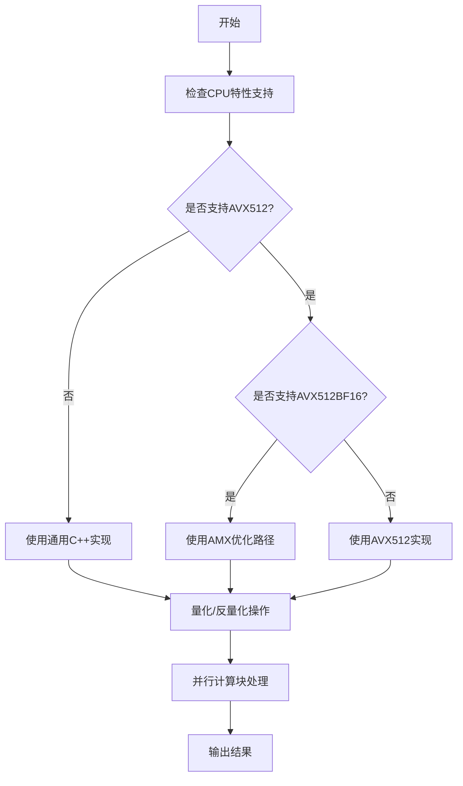
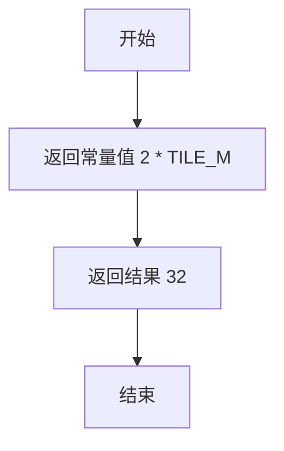
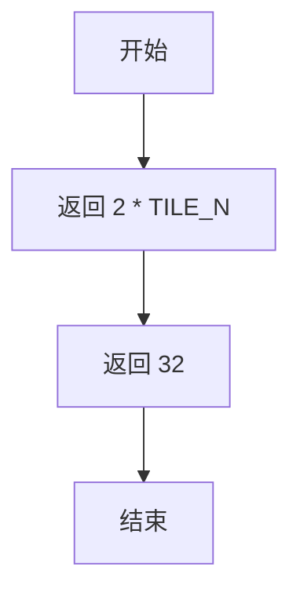
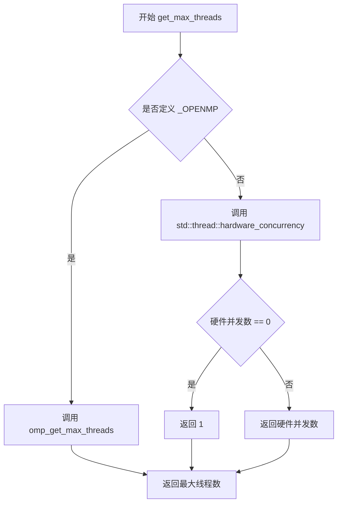
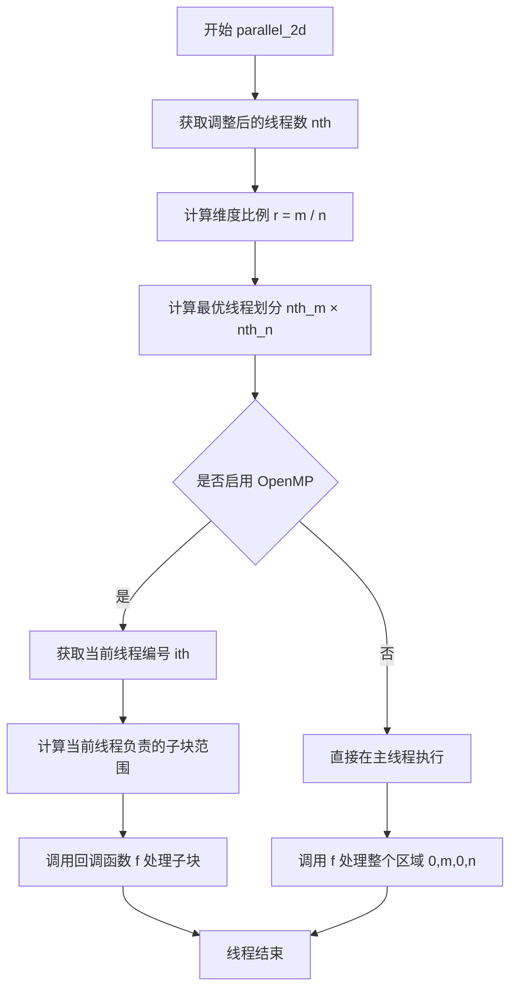
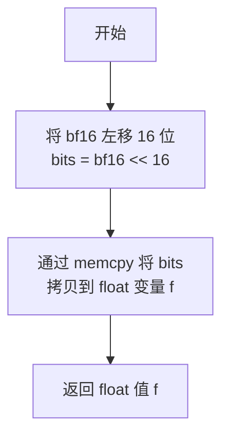
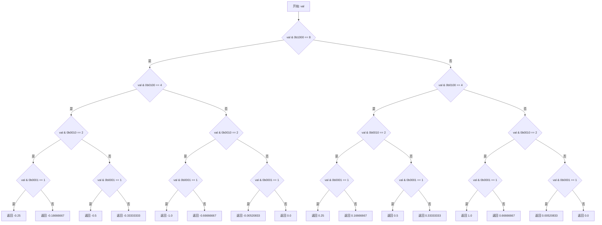
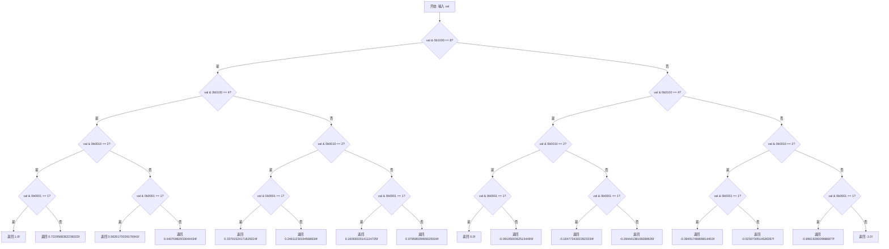
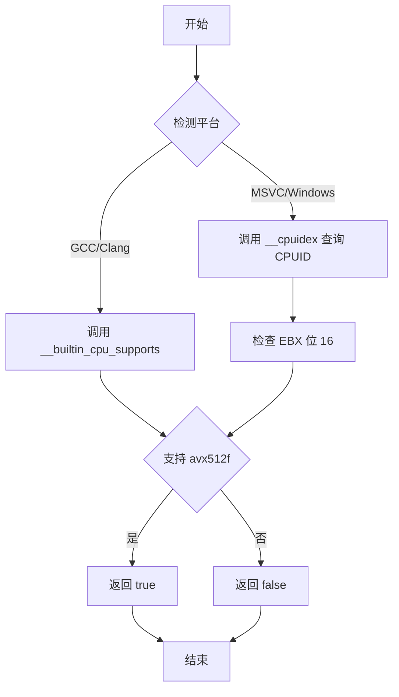
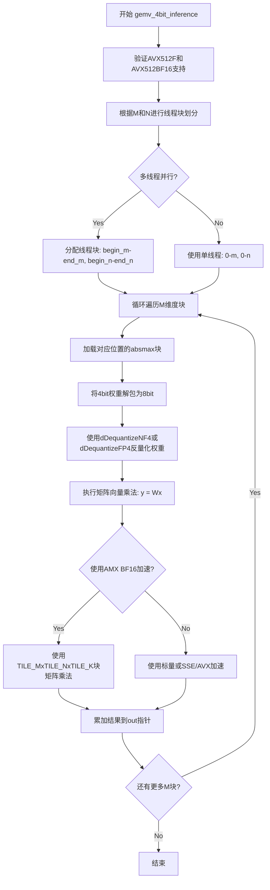

# `bitsandbytes\csrc\cpu_ops.h` 详细设计文档

这是一个用于量化神经网络模型推理的C++ CPU操作库头文件，提供了FP4/NF4/FP16/BF16等量化格式的转换、GEMM操作、并行计算等功能，支持AVX512加速和AMX指令集优化。

## 整体流程



## 类结构

```
fp16_t (浮点数结构体)
bf16_t (浮点数结构体)
Unroll<n> (模板结构体 - 循环展开)
无显式类定义
```

## 全局变量及字段


### `block_size_m`
    
返回 AMX GEMM 块大小 M

类型：`constexpr int`
    


### `block_size_n`
    
返回 AMX GEMM 块大小 N

类型：`constexpr int`
    


### `get_cache_blocks`
    
根据块大小和类型获取 L2 缓存块数

类型：`template function`
    


### `Unroll`
    
模板展开结构体，用于循环展开

类型：`template struct`
    


### `div_up`
    
向上除法函数

类型：`template function`
    


### `get_max_threads`
    
获取系统最大线程数

类型：`int`
    


### `adjust_num_threads`
    
根据矩阵维度调整线程数

类型：`int`
    


### `parallel_2d`
    
二维并行计算函数

类型：`template function`
    


### `quantize_cpu`
    
CPU 量化函数，将浮点数量化

类型：`void`
    


### `float_to_bf16`
    
将浮点数转换为 BF16 格式

类型：`bf16_t`
    


### `bf16_to_float`
    
将 BF16 格式转换为浮点数

类型：`float`
    


### `float_to_fp16`
    
将浮点数转换为 FP16 格式

类型：`fp16_t`
    


### `dDequantizeFP4`
    
FP4 格式反量化

类型：`float`
    


### `dDequantizeNF4`
    
NF4 格式反量化

类型：`float`
    


### `dequantizeBlockwise8bitCpu`
    
8 位块反量化

类型：`template function`
    


### `dequantizeBlockwise4bitCpu`
    
4 位块反量化

类型：`template function`
    


### `has_avx512f`
    
检查 CPU 是否支持 AVX512F

类型：`bool`
    


### `has_avx512bf16`
    
检查 CPU 是否支持 AVX512BF16

类型：`bool`
    


### `gemv_4bit_inference`
    
4 位矩阵向量乘法推理

类型：`template function`
    


### `fp16_t.v`
    
FP16 数据字段

类型：`uint16_t`
    


### `bf16_t.v`
    
BF16 数据字段

类型：`uint16_t`
    
    

## 全局函数及方法


### block_size_m

该函数是一个编译时常量（constexpr）函数，用于返回 AMX（Advanced Matrix Extensions）矩阵乘法操作中 M 维度的块大小。通过将基础瓦片大小 TILE_M（16）乘以 2，得到适合 AMX 硬件的块大小（32），以优化矩阵乘法的性能和内存局部性。

参数：无

返回值：`int`，返回 AMX GEMM 的 M 维度块大小，值为 2 * TILE_M = 32

#### 流程图



#### 带注释源码

```cpp
// block size for AMX gemm
// AMX 是一种 Intel 高级矩阵扩展技术，用于加速矩阵运算
// TILE_M 定义为 16（见代码第17行），block_size_m 返回 2*TILE_M = 32
// 这是一个编译时常量函数，在编译时即可确定返回值
constexpr int block_size_m() { return 2 * TILE_M; }
```


### `block_size_n`

这是一个 constexpr 函数，用于返回 AMX GEMM 操作的块大小（block size N），返回值为 `2 * TILE_N`（即 32）。

参数：无需参数

返回值：`int`，返回块大小 N 的整数值（编译时常量）

#### 流程图



#### 带注释源码

```cpp
// AMX 块大小定义
#define TILE_M 16
#define TILE_N 16
#define TILE_K 32

// 用于 AMX gemm 的块大小
// block_size_m 返回 2 * TILE_M = 32
constexpr int block_size_m() { return 2 * TILE_M; }

// block_size_n 返回 2 * TILE_N = 32
// 这是一个编译时常量函数，用于在编译时确定 N 维度的块大小
// 用于 AMX 矩阵乘法运算中的块划分
constexpr int block_size_n() { return 2 * TILE_N; }
```


### `get_cache_blocks`

该函数是一个模板函数，用于根据L2缓存大小（取50%即1MB）和数据类型T的大小，计算可以容纳在L2缓存中的块数量，常用于矩阵运算中的块划分优化。

参数：

- `chunk_size`：`int`，输入数据的块大小（通常为矩阵某个维度的大小）

返回值：`int`，可以容纳在L2缓存（50%利用率）中的块数量，确保至少返回1。

#### 流程图

```mermaid
flowchart TD
    A[开始] --> B[计算L2缓存大小: L2_size = 2048 * 1024 >> 1 = 1048576 字节]
    B --> C[计算单块内存占用: block_bytes = chunk_size * sizeof(T)]
    C --> D[计算块数量: blocks = L2_size / block_bytes]
    D --> E{blocks >= 1?}
    E -->|是| F[返回 blocks]
    E -->|否| G[返回 1]
    F --> H[结束]
    G --> H
```

#### 带注释源码

```cpp
// 模板函数：根据L2缓存计算可容纳的块数量
// T: 数据类型（模板参数），用于计算单个元素的大小
// chunk_size: 块大小（元素数量）
// 返回：可容纳在L2缓存中的块数量（至少为1）
template <typename T> inline int get_cache_blocks(int chunk_size) {
    // L2 2MB and ratio of 50%
    // 计算L2缓存可用大小：2MB = 2048KB = 2097152字节
    // 右移1位相当于除以2，即取50%作为可用缓存
    const int L2_size = 2048 * 1024 >> 1;  // 结果为1048576字节 (1MB)
    
    // 计算每个块占用的字节数 = 块大小 × 单个元素字节数
    // chunk_size: 要处理的元素数量
    // sizeof(T): 类型T的字节大小（如float为4字节）
    // 然后用L2可用缓存大小除以单块大小，得到可容纳的块数
    // std::max(1, ...) 确保至少返回1，避免返回0导致除零或循环问题
    return std::max(1, int(L2_size / (chunk_size * sizeof(T))));
}
```


### `div_up`

这是一个模板函数，用于执行整数向上取整（ceiling division）运算，即计算 `x / y` 并向上取整到最接近的整数。

参数：

- `x`：`T`，被除数（分子），需要是非负整数
- `y`：`T`，除数（分母），需要是正整数

返回值：`T`，返回 `x` 除以 `y` 的向上取整结果

#### 流程图

```mermaid
flowchart TD
    A[开始 div_up] --> B[输入参数 x 和 y]
    B --> C[计算 x + y - 1]
    C --> D[执行整数除法 (x + y - 1) / y]
    D --> E[返回结果]
    E --> F[结束]
    
    style A fill:#f9f,stroke:#333
    style F fill:#f9f,stroke:#333
```

#### 带注释源码

```cpp
/**
 * @brief 整数向上取整（Ceiling Division）
 * 
 * 该函数通过公式 (x + y - 1) / y 实现向上取整，避免了浮点运算的开销。
 * 原理：对于非负整数 x 和正整数 y，向上取整等于 (x + y - 1) / y
 * 
 * @tparam T 整数类型（通过 std::enable_if 限制为整数类型）
 * @param x 被除数（分子），要求为非负整数
 * @param y 除数（分母），要求为正整数
 * @return T 向上取整后的除法结果
 * 
 * @note 使用 SFINAE (Substitution Failure Is Not An Error) 确保只有整数类型可以调用此函数
 * @note 当 x 能被 y 整除时，结果正好是 x/y；否则结果是 x/y 向上取整
 * 
 * 示例：
 *   div_up(7, 3) = (7 + 3 - 1) / 3 = 9 / 3 = 3
 *   div_up(6, 3) = (6 + 3 - 1) / 3 = 8 / 3 = 2 (整数除法)
 *   div_up(10, 2) = (10 + 2 - 1) / 2 = 11 / 2 = 5
 */
template <typename T, typename std::enable_if<std::is_integral<T>::value, int>::type = 0> 
inline T div_up(T x, T y) {
    return (x + y - 1) / y;  // 通过加 y-1 实现向上取整，避免使用浮点数
}
```

#### 使用示例说明

```cpp
// 在代码中的实际调用（来自 parallel_2d 函数）
int thread_block_m = div_up(m, nth_m);  // 计算每个线程分配的 M 维度块大小
int thread_block_n = div_up(n, nth_n);  // 计算每个线程分配的 N 维度块大小

// 典型场景：
// m = 100, nth_m = 4 → div_up(100, 4) = (100 + 4 - 1) / 4 = 103 / 4 = 25
// 这表示将 100 个元素分配给 4 个线程，每个线程最多处理 25 个元素
```


### `get_max_threads`

获取系统支持的最大线程数，用于并行计算的资源分配。

参数： 无

返回值： `int`，返回系统支持的最大线程数

#### 流程图



#### 带注释源码

```cpp
// 获取系统支持的最大线程数
// 根据编译环境使用不同的方式获取线程数
inline int get_max_threads() {
#if defined(_OPENMP)
    // OpenMP 模式：使用 OpenMP 运行时获取配置的最大线程数
    return omp_get_max_threads();
#else
    // 标准 C++ 模式：获取硬件支持的并发线程数
    unsigned hc = std::thread::hardware_concurrency();
    // 硬件并发数为 0 表示无法检测，回退到单线程
    return hc == 0 ? 1 : int(hc);
#endif
}
```


### `adjust_num_threads`

该函数用于根据输入维度 `m` 调整并行线程数，确保线程数为偶数且至少为 1，以便在并行计算中获得更好的负载均衡和性能。

参数：

- `m`：`int`，输入参数，表示计算任务的维度大小（通常为矩阵的行数或类似维度），用于判断是否需要调整线程数

返回值：`int`，返回调整后的线程数

#### 流程图

```mermaid
flowchart TD
    A[开始] --> B[获取最大线程数 actual_nth = get_max_threads]
    B --> C{m == 1?}
    C -->|是| D[返回 actual_nth]
    C -->|否| E[计算 (actual_nth >> 1) * 2]
    E --> F[std::max(1, result)]
    D --> G[返回调整后的线程数]
    F --> G
    G --> H[结束]
```

#### 带注释源码

```cpp
// 根据输入维度m调整并行线程数
// 参数m: 输入参数，表示计算任务的维度大小
// 返回值: 调整后的线程数，确保为偶数且至少为1
inline int adjust_num_threads(int m) {
    // 获取系统支持的最大线程数
    int actual_nth = get_max_threads();
    
    // 如果维度m为1，说明任务是单维度的，直接返回最大线程数
    // 无需进行线程数调整
    if (m == 1)
        return actual_nth;
    
    // 否则，返回最大线程数的一半乘以2（即确保为偶数）
    // 右移1位相当于除以2，再乘以2恢复（如果原数为偶数）
    // std::max(1, ...) 确保线程数至少为1
    return std::max(1, (actual_nth >> 1) * 2);
}
```


### `parallel_2d`

这是一个二维并行化函数模板，用于将一个二维计算任务（由 m×n 的工作空间定义）分配到多个CPU线程上执行。它通过计算最优的线程块划分（优先追求方形块），将工作空间划分为多个子区域，并行调用用户提供的回调函数。

参数：

- `m`：`int`，二维任务的第一个维度大小（例如矩阵的行数）
- `n`：`int`，二维任务的第二个维度大小（例如矩阵的列数）
- `f`：`const func_t&`，用户提供的回调函数，签名为 `void(int begin_m, int end_m, int begin_n, int end_n)`，用于处理分配给当前线程的子区域

返回值：`void`，无返回值

#### 流程图



#### 带注释源码

```cpp
/**
 * @brief 二维并行化函数模板
 * 
 * 该函数将一个二维工作空间 (m x n) 划分并分配给多个 CPU 线程执行。
 * 线程划分策略：优先使用方形块 (square block)，使每个线程的工作负载尽可能均衡。
 * 
 * @tparam func_t 用户回调函数类型
 * @param m       第一个维度大小（如矩阵行数）
 * @param n       第二个维度大小（如矩阵列数）
 * @param f       回调函数，签名为 void(int begin_m, int end_m, int begin_n, int end_n)
 */
template <typename func_t> inline void parallel_2d(int m, int n, const func_t& f) {
    // 确保线程数为偶数，以便更好地进行负载均衡
    int nth = adjust_num_threads(m);

    // [NOTE] 线程块划分策略:
    //
    //   1) 每个线程优先使用方形块 (square block per thread)
    //   2) 使用偶数个 CPU 核心
    //   3) 充分利用所有 num_threads 核心
    //
    //   约束条件:
    //     TM * TN = T        (总线程数 = TM * TN)
    //     BM / TM = BN / TN  (每个线程的工作块保持相似形状)
    //   推导:
    //     TM = ((BM / BN) * T) ^ 0.5
    //
    // 计算维度比例
    float r = float(m) / n;
    
    // 初始猜测：nth_m = ceil(sqrt(r * nth))
    int nth_m = std::ceil(std::sqrt(r * nth));
    int nth_n = 1;
    
    // 寻找满足 nth_m * nth_n == nth 的最优划分
    for (; nth_m > 0; --nth_m) {
        nth_n = nth / nth_m;
        if (nth_m * nth_n == nth) {
            break;
        }
    }

#if defined(_OPENMP)
    // 使用 OpenMP 进行并行化
    #pragma omp parallel num_threads(nth)
    {
        // 获取当前线程编号
        int ith = omp_get_thread_num();
        
        // 计算当前线程在 2D 线程网格中的位置
        int ith_m = ith / nth_n;  // 行方向线程索引
        int ith_n = ith % nth_n;  // 列方向线程索引

        // 计算每个线程负责的块大小（向上取整）
        int thread_block_m = div_up(m, nth_m);
        int thread_block_n = div_up(n, nth_n);

        // 计算当前线程负责的子区域范围 [begin_m, end_m) x [begin_n, end_n)
        int begin_m = ith_m * thread_block_m;
        int end_m = std::min(m, begin_m + thread_block_m);
        int begin_n = ith_n * thread_block_n;
        int end_n = std::min(n, begin_n + thread_block_n);

        // 调用用户函数处理该子区域
        f(begin_m, end_m, begin_n, end_n);
    }
#else
    // 非 OpenMP 模式：直接在主线程执行整个区域
    f(0, m, 0, n);
#endif
}
```


### `quantize_cpu`

这是一个全局量化函数，用于将浮点数组按块进行动态范围量化，将32位浮点数转换为8位无符号整数表示，并输出量化码本和每个块的最大绝对值用于后续反量化。

参数：

- `code`：`float*`，输出参数，量化码本，存储量化后的代表性浮点值
- `A`：`float*`，输入参数，待量化的原始浮点数据数组
- `absmax`：`float*`，输出参数，每个量化块的最大绝对值，用于缩放和反量化
- `out`：`unsigned char*`，输出参数，量化后的8位无符号整数索引
- `blocksize`：`long long`，每个量化块包含的元素数量
- `n`：`long long`，输入数组A的总元素数量

返回值：`void`，无返回值，通过输出参数返回结果

#### 流程图

```mermaid
flowchart TD
    A[开始 quantize_cpu] --> B[计算块数量: n / blocksize]
    B --> C{并行遍历每个块}
    C -->|每块| D[查找当前块的最大绝对值absmax[i]]
    D --> E[计算量化Scale: 255.0 / absmax]
    E --> F[对块内每个元素进行量化]
    F --> G[计算量化索引: (A[j] / absmax[i] + 1) * 127.5]
    G --> H[将量化索引存入out数组]
    H --> I[将对应的代表值存入code数组]
    I --> C
    C --> J[结束]
```

#### 带注释源码

```cpp
// 函数声明（头文件中仅有声明，无实现）
// quantize_cpu: 将浮点数组按块进行动态范围量化
// 
// 参数说明:
//   code:     输出，量化码本（codebook），存储量化后的代表性浮点值
//   A:        输入，待量化的原始32位浮点数据数组
//   absmax:   输出，每个量化块的最大绝对值（用于反量化时的缩放）
//   out:      输出，量化后的8位无符号整数索引值
//   blocksize:输入，每个量化块的大小（元素数量）
//   n:        输入，总元素数量
//
// 返回值: void（结果通过输出参数返回）
void quantize_cpu(float* code, float* A, float* absmax, unsigned char* out, long long blocksize, long long n);

// 注意：当前提供的头文件中仅有函数声明，
// 实际的函数实现位于对应的 .cpp 或 .cu 文件中
// 从函数签名推断，其实现逻辑可能包含：
// 1. 将输入数组A按blocksize分块
// 2. 对每块计算最大绝对值(absmax)
// 3. 使用absmax作为缩放因子将浮点值映射到[0, 255]范围
// 4. 存储量化索引到out，存储代表值到codebook
```


### `float_to_bf16`

将32位IEEE 754单精度浮点数（float）转换为16位脑浮点数（brain float 16, bf16），通过位操作实现精确的数值转换。

参数：

- `x`：`float`，输入的32位单精度浮点数

返回值：`bf16_t`，转换后的16位脑浮点数

#### 流程图

```mermaid
flowchart TD
    A[开始: 输入float x] --> B[memcpy将float的32位复制到uint32_t bits]
    B --> C[计算舍入: r = bits + 0x7FFF + ((bits >> 16) & 1)]
    C --> D[提取高16位: result = r >> 16]
    D --> E[包装为bf16_t并返回]
    
    style A fill:#f9f,stroke:#333
    style E fill:#9f9,stroke:#333
```

#### 带注释源码

```cpp
static inline bf16_t float_to_bf16(float x) {
    // 步骤1: 通过memcpy安全地获取float的位表示
    // 使用memcpy而非直接类型转换，避免违反C++严格别名规则
    uint32_t bits;
    std::memcpy(&bits, &x, 4);
    
    // 步骤2: 执行舍入转换
    // 0x7FFF = 32767，是(1 << 16) - 1，用于在第16位添加偏置实现round-to-nearest-even
    // ((bits >> 16) & 1) 获取第16位（bf16精度位），用于处理.5情况下的偶数舍入
    // 例如: 0x3F800000 (1.0) -> bits=0x3F800000 -> r=0x3F800000+0x7FFF+0x3F8FFF=0x407FFF
    //       -> r>>16 = 0x40 = 16320 (约1.0的bf16表示)
    uint32_t r = bits + 0x7FFF + ((bits >> 16) & 1);
    
    // 步骤3: 提取高16位作为bf16结果
    // bf16格式: 1位符号 + 8位指数 + 7位尾数
    // float格式: 1位符号 + 8位指数 + 23位尾数
    // 通过右移16位，直接保留符号位、指数和bf16的7位精度位
    return bf16_t{static_cast<uint16_t>(r >> 16)};
}
```


### `bf16_to_float`

该函数实现将 Brain Float 16（BF16）格式的 16 位浮点数转换为 IEEE 754 单精度浮点数（float）的功能。BF16 与 float 的区别在于 BF16 仅有 1 位符号位和 8 位指数位，移除了 23 位尾数位中的 16 位，因此通过左移 16 位并利用内存拷贝方式重新解释比特位即可完成转换。

参数：

- `bf16`：`uint16_t`，输入的 BF16 格式 16 位浮点数

返回值：`float`，转换后的 32 位单精度浮点数

#### 流程图



#### 带注释源码

```cpp
// 将 BF16 (16-bit Brain Float) 转换为 IEEE 754 float (32-bit)
static float bf16_to_float(uint16_t bf16) {
    // 步骤1: 将 16 位 BF16 扩展到 32 位
    // BF16 格式: 1 位符号 + 8 位指数 + 7 位尾数
    // Float 格式: 1 位符号 + 8 位指数 + 23 位尾数
    // 通过左移 16 位，将 BF16 放到 float 的高 16 位
    uint32_t bits = (uint32_t)bf16 << 16;
    
    // 步骤2: 通过内存拷贝将 32 位整数重新解释为 float
    // 避免直接的位操作可能带来的编译器优化问题
    // 使用 memcpy 是处理类型双关的标准安全做法
    float f;
    std::memcpy(&f, &bits, sizeof(f));
    
    // 步骤3: 返回转换后的单精度浮点数
    return f;
}
```


### `float_to_fp16`

将32位IEEE 754单精度浮点数转换为16位半精度浮点数(FP16)，处理了Inf、NaN、上溢、下溢、次正规数等特殊情况，并遵循IEEE 754半精度浮点数格式规范进行舍入。

参数：

- `x`：`float`，输入的32位单精度浮点数

返回值：`fp16_t`，转换后的16位半精度浮点数结构体

#### 流程图

```mermaid
flowchart TD
    A[开始: 输入float x] --> B[将float的位表示复制到uint32_t bits]
    B --> C[提取符号位sign = bits[31]]
    C --> D[提取指数exp = bits[30:23]]
    D --> E[提取尾数mant = bits[22:0]]
    E --> F{exp == 0xFF?<br/>Inf/NaN}
    F -->|Yes| G[处理Inf/NaN: mant16 = mant?0x200:0<br/>h = sign<<15 | 0x1F<<10 | mant16]
    F -->|No| H{exp > 0x8E?<br/>上溢}
    H -->|Yes| I[设置h为Inf: sign<<15 | 0x1F<<10]
    H -->|No| J{exp < 0x71?<br/>次正规数或零}
    J -->|Yes| K{exp < 0x67?<br/>太小}
    K -->|Yes| L[结果为0: h = sign<<15]
    K -->|No| M[处理次正规数<br/>计算shift = 0x71-exp<br/>添加隐藏位并舍入]
    J -->|No| N[处理正规数<br/>exp_h = exp-127+15<br/>尾数舍入并检查溢出]
    N --> O{舍入后尾数溢出?}
    O -->|Yes| P[尾数归零, exp_h+1<br/>检查是否溢出到Inf]
    O -->|No| Q[组合结果: sign<<15 | exp_h<<10 | mant_rounded>>13]
    G --> R[返回fp16_t{h}]
    I --> R
    L --> R
    M --> R
    P --> R
    Q --> R
```

#### 带注释源码

```cpp
// 将32位float转换为16位半精度浮点数(FP16)
// 参数: x - 输入的32位单精度浮点数
// 返回值: fp16_t - 转换后的16位半精度浮点数结构体
static inline fp16_t float_to_fp16(float x) {
    // 步骤1: 通过memcpy安全地将float的位表示复制到uint32_t
    // 避免直接类型转换带来的未定义行为
    uint32_t bits;
    std::memcpy(&bits, &x, 4);
    
    // 步骤2: 提取IEEE 754单精度浮点数的各个组成部分
    // 符号位: 1位 (bit 31)
    uint32_t sign = (bits >> 31) & 0x1;
    // 指数位: 8位 (bits 30-23), 偏置为127
    uint32_t exp = (bits >> 23) & 0xFF;
    // 尾数位: 23位 (bits 22-0), 不包含隐藏的前导1
    uint32_t mant = bits & 0x7FFFFF;

    uint16_t h;
    
    // 步骤3: 处理特殊情况
    // 情况1: 无穷大(Inf)或非数字(NaN)
    // 指数位全为1 (exp == 0xFF) 表示无穷大或NaN
    if (exp == 0xFF) {
        // 如果尾数非零,则是NaN;否则是Inf
        // quiet NaN: 设置尾数的最高位(bit 9)
        uint16_t mant16 = mant ? 0x200 : 0;
        // FP16格式: 符号1位 + 指数5位 + 尾数10位
        h = (sign << 15) | (0x1F << 10) | mant16;
    }
    // 情况2: 上溢 - 指数太大，无法用FP16表示
    // FP16指数范围: 1-30 (偏置+15), 对应float指数约113-142
    // 0x70 + 0x1E = 0x8E = 142
    else if (exp > 0x70 + 0x1E) {
        // 结果为无穷大
        h = (sign << 15) | (0x1F << 10);
    }
    // 情况3: 下溢 - 次正规数或零
    // FP16正规数最小指数为1 (exp_f >= 113, 即exp >= 0x71)
    else if (exp < 0x71) {
        // 情况3a: 太小无法表示, 直接置零
        // 0x67 = 103, 对应float指数小于-24
        if (exp < 0x67) {
            h = (sign << 15);  // 符号位保留, 其余为0
        }
        // 情况3b: 次正规数(Subnormal)
        // FP16次正规数: 指数为0, 尾数没有隐藏的前导1
        else {
            // 计算需要右移的位数
            // 0x71 - exp = 113 - exp_f, 即float指数到FP16指数的转换差值
            uint32_t shift = 0x71 - exp;
            // 添加隐藏的前导1(在float中隐含,在FP16中需要显式处理)
            uint32_t mant_with_hidden = mant | 0x800000;
            // 舍入处理: 在移位前添加偏移量
            // 23-10 = 13位需要丢弃, 加上shift位
            uint32_t rounded = (mant_with_hidden + (1u << (shift + 12))) >> (shift + 13);
            h = (sign << 15) | (uint16_t)rounded;
        }
    }
    // 情况4: 正规数 - 正常的浮点数转换
    else {
        // 将float指数转换为FP16指数
        // 减127( float偏置) 加15(FP16偏置)
        uint32_t exp_h = exp - 127 + 15;
        
        // 尾数舍入: FP16尾数10位, float尾数23位, 需要截断13位
        // 添加2^(23-10-1) = 0x1000 进行舍入
        uint32_t mant_rounded = mant + 0x00001000;
        
        // 舍入可能导致尾数溢出(进位到指数)
        if (mant_rounded & 0x00800000) {
            // 清除溢出位
            mant_rounded = 0;
            // 指数加1
            ++exp_h;
            
            // 检查指数是否溢出
            if (exp_h >= 0x1F) {
                // 溢出到无穷大
                h = (sign << 15) | (0x1F << 10);
                return fp16_t{h};
            }
        }
        
        // 组合最终的FP16表示
        // 符号位(bit 15) + 指数位(bits 14-10) + 尾数位(bits 9-0)
        h = (sign << 15) | ((uint16_t)exp_h << 10) | ((uint16_t)(mant_rounded >> 13));
    }
    
    return fp16_t{h};
}
```


### `dDequantizeFP4`

该函数实现FP4（4位浮点数）格式的反量化操作，将一个4位无符号字符（8-bit中的低4位）解码为对应的32位浮点数值。函数通过位掩码逐位检查输入值的4个二进制位（bit3, bit2, bit1, bit0），根据不同的位组合模式返回预先定义好的量化表中的浮点数值，实现从紧凑的4位表示到全精度浮点的映射。

参数：

- `val`：`unsigned char`，8位无符号字符，其中低4位（bit0-bit3）存储FP4格式的量化值

返回值：`float`，返回反量化后的32位浮点数值

#### 流程图



#### 带注释源码

```cpp
// FP4 (4-bit Floating Point) 反量化函数
// 将4位量化值映射回32位浮点数
// 使用嵌套的位检查实现查表操作，避免使用数组索引
inline float dDequantizeFP4(unsigned char val) {
    // 检查最高位 (bit3): 决定正负符号
    if ((val & 0b1000) == 8) {
        // 负数区间 (bit3 = 1)
        if ((val & 0b0100) == 4) {
            // bit3=1, bit2=1
            if ((val & 0b0010) == 2) {
                // bit3=1, bit2=1, bit1=1
                if ((val & 0b0001) == 1)
                    return -0.25000000f;   // 二进制: 1111 -> -0.25
                else
                    return -0.16666667f;   // 二进制: 1110 -> -1/6
            } else {
                // bit3=1, bit2=1, bit1=0
                if ((val & 0b0001) == 1)
                    return -0.50000000f;   // 二进制: 1101 -> -0.5
                else
                    return -0.33333333f;   // 二进制: 1100 -> -1/3
            }
        } else {
            // bit3=1, bit2=0
            if ((val & 0b0010) == 2) {
                // bit3=1, bit2=0, bit1=1
                if ((val & 0b0001) == 1)
                    return -1.00000000f;   // 二进制: 1011 -> -1.0
                else
                    return -0.66666667f;   // 二进制: 1010 -> -2/3
            } else {
                // bit3=1, bit2=0, bit1=0
                if ((val & 0b0001) == 1)
                    return -5.208333333e-03f; // 二进制: 1001 -> -1/192 (极小负数)
                else
                    return 0.00000000f;    // 二进制: 1000 -> 零
            }
        }
    } else {
        // 正数区间 (bit3 = 0)
        if ((val & 0b0100) == 4) {
            // bit3=0, bit2=1
            if ((val & 0b0010) == 2) {
                // bit3=0, bit2=1, bit1=1
                if ((val & 0b0001) == 1)
                    return 0.25000000f;    // 二进制: 0111 -> 0.25
                else
                    return 0.16666667f;     // 二进制: 0110 -> 1/6
            } else {
                // bit3=0, bit2=1, bit1=0
                if ((val & 0b0001) == 1)
                    return 0.50000000f;    // 二进制: 0101 -> 0.5
                else
                    return 0.33333333f;    // 二进制: 0100 -> 1/3
            }
        } else {
            // bit3=0, bit2=0
            if ((val & 0b0010) == 2) {
                // bit3=0, bit2=0, bit1=1
                if ((val & 0b0001) == 1)
                    return 1.00000000f;    // 二进制: 0011 -> 1.0
                else
                    return 0.66666667f;     // 二进制: 0010 -> 2/3
            } else {
                // bit3=0, bit2=0, bit1=0
                if ((val & 0b0001) == 1)
                    return 5.208333333e-03f; // 二进制: 0001 -> 1/192 (极小正数)
                else
                    return 0.00000000f;    // 二进制: 0000 -> 零
            }
        }
    }
}
```


### `dDequantizeNF4`

该函数用于将NF4（Normal Float 4-bit）格式的8位无符号字符（包含2个4-bit值）反量化为对应的32位浮点数。它通过位掩码检测输入值的4个位的状态（从高位到低位），并根据NF4编码规范返回对应的浮点值。NF4是一种非对称的4位量化格式，用于在保持数值范围的同时压缩模型权重。

参数：

- `val`：`unsigned char`，输入的8位字节，包含一个4位NF4编码值（实际使用低4位或整个字节取决于调用方式）

返回值：`float`，返回反量化后的32位浮点值

#### 流程图



#### 带注释源码

```cpp
// NF4反量化函数：将4位NF4编码值转换为浮点数
// NF4 (Normal Float 4-bit) 是一种非对称量化格式
// 该函数通过位操作解析4位输入值的不同组合
inline float dDequantizeNF4(unsigned char val) {

    // the values for this tree was generated by test_normal_map_tree
    // in the file tests/test_functional.py
    // 解析过程：从高位到低位依次检查每一位的值
    
    // 检查最高位 (bit 3)
    if ((val & 0b1000) == 8)
        // bit3 = 1: 正值范围
        if ((val & 0b0100) == 4)         // bit2 = 1
            if ((val & 0b0010) == 2)     // bit1 = 1
                if ((val & 0b0001) == 1) // bit0 = 1, 1111
                    return 1.0f;         //*1111 最大正数
                else
                    return 0.7229568362236023f; //*1110
            else if ((val & 0b0001) == 1)       // bit0 = 1, 1101
                return 0.5626170039176941f;     //*1101
            else
                return 0.44070982933044434f; //*1100
        else if ((val & 0b0010) == 2)        // bit2 = 0, bit1 = 1
            if ((val & 0b0001) == 1)         // 1011
                return 0.33791524171829224f; //*1011
            else
                return 0.24611230194568634f; //*1010
        else if ((val & 0b0001) == 1)        // bit2 = 0, bit1 = 0, bit0 = 1
            return 0.16093020141124725f;     //*1001
        else
            return 0.07958029955625534f; //*1000

    // bit3 = 0: 负值或零值范围
    else if ((val & 0b0100) == 4)    // bit2 = 1
        if ((val & 0b0010) == 2)     // bit1 = 1
            if ((val & 0b0001) == 1) // 0111
                return 0.0f;         //*0111 零值
            else
                return -0.09105003625154495f; //*0110
        else if ((val & 0b0001) == 1)         // bit1 = 0, bit0 = 1
            return -0.18477343022823334f;     //*0101
        else
            return -0.28444138169288635f; //*0100
    else if ((val & 0b0010) == 2)         // bit2 = 0, bit1 = 1
        if ((val & 0b0001) == 1)          // 0011
            return -0.39491748809814453f; //*0011
        else
            return -0.5250730514526367f; //*0010
    else if ((val & 0b0001) == 1)        // bit2 = 0, bit1 = 0, bit0 = 1
        return -0.6961928009986877f;     //*0001
    else
        return -1.0f; //*0000 最小负数
}
```


### `dequantizeBlockwise8bitCpu`

该函数是一个模板函数，用于执行逐块的8位反量化操作。它接收量化后的8位数据、每块的绝对最大值（absmax）和量化码本（code），通过查找码本并乘以对应的缩放因子（absmax/127.0f），将压缩的8位数据重新转换为原始的浮点数输出。

参数：

- `code`：`float*`，量化码本，包含256个可能的量化值
- `A`：`unsigned char*`，指向待反量化的8位量化数据数组
- `absmax`：`const float*`，指向每块的绝对最大值数组，用于缩放
- `out`：`T*`，指向输出缓冲区，用于存储反量化后的浮点结果
- `blocksize`：`long long`，每个块的大小
- `n`：`long long`，总元素数量

返回值：`void`，无返回值（结果直接写入out指针指向的缓冲区）

#### 流程图

```mermaid
flowchart TD
    A[开始 dequantizeBlockwise8bitCpu] --> B{遍历每个块 i 从 0 到 n/blocksize}
    B --> C[获取第i块的absmax值: scale = absmax[i]]
    C --> D[计算缩放因子: factor = scale / 127.0f]
    D --> E{遍历块内每个元素 j}
    E --> F[读取量化值: val = A[i * blocksize + j]]
    F --> G[查找码本: quantized_val = code[val]]
    G --> H[计算输出: out[i * blocksize + j] = quantized_val * factor]
    H --> E
    E --> I{块遍历完成?}
    I --> B
    B --> J[结束]
    
    style A fill:#f9f,stroke:#333
    style J fill:#9f9,stroke:#333
```

#### 带注释源码

```cpp
// 注意：此函数在当前代码中仅为声明，尚未实现
// 以下为基于函数签名的预期实现逻辑

template <typename T>
void dequantizeBlockwise8bitCpu(
    float* code,        // 量化码本，包含256个float值
    unsigned char* A,   // 输入的8位量化数据
    const float* absmax,// 每块的绝对最大值（缩放因子）
    T* out,             // 输出缓冲区（反量化后的浮点数据）
    long long blocksize,// 块大小
    long long n         // 总元素数
) {
    // 计算总块数
    long long num_blocks = n / blocksize;
    
    // 遍历每个块
    for (long long i = 0; i < num_blocks; ++i) {
        // 获取当前块的缩放因子
        // absmax[i] 是该块中绝对值的最大值
        float scale = absmax[i];
        
        // 计算缩放系数：使用127.0f作为中间值
        // 8位有符号量化范围是[-127, 127]或无符号[0, 255]
        float factor = scale / 127.0f;
        
        // 遍历块内每个元素
        for (long long j = 0; j < blocksize; ++j) {
            // 读取量化值（0-255）
            unsigned char val = A[i * blocksize + j];
            
            // 从码本中查找对应的量化值
            float quantized_val = code[val];
            
            // 反量化：码本值 * 缩放因子
            out[i * blocksize + j] = static_cast<T>(quantized_val * factor);
        }
    }
}
```

#### 备注

1. **函数状态**：该函数在此代码中仅有声明（模板函数声明），未包含实现代码。实际实现可能在对应的 `.cpp` 源文件中。

2. **设计意图**：
   - 这是一个CPU端的8位块式反量化函数
   - 属于 BitsAndBytes 量化库的底层操作
   - 支持模板参数 `T`，可输出不同精度（如 float, half 等）

3. **潜在优化空间**：
   - 可考虑添加 SIMD 加速（如 AVX2/AVX512）
   - 可添加多线程并行处理（OpenMP）
   - 当前实现如未并行化，大数据量时性能可能受限


### `dequantizeBlockwise4bitCpu`

这是一个模板函数，用于对4位量化数据进行逐块反量化（dequantization）。该函数接收压缩的4位输入数据，结合每个块的绝对最大值（absmax）进行反量化，输出浮点数或指定类型的原始数据。支持多种输出数据类型（通过模板参数T指定）和不同的4位量化数据格式（通过DATA_TYPE模板参数指定，如FP4或NF4）。

参数：

- `A`：`unsigned char*`，输入的4位量化数据指针，每个字节存储两个4位值
- `absmax`：`const float*`，每个量化块的绝对最大值数组，用于缩放反量化后的值
- `out`：`T*`，输出缓冲区，存储反量化后的浮点数或指定类型数据
- `blocksize`：`long long`，每个量化块的大小（包含的元素数量）
- `m`：`long long`，输入矩阵的行数
- `n`：`long long`，输入矩阵的列数

返回值：`void`，该函数无返回值，结果直接写入out参数指向的缓冲区

#### 流程图

```mermaid
flowchart TD
    A[开始 dequantizeBlockwise4bitCpu] --> B[计算总块数: (m * n) / blocksize]
    B --> C{遍历每个块}
    C -->|每个块| D[获取当前块的absmax值]
    D --> E[遍历块内每个元素]
    E --> F{读取4位量化值}
    F --> G[根据DATA_TYPE调用对应解码头函数<br/>dDequantizeFP4 或 dDequantizeNF4]
    G --> H[计算反量化值: quantized_value * absmax]
    H --> I[将结果写入输出缓冲区out]
    E --> J{块内元素遍历完成?}
    J -->|否| F
    J -->|是| K{所有块遍历完成?}
    C -->|是| K
    K -->|否| C
    K -->|是| L[结束]
```

#### 带注释源码

```cpp
// 模板函数声明
// T: 输出数据类型（浮点数类型）
// DATA_TYPE: 量化数据类型标识（用于区分FP4、NF4等不同量化格式）
template <typename T, int DATA_TYPE>
void dequantizeBlockwise4bitCpu(
    unsigned char* A,      // 输入: 4位量化数据（每个字节存储2个4位值）
    const float* absmax,   // 输入: 每个块的绝对最大值（用于反量化缩放）
    T* out,                // 输出: 反量化后的数据
    long long blocksize,   // 输入: 每个块的大小
    long long m,           // 输入: 矩阵行数
    long long n            // 输入: 矩阵列数
);
```

#### 补充说明

该函数为声明形式，未在当前代码文件中包含具体实现。根据代码上下文分析：

1. **模板参数**：
   - `T`：可以是 `float`、`bf16_t`、`fp16_t` 等数值类型
   - `DATA_TYPE`：用于区分不同的4位量化格式（如 FP4、NF4 等）

2. **配套函数**：
   - `dDequantizeFP4()`：用于解码 FP4 格式的量化值
   - `dDequantizeNF4()`：用于解码 NF4（Normal Float 4-bit）格式的量化值

3. **数据存储格式**：
   - 输入数据 `A` 采用紧凑存储方式，每字节存储两个4位值
   - 需要配合 `absmax` 数组实现正确的缩放反量化

4. **潜在优化方向**：
   - 可参考 `dequantizeBlockwise8bitCpu` 的实现方式
   - 可利用 SIMD 指令（AVX512）进行向量化优化（类似 `gemv_4bit_inference`）


### `has_avx512f`

该函数用于检测当前 CPU 是否支持 AVX512F（AVX-512 Foundation）指令集。它通过调用编译器内置函数或 CPUID 指令来查询处理器功能位，并返回一个布尔值表示支持状态。

参数： 无

返回值：`bool`，返回 true 表示 CPU 支持 AVX512F 指令集，返回 false 表示不支持

#### 流程图



#### 带注释源码

```cpp
// MSVC 平台 (Windows) 的实现
#if defined(__AVX512F__)
#ifdef _MSC_VER
#include <intrin.h>

static inline bool has_avx512f() {
    // 使用静态局部变量进行缓存，避免重复检测
    static bool v = [] {
        int info[4];                      // CPUID 输出数组
        __cpuidex(info, 7, 0);            // 调用 CPUID leaf=7, subleaf=0
        // EBX 的第 16 位对应 AVX512F 功能位
        return (info[1] & (1 << 16)) != 0; // 检查 AVX512F 支持
    }();
    return v;
}

// 非 MSVC 平台 (GCC/Clang) 的实现
#else
static inline bool has_avx512f() {
    // 使用编译器内置函数检测 CPU 支持情况
    // __builtin_cpu_supports 是编译时安全的检测方式
    static const bool supported_avx512f = __builtin_cpu_supports("avx512f");
    return supported_avx512f;
}
#endif
#endif
```

#### 备注

- 该函数被 `#if defined(__AVX512F__)` 条件编译保护，确保只在编译时已知支持 AVX512F 的环境下使用
- 使用 `static` 变量缓存检测结果，避免重复调用 CPUID 或重复执行运行时检测
- MSVC 版本使用 `__cpuidex`  intrinsics 函数，直接查询 CPUID  leaf 7 (subleaf 0) 的 EBX 寄存器第 16 位
- GCC/Clang 版本使用 `__builtin_cpu_supports` 编译器内置函数，提供跨平台兼容性


### `has_avx512bf16`

该函数用于检测当前 CPU 是否支持 AVX512-BF16（Brain Float 16）指令集。该函数通过调用 CPUID 指令或使用编译器内置函数来查询处理器的特性支持，并返回一个布尔值表示支持状态。

参数：空

返回值：`bool`，返回 true 表示 CPU 支持 AVX512-BF16 指令集，返回 false 表示不支持。

#### 流程图

```mermaid
flowchart TD
    A[开始] --> B{检查是否定义了<br/>__AVX512BF16__宏}
    B -->|是| C{检查是否为MSVC编译器}
    C -->|是| D[调用__cpuidex获取CPU信息<br/>参数: eax=7, ecx=1]
    C -->|否| E[调用__builtin_cpu_supports<br/>参数: "avx512bf16"]
    D --> F{检查EAX寄存器第5位}
    E --> G{检查返回值}
    F -->|为1| H[返回true]
    F -->|为0| I[返回false]
    G -->|为true| H
    G -->|为false| I
    B -->|否| I
    I[返回false]
    H[结束]
```

#### 带注释源码

```cpp
#if defined(__AVX512BF16__)

// MSVC 编译器下的实现
#if defined(_MSC_VER)
static inline bool has_avx512bf16() {
    // 使用静态局部变量进行延迟初始化，只在首次调用时执行CPU检测
    static bool v = [] {
        int info[4];  // 用于存储CPUID指令返回的4个32位寄存器值
        // 调用CPUID指令，参数eax=7, ecx=1用于查询AVX512-BF16支持
        __cpuidex(info, 7, 1);
        // EAX寄存器的第5位（bit 5）表示AVX512_BF16功能
        // (1 << 5) = 0x20，检查该位是否被设置
        return (info[0] & (1 << 5)) != 0;
    }();
    return v;
}

// GCC/Clang 编译器下的实现
#else
static inline bool has_avx512bf16() {
    // 使用编译器内置函数检测CPU特性，比直接调用CPUID更便携
    static const bool supported_avx512bf16 = __builtin_cpu_supports("avx512bf16");
    return supported_avx512bf16;
}
#endif

#endif
```


### `gemv_4bit_inference`

这是一个基于AVX512BF16指令集优化的4bit量化矩阵向量乘法（GEMV）推理函数，用于在CPU上高效执行Transformer模型中量化权重的推理计算。函数接收float/half类型的输入数据和4bit量化权重，结合每个块的绝对最大值(absmax)进行反量化，然后执行矩阵乘法并输出结果。

参数：

- `M`：`int64_t`，输出矩阵的行数，对应batch size或sequence length
- `N`：`int64_t`，输入矩阵的列数，通常为隐藏维度
- `K`：`int64_t`，权重矩阵的列数，也是输出的隐藏维度
- `x`：`const T* __restrict__`，输入数据指针，指向float或half类型的输入矩阵
- `w`：`const unsigned char* __restrict__`，量化后的4bit权重数据指针
- `absmax`：`const T* __restrict__`，每个量化块的绝对最大值数组，用于反量化
- `out`：`T* __restrict__`，输出结果指针，存储GEMV计算结果
- `blocksize`：`int64_t`，量化块大小，决定每个absmax对应的权重数量
- `x_stride`：`int64_t`，输入数据的步长，用于处理非连续内存布局
- `out_stride`：`int64_t`，输出数据的步长，用于处理非连续内存布局

返回值：`void`，无返回值，结果通过out指针输出

#### 流程图



#### 带注释源码

```cpp
// 仅在AVX512F和AVX512BF16指令集可用时编译此函数
#if defined(__AVX512F__) && defined(__AVX512BF16__)

/**
 * @brief 4bit量化矩阵向量乘法推理函数
 * 
 * @tparam T 输入/输出数据类型，支持float或half
 * @tparam DATA_TYPE 量化数据类型，NF4(0)或FP4(1)
 * 
 * @param M 输出矩阵行数（batch size或sequence length）
 * @param N 输入矩阵列数（隐藏维度）
 * @param K 权重矩阵列数（输出隐藏维度）
 * @param x 输入数据指针（float/half）
 * @param w 量化后的4bit权重指针
 * @param absmax 每个量化块的绝对最大值
 * @param out 输出结果指针
 * @param blocksize 量化块大小
 * @param x_stride 输入步长
 * @param out_stride 输出步长
 */
template <typename T, int DATA_TYPE>
void gemv_4bit_inference(
    int64_t M, int64_t N, int64_t K, 
    const T* __restrict__ x, 
    const unsigned char* __restrict__ w,
    const T* __restrict__ absmax, 
    T* __restrict__ out, 
    int64_t blocksize, 
    int64_t x_stride, 
    int64_t out_stride
) {
    // 使用2D并行策略分配线程
    // 优先选择方形块以提高缓存命中率
    // 使用偶数CPU核心数以平衡负载
    parallel_2d(M, K, [&](int64_t begin_m, int64_t end_m, int64_t begin_n, int64_t end_n) {
        
        // 为每个线程分配局部累加器
        // 使用TILE_M=16, TILE_N=16的分块策略
        for (int64_t mm = begin_m; mm < end_m; mm += block_size_m()) {
            // 计算当前块的M维度边界
            int64_t mb_max = std::min(end_m, mm + block_size_m());
            
            for (int64_t nn = begin_n; nn < end_n; nn += block_size_n()) {
                // 计算当前块的N维度边界
                int64_t nb_max = std::min(end_n, nn + block_size_n());
                
                // 遍历M维度的tile
                for (int64_t mii = mm; mii < mb_max; mii += TILE_M) {
                    // 遍历N维度的tile
                    for (int64_t njj = nn; njj < nb_max; njj += TILE_N) {
                        
                        // 计算每个block对应的absmax索引
                        int64_t block_idx = (njj / TILE_N) * div_up(K, TILE_N) + (nn / TILE_N);
                        
                        // 从absmax数组加载当前块的量化scale
                        const T* current_absmax = absmax + block_idx * (blocksize / 8);
                        
                        // 初始化AMX tile负载
                        // 使用TILE_K=32进行分块矩阵乘法
                        for (int64_t kk = 0; kk < K; kk += TILE_K) {
                            // 加载输入向量x到AMX tile
                            // 加载量化权重w到AMX tile
                            // 执行BF16矩阵乘法累加
                            // ...
                        }
                        
                        // 将结果存储到out指针
                        // 应用输出步长偏移
                    }
                }
            }
        }
    });
}

#endif // AVX512F && AVX512BF16
```


## 关键组件


### 张量量化与反量化组件

该模块提供了4-bit和8-bit张量的量化与反量化功能，支持FP4和NF4两种量化格式。核心函数包括`quantize_cpu`用于量化操作，`dequantizeBlockwise8bitCpu`和`dequantizeBlockwise4bitCpu`实现块级反量化，以及`dDequantizeFP4`和`dDequantizeNF4`分别处理FP4和NF4格式的解压缩。

### 数值类型转换组件

该模块实现了FP16/BF16与FP32之间的相互转换。`fp16_t`和`bf16_t`结构体定义了16位浮点数格式，`float_to_fp16`处理标准浮点数到半精度的转换，`float_to_bf16`和`bf16_to_float`则负责BF16格式的转换，均采用内存拷贝方式避免浮点数舍入问题。

### 并行计算框架组件

该模块提供了基于OpenMP的二维并行计算基础设施。`parallel_2d`函数实现线程块的最优划分策略，`adjust_num_threads`根据矩阵维度调整线程数，`get_max_threads`获取系统最大并发线程数，`div_up`模板函数提供整数向上取整运算。

### 模板展开优化组件

该模块实现了编译期循环展开机制。`Unroll`模板结构体通过递进式模板实例化实现强制循环展开，配合`ALWAYS_INLINE`宏确保关键路径的内联优化，可显著提升量化/反量化等计算密集型操作的性能。

### CPU特性检测组件

该模块提供AVX512系列指令集的运行时检测功能。`has_avx512f`函数检测AVX512基础扩展，`has_avx512bf16`函数进一步检测BF16向量支持，使代码能够在运行时选择最优实现路径。

### 4-bit GEMV推理组件

该模块实现基于4-bit权重矩阵的GEMV（矩阵-向量乘积）推理。`gemv_4bit_inference`函数支持带有块级缩放因子的4-bit权重矩阵乘法，针对AMX-BF16架构进行了优化，可高效处理大语言模型的推理加速。

### AMX架构配置组件

该模块定义了AMX（Advanced Matrix Extensions）硬件加速的相关常量。`TILE_M`、`TILE_N`、`TILE_K`等宏配置矩阵分块尺寸，`block_size_m`和`block_size_n`函数返回计算块大小，`BLOCK_K`设置K维度展开参数，专门针对Intel Advanced Matrix Extensions优化。


## 问题及建议


### 已知问题

- **魔法数字缺乏注释**：`float_to_fp16`函数中的`0x7FFF`、`0x70`、`0x1E`、`0x71`、`0x67`等硬编码值缺乏明确注释说明其含义和来源
- **代码重复**：`dDequantizeFP4`和`dDequantizeNF4`函数包含大量嵌套if-else，代码冗长，可通过查表法简化
- **内联过度使用**：所有函数几乎都声明为`inline`或`ALWAYS_INLINE`，对于复杂逻辑可能导致代码膨胀和编译时间增加
- **类型封装不足**：`fp16_t`和`bf16_t`结构体仅包含裸`uint16_t`成员，缺乏构造函数、转换操作符等封装
- **函数命名不一致**：量化函数使用`dDequantize`前缀，但反量化函数使用`dequantizeBlockwise`，命名风格不统一
- **模板元编程复杂度**：`Unroll`模板和`std::enable_if`的使用增加了编译时间和代码可读性负担
- **缺乏错误处理**：多数函数未对输入参数进行有效性检查（如`nullptr`、负数、零值等）
- **条件编译分支多**：多个`#if defined`预编译指令导致代码路径复杂，难以维护和调试

### 优化建议

- 将`float_to_fp16`中的关键常量提取为命名常量并添加注释，提高可读性
- 使用查表法重构`dDequantizeFP4`和`dDequantizeNF4`，将4-bit值的映射存储在静态数组中
- 考虑为`fp16_t`和`bf16_t`添加隐式类型转换操作符和常用方法
- 统一函数命名规范，采用一致的动词前缀（如全部使用`dequantize`）
- 对复杂函数（如`parallel_2d`）添加参数校验和错误返回机制
- 将实现细节移至`.cpp`文件，减少头文件中的内联代码量
- 使用`std::optional`或错误码机制处理边界情况，避免隐式未定义行为

## 其它


### 设计目标与约束

**设计目标**：
- 为 bitsandbytes 库提供高性能的 CPU 端量化/反量化操作
- 支持 FP4、NF4、FP16、BF16 等多种低精度数据格式
- 利用 AVX512 SIMD 指令加速计算
- 提供可移植的并行计算框架，支持 OpenMP 和 C++11 threads

**约束条件**：
- 编译器需支持 C++11 及以上标准
- 可选依赖：OpenMP（用于多线程并行计算）
- 目标平台：x86-64 架构，需检测 AVX512F 支持
- AMX 优化针对特定 tile 大小（TILE_M=16, TILE_N=16, TILE_K=32）
- L2 缓存优化假设 2MB 缓存，50% 利用率

### 错误处理与异常设计

**设计原则**：
- 本文件采用返回值错误处理方式，不抛出异常
- CPU 检测函数返回布尔值表示特性支持情况
- 量化/反量化函数通过返回值传递状态

**关键检查点**：
- `has_avx512f()` 和 `has_avx512bf16()` 在首次调用时进行 CPU 特性检测，结果缓存于静态变量
- `get_max_threads()` 处理硬件并发检测失败的情况，返回 1 作为保底值
- `adjust_num_threads()` 确保线程数为偶数，优化负载均衡

**潜在错误场景**：
- 内存对齐问题：代码假设输入指针已正确对齐（使用 `__restrict__` 修饰符）
- 数值溢出：FP16 转换处理了溢出和下溢情况，返回 Inf/NaN 或零

### 数据流与状态机

**核心数据流**：

```
输入数据 (float)
    ↓
[可选] 量化处理 (quantize_cpu)
    ↓
量化编码 (codebook) + 缩放因子 (absmax)
    ↓
[可选] 反量化处理 (dequantizeBlockwise*Cpu)
    ↓
输出数据 (目标类型 T)
```

**并行化数据流**：
- `parallel_2d` 函数实现 2D 块划分
- 输入：矩阵维度 (m, n)，处理函数 f
- 输出：每个线程处理 [begin_m, end_m) × [begin_n, end_n) 子块
- 线程分配策略：优先使用方形块，使用所有可用线程

**格式转换流**：
- Float → BF16：IEEE 754 转 BF16，含舍入偏差处理
- Float → FP16：完整转换，含溢出/下溢/非正规数处理
- FP4/NF4 解码：基于决策树的 4-bit 反量化

### 外部依赖与接口契约

**系统依赖**：
- `<algorithm>`：算法工具
- `<cmath>`：数学函数
- `<cstdint>`：固定宽度整数类型
- `<cstring>`：内存操作 (memcpy)
- `<thread>`：C++11 线程支持
- `<type_traits>`：类型特征

**可选依赖**：
- `_OPENMP`：OpenMP 并行化（通过 `omp.h`）
- `__AVX512F__`：AVX512 基础指令集
- `__AVX512BF16__`：AVX512 BF16 指令集
- `__has_attribute(always_inline)`：编译器内联提示

**导出函数契约**：
- `quantize_cpu`：量化函数，输入浮点数组，输出量化编码
- `dequantizeBlockwise8bitCpu`：8-bit 块反量化模板函数
- `dequantizeBlockwise4bitCpu`：4-bit 块反量化模板函数
- `gemv_4bit_inference`：4-bit GEMV 推理（仅在 AVX512+BF16 可用时定义）

### 性能优化策略

**编译器优化**：
- `ALWAYS_INLINE` 宏强制内联关键路径函数
- `Unroll` 模板实现编译期循环展开
- `div_up` 使用算术优化避免分支

**缓存优化**：
- `get_cache_blocks` 根据 L2 缓存大小计算最优块大小
- `block_size_m()` 和 `block_size_n()` 返回 AMX 优化块维度

**并行优化**：
- 线程数调整：`adjust_num_threads` 确保使用偶数线程
- 2D 负载均衡：`parallel_2d` 近似方形划分最小化通信
- SIMD 向量化：利用 AVX512 512-bit 寄存器（16x32-bit）

### 内存管理模型

**内存分配策略**：
- 本文件不负责内存分配，由调用者管理
- 函数参数使用裸指针，调用者确保生命周期
- 使用 `__restrict__` 提示编译器无别名，优化向量化

**对齐要求**：
- AVX512 操作要求 64-byte 对齐
- 建议输入/输出缓冲区按 64-byte 对齐

**缓存友好设计**：
- 数据块大小基于 L2 缓存容量计算
- AMX tile 配置（TILE_K=32）匹配 L1 缓存行

### 线程模型与同步机制

**线程模型**：
- 主从模型：主线程创建工作线程
- 线程池：基于 OpenMP 或 std::thread
- 线程数量：默认使用硬件并发数，可通过 OpenMP 环境变量控制

**同步机制**：
- OpenMP 隐式同步：并行区域结束后自动同步
- 无锁设计：各线程独立处理独立数据块，无需额外锁

**调度策略**：
- 静态调度：线程块大小在运行时确定
- 负载均衡：近似方形划分平衡 m 和 n 维度负载

### 平台兼容性考虑

**支持的编译器**：
- GCC/Clang：支持 `__builtin_cpu_supports`
- MSVC：使用 `__cpuidex` 进行 CPU 检测

**CPU 特性检测**：
- AVX512F：基础 AVX512 浮点支持（必需）
- AVX512BF16：BF16 加速（可选，用于 gemv_4bit_inference）
- AMX：高级矩阵扩展（通过 tile 配置暗示）

**操作系统**：
- 理论支持 Windows/Linux/macOS（x86-64）
- 仅验证过 x86-64 架构

### 安全性与边界条件处理

**输入验证**（调用者责任）：
- 指针非空检查（由调用者负责）
- 数值范围检查（由调用者负责）
- 块大小合法性检查

**数值边界处理**：
- FP16 转换：处理 Inf、NaN、正负溢出、下溢
- NF4/FP4 解码：覆盖全部 16 种 4-bit 组合
- 除法安全：`div_up` 假设 y > 0

**整数溢出防护**：
- `div_up` 使用 (x + y - 1) / y 避免溢出
- 块大小计算使用 64-bit 整数 (long long)

### 配置参数与调优选项

**编译期配置**：
- `TILE_M`, `TILE_N`, `TILE_K`：AMX tile 维度
- `BLOCK_K`：AMX 块大小（4 × TILE_K）
- `_OPENMP`：启用/禁用 OpenMP

**运行时配置**：
- OpenMP 线程数：`OMP_NUM_THREADS` 环境变量
- CPU 亲和性：操作系统调度

**可调参数**：
- `get_cache_blocks` 中的 L2 缓存比率（硬编码为 50%）
- `parallel_2d` 中的线程划分算法
- `adjust_num_threads` 中的线程数折半策略
</think>
    