# `bitsandbytes\csrc\pythonInterface.cpp` 详细设计文档

该文件是跨平台高性能计算库的核心接口实现，通过 C++ 模板和宏定义封装了针对 CUDA、HIP、XPU 和 CPU 后端的底层算子。核心功能包括：大语言模型（LLM）中常用的 4-bit 量化矩阵乘法（GEMM）、多种高精度优化器（Adam, Lion, RMSprop 等）的 8-bit/32-bit 变体实现、以及块状量化（Blockwise Quantization）与反量化操作，旨在加速推理与训练过程并减少显存占用。

## 整体流程

```mermaid
graph TD
    Start[外部调用 (Python/PyTorch)] --> C_API{extern "C" 接口层}
    C_API --> Wrapper[Wrapper 函数 (c* 前缀)]
    Wrapper --> Impl[内部 C++ 实现 (gemm_* / optimizer_*)]
    Impl --> Dispatch{后端编译选项}
    Dispatch -- BUILD_CUDA --> CUDA[CUDA Kernels / cuBLAS]
    Dispatch -- BUILD_HIP --> HIP[HIP Kernels / rocBLAS]
    Dispatch -- BUILD_XPU --> XPU[oneAPI / SYCL Kernels]
    Impl -- Default --> CPU[CPU Kernels / AVX512]
    CUDA --> End[结果返回]
    HIP --> End
    XPU --> End
    CPU --> End
```

## 类结构

```
Root (全局命名空间)
├── 兼容性层 (Compatibility Layer)
│   ├── 宏定义 (BUILD_CUDA/HIP/XPU)
│   └── API 映射 (cudaStream_t -> hipStream_t 等)
├── 核心算子模块 (Core Operations)
│   ├── 量化与反量化 (Quantization/Dequantization)
│   │   ├── Blockwise (FP16/BF16/FP32)
│   │   ├── FP4 / NF4 (4-bit 量化)
│   │   └── CPU AVX512 优化实现
│   ├── 矩阵运算 (Matrix Operations)
│   │   ├── 4-bit GEMM 推理 (gemm_4bit_inference_naive)
│   │   ├── 4-bit GEMV 推理 (gemv_4bit_inference)
│   │   ├── 整数矩阵乘法 (IGEMM / igemmlt)
│   │   └── 稀疏矩阵乘法 (SPMM COO)
│   └── 优化器 (Optimizers)
│       ├── 32-bit 优化器 (Adam, Momentum, Lion, RMSprop, Adagrad, Ademamix)
│       ├── 8-bit 静态优化器 (Static 8bit)
│       └── 块状优化器 (Blockwise 8bit)
└── C 接口层 (C API - extern "C")
    ├── 上下文管理 (Context, ContextCusparse)
    ├── 量化包装函数 (cquantize*, cdequantize*)
    └── 优化器包装函数 (cadam*, cmomentum* 等)
```

## 全局变量及字段


### `Context`
    
用于管理cuBLAS/rocBLAS句柄的上下文类，提供通用矩阵乘法(gemmex)和分批矩阵乘法(strided_gemmex)接口

类型：`class`
    


### `ContextCusparse`
    
用于管理cuSparse/hipSparse句柄的上下文类，提供稀疏矩阵乘法(spmm_coo)接口

类型：`class`
    


### `Context.m_handle`
    
cuBLAS/rocBLAS库句柄，用于通用矩阵乘法运算

类型：`cublasLtHandle_t/hipblasLtHandle_t`
    


### `ContextCusparse.m_handle`
    
cuSparse/hipSparse库句柄，用于稀疏矩阵COO格式乘法运算

类型：`cusparseHandle_t/hipsparseHandle_t`
    
    

## 全局函数及方法


### `gemm_4bit_inference_naive_fp16`

该函数是一个4位量化矩阵乘法（GEMM）的FP16精度包装器，通过调用模板函数 `gemm_4bit_inference_naive<half, 16>` 实现将全精度（FP16）输入矩阵A与4位量化矩阵B相乘并输出FP16结果矩阵，支持CUDA/HIP流式处理。

参数：

- `m`：`int`，矩阵A的行数，也是输出矩阵C的行数
- `n`：`int`，矩阵B的列数，也是输出矩阵C的列数
- `k`：`int`，矩阵A的列数/矩阵B的行数，即矩阵乘法的公共维度
- `A`：`half*`，输入矩阵A，FP16精度
- `B`：`unsigned char*`，4位量化权重矩阵B
- `absmax`：`float*`，每个量化块的绝对最大值，用于反量化
- `datatype`：`float*`，数据类型相关参数（可能用于存储量化参数）
- `out`：`half*`，输出矩阵C，FP16精度
- `lda`：`int`，矩阵A的leading dimension
- `ldb`：`int`，矩阵B的leading dimension
- `ldc`：`int`，矩阵C的leading dimension
- `blocksize`：`int`，量化块大小
- `stream`：`cudaStream_t`，CUDA/HIP执行流

返回值：`void`，无返回值（结果通过out指针输出）

#### 流程图

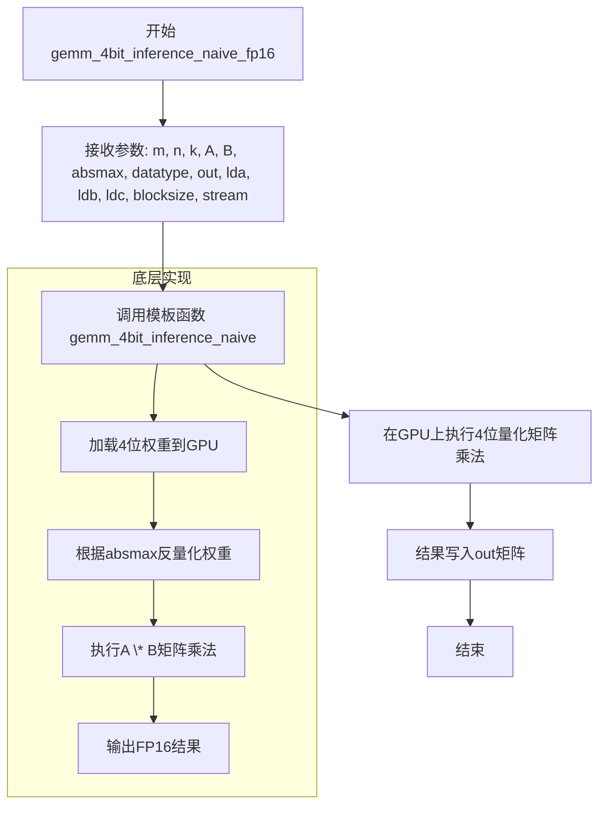

#### 带注释源码

```cpp
// 4位量化矩阵乘法FP16精度入口函数
// 该函数是模板函数gemm_4bit_inference_naive的包装器，针对half类型和16位量化优化
void gemm_4bit_inference_naive_fp16(
    int m, int n, int k,          // 矩阵维度: A(m,k) * B(k,n) = C(m,n)
    half* A,                      // 输入矩阵A (FP16)
    unsigned char* B,             // 4位量化权重矩阵B
    float* absmax,                // 每个量化块的绝对最大值
    float* datatype,              // 数据类型参数
    half* out,                    // 输出矩阵C (FP16)
    int lda, int ldb, int ldc,    // 各矩阵的leading dimension
    int blocksize,                // 量化块大小
    cudaStream_t stream           // CUDA/HIP执行流
) {
    // 调用底层模板函数，使用half类型和16位量化
    // 模板参数: half为输入/输出数据类型，16表示量化位数
    gemm_4bit_inference_naive<half, 16>(
        m, n, k, A, B, absmax, datatype, out, 
        lda, ldb, ldc, blocksize, stream
    );
}
```

---

### 相关函数变体

同文件还包括以下变体，遵循相同的调用模式：

| 函数名 | 数据类型 | 量化位数 |
|--------|----------|----------|
| `gemm_4bit_inference_naive_bf16` | `__nv_bfloat16` | 16位 |
| `gemm_4bit_inference_naive_fp32` | `float` | 32位 |

这些函数通过C接口（`extern "C"`）导出为 `cgemm_4bit_inference_naive_fp16` 等，以便从其他语言调用。


### `gemm_4bit_inference_naive_bf16`

这是一个用于在CUDA/HIP设备上执行4位量化矩阵乘法（GEMM）的包装函数，专门处理Brain Float 16（bf16）数据类型。该函数将参数传递给模板函数 `gemm_4bit_inference_naive`，使用16位宽的量化块执行高效的矩阵运算。

参数：

- `m`：`int`，输出矩阵的行数（即矩阵A的行数）
- `n`：`int`，输出矩阵的列数（即矩阵B的列数）
- `k`：`int`，矩阵A的列数/矩阵B的行数（矩阵乘法的公共维度）
- `A`：`__nv_bfloat16*`，输入矩阵A，使用Brain Float 16格式存储
- `B`：`unsigned char*`，量化后的4位权重矩阵B（按块存储）
- `absmax`：`float*`，每个量化块的绝对最大值，用于反量化
- `datatype`：`float*`，数据类型相关信息（可能用于量化参数）
- `out`：`__nv_bfloat16*`，输出矩阵C，存储bf16格式的结果
- `lda`：`int`，矩阵A的leading dimension（行跨度）
- `ldb`：`int`，矩阵B的leading dimension（行跨度）
- `ldc`：`int`，矩阵C的leading dimension（行跨度）
- `blocksize`：`int`，量化块大小（每个块包含的元素数量）
- `stream`：`cudaStream_t`，CUDA执行流，用于异步操作

返回值：`void`，该函数无返回值，结果通过 `out` 参数输出

#### 流程图

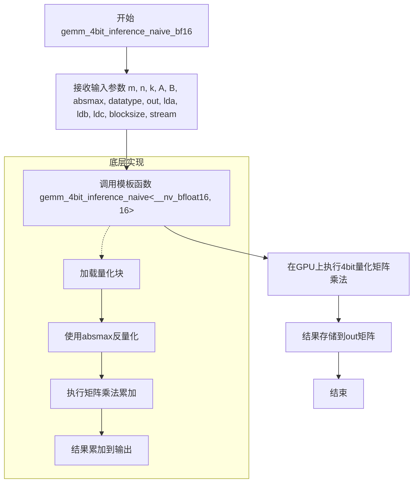

#### 带注释源码

```cpp
// 定义针对Brain Float 16 (bf16) 数据类型的4bit量化矩阵乘法推理函数
void gemm_4bit_inference_naive_bf16(
    int m, int n, int k,                    // 矩阵维度: m×k @ k×n = m×n
    __nv_bfloat16* A,                       // 输入矩阵A (bf16格式)
    unsigned char* B,                       // 量化后的4bit权重矩阵B
    float* absmax,                          // 每个量化块的绝对最大值(用于反量化)
    float* datatype,                        // 数据类型参数
    __nv_bfloat16* out,                     // 输出矩阵C (bf16格式)
    int lda,                                // 矩阵A的leading dimension
    int ldb,                                // 矩阵B的leading dimension
    int ldc,                                // 矩阵C的leading dimension
    int blocksize,                          // 量化块大小
    cudaStream_t stream                     // CUDA流用于异步执行
) {
    // 调用模板化的通用实现，模板参数<__nv_bfloat16, 16>指定:
    // - 使用bf16作为计算数据类型
    // - 使用16位宽的量化块
    gemm_4bit_inference_naive<__nv_bfloat16, 16>(
        m, n, k, A, B, absmax, datatype, out, 
        lda, ldb, ldc, blocksize, stream
    );
}
```


### `gemm_4bit_inference_naive_fp32`

该函数是一个4位量化矩阵乘法（GEMM）的FP32精度封装函数，通过调用模板函数 `gemm_4bit_inference_naive<float, 32>` 实现高效的四位量化矩阵与全精度矩阵的乘法运算，支持自定义块大小、流式处理和不同的矩阵内存布局。

参数：

- `m`：`int`，矩阵A的行数，也是输出矩阵C的行数
- `n`：`int`，矩阵B的列数，也是输出矩阵C的列数
- `k`：`int`，矩阵A的列数/矩阵B的行数，矩阵乘法的公共维度
- `A`：`float*`，输入矩阵A的指针（FP32全精度）
- `B`：`unsigned char*`，输入矩阵B的指针（4位量化数据）
- `absmax`：`float*`，量化块的最大绝对值数组，用于反量化
- `datatype`：`float*`，数据类型相关信息数组
- `out`：`float*`，输出矩阵C的指针（FP32全精度）
- `lda`：`int`，矩阵A的行主序跨度（leading dimension）
- `ldb`：`int`，矩阵B的行主序跨度（leading dimension）
- `ldc`：`int`，矩阵C的行主序跨度（leading dimension）
- `blocksize`：`int`，量化块大小（每个块包含的元素的个数）
- `stream`：`cudaStream_t`，CUDA流用于异步执行和同步

返回值：`void`，无返回值（结果通过out参数输出）

#### 流程图

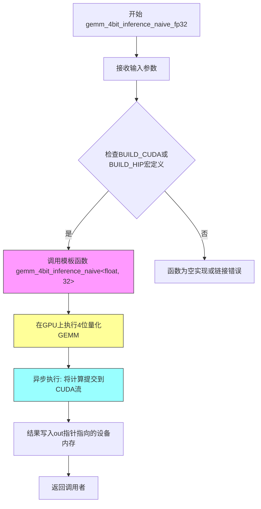

#### 带注释源码

```cpp
// 4位量化矩阵乘法FP32精度封装函数
// 该函数是一个薄封装层，将参数传递给模板函数gemm_4bit_inference_naive
// 使用float作为数据精度，32作为内部优化参数（可能与并行度或内部块大小相关）
void gemm_4bit_inference_naive_fp32(
    int m,                                     // 矩阵A的行数，输出矩阵C的行数
    int n,                                     // 矩阵B的列数，输出矩阵C的列数  
    int k,                                     // 矩阵A的列数/矩阵B的行数，矩阵乘法的公共维度
    float* A,                                  // 输入矩阵A，FP32全精度数据
    unsigned char* B,                          // 输入矩阵B，4位量化数据（每个元素占用4bit）
    float* absmax,                             // 量化块的最大绝对值数组，用于反量化计算
    float* datatype,                           // 数据类型相关信息，可能包含量化参数或代码本
    float* out,                                // 输出矩阵C，FP32全精度结果
    int lda,                                   // 矩阵A的leading dimension（行主序存储的列跨度）
    int ldb,                                   // 矩阵B的leading dimension
    int ldc,                                   // 矩阵C的leading dimension
    int blocksize,                             // 量化块大小，定义每个量化块包含多少个元素
    cudaStream_t stream                        // CUDA流，用于异步执行和与主机代码同步
) {
    // 调用模板函数gemm_4bit_inference_naive，使用float类型和32作为模板参数
    // 模板参数32可能表示内部并行化因子、线程块大小或其他性能优化参数
    gemm_4bit_inference_naive<float, 32>(
        m, n, k,           // 矩阵维度
        A, B,              // 输入矩阵
        absmax, datatype, // 量化参数
        out,               // 输出矩阵
        lda, ldb, ldc,     // 内存布局参数
        blocksize,         // 量化块大小
        stream             // CUDA流
    );
}
```


### `fill_fp32`

该函数是一个元素级填充操作，用于将指定的值填充到 float 类型的数组中。

参数：

- `A`：`float*`，输出数组指针，用于存放填充后的结果
- `B`：`float*`，输入数组指针（此参数在 FILL 操作中未使用，保留用于接口一致性）
- `value`：`float`，要填充的值
- `n`：`long`，需要处理的元素数量

返回值：`void`，无返回值

#### 流程图

```mermaid
flowchart TD
    A[开始 fill_fp32] --> B[接收参数: A, B, value, n]
    B --> C{检查 n > 0?}
    C -->|否| D[直接返回]
    C -->|是| E[调用模板函数 func<float, FILL>]
    E --> F[遍历 n 个元素]
    F --> G[A[i] = value]
    G --> H[结束]
```

#### 带注释源码

```cpp
// 宏定义，用于生成元素级操作的函数
// fname: 函数名前缀, type_name: 数据类型名称, ctype: C数据类型, FUNC: 操作类型
#define MAKE_ELEMENTWISE_FUNC(fname, type_name, ctype, FUNC)                                   \
    void fname##_##type_name(ctype* A, ctype* B, ctype value, long n) { func<ctype, FUNC>(A, B, value, n); }

// 使用宏生成 fill_fp32 函数
// 展开后相当于: void fill_fp32(float* A, float* B, float value, long n) { func<float, FILL>(A, B, value, n); }
MAKE_ELEMENTWISE_FUNC(fill, fp32, float, FILL)
```

补充说明：

- 该函数通过宏 `MAKE_ELEMENTWISE_FUNC` 自动生成
- `func<float, FILL>` 是一个模板函数，具体实现未在此文件中给出，可能在其他头文件（如 `cpu_ops.h` 或 CUDA/HIP kernel 文件）中定义
- `FILL` 操作将 `value` 填充到数组 `A` 的每个元素中
- `B` 参数在 FILL 操作中未被使用，但保留以保持与 `MAKE_ELEMENTWISE_FUNC` 宏生成的其他函数（如 `arange`, `_mul`）接口一致性


### `fill_uint8`

该函数是一个 element-wise 操作函数，用于将 `unsigned char` 类型的数组 `A` 中的前 `n` 个元素填充为指定的值 `value`。该函数通过宏定义生成，实际实现调用了模板函数 `func<ctype, FILL>`。

参数：

- `A`：`unsigned char*`，输出数组，待填充的数组指针
- `B`：`unsigned char*`，输入数组（根据模板实现，可能用于其他操作，此处填充操作可能未使用）
- `value`：`unsigned char`，要填充的值
- `n`：`long`，要处理的元素数量

返回值：`void`，无返回值

#### 流程图

```mermaid
flowchart TD
    A[开始 fill_uint8] --> B{检查 n <= 0?}
    B -->|是| C[直接返回]
    B -->|否| D[调用 func&lt;unsigned char, FILL&gt;]
    D --> E[遍历数组元素]
    E --> F[将 A[i] 填充为 value]
    F --> G[结束]
```

#### 带注释源码

```c
// 由宏 MAKE_ELEMENTWISE_FUNC(fill, uint8, unsigned char, FILL) 展开生成
void fill_uint8(unsigned char* A, unsigned char* B, unsigned char value, long n) {
    // 调用模板函数 func<unsigned char, FILL>
    // 模板函数根据 FILL 枚举值执行填充操作
    // A: 输出数组指针
    // B: 输入数组指针（填充操作中可能未使用）
    // value: 要填充的值
    // n: 元素个数
    func<unsigned char, FILL>(A, B, value, n);
}

// 对应的 C 接口包装函数（由宏 CMAKE_ELEMENTWISE_FUNC 生成）
void cfill_uint8(unsigned char* A, unsigned char* B, unsigned char value, long n) {
    // 简单地调用内部的 fill_uint8 函数
    fill_uint8(A, B, value, n);
}
```


# 函数 arange_fp32 详细设计文档

### arange_fp32

该函数是由宏 `MAKE_ELEMENTWISE_FUNC` 生成的元素级操作函数，用于生成一个从起始值开始、按照指定步长（值为1）递增的序列到目标数组中，属于 element-wise 操作的 ARANGE（生成序列）实现。

参数：

-  `A`：`float*`，输出数组，用于存储生成的序列
-  `B`：`float*`，输入数组（在此实现中未直接使用，可能是历史兼容参数）
-  `value`：`float`，序列的起始值（步长固定为1）
-  `n`：`long`，要生成的元素数量

返回值：`void`，无返回值，通过输出参数 A 返回结果

#### 流程图

```mermaid
flowchart TD
    A[开始 arange_fp32] --> B{检查输入参数}
    B -->|参数有效| C[调用模板函数 func<float, ARANGE>]
    C --> D[遍历索引 i 从 0 到 n-1]
    D --> E[A[i] = 起始值 + i]
    E --> F[返回]
    B -->|参数无效| G[返回/抛出异常]
```

#### 带注释源码

```cpp
// 由宏 MAKE_ELEMENTWISE_FUNC(arange, fp32, float, ARANGE) 生成
// 该函数用于生成一个从 value 开始的递增序列
void arange_fp32(float* A, float* B, float value, long n) { 
    // 调用模板函数 func，ARANGE 操作会将 A[i] = value + i
    // 即生成 [value, value+1, value+2, ..., value+n-1] 的序列
    func<float, ARANGE>(A, B, value, n); 
}
```

---

**注意**：该函数的实现依赖于模板函数 `func<ctype, FUNC>` 的定义，但从当前代码片段中无法看到 `func` 模板的具体实现。这可能是代码库中的技术债务——函数声明存在但内部实现依赖的模板未在本文件中定义，建议查阅 `cpu_ops.h` 或相关头文件以获取完整实现。


### `_mul_fp32`

该函数是一个元素级乘法操作，将输入数组 A 中的每个元素乘以一个标量值，并将结果存储到输出数组 B 中。

参数：

- `A`：`float*`，输入数组指针
- `B`：`float*`，输出数组指针
- `value`：`float`，用于乘法的标量值
- `n`：`long`，数组元素个数

返回值：`void`，无返回值

#### 流程图

```mermaid
flowchart TD
    A[开始] --> B{检查 n > 0}
    B -->|是| C[遍历数组 i 从 0 到 n-1]
    C --> D[B[i] = A[i] * value]
    D --> E{i < n-1?}
    E -->|是| C
    E -->|否| F[结束]
    B -->|否| F
```

#### 带注释源码

```c
// 该函数通过宏 MAKE_ELEMENTWISE_FUNC 生成
// 宏展开后的形式：
void _mul_fp32(float* A, float* B, float value, long n) {
    // 调用模板函数 func<float, _MUL> 执行实际的乘法操作
    func<float, _MUL>(A, B, value, n);
}
```

### `c_mul_fp32`

这是 `_mul_fp32` 函数的 C 语言包装版本，通过 `extern "C"` 导出供外部调用。

参数：

- `A`：`float*`，输入数组指针
- `B`：`float*`，输出数组指针
- `value`：`float`，用于乘法的标量值
- `n`：`long`，数组元素个数

返回值：`void`，无返回值

#### 流程图

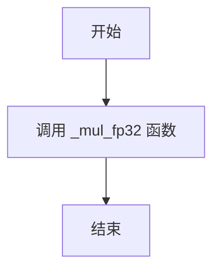

#### 带注释源码

```c
// 该函数通过宏 CMAKE_ELEMENTWISE_FUNC 生成
// 宏展开后的形式：
void c_mul_fp32(float* A, float* B, float value, long n) {
    // 直接调用 C++ 版本的 _mul_fp32 函数
    _mul_fp32(A, B, value, n);
}
```


### `momentum32bit_grad_32`

该函数是 Momentum 优化器的 32 位浮点数梯度更新实现，通过调用模板函数 `optimizer32bit` 执行参数更新，支持动量累积、梯度裁剪、权重衰减等优化策略。

参数：

- `g`：`float*`，梯度输入指针
- `p`：`float*`，模型参数指针
- `state1`：`float*`，动量状态（第一时刻估计）
- `state2`：`float*`，优化器状态（第二时刻估计）
- `unorm`：`float*`，梯度范数向量
- `max_unorm`：`float`，最大梯度范数阈值
- `param_norm`：`float`，参数范数（用于归一化）
- `beta1`：`const float`，一阶矩估计衰减系数
- `beta2`：`const float`，二阶矩估计衰减系数
- `beta3`：`const float`，额外衰减系数
- `alpha`：`const float`，缩放因子
- `eps`：`const float`，防止除零的小常数
- `weight_decay`：`const float`，权重衰减系数
- `step`：`const int`，当前训练步数
- `lr`：`const float`，学习率
- `gnorm_scale`：`float`，梯度范数缩放因子
- `skip_zeros`：`bool`，是否跳过零值更新
- `n`：`const int`，参数总数

返回值：`void`，无返回值

#### 流程图

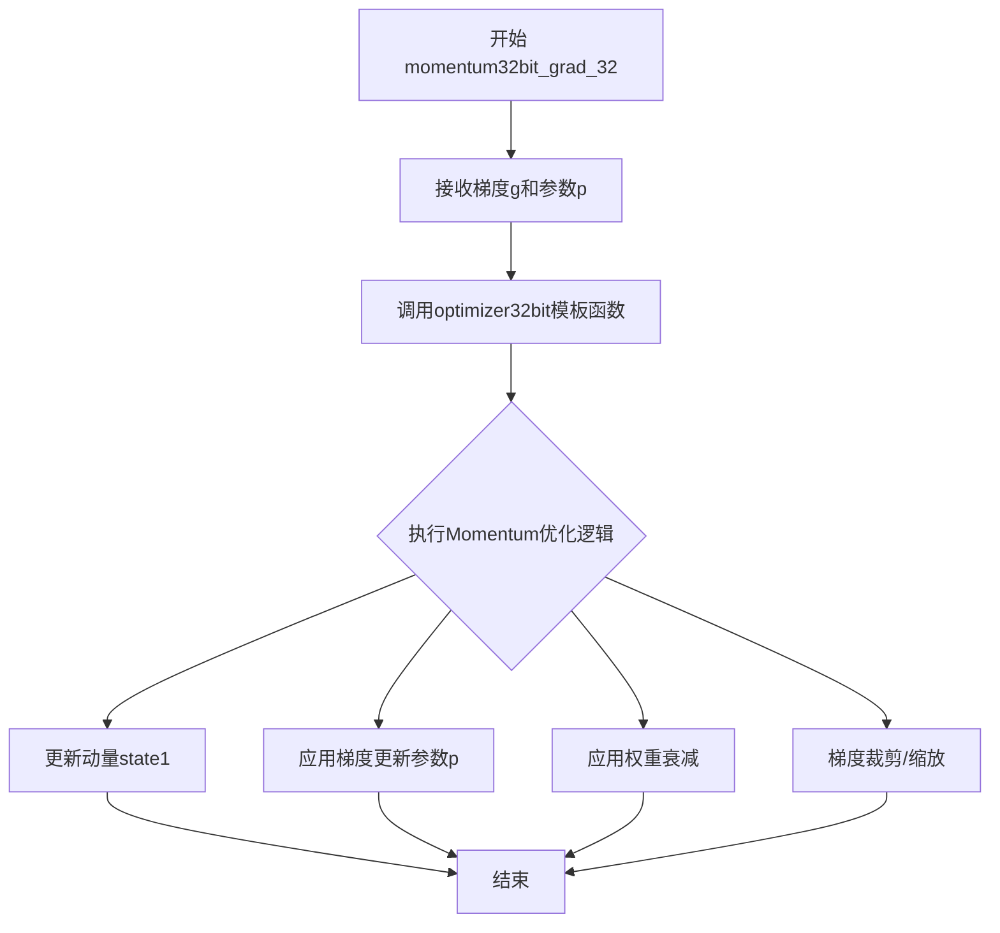

#### 带注释源码

```cpp
// Momentum 优化器 32位浮点梯度更新函数
// 由 MAKE_FUNC32 宏生成，当 gtype=float, gbits=32 时
void momentum32bit_grad_32(
    float* g,              // 输入：梯度数组
    float* p,              // 输入/输出：模型参数，将被更新
    float* state1,         // 输入/输出：动量状态（momentum）
    float* state2,         // 输入/输出：二阶矩状态（用于Adam等）
    float* unorm,          // 输入：梯度范数数组
    float max_unorm,       // 输入：最大梯度范数阈值
    float param_norm,      // 输入：参数范数
    const float beta1,     // 输入：一阶矩衰减系数（动量系数）
    const float beta2,     // 输入：二阶矩衰减系数
    const float beta3,     // 输入：额外衰减系数
    const float alpha,     // 输入：缩放因子
    const float eps,       // 输入：epsilon，防止除零
    const float weight_decay, // 输入：权重衰减系数
    const int step,        // 输入：当前训练步数
    const float lr,        // 输入：学习率
    float gnorm_scale,     // 输入：梯度范数缩放因子
    bool skip_zeros,       // 输入：是否跳过零梯度
    const int n            // 输入：参数数量（数组长度）
) {
    // 调用模板函数 optimizer32bit<MOMENTUM, float> 执行实际的优化逻辑
    optimizer32bit<float, MOMENTUM>(
        g, p, state1, state2, unorm, max_unorm, param_norm,
        beta1, beta2, beta3, alpha, eps, weight_decay, step,
        lr, gnorm_scale, skip_zeros, n
    );
}
```


### `momentum32bit_grad_16`

实现 Momentum 优化器的 32 位梯度计算，针对 half（fp16）数据类型，通过调用通用的 `optimizer32bit` 模板函数完成参数更新。

参数：

- `g`：`gtype*`（实际为 `half*`），梯度输入指针
- `p`：`gtype*`（实际为 `half*`），模型参数指针
- `state1`：`float*`，一阶动量状态数组
- `state2`：`float*`，二阶动量状态数组（用于 Adam 等算法）
- `unorm`：`float*`，梯度范数数组
- `max_unorm`：`float`，最大梯度范数阈值
- `param_norm`：`float`，参数范数
- `beta1`：`const float`，一阶动量衰减系数
- `beta2`：`const float`，二阶动量衰减系数
- `beta3`：`const float`，三阶动量衰减系数（用于 Lion 等算法）
- `alpha`：`const float`，缩放因子
- `eps`：`const float`，防止除零的 epsilon 值
- `weight_decay`：`const float`，权重衰减系数
- `step`：`const int`，当前训练步数
- `lr`：`const float`，学习率
- `gnorm_scale`：`float`，梯度范数缩放因子
- `skip_zeros`：`bool`，是否跳过零梯度
- `n`：`const int`，元素数量

返回值：`void`，无返回值（通过指针参数 `p` 和 `state1` 等原地更新）

#### 流程图

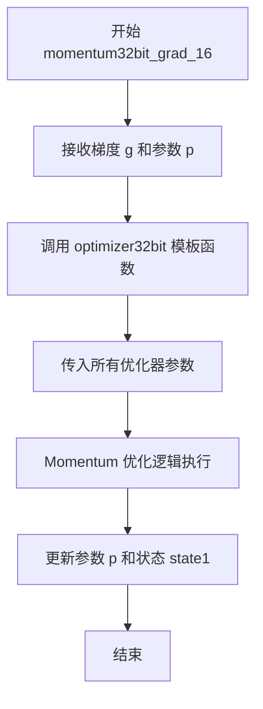

#### 带注释源码

```c
// 使用宏定义生成 Momentum 优化器的 32 位梯度计算函数
// 针对 half 数据类型（fp16精度）
MAKE_FUNC32(momentum, MOMENTUM, half, 16)

// 展开后的实际函数形式：
void momentum32bit_grad_16(
    half* g,        // 梯度输入
    half* p,        // 模型参数（原地更新）
    float* state1,  // 一阶动量状态
    float* state2,  // 二阶动量状态（部分优化器使用）
    float* unorm,   // 梯度范数数组
    float max_unorm,    // 最大梯度范数
    float param_norm,   // 参数范数
    const float beta1,  // 一阶动量衰减系数
    const float beta2,  // 二阶动量衰减系数
    const float beta3,  // 三阶动量衰减系数
    const float alpha,  // 缩放因子
    const float eps,    // 防止除零
    const float weight_decay,  // 权重衰减
    const int step,     // 当前步数
    const float lr,     // 学习率
    float gnorm_scale,  // 梯度缩放
    bool skip_zeros,    // 是否跳过零梯度
    const int n         // 元素数量
) {
    // 调用通用优化器模板，指定数据类型为 half，优化器类型为 MOMENTUM
    optimizer32bit<half, MOMENTUM>(
        g, p, state1, state2, unorm, max_unorm, param_norm,
        beta1, beta2, beta3, alpha, eps, weight_decay, step,
        lr, gnorm_scale, skip_zeros, n
    );
}
```


### `adam32bit_grad_fp32`

该函数是 Adam 优化器的 32 位浮点梯度计算内核，通过调用模板函数 `optimizer32bit` 实现 Adam 算法的核心更新逻辑，用于在 GPU 上执行参数更新。

参数：

- `g`：`float*`，梯度指针，指向输入的梯度数据
- `p`：`float*`，参数指针，指向需要更新的模型参数
- `state1`：`float*`，一阶矩估计（动量）的状态数组
- `state2`：`float*`，二阶矩估计（方差）的状态数组
- `unorm`：`float*`，梯度范数数组，用于梯度裁剪
- `max_unorm`：`float`，梯度范数的最大阈值，用于裁剪
- `param_norm`：`float`，参数范数，用于权重衰减计算
- `beta1`：`const float`，一阶矩衰减系数
- `beta2`：`const float`，二阶矩衰减系数
- `beta3`：`const float`，三阶矩衰减系数（用于 AdamPlus/AdamMix 等变体）
- `alpha`：`const float`，学习率缩放因子
- `eps`：`const float`，防止除零的epsilon值
- `weight_decay`：`const float`，权重衰减系数（L2正则化）
- `step`：`const int`，当前优化步骤数
- `lr`：`const float`，学习率
- `gnorm_scale`：`float`，梯度范数缩放因子
- `skip_zeros`：`bool`，是否跳过零梯度
- `n`：`const int`，需要处理的元素数量

返回值：`void`，无返回值（直接修改 p、state1、state2 等数组）

#### 流程图

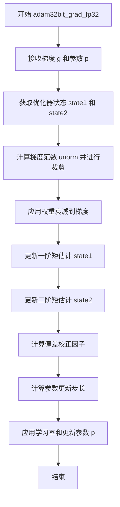

#### 带注释源码

```c
// 该函数通过宏 MAKE_FUNC32 生成，宏定义如下：
// MAKE_FUNC32(adam, ADAM, float, fp32)
//
// 实际生成的函数签名：
void adam32bit_grad_fp32(
    float* g,            // 梯度输入
    float* p,            // 模型参数（输出）
    float* state1,       // 一阶矩估计（动量）
    float* state2,       // 二阶矩估计（方差）
    float* unorm,        // 梯度范数
    float max_unorm,     // 最大梯度范数阈值
    float param_norm,    // 参数范数
    const float beta1,   // 一阶矩衰减系数（通常0.9）
    const float beta2,   // 二阶矩衰减系数（通常0.999）
    const float beta3,   // 三阶矩衰减系数（用于特定变体）
    const float alpha,   // 学习率缩放因子
    const float eps,     // 数值稳定性常数（通常1e-8）
    const float weight_decay,  // 权重衰减系数
    const int step,      // 当前优化步骤
    const float lr,      // 基础学习率
    float gnorm_scale,   // 梯度范数缩放
    bool skip_zeros,     // 是否跳过零梯度
    const int n          // 元素数量
) {
    // 调用模板函数 optimizer32bit，执行 Adam 算法核心逻辑
    // 模板参数：float（数据类型）, ADAM（优化器类型）
    optimizer32bit<float, ADAM>(
        g, p, state1, state2, unorm, max_unorm, param_norm,
        beta1, beta2, beta3, alpha, eps, weight_decay, step,
        lr, gnorm_scale, skip_zeros, n
    );
}
```


### `adam32bit_grad_fp16`

该函数是 Adam 优化器的 32 位梯度计算函数，使用半精度（half/fp16）数据类型进行参数更新。它是一个封装函数，通过调用模板函数 `optimizer32bit` 实现具体的优化逻辑，支持权重衰减、梯度归一化、梯度的百分位裁剪等高级功能。

参数：

- `g`：`half*`，输入梯度指针
- `p`：`half*`，输入参数（模型权重）指针
- `state1`：`float*`，Adam 优化器第一动量（momentum）状态数组
- `state2`：`float*`，Adam 优化器第二动量（variance）状态数组
- `unorm`：`float*`，梯度范数数组，用于百分位裁剪
- `max_unorm`：`float`，裁剪后的最大梯度范数阈值
- `param_norm`：`float`，参数向量的范数，用于梯度缩放
- `beta1`：`const float`，Adam 优化器第一动量衰减系数
- `beta2`：`const float`，Adam 优化器第二动量衰减系数
- `beta3`：`const float`，额外的衰减系数（用于 Adademix 等优化器）
- `alpha`：`const float`，缩放因子
- `eps`：`const float`，防止除零的 epsilon 值
- `weight_decay`：`const float`，权重衰减系数（L2 正则化）
- `step`：`const int`，当前优化步骤数
- `lr`：`const float`，学习率
- `gnorm_scale`：`float`，梯度范数缩放因子
- `skip_zeros`：`bool`，是否跳过零值梯度
- `n`：`const int`，要处理的元素数量

返回值：`void`，无返回值（结果通过指针参数 `p` 和状态数组输出）

#### 流程图

```mermaid
flowchart TD
    A[开始 adam32bit_grad_fp16] --> B[调用 optimizer32bit 模板函数]
    
    B --> C[根据 beta1 更新 state1 (momentum)]
    
    C --> D[根据 beta2 更新 state2 (variance)]
    
    D --> E[计算偏差校正因子<br/>bias_correction1 = 1 - beta1^step<br/>bias_correction2 = 1 - beta2^step]
    
    E --> F[计算梯度范数并进行百分位裁剪]
    
    F --> G{skip_zeros == true?}
    
    G -->|Yes| H[跳过零值梯度元素]
    G -->|No| I[处理所有梯度元素]
    
    H --> J[计算更新值: update = m_hat / (sqrt(v_hat) + eps) + weight_decay * param]
    I --> J
    
    J --> K[应用学习率和梯度范数缩放]
    
    K --> L[更新参数: p = p - lr * gnorm_scale * update]
    
    L --> M[结束]
```

#### 带注释源码

```c
// 该函数通过宏 MAKE_FUNC32 生成
// MAKE_FUNC32(adam, ADAM, half, fp16) 展开后得到以下实现：
void adam32bit_grad_fp16(
    half* g,              // 输入：梯度数组（半精度）
    half* p,              // 输入/输出：模型参数数组（半精度），更新后写回
    float* state1,        // 输入/输出：第一动量状态数组（float）
    float* state2,        // 输入/输出：第二动量状态数组（float）
    float* unorm,         // 输入/输出：梯度范数数组，用于百分位裁剪
    float max_unorm,      // 输入：梯度裁剪的最大范数值
    float param_norm,     // 输入：参数向量的范数
    const float beta1,    // 输入：第一动量衰减系数（通常 0.9）
    const float beta2,    // 输入：第二动量衰减系数（通常 0.999）
    const float beta3,    // 输入：额外衰减系数（用于某些优化器变体）
    const float alpha,    // 输入：缩放因子
    const float eps,      // 输入：防止数值稳定的 epsilon（通常 1e-8）
    const float weight_decay, // 输入：权重衰减系数
    const int step,       // 输入：当前训练步数
    const float lr,       // 输入：学习率
    float gnorm_scale,    // 输入：梯度范数缩放因子
    bool skip_zeros,      // 输入：是否跳过零值梯度
    const int n           // 输入：参数/梯度元素数量
) {
    // 调用模板函数 optimizer32bit，模板参数为：
    // gtype = half (fp16)
    // oname = ADAM
    optimizer32bit<half, ADAM>(
        g, p, state1, state2, unorm, max_unorm, param_norm,
        beta1, beta2, beta3, alpha, eps, weight_decay, step,
        lr, gnorm_scale, skip_zeros, n
    );
}
```


### `adam32bit_grad_bf16`

该函数是 Adam 优化器的 32 位梯度计算函数，专门针对 `bf16`（Brain Float 16）数据类型进行优化。它通过调用模板函数 `optimizer32bit<__nv_bfloat16, ADAM>` 来执行参数更新，实现了自适应矩估计优化算法，支持权重衰减、梯度裁剪等高级功能。

参数：

- `g`：`__nv_bfloat16*`，梯度向量指针
- `p`：`__nv_bfloat16*`，模型参数指针
- `state1`：`float*`，Adam 一阶矩估计（动量）状态数组
- `state2`：`float*`，Adam 二阶矩估计（方差）状态数组
- `unorm`：`float*`，梯度范数数组
- `max_unorm`：`float`，梯度范数最大值
- `param_norm`：`float`，参数范数
- `beta1`：`const float`，Adam 一阶矩衰减系数
- `beta2`：`const float`，Adam 二阶矩衰减系数
- `beta3`：`const float`，额外的衰减系数（用于某些优化变体）
- `alpha`：`const float`，学习率缩放因子
- `eps`：`const float`，防止除零的 epsilon 值
- `weight_decay`：`const float`，权重衰减系数
- `step`：`const int`，当前训练步数
- `lr`：`const float`，学习率
- `gnorm_scale`：`float`，梯度范数缩放因子
- `skip_zeros`：`bool`，是否跳过零梯度
- `n`：`const int`，参数向量长度

返回值：`void`，该函数直接修改传入的参数数组 `p`，不返回任何值

#### 流程图

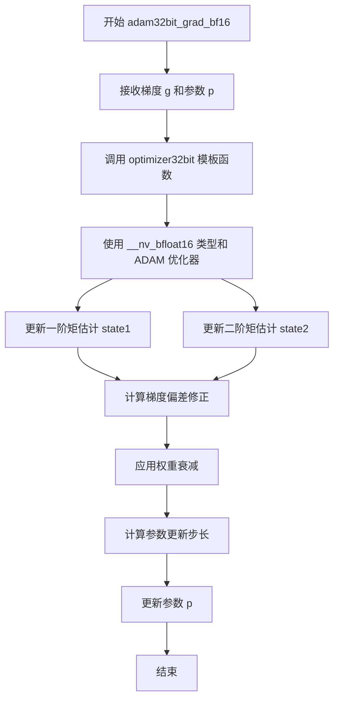

#### 带注释源码

```c
// 该函数通过宏展开生成，宏定义在代码中如下：
// MAKE_FUNC32(adam, ADAM, __nv_bfloat16, bf16)

void adam32bit_grad_bf16(
    __nv_bfloat16* g,          // 输入：梯度向量（bf16类型）
    __nv_bfloat16* p,          // 输入/输出：模型参数（bf16类型），会被更新
    float* state1,             // 输入/输出：一阶矩估计（动量）状态数组
    float* state2,             // 输入/输出：二阶矩估计（方差）状态数组
    float* unorm,              // 输入：梯度范数数组
    float max_unorm,           // 输入：梯度裁剪阈值
    float param_norm,          // 输入：参数范数
    const float beta1,         // 输入：一阶矩衰减系数（通常0.9）
    const float beta2,         // 输入：二阶矩衰减系数（通常0.999）
    const float beta3,         // 输入：额外衰减系数（用于Adam变体）
    const float alpha,         // 输入：学习率缩放因子
    const float eps,           // 输入：数值稳定项（通常1e-8）
    const float weight_decay,  // 输入：L2权重衰减系数
    const int step,            // 输入：当前训练步数
    const float lr,            // 输入：基础学习率
    float gnorm_scale,         // 输入：梯度范数缩放因子
    bool skip_zeros,           // 输入：是否跳过零梯度更新
    const int n                // 输入：参数向量长度
) {
    // 调用模板函数 optimizer32bit，模板参数为：
    // - gtype = __nv_bfloat16（梯度/参数数据类型）
    // - oname = ADAM（优化器类型）
    optimizer32bit<__nv_bfloat16, ADAM>(
        g, p, state1, state2, unorm, max_unorm, param_norm,
        beta1, beta2, beta3, alpha, eps, weight_decay, step,
        lr, gnorm_scale, skip_zeros, n
    );
}
```


### `rmsprop32bit_grad_32`

该函数是 RMSprop 优化器的 32 位梯度更新封装函数，通过宏自动生成，用于调用模板函数 `optimizer32bit<RMSPROP, float>` 执行实际的 RMSprop 参数更新逻辑。

参数：

- `g`：`float*`，梯度指针，指向待更新的梯度数据
- `p`：`float*`，参数指针，指向待更新的模型参数
- `state1`：`float*`，第一时刻（momentum）状态数组，用于存储梯度的指数移动平均
- `state2`：`float*`，第二时刻（variance）状态数组，用于存储梯度平方的指数移动平均
- `unorm`：`float*`，梯度范数数组，用于存储每个参数的梯度范数
- `max_unorm`：`float`，梯度范数的最大值阈值，用于梯度裁剪
- `param_norm`：`float`，参数向量的范数，用于归一化计算
- `beta1`：`const float`，一阶矩估计的指数衰减率（momentum 系数）
- `beta2`：`const float`，二阶矩估计的指数衰减率（RMSprop 方差系数）
- `beta3`：`const float`，额外的指数衰减率参数
- `alpha`：`const float`，更新缩放因子
- `eps`：`const float`，防止除零的微小常数
- `weight_decay`：`const float`，权重衰减系数（L2 正则化）
- `step`：`const int`，当前训练步数
- `lr`：`const float`，学习率
- `gnorm_scale`：`float`，梯度范数缩放因子
- `skip_zeros`：`bool`，是否跳过零值梯度
- `n`：`const int`，参数数量（数组长度）

返回值：`void`，该函数无返回值，通过指针参数直接更新 `p`（参数）、`state1`、`state2` 等数组的内容

#### 流程图

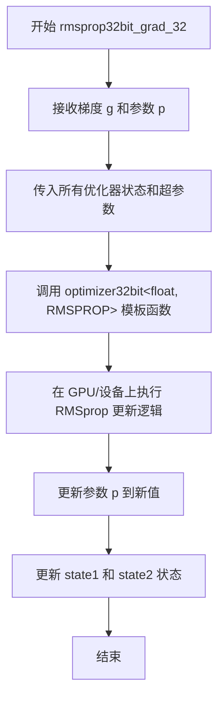

#### 带注释源码

```c
// 该函数通过宏 MAKE_FUNC32 自动生成
// 宏参数: fname=rmsprop, oname=RMSPROP, gtype=float, gbits=32
void rmsprop32bit_grad_32(
    float* g,              // 输入输出：梯度数据（更新后可能用于其他计算）
    float* p,              // 输出：待更新的模型参数指针，函数内部直接修改此内存
    float* state1,         // 输出：一阶矩估计（momentum）状态数组
    float* state2,         // 输出：二阶矩估计（方差）状态数组
    float* unorm,          // 输出/临时：梯度范数数组
    float max_unorm,       // 输入：梯度裁剪的最大范数值
    float param_norm,      // 输入：参数向量的范数（用于归一化）
    const float beta1,     // 输入：一阶矩衰减率（通常 0.9）
    const float beta2,     // 输入：二阶矩衰减率（通常 0.999）
    const float beta3,     // 输入：额外的衰减率参数
    const float alpha,     // 输入：更新缩放因子
    const float eps,       // 输入：数值稳定性常数（通常 1e-8）
    const float weight_decay, // 输入：L2 权重衰减系数
    const int step,        // 输入：当前优化器步数
    const float lr,        // 输入：学习率
    float gnorm_scale,     // 输入：梯度范数缩放因子
    bool skip_zeros,       // 输入：是否跳过零值梯度
    const int n            // 输入：参数/梯度元素总数
) {
    // 调用模板化的 32 位优化器实现
    // RMSPROP 算法核心：
    //   state1 = beta1 * state1 + (1 - beta1) * g  (一阶矩估计/动量)
    //   state2 = beta2 * state2 + (1 - beta2) * g * g  (二阶矩估计/方差)
    //   p = p - lr * (alpha * state1 / (sqrt(state2) + eps) + weight_decay * p)
    optimizer32bit<float, RMSPROP>(
        g, p, state1, state2, unorm, max_unorm, param_norm,
        beta1, beta2, beta3, alpha, eps, weight_decay, step,
        lr, gnorm_scale, skip_zeros, n
    );
}
```


### `lion32bit_grad_fp32`

该函数是 LION 优化器的 32 位浮点数（fp32）梯度更新内核的包装函数，通过宏自动生成，用于调用通用的 `optimizer32bit` 模板函数执行实际的参数更新逻辑。

参数：

- `g`：`float*`，梯度向量指针
- `p`：`float*`，参数向量指针
- `state1`：`float*`，一阶矩估计（动量）状态数组
- `state2`：`float*`，二阶矩估计（方差）状态数组
- `unorm`：`float*`，梯度范数向量，用于梯度裁剪
- `max_unorm`：`float`，梯度裁剪的最大范数阈值
- `param_norm`：`float`，参数向量的范数，用于自适应学习率计算
- `beta1`：`const float`，一阶矩衰减系数（动量衰减）
- `beta2`：`const float`，二阶矩衰减系数（方差衰减）
- `beta3`：`const float`，三阶矩衰减系数（LION 特有）
- `alpha`：`const float`，更新幅度系数
- `eps`：`const float`，防止除零的小常数
- `weight_decay`：`const float`，权重衰减系数（L2 正则化）
- `step`：`const int`，当前训练步数
- `lr`：`const float`，学习率
- `gnorm_scale`：`float`，梯度范数缩放因子
- `skip_zeros`：`bool`，是否跳过零梯度更新
- `n`：`const int`，参数向量长度

返回值：`void`，无返回值（直接修改传入的指针所指向的内存）

#### 流程图

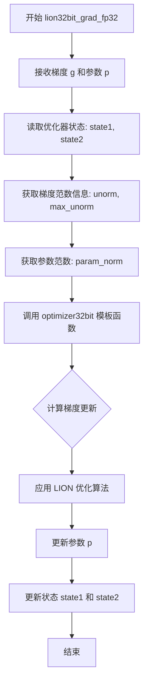

#### 带注释源码

```c
// LION 优化器的 32 位浮点梯度更新函数
// 由 MAKE_FUNC32 宏生成，fname=lion, oname=LION, gtype=float, gbits=fp32
void lion32bit_grad_fp32(
    float* g,                  // 输入: 梯度向量
    float* p,                 // 输入输出: 参数向量,更新后原地修改
    float* state1,            // 输入输出: 一阶矩估计(动量)状态
    float* state2,            // 输入输出: 二阶矩估计(方差)状态
    float* unorm,             // 输入: 梯度范数向量
    float max_unorm,          // 输入: 最大梯度范数(裁剪阈值)
    float param_norm,         // 输入: 参数范数
    const float beta1,        // 输入: 一阶矩衰减系数
    const float beta2,        // 输入: 二阶矩衰减系数
    const float beta3,        // 输入: 三阶矩衰减系数(LION特有)
    const float alpha,        // 输入: 更新幅度系数
    const float eps,          // 输入: 防止除零的小常数
    const float weight_decay, // 输入: 权重衰减系数
    const int step,           // 输入: 当前训练步数
    const float lr,           // 输入: 学习率
    float gnorm_scale,        // 输入: 梯度范数缩放因子
    bool skip_zeros,         // 输入: 是否跳过零梯度
    const int n               // 输入: 参数向量长度
) {
    // 调用通用的 32 位优化器模板函数
    // 模板参数: gtype=float, oname=LION
    optimizer32bit<float, LION>(
        g, p, state1, state2, unorm, max_unorm, param_norm,
        beta1, beta2, beta3, alpha, eps, weight_decay, step,
        lr, gnorm_scale, skip_zeros, n
    );
}
```


### `adagrad32bit_grad_32`

该函数是 Adagrad 优化器的 32 位浮点数版本，通过调用模板函数 `optimizer32bit` 实现参数的梯度更新，主要用于深度学习模型参数的自适应学习率优化，支持权重衰减和梯度范数缩放。

参数：

- `g`：`float*`，输入梯度指针，指向存储梯度的内存区域
- `p`：`float*`，输入输出参数指针，指向待更新的模型参数
- `state1`：`float*`，输入输出第一状态向量指针，用于存储梯度的累积平方和（Adagrad 的历史梯度平方和）
- `state2`：`float*`，输入输出第二状态向量指针，用于存储 Adam 系列优化器的二阶矩估计（此处为兼容性参数）
- `unorm`：`float*`，输入输出梯度范数指针，存储计算后的梯度范数
- `max_unorm`：`float`，最大梯度范数阈值，用于梯度裁剪
- `param_norm`：`float`，参数向量的范数，用于归一化计算
- `beta1`：`const float`，一阶矩估计的指数衰减率
- `beta2`：`const float`，二阶矩估计的指数衰减率
- `beta3`：`const float`，三阶矩估计的指数衰减率（用于 Ademamix）
- `alpha`：`const float`，学习率缩放因子
- `eps`：`const float`，防止除零的平滑项
- `weight_decay`：`const float`，权重衰减系数（L2 正则化）
- `step`：`const int`，当前优化器步数
- `lr`：`const float`，基础学习率
- `gnorm_scale`：`float`，梯度范数缩放系数
- `skip_zeros`：`bool`，是否跳过零值梯度
- `n`：`const int`，要处理的元素数量

返回值：`void`，该函数直接修改 `p`、`state1`、`state2`、`unorm` 指向的内存，不返回任何值

#### 流程图

```mermaid
flowchart TD
    A[开始 adagrad32bit_grad_32] --> B[调用 optimizer32bit 模板函数]
    B --> C[传入参数: g, p, state1, state2, unorm, max_unorm, param_norm]
    B --> D[传入超参数: beta1, beta2, beta3, alpha, eps, weight_decay, step, lr]
    B --> E[传入控制参数: gnorm_scale, skip_zeros, n]
    C --> F[在 optimizer32bit 内部]
    D --> F
    E --> F
    F --> G[计算梯度平方累加: state1 += g * g]
    G --> H[计算更新步长: update = lr * param_norm / sqrt(state1 + eps)]
    H --> I[应用权重_decay: update += weight_decay * p]
    I --> J[更新参数: p -= update * gnorm_scale]
    J --> K[更新 unorm: 计算梯度范数]
    K --> L[结束]
```

#### 带注释源码

```c
// 通过宏定义生成 Adagrad 32位浮点数梯度更新函数
// MAKE_FUNC32 宏展开后会生成如下函数：
void adagrad32bit_grad_32(
    float* g,              // 输入：梯度数组指针
    float* p,             // 输入输出：模型参数数组指针，更新后的参数存回此数组
    float* state1,        // 输入输出：梯度平方累积状态数组（Adagrad核心）
    float* state2,         // 输入输出：二阶矩状态（为兼容性保留，Adagrad中可能未使用）
    float* unorm,         // 输出：梯度范数数组指针
    float max_unorm,      // 输入：最大梯度范数阈值，用于裁剪
    float param_norm,     // 输入：参数向量的范数
    const float beta1,    // 输入：一阶矩衰减率（Adagrad中通常设为0）
    const float beta2,    // 输入：二阶矩衰减率（Adagrad中通常设为0.99）
    const float beta3,    // 输入：三阶矩衰减率（兼容性参数）
    const float alpha,    // 输入：学习率缩放因子
    const float eps,      // 输入：数值稳定性常数，防止除零
    const float weight_decay, // 输入：权重衰减系数
    const int step,       // 输入：当前优化步数
    const float lr,       // 输入：基础学习率
    float gnorm_scale,    // 输入：梯度范数缩放因子
    bool skip_zeros,      // 输入：是否跳过零值梯度
    const int n           // 输入：参数数量/数组长度
) {
    // 调用模板函数 optimizer32bit，模板参数为:
    // - gtype = float (32位浮点数)
    // - oname = ADAGRAD (优化器名称)
    optimizer32bit<float, ADAGRAD>(
        g, p, state1, state2, unorm, max_unorm, param_norm,
        beta1, beta2, beta3, alpha, eps, weight_decay, step,
        lr, gnorm_scale, skip_zeros, n
    );
}
```


### `ademamix32bit_grad_fp32`

该函数是 AdEMAMix 优化器的 32 位浮点数（fp32）梯度更新入口函数，通过宏展开生成，用于调用模板化的 `optimizer32bit` 函数执行 Adam 类型的优化器更新逻辑。

参数：

- `g`：`float*`，梯度指针，指向待更新的梯度数据
- `p`：`float*`，参数指针，指向待更新的模型参数
- `state1`：`float*`，一阶矩估计（动量）的状态数组
- `state2`：`float*`，二阶矩估计（方差）的状态数组
- `unorm`：`float*`，梯度范数数组，用于梯度裁剪
- `max_unorm`：`float`，梯度裁剪的最大范数阈值
- `param_norm`：`float`，参数向量的范数，用于权重衰减
- `beta1`：`const float`，一阶矩衰减系数（动量衰减）
- `beta2`：`const float`，二阶矩衰减系数（方差衰减）
- `beta3`：`const float`，三阶矩衰减系数（AdEMAMix 特有）
- `alpha`：`const float`，学习率缩放因子
- `eps`：`const float`，防止除零的小常数
- `weight_decay`：`const float`，权重衰减系数（L2 正则化）
- `step`：`const int`，当前优化步数
- `lr`：`const float`，学习率
- `gnorm_scale`：`float`，梯度范数缩放因子
- `skip_zeros`：`bool`，是否跳过零梯度更新
- `n`：`const int`，要处理的元素数量

返回值：`void`，无返回值，直接在参数指针 `p` 中更新模型参数

#### 流程图

```mermaid
flowchart TD
    A[开始 ademamix32bit_grad_fp32] --> B[接收梯度g和参数p]
    B --> C[传入optimizer32bit模板函数]
    C --> D{执行AdEMAMix优化算法}
    D -->|更新动量状态| E[state1 = beta1 * state1 + (1-beta1) * g]
    D -->|更新方差状态| F[state2 = beta2 * state2 + (1-beta2) * g^2]
    D -->|更新三阶矩状态| G[state3 = beta3 * state3 + (1-beta3) * g^3]
    E --> H[计算偏差校正]
    F --> H
    G --> H
    H --> I[计算更新步长]
    I --> J[应用权重衰减]
    J --> K[更新参数 p = p - lr * update]
    K --> L[结束]
```

#### 带注释源码

```c
// 使用 MAKE_FUNC32 宏展开生成的具体函数
// 宏展开后实际生成的代码如下：
void ademamix32bit_grad_fp32(
    float* g,                  // 梯度输入
    float* p,                 // 模型参数（输出）
    float* state1,            // 一阶矩状态（动量）
    float* state2,            // 二阶矩状态（方差）
    float* unorm,             // 梯度范数数组
    float max_unorm,          // 最大梯度范数（裁剪阈值）
    float param_norm,         // 参数范数
    const float beta1,        // 一阶矩衰减系数
    const float beta2,        // 二阶矩衰减系数
    const float beta3,        // 三阶矩衰减系数（AdEMAMix特有）
    const float alpha,        // 学习率缩放因子
    const float eps,          // 数值稳定性常数
    const float weight_decay,// 权重衰减系数
    const int step,           // 当前训练步数
    const float lr,           // 学习率
    float gnorm_scale,        // 梯度范数缩放
    bool skip_zeros,          // 是否跳过零梯度
    const int n               // 元素个数
) {
    // 调用模板化的 optimizer32bit 函数
    // gtype = float, oname = ADEMAMIX
    optimizer32bit<float, ADEMAMIX>(
        g, p, state1, state2, unorm, max_unorm, param_norm,
        beta1, beta2, beta3, alpha, eps, weight_decay, step,
        lr, gnorm_scale, skip_zeros, n
    );
}

// 宏定义（供参考）
// #define MAKE_FUNC32(fname, oname, gtype, gbits)
//     void fname##32bit_grad_##gbits(
//         gtype* g, gtype* p, float* state1, float* state2,
//         float* unorm, float max_unorm, float param_norm,
//         const float beta1, const float beta2, const float beta3,
//         const float alpha, const float eps, const float weight_decay,
//         const int step, const float lr, float gnorm_scale,
//         bool skip_zeros, const int n
//     ) {
//         optimizer32bit<gtype, oname>(
//             g, p, state1, state2, unorm, max_unorm, param_norm,
//             beta1, beta2, beta3, alpha, eps, weight_decay, step,
//             lr, gnorm_scale, skip_zeros, n
//         );
//     }

// 宏调用展开
// MAKE_FUNC32(ademamix, ADEMAMIX, float, fp32)
// 生成: ademamix32bit_grad_fp32
```


### `adam_static_8bit_grad_32`

这是一个基于Adam优化算法的静态8位梯度更新函数，用于深度学习模型的高效参数更新。该函数通过量化状态（state1, state2）和动态量化技术，在保持训练质量的同时减少显存占用和计算开销。

参数：

- `p`：`gtype*`（即 `float*`），指向模型参数的指针
- `g`：`gtype*`（即 `float*`），指向梯度的指针
- `state1`：`unsigned char*`，一阶矩估计的量化状态（8位）
- `state2`：`unsigned char*`，二阶矩估计的量化状态（8位）
- `unorm`：`float*`，梯度范数向量
- `max_unorm`：`float`，最大梯度范数阈值
- `param_norm`：`float`，参数范数
- `beta1`：`float`，Adam一阶矩衰减系数
- `beta2`：`float`，Adam二阶矩衰减系数
- `eps`：`float`，防止除零的常数
- `step`：`int`，当前训练步数
- `lr`：`float`，学习率
- `quantiles1`：`float*`，一阶矩的分位数数组
- `quantiles2`：`float*`，二阶矩的分位数数组
- `max1`：`float*`，一阶矩的最大值数组
- `max2`：`float*`，二阶矩的最大值数组
- `new_max1`：`float*`，更新后的一阶矩最大值数组
- `new_max2`：`float*`，更新后的一阶矩最大值数组
- `weight_decay`：`float`，权重衰减系数
- `gnorm_scale`：`float`，梯度范数缩放因子
- `n`：`int`，参数数量（向量长度）

返回值：`void`，无返回值（操作结果通过指针参数输出）

#### 流程图

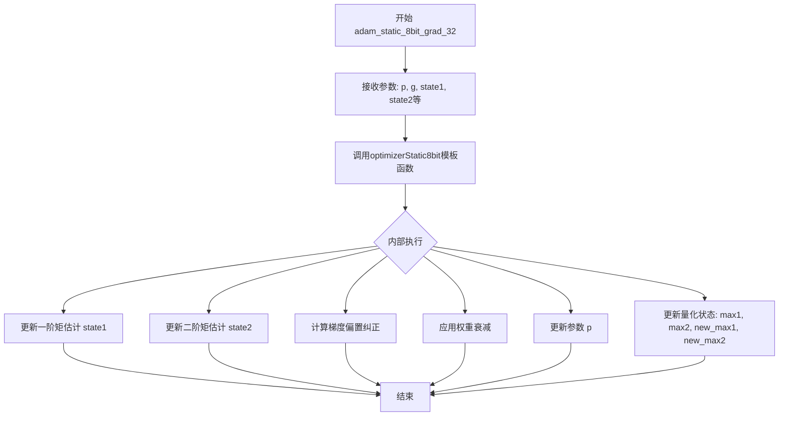

#### 带注释源码

```cpp
// 宏定义：MAKE_FUNC8 用于生成静态8位梯度优化函数
// 参数：fname=adam, oname=ADAM, gtype=float, gbits=32
#define MAKE_FUNC8(fname, oname, gtype, gbits)                                                                         \
    void fname##_static_8bit_grad_##gbits(                                                                             \
        gtype* p, gtype* g, unsigned char* state1, unsigned char* state2, float* unorm, float max_unorm,               \
        float param_norm, float beta1, float beta2, float eps, int step, float lr, float* quantiles1,                  \
        float* quantiles2, float* max1, float* max2, float* new_max1, float* new_max2, float weight_decay,             \
        float gnorm_scale, int n                                                                                       \
    ) {                                                                                                                \
        // 调用模板函数 optimizerStatic8bit，传入所有参数                                      \
        // gtype=float, oname=ADAM 表示使用32位浮点类型的Adam优化器                              \
        optimizerStatic8bit<gtype, oname>(                                                                             \
            g, p, state1, state2, unorm, max_unorm, param_norm, beta1, beta2, eps, step, lr, quantiles1, quantiles2,   \
            max1, max2, new_max1, new_max2, weight_decay, gnorm_scale, n                                               \
        );                                                                                                             \
    }

// 实例化生成 adam_static_8bit_grad_32 函数
MAKE_FUNC8(adam, ADAM, float, 32)
```

**展开后的实际函数签名：**

```cpp
void adam_static_8bit_grad_32(
    float* p,                  // 参数指针
    float* g,                  // 梯度指针
    unsigned char* state1,     // 一阶矩量化状态（8位）
    unsigned char* state2,     // 二阶矩量化状态（8位）
    float* unorm,              // 梯度范数向量
    float max_unorm,           // 最大梯度范数
    float param_norm,          // 参数范数
    float beta1,               // 一阶矩衰减系数 (通常0.9)
    float beta2,               // 二阶矩衰减系数 (通常0.999)
    float eps,                 // 数值稳定性常数 (通常1e-8)
    int step,                  // 当前训练步数
    float lr,                  // 学习率
    float* quantiles1,         // 一阶矩分位数
    float* quantiles2,         // 二阶矩分位数
    float* max1,               // 一阶矩最大值
    float* max2,               // 二阶矩最大值
    float* new_max1,          // 更新后一阶矩最大值
    float* new_max2,          // 更新后二阶矩最大值
    float weight_decay,       // 权重衰减系数
    float gnorm_scale,        // 梯度范数缩放
    int n                      // 参数数量
) {
    // 内部调用模板实现
    optimizerStatic8bit<float, ADAM>(
        g, p, state1, state2, unorm, max_unorm, param_norm,
        beta1, beta2, eps, step, lr, quantiles1, quantiles2,
        max1, max2, new_max1, new_max2, weight_decay, gnorm_scale, n
    );
}
```


### `adam_8bit_blockwise_grad_fp16`

该函数是 Adam 优化器的 8 位块级梯度更新实现，使用半精度（fp16）浮点类型。它通过分块量化技术对梯度进行 8 位压缩存储，并在优化器步骤中执行块级去量化更新，同时维护两个独立的量化状态缓冲区。

参数：

- `p`：`half*`，模型参数的指针，指向需要更新的参数向量
- `g`：`half*`，梯度的指针，指向当前计算的梯度值
- `state1`：`unsigned char*`，一阶矩估计的 8 位量化状态缓冲区
- `state2`：`unsigned char*`，二阶矩估计的 8 位量化状态缓冲区
- `beta1`：`float`，Adam 优化器的一阶矩衰减系数
- `beta2`：`float`，Adam 优化器的二阶矩衰减系数
- `beta3`：`float`，Adam 优化器的三阶矩衰减系数（用于自适应梯度缩放）
- `alpha`：`float`，学习率缩放因子
- `eps`：`float`，用于数值稳定的 epsilon 值，防止除零
- `step`：`int`，当前的优化步骤编号
- `lr`：`float`，实际学习率
- `quantiles1`：`float*`，用于状态1量化的分位数信息
- `quantiles2`：`float*`，用于状态2量化的分位数信息
- `absmax1`：`float*`，状态1块的绝对最大值（用于去量化）
- `absmax2`：`float*`，状态2块的绝对最大值（用于去量化）
- `weight_decay`：`float`，权重衰减系数（L2 正则化）
- `gnorm_scale`：`const float`，梯度范数缩放因子
- `skip_zeros`：`bool`，是否跳过零值梯度
- `n`：`int`，参数向量的元素总数

返回值：`void`，该函数无返回值，直接在原地修改参数指针 `p` 指向的数据

#### 流程图

```mermaid
flowchart TD
    A[开始执行 adam_8bit_blockwise_grad_fp16] --> B[调用 optimizerStatic8bitBlockwise 模板函数]
    B --> C[传入参数: gtype=half, optim_name=ADAM]
    C --> D[模板函数内部处理流程]
    D --> D1[对梯度 g 进行块级遍历]
    D1 --> D2[根据 absmax1 和 absmax2 去量化状态 state1 和 state2]
    D2 --> D3[计算 Adam 优化器更新: m = beta1*m + (1-beta1)*g, v = beta2*v + (1-beta2)*g^2]
    D3 --> D4[应用偏置校正: m_hat = m/(1-beta1^step), v_hat = v/(1-beta2^step)]
    D4 --> D5[计算参数更新: p = p - lr * m_hat / (sqrt(v_hat) + eps) + weight_decay * p]
    D5 --> D6[将更新后的参数量化为 8 位并存储回 state1 和 state2]
    D6 --> E[返回]
```

#### 带注释源码

```cpp
// 使用宏定义生成 Adam 优化器的 8 位块级梯度更新函数
// 该宏会生成一个名为 fname##_8bit_blockwise_grad_##gbits 的函数
#define MAKE_BLOCKWISE8(fname, optim_name, gtype, gbits)                                                               \
    void fname##_8bit_blockwise_grad_##gbits(                                                                          \
        gtype* p,       // 模型参数指针 (输入/输出)                                                                    \
        gtype* g,       // 梯度指针 (输入)                                                                            \
        unsigned char* state1,  // 一阶矩状态 (输入/输出)                                                              \
        unsigned char* state2,  // 二阶矩状态 (输入/输出)                                                              \
        float beta1,    // 一阶矩衰减系数                                                                             \
        float beta2,    // 二阶矩衰减系数                                                                             \
        float beta3,    // 三阶矩衰减系数                                                                             \
        float alpha,    // 学习率缩放因子                                                                             \
        float eps,      // 数值稳定性常数                                                                             \
        int step,       // 当前优化步骤                                                                              \
        float lr,       // 实际学习率                                                                                 \
        float* quantiles1,   // 状态1分位数                                                                            \
        float* quantiles2,   // 状态2分位数                                                                            \
        float* absmax1,      // 状态1绝对最大值                                                                        \
        float absmax2,        // 状态2绝对最大值                                                                        \
        float weight_decay,  // 权重衰减系数                                                                          \
        const float gnorm_scale,  // 梯度范数缩放                                                                       \
        bool skip_zeros,      // 是否跳过零梯度                                                                        \
        int n                 // 参数数量                                                                              \
    ) {                                                                                                                \
        // 调用模板函数 optimizerStatic8bitBlockwise 实现具体的 Adam 算法                                             \
        optimizerStatic8bitBlockwise<gtype, optim_name>(                                                               \
            p, g, state1, state2, beta1, beta2, beta3, alpha, eps, step, lr, quantiles1, quantiles2, absmax1, absmax2, \
            weight_decay, gnorm_scale, skip_zeros, n                                                                   \
        );                                                                                                             \
    }

// 使用宏展开生成 adam_8bit_blockwise_grad_fp16 函数
// 参数类型: gtype = half (半精度浮点数), gbits = fp16
MAKE_BLOCKWISE8(adam, ADAM, half, fp16)

// 对应的 C 语言绑定版本 (在 extern "C" 块中定义)
MAKE_CBLOCKWISE8(adam, ADAM, half, fp16)
```


### `percentileClipping_g32`

该函数是百分位裁剪（Percentile Clipping）的32位浮点数版本包装器，通过调用模板函数实现对梯度进行裁剪，以稳定神经网络训练过程。

参数：

- `g`：`float*`，梯度数组指针
- `gnorm_vec`：`float*`，存储梯度范数的向量，用于记录历史梯度范数
- `step`：`int`，当前优化步骤（用于决定使用哪个历史范数）
- `n`：`const int`，梯度元素总数

返回值：`void`，无返回值

#### 流程图

```mermaid
flowchart TD
    A[开始 percentileClipping_g32] --> B[调用 percentileClipping&lt;float&gt;模板函数]
    B --> C[传入参数: g, gnorm_vec, step, n]
    C --> D[结束]
```

#### 带注释源码

```cpp
// percentileClipping_g32: 32位浮点数梯度百分位裁剪的包装函数
// 该函数是CUDA/HIP内核调用的入口点之一
void percentileClipping_g32(float* g, float* gnorm_vec, int step, const int n) {
    // 调用模板函数 percentileClipping<float>，处理32位浮点数类型的梯度裁剪
    // 参数说明：
    //   g: 输入梯度数组
    //   gnorm_vec: 梯度范数向量，用于存储滑动窗口内的梯度范数统计
    //   step: 当前训练步数，用于确定时间窗口
    //   n: 梯度张量的元素总数
    percentileClipping<float>(g, gnorm_vec, step, n);
}
```


### `percentileClipping_g16`

对 half（16位浮点）类型的梯度进行百分位裁剪的包装函数，用于将梯度范数限制在特定百分位数，以实现稳定的神经网络训练。

参数：

- `g`：`half*`，输入的梯度数组指针
- `gnorm_vec`：`float*`，输出梯度范数向量，用于存储计算得到的梯度范数
- `step`：`int`，当前的训练步数，用于确定使用哪一部分历史梯度进行百分位计算
- `n`：`const int`，梯度元素总数

返回值：`void`，无返回值

#### 流程图

```mermaid
flowchart TD
    A[开始] --> B[调用percentileClipping&lt;half&gt;模板函数]
    B --> C[传入参数: g, gnorm_vec, step, n]
    C --> D[结束]
```

#### 带注释源码

```cpp
// 在 BUILD_CUDA || BUILD_HIP 条件下编译
#if BUILD_CUDA || BUILD_HIP

// percentileClipping_g32 函数：处理 32 位浮点梯度
void percentileClipping_g32(float* g, float* gnorm_vec, int step, const int n) {
    // 调用模板函数，模板参数为 float 类型
    percentileClipping<float>(g, gnorm_vec, step, n);
}

// percentileClipping_g16 函数：处理 16 位浮点（half）梯度
void percentileClipping_g16(half* g, float* gnorm_vec, int step, const int n) {
    // 调用模板函数，模板参数为 half 类型
    // 这是一个包装函数，用于处理 half 类型的梯度数据
    percentileClipping<half>(g, gnorm_vec, step, n);
}

#endif
```


### `quantizeBlockwise_fp16`

该函数是 FP16（半精度浮点数）块级量化的包装函数，用于将输入的半精度浮点数数组按固定块大小进行 8 位量化，内部调用模板函数 `quantizeBlockwise<half, 0, General8bit>` 实现核心逻辑。

参数：

- `code`：`float*`，代码本指针，用于存储量化后的码本（在此调用中未使用，传入 nullptr 对应模板参数）
- `A`：`half*`，输入数组，待量化的半精度浮点数数据
- `absmax`：`float*`，每个块的绝对最大值数组，用于量化时的缩放因子
- `out`：`unsigned char*`，输出数组，存储量化后的 8 位数据
- `blocksize`：`int`，每个块的元素数量
- `n`：`const int`，输入数组的总元素数量

返回值：`void`，无返回值

#### 流程图

```mermaid
flowchart TD
    A[开始 quantizeBlockwise_fp16] --> B[调用 quantizeBlockwise 模板函数]
    B --> C[模板参数: dtype=half, qat=0, quant_type=General8bit]
    C --> D[计算每个块的绝对最大值 absmax]
    D --> E[根据 absmax 将 half 数据缩放并量化]
    E --> F[将量化后的 8 位数据存储到 out]
    F --> G[结束]
```

#### 带注释源码

```cpp
// FP16 块级量化函数包装器
void quantizeBlockwise_fp16(
    float* code,      // 代码本指针（此实现中未使用，传 nullptr）
    half* A,          // 输入：半精度浮点数数组
    float* absmax,    // 输出：每个块的绝对最大值
    unsigned char* out, // 输出：量化后的 8 位数据
    int blocksize,    // 量化块大小
    const int n       // 输入数组总元素数
) {
    // 调用模板函数 quantizeBlockwise，参数说明：
    // - half: 输入数据类型为半精度浮点数
    // - 0: QAT（Quantization Aware Training）标志，未使用
    // - General8bit: 使用通用 8 位量化方法
    // - code: 代码本（传入了实际指针但模板内部会忽略）
    // - A: 输入数据
    // - absmax: 块级绝对最大值
    // - out: 量化输出
    // - nullptr: 额外参数（模板定义中需要）
    // - 0: 额外参数（模板定义中需要）
    // - blocksize: 块大小
    // - n: 元素总数
    quantizeBlockwise<half, 0, General8bit>(code, A, absmax, out, nullptr, 0, blocksize, n);
}
```


### `quantizeBlockwise_fp16_fp4`

这是一个包装函数，用于将 FP16（half）类型的输入数据按块量化成 FP4 格式。该函数内部调用模板函数 `quantizeBlockwise`，使用 `half` 作为数据类型，`FP4` 作为量化模式。

参数：

- `code`：`float*`，代码本（codebook）指针，此处未使用（传 nullptr）
- `A`：`half*`，输入的 FP16 类型数据数组
- `absmax`：`float*`，输出数组，存储每个块的绝对最大值
- `out`：`unsigned char*`，量化后的输出数组（FP4 格式）
- `blocksize`：`int`，每个块的元素数量
- `n`：`const int`，输入数据的总元素数量

返回值：`void`，无返回值

#### 流程图

```mermaid
flowchart TD
    A[开始 quantizeBlockwise_fp16_fp4] --> B[调用 quantizeBlockwise&lt;half, 0, FP4&gt;]
    B --> C[传入参数: nullptr, A, absmax, out, nullptr, 0, blocksize, n]
    C --> D[内部执行块级FP4量化]
    D --> E[结束]
```

#### 带注释源码

```cpp
// 将 FP16 数据按块量化成 FP4 格式的包装函数
void quantizeBlockwise_fp16_fp4(
    float* code,      // 代码本指针，此处未使用（FP4不需要代码本）
    half* A,          // 输入：FP16 类型的输入数据
    float* absmax,    // 输出：每个块的绝对最大值
    unsigned char* out, // 输出：量化后的 FP4 数据
    int blocksize,    // 块大小
    const int n       // 总元素数量
) {
    // 调用模板函数 quantizeBlockwise 进行实际的量化操作
    // 模板参数：
    //   - half: 输入数据类型
    //   - 0: 量化标志位
    //   - FP4: 量化模式（4位浮点）
    // 传入 nullptr 作为 code 参数，因为 FP4 量化不需要代码本
    quantizeBlockwise<half, 0, FP4>(nullptr, A, absmax, out, nullptr, 0, blocksize, n);
}
```


### `quantizeBlockwise_fp16_nf4`

该函数是一个包装函数，用于将半精度浮点数（FP16）数组按块进行NF4（Normal Float 4-bit）量化处理。它内部调用模板函数`quantizeBlockwise`实现具体的量化逻辑。

参数：

- `code`：`float*`，量化码本指针（NF4模式下传递nullptr）
- `A`：`half*`，输入的半精度浮点数数组，待量化数据
- `absmax`：`float*`，存储每个块的绝对最大值，用于量化缩放
- `out`：`unsigned char*`，量化后的输出数组（4-bit压缩存储）
- `blocksize`：`int`，每个量化块的大小
- `n`：`const int`，要处理的元素总数

返回值：`void`，无返回值（结果直接写入out指针指向的内存）

#### 流程图

```mermaid
flowchart TD
    A[开始 quantizeBlockwise_fp16_nf4] --> B[调用 quantizeBlockwise 模板函数]
    B --> C[模板参数: half类型]
    B --> D[模板参数: 0]
    B --> E[模板参数: NF4量化模式]
    C --> F[quantizeBlockwise<br/>输入: A, absmax, out, blocksize, n]
    F --> G[计算每个块的absmax]
    G --> H[使用NF4量化算法<br/>将FP16转换为4bit]
    H --> I[结果写入out指针]
    I --> J[结束]
```

#### 带注释源码

```cpp
// NF4 (Normal Float 4-bit) 量化函数 - FP16版本
// 该函数将半精度浮点数数组按块进行NF4量化
void quantizeBlockwise_fp16_nf4(
    float* code,      // 量化码本，NF4模式下传nullptr
    half* A,          // 输入数组，待量化的FP16数据
    float* absmax,    // 输出数组，存储每个块的绝对最大值
    unsigned char* out, // 输出数组，存储量化后的4bit数据
    int blocksize,    // 量化块大小
    const int n       // 总元素数量
) {
    // 调用模板函数quantizeBlockwise进行实际量化
    // 模板参数说明：
    // - half: 输入数据类型为半精度浮点数
    // - 0: 量化模式参数
    // - NF4: 使用Normal Float 4-bit量化算法
    quantizeBlockwise<half, 0, NF4>(
        nullptr,    // code参数，NF4不需要码本
        A,          // 输入数据指针
        absmax,     // 块绝对最大值数组
        out,        // 量化输出指针
        nullptr,    // 额外参数，传nullptr
        0,          // 额外参数
        blocksize,  // 块大小
        n           // 元素总数
    );
}
```


### `quantizeBlockwise_bf16`

该函数是用于将 bfloat16 类型的输入数据按块进行 8-bit 量化（General8bit 模式）的包装函数，它调用模板函数 `quantizeBlockwise` 实现具体的量化逻辑，将输入数据转换为 8 位表示并计算每块的绝对最大值。

参数：

- `code`：`float*`，量化代码本（codebook），用于存储量化查找表
- `A`：`__nv_bfloat16*`，输入的 bfloat16 类型数组，待量化的数据
- `absmax`：`float*`，输出参数，每块的最大绝对值，用于反量化
- `out`：`unsigned char*`，输出参数，量化后的 8 位数据
- `blocksize`：`int`，每个块的元素数量
- `n`：`const int`，输入数据的总元素数量

返回值：`void`，无返回值

#### 流程图

```mermaid
flowchart TD
    A[开始 quantizeBlockwise_bf16] --> B[调用 quantizeBlockwise 模板函数]
    B --> C[模板类型参数: __nv_bfloat16, 0, General8bit]
    C --> D[quantizeBlockwise 执行块级量化]
    D --> E[计算每块绝对最大值]
    E --> F[将 bf16 数据映射到 8 位表示]
    F --> G[输出量化数据和 abmax]
    G --> H[结束]
```

#### 带注释源码

```cpp
// quantizeBlockwise_bf16 函数
// 该函数是 quantizeBlockwise 模板的包装器，专门处理 bfloat16 数据的 8-bit 块级量化
void quantizeBlockwise_bf16(
    float* code,              // 量化代码本，用于 General8bit 模式的查找表
    __nv_bfloat16* A,         // 输入：bfloat16 类型的原始输入数据
    float* absmax,            // 输出：每个量化块的绝对最大值
    unsigned char* out,       // 输出：量化后的 8 位数据
    int blocksize,            // 量化块大小
    const int n               // 输入数据总元素数
) {
    // 调用模板函数 quantizeBlockwise 进行实际量化
    // 模板参数：
    //   - __nv_bfloat16: 输入数据类型
    //   - 0: 量化标志位
    //   - General8bit: 量化模式（8-bit 通用量化）
    // 传递参数：
    //   - code: 代码本指针
    //   - A: 输入数据
    //   - absmax: 最大绝对值输出
    //   - out: 量化结果
    //   - nullptr: 额外的代码本（此处未使用）
    //   - 0: 额外标志
    //   - blocksize: 块大小
    //   - n: 元素数量
    quantizeBlockwise<__nv_bfloat16, 0, General8bit>(code, A, absmax, out, nullptr, 0, blocksize, n);
}
```


### `quantizeBlockwise_bf16_fp4`

该函数是量化操作的外层封装函数，专门用于将 bfloat16 类型的输入数据按块（blockwise）量化为 FP4（4位浮点）格式。它内部调用模板函数 `quantizeBlockwise` 实现具体的量化逻辑，是 GPTQ/AWQ 等量化推理库的核心组件之一。

参数：

- `code`：`float*`，量化码本指针（FP4 模式下传入 nullptr）
- `A`：`__nv_bfloat16*`，待量化的输入数据数组（bfloat16 格式）
- `absmax`：`float*`，每个块的绝对最大值，用于缩放因子计算
- `out`：`unsigned char*`，量化后的输出缓冲区（每两个元素占用 1 字节）
- `blocksize`：`int`，每个块的元素数量
- `n`：`const int`，输入数据的总元素数量

返回值：`void`，无返回值（结果直接写入 out 指针指向的缓冲区）

#### 流程图

```mermaid
flowchart TD
    A[quantizeBlockwise_bf16_fp4 调用] --> B{检查 blocksize 和 n}
    B -->|参数有效| C[调用 quantizeBlockwise 模板函数]
    B -->|参数无效| D[返回或抛出异常]
    C --> E[模板实例化: 类型=__nv_bfloat16, 量化模式=FP4]
    E --> F[遍历输入数组 A，按 blocksize 分块]
    F --> G[计算每块的 absmax 绝对最大值]
    G --> H[将块内数据归一化到 FP4 表示范围]
    H --> I[将归一化结果编码为 4-bit 数据]
    I --> J[写入输出缓冲区 out]
    J --> K[结束]
```

#### 带注释源码

```cpp
// 函数名: quantizeBlockwise_bf16_fp4
// 功能: 将 bfloat16 数据块量化 FP4 (4-bit floating point) 格式
// 参数:
//   - code: float* - 量化码本（FP4 模式下不使用，传 nullptr）
//   - A: __nv_bfloat16* - 输入的 bfloat16 原始数据
//   - absmax: float* - 输出：每个块的绝对最大值（缩放因子）
//   - out: unsigned char* - 输出：量化后的 4-bit 数据
//   - blocksize: int - 每个量化块的元素个数
//   - n: const int - 输入数据的总元素个数
void quantizeBlockwise_bf16_fp4(
    float* code,                // FP4 模式不使用码本，传 nullptr
    __nv_bfloat16* A,          // 输入：bfloat16 格式的待量化数据
    float* absmax,            // 输出：每个块的 absmax 值
    unsigned char* out,        // 输出：量化后的 4-bit 数据
    int blocksize,             // 块大小
    const int n                // 总元素数
) {
    // 调用模板函数 quantizeBlockwise 进行实际量化
    // 模板参数:
    //   - __nv_bfloat16: 输入数据类型
    //   - 0: 未知参数（可能与量化配置相关）
    //   - FP4: 量化模式为 4 位浮点
    quantizeBlockwise<__nv_bfloat16, 0, FP4>(
        nullptr,    // code 参数，FP4 模式不需要
        A,          // 输入数据
        absmax,     // 块级绝对最大值（缩放因子）
        out,        // 量化输出
        nullptr,    // 另一个代码指针（备用）
        0,          // 偏移量
        blocksize,  // 块大小
        n           // 元素总数
    );
}
```

---

### 关键组件信息

| 组件名称 | 一句话描述 |
|---------|-----------|
| `quantizeBlockwise` | 模板化的块级量化核心函数，支持多种数据类型和量化模式（FP4/NF4/General8bit） |
| `FP4` | 4位浮点量化模式的枚举标识符 |
| `__nv_bfloat16` | NVIDIA 的 bfloat16 数据类型别名 |
| `absmax` | 块级绝对最大值，用于量化时的缩放因子计算 |

---

### 潜在技术债务与优化空间

1. **模板实例化冗余**：当前通过宏和大量重复代码生成不同类型/模式的量化函数，可考虑使用运行时多态或更简洁的函数指针表来减少代码膨胀。

2. **错误处理缺失**：函数未对 `blocksize <= 0`、`n <= 0`、空指针等异常情况进行检查，可能导致未定义行为。

3. **内存对齐假设**：代码假设输入输出缓冲区已正确对齐，未进行显式检查或动态处理。

4. **文档缺失**：外层封装函数缺乏注释说明参数的具体用途和约束条件。

---

### 其它项目

**设计目标与约束：**
- 该函数是 CUDA/HIP 环境下量化操作的低级 C 接口，供 Python/其他语言通过 ctypes 调用。
- 仅支持 GPU（CUDA/HIP）执行路径，CPU 路径通过其他函数实现。

**错误处理与异常设计：**
- 目前依赖调用方保证参数合法性。
- 建议在函数入口添加基本的参数校验（空指针检查、数值范围检查）。

**外部依赖与接口契约：**
- 依赖 `ops.cuh` 或 `ops_hip.cuh` 中定义的 `quantizeBlockwise` 模板实现。
- 调用方需保证 `A`、`out`、`absmax` 指向足够大的内存区域，且 `out` 的字节长度为 `n * 4 / 8 = n / 2`（FP4 每两个元素占 1 字节）。


### `quantizeBlockwise_bf16_nf4`

该函数是用于将 BF16（Brain Float 16）类型的输入数据按块进行 NF4（Normal Float 4-bit）量化操作的包装函数。它内部调用模板函数 `quantizeBlockwise` 实现具体的量化逻辑。

参数：

- `code`：`float*`，代码本（codebook）指针，NF4模式下传递 nullptr
- `A`：`__nv_bfloat16*`，输入的 BF16 类型数据数组，待量化
- `absmax`：`float*`，存储每个块的绝对最大值，用于量化缩放
- `out`：`unsigned char*`，量化后的 4-bit 输出数据
- `blocksize`：`int`，每个量化块的大小
- `n`：`const int`，输入数据的总元素数量

返回值：`void`，无返回值

#### 流程图

```mermaid
flowchart TD
    A[开始 quantizeBlockwise_bf16_nf4] --> B[接收输入参数]
    B --> C[调用模板函数 quantizeBlockwise<br/>&lt;__nv_bfloat16, 0, NF4&gt;]
    C --> D[传递 nullptr 作为 code 参数]
    D --> E[传递输入数组 A, absmax, out]
    E --> F[传递 blocksize 和 n]
    F --> G[在 quantizeBlockwise 内部执行 NF4 量化]
    G --> H[计算每个块的绝对最大值]
    H --> I[将 BF16 数据映射到 NF4 编码]
    I --> J[结果存储到 out 缓冲区]
    J --> K[结束]
```

#### 带注释源码

```cpp
// BF16 类型的 NF4 块级量化函数
void quantizeBlockwise_bf16_nf4(
    float* code,              // 代码本指针，NF4 模式下为 nullptr
    __nv_bfloat16* A,         // 输入的 BF16 类型数据
    float* absmax,            // 输出：每个块的绝对最大值
    unsigned char* out,       // 输出：量化后的 4-bit 数据
    int blocksize,            // 量化块大小
    const int n               // 输入元素总数
) {
    // 调用模板量化函数，指定：
    // - 数据类型：__nv_bfloat16 (BF16)
    // - 量化模式参数：0（NF4 特定）
    // - 量化方案：NF4 (Normal Float 4-bit)
    quantizeBlockwise<__nv_bfloat16, 0, NF4>(
        nullptr,    // code: NF4 不需要代码本
        A,          // A: 输入数据
        absmax,     // absmax: 存储每块的最大绝对值
        out,        // out: 量化输出
        nullptr,    // 额外参数（未使用）
        0,          // 额外参数（未使用）
        blocksize,  // blocksize: 块大小
        n           // n: 元素数量
    );
}
```


### `quantizeBlockwise_fp32`

这是一个包装函数，用于对 float32 数据进行块式量化（block-wise quantization），使用 General8bit（常规8位）量化方案。该函数计算每个块的绝对最大值（absmax），并将输入的 float32 数值量化为 8 位无符号整数。

参数：

- `code`：`float*`，量化码本（codebook）指针，存储量化查找表
- `A`：`float*`，待量化的输入数组指针
- `absmax`：`float*`，存储每个块的绝对最大值，用于反量化
- `out`：`unsigned char*`，量化后的输出缓冲区指针
- `blocksize`：`int`，块大小，指定每多少个元素为一个量化块
- `n`：`const int`，要量化的元素总数

返回值：`void`，该函数无返回值，结果直接写入 out 和 absmax 缓冲区

#### 流程图

```mermaid
flowchart TD
    A[开始 quantizeBlockwise_fp32] --> B[接收参数: code, A, absmax, out, blocksize, n]
    B --> C[调用 quantizeBlockwise 模板函数]
    C --> D[模板参数: float 类型, 0, General8bit]
    D --> E[遍历输入数组，按 blocksize 分块]
    E --> F[计算每块的绝对最大值 absmax]
    F --> G[将块内 float 值映射到 0-255 范围]
    G --> H[输出量化后的 unsigned char 数据]
    H --> I[结束]
```

#### 带注释源码

```cpp
// 对 float32 数据进行块式量化，使用 General8bit 量化方案
void quantizeBlockwise_fp32(
    float* code,        // 量化码本指针（用于查找表，General8bit 模式下可为 nullptr）
    float* A,           // 待量化的输入 float32 数组
    float* absmax,     // 输出：每个块的绝对最大值（用于反量化）
    unsigned char* out, // 输出：量化后的 8 位无符号整数数组
    int blocksize,      // 块大小，每 blocksize 个元素进行一次量化
    const int n         // 总元素数量
) {
    // 调用模板函数 quantizeBlockwise，指定：
    // - 数据类型：float (fp32)
    // - 模板参数 0：表示使用默认配置
    // - 量化类型：General8bit（常规 8 位量化，非 FP4/NF4）
    quantizeBlockwise<float, 0, General8bit>(
        code,     // 传递给模板函数
        A,        // 输入数据
        absmax,   // 输出每块的最大绝对值
        out,      // 量化输出
        nullptr,  // 额外参数（未使用）
        0,        // 额外参数（未使用）
        blocksize, // 块大小
        n         // 元素总数
    );
}
```


### `quantizeBlockwise_fp32_fp4`

该函数是 FP4（4位浮点）量化方式的包装器，用于将32位浮点数据按块进行4位浮点量化。它内部调用模板函数 `quantizeBlockwise`，指定了 `float` 数据类型和 `FP4` 量化模式。

参数：

- `code`：`float*`，量化码本指针（FP4模式下传入nullptr）
- `A`：`float*`，待量化的输入数组（32位浮点）
- `absmax`：`float*`，每个块的绝对最大值，用于量化缩放
- `out`：`unsigned char*`，量化后的输出数组（4位每值）
- `blocksize`：`int`，块大小，指定每个块包含的元素数量
- `n`：`const int`，输入数据的总元素个数

返回值：`void`，无返回值（操作结果通过输出参数 `out` 和 `absmax` 返回）

#### 流程图

```mermaid
flowchart TD
    A[开始 quantizeBlockwise_fp32_fp4] --> B[调用模板函数 quantizeBlockwise&lt;float, 0, FP4&gt;]
    B --> C[传入参数: nullptr, A, absmax, out, nullptr, 0, blocksize, n]
    C --> D[在 quantizeBlockwise 内部执行FP4量化]
    D --> E[计算每个块的absmax]
    E --> F[将float32数据映射到FP4表示]
    F --> G[结果存储到out和absmax]
    G --> H[结束]
```

#### 带注释源码

```cpp
// FP4量化函数 - 将32位浮点数据按块量化到4位浮点格式
// 参数说明:
//   code: 量化码本/查找表 (FP4模式下为nullptr，使用内置FP4格式)
//   A: 输入的32位浮点数据数组
//   absmax: 输出参数，每个块的绝对最大值（用于反量化时的缩放）
//   out: 输出参数，存储量化后的4位数据
//   blocksize: 量化块大小
//   n: 输入数据总元素个数
void quantizeBlockwise_fp32_fp4(
    float* code,      // 码本指针，FP4模式下传nullptr
    float* A,         // 输入: 待量化的float32数组
    float* absmax,   // 输出: 每个块的absmax值
    unsigned char* out, // 输出: 量化后的4位数据
    int blocksize,   // 块大小
    const int n      // 总元素数
) {
    // 调用模板函数 quantizeBlockwise 进行实际量化
    // 模板参数:
    //   float: 输入数据类型
    //   0: 某个配置参数（可能表示不使用额外标志）
    //   FP4: 量化模式为4位浮点
    // 函数参数:
    //   nullptr: 替代code参数（FP4使用内置格式）
    //   A: 输入数据
    //   absmax: 块的绝对最大值
    //   out: 量化输出
    //   nullptr: 替代另一个code参数
    //   0: 某个配置值
    //   blocksize: 块大小
    //   n: 元素总数
    quantizeBlockwise<float, 0, FP4>(nullptr, A, absmax, out, nullptr, 0, blocksize, n);
}
```


### `quantizeBlockwise_fp32_nf4`

将32位浮点数数组按块进行NF4量化，返回量化后的块索引和对应的绝对最大值。

参数：

- `code`：`float*`，量化代码本（NF4不需要，传入nullptr）
- `A`：`float*`，输入的要量化的32位浮点数数组
- `absmax`：`float*`，输出参数，每个块的绝对最大值
- `out`：`unsigned char*`，输出参数，量化后的NF4块索引
- `blocksize`：`int`，每个块的元素数量
- `n`：`const int`，输入数组的总元素数量

返回值：`void`，无返回值

#### 流程图

```mermaid
flowchart TD
    A[开始 quantizeBlockwise_fp32_nf4] --> B[调用 quantizeBlockwise<float, 0, NF4> 模板函数]
    B --> C[传入参数: code=nullptr, A, absmax, out, nullptr, 0, blocksize, n]
    C --> D[在 quantizeBlockwise 内部执行NF4量化]
    D --> E[计算每个块的绝对最大值]
    E --> F[将float值映射到NF4格式的最近代码点]
    F --> G[输出量化结果到out数组]
    G --> H[输出块的最大值到absmax数组]
    H --> I[结束]
```

#### 带注释源码

```cpp
// 将32位浮点数数组按块进行NF4量化
void quantizeBlockwise_fp32_nf4(
    float* code,         // NF4不需要codebook，传入nullptr
    float* A,            // 输入：待量化的fp32浮点数数组
    float* absmax,       // 输出：每个块的绝对最大值（用于反量化）
    unsigned char* out,  // 输出：量化后的NF4索引（每个值2bit，4个值占用1字节）
    int blocksize,       // 每个块的元素数量
    const int n          // 输入数组的总元素数量
) {
    // 调用模板函数 quantizeBlockwise，模板参数：
    // - float: 输入数据类型
    // - 0: 未知参数（可能是量化级别）
    // - NF4: 使用NF4（Normal Float 4-bit）量化方式
    quantizeBlockwise<float, 0, NF4>(
        nullptr,      // codebook指针，NF4使用固定代码本
        A,            // 输入数组
        absmax,       // 输出：每个块的绝对最大值
        out,          // 输出：量化后的数据
        nullptr,      // 额外的scale数组，NF4不需要
        0,            // 额外的偏移量
        blocksize,    // 块大小
        n             // 元素总数
    );
}
```


### `dequantizeBlockwise_fp16`

该函数是一个CUDA/HIP设备的量化块反量化 wrapper 函数，用于将 uint8 格式的 4bit 量化数据（使用 General8bit 量化方案）反量化为半精度浮点数（FP16），内部调用模板函数 `dequantizeBlockwise` 完成实际计算。

参数：

- `code`：`float*`，量化编码表（codebook）指针，用于存储量化码本
- `A`：`unsigned char*`，输入的量化数据（4bit 压缩数据，每字节存储2个值）
- `absmax`：`float*`，每个量化块的绝对最大值，用于反量化缩放
- `out`：`half*`，输出的半精度浮点数数组（反量化结果）
- `blocksize`：`int`，量化块大小（每个块共享一个 absmax 值）
- `n`：`const int`，要反量化的元素总数
- `stream`：`cudaStream_t`，CUDA/HIP 执行流，用于异步执行

返回值：`void`，无返回值（通过 out 参数输出结果）

#### 流程图

```mermaid
flowchart TD
    A[开始 dequantizeBlockwise_fp16] --> B[接收参数: code, A, absmax, out, blocksize, n, stream]
    B --> C[调用模板函数 dequantizeBlockwise<half, General8bit>]
    C --> D[根据 blocksize 遍历每个数据块]
    D --> E[从 A 中读取量化数据]
    E --> F[使用 absmax 进行反量化缩放]
    F --> G[将结果写入 out 指针]
    G --> H[返回]
```

#### 带注释源码

```cpp
// 该函数是 dequantizeBlockwise 模板函数的 wrapper
// 功能：将 4bit 量化数据反量化为半精度浮点数（FP16）
// 量化方案：General8bit（普通 8 位量化）
void dequantizeBlockwise_fp16(
    float* code,               // 量化码本（存储量化编码）
    unsigned char* A,          // 输入：4bit 量化数据（每字节存储2个4bit值）
    float* absmax,             // 输入：每个块的绝对最大值（缩放因子）
    half* out,                 // 输出：反量化后的半精度浮点数
    int blocksize,             // 量化块大小
    const int n,               // 总元素数量
    cudaStream_t stream        // CUDA 流（异步执行）
) {
    // 调用模板函数进行实际反量化计算
    // 模板参数：
    //   - half: 输出数据类型（半精度浮点）
    //   - General8bit: 量化方案（普通 8 位量化）
    dequantizeBlockwise<half, General8bit>(code, A, absmax, out, blocksize, n, stream);
}
```


### `dequantizeBlockwise_fp16_fp4`

该函数是4位FP4量化块的解量化wrapper函数，用于将FP4格式的量化数据块反量化为FP16（half精度浮点）数据。它是模板函数 `dequantizeBlockwise<half, FP4>` 的非模板封装，支持CUDA/HIP和XPU（SYCL）后端。

参数：

-  `code`：`float*`，量化码本指针（FP4模式下为nullptr）
-  `A`：`unsigned char*`，输入的FP4量化数据
-  `absmax`：`float*`，每个量化块的绝对最大值，用于反量化缩放
-  `out`：`half*`（CUDA/HIP）或 `sycl::half*`（XPU），输出解量化后的FP16数据
-  `blocksize`：`int`，每个量化块的大小
-  `n`：`const int`，要解量化的元素总数
-  `stream`：`cudaStream_t`（CUDA/HIP）或 `sycl::queue*`（XPU），用于异步执行的流/队列

返回值：`void`，无返回值（操作通过输出参数 `out` 返回）

#### 流程图

```mermaid
flowchart TD
    A[开始 dequantizeBlockwise_fp16_fp4] --> B{构建环境}
    B --> C[CUDA/HIP环境]
    B --> D[XPU环境]
    C --> E[调用 dequantizeBlockwise<br/>&lt;half, FP4&gt;]
    D --> F[调用 dequantizeBlockwise<br/>&lt;sycl::half, FP4&gt;]
    E --> G[传入参数: nullptr, A, absmax, out, blocksize, n, stream]
    F --> G
    G --> H[内核执行: 读取FP4数据, 使用absmax缩放, 输出FP16]
    H --> I[结束]
```

#### 带注释源码

```cpp
// CUDA/HIP 版本
void dequantizeBlockwise_fp16_fp4(
    float* code,      // FP4模式下为nullptr，码本不需要
    unsigned char* A, // 输入的FP4量化数据（每字节包含2个4-bit值）
    float* absmax,    // 每个块的绝对最大值，用于反量化
    half* out,        // 输出缓冲区，存储解量化后的FP16数据
    int blocksize,    // 量化块大小
    const int n,      // 总元素数量
    cudaStream_t stream // CUDA流，用于异步执行
) {
    // 调用模板函数，FP4格式不需要codebook（传nullptr）
    dequantizeBlockwise<half, FP4>(nullptr, A, absmax, out, blocksize, n, stream);
}

// XPU (SYCL) 版本
void dequantizeBlockwise_fp16_fp4(
    float* code,      // FP4模式下为nullptr
    unsigned char* A, // 输入的FP4量化数据
    float* absmax,    // 每个块的绝对最大值
    sycl::half* out,  // 输出缓冲区（SYCL half类型）
    int blocksize,    // 量化块大小
    const int n,      // 总元素数量
    sycl::queue* stream // SYCL队列
) {
    // 调用SYCL版本的模板函数
    dequantizeBlockwise<sycl::half, FP4>(nullptr, A, absmax, out, blocksize, n, stream);
}
```


### `dequantizeBlockwise_fp16_nf4`

该函数是一个封装函数，用于将使用 NF4（Normal Float 4-bit）格式量化的半精度浮点数（fp16）数据进行块级别的反量化运算。它调用模板函数 `dequantizeBlockwise` 完成实际的解码工作，将 4 位量化数据还原为 half 精度浮点数。

参数：

- `code`：`float*`，量化编码表（NF4 模式下传 nullptr）
- `A`：`unsigned char*`，输入的 NF4 量化数据数组
- `absmax`：`float*`，每个量化块的绝对最大值，用于反量化缩放
- `out`：`half*`，输出数组，反量化后的半精度浮点数结果
- `blocksize`：`int`，每个量化块的大小
- `n`：`const int`，要反量化处理的元素总数
- `stream`：`cudaStream_t`，CUDA 异步流，用于控制执行顺序

返回值：`void`，无返回值，结果通过 `out` 参数输出

#### 流程图

```mermaid
flowchart TD
    A[开始 dequantizeBlockwise_fp16_nf4] --> B[调用模板函数 dequantizeBlockwise]
    B --> C[传入类型参数 half 和 NF4]
    C --> D[遍历所有数据块]
    D --> E[从 A 读取 4 位 NF4 量化值]
    E --> F[使用 absmax 缩放因子还原浮点值]
    F --> G[结果写入 out 指针]
    G --> H[异步执行,返回]
```

#### 带注释源码

```cpp
// 该函数是 dequantizeBlockwise 模板函数的封装，针对 half 类型和 NF4 量化格式
void dequantizeBlockwise_fp16_nf4(
    float* code,        // NF4 格式不使用 codebook，传 nullptr
    unsigned char* A,   // 输入：NF4 格式的 4bit 量化数据
    float* absmax,      // 输入：每个块的绝对最大值（缩放因子）
    half* out,          // 输出：反量化后的半精度浮点数
    int blocksize,      // 量化块大小
    const int n,       // 要处理的元素总数
    cudaStream_t stream // CUDA 流用于异步执行
) {
    // 调用模板函数 dequantizeBlockwise，模板参数:
    // - half: 输出数据类型为半精度浮点
    // - NF4: 使用 Normal Float 4-bit 反量化逻辑
    dequantizeBlockwise<half, NF4>(nullptr, A, absmax, out, blocksize, n, stream);
}
```


### `dequantizeBlockwise_fp32`

该函数是针对32位浮点数（fp32）数据类型的块级反量化封装函数，用于将4位量化数据（存储在无符号字符数组中）通过绝对最大值缩放的方式还原为全精度float32数据，支持CUDA/HIP和XPU（SYCL）两种计算后端。

参数：

- `code`：`float*`，量化码本指针（对于General8bit模式非nullptr，用于存储量化编码；对于FP4/NF4模式可以为nullptr）
- `A`：`unsigned char*`，输入的量化数据（4位压缩数据，每字节存储2个值）
- `absmax`：`float*`，每个量化块的绝对最大值数组，用于反量化时的缩放因子
- `out`：`float*`，反量化后的输出浮点数组
- `blocksize`：`int`，每个量化块的大小（元素数量）
- `n`：`const int`，输入数据的总元素数量
- `stream`：`cudaStream_t`（CUDA/HIP）或`sycl::queue*`（XPU），用于异步执行的计算流

返回值：`void`，无返回值（通过输出指针参数返回结果）

#### 流程图

```mermaid
graph TD
    A[开始 dequantizeBlockwise_fp32] --> B{检查构建目标}
    B -->|BUILD_CUDA or BUILD_HIP| C[使用 cudaStream_t]
    B -->|BUILD_XPU| D[使用 sycl::queue*]
    C --> E[调用模板函数 dequantizeBlockwise<br/>&lt;float, General8bit&gt;]
    D --> E
    E --> F[模板函数内部处理]
    F --> G[遍历每个block]
    G --> H[读取block的absmax缩放因子]
    H --> I[读取量化数据]
    I --> J[反量化计算: out[i] = A[i] * absmax[block_id] / 7.5]
    J --> K{是否处理完所有数据}
    K -->|否| G
    K -->|是| L[结束]
```

#### 带注释源码

```cpp
// CUDA/HIP 版本
void dequantizeBlockwise_fp32(
    float* code,        // 量化码本指针（General8bit模式使用）
    unsigned char* A,   // 输入：4位量化数据（每字节存储2个4位值）
    float* absmax,      // 输入：每个block的绝对最大值（缩放因子）
    float* out,         // 输出：反量化后的全精度float数据
    int blocksize,     // 量化块大小
    const int n,       // 总元素数量
    cudaStream_t stream // CUDA流，用于异步执行
) {
    // 调用模板函数，指定数据类型为float，量化模式为General8bit
    dequantizeBlockwise<float, General8bit>(code, A, absmax, out, blocksize, n, stream);
}

// XPU (SYCL) 版本
void dequantizeBlockwise_fp32(
    float* code,        // 量化码本指针
    unsigned char* A,   // 输入：4位量化数据
    float* absmax,      // 输入：每个block的绝对最大值
    float* out,         // 输出：反量化后的float数据
    int blocksize,      // 量化块大小
    const int n,        // 总元素数量
    sycl::queue* stream // SYCL队列，用于异步执行
) {
    // 调用模板函数，指定数据类型为float，量化模式为General8bit
    dequantizeBlockwise<float, General8bit>(code, A, absmax, out, blocksize, n, stream);
}
```


### `dequantizeBlockwise_fp32_fp4`

该函数是一个 CUDA/HIP 的 FP4 量化数据块级反量化包装函数，用于将 FP4 格式的量化数据反量化为 FP32 浮点数。它通过调用模板函数 `dequantizeBlockwise<float, FP4>` 实现实际的反量化逻辑。

参数：

- `code`：`float*`，量化码本指针（FP4 模式下不使用，传入 nullptr）
- `A`：`unsigned char*`，输入的量化数据（FP4 格式）
- `absmax`：`float*`，每个块的绝对最大值，用于反量化缩放
- `out`：`float*`，输出缓冲区，存储反量化后的 FP32 数据
- `blocksize`：`int`，每个块的大小
- `n`：`const int`，数据总元素数
- `stream`：`cudaStream_t`，CUDA 流（HIP 兼容）

返回值：`void`，无返回值

#### 流程图

```mermaid
flowchart TD
    A[开始 dequantizeBlockwise_fp32_fp4] --> B[调用 dequantizeBlockwise&lt;float, FP4&gt;]
    B --> C[获取 CUDA/HIP 流和块参数]
    C --> D[对每个数据块循环]
    D --> E[从 absmax 获取缩放因子]
    E --> F[从 A 读取 FP4 压缩数据]
    F --> G[解压缩并乘以缩放因子]
    G --> H[写入 out 缓冲区]
    H --> I{还有更多数据块?}
    I -->|是| D
    I -->|否| J[结束]
```

#### 带注释源码

```cpp
// CUDA/HIP 版本
void dequantizeBlockwise_fp32_fp4(
    float* code,       // FP4 量化不使用码本，传入 nullptr
    unsigned char* A,  // 输入：FP4 格式的量化数据
    float* absmax,     // 输入：每个块的绝对最大值（缩放因子）
    float* out,        // 输出：反量化后的 FP32 数据
    int blocksize,     // 块大小
    const int n,       // 总元素数
    cudaStream_t stream // CUDA 流
) {
    // 调用模板函数 dequantizeBlockwise，指定数据类型为 float，量化格式为 FP4
    dequantizeBlockwise<float, FP4>(nullptr, A, absmax, out, blocksize, n, stream);
}

// XPU (SYCL) 版本
void dequantizeBlockwise_fp32_fp4(
    float* code,       // FP4 量化不使用码本，传入 nullptr
    unsigned char** A, // 输入：FP4 格式的量化数据
    float* absmax,     // 输入：每个块的绝对最大值（缩放因子）
    float* out,        // 输出：反量化后的 FP32 数据
    int blocksize,     // 块大小
    const int n,       // 总元素数
    sycl::queue* stream // SYCL 队列
) {
    // 调用模板函数 dequantizeBlockwise，指定数据类型为 float，量化格式为 FP4
    dequantizeBlockwise<float, FP4>(nullptr, A, absmax, out, blocksize, n, stream);
}
```


### `dequantizeBlockwise_fp32_nf4`

该函数是用于将采用 NF4（Normal Float 4-bit）量化格式的 32 位浮点数据块进行反量化操作的核心函数。它接收量化后的 4 位无符号字符数据、每块的绝对最大值（absmax）以及块大小信息，通过调用模板化的 `dequantizeBlockwise` 函数将 NF4 格式的数据恢复为标准的 fp32 浮点数，支持 CUDA/HIP 或 XPU（SYCL）设备上的异步流式处理。

参数：

- `code`：`float*`，量化码本指针，NF4 格式此参数未被使用（传 nullptr）
- `A`：`unsigned char*`，输入的 4 位量化数据数组（压缩格式）
- `absmax`：`float*`，每块的绝对最大值数组，用于反量化时的缩放
- `out`：`float*`，输出的反量化后的 32 位浮点数据数组
- `blocksize`：`int`，每个量化块包含的元素数量
- `n`：`const int`，总元素数量
- `stream`：`cudaStream_t`（CUDA/HIP）或 `sycl::queue*`（XPU），用于异步执行的流/队列

返回值：`void`，无返回值，结果直接写入 `out` 指针指向的内存

#### 流程图

```mermaid
graph TD
    A[开始 dequantizeBlockwise_fp32_nf4] --> B[接收量化数据 A、absmax、blocksize、n]
    B --> C[调用模板函数 dequantizeBlockwise<float, NF4>]
    C --> D[传入参数: nullptr, A, absmax, out, blocksize, n, stream]
    D --> E[内部处理: 解析 NF4 编码]
    E --> F[根据 absmax 缩放恢复浮点值]
    F --> G[写入输出缓冲区 out]
    G --> H[结束]
```

#### 带注释源码

```cpp
// CUDA/HIP 版本
#if BUILD_CUDA || BUILD_HIP
void dequantizeBlockwise_fp32_nf4(
    float* code,     // 量化码本，NF4 模式下传 nullptr（使用内置码本）
    unsigned char* A,  // 输入：4 位量化数据（每字节存储 2 个 4-bit 值）
    float* absmax,   // 输入：每块的绝对最大值，用于反量化缩放
    float* out,      // 输出：反量化后的 fp32 浮点数数组
    int blocksize,   // 量化块大小（每个 block 共享一个 absmax）
    const int n,     // 总元素数量
    cudaStream_t stream  // CUDA 流，用于异步执行
) {
    // 调用模板化的反量化函数，模板参数:
    // - float: 输出数据类型（32 位浮点）
    // - NF4:   量化格式（Normal Float 4-bit）
    dequantizeBlockwise<float, NF4>(nullptr, A, absmax, out, blocksize, n, stream);
}
#endif

// XPU (SYCL) 版本
#if BUILD_XPU
void dequantizeBlockwise_fp32_nf4(
    float* code,     // 量化码本，NF4 模式下传 nullptr
    unsigned char* A,  // 输入：4 位量化数据
    float* absmax,   // 输入：每块的绝对最大值
    float* out,      // 输出：反量化后的 fp32 浮点数
    int blocksize,   // 量化块大小
    const int n,     // 总元素数量
    sycl::queue* stream  // SYCL 队列，用于异步执行
) {
    // 调用 SYCL 版本的模板化反量化函数
    dequantizeBlockwise<float, NF4>(nullptr, A, absmax, out, blocksize, n, stream);
}
#endif

// C 包装接口（供外部 C/Python 调用）
extern "C" {
void cdequantize_blockwise_fp32_nf4(
    float* code,
    unsigned char* A,
    float* absmax,
    float* out,
    int blocksize,
    const int n,
    cudaStream_t stream
) {
    // 委托给内部实现
    dequantizeBlockwise_fp32_nf4(code, A, absmax, out, blocksize, n, stream);
}
}
```


### `dequantizeBlockwise_bf16`

该函数是 4bit 权重块级反量化的高精度浮点（bfloat16）版本包装器，通过调用模板函数 `dequantizeBlockwise<__nv_bfloat16, General8bit>` 实现将压缩的 8 位块数据反量化为 bfloat16 全精度数据，支持 CUDA/HIP 异步流处理。

参数：

- `code`：`float*`，量化码表（用于 General8bit 模式，可为 nullptr）
- `A`：`unsigned char*`，压缩后的 8 位输入数据
- `absma`：`float*`，每个块的绝对最大值，用于反量化缩放
- `out`：`__nv_bfloat16*`，反量化后的 bfloat16 输出数据
- `blocksize`：`int`，每个块的元素数量
- `n`：`const int`，总元素数量
- `stream`：`cudaStream_t`，CUDA/HIP 异步流

返回值：`void`，无返回值（通过输出参数 `out` 返回结果）

#### 流程图

```mermaid
flowchart TD
    A[开始 dequantizeBlockwise_bf16] --> B[接收压缩数据 A<br/>码表 code<br/>缩放因子 absmax<br/>输出缓冲区 out]
    B --> C[调用模板函数<br/>dequantizeBlockwise<br/>&lt;__nv_bfloat16, General8bit&gt;]
    C --> D[模板内部处理流程:<br/>1. 按 blocksize 分块<br/>2. 读取 8 位压缩数据<br/>3. 结合 absmax 缩放<br/>4. 解码为 bfloat16<br/>5. 写入输出缓冲区]
    D --> E[通过 CUDA 流<br/>异步执行]
    E --> F[结束]
```

#### 带注释源码

```cpp
// CUDA/HIP 版本的 dequantizeBlockwise_bf16 函数
void dequantizeBlockwise_bf16(
    float* code,               // 量化码表（General8bit模式可以为nullptr）
    unsigned char* A,          // 压缩后的8位输入数据
    float* absmax,             // 每个块的绝对最大值，用于反量化
    __nv_bfloat16* out,        // bfloat16类型的输出缓冲区
    int blocksize,             // 每个块的元素数量
    const int n,               // 总元素数量
    cudaStream_t stream        // CUDA/HIP异步流
) {
    // 调用模板函数 dequantizeBlockwise，模板参数为:
    // - __nv_bfloat16: 输出数据类型（高精度浮点）
    // - General8bit: 量化模式（8位通用量化）
    dequantizeBlockwise<__nv_bfloat16, General8bit>(
        code,      // 量化码表
        A,         // 压缩输入
        absmax,    // 缩放因子
        out,       // 输出缓冲区
        blocksize, // 块大小
        n,         // 元素总数
        stream     // 异步流
    );
}
```


### `dequantizeBlockwise_bf16_fp4`

该函数是针对 Brain Float 16（bf16）数据类型的块级反量化包装函数，专门用于将 FP4（4位浮点）量化数据反量化为 bf16 精度。它通过调用模板函数 `dequantizeBlockwise` 实现具体的反量化逻辑，是量化推理流程中的关键组件。

参数：

- `code`：`float*`，量化代码本指针（FP4 模式下传递 nullptr）
- `A`：`unsigned char*`，输入的 FP4 量化数据
- `absmax`：`float*`，每个量化块的绝对最大值，用于反量化缩放
- `out`：`__nv_bfloat16*`，输出反量化后的 bf16 数据
- `blocksize`：`int`，量化块大小
- `n`：`const int`，要反量化的元素总数
- `stream`：`cudaStream_t`，CUDA 流用于异步执行

返回值：`void`，无返回值

#### 流程图

```mermaid
flowchart TD
    A["输入量化数据<br/>unsigned char* A"] --> B["获取块级缩放因子<br/>float* absmax"]
    B --> C["调用模板函数<br/>dequantizeBlockwise<bf16, FP4>"]
    C --> D["执行 FP4 反量化<br/>解压缩 4bit 数据"]
    D --> E["应用 absmax 缩放<br/>转换为 bf16"]
    E --> F["输出反量化结果<br/>__nv_bfloat16* out"]
    
    style A fill:#e1f5fe
    style F fill:#e8f5e8
    style C fill:#fff3e0
```

#### 带注释源码

```cpp
// BF16 + FP4 块级反量化函数
void dequantizeBlockwise_bf16_fp4(
    float* code,              // 量化代码本指针（FP4模式下未使用）
    unsigned char* A,         // 输入：FP4 量化数据
    float* absmax,            // 输入：每个块的绝对最大值
    __nv_bfloat16* out,       // 输出：反量化后的 bf16 数据
    int blocksize,            // 量化块大小
    const int n,              // 元素总数
    cudaStream_t stream       // CUDA 流
) {
    // 调用模板化的块级反量化函数
    // 模板参数：
    //   - __nv_bfloat16: 输出数据类型
    //   - FP4: 量化模式（4位浮点）
    // 注意：code 参数传递 nullptr，因为 FP4 不需要代码本
    dequantizeBlockwise<__nv_bfloat16, FP4>(nullptr, A, absmax, out, blocksize, n, stream);
}
```


# dequantizeBlockwise_bf16_nf4

从代码中提取的函数是 `dequantizeBlockwise_bf16_nf4`（注：代码中不存在 `nf16` 后缀的版本，只有 `nf4` 后缀版本）。

该函数是一个 CUDA/HIP 设备端的块级反量化函数，用于将使用 NF4 量化算法压缩的 bf16（Brain Float 16）数据块进行反量化还原。它通过调用模板函数 `dequantizeBlockwise` 并指定 `__nv_bfloat16` 数据类型和 `NF4` 量化模式来实现。

参数：

- `code`：`float*`，量化码本指针（NF4 模式下为 nullptr）
- `A`：`unsigned char*`，压缩后的输入数据指针
- `absmax`：`float*`，每个块的绝对最大值，用于反量化缩放
- `out`：`__nv_bfloat16*`，反量化后的输出数据指针
- `blocksize`：`int`，每个块的元素数量
- `n`：`const int`，总元素数量
- `stream`：`cudaStream_t`，CUDA 流用于异步执行

返回值：`void`，无返回值

#### 流程图

```mermaid
flowchart TD
    A[开始 dequantizeBlockwise_bf16_nf4] --> B{检查 blocksize}
    B -->|blocksize > 0| C[调用 dequantizeBlockwise 模板函数]
    B -->|blocksize <= 0| D[直接返回]
    C --> E[模板类型: __nv_bfloat16]
    C --> F[量化模式: NF4]
    E --> G[内核并行执行反量化]
    F --> G
    G --> H[异步写入 out 指针]
    H --> I[结束]
```

#### 带注释源码

```cpp
// BF16 NF4 块级反量化函数
// 该函数是 CUDA/HIP 设备的 wrapper，将参数传递给模板实现
void dequantizeBlockwise_bf16_nf4(
    float* code,              // 量化码本，NF4 模式下不需要，传入 nullptr
    unsigned char* A,         // 输入：NF4 压缩后的数据（每个元素 4 bits）
    float* absmax,            // 输入：每个块的绝对最大值（用于反量化缩放）
    __nv_bfloat16* out,       // 输出：反量化后的 bf16 数据
    int blocksize,            // 块大小（每个块包含的元素数）
    const int n,              // 总元素数量
    cudaStream_t stream       // CUDA 流，用于异步执行
) {
    // 调用模板函数 dequantizeBlockwise，指定:
    // 1. 数据类型: __nv_bfloat16 (Brain Float 16)
    // 2. 量化模式: NF4 (Normal Float 4)
    dequantizeBlockwise<__nv_bfloat16, NF4>(nullptr, A, absmax, out, blocksize, n, stream);
}
```


### `igemmlt_32`

该函数是一个32位整数矩阵乘法（IGEMM）的高性能实现包装器，通过调用模板函数 `igemmlt<32, 0>` 执行具体的GPU计算，支持cuBLASLt进行矩阵运算。

参数：

- `ltHandle`：`cublasLtHandle_t`，cuBLASLt 库句柄，用于管理 cuBLAS 上下文
- `m`：`int`，矩阵 A 的行数
- `n`：`int`，矩阵 B 的列数
- `k`：`int`，矩阵 A 的列数/矩阵 B 的行数（矩阵乘法维度）
- `A`：`const int8_t*`，输入矩阵 A（int8_t 类型）
- `B`：`const int8_t*`，输入矩阵 B（int8_t 类型）
- `C`：`void*`，输出矩阵 C（结果矩阵）
- `row_scale`：`float*`，行缩放因子数组，用于反量化
- `lda`：`int`，矩阵 A 的 leading dimension
- `ldb`：`int`，矩阵 B 的 leading dimension
- `ldc`：`int`，矩阵 C 的 leading dimension
- `stream`：`cudaStream_t`，CUDA 流，用于异步执行

返回值：`int`，返回 cuBLAS 操作的状态码（0 表示成功）

#### 流程图

```mermaid
flowchart TD
    A[接收输入参数] --> B{验证输入有效性}
    B -->|无效| C[返回错误码]
    B -->|有效| D[调用模板函数 igemmlt<br/>template&lt;32, 0&gt;]
    D --> E[cuBLASLt 执行<br/>32位整数矩阵乘法]
    E --> F[应用行缩放因子<br/>进行反量化]
    F --> G[返回操作状态码]
```

#### 带注释源码

```cpp
// 执行32位整数矩阵乘法的包装函数
// 该函数是 igemmlt 模板的特化版本，使用 32 位量化
int igemmlt_32(
    cublasLtHandle_t ltHandle,  // cuBLASLt 库句柄，用于矩阵运算上下文
    int m,                       // 矩阵 A 的行数，结果矩阵 C 的行数
    int n,                       // 矩阵 B 的列数，结果矩阵 C 的列数
    int k,                       // 矩阵 A 的列数/矩阵 B 的行数，矩阵乘法的内部维度
    const int8_t* A,            // 输入矩阵 A（int8_t 量化数据）
    const int8_t* B,            // 输入矩阵 B（int8_t 量化数据）
    void* C,                     // 输出矩阵 C（存储结果）
    float* row_scale,           // 行缩放因子，用于将量化结果反量化回原始精度
    int lda,                    // 矩阵 A 的 leading dimension（列优先存储的列数/行优先存储的行数）
    int ldb,                    // 矩阵 B 的 leading dimension
    int ldc,                    // 矩阵 C 的 leading dimension
    cudaStream_t stream         // CUDA 流，用于异步执行和与主机计算并行
) {
    // 调用模板函数 igemmlt，模板参数 32 表示使用 32 位量化，
    // 第二个模板参数 0 表示不使用行缩放（在函数内部通过 row_scale 参数处理）
    return igemmlt<32, 0>(
        ltHandle, m, n, k, 
        A, B, C, row_scale, 
        lda, ldb, ldc, stream
    );
}
```


### `igemmlt_8`

这是一个执行8位整数矩阵乘法（INT8 GEMM）的函数，使用cuBLAS Lt库进行矩阵运算，支持行级别缩放。该函数是一个包装器，调用模板化的内部实现 `igemmlt<8, 0>` 来完成具体的计算任务。

参数：

- `ltHandle`：`cublasLtHandle_t`，cuBLAS Lt库的句柄，用于管理矩阵运算上下文
- `m`：`int`，矩阵A的行数
- `n`：`int`，矩阵B的列数
- `k`：`int`，矩阵A的列数/矩阵B的行数（矩阵乘法的公共维度）
- `A`：`const int8_t*`，输入矩阵A，数据类型为8位有符号整数
- `B`：`const int8_t*`，输入矩阵B，数据类型为8位有符号整数
- `C`：`void*`，输出矩阵C，存储矩阵乘法结果
- `row_scale`：`float*`，行缩放因子数组，用于行级别的量化反量化
- `lda`：`int`，矩阵A的leading dimension（行主序下的列跨度）
- `ldb`：`int`，矩阵B的leading dimension
- `ldc`：`int`，矩阵C的leading dimension
- `stream`：`cudaStream_t`，CUDA流，用于异步执行

返回值：`int`，返回cuBLAS操作的状态码（0表示成功，非0表示错误）

#### 流程图

```mermaid
flowchart TD
    A[Start: igemmlt_8] --> B[接收输入参数: ltHandle, m, n, k, A, B, C, row_scale, lda, ldb, ldc, stream]
    B --> C[调用模板函数 igemmlt&lt;8, 0&gt;]
    C --> D[内部执行INT8矩阵乘法]
    D --> E[通过cublasLtHandle执行GEMM]
    E --> F[应用row_scale进行反量化]
    F --> G[返回操作状态码]
    G --> H[End]
```

#### 带注释源码

```cpp
// 执行8位整数矩阵乘法的包装函数
// 使用cuBLAS Lt库进行INT8 GEMM操作，支持行级别量化
int igemmlt_8(
    cublasLtHandle_t ltHandle,  // cuBLAS Lt库句柄
    int m,                       // 矩阵A的行数
    int n,                       // 矩阵B的列数  
    int k,                       // 矩阵A的列数/矩阵B的行数
    const int8_t* A,           // 输入矩阵A (INT8)
    const int8_t* B,           // 输入矩阵B (INT8)
    void* C,                   // 输出矩阵C
    float* row_scale,          // 行缩放因子用于量化
    int lda,                   // 矩阵A的leading dimension
    int ldb,                   // 矩阵B的leading dimension
    int ldc,                   // 矩阵C的leading dimension
    cudaStream_t stream        // CUDA执行流
) {
    // 调用模板化的内部实现，模板参数<8, 0>表示：
    // 8: 使用8位量化
    // 0: 量化模式标志（0表示不带行缩放的简单量化）
    return igemmlt<8, 0>(
        ltHandle, m, n, k, 
        A, B, C, row_scale, 
        lda, ldb, ldc, stream
    );
}
```


### `igemmlt_8_rowscale`

该函数是 `igemmlt` 模板函数的包装器，专门用于执行 8 位整数矩阵乘法运算，并在输出时应用行缩放因子（row scaling）。它通过调用 `igemmlt<8, 1>` 模板实例化，其中第二个模板参数 `1` 表示启用行缩放功能。

参数：

- `ltHandle`：`cublasLtHandle_t`，cuBLAS Lt 库的上下文句柄，用于管理矩阵运算的状态和资源
- `m`：`int`，输出矩阵 C 的行数，对应输入矩阵 A 的行数
- `n`：`int`，输出矩阵 C 的列数，对应输入矩阵 B 的列数
- `k`：`int`，矩阵乘法的公共维度，A 的列数等于 B 的行数
- `A`：`const int8_t*`，输入矩阵 A，存储在设备内存中的 int8_t 类型数据
- `B`：`const int8_t*`，输入矩阵 B，存储在设备内存中的 int8_t 类型数据
- `C`：`void*`，输出矩阵 C，用于存储矩阵乘法的结果（32 位整数格式）
- `row_scale`：`float*`，行缩放因子数组，长度为 m，用于在输出时对每行结果进行缩放
- `lda`：`int`，矩阵 A 的主维度（leading dimension），即 A 在内存布局中的跨步
- `ldb`：`int`，矩阵 B 的主维度（leading dimension）
- `ldc`：`int`，矩阵 C 的主维度（leading dimension）
- `stream`：`cudaStream_t`，CUDA 流，用于异步执行和内存传输

返回值：`int`，返回 cuBLAS 操作的状态码（0 表示成功，非 0 表示错误）

#### 流程图

```mermaid
flowchart TD
    A1[输入 ltHandle] --> F
    A2[输入 m, n, k] --> F
    A3[输入矩阵 A int8_t] --> F
    A4[输入矩阵 B int8_t] --> F
    A5[输入 row_scale] --> F
    A6[输入 lda, ldb, ldc] --> F
    A7[输入 cudaStream] --> F
    
    F[调用 igemmlt&lt;8, 1&gt; 模板函数] --> G[执行 8 位整数 GEMM]
    G --> H[应用行缩放因子]
    H --> I[返回状态码]
    
    style F fill:#f9f,color:#333
    style G fill:#bbf,color:#333
    style H fill:#bfb,color:#333
```

#### 带注释源码

```cpp
// 执行 8 位整数矩阵乘法，并应用行缩放
// 参数:
//   ltHandle: cuBLAS Lt 上下文句柄
//   m: 矩阵 A 的行数，也是输出矩阵 C 的行数
//   n: 矩阵 B 的列数，也是输出矩阵 C 的列数
//   k: 矩阵 A 的列数，也是矩阵 B 的行数（公共维度）
//   A: 输入矩阵 A（int8_t）
//   B: 输入矩阵 B（int8_t）
//   C: 输出矩阵 C（int32_t 或其他格式）
//   row_scale: 行缩放因子数组（长度为 m）
//   lda, ldb, ldc: 各矩阵的主维度
//   stream: CUDA 流
// 返回值: 操作状态码
int igemmlt_8_rowscale(
    cublasLtHandle_t ltHandle,  // cuBLAS Lt 句柄
    int m,                      // 输出行数
    int n,                      // 输出列数
    int k,                      // 公共维度
    const int8_t* A,           // 输入矩阵 A（8 位整数）
    const int8_t* B,           // 输入矩阵 B（8 位整数）
    void* C,                   // 输出矩阵 C
    float* row_scale,          // 行缩放因子
    int lda,                   // A 的主维度
    int ldb,                   // B 的主维度
    int ldc,                   // C 的主维度
    cudaStream_t stream        // CUDA 流
) {
    // 调用模板函数 igemmlt，模板参数 <8, 1> 表示：
    //   8: 8 位整数输入
    //   1: 启用行缩放功能
    return igemmlt<8, 1>(ltHandle, m, n, k, A, B, C, row_scale, lda, ldb, ldc, stream);
}
```


### `spmm_coo_very_sparse_naive_fp16`

这是一个封装 (Wrapper) 函数，用于在 CUDA 或 HIP 设备上执行基于 FP16 (Half Precision) 数据类型的超稀疏矩阵乘法 (SpMM)。它通过调用模板函数 `spmm_coo_very_sparse_naive<half, 16>` 来 dispatch 到具体的 GPU Kernel 实现，适用于处理 COO 格式的稀疏矩阵。

参数：

- `max_count`：`int*`，指向每个行（或批次）中最大非零元素数量的数组指针，用于内核中的内存分配或边界检查。
- `max_idx`：`int*`，与 `max_count` 对应的索引信息。
- `offset_rowidx`：`int*`，行偏移数组（类似于 CSR 格式的行指针），用于定位每行的起始索引。
- `rowidx`：`int*`，COO 格式的稀疏矩阵行索引数组。
- `colidx`：`int*`，COO 格式的稀疏矩阵列索引数组。
- `values`：`half*`，稀疏矩阵中非零元素的值数组（FP16 类型）。
- `B`：`half*`，输入的密集矩阵 B。
- `out`：`half*`，输出结果矩阵 C = A * B。
- `dequant_stats`：`float*`，解量化统计信息（用于缩放因子或量化反推）。
- `nnz_rows`：`int`，包含非零元素的行数。
- `nnz`：`int`，稀疏矩阵中非零元素的总数。
- `rowsA`：`int`，稀疏矩阵 A 的行数。
- `rowsB`：`int`，密集矩阵 B 的行数。
- `colsB`：`int`，密集矩阵 B 的列数（也是输出矩阵 C 的列数）。

返回值：`void`，该函数无直接返回值，结果通过 `out` 指针返回。

#### 流程图

```mermaid
graph TD
    A([开始 spmm_coo_very_sparse_naive_fp16]) --> B[接收参数: 索引, 数值, 矩阵维度]
    B --> C{调用模板函数}
    C -->|实例化类型: half, 16| D[spmm_coo_very_sparse_naive<br/>&lt;half, 16&gt;]
    D --> E[GPU Kernel 内部逻辑]
    E --> F[执行 SpMM: out[row] += values * B[col]]
    F --> G([函数返回])
    
    style C fill:#f9f,stroke:#333,stroke-width:2px
    style E fill:#bbf,stroke:#333,stroke-width:2px
```

#### 带注释源码

```cpp
// 这是一个封装函数，用于适配不同的数据类型和量化比特宽度
void spmm_coo_very_sparse_naive_fp16(
    int* max_count,       // 输入：每行最大非零元素计数
    int* max_idx,         // 输入/输出：最大索引缓冲
    int* offset_rowidx,   // 输入：行偏移量数组
    int* rowidx,          // 输入：COO行索引
    int* colidx,          // 输入：COO列索引
    half* values,         // 输入：稀疏矩阵非零值 (FP16)
    half* B,              // 输入：密集矩阵 B (FP16)
    half* out,            // 输出：结果矩阵 out (FP16)
    float* dequant_stats, // 输入：解量化统计信息
    int nnz_rows,         // 输入：非零行数
    int nnz,              // 输入：总非零元素数
    int rowsA,            // 输入：矩阵A行数
    int rowsB,            // 输入：矩阵B行数
    int colsB             // 输入：矩阵B列数
) {
    // 调用模板实现，模板参数 half 表示数据类型，16 表示特定的优化参数或位宽
    spmm_coo_very_sparse_naive<half, 16>(
        max_count, max_idx, offset_rowidx, rowidx, colidx, values, B, out, 
        dequant_stats, nnz_rows, nnz, rowsA, rowsB, colsB
    );
}
```


### `spmm_coo_very_sparse_naive_int8`

这是一个稀疏矩阵乘法（SPMM）函数的int8版本包装器，专注于处理COO格式的极稀疏矩阵，使用int8（signed char）数据类型进行计算，通过调用模板函数 `spmm_coo_very_sparse_naive<signed char, 8>` 实现具体的计算逻辑。

参数：

- `max_count`：`int*`，指向每个行非零元素最大计数的数组指针，用于存储每行的最大非零元素数量
- `max_idx`：`int*`，指向最大元素索引的数组指针，用于存储每行最大元素的列索引
- `offset_rowidx`：`int*`，指向行索引偏移量的数组指针，用于定位每行非零元素在values数组中的起始位置
- `rowidx`：`int*`，指向COO格式行索引数组的指针，标识每个非零元素的行位置
- `colidx`：`int*`，指向COO格式列索引数组的指针，标识每个非零元素的列位置
- `values`：`half*`，指向稀疏矩阵非零值数组的指针，存储矩阵A中的非零元素（half/FP16类型）
- `B`：`signed char*`，指向第二个矩阵B的指针，存储int8类型的密集矩阵数据
- `out`：`half*`，指向输出矩阵C的指针，存储SPMM计算结果（half/FP16类型）
- `dequant_stats`：`float*`，指向解量化统计数据的指针，用于int8到FP16的数值转换
- `nnz_rows`：`int`，表示包含非零元素的行数
- `nnz`：`int`，表示稀疏矩阵中非零元素的总数
- `rowsA`：`int`，表示输入矩阵A的行数
- `rowsB`：`int`，表示输入矩阵B的行数
- `colsB`：`int`，表示输入矩阵B的列数

返回值：`void`，该函数无返回值，通过输出参数 `out` 返回计算结果

#### 流程图

```mermaid
flowchart TD
    A[开始 spmm_coo_very_sparse_naive_int8] --> B[调用模板函数 spmm_coo_very_sparse_naive<br/>模板参数: signed char, 8]
    B --> C[传入所有参数到模板函数]
    C --> D[模板函数执行稀疏矩阵乘法]
    D --> E[结果写入out指针指向的内存]
    E --> F[结束]
```

#### 带注释源码

```cpp
// 稀疏矩阵乘法COO格式极稀疏版本int8实现的包装函数
// 该函数是针对int8数据类型的特化版本，调用通用的模板实现
void spmm_coo_very_sparse_naive_int8(
    int* max_count,              // 输出：每行最大非零元素数量
    int* max_idx,                // 输出：每行最大元素的列索引
    int* offset_rowidx,          // 输入：行索引偏移量数组
    int* rowidx,                 // 输入：COO格式行索引
    int* colidx,                 // 输入：COO格式列索引
    half* values,                // 输入：稀疏矩阵非零值（FP16）
    signed char* B,              // 输入：右侧矩阵（int8）
    half* out,                   // 输出：结果矩阵（FP16）
    float* dequant_stats,        // 输入：解量化统计信息
    int nnz_rows,                // 输入：非零行数
    int nnz,                     // 输入：非零元素总数
    int rowsA,                   // 输入：矩阵A行数
    int rowsB,                   // 输入：矩阵B行数
    int colsB                    // 输入：矩阵B列数
) {
    // 调用模板函数，模板参数指定了数据类型和位宽
    // signed char = int8, 8 = 8位量化
    spmm_coo_very_sparse_naive<signed char, 8>(
        max_count, max_idx, offset_rowidx, rowidx, colidx, 
        values, B, out, dequant_stats, nnz_rows, nnz, 
        rowsA, rowsB, colsB
    );
}
```


### `gemv_4bit_inference_fp16`

该函数是针对 Intel XPU（SYCL）平台的 4 位量化 GEMV（矩阵-向量乘法）推理函数，负责执行半精度浮点（FP16）输入矩阵与 4 位量化权重矩阵的乘法运算，并通过 SYCL 队列调度到指定设备执行。

参数：

- `m`：`int`，输出矩阵的行数（即输入向量/矩阵 A 的行数）
- `n`：`int`，输出矩阵的列数（即权重矩阵 B 的列数）
- `k`：`int`，矩阵乘法的内部维度（输入矩阵 A 的列数/权重矩阵 B 的行数）
- `A`：`sycl::half*`，输入矩阵 A，数据类型为半精度浮点（FP16）
- `B`：`unsigned char*`，4 位量化权重矩阵
- `absmax`：`float*`，4 位量化块的绝对最大值数组，用于反量化
- `datatype`：`float*`，数据类型相关参数数组
- `out`：`sycl::half*`，输出矩阵，存储计算结果
- `lda`：`int`，输入矩阵 A 的主维度（leading dimension）
- `ldb`：`int`，权重矩阵 B 的主维度
- `ldc`：`int`，输出矩阵 C 的主维度
- `blocksize`：`int`，量化块大小
- `stream`：`sycl::queue*`，SYCL 队列指针，用于设备调度

返回值：`void`，无返回值

#### 流程图

```mermaid
graph TD
    A[开始 gemv_4bit_inference_fp16] --> B[接收输入参数]
    B --> C[调用模板函数 gemv_4bit_inference]
    C --> D[指定模板参数: sycl::half, 16]
    D --> E[在 SYCL 设备上执行 4bit GEMV]
    E --> F[反量化权重并计算]
    F --> G[结果写入输出矩阵 out]
    G --> H[结束]
```

#### 带注释源码

```cpp
// 该函数定义在 #if BUILD_XPU 条件编译块中，仅在启用 Intel XPU 支持时编译
void gemv_4bit_inference_fp16(
    int m, int n, int k,           // 矩阵维度: m x k @ k x n = m x n
    sycl::half* A,                // 输入矩阵 (FP16格式)
    unsigned char* B,             // 4位量化权重矩阵
    float* absmax,                // 量化块的绝对最大值，用于反量化
    float* datatype,              // 数据类型参数
    sycl::half* out,              // 输出矩阵 (FP16格式)
    int lda,                       // A矩阵主维度
    int ldb,                       // B矩阵主维度
    int ldc,                       // C矩阵主维度
    int blocksize,                 // 量化块大小
    sycl::queue* stream            // SYCL执行队列
) {
    // 调用模板函数 gemv_4bit_inference，模板参数为:
    // - sycl::half: 输入/输出数据类型 (FP16)
    // - 16: 位宽参数 (4bit 量化)
    gemv_4bit_inference<sycl::half, 16>(
        m, n, k, A, B, absmax, datatype, out, 
        lda, ldb, ldc, blocksize, stream
    );
}
```


### `gemv_4bit_inference_bf16`

该函数是 XPU (Intel GPU/SYCL) 上的 4 位量化矩阵向量乘法 (GEMV) 推理的封装函数，专门处理 bfloat16 数据类型。它调用模板函数 `gemv_4bit_inference<sycl::ext::oneapi::bfloat16, 16>` 来执行实际的矩阵向量乘法和反量化操作。

参数：

- `m`：`int`，矩阵 A 的行数（输出向量维度 M）
- `n`：`int`，矩阵 B 的列数（输出向量维度 N）
- `k`：`int`，矩阵 A 的列数/矩阵 B 的行数（内部维度 K）
- `A`：`sycl::ext::oneapi::bfloat16*`，输入矩阵 A（bfloat16 类型）
- `B`：`unsigned char*`，量化后的权重矩阵（4 位量化数据）
- `absmax`：`float*`，每个量化块的绝对最大值，用于反量化
- `datatype`：`float*`，数据类型相关信息
- `out`：`sycl::ext::oneapi::bfloat16*`，输出向量结果
- `lda`：`int`，矩阵 A 的leading dimension
- `ldb`：`int`，矩阵 B 的leading dimension
- `ldc`：`int`，输出矩阵的leading dimension
- `blocksize`：`int`，量化块大小（固定为 16）
- `stream`：`sycl::queue*`，SYCL 队列用于异步执行

返回值：`void`，结果通过 `out` 参数输出

#### 流程图

```mermaid
flowchart TD
    A[开始 gemv_4bit_inference_bf16] --> B[调用模板函数 gemv_4bit_inference<br/>类型: sycl::ext::oneapi::bfloat16<br/>块大小: 16]
    B --> C[在 XPU 上执行 4bit 矩阵向量乘法]
    C --> D[使用 absmax 进行反量化]
    D --> E[结果写入 out 参数]
    E --> F[结束]
```

#### 带注释源码

```cpp
void gemv_4bit_inference_bf16(
    int m, int n, int k, 
    sycl::ext::oneapi::bfloat16* A,   // 输入矩阵 A (bfloat16)
    unsigned char* B,                  // 量化后的权重矩阵 (4-bit)
    float* absmax,                     // 量化块的最大绝对值
    float* datatype,                   // 数据类型信息
    sycl::ext::oneapi::bfloat16* out, // 输出结果向量
    int lda,                           // A 的 leading dimension
    int ldb,                           // B 的 leading dimension
    int ldc,                           // out 的 leading dimension
    int blocksize,                    // 量化块大小
    sycl::queue* stream                // SYCL 执行队列
) {
    // 调用模板化的 4bit GEMV 推理函数
    // 模板参数: 
    //   - sycl::ext::oneapi::bfloat16: 输入/输出数据类型
    //   - 16: 量化块大小 (bits per parameter = 4 * 4 = 16)
    gemv_4bit_inference<sycl::ext::oneapi::bfloat16, 16>(
        m, n, k, 
        A, B, absmax, datatype, 
        out, 
        lda, ldb, ldc, 
        blocksize, 
        stream
    );
}
```


### `gemv_4bit_inference_fp32`

这是针对 XPU（SYCL）平台的 4bit 量化矩阵向量乘法（GEMV）函数，使用 FP32 精度执行计算。该函数是对模板函数 `gemv_4bit_inference<float, 32>` 的包装，接收量化权重矩阵 B 和输入矩阵 A，执行反量化和矩阵乘法后结果存入 out。

参数：

- `m`：`int`，输入矩阵 A 的行数
- `n`：`int`，输出矩阵的列数（即矩阵 B 的列数）
- `k`：`int`，矩阵 A 的列数/矩阵 B 的行数（公共维度）
- `A`：`float*`，输入矩阵 A（FP32 全精度）
- `B`：`unsigned char*`，4bit 量化权重矩阵（每 2 个字节存储 4 个 4bit 值）
- `absmax`：`float*`，每个量化 block 的绝对最大值数组（用于反量化）
- `datatype`：`float*`，数据类型信息数组
- `out`：`float*`，输出矩阵（FP32 全精度）
- `lda`：`int`，矩阵 A 的 leading dimension
- `ldb`：`int`，矩阵 B 的 leading dimension
- `ldc`：`int`，矩阵 C（out）的 leading dimension
- `blocksize`：`int`，量化块大小（每个 block 对应一个 absmax 值）
- `stream`：`sycl::queue*`，SYCL 队列指针，用于异步执行

返回值：`void`，无返回值（结果通过 out 参数输出）

#### 流程图

```mermaid
flowchart TD
    A[开始 gemv_4bit_inference_fp32] --> B[接收参数: m, n, k, A, B, absmax, datatype, out, lda, ldb, ldc, blocksize, stream]
    B --> C[调用模板函数 gemv_4bit_inference&lt;float, 32&gt;]
    C --> D[在 XPU 设备上执行 4bit GEMV]
    D --> E[反量化: 使用 absmax 将 4bit 权重恢复为 FP32]
    E --> F[矩阵向量乘法: out = A @ B]
    F --> G[通过 stream 异步执行]
    G --> H[结束]
```

#### 带注释源码

```cpp
// XPU 平台的 4bit 量化 GEMV 函数（FP32 精度）
void gemv_4bit_inference_fp32(
    int m, int n, int k,           // 矩阵维度: A[m,k] @ B[k,n] = out[m,n]
    float* A,                      // 输入矩阵 A (FP32)
    unsigned char* B,              // 4bit 量化权重矩阵 B
    float* absmax,                 // 每个 block 的绝对最大值（用于反量化）
    float* datatype,               // 数据类型信息
    float* out,                    // 输出矩阵 out (FP32)
    int lda,                       // A 的 leading dimension
    int ldb,                       // B 的 leading dimension
    int ldc,                       // out 的 leading dimension
    int blocksize,                 // 量化块大小
    sycl::queue* stream            // SYCL 队列用于异步执行
) {
    // 调用模板函数 gemv_4bit_inference，模板参数 float 表示输入/输出类型为 FP32
    // 32 表示使用 32 个 block 的处理方式（与其他精度版本如 16 不同）
    gemv_4bit_inference<float, 32>(
        m, n, k, A, B, absmax, datatype, out, lda, ldb, ldc, blocksize, stream
    );
}
```


### `get_context`

创建一个新的 Context 对象实例，用于管理 GPU/CUDA 计算上下文。

参数：
- 无

返回值：`Context*`，返回新创建的 Context 对象的指针，该对象用于后续的矩阵运算和 CUDA 操作。

#### 流程图

```mermaid
graph TD
    A[开始] --> B[创建新 Context 对象]
    B --> C[返回 Context 指针]
    C --> D[结束]
```

#### 带注释源码

```cpp
// 创建一个新的Context对象并返回其指针
// Context对象用于管理CUDA/cuBLAS等计算库的执行上下文
// 该函数通常在需要执行GPU运算前调用，以初始化计算环境
Context* get_context() { return new Context(); }
```


### `get_cusparse`

该函数用于创建并返回一个指向 cuSPARSE 上下文对象的指针，用于管理后续稀疏矩阵运算的内部状态和资源。

参数：
- 无

返回值：`ContextCusparse*`，指向新创建的 cuSPARSE 上下文对象的指针

#### 流程图

```mermaid
flowchart TD
    A[开始 get_cusparse] --> B[创建新的 ContextCusparse 对象]
    B --> C[返回对象指针]
    C --> D[结束]
```

#### 带注释源码

```cpp
// 创建一个新的 cuSPARSE 上下文对象并返回指针
// 用于后续稀疏矩阵操作的上下文管理
ContextCusparse* get_cusparse() { 
    // 通过 new 操作符在堆上分配 ContextCusparse 对象
    // 注意：调用方负责在适当时候删除该对象以避免内存泄漏
    return new ContextCusparse(); 
}
```


### `cquantize`

这是一个C语言兼容的量化函数封装，用于将浮点类型数据（fp32）量化为8位无符号字符表示。该函数内部调用 `quantize` 核心实现，是与外部C/Python接口的桥梁函数。

参数：

- `code`：`float*`，代码本（codebook）指针，用于存储量化查找表
- `A`：`float*`，输入的待量化浮点数组指针
- `out`：`unsigned char*`，量化后的输出数组指针
- `n`：`int`，要处理的元素数量

返回值：`void`，无返回值

#### 流程图

```mermaid
flowchart TD
    A[开始 cquantize] --> B[接收参数: code, A, out, n]
    B --> C{检查 BUILD_CUDA || BUILD_HIP}
    C -->|条件满足| D[调用 quantize 函数]
    C -->|条件不满足| E[函数不可用]
    D --> F[quantize 内部实现量化逻辑]
    F --> G[将结果写入 out 指针]
    G --> H[结束]
    E --> H
```

#### 带注释源码

```c
// 位于 extern "C" 块中，提供C语言 ABI 兼容接口
#if BUILD_CUDA || BUILD_HIP
// cquantize: C语言兼容的量化函数封装
// 参数:
//   code: float* - 量化编码本/查找表指针
//   A: float* - 输入的浮点数据数组
//   out: unsigned char* - 量化后的输出数组
//   n: int - 要处理的元素个数
void cquantize(float* code, float* A, unsigned char* out, int n) { 
    // 内部调用 quantize 核心实现函数
    // quantize 函数的实现位于 cpu_ops.h 或其他头文件中
    quantize(code, A, out, n); 
}
#endif
```

#### 额外说明

| 项目 | 描述 |
|------|------|
| **所属模块** | 量化模块 (Quantization) |
| **调用关系** | 外部调用 `cquantize` → 内部调用 `quantize` |
| **数据类型** | 输入/输出均为 FP32，量化后为 UINT8 |
| **适用场景** | 8-bit 量化推理、模型压缩 |
| **潜在优化** | 可考虑增加对 fp16/bf16 输入的支持 |


### `cdequantize`

该函数是用于将8位量化数据解量化回float类型的C语言兼容包装函数，通过调用内部的`dequantize`模板函数实现实际的解量化逻辑。

参数：

- `code`：`float*`，量化代码本（codebook），存储用于解量化的查表数据
- `A`：`unsigned char*`，输入的8位量化数据数组
- `out`：`float*`，输出解量化后的float数据数组
- `n`：`int`，要解量化的元素个数
- `stream`：`cudaStream_t`，CUDA流，用于异步执行

返回值：`void`，无返回值

#### 流程图

```mermaid
flowchart TD
    A[开始 cdequantize] --> B[调用内部dequantize函数]
    B --> C[传入参数: code, A, out, n, stream]
    C --> D[执行解量化操作]
    D --> E[结束]
```

#### 带注释源码

```c
// 这是一个C语言兼容的解量化函数包装器
// 用于将8位量化数据转换为float类型
void cdequantize(float* code, unsigned char* A, float* out, int n, cudaStream_t stream) {
    // 调用内部的dequantize模板函数进行实际解量化操作
    // 参数说明：
    //   code: 量化代码本/查表数据
    //   A: 输入的8位量化数据
    //   out: 输出float类型数据
    //   n: 元素数量
    //   stream: CUDA执行流
    dequantize(code, A, out, n, stream);
}
```

#### 潜在技术债务与优化空间

1. **缺少输入参数验证**：函数未对输入指针（code、A、out）和参数（n）进行空指针和有效性检查，可能导致潜在的崩溃或未定义行为
2. **错误处理缺失**：内部`dequantize`函数可能返回错误码，但该包装函数直接丢弃返回值，无法向上层调用者传递错误信息
3. **文档注释不足**：缺少对函数行为、量化格式、stream使用等关键信息的说明
4. **与CPU实现的对应关系**：代码中存在多个`cdequantize_blockwise_*`变体，但基础版本的`cdequantize`功能定位不够清晰，应考虑统一接口设计或添加更明确的功能区分注释


### `cquantize_blockwise_fp16`

该函数是一个C语言兼容的包装器函数，用于将输入的FP16（半精度浮点）数据按块进行8位量化。它调用内部的`quantizeBlockwise_fp16`模板函数，实现基于General8bit方式的块级量化。

参数：

- `code`：`float*`，量化码本（对于General8bit模式可以为nullptr）
- `A`：`half*`，输入的要量化的FP16数据数组
- `absmax`：`float*`，输出参数，每个块的绝对值最大值（用于反量化时的缩放）
- `out`：`unsigned char*`，输出缓冲区，存储量化后的8位数据
- `blocksize`：`int`，量化块的大小
- `n`：`const int`，要处理的元素总数

返回值：`void`，该函数无返回值

#### 流程图

```mermaid
flowchart TD
    A[开始 cquantize_blockwise_fp16] --> B[接收输入参数]
    B --> C[调用 quantizeBlockwise_fp16]
    C --> D[quantizeBlockwise 模板函数]
    D --> E[遍历输入数据块]
    E --> F[计算每个块的 absmax]
    F --> G[将 FP16 数据转换为 8 位量化值]
    G --> H[存储量化结果到 out 缓冲区]
    H --> I[结束]
```

#### 带注释源码

```cpp
// 这是一个 C 兼容的导出函数，用于量化 FP16 数据
// 位于 extern "C" 块中，可以从 Python/C 等其他语言调用
void cquantize_blockwise_fp16(
    float* code,      // 量化码本（此模式下为 nullptr）
    half* A,          // 输入：FP16 格式的原始数据
    float* absmax,    // 输出：每个块的绝对值最大值
    unsigned char* out, // 输出：量化后的 8 位数据
    int blocksize,    // 量化块大小
    const int n       // 总元素数量
) {
    // 调用内部的 FP16 量化函数
    // 使用 General8bit 量化方式，0 表示不使用动态块大小
    quantizeBlockwise_fp16(code, A, absmax, out, blocksize, n);
}

// 内部调用的 quantizeBlockwise_fp16 函数定义
void quantizeBlockwise_fp16(
    float* code, 
    half* A, 
    float* absmax, 
    unsigned char* out, 
    int blocksize, 
    const int n
) {
    // 调用模板函数 quantizeBlockwise
    // 模板参数：
    //   - half: 输入数据类型（FP16）
    //   - 0: 动态块大小标志
    //   - General8bit: 量化方式（通用8位）
    quantizeBlockwise<half, 0, General8bit>(
        code,    // 码本
        A,       // 输入数据
        absmax,  // 块最大值输出
        out,     // 量化结果输出
        nullptr, // 无额外统计信息
        0,       // 额外信息大小
        blocksize, // 块大小
        n        // 元素总数
    );
}
```


### `cdequantize_blockwise_fp16`

该函数是C语言兼容的接口函数，用于将预先量化（4bit）的半精度浮点数（fp16）数据按块进行反量化（dequantization）操作。它接收量化数据、块级绝对最大值和量化代码本，通过调用内部C++函数`dequantizeBlockwise_fp16`完成实际的块级反量化过程。

参数：

- `code`：`float*`，量化使用的代码本（codebook），存储量化级别的代表值
- `A`：`unsigned char*`，输入的量化数据（4bit压缩数据）
- `absmax`：`float*`，每个块的绝对最大值，用于反量化时的缩放
- `out`：`half*`，输出反量化后的半精度浮点数数组
- `blocksize`：`int`，每个块的元素数量
- `n`：`const int`，总元素数量
- `stream`：`cudaStream_t`，CUDA流，用于异步执行

返回值：`void`，无返回值

#### 流程图

```mermaid
flowchart TD
    A[开始 cdequantize_blockwise_fp16] --> B[接收参数: code, A, absmax, out, blocksize, n, stream]
    B --> C[调用内部函数 dequantizeBlockwise_fp16]
    C --> D{内部实现}
    D -->|CUDA/HIP| E[执行GPU块级反量化 kernel]
    D -->|XPU| F[执行XPU块级反量化 kernel]
    E --> G[返回反量化结果到 out 指针]
    F --> G
    G --> H[结束]
```

#### 带注释源码

```cpp
// 在 extern "C" 块中定义的C语言兼容接口
// 该函数用于反量化 fp16 格式的4bit量化数据（块级量化）
void cdequantize_blockwise_fp16(
    float* code,              // 量化代码本（存储量化查找表）
    unsigned char* A,         // 输入的量化数据（4bit压缩数据）
    float* absmax,            // 每个块的绝对最大值（反量化缩放因子）
    half* out,                // 输出：反量化后的fp16数据
    int blocksize,            // 块大小（每个块包含的元素数）
    const int n,              // 总元素数量
    cudaStream_t stream       // CUDA流用于异步执行
) {
    // 调用内部C++函数 dequantizeBlockwise_fp16 进行实际的块级反量化
    // 该内部函数是一个模板化或重载的函数，根据数据类型和量化方式执行
    dequantizeBlockwise_fp16(code, A, absmax, out, blocksize, n, stream);
}
```


### `cpercentile_clipping_g32`

这是一个C兼容的外部调用接口，用于对32位浮点数梯度进行百分位裁剪（Percentile Clipping）。该函数内部调用`percentileClipping_g32`来执行实际的裁剪操作，通过跟踪历史梯度范数的百分位来动态调整梯度裁剪阈值，常用于混合精度训练中防止梯度爆炸。

参数：

- `g`：`float*`，输入的梯度数组指针
- `gnorm_vec`：`float*`，用于存储历史梯度范数的向量，按step索引记录
- `step`：`int`，当前训练步骤/迭代次数，用于索引gnorm_vec
- `n`：`const int`，梯度数组中的元素数量

返回值：`void`，无返回值

#### 流程图

```mermaid
flowchart TD
    A[开始 cpercentile_clipping_g32] --> B[接收参数: g, gnorm_vec, step, n]
    B --> C[调用 percentileClipping_g32]
    C --> D[内部调用模板函数 percentileClipping&lt;float&gt;]
    D --> E[计算当前梯度范数]
    E --> F{检查step是否为0}
    F -->|是| G[初始化历史范数]
    F -->|否| H[更新历史范数向量]
    G --> I[计算百分位阈值]
    H --> I
    I --> J[根据阈值裁剪梯度]
    J --> K[结束]
```

#### 带注释源码

```cpp
// C兼容接口函数，用于32位浮点数的百分位裁剪
// 这是一个包装器函数，将C调用转发到内部的C++实现
void cpercentile_clipping_g32(float* g, float* gnorm_vec, int step, const int n) {
    // 调用内部实现的percentileClipping_g32函数
    // 参数说明：
    //   g: 梯度数据指针
    //   gnorm_vec: 梯度范数历史记录向量
    //   step: 当前优化器步数
    //   n: 梯度向量长度
    percentileClipping_g32(g, gnorm_vec, step, n);
}
```

---

### 关联函数 `percentileClipping_g32`

作为参考，以下是 `cpercentile_clipping_g32` 内部调用的函数：

```cpp
// 内部实现的32位浮点数百分位裁剪函数
// 使用float类型的模板特化
void percentileClipping_g32(float* g, float* gnorm_vec, int step, const int n) {
    // 调用模板函数percentileClipping<float>进行实际处理
    // 该模板函数计算梯度范数并根据历史百分位进行裁剪
    percentileClipping<float>(g, gnorm_vec, step, n);
}
```


### `cpercentile_clipping_g16`

该函数是用于百分位裁剪（Percentile Clipping）的C语言兼容接口，专门处理16位浮点数（half/fp16）类型的梯度数据。它作为包装层调用内部的模板函数`percentileClipping_g16`，用于在训练过程中对梯度进行裁剪以稳定训练。

参数：

- `g`：`half*`，输入的梯度数组指针（FP16格式）
- `gnorm_vec`：`float*`，存储计算得到的梯度范数的向量
- `step`：`int`，当前训练步骤/迭代次数
- `n`：`const int`，梯度数组中的元素数量

返回值：`void`，无返回值（操作结果通过`gnorm_vec`输出参数返回）

#### 流程图

```mermaid
flowchart TD
    A[开始 cpercentile_clipping_g16] --> B[接收 half* g, float* gnorm_vec, int step, const int n]
    B --> C{检查参数有效性}
    C -->|参数有效| D[调用 percentileClipping_g16]
    C -->|参数无效| E[返回或报错]
    D --> F[内部调用模板函数 percentileClipping&lt;half&gt;]
    F --> G[执行百分位裁剪逻辑]
    G --> H[计算梯度范数并存入 gnorm_vec]
    H --> I[结束]
```

#### 带注释源码

```c
// C语言兼容接口函数 - 用于百分位裁剪（FP16梯度）
// 该函数是C/C++混编的桥接层，供外部调用
void cpercentile_clipping_g16(
    half* g,          // 输入：FP16格式的梯度数组
    float* gnorm_vec, // 输出：存储梯度范数的向量
    int step,         // 输入：当前训练步骤
    const int n       // 输入：梯度元素数量
) {
    // 调用内部的C++模板函数进行处理
    // percentileClipping_g16 是对模板函数 percentileClipping<half> 的特化包装
    percentileClipping_g16(g, gnorm_vec, step, n);
}
```

#### 补充说明

| 项目 | 说明 |
|------|------|
| **设计目标** | 提供C ABI兼容接口，支持混合精度训练中的梯度裁剪 |
| **数据类型约束** | 仅支持FP16（half）类型的梯度输入 |
| **内部实现** | 调用`percentileClipping_g16`，后者进一步调用模板函数`percentileClipping<half>` |
| **使用场景** | 深度学习训练中用于梯度归一化和裁剪，防止梯度爆炸 |
| **潜在优化** | 可考虑添加输入参数合法性检查（如空指针断言、n值范围验证） |


### `cigemm`

这是一个C语言兼容的封装函数，用于执行通用矩阵乘法（GEMM）操作，通过调用内部的`gemmex`函数来实现。

参数：

- `context`：`Context*`，上下文指针，包含执行GEMM所需的CUDA/CuBLAS句柄等信息
- `transposeA`：`bool`，指示是否转置矩阵A
- `transposeB`：`bool`，指示是否转置矩阵B
- `m`：`int`，矩阵A的行数（或转置后的列数）
- `n`：`int`，矩阵B的列数（或转置后的行数）
- `k`：`int`，矩阵A的列数且等于矩阵B的行数（矩阵乘法维度）
- `A`：`void*`，输入矩阵A的数据指针
- `B`：`void*`，输入矩阵B的数据指针
- `C`：`void*`，输出矩阵C的数据指针
- `lda`：`int`，矩阵A的leading dimension（行主序时的列数）
- `ldb`：`int`，矩阵B的leading dimension
- `ldc`：`int`，矩阵C的leading dimension

返回值：`void`，该函数无直接返回值，结果通过输出参数`C`返回

#### 流程图

```mermaid
graph TD
    A[开始 cigemm] --> B[接收参数]
    B --> C{检查 context 是否有效}
    C -->|有效| D[调用 gemmex]
    C -->|无效| E[返回/错误处理]
    D --> F[gemmex 执行 GEMM]
    F --> G[结果写入 C]
    G --> H[结束]
```

#### 带注释源码

```c
// 这是一个C语言兼容的封装函数，用于执行通用矩阵乘法（GEMM）
// 它将参数传递给内部的 gemmex 函数，由后者调用底层的 CUDA/CuBLAS 实现
void cigemm(
    Context* context,        // 上下文对象指针，包含必要的CUDA/CuBLAS句柄
    bool transposeA,        // 是否转置矩阵A
    bool transposeB,        // 是否转置矩阵B
    int m,                  // 矩阵维度m
    int n,                  // 矩阵维度n
    int k,                  // 矩阵维度k
    void* A,                // 输入矩阵A的数据指针
    void* B,                // 输入矩阵B的数据指针
    void* C,                // 输出矩阵C的数据指针
    int lda,                // A的leading dimension
    int ldb,                // B的leading dimension
    int ldc                 // C的leading dimension
) {
    // 调用内部的 gemmex 函数执行实际的矩阵乘法运算
    // gemmex 是模板/泛型实现的封装，会根据 context 中的类型信息调用相应的 CuBLAS GEMM
    gemmex(context, transposeA, transposeB, m, n, k, A, B, C, lda, ldb, ldc);
}
```


### `cbatched_igemm`

该函数是一个C语言兼容的外部调用接口，用于执行批量矩阵乘法运算（batched GEMM）。它通过调用内部的`strided_gemmex`函数，利用cuBLAS的strided batched接口实现对多个矩阵同时进行乘法操作，支持矩阵A和B的转置选项，并通过stride参数实现非连续内存布局的批量操作。

参数：

- `context`：`Context*`，指向Context对象的指针，包含cuBLAS句柄等上下文信息
- `transposeA`：`bool`，是否转置矩阵A
- `transposeB`：`bool`，是否转置矩阵B
- `m`：`int`，矩阵op(A)的行数和矩阵C的行数
- `n`：`int`，矩阵op(B)的列数和矩阵C的列数
- `k`：`int`，矩阵op(A)的列数和矩阵op(B)的行数
- `A`：`void*`，指向矩阵A数据的指针
- `B`：`void*`，指向矩阵B数据的指针
- `C`：`void*`，指向矩阵C数据（输出）的指针
- `lda`：`int`，矩阵A的leading dimension
- `ldb`：`int`，矩阵B的leading dimension
- `ldc`：`int`，矩阵C的leading dimension
- `strideA`：`long`，批量操作中矩阵A的stride步长
- `strideB`：`long`，批量操作中矩阵B的stride步长
- `strideC`：`long`，批量操作中矩阵C的stride步长
- `batchCount`：`int`，批量操作中矩阵的数量

返回值：`void`，无返回值（通过输出参数C返回结果）

#### 流程图

```mermaid
flowchart TD
    A[开始 cbatched_igemm] --> B[接收输入参数]
    B --> C[调用 strided_gemmex 函数]
    C --> D{执行批量矩阵乘法}
    D -->|成功| E[结果写入C指向的内存]
    E --> F[结束]
    
    subgraph 内部实现
        C -.-> G[strided_gemmex使用cuBLAS strided batched接口]
        G --> H[遍历batchCount个矩阵对]
        H --> I[对每对矩阵执行: C[i] = op(A[i]) * op(B[i])]
    end
```

#### 带注释源码

```c
// 批量矩阵乘法操作的C兼容接口函数
// 该函数是extern "C"声明的C函数，供外部调用
void cbatched_igemm(
    Context* context,            // 上下文对象指针，包含cuBLAS句柄
    bool transposeA,             // 是否转置矩阵A (true: A^T, false: A)
    bool transposeB,             // 是否转置矩阵B (true: B^T, false: B)
    int m,                       // 矩阵op(A)的行数，矩阵C的行数
    int n,                       // 矩阵op(B)的列数，矩阵C的列数  
    int k,                       // 矩阵op(A)的列数，矩阵op(B)的行数
    void* A,                     // 矩阵A的数据指针（输入）
    void* B,                     // 矩阵B的数据指针（输入）
    void* C,                     // 矩阵C的数据指针（输出/结果）
    int lda,                     // 矩阵A的leading dimension
    int ldb,                     // 矩阵B的leading dimension
    int ldc,                     // 矩阵C的leading dimension
    long strideA,                // 批量操作中A矩阵的stride（相邻矩阵的内存偏移）
    long strideB,                // 批量操作中B矩阵的stride
    long strideC,                // 批量操作中C矩阵的stride
    int batchCount               // 批量操作中矩阵对的数量
) {
    // 调用内部函数strided_gemmex执行实际的批量矩阵乘法
    // 该函数封装了cuBLAS的strided batched GEMM接口
    strided_gemmex(
        context,                 // 传入上下文对象
        transposeA,              // 传递转置标志A
        transposeB,              // 传递转置标志B
        m, n, k,                 // 矩阵维度
        A, B, C,                 // 矩阵数据指针
        lda, ldb, ldc,           // leading dimensions
        strideA, strideB, strideC, // stride参数用于定位每个批次的矩阵
        batchCount               // 批次数量
    );
}
```


### `cgemm_4bit_inference_naive_fp16`

该函数是 4 位量化矩阵乘法（GEMM）的 C 语言兼容封装接口，用于在 FP16（半精度浮点）精度下执行高效的矩阵运算。它通过调用内部模板函数实现对 4 位量化权重矩阵的计算支持，是量化推理场景中的核心计算原语。

参数：

- `m`：`int`，输出矩阵的行数
- `n`：`int`，输出矩阵的列数
- `k`：`int`，输入矩阵的公共维度（A 的列数，B 的行数）
- `A`：`half*`，输入矩阵 A 的指针（FP16 格式）
- `B`：`unsigned char*`，量化后的权重矩阵 B（4 位量化）
- `absmax`：`float*`，每个块的绝对最大值，用于反量化
- `datatype`：`float*`，数据类型相关参数（可能用于缩放因子）
- `out`：`half*`，输出矩阵的指针（FP16 格式）
- `lda`：`int`，矩阵 A 的leading dimension
- `ldb`：`int`，矩阵 B 的leading dimension
- `ldc`：`int`，矩阵 C 的leading dimension
- `blocksize`：`int`，量化块大小
- `stream`：`cudaStream_t`，CUDA 流句柄

返回值：`void`，无返回值，结果写入 `out` 指针指向的内存

#### 流程图

```mermaid
flowchart TD
    A[开始调用 cgemm_4bit_inference_naive_fp16] --> B{检查构建标志}
    B -->|BUILD_CUDA 或 BUILD_HIP| C[调用 gemm_4bit_inference_naive_fp16]
    B -->|其他情况| D[函数不执行任何操作]
    C --> E[调用模板函数 gemm_4bit_inference_naive&lt;half, 16&gt;]
    E --> F[执行 4 位量化矩阵乘法 kernel]
    F --> G[结果写入 out 矩阵]
    G --> H[结束]
```

#### 带注释源码

```cpp
// 位于 extern "C" 块中的 C 兼容接口
void cgemm_4bit_inference_naive_fp16(
    int m, int n, int k,           // 矩阵维度参数：M×K 与 K×N 进行矩阵乘法
    half* A,                       // 输入矩阵 A（FP16 半精度浮点）
    unsigned char* B,              // 量化权重矩阵 B（4 位无符号字符存储）
    float* absmax,                 // 每个量化块的绝对最大值（用于反量化）
    float* datatype,               // 数据类型参数（缩放因子）
    half* out,                     // 输出矩阵 C（FP16 半精度浮点）
    int lda, int ldb, int ldc,     // 各矩阵的 leading dimension（行跨度）
    int blocksize,                 // 量化块大小（通常为 16 或 32）
    cudaStream_t stream            // CUDA 流，用于异步执行
) {
    // 委托给 C++ 函数 gemm_4bit_inference_naive_fp16
    // 这是一个类型安全的前向调用
    gemm_4bit_inference_naive_fp16(
        m, n, k, 
        A, B, absmax, datatype, out, 
        lda, ldb, ldc, 
        blocksize, stream
    );
}

// 位于 #if BUILD_CUDA || BUILD_HIP 块中的 C++ 包装函数
void gemm_4bit_inference_naive_fp16(
    int m, int n, int k, 
    half* A, unsigned char* B, float* absmax, float* datatype, half* out, 
    int lda, int ldb, int ldc, 
    int blocksize, cudaStream_t stream
) {
    // 实例化模板函数，指定：
    // - 数据类型：half（FP16）
    // - 量化位数：16（即 4 位，16 个值打包成一个字节）
    gemm_4bit_inference_naive<half, 16>(
        m, n, k, A, B, absmax, datatype, out, 
        lda, ldb, ldc, 
        blocksize, stream
    );
}
```


### `cget_managed_ptr`

该函数用于分配托管内存（Managed Memory），这是一种可以在 CPU 和 GPU 之间自动迁移的统一内存，支持 cudaMemAttachHost 标志以便在主机端访问。

参数：

- `bytes`：`size_t`，需要分配的托管内存大小（字节数）

返回值：`void*`，返回分配得到的托管内存指针；如果分配失败则通过 CUDA_CHECK_RETURN 宏终止程序

#### 流程图

```mermaid
flowchart TD
    A[开始] --> B[输入: bytes<br/>需要分配的字节数]
    B --> C{cudaMallocManaged<br/>&ptr, bytes<br/>cudaMemAttachHost}
    C --> D{CUDA_CHECK_RETURN<br/>检查返回值}
    D -->|成功| E{cudaPeekAtLastError<br/>检查异步错误}
    D -->|失败| F[程序终止]
    E --> G{CUDA_CHECK_RETURN<br/>检查错误状态}
    G -->|成功| H[返回ptr<br/>托管内存指针]
    G -->|失败| I[程序终止]
```

#### 带注释源码

```cpp
// 分配托管内存（统一内存）的函数
// 托管内存允许数据在CPU和GPU之间自动迁移
void* cget_managed_ptr(size_t bytes) {
    void* ptr;  // 用于存储分配得到的指针
    
    // 使用CUDA API分配托管内存
    // cudaMemAttachHost标志使内存主要驻留在主机端，便于CPU访问
    CUDA_CHECK_RETURN(cudaMallocManaged(&ptr, bytes, cudaMemAttachHost));
    
    // 检查是否有任何异步CUDA错误
    CUDA_CHECK_RETURN(cudaPeekAtLastError());

    // 返回分配的托管内存指针
    return ptr;
}
```


### `cprefetch`

该函数用于将托管内存异步预取到指定的CUDA设备，以优化数据迁移性能。函数首先检查目标设备是否支持并发托管内存访问特性，若不支持则直接返回；否则根据CUDA运行时版本调用相应的`cudaMemPrefetchAsync`接口执行预取操作。

参数：

- `ptr`：`void*`，指向要预取的内存指针
- `bytes`：`size_t`，需要预取的字节数
- `device`：`int`，目标CUDA设备的ID

返回值：`void`，无返回值

#### 流程图

```mermaid
flowchart TD
    A[开始] --> B{检查设备是否支持并发托管内存访问}
    B -->|不支持| C[直接返回]
    B -->|支持| D{CUDART_VERSION >= 13000?}
    D -->|是| E[构建 cudaMemLocation 结构体<br/>loc.type = cudaMemLocationTypeDevice<br/>loc.id = device]
    E --> F[调用 cudaMemPrefetchAsync<br/>ptr, bytes, loc, 0u, 0]
    D -->|否| G[调用 cudaMemPrefetchAsync<br/>ptr, bytes, device, 0]
    F --> H[调用 cudaPeekAtLastError 检查错误]
    G --> H
    C --> I[结束]
    H --> I
```

#### 带注释源码

```cpp
// 预取托管内存到指定设备
void cprefetch(void* ptr, size_t bytes, int device) {

    int hasPrefetch = 0;
    // 查询设备是否支持并发托管内存访问特性
    // cudaDevAttrConcurrentManagedAccess 属性用于检测设备是否支持
    // prefetch操作，40ns的开销
    CUDA_CHECK_RETURN(
        cudaDeviceGetAttribute(&hasPrefetch, cudaDevAttrConcurrentManagedAccess, device)
    );
    // 如果设备不支持prefetch特性，则直接返回，不执行预取
    if (hasPrefetch == 0)
        return;

#if CUDART_VERSION >= 13000
    // CUDA 13及以上版本使用新的cudaMemLocation结构
    cudaMemLocation loc{};
    loc.type = cudaMemLocationTypeDevice;
    loc.id = device;
    // 异步预取内存到指定设备位置，使用新的API
    CUDA_CHECK_RETURN(cudaMemPrefetchAsync(ptr, bytes, loc, 0u, 0));
#else
    // CUDA 13以下版本使用旧版API，直接传递设备ID
    CUDA_CHECK_RETURN(cudaMemPrefetchAsync(ptr, bytes, device, 0));
#endif

    // 检查异步操作是否产生错误
    CUDA_CHECK_RETURN(cudaPeekAtLastError());
}
```


### `cdequantize_blockwise_cpu_fp32`

该函数是CPU上的块级反量化接口，用于将压缩的8位块量化数据反量化为32位浮点数格式。它是C语言兼容的包装函数，内部调用模板函数 `dequantizeBlockwise8bitCpu<float>` 来执行具体的CPU反量化操作，支持按块进行反量化处理。

参数：

- `code`：`float*`，量化码本，存储用于反量化的查找表或缩放因子
- `A`：`unsigned char*`，输入的量化数据（压缩的8位块数据）
- `absmax`：`const float*`，每个量化块的绝对最大值，用于缩放恢复原始数值范围
- `out`：`float*`，输出缓冲区，用于存储反量化后的32位浮点结果
- `blocksize`：`long long`，每个量化块包含的元素数量
- `n`：`long long`，总元素数量（输入数据的长度）

返回值：`void`，无返回值（结果通过 `out` 参数输出）

#### 流程图

```mermaid
flowchart TD
    A[开始 cdequantize_blockwise_cpu_fp32] --> B[接收量化数据 A 和码本 code]
    B --> C[读取每块的 absmax 值]
    C --> D[调用 dequantizeBlockwise8bitCpu<float> 模板函数]
    D --> E[对每个块进行反量化: out[i] = A[i] * absmax[block_id] / 127.0]
    E --> F[输出反量化结果到 out 缓冲区]
    F --> G[结束]
```

#### 带注释源码

```c
// CPU块级反量化函数 - 将8位块量化数据反量化为float32
void cdequantize_blockwise_cpu_fp32(
    float* code,                // 量化码本，存储查找表或缩放因子
    unsigned char* A,           // 输入的量化数据（压缩的8位数据）
    const float* absmax,        // 每个块的绝对最大值，用于反量化缩放
    float* out,                 // 输出缓冲区，存储反量化后的浮点结果
    long long blocksize,        // 每个块的元素数量
    long long n                 // 总元素数量
) {
    // 调用CPU专用的8位块反量化模板函数
    // 模板参数 float 指定输出类型为32位浮点数
    dequantizeBlockwise8bitCpu<float>(code, A, absmax, out, blocksize, n);
}
```


### `cdequantize_blockwise_cpu_bf16`

该函数是用于在CPU上对Brain Float 16（bf16）类型数据进行块级反量化的C语言接口函数。它接收量化后的8位数据、每块的绝对最大值以及代码本信息，将其反量化为bf16格式的浮点数据。

参数：

- `code`：`float*`，代码本指针，存储量化编码表（可为空）
- `A`：`unsigned char*`，输入的量化数据（8位无符号字符数组）
- `absmax`：`const float*`，每块的绝对最大值数组，用于反量化时的缩放
- `out`：`bf16_t*`，输出的反量化后的bf16数据数组
- `blocksize`：`long long`，每个量化块的大小
- `n`：`long long`，数据总元素数量

返回值：`void`，无返回值（结果通过out指针输出）

#### 流程图

```mermaid
graph TD
    A[开始] --> B[接收输入参数: code, A, absmax, out, blocksize, n]
    B --> C{检查参数有效性}
    C -->|参数无效| D[返回错误]
    C -->|参数有效| E[调用dequantizeBlockwise8bitCpu模板函数]
    E --> F[遍历数据块]
    F --> G[根据absmax和code对每块数据进行反量化]
    G --> H[将结果写入out指针指向的内存]
    H --> I{所有数据块处理完成?}
    I -->|否| F
    I -->|是| J[结束]
```

#### 带注释源码

```cpp
// CPU块级反量化函数 - bf16版本
// 该函数是C语言接口，供外部调用
void cdequantize_blockwise_cpu_bf16(
    float* code,              // 代码本指针（用于存储量化编码）
    unsigned char* A,         // 输入：量化后的8位数据
    const float* absmax,     // 输入：每块的绝对最大值数组
    bf16_t* out,              // 输出：反量化后的bf16数据
    long long blocksize,     // 输入：每个块的大小
    long long n               // 输入：数据总元素数
) {
    // 调用CPU反量化模板函数，模板参数为bf16_t类型
    // 该模板函数内部实现了具体的反量化逻辑
    dequantizeBlockwise8bitCpu<bf16_t>(code, A, absmax, out, blocksize, n);
}
```


### `cdequantize_blockwise_cpu_fp16`

该函数是 CPU 上的块级反量化入口函数，用于将 8 位块量化数据（以 unsigned char 存储）反量化为 16 位浮点数（fp16），通过调用模板函数 `dequantizeBlockwise8bitCpu` 实现，支持代码本（codebook）和块级绝对最大值（absmax）的反量化操作。

参数：

- `code`：`float*`，代码本指针，存储量化编码表（在此函数中实际未直接使用，为兼容接口传递）
- `A`：`unsigned char*`，输入的量化数据数组，每个元素为 8 位量化值
- `absmax`：`const float*`，每个量化块的绝对最大值数组，用于反量化缩放
- `out`：`fp16_t*`，输出数组，反量化后的 16 位浮点数结果
- `blocksize`：`long long`，每个量化块的大小（元素数量）
- `n`：`long long`，总元素数量

返回值：`void`，无返回值

#### 流程图

```mermaid
flowchart TD
    A[开始 cdequantize_blockwise_cpu_fp16] --> B[接收量化数据 A<br/>块大小 blocksize<br/>元素数量 n]
    B --> C[调用模板函数 dequantizeBlockwise8bitCpu<br/>模板参数: fp16_t]
    C --> D[遍历所有数据块]
    D --> E[对每个块:<br/>读取绝对最大值 absmax<br/>读取量化数据 A<br/>应用反量化公式]
    E --> F[将反量化结果写入输出 out]
    F --> G[返回]
```

#### 带注释源码

```cpp
// CPU 块级反量化函数 - FP16 版本
// 该函数是 C 兼容接口，调用模板函数实现具体的反量化逻辑
void cdequantize_blockwise_cpu_fp16(
    float* code,        // 代码本指针（用于 General8bit 量化模式）
    unsigned char* A,   // 输入：8位量化数据（每个值 0-255）
    const float* absmax,// 输入：每个块的绝对最大值（缩放因子）
    fp16_t* out,        // 输出：反量化后的 FP16 数据
    long long blocksize,// 输入：每个块包含的元素数量
    long long n         // 输入：总元素数量
) {
    // 调用 CPU 端的 8 位块级反量化模板函数
    // 模板参数 fp16_t 指定输出数据类型为半精度浮点数
    dequantizeBlockwise8bitCpu<fp16_t>(code, A, absmax, out, blocksize, n);
}
```


### `has_avx512f_cpu`

该函数用于检测当前 CPU 是否支持 AVX512F（AVX-512 Foundation）指令集，并返回布尔值结果。

参数：
- 无参数

返回值：`bool`，返回 `true` 表示 CPU 支持 AVX512F 指令集，返回 `false` 表示不支持。

#### 流程图

```mermaid
flowchart TD
    A[开始] --> B{检查是否定义 __AVX512F__}
    B -->|是| C[调用 has_avx512f 函数]
    C --> D[返回检测结果]
    B -->|否| E[函数未定义/不编译]
```

#### 带注释源码

```cpp
// 仅在编译器支持 AVX512F 指令集时编译此函数
#if defined(__AVX512F__)

/**
 * @brief 检测 CPU 是否支持 AVX512F 指令集
 * 
 * 该函数是一个封装器，内部调用 has_avx512f() 来实际检测 CPU 特性。
 * AVX512F (AVX-512 Foundation) 是 AVX-512 指令集的基础版本，提供了
 * 512 位向量寄存器和 SIMD 指令支持，能够显著提升大规模向量运算的性能。
 * 
 * @return bool 返回 true 表示 CPU 支持 AVX512F，false 表示不支持
 */
bool has_avx512f_cpu() { 
    return has_avx512f();  // 调用底层检测函数获取结果
}

// 嵌套检测：如果还支持 AVX512BF16 指令集，则同时提供对应函数
#if defined(__AVX512BF16__)
bool has_avx512bf16_cpu() { 
    return has_avx512bf16(); 
}
#endif

#endif
```


### `has_avx512bf16_cpu`

该函数用于检测当前 CPU 是否支持 AVX512BF16（AVX-512 BF16）指令集，并返回一个布尔值来表示支持状态。

参数： 无

返回值：`bool`，返回 true 表示 CPU 支持 AVX512BF16 指令集，返回 false 表示不支持。

#### 流程图

```mermaid
graph TD
    A[开始] --> B{has_avx512bf16}
    B -->|支持| C[返回 true]
    B -->|不支持| D[返回 false]
```

#### 带注释源码

```cpp
#if defined(__AVX512F__)  // 仅在支持 AVX512F 指令集时编译
bool has_avx512f_cpu() { return has_avx512f(); }  // 检测 AVX512F 支持情况
#if defined(__AVX512BF16__)  // 仅在支持 AVX512BF16 指令集时编译
bool has_avx512bf16_cpu() { return has_avx512bf16(); }  // 检测 AVX512BF16 支持情况，返回对应的布尔值
#endif
#endif
```


### `gemv_4bit_inference_cpu_fp4_bf16`

该函数是针对 CPU 平台的 4-bit 矩阵向量乘法推理内核，采用 BF16（Brain Float 16）数据类型和 FP4 量化方式实现，利用 AVX512BF16 指令集加速计算，适用于高效的大模型权重推理场景。

参数：

- `M`：`int64_t`，输出矩阵的行数（batch size 或输出维度）
- `N`：`int64_t`，权重矩阵的列数（输入向量维度）
- `K`：`int64_t`，输入矩阵的列数/权重矩阵的行数（特征维度）
- `x`：`const bf16_t* __restrict__`，输入矩阵指针，BF16 格式
- `w`：`const unsigned char* __restrict__`，4-bit 量化权重矩阵指针
- `absmax`：`const bf16_t* __restrict__`，每个量化块的绝对最大值数组，用于反量化
- `out`：`bf16_t* __restrict__`，输出矩阵指针，BF16 格式
- `blocksize`：`int64_t`，量化块大小（每个块包含的元素的个数）
- `x_stride`：`int64_t`，输入矩阵的跨步（stride），用于非连续内存访问
- `out_stride`：`int64_t`，输出矩阵的跨步（stride），用于非连续内存访问

返回值：`void`，无返回值，结果直接写入 `out` 指针指向的内存

#### 流程图

```mermaid
flowchart TD
    A[函数入口: gemv_4bit_inference_cpu_fp4_bf16] --> B{检查AVX512F和AVX512BF16指令集支持}
    B -->|支持| C[调用模板函数 gemv_4bit_inference&lt;bf16_t, FP4&gt;]
    B -->|不支持| D[函数不可用]
    C --> E[内部执行: 4-bit权重反量化]
    E --> F[执行矩阵向量乘法: out = x @ w]
    F --> G[结果写入输出矩阵 out]
    G --> H[函数返回]
```

#### 带注释源码

```cpp
// 仅在支持 AVX512F 和 AVX512BF16 指令集时编译此函数
#if defined(__AVX512F__) && defined(__AVX512BF16__)

// 4-bit 矩阵向量推理 CPU 实现（BF16 数据类型 + FP4 量化）
// M: 输出行数, N: 输入维度, K: 特征维度
// x: BF16 格式输入矩阵, w: 4-bit 量化权重
// absmax: 每个块的绝对最大值用于反量化, out: BF16 格式输出
// blocksize: 量化块大小, x_stride/out_stride: 内存跨步
void gemv_4bit_inference_cpu_fp4_bf16(
    int64_t M, int64_t N, int64_t K,
    const bf16_t* __restrict__ x,           // 输入矩阵 (M x K)
    const unsigned char* __restrict__ w,    // 4-bit 量化权重 (K/2 x N) - 每2个字节存储8个4-bit值
    const bf16_t* __restrict__ absmax,     // 反量化缩放因子数组
    bf16_t* __restrict__ out,               // 输出矩阵 (M x N)
    int64_t blocksize,                      // 量化块大小（通常为32或64）
    int64_t x_stride,                       // 输入矩阵步长
    int64_t out_stride                      // 输出矩阵步长
) {
    // 调用模板化的通用 4-bit GEMV 推理函数
    // 模板参数: bf16_t (数据类型), FP4 (量化模式)
    gemv_4bit_inference<bf16_t, FP4>(
        M, N, K, x, w, absmax, out,
        blocksize, x_stride, out_stride
    );
}
#endif
```


### gemv_4bit_inference_cpu_nf4_bf16

该函数是一个CPU端的4位量化矩阵向量乘法（GEMV）推理函数，使用NF4（Normal Float 4）量化方式和bf16（brain float 16）数据类型。该函数是一个包装器，内部调用模板函数 `gemv_4bit_inference`，仅在CPU支持AVX512F和AVX512BF16指令集时编译。

参数：

- `M`：`int64_t`，输出矩阵的行数（批次大小）
- `N`：`int64_t`，权重矩阵的列数
- `K`：`int64_t`，输入矩阵的列数/权重矩阵的行数（特征维度）
- `x`：`const bf16_t* __restrict__`，输入的bf16类型矩阵（被量化的4位权重的输入）
- `w`：`const unsigned char* __restrict__`，4位量化权重矩阵（每个元素存储2个4位值）
- `absmax`：`const bf16_t* __restrict__`，用于反量化的绝对最大值数组
- `out`：`bf16_t* __restrict__`，输出结果矩阵
- `blocksize`：`int64_t`，量化块大小
- `x_stride`：`int64_t`，输入矩阵x的跨步（stride）
- `out_stride`：`int64_t`，输出矩阵的跨步（stride）

返回值：`void`，该函数无返回值，结果通过 `out` 参数输出

#### 流程图

```mermaid
flowchart TD
    A[开始 gemv_4bit_inference_cpu_nf4_bf16] --> B{检查AVX512F和AVX512BF16支持}
    B -->|不支持| C[函数不可用]
    B -->|支持| D[调用gemv_4bit_inference模板函数]
    D --> E[模板参数: bf16_t, NF4]
    E --> F[执行4位NF4量化矩阵向量乘法]
    F --> G[结果存储到out指针]
    G --> H[结束]
```

#### 带注释源码

```cpp
#if defined(__AVX512F__) && defined(__AVX512BF16__)

// CPU端使用NF4量化的4位推理GEMV函数（bf16版本）
// 该函数仅在CPU支持AVX512F和AVX512BF16指令集时可用
void gemv_4bit_inference_cpu_nf4_bf16(
    int64_t M,             // 输出矩阵行数（批次大小）
    int64_t N,             // 权重矩阵列数
    int64_t K,             // 输入特征维度（矩阵乘法维度）
    const bf16_t* __restrict__ x,    // 输入bf16矩阵
    const unsigned char* __restrict__ w, // 4位量化权重（NF4格式）
    const bf16_t* __restrict__ absmax,  // 每个块的绝对最大值用于反量化
    bf16_t* __restrict__ out,  // 输出结果矩阵
    int64_t blocksize,        // 量化块大小
    int64_t x_stride,         // 输入矩阵跨步
    int64_t out_stride        // 输出矩阵跨步
) {
    // 调用模板化的gemv_4bit_inference函数
    // 模板参数:
    // - bf16_t: 使用brain float 16数据类型
    // - NF4: 使用Normal Float 4量化方式
    gemv_4bit_inference<bf16_t, NF4>(
        M, N, K, x, w, absmax, out, blocksize, x_stride, out_stride
    );
}

#endif
```


### `get_context`

创建一个新的 Context 对象并返回其指针，用于根据当前构建的后端（CUDA/HIP/XPU/CPU）初始化相应的执行环境。

参数：

- （无）

返回值：`Context*`，返回指向新创建的 Context 对象的指针，该对象封装了特定后端的执行句柄（如 cublasLtHandle_t）

#### 流程图

```mermaid
flowchart TD
    A[开始] --> B[创建新 Context 对象]
    B --> C[返回 Context 指针]
    C --> D[结束]
```

#### 带注释源码

```cpp
// 创建一个新的 Context 实例并返回其指针
// Context 对象封装了底层后端（如 CUDA 的 cublasLtHandle_t）的执行上下文
// 根据构建时的后端支持（BUILD_CUDA/BUILD_HIP/BUILD_XPU），Context 会初始化相应的库句柄
Context* get_context() { 
    return new Context();  // 动态分配新的 Context 对象
}
```

---

#### 补充说明

**设计目标与约束：**

- 该函数是 C ABI 兼容的导出函数（位于 `extern "C"` 块中），允许从 Python 等外部语言调用
- Context 对象负责管理和初始化底层库的句柄（如 cuBLAS、cuSPARSE），实现跨后端的统一接口

**潜在技术债务：**

- 函数使用 `new` 动态分配内存，但缺少对应的 `delete` 或内存管理接口，可能导致调用者需要手动管理内存
- 未对 Context 初始化失败的情况进行处理（如 GPU 不可用时），缺乏错误处理机制


### `Context.gemmex` (推断: 通用矩阵乘法接口)

该函数是一个C风格的包装接口，用于调用通用的矩阵乘法操作（GEMM）。它接收上下文指针、矩阵维度、转置标志、矩阵指针和步长参数，最终执行矩阵乘法并结果存储在输出矩阵C中。

参数：

- `context`：`Context*`，指向执行上下文对象的指针，用于管理底层计算资源和状态
- `transposeA`：`bool`，指定是否对矩阵A进行转置
- `transposeB`：`bool`，指定是否对矩阵B进行转置
- `m`：`int`，输出矩阵C的行数
- `n`：`int`，输出矩阵C的列数
- `k`：`int`，矩阵A的列数（也是矩阵B的行数）
- `A`：`void*`，指向输入矩阵A的数据指针
- `B`：`void*`，指向输入矩阵B的数据指针
- `C`：`void*`，指向输出矩阵C的数据指针
- `lda`：`int`，矩阵A的leading dimension（即行主序下的列数或列主序下的行数）
- `ldb`：`int`，矩阵B的leading dimension
- `ldc`：`int`，矩阵C的leading dimension

返回值：`void`，该函数无直接返回值，结果通过输出指针参数`C`返回

#### 流程图

```mermaid
graph TD
    A[开始 cigemm] --> B[接收Context指针和矩阵参数]
    B --> C[验证context有效性]
    C --> D{transposeA?}
    D -->|True| E[标记A转置]
    D -->|False| F{transposeB?}
    E --> F
    F -->|True| G[标记B转置]
    F -->|False| H[调用gemmex执行通用矩阵乘法]
    G --> H
    H --> I[结果写入矩阵C]
    I --> J[结束]
    
    style H fill:#f9f,color:#333
    style I fill:#9f9,color:#333
```

#### 带注释源码

```cpp
// C接口的通用矩阵乘法函数
void cigemm(
    Context* context,          // 上下文对象指针，包含底层句柄和配置
    bool transposeA,           // 是否转置矩阵A
    bool transposeB,           // 是否转置矩阵B
    int m,                     // 输出矩阵行数
    int n,                     // 输出矩阵列数
    int k,                     // 矩阵A列数/矩阵B行数
    void* A,                   // 输入矩阵A数据指针
    void* B,                   // 输入矩阵B数据指针
    void* C,                   // 输出矩阵C数据指针
    int lda,                   // 矩阵A的leading dimension
    int ldb,                   // 矩阵B的leading dimension
    int ldc                    // 矩阵C的leading dimension
) {
    // 调用内部的gemmex函数执行实际的矩阵乘法运算
    // gemmex是通用矩阵乘法接口，支持多种数据类型和优化路径
    gemmex(context, transposeA, transposeB, m, n, k, A, B, C, lda, ldb, ldc);
}
```


### `Context.strided_gemmex`

分批矩阵乘法（Strided Batched GEMM）接口，用于在 GPU 上执行批量矩阵乘法运算，支持矩阵转置选项，通过 cuBLAS/hipBLAS 库实现高效的大规模矩阵计算。

参数：

- `context`：`Context*`，指向 Context 对象的指针，包含底层的 cuBLAS/hipBLAS 句柄（m_handle）用于执行矩阵运算
- `transposeA`：`bool`，是否转置矩阵 A
- `transposeB`：`bool`，是否转置矩阵 B
- `m`：`int`，矩阵 A 的行数（若转置则为列数）
- `n`：`int`，矩阵 B 的列数（若转置则为行数）
- `k`：`int`，矩阵 A 的列数（若转置则为行数），也是矩阵 B 的行数
- `A`：`void*`，输入矩阵 A 的指针
- `B`：`void*`，输入矩阵 B 的指针
- `C`：`void*`，输出矩阵 C 的指针
- `lda`：`int`，矩阵 A 的主维度（leading dimension）
- `ldb`：`int`，矩阵 B 的主维度
- `ldc`：`int`，矩阵 C 的主维度
- `strideA`：`long`，批次中相邻矩阵 A 之间的步长（stride）
- `strideB`：`long`，批次中相邻矩阵 B 之间的步长
- `strideC`：`long`，批次中相邻矩阵 C 之间的步长
- `batchCount`：`int`，批次中矩阵的数量

返回值：`int`，返回 cuBLAS/hipBLAS 操作的状态码（0 表示成功）

#### 流程图

```mermaid
flowchart TD
    A[开始 strided_gemmex] --> B{检查 context 是否有效}
    B -->|无效| C[返回错误码]
    B -->|有效| D{检查数据类型支持}
    D -->|不支持| E[返回错误码]
    D -->|支持| F[调用 cuBLAS/hipBLAS strided_batched_gemm]
    F --> G{操作成功?}
    G -->|否| H[返回错误码]
    G -->|是| I[返回 0 成功状态]
    C --> J[结束]
    E --> J
    H --> J
    I --> J
```

#### 带注释源码

```cpp
// 文件: ops.h 或类似头文件中的模板实现
// strided_gemmex 是 Context 类的成员函数，用于执行分批矩阵乘法

template <typename T>
int Context::strided_gemmex(
    bool transposeA,              // 是否转置矩阵 A
    bool transposeB,              // 是否转置矩阵 B
    int m,                       // 矩阵维度 m
    int n,                       // 矩阵维度 n
    int k,                       // 矩阵维度 k
    const void* A,              // 输入矩阵 A
    const void* B,              // 输入矩阵 B
    void* C,                    // 输出矩阵 C
    int lda,                    // A 的 leading dimension
    int ldb,                    // B 的 leading dimension
    int ldc,                    // C 的 leading dimension
    long strideA,               // A 的批次步长
    long strideB,               // B 的批次步长
    long strideC,               // C 的批次步长
    int batchCount,             // 批次数量
    float alpha,                // 缩放因子 α
    float beta                  // 缩放因子 β
) {
    // 获取 cuBLAS 句柄
    cublasLtHandle_t handle = m_handle;
    
    // 设置矩阵运算描述符
    cublasOperation_t opA = transposeA ? CUBLAS_OP_T : CUBLAS_OP_N;
    cublasOperation_t opB = transposeB ? CUBLAS_OP_T : CUBLAS_OP_N;
    
    // 调用 cuBLAS strided_batched_gemm
    // 此函数执行: C[i] = alpha * op(A[i]) * op(B[i]) + beta * C[i]
    // 其中 i 从 0 到 batchCount-1
    return cublasGemmStridedBatchedLegacy(
        handle,
        opA,
        opB,
        m, n, k,
        &alpha,
        A, lda, strideA,
        B, ldb, strideB,
        &beta,
        C, ldc, strideC,
        batchCount
    );
}
```


### `get_cusparse`

该函数是一个用于获取 cuSPARSE 上下文的全局 C 函数，调用此函数会创建一个新的 `ContextCusparse` 对象实例并返回其指针，用于后续的 cuSPARSE 操作。

参数：
- （无参数）

返回值：`ContextCusparse*`，返回指向新创建的 `ContextCusparse` 对象的指针，该对象封装了 cuSPARSE 句柄

#### 流程图

```mermaid
graph TD
    A[开始] --> B[创建 ContextCusparse 对象]
    B --> C[返回对象指针]
    C --> D[结束]
```

#### 带注释源码

```cpp
// 这是一个 extern "C" 声明的函数,用于从C/C++代码中调用
// 当 BUILD_CUDA 或 BUILD_HIP 编译选项启用时此函数可用
ContextCusparse* get_cusparse() { 
    // 通过 new 操作符动态创建 ContextCusparse 对象
    // ContextCusparse 是一个封装了 cusparse 句柄的类
    // 在 HIP 构建模式下,ContextCusparse 会被映射为 ContextHipsparse
    return new ContextCusparse(); 
}
```


### ContextCusparse.spmm_coo

这是稀疏矩阵乘法接口，用于执行 COO 格式的稀疏矩阵与密集矩阵的乘法操作（C = A * B 或 C = A^T * B），支持半精度浮点数（fp16）计算。

参数：

- `context`：`ContextCusparse*`，cuSPARSE 上下文对象指针，用于管理库状态和资源
- `A_rowidx`：`int*`，稀疏矩阵 A 的行索引数组（COO 格式）
- `A_colidx`：`int*`，稀疏矩阵 A 的列索引数组（COO 格式）
- `A_vals`：`half*`，稀疏矩阵 A 的非零值数组
- `A_nnz`：`int`，稀疏矩阵 A 的非零元素数量
- `A_rows`：`int`，稀疏矩阵 A 的行数
- `A_cols`：`int`，稀疏矩阵 A 的列数
- `B_cols`：`int`，密集矩阵 B 的列数
- `ldb`：`int`，密集矩阵 B 的主维度（leading dimension）
- `B`：`half*`，密集矩阵 B 的数据指针
- `ldc`：`int`，输出矩阵 C 的主维度（leading dimension）
- `C`：`half*`，输出矩阵 C 的数据指针
- `transposed_B`：`bool`，表示是否对矩阵 B 进行转置

返回值：`void`，无返回值（通过输出参数 C 返回结果）

#### 流程图

```mermaid
flowchart TD
    A[开始 spmm_coo] --> B{检查 context 是否有效}
    B -->|是| C[调用 cusparseSpMM]
    B -->|否| D[返回错误]
    C --> E[执行稀疏密集矩阵乘法]
    E --> F[结果写入 C 矩阵]
    F --> G[结束]
```

#### 带注释源码

```cpp
// 外部 C 接口封装函数
void cspmm_coo(
    ContextCusparse* context,          // cuSPARSE 上下文指针
    int* A_rowidx,                     // 稀疏矩阵行索引 (COO格式)
    int* A_colidx,                     // 稀疏矩阵列索引 (COO格式)
    half* A_vals,                      // 稀疏矩阵非零值
    int A_nnz,                         // 非零元素个数
    int A_rows,                        // 稀疏矩阵行数
    int A_cols,                        // 稀疏矩阵列数
    int B_cols,                        // 密集矩阵B的列数
    int ldb,                           // B矩阵的主维度
    half* B,                           // 密集矩阵B数据
    int ldc,                           // C矩阵的主维度
    half* C,                           // 输出矩阵C数据
    bool transposed_B                  // B是否转置标志
) {
    // 调用底层的 spmm_coo 函数，传入 cuSPARSE 句柄和所有参数
    spmm_coo(
        (cusparseHandle_t)context->m_handle,  // 从 context 获取 cuSPARSE 句柄
        A_rowidx,                               // 行索引数组
        A_colidx,                               // 列索引数组
        A_vals,                                 // 非零值数组
        A_nnz,                                  // 非零元素数量
        A_rows,                                 // 矩阵A行数
        A_cols,                                 // 矩阵A列数
        B_cols,                                 // 矩阵B列数
        ldb,                                    // B的主维度
        B,                                      // 矩阵B数据
        ldc,                                    // C的主维度
        C,                                      // 输出矩阵C
        transposed_B                            // 转置标志
    );
}

// 底层 spmm_coo 函数声明（定义在 ops.cuh 中）
// void spmm_coo(
//     cusparseHandle_t handle,       // cuSPARSE 库句柄
//     int* A_rowidx,                 // COO 行索引
//     int* A_colidx,                 // COO 列索引
//     half* A_vals,                  // 非零值
//     int A_nnz,                     // 非零元素数
//     int A_rows,                    // A 行数
//     int A_cols,                    // A 列数
//     int B_cols,                    // B 列数
//     int ldb,                        // B 主维度
//     half* B,                       // B 矩阵
//     int ldc,                        // C 主维度
//     half* C,                       // C 输出
//     bool transposed_B              // B 转置标志
// );
```

## 关键组件


### 4位量化矩阵乘法推理（gemm_4bit_inference）

用于在推理阶段执行4位权重矩阵乘法，支手势（fp16/bf16/fp32）量化，支持CUDA/HIP/XPU后端，实现高效的矩阵运算

### 块级量化（quantizeBlockwise/dequantizeBlockwise）

将张量按块进行4位/8位量化或反量化，支持多种量化策略（General8bit、FP4、NF4），通过absmax缩放因子保持数值精度

### 32位优化器（optimizer32bit）

传统32位浮点优化器实现，包含Adam、Momentum、RMSProp、LION、Adagrad、Ademamix等算法，用于模型训练梯度更新

### 8位静态块优化器（optimizerStatic8bitBlockwise）

块级别的8位量化优化器，通过分块量化状态和缩放因子实现高效的8位精度梯度更新，减少显存占用

### 稀疏矩阵COO格式乘法（spmm_coo_very_sparse_naive）

针对极稀疏矩阵的COO格式乘法操作，支持fp16和int8数据类型，用于高效处理稀疏神经网络层

### CPU量化推理（gemv_4bit_inference_cpu）

使用AVX512指令集优化的CPU端4位量化矩阵向量乘法，支持FP4和NF4量化格式，提供高性能的CPU推理能力

### 通用矩阵指数运算（igemmlt）

整数矩阵乘法支持INT8输入，通过行缩放因子实现精确的量化矩阵运算，用于量化模型的矩阵乘法核心

### 百分位梯度裁剪（percentileClipping）

基于百分位的梯度裁剪机制，用于稳定训练过程，支持fp32和fp16两种精度

### 多后端抽象层（CUDA/HIP/XPU）

通过条件编译和类型别名统一不同硬件平台（CUDA/HIP/XPU）的API，提供跨平台的高性能计算支持

### 8位元素级操作（MAKE_ELEMENTWISE_FUNC）

模板化的元素级操作实现，包括FILL、ARANGE、MUL等基本操作，支持fp32和uint8数据类型


## 问题及建议


### 已知问题

-   **宏滥用导致可维护性差**：大量使用宏生成函数（如 `MAKE_ELEMENTWISE_FUNC`, `MAKE_FUNC32`, `MAKE_BLOCKWISE8` 等），虽然减少代码量但严重降低可读性和调试能力，宏的错误难以追踪
-   **CUDA/HIP 兼容层不完整**：使用宏进行 API 别名映射（如 `cudaStream_t` -> `hipStream_t`），仅覆盖部分常用接口，可能导致未映射的 API 调用时编译失败或运行时错误
-   **类型安全缺失**：多处使用 C 风格强制转换（如 `(cublasLtHandle_t)context->m_handle`），缺乏类型安全检查，容易引入运行时错误
-   **内存泄漏风险**：`get_context()` 和 `get_cusparse()` 使用 `new` 创建对象但未提供对应的销毁接口，`cget_managed_ptr` 分配的内存也没有提供释放函数
-   **错误处理机制薄弱**：核心函数（如 `gemm_4bit_inference_naive`, `quantizeBlockwise`, `optimizer32bit` 等）没有返回值表示成功/失败状态，无法让调用者感知异常
-   **XPU 后端实现不完整**：相较于 CUDA/HIP，XPU（SYCL）后端缺少 `quantizeBlockwise`、`igemm`、`optimizer` 等多个重要函数的实现，限制了其使用场景
-   **CPU 特性检测不优雅**：AVX512 相关函数（`gemv_4bit_inference_cpu_fp4_bf16`, `gemv_4bit_inference_cpu_nf4_bf16`）依赖编译期宏 `__AVX512F__` 和 `__AVX512BF16__`，若不支持则函数不存在但无运行时降级方案
-   **参数硬编码**：blocksize 等关键参数在多处硬编码（如 `gemm_4bit_inference_naive<half, 16>` 中的 16），缺乏灵活性
-   **命名不一致**：CUDA 使用 `cudaStream_t`，XPU 使用 `sycl::queue*`，两种流/队列类型混用增加了跨平台代码的复杂度
-   **ABI 兼容隐患**：部分 `extern "C"` 函数返回指针（如 `Context* get_context()`），但 C 语言无法正确处理 C++ 对象的构造/析构，可能导致内存损坏

### 优化建议

-   **用模板或代码生成替代宏**：考虑使用 C++ 模板或独立的代码生成脚本（如 Python）来生成重复函数，提高可读性和可维护性
-   **完善兼容层或使用第三方库**：引入完整的 HIP-CUDA 兼容层（如 hipify 或官方兼容性头文件），而非手动宏映射
-   **添加智能指针或 RAII 封装**：将 `Context` 和 `ContextCusparse` 用智能指针管理，或提供 `destroy_context()` 等销毁接口
-   **统一错误处理机制**：为所有核心函数添加错误码返回值，或使用异常机制，在文档中明确错误传播方式
-   **补全 XPU 后端**：根据 CUDA/HIP 实现补充 XPU 后端的完整函数集，或在文档中明确标注哪些功能仅支持特定后端
-   **增加 CPU 运行时检测**：使用运行时 CPU 特性检测（而非仅编译期宏）提供优雅降级，无 AVX512 时回退到标量实现
-   **参数配置化**：将 blocksize、blocksize_8bit 等关键参数提取为可配置选项，而非硬编码
-   **提供 C 兼容的内存管理**：若需 C 调用，应使用工厂函数 + 销毁函数的配对模式，避免返回 C++ 堆对象指针
-   **增加单元测试和跨平台 CI**：为每个后端（CUDA, HIP, XPU, CPU）建立测试矩阵，确保功能一致性
-   **补充文档和注释**：为关键算法（如 NF4/FP4 量化、Adam 32bit 优化器）添加算法说明和使用注意事项


## 其它


### 设计目标与约束

该库的核心设计目标是提供一个跨平台（CUDA、HIP、XPU、CPU）的高性能深度学习推理与训练加速接口，支持多种数值精度（fp32、fp16、bf16、int8、4bit），特别专注于4bit量化推理和8bit优化器。约束条件包括：需要通过C接口（extern "C"）暴露给Python或其他语言调用；不同硬件平台使用各自的运行时API（CUDA使用cudaStream_t，XPU使用sycl::queue*）；必须支持多种量化方案（General8bit、FP4、NF4）。

### 错误处理与异常设计

代码中主要使用宏定义CUDA_CHECK_RETURN进行CUDA API调用错误检查，例如在cget_managed_ptr和cprefetch函数中。对于不同平台的API差异，通过条件编译处理（如HIP与CUDA的兼容性层）。对于模板函数和内部实现，错误处理主要依赖硬件层面的异常捕获。返回值设计：大部分操作返回void表示成功，gemm相关操作返回int用于表示状态码，Context初始化返回指针。

### 数据流与状态机

整体数据流遵循：输入数据（fp32/fp16/bf16）→ 量化（4bit/8bit）→ 矩阵运算（GEMM/GEMV/优化器）→ 反量化 → 输出。对于优化器，存在状态机：梯度计算 → 梯度归一化（percentile clipping）→ 优化器状态更新 → 参数更新。量化流程：输入tensor → 分块计算absmax → 查表量化 → 存储为unsigned char。反量化流程：读取量化数据 → 查表反量化 → 乘以absmax恢复精度。

### 外部依赖与接口契约

主要外部依赖包括：CUDA Runtime API（cuda_runtime_api.h）、ROCm/HIP运行时（hip相关头文件）、oneAPI DPC++/SYCL（XPU支持）、CPU SIMD指令（AVX512F/AVX512BF16）。接口契约：所有C接口函数以"c"前缀开头；矩阵维度参数（m、n、k）遵循标准的GEMM约定；blocksize参数用于控制量化块大小；stream参数用于异步执行；所有指针参数必须预先分配好内存。

### 性能考虑与优化空间

代码使用模板元编程在编译时生成多种精度组合；使用宏批量生成重复性代码以减少维护成本；通过managed memory和prefetch机制优化CPU-GPU数据传输；使用quantile-based 8bit状态压缩减少优化器内存占用。潜在优化空间包括：当前使用大量宏展开，可考虑使用C++模板和类型推导减少代码冗余；部分重复函数（如gemm_4bit_inference_naive_fp16/bf16/fp32）可通过模板参数统一；XPU实现目前仅支持部分操作，可扩展更多算子；可添加更多硬件平台的自动检测和fallback机制。

### 平台特定实现

CUDA平台：使用cublasLtHandle_t进行矩阵运算，使用cusparseHandle_t进行稀疏矩阵操作，支持fp16/bf16/fp32精度。HIP平台：通过宏定义实现与CUDA API的兼容性映射。XPU（SYCL）平台：使用sycl::queue进行异步执行，使用sycl::half和sycl::ext::oneapi::bfloat16表示半精度浮点数。CPU平台：使用SIMD指令加速（AVX512F/AVX512BF16），提供独立的quantize_cpu和dequantizeBlockwise8bitCpu函数。

### 内存管理策略

使用cudaMallocManaged/hipMallocManaged分配统一内存；通过cudaMemPrefetchAsync进行内存预取；8bit优化器使用quantiles和absmax压缩状态内存；4bit权重使用块级量化减少内存占用；使用row_scale和col_stats进行INT8矩阵运算的缩放。

### 量化方案详解

General8bit：标准8bit动态量化，每块独立计算absmax；FP4：4bit浮点量化，使用预定义查找表；NF4：4bit归一化浮点量化，特别适合神经网络权重。量化流程：按blocksize分块 → 计算每块absmax → 归一化 → 查表编码。反量化流程：读取编码 → 查表解码 → 乘以absmax恢复。

### 并发与异步处理

CUDA/HIP使用cudaStream_t进行异步执行，多个操作可并行流水；XPU使用sycl::queue进行任务调度；CPU实现为同步执行；通过percentile clipping实现梯度归一化的异步处理；优化器支持skip_zeros参数控制是否跳过零梯度更新。

    