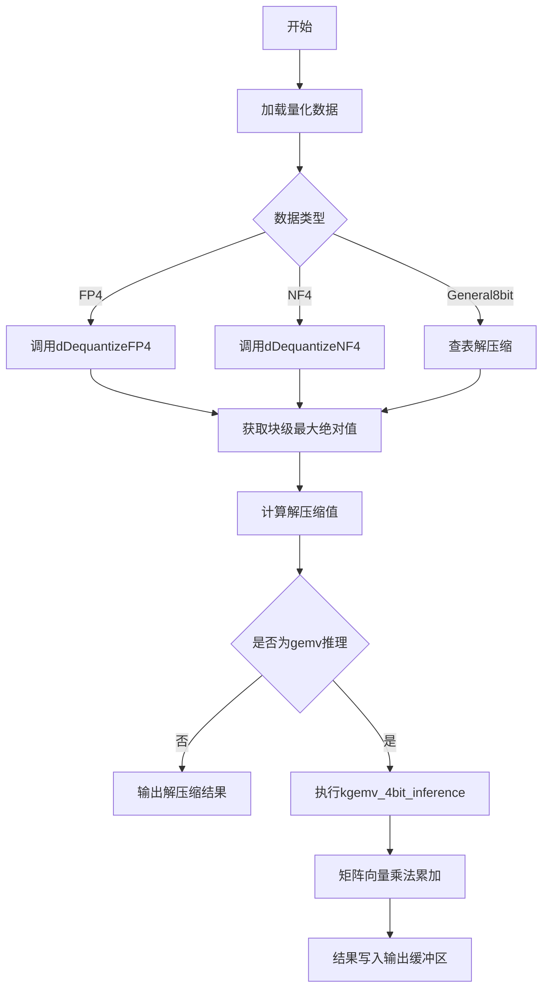
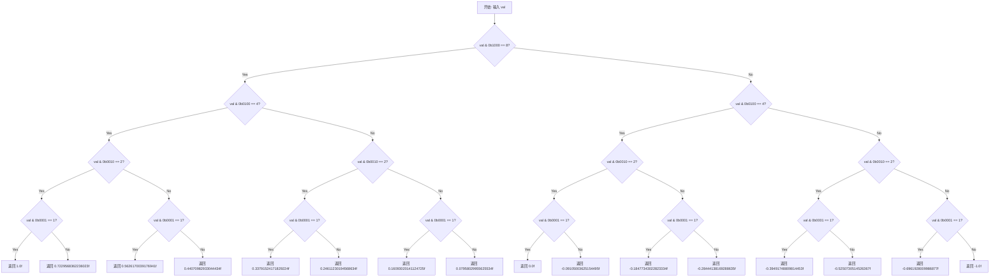
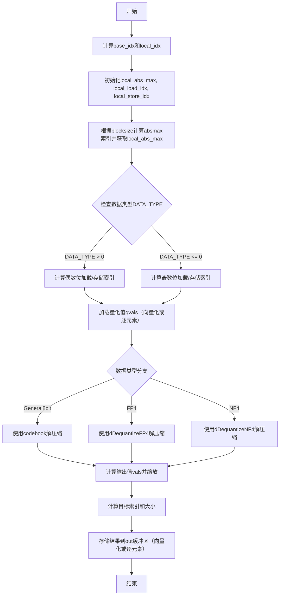
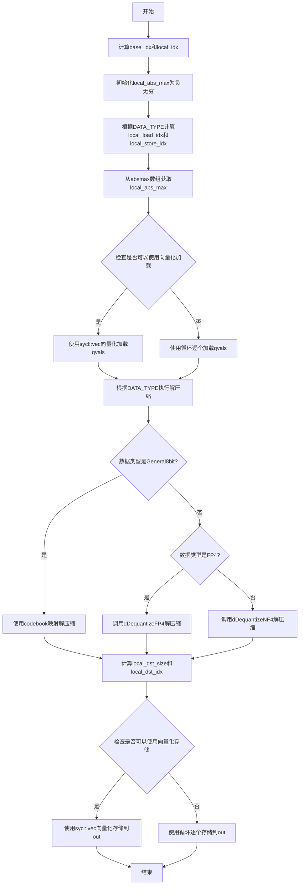

# `bitsandbytes\csrc\xpu_kernels.cpp` 详细设计文档

该代码实现了基于SYCL的4位量化模型推理内核，包含FP4和NF4两种量化格式的解压缩算法，以及块级解压缩和矩阵向量乘法的GPU并行计算功能，支持sycl::half、float和bfloat16数据类型。

## 整体流程



## 类结构

```
全局函数
├── dDequantizeFP4 (FP4量化解压缩)
└── dDequantizeNF4 (NF4量化解压缩)
模板类
├── kDequantizeBlockwise (块级解压缩内核)
└── kgemv_4bit_inference (4位矩阵向量乘法内核)
```

## 全局变量及字段


### `General8bit`
    
8位常规量化类型标识，用于区分普通8bit量化模式

类型：`const int`
    


### `FP4`
    
FP4量化类型标识，用于区分4位浮点量化模式

类型：`const int`
    


### `NF4`
    
NF4量化类型标识，用于区分4位归一化浮点量化模式

类型：`const int`
    


### `dDequantizeFP4`
    
将FP4格式的4位量化值解压缩为浮点数

类型：`inline float(unsigned char)`
    


### `dDequantizeNF4`
    
将NF4格式的4位量化值解压缩为浮点数

类型：`inline float(unsigned char)`
    


### `kDequantizeBlockwise.A`
    
输入量化数据指针，指向待解压缩的量化数据块

类型：`const T*`
    


### `kDequantizeBlockwise.out`
    
输出解压缩数据指针，指向解压缩后的浮点数据存储位置

类型：`T*`
    


### `kDequantizeBlockwise.absmax`
    
块级绝对最大值数组，用于量化缩放

类型：`const float*`
    


### `kDequantizeBlockwise.n`
    
数据总量，指定要处理的数据元素个数

类型：`int64_t`
    


### `kDequantizeBlockwise.blocksize`
    
块大小，量化 block 的大小，必须为2的幂

类型：`int64_t`
    


### `kDequantizeBlockwise.code`
    
8bit量化码表，存储256个量化值的映射表

类型：`const T*`
    


### `kDequantizeBlockwise.TILE_SIZE`
    
瓦片大小，SYCL工作组的处理粒度

类型：`int (template param)`
    


### `kDequantizeBlockwise.NUM_PER_TH`
    
每线程处理数，每个线程处理的元素数量

类型：`int (template param)`
    


### `kDequantizeBlockwise.DATA_TYPE`
    
数据类型标识，指定量化模式(FP4/NF4/General8bit)

类型：`int (template param)`
    


### `kDequantizeBlockwise.operator()`
    
SYCL内核调用运算符，执行块级解压缩操作

类型：`void(sycl::nd_item<1>) const`
    


### `kgemv_4bit_inference.A`
    
输入矩阵A指针，指向待处理的输入矩阵

类型：`const T*`
    


### `kgemv_4bit_inference.B`
    
输入矩阵B指针，指向4位量化权重矩阵

类型：`const T*`
    


### `kgemv_4bit_inference.out`
    
输出向量指针，存储矩阵向量乘法的结果

类型：`T*`
    


### `kgemv_4bit_inference.absmax`
    
绝对最大值数组，用于4位权重的解量化缩放

类型：`const float*`
    


### `kgemv_4bit_inference.quant_map`
    
量化映射表，将4位索引映射到实际浮点值

类型：`T*`
    


### `kgemv_4bit_inference.K`
    
矩阵A列数/B行数，矩阵运算的公共维度

类型：`int64_t`
    


### `kgemv_4bit_inference.N`
    
输出向量维度，结果向量的长度

类型：`int64_t`
    


### `kgemv_4bit_inference.ldb`
    
矩阵B主维度，列主序存储的跨度

类型：`int64_t`
    


### `kgemv_4bit_inference.blocksize`
    
块大小，权重矩阵的分块量化大小

类型：`int64_t`
    


### `kgemv_4bit_inference.datatype`
    
数据类型映射表，定义量化值到浮点的映射

类型：`const uint8_t*`
    


### `kgemv_4bit_inference.GROUP_SIZE`
    
工作组大小，SYCL工作组的总线程数

类型：`size_t (template param)`
    


### `kgemv_4bit_inference.NUM_PER_THREAD`
    
每线程处理数，每个线程处理的数据块数

类型：`size_t (template param)`
    


### `kgemv_4bit_inference.SUBG_SIZE`
    
子组大小，SYCL子组的线程数

类型：`size_t (template param)`
    


### `kgemv_4bit_inference.BITS`
    
位宽，输入矩阵A的位宽(16或32)

类型：`int (template param)`
    


### `kgemv_4bit_inference.operator()`
    
SYCL内核调用运算符，执行4位矩阵向量乘法推理

类型：`void(sycl::nd_item<1>) const`
    
    

## 全局函数及方法


### `dDequantizeFP4`

该函数实现了一个 FP4（4位浮点）格式的解压缩逻辑。它接收一个包含4位量化数据的 `unsigned char` 类型的参数，通过逐位检查该数据的四个位（bit 3 到 bit 0），在一个嵌套的条件判断树中查表并将结果映射为对应的 32 位浮点数（float）。

参数：

-  `val`：`unsigned char`，输入的字节数据。实际上函数仅使用该字节的低4位（nibble）来表示一个 FP4 格式的量化值。

返回值：`float`，返回解压缩后的单精度浮点数值。

#### 流程图

```mermaid
graph TB
    A[开始: 输入 val] --> B{检查 Bit 3 (val & 0b1000) == 8?}
    B -- 是 (负数方向) --> C{检查 Bit 2 (val & 0b0100) == 4?}
    B -- 否 (正数方向) --> D{检查 Bit 2 (val & 0b0100) == 4?}
    
    C -- 是 --> E{检查 Bit 1 (val & 0b0010) == 2?}
    C -- 否 --> F{检查 Bit 1 (val & 0b0010) == 2?}
    
    D -- 是 --> G{检查 Bit 1 (val & 0b0010) == 2?}
    D -- 否 --> H{检查 Bit 1 (val & 0b0010) == 2?}
    
    E -- 是 --> I{检查 Bit 0 (val & 0b0001) == 1?}
    E -- 否 --> J{检查 Bit 0 (val & 0b0001) == 1?}
    
    F -- 是 --> K{检查 Bit 0 (val & 0b0001) == 1?}
    F -- 否 --> L{检查 Bit 0 (val & 0b0001) == 1?}
    
    G -- 是 --> M{检查 Bit 0 (val & 0b0001) == 1?}
    G -- 否 --> N{检查 Bit 0 (val & 0b0001) == 1?}
    
    H -- 是 --> O{检查 Bit 0 (val & 0b0001) == 1?}
    H -- 否 --> P{检查 Bit 0 (val & 0b0001) == 1?}
    
    I -- 是 --> R1[-0.25000000f]
    I -- 否 --> R2[-0.16666667f]
    J -- 是 --> R3[-0.50000000f]
    J -- 否 --> R4[-0.33333333f]
    K -- 是 --> R5[-1.00000000f]
    K -- 否 --> R6[-0.66666667f]
    L -- 是 --> R7[-5.208333333e-03f]
    L -- 否 --> R8[0.00000000f]
    
    M -- 是 --> R9[0.25000000f]
    M -- 否 --> R10[0.16666667f]
    N -- 是 --> R11[0.50000000f]
    N -- 否 --> R12[0.33333333f]
    O -- 是 --> R13[1.00000000f]
    O -- 否 --> R14[0.66666667f]
    P -- 是 --> R15[5.208333333e-03f]
    P -- 否 --> R16[0.00000000f]
```

#### 带注释源码

```cpp
inline float dDequantizeFP4(unsigned char val) {
    // 检查最高位 (Bit 3)，判断符号位。
    // 如果为 1 (即 val >= 8)，则表示该值为负数；否则为正数。
    if ((val & 0b1000) == 8)
        // === 负数分支 ===
        // 检查 Bit 2，判断量级组 (Magnitude Group)
        if ((val & 0b0100) == 4)
            // 负大量级组 (0b11xx)
            if ((val & 0b0010) == 2)
                // 子组 (0b110x)
                if ((val & 0b0001) == 1)
                    return -0.25000000f; // 1111
                else
                    return -0.16666667f; // 1110
            else if ((val & 0b0001) == 1)
                return -0.50000000f;     // 1101
            else
                return -0.33333333f;     // 1100
        else if ((val & 0b0010) == 2)
            // 负中量级组 (0b10xx)
            if ((val & 0b0001) == 1)
                return -1.00000000f;    // 1011
            else
                return -0.66666667f;     // 1010
        else if ((val & 0b0001) == 1)
            // 负小量级组 (0b100x)
            return -5.208333333e-03f;    // 1001
        else
            return 0.00000000f;          // 1000 (零)
    
    // === 正数分支 ===
    else if ((val & 0b0100) == 4)
        // 正大量级组 (0b01xx)
        if ((val & 0b0010) == 2)
            if ((val & 0b0001) == 1)
                return 0.25000000f;      // 0111
            else
                return 0.16666667f;      // 0110
        else if ((val & 0b0001) == 1)
            return 0.50000000f;          // 0101
        else
            return 0.33333333f;          // 0100
    else if ((val & 0b0010) == 2)
        // 正中量级组 (0b00xx)
        if ((val & 0b0001) == 1)
            return 1.00000000f;         // 0011
        else
            return 0.66666667f;          // 0010
    else if ((val & 0b0001) == 1)
        // 正小量级组 (0b000x)
        return 5.208333333e-03f;        // 0001
    else
        return 0.00000000f;              // 0000 (零)
}
```


### `dDequantizeNF4`

该函数是NF4（Normal Float 4-bit）格式的单字节解压缩核心实现，通过位运算解析4位量化值并根据预设的查找树返回对应的浮点数数值，实现了从NF4格式到FP32的映射转换。

参数：

- `val`：`unsigned char`，输入的8位字节，包含两个NF4格式的4位量化值（低4位或高4位）

返回值：`float`，返回NF4格式对应的32位浮点数值

#### 流程图



#### 带注释源码

```cpp
// NF4 (Normal Float 4-bit) 解压缩函数
// 将4位量化值映射回对应的浮点数数值
// 参数 val: 8位无符号字符，包含一个4位NF4量化值
// 返回值: 对应的32位浮点数
inline float dDequantizeNF4(unsigned char val) {

    // the values for this tree was generated by test_normal_map_tree
    // in the file tests/test_functional.py
    
    // 从高位到低位依次检查每一位的值，构建决策树
    // 0000 -> -1.0f: 完全负向最大值
    // 0001 -> -0.6961928009986877f
    // 0010 -> -0.5250730514526367f
    // 0011 -> -0.39491748809814453f
    // 0100 -> -0.28444138169288635f
    // 0101 -> -0.18477343022823334f
    // 0110 -> -0.09105003625154495f
    // 0111 -> 0.0f
    // 1000 -> 0.07958029955625534f
    // 1001 -> 0.16093020141124725f
    // 1010 -> 0.24611230194568634f
    // 1011 -> 0.33791524171829224f
    // 1100 -> 0.44070982933044434f
    // 1101 -> 0.5626170039176941f
    // 1110 -> 0.7229568362236023f
    // 1111 -> 1.0f

    if ((val & 0b1000) == 8)         // 检查第3位 (最高位)
        if ((val & 0b0100) == 4)     // 检查第2位 -> 1x
            if ((val & 0b0010) == 2) // 检查第1位 -> 11
                if ((val & 0b0001) == 1) // 检查第0位 -> 111
                    return 1.0f;         //*1111: 正向最大值
                else
                    return 0.7229568362236023f; //*1110
            else if ((val & 0b0001) == 1)       // 110
                return 0.5626170039176941f;     //*1101
            else
                return 0.44070982933044434f; //*1100
        else if ((val & 0b0010) == 2)        // 10
            if ((val & 0b0001) == 1)         // 101
                return 0.33791524171829224f; //*1011
            else
                return 0.24611230194568634f; //*1010
        else if ((val & 0b0001) == 1)        // 100
            return 0.16093020141124725f;     //*1001
        else
            return 0.07958029955625534f; //*1000

    else if ((val & 0b0100) == 4)    // 第3位为0，第2位为1 -> 01xx
        if ((val & 0b0010) == 2)     // 01
            if ((val & 0b0001) == 1) // 011
                return 0.0f;         //*0111: 零值
            else
                return -0.09105003625154495f; //*0110
        else if ((val & 0b0001) == 1)         // 010
            return -0.18477343022823334f;     //*0101
        else
            return -0.28444138169288635f; //*0100
    else if ((val & 0b0010) == 2)         // 第3、2位为00 -> 00xx
        if ((val & 0b0001) == 1)          // 001
            return -0.39491748809814453f; //*0011
        else
            return -0.5250730514526367f; //*0010
    else if ((val & 0b0001) == 1)        // 000x
        return -0.6961928009986877f;     //*0001
    else
        return -1.0f; //*0000: 负向最大值
}
```


### `kDequantizeBlockwise::operator()`

该函数是SYCL块级解压缩内核的操作符重载，用于将量化数据（如8位、FP4或NF4格式）解压缩为浮点数据。它根据数据类型使用不同的解压缩方法，并结合绝对最大值进行缩放，以实现高效的块级数据转换。

参数：
- `item`：`sycl::nd_item<1>`，SYCL ND网格项，用于获取线程组ID、局部ID等索引信息，以支持并行处理。

返回值：`void`，无返回值（内核函数通过输出缓冲区返回结果）。

#### 流程图



#### 带注释源码

```cpp
template <typename T, int TILE_SIZE, int NUM_PER_TH, int DATA_TYPE>
SYCL_EXTERNAL void kDequantizeBlockwise<T, TILE_SIZE, NUM_PER_TH, DATA_TYPE>::operator()(sycl::nd_item<1> item) const {
    // 计算全局基础索引：基于线程组ID和块大小
    const int64_t base_idx = static_cast<int64_t>(item.get_group(0)) * TILE_SIZE;
    // 计算局部索引：基于线程局部ID和每线程处理数量
    int64_t local_idx = static_cast<int64_t>(item.get_local_id(0)) * NUM_PER_TH;
    // 初始化局部绝对最大值为负无穷
    float local_abs_max = -FLT_MAX;
    // 初始化加载和存储索引
    int64_t local_load_idx = 0;
    int64_t local_store_idx = 0;

    // 本地缓冲区存储量化值和浮点值
    uint8_t qvals[NUM_PER_TH];
    T vals[NUM_PER_TH * ((DATA_TYPE > 0) ? 2 : 1)];

    // 根据数据类型计算加载和存储的索引范围
    if (DATA_TYPE > 0) {
        // 对于FP4/NF4，每两个字节存储一个值
        local_load_idx = sycl::min(static_cast<int64_t>(TILE_SIZE), (static_cast<int64_t>(n) + 1) / 2 - base_idx);
        local_store_idx = sycl::min(static_cast<int64_t>(TILE_SIZE * 2), static_cast<int64_t>(n) - base_idx * 2);
    } else {
        // 对于General8bit，每个字节一个值
        local_load_idx = sycl::min(static_cast<int64_t>(TILE_SIZE), static_cast<int64_t>(n) - base_idx);
        local_store_idx = local_load_idx;
    }

    // 通过位运算避免除法：计算absmax索引（blocksize为2的幂）
    local_abs_max = absmax[(base_idx + local_idx) >> (31 - std::countl_zero<unsigned int>(blocksize))];

    // 加载量化值：尝试向量化加载，否则逐元素处理边界
    if (local_idx + NUM_PER_TH < local_load_idx) {
        reinterpret_cast<sycl::vec<uint8_t, NUM_PER_TH>(&)[NUM_PER_TH]>(qvals)[0] =
            reinterpret_cast<sycl::vec<uint8_t, NUM_PER_TH>*>(A)[(base_idx + local_idx) / NUM_PER_TH];
    } else {
#pragma unroll NUM_PER_TH
        for (int i = 0; i < NUM_PER_TH; i++) {
            if (local_idx + i < local_load_idx) {
                qvals[i] = A[base_idx + local_idx + i];
            } else {
                qvals[i] = (uint8_t)0; // 边界填充零
            }
        }
    }

    // 根据数据类型解压缩量化值
    switch (DATA_TYPE) {
    case General8bit:
#pragma unroll NUM_PER_TH
        for (int j = 0; j < NUM_PER_TH; j++)
            vals[j] = code[qvals[j]] * local_abs_max;
        break;
    case FP4:
#pragma unroll NUM_PER_TH
        for (int j = 0; j < NUM_PER_TH; j++) {
            vals[j * 2] = dDequantizeFP4(qvals[j] >> 4) * local_abs_max;
            vals[j * 2 + 1] = dDequantizeFP4(qvals[j] & 0x0F) * local_abs_max;
        }
        break;
    case NF4:
#pragma unroll NUM_PER_TH
        for (int j = 0; j < NUM_PER_TH; j++) {
            vals[j * 2] = dDequantizeNF4(qvals[j] >> 4) * local_abs_max;
            vals[j * 2 + 1] = dDequantizeNF4(qvals[j] & 0x0F) * local_abs_max;
        }
        break;
    }

    // 计算目标缓冲区的索引和大小
    const int local_dst_size = (DATA_TYPE > 0) ? NUM_PER_TH * 2 : NUM_PER_TH;
    int local_dst_idx = (DATA_TYPE > 0) ? local_idx * 2 : local_idx;

    // 存储结果：尝试向量化存储，否则逐元素处理边界
    if (local_dst_idx + local_dst_size < local_store_idx) {
        reinterpret_cast<sycl::vec<T, local_dst_size>*>(
            out
        )[(((DATA_TYPE > 0) ? base_idx * 2 : base_idx) + local_dst_idx) / local_dst_size] =
            reinterpret_cast<sycl::vec<T, local_dst_size>(&)[local_dst_size]>(vals)[0];
    } else {
#pragma unroll NUM_PER_TH
        for (int i = 0; i < local_dst_size; i++) {
            if (local_dst_idx + i < local_store_idx) {
                out[((DATA_TYPE > 0) ? base_idx * 2 : base_idx) + local_dst_idx + i] = vals[i];
            }
        }
    }
}
```


### `kgemv_4bit_inference::operator()`

这是一个SYCL内核函数，用于执行4位量化矩阵与向量的乘法运算（GEMV），是量化推理的核心计算单元。该内核支持FP4和NF4等4位量化格式，通过查找表进行反量化，并利用子组（sub-group）进行归约以提高计算效率。

参数：

- `item`：`sycl::nd_item<1>`，SYCL工作项标识符，提供获取本地ID、子组信息、组ID等接口

返回值：`void`，该函数为SYCL内核，直接通过全局内存out数组返回计算结果

#### 流程图

```mermaid
flowchart TD
    A[开始: 获取work item信息] --> B[计算本地ID和子组信息]
    B --> C[初始化局部变量]
    C --> D{idx < 16?}
    D -->|Yes| E[加载quant_map查找表]
    D -->|No| F[跳过加载]
    E --> G[同步屏障 barrier]
    F --> G
    G --> H[外层循环: 遍历inner_idx从sg_lane*num_values_4bit到K]
    H --> I[计算absmax索引并加载absmax]
    I --> J{row_B < N?}
    J -->|Yes| K{内层半索引+num_values_8bit < K/2?}
    J -->|No| L[填充local_B_4bit为0b01110111]
    K -->|Yes| M[向量化加载B的4bit数据]
    K -->|No| N[标量加载B的4bit数据并边界检查]
    M --> O
    N --> O
    L --> O
    O[内层循环: i从0到4]
    O --> P[反量化B数据到local_B]
    P --> Q{inner_idx条件检查}
    Q -->|BITS==16| R[向量化加载A矩阵]
    Q -->|BITS!=16| S[双倍向量化加载A矩阵]
    Q -->|条件不满足| T[标量加载A并边界检查]
    R --> U
    S --> U
    T --> U
    U[累加: local_C += local_A * local_B]
    U --> V[i++]
    V --> O
    V --> W[子组归约: sycl::reduce_over_group]
    W --> X{row_B < N 且 sg_lane == 0?}
    X -->|Yes| Y[写入out[row_B] = local_C]
    X -->|No| Z[结束]
    Y --> Z
```

#### 带注释源码

```cpp
// 4位推理GEMV内核操作符
// 执行 quantized(A) @ B 的矩阵向量乘法，其中B是4位量化矩阵
template <typename T, size_t GROUP_SIZE, size_t NUM_PER_THREAD, size_t SUBG_SIZE, int BITS>
SYCL_EXTERNAL void
    kgemv_4bit_inference<T, GROUP_SIZE, NUM_PER_THREAD, SUBG_SIZE, BITS>::operator()(sycl::nd_item<1> item) const {
    
    // 获取当前work item的本地ID
    size_t idx = item.get_local_id();
    
    // 计算子组索引和子组内lane号
    // SUBG_SIZE通常是32，对应Intel GPU的subgroup大小
    const int sg_idx = idx / SUBG_SIZE;
    const int sg_lane = idx % SUBG_SIZE;
    
    // 4位值的数量等于子组大小
    const int num_values_4bit = SUBG_SIZE;
    
    // 计算B矩阵的行索引：NUM_PER_THREAD * group_id + sg_idx
    // 每个group处理NUM_PER_THREAD行，sg_idx用于跨子组分割工作
    const int row_B = NUM_PER_THREAD * item.get_group().get_group_id() + sg_idx;
    
    // B矩阵的偏移量：lda * row_B（列主序）
    const int offset_B = ldb * row_B;
    
    // 8位值的数量是4位的一半（因为2个4bit打包成1个8bit）
    const int num_values_8bit = num_values_4bit / 2;
    
    // 局部累加器，使用float提高精度
    float local_C = 0.0f;

    // 局部缓冲区
    // local_B_4bit: 存储从全局内存读取的打包4bit值（每字节2个4bit）
    unsigned char local_B_4bit[num_values_8bit];
    
    // local_B: 反量化后的B矩阵值（每4个4bit值生成1个反量化值）
    T local_B[num_values_4bit / 4];
    
    // local_A: A矩阵的值（从全局内存加载）
    T local_A[num_values_4bit / 4];
    
    // local_absmax: 当前block的绝对最大值，用于反量化
    T local_absmax = T(0.0f);

    // 初始化quant_map查找表
    // 仅前16个线程需要初始化（quant_map大小为16）
    if (idx < 16) {
        // 将8bit量化索引映射到反量化值
        quant_map[idx] = T(datatype[idx]);
    }

    // 同步确保quant_map初始化完成
    item.barrier(sycl::access::fence_space::local_space);

    // 主计算循环：遍历K维度（矩阵A的列/B矩阵的行）
    // 每个子组的不同lane处理不同偏移的数据，实现并行
    for (int inner_idx = sg_lane * num_values_4bit; inner_idx < K; inner_idx += SUBG_SIZE * num_values_4bit) {
        // inner_idx_halved用于处理2个4bit打包成1byte的情况
        const int inner_idx_halved = inner_idx / 2;

        // 计算absmax数组索引
        // 使用位移代替除法（blocksize是2的幂）
        // absmax存储每个量化block的绝对最大值
        const int absidx = ((2 * offset_B) + inner_idx) >> (31 - std::countl_zero((unsigned int)blocksize));
        local_absmax = absmax[absidx];

        // 检查是否越界（row_B可能大于N）
        if (row_B < N) {
            // 尝试向量化加载（更高效）
            // 检查是否有足够的8bit值可以完整加载
            if ((inner_idx_halved + num_values_8bit) < (K / 2)) {
                // 使用sycl::vec进行向量化加载
                reinterpret_cast<sycl::vec<int, 4>(&)[num_values_8bit]>(local_B_4bit)[0] =
                    reinterpret_cast<sycl::vec<int, 4>*>(B)[(offset_B + (inner_idx_halved)) / (num_values_8bit)];
            } else {
                // 边界情况：标量加载并填充0
#pragma unroll
                for (int j = 0; j < (num_values_8bit); j++)
                    if ((inner_idx_halved) + j < (K / 2))
                        local_B_4bit[j] = B[offset_B + inner_idx_halved + j];
                    else
                        // 填充默认值0b01110111（FP4/NF4的零表示）
                        local_B_4bit[j] = 0b01110111;
            }
        } else {
            // row_B >= N，行越界，填充零
#pragma unroll
            for (int j = 0; j < (num_values_8bit); j++)
                local_B_4bit[j] = 0b01110111;
        }

        // 处理4个4位值块（每个块包含num_values_4bit/4个元素）
        for (int i = 0; i < 4; i++) {
#pragma unroll
            // 反量化B矩阵数据
            // 将每个byte解包为2个4bit值，通过quant_map查找并乘以absmax
            for (int k = 0; k < num_values_8bit / 4; k++) {
                // 高4位和低4位分别处理
                local_B[k * 2] = quant_map[local_B_4bit[(i * num_values_8bit / 4) + k] >> 4] * local_absmax;
                local_B[k * 2 + 1] = quant_map[local_B_4bit[(i * num_values_8bit / 4) + k] & 0x0F] * local_absmax;
            }

            // 加载A矩阵数据
            // 检查是否在K维度范围内
            if (inner_idx + (num_values_4bit / 4) + (i * num_values_4bit / 4) < K) {
                if (BITS == 16) {
                    // 16位格式：直接加载
                    reinterpret_cast<sycl::vec<int, 4>(&)[num_values_4bit / 4]>(local_A)[0] =
                        reinterpret_cast<sycl::vec<int, 4>*>(A)[inner_idx / (num_values_4bit / 4) + i];
                } else {
                    // 8位格式：需要加载2倍数据
                    reinterpret_cast<sycl::vec<int, 4>(&)[num_values_4bit / 4]>(local_A)[0] =
                        reinterpret_cast<sycl::vec<int, 4>*>(A)[inner_idx / (num_values_4bit / 8) + (2 * i) + 0];
                    reinterpret_cast<sycl::vec<int, 4>(&)[num_values_4bit / 4]>(local_A)[1] =
                        reinterpret_cast<sycl::vec<int, 4>*>(A)[inner_idx / (num_values_4bit / 8) + (2 * i) + 1];
                }

            } else {
                // 边界情况：标量加载并填充0
#pragma unroll
                for (int k = 0; k < num_values_4bit / 4; k++)
                    if (inner_idx + (i * num_values_4bit / 4) + k < K)
                        local_A[k] = A[inner_idx + k + (i * num_values_4bit / 4)];
                    else
                        local_A[k] = T(0.0f);
            }

            // 矩阵乘法累加
            // 使用float累加以提高精度
#pragma unroll
            for (int k = 0; k < num_values_4bit / 4; k++) {
                local_C += (float)(local_A[k] * local_B[k]);
            }
        }
    }

    // 子组级归约
    // 将同一子组内所有lane的local_C相加
    local_C = sycl::reduce_over_group(item.get_sub_group(), local_C, sycl::plus<>());

    // 仅第一个lane写入结果（避免竞争）
    if (row_B < N && sg_lane == 0)
        out[row_B] = T(local_C);
}
```


### `kDequantizeBlockwise<T, TILE_SIZE, NUM_PER_TH, DATA_TYPE>::operator()`

这是SYCL内核的调用运算符，执行块级解压缩操作，将量化后的数据（如8bit、FP4、NF4格式）解压缩为原始浮点数值。

参数：

- `item`：`sycl::nd_item<1>`，SYCL工作项标识符，用于获取全局和局部索引

返回值：`void`，无返回值

#### 流程图



#### 带注释源码

```cpp
template <typename T, int TILE_SIZE, int NUM_PER_TH, int DATA_TYPE>
SYCL_EXTERNAL void kDequantizeBlockwise<T, TILE_SIZE, NUM_PER_TH, DATA_TYPE>::operator()(sycl::nd_item<1> item) const {
    // 根据工作组ID和瓦片大小计算基础索引
    const int64_t base_idx = static_cast<int64_t>(item.get_group(0)) * TILE_SIZE;
    // 计算局部索引：本地线程ID * 每个线程处理的数量
    int64_t local_idx = static_cast<int64_t>(item.get_local_id(0)) * NUM_PER_TH;
    // 初始化局部绝对最大值为负无穷
    float local_abs_max = -FLT_MAX;
    // 声明局部加载和存储索引
    int64_t local_load_idx = 0;
    int64_t local_store_idx = 0;

    // 声明量化值数组和浮点值数组
    uint8_t qvals[NUM_PER_TH];
    T vals[NUM_PER_TH * ((DATA_TYPE > 0) ? 2 : 1)];

    // 根据数据类型计算加载和存储索引
    if (DATA_TYPE > 0) {
        // 对于FP4/NF4（2个4bit打包成1个byte），计算加载和存储索引
        local_load_idx = sycl::min(static_cast<int64_t>(TILE_SIZE), (static_cast<int64_t>(n) + 1) / 2 - base_idx);
        local_store_idx = sycl::min(static_cast<int64_t>(TILE_SIZE * 2), static_cast<int64_t>(n) - base_idx * 2);
    } else {
        // 对于General8bit，直接计算加载和存储索引
        local_load_idx = sycl::min(static_cast<int64_t>(TILE_SIZE), static_cast<int64_t>(n) - base_idx);
        local_store_idx = local_load_idx;
    }

    // 通过位运算避免除法（blocksize总是2的幂）
    local_abs_max = absmax[(base_idx + local_idx) >> (31 - std::countl_zero<unsigned int>(blocksize))];

    // 尝试使用向量化加载 quantized values
    if (local_idx + NUM_PER_TH < local_load_idx) {
        // 安全的向量化加载：重新解释为uint8_t向量类型
        reinterpret_cast<sycl::vec<uint8_t, NUM_PER_TH>(&)[NUM_PER_TH]>(qvals)[0] =
            reinterpret_cast<sycl::vec<uint8_t, NUM_PER_TH>*>(A)[(base_idx + local_idx) / NUM_PER_TH];
    } else {
        // 边界检查：逐个加载，避免越界
#pragma unroll NUM_PER_TH
        for (int i = 0; i < NUM_PER_TH; i++) {
            if (local_idx + i < local_load_idx) {
                qvals[i] = A[base_idx + local_idx + i];
            } else {
                qvals[i] = (uint8_t)0;  // 填充0
            }
        }
    }

    // 根据数据类型执行解压缩
    switch (DATA_TYPE) {
    case General8bit:
        // 8bit量化：使用codebook映射表解压缩
#pragma unroll NUM_PER_TH
        for (int j = 0; j < NUM_PER_TH; j++)
            vals[j] = code[qvals[j]] * local_abs_max;
        break;
    case FP4:
        // FP4格式：每个byte包含2个4bit值，分别解压缩
#pragma unroll NUM_PER_TH
        for (int j = 0; j < NUM_PER_TH; j++) {
            vals[j * 2] = dDequantizeFP4(qvals[j] >> 4) * local_abs_max;
            vals[j * 2 + 1] = dDequantizeFP4(qvals[j] & 0x0F) * local_abs_max;
        }
        break;
    case NF4:
        // NF4格式：每个byte包含2个4bit值，分别解压缩
#pragma unroll NUM_PER_TH
        for (int j = 0; j < NUM_PER_TH; j++) {
            vals[j * 2] = dDequantizeNF4(qvals[j] >> 4) * local_abs_max;
            vals[j * 2 + 1] = dDequantizeNF4(qvals[j] & 0x0F) * local_abs_max;
        }
        break;
    }

    // 计算目标索引和大小
    const int local_dst_size = (DATA_TYPE > 0) ? NUM_PER_TH * 2 : NUM_PER_TH;
    int local_dst_idx = (DATA_TYPE > 0) ? local_idx * 2 : local_idx;

    // 尝试使用向量化存储结果
    if (local_dst_idx + local_dst_size < local_store_idx) {
        // 安全的向量化存储
        reinterpret_cast<sycl::vec<T, local_dst_size>*>(
            out
        )[(((DATA_TYPE > 0) ? base_idx * 2 : base_idx) + local_dst_idx) / local_dst_size] =
            reinterpret_cast<sycl::vec<T, local_dst_size>(&)[local_dst_size]>(vals)[0];
    } else {
        // 边界检查：逐个存储，避免越界
#pragma unroll NUM_PER_TH
        for (int i = 0; i < local_dst_size; i++) {
            if (local_dst_idx + i < local_store_idx) {
                out[((DATA_TYPE > 0) ? base_idx * 2 : base_idx) + local_dst_idx + i] = vals[i];
            }
        }
    }
}
```


### `kgemv_4bit_inference.operator()`

该函数是 SYCL 内核调用运算符（functor），用于在 GPU 上执行高效的 4 位矩阵向量乘法（4-bit GEMV）推理操作。它通过子组（subgroup）级别的并行处理，结合量化映射和反量化技术，实现对权重矩阵 B 的 4 位量化数据的解压缩和与输入向量 A 的乘累加运算，最终输出结果到向量 C。

参数：

- `item`：`sycl::nd_item<1>`，SYCL ND-Range 索引对象，提供工作项的全局和局部索引信息，用于访问数据和控制并行执行。

返回值：`void`，该函数为 SYCL 内核，通过引用修改全局内存中的输出缓冲区 `out`，不直接返回值。

#### 流程图

```mermaid
flowchart TD
    A[开始: 获取工作项索引] --> B[计算子组索引和车道号]
    B --> C[初始化局部变量和数组]
    C --> D{idx < 16?}
    D -->|Yes| E[加载量化映射表 quant_map]
    D -->|No| F[跳过加载]
    E --> G[子组屏障同步]
    F --> G
    G --> H[外层循环: 遍历 K 维度]
    H --> I[计算绝对最大值的索引]
    I --> J{row_B < N?}
    J -->|Yes| K[加载 4 位量化数据到 local_B_4bit]
    J -->|No| L[将 local_B_4bit 填充为 0b01110111]
    K --> M[内层循环: 4 次迭代]
    L --> M
    M --> N{内层索引 < K?}
    N -->|Yes| O[解压缩 local_B 和 local_A]
    N -->|No| P[填充 0 值]
    O --> Q[乘累加计算: local_C += local_A * local_B]
    P --> Q
    Q --> R{循环结束?}
    R -->|No| H
    R -->|Yes| S[子组归约: 累加 local_C]
    S --> T{row_B < N 且 sg_lane == 0?}
    T -->|Yes| U[写入结果到 out[row_B]]
    T -->|No| V[结束]
    U --> V
```

#### 带注释源码

```cpp
// SYCL 内核 functor：执行 4 位矩阵向量乘法推理
// 模板参数：
//   T: 数据类型 (sycl::half, bfloat16, float)
//   GROUP_SIZE: 组大小
//   NUM_PER_THREAD: 每个线程处理的数据量
//   SUBG_SIZE: 子组大小
//   BITS: 位宽 (16 或 32)
template <typename T, size_t GROUP_SIZE, size_t NUM_PER_THREAD, size_t SUBG_SIZE, int BITS>
SYCL_EXTERNAL void
    kgemv_4bit_inference<T, GROUP_SIZE, NUM_PER_THREAD, SUBG_SIZE, BITS>::operator()(sycl::nd_item<1> item) const {
    
    // 获取当前工作项的本地 ID
    size_t idx = item.get_local_id();
    
    // 计算子组索引和子组内车道号
    const int sg_idx = idx / SUBG_SIZE;
    const int sg_lane = idx % SUBG_SIZE;
    
    // 4 位值的数量等于子组大小
    const int num_values_4bit = SUBG_SIZE;
    
    // 计算矩阵 B 的行索引：NUM_PER_THREAD * 组ID + 子组索引
    const int row_B = NUM_PER_THREAD * item.get_group().get_group_id() + sg_idx;
    
    // 计算矩阵 B 的偏移量
    const int offset_B = ldb * row_B;
    
    // 8 位值的数量是 4 位值的一半（因为每 2 个 4 位值打包成 1 个 8 位值）
    const int num_values_8bit = num_values_4bit / 2;
    
    // 局部累加器，初始化为 0.0f
    float local_C = 0.0f;

    // 本地数组：存储打包的 4 位值（每字节存储 2 个 4 位值）
    unsigned char local_B_4bit[num_values_8bit];
    
    // 本地数组：存储解压缩后的 B 矩阵值
    T local_B[num_values_4bit / 4];
    
    // 本地数组：存储 A 矩阵值
    T local_A[num_values_4bit / 4];
    
    // 局部绝对最大值，用于反量化
    T local_absmax = T(0.0f);

    // 仅子组的前 16 个车道加载量化映射表
    if (idx < 16) {
        // 将量化表索引映射到实际浮点值
        quant_map[idx] = T(datatype[idx]);
    }

    // 子组级别同步，确保所有车道都完成量化映射加载
    item.barrier(sycl::access::fence_space::local_space);

    // 外层循环：遍历 K 维度，每次跨越 num_values_4bit * SUBG_SIZE
    for (int inner_idx = sg_lane * num_values_4bit; inner_idx < K; inner_idx += SUBG_SIZE * num_values_4bit) {
        
        // 计算半字节索引（因为 2 个 4 位值打包成一个字节）
        const int inner_idx_halved = inner_idx / 2;

        // 避免昂贵的除法操作（因为 blocksize 总是 2 的幂）
        // 使用位移代替除法：absidx = (2 * offset_B + inner_idx) / blocksize
        const int absidx = ((2 * offset_B) + inner_idx) >> (31 - std::countl_zero((unsigned int)blocksize));
        
        // 获取当前块的绝对最大值（用于反量化）
        local_absmax = absmax[absidx];

        // 检查行索引是否在有效范围内
        if (row_B < N) {
            // 检查是否有足够的 4 位值需要加载
            if ((inner_idx_halved + num_values_8bit) < (K / 2)) {
                // 向量化加载：一次性加载多个字节
                reinterpret_cast<sycl::vec<int, 4>(&)[num_values_8bit]>(local_B_4bit)[0] =
                    reinterpret_cast<sycl::vec<int, 4>*>(B)[(offset_B + (inner_idx_halved)) / (num_values_8bit)];
            } else {
                // 边界处理：逐字节加载，不足部分填充 0b01110111（FP4/NF4 的零值表示）
#pragma unroll
                for (int j = 0; j < (num_values_8bit); j++)
                    if ((inner_idx_halved) + j < (K / 2))
                        local_B_4bit[j] = B[offset_B + inner_idx_halved + j];
                    else
                        local_B_4bit[j] = 0b01110111;
            }
        } else {
            // 行超出范围，填充为零
#pragma unroll
            for (int j = 0; j < (num_values_8bit); j++)
                local_B_4bit[j] = 0b01110111;
        }

        // 内层循环：处理 4 个 4 位值块
        for (int i = 0; i < 4; i++) {
#pragma unroll
            // 解压缩 B 矩阵的 4 位值
            for (int k = 0; k < num_values_8bit / 4; k++) {
                // 提取高 4 位和低 4 位，分别通过量化表映射并乘以 absmax
                local_B[k * 2] = quant_map[local_B_4bit[(i * num_values_8bit / 4) + k] >> 4] * local_absmax;
                local_B[k * 2 + 1] = quant_map[local_B_4bit[(i * num_values_8bit / 4) + k] & 0x0F] * local_absmax;
            }

            // 检查 A 矩阵索引是否在有效范围内
            if (inner_idx + (num_values_4bit / 4) + (i * num_values_4bit / 4) < K) {
                // 根据 BITS 选择不同的向量化加载策略
                if (BITS == 16) {
                    // 16 位模式：直接加载
                    reinterpret_cast<sycl::vec<int, 4>(&)[num_values_4bit / 4]>(local_A)[0] =
                        reinterpret_cast<sycl::vec<int, 4>*>(A)[inner_idx / (num_values_4bit / 4) + i];
                } else {
                    // 32 位模式：分两次加载（因为数据宽度更大）
                    reinterpret_cast<sycl::vec<int, 4>(&)[num_values_4bit / 4]>(local_A)[0] =
                        reinterpret_cast<sycl::vec<int, 4>*>(A)[inner_idx / (num_values_4bit / 8) + (2 * i) + 0];
                    reinterpret_cast<sycl::vec<int, 4>(&)[num_values_4bit / 4]>(local_A)[1] =
                        reinterpret_cast<sycl::vec<int, 4>*>(A)[inner_idx / (num_values_4bit / 8) + (2 * i) + 1];
                }

            } else {
                // 边界处理：填充零值
#pragma unroll
                for (int k = 0; k < num_values_4bit / 4; k++)
                    if (inner_idx + (i * num_values_4bit / 4) + k < K)
                        local_A[k] = A[inner_idx + k + (i * num_values_4bit / 4)];
                    else
                        local_A[k] = T(0.0f);
            }

            // 乘累加计算：使用 float 累加以提高精度
#pragma unroll
            for (int k = 0; k < num_values_4bit / 4; k++) {
                local_C += (float)(local_A[k] * local_B[k]);
            }
        }
    }

    // 子组级别归约：对所有车道的 local_C 进行求和
    local_C = sycl::reduce_over_group(item.get_sub_group(), local_C, sycl::plus<>());

    // 仅第一个车道写入结果
    if (row_B < N && sg_lane == 0)
        out[row_B] = T(local_C);
}
```

## 关键组件


### FP4反量化函数

负责将4位浮点数(FP4)格式的数据反量化为标准浮点数，根据输入值的4个比特位组合查表返回对应的浮点数值，支持负值和接近零的微小值。

### NF4反量化函数

负责将归一化4位数(NF4)格式的数据反量化为标准浮点数，使用基于决策树的查表方式实现，提供更均匀的量化分布以适配神经网络权重。

### 分块反量化内核

SYCL内核 functor，实现块级别的4-bit数据反量化，支持FP4、NF4和General8bit三种量化格式，根据blocksize计算绝对最大值进行缩放，支持sycl::half、float和bfloat16三种输出类型。

### 4位推理内核

SYCL内核 functor，实现4-bit矩阵向量乘法(GEMV)推理，在寄存器中完成反量化操作避免额外内存访问，针对量化权重进行局部累加以提高精度，支持sub-group级别的并行规约。


## 问题及建议


### 已知问题

- **深层嵌套的if-else结构**：`dDequantizeFP4`和`dDequantizeNF4`函数使用多达4层的嵌套if-else语句（共16种情况），代码可读性差、维护困难，且可能导致较差的分支预测性能
- **类型双关使用reinterpret_cast**：代码中大量使用`reinterpret_cast`进行类型双关（如`reinterpret_cast<sycl::vec<int, 4>*>`），存在严格别名规则违反的风险，可能导致未定义行为
- **魔法数字散落各处**：代码中存在多个未命名的常量（如`0b01110117`、`512`、`128`、`32`等），缺乏文档说明，可读性和可维护性差
- **边界条件处理不一致**：在`kDequantizeBlockwise`中，向量化加载/存储与标量fallback的处理逻辑存在差异，可能导致边界情况下的行为不一致
- **缺少参数校验**：内核函数未对输入参数（`n`、`blocksize`、`A`、`B`、`out`等）进行有效性检查，可能在异常输入下产生未定义行为
- **SYCL兼容性风险**：代码使用了一些特定于供应商的扩展（如`sycl::ext::oneapi::bfloat16`），可能影响跨平台移植性

### 优化建议

- **使用查找表替换条件分支**：将`dDequantizeFP4`和`dDequantizeNF4`中的嵌套if-else替换为`static const float`数组查找表，可显著提升性能并改善代码可读性
- **提取魔法数字为具名常量**：定义如`constexpr uint8_t NF4_PAD = 0b01110111;`、`constexpr int TILE_SIZE = 512;`等具名常量，并添加注释说明其含义
- **使用std::bit_cast进行类型安全转换**：在C++20环境下，优先使用`std::bit_cast`代替`reinterpret_cast`进行类型双关，提高类型安全性和可移植性
- **添加输入参数校验**：在kernel入口处添加`sycl::assume`或运行时断言，验证`n > 0`、`blocksize > 0`、指针非空等前置条件
- **考虑错误处理机制**：配置`sycl::queue`的async handler，异步捕获kernel执行错误；或使用`sycl::property::queue::enable_profiling`进行性能调试
- **封装设备端内存访问**：将复杂的`reinterpret_cast`逻辑封装为辅助函数（如`load_vectorized`、`store_vectorized`），降低main kernel逻辑复杂度

## 其它


### 设计目标与约束

**设计目标**：
- 实现高效的4位量化矩阵向量乘法推理内核，支持FP4、NF4和General8bit三种量化格式
- 在SYCL设备上实现高性能并行计算，利用GPU/加速器的计算能力
- 支持多种数据类型（sycl::half、float、bfloat16）以适应不同的精度和性能需求

**设计约束**：
- blocksize必须为2的幂次方以支持位运算优化
- TILE_SIZE固定为512，NUM_PER_TH固定为4
- 仅支持一维ND Range并行计算模型
- 数据类型DATA_TYPE > 0时表示4位量化（FP4/NF4），DATA_TYPE = 0时表示8位量化

### 错误处理与异常设计

**边界检查**：
- 通过`sycl::min`函数限制`local_load_idx`和`local_store_idx`，防止越界访问
- 在数据加载和存储循环中通过条件判断`if (local_idx + i < local_load_idx)`和`if (local_dst_idx + i < local_store_idx)`确保安全访问
- 对于矩阵行索引`row_B`，检查`if (row_B < N)`确保不越界写入输出

**特殊情况处理**：
- 当索引超出有效范围时，使用0或默认值`0b01110111`填充（后者用于4位量化中的零值表示）
- 使用`reinterpret_cast`进行类型转换时需确保对齐要求满足

### 数据流与状态机

**kDequantizeBlockwise数据流**：
1. 计算全局基础索引和本地索引
2. 获取块级绝对最大值（absmax）
3. 加载量化值（qvals）
4. 根据DATA_TYPE选择对应解码方法（General8bit/FP4/NF4）
5. 将解码值乘以absmax得到最终浮点值
6. 存储结果到输出缓冲区

**kgemv_4bit_inference数据流**：
1. 初始化本地寄存器和共享内存
2. 从全局内存加载量化矩阵B数据
3. 加载矩阵A数据（根据BITS选择不同加载模式）
4. 执行4次内积计算循环
5. 使用sub_group reduction汇总结果
6. 将结果写入输出矩阵

### 外部依赖与接口契约

**依赖的头文件**：
- `xpu_kernels.h`：内核定义头文件
- `<sycl/sycl.hpp>`：SYCL运行时库
- `<bit>`：C++20位操作库（std::countl_zero）
- `<cmath>`：数学函数库
- `<iostream>`：IO流库

**模板参数接口**：
- `T`：输出数据类型（sycl::half/float/bfloat16）
- `TILE_SIZE`：块大小（512）
- `NUM_PER_TH`：每线程处理元素数（4）
- `DATA_TYPE`：数据类型标识（FP4=1, NF4=2, General8bit=3）
- `GROUP_SIZE`：线程组大小（128）
- `SUBG_SIZE`：子组大小（32）
- `BITS`：位宽（16或32）

**缓冲区接口**：
- `A`：输入矩阵（量化数据）
- `B`：权重矩阵（量化数据）
- `out`：输出矩阵（浮点数据）
- `absmax`：块级绝对最大值数组
- `quant_map`：量化映射表
- `code`：8位量化编码表

### 内存布局与对齐要求

**全局内存布局**：
- 量化数据采用行优先布局
- 4位数据每2个元素打包为1个字节
- 数据对齐要求：sycl::vec类型需满足对齐要求

**共享内存/本地内存**：
- `local_B_4bit`：8位数组，存储解包后的4位值
- `local_A/B`：用于存储解码后的浮点值
- `local_absmax`：单线程本地变量

**寄存器使用**：
- 使用寄存器存储中间计算结果以提高性能
- `local_C`：浮点累加器

### 并发模型与同步机制

**并行层次**：
- 一级：ND Range分区（grid-level）
- 二级：Work-group内线程协作
- 三级：Sub-group内SIMD协作

**同步机制**：
- `item.barrier(sycl::access::fence_space::local_space)`：用于同步线程组内线程，确保quant_map加载完成
- `sycl::reduce_over_group`：用于sub-group级别的归约操作

### 性能特性与基准

**优化技术**：
- 使用位运算替代除法：`>> (31 - std::countl_zero<unsigned int>(blocksize))`
- 使用sycl::vec向量化加载/存储提高带宽利用率
- 循环展开（#pragma unroll）减少分支开销
- 避免分支预测，使用向量化操作

**性能考虑**：
- General8bit模式：每线程处理4个8位值
- FP4/NF4模式：每线程处理8个4位值（2个字节解包）
- 向量加载适用于对齐的连续内存访问

### 测试策略建议

**单元测试**：
- 验证dDequantizeFP4和dDequantizeNF4的查表逻辑
- 测试边界条件（blocksize为不同2的幂次方值）
- 验证不同DATA_TYPE的解码正确性

**集成测试**：
- 与参考实现（PyTorch/TensorFlow）对比输出精度
- 性能基准测试对比GPU利用率
- 内存带宽测试

### 配置参数说明

**编译时参数**：
- TILE_SIZE=512：每个线程块处理的元素数
- NUM_PER_TH=4：每线程处理的元素数
- GROUP_SIZE=128：线程组大小
- SUBG_SIZE=32：子组大小（SIMD宽度）

**运行时参数**：
- n：输入元素总数
- blocksize：量化块大小（2的幂次方）
- ldb：B矩阵的leading dimension
- K：矩阵维度
- N：输出维度
- A、B、out：数据指针


    