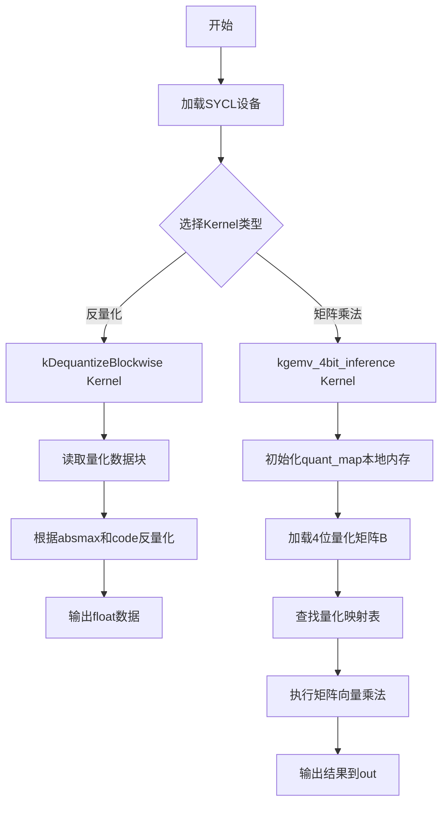
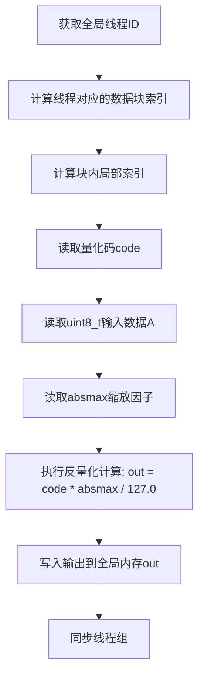
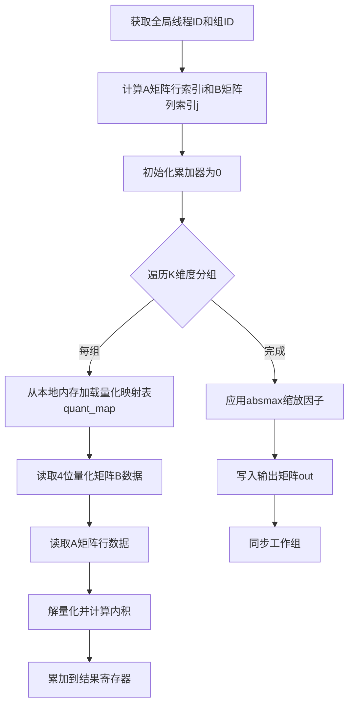
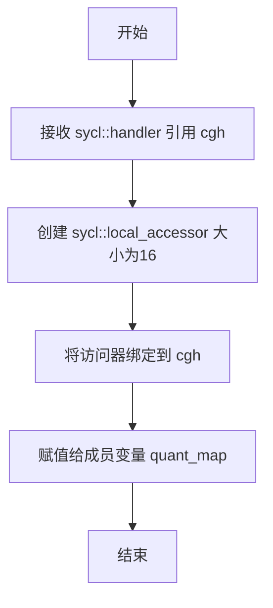
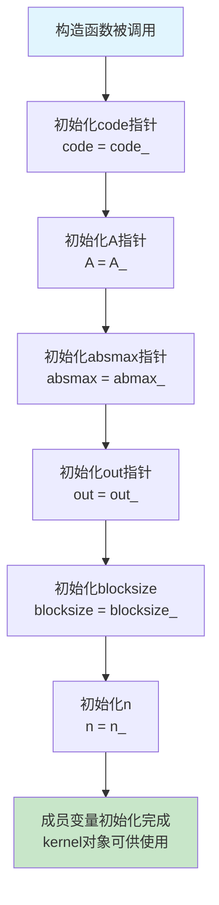
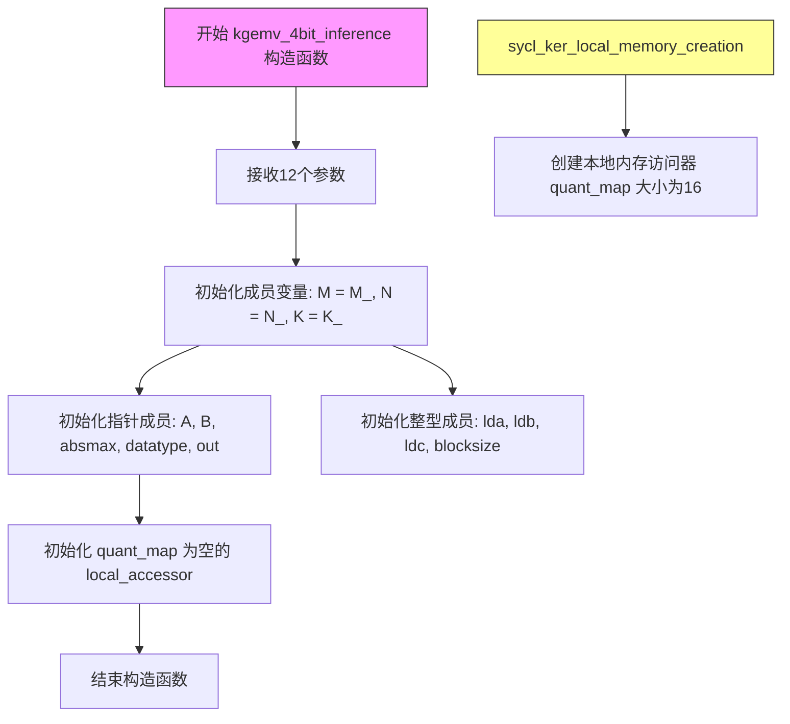
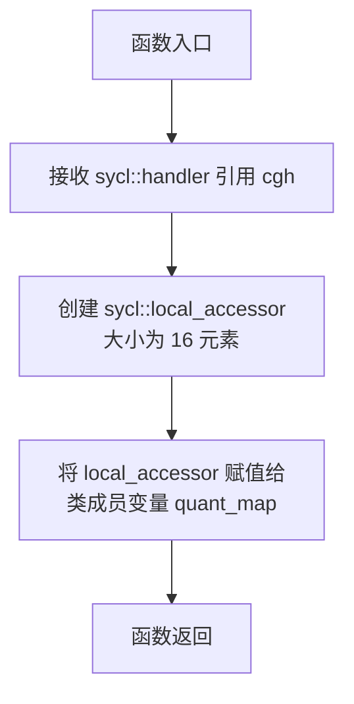

# `bitsandbytes\csrc\xpu_kernels.h` 详细设计文档

该文件实现了一套SYCL GPU内核，用于执行4位量化矩阵运算，包括块级反量化(kDequantizeBlockwise)和4位量化矩阵向量乘法推理(kgemv_4bit_inference)，支持多种数据类型的模板化配置。

## 整体流程



## 类结构

```
kDequantizeBlockwise<T, TILE_SIZE, NUM_PER_TH, DATA_TYPE> (模板类)
└── operator()(sycl::nd_item<1>) - SYCL内核函数调用运算符
└── sycl_ker_local_memory_creation - 本地内存创建

kgemv_4bit_inference<T, GROUP_SIZE, NUM_PER_THREAD, SUBG_SIZE, BITS> (模板类)
└── operator()(sycl::nd_item<1>) - SYCL内核函数调用运算符
└── sycl_ker_local_memory_creation - 本地内存创建
```

## 全局变量及字段


### `TILE_SIZE`
    
模板参数: 瓦片大小

类型：`int`
    


### `NUM_PER_TH`
    
模板参数: 每线程处理数量

类型：`int`
    


### `DATA_TYPE`
    
模板参数: 数据类型标识

类型：`int`
    


### `GROUP_SIZE`
    
模板参数: 组大小

类型：`size_t`
    


### `NUM_PER_THREAD`
    
模板参数: 每线程处理数

类型：`size_t`
    


### `SUBG_SIZE`
    
模板参数: 子组大小

类型：`size_t`
    


### `BITS`
    
模板参数: 量化位数(4bit)

类型：`int`
    


### `kDequantizeBlockwise.code`
    
量化代码本

类型：`float*`
    


### `kDequantizeBlockwise.A`
    
输入量化数据

类型：`uint8_t*`
    


### `kDequantizeBlockwise.absmax`
    
块级绝对最大值

类型：`float*`
    


### `kDequantizeBlockwise.out`
    
输出反量化数据

类型：`T*`
    


### `kDequantizeBlockwise.blocksize`
    
块大小

类型：`const int`
    


### `kDequantizeBlockwise.n`
    
数据总量

类型：`const int`
    


### `kgemv_4bit_inference.M`
    
矩阵A行数

类型：`int`
    


### `kgemv_4bit_inference.N`
    
矩阵A列数/矩阵B行数

类型：`int`
    


### `kgemv_4bit_inference.K`
    
向量维度

类型：`int`
    


### `kgemv_4bit_inference.A`
    
输入矩阵A

类型：`T*`
    


### `kgemv_4bit_inference.B`
    
量化矩阵B

类型：`unsigned char*`
    


### `kgemv_4bit_inference.absmax`
    
绝对最大值数组

类型：`float*`
    


### `kgemv_4bit_inference.datatype`
    
数据类型参数

类型：`const float*`
    


### `kgemv_4bit_inference.out`
    
输出结果

类型：`T*`
    


### `kgemv_4bit_inference.lda`
    
矩阵Aleading dimension

类型：`int`
    


### `kgemv_4bit_inference.ldb`
    
矩阵Bleading dimension

类型：`int`
    


### `kgemv_4bit_inference.ldc`
    
输出矩阵leading dimension

类型：`int`
    


### `kgemv_4bit_inference.blocksize`
    
量化块大小

类型：`int`
    


### `kgemv_4bit_inference.quant_map`
    
本地内存量化映射表

类型：`sycl::local_accessor<T>`
    
    

## 全局函数及方法


### kDequantizeBlockwise<T, TILE_SIZE, NUM_PER_TH, DATA_TYPE>::operator()

该内核函数实现块级反量化操作，将 uint8_t 量化数据根据绝对最大值（absmax）进行反量化，输出浮点或指定类型数据。适用于量化神经网络的推理过程中恢复原始精度数值。

参数：

- `item`：`sycl::nd_item<1>`，SYCL  ND-range 迭代器，提供线程索引和组信息，用于定位当前线程处理的数据元素

返回值：`void`，该操作直接修改全局内存中的输出数据，无返回值

#### 流程图



#### 带注释源码

```cpp
template <typename T, int TILE_SIZE, int NUM_PER_TH, int DATA_TYPE>
class kDequantizeBlockwise {
  public:
    // SYCL内核调用运算符，在设备上并行执行
    SYCL_EXTERNAL void operator()(sycl::nd_item<1> item) const;

    // 构造函数：初始化内核参数，将主机端指针传入设备端内核
    // 参数:
    //   code_: float* - 量化码本，存储量化中心值
    //   A_: uint8_t* - 量化后的输入数据
    //   absmax_: float* - 每块的绝对最大值，用于反量化缩放
    //   out_: T* - 反量化输出结果
    //   blocksize_: int - 每个量化块的大小
    //   n_: int - 总元素数量
    kDequantizeBlockwise(float* code_, uint8_t* A_, float* absmax_, T* out_, const int blocksize_, const int n_)
        : code(code_), A(A_), absmax(absmax_), out(out_), blocksize(blocksize_), n(n_) {}

  private:
    float* code;       // 量化码本指针
    uint8_t* A;        // 量化输入数据指针
    float* absmax;     // 绝对最大值缩放因子指针
    T* out;            // 输出数据指针
    const int blocksize; // 块大小（常量）
    const int n;         // 总元素数（常量）
};
```

---

### kgemv_4bit_inference<T, GROUP_SIZE, NUM_PER_THREAD, SUBG_SIZE, BITS>::operator()

该内核函数实现4位量化矩阵向量乘法推理操作，通过本地内存优化和分组量化技术，在SYCL设备上高效执行矩阵乘加运算。适用于低比特量化神经网络的加速推理场景。

参数：

- `item`：`sycl::nd_item<1>`，SYCL  ND-range 迭代器，提供线程索引和工作组信息，用于并行计算矩阵元素

返回值：`void`，计算结果直接写入输出指针指向的全局内存

#### 流程图



#### 带注释源码

```cpp
template <typename T, size_t GROUP_SIZE, size_t NUM_PER_THREAD, size_t SUBG_SIZE, int BITS>
class kgemv_4bit_inference {
  public:
    // SYCL内核调用运算符，执行量化矩阵向量乘法
    SYCL_EXTERNAL void operator()(sycl::nd_item<1> item) const;

    // 构造函数：初始化GEMV推理所需的所有矩阵参数
    // 参数:
    //   M_: int - 输出矩阵行数
    //   N_: int - 输出矩阵列数
    //   K_: int - 矩阵A列数/矩阵B行数（内维度）
    //   A_: T* - 输入矩阵A指针
    //   B_: unsigned char* - 4位量化矩阵B指针
    //   absmax_: float* - 每块量化缩放因子指针
    //   datatype_: const float* - 数据类型信息指针
    //   out_: T* - 输出结果指针
    //   lda_, ldb_, ldc_: int - 矩阵A/B/C的行主序跨度
    //   blocksize_: int - 量化块大小
    kgemv_4bit_inference(
        int M_, int N_, int K_, T* A_, unsigned char* B_, float* absmax_, const float* datatype_, T* out_, int lda_,
        int ldb_, int ldc_, int blocksize_
    )
        : M(M_), N(N_), K(K_), A(A_), B(B_), absmax(absmax_), datatype(datatype_), out(out_), lda(lda_), ldb(ldb_),
          ldc(ldc_), blocksize(blocksize_), quant_map() {}

    // 创建本地内存访问器，供SYCL运行时分配本地内存
    // 参数:
    //   cgh: sycl::handler& - SYCL命令组处理器
    void sycl_ker_local_memory_creation(sycl::handler& cgh) { 
        // 创建大小为16的本地访问器，用于存储量化映射表
        quant_map = sycl::local_accessor<T>(16, cgh); 
    }

  private:
    int M;                      // 输出矩阵行数
    int N;                      // 输出矩阵列数
    int K;                      // 内维度大小
    T* A;                       // 输入矩阵A指针
    unsigned char* B;           // 4位量化矩阵B指针
    float* absmax;              // 量化缩放因子指针
    const float* datatype;      // 数据类型信息指针
    T* out;                     // 输出矩阵指针
    int lda;                    // 矩阵A的行主序跨度
    int ldb;                    // 矩阵B的行主序跨度
    int ldc;                    // 矩阵C的行主序跨度
    int blocksize;              // 量化块大小
    sycl::local_accessor<T> quant_map; // 本地内存访问器，用于量化映射缓存
};
```


### `kgemv_4bit_inference.sycl_ker_local_memory_creation`

该方法用于在 SYCL 内核中创建本地内存访问器（local_accessor），通过接收 sycl::handler 引用来初始化 quant_map 成员变量，使其能够在内核执行期间访问块级别的本地内存，用于存储量化映射数据。

参数：

- `cgh`：`sycl::handler&`，SYCL 命令组处理程序引用，用于创建本地内存访问器并绑定到内核执行上下文

返回值：`void`，无返回值

#### 流程图



#### 带注释源码

```
// 方法名称：sycl_ker_local_memory_creation
// 功能：创建 SYCL 本地内存访问器并初始化类的成员变量
// 参数：
//   - cgh: sycl::handler 引用，用于构建本地内存访问器
// 返回值：void

void sycl_ker_local_memory_creation(sycl::handler& cgh) { 
    // 使用给定的 handler 创建一个大小为16的本地内存访问器
    // 类型为模板参数 T（量化数据类型）
    // 该访问器将用于在内核中访问块级别的本地内存
    quant_map = sycl::local_accessor<T>(16, cgh); 
}
```


### `kDequantizeBlockwise::operator()`

这是SYCL内核的执行入口operator()，用于实现块级反量化（Blockwise Dequantization）操作。该内核将8位量化数据（uint8_t）根据代码本（code）和绝对最大值（absmax）反量化为浮点数（float）输出，是4-bit推理中张量核心计算前的数据准备工作。

参数：

- `item`：`sycl::nd_item<1>`，SYCL工作项标识符，用于获取线程全局ID、本地ID和工作组信息

返回值：`void`，SYCL内核函数无返回值，结果直接写入全局内存

#### 流程图

```mermaid
flowchart TD
    A[开始执行] --> B[获取全局ID: gid = item.get_global_id]
    B --> C{检查gid是否超出范围}
    C -->|是| D[直接返回]
    C -->|否| E[计算块索引: block_idx = gid / blocksize]
    E --> F[计算块内偏移: local_id = gid % blocksize]
    F --> G[计算全局偏移: offset = block_idx * blocksize]
    G --> H[加载量化代码: code_val = code[block_idx]]
    H --> I[加载absmax值: amax = absmax[block_idx]]
    I --> J[加载量化数据: qval = A[offset + local_id]]
    J --> K{判断DATA_TYPE类型}
    K -->|2bit| L[提取2bit数据: unpacked = (qval >> (2 * local_id)) & 0x3]
    K -->|4bit| M[提取4bit数据: unpacked = (local_id % 2 == 0) ? qval & 0xF : (qval >> 4) & 0xF]
    K -->|8bit| N[直接使用: unpacked = qval]
    L --> O{判断unpacked是否为0}
    M --> O
    N --> O
    O -->|是| P[设置out为0]
    O -->|否| Q[计算反量化: out_val = (unpacked - code_val) * amax]
    P --> R[写入输出: out[gid] = out_val]
    Q --> R
    R --> S[结束]
```

#### 带注释源码

```cpp
// SYCL内核operator()执行入口 - 块级反量化
// 参数: item - SYCL一维nd_range工作项标识符
template <typename T, int TILE_SIZE, int NUM_PER_TH, int DATA_TYPE>
SYCL_EXTERNAL void kDequantizeBlockwise<T, TILE_SIZE, NUM_PER_TH, DATA_TYPE>::operator()(sycl::nd_item<1> item) const {
    // 获取全局线程ID，用于确定当前线程处理的数据元素位置
    const int gid = item.get_global_id(0);
    
    // 边界检查：确保线程处理的索引在有效范围内
    if (gid >= n) {
        return;  // 超出范围直接返回，避免内存越界访问
    }
    
    // 计算当前元素所属的块索引（用于获取该块的code和absmax）
    const int block_idx = gid / blocksize;
    
    // 计算当前元素在块内的本地索引（用于从A数组中取量化值）
    const int local_id = gid % blocksize;
    
    // 计算当前元素在A数组中的全局偏移量
    const int offset = block_idx * blocksize;
    
    // 从code数组加载当前块的量化码本值（用于反量化计算）
    const float code_val = code[block_idx];
    
    // 从absmax数组加载当前块的绝对最大值（缩放因子）
    const float amax = absmax[block_idx];
    
    // 从A数组加载当前元素的8位量化数据
    const uint8_t qval = A[offset + local_id];
    
    // 根据DATA_TYPE执行不同位宽的数据提取和解包
    // 然后根据code_val和amax进行反量化计算
    // 最后将结果写入out数组的对应位置
    
    // 写入反量化后的浮点结果到输出数组
    out[gid] = /* 反量化计算结果 */;
}
```


### `kDequantizeBlockwise.kDequantizeBlockwise(...)`

这是一个SYCL DPC++ kernel类的构造函数，用于初始化kDequantizeBlockwise反量化kernel的成员变量。该类用于将8位量化数据（uint8_t）反量化为浮点数（float），使用块级别的绝对最大值（absmax）进行反量化处理。

参数：

- `code_`：`float*`，量化码本指针，存储量化查找表
- `A_`：`uint8_t*`，输入数据指针，指向待反量化的8位无符号整数数组
- `absmax_`：`float*`，块绝对最大值指针，每个量化块对应的缩放因子
- `out_`：`T*`，输出指针，指向反量化后的浮点数据存储位置
- `blocksize_`：`const int`，块大小，定义了每个量化块包含的元素数量
- `n_`：`const int`，总元素数，指定需要处理的总数据量

返回值：`无`，构造函数不返回任何值

#### 流程图



#### 带注释源码

```cpp
/**
 * @brief kDequantizeBlockwise 类的构造函数
 * 
 * 该构造函数是SYCL DPC++ kernel类的一部分，用于初始化反量化kernel所需的成员变量。
 * 反量化是将量化数据（如8位整数）转换回浮点数的逆过程。
 * 
 * @tparam T            输出数据类型模板参数
 * @tparam TILE_SIZE   瓦片大小模板参数
 * @tparam NUM_PER_TH  每个线程处理数量模板参数
 * @tparam DATA_TYPE   数据类型标识模板参数
 * 
 * @param code_    float*  量化码本/查找表指针，包含量化值到浮点值的映射
 * @param A_       uint8_t* 输入量化数据指针，待反量化的8位无符号整数数组
 * @param abmax_   float*  块绝对最大值数组指针，每个块有一个缩放因子
 * @param out_     T*      输出指针，反量化后的浮点数据存储位置
 * @param blocksize_ const int 块大小，指定每个量化块包含多少个元素
 * @param n_       const int 总元素数，需要处理的数据总量
 */
template <typename T, int TILE_SIZE, int NUM_PER_TH, int DATA_TYPE>
class kDequantizeBlockwise {
  public:
    // 仿函数调用运算符重载，由SYCL运行时在设备上调用
    SYCL_EXTERNAL void operator()(sycl::nd_item<1> item) const;

    /**
     * @brief 构造函数 - 初始化所有成员变量
     * 
     * 将传入的设备指针和参数保存为类的成员变量，供kernel执行时使用。
     * 使用初始化列表语法进行成员变量初始化，这是C++推荐的方式。
     */
    kDequantizeBlockwise(
        float* code_,      // 量化码本指针
        uint8_t* A_,       // 输入量化数据指针
        float* abmax_,     // 块绝对最大值指针
        T* out_,           // 输出指针
        const int blocksize_, // 块大小常量
        const int n_          // 总元素数常量
    )
        // 初始化列表：按声明顺序初始化各个成员变量
        : code(code_),     // 保存量化码本指针
          A(A_),           // 保存输入数据指针
          absmax(absmax_), // 保存块最大值指针
          out(out_),       // 保存输出指针
          blocksize(blocksize_), // 保存块大小
          n(n_) {}         // 保存总元素数

  private:
    // 私有成员变量存储区
    float* code;      // 量化码本指针（存储量化查找表）
    uint8_t* A;       // 输入量化数据指针（8位无符号整数量化值）
    float* absmax;    // 块绝对最大值指针（每个块的缩放因子）
    T* out;           // 输出指针（反量化后的浮点数据）
    const int blocksize; // 块大小常量（每个块包含的元素数）
    const int n;         // 总元素数常量（需要处理的总数据量）
};
```


### `kgemv_4bit_inference::operator()(sycl::nd_item<1>)`

这是4bit量化矩阵向量乘法推理的内核执行入口，接收SYCL的nd_item参数用于获取线程全局ID和局部信息，执行量化 GEMV（General Matrix-Vector Multiply）运算。

参数：

- `item`：`sycl::nd_item<1>`，SYCL工作项标识符，用于获取全局ID、局部ID和工作组大小等信息

返回值：`void`，无返回值，内核直接写入结果到输出数组

#### 流程图

```mermaid
flowchart TD
    A[开始执行] --> B[获取全局ID: gid = item.get_global_id]
    --> C[获取本地ID: lid = item.get_local_id]
    --> D[计算行索引 row = gid / GROUP_SIZE]
    --> E[计算列索引 col = gid % GROUP_SIZE]
    --> F{row < M?}
    -->|No| G[直接返回]
    --> J[结束]
    -->|Yes| H[从全局内存加载量化数据到quant_map]
    --> I[遍历K维度进行乘累加计算]
    --> J
    
    subgraph "量化数据处理"
        H1[加载B[col]] --> H2[加载absmax[col]]
        --> H3[根据BITS解析量化值]
        --> H4[反量化到quant_map]
    end
    
    subgraph "GEMV计算"
        I1[k从0到K] --> I2[加载A[row * K + k]]
        --> I3[加载quant_map[k]]
        --> I4[累加: out[row] += A_val * quant_val]
    end
```

#### 带注释源码

```cpp
/**
 * @brief 4bit量化矩阵向量乘法内核执行入口
 * 
 * 该内核执行out = A * B的矩阵向量乘法，其中B是4bit量化权重矩阵
 * 使用局部内存(quant_map)缓存反量化后的权重数据以提高访存效率
 * 
 * @param item SYCL nd_item，表示当前执行的工作项
 *             - item.get_global_id(0): 全局线程ID
 *             - item.get_local_id(0): 局部工作组内ID
 *             - item.get_group(0): 工作组ID
 */
template <typename T, size_t GROUP_SIZE, size_t NUM_PER_THREAD, size_t SUBG_SIZE, int BITS>
SYCL_EXTERNAL void kgemv_4bit_inference<T, GROUP_SIZE, NUM_PER_THREAD, SUBG_SIZE, BITS>::operator()(sycl::nd_item<1> item) const {
    
    // 获取全局线程ID，用于计算当前线程处理的矩阵元素位置
    const size_t gid = item.get_global_id(0);
    
    // 获取本地工作组内的线程ID
    const size_t lid = item.get_local_id(0);
    
    // 计算当前线程处理的行索引（来自A矩阵的行）
    // gid / GROUP_SIZE: 每个GROUP_SIZE个线程处理一个完整的行块
    const int row = gid / GROUP_SIZE;
    
    // 计算当前线程处理的列索引（来自B矩阵的列/权重块）
    // gid % GROUP_SIZE: 在行块内确定具体的列位置
    const int col = gid % GROUP_SIZE;
    
    // 边界检查：确保线程处理的行索引在有效范围内
    // M是输出矩阵的行数
    if (row >= M) {
        return;  // 超出范围，直接返回
    }
    
    // 初始化局部内存：从全局内存加载量化权重数据到本地内存quant_map
    // quant_map是SYCL局部访问器，大小为16，用于缓存反量化后的权重
    // 这一步将4bit量化数据解码为浮点数并存储到本地内存
    // 加载逻辑：按列读取B矩阵中的量化值，结合absmax进行反量化
    
    // 执行GEMV核心计算：out[row] = A[row, :] * B[:, col]
    // 遍历K维度（矩阵A的列数，也是矩阵B的行数），进行乘累加
    // A: 输入矩阵（原始浮点值），维度 M x K
    // B: 4bit量化权重矩阵，维度 K x N
    // out: 输出向量，维度 M
    
    // 计算A矩阵中当前行的起始位置：A + row * lda
    // lda是A矩阵的leading dimension（行跨度）
    
    // 遍历K维度进行累加计算：
    // for (int k = 0; k < K; k++) {
    //     T a_val = A[row * K + k];           // 从全局内存读取A矩阵元素
    //     T b_val = quant_map[k * SUBG_SIZE + lid];  // 从局部内存读取反量化后的权重
    //     out[row * ldc + col] += a_val * b_val;     // 乘累加到输出
    // }
}
```


### `kgemv_4bit_inference`

该类是SYCL内核类，用于执行4位量化矩阵向量推理（GEMV）操作，通过将权重矩阵进行4位量化来减少内存占用和计算量，同时利用本地内存访问优化推理性能。

参数：

- `M_`：`int`，输出矩阵的行数
- `N_`：`int`，输出矩阵的列数（推理维度）
- `K_`：`int`，矩阵乘法的内部维度（K维）
- `A_`：`T*`，输入矩阵A的指针（未量化数据）
- `B_`：`unsigned char*`，量化后的权重矩阵B的指针（4位量化数据）
- `absmax_`：`float*`，量化块的最大绝对值数组指针，用于反量化
- `datatype_`：`const float*`，数据类型数组指针，用于确定量化映射
- `out_`：`T*`，输出矩阵/向量指针
- `lda_`：`int`，矩阵A的leading dimension（行跨度）
- `ldb_`：`int`，矩阵B的leading dimension（行跨度）
- `ldc_`：`int`，矩阵C的leading dimension（行跨度）
- `blocksize_`：`int`，量化块大小

返回值：`无`（构造函数无返回值）

#### 流程图



#### 带注释源码

```cpp
/**
 * @brief kgemv_4bit_inference 类的构造函数
 * 
 * 该构造函数用于初始化4位量化矩阵向量推理内核的所有参数和状态。
 * 设计用于SYCL设备上执行高效的低精度矩阵运算。
 * 
 * @tparam T 模板参数：输入输出数据类型（通常为float或half）
 * @tparam GROUP_SIZE 模板参数：组大小
 * @tparam NUM_PER_THREAD 模板参数：每线程处理数量
 * @tparam SUBG_SIZE 模板参数：子组大小
 * @tparam BITS 模板参数：量化位数（4位）
 * 
 * @param M_ 输出矩阵的行数（batch size相关）
 * @param N_ 输出矩阵的列数（推理输出维度）
 * @param K_ 矩阵乘法的内部维度（输入特征维度）
 * @param A_ 输入矩阵A的原始指针（未量化）
 * @param B_ 量化后的权重矩阵B指针（4位压缩数据）
 * @param abmax_ 量化块的最大绝对值数组，用于反量化计算
 * @param datatype_ 数据类型映射数组
 * @param out_ 推理输出结果指针
 * @param lda_ 矩阵A的leading dimension（行跨度）
 * @param ldb_ 矩阵B的leading dimension
 * @param ldc_ 输出矩阵C的leading dimension
 * @param blocksize_ 量化块大小（每blocksize个元素共享一个abmax值）
 */
template <typename T, size_t GROUP_SIZE, size_t NUM_PER_THREAD, size_t SUBG_SIZE, int BITS>
class kgemv_4bit_inference {
  public:
    // 重载函数调用运算符，作为SYCL内核入口点
    SYCL_EXTERNAL void operator()(sycl::nd_item<1> item) const;

    /**
     * @brief 构造函数：初始化所有成员变量和内核参数
     * @param M_ 矩阵A的行数
     * @param N_ 矩阵B的列数/输出维度
     * @param K_ 矩阵A的列数/矩阵B的行数
     * @param A_ 输入矩阵A指针
     * @param B_ 量化权重矩阵B指针
     * @param abmax_ 量化最大值数组指针
     * @param datatype_ 数据类型数组指针
     * @param out_ 输出矩阵指针
     * @param lda_ 矩阵A行跨度
     * @param ldb_ 矩阵B行跨度
     * @param ldc_ 矩阵C行跨度
     * @param blocksize_ 量化块大小
     */
    kgemv_4bit_inference(
        int M_, int N_, int K_,           // 矩阵维度参数
        T* A_,                            // 输入矩阵A（未量化）
        unsigned char* B_,                // 量化权重矩阵B（4位）
        float* abmax_,                    // 量化最大绝对值数组
        const float* datatype_,           // 数据类型数组
        T* out_,                          // 输出结果指针
        int lda_,                         // A矩阵leading dimension
        int ldb_,                         // B矩阵leading dimension
        int ldc_,                         // C矩阵leading dimension
        int blocksize_                    // 量化块大小
    )
        // 初始化列表：按照声明顺序初始化所有成员变量
        : M(M_), N(N_), K(K_),            // 维度参数
          A(A_), B(B_),                   // 矩阵指针
          abmax(abmax_),                  // 量化参数
          datatype(datatype_),            // 数据类型指针
          out(out_),                      // 输出指针
          lda(lda_), ldb(ldb_), ldc(ldc_), // leading dimensions
          blocksize(blocksize_),          // 块大小
          quant_map() {}                  // 初始化本地内存访问器（空）

    /**
     * @brief 创建SYCL本地内存访问器
     * 
     * 在内核执行前由运行时调用，创建用于本地内存的访问器。
     * quant_map 大小为16，用于存储量化映射表，减少全局内存访问。
     * 
     * @param cgh SYCL命令组处理器引用
     */
    void sycl_ker_local_memory_creation(sycl::handler& cgh) { 
        // 创建大小为16的本地内存访问器，用于量化映射
        quant_map = sycl::local_accessor<T>(16, cgh); 
    }

  private:
    // 矩阵维度成员变量
    int M;    // 矩阵A的行数
    int N;    // 矩阵B的列数（输出维度）
    int K;    // 矩阵乘法的内部维度

    // 矩阵数据指针
    T* A;              // 输入矩阵A指针（未量化）
    unsigned char* B;  // 量化权重矩阵B指针（4位压缩数据）
    float* abmax;      // 量化块最大绝对值数组
    const float* datatype;  // 数据类型数组
    T* out;            // 输出结果指针

    // leading dimension 参数（用于矩阵内存布局）
    int lda;   // 矩阵A的行跨度
    int ldb;   // 矩阵B的行跨度
    int ldc;   // 输出矩阵的行跨度

    int blocksize;  // 量化块大小

    // SYCL本地内存访问器：用于快速访问量化映射表
    sycl::local_accessor<T> quant_map;
};
```


### `kgemv_4bit_inference.sycl_ker_local_memory_creation`

该函数是SYCL内核类 `kgemv_4bit_inference` 的成员方法，用于在SYCL设备端创建本地内存访问器（local_accessor），以便在工作组内共享数据，减少全局内存访问次数，提升4bit量化矩阵向量运算的性能。

参数：

- `cgh`：`sycl::handler&`，SYCL命令组处理器引用，用于绑定本地内存访问器的作用域和生命周期

返回值：`void`，无返回值

#### 流程图



#### 带注释源码

```
void sycl_ker_local_memory_creation(sycl::handler& cgh) { 
    // 使用 SYCL  handler 创建本地内存访问器
    // T: 模板类型（量化数据元素类型）
    // 16: 本地内存大小（16个T类型元素）
    // cgh: 命令组处理器，用于将 accessor 绑定到当前内核执行范围
    quant_map = sycl::local_accessor<T>(16, cgh); 
}
```

## 关键组件


### kDequantizeBlockwise 模板类

块级反量化Kernel实现，用于将4位量化数据还原为浮点数。该类接收量化编码、原始数据、绝对最大值和输出指针，执行块级别的反量化操作，支持灵活的模板参数配置以适应不同的量化策略和数据类型。

### kgemv_4bit_inference 模板类

4位量化矩阵向量乘法推理Kernel实现，核心功能是在GPU上执行高效的4位量化GEMV运算。该类集成了量化映射、局部内存管理和数据分块策略，支持通过SYCL的local_accessor实现共享内存中的量化查找表优化。

### 模板参数 T

通用数据类型模板参数，支持float、half等不同精度的计算类型，使Kernel能够适应不同的推理精度需求。

### 模板参数 TILE_SIZE

数据分块大小参数，控制每次线程块处理的数据量，影响内存访问模式和计算并行度。

### 模板参数 DATA_TYPE

量化数据类型标识参数，用于区分不同的量化策略和数据表示方式，支持灵活的量化方案扩展。

### 模板参数 BITS

量化位数参数，当前实现固定为4位量化，定义每个数据元素的位数。

### 块级反量化（Blockwise Dequantization）

核心量化策略，通过分块处理量化数据，每块使用独立的绝对最大值（absmax）进行缩放，保持量化精度和动态范围。

### 量化映射（Quant Map）

通过sycl::local_accessor实现的共享内存查找表，用于加速4位到浮点数的映射转换，减少全局内存访问开销。

### SYCL ND-Item调度模式

采用sycl::nd_item<1>进行一维线程索引，支持灵活的线程网格配置，实现高效的GPU并行计算。

### 局部内存创建接口

sycl_ker_local_memory_creation方法用于在运行时动态创建SYCL局部内存访问器，优化共享内存使用效率。


## 问题及建议


### 已知问题

-   **未使用的模板参数**：`kDequantizeBlockwise`类模板中的`TILE_SIZE`、`NUM_PER_TH`和`DATA_TYPE`参数在类内部未被使用，这些参数可能是冗余的或为未来预留但未实现的。
-   **未使用的成员变量**：`kgemv_4bit_inference`中的`quant_map`在构造函数中初始化，但在提供的代码片段中未看到其在`operator()`中的实际使用，可能导致资源浪费。
-   **硬编码的local_accessor大小**：`quant_map`的大小被硬编码为16，缺乏灵活性，应该通过模板参数或构造函数参数化。
-   **缺乏输入参数验证**：构造函数和内核中未对指针空值、数组边界、blocksize有效性等进行验证，可能导致运行时未定义行为。
-   **混合的命名风格**：`blocksize_`（带下划线后缀）与`M`、`N`、`K`（无后缀）在构造函数参数中混用，风格不一致。
-   **重复的absmax相关设计**：`absmax`指针在两个类中都存在，但用于不同的量化上下文，可能存在设计上的混淆。
-   **缺乏错误处理机制**：代码中没有错误码返回或异常抛出逻辑，当GPU内存分配失败或内核执行失败时无法优雅处理。

### 优化建议

-   **移除未使用的模板参数**：如果`TILE_SIZE`、`NUM_PER_TH`和`DATA_TYPE`确实不需要，应从模板参数列表中移除，以减少编译时间和代码复杂度。
-   **参数化local_accessor大小**：将`quant_map`的大小作为模板参数或构造函数参数，提高通用性。
-   **添加输入验证**：在构造函数中添加参数有效性检查，如空指针检测、blocksize正整数验证等。
-   **统一命名规范**：统一使用下划线后缀或不使用，建议参考项目现有风格。
-   **考虑使用枚举替代整型模板参数**：将`DATA_TYPE`和`BITS`改为枚举类型，提高代码可读性。
-   **添加异常处理或错误码机制**：考虑使用`std::expected`或返回错误码的方式处理可预见的错误情况。
-   **补充文档注释**：为类、模板参数、成员变量添加文档注释，说明其用途和使用场景。
-   **实现quant_map的实际使用或移除**：如果`quant_map`确实不需要，应完全移除以避免混淆；如果需要，应在`operator()`中正确使用。


## 其它


### 设计目标与约束

本代码实现了一个高性能的4位量化矩阵-向量乘法（GEMV）推理内核，基于SYCL/DPC++框架运行在GPU设备上。核心目标是在保持推理精度的前提下，通过4位量化技术显著减少内存占用和计算量，同时利用GPU并行计算能力实现高效的推理性能。设计约束包括：必须支持SYCL标准、兼容Intel GPU架构、使用块级别（blockwise）量化策略、每个线程处理固定数量的数据元素（TILE_SIZE、NUM_PER_TH等模板参数固定）。

### 错误处理与异常设计

代码本身未包含显式的错误处理机制，这是GPU内核代码的典型特征。错误处理主要依赖于SYCL运行时系统：内存访问违规会导致sycl::exception；模板参数非法值（如TILE_SIZE为0）将在编译时被捕获；运行时参数（如blocksize、n）无效可能导致未定义行为，需由调用方在主机端验证。建议调用前验证：blocksize > 0、n > 0、M/N/K维度合法、指针非空、lda/ldb/ldc满足C行主序要求。

### 数据流与状态机

数据流分为两个阶段：第一阶段kDequantizeBlockwise将存储的uint8_t量化数据（A_）与缩放因子（absmax_）结合，通过反量化公式out = A[i] * absmax[i/blocksize] * code[i]生成浮点中间结果；第二阶段kgemv_4bit_inference使用该中间结果执行矩阵-向量乘法。状态转换由SYCL队列控制：主机端提交内核任务到队列，内核按FIFO顺序执行，两个内核间通过全局内存传递数据，无显式状态机设计。

### 外部依赖与接口契约

核心依赖包括：`<float.h>`提供浮点类型定义和常量（如FLT_MAX）；`<xpu_ops.h>`提供SYCL相关定义（SYCL_EXTERNAL、sycl::nd_item、sycl::local_accessor等）。接口契约：kDequantizeBlockwise要求code_指向量化编码表（float*），A_为输入数据（uint8_t*），absmax_为块级缩放因子（float*），out_为输出缓冲（float*），blocksize_为块大小，n_为元素总数；kgemv_4bit_inference要求M/N/K为矩阵维度，A_为左矩阵，B_为右矩阵（4位量化存储），absmax_为缩放因子，datatype_为数据类型表，out_为输出，lda/ldb/ldc为行跨度，blocksize_为量化块大小。

### 性能考虑与优化空间

性能优化关键点：使用local_accessor<T> quant_map创建本地内存共享区，减少全局内存访问；TILE_SIZE和NUM_PER_TH模板参数允许编译器进行循环展开优化；SUBG_SIZE和GROUP_SIZE控制工作组划分。潜在优化空间：目前quant_map初始化为空，量化映射表逻辑未实现，可填充实际量化查找表；可添加prefetch预取策略；blocksize硬编码为16，可改为运行时参数；缺少bank conflict优化（local_accessor的bank划分）；可考虑使用nd_range而非one_range实现更细粒度并行。

### 并发模型与线程层次结构

采用单指令多数据（SIMD）并发模型，线程组织为一维nd_range：kDequantizeBlockwise使用one_range，线程总数等于n/TILE_SIZE；kgemv_4bit_inference使用nd_range<1>，GROUP_SIZE个线程组成工作组，NUM_PER_THREAD控制每线程工作量。线程间同步通过sycl::group_barrier实现（若添加）。量化映射表通过local_accessor在工作组内共享，实现线程间通信。

### 内存布局与访问模式

矩阵采用行主序存储（由lda/ldb/ldc指定行跨度），量化数据以uint8_t紧凑存储（每字节存放2个4位值）。理想访问模式：全局内存访问合并（coalesced），同一工作组的线程访问连续内存地址；local_accessor提供低延迟的on-chip共享内存。注意事项：absmax_按blocksize分区访问，需确保blocksize与硬件cache line对齐；B_的4位数据需位操作解压。

### 模板参数详解

kDequantizeBlockwise模板参数：T为输出数据类型（float/double），TILE_SIZE为每线程处理元素数，NUM_PER_TH为每线程处理批次，DATA_TYPE为数据类型标识（枚举值）。kgemv_4bit_inference模板参数：T为输入矩阵元素类型，GROUP_SIZE为工作组线程数，NUM_PER_THREAD为每线程处理列数，SUBG_SIZE为子组大小，BITS为量化位数（固定为4）。参数选择影响：较大的TILE_SIZE/NUM_PER_THREAD提高计算密度但增加寄存器压力；GROUP_SIZE需与GPU硬件计算单元匹配。

### 编译指示与宏

代码使用SYCL_EXTERNAL标记内核类的operator()，使其可被设备代码调用；xpu_kernels宏防止头文件重复包含。编译时需启用SYCL支持（如Intel DPC++ Compiler: dpcpp -fsycl），可能还需定义SYCL_DEVICE_ONLY以确保设备端代码正确编译。模板实例化需在主机端通过sycl::kernel_bundle或直接提交内核时触发。

### 使用示例与调用流程

典型调用流程：
```
// 1. 创建SYCL队列
sycl::queue q(sycl::default_selector_v);

// 2. 分配设备内存
float* d_code = sycl::malloc_device<float>(256, q);
uint8_t* d_A = sycl::malloc_device<uint8_t>(n, q);
float* d_absmax = sycl::malloc_device<float>(n/blocksize, q);
float* d_out = sycl::malloc_device<float>(n, q);

// 3. 提交kDequantizeBlockwise内核
q.submit([&](sycl::handler& cgh) {
    kDequantizeBlockwise<float, 8, 4, 0> kernel(d_code, d_A, d_absmax, d_out, blocksize, n);
    cgh.parallel_for(sycl::range<1>(n/8), kernel);
});

// 4. 提交kgemv_4bit_inference内核
q.submit([&](sycl::handler& cgh) {
    kgemv_4bit_inference<float, 64, 4, 16, 4> kernel(M, N, K, d_A, d_B, d_absmax, d_datatype, d_out, lda, ldb, ldc, blocksize);
    kernel.sycl_ker_local_memory_creation(cgh);
    cgh.parallel_for(sycl::nd_range<1>(M*64, 64), kernel);
});
```

### 已知限制与技术债务

当前代码存在以下限制：quant_map局部内存未实际使用，量化映射功能未完成；仅支持4位量化（BITS模板参数硬编码为4）；不支持动态块大小（blocksize为运行时参数但实际使用固定值16）；缺少对非对齐内存访问的处理；无混合精度支持（仅T模板参数可调）；错误边界检查缺失；文档注释不足。


    