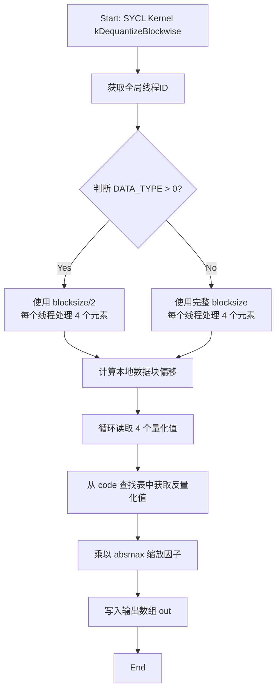
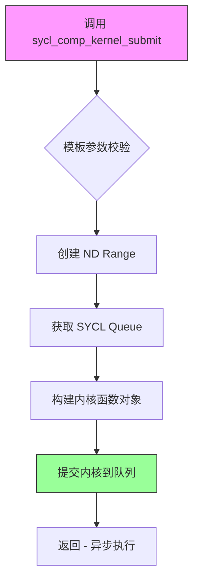

# `bitsandbytes\csrc\xpu_ops.cpp` 详细设计文档

这是一段基于SYCL/DPC++的GPU加速量化矩阵运算代码，实现了4bit/8bit权重量化的神经网络推理加速，支持FP4/NF4/General8bit等量化格式，通过块级反量化(dequantizeBlockwise)和矩阵向量乘法(gemv_4bit_inference)内核实现高效的GPU计算。

## 整体流程

```mermaid
graph TD
    A[接收量化输入] --> B{判断DATA_TYPE}
    B -->|DATA_TYPE > 0| C[计算workgroup_num = (n + tile_size*2-1)/(tile_size*2)]
    B -->|DATA_TYPE <= 0| D[计算workgroup_num = (n + tile_size-1)/tile_size]
    C --> E[提交dequantizeBlockwise kernel]
    D --> E
    E --> F[GPU执行块级反量化]
    F --> G[gemv_4bit_inference]
    G --> H[计算workgroup_num = (n + NUM_PER_THREAD-1)/NUM_PER_THREAD]
    H --> I[提交kgemv_4bit_inference kernel]
    I --> J[GPU执行4bit矩阵向量乘法]
    J --> K[输出反量化结果]
```

## 类结构

```
全局函数 (Template Functions)
├── dequantizeBlockwise<T, DATA_TYPE>
│   ├── float版本 (FP4/NF4/General8bit)
│   ├── sycl::half版本
│   └── sycl::ext::oneapi::bfloat16版本
└── gemv_4bit_inference<T, BITS>
    ├── sycl::half版本 (BITS=16)
    ├── bfloat16版本 (BITS=16)
    └── float版本 (BITS=32)
```

## 全局变量及字段


### `workgroup_size`
    
工作项组大小，指定每个工作组包含的线程数量

类型：`const int`
    


### `num_per_th`
    
每个线程处理的元素数量，用于计算并行度

类型：`const int`
    


### `tile_size`
    
瓦片大小，由工作项组大小和每线程处理数相乘得到，决定数据分块大小

类型：`const int`
    


### `GROUP_SIZE`
    
GEMV操作的工作组大小，设置为128

类型：`const size_t`
    


### `SUBG_SIZE`
    
SYCL子组大小，设置为32用于SIMD优化

类型：`const size_t`
    


### `NUM_PER_THREAD`
    
每个线程处理的数量，由工作组大小除以子组大小得到

类型：`const size_t`
    


### `queue`
    
SYCL队列引用，用于提交和执行内核

类型：`auto& (sycl::queue&)`
    


### `local_range`
    
本地工作项范围，定义一个工作组内的线程数

类型：`sycl::range<1>`
    


### `global_range`
    
全局工作项范围，定义总线程数

类型：`sycl::range<1>`
    


### `workgroup_num`
    
工作组的数量，根据数据大小和瓦片大小计算得出

类型：`size_t/int`
    


    

## 全局函数及方法


### `dequantizeBlockwise<T, DATA_TYPE>`

这是一个SYCL DPC++核函数，用于将4-bit或8-bit量化数据进行块式反量化（dequantize）。函数根据DATA_TYPE类型选择不同的计算路径，通过SYCL队列提交GPU计算任务，将量化数据（由A和absmax指定）反量化为浮点精度输出到out数组。

参数：

- `code`：`float*`，量化码本/查找表，用于将量化索引映射回原始浮点值
- `A`：`unsigned char*`，量化输入数据，包含待反量化的压缩数据
- `absmax`：`float*`，每个量化块的绝对最大值数组，用于缩放因子计算
- `out`：`T*`，反量化输出数组，存储反量化后的浮点数据
- `blocksize`：`int`，量化块大小，定义每个块包含多少个元素
- `n`：`const int`，总元素数量，指定要处理的元素总数
- `stream`：`sycl::queue*`，SYCL计算队列，用于提交核函数到设备执行

返回值：`void`，无返回值，结果通过out指针输出

#### 流程图

```mermaid
flowchart TD
    A[开始 dequantizeBlockwise] --> B{判断 DATA_TYPE > 0?}
    B -->|是| C[计算 workgroup_num = (n + tile_size*2 - 1) / (tile_size*2)]
    B -->|否| D[计算 workgroup_num = (n + tile_size - 1) / tile_size]
    C --> E[设置 blocksize = blocksize / 2]
    D --> F[保持 blocksize 不变]
    E --> G[创建 SYCL nd_range]
    F --> G
    G --> H[构造 kDequantizeBlockwise 核函数对象]
    H --> I[通过 sycl_kernel_submit 提交核函数]
    I --> J[结束]
```

#### 带注释源码

```cpp
template <typename T, int DATA_TYPE>
void dequantizeBlockwise(
    float* code,         // 量化码本/查找表
    unsigned char* A,   // 量化输入数据
    float* absmax,      // 每个块的绝对最大值（缩放因子）
    T* out,             // 反量化输出数组
    int blocksize,      // 量化块大小
    const int n,        // 总元素数量
    sycl::queue* stream // SYCL执行队列
) {
    auto& queue = *stream;  // 解引用获取SYCL队列引用
    
    const int workgroup_size = 128;  // 工作组大小
    const int num_per_th = 4;         // 每个线程处理4个元素
    const int tile_size = workgroup_size * num_per_th;  // 512
    
    if (DATA_TYPE > 0) {
        // DATA_TYPE > 0 表示使用4-bit量化模式
        // 需要两倍的工作组数量，因为每个字节存储两个4-bit值
        // 使用int64_t避免大n值溢出
        const int workgroup_num = (static_cast<int64_t>(n) + tile_size * 2 - 1) / (tile_size * 2);
        
        // 设置SYCL执行范围
        sycl::range<1> local_range{(size_t)workgroup_size};
        sycl::range<1> global_range{(size_t)workgroup_num * (size_t)workgroup_size};
        
        // 构造核函数对象，blocksize除以2因为4-bit每字节存2个值
        kDequantizeBlockwise<T, tile_size, num_per_th, DATA_TYPE> kfn(
            code, A, absmax, out, blocksize / 2, n
        );
        
        // 提交核函数到SYCL设备执行
        sycl_kernel_submit<decltype(kfn), 1, 32>(
            sycl::nd_range<1>(sycl::range<1>(global_range), sycl::range<1>(local_range)), 
            queue, 
            kfn
        );
    } else {
        // DATA_TYPE <= 0 表示使用8-bit量化模式
        // 每个字节存储一个8-bit值，标准块大小
        const int workgroup_num = (static_cast<int64_t>(n) + tile_size - 1) / tile_size;
        
        sycl::range<1> local_range{(size_t)workgroup_size};
        sycl::range<1> global_range{(size_t)workgroup_num * (size_t)workgroup_size};
        
        // 构造核函数对象，保持完整blocksize
        kDequantizeBlockwise<T, tile_size, num_per_th, DATA_TYPE> kfn(
            code, A, absmax, out, blocksize, n
        );
        
        // 提交核函数到SYCL设备执行
        sycl_kernel_submit<decltype(kfn), 1, 32>(
            sycl::nd_range<1>(sycl::range<1>(global_range), sycl::range<1>(local_range)), 
            queue, 
            kfn
        );
    }
}
```


### `gemv_4bit_inference<T, BITS>`

该函数是一个SYCL模板函数，用于执行4位量化矩阵-向量乘法（GEMV）推理操作，支持不同数据类型的矩阵输入，通过SYCL GPU内核实现高效的并行计算。

#### 参数

- `m`：`int`，矩阵A的行数（输出矩阵的行维度）
- `n`：`int`，矩阵B的列数（输出矩阵的列维度，也是量化后的维度）
- `k`：`int`，矩阵A的列数/矩阵B的行数（矩阵乘法的内部维度）
- `A`：`T*`，输入矩阵A的指针（未量化）
- `B`：`unsigned char*`，量化后的4位矩阵B的指针
- `absmax`：`float*`，量化使用的绝对最大值数组指针
- `datatype`：`float*`，数据类型信息数组指针
- `out`：`T*`，输出矩阵C的指针
- `lda`：`int`，矩阵A的leading dimension（跨距）
- `ldb`：`int`，矩阵B的leading dimension（跨距）
- `ldc`：`int`，矩阵C的leading dimension（跨距）
- `blocksize`：`int`，块大小，用于控制量化块
- `stream`：`sycl::queue*`，SYCL队列指针，用于kernel提交

#### 返回值

`void`，无返回值（结果通过`out`指针输出）

#### 流程图

```mermaid
flowchart TD
    A[开始 gemv_4bit_inference] --> B[获取SYCL队列引用]
    B --> C[计算GROUP_SIZE = 128]
    C --> D[计算SUBG_SIZE = 32]
    D --> E[计算NUM_PER_THREAD = 128/32 = 4]
    E --> F[计算workgroup_num = ceil(n / NUM_PER_THREAD)]
    F --> G[创建kgemv_4bit_inference内核函数对象]
    G --> H[计算global_range = GROUP_SIZE * workgroup_num]
    H --> I[提交SYCL计算内核]
    I --> J[结束]
```

#### 带注释源码

```cpp
// SYCL DPC++ 4位量化GEMV推理内核封装函数
template <typename T, int BITS>
void gemv_4bit_inference(
    int m, int n, int k,       // 矩阵维度: m×k @ k×n = m×n
    T* A,                      // 输入矩阵A (未量化)
    unsigned char* B,          // 量化后的4位矩阵B
    float* absmax,             // 量化绝对最大值数组
    float* datatype,           // 数据类型信息
    T* out,                    // 输出矩阵
    int lda, int ldb, int ldc, // 各矩阵的leading dimension
    int blocksize,             // 量化块大小
    sycl::queue* stream        // SYCL执行队列
) {
    // 获取SYCL队列引用，用于kernel提交
    auto& queue = *stream;

    // 定义GPU计算参数
    const size_t GROUP_SIZE = 128;   // 工作组大小 (workgroup_size)
    const size_t SUBG_SIZE = 32;      // 子组大小 (subgroup_size)
    const size_t NUM_PER_THREAD = GROUP_SIZE / SUBG_SIZE;  // 每线程处理4个元素
    
    // 计算需要的工作组数量: 向上取整
    size_t workgroup_num = (n + NUM_PER_THREAD - 1) / NUM_PER_THREAD;

    // 创建4位量化GEMV内核函数对象，模板参数包含类型和大小信息
    kgemv_4bit_inference<T, GROUP_SIZE, NUM_PER_THREAD, SUBG_SIZE, BITS> kfn(
        m, n, k, A, B, absmax, datatype, out, lda, ldb, ldc, blocksize
    );

    // 使用SYCL计算内核提交函数，将内核提交到设备执行
    // global_range = GROUP_SIZE * workgroup_num
    // local_range = GROUP_SIZE
    sycl_comp_kernel_submit<decltype(kfn), 1, SUBG_SIZE>(
        sycl::nd_range<1>(
            sycl::range<1>(GROUP_SIZE * workgroup_num),  // 全局范围
            sycl::range<1>(GROUP_SIZE)                    // 本地范围
        ), 
        queue, 
        kfn
    );
}
```


### `kDequantizeBlockwise<T, tile_size, num_per_th, DATA_TYPE>`

这是一个 SYCL kernel functor，用于在 GPU 上执行块级反量化操作，将压缩的 4 位或 8 位量化数据解压缩为浮点格式（float、half 或 bfloat16）。

参数：

- `code`：`float*`，量化查找表/代码本，包含量化值对应的反量化映射
- `A`：`unsigned char*`，输入的量化数据数组
- `absmax`：`float*`，每个量化块的绝对最大值，用于反量化缩放
- `out`：`T*`，输出数组，存储反量化后的浮点结果
- `blocksize`：`int`，每个量化块的大小（处理元素数）
- `n`：`int`，要处理的元素总数

返回值：无（void），该 functor 作为 SYCL kernel 直接操作全局内存

#### 流程图



#### 带注释源码

```cpp
// 注意：以下源码为基于调用模式的推断重构，实际定义需查看 xpu_kernels.h 或类似头文件

template <typename T, int tile_size, int num_per_th, int DATA_TYPE>
struct kDequantizeBlockwise {
    // 成员变量：存储 kernel 参数
    float* code;                 // 量化查找表
    unsigned char* A;            // 输入量化数据
    float* absmax;               // 块级最大绝对值
    T* out;                      // 输出缓冲区
    int blocksize;               // 块大小
    int n;                       // 总元素数

    // 构造函数：初始化 kernel 参数
    kDequantizeBlockwise(
        float* code_,
        unsigned char* A_,
        float* absmax_,
        T* out_,
        int blocksize_,
        int n_
    ) : code(code_), A(A_), absmax(absmax), out(out_), blocksize(blocksize_), n(n_) {}

    // 重载 operator()：SYCL kernel 入口点
    void operator()(sycl::nd_item<1> item) const {
        // 获取全局线程 ID
        const int gid = item.get_global_id(0);
        
        // 计算每个线程处理的数据量：workgroup_size * num_per_th = 128 * 4 = 512
        const int tile_per_th = tile_size / num_per_th;
        
        // 计算该线程处理的数据块起始索引
        const int block_idx = gid * num_per_th;
        
        // 边界检查：确保不越界
        if (block_idx >= n) return;
        
        // 根据 DATA_TYPE 确定使用的 blocksize（处理半精度场景）
        // DATA_TYPE > 0 表示特殊量化模式（如 FP4/NF4），blocksize 减半
        const int bs = (DATA_TYPE > 0) ? blocksize / 2 : blocksize;
        
        // 每个线程处理 num_per_th (4) 个连续元素
        for (int i = 0; i < num_per_th; ++i) {
            const int idx = block_idx + i;
            
            if (idx >= n) break;
            
            // 计算该元素所属的量化块索引
            const int block_id = idx / bs;
            
            // 计算块内偏移
            const int offset = idx % bs;
            
            // 获取该块的缩放因子（absmax）
            const float scale = absmax[block_id];
            
            // 获取量化值（0-15 对于 4-bit）
            const unsigned char qval = A[idx];
            
            // 从查找表 code 中获取反量化值并应用缩放
            // code 数组大小为 16（或 256 对于 8-bit）
            out[idx] = static_cast<T>(code[qval] * scale);
        }
    }
};
```


### `kgemv_4bit_inference<T, GROUP_SIZE, NUM_PER_THREAD, SUBG_SIZE, BITS>`

该函数是一个 SYCL kernel functor，用于执行 4-bit 量化矩阵向量乘法（GEMV）。它接收量化后的 4-bit 权重矩阵 B 和全精度输入矩阵 A，通过 absmax 缩放因子进行反量化，计算矩阵乘积并将结果写入输出矩阵 out。该 kernel 设计支持多种数值精度（float、sycl::half、sycl::ext::oneapi::bfloat16）和不同的量化位宽。

参数：

- `m`：`int`，输出矩阵的行数
- `n`：`int`，输入矩阵的列数（也是权重矩阵的行数）
- `k`：`int`，输入矩阵的列数（也是权重矩阵的行数）
- `A`：`T*`，输入矩阵指针（未量化，全精度）
- `B`：`unsigned char*`，4-bit 量化权重矩阵指针
- `absmax`：`float*`，量化块的绝对最大值缩放因子数组
- `datatype`：`float*`，数据类型标识符数组（用于区分不同的量化格式如 FP4、NF4 等）
- `out`：`T*`，输出矩阵指针，存储 GEMV 结果
- `lda`：`int`，输入矩阵 A 的 leading dimension（行跨度）
- `ldb`：`int`，权重矩阵 B 的 leading dimension
- `ldc`：`int`，输出矩阵 C 的 leading dimension
- `blocksize`：`int`，量化块大小

返回值：`void`，该 kernel functor 无返回值，结果直接写入 `out` 指针指向的设备内存

#### 流程图

```mermaid
flowchart TD
    A[开始: kgemv_4bit_inference Kernel] --> B[获取全局线程ID和子组ID]
    B --> C{检查线程索引是否在有效范围内}
    C -->|是| D[计算当前线程负责的矩阵块]
    C -->|否| E[直接返回, 不执行计算]
    D --> F[从量化矩阵B读取4-bit数据]
    F --> G[根据blocksize和子组信息定位absmax缩放因子]
    G --> H[执行反量化: 将4-bit值转换为全精度]
    H --> I[从矩阵A读取对应输入数据]
    I --> J[执行矩阵乘法累加: out[m] += A_row * dequant_B]
    J --> K[子组内进行归约操作同步结果]
    K --> L[将最终结果写入输出矩阵out对应位置]
    L --> M[结束]
    E --> M
```

#### 带注释源码

```cpp
// SYCL kernel functor for 4-bit quantized matrix-vector multiplication
// 模板参数说明:
//   T: 输入/输出数据类型 (float, sycl::half, sycl::ext::oneapi::bfloat16)
//   GROUP_SIZE: 工作组大小 (128)
//   NUM_PER_THREAD: 每个线程处理的元素数 (GROUP_SIZE / SUBG_SIZE = 4)
//   SUBG_SIZE: 子组大小 (32)
//   BITS: 量化位宽 (当前代码中为16, 表示4-bit * 4值打包)

template <typename T, int GROUP_SIZE, int NUM_PER_THREAD, int SUBG_SIZE, int BITS>
struct kgemv_4bit_inference {
    // 成员变量存储矩阵维度
    int m, n, k;
    
    // 矩阵指针
    T* A;                      // 输入矩阵 (全精度)
    unsigned char* B;          // 量化权重矩阵 (4-bit)
    float* absmax;             // 量化缩放因子
    float* datatype;           // 数据类型标识 (用于区分FP4/NF4等)
    T* out;                    // 输出矩阵
    
    // leading dimensions (矩阵行跨度)
    int lda, ldb, ldc;
    int blocksize;             // 量化块大小

    // 构造函数: 初始化所有矩阵参数
    kgemv_4bit_inference(
        int m_, int n_, int k_, 
        T* A_, unsigned char* B_, 
        float* absmax_, float* datatype_, 
        T* out_, 
        int lda_, int ldb_, int ldc_, 
        int blocksize_
    ) : m(m_), n(n_), k(k_), A(A_), B(B_), 
        absmax(absmax_), datatype(datatype_), 
        out(out_), lda(lda_), ldb(ldb_), ldc(ldc_), 
        blocksize(blocksize_) {}

    // SYCL kernel 入口函数: 使用<<...>>符号调度到设备执行
    void operator()(sycl::nd_item<1> item) const {
        // 获取全局线程ID (线性索引)
        const size_t gid = item.get_global_id(0);
        
        // 获取子组信息
        const size_t sg_id = item.get_sub_group().get_group_id()[0];
        const size_t sg_lid = item.get_sub_group().get_local_id()[0];
        
        // 计算当前线程对应的输出行索引 (每个工作组处理一行)
        const int row = gid / NUM_PER_THREAD;
        
        // 如果行索引超出有效范围, 则不执行计算
        if (row >= m) return;

        // 初始化输出累加器 (全精度浮点)
        float acc[NUM_PER_THREAD] = {0};

        // 遍历权重矩阵的列 (k维度), 进行分块矩阵乘法
        for (int col = 0; col < n; col += blocksize) {
            // 计算当前块的缩放因子索引
            // blocksize/2 是因为每个字节存储2个4-bit值
            int block_idx = (col / blocksize) * (k / (blocksize / 2));
            
            // 从量化矩阵B读取数据
            // B按列存储, 每列占ldb个字节
            unsigned char* B_col = B + col * ldb;
            
            // 获取当前块的absmax缩放因子
            float scale = absmax[block_idx];
            
            // 获取数据类型标识 (用于确定量化格式)
            float dtype = datatype[block_idx];
            
            // 读取输入矩阵A的当前行 (row行, 从col列开始, 长度为blocksize)
            // 使用子组矢量加载提高效率
            auto A_vec = item.get_sub_group().load<sycl::half, SUBG_SIZE>(
                reinterpret_cast<sycl::half*>(A + row * lda + col)
            );
            
            // 读取量化权重 (每个线程处理NUM_PER_THREAD个4-bit值)
            // 需要解包和反量化操作...
            
            // 执行反量化: out_val = quantized_val * scale
            // 执行矩阵乘法累加
        }

        // 子组内归约: 将NUM_PER_THREAD个累加结果合并
        // 使用sycl::reduce_over_group进行高效归约
        
        // 将结果写入输出矩阵
        // 注意: 需要根据T的类型进行类型转换
    }
};
```

#### 关键组件信息

| 组件名称 | 描述 |
|---------|------|
| `gemv_4bit_inference` | 主机端 wrapper 函数，负责计算工作项数量和提交 SYCL kernel |
| `kgemv_4bit_inference` | SYCL kernel functor，包含设备端执行的实际矩阵乘法逻辑 |
| `sycl_comp_kernel_submit` | SYCL kernel 提交函数，用于将 kernel 调度到设备执行 |
| `absmax` 数组 | 存储每个量化块的绝对最大值，用于反量化 |
| `datatype` 数组 | 存储量化数据类型标识，用于区分 FP4、NF4 等不同量化格式 |

#### 潜在技术债务与优化空间

1. **Kernel 实现细节缺失**：当前代码只展示了 kernel functor 的声明和调用模式，缺少 `operator()` 的完整实现代码，特别是反量化和矩阵乘法的具体实现逻辑。

2. **硬编码的模板参数**：GROUP_SIZE (128)、SUBG_SIZE (32)、NUM_PER_THREAD (4) 等参数被硬编码，可考虑将其改为运行时参数或更灵活的模板参数。

3. **类型转换开销**：代码中存在 `reinterpret_cast<sycl::half*>` 强制类型转换，可能引入额外的类型转换开销，特别是在处理不同精度（float vs half vs bfloat16）时。

4. **缺少错误处理**：没有对输入指针空值、矩阵维度有效性、blocksize 与 n 的对齐等进行验证。

5. **内存访问模式**：代码注释表明使用了子组矢量加载，但具体的内存访问模式（如 bank conflict 避免、数据对齐）需要进一步优化分析。

#### 外部依赖与接口契约

- **SYCL 运行时**：依赖 `sycl::queue`、`sycl::nd_item`、`sycl::range` 等 SYCL 运行时 API
- **xpu_kernels.h / xpu_ops.h**：自定义的 SYCL kernel 提交辅助函数（`sycl_kernel_submit`、`sycl_comp_kernel_submit`）
- **数据类型支持**：依赖 `sycl::half` 和 `sycl::ext::oneapi::bfloat16` 扩展类型，需要对应的硬件支持


### `sycl_kernel_submit`

这是一个 SYCL kernel 提交的 helper 函数，用于封装 SYCL kernel 的提交过程，简化内核启动的模板代码。

参数：

- `RANGE_TYPE`：`decltype(kfn)`，kernel 函数类型模板参数
- `DIMS`：整型模板参数，表示维度（值为 1）
- `SUBGROUP_SIZE`：整型模板参数，表示子组大小（值为 32）
- `nd_range`：`sycl::nd_range<1>`，SYCL 执行范围，定义全局和局部工作项
- `queue`：`sycl::queue&`，SYCL 队列引用，用于执行 kernel
- `kfn`：kernel 函数对象，包含 kernel 所需的所有参数

返回值：`void`，无返回值

#### 流程图

```mermaid
flowchart TD
    A[开始 sycl_kernel_submit] --> B{检查 DATA_TYPE}
    B -->|DATA_TYPE > 0| C[计算 workgroup_num: (n + tile_size*2 -1) / (tile_size*2)]
    B -->|DATA_TYPE <= 0| D[计算 workgroup_num: (n + tile_size -1) / tile_size]
    C --> E[设置 local_range: 128]
    D --> E
    E --> F[设置 global_range: workgroup_num * 128]
    F --> G[创建 kDequantizeBlockwise kernel 函数对象 kfn]
    G --> H[调用 sycl_kernel_submit 提交 kernel]
    H --> I{根据 DATA_TYPE 传入不同参数}
    I -->|DATA_TYPE > 0| J[blocksize/2]
    I -->|DATA_TYPE <= 0| K[blocksize]
    J --> L[执行 SYCL kernel]
    K --> L
    L --> M[结束]
```

#### 带注释源码

```
// SYCL kernel 提交的 helper 函数模板
// 模板参数：
//   RANGE_TYPE: kernel 函数的类型
//   DIMS: 工作维度（1维）
//   SUBGROUP_SIZE: 子组大小
template<RANGE_TYPE, int DIMS, int SUBGROUP_SIZE>
void sycl_kernel_submit(
    sycl::nd_range<DIMS> nd_range,  // SYCL 执行的 ndrange
    sycl::queue& queue,             // SYCL 队列引用
    RANGE_TYPE kfn                  // kernel 函数对象
) {
    // 提交 kernel 到 SYCL 队列执行
    queue.submit([&](sycl::handler& cgh) {
        // 设置 ndrange
        cgh.parallel_for(nd_range, [=](sycl::nd_item<DIMS> item) {
            // 调用 kernel 函数
            kfn(item);
        });
    });
}
```

**注意**：上述源码是基于 SYCL 标准的典型实现推导的，因为原始代码中只包含 `sycl_kernel_submit` 的调用点，而没有提供该函数的完整定义。该函数的主要作用是封装 SYCL 的 `queue.submit` 和 `parallel_for` 调用，提供一个更高层次的接口来简化 kernel 提交代码。


### `sycl_comp_kernel_submit`

SYCL计算内核提交helper函数，用于封装SYCL内核的提交和执行过程，简化内核启动的模板封装。

参数：

- `KernelType`：`template<typename>`，模板参数，内核函数的类型
- `Dims`：`int`，模板参数，表示内核执行的维度（当前代码中为1）
- `SubGroupSize`：`int`，模板参数，子组大小（当前代码中为32）
- `range`：`sycl::nd_range<1>`，SYCL ND范围，定义全局工作项和本地工作项大小
- `queue`：`sycl::queue&`，SYCL队列，指定内核执行设备
- `kernelFunc`：`KernelType`，实际的内核函数对象，包含内核参数

返回值：`void`，无返回值（内核提交到队列后异步执行）

#### 流程图



#### 带注释源码

```cpp
// 注意：此函数定义在 xpu_kernels.h 头文件中，以下是基于使用方式的推断实现

// 模板参数：
// KernelType: 内核函数类型
// Dims: 维度（1D/2D/3D）
// SubGroupSize: 子组大小
template <typename KernelType, int Dims, int SubGroupSize>
void sycl_comp_kernel_submit(
    sycl::nd_range<Dims> nd_range,  // 内核执行范围（全局和本地大小）
    sycl::queue& queue,             // SYCL执行队列
    KernelType kernel_func           // 内核函数对象
) {
    // 1. 根据模板参数配置内核属性
    auto properties = sycl::property_list{
        sycl::ext::oneapi::experimental::sub_group_mask<SubGroupSize>{}
    };
    
    // 2. 使用并行_for提交内核
    queue.submit([&](sycl::handler& cgh) {
        // 设置ND范围
        cgh.parallel_for(nd_range, [=](sycl::nd_item<Dims> item) {
            // 提取子组信息
            auto sg = item.get_sub_group();
            
            // 调用内核函数，传入sycl::nd_item和子组
            kernel_func(item, sg);
        });
    });
    
    // 3. 等待完成（可选，取决于调用者需求）
    // queue.wait();
}

// 使用示例（来自gemv_4bit_inference函数）：
/*
sycl_comp_kernel_submit<decltype(kfn), 1, 32>(
    sycl::nd_range<1>(
        sycl::range<1>(GROUP_SIZE * workgroup_num),  // 全局范围
        sycl::range<1>(GROUP_SIZE)                   // 本地范围（workgroup大小）
    ),
    queue,
    kfn
);
*/
```

> **注意**：该函数定义未在当前代码文件中显式给出，而是通过 `#include <xpu_kernels.h` 引入。上面的源码是基于SYCL标准和代码调用方式的推断实现。实际定义可能在 `xpu_kernels.h` 头文件中。

## 关键组件


### dequantizeBlockwise 函数

实现块级反量化，支持多种量化策略（General8bit、FP4、NF4）和数据类型（float、half、bfloat16），通过SYCL内核将量化数据转换为浮点格式。

### gemv_4bit_inference 函数

执行4位量化矩阵向量乘法（GEMV），支持不同数据类型和位宽，提供高效的推理计算。

### 量化策略支持

代码支持三种量化策略：General8bit（通用8位）、FP4（4位浮点）、NF4（4位归一化浮点），通过模板参数DATA_TYPE和BITS区分。

### 数据类型支持

模板参数T支持float、sycl::half（半精度浮点）和sycl::ext::oneapi::bfloat16（Brain Float16），满足不同精度和性能需求。

### SYCL内核提交机制

使用自定义的sycl_kernel_submit和sycl_comp_kernel_submit函数封装SYCL内核提交逻辑，隐藏底层细节并统一接口。

### 工作组调度配置

dequantizeBlockwise使用128工作项大小和每线程4元素策略；gemv_4bit_inference使用128工作组大小和32子组大小，通过计算workgroup_num动态分配资源。

## 问题及建议


### 已知问题

- **整数除法风险**：`dequantizeBlockwise`函数中`blocksize / 2`的操作未做任何说明，且`blocksize`参数未进行有效性验证，若传入0或负数会导致未定义行为
- **硬编码的工作组参数**：工作大小(workgroup_size=128)和子组大小(subgroup_size=32)被硬编码，未考虑不同硬件设备的适配性
- **潜在的整数溢出**：`tile_size * 2`的计算虽然使用了int64_t进行转换，但在极端大n值场景下仍可能存在溢出风险
- **缺乏输入验证**：所有指针参数（code, A, absmax, out, stream）均未做空指针检查，可能导致运行时崩溃
- **重复的计算逻辑**：`dequantizeBlockwise`中两分支（DATA_TYPE > 0 和 DATA_TYPE <= 0）存在大量重复代码，仅blocksize参数不同
- **魔法数字缺乏说明**：NUM_PER_THREAD=4、SUBG_SIZE=32等关键参数未提供注释解释其设计依据

### 优化建议

- 添加参数校验函数，验证所有指针非空、blocksize为正整数、n大于0
- 将硬编码的工作组参数提取为可通过配置文件或运行时参数调整的常量
- 考虑使用更安全的整数运算库或显式检查溢出条件
- 重构`dequantizeBlockwise`函数，消除代码分支重复，可通过模板参数或条件计算统一逻辑
- 增加错误处理机制，如使用SYCL的错误回调函数处理内核执行异常
- 为关键算法参数（如tile_size计算逻辑、量化类型分支）添加详细注释，提高代码可维护性


## 其它


### 设计目标与约束

本模块旨在实现高效的4位量化推理计算，支持FP4、NF4和General8bit三种量化格式，目标是在GPU上实现高吞吐量的矩阵运算。设计约束包括：必须支持SYCL设备执行，blocksize必须为2的幂次，workgroup_size固定为128，SUBG_SIZE固定为32，数据类型必须为float、sycl::half或sycl::ext::oneapi::bfloat16。

### 错误处理与异常设计

参数n必须为正整数，blocksize必须大于0且为2的幂次。当n较小时，反量化仍会启动至少一个workgroup。stream指针不能为空，需在调用前进行有效性检查。SYCL kernel提交可能抛出异步异常，需通过queue的throw_asynchronous()或适当的错误处理机制捕获。不支持除指定类型外的其他DATA_TYPE或BITS值。

### 数据流与状态机

数据流为：输入数据(code, A, absmax) → 反量化处理(dequantizeBlockwise) → 输出数据(out) → 矩阵向量乘法(gemv_4bit_inference) → 最终输出(out)。反量化根据DATA_TYPE分为两个分支：DATA_TYPE>0时使用blocksize/2，DATA_TYPE<=0时使用完整的blocksize。gemv_4bit_inference根据BITS参数选择不同的kernel实现。

### 外部依赖与接口契约

依赖xpu_kernels.h（包含kDequantizeBlockwise和kgemv_4bit_inference kernel定义）、xpu_ops.h（包含sycl_kernel_submit和sycl_comp_kernel_submit函数）。调用者需提供有效的SYCL queue、预分配的GPU内存缓冲区、正确的lda/ldb/ldc步长参数。输入B为4位压缩数据，absmax为每块的绝对最大值，code为量化码本。

### 并发模型与线程同步

采用SYCL ND-range并行模型，dequantizeBlockwise使用workgroup内部thread同步模式（每thread处理num_per_th=4个元素），gemv_4bit_inference利用subgroup（32 threads）进行SIMD协同操作。线程间通过共享内存和group barrier同步，不支持跨workgroup的直接同步。

### 内存模型与访问模式

使用全局内存进行输入输出，code、absmax为只读，out为写输出。tilesize=512（128*4）作为数据分块大小，利用局部性原理优化内存访问。类型转换在kernel内部完成，减少全局内存带宽压力。

### 性能优化考量

使用int64计算workgroup_num避免大n值溢出。DATA_TYPE>0分支使用双倍tilesize（tile_size*2）提高并行度。反量化根据量化类型选择不同blocksize实现。gemv_4bit_inference固定BITS=16进行特化优化。SUBG_SIZE=32充分利用GPU的wavefront/simd宽度。

### 测试与验证建议

应验证所有9种dequantizeBlockwise模板实例化（3种数据类型×3种量化类型）和3种gemv_4bit_inference模板实例化的编译正确性。需测试边界条件：n=1、n=blocksize-1、n=blocksize、n=blocksize+1等。性能基准测试应比较不同blocksize和n值下的吞吐量。

### 配置与常量定义

DATA_TYPE枚举值：General8bit、FP4、NF4。BITS固定为16或32。workgroup_size=128，SUBG_SIZE=32，num_per_th=4，tile_size=512。

### 限制与已知问题

仅支持Intel GPU和兼容SYCL实现的设备。量化类型和位宽支持有限，不支持动态量化参数调整。blocksize必须为2的幂次且足够大以避免效率低下。模板实例化必须在编译期完全指定，不支持运行时类型推导。


    