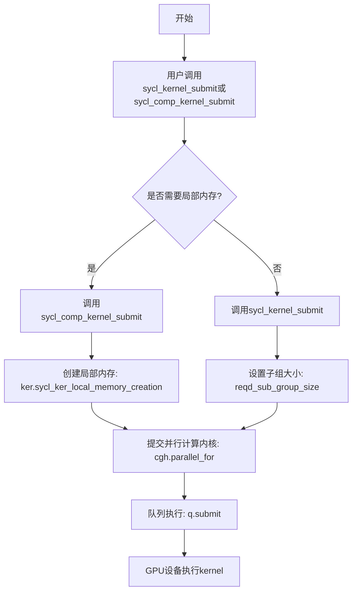
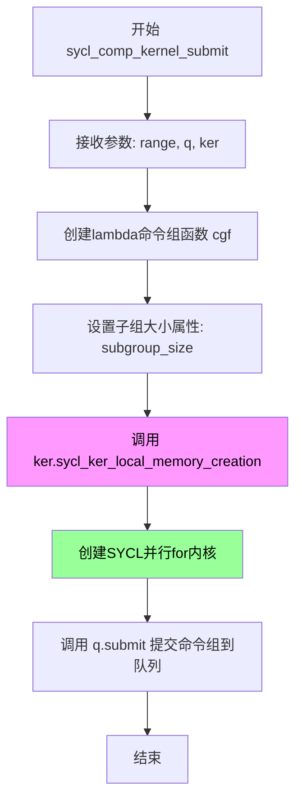
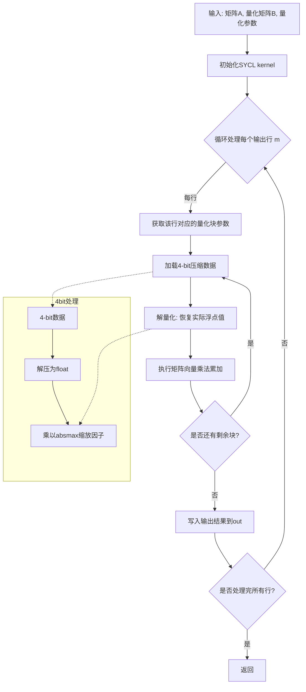

# `bitsandbytes\csrc\xpu_ops.h` 详细设计文档

这是一个SYCL kernel操作头文件，提供了用于在Intel XPU（GPU/加速器）上提交并行计算内核的模板工具函数，支持带有局部内存管理的计算内核提交，以及4-bit量化矩阵向量乘法的声明，用于高效的LLM推理加速。

## 整体流程



## 类结构

```
无类层次结构（纯模板函数库）
└── 模板函数命名空间
    ├── sycl_kernel_submit (SYCL内核提交工具)
    ├── sycl_comp_kernel_submit (带局部内存的SYCL内核提交)
    ├── dequantizeBlockwise (分块反量化)
    └── gemv_4bit_inference (4-bit矩阵向量乘法)
```

## 全局变量及字段


### `ker_t`
    
内核函数类型模板参数，用于指定SYCL内核函数的类型

类型：`template parameter (typename)`
    


### `dim`
    
维度模板参数，指定SYCL ND-range 的维度（1-3）

类型：`template parameter (int)`
    


### `subgroup_size`
    
子组大小模板参数，指定SYCL子组的硬件执行宽度

类型：`template parameter (int)`
    


### `T`
    
数据类型模板参数，用于指定量化计算中使用的数据类型（如int8_t, fp16等）

类型：`template parameter (typename)`
    


### `DATA_TYPE`
    
数据类型标识模板参数，用于标识具体的数据类型种类

类型：`template parameter (int)`
    


### `BITS`
    
位宽模板参数，指定4bit推理中的位宽（如4位量化）

类型：`template parameter (int)`
    


    

## 全局函数及方法


### `sycl_kernel_submit`

**描述**：这是一个 SYCL 内核提交的封装函数（Helper Function）。它是一个模板函数，接收内核执行所需的范围（range）、队列（queue）和内核函数对象（ker）。该函数的核心作用是将特定的内核提交到 SYCL 队列中执行，并通过 C++ 属性 `[[sycl::reqd_sub_group_size]]` 强制指定子组（Subgroup）的大小，这对于优化内存访问模式和满足特定硬件要求至关重要。

**参数**：
- `range`：`sycl::nd_range<dim>`，定义了全局工作项（Global work-items）和本地工作项（Local work-items）的范围。
- `q`：`sycl::queue`，用于提交命令组并控制内核执行的 SYCL 队列。
- `ker`：`ker_t`（模板类型），实际执行的内核函数对象（Lambda 表达式或 Functor）。

**返回值**：`void`。该函数不返回 `sycl::event` 对象，因此调用者无法直接获取内核的完成事件进行后续同步。

#### 流程图

```mermaid
graph TD
    A([调用 sycl_kernel_submit]) --> B[定义 Command Group Lambda <br> cgf]
    B --> C{设置属性}
    C --> D[<code>[[sycl::reqd_sub_group_size(subgroup_size)]]</code>]
    D --> E[调用 cgh.parallel_for<br>绑定 range 和 ker]
    E --> F[调用 q.submit<br>提交 cgf 到队列]
    F --> G([返回])
    
    subgraph "内部执行流程"
    B -.->|捕获| H[sycl::handler &cgh]
    H --> E
    end
```

#### 带注释源码

```cpp
template <typename ker_t, int dim, int subgroup_size>
// 声明为 static inline 以便在头文件中定义并减少调用开销
static inline void sycl_kernel_submit(sycl::nd_range<dim> range, sycl::queue q, ker_t ker) {
    // 1. 定义命令组函数 (Command Group Function)
    //    这是一个 lambda，捕获了 range 和 ker，等待提交到 queue q
    auto cgf = [&](::sycl::handler& cgh)
    // 2. 应用 SYCL 编译时常属性
    //    强制要求编译器/硬件使用大小为 subgroup_size 的子组
                   [[sycl::reqd_sub_group_size(subgroup_size)]] { 
        // 3. 定义并行执行域
        //    使用模板参数 ker_t 作为内核 ID，确保类型唯一性
        cgh.parallel_for<ker_t>(range, ker); 
    };
    
    // 4. 提交执行
    //    将封装好的 command group 提交给队列 q
    q.submit(cgf);
}
```

#### 关键组件信息

- **Command Group Lambda (`cgf`)**: 封装了内核执行逻辑的 lambda 表达式，它是 SYCL 运行时与宿主代码的接口。
- **Handler (`cgh`)**: SYCL 运行时提供的对象，用于在命令组内部设置内核参数、执行模式等。
- **Subgroup Size Attribute**: `[[sycl::reqd_sub_group_size(subgroup_size)]]`，用于显式控制 SIMD/向量化的宽度，对应硬件的子组（warp/wavefront）概念。

#### 潜在的技术债务或优化空间

1.  **缺少事件返回 (Missing Event Handling)**:
    -   当前返回类型为 `void`，未返回 `sycl::event`。在复杂的任务图中，如果后续内核依赖此前内核的结果，需要外部作用域创建 event 进行同步，增加了使用的复杂性和出错风险。
    -   *优化建议*：修改返回类型为 `sycl::event`，并在 `q.submit(cgf)` 后返回该事件。
2.  **缺乏错误处理**:
    -   代码未包含异常捕获逻辑。虽然 SYCL 通常通过异步错误处理（Async Handler）工作，但如果队列构建或提交本身失败，此处无法直接感知。
3.  **属性位置**:
    -   `[[sycl::reqd_sub_group_size]]` 放在 lambda 捕获列表后。在某些旧版编译器或严格模式下，可能需要验证其兼容性。

#### 其它项目

- **设计目标与约束**:
    -   **目标**：简化带有特定子组大小要求的内核提交流程，避免在多处代码中重复编写 `q.submit([&](handler& cgh){...})` 的样板代码。
    -   **约束**：依赖于 `ker_t` 的默认构造和拷贝语义；`dim` 必须与 `sycl::nd_range<dim>` 匹配。
- **错误处理与异常设计**:
    -   依赖于调用者通过 `q.throw_asynchronous()` 或全局的异步处理程序来处理内核执行中的错误。
- **数据流与状态机**:
    -   数据流是单向的：Host (CPU) -> Queue Submit -> Device (GPU) Execution。
    -   该函数是一个“火-and-forget”（提交即返回）的操作，不阻塞 Host 线程。
- **外部依赖与接口契约**:
    -   依赖 `<sycl/sycl.hpp>`。
    -   契约：调用者必须保证 `ker_t` 包含合法的 `operator()` 且与 `range` 维度匹配；`subgroup_size` 必须是硬件支持的子组大小。


### `sycl_comp_kernel_submit`

该函数是SYCL内核提交函数，专为需要局部内存（local memory）创建的内核设计。相比普通的`sycl_kernel_submit`，它在提交内核前会先调用内核对象的`sycl_ker_local_memory_creation`方法，以分配设备端的局部内存资源，然后通过SYCL队列提交并行计算任务到设备执行。

参数：

- `range`：`sycl::nd_range<dim>`，SYCL ND范围，定义内核执行的全局和局部工作项维度
- `q`：`sycl::queue`，SYCL队列，用于将命令组提交到设备执行
- `ker`：`ker_t`，用户定义的内核函数对象，包含内核入口和局部内存创建逻辑

返回值：`void`，无返回值

#### 流程图



#### 带注释源码

```cpp
/**
 * @brief 提交带有局部内存创建的SYCL计算内核
 * 
 * @tparam ker_t 用户定义的内核函数对象类型
 * @tparam dim SYCL内核执行维度 (1-3)
 * @tparam subgroup_size 子组大小，必须为2的幂次
 * @param range SYCL ND范围，指定全局和局部工作项数量
 * @param q SYCL队列，用于提交内核到设备执行
 * @param ker 内核函数对象，包含kernel逻辑和局部内存创建方法
 */
template <typename ker_t, int dim, int subgroup_size>
static inline void sycl_comp_kernel_submit(sycl::nd_range<dim> range, sycl::queue q, ker_t ker) {
    // 定义命令组函数(lambda)，捕获所需的子组大小属性
    auto cgf = [&](::sycl::handler& cgh)
                   [[sycl::reqd_sub_group_size(subgroup_size)]] {  // 声明必需的子组大小
        // 第一步：调用内核对象的局部内存创建方法
        // 此方法会在设备上分配本地内存(accessor或buffer)
        ker.sycl_ker_local_memory_creation(cgh);
        
        // 第二步：提交并行for内核到SYCL handler
        // 使用模板参数ker_t作为内核类型标识
        cgh.parallel_for<ker_t>(range, ker);
    };
    
    // 将命令组提交到SYCL队列，异步执行
    q.submit(cgf);
}
```

#### 关键特性说明

| 特性 | 说明 |
|------|------|
| 局部内存创建 | 通过`ker.sycl_ker_local_memory_creation(cgh)`在内核执行前分配设备本地内存 |
| 子组同步 | 使用`[[sycl::reqd_sub_group_size(subgroup_size)]]`确保子组大小一致性 |
| 异步执行 | `q.submit()`立即返回，内核异步在设备端执行 |
| 模板参数 | `ker_t`用于内核类型标识，`dim`支持1-3维执行，`subgroup_size`指定子组大小 |


### `dequantizeBlockwise`

这是一个模板函数，用于执行分块反量化（Blockwise Dequantization）操作，将量化后的 4bit 数据转换回浮点数格式。该函数是 SYCL kernel 的封装，在 GPU 上并行执行。

参数：

- `code`：`float*`，量化码本或缩放因子数组，用于存储每个量化级别的实际浮点值
- `A`：`unsigned char*`，输入的量化数据指针，包含待反量化的 4bit 压缩数据
- `absmax`：`float*`，每个分块的绝对最大值数组，用于反量化时的缩放
- `out`：`T*`，输出缓冲区指针，存储反量化后的浮点结果
- `workgroup_size`：`int`，SYCL 工作组大小，决定并行计算的线程数
- `n`：`const int`，要处理的数据元素总数
- `stream`：`sycl::queue*`，SYCL 队列指针，用于提交 kernel 到设备执行

返回值：`void`，无返回值，结果通过 `out` 参数输出

#### 流程图

```mermaid
flowchart TD
    A[开始 dequantizeBlockwise] --> B{遍历每个数据块}
    B --> C[获取当前块的 absmax 值]
    C --> D[获取当前块的量化数据 A]
    C --> E[获取对应的 codebook 值]
    D --> F[计算反量化公式: out = code[A[i]] * absmax[block_id]]
    E --> F
    F --> G[写入结果到 out 指针]
    G --> H{是否还有更多数据块?}
    H -->|是| B
    H -->|否| I[结束]
```

#### 带注释源码

```cpp
// 模板函数声明：分块反量化函数
// @tparam T         输出数据类型模板参数（如 float）
// @tparam DATA_TYPE 常量模板参数，指定数据类型（4bit 量化）
template <typename T, int DATA_TYPE>

// 函数签名：执行 blockwise 反量化操作
// @param code         量化码本/缩放因子数组，存储每个量化级别的重建值
// @param A            输入的量化数据（4bit 压缩格式）
// @param absmax       每个分块的绝对最大值，用于反量化缩放
// @param out          输出缓冲区，存储反量化后的浮点结果
// @param workgroup_size 工作组大小，控制并行度
// @param n            要处理的数据元素总数
// @param stream       SYCL 队列，用于 kernel 提交和执行
void dequantizeBlockwise(
    float* code,           // 码本指针
    unsigned char* A,      // 量化输入数据
    float* absmax,         // 块级缩放因子
    T* out,                // 浮点输出
    int workgroup_size,   // 工作组大小
    const int n,           // 元素数量
    sycl::queue* stream    // SYCL 执行队列
);
```


### `gemv_4bit_inference`

4-bit矩阵向量乘法推理函数（模板函数声明），用于在SYCL设备上执行高效的4-bit量化矩阵与向量乘法运算，支持自定义数据类型和量化位数，适用于大语言模型推理中的权重加速计算。

参数：

- `m`：`int`，输出矩阵的行数
- `n`：`int`，输入矩阵的列数（矩阵B的列数）
- `k`：`int`，矩阵乘法内部维度（矩阵A的列数/矩阵B的行数）
- `A`：`T*`，输入矩阵A的指针（未量化）
- `B`：`unsigned char*`，4-bit量化矩阵B的数据指针
- `absmax`：`float*`，量化参数数组，存储每个块的绝对最大值
- `datatype`：`float*`，数据类型指针，可能用于存储量化参数或缩放因子
- `out`：`T*`，输出矩阵C的指针，存储运算结果
- `lda`：`int`，A矩阵的主导维度（leading dimension）
- `ldb`：`int`，B矩阵的主导维度
- `ldc`：`int`，C矩阵的主导维度
- `blocksize`：`int`，块大小，用于分块量化计算
- `stream`：`sycl::queue*`，SYCL队列指针，用于提交计算任务到设备

返回值：`void`，无直接返回值，结果通过`out`参数输出

#### 流程图



#### 带注释源码

```cpp
// 模板函数声明
// T: 输入/输出矩阵的数据类型（如float, half等）
// BITS: 量化位数（固定为4-bit）
template <typename T, int BITS>
void gemv_4bit_inference(
    int m,                      // 输出矩阵行数
    int n,                      // 输入矩阵列数
    int k,                      // 矩阵乘法内部维度
    T* A,                       // 输入矩阵A（未量化）
    unsigned char* B,           // 量化后的矩阵B（4-bit压缩数据）
    float* absmax,             // 量化块的绝对最大值数组
    float* datatype,           // 数据类型参数指针
    T* out,                     // 输出矩阵C
    int lda,                    // A矩阵leading dimension
    int ldb,                    // B矩阵leading dimension
    int ldc,                    // C矩阵leading dimension
    int blocksize,              // 量化块大小
    sycl::queue* stream         // SYCL计算队列
);
```

#### 设计说明

1. **量化方案**：该函数采用blockwise量化方案，每个`blocksize`大小的数据块共享一个`absmax`缩放因子，实现4-bit压缩存储
2. **SYCL并行**：通过`sycl::queue`将计算任务提交到GPU/加速器执行
3. **模板设计**：支持多种数据类型T（如float、bfloat16等），BITS模板参数固定为4
4. **内存布局**：使用lda/ldb/ldc三个leading dimension参数支持行主序和列主序两种布局

#### 潜在技术债务

1. **函数声明不完整**：代码仅为声明，缺少实现源码，无法分析具体算法逻辑
2. **硬编码量化位数**：模板参数BITS虽然存在，但函数内部可能仅支持4-bit，缺乏通用性
3. **参数语义模糊**：`datatype`参数具体用途不明确，注释不足
4. **缺少错误处理**：参数合法性检查（如blocksize是否能整除k）未在声明中体现


## 关键组件


### 张量索引与惰性加载

通过SYCL的nd_range和kernel提交机制实现张量索引，支持惰性加载模式。sycl_kernel_submit和sycl_comp_kernel_submit函数模板接受nd_range<dim>参数，定义kernel的工作项网格，实现GPU上的并行计算和数据分片加载。

### 反量化支持

dequantizeBlockwise函数模板提供块级反量化功能，支持将量化数据（如4-bit、8-bit）转换回浮点数。参数包含code、原始数据A、缩放因子absmax、输出out、工作组大小和SYCL队列。

### 量化策略

gemv_4bit_inference函数实现4位量化矩阵向量乘法推理，使用absmax作为缩放因子，datatype作为数据类型查找表，支持高效的整数运算后接反量化操作，适合大语言模型的推理加速。

### SYCL Kernel提交机制

sycl_kernel_submit提供基础的SYCL kernel提交功能，带有子组大小约束（subgroup_size），通过lambda表达式封装handler和parallel_for。sycl_comp_kernel_submit在此基础上增加了本地内存创建能力（ker.sycl_ker_local_memory_creation），适用于需要共享内存的算法。

### 子组优化

subgroup_size模板参数强制要求特定的子组大小（通过sycl::reqd_sub_group_size属性），确保代码兼容性和性能优化，允许利用子组内的SIMD操作和共享原语。


## 问题及建议


### 已知问题

-   **代码重复**：两个kernel提交函数 `sycl_kernel_submit` 和 `sycl_comp_kernel_submit` 结构几乎相同，仅在是否调用 `ker.sycl_ker_local_memory_creation(cgh)` 上有区别，可通过参数合并
-   **命名不清晰**：`gemv_4bit_inference` 函数中 `float* datatype` 参数命名语义不明（可能应为 `scales` 或 `quants`），且 `sycl_comp_kernel_submit` 中 "comp" 缩写含义不明确
-   **缺乏错误处理**：所有函数均无参数校验、无异常处理、无边界检查，例如未验证 `sycl::queue` 有效性、`n` 参数非负性等
-   **类型安全问题**：大量使用裸指针（`unsigned char* B`、`float* out` 等），未使用智能指针或现代C++内存管理机制
-   **缺少文档**：头文件无任何注释说明，函数参数缺少描述，无法理解 `subgroup_size` 模板参数的约束条件
-   **模板设计问题**：`subgroup_size` 作为模板参数虽保证编译时常量，但会导致大量模板实例化，增加编译时间和二进制体积
-   **依赖不明确**：`#include <common.h>` 来源不明，无法判断是否为项目内部头文件还是第三方依赖
-   **头文件保护不完善**：仅使用 `#ifndef xpu_ops_H`，缺少 `#define xpu_ops_H` 对应的 `#endif` 注释说明
-   **API设计不一致**：`dequantizeBlockwise` 和 `gemv_4bit_inference` 两个函数命名风格和参数顺序不统一

### 优化建议

-   **消除重复代码**：将两个kernel提交函数合并为单一函数，添加布尔参数或使用策略模式区分是否需要创建local memory
-   **改进命名规范**：使用完整单词（如 `compute` 代替 `comp`），明确参数语义（如 `scales` 代替 `datatype`）
-   **添加参数校验**：在函数入口添加 assert 或显式检查，确保 queue 有效、维度合理、指针非空等
-   **引入智能指针**：考虑使用 `sycl::buffer` 或 `sycl::usm` 智能封装替代裸指针，或在文档中明确内存所有权
-   **补充文档注释**：为每个函数添加 Doxygen 风格注释，说明模板参数、返回值、异常行为
-   **优化模板使用**：将 `subgroup_size` 改为运行时参数（如果SYCL支持），或使用 `std::integral_constant` 提供编译时验证
-   **统一函数接口**：重构两个导出函数使其参数顺序、命名风格保持一致
-   **添加错误回调**：为异步kernel执行添加错误处理机制，例如通过 `q.throw_asynchronous()` 或自定义回调


## 其它


### 设计目标与约束

本模块旨在提供SYCL内核提交的统一抽象，简化GPU计算任务的提交过程。设计目标包括：1）通过模板参数支持不同维度和子组大小的内核提交；2）提供带有本地内存创建功能的内核提交变体；3）支持4位量化GEMV推理和块级反量化操作。约束条件包括：仅支持SYCL兼容设备、需要支持reqd_sub_group_size属性的编译器。

### 错误处理与异常设计

代码中未包含显式的错误处理机制，但使用了assert宏进行调试断言。建议添加：1）参数有效性检查（如range维度验证、队列空指针检查）；2）SYCL异常捕获（通过try-catch块处理async_handler）；3）内核执行失败的错误码返回机制。

### 数据流与状态机

数据流遵循：主机端准备数据 → 创建SYCL队列 → 定义内核范围 → 提交内核 → 同步等待。无复杂状态机，主要状态为"待提交"→"执行中"→"已完成"。

### 外部依赖与接口契约

核心依赖：1）SYCL头文件（sycl/sycl.hpp）；2）common.h和cstdint等基础库。接口契约：队列参数不能为空；子组大小必须是2的幂且在设备支持范围内；内核函数必须符合SYCL内核函数签名要求。

### 性能考虑与优化建议

1）使用subgroup可实现更高效的同步和数据交换；2）本地内存创建接口允许显式管理共享内存；3）建议添加预编译选项以支持不同硬件平台；4）可考虑添加内核融合优化支持。

### 线程模型与并发设计

基于SYCL的层次化并行模型：使用nd_range定义N维计算空间，通过workgroup和subgroup组织线程协作。反量化和GEMV操作本质上是数据并行的，块级处理可有效利用GPU并行能力。

### 内存模型与数据布局

A矩阵采用行优先存储（B为4位压缩存储），absmax存储每块的绝对最大值用于反量化还原。输出矩阵out采用与输入兼容的布局。关键设计决策：4位量化使用块级缩放因子。

### 编译时与运行时要求

编译时要求：1）C++17标准；2）SYCL实现支持（Intel DPC++、AdaptiveCpp等）。运行时要求：1）支持OpenCL或Level Zero后端；2）设备内存充足；3）正确的设备选择。

### 测试策略建议

1）单元测试：验证不同维度、亚组大小的内核提交；2）集成测试：完整的GEMV推理流程验证；3）性能基准：对比不同配置的执行时间；4）兼容性测试：跨不同SYCL实现。

### 版本兼容性说明

当前代码未使用版本宏，建议添加：1）SYCL版本检测；2）编译器特性检测；3）API弃用警告处理。保持与SYCL 2020规范的兼容性。

### 安全考虑

当前代码缺少输入验证，存在潜在风险：1）空指针解引用（队列和数组）；2）整数溢出（计算workgroup数量时）；3）内存访问越界（ldc参数校验）。


    