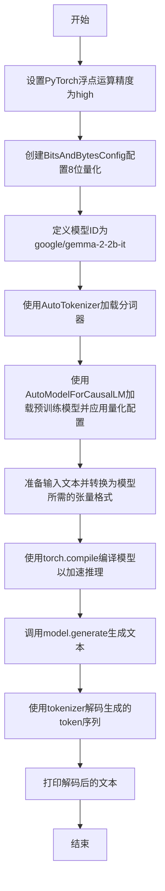

# `bitsandbytes\examples\compile_inference.py` 详细设计文档

该脚本是一个基于PyTorch和Transformers库的推理流程，用于加载预训练的因果语言模型（如Gemma-2-2b-it），配置8位量化以减少内存占用，使用torch.compile优化推理性能，并根据输入文本生成相应的续写内容。

## 整体流程



## 类结构

```
该脚本无自定义类定义，所有操作均基于torch和transformers库的函数与类。
```

## 全局变量及字段


### `quantization_config`
    
配置模型量化参数，用于将模型权重加载为8位精度以减少显存占用

类型：`BitsAndBytesConfig`
    


### `model_id`
    
预训练模型的标识符，指定要加载的模型路径或HuggingFace Hub上的模型名称

类型：`str`
    


### `tokenizer`
    
分词器，用于将文本转换为模型可处理的token序列，并将输出token解码为文本

类型：`AutoTokenizer`
    


### `model`
    
因果语言模型对象，经过量化配置和torch.compile编译后用于文本生成

类型：`AutoModelForCausalLM`
    


### `input_text`
    
用户输入的提示文本，作为模型生成内容的起点

类型：`str`
    


### `input_ids`
    
分词后的输入token张量，已移至模型所在设备

类型：`torch.Tensor`
    


### `outputs`
    
模型生成的token序列张量，包含max_new_tokens数量的新生成token

类型：`torch.Tensor`
    


    

## 全局函数及方法


## 关键组件


### 量化配置 (Quantization Configuration)

使用BitsAndBytesConfig设置8位量化加载，显著降低显存占用并加速推理

### 模型加载器 (Model Loader)

通过AutoModelForCausalLM.from_pretrained从预训练模型ID加载因果语言模型，支持量化配置、设备映射和数据类型指定

### 分词器 (Tokenizer)

使用AutoTokenizer从预训练模型加载分词器，将输入文本转换为模型可处理的张量格式

### 模型编译器 (Model Compiler)

使用torch.compile对模型进行JIT编译优化，提升推理性能

### 生成器 (Text Generator)

调用model.generate方法基于输入ids生成新的token序列，支持max_new_tokens参数控制生成长度

### 设备管理 (Device Management)

通过device_map="auto"实现模型层在可用设备（CPU/GPU）间的自动分配

### 数据类型转换 (dtype Conversion)

指定torch.bfloat16精度，在保持推理质量的同时减少内存占用

### 张量设备迁移 (Tensor Device Migration)

使用.to(model.device)将输入张量迁移到模型所在设备，确保计算一致性


## 问题及建议


### 已知问题

- **硬编码的模型ID**：model_id直接写在代码中（"google/gemma-2-2b-it"），缺乏灵活性，不便于在不同环境间切换
- **量化配置冲突**：BitsAndBytesConfig配置了load_in_8bit=True，但同时指定了torch_dtype=torch.bfloat16，8位量化与bfloat16类型同时使用存在逻辑矛盾，可能导致非预期的模型加载行为
- **被注释的动态图配置**：多处torch._dynamo相关配置被注释掉（包括suppress_errors和capture_dynamic_output_shape_ops），代码处于试验状态，缺乏完整的优化策略
- **缺少错误处理**：整个推理流程（模型加载、tokenization、生成）没有任何异常捕获机制，程序可能在运行时直接崩溃
- **无输入验证**：input_text没有长度校验，tokenizer返回的input_ids也没有边界检查，可能导致OOM或意外行为
- **未指定设备**：虽然使用了device_map="auto"，但没有显式检查模型实际加载到的设备，无法确保在GPU上运行
- **缺少资源清理**：模型和tokenizer使用后没有显式的内存释放或清理操作

### 优化建议

- 将model_id改为环境变量或配置文件读取，添加备选模型（如注释中的Qwen2.5-7B）的动态切换机制
- 统一量化与数据类型的配置策略，如需8位量化则移除torch_dtype参数，或考虑使用4位量化（load_in_4bit）以获得更好的内存效率
- 清理被注释的配置代码，或明确注释说明为何关闭这些优化选项；建议启用capture_dynamic_output_shape_ops以支持动态输出形状
- 添加完整的try-except错误处理链，分别捕获模型加载、tokenization、推理阶段的异常并给出友好错误信息
- 添加输入文本长度限制和max_length参数校验，防止极端输入导致内存溢出
- 在推理前添加设备检查（model.device），确保在CUDA可用时使用GPU运行
- 使用torch.cuda.empty_cache()或上下文管理器确保GPU内存及时释放；对于长期运行的服务，考虑实现模型缓存和生命周期管理

## 其它


### 设计目标与约束

本代码的设计目标是在消费级GPU上高效运行大语言模型推理，通过8位量化减少内存占用，使用torch.compile进行性能优化。约束条件包括：需要支持CUDA的GPU设备、模型大小受限于GPU显存（gemma-2-2b-it约4GB，Qwen2.5-7B约14GB）、依赖PyTorch 2.0+和transformers库。

### 错误处理与异常设计

代码中未包含显式的错误处理机制。潜在异常包括：模型下载失败、GPU内存不足、CUDA不可用、tokenizer加载失败。建议添加异常捕获处理网络超时、磁盘空间不足、模型兼容性检查等场景。

### 数据流与状态机

数据流：输入文本 → Tokenizer编码 → 张量移至GPU → 模型前向传播 → 生成token采样 → Tokenizer解码 → 输出文本。状态机转换：初始化状态 → 模型加载状态 → 编译优化状态 → 推理执行状态 → 结果返回状态。

### 外部依赖与接口契约

核心依赖：torch>=2.0.0、transformers>=4.30.0、bitsandbytes>=0.41.0。接口契约：tokenizer需实现encode/decode方法，模型需支持generate方法，device_map自动映射需保证CUDA可用。模型来源：HuggingFace Hub，需网络访问权限。

### 性能考量

主要性能瓶颈：首次加载模型、首次编译、生成推理。优化策略：8位量化减少70%内存、torch.compile提升30-50%推理速度、bfloat16精度平衡性能与准确率。建议：预热推理、批处理优化、kv-cache启用。

### 安全性考虑

模型来源可信度评估、输入文本 sanitizer（防止提示注入）、输出内容过滤（可选）、模型权重安全存储、敏感信息不记录日志。建议添加输入长度限制防止DoS。

### 配置管理

硬编码配置项：model_id、quantization_config、torch_dtype、max_new_tokens。建议外部化配置：模型选择、量化参数、生成参数、设备配置。环境变量支持：HF_HOME、TRANSFORMERS_CACHE、CUDA_VISIBLE_DEVICES。

### 资源管理

GPU显存管理：8位量化约需3GB显存、bfloat16需5GB+、编译缓存约1-2GB。内存释放：模型卸载、编译缓存清理。资源监控：nvidia-smi集成、显存预警。

### 兼容性说明

CUDA版本要求：11.8+或12.1+。Python版本：3.8+。操作系统：Linux/macOS/Windows WSL2。Transformers版本兼容性：4.30.0+适配BitsAndBytesConfig。PyTorch版本兼容性：2.0+适配torch.compile。

### 使用示例与扩展

基本用法：替换input_text为任意提示、调整max_new_tokens控制生成长度。高级用法：流式输出、批量推理、自定义采样参数、系统提示工程、对话历史管理。扩展方向：多模型切换、LoRA微调集成、vLLM后端替换、OpenAI API兼容。

    