# `bitsandbytes\examples\int8_inference_huggingface.py` 详细设计文档

该代码实现了一个基于Meta Llama-2-7b-hf大语言模型的文本生成推理流程，通过transformers库加载预训练模型和分词器，利用PyTorch和CUDA进行GPU加速推理，并配置了8位量化以优化显存占用，最终根据输入文本生成对应的回复。

## 整体流程

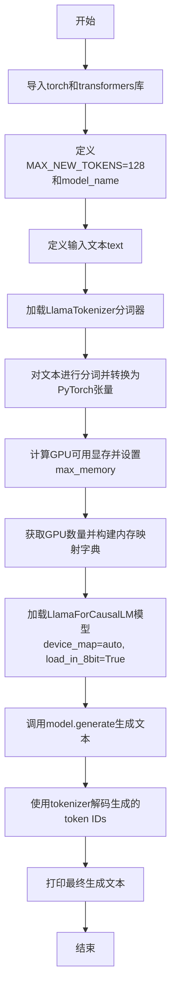

## 类结构

```
该代码为脚本式代码，无自定义类层次结构
直接使用transformers库提供的预定义类：
LlamaTokenizer (分词器类)
LlamaForCausalLM (语言模型类)
注：from_pretrained为类方法，generate为实例方法
```

## 全局变量及字段


### `MAX_NEW_TOKENS`
    
生成token的最大数量

类型：`int`
    


### `model_name`
    
预训练模型名称或路径

类型：`str`
    


### `text`
    
输入的提示文本

类型：`str`
    


### `input_ids`
    
分词后的输入token张量

类型：`Tensor`
    


### `max_memory`
    
GPU显存配置

类型：`str/int`
    


### `n_gpus`
    
可用GPU数量

类型：`int`
    


### `generated_ids`
    
模型生成的token IDs

类型：`Tensor`
    


### `LlamaTokenizer.LlamaTokenizer`
    
无直接暴露的类字段

类型：`class`
    


### `LlamaForCausalLM.LlamaForCausalLM`
    
无直接暴露的类字段

类型：`class`
    


### `LlamaTokenizer.from_pretrained`
    
从预训练模型加载分词器

类型：`classmethod`
    


### `LlamaTokenizer.decode`
    
将token IDs解码为文本字符串

类型：`instancemethod`
    


### `LlamaForCausalLM.from_pretrained`
    
从预训练模型加载因果语言模型

类型：`classmethod`
    


### `LlamaForCausalLM.generate`
    
根据输入token IDs生成新的token序列

类型：`instancemethod`
    
    

## 全局函数及方法


### `LlamaTokenizer.from_pretrained()`

该函数是 Hugging Face Transformers 库中 `LlamaTokenizer` 类的类方法（静态方法），用于从预训练模型加载分词器配置和词表文件，初始化一个与指定预训练模型配套的分词器实例，以便对文本进行编码和解码操作。

参数：

- `pretrained_model_name_or_path`：`str`，预训练模型的名称（如 "meta-llama/Llama-2-7b-hf"）或本地模型目录的路径

返回值：`LlamaTokenizer`，返回一个初始化好的 LlamaTokenizer 分词器对象，可用于对文本进行 tokenize 编码和 decode 解码操作

#### 流程图

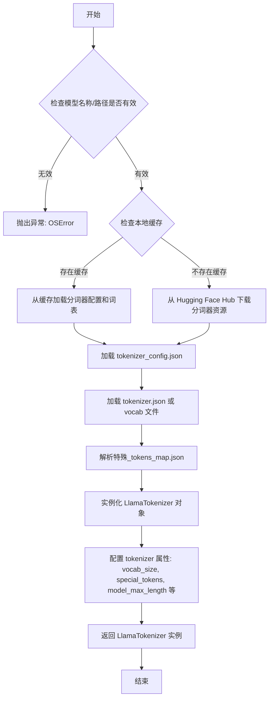

#### 带注释源码

```python
# transformers/tokenization_utils_base.py 中的核心逻辑
@classmethod
def from_pretrained(cls, pretrained_model_name_or_path, *args, **kwargs):
    """
    从预训练模型加载分词器
    
    参数:
        pretrained_model_name_or_path (str): 
            - Hugging Face Hub 上的模型名称 (如 "meta-llama/Llama-2-7b-hf")
            - 本地模型目录的路径
            
    返回值:
        PreTrainedTokenizer: 加载好的分词器实例
    """
    
    # 1. 解析参数
    cache_dir = kwargs.get('cache_dir', None)
    force_download = kwargs.get('force_download', False)
    proxies = kwargs.get('proxies', None)
    resume_download = kwargs.get('resume_download', True)
    use_auth_token = kwargs.get('use_auth_token', None)
    revision = kwargs.get('revision', 'main')
    
    # 2. 加载 tokenizer 配置文件 (tokenizer_config.json)
    #    包含: model_type, vocab_size, special_tokens, tokenizer_class 等
    pretrained_config_archive_file = resolved_vision_files(
        pretrained_model_name_or_path, 
        tokenizer_config_file,
        cache_dir=cache_dir,
        force_download=force_download,
        proxies=proxies,
        resume_download=resume_download,
        use_auth_token=use_auth_token,
        revision=revision,
    )
    
    # 3. 加载 tokenizer.json (新格式) 或 vocab.json + merges.txt (旧格式)
    #    - tokenizer.json: 包含完整的词表和 token 到 id 的映射
    #    - vocab.json: 词表文件
    #    - merges.txt: BPE 合并规则 (用于 Llama 的 BPE 分词)
    
    # 4. 加载 special_tokens_map.json
    #    定义特殊 token: <s>, </s>, <unk>, <pad> 等
    
    # 5. 读取 added_tokens.json (如果有)
    #    定义模型额外添加的 token
    
    # 6. 实例化分词器对象
    #    根据 tokenizer_config.json 中的 tokenizer_class 字段
    #    确定要实例化的具体类 (LlamaTokenizer)
    tokenizer = cls(tokenizer_json_path=tokenizer_json_file, **tokenizer_config)
    
    # 7. 验证和配置
    #    - 设置 bos_token, eos_token, pad_token 等
    #    - 配置 model_max_length (通常为 4096 for Llama-2)
    
    return tokenizer
```

#### 实际调用示例

```python
# 代码中实际使用方式
model_name = "meta-llama/Llama-2-7b-hf"  # Hugging Face Hub 模型名称

# 调用 from_pretrained 加载分词器
tokenizer = LlamaTokenizer.from_pretrained(model_name)
# 等价于:
# tokenizer = LlamaTokenizer.from_pretrained(
#     pretrained_model_name_or_path="meta-llama/Llama-2-7b-hf"
# )

# 加载后即可使用
input_ids = tokenizer(text, return_tensors="pt").input_ids
```


### `LlamaForCausalLM.from_pretrained()`

该方法是Hugging Face Transformers库中`LlamaForCausalLM`类的类方法，用于从预训练模型仓库或本地路径加载Llama因果语言模型，并支持自动设备映射和量化加速。

参数：

- `model_name`：`str`，模型标识符（如"meta-llama/Llama-2-7b-hf"）或本地模型路径
- `device_map`：`str`或`dict`，设备映射策略，"auto"表示自动将模型层分配到可用设备
- `load_in_8bit`：`bool`，是否使用8bit量化加载模型以减少显存占用
- `max_memory`：`dict`，指定每个设备的最大内存限制，键为设备索引，值为内存大小字符串

返回值：`LlamaForCausalLM`，加载并配置好的Llama因果语言模型实例，可直接用于推理

#### 流程图

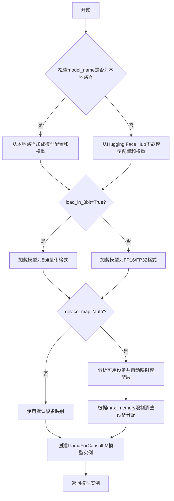

#### 带注释源码

```python
# 从transformers库导入LlamaForCausalLM类和LlamaTokenizer类
from transformers import LlamaForCausalLM, LlamaTokenizer
import torch

# 定义模型名称（使用Hugging Face Hub上的Llama-2-7b-hf模型）
model_name = "meta-llama/Llama-2-7b-hf"

# 从预训练仓库加载分词器
# 参数: model_name - 模型标识符
# 返回值: LlamaTokenizer实例
tokenizer = LlamaTokenizer.from_pretrained(model_name)

# 对输入文本进行分词，转换为PyTorch张量
# 参数: text - 输入文本, return_tensors="pt" - 返回PyTorch张量
# 返回值: 包含input_ids的字典
text = "Hamburg is in which country?\n"
input_ids = tokenizer(text, return_tensors="pt").input_ids

# 计算可用GPU内存，减去2GB作为安全余量
# torch.cuda.mem_get_info()返回(已用内存, 总内存)的元组
max_memory = f"{int(torch.cuda.mem_get_info()[0] / 1024**3) - 2}GB"

# 获取GPU数量，为每个GPU设置相同的最大内存限制
n_gpus = torch.cuda.device_count()
max_memory = {i: max_memory for i in range(n_gpus)}

# 核心方法调用：从预训练模型加载LlamaForCausalLM模型
# 参数说明:
#   model_name: "meta-llama/Llama-2-7b-hf" - Hugging Face模型ID
#   device_map: "auto" - 自动将模型层分布到多个GPU/CPU
#   load_in_8bit: True - 启用8bit量化以降低显存占用
#   max_memory: {0: "XG", 1: "XG", ...} - 每个GPU的最大内存限制
# 返回值: 加载完成的LlamaForCausalLM模型对象
model = LlamaForCausalLM.from_pretrained(
    model_name,
    device_map="auto",
    load_in_8bit=True,
    max_memory=max_memory
)

# 使用模型生成文本
# 参数: input_ids - 分词后的输入张量, max_length - 生成的最大token数
# 返回值: 生成的token ID序列
generated_ids = model.generate(input_ids, max_length=MAX_NEW_TOKENS)

# 将生成的token ID解码为人类可读文本
# 参数: generated_ids[0] - 第一个样本的token序列, skip_special_tokens=True - 跳过特殊token
# 返回值: 解码后的字符串
print(tokenizer.decode(generated_ids[0], skip_special_tokens=True))
```


### `LlamaForCausalLM.generate()`

这是 Hugging Face Transformers 库中 `LlamaForCausalLM` 类的文本生成方法，用于根据输入的 token 序列执行自回归语言模型推理，生成后续的文本内容。该方法内部实现了多种解码策略（如贪心搜索、束搜索、采样等），通过循环调用模型的 forward 方法逐步生成下一个 token，直至达到指定的最大长度或遇到序列结束标记。

参数：

- `input_ids`：`torch.Tensor`，形状为 `(batch_size, sequence_length)` 的输入 token ID 序列，是模型进行推理的上下文条件
- `max_length`：`int`，生成序列的最大长度（包含输入序列），控制生成文本的总长度上限
- `max_new_tokens`：`int`（可选），指定生成的新 token 数量，与 `max_length` 二选一使用
- `temperature`：`float`（可选），用于控制采样多样性的温度参数，值越小生成越确定性，值越大越随机
- `top_p`：`float`（可选），核采样参数，只考虑累积概率超过 top_p 的最高概率 token
- `top_k`：`int`（可选），限制采样时考虑的最多 token 数量
- `num_beams`：`int`（可选），束搜索的束宽，设置为 1 时使用贪心搜索
- `do_sample`：`bool`（可选），是否使用采样策略，设置为 False 时使用贪心/束搜索
- `pad_token_id`：`int`（可选），填充 token 的 ID，用于处理批次中不同长度序列
- `eos_token_id`：`int`（可选），序列结束标记的 ID，遇到该 token 时停止生成

返回值：`torch.Tensor`，形状为 `(batch_size, generated_length)` 的生成的 token ID 序列，其中包含输入序列和模型新生成的 token

#### 流程图

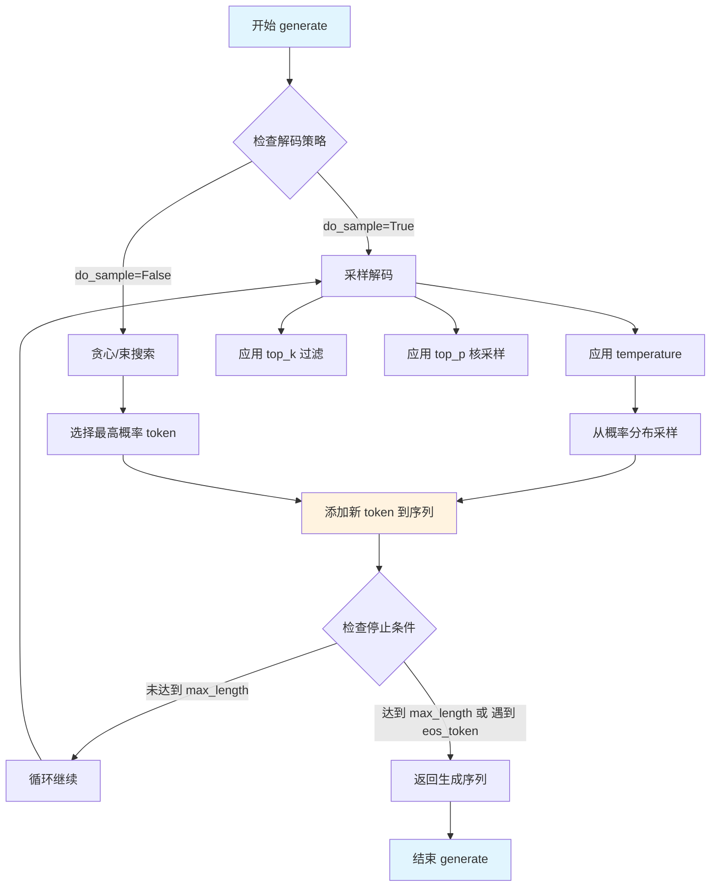

#### 带注释源码

```python
# 定义最大新 token 数量
MAX_NEW_TOKENS = 128

# 模型名称（Meta 的 LLaMA-2 7B 参数模型）
model_name = "meta-llama/Llama-2-7b-hf"

# 待处理的输入文本
text = "Hamburg is in which country?\n"

# 初始化分词器，将文本转换为 token ID 序列
tokenizer = LlamaTokenizer.from_pretrained(model_name)

# 使用分词器将文本编码为 PyTorch 张量
# return_tensors="pt" 指定返回 PyTorch 格式的张量
input_ids = tokenizer(text, return_tensors="pt").input_ids
# 此时的 input_ids 形状为 (1, sequence_length)，类型为 torch.Tensor

# 计算可用 GPU 内存（以 GB 为单位），预留 2GB 给其他操作
max_memory = f"{int(torch.cuda.mem_get_info()[0] / 1024**3) - 2}GB"

# 获取系统中可用的 GPU 数量
n_gpus = torch.cuda.device_count()

# 为每个 GPU 分配相同的最大内存限制（用于模型并行）
max_memory = {i: max_memory for i in range(n_gpus)}

# 加载预训练的 LLaMA 因果语言模型
# device_map="auto" 自动将模型层分配到多个设备
# load_in_8bit=True 启用 8-bit 量化以减少显存占用
# max_memory 指定每张 GPU 的最大内存使用量
model = LlamaForCausalLM.from_pretrained(
    model_name,
    device_map="auto",
    load_in_8bit=True,
    max_memory=max_memory
)

# 执行自回归文本生成
# 参数 input_ids: 形状为 (batch_size, seq_len) 的输入 token ID
# 参数 max_length: 生成序列的最大总长度（包含输入）
generated_ids = model.generate(
    input_ids,
    max_length=MAX_NEW_TOKENS
)
# 返回值 generated_ids 形状为 (1, generated_seq_len)
# 包含原始输入 token 和新生成的 token

# 将生成的 token ID 解码为可读文本
# skip_special_tokens=True 跳过特殊 token（如 pad、eos 等）
print(tokenizer.decode(generated_ids[0], skip_special_tokens=True))
# 输出示例: "Hamburg is in which country?\n Germany."
```


### `LlamaTokenizer.decode()`

将模型生成的token IDs序列解码为可读的文本字符串，是NLP推理流程中最后一步，将数值化的模型输出转换回人类可理解的语言。

参数：

- `token_ids`：`List[int]` 或 `torch.Tensor`，需要解码的token ID序列（这里是`generated_ids[0]`，模型生成的token列表）
- `skip_special_tokens`：`bool`，可选参数，是否跳过特殊token（如padding、bos、eos等），这里传入`True`以获得干净的文本输出
- `clean_up_tokenization_spaces`：`bool`，可选参数，是否清理tokenization添加的空格，默认为`True`
- `errors`：`str`，可选参数，编码错误处理策略，默认为`replace`

返回值：`str`，解码后的文本字符串，去除了特殊token的可读文本内容

#### 流程图

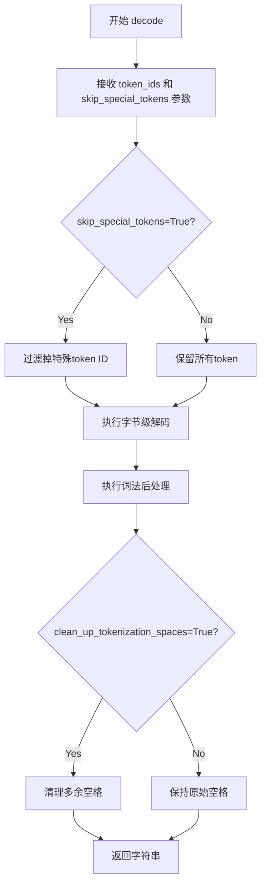

#### 带注释源码

```python
# tokenizer.decode() 是 transformers 库中 Tokenizer 类的核心方法
# 在 LlamaTokenizer 中继承自 PreTrainedTokenizer 类

# 调用示例：
# print(tokenizer.decode(generated_ids[0], skip_special_tokens=True))

# 方法内部执行流程：

def decode(self, token_ids, skip_special_tokens=False, ...):
    """
    将token IDs转换为文本字符串
    
    参数:
        token_ids: 模型输出的token ID列表
            - 示例: generated_ids[0] 包含 [1, 1234, 5678, 2, ...]
        skip_special_tokens: 是否跳过特殊token
            - True: 移除 <s>, </s>, <pad> 等特殊标记
            - False: 保留所有token
    
    处理步骤:
    1. 首先通过 self.convert_ids_to_tokens() 将IDs转为token字符串
    2. 然后调用 self.convert_tokens_to_string() 进行字节级解码
    3. 最后执行后处理：清理特殊空格、处理特殊字符等
    
    返回:
        字符串形式的自然语言文本
    """
    
    # 步骤1: ID转Token
    tokens = self.convert_ids_to_tokens(token_ids)
    
    # 步骤2: Token转字符串（核心解码逻辑）
    # 包含子词拼接、字节解码、Unicode规范化等
    text = self.convert_tokens_to_string(tokens)
    
    # 步骤3: 后处理
    if skip_special_tokens:
        # 清理特殊token对应的字符串片段
        text = self.clean_up_tokenization(text)
    
    return text
```

#### 在实际代码中的调用上下文

```python
# 完整调用链解析
generated_ids = model.generate(input_ids, max_length=MAX_NEW_TOKENS)
# generated_ids: tensor([[1, 1234, 5678, 2, ...]])  # 模型输出的token ID序列

# 解码：将数值化的模型输出转换为人类可读文本
output_text = tokenizer.decode(generated_ids[0], skip_special_tokens=True)
# output_text: "Hamburg is in Germany."  # 最终可读文本

print(output_text)
```


### `torch.cuda.mem_get_info`

获取当前 GPU 设备的显存信息，返回当前可用显存和总显存容量。该函数是 PyTorch CUDA 内存管理模块的核心接口之一，常用于在加载大型模型前评估设备剩余内存容量，以便进行内存规划和模型分片策略的制定。

参数：此函数无参数。

返回值：`Tuple[int, int]`，返回一个元组 `(free, total)`：
- `free`：`int`，当前 GPU 上可用的空闲显存大小，单位为字节
- `total`：`int`，当前 GPU 上总共的显存大小，单位为字节

#### 流程图

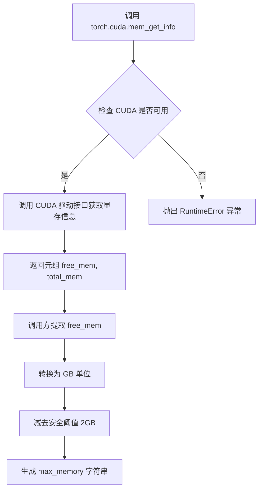

#### 带注释源码

```python
# 代码上下文分析：
# 这段代码来自模型加载前的内存计算逻辑

# 调用 torch.cuda.mem_get_info() 获取显存信息
# 返回值: (free_memory_in_bytes, total_memory_in_bytes)
mem_info = torch.cuda.mem_get_info()

# 提取第一个元素：空闲显存（字节）
free_mem_bytes = mem_info[0]

# 将字节转换为 GB：除以 1024**3 (即 1024*1024*1024)
free_mem_gb = free_mem_bytes / 1024**3

# 减去 2GB 作为安全阈值，防止 OOM
available_mem_gb = int(free_mem_gb - 2)

# 格式化为字符串，如 "10GB"
max_memory = f"{available_mem_gb}GB"

# 示例输出：假设空闲显存 16GB，输出为 "14GB"
```


### `torch.cuda.device_count`

该函数是PyTorch CUDA模块的核心方法，用于查询当前系统中可用的NVIDIA GPU设备数量，以便在多GPU环境下进行模型并行加载和内存分配。

参数：

- （无参数）

返回值：`int`，返回系统中可用的GPU设备数量。如果CUDA不可用或未检测到GPU，则返回0。

#### 流程图

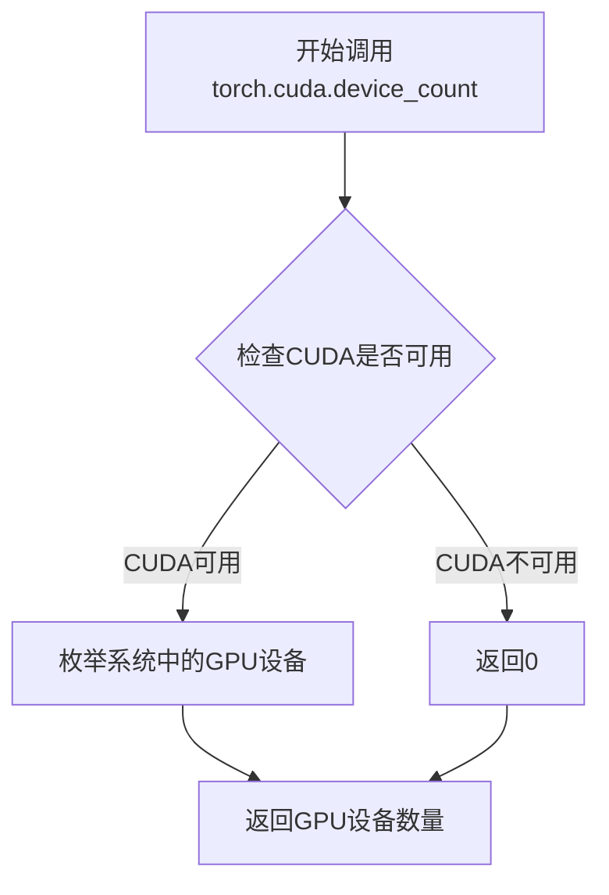

#### 带注释源码

```python
# torch.cuda.device_count() 函数的调用示例
# 该函数位于 torch.cuda 模块中，无需任何参数

# 获取系统中可用的GPU数量
n_gpus = torch.cuda.device_count()

# 打印GPU数量供调试确认
print(f"Available GPUs: {n_gpus}")

# 利用返回的GPU数量构建max_memory字典
# 为每个GPU分配相同的可用内存（总内存减去2GB）
max_memory = {i: max_memory for i in range(n_gpus)}

# 后续可用于 model.from_pretrained 的 max_memory 参数
# 实现自动模型并行分发
```

#### 上下文使用场景

在提供的代码中，`torch.cuda.device_count()` 的返回值被用于：

1. **多GPU内存分配策略**：构建 `max_memory` 字典，为每个GPU分配相同的可用内存
2. **模型并行加载**：结合 `device_map="auto"` 参数，实现模型在多GPU间的自动分发
3. **动态资源配置**：使模型能够根据实际硬件情况动态调整部署策略


### `LlamaTokenizer.from_pretrained`

该方法是 Hugging Face Transformers 库中 `LlamaTokenizer` 类的类方法，用于从预训练模型或本地路径加载预训练的分词器（Tokenizer），将文本转换为模型可处理的 token 序列，是使用预训练语言模型进行推理的标准初始化步骤。

参数：

- `pretrained_model_name_or_path`：`str`，模型名称（如 "meta-llama/Llama-2-7b-hf"）或本地模型路径，指定要加载的分词器来源
- `cache_dir`：`Optional[str]`，可选参数，指定缓存目录路径
- `force_download`：`Optional[bool]`，可选参数，是否强制重新下载模型
- `resume_download`：`Optional[bool]`，可选参数，是否恢复中断的下载
- `proxies`：`Optional[Dict]`，可选参数，代理服务器配置
- `use_auth_token`：`Optional[str]`，可选参数，Hugging Face 认证令牌
- `revision`：`Optional[str]`，可选参数，模型版本分支或提交哈希
- `local_files_only`：`Optional[bool]`，可选参数，是否仅使用本地文件

返回值：`LlamaTokenizer`，返回一个配置好的分词器对象，包含词汇表、编码方法、解码方法等，可将文本映射为 input_ids 或将 token 映射回文本。

#### 流程图

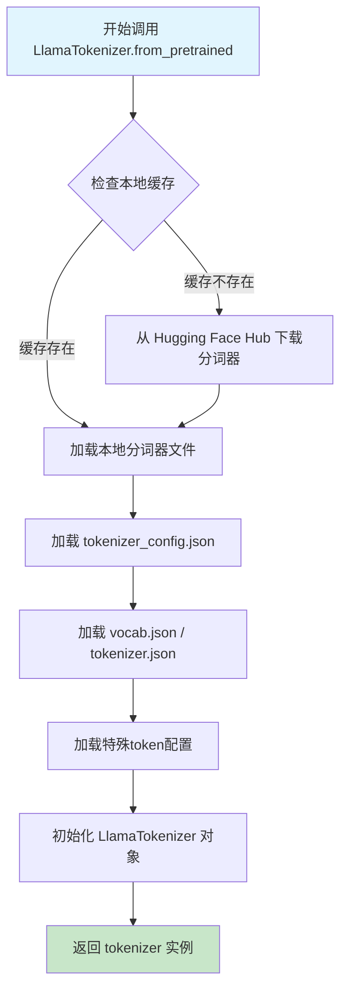

#### 带注释源码

```python
# 从预训练模型加载分词器的调用示例
# LlamaTokenizer.from_pretrained 方法的实现逻辑概述

tokenizer = LlamaTokenizer.from_pretrained(
    pretrained_model_name_or_path="meta-llama/Llama-2-7b-hf",
    # 上面这行代码内部执行以下操作：
    # 1. 检查指定路径或Hugging Face Hub上是否存在分词器文件
    # 2. 下载 tokenizer_config.json 包含特殊token、添加的符号等配置
    # 3. 下载并解析词汇表文件（vocab.json 或 tokenizer.json）
    # 4. 加载 tokenizer.json（如果存在）包含完整的分词规则
    # 5. 初始化基类 PreTrainedTokenizer 的配置
    # 6. 返回配置好的 LlamaTokenizer 实例
    
    # 后续使用：
    # input_ids = tokenizer(text, return_tensors="pt").input_ids
    # 将文本 "Hamburg is in which country?" 转换为 PyTorch 张量
)
```


### `LlamaTokenizer.decode`

该方法是 LlamaTokenizer 类的实例方法，继承自 PreTrainedTokenizer，用于将模型生成的 token ID 序列（PyTorch Tensor 或 Python List）转换回人类可读的文本字符串，同时可选择是否跳过特殊标记（如 padding、eos 等），是 NLP 推理流程中从模型输出到最终文本的关键转换环节。

参数：

- `token_ids`：`torch.Tensor` 或 `List[int]`，需要解码的 token ID 序列，通常来自模型生成的 `generated_ids`
- `skip_special_tokens`：`bool`，可选参数，默认为 `False`，是否在解码时跳过特殊 token（如 `<pad>`、`</s>` 等）
- `clean_up_tokenization_spaces`：`bool`，可选参数，默认为 `True`，是否清理 tokenization 过程中产生的多余空格
- `decode_unicode`：`str`，可选参数，默认为 `"replace"`，控制 Unicode 解码方式

返回值：`str`，解码后的文本字符串

#### 流程图

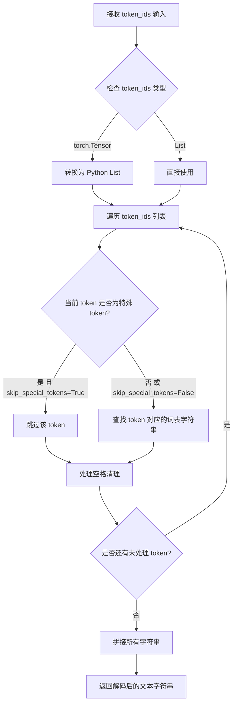

#### 带注释源码

```python
# 定义最大新生成 token 数量
MAX_NEW_TOKENS = 128
# 指定预训练模型名称（Meta 的 LLaMA-2 7B）
model_name = "meta-llama/Llama-2-7b-hf"

# 待处理的输入文本
text = "Hamburg is in which country?\n"

# ========== 关键调用点：LlamaTokenizer.decode 实例方法 ==========
# 从预训练模型加载 LLaMA 分词器
tokenizer = LlamaTokenizer.from_pretrained(model_name)

# 使用分词器将文本转换为 token ID 张量（PyTorch 格式）
input_ids = tokenizer(text, return_tensors="pt").input_ids

# 获取 GPU 显存信息，计算可用内存（单位：GB）
max_memory = f"{int(torch.cuda.mem_get_info()[0] / 1024**3) - 2}GB"

# 计算当前系统 GPU 数量
n_gpus = torch.cuda.device_count()
# 构建 max_memory 字典，为每个 GPU 分配内存
max_memory = {i: max_memory for i in range(n_gpus)}

# 加载预训练 LLaMA 因果语言模型，启用 8-bit 量化
model = LlamaForCausalLM.from_pretrained(
    model_name, 
    device_map="auto",          # 自动分配模型层到不同设备
    load_in_8bit=True,          # 启用 8-bit 量化以节省显存
    max_memory=max_memory       # 限制每个 GPU 的最大显存使用
)

# 使用模型生成文本：输入 input_ids，最大生成长度为 MAX_NEW_TOKENS
generated_ids = model.generate(input_ids, max_length=MAX_NEW_TOKENS)

# ========== 核心方法调用：LlamaTokenizer.decode ==========
# 参数1: generated_ids[0] - 模型输出的第一个序列的 token ID 张量
# 参数2: skip_special_tokens=True - 跳过特殊 token（如 padding、eos 等）
# 返回值: 解码后的文本字符串（去掉特殊标记）
print(tokenizer.decode(generated_ids[0], skip_special_tokens=True))
```


### `LlamaForCausalLM.from_pretrained`

这是 Hugging Face Transformers 库中的类方法，用于从预训练模型加载 Llama 因果语言模型（Casual LM）的权重和配置，并返回一个可用的模型实例。

参数：

- `pretrained_model_name_or_path`：`str`，预训练模型的名称（如 "meta-llama/Llama-2-7b-hf"）或本地路径
- `device_map`：`str` 或 `dict`，指定模型各层到不同设备的映射策略，"auto" 表示自动分配
- `load_in_8bit`：`bool`，是否以 8 位量化模式加载模型以减少显存占用
- `max_memory`：`dict`，键为设备编号，值为该设备允许的最大内存（如 "10GB"）

返回值：`LlamaForCausalLM`，加载并配置好的模型对象，可直接用于推理

#### 流程图

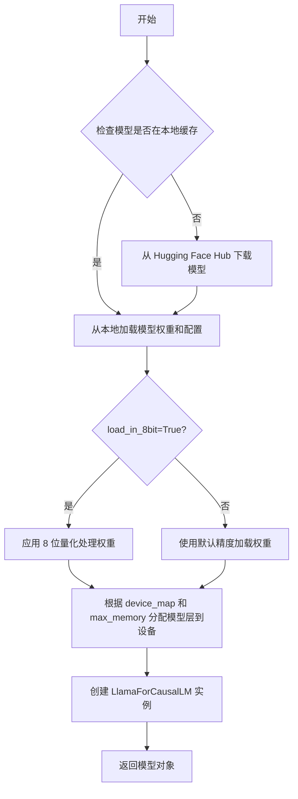

#### 带注释源码

```python
# 从预训练模型加载 Llama 因果语言模型
# 参数说明：
#   - model_name: "meta-llama/Llama-2-7b-hf" (模型标识符)
#   - device_map="auto": 自动将模型层分配到可用 GPU
#   - load_in_8bit=True: 启用 8 位量化以降低显存占用
#   - max_memory: 限制每个 GPU 的最大内存使用
model = LlamaForCausalLM.from_pretrained(
    model_name,          # 预训练模型名称或路径
    device_map="auto",   # 自动设备映射策略
    load_in_8bit=True,   # 8 位量化加载
    max_memory=max_memory  # 每设备最大内存限制
)
```


### `LlamaForCausalLM.generate`

LlamaForCausalLM.generate是Hugging Face Transformers库中LlamaForCausalLM模型的文本生成方法，继承自PreTrainedModel类。该方法接收输入的token IDs，通过自回归方式生成后续文本内容，返回生成的token ID序列。

参数：

- `input_ids`：`torch.LongTensor`，模型输入的token ID序列，通常由tokenizer将文本转换为tensor后得到
- `max_length`：`int`，生成序列的最大长度（包括输入长度），代码中设置为128
- `max_new_tokens`：`int`，可选参数，指定要生成的新token数量（与max_length二选一）
- `temperature`：`float`，可选参数，控制采样的随机性，值越低越确定性，默认为1.0
- `top_p`：`float`，可选参数，nucleus采样阈值，保留累计概率大于该值的token，默认为1.0
- `do_sample`：`bool`，可选参数，是否使用采样策略，默认为False
- `pad_token_id`：`int`，可选参数，padding token的ID
- `eos_token_id`：`int`或`List[int]`，可选参数，序列结束token的ID
- `num_beams`：`int`，可选参数，beam search的beam数量，默认为1

返回值：`torch.LongTensor`，生成的token ID序列，形状为(batch_size, sequence_length)

#### 流程图

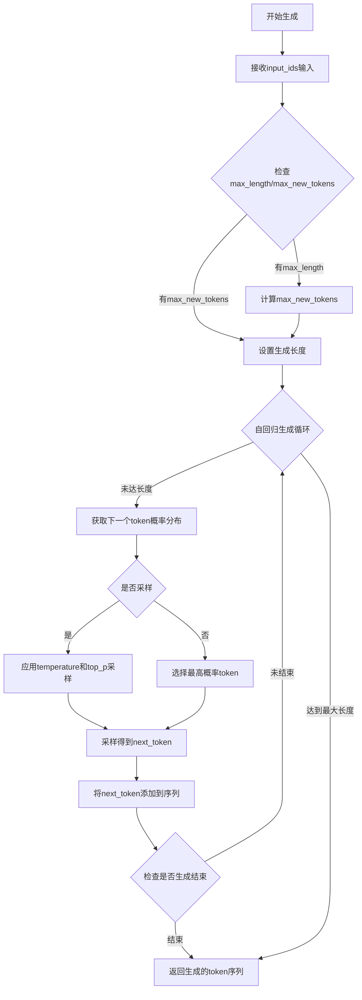

#### 带注释源码

```python
# 从Hugging Face Transformers库中导入Llama模型和分词器
import torch
from transformers import LlamaForCausalLM, LlamaTokenizer

# 定义生成文本的最大新token数量
MAX_NEW_TOKENS = 128
# 指定预训练模型名称（LLaMA-2 7B参数版本）
model_name = "meta-llama/Llama-2-7b-hf"

# 要生成文本的输入提示
text = "Hamburg is in which country?\n"

# 初始化分词器并将输入文本转换为token IDs
tokenizer = LlamaTokenizer.from_pretrained(model_name)
input_ids = tokenizer(text, return_tensors="pt").input_ids

# 计算可用GPU内存（以GB为单位），预留2GB空间
max_memory = f"{int(torch.cuda.mem_get_info()[0] / 1024**3) - 2}GB"

# 获取GPU数量并为每个GPU分配相同的最大内存
n_gpus = torch.cuda.device_count()
max_memory = {i: max_memory for i in range(n_gpus)}

# 加载预训练模型，使用device_map自动分配设备，8bit量化加载
model = LlamaForCausalLM.from_pretrained(
    model_name, 
    device_map="auto",           # 自动将模型层分配到不同设备
    load_in_8bit=True,           # 使用8bit量化减少显存占用
    max_memory=max_memory        # 设置每个GPU的最大内存限制
)

# 调用模型的generate方法进行自回归文本生成
# input_ids: 输入的token ID序列
# max_length: 生成的序列最大长度（包括输入）
generated_ids = model.generate(
    input_ids, 
    max_length=MAX_NEW_TOKENS    # 限制生成序列长度为128 tokens
)

# 将生成的token IDs解码为可读文本并打印
# skip_special_tokens=True: 跳过特殊token如pad、eos等
print(tokenizer.decode(generated_ids[0], skip_special_tokens=True))
```

### 补充说明

**设计目标与约束**：
- 目标：基于LLaMA-2-7b预训练模型完成文本生成任务
- 约束：使用8bit量化以适应单卡显存限制，max_new_tokens限制生成长度

**错误处理与异常设计**：
- 模型加载失败：可能由于模型权限问题（LLaMA-2需要申请）或网络问题
- CUDA内存不足：8bit量化可缓解，但仍需确保GPU显存足够
- 分词器加载失败：检查model_name是否有效

**数据流与状态机**：
1. 原始文本 → Tokenizer → input_ids (torch.Tensor)
2. input_ids → Model.generate() → generated_ids (torch.Tensor)
3. generated_ids → Tokenizer.decode() → 可读文本

**外部依赖与接口契约**：
- 依赖：transformers>=4.31.0, torch, CUDA环境
- 接口契约：generate方法接收tensor输入，返回tensor输出，需保证input_ids在正确设备上

**潜在技术债务与优化空间**：
- 当前使用device_map="auto"可能导致模型层分配不均
- max_length参数应考虑输入长度，避免生成内容被截断
- 建议使用generation_config自定义更多生成策略参数
- 可考虑使用generate方法的更多高级参数如repetition_penalty、length_penalty等提升生成质量


## 关键组件


### 模型量化 (Model Quantization)

使用 `load_in_8bit=True` 参数将Llama-2-7b模型加载为8位量化模型，显著降低显存占用，使得大模型能够在消费级GPU上运行。

### 设备自动映射 (Device Auto Mapping)

通过 `device_map="auto"` 实现模型层的自动分配，将不同层分布到多个GPU上，实现模型并行推理，充分利用多GPU资源。

### GPU内存管理 (GPU Memory Management)

通过 `torch.cuda.mem_get_info()` 动态获取GPU可用内存，计算并设置 `max_memory` 字典，确保模型加载不超过设备显存容量。

### 自回归文本生成 (Autoregressive Text Generation)

使用 `model.generate()` 方法进行自回归文本生成，基于输入文本（"Hamburg is in which country?"）续写输出内容。

### Tokenizer与文本编码

使用 `LlamaTokenizer` 将输入文本转换为模型可处理的token ID序列，并使用 `decode()` 方法将生成的token ID转换回可读文本。


## 问题及建议


### 已知问题

- **参数命名不一致**：定义了常量`MAX_NEW_TOKENS = 128`，但在`model.generate()`调用时使用的是`max_length`参数而非`max_new_tokens`，参数名与常量意图不匹配
- **缺少GPU可用性检查**：未检查CUDA是否可用，若在无GPU环境下运行会导致代码失败
- **无异常处理机制**：模型加载、tokenization、生成过程均无try-except保护，运行时错误会导致程序直接崩溃
- **bitsandbytes依赖未声明**：使用`load_in_8bit=True`需要`bitsandbytes`库，但代码中未检查该库是否安装
- **内存计算不够健壮**：`torch.cuda.mem_get_info()[0]`获取的是空闲内存，在多GPU场景下减去固定2GB可能导致OOM
- **资源未显式释放**：模型加载后未提供显式的GPU内存清理机制（model.eval()、torch.cuda.empty_cache()等）
- **生成参数过于单一**：仅设置了max_length，缺少temperature、top_p、top_k等常用生成控制参数

### 优化建议

- 将`model.generate()`中的`max_length`改为`max_new_tokens=MAX_NEW_TOKENS`以保持语义一致
- 添加`torch.cuda.is_available()`检查及友好的错误提示
- 用try-except包裹关键代码段并捕获特定异常（OSError用于模型加载、RuntimeError用于生成等）
- 在代码开头或README中明确声明`bitsandbytes`依赖
- 考虑使用`torch.cuda.empty_cache()`并在生成后显式释放模型引用
- 添加常见生成参数（temperature=0.7、top_p=0.9、top_k=50等）以提升生成质量
- 将硬编码的模型名称和内存配置提取为配置文件或命令行参数
- 考虑添加流式输出或进度显示以改善用户体验

## 其它


### 设计目标与约束
本代码旨在使用预训练的Llama-2-7b模型对输入问题"Hamburg is in which country?"进行回答，并限制生成文本的最大长度为128个tokens。约束条件包括：必须运行在支持CUDA的GPU环境下，采用模型量化（load_in_8bit=True）以降低显存占用，通过max_memory参数动态分配GPU内存，且依赖Hugging Face transformers库和PyTorch生态。

### 错误处理与异常设计
代码中缺乏显式的异常处理机制，存在以下风险点：GPU不可用时torch.cuda.device_count()可能返回0导致max_memory为空字典；模型加载失败（如网络中断、权限问题）会抛出异常；显存不足时model.generate()可能崩溃。建议添加try-except块捕获RuntimeError、OSError等异常，并输出友好错误信息，同时在加载模型前检查GPU可用性和内存充足性。

### 数据流与状态机
数据流处理流程为：输入文本经tokenizer编码为input_ids张量 → 模型根据input_ids调用generate方法自回归生成token序列 → 解码生成的token序列为自然语言并输出。状态机方面，该脚本为线性流程，无状态转换，但可抽象为“初始化→推理→输出”三阶段状态。

### 外部依赖与接口契约
核心依赖包括：PyTorch（CUDA支持）、transformers库（LlamaForCausalLM和LlamaTokenizer类）、CUDA运行时环境。外部接口契约体现为：LlamaTokenizer.from_pretrained()需传入有效model_name；LlamaForCausalLM.from_pretrained()接受device_map、load_in_8bit、max_memory等参数；model.generate()需提供input_ids和max_length/max_new_tokens参数；tokenizer.decode()控制skip_special_tokens行为。

### 性能考虑
代码通过load_in_8bit量化将模型参数压缩至8位，显著降低显存占用（约减少50-70%）；device_map="auto"实现自动设备分配，充分利用多GPU并行推理；max_memory根据当前GPU空闲内存动态计算，避免OOM。但max_new_tokens设置为128可能过长，导致生成速度慢，建议根据实际需求调整。

### 安全性与偏见
Llama-2-7b模型可能生成包含偏见、虚假信息或不当内容的回复，代码未集成内容安全过滤机制。此外，模型权重下载自Hugging Face Hub，需确保网络来源可靠，避免供应链攻击风险。建议在生产环境中添加输出过滤层或使用更安全的微调模型。

### 可扩展性与维护性
代码采用单脚本形式，功能耦合度高，维护困难。改进方向包括：将模型加载、推理、解码封装为独立函数；支持命令行参数化（如model_name、max_new_tokens）；引入配置类管理超参数。当前硬编码的MAX_NEW_TOKENS和model_name不利于跨环境迁移，建议抽离至配置文件或环境变量。

### 配置管理
当前关键配置（MAX_NEW_TOKENS、model_name、max_memory计算逻辑）均硬编码在脚本顶层。建议引入结构化配置方案，如YAML文件或Python配置类，支持不同部署环境（单GPU/多GPU/CPU）快速切换，并提供默认值和类型校验。

### 日志与监控
代码仅依赖print输出推理结果，缺乏日志记录（无法追溯加载时间、显存占用、推理耗时等）。建议集成Python logging模块，分级记录INFO（模型加载成功）、WARNING（显存不足）、ERROR（推理异常）等事件，并支持输出至文件或监控系统，便于生产环境排查问题。

### 测试策略
代码无任何单元测试或集成测试覆盖。建议编写测试用例：验证tokenizer编码解码一致性（输入输出相等）、模型推理输出类型为list、异常场景下（如无效model_name）抛出ExpectedException、GPU显存占用在合理范围内。集成测试可模拟真实对话流程，验证端到端功能。

    