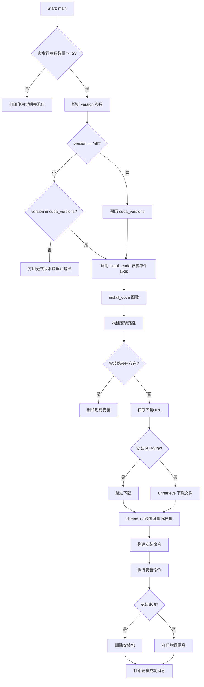
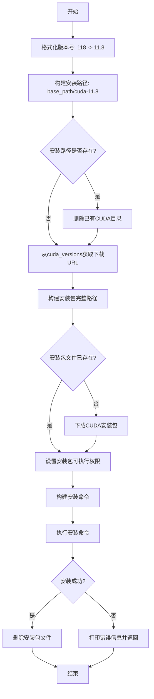

# `bitsandbytes\install_cuda.py` 详细设计文档

A Python script to automatically download and install NVIDIA CUDA Toolkit versions (11.8, 12.0-12.6) from official NVIDIA servers. Supports user-space or system-wide installation with configurable download paths.

## 整体流程



## 类结构

```
模块级
├── cuda_versions (全局字典)
├── install_cuda() (全局函数)
└── main() (全局函数)
```

## 全局变量及字段


### `cuda_versions`
    
一个字典，映射CUDA版本号（如'118'、'120'等）到对应的NVIDIA官方下载URL

类型：`Dict[str, str]`
    


    

## 全局函数及方法


### `install_cuda`

该函数用于下载并安装指定版本的 CUDA Tookit。它会根据版本号从 NVIDIA 官方服务器下载对应的安装程序，设置执行权限，然后以静默模式将 CUDA 安装到指定路径，并在安装完成后自动清理安装包。

参数：

- `version`：`str`，CUDA 版本号（如 "118"、"120" 等），对应 cuda_versions 字典中的键
- `base_path`：`str`，CUDA 安装的基础路径，安装程序会在此路径下创建 cuda-{version} 文件夹
- `download_path`：`str`，CUDA 安装包（.run 文件）的下载保存路径

返回值：`None`，该函数无显式返回值，通过打印信息表示执行状态

#### 流程图



#### 带注释源码

```python
def install_cuda(version, base_path, download_path):
    """
    下载并安装指定版本的 CUDA Tookit
    
    Args:
        version: CUDA 版本号 (如 "118", "120")
        base_path: CUDA 安装的基础路径
        download_path: 安装包下载保存路径
    """
    # 将版本号格式化为标准形式: "118" -> "11.8", "121" -> "12.1"
    formatted_version = f"{version[:-1]}.{version[-1]}"
    
    # 构建 CUDA 文件夹名称和完整安装路径
    folder = f"cuda-{formatted_version}"
    install_path = os.path.join(base_path, folder)

    # 检查目标路径是否已存在 CUDA，若存在则先删除
    if os.path.exists(install_path):
        print(f"Removing existing CUDA version {version} at {install_path}...")
        subprocess.run(["rm", "-rf", install_path], check=True)

    # 从预定义的 URL 字典获取对应版本的下载链接
    url = cuda_versions[version]
    
    # 提取下载文件名称并构建完整下载路径
    filename = url.split("/")[-1]
    filepath = os.path.join(download_path, filename)

    # 若安装包不存在则下载，否则跳过下载
    if not os.path.exists(filepath):
        print(f"Downloading CUDA version {version} from {url}...")
        urlretrieve(url, filepath)
    else:
        print(f"Installer for CUDA version {version} already downloaded.")

    # 给安装包添加可执行权限
    subprocess.run(["chmod", "+x", filepath], check=True)

    # 配置 CUDA 静默安装参数
    print(f"Installing CUDA version {version}...")
    install_command = [
        "bash",
        filepath,
        "--no-drm",          # 不安装 DRM 相关组件
        "--no-man-page",    # 不安装手册页
        "--override",        # 覆盖已有文件
        "--toolkitpath=" + install_path,  # 指定安装路径
        "--toolkit",         # 仅安装 Toolkit（不含 Driver）
        "--silent",          # 静默模式安装
    ]

    print(f"Running command: {' '.join(install_command)}")

    # 执行安装命令并捕获可能的异常
    try:
        subprocess.run(install_command, check=True)
    except subprocess.CalledProcessError as e:
        print(f"Installation failed for CUDA version {version}: {e}")
        return  # 失败时提前返回，不执行后续清理
    finally:
        # finally 块确保安装包文件被删除（无论成功或失败）
        os.remove(filepath)

    # 安装成功后打印最终信息
    print(f"CUDA version {version} installed at {install_path}")
```


### `main`

该函数是CUDA安装脚本的入口点，负责解析命令行参数、设置安装路径，并根据用户指定的版本调用`install_cuda`函数安装CUDA。

参数：该函数没有显式参数，通过`sys.argv`获取命令行输入。

返回值：`None`，该函数不返回任何值，通过`sys.exit()`退出程序。

#### 流程图

```mermaid
flowchart TD
    A([开始]) --> B[设置默认路径: user_base_path=/root/cuda, system_base_path=/usr/local/cuda, download_path=/tmp]
    B --> C{检查 sys.argv 长度 >= 2?}
    C -->|否| D[打印使用说明并退出]
    C -->|是| E[获取 version = sys.argv[1]]
    E --> F{检查 sys.argv 长度 > 2?}
    F -->|是| G[根据 sys.argv[2] 设置 base_path]
    F -->|否| H[跳过]
    G --> I
    H --> I
    I{检查 sys.argv 长度 > 3?}
    I -->|是| J[设置 download_path = sys.argv[3]]
    I -->|否| K[跳过]
    J --> L
    K --> L
    L{base_path 不存在?}
    L -->|是| M[创建 base_path 目录]
    L -->|否| N[跳过]
    M --> O
    N --> O
    O{download_path 不存在?}
    O -->|是| P[创建 download_path 目录]
    O -->|否| Q[跳过]
    P --> R
    Q --> R
    R{version == 'all'?}
    R -->|是| S[遍历 cuda_versions 字典]
    R -->|否| T{version in cuda_versions?}
    S --> U[对每个版本调用 install_cuda]
    T -->|是| V[调用 install_cuda 安装指定版本]
    T -->|否| W[打印错误: 无效版本]
    W --> X[退出程序]
    U --> Y([结束])
    V --> Y
    D --> Y
```

#### 带注释源码

```python
def main():
    # 定义用户CUDA安装的默认基础路径 (~ 表示用户主目录)
    user_base_path = os.path.expanduser("~/cuda")
    
    # 定义系统级CUDA安装的默认基础路径
    system_base_path = "/usr/local/cuda"
    
    # 默认选择用户级安装路径
    base_path = user_base_path
    
    # 默认下载临时目录
    download_path = "/tmp"

    # 检查命令行参数数量,至少需要提供版本号
    if len(sys.argv) < 2:
        # 打印使用说明: 脚本名 <版本/all> [user/system] [下载路径]
        print("Usage: python install_cuda.py <version/all> [user/system] [download_path]")
        # 参数不足,退出程序
        sys.exit(1)

    # 从命令行获取第一个参数: CUDA版本号或 "all"
    version = sys.argv[1]
    
    # 如果提供了第二个参数,决定安装路径类型
    if len(sys.argv) > 2:
        # 根据参数选择系统级或用户级安装路径
        base_path = system_base_path if sys.argv[2] == "system" else user_base_path
    
    # 如果提供了第三个参数,自定义下载路径
    if len(sys.argv) > 3:
        download_path = sys.argv[3]

    # 确保基础安装目录存在,不存在则创建
    if not os.path.exists(base_path):
        os.makedirs(base_path)
    
    # 确保下载目录存在,不存在则创建
    if not os.path.exists(download_path):
        os.makedirs(download_path)

    # 根据版本参数执行安装
    if version == "all":
        # 遍历所有可用的CUDA版本并逐个安装
        for ver in cuda_versions:
            install_cuda(ver, base_path, download_path)
    elif version in cuda_versions:
        # 安装指定版本的CUDA
        install_cuda(version, base_path, download_path)
    else:
        # 版本无效,打印可用版本列表并退出
        print(f"Invalid CUDA version: {version}. Available versions are: {', '.join(cuda_versions.keys())}")
        sys.exit(1)
```

## 关键组件


### CUDA版本映射表 (cuda_versions)

存储CUDA版本与下载URL的映射关系，支持11.8到12.6多个版本的安装包下载

### CUDA安装函数 (install_cuda)

负责下载指定版本的CUDA安装包，设置执行权限，运行安装程序并清理安装文件的完整安装流程

### 主入口函数 (main)

解析命令行参数，确定安装路径和下载路径，支持单版本或全部版本安装的主控制逻辑


## 问题及建议


### 已知问题

- **硬编码的CUDA URL版本字典**：`cuda_versions`字典直接内嵌在代码中，导致添加新版本需要修改源代码，缺乏配置化管理
- **安装失败时仍删除安装包**：在`finally`块中无条件删除安装文件，即使安装失败也会删除，导致无法进行调试或重试
- **缺乏网络错误处理**：使用`urlretrieve`下载文件时没有捕获网络超时、连接失败等异常情况
- **缺乏磁盘空间检查**：下载和安装前未检查磁盘空间是否充足
- **权限处理不完善**：安装到`/usr/local/cuda`时可能遇到权限不足问题，但没有提前检查和处理
- **缺乏下载文件完整性校验**：未验证下载的`run`文件是否完整或被篡改（如校验和验证）
- **缺乏日志记录**：仅使用`print`输出信息，没有结构化日志，不利于问题排查和审计
- **版本兼容性未检查**：未检查当前系统是否支持指定CUDA版本（如GPU架构、驱动版本兼容性）
- **安装路径处理不一致**：部分地方使用`os.path.join`，部分使用字符串拼接（如`"--toolkitpath=" + install_path`）
- **缺乏重试机制**：下载或安装失败时直接退出，没有重试逻辑
- **返回值不一致**：`install_cuda`函数在成功时没有明确返回值，失败时返回`None`，调用方难以判断执行状态

### 优化建议

- 将CUDA版本URL配置外部化，支持JSON/YAML配置文件或环境变量读取
- 将文件删除逻辑移至安装成功分支，失败时保留安装包以便调试
- 为网络操作添加超时设置和重试机制，使用`requests`库替代`urlretrieve`以获得更好的错误处理
- 在操作前检查磁盘空间（使用`shutil.disk_usage`）
- 在安装前检查目标路径的写入权限，必要时提示使用`sudo`
- 添加SHA256或MD5校验和验证下载文件的完整性
- 引入标准日志库（`logging`）替代print，实现分级日志记录
- 添加系统环境检查（GPU驱动版本、glibc版本等）
- 统一使用`os.path.join`或f-string进行路径拼接
- 为`install_cuda`函数添加明确的返回值（如布尔值或枚举状态），便于调用方判断执行结果
- 添加`--verbose`选项以支持详细输出模式
- 考虑支持`--dry-run`模式，用于测试和验证参数有效性

## 其它


### 设计目标与约束

该脚本的主要设计目标是简化CUDA工具包在不同Linux系统上的自动化安装流程，支持多个CUDA版本的并行或单独安装。约束条件包括：仅支持Linux系统、需要网络访问以下载CUDA安装包、需要sudo权限进行系统级安装、磁盘空间要求至少15GB。

### 错误处理与异常设计

脚本采用多层错误处理机制：使用subprocess.run的check=True参数捕获命令执行失败、try-except块捕获CalledProcessError异常、文件操作前检查路径存在性、版本验证检查输入参数有效性。错误发生时打印详细错误信息并返回而非中断整个流程（单个版本安装失败不影响其他版本）。

### 数据流与状态机

主流程状态机包含：初始化状态（解析命令行参数）→ 验证状态（检查版本有效性、创建目录）→ 执行状态（遍历或单次调用install_cuda）→ 清理状态（删除临时安装包）。install_cuda函数内部流程：检查已有安装 → 下载/复用安装包 → 设置执行权限 → 执行安装 → 清理安装包。

### 外部依赖与接口契约

外部依赖包括：Python 3标准库（os、subprocess、sys、urllib）、NVIDIA官方CUDA下载服务器、网络连接。接口契约：命令行参数sys.argv[1]为版本号（支持"all"或字典键）、sys.argv[2]为安装类型（"user"或"system"）、sys.argv[3]为自定义下载路径，默认~/cuda和/tmp。

### 安全性考虑

当前实现存在安全风险：下载URL来自硬编码字典但未验证下载文件完整性（无SHA256校验）、安装包下载后直接执行而未验证签名、filepath删除操作在finally块中执行即使安装失败也会删除安装包导致无法重试。建议添加：下载文件哈希校验、执行前验证GPG签名、失败时保留安装包用于调试。

### 性能考虑

性能优化点：已下载的安装包会跳过重新下载（检查filepath是否存在）、使用subprocess.run而非shell=True提高安全性同时略微提升性能、可并行安装多个版本（当前串行）。瓶颈在于网络下载速度和CUDA安装程序执行时间（约10-30分钟）。

### 配置与扩展性

扩展性设计：cuda_versions字典可轻松添加新版本、install_cuda函数可复用为模块API、base_path和download_path参数化支持自定义。局限性：安装参数（--no-drm、--override等）硬编码在install_command列表中，若需调整需修改源码。

### 平台兼容性

当前仅支持Linux x86_64架构，依赖bash shell和标准Linux工具集（rm、chmod）。不支持Windows Subsystem for Linux（WSL）未测试、不支持ARM64架构、不支持macOS。CUDA版本与GPU驱动版本存在兼容性要求，当前脚本未验证此匹配关系。

### 日志与监控

日志输出使用print语句，包含操作步骤、命令执行、错误信息。建议改进：使用Python logging模块分级输出、添加时间戳、输出重定向到日志文件、集成进度条显示下载进度。监控方面可添加：安装时间统计、磁盘空间检查、CUDA安装后验证（nvcc --version）。

### 测试策略

建议添加的测试用例：参数验证测试（无效版本、无效安装类型）、目录创建测试、下载URL可用性测试、模拟安装流程测试（不实际执行安装命令）、异常场景测试（网络中断、磁盘空间不足）。可使用pytest框架和mock对象模拟subprocess和urllib操作。

### 部署注意事项

部署环境要求：Python 3.6+、网络访问NVIDIA服务器权限、目标目录写入权限（用户安装需要~目录写入权限，系统安装需要sudo）、至少15GB可用磁盘空间。建议以非root用户运行用户安装模式，系统安装模式需要预先配置sudoers或使用root权限执行。

### 版本兼容性

脚本兼容Python 3.6至3.11版本。CUDA版本支持11.8至12.6.2，该范围覆盖多数深度学习框架需求。注意：CUDA版本与NVIDIA驱动存在兼容性矩阵，建议在文档中链接官方兼容性表并提示用户确认驱动版本匹配。

### 权限要求

用户模式安装：需要base_path目录创建/写入权限、download_path目录写入权限。系统模式安装：需要sudo权限执行rm、chmod命令，以及CUDA安装程序对/usr/local/cuda的写入权限。当前脚本未检查权限提前返回友好错误信息。

    