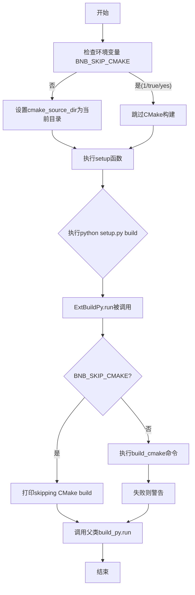
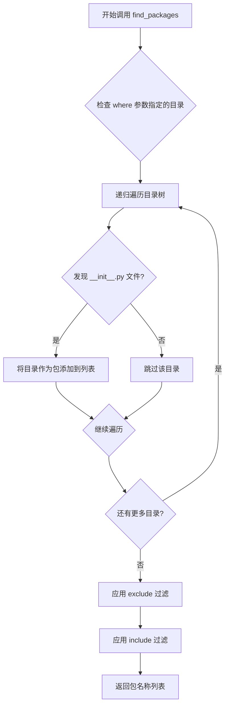
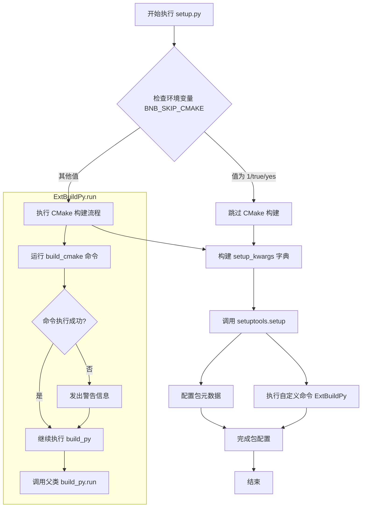
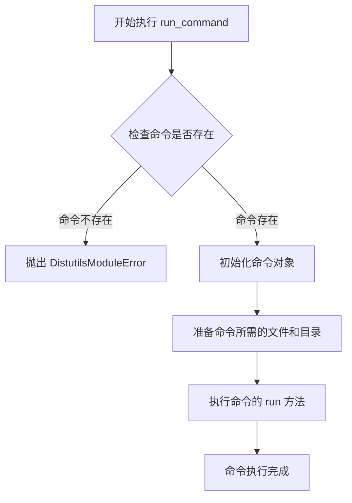
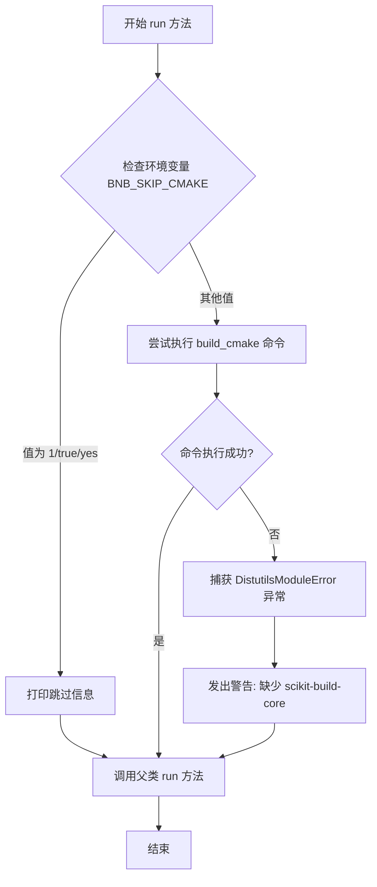
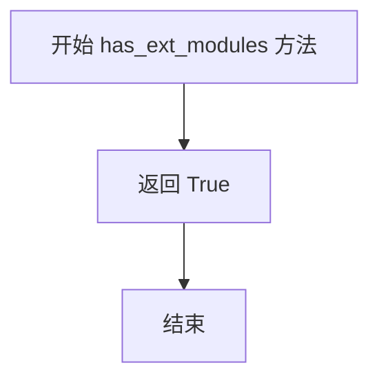
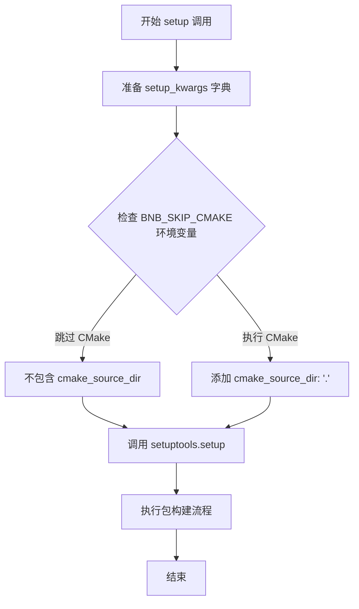
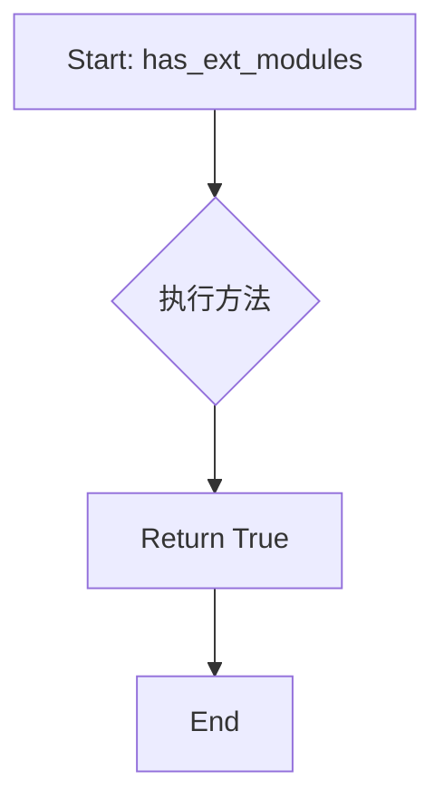

# `bitsandbytes\setup.py` 详细设计文档

这是一个Python项目的setup.py配置文件，用于构建包含C/C++扩展的Python包。它通过自定义BinaryDistribution类标识存在扩展模块，并定义ExtBuildPy命令在标准build_py之前有条件地调用CMake构建系统，支持通过环境变量BNB_SKIP_CMAKE跳过CMake构建。

## 整体流程



## 类结构

```
Distribution (from setuptools)
└── BinaryDistribution (自定义)

build_py (from setuptools.command)
└── ExtBuildPy (自定义)
```

## 全局变量及字段


### `cmdclass`
    
一个字典，将构建命令名称映射到自定义的构建命令类，用于setuptools扩展构建流程

类型：`dict`
    


### `setup_kwargs`
    
一个字典，包含setuptools的安装配置参数，如版本号、包路径、分发类和构建命令类等

类型：`dict`
    


    

## 全局函数及方法


### `find_packages`

`find_packages` 是 setuptools 库中的一个函数，用于自动发现当前项目中的 Python 包（即包含 `__init__.py` 文件的目录），并返回这些包的名称列表，常用于 setup.py 中指定项目的包结构。

参数：

- 此调用未传递任何参数，使用默认参数：`where='.'`（当前目录）, `exclude=()`（无排除）, `include=('*',)`（包含所有）

返回值：`List[str]`，返回在项目根目录下找到的所有 Python 包的名称列表。

#### 流程图



#### 带注释源码

```python
# 从 setuptools 导入 find_packages 函数
# 该函数自动发现项目中的 Python 包
from setuptools import find_packages, setup

# ... (其他代码)

setup_kwargs = {
    "version": "0.50.0.dev0",
    # 调用 find_packages() 自动发现当前目录下的所有包
    # 不传递参数时，使用默认值：
    #   - where='.'  : 从当前目录开始搜索
    #   - exclude=() : 不排除任何包
    #   - include=('*',) : 包含所有匹配 '*' 模式的包
    # 返回值: List[str]，如 ['mypackage', 'mypackage.subpackage']
    "packages": find_packages(),
    "distclass": BinaryDistribution,
    "cmdclass": {"build_py": ExtBuildPy},
}
```


### `setup`

该函数是 setuptools 的核心函数，用于配置 Python 包的元数据、依赖、构建选项等。在此代码中，通过 `setup_kwargs` 字典传递配置参数，调用 setup() 来完成包的构建配置。

参数：

-  `**kwargs`：可变关键字参数，接收字典形式传入的包配置参数。在本代码中传入的 setup_kwargs 包含以下键值对：
  - `version`：字符串，包版本号 "0.50.0.dev0"
  - `packages`：列表，由 find_packages() 返回的包列表
  - `distclass`：类，BinaryDistribution 类，用于支持二进制扩展
  - `cmdclass`：字典，自定义命令类 {"build_py": ExtBuildPy}
  - `cmake_source_dir`：字符串（条件存在），值为 "."，仅在未跳过 CMake 构建时添加

返回值：`None`，setup() 函数不返回值，主要作用是执行包配置和构建逻辑。

#### 流程图



#### 带注释源码

```python
# setup.py - PyTorch Lightning Builder 包构建配置
# Copyright (c) Facebook, Inc. and its affiliates.

# 导入必要的模块
from distutils.errors import DistutilsModuleError  # 用于捕获 CMake 构建错误
import os  # 用于环境变量检查
from warnings import warn  # 用于发出警告信息

# 从 setuptools 导入所需函数和类
from setuptools import find_packages, setup
from setuptools.command.build_py import build_py
from setuptools.dist import Distribution


# BinaryDistribution 类：继承自 Distribution
# 用于指示该分发包包含二进制扩展模块
class BinaryDistribution(Distribution):
    def has_ext_modules(self):
        return True  # 返回 True 表示存在扩展模块


# ExtBuildPy 类：自定义的 build_py 命令
# 用于在构建 Python 包之前先执行 CMake 构建
class ExtBuildPy(build_py):
    def run(self):
        """
        重写 run 方法，实现条件性 CMake 构建
        当环境变量 BNB_SKIP_CMAKE 设置为 1/true/yes 时跳过 CMake 构建
        """
        # 检查是否需要跳过 CMake 构建
        if os.environ.get("BNB_SKIP_CMAKE", "").lower() in ("1", "true", "yes"):
            print("skipping CMake build")  # 打印跳过信息
        else:
            # 在 build_py 之前运行 build_cmake
            # 注意：build_py 会收集输出文件到包目录，所以需要先执行 build_cmake
            try:
                self.run_command("build_cmake")  # 执行 CMake 构建命令
            except DistutilsModuleError:
                # 捕获异常并发出警告
                warn(
                    "scikit-build-core not installed, CMake will not be invoked automatically. "
                    "Please install scikit-build-core or run CMake manually to build extensions."
                )
        # 调用父类的 run 方法执行标准 build_py 流程
        super().run()


# cmdclass 字典：注册自定义命令类
cmdclass = {"build_py": ExtBuildPy}

# setup_kwargs 字典：包含 setup() 函数的所有配置参数
setup_kwargs = {
    "version": "0.50.0.dev0",  # 包版本号
    "packages": find_packages(),  # 自动发现所有 Python 包
    "distclass": BinaryDistribution,  # 使用自定义分发类
    "cmdclass": {"build_py": ExtBuildPy},  # 注册自定义构建命令
}

# 条件性添加 cmake_source_dir 参数
# 仅当未跳过 CMake 构建时添加
if os.environ.get("BNB_SKIP_CMAKE", "").lower() not in ("1", "true", "yes"):
    setup_kwargs["cmake_source_dir"] = "."  # CMake 源码目录为当前目录

# 调用 setuptools.setup 函数完成包配置和构建
# 传入 setup_kwargs 字典作为关键字参数
setup(**setup_kwargs)
```


### ExtBuildPy.run_command

描述：run_command 是从 setuptools.command.build_py.build_py 继承来的方法，用于在构建过程中执行子命令（如 "build_cmake"）。该方法接受命令名称字符串，初始化对应的命令对象，准备其所需的文件和目录，然后执行该命令。

参数：

- `command`：str，需要执行的子命令名称（例如 "build_cmake"）

返回值：无返回值（None），该方法通过修改系统状态（如生成构建产物）来完成其功能

#### 流程图



#### 带注释源码

```python
# run_command 是继承自 setuptools.command.build_py.build_py 的方法
# 以下是 ExtBuildPy.run 方法中调用 run_command 的上下文

class ExtBuildPy(build_py):
    def run(self):
        """
        重写 build_py 的 run 方法
        1. 检查是否跳过 CMake 构建
        2. 如果不跳过，则运行 build_cmake 命令
        """
        if os.environ.get("BNB_SKIP_CMAKE", "").lower() in ("1", "true", "yes"):
            print("skipping CMake build")
        else:
            # build_cmake 需要在 build_py 之前调用
            # 因为 build_py 会收集输出文件到包目录
            try:
                # 调用继承的 run_command 方法执行 build_cmake 子命令
                # run_command 是 distutils/setuptools 的标准方法
                # 用于在当前命令上下文中执行另一个命令
                self.run_command("build_cmake")
            except DistutilsModuleError:
                warn(
                    "scikit-build-core not installed, CMake will not be invoked automatically. "
                    "Please install scikit-build-core or run CMake manually to build extensions."
                )
        # 调用父类的 run 方法执行标准的 build_py 逻辑
        super().run()
```

#### 附加说明

- **方法来源**：此方法定义在 `setuptools.command.build_py.build_py` 类中（继承自 `distutils.cmd.Command`）
- **调用位置**：在 `ExtBuildPy.run()` 方法的第 16 行被调用
- **异常处理**：虽然 `run_command` 本身会抛出 `DistutilsModuleError`，但在代码中通过 try-except 块进行了捕获并发出警告
- **设计目的**：允许在构建 Python 包之前先构建 CMake 扩展模块，实现混合构建系统


### `ExtBuildPy.run` 方法中的 `super().run()`

该函数是 `ExtBuildPy` 类中重写的 `run` 方法，通过调用 `super().run()` 执行父类 `build_py` 的标准构建流程，是扩展构建流程的关键节点。

参数：

-  `self`：隐式参数，实例本身，用于访问对象属性和方法
-  无其他显式参数

返回值：无返回值（`None`），直接执行父类的 `run` 方法完成构建操作

#### 流程图

```mermaid
flowchart TD
    A[ExtBuildPy.run 开始] --> B{检查环境变量 BNB_SKIP_CMAKE}
    B -->|值在 ("1", "true", "yes") 中| C[打印 skipping CMake build]
    B -->|其他值| D[尝试执行 build_cmake 命令]
    D --> E{命令执行成功?}
    E -->|是| F[调用 super().run 执行父类构建]
    E -->|否| G[发出警告信息]
    G --> F
    C --> F
    F --> H[结束]
```

#### 带注释源码

```python
class ExtBuildPy(build_py):
    """
    扩展的 build_py 命令类，集成 CMake 构建流程
    """
    
    def run(self):
        """
        重写父类的 run 方法，执行扩展的构建逻辑
        """
        # 检查是否需要跳过 CMake 构建
        # 从环境变量 BNB_SKIP_CMAKE 获取配置，默认为不跳过
        if os.environ.get("BNB_SKIP_CMAKE", "").lower() in ("1", "true", "yes"):
            print("skipping CMake build")  # 提示用户跳过构建
        else:
            # 在 build_py 之前调用 build_cmake，因为 build_py 会收集输出文件到包目录
            try:
                self.run_command("build_cmake")  # 尝试执行 CMake 构建命令
            except DistutilsModuleError:
                # 捕获模块未找到异常，提供友好的错误提示
                warn(
                    "scikit-build-core not installed, CMake will not be invoked automatically. "
                    "Please install scikit-build-core or run CMake manually to build extensions."
                )
        
        # 调用父类 build_py 的 run 方法，执行标准的 Python 构建流程
        # 包含文件收集、包构建等标准操作
        super().run()
```

#### 关键信息补充

- **super() 的作用**：在 Python 3 中，`super()` 自动推断当前类和实例，正确指向父类 `build_py`
- **调用时机**：在完成 CMake 构建检查（或跳过）后调用，确保父类构建逻辑在自定义逻辑之后执行
- **设计意图**：通过 `super()` 保持父类功能的完整性，同时在前后注入自定义的 CMake 构建逻辑


### `ExtBuildPy.run`

该方法是 `ExtBuildPy` 类的核心方法，负责在构建 Python 包时执行构建流程。它首先检查环境变量 `BNB_SKIP_CMAKE` 来决定是否跳过 CMake 构建，如果不跳过则尝试运行 `build_cmake` 命令，如果命令失败则发出警告，最后调用父类的 `run` 方法完成构建。

参数：

- `self`：`ExtBuildPy` 实例本身，无需显式传递

返回值：`None`，该方法不返回任何值，仅执行构建逻辑

#### 流程图

```mermaid
flowchart TD
    A[开始 run 方法] --> B{检查环境变量 BNB_SKIP_CMAKE}
    B -->|值为 1/true/yes| C[打印 'skipping CMake build']
    B -->|其他值| D[执行 self.run_command('build_cmake')]
    C --> E[调用 super().run]
    D --> F{命令执行成功?}
    F -->|是| E
    F -->|否| G[发出警告: scikit-build-core 未安装]
    G --> E
    E --> H[结束 run 方法]
```

#### 带注释源码

```python
def run(self):
    """
    执行构建流程。
    
    根据环境变量 BNB_SKIP_CMAKE 决定是否跳过 CMake 构建。
    如果不跳过，尝试运行 build_cmake 命令，失败时发出警告。
    最后调用父类的 run 方法完成标准构建流程。
    """
    # 检查环境变量 BNB_SKIP_CMAKE 是否被设置为跳过构建
    if os.environ.get("BNB_SKIP_CMAKE", "").lower() in ("1", "true", "yes"):
        # 用户明确要求跳过 CMake 构建，打印信息
        print("skipping CMake build")
    else:
        # 需要执行 CMake 构建
        try:
            # 尝试运行 build_cmake 命令来构建 C/C++ 扩展
            self.run_command("build_cmake")
        except DistutilsModuleError:
            # 如果 build_cmake 命令失败（如 scikit-build-core 未安装）
            # 发出警告提醒用户手动安装或运行 CMake
            warn(
                "scikit-build-core not installed, CMake will not be invoked automatically. "
                "Please install scikit-build-core or run CMake manually to build extensions."
            )
    
    # 调用父类 build_py 的 run 方法执行标准 Python 包构建
    super().run()
```


经过分析，该代码文件中并未定义名为 `lower` 的函数或方法。

代码中出现的 `.lower()` 是 Python 字符串对象的内置方法，用于将字符串转换为小写。在本代码中，它被用于处理环境变量 `BNB_SKIP_CMAKE` 的值，以实现不区分大小写的比较。

如果您需要分析代码中的 `.lower()` 方法的用法，请参考以下信息：

### `str.lower()` 字符串方法

将字符串转换为小写格式。

参数：无

返回值：`str`，返回转换后的小写字符串

#### 带注释源码

```python
if os.environ.get("BNB_SKIP_CMAKE", "").lower() in ("1", "true", "yes"):
```

在此代码中：
- `os.environ.get("BNB_SKIP_CMAKE", "")` 获取环境变量 `BNB_SKIP_CMAKE` 的值，若不存在则返回空字符串 `""`
- `.lower()` 将获取的值转换为小写
- `in ("1", "true", "yes")` 检查转换后的值是否在指定的允许值列表中

这种用法实现了对环境变量的不区分大小写检查，提供了更灵活的配置方式。


### `ExtBuildPy.run`

该方法是 `ExtBuildPy` 类的核心方法，负责在构建 Python 包之前检查并执行 CMake 构建流程。它通过环境变量 `BNB_SKIP_CMAKE` 判断是否跳过 CMake 构建，如果未跳过则尝试运行 `build_cmake` 命令，若失败则发出警告。

参数：

-  `self`：隐式参数，表示类的实例本身

返回值：`None`，该方法无返回值，通过副作用完成构建流程

#### 流程图



#### 带注释源码

```python
def run(self):
    # 检查环境变量 BNB_SKIP_CMAKE 是否被设置为跳过 CMake 构建
    # 接受的值包括: "1", "true", "yes"（不区分大小写）
    if os.environ.get("BNB_SKIP_CMAKE", "").lower() in ("1", "true", "yes"):
        # 用户明确要求跳过 CMake 构建，打印提示信息
        print("skipping CMake build")
    else:
        # 需要执行 CMake 构建
        # build_cmake 需要在 build_py 之前运行，因为 build_py 会收集输出文件到包目录
        try:
            # 尝试运行 CMake 构建命令
            self.run_command("build_cmake")
        except DistutilsModuleError:
            # 如果没有安装 scikit-build-core，CMake 不会自动调用
            # 发出警告提醒用户安装或手动运行 CMake
            warn(
                "scikit-build-core not installed, CMake will not be invoked automatically. "
                "Please install scikit-build-core or run CMake manually to build extensions."
            )
    # 调用父类的 run 方法完成标准的 Python 构建流程
    super().run()
```

---

### `BinaryDistribution.has_ext_modules`

该方法是 `BinaryDistribution` 类的一个简单实现，用于指示当前分发包含扩展模块。返回固定值 `True`，告诉 setuptools 该包包含 C/C++ 扩展需要编译。

参数：

-  `self`：隐式参数，表示类的实例本身

返回值：`bool`，返回 `True` 表示存在扩展模块

#### 流程图



#### 带注释源码

```python
def has_ext_modules(self):
    # 返回 True 告诉 setuptools 此分发包含扩展模块
    # 这会触发 setuptools 使用二进制分发相关构建逻辑
    return True
```

---

### `setup` (全局函数调用)

这是整个文件的最终执行点，负责配置并执行 Python 包的元数据和构建参数。它整合了之前定义的类、环境变量配置和包信息，完成包的打包工作。

参数：

-  `**setup_kwargs`：关键字参数集合，包含以下内容：
  - `version`：字符串，包版本号 "0.50.0.dev0"
  - `packages`：列表，通过 find_packages() 自动发现的所有 Python 包
  - `distclass`：类，使用 BinaryDistribution 作为分发类
  - `cmdclass`：字典，自定义命令类映射，包含 build_py 的 ExtBuildPy 实现
  - `cmake_source_dir`：字符串，CMake 源代码目录（可选，取决于环境变量）

返回值：`None`，setup() 函数执行打包流程，不返回具体值

#### 流程图



#### 带注释源码

```python
# 定义自定义命令类，将 build_py 命令替换为自定义的 ExtBuildPy
cmdclass = {"build_py": ExtBuildPy}

# 准备传递给 setup() 的配置参数
setup_kwargs = {
    "version": "0.50.0.dev0",                      # 包版本号
    "packages": find_packages(),                  # 自动发现所有 Python 包
    "distclass": BinaryDistribution,              # 使用自定义分发类处理二进制扩展
    "cmdclass": {"build_py": ExtBuildPy},         # 使用自定义 build_py 类集成 CMake 构建
}

# 根据环境变量决定是否配置 CMake 源代码目录
# 如果不跳过 CMake，则添加 cmake_source_dir 配置
if os.environ.get("BNB_SKIP_CMAKE", "").lower() not in ("1", "true", "yes"):
    setup_kwargs["cmake_source_dir"] = "."

# 调用 setuptools 的 setup 函数执行打包
# 这是整个脚本的入口点，会根据 setup_kwargs 配置执行完整的打包流程
setup(**setup_kwargs)
```

---

## 文档总结

### 核心功能概述

该代码是一个 Python 项目打包配置文件（setup.py），通过 setuptools 集成 CMake 构建系统来构建 C/C++ 扩展模块，支持条件性地跳过 CMake 构建，并自动处理二进制分发的版本管理。

### 文件整体运行流程

1. 导入必要的模块和类
2. 定义 `BinaryDistribution` 类处理二进制分发
3. 定义 `ExtBuildPy` 类，重写 `run` 方法实现 CMake 构建集成
4. 配置 `cmdclass` 和 `setup_kwargs` 字典
5. 根据环境变量决定是否包含 CMake 配置
6. 调用 `setup()` 执行打包

### 关键组件信息

| 组件名称 | 一句话描述 |
|---------|-----------|
| BinaryDistribution | 继承自 Distribution 的分发类，指示存在扩展模块 |
| ExtBuildPy | 重写 build_py 的构建类，集成 CMake 构建流程 |
| cmdclass | 自定义命令类字典，将 build_py 映射到 ExtBuildPy |
| setup_kwargs | 传递给 setup() 的配置字典，包含版本、包、分发类等信息 |

### 潜在的技术债务或优化空间

1. **硬编码版本号**：版本号 "0.50.0.dev0" 硬编码在代码中，建议使用版本管理工具或从配置文件读取
2. **缺少错误处理**：CMake 构建失败时仅发出警告，可能导致后续构建问题被隐藏
3. **环境变量检查重复**：环境变量 `BNB_SKIP_CMAKE` 被检查两次，可提取为常量或配置
4. **缺少类型注解**：代码中未使用类型注解，不利于静态分析和 IDE 支持

### 其它项目

**设计目标与约束：**
- 支持 Python 扩展模块的 CMake 构建
- 提供跳过 CMake 构建的灵活性
- 兼容 setuptools 的标准打包流程

**错误处理与异常设计：**
- 使用 `try-except` 捕获 `DistutilsModuleError`
- 通过 `warnings.warn()` 发出非致命警告
- 环境变量缺失时使用默认值处理

**数据流与状态机：**
- 环境变量 → 构建决策 → CMake 命令执行 → 包文件收集 → 安装

**外部依赖与接口契约：**
- 依赖 `setuptools`、`distutils`
- 期望 `scikit-build-core` 用于 CMake 集成
- 兼容 wheel v0.29.0 及以上版本


### `BinaryDistribution.has_ext_modules`

该方法用于通知 setuptools 当前分发包包含扩展模块（C/C++ 编译的模块），确保构建系统正确处理扩展模块的构建流程。

参数：

- `self`：`BinaryDistribution`，类的实例方法，指代调用该方法的 BinaryDistribution 对象本身

返回值：`bool`，始终返回 `True`，表示当前分发包存在扩展模块

#### 流程图



#### 带注释源码

```python
class BinaryDistribution(Distribution):
    def has_ext_modules(self):
        """
        检查分发包是否包含扩展模块。
        
        此方法覆盖了 setuptools.dist.Distribution 的默认实现。
        默认实现会检查是否存在 .so 或 .pyd 等扩展模块文件。
        通过强制返回 True，确保即使没有 Python 写的扩展模块，
        构建系统也会认为存在扩展模块，从而触发完整的构建流程（如 CMake 构建）。
        
        参数:
            self: BinaryDistribution 的实例
            
        返回值:
            bool: 始终返回 True，表示存在扩展模块
        """
        return True
```


### ExtBuildPy.run

该方法是 `ExtBuildPy` 类的核心运行逻辑，用于在 Python 包构建过程中条件性地执行 CMake 构建。它首先检查环境变量 `BNB_SKIP_CMAKE` 来决定是否跳过 CMake 构建，如果不跳过则尝试运行 `build_cmake` 命令，若失败则发出警告，最后调用父类的 `run()` 方法完成标准构建流程。

参数：

- `self`：实例本身，无需显式传递

返回值：`None`，该方法为 `run` 方法，不返回任何值

#### 流程图

```mermaid
flowchart TD
    A[开始 ExtBuildPy.run] --> B{检查环境变量 BNB_SKIP_CMAKE}
    B -->|值 in ("1", "true", "yes")| C[打印 'skipping CMake build']
    C --> D[调用父类 build_py.run 方法]
    B -->|否则| E[尝试运行 build_cmake 命令]
    E --> F{命令执行成功?}
    F -->|是| D
    F -->|否| G[发出警告: scikit-build-core 未安装]
    G --> D
    D --> H[结束]
```

#### 带注释源码

```python
def run(self):
    """
    执行构建流程
    根据环境变量 BNB_SKIP_CMAKE 决定是否执行 CMake 构建
    """
    # 检查环境变量是否要求跳过 CMake 构建
    # 支持的值: "1", "true", "yes"（不区分大小写）
    if os.environ.get("BNB_SKIP_CMAKE", "").lower() in ("1", "true", "yes"):
        # 用户明确要求跳过 CMake 构建
        print("skipping CMake build")
    else:
        # 需要执行 CMake 构建
        # build_cmake 需要在 build_py 之前运行
        # 因为 build_py 会收集输出文件到包目录
        try:
            self.run_command("build_cmake")
        except DistutilsModuleError:
            # 捕获模块未找到错误
            # 原因: scikit-build-core 未安装
            warn(
                "scikit-build-core not installed, CMake will not be invoked automatically. "
                "Please install scikit-build-core or run CMake manually to build extensions."
            )
    # 调用父类的 run 方法完成标准 build_py 流程
    super().run()
```

## 关键组件


### BinaryDistribution 类

继承自 setuptools.dist.Distribution 的类，用于指示该分发包包含二进制扩展模块。通过重写 has_ext_modules() 方法返回 True，确保 setuptools 识别该项目需要编译扩展。

### ExtBuildPy 类

继承自 setuptools.command.build_py.build_py 的自定义构建命令类，负责在构建过程中有条件地调用 CMake 构建系统。当环境变量 BNB_SKIP_CMAKE 未设置为跳过时，会尝试运行 build_cmake 命令；若 scikit-build-core 未安装则发出警告。

### 环境变量检查逻辑

通过 os.environ.get("BNB_SKIP_CMAKE", "").lower() 检查环境变量，判断是否跳过 CMake 构建。支持 "1"、"true"、"yes" 三种等效值，用于在不需要编译扩展的场景下简化构建流程。

### CMake 构建集成

利用 setuptools 的命令扩展机制，将 ExtBuildPy 注册为 build_py 命令，从而在标准构建流程中嵌入 CMake 构建步骤。cmake_source_dir 配置指向当前目录 "."，指定 CMake 源码位置。

### setup_kwargs 配置字典

包含项目元数据的配置字典，定义了版本号（0.50.0.dev0）、包发现策略（find_packages()）、分发类（BinaryDistribution）及自定义命令类（cmdclass）。


## 问题及建议


### 已知问题

-   **重复定义变量**：`cmdclass` 变量在第26行定义后未使用，随后在 `setup_kwargs` 中被重新定义了一次，导致冗余代码。
-   **硬编码版本号**：版本号 "0.50.0.dev0" 直接硬编码在代码中，无法自动从 git tag 或其他版本管理工具获取，增加了版本维护的复杂性。
-   **重复的环境变量检查逻辑**：相同的 `os.environ.get("BNB_SKIP_CMAKE", "").lower() in ("1", "true", "yes")` 检查逻辑在 `ExtBuildPy.run()` 方法和主代码中重复出现，违反了 DRY 原则。
-   **警告信息误导性**：当捕获到 `DistutilsModuleError` 时，错误提示用户安装 "scikit-build-core"，但代码实际并未检查或使用该库，错误信息可能造成混淆。
-   **缺少异常处理的健壮性**：`setup()` 调用没有包装在 try-except 中，如果配置有误会导致程序直接崩溃而非给出友好提示。
-   **错误类型捕获不全面**：仅捕获 `DistutilsModuleError`，但 CMake 未安装或配置错误时可能抛出其他类型异常，导致警告无法触发。

### 优化建议

-   移除未使用的 `cmdclass` 变量定义，统一使用 `setup_kwargs` 中的定义。
-   提取版本号为常量或使用 setuptools-scm 等工具自动管理版本。
-   将环境变量检查逻辑封装为共享函数或常量，避免重复代码。
-   修正警告信息，明确说明 CMake 构建失败的原因，或移除具体库名称的提示。
-   在 `setup()` 调用外层添加异常处理，提供更友好的错误提示。
-   考虑使用更宽泛的异常捕获或增加对其他可能异常类型的处理。

## 其它


### 设计目标与约束

本代码的设计目标是实现Python包的自动化构建流程，支持通过CMake编译C/C++原生扩展模块。主要约束包括：依赖setuptools框架、依赖CMake或scikit-build-core进行原生代码构建、仅支持Python 3环境、需要操作系统支持CMake构建工具。

### 错误处理与异常设计

代码中采用两种错误处理策略：
1. 对于CMake构建跳过场景，通过环境变量`BNB_SKIP_CMAKE`进行条件判断，使用字符串比较而非异常捕获
2. 对于CMake构建失败场景，捕获`DistutilsModuleError`异常并发出警告，提示用户安装scikit-build-core或手动运行CMake
3. 警告信息使用`warnings.warn()`发出，不中断构建流程，允许用户选择手动构建或继续使用纯Python实现

### 外部依赖与接口契约

外部依赖包括：
- `setuptools`：Python包构建框架
- `distutils.errors.DistutilsModuleError`：用于捕获模块加载错误
- `os`、`warnings`：Python标准库
- `cmake`和`scikit-build-core`（可选）：用于原生扩展编译
- 环境变量`BNB_SKIP_CMAKE`：控制是否跳过CMake构建

接口契约：
- `setup()`函数接收`setup_kwargs`字典参数
- `ExtBuildPy.run()`方法在构建前检查环境变量并决定是否执行CMake构建
- `BinaryDistribution.has_ext_modules()`返回True表示存在原生扩展

### 配置文件和参数说明

关键配置参数：
- `version`: "0.50.0.dev0" - 包版本号
- `packages`: find_packages() - 自动发现Python包
- `distclass`: BinaryDistribution - 分发类
- `cmdclass`: {"build_py": ExtBuildPy} - 自定义构建命令
- `cmake_source_dir`: "." - CMake源代码目录（条件设置）
- 环境变量`BNB_SKIP_CMAKE`: 支持"1", "true", "yes"（不区分大小写）表示跳过CMake构建

### 安全性考虑

代码安全性考量：
- 环境变量值采用`.lower()`进行标准化比较，防止大小写绕过
- 仅在环境变量匹配预设值时才跳过构建，未开放其他配置
- 使用`warnings.warn()`而非`print()`输出警告，符合Python警告机制规范

### 性能考量

性能优化点：
- CMake构建在`build_py`之前执行，避免重复文件收集
- 通过环境变量快速跳过CMake构建，减少不必要的构建时间
- 仅在需要时加载CMake相关模块，延迟加载减少初始化开销

### 版本兼容性

版本兼容性说明：
- 使用`setuptools`而非已废弃的`distutils`
- `BinaryDistribution.has_ext_modules()`方法兼容新旧setuptools版本
- 环境变量检查兼容Windows、Linux、macOS等主流操作系统
- 需要Python 3.6+（setuptools现代版本要求）

### 测试策略

测试建议：
- 单元测试：验证环境变量不同值的处理逻辑
- 集成测试：在具有CMake环境中验证完整构建流程
- 模拟测试：使用mock模拟`run_command`和`DistutilsModuleError`场景
- 冒烟测试：验证跳过CMake时的构建行为

### 部署和发布流程

部署流程：
1. 设置版本号（当前为开发版本0.50.0.dev0）
2. 执行`python setup.py bdist_wheel`或`pip wheel .`生成wheel包
3. 如包含原生扩展，wheel包将包含编译后的.so/.pyd文件
4. 使用`twine upload`发布到PyPI

### 维护和扩展性

维护建议：
- 版本号应从git tag或VERSION文件读取，而非硬编码
- 考虑将CMake配置外部化为pyproject.toml或setup.cfg
- 可扩展支持自定义CMake参数通过环境变量传递
- 建议添加类型注解提升代码可维护性

### 日志和监控

日志设计：
- 使用`print()`输出跳过构建的提示信息
- 使用`warnings.warn()`输出依赖缺失警告
- 建议未来集成logging模块以支持更细粒度的日志级别控制
- CMake构建日志由build_cmake命令自行管理

### 代码规范和注释

代码规范：
- 遵循PEP 8风格指南
- 类名使用CamelCase，函数名使用snake_case
- 包含版权头部注释
- 注释说明 Tested with wheel v0.29.0
- 代码简洁，逻辑清晰

    