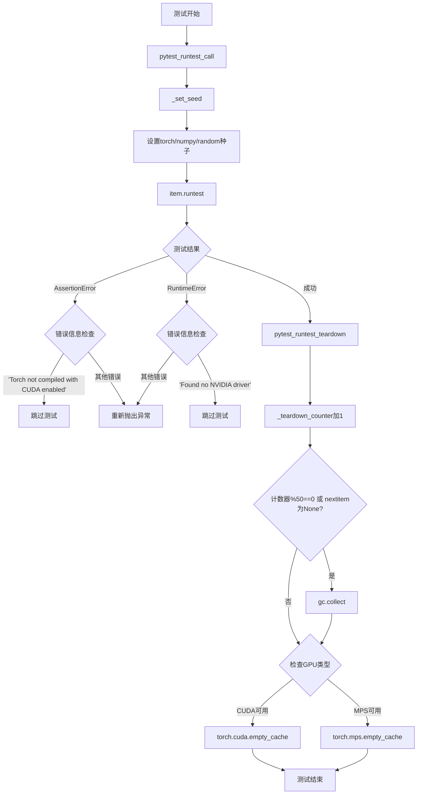
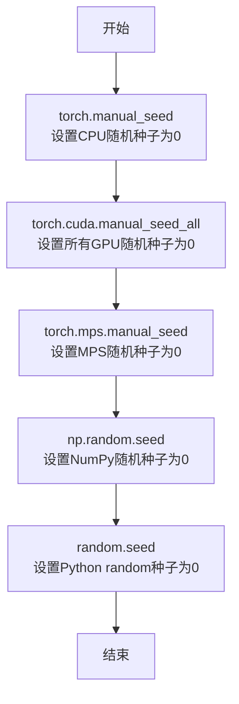
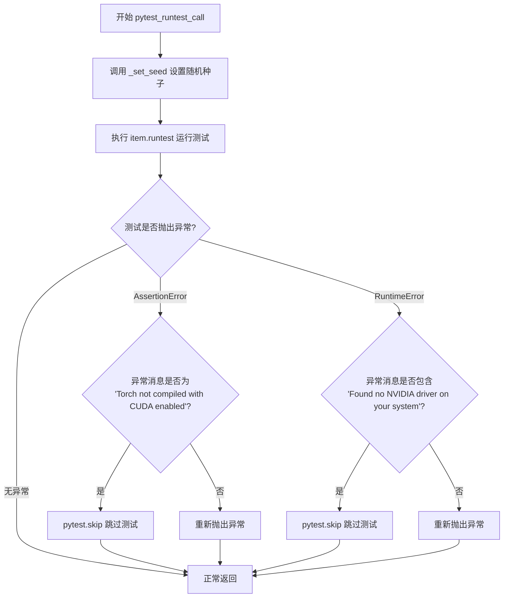
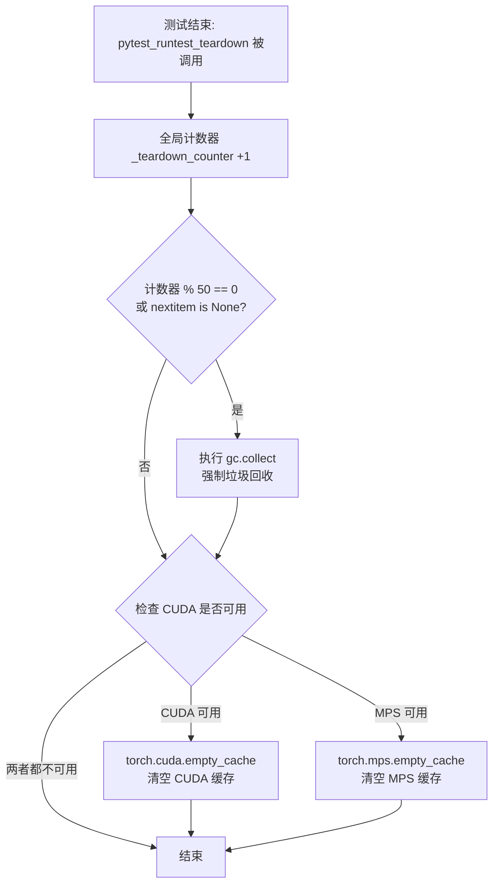
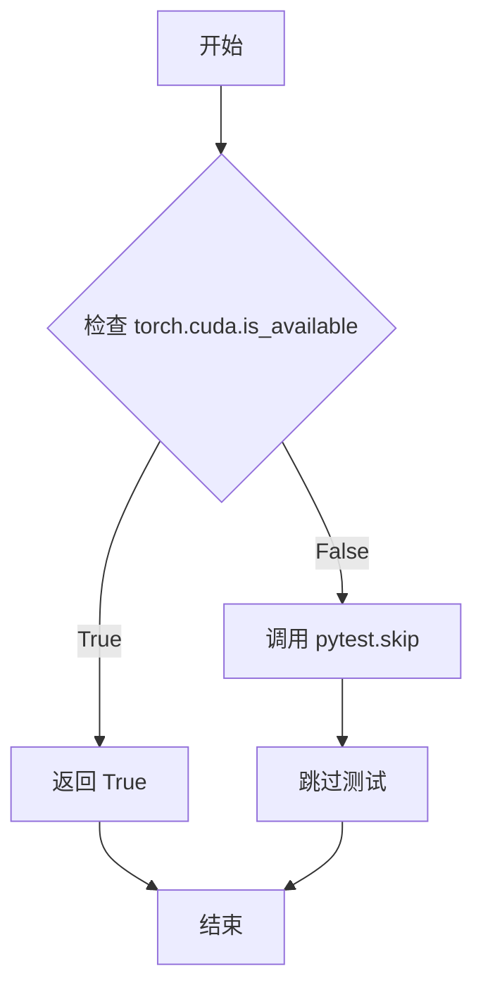

# `bitsandbytes\tests\conftest.py` 详细设计文档

这是一个pytest配置文件模块，核心功能是确保测试的可重复性（通过设置各种随机种子），并管理GPU内存（CUDA和MPS），同时处理CUDA相关的测试跳过逻辑，提供requires_cuda fixture来检查CUDA可用性。

## 整体流程



## 类结构

```
无类定义（基于函数的pytest插件模块）
```

## 全局变量及字段


### `_teardown_counter`
    
全局计数器，用于跟踪teardown调用次数，每50次触发一次完整的垃圾回收

类型：`int`
    


    

## 全局函数及方法


### `_set_seed`

该函数用于设置 PyTorch、NumPy 和 Python random 模块的随机种子，以确保测试的可重复性和确定性。

参数： 无

返回值：`None`，该函数没有返回值，仅执行种子设置操作。

#### 流程图



#### 带注释源码

```python
def _set_seed():
    """
    设置随机种子以确保测试可重复性
    
    该函数会同时设置以下库的随机种子:
    - PyTorch (CPU)
    - PyTorch CUDA (所有GPU)
    - PyTorch MPS (Apple Silicon)
    - NumPy
    - Python random
    
    所有种子都设置为0,确保每次运行产生相同的随机序列
    """
    torch.manual_seed(0)        # 设置PyTorch CPU随机种子为0
    torch.cuda.manual_seed_all(0)  # 设置所有CUDA设备的随机种子为0
    torch.mps.manual_seed(0)    # 设置Apple MPS (Metal Performance Shaders) 随机种子为0
    np.random.seed(0)           # 设置NumPy随机种子为0
    random.seed(0)              # 设置Python内置random模块随机种子为0
```


### `pytest_runtest_call`

该函数是 pytest 钩子函数，在每个测试调用前设置随机种子以确保测试可复现，并处理 CUDA 相关的异常情况（如未编译 CUDA 支持或无 NVIDIA 驱动）。

参数：

- `item`：`pytest.Item`，Pytest 测试项对象，包含待执行测试的信息

返回值：`None`，无返回值（通过异常处理或正常执行完成）

#### 流程图



#### 带注释源码

```python
def pytest_runtest_call(item):
    """
    Pytest 钩子函数，在每个测试调用前设置随机种子并处理 CUDA 相关异常。
    
    参数:
        item: pytest 测试项对象，包含待执行测试的信息
    """
    try:
        # 调用内部函数设置随机种子，确保测试结果可复现
        # 初始化 PyTorch、NumPy、Python random 模块的随机种子
        _set_seed()
        
        # 执行实际的测试函数
        item.runtest()
    except AssertionError as ae:
        # 捕获断言错误，检查是否为 CUDA 相关的特定错误
        if str(ae) == "Torch not compiled with CUDA enabled":
            # 如果 PyTorch 未编译 CUDA 支持，跳过该测试
            pytest.skip("Torch not compiled with CUDA enabled")
        # 其他断言错误重新抛出
        raise
    except RuntimeError as re:
        # 捕获运行时错误，处理 CUDA 设备未找到的情况
        # CUDA-enabled Torch build, but no CUDA-capable device found
        if "Found no NVIDIA driver on your system" in str(re):
            # 如果系统没有 NVIDIA 驱动，跳过该测试
            pytest.skip("No NVIDIA driver found")
        # 其他运行时错误重新抛出
        raise
```


### `pytest_runtest_teardown`

该函数是 Pytest 的测试钩子，在每个测试执行完成后触发，负责清理 GPU 内存（通过 `torch.cuda.empty_cache()` 或 `torch.mps.empty_cache()`），并定期执行垃圾回收以防止内存泄漏。

参数：

- `item`：`pytest.TestCase`，代表当前正在结束的测试项
- `nextitem`：`pytest.TestCase | None`，代表下一个待执行的测试项，如果当前测试是最后一个则为 None

返回值：`None`，无返回值

#### 流程图



#### 带注释源码

```python
@pytest.hookimpl(trylast=True)
def pytest_runtest_teardown(item, nextitem):
    """
    Pytest 钩子函数：在每个测试运行完成后执行清理操作
    
    参数:
        item: 当前测试项对象
        nextitem: 下一个测试项，如果当前是最后一个测试则为 None
    """
    # 增加全局计数器，用于跟踪已执行的测试数量
    global _teardown_counter
    _teardown_counter += 1
    
    # 每执行 50 个测试 或 当测试结束时（nextitem is None）
    # 强制调用垃圾回收，释放 Python 对象内存
    if _teardown_counter % 50 == 0 or nextitem is None:
        gc.collect()
    
    # 检查 CUDA 是否可用，如果可用则清空 CUDA 缓存
    if torch.cuda.is_available():
        torch.cuda.empty_cache()
    # 否则检查 MPS (Apple Silicon GPU) 是否可用并已构建
    elif torch.backends.mps.is_available() and torch.backends.mps.is_built():
        torch.mps.empty_cache()
```

---

### 全局变量

- `_teardown_counter`：`int`，计数器，记录已完成的测试数量，用于定期触发垃圾回收

### 相关全局函数

- `_set_seed()`：设置随机种子以确保测试可重复性

---

### 关键组件信息

| 组件名称 | 一句话描述 |
|---------|-----------|
| `gc.collect()` | Python 内置垃圾回收函数，强制回收无法访问的对象 |
| `torch.cuda.empty_cache()` | PyTorch CUDA 函数，释放未使用的 CUDA 缓存内存 |
| `torch.mps.empty_cache()` | PyTorch MPS (Apple Silicon) 函数，释放 GPU 缓存内存 |

---

### 潜在的技术债务或优化空间

1. **硬编码的清理周期**：每 50 次测试触发一次 GC 是硬编码值，缺乏灵活性，建议改为可配置参数
2. **异常处理缺失**：当前函数没有 try-except 保护，如果 GPU 清理失败会导致整个测试套件中断
3. **设备检测逻辑冗余**：使用 `elif` 导致只会在 CUDA 不可用时才检查 MPS，应同时支持多设备环境
4. **缺少日志记录**：无法追踪内存清理操作的执行情况和效果

---

### 其它项目

#### 设计目标与约束

- **目标**：防止测试过程中的 GPU 内存泄漏，确保长时间测试套件的稳定性
- **约束**：依赖 PyTorch 库，必须在支持 CUDA 或 MPS 的环境中运行

#### 错误处理与异常设计

- 当前未实现异常捕获，若 `empty_cache()` 失败会向上传播
- 建议增加 `try-except` 捕获可能的 CUDA/MPS 运行时错误

#### 数据流与状态机

- 测试执行流程：`pytest_runtest_call` → `item.runtest()` → `pytest_runtest_teardown`
- 内存清理基于计数器状态和设备可用性动态决定

#### 外部依赖与接口契约

- **依赖库**：`gc` (标准库)、`torch` (PyTorch)、`pytest`
- **接口**：遵循 Pytest 插件规范，使用 `@pytest.hookimpl(trylast=True)` 装饰器


### `requires_cuda`

这是一个 pytest fixture，用于检查当前环境是否支持 CUDA。如果 CUDA 不可用，则跳过依赖 CUDA 的测试；如果可用，则返回 `True` 允许测试继续执行。

参数：

- （无参数）

返回值：`bool`，返回 CUDA 是否可用（`True` 表示可用，`False` 表示不可用但会触发跳过）

#### 流程图



#### 带注释源码

```python
@pytest.fixture(scope="session")
def requires_cuda() -> bool:
    """
    pytest fixture，用于检查 CUDA 是否可用。
    
    Returns:
        bool: CUDA 可用返回 True，不可用则跳过测试。
    """
    # 调用 PyTorch 的 CUDA 可用性检查函数
    cuda_available = torch.cuda.is_available()
    
    # 如果 CUDA 不可用，使用 pytest.skip 跳过当前测试
    if not cuda_available:
        pytest.skip("CUDA is required")
    
    # CUDA 可用，返回 True 表示环境满足要求
    return cuda_available
```

## 关键组件


### 随机种子设置模块 (_set_seed)

设置PyTorch、NumPy和Python random模块的种子，确保测试结果的可重复性，支持CPU、CUDA和MPS后端。

### 测试运行钩子 (pytest_runtest_call)

在每个测试执行前设置随机种子，捕获CUDA相关异常并根据情况跳过测试或重新抛出异常。

### 测试清理钩子 (pytest_runtest_teardown)

在每个测试完成后执行资源清理，每50个测试或最后一项测试时触发垃圾回收，并清理CUDA或MPS缓存。

### CUDA可用性检查Fixture (requires_cuda)

Session级别的fixture，用于检查CUDA是否可用，不可用时跳过需要GPU的测试。

### 全局清理计数器 (_teardown_counter)

跟踪已执行的测试清理操作次数，用于控制垃圾回收和缓存清理的频率。


## 问题及建议


### 已知问题

-   **全局变量 `_teardown_counter`**：使用全局变量存储计数器，不符合良好的面向对象设计，在多进程或并行测试环境下可能产生竞态条件
-   **脆弱的异常处理**：通过字符串匹配 `"Torch not compiled with CUDA enabled"` 和 `"Found no NVIDIA driver on your system"` 判断异常类型，这种方式脆弱且容易因版本更新而失效
-   **`requires_cuda` fixture 设计不当**：返回 bool 类型但实际用于跳过测试，调用者无法正确使用其返回值，应改为直接调用 `pytest.skip`
-   **硬编码的清理阈值**：gc.collect 仅每 50 次 teardown 执行一次，这个阈值是硬编码的，缺乏灵活性和可配置性
-   **MPS 设备检测顺序错误**：先调用 `is_available()` 再调用 `is_built()` 的逻辑不当，API 使用方式应调整
- **缺少对其他 GPU 后端的支持**：仅显式处理 CUDA 和 MPS，忽略了对其他可能的 GPU 计算后端的兼容处理
- **异常捕获逻辑问题**：`AssertionError` 通常表示测试失败而非环境问题，不应被捕获后转为跳过测试，这可能隐藏真实的测试失败

### 优化建议

-   使用类或上下文管理器封装全局状态，将 `_teardown_counter` 改为实例变量或使用线程安全的数据结构
-   使用 `torch.cuda.is_available()` 和 `torch.backends.mps.is_available()` 的返回值作为判断条件，避免字符串匹配异常信息
-   重构 `requires_cuda` fixture，直接在 fixture 内部检查并调用 `pytest.skip`，移除返回值
-   将清理阈值提取为可配置的 pytest 参数或环境变量，便于根据不同环境调整
-   修正 MPS 检测逻辑：`torch.backends.mps.is_available()` 已包含必要检查，可简化代码
-   添加对其他 GPU 后端的通用检测机制，使用 `torch.cuda.device_count()` 或 `torch.get_num_threads()` 等通用方法
-   移除对 `AssertionError` 的捕获，或仅对特定类型的断言错误进行区分处理
-   考虑添加日志记录功能，记录内存清理操作以便于调试和问题追踪
-   考虑在并行测试场景下使用 pytest 的 `worker_id` 区分不同 worker 的清理计数器


## 其它


### 设计目标与约束

本代码是一个pytest插件，旨在确保PyTorch测试的确定性（deterministic）和可重现性（reproducibility）。主要约束包括：1) 仅支持PyTorch测试框架；2) 需要PyTorch、NumPy、random模块支持；3) CUDA和MPS（Apple Silicon）为可选依赖；4) 必须与pytest框架集成。

### 错误处理与异常设计

代码处理两类异常：AssertionError和RuntimeError。当捕获到"Torch not compiled with CUDA enabled"时跳过测试；当捕获到"Found no NVIDIA driver on your system"时也跳过测试。其他异常直接重新抛出。_set_seed函数没有异常处理，因为设置种子操作通常不会失败。

### 数据流与状态机

测试执行流程：pytest_runtest_call → _set_seed() → item.runtest() → pytest_runtest_teardown → gc.collect()/empty_cache()。全局变量_teardown_counter记录已完成测试数量，每50个测试触发一次完整GC，最后一个测试也触发GC。

### 外部依赖与接口契约

主要依赖：gc（标准库）、random（标准库）、numpy、pytest、torch。提供pytest.fixture: requires_cuda，返回bool值。提供pytest.hookimpl: pytest_runtest_call和pytest_runtest_teardown。

### 性能考虑

每50个测试才执行完整的gc.collect()，减少频繁GC开销。CUDA和MPS缓存清理仅在可用时执行，避免不必要的API调用。trylast=True确保在其他hook后执行清理。

### 平台兼容性

代码支持三种计算后端：CUDA（NVIDIA）、MPS（Apple Silicon）、CPU。使用torch.cuda.is_available()、torch.backends.mps.is_available()和torch.backends.mps.is_built()进行条件检查。MPS需要is_built()额外检查，因为is_available()可能在非MPS构建上返回True。

### 资源管理

全局计数器_teardown_counter管理清理周期。CUDA内存通过torch.cuda.empty_cache()清理，MPS通过torch.mps.empty_cache()清理。gc.collect()用于常规Python对象回收。

### 可维护性与扩展性

硬编码的种子值(0)和清理周期(50)是潜在的可配置点。_set_seed函数设计为可复用的独立函数，便于其他模块调用。异常消息字符串硬编码，缺乏常量定义。

    