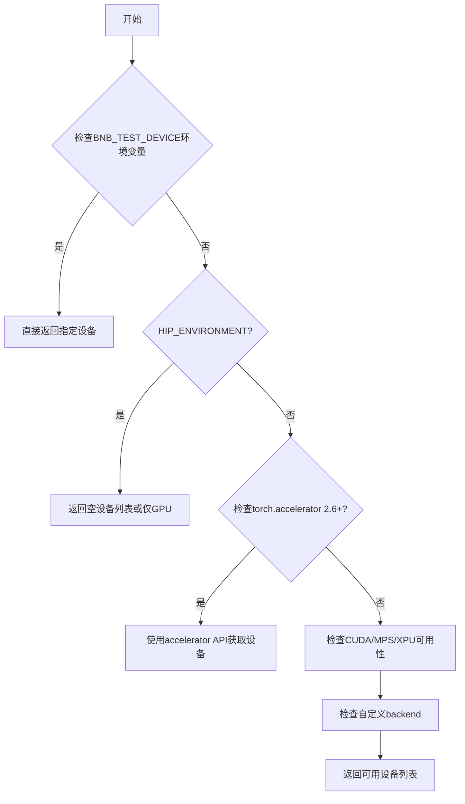
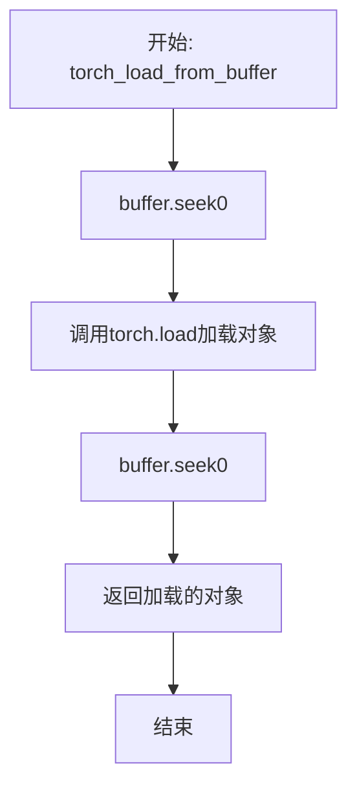

# `bitsandbytes\tests\helpers.py` 详细设计文档

该代码是 bitsandbytes 库的测试辅助模块，提供了设备检测与管理张量序列化/反序列化功能，以及测试所需的维度生成、值格式化、数据类型描述和HPU兼容性检查等工具函数。

## 整体流程



## 类结构

```
该文件为模块文件，不包含类定义
所有函数和变量均为模块级全局定义
```

## 全局变量及字段


### `test_dims_rng`
    
用于生成测试维度的随机数生成器，使用固定种子42以确保可重复性

类型：`random.Random`
    


### `TRUE_FALSE`
    
包含布尔值True和False的元组，作为生成布尔组合的基础

类型：`tuple[bool, bool]`
    


### `BOOLEAN_TRIPLES`
    
所有3元组布尔值组合的列表，共8种组合，用于测试参数化

类型：`list[tuple[bool, bool, bool]]`
    


### `BOOLEAN_TUPLES`
    
所有2元组布尔值组合的列表，共4种组合，用于测试参数化

类型：`list[tuple[bool, bool]]`
    


### `DTYPE_NAMES`
    
将PyTorch数据类型映射到简洁字符串名称的字典，用于数据类型的可读性描述

类型：`dict[torch.dtype, str]`
    


    

## 全局函数及方法


### `get_available_devices`

该函数用于检测并返回当前环境中可用的计算设备列表，支持 CPU、CUDA、MPS、XPU 以及自定义后端，并可通过环境变量强制指定设备。

参数：

- `no_cpu`：`bool`，可选参数（默认为 `False`），当设为 `True` 时排除 CPU 设备

返回值：`list[str]`，返回可用设备名称的列表，例如 `["cuda"]`、`["cpu", "mps"]` 等

#### 流程图

```mermaid
flowchart TD
    A[开始 get_available_devices] --> B{BNB_TEST_DEVICE 环境变量是否设置}
    B -- 是 --> C{no_cpu 为 True 且 device 为 'cpu'}
    C -- 是 --> D[返回空列表]
    C -- 否 --> E[返回 [device]]
    B -- 否 --> F{HIP_ENVIRONMENT 为 True?}
    F -- 是 --> G[devices = []]
    F -- 否 --> H{no_cpu 为 True?}
    H -- 是 --> G
    H -- 否 --> I[devices = ['cpu']]
    G --> J{torch.accelerator 是否存在 PyTorch 2.6+?}
    I --> J
    J -- 是 --> K{torch.accelerator.is_available?}
    J -- 否 --> L[检查 torch.cuda.is_available]
    K -- 是 --> M[devices += current_accelerator]
    K -- 否 --> N[检查旧版 API]
    M --> Z[返回 devices]
    L -- 是 --> O[devices += ['cuda']]
    L -- 否 --> P[检查 torch.backends.mps]
    O --> P
    P -- 是 --> Q[devices += ['mps']]
    P -- 否 --> R[检查 torch.xpu]
    Q --> R
    R -- 是 --> S[devices += ['xpu']]
    R -- 否 --> T[获取自定义后端名称]
    S --> T
    T --> U{自定义后端 is_available?}
    U -- 是 --> V[devices += [custom_backend_name]]
    U -- 否 --> Z
    V --> Z[返回 devices]
    N --> L
```

#### 带注释源码

```python
@functools.cache
def get_available_devices(no_cpu=False):
    """
    获取当前环境中可用的计算设备列表。
    
    支持的设备类型：CPU、CUDA、MPS、XPU、自定义后端（如 HPU）。
    可通过 BNB_TEST_DEVICE 环境变量强制指定设备。
    
    参数:
        no_cpu: bool, 默认为 False。为 True 时排除 CPU 设备。
    
    返回:
        list[str]: 可用设备名称列表
    """
    # 检查环境变量 BNB_TEST_DEVICE 是否被设置，用于强制指定测试设备
    if "BNB_TEST_DEVICE" in os.environ:
        # 如果环境变量被设置，直接使用它
        device = os.environ["BNB_TEST_DEVICE"]
        # 如果 no_cpu 为 True 且设备为 'cpu'，返回空列表；否则返回包含该设备的列表
        return [] if no_cpu and device == "cpu" else [device]

    # 初始化设备列表：根据 HIP_ENVIRONMENT 决定是否包含 CPU
    # HIP 环境（如 AMD GPU）默认不包含 CPU，其他情况根据 no_cpu 决定
    devices = [] if HIP_ENVIRONMENT else ["cpu"] if not no_cpu else []

    # 检查 PyTorch 2.6+ 的统一加速器 API
    if hasattr(torch, "accelerator"):
        # PyTorch 2.6+ - 使用与硬件无关的 API 确定加速器
        if torch.accelerator.is_available():
            devices += [str(torch.accelerator.current_accelerator())]
    else:
        # 旧版 PyTorch：分别检查各后端
        # 检查 CUDA (NVIDIA GPU)
        if torch.cuda.is_available():
            devices += ["cuda"]

        # 检查 MPS (Apple Silicon GPU)
        if torch.backends.mps.is_available():
            devices += ["mps"]

        # 检查 XPU (Intel GPU)
        if hasattr(torch, "xpu") and torch.xpu.is_available():
            devices += ["xpu"]

        # 检查自定义后端 (privateuse1，例如 HPU 或其他第三方加速器)
        custom_backend_name = torch._C._get_privateuse1_backend_name()
        custom_backend_module = getattr(torch, custom_backend_name, None)
        custom_backend_is_available_fn = getattr(custom_backend_module, "is_available", None)

        # 如果自定义后端的 is_available 函数存在且返回 True，则添加该后端
        if custom_backend_is_available_fn and custom_backend_module.is_available():
            devices += [custom_backend_name]

    return devices
```


### `torch_save_to_buffer`

该函数是一个用于将 PyTorch 对象序列化并保存到内存缓冲区（BytesIO）的工具函数。它封装了 `torch.save` 的基本用法，提供了一个简洁的接口用于将对象保存为内存中的字节流，方便后续传输或缓存。

参数：

- `obj`：`Any`，需要序列化的任意 Python 对象，通常为 PyTorch 的张量、模型或字典等可序列化对象

返回值：`BytesIO`，包含序列化后对象数据的内存缓冲区，读取指针已重置到起始位置（seek(0)）

#### 流程图

```mermaid
flowchart TD
    A[开始: torch_save_to_buffer] --> B[创建BytesIO缓冲区]
    B --> C[调用torch.save将obj保存到buffer]
    C --> D[buffer.seek(0)重置读取指针]
    D --> E[返回buffer对象]
    
    style A fill:#f9f,stroke:#333
    style E fill:#9f9,stroke:#333
```

#### 带注释源码

```python
def torch_save_to_buffer(obj):
    """
    将PyTorch对象序列化并保存到内存缓冲区。
    
    参数:
        obj: 任意可序列化的Python对象（通常为torch.Tensor、torch.nn.Module或包含它们的容器）
    
    返回:
        BytesIO: 包含序列化后对象数据的内存缓冲区，指针已重置到起始位置
    """
    # 步骤1: 创建一个空的内存字节缓冲区（BytesIO对象）
    # BytesIO是io模块提供的类，可以在内存中读写字节数据
    buffer = BytesIO()
    
    # 步骤2: 使用torch.save将对象序列化并写入缓冲区
    # torch.save会使用Python的pickle模块进行序列化
    # 第二个参数可以是文件路径、文件对象或类似缓冲区的东西
    torch.save(obj, buffer)
    
    # 步骤3: 将缓冲区的读取指针移动到起始位置(偏移量为0)
    # 这是必要的，因为torch.save写入数据后，指针会移动到末尾
    # 调用者需要从头读取数据，所以需要重置指针
    buffer.seek(0)
    
    # 步骤4: 返回可复用的缓冲区对象
    # 调用者可以使用buffer.read()获取所有字节数据
    # 或者直接传递给torch_load_from_buffer进行反序列化
    return buffer
```


### `torch_load_from_buffer`

该函数用于从 BytesIO 缓冲区中加载 PyTorch 对象，通过将缓冲区指针重置到起始位置，使用 PyTorch 的 `torch.load` 方法读取对象，然后再次重置指针以确保缓冲区状态一致。

参数：

- `buffer`：`BytesIO`，包含已序列化 PyTorch 对象的内存缓冲区

返回值：`Any`，从缓冲区加载的 PyTorch 对象（可以是模型、tensor、字典等任意可序列化对象）

#### 流程图



#### 带注释源码

```python
def torch_load_from_buffer(buffer):
    """
    从 BytesIO 缓冲区加载 PyTorch 对象。
    
    参数:
        buffer: 包含已序列化 PyTorch 对象的 BytesIO 缓冲区
        
    返回:
        加载的 PyTorch 对象
    """
    buffer.seek(0)  # 将缓冲区指针移动到起始位置，确保从头开始读取
    obj = torch.load(buffer, weights_only=False)  # 使用 torch.load 加载对象，weights_only=False 允许加载任意类型的对象
    buffer.seek(0)  # 再次将指针重置到起始位置，保持缓冲区状态一致，便于后续可能的其他操作
    return obj  # 返回加载的对象
```


### `get_test_dims`

该函数用于生成指定数量的随机整数列表，这些整数在给定的最小值和最大值之间均匀分布，常用于测试场景中生成随机维度参数。

参数：

- `min`：`int`，随机整数的最小值（包含）
- `max`：`int`，随机整数的最大值（包含）
- `n`：`int`（关键字参数），要生成的随机整数数量

返回值：`list[int]`，包含 n 个随机整数的列表，每个整数位于 [min, max] 区间内

#### 流程图

```mermaid
flowchart TD
    A[开始 get_test_dims] --> B[接收参数: min, max, n]
    B --> C[创建空列表]
    C --> D{循环 i 从 0 到 n-1}
    D --> E[调用 test_dims_rng.randint(min, max)]
    E --> F[将随机整数添加到列表]
    F --> D
    D --> G[返回完整的整数列表]
    G --> H[结束]
```

#### 带注释源码

```python
def get_test_dims(min: int, max: int, *, n: int) -> list[int]:
    """
    生成指定数量的随机整数列表。
    
    该函数使用预定义的随机数生成器 test_dims_rng（种子为42）来产生
    确定性可重复的随机整数序列，常用于测试场景。
    
    参数:
        min: 随机整数的下界（包含）
        max: 随机整数的上界（包含）
        n: 需要生成的随机整数数量（关键字参数）
    
    返回:
        包含 n 个随机整数的列表，每个整数位于 [min, max] 区间内
    
    示例:
        >>> get_test_dims(1, 10, n=3)
        [7, 4, 9]  # 示例输出，实际值可能不同但可复现
    """
    # 使用列表推导式生成 n 个随机整数
    # test_dims_rng 是预定义的 random.Random(42) 实例
    return [test_dims_rng.randint(min, max) for _ in range(n)]
```


### `format_with_label`

该函数用于将标签与值格式化为字符串，支持布尔值的简洁表示（"T"/"F"）、布尔列表/元组的批量转换、PyTorch数据类型的描述名称，以及其他类型的默认字符串转换，最终返回 `label=formatted_value` 格式的字符串。

参数：

- `label`：`str`，用于标识值的前缀标签
- `value`：`Any`，要格式化的值，支持 bool、bool 列表/元组、torch.dtype 或其他任意类型

返回值：`str`，格式化后的字符串，格式为 "{label}={formatted_value}"

#### 流程图

```mermaid
flowchart TD
    A[开始 format_with_label] --> B{value 是否为 bool}
    B -->|是| C[formatted = "T" if value else "F"]
    B -->|否| D{value 是否为 list/tuple<br/>且所有元素为 bool}
    D -->|是| E[formatted = 拼接所有 bool 的 "T"/"F"]
    D -->|否| F{value 是否为 torch.dtype}
    F -->|是| G[formatted = describe_dtype(value)]
    F -->|否| H[formatted = str(value)]
    C --> I[返回 f"{label}={formatted}"]
    E --> I
    G --> I
    H --> I
```

#### 带注释源码

```python
def format_with_label(label: str, value: Any) -> str:
    """
    将标签与值格式化为字符串。
    
    支持以下格式：
    - bool: 转换为 "T" 或 "F"
    - list/tuple of bool: 转换为 "TTF" 等字符串
    - torch.dtype: 使用 describe_dtype 转换为描述名称
    - 其他: 使用 str() 转换
    """
    # 判断值是否为单个布尔值
    if isinstance(value, bool):
        # 布尔值转换为 "T" (True) 或 "F" (False)
        formatted = "T" if value else "F"
    # 判断值是否为布尔值列表或元组
    elif isinstance(value, (list, tuple)) and all(isinstance(v, bool) for v in value):
        # 将所有布尔值拼接为字符串，如 [True, False, True] -> "TFT"
        formatted = "".join("T" if b else "F" for b in value)
    # 判断值是否为 PyTorch 数据类型
    elif isinstance(value, torch.dtype):
        # 使用 describe_dtype 获取类型描述名称
        formatted = describe_dtype(value)
    else:
        # 其他类型使用默认字符串转换
        formatted = str(value)
    
    # 返回格式化字符串，格式为 "label=value"
    return f"{label}={formatted}"
```


### `id_formatter`

该函数是一个高阶函数，接受一个标签字符串作为参数，返回一个匿名函数（lambda）。该返回的匿名函数可以接收任意值，并将其与标签一起格式化为字符串。这是测试框架中用于生成唯一标识符的一部分。

参数：

- `label`：`str`，用于格式化的标签名称

返回值：`Callable[[Any], str]`，返回一个闭包函数，该函数接收任意值并调用 `format_with_label` 将其与标签格式化为字符串

#### 流程图

```mermaid
flowchart TD
    A[开始 id_formatter] --> B[接收参数 label: str]
    B --> C[创建闭包 lambda value: format_with_label(label, value)]
    C --> D[返回闭包函数]
    D --> E[结束]
    
    F[调用返回的函数] --> G[接收 value: Any]
    G --> H[调用 format_with_label(label, value)]
    H --> I[返回格式化字符串]
```

#### 带注释源码

```python
def id_formatter(label: str):
    """
    Return a function that formats the value given to it with the given label.
    
    这是一个工厂函数，它创建并返回一个闭包。
    返回的函数可以捕获 label 参数，并在后续调用时使用它。
    
    参数:
        label (str): 用于格式化的标签名称
        
    返回:
        Callable[[Any], str]: 一个函数，接收任意类型的值，
                              并返回格式化为 'label=value' 形式的字符串
    """
    # 使用 lambda 表达式创建一个闭包，捕获当前的 label 值
    # 当返回的函数被调用时，它会将传入的 value 与 label 一起传递给 format_with_label
    return lambda value: format_with_label(label, value)
```


### `describe_dtype`

该函数用于将 PyTorch 的数据类型（torch.dtype）转换为可读的字符串名称。如果 dtype 在预定义的映射表 DTYPE_NAMES 中有对应条目，则返回对应的简短名称（如 "bf16"、"fp32" 等），否则从 dtype 的字符串表示中提取类型名称。

参数：

- `dtype`：`torch.dtype`，要转换的 PyTorch 数据类型

返回值：`str`，dtype 的可读字符串表示

#### 流程图

```mermaid
flowchart TD
    A[开始: describe_dtype] --> B{检查 dtype 是否在 DTYPE_NAMES 中}
    B -->|是| C[返回 DTYPE_NAMES[dtype]]
    B -->|否| D[将 dtype 转为字符串]
    D --> E[使用 rpartition 提取最后一个"."后的部分]
    E --> F[返回提取的字符串]
    C --> G[结束]
    F --> G
```

#### 带注释源码

```python
def describe_dtype(dtype: torch.dtype) -> str:
    """
    将 PyTorch dtype 转换为可读的字符串名称。
    
    参数:
        dtype: torch.dtype - 要转换的 PyTorch 数据类型
    
    返回:
        str - dtype 的字符串表示
    """
    # 首先尝试从预定义映射表中获取对应的简短名称
    # DTYPE_NAMES 映射了常见的 dtype 到其简短表示
    # 例如: torch.bfloat16 -> "bf16", torch.float32 -> "fp32"
    return DTYPE_NAMES.get(dtype) or str(dtype).rpartition(".")[2]
    # 如果映射表中不存在，则将 dtype 转为字符串
    # 使用 rpartition 以"."为分隔符分割字符串，取最后一部分
    # 例如: torch.float32 -> "torch.float32" -> "float32"
```


### `is_supported_on_hpu`

检查给定的量化类型、数据类型和量化存储类型是否在 HPU（Habana Processing Unit）上受支持。

参数：

- `quant_type`：`str`，量化类型，默认为 "nf4"，支持的值包括 "nf4" 等
- `dtype`：`torch.dtype`，数据类型，默认为 torch.bfloat16
- `quant_storage`：`torch.dtype`，量化存储类型，默认为 torch.uint8

返回值：`bool`，如果给定的配置在 HPU 上受支持则返回 True，否则返回 False

#### 流程图

```mermaid
flowchart TD
    A[开始 is_supported_on_hpu] --> B{quant_type == 'fp4'?}
    B -->|是| C[返回 False]
    B -->|否| D{dtype == torch.float16?}
    D -->|是| C
    D -->|否| E{quant_storage in (uint8, bfloat16)?}
    E -->|否| C
    E -->|是| F[返回 True]
    
    style C fill:#ff6b6b
    style F fill:#51cf66
```

#### 带注释源码

```python
def is_supported_on_hpu(
    quant_type: str = "nf4", 
    dtype: torch.dtype = torch.bfloat16, 
    quant_storage: torch.dtype = torch.uint8
) -> bool:
    """
    Check if the given quant_type, dtype and quant_storage are supported on HPU.
    
    参数:
        quant_type: 量化类型，默认为 "nf4"
        dtype: 数据类型，默认为 torch.bfloat16
        quant_storage: 量化存储类型，默认为 torch.uint8
    
    返回:
        bool: 如果配置在 HPU 上受支持返回 True，否则返回 False
    """
    # 检查是否不支持的情况：
    # 1. quant_type 为 "fp4" - HPU 不支持 fp4 量化
    # 2. dtype 为 torch.float16 - HPU 不支持 float16
    # 3. quant_storage 不是 uint8 或 bfloat16 - HPU 仅支持这两种存储类型
    if quant_type == "fp4" or dtype == torch.float16 or quant_storage not in (torch.uint8, torch.bfloat16):
        return False
    
    # 通过所有检查，返回 True 表示配置受支持
    return True
```

## 关键组件


### 设备检测与获取 (get_available_devices)

该函数负责检测并返回可用的计算设备，支持CPU、CUDA、MPS、XPU以及自定义后端，并通过环境变量BNB_TEST_DEVICE允许手动指定设备。

### 张量序列化工具 (torch_save_to_buffer/torch_load_from_buffer)

这两个函数提供张量到内存缓冲区的序列化和反序列化功能，用于在内存中快速保存和加载PyTorch对象，避免磁盘I/O操作。

### 测试维度生成器 (get_test_dims)

该函数使用预定义的随机种子生成指定数量和范围内的随机整数维度，用于测试中的参数化场景。

### 数据类型描述系统 (describe_dtype/DTYPE_NAMES)

建立PyTorch数据类型到简洁字符串名称的映射（如bf16、fp16、int8等），并提供格式化和标签功能用于测试输出。

### HPU支持检查器 (is_supported_on_hpu)

该函数验证给定的量化类型、数据类型和量化存储类型是否在华为昇腾（HPU）上受支持，用于条件性跳过某些测试场景。

### 布尔组合生成器 (BOOLEAN_TRIPLES/BOOLEAN_TUPLES)

预生成布尔值的所有可能组合，用于测试中的参数化枚举，涵盖2^3=8种三元组和2^2=4种二元组情况。


## 问题及建议


### 已知问题

-   **全局可变状态**: `test_dims_rng` 是一个全局 `Random` 对象，可能导致测试之间的状态污染和不确定性
-   **模块级常量计算**: `BOOLEAN_TRIPLES` 和 `BOOLEAN_TUPLES` 在模块导入时即被计算，即使从未使用也会产生内存开销
-   **参数命名与关键字冲突**: `get_test_dims` 函数中参数名 `min` 和 `max` 与 Python 内置关键字冲突，可能导致意外行为
-   **环境变量缺乏验证**: `BNB_TEST_DEVICE` 环境变量直接使用而无输入验证，可能导致注入风险
-   **HPU 支持逻辑可能存在错误**: `is_supported_on_hpu` 函数中 `quant_storage not in (torch.uint8, torch.bfloat16)` 的判断逻辑过于严格，可能误判合法配置
-   **设备检测逻辑重复**: 在 `get_available_devices` 中检测自定义后端时，使用了 `getattr` 和条件检查的冗余模式，可简化
-   **无错误处理**: 关键函数如 `torch_load_from_buffer` 缺少异常处理机制，可能导致静默失败
-   **类型注解不完整**: `format_with_label` 函数的返回值类型标注为 `str`，但实际实现可能返回其他类型

### 优化建议

-   **延迟计算全局常量**: 将 `BOOLEAN_TRIPLES` 和 `BOOLEAN_TUPLES` 改为使用 `@functools.lru_cache` 装饰的函数，在首次访问时计算
-   **重构参数命名**: 将 `get_test_dims` 的参数名 `min`/`max` 改为 `min_val`/`max_val`，避免与内置函数冲突
-   **添加输入验证**: 对环境变量 `BNB_TEST_DEVICE` 进行白名单验证，确保设备名称合法
-   **修正 HPU 检查逻辑**: 重新审视 `is_supported_on_hpu` 的业务逻辑，确保与实际硬件支持情况一致
-   **增强错误处理**: 在 I/O 相关函数中添加 try-except 块，捕获并记录可能的异常
-   **简化设备检测**: 使用字典映射或策略模式重构设备检测逻辑，提高可维护性
-   **考虑依赖注入**: 将全局 `test_dims_rng` 通过参数传入，提高函数的可测试性和模块化程度

## 其它


### 设计目标与约束

本模块旨在为 bitsandbytes 库提供测试辅助功能，核心目标包括：(1) 支持多设备环境（CPU、CUDA、MPS、XPU、自定义后端）的自动检测与选择；(2) 提供张量序列化/反序列化的工具函数，用于测试场景下的数据传递；(3) 生成可复现的随机测试维度；(4) 提供统一的格式化输出方法，便于测试日志生成。设计约束方面，模块需保持轻量级依赖，仅依赖 PyTorch 及其相关扩展，不引入额外的测试框架依赖。

### 错误处理与异常设计

本模块的错误处理策略如下：(1) 设备检测函数 `get_available_devices` 在环境变量 `BNB_TEST_DEVICE` 设置为无效值时不会抛出异常，而是直接返回该设备字符串，调用方需自行验证设备有效性；(2) `torch_save_to_buffer` 和 `torch_load_from_buffer` 函数依赖 PyTorch 的 `torch.save`/`torch.load`，其异常由 PyTorch 抛出，模块层面未做额外捕获；(3) `format_with_label` 函数在遇到未知 dtype 时调用 `describe_dtype`，后者通过 `DTYPE_NAMES.get()` 返回原 dtype 字符串表示，不会抛出 KeyError；(4) `is_supported_on_hpu` 函数对不支持的参数组合返回 `False` 而非抛出异常，调用方需根据返回值判断兼容性。整体而言，模块采用"快速失败"与"温和返回"相结合的策略，设备相关错误倾向于返回空列表或特定值，而非中断执行。

### 外部依赖与接口契约

本模块的外部依赖包括：(1) `torch` - 核心依赖，用于设备检测、张量操作、dtype 处理；(2) `bitsandbytes.cextension` - 通过导入 `HIP_ENVIRONMENT` 判断是否为 AMD GPU 环境；(3) Python 标准库 - `functools`（缓存装饰器）、`io.BytesIO`（内存缓冲区）、`itertools.product`（布尔组合生成）、`os`（环境变量读取）、`random`（随机数生成）、`typing`（类型注解）。接口契约方面：`get_available_devices(no_cpu=False)` 返回设备字符串列表，参数 `no_cpu` 为 `bool` 类型，默认 `False`；`torch_save_to_buffer(obj)` 接受任意可序列化对象，返回 `BytesIO` 对象；`torch_load_from_buffer(buffer)` 接受 `BytesIO` 或类似文件对象，返回反序列化后的对象；`get_test_dims(min, max, n)` 返回 `list[int]`，长度为 `n`；`format_with_label(label, value)` 和 `id_formatter(label)` 均返回字符串；`describe_dtype(dtype)` 接受 `torch.dtype` 返回字符串；`is_supported_on_hpu(quant_type, dtype, quant_storage)` 返回 `bool`。

### 性能考虑

本模块的性能优化点包括：(1) `get_available_devices` 函数使用 `@functools.cache` 装饰器缓存设备检测结果，避免重复调用时的重复检测开销；(2) `BOOLEAN_TRIPLES` 和 `BOOLEAN_TUPLES` 在模块加载时预先计算为列表，避免每次使用时重复调用 `product`；(3) `test_dims_rng` 使用固定的随机种子（42）确保测试可复现性；(4) `DTYPE_NAMES` 字典在模块加载时创建，用于 O(1) 查找而非条件分支。性能开销主要来源于首次调用时的设备检测（包括 CUDA、MPS、XPU、自定义后端的多重检测），后续调用由缓存机制保证高效。

### 兼容性考虑

本模块的兼容性设计涵盖多个层面：(1) Python 版本方面，代码使用 `list[int]` 等现代类型注解，要求 Python 3.9+，但未做显式版本检查；(2) PyTorch 版本方面，代码通过 `hasattr(torch, "accelerator")` 判断是否支持 PyTorch 2.6+ 的统一加速器 API，若不支持则回退到传统的 `torch.cuda.is_available()`、`torch.backends.mps.is_available()` 等检测方式；(3) 设备兼容性方面，代码通过 `torch._C._get_privateuse1_backend_name()` 支持自定义后端（如 Intel GPU 的 IPU 或其他私有后端），具有良好的扩展性；(4) HIP 环境方面，通过 `HIP_ENVIRONMENT` 标志位区分 AMD ROCm 环境与 NVIDIA CUDA 环境，确保在 AMD GPU 上的正确行为。

### 配置管理

本模块的配置管理主要通过环境变量实现：(1) `BNB_TEST_DEVICE` - 最高优先级配置，允许用户显式指定测试设备，覆盖自动检测逻辑，当设置为 "cpu" 且 `no_cpu=True` 时返回空列表；(2) 代码内部配置包括 `test_dims_rng` 的随机种子（固定为 42，确保测试可复现）、`DTYPE_NAMES` 的 dtype 映射表（硬编码在代码中）、`TRUE_FALSE` 和布尔组合常量（模块级常量）。配置优先级为：环境变量 > 自动检测 > 默认行为（CPU）。模块未提供运行时配置修改接口，所有配置需在模块导入前设置完成。

### 数据流与状态机

本模块的数据流相对简单，主要包含以下路径：(1) 设备检测流程：`get_available_devices` 根据环境变量或自动检测结果返回可用设备列表，无状态机设计；(2) 张量序列化流程：`torch_save_to_buffer` 接收 Python 对象 → 写入 `BytesIO` 缓冲区 → 返回缓冲区对象 → `torch_load_from_buffer` 接收缓冲区 → seek 到起始位置 → 反序列化对象 → 返回对象，缓冲区状态在函数内部重置；(3) 格式化流程：`id_formatter` 返回闭包函数，闭包持有 `label` 引用，调用时接收 `value` 并调用 `format_with_label` 生成格式化字符串；(4) HPU 兼容性判断：`is_supported_on_hpu` 根据三个输入参数的条件组合返回布尔值，为纯函数无状态。整体而言，模块内无复杂状态机设计，以无状态工具函数为主。

### 测试策略建议

虽然本模块为测试辅助模块，但自身也需测试覆盖，建议的测试策略包括：(1) 设备检测测试：Mock 不同的 torch API 状态，验证返回设备列表的正确性；(2) 序列化测试：创建已知张量，验证 `torch_save_to_buffer` + `torch_load_from_buffer` 往返后数据一致性；(3) 格式化测试：覆盖 bool、dtype、list/tuple of bool、普通值等分支，验证输出格式；(4) HPU 兼容性测试：覆盖 `is_supported_on_hpu` 的所有参数组合，验证返回值与预期一致；(5) 可复现性测试：多次调用 `get_test_dims` 验证相同参数产生相同序列。测试应使用 pytest 或 unittest 框架，并通过 Mock/Patch 隔离外部依赖（如 torch.cuda.is_available）。

### 安全考虑

本模块的安全风险较低，主要关注点包括：(1) 环境变量注入：读取 `BNB_TEST_DEVICE` 时未做白名单验证，理论上可注入任意字符串，但因仅用于测试环境，风险可控；(2) 张量反序列化：`torch_load_from_buffer` 使用 `weights_only=False`，允许加载任意 Python 对象，调用方需确保数据来源可信；(3) 自定义后端检测：使用 `getattr` 动态获取自定义后端模块，理论上存在属性访问风险，但因仅调用 `is_available` 方法且在测试环境使用，风险可控。整体而言，模块适用于测试环境，不建议在生产环境直接使用。

### 潜在扩展方向

基于当前设计，模块可考虑以下扩展：(1) 添加设备优先级配置，允许用户指定多设备时的首选顺序；(2) 添加日志记录功能，在设备检测和张量序列化过程中输出详细信息；(3) 添加性能基准测试工具，记录序列化/反序列化耗时；(4) 扩展 `is_supported_on_hpu` 函数支持更多量化类型和存储类型；(5) 添加测试数据生成器，支持更多数据类型（浮点数、字符串等）的随机生成。


    