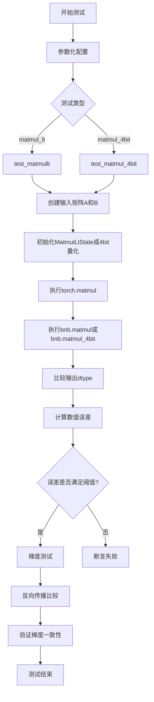
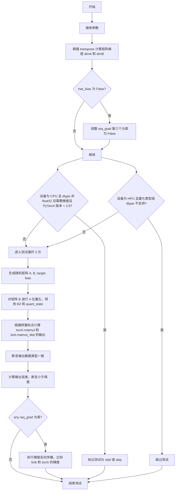
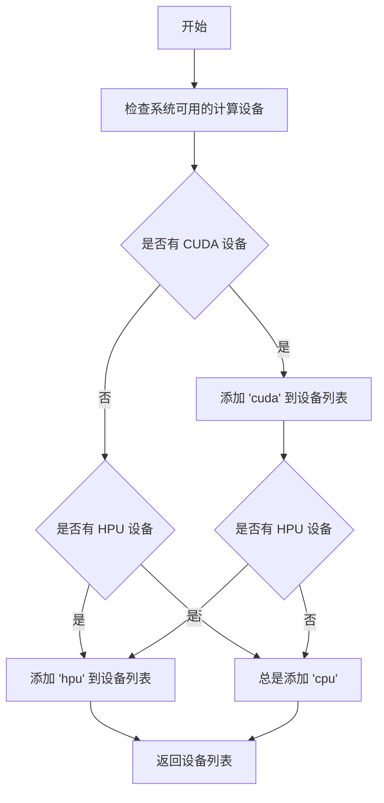
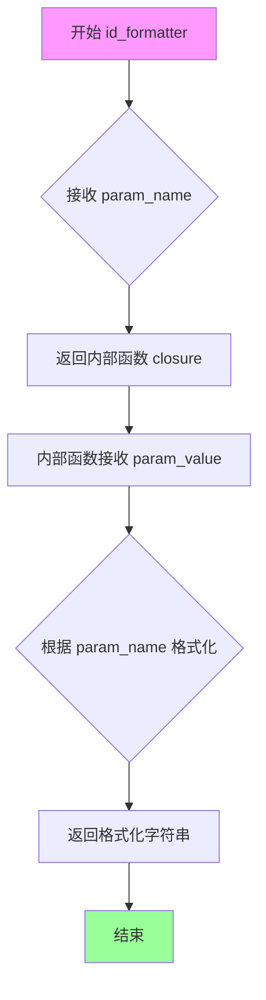
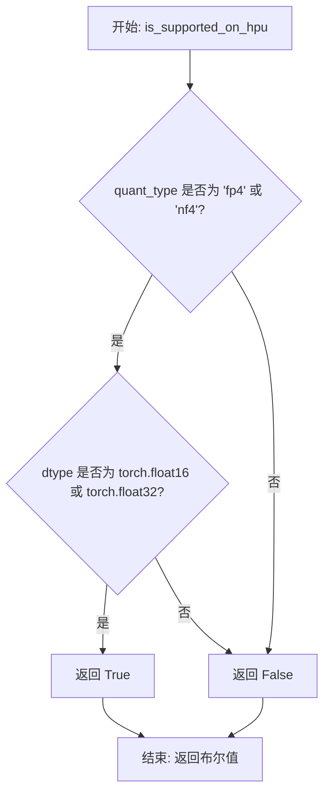
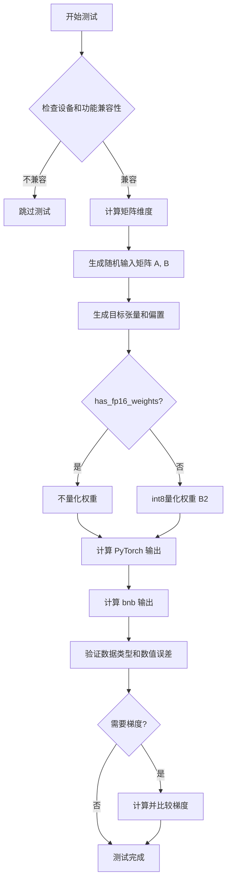
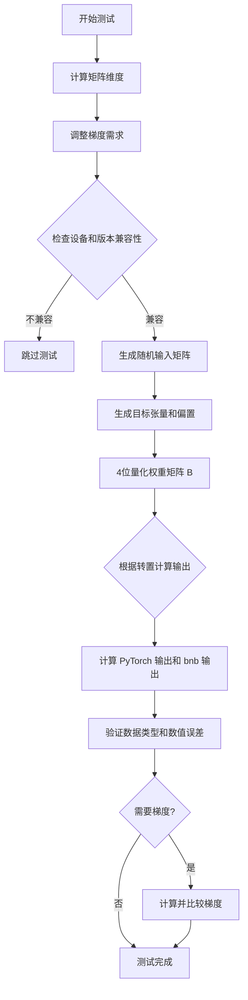

# `bitsandbytes\tests\test_autograd.py` 详细设计文档

这是一个pytest测试文件，用于测试bitsandbytes库的矩阵乘法功能，包括8位量化矩阵乘法(matmul_lt)和4位量化矩阵乘法(matmul_4bit)，验证其与PyTorch原生矩阵乘法的数值一致性和梯度正确性。

## 整体流程



## 类结构

```
测试模块 (test file)
├── test_matmullt (8位矩阵乘法测试)
└── test_matmul_4bit (4位矩阵乘法测试)
```

## 全局变量及字段


### `TRANSPOSE_VALS`
    
包含两个元组的列表，用于控制矩阵转置参数

类型：`List[Tuple[bool, bool]]`
    


    

## 全局函数及方法


### `test_matmullt`

该函数是一个8位量化矩阵乘法测试函数，通过参数化测试验证 `bnb.matmul` 和 `bnb.research.switchback_bnb` 两种量化矩阵乘法实现与 PyTorch 原生 `torch.matmul` 的一致性，包括前向传播精度和梯度计算正确性。

参数：

- `device`：`str`，测试运行的设备（如 "cuda", "cpu" 等）
- `dim1`：`int`，矩阵维度参数1（固定为40）
- `dim2`：`int`，矩阵维度参数2（测试值：64, 0）
- `dim3`：`int`，矩阵维度参数3（固定为32）
- `dim4`：`int`，矩阵维度参数4（固定为48）
- `funcs`：`tuple`，待测试的函数对，格式为 `(torch.matmul, bnb.matmul)` 或 `(torch.matmul, bnb.research.switchback_bnb)`
- `dtype`：`torch.dtype`，输入数据类型（torch.float16, torch.bfloat16, torch.float32）
- `req_grad`：`tuple`，三个布尔值，分别表示 A、B、bias 是否需要梯度
- `transpose`：`tuple`，两个布尔值，分别表示 A 和 B 是否转置
- `decomp`：`float`，分解阈值参数（测试值：0.0, 6.0）
- `has_fp16_weights`：`bool`，是否使用 fp16 权重
- `has_bias`：`bool`，是否使用偏置

返回值：`None`，该函数为测试函数，无返回值

#### 流程图

```mermaid
flowchart TD
    A[开始测试] --> B{检查设备和功能兼容性}
    B -->|CUDA设备| C[继续执行]
    B -->|非CUDA设备且为switchback_bnb| D[跳过测试]
    B -->|非CUDA设备且req_grad[1]=True| E[跳过测试]
    
    C --> F[计算矩阵维度 dimA, dimB]
    F --> G[生成outlier_dim用于分解测试]
    G --> H{has_bias=False?}
    H -->|是| I[将req_grad[2]设为False]
    H -->|否| J[继续]
    
    I --> J
    J --> K{检查CPU设备兼容性}
    K --> L[执行3次循环测试]
    
    L --> M[创建输入矩阵A和B]
    M --> N[创建target和bias]
    N --> O[初始化bnb.MatmulLtState]
    O --> P{has_fp16_weights?}
    P -->|否| Q[对B进行int8量化]
    P -->|是| R[直接使用B]
    
    Q --> S{根据transpose选择计算方式]
    R --> S
    S --> T[执行torch.matmul和bnb函数]
    T --> U[添加bias到torch结果]
    U --> V[验证输出dtype正确性]
    V --> W[计算误差mean]
    W --> X{验证精度是否满足阈值}
    X -->|不满足| Y[抛出断言错误]
    X -->|满足| Z{has_fp16_weights且需要梯度?}
    
    Z -->|是| AA[复制输出进行梯度测试]
    Z -->|否| AB[继续下次循环]
    
    AA --> AC[计算bnb的loss和梯度]
    AC --> AD[计算torch的loss和梯度]
    AD --> AE[比较A、B、bias的梯度]
    AE --> AB
    
    AB --> AF{循环次数i<3?}
    AF -->|是| M
    AF -->|否| AG[结束测试]
```

#### 带注释源码

```python
# 导入所需的测试库和工具
import pytest
import torch
import bitsandbytes as bnb
from tests.helpers import (
    BOOLEAN_TRIPLES,          # 用于梯度需求的三元组
    TRUE_FALSE,               # 布尔值列表
    describe_dtype,           # 描述数据类型的函数
    get_available_devices,   # 获取可用设备
    id_formatter,             # ID格式化函数
    is_supported_on_hpu,      # 检查HPU支持
)

# 转置参数组合
TRANSPOSE_VALS = [(False, True), (False, False)]

# 参数化测试装饰器，定义测试的所有参数组合
@pytest.mark.parametrize("device", get_available_devices())
@pytest.mark.parametrize("dim1", [40], ids=id_formatter("dim1"))
@pytest.mark.parametrize("dim2", [64, 0], ids=id_formatter("dim2"))
@pytest.mark.parametrize("dim3", [32], ids=id_formatter("dim3"))
@pytest.mark.parametrize("dim4", [48], ids=id_formatter("dim4"))
@pytest.mark.parametrize("decomp", [0.0, 6.0], ids=id_formatter("decomp"))
@pytest.mark.parametrize(
    "funcs",
    [(torch.matmul, bnb.matmul), (torch.matmul, bnb.research.switchback_bnb)],
    ids=["func=matmul", "func=switchback_bnb"],
)
@pytest.mark.parametrize("dtype", [torch.float16, torch.bfloat16, torch.float32], ids=describe_dtype)
@pytest.mark.parametrize("req_grad", BOOLEAN_TRIPLES, ids=id_formatter("req_grad"))
@pytest.mark.parametrize("transpose", TRANSPOSE_VALS, ids=id_formatter("transpose"))
@pytest.mark.parametrize("has_fp16_weights", TRUE_FALSE, ids=id_formatter("has_fp16_weights"))
@pytest.mark.parametrize("has_bias", TRUE_FALSE, ids=id_formatter("has_bias"))

def test_matmullt(
    device, dim1, dim2, dim3, dim4, funcs, dtype, req_grad, transpose, decomp, has_fp16_weights, has_bias
):
    """
    8位量化矩阵乘法测试函数
    
    测试bnb.matmul和bnb.research.switchback_bnb与torch.matmul的一致性
    """
    
    # ==================== 设备兼容性检查 ====================
    # switchback_bnb只在CUDA上支持，非CUDA设备跳过
    if device != "cuda":
        if funcs[1] == bnb.research.switchback_bnb:
            pytest.skip("switchback_bnb only works on CUDA.")
        
        # 梯度相关功能仅在CUDA上支持，非CUDA跳过
        if req_grad[1]:
            pytest.skip("Deprecated feature with CUDA support only.")

    # ==================== 计算矩阵维度 ====================
    # 根据transpose参数确定A和B的维度
    # 如果transpose[0]为True，则A需要转置
    dimA = (dim2, dim3) if not transpose[0] else (dim3, dim2)
    dimB = (dim3, dim4) if not transpose[1] else (dim4, dim3)
    
    # 生成异常值维度索引，用于测试分解功能
    # 随机选择dimA[1]的1/8作为异常维度
    outlier_dim = torch.randint(0, dimA[1], size=(dimA[1] // 8,), device=device)
    
    # ==================== 梯度配置调整 ====================
    # 如果没有bias，强制关闭bias的梯度
    if has_bias == False:
        req_grad = list(req_grad)  # 转换为列表以便修改
        req_grad[2] = False        # bias不需要梯度

    # ==================== CPU兼容性检查 ====================
    # CPU上fp16/bf16在torch<2.6时不支持梯度
    if device == "cpu" and dtype != torch.float32 and has_fp16_weights and any(req_grad):
        if torch.__version__ < (2, 6):
            pytest.xfail("mse_loss bf16/fp16 on CPU is not supported in torch < 2.6")

    # ==================== 执行3次测试循环 ====================
    for i in range(3):
        # 正常矩阵乘法测试
        if funcs[0] in [torch.mm, torch.matmul]:
            # 创建输入矩阵A
            A = torch.randn(size=dimA, device=device, requires_grad=req_grad[0], dtype=dtype)
            
            # 如果decomp=6.0，设置异常值用于测试分解功能
            if decomp == 6.0:
                with torch.no_grad():
                    A[:, outlier_dim] = 6.0
            
            # 创建输入矩阵B
            B = torch.randn(size=dimB, device=device, requires_grad=req_grad[1], dtype=dtype)
            
            # 创建目标张量用于loss计算
            target = torch.randn(
                size=(dim2, dim4),
                device=device,
                requires_grad=req_grad[1],
                dtype=dtype,
            )
            
            # 初始化bias为None
            bias = None
            bias2 = None
            
            # 如果需要bias，创建两个bias副本
            if has_bias:
                bias = torch.randn(dim4, device=device, dtype=dtype, requires_grad=req_grad[2])
                bias2 = bias.clone()
            
            # 使用Xavier均匀初始化B
            torch.nn.init.xavier_uniform_(B)
            B2 = B.clone()

            # ==================== 初始化bnb状态 ====================
            # 创建MatmulLtState用于配置bnb矩阵乘法
            state = bnb.MatmulLtState()
            state.threshold = decomp              # 设置分解阈值
            state.has_fp16_weights = has_fp16_weights  # 设置是否使用fp16权重
            
            # 如果不使用fp16权重，对B进行int8量化
            if not has_fp16_weights:
                # 如果不转置，先转置B再量化
                if not transpose[0] and not transpose[1]:
                    B2 = B2.t().contiguous()
                
                # 执行int8向量量化
                state.CB, state.SCB, _ = bnb.functional.int8_vectorwise_quant(B2.to(torch.float16))
                B2 = state.CB  # 使用量化后的值

            # ==================== 执行矩阵乘法 ====================
            # 根据transpose参数选择计算方式
            if not transpose[0] and transpose[1]:
                # A不转置，B转置
                out_torch = funcs[0](A, B.t())          # torch计算
                out_bnb = funcs[1](A, B2, state=state, bias=bias2)  # bnb计算
            elif not transpose[0] and not transpose[1]:
                # 都不转置
                out_torch = funcs[0](A, B)
                out_bnb = funcs[1](A, B2.t(), state=state, bias=bias2)
            
            # 如果有bias，加到torch结果上
            if has_bias:
                out_torch += bias

            # ==================== 验证输出类型 ====================
            assert out_bnb.dtype == A.dtype, f"bnb matmullt received {A.dtype} but returned {out_bnb.dtype}"

            # ==================== 计算误差 ====================
            n = out_bnb.numel()  # 输出元素总数
            err = torch.abs(out_bnb - out_torch).mean().item()  # 平均绝对误差

            # ==================== 验证精度（第一层阈值） ====================
            # 使用较宽松的阈值(atol=0.01, rtol=0.1)检查接近程度
            idx = torch.isclose(out_bnb, out_torch, atol=0.01, rtol=0.1)
            # 断言不接近的元素比例小于阈值(fp16:1.75%, other:2.1%)
            assert (idx == 0).sum().item() <= n * (0.0175 if dtype == torch.float16 else 0.021)
            
            # ==================== 验证精度（第二层阈值） ====================
            # 使用较严格的阈值(atol=0.035, rtol=0.2)
            idx = torch.isclose(out_bnb, out_torch, atol=0.035, rtol=0.2)
            # 断言不接近的元素比例小于0.1%
            assert (idx == 0).sum().item() <= n * 0.001

            # ==================== 梯度测试 ====================
            if has_fp16_weights:
                if any(req_grad):
                    # 复制torch输出到bnb输出，确保梯度计算起点一致
                    out_bnb.data.copy_(out_torch)
                    if device == "cuda":
                        torch.cuda.synchronize()
                    
                    # 计算bnb的loss并反向传播
                    loss_bnb = torch.nn.functional.mse_loss(out_bnb, target).mean()
                    loss_bnb.backward()
                    gradA1 = A.grad   # 记录bnb计算的A梯度
                    gradB1 = B.grad   # 记录bnb计算的B梯度
                    A.grad = None     # 清零梯度
                    B.grad = None
                    if has_bias:
                        gradBias1 = bias.grad
                        bias.grad = None

                    # 计算torch的loss并反向传播
                    loss_torch = torch.nn.functional.mse_loss(out_torch, target).mean()
                    loss_torch.backward()
                    gradA2 = A.grad   # 记录torch计算的A梯度
                    gradB2 = B.grad   # 记录torch计算的B梯度
                    A.grad = None     # 清零梯度
                    B.grad = None
                    if has_bias:
                        gradBias2 = bias.grad
                        bias.grad = None

                # ==================== 验证A的梯度 ====================
                if req_grad[0]:
                    torch.testing.assert_close(gradA1, gradA2, atol=0.015, rtol=0.1)
                
                # ==================== 验证B的梯度 ====================
                if req_grad[1]:
                    n = gradB1.numel()
                    if dim2 > 0:
                        # 确保梯度非零
                        assert torch.abs(gradB1).sum() > 0.0
                        assert torch.abs(gradB2).sum() > 0.0
                    else:
                        # dim2=0时梯度应为零
                        assert torch.abs(gradB1).sum() == 0.0
                        assert torch.abs(gradB2).sum() == 0.0

                    # 多层精度验证
                    idx = torch.isclose(gradB1, gradB2, atol=0.06, rtol=0.3)
                    assert (idx == 0).sum().item() <= n * 0.10  # 允许10%不接近

                    idx = torch.isclose(gradB1, gradB2, atol=0.10, rtol=0.3)
                    assert (idx == 0).sum().item() <= n * 0.02  # 允许2%不接近

                    torch.testing.assert_close(gradB1, gradB2, atol=0.18, rtol=0.3)
                
                # ==================== 验证bias的梯度 ====================
                if req_grad[2]:
                    torch.testing.assert_close(gradBias1, gradBias2)
```


### `test_matmul_4bit`

该函数是一个 4 位量化矩阵乘法的测试函数，用于验证 `bnb.matmul_4bit` 在不同数据类型、转置配置、量化参数和设备上的正确性及梯度传播。

参数：

- `device`：`str`，测试设备（如 "cuda", "cpu", "hpu"），由 `get_available_devices()` 提供。
- `dim1`：`int`，矩阵维度参数（用于参数化，但函数内未直接使用）。
- `dim2`：`int`，矩阵 A 的列维度（或行维度，取决于转置）。
- `dim3`：`int`，矩阵 A 的行维度（或列维度，取决于转置）和矩阵 B 的列维度（或行维度）。
- `dim4`：`int`，矩阵 B 的行维度（或列维度，取决于转置）。
- `funcs`：`tuple`，包含 `(torch.matmul, bnb.matmul_4bit)`，指定测试的函数对。
- `dtype`：`torch.dtype`，输入矩阵的数据类型（如 `torch.float16`, `torch.float32`）。
- `req_grad`：`tuple of bool`，三个布尔值，分别表示矩阵 A、B 和偏置的梯度需求。
- `transpose`：`tuple of bool`，两个布尔值，分别表示矩阵 A 和 B 是否转置。
- `has_bias`：`bool`，是否在矩阵乘法中包含偏置。
- `compress_statistics`：`bool`，量化时是否压缩统计信息。
- `quant_type`：`str`，量化类型（如 "fp4", "nf4"）。

返回值：`None`，该函数为测试函数，通过断言验证正确性，不返回任何值。

#### 流程图



#### 带注释源码

```python
@pytest.mark.parametrize("device", get_available_devices())
@pytest.mark.parametrize("dim1", [48], ids=id_formatter("dim1"))
@pytest.mark.parametrize("dim2", [64, 0], ids=id_formatter("dim2"))
@pytest.mark.parametrize("dim3", [64], ids=id_formatter("dim3"))
@pytest.mark.parametrize("dim4", [96], ids=id_formatter("dim4"))
@pytest.mark.parametrize("funcs", [(torch.matmul, bnb.matmul_4bit)], ids=["func=matmul"])
@pytest.mark.parametrize("req_grad", BOOLEAN_TRIPLES, ids=id_formatter("req_grad"))
@pytest.mark.parametrize("transpose", TRANSPOSE_VALS, ids=id_formatter("transpose"))
@pytest.mark.parametrize("has_bias", TRUE_FALSE, ids=id_formatter("has_bias"))
@pytest.mark.parametrize("dtype", [torch.float16, torch.float32], ids=describe_dtype)
@pytest.mark.parametrize("compress_statistics", TRUE_FALSE, ids=id_formatter("compress_statistics"))
@pytest.mark.parametrize("quant_type", ["fp4", "nf4"], ids=id_formatter("quant_type"))
def test_matmul_4bit(
    device,
    dim1,
    dim2,
    dim3,
    dim4,
    funcs,
    dtype,
    req_grad,
    transpose,
    has_bias,
    compress_statistics,
    quant_type,
):
    # 根据转置标志计算矩阵 A 和 B 的维度
    dimA = (dim2, dim3) if not transpose[0] else (dim3, dim2)
    dimB = (dim3, dim4) if not transpose[1] else (dim4, dim3)
    
    # 如果没有偏置，则强制关闭偏置的梯度需求
    if has_bias == False:
        req_grad = list(req_grad)
        req_grad[2] = False

    # CPU 设备上的特定版本检查：fp16 在 CPU 上需要 PyTorch 2.6+
    if device == "cpu" and dtype != torch.float32 and any(req_grad) and torch.__version__ < (2, 6):
        pytest.xfail("mse_loss fp16 on CPU is not supported in torch < 2.6")

    # HPU 设备上的支持检查：某些量化类型或数据类型可能不支持
    if device == "hpu" and not is_supported_on_hpu(quant_type, dtype):
        pytest.skip("This configuration is not supported on HPU.")

    # 循环执行 3 次测试，以验证一致性
    for i in range(3):
        # 正常矩阵乘法测试（仅当函数为 torch.mm 或 torch.matmul 时）
        if funcs[0] in [torch.mm, torch.matmul]:
            # 生成随机矩阵 A 和 B，根据 req_grad 决定是否需要梯度
            A = torch.randn(size=dimA, device=device, requires_grad=req_grad[0], dtype=dtype)
            B = torch.randn(size=dimB, device=device, requires_grad=req_grad[1], dtype=dtype)
            target = torch.randn(size=(dim2, dim4), device=device, requires_grad=req_grad[1], dtype=dtype)
            
            # 初始化偏置（如果需要）
            bias = None
            bias2 = None
            if has_bias:
                bias = torch.randn(dim4, device=device, dtype=dtype, requires_grad=req_grad[2])
                bias2 = bias.clone()
            
            # 对矩阵 B 使用 Xavier 均匀初始化
            torch.nn.init.xavier_uniform_(B)

            # 对矩阵 B 进行 4 位量化，得到量化后的矩阵和量化状态
            B2, quant_state = bnb.functional.quantize_4bit(
                B,
                compress_statistics=compress_statistics,
                quant_type=quant_type,
            )

            # 根据转置标志执行矩阵乘法，并添加偏置
            if not transpose[0] and transpose[1]:
                out_torch = funcs[0](A, B.t())
                out_bnb = funcs[1](A, B2.t(), quant_state, bias=bias2)
            elif not transpose[0] and not transpose[1]:
                out_torch = funcs[0](A, B)
                out_bnb = funcs[1](A, B2, quant_state, bias=bias2)

            # 如果有偏置，将其加到 torch 的输出上
            if has_bias:
                out_torch += bias

            # 断言 bnb 输出的数据类型与输入 A 一致
            assert out_bnb.dtype == A.dtype, f"bnb matmullt received {A.dtype} but returned {out_bnb.dtype}"

            # 计算输出误差，并断言小于阈值
            n = out_bnb.numel()
            err = torch.abs(out_bnb - out_torch).float().mean().item()
            if n > 0:
                assert err < 0.115

            # 如果需要梯度，则进行反向传播测试
            if any(req_grad):
                # 复制 torch 的输出到 bnb 的输出，以保持一致
                out_bnb.data.copy_(out_torch)
                if device == "cuda":
                    torch.cuda.synchronize()
                elif device == "hpu":
                    torch.hpu.synchronize()

                # 计算 bnb 输出的 MSE 损失并反向传播
                loss_bnb = torch.nn.functional.mse_loss(out_bnb, target).mean()
                loss_bnb.backward()
                gradA1 = A.grad
                gradB1 = B.grad
                A.grad = None
                B.grad = None
                if has_bias:
                    gradBias1 = bias.grad
                    bias.grad = None

                # 计算 torch 输出的 MSE 损失并反向传播
                loss_torch = torch.nn.functional.mse_loss(out_torch, target).mean()
                loss_torch.backward()
                gradA2 = A.grad
                gradB2 = B.grad
                A.grad = None
                B.grad = None
                if has_bias:
                    gradBias2 = bias.grad
                    bias.grad = None

                # 断言 A 的梯度接近
                if req_grad[0]:
                    torch.testing.assert_close(gradA1, gradA2, atol=0.015, rtol=0.1)

                # 断言偏置的梯度接近
                if req_grad[2]:
                    torch.testing.assert_close(gradBias1, gradBias2)
```


### `get_available_devices`

获取当前系统上可用的计算设备列表，用于测试参数化。

参数： 无

返回值：`List[str]`，返回当前系统上可用的设备标识符列表（如 `["cuda", "cpu"]` 或 `["cuda", "cpu", "hpu"]` 等）

#### 流程图



#### 带注释源码

```
# 注：此函数从 tests.helpers 模块导入，具体实现不在当前代码文件中
# 根据使用方式推断的函数签名和功能：

def get_available_devices() -> List[str]:
    """
    获取当前系统上可用的计算设备列表。
    
    此函数用于 pytest 参数化，为测试提供可用的设备选项。
    典型返回值可能包括：
    - ['cuda', 'cpu']：普通系统
    - ['cuda', 'cpu', 'hpu']：支持 Intel Gaudi 的系统
    
    Returns:
        List[str]: 可用设备标识符列表
    """
    # 实际实现在 tests/helpers.py 中
    # 下面是基于使用方式的推测实现：
    
    devices = []
    
    # 总是添加 cpu
    devices.append("cpu")
    
    # 检查 CUDA 是否可用
    if torch.cuda.is_available():
        devices.append("cuda")
    
    # 检查 HPU (Intel Gaudi) 是否可用
    try:
        if torch.hpu.is_available():
            devices.append("hpu")
    except AttributeError:
        pass  # 旧版本 PyTorch 没有 hpu 模块
    
    return devices
```

#### 使用示例

在当前代码中的使用方式：

```python
# 作为 pytest 参数化装饰器的参数
@pytest.mark.parametrize("device", get_available_devices())
def test_matmullt(
    device, dim1, dim2, dim3, dim4, funcs, dtype, req_grad, transpose, decomp, has_fp16_weights, has_bias
):
    # device 参数会被设置为设备列表中的每个值
    if device != "cuda":
        # CUDA 特定功能的条件跳过
        ...
```


### `id_formatter`

该函数是测试辅助函数，用于为 pytest 参数化测试生成自定义的测试 ID 字符串。它接收参数名称作为输入，返回一个函数，该函数接收参数值并返回格式化的测试 ID。

参数：

-  `param_name`：`str`，参数名称，用于生成测试 ID 的前缀

返回值：`Callable[[Any], str]`，返回一个接收参数值的函数，该函数返回格式化的测试 ID 字符串

#### 流程图



#### 带注释源码

```python
# id_formatter 函数的实际定义在 tests.helpers 模块中
# 根据代码使用方式推断的签名和实现：

def id_formatter(param_name: str) -> Callable[[Any], str]:
    """
    为 pytest 参数化生成自定义测试 ID 的格式化函数。
    
    参数:
        param_name: 参数名称，用于标识参数类型
        
    返回:
        一个函数，接收参数值并返回格式化的测试 ID 字符串
    """
    def formatter(value: Any) -> str:
        """接收参数值，返回格式化的测试 ID"""
        return f"{param_name}={value}"
    return formatter


# 使用示例（在 pytest.mark.parametrize 中）：
@pytest.mark.parametrize("dim1", [40], ids=id_formatter("dim1"))
# 相当于 ids=lambda v: f"dim1={v}"
# 测试 ID 将是 "dim1=40"

@pytest.mark.parametrize("dim2", [64, 0], ids=id_formatter("dim2"))
# 测试 ID 将是 "dim2=64" 和 "dim2=0"

@pytest.mark.parametrize("transpose", TRANSPOSE_VALS, ids=id_formatter("transpose"))
# 测试 ID 将是 "transpose=(False, True)" 等
```


### `describe_dtype`

`describe_dtype` 是一个辅助函数，用于将 PyTorch 数据类型（如 `torch.float16`）转换为可读的字符串格式，以便在 pytest 测试中作为测试 ID 使用。

参数：

-  `dtype`：`torch.dtype`，PyTorch 数据类型对象（如 `torch.float16`、`torch.bfloat16`、`torch.float32`）

返回值：`str`，数据类型的字符串表示（如 "float16"、"bfloat16"、"float32"）

#### 流程图

```mermaid
flowchart TD
    A[开始] --> B{输入 dtype}
    B --> C{dtype == torch.float16?}
    C -->|Yes| D[返回 "float16"]
    C -->|No| E{dtype == torch.bfloat16?}
    E -->|Yes| F[返回 "bfloat16"]
    E -->|No| G{dtype == torch.float32?}
    G -->|Yes| H[返回 "float32"]
    G -->|No| I[返回 dtype.__name__ 或 str(dtype)]
    D --> J[结束]
    F --> J
    H --> J
    I --> J
```

#### 带注释源码

**注意**：该函数并非在本文件中定义，而是从 `tests.helpers` 模块导入。以下是基于其使用方式的推断实现：

```python
def describe_dtype(dtype):
    """
    将 PyTorch 数据类型转换为字符串，用于 pytest 测试 ID。
    
    参数:
        dtype: torch.dtype - PyTorch 数据类型对象
        
    返回:
        str: 数据类型的字符串表示
    """
    # 根据传入的 dtype 返回对应的字符串名称
    if dtype == torch.float16:
        return "float16"
    elif dtype == torch.bfloat16:
        return "bfloat16"
    elif dtype == torch.float32:
        return "float32"
    else:
        # 对于其他类型，回退到 dtype 的名称或字符串表示
        return getattr(dtype, '__name__', str(dtype))
```

**使用示例**：

```python
# 在 pytest 参数化中的使用
@pytest.mark.parametrize("dtype", [torch.float16, torch.bfloat16, torch.float32], ids=describe_dtype)
# 生成的测试 ID 分别为: "float16", "bfloat16", "float32"
```

---

**注意**：由于 `describe_dtype` 函数是从外部模块 `tests.helpers` 导入的，而非在本代码文件中定义，上述源码是基于其使用方式的推断实现。若需获取准确的函数定义，请参考 `tests/helpers.py` 或类似文件。


# 详细设计文档

## 函数信息提取

### `is_supported_on_hpu`

检查给定的量化类型和数据类型组合是否在 HPU（华为 Ascend 处理器）设备上受支持，用于在测试中条件性地跳过不支持的配置。

参数：

- `quant_type`：`str`，量化类型，例如 "fp4" 或 "nf4"，表示 4 位量化方法
- `dtype`：`torch.dtype`，PyTorch 数据类型，例如 torch.float16、torch.float32

返回值：`bool`，如果该量化类型和数据类型组合在 HPU 上受支持则返回 True，否则返回 False

#### 流程图



#### 带注释源码

```python
# 注意: 此函数定义未在提供的代码片段中显示
# 该函数从 tests.helpers 模块导入
# 以下是基于使用方式的推断实现

# def is_supported_on_hpu(quant_type: str, dtype: torch.dtype) -> bool:
#     """
#     检查给定的量化类型和数据类型是否在 HPU 上受支持
#     
#     参数:
#         quant_type: 量化类型字符串 (如 "fp4", "nf4")
#         dtype: PyTorch 数据类型
#     
#     返回:
#         bool: 如果配置受支持返回 True，否则返回 False
#     """
#     # 仅 fp4 和 nf4 量化类型在 HPU 上受支持
#     supported_quant_types = ["fp4", "nf4"]
#     
#     # 仅 float16 和 float32 数据类型在 HPU 上受支持
#     supported_dtypes = [torch.float16, torch.float32]
#     
#     return quant_type in supported_quant_types and dtype in supported_dtypes
```

> **注意**：提供的代码片段仅包含 `is_supported_on_hpu` 函数的导入和使用，未包含其实际实现。该函数定义在 `tests.helpers` 模块中。上面的源码是基于调用上下文推断的可能实现。

---

## 在测试中的使用示例

```python
# 在 test_matmul_4bit 函数中
if device == "hpu" and not is_supported_on_hpu(quant_type, dtype):
    pytest.skip("This configuration is not supported on HPU.")
```

此函数用于在 HPU 设备上测试 4 位矩阵乘法时，根据量化类型和数据类型条件性地跳过不支持的测试用例，确保测试套件只在有效配置下运行。

## 关键组件


### MatmulLtState

用于8位矩阵乘法运算的状态管理类，包含阈值（threshold）控制分解参数，以及has_fp16_weights标志位用于切换FP16权重模式，是bitsandbytes 8位量化矩阵乘法的核心状态容器。

### int8_vectorwise_quant

对张量进行INT8向量级量化的核心函数，返回量化后的CB矩阵、缩放因子SCB和量化状态，支持在矩阵乘法前将FP16/BF16权重转换为INT8格式以减少内存和计算开销。

### quantize_4bit

4位量化函数，支持fp4和nf4两种量化类型，接收compress_statistics参数控制统计信息压缩，用于将权重矩阵量化为4位表示并在矩阵运算中解量化。

### bnb.matmul

8位矩阵乘法函数，支持MatmulLtState状态对象，可处理转置、偏置和INT8量化权重，实现与PyTorch原生matmul的数值对齐验证。

### bnb.matmul_4bit

4位量化矩阵乘法函数，接收量化状态(quant_state)作为参数，支持不同量化类型(fp4/nf4)的解量化计算，用于验证4位量化策略的正确性。

### bnb.research.switchback_bnb

Switchback研究版矩阵乘法函数，仅支持CUDA设备，提供一种在INT8和FP16之间动态切换的计算策略，用于研究目的的实验性功能。

### 张量索引与惰性加载机制

通过outlier_dim = torch.randint(0, dimA[1], size=(dimA[1] // 8,), device=device)和with torch.no_grad(): A[:, outlier_dim] = 6.0实现对特定维度张量的索引操作和惰性加载，支持分解阈值(decomp)参数控制下的异常值注入测试。

### 梯度反向传播验证模块

通过mse_loss和backward()分别对bnb和torch输出计算梯度并比较gradA、gradB、gradBias，验证量化操作在自动求导链中的正确性，确保量化不影响梯度流。

### 多设备支持与条件跳过机制

通过get_available_devices()获取可用设备，对CPU设备限制特定功能、对HPU设备检查量化类型支持、对CUDA设备同步操作，实现跨平台测试覆盖。

### 参数化测试配置系统

利用pytest.mark.parametrize装饰器对设备、维度、量化类型、转置、偏置、梯度需求等数十个参数进行组合测试，覆盖矩阵乘法的多维参数空间。


## 问题及建议


### 已知问题

-   **代码重复严重**：两个测试函数（test_matmullt和test_matmul_4bit）中存在大量重复的tensor创建、梯度计算和结果验证逻辑，导致维护成本高
-   **魔法数字和硬编码阈值**：多个容差值（如0.01, 0.1, 0.0175, 0.035, 0.2等）散布在代码中，缺乏统一管理，可读性和可维护性差
-   **条件逻辑复杂**：transpose和device检查的嵌套if语句层次过深，代码可读性差，容易引入逻辑错误
-   **测试参数组合爆炸**：大量parametrize参数导致测试用例数量呈指数增长，可能导致测试时间过长
-   **设备特定逻辑分散**：CPU、CUDA、HPU的兼容性检查散布在代码各处，缺乏统一的设备支持抽象层
-   **变量命名不清晰**：如B2、bias2、out_bnb、out_torch等缩写命名降低了代码可读性
-   **错误处理不一致**：混用了pytest.skip、pytest.xfail，且某些条件判断逻辑不够直观（如dim2>0的边界检查）
-   **状态管理分散**：MatmulLtState和quant_state的设置逻辑与测试逻辑耦合在一起
-   **TODO技术债务**：代码中存在TODO注释标记的功能弃用和删除计划
-   **梯度比较容差宽松**：梯度验证使用较大的atol/rtol（0.18/0.3），可能掩盖实际的数值精度问题

### 优化建议

-   **提取公共辅助函数**：将tensor创建、梯度验证、结果比较等重复逻辑抽取为独立函数
-   **配置类管理阈值**：创建配置类或常量文件集中管理所有容差值和阈值
-   **重构条件逻辑**：使用字典映射或策略模式简化transpose和设备相关的条件分支
-   **测试参数分组**：使用pytest的mark分组或减少参数组合，将长时间运行的测试标记为slow
-   **设备抽象层**：创建统一的设备检查辅助函数，封装HPU/CUDA/CPU兼容性逻辑
-   **改进命名**：使用更描述性的变量名（如original_B、quantized_B）替代单字母缩写
-   **统一错误处理**：明确区分skip和xfail的使用场景，使条件判断更清晰
-   **清理技术债务**：定期处理TODO注释，移除已弃用功能的测试代码
-   **增加边界测试**：针对dim2=0等边界情况进行更全面的测试覆盖
-   **文档化容差策略**：为每个容差值添加注释说明其依据和合理性


## 其它


### 1. 一段话描述

该测试文件是 bitsandbytes 库的矩阵乘法功能测试套件，包含两个主要的测试函数：test_matmullt 用于测试 8 位矩阵乘法（MatmulLtState）和标准 matmul 函数，test_matmul_4bit 用于测试 4 位量化矩阵乘法。测试覆盖多种设备（CPU、CUDA、HPU）、数据类型（fp16、bf16、fp32）、矩阵维度、转置选项、偏置配置以及梯度计算，通过与 PyTorch 原生实现对比验证数值正确性。

### 2. 文件的整体运行流程

文件定义了两个主要的参数化测试函数，通过 pytest 框架执行。test_matmullt 首先检查设备兼容性，对不支持的配置进行跳过；然后根据转置标志计算矩阵维度；生成随机输入矩阵和目标张量；对权重矩阵进行 int8 量化处理；分别调用 PyTorch 原生函数和 bitsandbytes 函数计算输出；对比两种实现的数值结果和梯度，验证误差在允许范围内。test_matmul_4bit 的流程类似，但使用 4 位量化而不是 8 位量化，包括 compress_statistics 和 quant_type 参数的配置。

### 3. 类的详细信息

代码中未定义任何类。

### 4. 全局变量和全局函数信息

### 4.1 全局变量

### BOOLEAN_TRIPLES

- **类型**: list
- **描述**: 包含三个布尔值组合的列表，用于表示矩阵 A、B 和偏置的梯度计算需求

### TRUE_FALSE

- **类型**: list
- **描述**: 包含 True 和 False 两个布尔值的列表

### TRANSPOSE_VALS

- **类型**: list
- **描述**: 转置标志的组合列表，包含 (False, True) 和 (False, False) 两种组合

### 4.2 全局函数

### describe_dtype

- **参数**: 无
- **返回类型**: list
- **返回值描述**: 返回用于 pytest 参数化的数据类型描述字符串列表

### get_available_devices

- **参数**: 无
- **返回类型**: list
- **返回值描述**: 返回可用的测试设备列表（如 cpu, cuda, hpu）

### id_formatter

- **参数**: 
  - param: 测试参数值
- **参数类型**: any
- **返回类型**: str
- **返回值描述**: 返回格式化的测试 ID 字符串

### is_supported_on_hpu

- **参数**: 
  - quant_type: 量化和类型字符串
  - dtype: 数据类型
- **参数类型**: str, torch.dtype
- **返回类型**: bool
- **返回值描述**: 返回给定量化和类型在 HPU 设备上是否支持的布尔值

### 4.3 测试函数

### test_matmullt

- **参数**: 
  - device: 测试设备
  - dim1: 维度1（当前固定为40）
  - dim2: 维度2（64或0）
  - dim3: 维度3（固定为32）
  - dim4: 维度4（固定为48）
  - funcs: 函数元组 (torch.matmul, bnb.matmul 或 torch.matmul, bnb.research.switchback_bnb)
  - dtype: 数据类型 (fp16, bf16, fp32)
  - req_grad: 梯度需求三元组
  - transpose: 转置标志元组
  - decomp: 分解阈值 (0.0 或 6.0)
  - has_fp16_weights: 是否有 fp16 权重
  - has_bias: 是否有偏置
- **参数类型**: pytest 参数
- **返回类型**: None
- **返回值描述**: 无返回值，通过断言验证结果
- **mermaid 流程图**: 

- **带注释源码**: 
```python
@pytest.mark.parametrize("device", get_available_devices())
@pytest.mark.parametrize("dim1", [40], ids=id_formatter("dim1"))
@pytest.mark.parametrize("dim2", [64, 0], ids=id_formatter("dim2"))
@pytest.mark.parametrize("dim3", [32], ids=id_formatter("dim3"))
@pytest.mark.parametrize("dim4", [48], ids=id_formatter("dim4"))
@pytest.mark.parametrize("decomp", [0.0, 6.0], ids=id_formatter("decomp"))
@pytest.mark.parametrize(
    "funcs",
    [(torch.matmul, bnb.matmul), (torch.matmul, bnb.research.switchback_bnb)],
    ids=["func=matmul", "func=switchback_bnb"],
)
@pytest.mark.parametrize("dtype", [torch.float16, torch.bfloat16, torch.float32], ids=describe_dtype)
@pytest.mark.parametrize("req_grad", BOOLEAN_TRIPLES, ids=id_formatter("req_grad"))
@pytest.mark.parametrize("transpose", TRANSPOSE_VALS, ids=id_formatter("transpose"))
@pytest.mark.parametrize("has_fp16_weights", TRUE_FALSE, ids=id_formatter("has_fp16_weights"))
@pytest.mark.parametrize("has_bias", TRUE_FALSE, ids=id_formatter("has_bias"))
def test_matmullt(
    device, dim1, dim2, dim3, dim4, funcs, dtype, req_grad, transpose, decomp, has_fp16_weights, has_bias
):
    # 设备兼容性检查
    if device != "cuda":
        if funcs[1] == bnb.research.switchback_bnb:
            pytest.skip("switchback_bnb only works on CUDA.")
        if req_grad[1]:
            pytest.skip("Deprecated feature with CUDA support only.")
    
    # 计算矩阵维度
    dimA = (dim2, dim3) if not transpose[0] else (dim3, dim2)
    dimB = (dim3, dim4) if not transpose[1] else (dim4, dim3)
    # 生成异常维度用于测试分解功能
    outlier_dim = torch.randint(0, dimA[1], size=(dimA[1] // 8,), device=device)
    # 无偏置时禁用梯度
    if has_bias == False:
        req_grad = list(req_grad)
        req_grad[2] = False
    # CPU 兼容性检查
    if device == "cpu" and dtype != torch.float32 and has_fp16_weights and any(req_grad):
        if torch.__version__ < (2, 6):
            pytest.xfail("mse_loss bf16/fp16 on CPU is not supported in torch < 2.6")
    
    # 循环测试三次
    for i in range(3):
        # 生成矩阵 A 和 B
        A = torch.randn(size=dimA, device=device, requires_grad=req_grad[0], dtype=dtype)
        if decomp == 6.0:
            with torch.no_grad():
                A[:, outlier_dim] = 6.0  # 设置异常值
        B = torch.randn(size=dimB, device=device, requires_grad=req_grad[1], dtype=dtype)
        target = torch.randn(size=(dim2, dim4), device=device, requires_grad=req_grad[1], dtype=dtype)
        bias = bias2 = None
        if has_bias:
            bias = torch.randn(dim4, device=device, dtype=dtype, requires_grad=req_grad[2])
            bias2 = bias.clone()
        torch.nn.init.xavier_uniform_(B)
        B2 = B.clone()
        
        # 初始化 MatmulLtState 并配置
        state = bnb.MatmulLtState()
        state.threshold = decomp
        state.has_fp16_weights = has_fp16_weights
        # 如果不是 fp16 权重，进行 int8 量化
        if not has_fp16_weights:
            if not transpose[0] and not transpose[1]:
                B2 = B2.t().contiguous()
            state.CB, state.SCB, _ = bnb.functional.int8_vectorwise_quant(B2.to(torch.float16))
            B2 = state.CB
        
        # 根据转置情况计算输出
        if not transpose[0] and transpose[1]:
            out_torch = funcs[0](A, B.t())
            out_bnb = funcs[1](A, B2, state=state, bias=bias2)
        elif not transpose[0] and not transpose[1]:
            out_torch = funcs[0](A, B)
            out_bnb = funcs[1](A, B2.t(), state=state, bias=bias2)
        
        # 加上偏置
        if has_bias:
            out_torch += bias
        
        # 验证输出类型正确
        assert out_bnb.dtype == A.dtype, f"bnb matmullt received {A.dtype} but returned {out_bnb.dtype}"
        
        # 验证数值误差在允许范围内
        n = out_bnb.numel()
        err = torch.abs(out_bnb - out_torch).mean().item()
        idx = torch.isclose(out_bnb, out_torch, atol=0.01, rtol=0.1)
        assert (idx == 0).sum().item() <= n * (0.0175 if dtype == torch.float16 else 0.021)
        idx = torch.isclose(out_bnb, out_torch, atol=0.035, rtol=0.2)
        assert (idx == 0).sum().item() <= n * 0.001
        
        # 梯度测试
        if has_fp16_weights and any(req_grad):
            # 复制输出并计算 bnb 梯度
            out_bnb.data.copy_(out_torch)
            if device == "cuda":
                torch.cuda.synchronize()
            loss_bnb = torch.nn.functional.mse_loss(out_bnb, target).mean()
            loss_bnb.backward()
            gradA1, gradB1 = A.grad, B.grad
            A.grad = B.grad = None
            gradBias1 = bias.grad if has_bias else None
            if has_bias:
                bias.grad = None
            
            # 计算 PyTorch 梯度
            loss_torch = torch.nn.functional.mse_loss(out_torch, target).mean()
            loss_torch.backward()
            gradA2, gradB2 = A.grad, B.grad
            gradBias2 = bias.grad if has_bias else None
            
            # 比较梯度
            if req_grad[0]:
                torch.testing.assert_close(gradA1, gradA2, atol=0.015, rtol=0.1)
            if req_grad[1]:
                n = gradB1.numel()
                if dim2 > 0:
                    assert torch.abs(gradB1).sum() > 0.0
                    assert torch.abs(gradB2).sum() > 0.0
                else:
                    assert torch.abs(gradB1).sum() == 0.0
                    assert torch.abs(gradB2).sum() == 0.0
                idx = torch.isclose(gradB1, gradB2, atol=0.06, rtol=0.3)
                assert (idx == 0).sum().item() <= n * 0.10
                idx = torch.isclose(gradB1, gradB2, atol=0.10, rtol=0.3)
                assert (idx == 0).sum().item() <= n * 0.02
                torch.testing.assert_close(gradB1, gradB2, atol=0.18, rtol=0.3)
            if req_grad[2]:
                torch.testing.assert_close(gradBias1, gradBias2)
```

### test_matmul_4bit

- **参数**: 
  - device: 测试设备
  - dim1: 维度1（固定为48）
  - dim2: 维度2（64或0）
  - dim3: 维度3（固定为64）
  - dim4: 维度4（固定为96）
  - funcs: 函数元组 (torch.matmul, bnb.matmul_4bit)
  - dtype: 数据类型 (fp16, fp32)
  - req_grad: 梯度需求三元组
  - transpose: 转置标志元组
  - has_bias: 是否有偏置
  - compress_statistics: 是否压缩统计信息
  - quant_type: 量化类型 (fp4 或 nf4)
- **参数类型**: pytest 参数
- **返回类型**: None
- **返回值描述**: 无返回值，通过断言验证结果
- **mermaid 流程图**: 

- **带注释源码**: 
```python
@pytest.mark.parametrize("device", get_available_devices())
@pytest.mark.parametrize("dim1", [48], ids=id_formatter("dim1"))
@pytest.mark.parametrize("dim2", [64, 0], ids=id_formatter("dim2"))
@pytest.mark.parametrize("dim3", [64], ids=id_formatter("dim3"))
@pytest.mark.parametrize("dim4", [96], ids=id_formatter("dim4"))
@pytest.mark.parametrize("funcs", [(torch.matmul, bnb.matmul_4bit)], ids=["func=matmul"])
@pytest.mark.parametrize("req_grad", BOOLEAN_TRIPLES, ids=id_formatter("req_grad"))
@pytest.mark.parametrize("transpose", TRANSPOSE_VALS, ids=id_formatter("transpose"))
@pytest.mark.parametrize("has_bias", TRUE_FALSE, ids=id_formatter("has_bias"))
@pytest.mark.parametrize("dtype", [torch.float16, torch.float32], ids=describe_dtype)
@pytest.mark.parametrize("compress_statistics", TRUE_FALSE, ids=id_formatter("compress_statistics"))
@pytest.mark.parametrize("quant_type", ["fp4", "nf4"], ids=id_formatter("quant_type"))
def test_matmul_4bit(
    device,
    dim1,
    dim2,
    dim3,
    dim4,
    funcs,
    dtype,
    req_grad,
    transpose,
    has_bias,
    compress_statistics,
    quant_type,
):
    # 计算矩阵维度
    dimA = (dim2, dim3) if not transpose[0] else (dim3, dim2)
    dimB = (dim3, dim4) if not transpose[1] else (dim4, dim3)
    # 无偏置时禁用梯度
    if has_bias == False:
        req_grad = list(req_grad)
        req_grad[2] = False
    
    # CPU 兼容性检查
    if device == "cpu" and dtype != torch.float32 and any(req_grad) and torch.__version__ < (2, 6):
        pytest.xfail("mse_loss fp16 on CPU is not supported in torch < 2.6")
    
    # HPU 设备支持检查
    if device == "hpu" and not is_supported_on_hpu(quant_type, dtype):
        pytest.skip("This configuration is not supported on HPU.")
    
    # 循环测试三次
    for i in range(3):
        # 生成矩阵
        A = torch.randn(size=dimA, device=device, requires_grad=req_grad[0], dtype=dtype)
        B = torch.randn(size=dimB, device=device, requires_grad=req_grad[1], dtype=dtype)
        target = torch.randn(size=(dim2, dim4), device=device, requires_grad=req_grad[1], dtype=dtype)
        bias = bias2 = None
        if has_bias:
            bias = torch.randn(dim4, device=device, dtype=dtype, requires_grad=req_grad[2])
            bias2 = bias.clone()
        torch.nn.init.xavier_uniform_(B)
        
        # 4位量化权重
        B2, quant_state = bnb.functional.quantize_4bit(
            B,
            compress_statistics=compress_statistics,
            quant_type=quant_type,
        )
        
        # 根据转置情况计算输出
        if not transpose[0] and transpose[1]:
            out_torch = funcs[0](A, B.t())
            out_bnb = funcs[1](A, B2.t(), quant_state, bias=bias2)
        elif not transpose[0] and not transpose[1]:
            out_torch = funcs[0](A, B)
            out_bnb = funcs[1](A, B2, quant_state, bias=bias2)
        
        # 加上偏置
        if has_bias:
            out_torch += bias
        
        # 验证输出类型
        assert out_bnb.dtype == A.dtype, f"bnb matmullt received {A.dtype} but returned {out_bnb.dtype}"
        
        # 验证数值误差
        n = out_bnb.numel()
        err = torch.abs(out_bnb - out_torch).float().mean().item()
        if n > 0:
            assert err < 0.115
        
        # 梯度测试
        if any(req_grad):
            out_bnb.data.copy_(out_torch)
            if device == "cuda":
                torch.cuda.synchronize()
            elif device == "hpu":
                torch.hpu.synchronize()
            
            loss_bnb = torch.nn.functional.mse_loss(out_bnb, target).mean()
            loss_bnb.backward()
            gradA1, gradB1 = A.grad, B.grad
            A.grad = B.grad = None
            gradBias1 = bias.grad if has_bias else None
            if has_bias:
                bias.grad = None
            
            loss_torch = torch.nn.functional.mse_loss(out_torch, target).mean()
            loss_torch.backward()
            gradA2, gradB2 = A.grad, B.grad
            gradBias2 = bias.grad if has_bias else None
            
            # 比较梯度
            if req_grad[0]:
                torch.testing.assert_close(gradA1, gradA2, atol=0.015, rtol=0.1)
            if req_grad[2]:
                torch.testing.assert_close(gradBias1, gradBias2)
```

### 5. 关键组件信息

### bitsandbytes.matmul

- **描述**: 8 位矩阵乘法函数，支持 int8 量化权重和 MatmulLtState 状态管理

### bitsandbytes.matmul_4bit

- **描述**: 4 位量化矩阵乘法函数，支持 fp4 和 nf4 量化类型

### bitsandbytes.MatmulLtState

- **描述**: 8 位矩阵乘法状态类，用于配置阈值、权重类型等参数

### bitsandbytes.functional.int8_vectorwise_quant

- **描述**: int8 向量级量化函数，将权重矩阵转换为量化格式

### bitsandbytes.functional.quantize_4bit

- **描述**: 4 位量化函数，返回量化后的矩阵和量化状态

### bitsandbytes.research.switchback_bnb

- **描述**: 混合精度切换back矩阵乘法实现

### 6. 潜在的技术债务或优化空间

1. **硬编码的测试维度**: dim1、dim3、dim4 等参数在测试中硬编码，建议通过参数化覆盖更多场景

2. **重复代码**: test_matmullt 和 test_matmul_4bit 之间存在大量重复的测试逻辑，可提取公共辅助函数

3. **magic numbers**: 代码中存在多个误差阈值（0.01, 0.035, 0.115 等），建议定义为常量并添加文档说明

4. **switchback_bnb 标记为废弃**: 代码中有 TODO 注释建议废弃该功能，但仍在测试中

5. **HPU 支持不完整**: 部分功能在 HPU 上跳过或不支持，缺少完整的梯度比较逻辑

6. **版本兼容性处理**: torch.__version__ 比较代码分散，可统一管理版本检查逻辑

7. **测试运行时间**: 循环 3 次测试可能导致测试时间较长，可考虑减少迭代次数或添加快速测试模式

### 7. 其它项目

### 7.1 设计目标与约束

- **目标**: 验证 bitsandbytes 库的矩阵乘法实现与 PyTorch 原生实现的数值一致性和梯度正确性
- **约束**: 
  - 仅支持 CUDA、CPU 和 HPU 设备
  - switchback_bnb 仅支持 CUDA
  - CPU 上 fp16/bf16 梯度计算需要 PyTorch 2.6+
  - 量化误差需控制在特定阈值内

### 7.2 错误处理与异常设计

- **pytest.skip**: 设备不兼容或功能不支持时跳过测试
- **pytest.xfail**: 已知不支持的场景标记为预期失败
- **断言验证**: 
  - 数据类型一致性检查
  - 数值误差范围验证
  - 梯度存在性和数值接近性检查

### 7.3 数据流与状态机

- **输入数据流**: 
  1. 随机生成输入矩阵 A、B 和目标张量
  2. 根据配置进行权重量化（int8 或 4bit）
  3. 调用矩阵乘法函数计算输出
  4. 如需梯度，执行反向传播并比较梯度

- **状态管理**: 
  - MatmulLtState 管理 8 位乘法的量化状态
  - quant_state 管理 4 位乘法的量化状态

### 7.4 外部依赖与接口契约

- **PyTorch**: 提供基础 tensor 操作和神经网络功能
- **bitsandbytes**: 提供量化矩阵乘法实现
- **pytest**: 测试框架和参数化配置
- **tests.helpers**: 提供测试辅助函数和常量

### 7.5 测试覆盖范围

- 设备: CPU, CUDA, HPU
- 数据类型: float16, bfloat16, float32
- 量化类型: int8, fp4, nf4
- 矩阵维度: 多种组合，包括边界情况（dim2=0）
- 转置组合: (False, True), (False, False)
- 偏置: 有/无
- 梯度: 各种组合的梯度需求

### 7.6 性能基准

- 数值误差阈值: 
  - fp16: 平均误差 < 0.01，相对误差 < 10%
  - bf16/fp32: 平均误差 < 0.021，相对误差 < 10%
  - 4bit: 平均误差 < 0.115
  - 梯度误差: 在更宽松的范围内允许较大差异


    