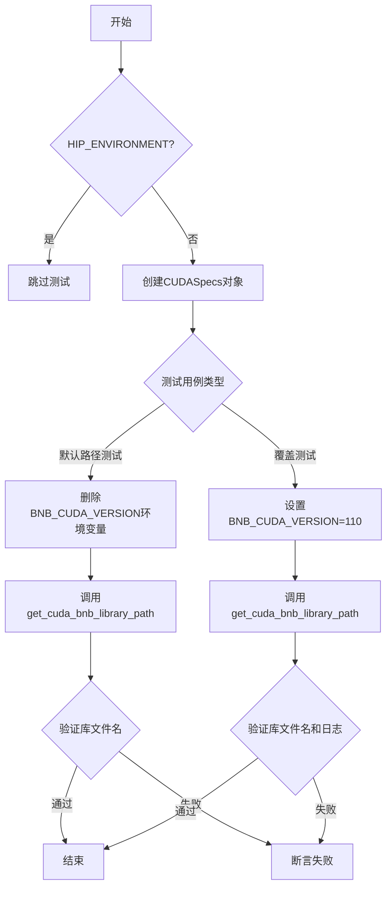
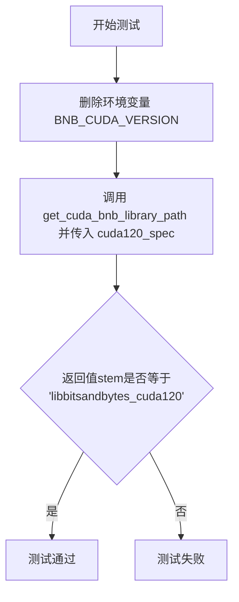
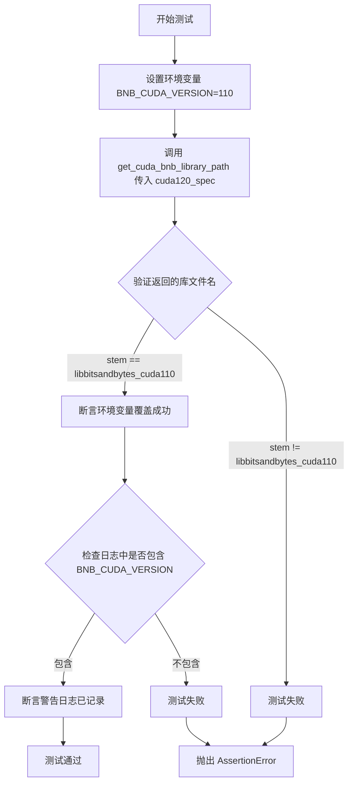
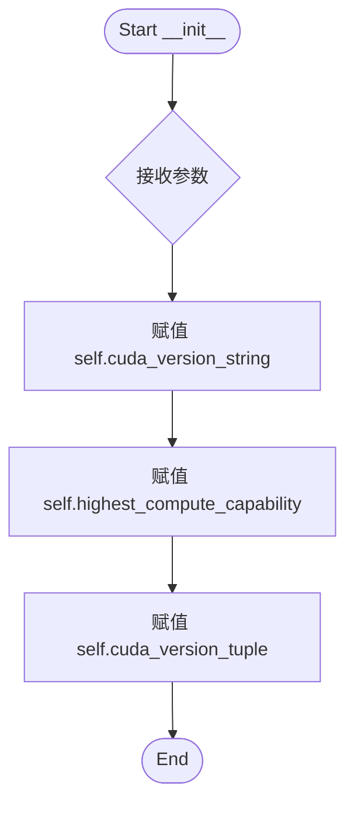

# `bitsandbytes\tests\test_cuda_setup_evaluator.py` 详细设计文档

这是bitsandbytes库的pytest测试文件，用于测试CUDA库路径获取功能，包括默认路径解析和环境变量BNB_CUDA_VERSION覆盖场景，验证不同CUDA版本对应的动态库文件名是否正确。

## 整体流程



## 类结构

```
CUDASpecs (数据类)
└── 用于封装CUDA版本和计算能力信息
```

## 全局变量及字段


### `HIP_ENVIRONMENT`
    
全局布尔变量，表示是否运行在ROCm/HIP环境

类型：`bool`
    


### `cuda120_spec`
    
pytest fixture，返回CUDASpecs实例

类型：`CUDASpecs`
    


### `get_cuda_bnb_library_path`
    
获取CUDA库的路径函数

类型：`function`
    


### `CUDASpecs.cuda_version_string`
    
CUDA版本字符串

类型：`str`
    


### `CUDASpecs.highest_compute_capability`
    
最高计算能力

类型：`tuple`
    


### `CUDASpecs.cuda_version_tuple`
    
CUDA版本元组

类型：`tuple`
    
    

## 全局函数及方法


### `get_cuda_bnb_library_path`

根据CUDASpecs获取对应CUDA版本的bitsandbytes库路径。如果环境变量`BNB_CUDA_VERSION`被设置，则优先使用环境变量指定的CUDA版本；否则使用CUDASpecs中指定的CUDA版本。

参数：

- `specs`：`CUDASpecs`，包含CUDA版本信息和计算能力等规范的CUDA规格对象

返回值：`Path`，返回对应的bitsandbytes库文件路径对象（路径的stem为`libbitsandbytes_cuda{版本号}`格式）

#### 流程图

```mermaid
flowchart TD
    A[开始 get_cuda_bnb_library_path] --> B{检查环境变量 BNB_CUDA_VERSION}
    B -->|已设置| C[使用环境变量中的CUDA版本]
    B -->|未设置| D{检查 specs.cuda_version_string}
    D -->|存在| E[使用 specs.cuda_version_string]
    D -->|不存在| F[使用 specs.cuda_version_tuple]
    C --> G[构建库文件名 libbitsandbytes_cuda{版本}.so]
    E --> G
    F --> G
    G --> H[返回完整库路径 Path 对象]
```

#### 带注释源码

```python
# 测试代码展示了函数的使用方式

# 1. 创建 CUDASpecs 对象
cuda120_spec = CUDASpecs(
    cuda_version_string="120",           # CUDA版本字符串 "120" 表示 CUDA 12.0
    highest_compute_capability=(8, 6),   # 最高计算能力 8.6 (Ada Lovelace)
    cuda_version_tuple=(12, 0),         # CUDA版本元组 (12, 0)
)

# 2. 基本调用 - 使用 CUDASpecs 中的版本
# 不设置 BNB_CUDA_VERSION 环境变量时，使用 specs 中的版本
path = get_cuda_bnb_library_path(cuda120_spec)
# 返回 Path(".../libbitsandbytes_cuda120.so")，stem == "libbitsandbytes_cuda120"

# 3. 覆盖调用 - 使用环境变量指定版本
# 设置 BNB_CUDA_VERSION="110" 会覆盖 specs 中的版本
import os
os.environ["BNB_CUDA_VERSION"] = "110"
path_override = get_cuda_bnb_library_path(cuda120_spec)
# 返回 Path(".../libbitsandbytes_cuda110.so")，stem == "libbitsandbytes_cuda110"
# 同时会记录一条警告日志，说明使用了环境变量覆盖
```

> **注意**：实际实现代码未在提供的代码片段中展示，上述流程图和源码注释是基于函数签名及测试用例逻辑推断得出的。实际实现可能位于 `bitsandbytes/cextension.py` 模块中。


### `test_get_cuda_bnb_library_path`

该测试函数用于验证在未指定CUDA版本环境变量时，`get_cuda_bnb_library_path` 函数能否正确返回CUDA 12.0对应的bitsandbytes库文件名（libbitsandbytes_cuda120）。测试通过删除BNB_CUDA_VERSION环境变量确保使用默认值，并断言返回路径的stem部分等于预期库文件名。

参数：

-  `monkeypatch`：`pytest.fixture`，pytest的monkeypatch fixture，用于动态修改环境变量、属性等，此处用于删除BNB_CUDA_VERSION环境变量
-  `cuda120_spec`：`CUDASpecs`，包含CUDA 12.0版本信息的CUDASpecs对象，其cuda_version_string为"120"，highest_compute_capability为(8, 6)，cuda_version_tuple为(12, 0)

返回值：`None`，该函数为测试函数，使用assert语句进行断言验证，不返回显式值

#### 流程图



#### 带注释源码

```python
@pytest.mark.skipif(HIP_ENVIRONMENT, reason="this test is not supported on ROCm")
def test_get_cuda_bnb_library_path(monkeypatch, cuda120_spec):
    """
    测试默认CUDA版本(120)库路径获取
    
    该测试验证在未设置BNB_CUDA_VERSION环境变量时，
    get_cuda_bnb_library_path函数能正确返回CUDA 12.0对应的库文件名
    """
    # 删除BNB_CUDA_VERSION环境变量，确保使用默认值
    monkeypatch.delenv("BNB_CUDA_VERSION", raising=False)
    
    # 调用get_cuda_bnb_library_path函数，传入CUDA 12.0规格对象
    # 断言返回Path对象的stem等于预期库文件名
    assert get_cuda_bnb_library_path(cuda120_spec).stem == "libbitsandbytes_cuda120"
```


### `test_get_cuda_bnb_library_path_override`

该测试函数用于验证通过环境变量 `BNB_CUDA_VERSION` 覆盖 CUDA 版本的功能是否正常工作，包括检查环境变量设置是否生效以及是否输出了相应的警告日志。

参数：

- `monkeypatch`：`pytest.fixture`，用于在测试期间动态修改环境变量
- `cuda120_spec`：`CUDASpecs`，模拟 CUDA 12.0 版本的规格对象
- `caplog`：`pytest.fixture`，用于捕获测试期间的日志输出

返回值：`None`，该函数为测试函数，通过断言验证功能，不返回具体值

#### 流程图



#### 带注释源码

```python
@pytest.mark.skipif(HIP_ENVIRONMENT, reason="this test is not supported on ROCm")
def test_get_cuda_bnb_library_path_override(monkeypatch, cuda120_spec, caplog):
    """
    测试通过环境变量覆盖 CUDA 版本的功能
    
    测试场景：
    - 即使 CUDASpecs 指定的是 CUDA 12.0 (cuda120_spec)
    - 通过设置 BNB_CUDA_VERSION 环境变量可以强制使用 CUDA 11.0 的库
    - 同时验证此操作会触发警告日志
    """
    # 使用 monkeypatch 设置环境变量 BNB_CUDA_VERSION 为 "110"
    # 这会覆盖 cuda120_spec 中指定的 CUDA 12.0 版本
    monkeypatch.setenv("BNB_CUDA_VERSION", "110")
    
    # 调用被测函数 get_cuda_bnb_library_path
    # 预期返回的库文件名应该是 libbitsandbytes_cuda110（被环境变量覆盖）
    assert get_cuda_bnb_library_path(cuda120_spec).stem == "libbitsandbytes_cuda110"
    
    # 验证警告日志中包含 BNB_CUDA_VERSION
    # 说明系统检测到了环境变量覆盖并记录了警告
    assert "BNB_CUDA_VERSION" in caplog.text  # did we get the warning?
```


### `CUDASpecs.__init__`

该方法用于初始化 `CUDASpecs` 类的实例，接收并存储 CUDA 版本字符串、最高计算能力以及版本元组信息，为后续库文件路径查找和版本兼容性检查提供数据支撑。

参数：
-  `cuda_version_string`：`str`，CUDA 版本的字符串表示（如 "120"，用于构建动态库文件名）。
-  `highest_compute_capability`：`Tuple[int, int]`，硬件支持的最高计算能力（Compute Capability），通常为元组 (major, minor)（如 (8, 6)）。
-  `cuda_version_tuple`：`Tuple[int, int]`，CUDA 版本的元组表示（如 (12, 0)），用于版本逻辑比较。

返回值：`None`，该方法为构造函数，仅负责初始化实例属性，不返回显式值。

#### 流程图



#### 带注释源码

```python
from typing import Tuple

class CUDASpecs:
    def __init__(
        self,
        cuda_version_string: str,
        highest_compute_capability: Tuple[int, int],
        cuda_version_tuple: Tuple[int, int]
    ) -> None:
        """
        初始化 CUDA 规格参数。

        Args:
            cuda_version_string: CUDA 版本的字符串形式，用于库文件命名。
            highest_compute_capability: GPU 的最高计算能力。
            cuda_version_tuple: CUDA 版本的元组形式，用于逻辑判断。
        """
        # 存储版本字符串，通常用于生成库文件路径，例如 libbitsandbytes_cuda120
        self.cuda_version_string = cuda_version_string
        
        # 存储计算能力，用于判断硬件兼容性或特定内核优化
        self.highest_compute_capability = highest_compute_capability
        
        # 存储版本元组，可能用于版本对比或特性开关
        self.cuda_version_tuple = cuda_version_tuple
```


## 关键组件


### CUDASpecs 类
用于存储 CUDA 版本信息，包括版本字符串、最高计算能力版本和版本元组。

### get_cuda_bnb_library_path 函数
根据 CUDA 规范获取对应的 bitsandbytes CUDA 库路径，支持环境变量覆盖。

### HIP_ENVIRONMENT 全局变量
指示当前环境是否为 ROCm（HIP）环境，用于跳过不支持的测试。

### BNB_CUDA_VERSION 环境变量
允许用户覆盖默认的 CUDA 库版本，以支持自定义库路径。

### cuda120_spec 测试夹具
提供特定的 CUDA 12.0 规范实例，用于测试场景。


## 问题及建议


### 已知问题

-   **硬编码的CUDA版本 fixture**: `cuda120_spec` 只覆盖 CUDA 12.0 版本，缺乏对其他版本（如 11.x、10.x）的参数化测试支持
-   **魔法字符串依赖**: 测试中断言使用硬编码的库文件名 `"libbitsandbytes_cuda120"` 和 `"libbitsandbytes_cuda110"`，这些字符串与实际库命名耦合，如果库命名规则变化会导致测试失败
-   **测试覆盖不足**: 仅覆盖两个测试场景，缺少对无效 CUDA 版本、超出范围的 compute capability 等边界条件的测试
-   **日志验证不精确**: `caplog.text` 断言仅检查字符串是否包含 "BNB_CUDA_VERSION"，未验证警告内容的准确性和格式
-   **缺少错误处理路径测试**: 未测试当 `CUDASpecs` 传入无效参数或 `get_cuda_bnb_library_path` 内部异常时的行为
-   **环境清理依赖 monkeypatch**: 测试通过 `monkeypatch` 修改环境变量，但未显式验证测试后环境变量是否被正确恢复（或依赖 pytest 自动清理）
-   **导入语句脆弱性**: 从 `bitsandbytes.cextension` 导入内部模块，如果模块重构或重命名，测试将直接失败

### 优化建议

-   使用 `@pytest.mark.parametrize` 参数化 CUDA 版本，扩展测试覆盖范围（例如 110, 116, 118, 120 等）
-   将库文件名提取为常量或从配置/规格对象获取，减少硬编码耦合
-   添加负面测试用例：测试无效 CUDA 版本、缺失的环境变量处理、compute capability 越界等场景
-   改进日志断言，使用正则表达式或更精确的日志级别/消息验证
-   考虑使用 fixture 封装 `CUDASpecs` 的创建逻辑，支持动态传入参数而非硬编码
-   将内部模块导入改为通过公共 API 或添加明确的接口层，减少直接依赖内部实现


## 其它


### 设计目标与约束

该测试模块旨在验证 `bitsandbytes` 库在 CUDA 环境下正确获取对应版本的 `libbitsandbytes_cuda*.so` 动态库路径。核心约束包括：不支持 ROCm (HIP) 环境，仅适用于 NVIDIA CUDA 环境；支持通过环境变量 `BNB_CUDA_VERSION` 动态覆盖默认版本逻辑。

### 错误处理与异常设计

测试通过 `monkeypatch` 模拟环境变量设置与删除场景，验证路径获取函数的异常路径处理能力。`CUDASpecs` 构造失败或环境变量格式错误时应抛出 `ValueError` 或 `KeyError`。测试使用 `assert` 进行显式断言，不依赖 pytest 异常捕获机制。

### 数据流与状态机

测试数据流为：输入 `CUDASpecs` 对象（含 cuda_version_string、highest_compute_capability、cuda_version_tuple）→ `get_cuda_bnb_library_path()` 函数处理 → 输出 `Path.stem`（如 "libbitsandbytes_cuda120"）。环境变量 `BNB_CUDA_VERSION` 为可选覆盖输入，覆盖时触发警告日志输出。

### 外部依赖与接口契约

依赖项包括：`bitsandbytes.cextension` 模块（`HIP_ENVIRONMENT` 全局标志、`get_cuda_bnb_library_path` 函数）、`bitsandbytes.cuda_specs` 模块（`CUDASpecs` 类）、pytest 框架。接口契约：`CUDASpecs` 需提供 cuda 版本信息属性；`get_cuda_bnb_library_path()` 接收 `CUDASpecs` 对象并返回 `pathlib.Path` 对象。

### 性能要求

测试执行时间应控制在毫秒级，无 I/O 密集型操作。`get_cuda_bnb_library_path` 函数执行复杂度为 O(1)，仅做字符串拼接与路径构造。

### 安全性考虑

环境变量 `BNB_CUDA_VERSION` 未做输入校验，可能接受非法版本字符串（如非数字），需在生产代码中添加版本格式验证。测试本身无安全风险。

### 可维护性

`CUDASpecs` 类字段硬编码于测试 fixture 中，长期维护需同步更新版本号（如 8.6 compute capability）。建议将测试数据抽离至独立配置文件。

### 测试覆盖率

当前覆盖场景：默认 CUDA 版本路径生成、环境变量覆盖生效、ROCm 跳过。缺失场景：无效 CUDA 版本格式、路径不存在时的降级逻辑、多 CUDA 版本共存时的优先级判定。

### 兼容性设计

测试明确针对 CUDA 12.0 (120) 版本，版本兼容性由 `get_cuda_bnb_library_path` 内部逻辑保证，新 CUDA 版本发布时需扩展路径映射表。

### 日志与监控设计

环境变量覆盖时通过 `logging` 输出警告信息至 `caplog`，测试验证日志包含 "BNB_CUDA_VERSION" 关键字。生产环境建议增加 INFO 级别日志记录实际加载的库路径。

### 部署与环境配置

测试依赖 NVIDIA CUDA Toolkit >= 11.0 环境；ROCm 环境自动跳过测试；需确保 `bitsandbytes` 库已正确编译并生成对应版本的 `.so` 文件至可发现路径。

    