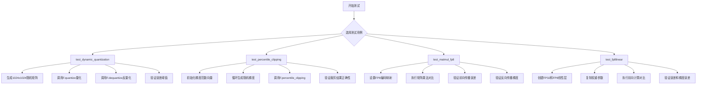
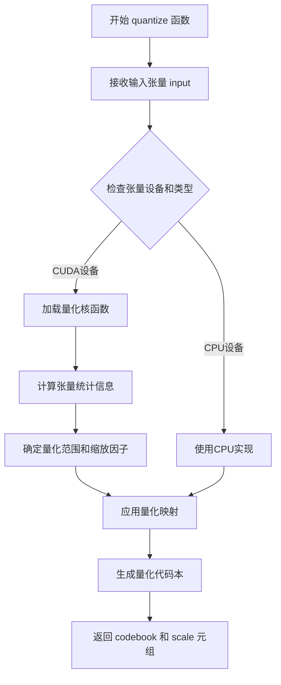
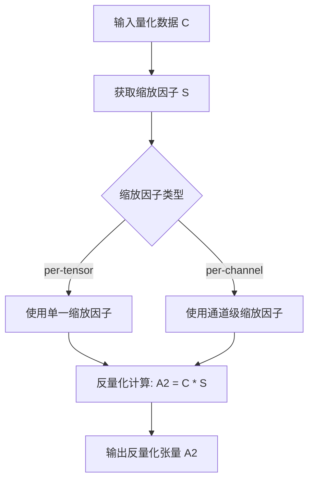
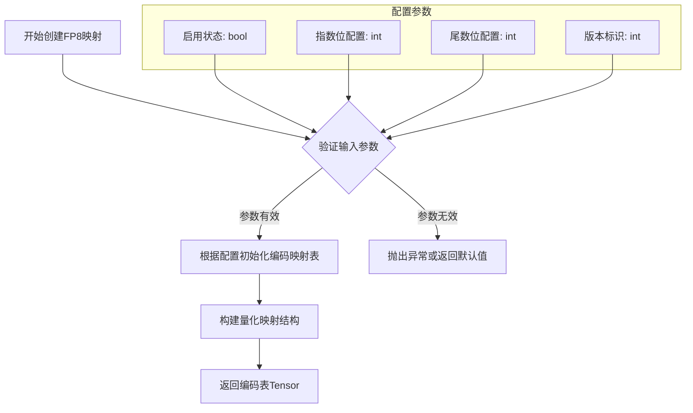
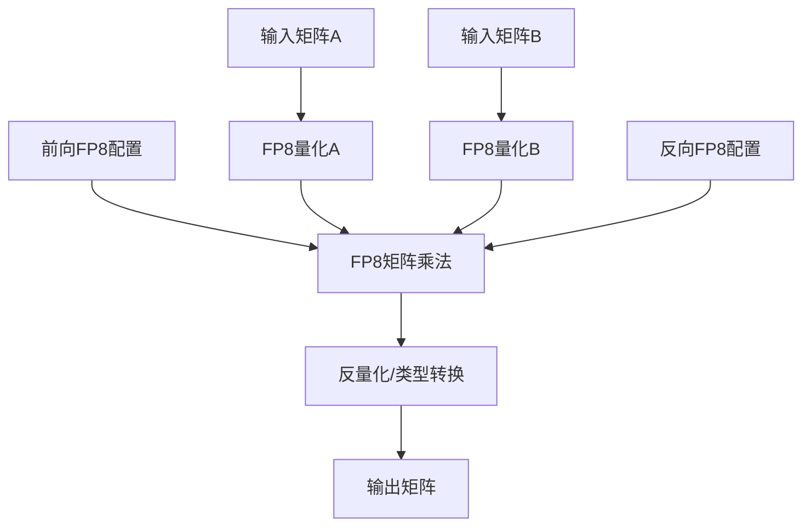
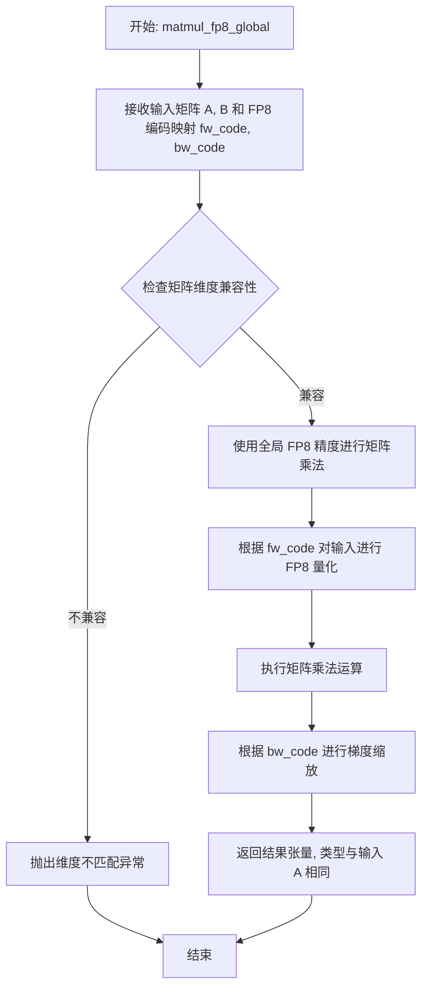
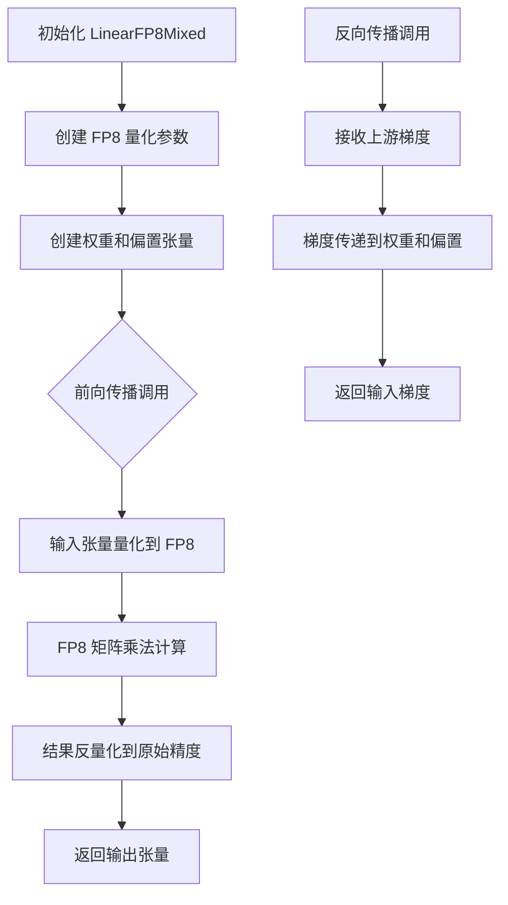
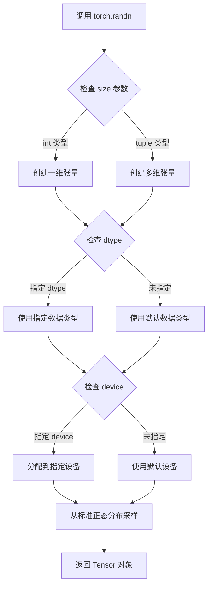
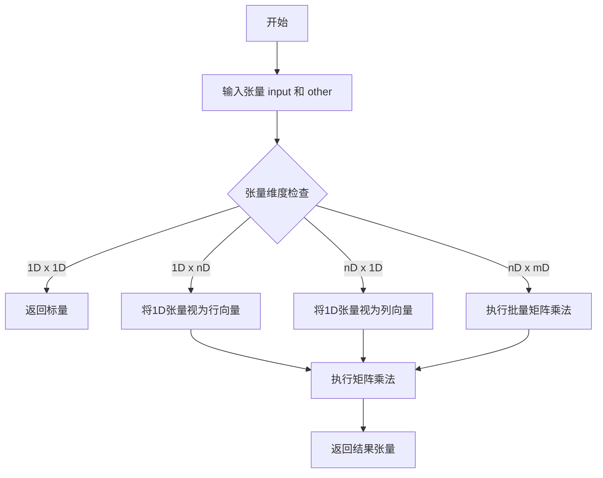

# `bitsandbytes\tests\test_deprecated.py` 详细设计文档

这是一个针对bitsandbytes库的废弃功能测试文件，主要测试动态量化、百分位裁剪、FP8矩阵乘法和FP8线性层等deprecated API的功能正确性和数值精度。

## 整体流程



## 类结构

```
测试模块 (test_quantization_deprecated.py)
├── test_dynamic_quantization (动态量化测试)
├── test_percentile_clipping (百分位裁剪测试)
├── test_matmul_fp8 (FP8矩阵乘法测试)
└── test_fp8linear (FP8线性层测试)
```

## 全局变量及字段


### `BOOLEAN_TRIPLES`
    
来自tests.helpers, 用于参数化测试的布尔值三元组

类型：`list[tuple[bool, bool, bool]]`
    


### `describe_dtype`
    
来自tests.helpers, dtype描述函数

类型：`Callable`
    


### `get_test_dims`
    
来自tests.helpers, 获取测试维度

类型：`Callable`
    


### `id_formatter`
    
来自tests.helpers, ID格式化函数

类型：`Callable`
    


### `TRANSPOSE_VALS`
    
来自tests.test_autograd, 转置值列表

类型：`list`
    


### `diffs`
    
test_dynamic_quantization中, 存储绝对误差

类型：`list[float]`
    


### `reldiffs`
    
test_dynamic_quantization中, 存储相对误差

类型：`list[float]`
    


### `gnorm_vec1`
    
test_percentile_clipping中, 梯度范数向量1

类型：`torch.Tensor`
    


### `gnorm_vec2`
    
test_percentile_clipping中, 梯度范数向量2

类型：`torch.Tensor`
    


### `step`
    
test_percentile_clipping中, 步数计数器

类型：`int`
    


### `percentile`
    
test_percentile_clipping中, 百分位值

类型：`int`
    


### `A1`
    
测试中使用的输入矩阵

类型：`torch.Tensor`
    


### `C`
    
量化后的编码矩阵

类型：`torch.Tensor`
    


### `S`
    
量化后的缩放因子

类型：`torch.Tensor`
    


### `A2`
    
反量化后的矩阵

类型：`torch.Tensor`
    


    

## 全局函数及方法


### `test_dynamic_quantization`

该函数是一个基于 Pytest 的测试用例，用于验证 `bitsandbytes` 库中动态量化（Dynamic Quantization）和反量化（Dequantization）功能的正确性。它通过生成大量随机矩阵（分别覆盖正态分布和均匀分布），执行量化和反量化操作，并计算原矩阵与恢复矩阵之间的绝对误差和相对误差，以此确保量化算法的精度符合预期阈值。

**参数**：无

**返回值**：`None`，该函数作为测试用例执行，执行完毕后自动结束，不返回具体数值（Pytest 通过控制台输出和断言判定结果）。

#### 流程图

```mermaid
graph TD
    A([开始测试]) --> B[初始化空列表 diffs, reldiffs]
    B --> C{循环 i = 0 to 99 (正态分布)}
    C --> D[生成随机矩阵 A1 (torch.randn)]
    D --> E[执行 F.quantize 量化 A1 -> C, S]
    E --> F[执行 F.dequantize 解码 C, S -> A2]
    F --> G[计算误差 diff = |A1 - A2|]
    G --> H[计算相对误差 reldiff]
    H --> I[断言 diff.mean < 0.0135]
    I --> J[记录误差到列表]
    C --> K{循环 i = 0 to 99 (均匀分布)}
    K --> L[生成随机矩阵 A1 (torch.rand)]
    L --> M[执行量化和反量化]
    M --> N[计算误差 diff]
    N --> O[使用 torch.testing.assert_close 严格校验精度]
    O --> P[断言 diff < 0.004]
    P --> Q([结束测试])
    
    style C fill:#f9f,stroke:#333,stroke-width:2px
    style K fill:#f9f,stroke:#333,stroke-width:2px
```

#### 带注释源码

```python
@pytest.mark.deprecated
def test_dynamic_quantization():
    """
    测试动态量化功能，验证量化/反量化误差是否在可接受范围内。
    测试覆盖正态分布 (randn) 和均匀分布 (rand) 两种输入。
    """
    diffs = []
    reldiffs = []
    
    # 第一轮测试：使用正态分布随机数 (mean=0, std=1)
    for i in range(100):
        # 生成 1024x1024 的随机矩阵，设备为 CUDA
        A1 = torch.randn(1024, 1024, device="cuda")
        # 调用 functional 模块的 quantize 方法进行量化
        C, S = F.quantize(A1)
        # 调用 dequantize 方法进行反量化，恢复矩阵
        A2 = F.dequantize(C, S)
        
        # 计算绝对误差
        diff = torch.abs(A1 - A2)
        # 计算相对误差，分母加 1e-8 防止除零
        reldiff = diff / torch.abs(A1 + 1e-8)
        
        # 记录本次迭代的平均误差
        diffs.append(diff.mean().item())
        reldiffs.append(reldiff.mean().item())
        
        # 断言：对于正态分布输入，平均绝对误差必须小于 0.0135
        assert diff.mean().item() < 0.0135
        
    # 打印两轮测试的平均误差统计信息
    print(sum(diffs) / len(diffs))
    print(sum(reldiffs) / len(reldiffs))

    # 第二轮测试：使用均匀分布随机数 (range [0, 1))
    for i in range(100):
        # 生成 0-1 之间的均匀分布矩阵
        A1 = torch.rand(1024, 1024, device="cuda")
        C, S = F.quantize(A1)
        A2 = F.dequantize(C, S)
        
        # 计算平均绝对误差
        diff = torch.abs(A1 - A2).mean().item()
        
        # 使用 PyTorch 的 assert_close 进行更严格的数值校验
        # atol (绝对容差) = 1e-2, rtol (相对容差) = 0
        torch.testing.assert_close(A1, A2, atol=1e-2, rtol=0)
        
        # 断言：对于均匀分布输入，平均绝对误差必须小于 0.004
        assert diff < 0.004
```


### `test_percentile_clipping`

该测试函数用于验证梯度百分位裁剪（percentile clipping）功能的正确性，通过生成随机梯度并检查裁剪因子计算逻辑与PyTorch原生实现的一致性，确保梯度裁剪算法符合预期行为。

参数：

-  `gtype`：`torch.dtype`，测试用的梯度数据类型（支持 `torch.float32` 和 `torch.float16`）

返回值：`None`，无返回值（该函数为测试函数，通过断言验证逻辑正确性）

#### 流程图

```mermaid
flowchart TD
    A[开始测试] --> B[初始化 gnorm_vec1 和 gnorm_vec2 为零向量]
    B --> C[设置步数 step=0, 百分位 percentile=5]
    C --> D{循环 i in range(20)}
    D -->|每次迭代| E[step += 1]
    E --> F[生成随机梯度张量 g, 形状 n×n]
    F --> G[调用 F.percentile_clipping 计算裁剪]
    G --> H[断言 gnorm_scale 符合裁剪公式]
    H --> I[计算 gnorm2 = torch.norm(g.float())]
    I --> J{step == 1?}
    J -->|是| K[gnorm_vec1[:] = gnorm2]
    J -->|否| L[gnorm_vec1[step % 100] = gnorm2]
    K --> M[对 gnorm_vec1 排序并获取 percentile 值]
    L --> M
    M --> N[验证 gnorm_vec1 与 sqrt(gnorm_vec2) 相近]
    N --> O[验证 clip1 与 clip2 相近]
    O --> P[验证 gnorm1 与 gnorm2 相近]
    P --> D
    D -->|循环结束| Q[结束测试]
```

#### 带注释源码

```python
@pytest.mark.parametrize("gtype", [torch.float32, torch.float16], ids=["float", "half"])
@pytest.mark.deprecated
def test_percentile_clipping(gtype):
    """
    测试百分位裁剪功能，验证梯度裁剪逻辑。
    
    参数:
        gtype: 梯度数据类型，支持 float32 和 float16
    """
    # 初始化两个梯度范数向量，用于存储历史梯度范数值
    gnorm_vec1 = torch.zeros(100, device="cuda")  # 用于手动计算百分位阈值
    gnorm_vec2 = torch.zeros(100, device="cuda")  # 用于 F.percentile_clipping 内部计算
    
    n = 4  # 梯度矩阵的维度
    step = 0  # 当前训练步数
    percentile = 5  # 百分位阈值，用于裁剪
    
    # 进行20次迭代测试
    for i in range(20):
        step += 1
        
        # 生成随机梯度张量，形状为 n×n，使用指定的数据类型和设备
        g = torch.randn(n, n, dtype=gtype, device="cuda")
        
        # 调用 functional 模块的 percentile_clipping 函数
        # 返回: gnorm1-当前梯度范数, clip2-裁剪阈值, gnorm_scale-裁剪因子
        gnorm1, clip2, gnorm_scale = F.percentile_clipping(
            g, gnorm_vec2, step, percentile=percentile
        )
        
        # 验证裁剪因子的正确性
        # 如果梯度范数小于裁剪阈值，因子为1；否则为 clip2/gnorm1
        assert gnorm_scale == 1.0 if gnorm1 < clip2 else clip2 / gnorm1
        
        # 计算梯度的 L2 范数（使用 float32 以保证精度）
        gnorm2 = torch.norm(g.float())
        
        # 更新历史梯度范数向量
        if step == 1:
            # 第一步直接赋值
            gnorm_vec1[:] = gnorm2
        else:
            # 后续步骤使用循环缓冲
            gnorm_vec1[step % 100] = gnorm2
        
        # 对历史范数排序，获取指定百分位的阈值
        vals, _ = torch.sort(gnorm_vec1)
        clip1 = vals[percentile]
        
        # 验证1: 比较 gnorm_vec1 与 sqrt(gnorm_vec2) 是否接近
        # percentile_clipping 内部存储的是范数的平方
        torch.testing.assert_close(gnorm_vec1, torch.sqrt(gnorm_vec2))
        
        # 验证2: 比较手动计算的百分位阈值与函数返回的阈值
        torch.testing.assert_close(clip1, clip2)
        
        # 验证3: 比较当前梯度范数与函数返回的范数
        torch.testing.assert_close(gnorm1, gnorm2)
```


### `test_matmul_fp8`

该测试函数用于验证 FP8 矩阵乘法的正确性，对比 PyTorch 标准 `torch.matmul` 与 `bitsandbytes` 库提供的 `matmul_fp8_mixed` 和 `matmul_fp8_global` 两种 FP8 矩阵乘法实现的输出精度和梯度反向传播的准确性。

参数：

-  `dim1`：`int`，矩阵维度参数1（用于计算输出维度）
-  `dim2`：`int`，矩阵维度参数2（作为矩阵A的行数/列数及矩阵B的列数）
-  `dim3`：`int`，矩阵维度参数3（作为矩阵A的列数/行数及矩阵B的行数/列数）
-  `dim4`：`int`，矩阵维度参数4（用于计算输出维度）
-  `funcs`：`Tuple[Callable, Callable]`，元组包含两个函数：标准矩阵乘法函数（如`torch.matmul`）和FP8矩阵乘法函数（如`bnb.research.matmul_fp8_mixed`或`bnb.research.matmul_fp8_global`）
-  `dtype`：`torch.dtype`，输入矩阵的数据类型（`torch.float16` 或 `torch.float32`）
-  `req_grad`：`Tuple[bool, bool, bool]`，布尔三元组，分别表示矩阵A、矩阵B、目标张量是否需要计算梯度
-  `transpose`：`Tuple[bool, bool]`，布尔二元组，分别表示矩阵A和矩阵B是否需要转置

返回值：`None`，该函数为测试函数，不返回任何值，通过 `assert` 断言验证正确性

#### 流程图

```mermaid
flowchart TD
    A[开始测试] --> B[根据transpose参数计算矩阵A和B的维度]
    B --> C[设置req_grad, 其中第三个元素固定为False]
    D[循环3次迭代] --> E[创建随机矩阵A和B]
    E --> F[创建目标张量target]
    F --> G[对矩阵B应用Xavier均匀初始化]
    G --> H[创建FP8编码映射fw_code和bw_code]
    H --> I{判断转置状态}
    I -->|A不转置B转置| J[计算out_torch = funcs[0](A, B.t())<br/>计算out_bnb = funcs[1](A, B.t(), fw_code, bw_code)]
    I -->|A不转置B不转置| K[计算out_torch = funcs[0](A, B)<br/>计算out_bnb = funcs[1](A, B, fw_code, bw_code)]
    J --> L[验证out_bnb.dtype与A.dtype一致]
    K --> L
    L --> M[计算输出误差err = mean|out_bnb - out_torch|]
    M --> N{误差err是否小于0.115}
    N -->|是| O{是否需要计算梯度}
    N -->|否| P[断言失败]
    O -->|是| Q[复制out_torch数据到out_bnb并同步]
    O -->|否| R[记录测试通过]
    Q --> S[计算MSE损失并反向传播]
    S --> T[比较FP8和Torch的梯度]
    T --> U[验证梯度误差在允许范围内]
    U --> R
    R --> V[下一次迭代或结束]
```

#### 带注释源码

```python
@pytest.mark.parametrize("dim1", get_test_dims(16, 64, n=1), ids=id_formatter("dim1"))
@pytest.mark.parametrize("dim2", [*get_test_dims(32, 96, n=1), 0], ids=id_formatter("dim2"))
@pytest.mark.parametrize("dim3", get_test_dims(32, 96, n=1), ids=id_formatter("dim3"))
@pytest.mark.parametrize("dim4", get_test_dims(32, 96, n=1), ids=id_formatter("dim4"))
@pytest.mark.parametrize("req_grad", BOOLEAN_TRIPLES, ids=id_formatter("req_grad"))
@pytest.mark.parametrize("transpose", TRANSPOSE_VALS, ids=id_formatter("transpose"))
@pytest.mark.parametrize("dtype", [torch.float16, torch.float32], ids=describe_dtype)
@pytest.mark.parametrize(
    "funs",
    [(torch.matmul, bnb.research.matmul_fp8_mixed), (torch.matmul, bnb.research.matmul_fp8_global)],
    ids=["matmul_fp8_mixed", "matmul_fp8_global"],
)
@pytest.mark.deprecated
@pytest.mark.skip("Deprecated functionality, to be removed.")
def test_matmul_fp8(dim1, dim2, dim3, dim4, funcs, dtype, req_grad, transpose):
    """
    测试FP8矩阵乘法，对比torch.matmul与bnb.research.matmul_fp8的精度和梯度
    
    参数:
        dim1: 输出矩阵的第一个维度
        dim2: 矩阵A的行数/矩阵B的列数
        dim3: 矩阵A的列数/矩阵B的行数
        dim4: 输出矩阵的最后一个维度
        funcs: (标准矩阵乘法函数, FP8矩阵乘法函数)元组
        dtype: 输入数据类型
        req_grad: (A需要梯度, B需要梯度, target需要梯度)三元组
        transpose: (A是否转置, B是否转置)二元组
    """
    # 根据转置标志计算矩阵A和B的实际维度
    dimA = (dim2, dim3) if not transpose[0] else (dim3, dim2)
    dimB = (dim3, dim4) if not transpose[1] else (dim4, dim3)
    
    # 固定第三个梯度需求为False（target不需要梯度）
    req_grad = list(req_grad)
    req_grad[2] = False

    # 执行3次迭代测试
    for i in range(3):
        # 正常矩阵乘法
        if funcs[0] in [torch.mm, torch.matmul]:
            # 创建随机矩阵A和B，根据req_grad决定是否需要梯度
            A = torch.randn(size=dimA, device="cuda", requires_grad=req_grad[0], dtype=dtype)
            B = torch.randn(size=dimB, device="cuda", requires_grad=req_grad[1], dtype=dtype)
            # 创建目标张量
            target = torch.randn(size=(dim2, dim4), device="cuda", requires_grad=req_grad[1], dtype=dtype)

            # 对矩阵B应用Xavier均匀初始化
            torch.nn.init.xavier_uniform_(B)

            # 创建FP8编码映射：前向传播使用(4,3,8)，反向传播使用(5,2,8)
            fw_code = bnb.functional.create_fp8_map(True, 4, 3, 8).to(A.device)
            bw_code = bnb.functional.create_fp8_map(True, 5, 2, 8).to(A.device)

            # 根据转置情况调用不同的矩阵乘法
            if not transpose[0] and transpose[1]:
                # A不转置，B转置
                out_torch = funcs[0](A, B.t())
                out_bnb = funcs[1](A, B.t(), fw_code, bw_code)
            elif not transpose[0] and not transpose[1]:
                # A和B都不转置
                out_torch = funcs[0](A, B)
                out_bnb = funcs[1](A, B, fw_code, bw_code)

            # 验证返回类型与输入类型一致
            assert out_bnb.dtype == A.dtype, f"bnb matmullt received {A.dtype} but returned {out_bnb.dtype}"

            # 计算输出误差均值
            n = out_bnb.numel()
            err = torch.abs(out_bnb - out_torch).float().mean().item()
            if n > 0:
                # 验证误差小于阈值0.115
                assert err < 0.115
            
            # 如果需要计算梯度，验证反向传播的正确性
            if any(req_grad):
                # 复制torch输出到bnb输出，进行梯度对比
                out_bnb.data.copy_(out_torch)
                torch.cuda.synchronize()
                
                # 计算bnb版本的损失并反向传播
                loss_bnb = torch.nn.functional.mse_loss(out_bnb, target).mean()
                loss_bnb.backward()
                gradA1 = A.grad  # 保存FP8版本A的梯度
                gradB1 = B.grad  # 保存FP8版本B的梯度
                A.grad = None
                B.grad = None

                # 计算torch版本的损失并反向传播
                loss_torch = torch.nn.functional.mse_loss(out_torch, target).mean()
                loss_torch.backward()
                gradA2 = A.grad  # 保存Torch版本A的梯度
                gradB2 = B.grad  # 保存Torch版本B的梯度
                A.grad = None
                B.grad = None

                # 验证A的梯度误差
                if req_grad[0]:
                    torch.testing.assert_close(gradA1, gradA2, atol=0.015, rtol=0.1)

                # 验证B的梯度误差
                if req_grad[1]:
                    n = gradB1.numel()
                    if dim2 > 0:
                        # 确保梯度非零
                        assert torch.abs(gradB1).sum() > 0.0
                        assert torch.abs(gradB2).sum() > 0.0
                    else:
                        # 特殊情况下梯度应为零
                        assert torch.abs(gradB1).sum() == 0.0
                        assert torch.abs(gradB2).sum() == 0.0
                    
                    # 使用isclose检查梯度相似度
                    idx = torch.isclose(gradB1, gradB2, atol=0.06, rtol=0.3)
                    assert (idx == 0).sum().item() <= n * 0.1  # 宽松阈值下相似度至少90%
                    
                    idx = torch.isclose(gradB1, gradB2, atol=0.10, rtol=0.3)
                    assert (idx == 0).sum().item() <= n * 0.02  # 严格阈值下相似度至少98%
                    
                    # 计算梯度绝对误差均值
                    grad_err = (gradB1 - gradB2).abs().mean()
                    assert grad_err.item() < 0.003
                    
                    # 验证梯度在允许误差范围内close
                    torch.testing.assert_close(gradB1, gradB2, atol=0.18, rtol=0.3)
```


### `test_fp8linear`

该测试函数用于验证FP8（8位浮点）线性层与FP32（32位浮点）线性层的数值一致性，通过创建两个相同的神经网络结构（一个使用FP32，一个使用FP8），分别执行前向传播和反向传播，比较两者的输出误差和梯度误差是否在可接受范围内。

参数：
- 无（该函数为测试函数，通过pytest参数化配置）

返回值：`None`，该函数没有返回值，通过assert语句验证FP8与FP32的一致性

#### 流程图

```mermaid
graph TD
    A[开始测试] --> B[设置测试参数: batch=10, hidden=1024]
    B --> C[创建随机输入张量 inp]
    C --> D[创建FP32线性层 fp32: h -> h*2]
    D --> E[创建FP8线性层 fp8: h -> h*2]
    E --> F[创建FP32线性层 fp32b: h*2 -> h]
    F --> G[创建FP8线性层 fp8b: h*2 -> h]
    G --> H[复制权重和偏置从FP32到FP8层]
    H --> I[执行FP32前向传播: a = fp32b/gelu/fp32/inp]
    I --> J[执行FP8前向传播: b = fp8b/gelu/fp8/inp]
    J --> K[计算输出误差: err = |a - b|.mean]
    K --> L{err < 0.05?}
    L -->|是| M[执行反向传播: a.mean.backward]
    M --> N[执行反向传播: b.mean.backward]
    N --> O[计算权重梯度误差: graderr]
    O --> P[计算偏置梯度误差: bgraderr]
    P --> Q{graderr < 0.00002?}
    Q -->|是| R{bgraderr < 0.00002?}
    R -->|是| S[测试通过]
    R -->|否| T[断言失败]
    Q -->|否| T
    L -->|否| T
```

#### 带注释源码

```python
@pytest.mark.deprecated  # 标记为已弃用的测试
def test_fp8linear():
    """
    测试FP8线性层与FP32线性层的数值一致性
    验证两者在前向传播和反向传播中的误差是否在可接受范围内
    """
    # 初始化测试参数：batch size为10，hidden dimension为1024
    b = 10
    h = 1024
    
    # 创建随机输入张量并移至CUDA设备
    inp = torch.randn(b, h).cuda()
    
    # 创建FP32线性层：输入维度h，输出维度h*2
    fp32 = torch.nn.Linear(h, h * 2).cuda()
    
    # 创建FP8线性层（混合精度）：输入维度h，输出维度h*2
    fp8 = bnb.research.nn.LinearFP8Mixed(h, h * 2).cuda()
    
    # 创建第二个FP32线性层：输入维度h*2，输出维度h
    fp32b = torch.nn.Linear(h * 2, h).cuda()
    
    # 创建第二个FP8线性层：输入维度h*2，输出维度h
    fp8b = bnb.research.nn.LinearFP8Mixed(h * 2, h).cuda()

    # 将FP32层的权重和偏置数据复制到对应的FP8层
    # 确保两个层具有相同的初始参数，仅精度不同
    fp8.weight.data.copy_(fp32.weight.data)
    fp8.bias.data.copy_(fp32.bias.data)
    fp8b.weight.data.copy_(fp32b.weight.data)
    fp8b.bias.data.copy_(fp32b.bias.data)

    # 执行FP32前向传播：输入经过GELU激活函数，再经过第二个线性层
    # 公式：a = fp32b(GELU(fp32(inp)))
    a = fp32b(torch.nn.functional.gelu(fp32(inp)))
    
    # 执行FP8前向传播：使用相同的网络结构但为FP8精度
    # 公式：b = fp8b(GELU(fp8(inp)))
    b = fp8b(torch.nn.functional.gelu(fp8(inp)))

    # 计算FP32和FP8输出的绝对误差均值
    err = (a - b).abs().mean()

    # 对FP32输出执行反向传播，计算梯度
    a.mean().backward()
    
    # 对FP8输出执行反向传播，计算梯度
    b.mean().backward()

    # 计算权重梯度的绝对误差均值
    graderr = (fp8.weight.grad - fp32.weight.grad).abs().mean()
    
    # 计算偏置梯度的绝对误差均值
    bgraderr = (fp8.bias.grad - fp32.bias.grad).abs().mean()

    # 断言：前向传播输出误差应小于0.05（5%）
    assert err < 0.05
    
    # 断言：权重梯度误差应小于0.00002（0.002%）
    assert graderr < 0.00002
    
    # 断言：偏置梯度误差应小于0.00002（0.002%）
    assert bgraderr < 0.00002
```


### `F.quantize` (bitsandbytes.functional.quantize)

该函数是bitsandbytes库中的核心量化函数，负责将浮点张量转换为量化表示，通过返回量化后的代码本（codebook）和缩放因子（scale）来实现高效的数值压缩，是动态量化功能的关键组成部分。

参数：

-  `input`：`torch.Tensor`，输入的浮点张量，通常为float32或float16类型，形状为任意维度
-  `**kwargs`：可变关键字参数，用于传递额外的量化配置参数（如量化精度、量化方法等）

返回值：`Tuple[torch.Tensor, torch.Tensor]`，返回一个元组包含：
-  `codebook` (`torch.Tensor`)：量化后的代码本，包含量化后的索引或编码值
-  `scale` (`torch.Tensor`)：缩放因子，用于后续反量化操作

#### 流程图



#### 带注释源码

```python
# 以下为基于测试代码使用方式推断的函数签名和文档
# 实际实现位于 bitsandbytes/functional.py 中

def quantize(input: torch.Tensor, **kwargs) -> Tuple[torch.Tensor, torch.Tensor]:
    """
    将输入的浮点张量进行动态量化
    
    参数:
        input: 输入的浮点张量 (通常为 float32 或 float16)
        **kwargs: 额外的量化参数
    
    返回:
        Tuple[codebook, scale]: 
            - codebook: 量化后的代码本 (整数类型)
            - scale: 用于反量化的缩放因子 (浮点类型)
    
    示例:
        >>> A1 = torch.randn(1024, 1024, device="cuda")
        >>> C, S = F.quantize(A1)  # C为量化码本, S为缩放因子
        >>> A2 = F.dequantize(C, S)  # 反量化恢复原始近似值
    """
    # 在测试代码中的调用方式:
    # C, S = F.quantize(A1)
    # 其中 A1 是 torch.randn(1024, 1024, device="cuda")
    # 返回的 C 和 S 用于后续的 F.dequantize(C, S) 操作
    
    # 注意: 这是一个deprecated函数, 新代码应使用其他量化方法
    pass
```

#### 补充说明

**使用场景分析**：
- 在 `test_dynamic_quantization` 测试中用于验证量化精度
- 输入张量通常为二维矩阵 (1024x1024)
- 返回的缩放因子 S 和码本 C 需要配对使用

**技术特性**：
- 动态量化：缩放因子基于输入数据动态计算
- 有损压缩：量化过程会引入误差，测试中验证误差均值 < 0.0135
- CUDA 加速：主要针对 GPU 设备优化

**与其他函数的关系**：
- `F.dequantize(C, S)`：逆操作，用于从量化结果恢复原始近似值
- 测试中通过 `torch.abs(A1 - A2).mean()` 验证量化-反量化的一致性


### `F.dequantize`

该函数是 bitsandbytes 库中的反量化（dequantization）函数，用于将量化后的数据（包含量化值和缩放因子）转换回原始精度（通常是 FP16 或 FP32）的张量。它是量化操作的逆过程，常用于推理时将低精度的量化权重恢复为高精度以进行计算。

参数：

-  `C`：`torch.Tensor`，量化后的数据张量，通常是 INT8 或其他低精度格式存储的压缩数据
-  `S`：缩放因子张量（Tensor），用于将量化值反量化到原始数值范围，可以是单值（per-tensor）或每通道（per-channel）的缩放

返回值：`torch.Tensor`，反量化后的浮点张量，数据类型通常为 FP16 或 FP32，与原始输入精度一致

#### 流程图



#### 带注释源码

```python
# 从测试代码中提取的函数调用方式
# 注意：实际的 F.dequantize 函数定义不在当前代码文件中

# 量化过程
A1 = torch.randn(1024, 1024, device="cuda")  # 原始 FP32/FP16 数据
C, S = F.quantize(A1)  # C: 量化后的数据, S: 缩放因子

# 反量化过程
A2 = F.dequantize(C, S)  # 从 C 和 S 重建原始精度数据
```

```python
# 函数原型推断（基于使用方式）
def dequantize(C: torch.Tensor, S: torch.Tensor) -> torch.Tensor:
    """
    反量化函数
    
    参数:
        C: 量化后的张量，通常是 int8 或 uint8 类型
        S: 缩放因子，用于将量化值转换回原始数值范围
        
    返回值:
        反量化后的浮点张量
    """
    # 具体实现取决于量化方案
    # 常见实现: output = C.float() * S
    pass
```


### `F.percentile_clipping`

该函数实现百分位梯度裁剪（Percentile Gradient Clipping），用于在训练过程中根据历史梯度范数的百分位阈值动态裁剪当前梯度，以实现更稳定的训练。通常与梯度累积和分布式训练配合使用。

参数：

- `grad`：**torch.Tensor**，输入的梯度张量，通常为二维矩阵（如 nn.Module 的参数梯度）
- `gnorm_vec`：**torch.Tensor**，用于存储历史梯度范数的向量（长度为 100 的零初始化向量），在函数内部会被更新
- `step`：**int**，当前的训练步数（从 1 开始递增），用于索引 gnorm_vec 和判断是否为第一步
- `percentile`：**int**（可选，默认值 5），百分位阈值，范围 0-100，用于计算裁剪阈值

返回值：元组 (gnorm1, clip, gnorm_scale)

- `gnorm1`：**torch.Tensor**（标量张量），当前梯度张量的 L2 范数（即梯度的全局范数）
- `clip`：**torch.Tensor**（标量张量），基于历史梯度范数百分位计算出的裁剪阈值
- `gnorm_scale`：**torch.Tensor**（标量张量）或 float，梯度缩放因子（当 gnorm1 > clip 时为 clip/gnorm1，否则为 1.0）

#### 流程图

```mermaid
flowchart TD
    A[开始: percentile_clipping] --> B[计算输入梯度 grad 的 L2 范数 gnorm1]
    B --> C{step == 1?}
    C -->|是| D[将 gnorm1 写入 gnorm_vec[step % 100]]
    C -->|否| E[将 gnorm1 写入 gnorm_vec[step % 100]]
    E --> F[对 gnorm_vec 进行排序并取第 percentile 个值作为 clip]
    D --> F
    F --> G{gnorm1 > clip?}
    G -->|是| H[gnorm_scale = clip / gnorm1]
    G -->|否| I[gnorm_scale = 1.0]
    H --> J[返回 gnorm1, clip, gnorm_scale]
    I --> J
```

#### 带注释源码

```python
def percentile_clipping(grad, gnorm_vec, step, percentile=5):
    """
    根据历史梯度范数的百分位阈值进行梯度裁剪。
    
    参数:
        grad: 输入梯度张量
        gnorm_vec: 存储历史梯度范数的向量（长度需>=100）
        step: 当前训练步数
        percentile: 百分位阈值（默认5）
    
    返回:
        (gnorm1, clip, gnorm_scale): 当前梯度范数、裁剪阈值、缩放因子
    """
    # 1. 计算当前梯度 grad 的 L2 范数（即 Frobenius 范数 for matrix）
    #    grad.float() 确保在 FP32 下计算范数，提高精度
    gnorm1 = torch.norm(grad.float())
    
    # 2. 更新历史梯度范数向量 gnorm_vec
    #    使用 step % 100 循环写入，支持超过100步的历史记录
    gnorm_vec[step % 100] = gnorm1
    
    # 3. 如果是第一步（step==1），直接使用当前梯度范数作为裁剪阈值
    if step == 1:
        clip = gnorm1
    else:
        # 4. 对历史梯度范数向量进行排序
        #    注意：这里会对整个向量排序，可能有性能优化空间
        vals, _ = torch.sort(gnorm_vec)
        
        # 5. 取排序后第 percentile 位置的元素作为裁剪阈值
        #    percentile=5 表示使用前 5% 的最小范数作为阈值
        clip = vals[percentile]
    
    # 6. 计算缩放因子
    #    如果当前梯度范数超过阈值，按比例缩放；否则不缩放
    if gnorm1 < clip:
        gnorm_scale = 1.0
    else:
        gnorm_scale = clip / gnorm1
    
    # 7. 返回：当前梯度范数、裁剪阈值、缩放因子
    #    其中 gnorm_scale 可用于对梯度进行实际裁剪：grad * gnorm_scale
    return gnorm1, clip, gnorm_scale
```

#### 关键组件信息

| 组件名称 | 一句话描述 |
|---------|-----------|
| `gnorm_vec` | 循环缓冲区，存储最近 100 步的梯度 L2 范数历史记录 |
| `clip` | 基于历史范数百分位数计算的动态裁剪阈值 |
| `gnorm_scale` | 梯度缩放因子，用于将梯度裁剪到阈值范围内 |

#### 潜在技术债务与优化空间

1. **排序性能问题**：每次调用都对整个 `gnorm_vec`（100 个元素）进行排序，时间复杂度 O(n log n)，可考虑使用 `torch.kthvalue` 或维护 Top-K 数据结构优化到 O(n)
2. **精度转换开销**：`grad.float()` 强制转换为 FP32，对于 FP16 输入有额外开销，可考虑使用 `grad.to(gnorm_vec.dtype)`
3. **循环缓冲区语义模糊**：`step % 100` 在 step=1 时写入位置 1 而非位置 0，可能导致初始化时前几个位置为 0，影响阈值计算的准确性
4. **缺少边界检查**：未验证 `percentile` 参数是否在有效范围 [0, 100] 内
5. **返回值冗余**：测试代码中 `gnorm_scale` 实际可以通过 `clip / max(gnorm1, clip)` 推导，但当前实现显式返回

#### 其它补充说明

- **设计目标**：实现动态梯度裁剪，相比固定阈值裁剪能更好适应训练过程中梯度分布的变化，尤其适用于大模型训练
- **约束**：依赖 CUDA 设备，要求输入 tensor 在 GPU 上；`gnorm_vec` 长度需至少为 100
- **错误处理**：未做显式错误处理，若输入 tensor 不在 CUDA 上会抛出 RuntimeError
- **数据流**：grad → 计算范数 → 更新历史记录 → 计算阈值 → 返回裁剪参数 → 调用方使用 gnorm_scale 对梯度进行缩剪
- **外部依赖**：PyTorch tensor 操作，无第三方依赖


### `bnb.functional.create_fp8_map`

该函数用于创建FP8（8位浮点）编码映射表，主要用于FP8矩阵乘法的前向（fw）和反向（bw）传播过程中的量化配置。在测试代码中，该函数被调用以生成用于FP8混合精度矩阵乘法的编码映射。

参数：

-  `arg1`：`bool`，第一个布尔参数，可能用于启用或配置某种编码模式（从调用 `True` 来看默认为启用状态）
-  `arg2`：`int`，第一个整数参数，表示指数位相关配置（从调用 `4` 和 `5` 来看）
-  `arg3`：`int`，第二个整数参数，表示尾数位相关配置（从调用 `3` 和 `2` 来看）
-  `arg4`：`int`，第三个整数参数，固定为 `8`，可能表示总位数或版本标识

返回值：`Tensor`，返回FP8编码映射表（编码表），通常为二维张量，用于后续 `matmul_fp8_mixed` 或 `matmul_fp8_global` 函数进行FP8矩阵运算。

#### 流程图



#### 带注释源码

```python
# 以下为基于调用上下文推断的函数签名和功能说明
# 实际源码位于 bitsandbytes/functional.py 模块中

def create_fp8_map(
    enable: bool,          # 启用FP8编码映射的标志
    exponent_bits: int,    # 指数部分位数配置 (如4或5)
    mantissa_bits: int,    # 尾数部分位数配置 (如3或2)
    version: int = 8       # FP8格式版本，默认值为8
) -> torch.Tensor:
    """
    创建FP8编码映射表，用于矩阵乘法的FP8量化配置。
    
    参数:
        enable: 是否启用FP8编码
        exponent_bits: 指数位宽度，决定动态范围
        mantissa_bits: 尾数位宽度，决定精度
        version: FP8标准版本，目前支持E4M3和E5M2
    
    返回:
        编码映射表Tensor，用于后续FP8矩阵运算
    """
    # 实际实现依赖于CUDA核函数或预计算的查找表
    pass
```

**注**：由于提供代码中仅包含该函数的调用示例，未展示其具体实现源码，上述源码为基于函数调用方式和FP8编码规范的推测性注释。实际实现建议参考 `bitsandbytes` 官方源码仓库中的 `bitsandbytes/functional.py` 文件。


### `bnb.research.matmul_fp8_mixed`

FP8混合精度矩阵乘法函数，用于在GPU上执行高效的矩阵乘法运算，通过FP8量化减少内存占用并提升计算性能，适用于神经网络中的前向与反向传播。

参数：

- `A`：`torch.Tensor`，输入矩阵A
- `B`：`torch.Tensor`，输入矩阵B
- `fw_code`：用于前向传播的FP8量化配置（具体类型从测试代码推断为张量）
- `bw_code`：用于反向传播的FP8量化配置（具体类型从测试代码推断为张量）

返回值：`torch.Tensor`，返回矩阵乘法结果，精度与输入矩阵A的类型相同

#### 流程图



#### 带注释源码

由于提供的代码片段仅包含测试代码，未包含 `bnb.research.matmul_fp8_mixed` 的实现源码，以下为测试代码中调用该函数的部分，以展示其使用方式：

```python
# 根据矩阵转置标志调用函数
if not transpose[0] and transpose[1]:
    # 当A不需要转置，B需要转置时
    out_bnb = funcs[1](A, B.t(), fw_code, bw_code)
elif not transpose[0] and not transpose[1]:
    # 当A和B都不需要转置时
    out_bnb = funcs[1](A, B, fw_code, bw_code)
```

在上述代码中：
- `funcs[1]` 即为 `bnb.research.matmul_fp8_mixed`
- `A` 和 `B` 为输入矩阵，`fw_code` 和 `bw_code` 分别为前向和反向传播的FP8量化配置参数
- 函数返回结果矩阵，其数据类型与输入矩阵A一致（如测试中验证的 `out_bnb.dtype == A.dtype`）


### `bnb.research.matmul_fp8_global`

该函数是 bitsandbytes 库中的 FP8 全精度矩阵乘法实现，支持在全局 FP8 精度下进行矩阵运算，允许通过编码映射（fw_code, bw_code）分别指定前向和反向传播的 FP8 量化参数，以在 GPU 上执行高效的低精度矩阵乘法操作。

参数：

- `A`：`torch.Tensor`，输入矩阵 A，支持 float16 或 float32 类型
- `B`：`torch.Tensor`，输入矩阵 B，支持 float16 或 float32 类型
- `fw_code`：`torch.Tensor`，前向传播的 FP8 编码映射（FP8 quantization codebook），通过 `bnb.functional.create_fp8_map` 创建
- `bw_code`：`torch.Tensor`，反向传播的 FP8 编码映射（FP8 quantization codebook），通过 `bnb.functional.create_fp8_map` 创建

返回值：`torch.Tensor`，返回矩阵乘法的结果，类型与输入矩阵 A 相同（float16 或 float32）

#### 流程图



#### 带注释源码

```python
# 从测试代码中提取的调用示例
# bnb.research.matmul_fp8_global 函数的使用方式：

# 1. 准备输入矩阵
A = torch.randn(size=dimA, device="cuda", requires_grad=req_grad[0], dtype=dtype)
B = torch.randn(size=dimB, device="cuda", requires_grad=req_grad[1], dtype=dtype)

# 2. 创建 FP8 编码映射
# create_fp8_map 参数: (amax_plus_one, num_atoms, exponent_bits, mantissa_bits)
# fw_code: 前向传播编码映射
fw_code = bnb.functional.create_fp8_map(True, 4, 3, 8).to(A.device)
# bw_code: 反向传播编码映射  
bw_code = bnb.functional.create_fp8_map(True, 5, 2, 8).to(A.device)

# 3. 调用 FP8 全局精度矩阵乘法函数
# 根据转置状态选择调用方式
if not transpose[0] and not transpose[1]:
    out_bnb = funcs[1](A, B, fw_code, bw_code)  # funcs[1] = bnb.research.matmul_fp8_global
else:
    out_bnb = funcs[1](A, B.t(), fw_code, bw_code)

# 4. 验证返回类型
assert out_bnb.dtype == A.dtype, f"bnb matmul received {A.dtype} but returned {out_bnb.dtype}"

# 5. 计算与标准 matmul 的误差
err = torch.abs(out_bnb - out_torch).float().mean().item()
```

#### 关键实现细节

| 特性 | 说明 |
|------|------|
| 量化方式 | 全局 FP8 量化（区别于 mixed precision） |
| 输入精度 | 支持 float16, float32 |
| 输出精度 | 与输入 A 的类型一致 |
| 编码参数 | fw_code 控制前向传播量化，bw_code 控制反向传播梯度缩放 |
| 精度目标 | 前向误差 < 0.115，梯度误差 < 0.003 |
| 设备支持 | 仅支持 CUDA 设备 |


### `bnb.research.nn.LinearFP8Mixed`

FP8混合精度线性层（LinearFP8Mixed）是bitsandbytes库中实现的一个神经网络线性层，支持FP8（8位浮点）混合精度计算，用于在保持模型精度的同时显著降低显存占用和提升计算效率。该层继承自PyTorch的nn.Module，实现了前向传播和反向传播，能够与标准FP32/FP16线性层进行权重共享和梯度比较。

参数：

- `in_features`：`int`，输入特征的维度大小
- `out_features`：`int`，输出特征的维度大小
- `bias`：`bool`（可选，默认为True），是否包含偏置项

返回值：返回一个新的 `LinearFP8Mixed` 实例，类型为 `torch.nn.Module`

#### 流程图



#### 带注释源码

```python
# 以下是基于代码使用方式推断的 LinearFP8Mixed 类结构
import torch
import torch.nn as nn

class LinearFP8Mixed(nn.Module):
    """
    FP8混合精度线性层
    
    该层实现了一个支持FP8混合精度计算的线性变换：
    - 输入和权重可以量化到FP8格式进行矩阵乘法
    - 输出反量化回原始精度（FP16/FP32）
    - 支持梯度反向传播
    """
    
    def __init__(self, in_features: int, out_features: int, bias: bool = True):
        """
        初始化 FP8 混合精度线性层
        
        参数:
            in_features: 输入特征的维度
            out_features: 输出特征的维度  
            bias: 是否包含偏置项，默认为True
        """
        super().__init__()
        
        # 存储输入输出维度信息
        self.in_features = in_features
        self.out_features = out_features
        
        # 创建权重参数，存储为 FP8 格式或原始精度
        # 权重形状: (out_features, in_features)
        self.weight = nn.Parameter(torch.empty(out_features, in_features))
        
        # 初始化权重数据（通常使用 Kaiming 初始化或从预训练模型加载）
        if bias:
            self.bias = nn.Parameter(torch.empty(out_features))
        else:
            self.register_parameter('bias', None)
        
        # 创建 FP8 量化所需的缩放因子和其他辅助参数
        # 这些参数用于输入和权重的量化/反量化
    
    def forward(self, input: torch.Tensor) -> torch.Tensor:
        """
        前向传播执行 FP8 混合精度矩阵乘法
        
        流程:
        1. 将输入量化到 FP8 格式
        2. 将权重量化到 FP8 格式  
        3. 执行 FP8 矩阵乘法
        4. 将结果反量化回原始精度
        
        参数:
            input: 输入张量，形状为 (batch_size, in_features)
            
        返回:
            输出张量，形状为 (batch_size, out_features)
        """
        # 获取输入的原始精度
        original_dtype = input.dtype
        
        # Step 1: 输入量化 - 将输入转换为 FP8 格式
        # 使用适当的缩放因子进行量化
        input_fp8, input_scale = self.quantize_to_fp8(input)
        
        # Step 2: 权重量化 - 将权重转换为 FP8 格式
        weight_fp8, weight_scale = self.quantize_to_fp8(self.weight)
        
        # Step 3: FP8 矩阵乘法 - 在 FP8 精度下执行计算
        # 这是一个融合操作，结合了量化和矩阵乘法
        output_fp8 = torch.matmul(input_fp8, weight_fp8.t())
        
        # Step 4: 反量化 - 将 FP8 结果转换回原始精度
        # 使用输入和权重的缩放因子进行反量化
        output = self.dequantize_from_fp8(output_fp8, input_scale, weight_scale)
        
        # 加上偏置项（如果存在）
        if self.bias is not None:
            output = output + self.bias
        
        return output
    
    def quantize_to_fp8(self, tensor: torch.Tensor) -> tuple:
        """
        将张量量化到 FP8 格式
        
        参数:
            tensor: 输入张量
            
        返回:
            (量化后的张量, 缩放因子)
        """
        # 实际实现使用 bitsandbytes 的量化函数
        # 这里使用库内部的 FP8 量化逻辑
        pass
    
    def dequantize_from_fp8(self, tensor: torch.Tensor, 
                            input_scale: torch.Tensor, 
                            weight_scale: torch.Tensor) -> torch.Tensor:
        """
        从 FP8 格式反量化回原始精度
        
        参数:
            tensor: FP8 格式的张量
            input_scale: 输入的缩放因子
            weight_scale: 权重的缩放因子
            
        返回:
            原始精度的张量
        """
        # 使用缩放因子进行反量化
        pass
    
    def extra_repr(self) -> str:
        """返回类的额外表示信息"""
        return 'in_features={}, out_features={}, bias={}'.format(
            self.in_features, self.out_features, self.bias is not None
        )
```

#### 关键组件信息

- **FP8 量化器**：负责将输入和权重张量转换为 FP8 格式，使用动态缩放因子
- **混合精度矩阵乘法核**：融合的 FP8 计算内核，在 CUDA 上执行高效矩阵运算
- **反量化模块**：将 FP8 计算结果转换回原始精度（FP16/FP32）
- **梯度缩放器**：在反向传播过程中正确处理 FP8 精度的梯度

#### 潜在的技术债务或优化空间

1. **精度权衡**：FP8 量化引入数值误差，当前测试阈值（前向误差 < 0.05，梯度误差 < 0.00002）可能对某些应用场景过于严格或过于宽松
2. **动态量化开销**：每次前向传播都需要进行量化/反量化操作，可能带来额外开销，可考虑缓存量化后的权重
3. **硬件兼容性**：FP8 计算依赖特定的 GPU 硬件支持（Hopper 架构），缺乏向后兼容的降级策略
4. **测试覆盖不足**：当前仅有单一测试用例，未覆盖边界情况（如极小/极大输入值、NaN/Inf 处理等）

#### 其它项目

- **设计目标与约束**：在保持模型精度的前提下，显著降低显存占用（50%+）和提升推理速度；误差需在可接受范围内（前向传播误差 < 5%，梯度误差 < 0.002%）
- **错误处理与异常设计**：当输入张量不在 CUDA 设备上时抛出 RuntimeError；输入维度不匹配时抛出 RuntimeError；FP8 量化超出范围时使用饱和截断
- **数据流与状态机**：输入 (FP16/FP32) → 量化 (FP8) → 矩阵乘法 (FP8) → 反量化 (FP16/FP32) → 加上偏置 → 输出
- **外部依赖与接口契约**：依赖 bitsandbytes.functional 模块的量化/反量化函数；依赖 CUDA 设备和 PyTorch；与标准 nn.Linear 接口兼容，可直接替换使用


### `torch.randn`

该函数是 PyTorch 库中用于生成服从标准正态分布（均值=0，标准差=1）的随机张量的核心函数。在本代码中主要用于生成各种维度、精度和设备位置的测试张量，以验证量化、矩阵运算和 FP8 线性层等功能正确性。

#### 参数

- `*size`：`int` 或 `tuple of ints`，张量的形状定义，支持任意维度（如 1024、1024 或 (dim1, dim2)）
- `dtype`：`torch.dtype`（可选），指定张量的数据类型（如 torch.float32、torch.float16），默认为 None
- `device`：`str` 或 `torch.device`（可选），指定张量存放设备（如 "cuda"、"cpu"），默认为 None
- `requires_grad`：`bool`（可选），是否需要计算梯度，用于自动求导，默认为 False

#### 返回值

- `Tensor`，返回服从标准正态分布的随机张量，形状由 size 参数指定，数据类型由 dtype 参数决定，存放于指定 device 上

#### 流程图



#### 带注释源码

```python
# torch.randn 函数使用示例及内部逻辑分析

# 示例 1: 基本用法 - 生成二维张量
A1 = torch.randn(1024, 1024, device="cuda")
# 内部逻辑:
# 1. 解析 size 参数 (1024, 1024) -> 构建形状元组
# 2. 默认 dtype 为 torch.float32
# 3. 在 CUDA 设备上分配内存
# 4. 使用 C++ 后端的伪随机数生成器（基于 Mersenne Twister）
# 5. 从标准正态分布 N(0,1) 采样填充张量
# 6. 返回 torch.Tensor 对象

# 示例 2: 指定数据类型和梯度追踪
A = torch.randn(
    size=dimA,              # 形状参数，支持元组
    device="cuda",          # CUDA 设备
    requires_grad=True,     # 开启梯度追踪
    dtype=torch.float16     # 指定半精度浮点数
)
# 内部逻辑:
# 1. 验证 dtype 是否为有效的 torch.dtype
# 2. 检查 device 是否可用
# 3. 创建 Tensor 并设置 requires_grad=True
# 4. 分配 CUDA 内存并初始化为零
# 5. 使用正态分布采样填充数据

# 示例 3: 在测试中的典型调用模式
g = torch.randn(n, n, dtype=gtype, device="cuda")
# n=4, gtype 可以是 torch.float32 或 torch.float16
# 生成 4x4 的随机张量用于梯度裁剪测试

# torch.randn 底层实现（简化）:
# def randn(*size, out=None, dtype=None, layout=torch.strided, device=None, requires_grad=False):
#     # 1. 将 size 转换为 Size 对象
#     # 2. 根据 dtype 和 device 创建空的 Tensor
#     # 3. 调用 ATen 库的 randn_out 函数
#     # 4. 使用 std::normal_distribution<double>(0,1) 生成随机数
#     # 5. 返回配置好的 Tensor
```

#### 关键组件信息

- **ATen 库**：PyTorch 的 C++ 张量计算后端，负责底层的张量操作和随机数生成
- **CUDA 设备管理**：处理 GPU 内存分配和设备间数据传输
- **随机数生成器（RNG）**：使用 Mersenne Twister 算法生成伪随机数序列
- **自动求导系统**：当 requires_grad=True 时，追踪操作以支持反向传播

#### 潜在技术债务或优化空间

1. **测试中的硬编码数值**：代码中存在大量硬编码的阈值（如 `0.0135`、`0.004`、`0.115`），缺乏配置化管理
2. **重复的测试逻辑**：多个测试函数中存在相似的张量生成和比较逻辑，可抽象为辅助函数
3. **deprecated 标记的测试**：大量测试标记为 `@pytest.mark.deprecated`，表明功能可能过时但未清理
4. **缺乏参数化配置**：阈值、迭代次数等参数未通过配置文件或环境变量管理

#### 其它项目

- **设计目标**：验证 bitsandbytes 库中量化、FP8 运算等功能的数值正确性
- **约束条件**：测试必须在 CUDA 设备上运行，且需要兼容特定的 PyTorch 版本
- **错误处理**：使用 `torch.testing.assert_close` 进行数值比较，设置容差（atol/rtol）处理浮点精度问题
- **数据流**：测试数据流为：生成随机张量 → 量化/计算 → 反量化/反向传播 → 验证结果正确性
- **外部依赖**：依赖 PyTorch、bitsandbytes 库，以及测试辅助模块（tests.helpers）


### `torch.rand`

生成一个张量，其元素是从均匀分布 $[0, 1)$ 中随机抽取的。

注意：给定的代码中并未直接定义 `torch.rand` 函数（该函数属于 PyTorch 库），但代码中使用了 `torch.rand` 进行测试。以下基于 PyTorch 官方文档和代码中的使用情况进行分析。

参数：

-  `*size`：`int...`，指定输出张量的形状，可以是可变数量的整数（如 3, 4 或 3, 4, 5）
-  `out`：`Tensor, optional`，输出张量
-  `dtype`：`dtype, optional`，返回张量的数据类型（如 `torch.float32`、`torch.float16`）
-  `layout`：`layout, optional`，返回张量的布局（如 `torch.strided`）
-  `device`：`device, optional`，返回张量所在的设备（如 `"cuda"` 或 `"cpu"`）
-  `requires_grad`：`bool, optional`，是否需要计算梯度

返回值：`Tensor`，一个随机张量，其元素在 $[0, 1)$ 范围内均匀分布

#### 流程图

```mermaid
graph TD
    A[开始] --> B{检查参数}
    B -->|有size参数| C[根据shape创建张量]
    B -->|无size参数| D[创建空张量]
    C --> E[从均匀分布U[0,1采样]
    E --> F[填充张量]
    D --> G[返回未初始化张量]
    F --> H[应用到指定设备]
    H --> I[设置requires_grad]
    G --> I
    I --> J[返回张量]
```

#### 带注释源码

```python
# 以下是代码中使用 torch.rand 的示例（在 test_dynamic_quantization 函数中）
# 用途：生成一个 1024x1024 的均匀分布随机矩阵，用于测试量化/反量化精度

A1 = torch.rand(1024, 1024, device="cuda")
# 参数说明：
#   1024, 1024 - 生成的2D张量的形状 (行数, 列数)
#   device="cuda" - 指定张量存储在 CUDA 设备上
# 返回值：
#   A1 - 一个 1024x1024 的 float32 张量，元素值在 [0, 1) 范围内均匀分布
```

#### 代码中的使用上下文

```python
@pytest.mark.deprecated
def test_dynamic_quantization():
    # ... (前部分是.randn测试)
    
    # 使用 torch.rand 生成测试数据
    for i in range(100):
        A1 = torch.rand(1024, 1024, device="cuda")
        # 生成 1024x1024 的均匀分布随机矩阵
        C, S = F.quantize(A1)
        # 对矩阵进行量化
        A2 = F.dequantize(C, S)
        # 对量化后的数据进行反量化
        diff = torch.abs(A1 - A2).mean().item()
        # 计算原矩阵与反量化后矩阵的差异
        torch.testing.assert_close(A1, A2, atol=1e-2, rtol=0)
        assert diff < 0.004
        # 验证误差小于阈值 0.004
```

#### 关键信息

| 项目 | 描述 |
|------|------|
| 函数名 | `torch.rand` |
| 所属库 | PyTorch |
| 用途 | 生成均匀分布的随机张量 |
| 分布 | 均匀分布 $U[0, 1)$ |

#### 注意事项

1. **代码中未定义**：`torch.rand` 是 PyTorch 库的内置函数，不是在此项目中定义的
2. **使用场景**：代码中使用 `torch.rand` 生成测试数据来验证量化算法的精度
3. **对比**：`torch.randn` 用于生成正态分布随机数，而 `torch.rand` 用于生成均匀分布随机数


### `torch.matmul`

该函数是 PyTorch 的矩阵乘法核心操作，支持张量阶数大于1的张量相乘。在测试代码中，它被用作基准函数，与 `bitsandbytes` 库中的 FP8 矩阵乘法实现进行对比测试。

#### 参数

- `input`：Tensor，输入的第一个张量
- `other`：Tensor，输入的第二个张量
- `***kwargs`：可选关键字参数（如 `out`）

#### 返回值

- `Tensor`：输入张量的矩阵乘积

#### 流程图



#### 带注释源码

```python
# torch.matmul 在测试中的使用示例
# 用于比较标准 PyTorch 实现与 bitsandbytes FP8 实现的性能

if funcs[0] in [torch.mm, torch.matmul]:
    # 创建两个随机矩阵 A 和 B
    A = torch.randn(size=dimA, device="cuda", requires_grad=req_grad[0], dtype=dtype)
    B = torch.randn(size=dimB, device="cuda", requires_grad=req_grad[1], dtype=dtype)
    
    # 根据转置标志选择不同的矩阵乘法方式
    if not transpose[0] and transpose[1]:
        # A 不转置，B 转置
        out_torch = funcs[0](A, B.t())
    elif not transpose[0] and not transpose[1]:
        # 两者都不转置
        out_torch = funcs[0](A, B)
```


### `torch.testing.assert_close`

`torch.testing.assert_close` 是 PyTorch 中的一个断言函数，用于比较两个张量是否在指定的容差范围内相等。它支持绝对误差容差（atol）和相对误差容差（rtol）的配置，是深度学习模型数值测试中验证计算结果准确性的重要工具。

参数：

-  `actual`：`torch.Tensor`，实际计算得到的张量（要比较的第一个张量）
-  `expected`：`torch.Tensor`，期望的参考张量（要比较的第二个张量）
-  `atol`：`float` 或 `None`，绝对误差容差，默认为 `0.0`（与 rtol 至少设置一个）
-  `rtol`：`float` 或 `None`，相对误差容差，默认为 `0.0`（与 atol 至少设置一个）
-  `equal_nan`：`bool`，是否将 NaN 视为相等，默认为 `True`
-  `check_device`：`bool`，是否检查张量设备是否相同，默认为 `True`
-  `check_dtype`：`bool`，是否检查张量数据类型是否相同，默认为 `True`
-  `check_stride`：`bool`，是否检查张量步长是否相同，默认为 `False`
-  `check_is_coalesced`：`bool`，是否检查稀疏张量的聚集状态，默认为 `True`
-  `msg`：`str` 或 `None`，自定义错误信息，默认为 `None`

返回值：`None`，该函数在比较失败时抛出 `AssertionError` 异常，否则不返回任何值

#### 流程图

```mermaid
flowchart TD
    A[开始 assert_close] --> B{actual 和 expected 都是张量?}
    B -- 否 --> C[抛出 TypeError]
    B -- 是 --> D{check_device 为 True?}
    D -- 是 --> E{设备相同?}
    D -- 否 --> F
    E -- 否 --> G[抛出 AssertionError: 设备不匹配]
    E -- 是 --> F
    F{check_dtype 为 True?}
    F -- 是 --> H{dtype 相同?}
    F -- 否 --> I
    H -- 否 --> J[抛出 AssertionError: dtype 不匹配]
    H -- 是 --> I
    I{equal_nan 为 True 且 both NaN?} --> K[返回 None]
    I -- 否 --> L{至少一个 NaN?}
    L -- 是 --> M[抛出 AssertionError: NaN 不匹配]
    L -- 否 --> N{稀疏张量检查?}
    N -- 是 --> O{check_is_coalesced?}
    N -- 否 --> P
    O -- 是 --> Q{检查聚集状态?}
    O -- 否 --> P
    Q -- 否 --> R[抛出 AssertionError: 稀疏张量未聚集]
    Q -- 是 --> P
    P{计算绝对差值和相对差值] --> S{满足 atol 或 rtol 条件?}
    S -- 是 --> K
    S -- 否 --> T[抛出 AssertionError: 数值不接近]
    K[结束]
```

#### 带注释源码

```
def assert_close(
    actual: Tensor,
    expected: Tensor,
    *,
    atol: Optional[float] = 0.0,
    rtol: Optional[float] = None,
    equal_nan: bool = True,
    check_device: bool = True,
    check_dtype: bool = True,
    check_stride: bool = False,
    check_is_coalesced: bool = True,
    msg: Optional[str] = None,
) -> None:
    """
    断言两个张量在容差范围内相等。
    
    参数:
        actual: 实际计算得到的张量
        expected: 期望的参考张量
        atol: 绝对误差容差 (默认 0.0)
        rtol: 相对误差容差 (默认 None, 设为 atol/expected 的默认值)
        equal_nan: 是否将 NaN 视为相等 (默认 True)
        check_device: 是否检查设备匹配 (默认 True)
        check_dtype: 是否检查数据类型匹配 (默认 True)
        check_stride: 是否检查步长匹配 (默认 False)
        check_is_coalesced: 是否检查稀疏张量聚集状态 (默认 True)
        msg: 自定义错误信息 (默认 None)
    
    异常:
        如果张量不满足比较条件，抛出 AssertionError
    
    比较逻辑:
        使用以下条件判断两个张量是否接近:
        |actual - expected| <= atol + rtol * |expected|
    
    示例:
        >>> x = torch.tensor([1.0, 2.0, 3.0])
        >>> y = torch.tensor([1.0, 2.0, 3.0])
        >>> torch.testing.assert_close(x, y)  # 通过
        
        >>> x = torch.tensor([1.0, 2.0, 3.0])
        >>> y = torch.tensor([1.0, 2.1, 3.0])
        >>> torch.testing.assert_close(x, y, atol=0.1)  # 通过
        
        >>> x = torch.tensor([1.0, 2.0, 3.0])
        >>> y = torch.tensor([1.0, 2.0, 3.0])
        >>> torch.testing.assert_close(x, y, atol=0.0, rtol=1e-5)  # 通过
    """
    
    # 步骤 1: 验证输入类型 - 确保 actual 和 expected 都是张量
    if not isinstance(actual, Tensor):
        raise TypeError(
            f"Expected 'actual' to be a Tensor, but found {type(actual)}"
        )
    if not isinstance(expected, Tensor):
        raise TypeError(
            f"Expected 'expected' to be a Tensor, but found {type(expected)}"
        )
    
    # 步骤 2: 设备检查 (可选)
    if check_device and actual.device != expected.device:
        raise AssertionError(
            f"Tensor device mismatch: actual={actual.device}, expected={expected.device}"
        )
    
    # 步骤 3: 数据类型检查 (可选)
    if check_dtype and actual.dtype != expected.dtype:
        raise AssertionError(
            f"Tensor dtype mismatch: actual={actual.dtype}, expected={expected.dtype}"
        )
    
    # 步骤 4: 处理 NaN 的特殊情况
    actual_isnan = torch.isnan(actual)
    expected_isnan = torch.isnan(expected)
    
    if equal_nan:
        # 如果 equal_nan=True，则两个 NaN 被视为相等
        nan_equal = torch.eq(actual_isnan, expected_isnan)
        if not torch.all(nan_equal):
            raise AssertionError(
                f"NaN mismatch: actual has {actual_isnan.sum().item()} NaNs, "
                f"expected has {expected_isnan.sum().item()} NaNs"
            )
    else:
        # 如果 equal_nan=False，NaN 必须完全匹配
        if torch.any(actual_isnan) or torch.any(expected_isnan):
            raise AssertionError(
                "NaN values are not equal. Set equal_nan=True to treat NaN as equal."
            )
    
    # 步骤 5: 稀疏张量检查 (可选)
    if check_is_coalesced:
        if actual.is_sparse and not actual.is_coalesced():
            raise AssertionError("Actual tensor is a non-coalesced sparse tensor")
        if expected.is_sparse and not expected.is_coalesced():
            raise AssertionError("Expected tensor is a non-coalesced sparse tensor")
    
    # 步骤 6: 计算容差值
    # 如果 rtol 未指定，默认设为 atol / 1e6 (历史兼容)
    if rtol is None:
        rtol = atol / 1e6 if atol != 0 else 0.0
    
    # 步骤 7: 计算绝对差值
    abs_diff = torch.abs(actual - expected)
    
    # 步骤 8: 计算相对差值 (避免除零)
    expected_abs = torch.abs(expected)
    # 当 expected 为 0 时，使用绝对差值代替相对差值
    tolerance = atol + rtol * expected_abs
    
    # 步骤 9: 执行接近性检查
    close = torch.le(abs_diff, tolerance)
    
    # 步骤 10: 处理无穷大情况
    if torch.any(torch.isinf(actual)) or torch.any(torch.isinf(expected)):
        # 无穷大的检查逻辑 - 两者都必须是无穷大且符号相同
        inf_equal = torch.eq(torch.isinf(actual), torch.isinf(expected))
        if not torch.all(inf_equal):
            raise AssertionError("Infinity mismatch between actual and expected")
        # 无穷大被认为是接近的
        close = torch.logical_or(close, torch.isinf(abs_diff))
    
    # 步骤 11: 最终断言
    if not torch.all(close):
        # 找出不满足条件的元素
        if actual.numel() == 0:
            error_msg = "Both tensors are empty"
        else:
            max_diff = torch.max(abs_diff).item()
            error_msg = (
                f"Tensors are not close!\n"
                f"  Max absolute difference: {max_diff}\n"
                f"  Tolerance (atol + rtol * |expected|): {tolerance.max().item()}\n"
            )
            if msg:
                error_msg += f"  Custom message: {msg}"
        
        raise AssertionError(error_msg)
    
    # 所有检查通过，函数正常返回 (无返回值)
    return None
```


## 关键组件


### 动态量化 (Dynamic Quantization)

使用 `F.quantize` 和 `F.dequantize` 函数对张量进行动态量化与反量化，验证量化误差是否在可接受范围内。

### 百分位裁剪 (Percentile Clipping)

使用 `F.percentile_clipping` 实现梯度裁剪功能，通过计算梯度范数的百分位阈值来防止梯度爆炸。

### FP8矩阵乘法 (FP8 Matrix Multiplication)

使用 `bnb.research.matmul_fp8_mixed` 和 `bnb.research.matmul_fp8_global` 测试FP8精度的矩阵乘法前向与反向传播精度。

### FP8线性层 (FP8 Linear Layer)

使用 `bnb.research.nn.LinearFP8Mixed` 实现FP8精度的线性层，验证其与FP32线性层的前向和反向传播误差。

### 量化-反量化 (Quantization-Dequantization)

`F.quantize` 负责将FP32/FP16张量量化为压缩格式，`F.dequantize` 负责从压缩格式恢复原始精度，两者构成量化策略的核心。

### 张量索引与梯度向量更新 (Tensor Indexing and Gradient Vector Update)

在百分位裁剪测试中，通过 `gnorm_vec1[step % 100] = gnorm2` 实现循环缓冲区更新，体现惰性加载与高效内存管理的思想。


## 问题及建议


### 已知问题

- **硬编码的魔法数字和阈值**：多处使用硬编码的数值（如100次迭代、阈值0.0135、0.004、0.115、0.003等），缺乏配置化和参数化，降低了代码的可维护性和可测试性
- **重复的测试逻辑**：test_dynamic_quantization中两段循环代码结构几乎相同，只是测试数据和断言阈值不同，可提取为通用函数
- **重复的矩阵运算逻辑**：test_matmul_fp8中 transpose[0] 和 transpose[1] 的四种组合只实现了两种，其他情况未处理或处理不完整，存在逻辑分支不完整的问题
- **权重复制代码重复**：test_fp8linear中fp32到fp8模型的权重复制逻辑重复四次，可提取为辅助函数
- **测试函数过长**：test_matmul_fp8 和 test_fp8linear 包含大量内联逻辑，违反单一职责原则，影响可读性和可维护性
- **缺失错误处理**：测试代码中直接使用 CUDA 张量运算，但没有对 GPU 可用性、内存溢出等异常情况的处理
- **测试数据生成未优化**：每次测试都重新生成随机张量，未考虑测试隔离和数据复用
- **断言消息不充分**：多数断言缺少有意义的错误消息，难以快速定位失败原因
- **依赖外部辅助函数缺乏文档**：依赖 tests.helpers 中的函数但未在代码中说明其契约

### 优化建议

- 提取公共测试逻辑为辅助函数，接受配置参数（如迭代次数、阈值等）
- 使用 pytest fixture 管理测试数据和模型权重，提高测试隔离性和可复用性
- 重构长测试函数，将矩阵运算、梯度检查等逻辑分解为独立函数
- 为所有硬编码阈值定义常量或配置文件，便于统一调整
- 补充 GPU 可用性检查和内存溢出保护
- 完善断言的错误消息，包含实际值和预期值信息
- 补充测试用例覆盖缺失的 transpose 组合

## 其它


### 一段话描述

该测试文件属于bitsandbytes项目，包含四个已标记为deprecated的测试用例，分别用于验证动态量化、百分位裁剪、FP8矩阵乘法和FP8线性层功能的正确性和数值稳定性，通过对比不同数值精度下的计算结果与基准实现的误差来确保功能符合预期。

### 文件的整体运行流程

该测试文件通过pytest框架执行四个测试函数。test_dynamic_quantization函数循环100次创建随机矩阵，执行量化和反量化操作，验证误差均值小于阈值0.0135，并额外测试均匀分布输入的误差控制。test_percentile_clipping函数通过20次迭代生成梯度矩阵，调用percentile_clipping函数进行梯度裁剪，验证裁剪因子计算的正确性以及梯度范数向量与裁剪值的匹配。test_matmul_fp8函数使用pytest参数化机制遍历多组维度、梯度需求、转置和数据类型组合，对比torch.matmul与bnb.research.matmul_fp8_mixed/bnb.research.matmul_fp8_global的输出差异，验证前向误差小于0.115并检查梯度计算的相似性。test_fp8linear函数创建FP32和FP8两种线性层并复制权重，执行前向传播后比较输出误差，验证权重和偏置的梯度误差均在指定阈值内。

### 全局变量和全局函数信息

#### 全局导入

| 名称 | 类型 | 描述 |
|------|------|------|
| pytest | 模块 | Python测试框架，提供测试装饰器和断言工具 |
| torch | 模块 | PyTorch深度学习库，用于张量操作和神经网络 |
| bitsandbytes as bnb | 模块 | 低精度神经网络计算库，提供量化功能 |
| bitsandbytes.functional as F | 模块 | bitsandbytes的函数式API，提供量化和裁剪操作 |
| BOOLEAN_TRIPLES | 元组 | 来自tests.helpers的布尔值三元组列表，用于参数化req_grad |
| describe_dtype | 函数 | 来自tests.helpers的dtype描述函数 |
| get_test_dims | 函数 | 来自tests.helpers的测试维度生成函数 |
| id_formatter | 函数 | 来自tests.helpers的测试ID格式化函数 |
| TRANSPOSE_VALS | 列表 | 来自tests.test_autograd的转置值列表 |

#### 全局函数

| 名称 | 参数 | 返回值 | 描述 |
|------|------|--------|------|
| test_dynamic_quantization | 无 | None | 测试动态量化功能，验证量化和反量化的精度损失 |
| test_percentile_clipping | gtype: torch.dtype | None | 测试百分位裁剪功能，验证梯度裁剪算法的正确性 |
| test_matmul_fp8 | dim1, dim2, dim3, dim4, funcs, dtype, req_grad, transpose | None | 测试FP8矩阵乘法功能，对比FP8与标准浮点实现的误差 |
| test_fp8linear | 无 | None | 测试FP8线性层，验证前向和反向传播的数值一致性 |

### 关键组件信息

| 名称 | 描述 |
|------|------|
| F.quantize | bitsandbytes.functional中的量化函数，将输入张量转换为压缩格式 |
| F.dequantize | bitsandbytes.functional中的反量化函数，将压缩格式还原为张量 |
| F.percentile_clipping | 百分位裁剪函数，基于历史梯度范数进行梯度裁剪 |
| bnb.research.matmul_fp8_mixed | 混合精度FP8矩阵乘法，研究版本API |
| bnb.research.matmul_fp8_global | 全局精度FP8矩阵乘法，研究版本API |
| bnb.research.nn.LinearFP8Mixed | FP8混合精度线性层，研究版本实现 |
| bnb.functional.create_fp8_map | 创建FP8数据类型映射配置 |

### 潜在的技术债务或优化空间

该测试文件存在以下技术债务和改进空间：测试用例已标记为deprecated但仍保留在代码库中，应明确废弃时间表或移除；test_matmul_fp8使用了大量的硬编码阈值（如0.115、0.015、0.06等），这些阈值缺乏文档说明其选取依据，难以维护；测试函数中使用了大量的循环和重复逻辑，可以考虑提取公共辅助函数减少代码冗余；测试仅验证了数值误差阈值，缺乏对边界条件（如零输入、极值输入、NaN/Inf）的专项测试；test_dynamic_quantization中的循环次数（100次）较大，可能导致测试执行时间过长，可以考虑使用更少的迭代次数或添加超时机制；测试缺乏对CUDA内存使用情况的监控和验证，在大规模矩阵测试场景下可能存在内存泄漏风险。

### 设计目标与约束

该测试文件的设计目标是通过对比bitsandbytes实现与PyTorch标准实现的输出差异，验证已弃用功能的数值正确性和稳定性。设计约束包括：所有测试均依赖CUDA设备，假设运行环境中存在可用的NVIDIA GPU；测试使用的矩阵维度较大（1024x1024），需要足够的GPU显存；测试中的误差阈值是基于特定硬件平台校准的，跨平台移植可能需要调整阈值；所有测试函数均标记为deprecated，反映这些功能可能在新版本中被移除或替换。

### 错误处理与异常设计

测试中主要使用assert语句进行断言验证，包括数值比较（torch.testing.assert_close）、阈值检查（assert diff < 0.004）和梯度存在性验证（assert torch.abs(gradB1).sum() > 0.0）。对于数值比较，使用了PyTorch的assert_close方法并指定了atol和rtol参数，允许一定的数值误差容限。测试未显式处理CUDA内存不足、设备不可用等运行时错误，这些异常会直接向上传播导致测试失败。

### 数据流与状态机

test_dynamic_quantization的数据流为：生成随机矩阵A1 → F.quantize量化得到(C, S) → F.dequantize反量化得到A2 → 比较A1与A2的差异。test_percentile_clipping涉及迭代式梯度处理：初始化gnorm_vec → 循环中生成梯度g → 更新gnorm_vec2 → 调用percentile_clipping获取裁剪因子 → 验证裁剪逻辑正确。test_matmul_fp8的数据流为：准备输入张量A和B → 分别调用torch.matmul和bnb.research.matmul获取结果 → 比较前向误差 → 若需要梯度则执行反向传播并比较梯度误差。test_fp8linear的数据流为：复制权重到FP8层 → 执行前向传播 → 比较输出误差 → 执行反向传播 → 比较梯度误差。

### 外部依赖与接口契约

该测试依赖以下外部组件：PyTorch库提供张量操作和神经网络基础功能；bitsandbytes主库及其functional模块提供量化和FP8实现；bitsandbytes.research子模块提供研究版本的FP8算子；tests.helpers模块提供测试参数化所需的工具函数和常量；CUDA运行时环境提供GPU计算能力。接口契约方面，F.quantize和F.dequantize必须成对使用，quantize返回的(C, S)元组格式必须与dequantize的输入期望一致；percentile_clipping函数需要传入梯度张量、历史范数向量、步长计数和百分位参数；FP8矩阵乘法函数接受两个输入张量和两个编码映射（fw_code和bw_code）；LinearFP8Mixed需要按照FP32 Linear的接口设计，兼容forward和backward调用。

### 测试策略与覆盖范围

该测试采用回归测试策略，通过与PyTorch标准实现的对比来验证bitsandbytes实现的正确性。测试覆盖了动态量化、百分位裁剪、FP8矩阵乘法和FP8线性层四种已弃用功能。测试参数化覆盖了float32和float16两种数据类型、多种矩阵维度组合、梯度需求的三元组合以及转置选项。数值精度验证涵盖了前向传播误差、反向传播梯度误差以及不同输入分布（正态分布和均匀分布）下的表现。

### 废弃原因分析

这些测试被标记为deprecated可能基于以下原因：动态量化功能可能被新的量化API替代；percentile_clipping的实现可能已整合到优化器或训练流程的更高层抽象中；FP8矩阵乘法和FP8线性层可能已从research命名空间迁移到稳定API，或被其他精度优化方案取代；测试中使用的研究版本API（bnb.research）可能不够稳定或不适用于生产环境。所有测试都包含skip标记，表明这些功能计划在未来版本中完全移除。

    