# `bitsandbytes\tests\test_functional.py` 详细设计文档

该文件是bitsandbytes量化库的功能测试套件，涵盖了8位块式量化、4位量化、LLM Int8、稀疏矩阵乘法(IGEMM/SpMM)等核心量化功能的单元测试和性能基准测试，验证量化算法的正确性、精度和性能。

## 整体流程

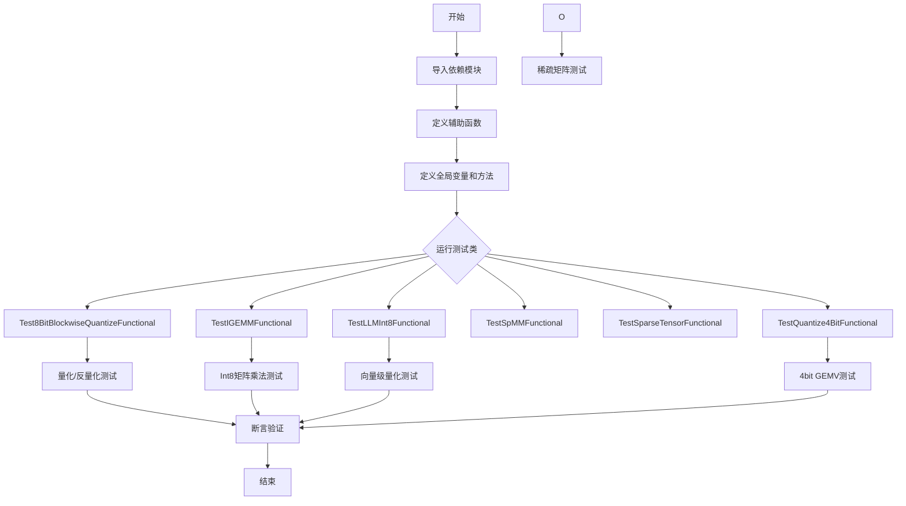

## 类结构

```
全局辅助函数
├── assert_all_approx_close
├── quant
├── dequant
├── mm_dequant
├── quant_multi
├── quant_multi_chunk
└── mean
FFN (前馈神经网络类)
Timer (性能计时器类)
Test8BitBlockwiseQuantizeFunctional (8位块式量化测试)
TestIGEMMFunctional (Int8矩阵乘法测试)
TestLLMInt8Functional (LLM Int8功能测试)
TestSpMMFunctional (稀疏矩阵乘法测试)
TestSparseTensorFunctional (稀疏张量转换测试)
TestQuantize4BitFunctional (4位量化测试)
```

## 全局变量及字段


### `k`
    
测试迭代次数常量(20)

类型：`int`
    


### `methods`
    
量化方法字典,包含linear和vectorwise两种量化策略

类型：`dict`
    


### `HIP_ENVIRONMENT`
    
ROCm环境标识,从bitsandbytes.cextension导入

类型：`bool`
    


### `ROCM_WARP_SIZE_64`
    
ROCm warp size标识,从bitsandbytes.cextension导入

类型：`bool`
    


### `FFN.fc1`
    
第一层全连接层

类型：`torch.nn.Linear`
    


### `FFN.fc2`
    
第二层全连接层

类型：`torch.nn.Linear`
    


### `Timer.starts`
    
计时开始事件字典

类型：`dict`
    


### `Timer.ends`
    
计时结束事件字典

类型：`dict`
    


### `Timer.agg`
    
累计时间字典

类型：`dict`
    
    

## 全局函数及方法


### `assert_all_approx_close`

该函数是一个用于近似相等断言的全局函数，通过比较两个张量之间的相对误差和绝对误差，判断它们是否在指定的容差范围内相等。常用于测试量化等数值计算场景中，允许一定的数值误差。

参数：

- `a`：`torch.Tensor`，第一个用于比较的张量
- `b`：`torch.Tensor`，第二个用于比较的张量
- `rtol`：`float`，相对误差容限（relative tolerance），默认为 `1e-3`
- `atol`：`float`，绝对误差容限（absolute tolerance），默认为 `1e-3`
- `count`：`int`，允许的不接近元素的最大数量，默认为 `0`
- `throw`：`bool`，当不接近元素数量超过 `count` 时是否抛出异常，默认为 `True`

返回值：`int`，返回不接近元素的总数量

#### 流程图

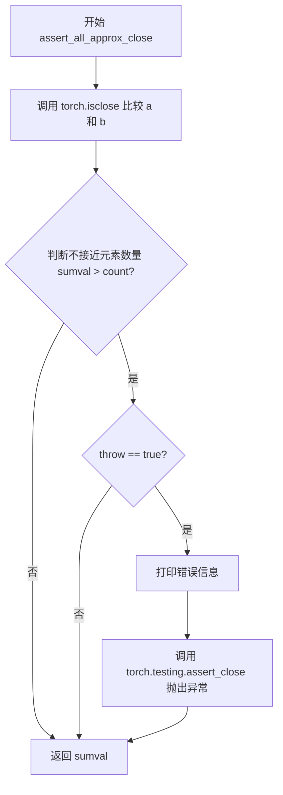

#### 带注释源码

```
def assert_all_approx_close(a, b, rtol=1e-3, atol=1e-3, count=0, throw=True):
    """
    用于近似相等断言的函数。
    
    参数:
        a: 第一个张量
        b: 第二个张量
        rtol: 相对误差容限
        atol: 绝对误差容限
        count: 允许的不接近元素的最大数量
        throw: 是否在超出容差时抛出异常
    返回:
        不接近元素的数量
    """
    # 使用 torch.isclose 检查两个张量的元素是否在容差范围内接近
    idx = torch.isclose(a, b, rtol=rtol, atol=atol)
    
    # 计算不接近（False）元素的数量
    sumval = (idx == 0).sum().item()
    
    # 如果不接近元素的数量超过允许的 count 值
    if sumval > count:
        # 如果 throw 为 True，则打印错误并抛出异常
        if throw:
            print(f"Too many values not close: assert {sumval} < {count}")
            torch.testing.assert_close(a, b, rtol=rtol, atol=atol)

    # 返回不接近元素的总数量
    return sumval
```


### `test_stable_embedding`

该函数是一个简单的测试用例，用于验证 `StableEmbedding` 嵌入层的创建和参数初始化功能。它创建了一个维度为 1024x1024 的 StableEmbedding 层，并调用 `reset_parameters()` 方法重置其权重参数，以确保嵌入层参数的初始状态正确。

参数：

- （无参数）

返回值：`None`，该函数不返回任何值，仅执行嵌入层的创建和参数重置操作。

#### 流程图

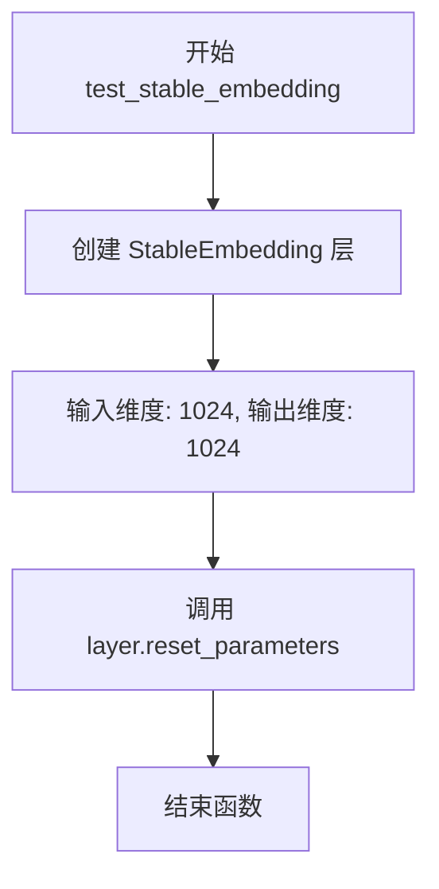

#### 带注释源码

```python
def test_stable_embedding():
    """
    测试 StableEmbedding 嵌入层的创建和参数初始化功能。
    
    该测试函数执行以下操作：
    1. 创建一个 StableEmbedding 层，输入维度为 1024，输出维度为 1024
    2. 调用 reset_parameters() 方法重置层的权重参数
    
    验证要点：
    - StableEmbedding 类可以正常实例化
    - reset_parameters() 方法可以正常调用
    """
    # 创建一个 StableEmbedding 层，输入特征数 1024，输出特征数 1024
    layer = bnb.nn.StableEmbedding(1024, 1024)
    
    # 重置嵌入层的参数，确保参数处于正确的初始状态
    layer.reset_parameters()
```

#### 额外信息

| 项目 | 说明 |
|------|------|
| **函数类型** | pytest 测试函数 |
| **所属模块** | bitsandbytes 测试模块 |
| **依赖组件** | `bnb.nn.StableEmbedding` (bitsandbytes 神经网络模块中的 StableEmbedding 类) |
| **测试目标** | 验证 StableEmbedding 层的初始化流程是否正常工作 |
| **技术特点** | 这是一个基础冒烟测试（smoke test），用于快速验证嵌入层的基本功能可用性 |


### `test_normal_map_tree`

这是一个测试函数，用于验证 `bitsandbytes` 库中正规映射树（Normal Map Tree）的创建和计算逻辑是否正确。它通过调用 `F.create_normal_map()` 创建正规映射，并验证映射值和pivot点的计算。

参数：无

返回值：无（测试函数，不返回任何值）

#### 流程图

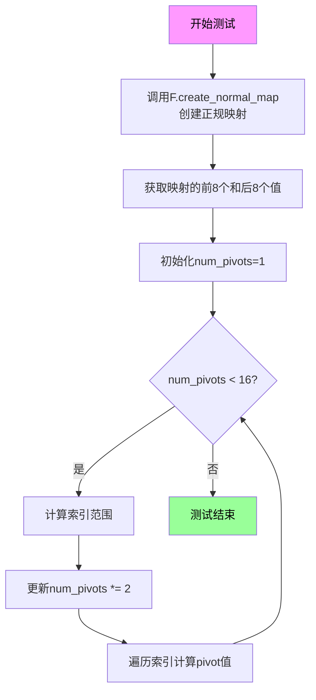

#### 带注释源码

```python
def test_normal_map_tree():
    # 调用functional模块的create_normal_map函数创建一个正规映射码本
    # 这个映射用于4bit量化中的正规分布编码
    code = F.create_normal_map()
    
    # 提取映射的前8个值和后8个值，组成测试用的values列表
    # 这些值代表了量化码本中的关键点
    values = code[:8].tolist() + code[-8:].tolist()
    
    # 初始化pivot数量为1，pivot是用于划分量化区间的临界点
    num_pivots = 1
    
    # print(values)  # 可选的调试输出
    
    # 循环测试不同的pivot数量（1, 2, 4, 8）
    while num_pivots < 16:
        # 计算需要检查的索引位置
        # 每次迭代将索引范围扩大一倍
        idx = list(range(16 // num_pivots // 2, 16, 16 // num_pivots))
        
        # print(idx)  # 可选的调试输出
        
        # 将pivot数量翻倍
        num_pivots *= 2
        
        # 用于存储计算出的pivot值
        pivots = []
        
        # 遍历索引，计算相邻值的中点作为pivot
        # 这是正规映射树的核心逻辑
        for i in idx:
            pivots.append((values[i - 1] + values[i]) / 2)
        
        # print(pivots)  # 可选的调试输出
```


### `quant`

基础量化函数，用于将浮点张量量化为8位整数。该函数通过计算输入张量的最大绝对值作为缩放因子，将浮点值映射到[-127, 127]范围的整数，实现简单的动态量化。

参数：

- `x`：`torch.Tensor`，输入的要量化的浮点张量

返回值：

- `max1`：`torch.Tensor`（标量），输入张量的最大绝对值，用作反量化时的缩放因子
- `x.to(torch.int8)`：`torch.Tensor`（int8类型），量化后的整数张量，值范围在[-127, 127]

#### 流程图

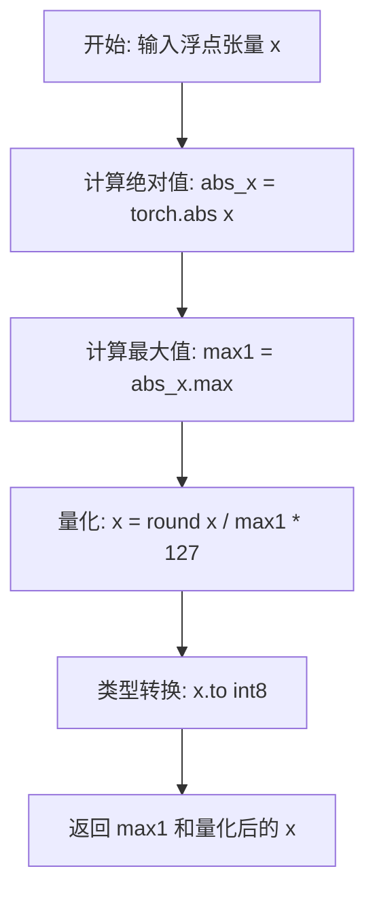

#### 带注释源码

```python
def quant(x):
    """
    基础量化函数，将浮点张量量化为int8
    
    参数:
        x: 输入的浮点张量
        
    返回:
        max1: 最大绝对值（缩放因子）
        x: int8类型的量化值
    """
    # 计算输入张量的最大绝对值作为缩放因子
    max1 = torch.abs(x).max()
    
    # 将输入值归一化到[-127, 127]范围并四舍五入
    # 除以max1进行归一化，乘以127进行缩放，round进行四舍五入
    x = torch.round(x / max1 * 127)
    
    # 将量化后的张量转换为int8类型并返回
    return max1, x.to(torch.int8)
```


### `dequant`

基础反量化函数，用于将量化后的整数张量反量化为浮点数张量。该函数是模块级函数，属于代码中的量化/反量化辅助函数集合。

参数：

- `c`：`torch.Tensor`，量化后的整数值张量（通常是 int8 类型）
- `maxC`：`torch.Tensor`，反量化所需的缩放因子，通常是原始张量的最大绝对值

返回值：`torch.Tensor`，反量化后的浮点数张量

#### 流程图

```mermaid
flowchart TD
    A[开始] --> B[将输入张量c转换为浮点数类型]
    B --> C[计算缩放因子: maxC / 127]
    C --> D[执行反量化: c.float() × (maxC / 127)]
    D --> E[返回反量化结果]
```

#### 带注释源码

```python
def dequant(c, maxC):
    """
    基础反量化函数
    
    将量化后的整数张量通过缩放因子反量化为浮点数张量。
    量化公式: c = round(x / maxC * 127)
    反量化公式: x ≈ c * (maxC / 127)
    
    参数:
        c: 量化后的整数张量 (如 int8)
        maxC: 原始值的最大绝对值，用于计算缩放因子
    
    返回:
        反量化后的浮点数张量
    """
    return c.float() * (maxC / 127)
```


### `mm_dequant`

该函数执行矩阵乘法后的反量化操作，通过将量化矩阵乘积乘以两个输入矩阵的缩放因子（maxA和maxB）并除以127来恢复浮点值。

参数：
- `maxA`：`torch.Tensor`，表示矩阵A的缩放因子（通常为每行或每列的最大绝对值）
- `maxB`：`torch.Tensor`，表示矩阵B的缩放因子（通常为每行或每列的最大绝对值）
- `C`：`torch.Tensor`，量化后的矩阵乘积（通常为int8类型）

返回值：`torch.Tensor`，反量化后的浮点矩阵乘法结果

#### 流程图

```mermaid
graph TD
    A[输入: maxA, maxB, C] --> B[将C转换为浮点类型: C.float]
    B --> C[计算缩放因子: maxA / 127]
    C --> D[计算缩放因子: maxB / 127]
    D --> E[逐元素乘积: C.float * (maxA / 127) * (maxB / 127)]
    E --> F[输出: 反量化结果]
```

#### 带注释源码

```python
def mm_dequant(maxA, maxB, C):
    """
    矩阵乘法反量化函数
    
    参数:
        maxA: 矩阵A的缩放因子张量
        maxB: 矩阵B的缩放因子张量
        C: 量化后的矩阵乘积（int8类型）
    
    返回:
        反量化后的浮点矩阵结果
    """
    # 将量化矩阵C转换为浮点类型
    C_float = C.float()
    
    # 计算缩放因子：maxA和maxB分别除以127（量化时的缩放基数）
    scale_A = maxA / 127
    scale_B = maxB / 127
    
    # 依次乘以两个缩放因子，恢复原始浮点值
    return C_float * scale_A * scale_B
```


### `quant_multi`

该函数是一个多维量化函数，通过计算指定维度上的最大绝对值作为缩放因子，将输入张量量化为int8类型，适用于向量级别的量化操作。

参数：

-  `x`：`torch.Tensor`，输入的需要进行量化的张量
-  `dim`：`int`，指定进行量化的维度

返回值：`Tuple[torch.Tensor, torch.Tensor]`，返回缩放因子max1（用于反量化）和量化后的int8张量

#### 流程图

```mermaid
flowchart TD
    A[输入张量 x 和维度 dim] --> B[计算绝对值]
    B --> C[在指定维度 dim 上求最大值 max1]
    C --> D[保持维度 keepdim=True]
    D --> E{检查 max1 是否为0}
    E -->|是| F[将0值替换为1.0 避免除零]
    E -->|否| G[继续下一步]
    F --> G
    G --> H[计算量化值: round(x / max1 * 127)]
    H --> I[转换为 int8 类型]
    I --> J[返回 max1 和量化后的张量]
```

#### 带注释源码

```
def quant_multi(x, dim):
    """
    多维量化函数
    
    参数:
        x: 输入张量
        dim: 需要进行量化统计的维度
    
    返回:
        max1: 缩放因子（该维度上的最大绝对值）
        x.to(torch.int8): 量化后的int8张量
    """
    # 计算指定维度上的最大绝对值作为缩放因子
    # keepdim=True 保持维度以便后续广播操作
    max1 = torch.amax(torch.abs(x), dim=dim, keepdim=True)
    
    # 避免除零错误，当最大值为0时设置为1.0
    max1[max1 == 0] = 1.0
    
    # 执行量化: 将数值缩放到 [-127, 127] 范围并四舍五入
    x = torch.round(x / max1 * 127)
    
    # 转换为 int8 类型返回
    return max1, x.to(torch.int8)
```


### `quant_multi_chunk`

分块多维量化函数，用于将输入张量按块进行分组量化，对每个块计算最大绝对值作为缩放因子，然后使用该因子对块内数据进行量化，最终输出量化后的 int8 张量及其对应的缩放因子。

参数：

- `x`：`torch.Tensor`，输入的待量化浮点张量
- `dim`：`int`，指定量化的维度（0 或 1）
- `chunk_size`：`int`，分块的大小，默认为 32

返回值：`Tuple[torch.Tensor, torch.Tensor]`，返回两个张量组成的元组：

- 第一个元素 `max1`：缩放因子张量，类型为 `torch.Tensor`，表示每个块的最大绝对值
- 第二个元素 `x`：量化后的 int8 张量，类型为 `torch.Tensor`

#### 流程图

```mermaid
flowchart TD
    A[开始: quant_multi_chunk] --> B{dim == 1?}
    B -- 是 --> C[使用 einops.rearrange<br/>将 x 重塑为 (c a) b -> c a b]
    B -- 否 --> D{dim == 0?}
    D -- 是 --> E[使用 einops.rearrange<br/>将 x 重塑为 a (b c) -> a b c]
    D -- 否 --> F[直接使用原始 x]
    
    C --> G[计算 x_chunked 绝对值最大值<br/>dim=dim+1, keepdim=True]
    E --> H[计算 x_chunked 绝对值最大值<br/>dim=dim, keepdim=True]
    
    G --> I[使用 torch.tile 广播 max1 到原始形状]
    H --> J[使用 torch.tile 广播 max1 到原始形状]
    
    I --> K[使用 view 恢复原始形状]
    J --> L[使用 view 恢复原始形状]
    
    K --> M[max1[max1 == 0] = 1.0<br/>避免除零]
    L --> M
    
    M --> N[计算量化值: x = round(x / max1 * 127)]
    N --> O[转换为 int8: x.to(torch.int8)]
    O --> P[返回 (max1, x)]
```

#### 带注释源码

```python
def quant_multi_chunk(x, dim, chunk_size=32):
    """
    对输入张量进行分块多维量化
    
    参数:
        x: 输入的待量化浮点张量
        dim: 量化的维度（0 或 1）
        chunk_size: 分块大小，默认为 32
    返回:
        (max1, x): 缩放因子和量化后的 int8 张量
    """
    # 当在维度1（列）上进行量化时
    if dim == 1:
        # 使用 einops 将张量重塑为分块形式
        # 例如: (chunk_size * a) b -> chunk_size a b
        x_chunked = einops.rearrange(x, "(c a) b -> c a b", c=chunk_size)
        
        # 计算每个块（每 chunk_size 列）内的最大绝对值
        # dim=dim+1 因为在重塑后的张量中，列维度索引为 2
        max1 = torch.amax(torch.abs(x_chunked), dim=dim + 1, keepdim=True)
        
        # 将 max1 广播到原始列数
        # 例如: (chunk_size, a, 1) -> (chunk_size, a, b)
        max1 = torch.tile(max1, (1, 1, x.shape[1]))
        
        # 恢复原始张量形状
        max1 = max1.view(x.shape)
    
    # 当在维度0（行）上进行量化时
    elif dim == 0:
        # 使用 einops 将张量重塑为分块形式
        # 例如: a (chunk_size * b) -> a b chunk_size
        x_chunked = einops.rearrange(x, "a (b c) -> a b c", c=chunk_size)
        
        # 计算每个块（每 chunk_size 行）内的最大绝对值
        max1 = torch.amax(torch.abs(x_chunked), dim=dim, keepdim=True)
        
        # 将 max1 广播到原始行数
        max1 = torch.tile(max1, (x.shape[0], 1, 1))
        
        # 恢复原始张量形状
        max1 = max1.view(x.shape)
    
    # 处理零值情况，避免除零错误
    max1[max1 == 0] = 1.0
    
    # 执行量化: 将值缩放到 [-127, 127] 范围
    x = torch.round(x / max1 * 127)
    
    # 转换为 int8 类型
    return max1, x.to(torch.int8)
```


### `mean`

计算给定列表的平均值。

参数：

- `xx`：`list`或`sequence`，需要计算平均值的数字序列

返回值：`float`，序列的平均值

#### 流程图

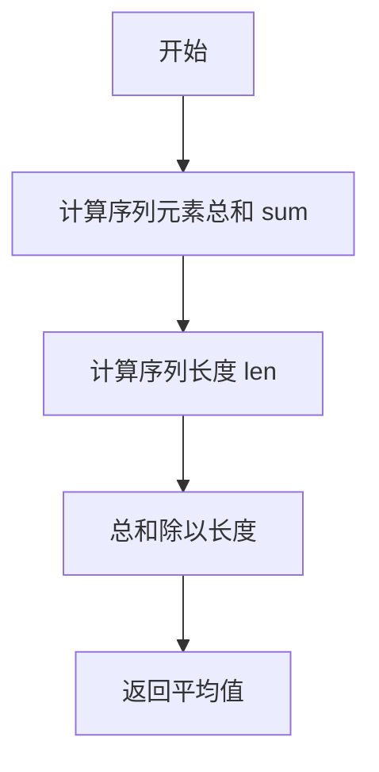

#### 带注释源码

```python
def mean(xx):
    """
    计算序列的平均值
    
    参数:
        xx: 数字序列（如列表）
        
    返回:
        序列的平均值（浮点数）
    """
    return sum(xx) / float(len(xx))  # 使用sum函数求和，除以序列长度得到平均值
```


### `FFN.__init__`

初始化前馈神经网络（Feed-Forward Network），创建两个线性层并使用Xavier均匀分布初始化权重。

参数：

- `input_features`：`int`，输入特征的维度
- `hidden_size`：`int`，隐藏层的维度
- `bias`：`bool`，是否在线性层中使用偏置（默认值为 `True`）

返回值：`None`，构造函数无返回值

#### 流程图

```mermaid
flowchart TD
    A[开始 __init__] --> B[调用 super().__init__]
    B --> C[创建 fc1 线性层: Linear(input_features, hidden_size, bias)]
    C --> D[创建 fc2 线性层: Linear(hidden_size, input_features, bias)]
    D --> E[进入 torch.no_grad 上下文]
    E --> F[使用 Xavier 均匀分布初始化 fc1.weight]
    F --> G[使用 Xavier 均匀分布初始化 fc2.weight]
    G --> H[结束 __init__]
```

#### 带注释源码

```python
class FFN(torch.nn.Module):
    def __init__(self, input_features, hidden_size, bias=True):
        """
        初始化前馈神经网络
        
        Args:
            input_features: 输入特征的维度
            hidden_size: 隐藏层的维度
            bias: 是否使用偏置，默认为 True
        """
        # 调用父类 torch.nn.Module 的初始化方法
        super().__init__()
        
        # 第一个全连接层：从输入映射到隐藏空间
        # 输入维度: input_features, 输出维度: hidden_size
        self.fc1 = torch.nn.Linear(input_features, hidden_size, bias=bias)
        
        # 第二个全连接层：从隐藏空间映射回输入空间（用于残差连接等场景）
        # 输入维度: hidden_size, 输出维度: input_features
        self.fc2 = torch.nn.Linear(hidden_size, input_features, bias=bias)

        # 在推理/评估模式下，不记录梯度，用于加速初始化
        with torch.no_grad():
            # 使用 Xavier 均匀分布初始化第一层权重
            # 有助于保持梯度方差在各层之间稳定
            torch.nn.init.xavier_uniform_(self.fc1.weight)
            
            # 使用 Xavier 均匀分布初始化第二层权重
            torch.nn.init.xavier_uniform_(self.fc2.weight)
```


### `FFN.forward`

该方法实现了一个简单的前馈神经网络（Feed-Forward Network），包含两个线性层和一个 ReLU 激活函数，执行从输入特征空间到隐藏层再到输出特征空间的前向传播计算。

参数：

- `x`：`torch.Tensor`，输入张量，形状为 `(batch_size, input_features)`

返回值：`torch.Tensor`，输出张量，形状为 `(batch_size, input_features)`

#### 流程图

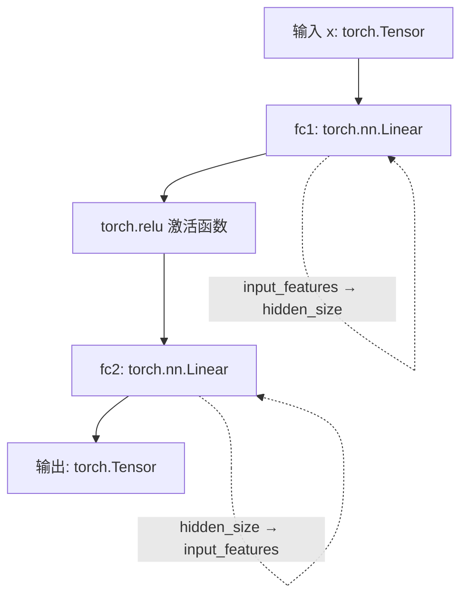

#### 带注释源码

```python
def forward(self, x):
    """
    前馈神经网络的前向传播计算
    
    参数:
        x: 输入张量，形状为 (batch_size, input_features)
    
    返回:
        输出张量，形状为 (batch_size, input_features)
    """
    # 第一层：线性变换 + ReLU 激活
    # 将输入从 input_features 维度映射到 hidden_size 维度
    x = torch.relu(self.fc1(x))
    
    # 第二层：线性变换
    # 将 hidden_size 维度映射回 input_features 维度
    x = self.fc2(x)
    
    return x
```


### `Timer.tick`

该方法用于启动或分割一个基于 CUDA 事件的命名计时器。如果指定的 `name` 对应的计时器尚未启动，它会创建 CUDA 事件并开始记录起始时间；如果该计时器已经启动（通常是上一次调用 `tick` 后），它会立即调用 `tock` 停止计时，计算单次耗时，累加到总时间（`agg`）中，并清除该名称的计时器状态（相当于一次“分割”或“重启”）。

参数：

- `name`：`str`，计时器的标识名称，默认为 "default"。用于区分不同的计时任务。

返回值：`float`，返回从开始到当前的累计耗时（毫秒）。如果是第一次调用（创建计时器），则无显式返回值。

#### 流程图

```mermaid
flowchart TD
    A([开始 Tick]) --> B{检查 name 是否在 self.starts 中?}
    B -- 否 --> C[创建 self.starts[name] = torch.cuda.Event]
    C --> D[创建 self.ends[name] = torch.cuda.Event]
    D --> E[self.starts[name].record 记录开始时间]
    E --> F([结束])
    B -- 是 --> G[调用 self.tock name='default', evict=True, print_ms=False]
    G --> H[在 tock 中计算耗时, 累加到 self.agg, 清除 starts/ends]
    H --> F
```

#### 带注释源码

```python
class Timer:
    # 类字段定义
    def __init__(self):
        self.starts = {}  # 类型: Dict[str, torch.cuda.Event], 存储用于计时的开始事件
        self.ends = {}    # 类型: Dict[str, torch.cuda.Event], 存储用于计时的结束事件
        self.agg = {}    # 类型: Dict[str, float], 存储每个名称的累计耗时（毫秒）

    def tick(self, name="default"):
        """
        记录开始时间或输出中间计时结果。
        如果 name 不存在，则创建并启动计时器。
        如果 name 已存在（计时器正在运行），则立即停止该计时器，计算耗时，
        累加到 self.agg 中，并清除该计时器（为下一次启动做准备）。
        """
        # 如果该名称的计时器尚未初始化
        if name not in self.starts:
            # 初始化 CUDA 事件，enable_timing=True 表示开启性能计时功能
            self.starts[name] = torch.cuda.Event(enable_timing=True)
            self.ends[name] = torch.cuda.Event(enable_timing=True)
            # 记录起始时间点
            self.starts[name].record()
        else:
            # 如果计时器已经在运行，调用 tock 停止并记录
            # evict=True 表示停止后清除该名称的记录，以便下次调用时重新开始
            # print_ms=False 表示不在此处打印，避免打断流程
            ms = self.tock(name, evict=True, print_ms=False)
```


### `Timer.tock`

记录结束时间并计算耗时，用于结束一个计时周期。

参数：

- `name`：`str`，计时器名称，默认为 "default"，用于标识不同的计时器
- `evict`：`bool`，是否在计时结束后清除计时器状态，默认为 True
- `print_ms`：`bool`，是否打印耗时信息，默认为 True

返回值：`float`，返回累计耗时（毫秒）

#### 流程图

```mermaid
flowchart TD
    A[开始 tock] --> B{检查 name 是否在 self.ends 中}
    B -->|是| C[记录结束事件 self.ends[name].record]
    C --> D[同步 CUDA torch.cuda.synchronize]
    D --> E[计算耗时: self.starts[name].elapsed_time self.ends[name]]
    E --> F{检查 name 是否在 self.agg 中}
    F -->|否| G[初始化 self.agg[name] = 0.0]
    F -->|是| H[累加耗时: self.agg[name] += ms]
    G --> H
    H --> I{evict 为 True?}
    I -->|是| J[清除 starts 和 ends 中的记录]
    I -->|否| K{print_ms 为 True 且 name 在 self.agg 中?}
    J --> K
    K -->|是| L[打印耗时信息]
    K -->|否| M[返回 self.agg[name]]
    L --> M
    B -->|否| K
```

#### 带注释源码

```python
def tock(self, name="default", evict=True, print_ms=True):
    """
    记录结束时间并计算耗时
    
    参数:
        name: 计时器名称，用于标识不同的计时器
        evict: 是否在计时结束后清除计时器状态
        print_ms: 是否打印耗时信息
    
    返回:
        累计耗时（毫秒）
    """
    # 检查是否存在该名称的结束事件
    if name in self.ends:
        # 记录结束事件
        self.ends[name].record()
        # 同步 CUDA，确保 GPU 操作完成
        torch.cuda.synchronize()
        # 计算从开始到结束的耗时（毫秒）
        ms = self.starts[name].elapsed_time(self.ends[name])
        
        # 初始化或累加该名称的累计耗时
        if name not in self.agg:
            self.agg[name] = 0.0
        self.agg[name] += ms
        
        # 如果 evict 为 True，清除该计时器的记录
        if evict:
            self.starts.pop(name)
            self.ends.pop(name)

    # 如果需要打印耗时信息
    if print_ms and name in self.agg:
        # 将毫秒转换为秒并打印
        print(f"{name} took: {self.agg[name] / 1000.0:.5f}s")

    # 返回累计耗时
    return self.agg[name]
```


### `Timer.reset`

**描述**：该方法用于重置 `Timer` 类的所有内部状态。它清空用于存储 CUDA 事件（`starts`, `ends`）的字典以及用于存储累积时间（`agg`）的字典，从而清除之前的计时数据，确保计时器可以重新开始用于新的基准测试任务。

**参数**：

- `self`：`Timer`，隐式参数，代表当前的 `Timer` 实例。

**返回值**：`None`，该方法执行清理操作，不返回任何值。

#### 流程图

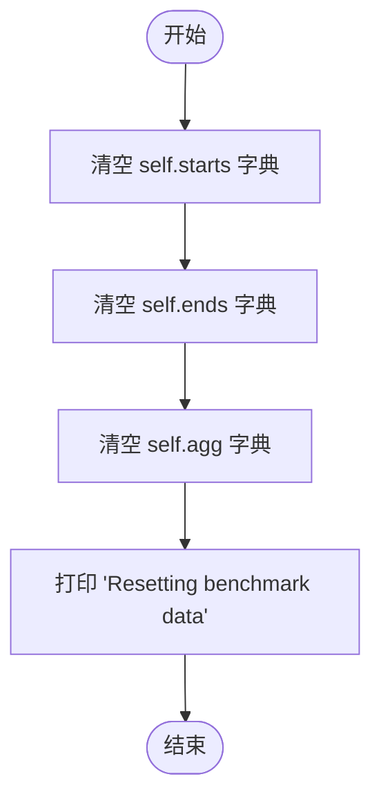

#### 带注释源码

```python
def reset(self):
    # 将存储 CUDA 事件起始时间的字典重置为空字典
    # 这会移除所有之前通过 tick() 开始计时的任务记录
    self.starts = {}
    
    # 将存储 CUDA 事件结束时间的字典重置为空字典
    # 配合 starts 字典的清理，确保没有悬空的计时事件引用
    self.ends = {}
    
    # 将存储累积时间（毫秒）的字典重置为空字典
    # 清除所有通过 tock() 累加的计时结果
    self.agg = {}
    
    # 打印通知信息，确认基准测试数据已被重置
    print("Resetting benchmark data")
```


### `Test8BitBlockwiseQuantizeFunctional.test_dynamic_blockwise_quantization`

该方法是一个测试函数，用于验证动态块式量化（dynamic blockwise quantization）功能的正确性。它通过生成随机张量，进行量化和反量化操作，然后比较原始张量与反量化后张量之间的误差，确保量化算法在不同参数配置下都能保持足够的精度。

参数：

- `self`：`Test8BitBlockizeQuantizeFunctional`（隐式），测试类实例本身，无需显式传递
- `device`：`str`，指定测试运行的设备（如 "cuda"、"cpu"、"xpu" 等），通过 pytest 参数化获取
- `dtype`：`torch.dtype`，输入张量的数据类型（如 torch.float32、torch.float16、torch.bfloat16），通过 pytest 参数化获取
- `nested`：`bool`，是否使用嵌套量化（nested quantization），通过 pytest 参数化获取
- `blocksize`：`int`，量化块大小（如 4096、2048、1024、512、256、128、64 等），通过 pytest 参数化获取
- `signed`：`bool`，是否使用有符号量化，通过 pytest 参数化获取

返回值：`None`，该方法为测试函数，无返回值，通过断言（assert）验证正确性

#### 流程图

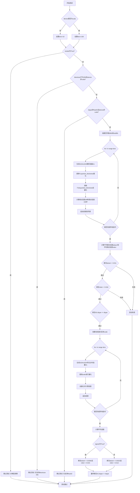

#### 带注释源码

```python
@pytest.mark.parametrize("device", get_available_devices())
@pytest.mark.parametrize("dtype", [torch.float32, torch.float16, torch.bfloat16], ids=describe_dtype)
@pytest.mark.parametrize("nested", TRUE_FALSE, ids=id_formatter("nested"))
@pytest.mark.parametrize(
    "blocksize",
    [4096, 2048, 1024, 512, 256, 128, 64] if not ROCM_WARP_SIZE_64 else [4096, 2048, 1024, 512, 256, 128],
)
@pytest.mark.parametrize("signed", TRUE_FALSE, ids=id_formatter("signed"))
def test_dynamic_blockwise_quantization(self, device, dtype, nested, blocksize, signed):
    """
    测试动态块式量化功能。
    验证在不同设备、数据类型、块大小和有符号/无符号配置下的量化精度。
    """
    # 根据设备类型设置迭代次数
    # 非CUDA设备（如CPU、MPS、XPU）迭代次数较少以节省时间
    iters = 100
    if device != "cuda":
        iters = 10

        # 对于非CUDA实现，某些测试用例较慢，跳过非典型用例
        if nested:
            pytest.skip("Not a typical use case.")
        # CPU/MPS/XPU仅支持blocksize 256
        if blocksize != 256:
            pytest.skip("Only blocksize 256 is used in CPU/MPS/XPU")
        # CPU/MPS/XPU仅支持float32
        if dtype != torch.float32:
            pytest.skip("Only float32 is used in CPU/MPS/XPU")

    # ========== 第一部分：测试默认码本的量化精度 ==========
    diffs = []       # 存储每次迭代的绝对误差
    reldiffs = []    # 存储每次迭代的相对误差
    
    for i in range(iters):
        # 生成1024x1024的随机张量
        A1 = torch.randn(1024, 1024, device=device, dtype=dtype)
        
        # 使用块式量化（不指定code，使用默认码本）
        C, S = F.quantize_blockwise(A1, blocksize=blocksize, nested=nested)
        
        # 反量化恢复张量
        A2 = F.dequantize_blockwise(C, S)
        
        # 计算绝对误差：|A1 - A2|
        diff = torch.abs(A1 - A2).float()
        
        # 计算相对误差：|A1 - A2| / |A1 + epsilon|
        reldiff = diff / torch.abs(A1.float() + 1e-8)
        
        # 记录本次迭代的平均误差
        diffs.append(diff.mean().item())
        reldiffs.append(reldiff.mean().item())
    
    # 计算平均误差
    abserr = sum(diffs) / len(diffs)
    relerr = sum(reldiffs) / len(reldiffs)
    
    # 验证量化精度（使用随机正态分布数据）
    assert abserr < 0.011, f"Absolute error {abserr} exceeds threshold 0.011"
    assert relerr < 0.018, f"Relative error {relerr} exceeds threshold 0.018"
    assert A2.dtype == dtype, f"Output dtype {A2.dtype} does not match input {dtype}"

    # ========== 第二部分：测试自定义码本的量化精度 ==========
    diffs = []  # 重置误差列表
    
    # 创建动态量化码本（有符号或无符号）
    code = F.create_dynamic_map(signed=signed)
    
    for i in range(iters):
        # 生成1024x1024的均匀分布随机张量（0到1之间）
        A1 = torch.rand(1024, 1024, device=device, dtype=dtype)
        
        # 使用指定码本进行块式量化
        C, S = F.quantize_blockwise(A1, blocksize=blocksize, nested=nested, code=code)
        
        # 反量化恢复张量
        A2 = F.dequantize_blockwise(C, S)
        
        # 计算误差
        diff = torch.abs(A1 - A2).float()
        reldiff = diff / torch.abs(A1.float() + 1e-8)
        diffs.append(diff.mean().item())
        reldiffs.append(reldiff.mean().item())
    
    # 计算平均误差
    abserr = sum(diffs) / len(diffs)
    relerr = sum(reldiffs) / len(reldiffs)
    
    # 根据有符号/无符号配置验证不同阈值
    if signed:
        # 有符号量化精度要求更高
        threshold_abserr = 0.0035
        assert abserr < 0.0036, f"Signed abs error {abserr} exceeds 0.0036"
        assert relerr < 0.015, f"Signed rel error {relerr} exceeds 0.015"
    else:
        # 无符号量化精度要求
        assert abserr < 0.0023, f"Unsigned abs error {abserr} exceeds 0.0023"
        assert relerr < 0.012, f"Unsigned rel error {relerr} exceeds 0.012"
    
    # 最终验证输出类型
    assert A2.dtype == dtype
```


### `Test8BitBlockwiseQuantizeFunctional.test_dynamic_blockwise_quantization_large`

该测试方法用于验证在大规模张量（接近2^31-1个元素）上进行块式量化（blockwise quantization）的功能是否正常工作。主要测试CUDA/XPU设备上对极大张量的量化与反量化能力，确保量化后的数据类型正确且元素数量保持一致。

参数：

- `self`：Test8BitBlockwiseQuantizeFunctional 类实例，隐式参数
- `device`：str，测试运行的设备（从 `get_available_devices(no_cpu=True)` 获取，不包括CPU）
- `dtype`：torch.dtype，输入张量的数据类型（torch.float32、torch.float16 或 torch.bfloat16）
- `blocksize`：int，块大小参数（固定为256）

返回值：无（测试方法，通过断言验证）

#### 流程图

```mermaid
flowchart TD
    A[开始测试] --> B{检查device是否为cuda或xpu}
    B -->|否| C[跳过测试 - 仅支持CUDA和XPU设备]
    B -->|是| D[创建大规模张量<br/>data = torch.randn(2**31 - 1, device, dtype)]
    D --> E[调用F.quantize_blockwise量化<br/>q_data, q_stats = F.quantize_blockwise]
    E --> F[断言验证: q_data不为None]
    F --> G[断言验证: q_data.dtype == torch.uint8]
    G --> H[断言验证: q_data.numel() == data.numel()]
    H --> I[删除原始数据释放内存<br/>del data]
    I --> J[执行反量化<br/>dq = F.dequantize_blockwise(q_data, q_stats)]
    J --> K[断言验证: dq.dtype == dtype]
    K --> L[断言验证: dq.numel() == q_data.numel()]
    L --> M[测试完成]
    C --> M
```

#### 带注释源码

```python
@pytest.mark.parametrize("device", get_available_devices(no_cpu=True))
@pytest.mark.skipif(not get_available_devices(no_cpu=True), reason="No accelerator device")
@pytest.mark.parametrize("dtype", [torch.float32, torch.float16, torch.bfloat16], ids=describe_dtype)
@pytest.mark.parametrize("blocksize", [256], ids=id_formatter("blocksize"))
def test_dynamic_blockwise_quantization_large(self, device, dtype, blocksize):
    """
    Test that we can successfully quantize a large tensor. Note that the following limitations apply:
    - On CUDA/XPU/ROCm, the maximum number of elements is limited to 2**31 - 1 due to int32 indexing in C++ kernels.
    - On CPU, there is a significantly higher memory overhead for the quantization, so we skip this test.
    - Verification of the accuracy for dequantization has too high memory overhead for this test.
    """
    # 设备检查：仅CUDA和XPU设备支持此测试（由于内存限制）
    if device not in ["cuda", "xpu"]:
        pytest.skip("This test is only for CUDA and XPU devices due to memory constraints.")

    # 创建接近int32索引上限的大规模张量（2^31 - 1个元素）
    data = torch.randn(2**31 - 1, device=device, dtype=dtype)
    
    # 使用指定的blocksize对大张量进行块式量化
    q_data, q_stats = F.quantize_blockwise(data, blocksize=blocksize)

    # 验证量化后的数据不为空
    assert q_data is not None
    # 验证量化后数据类型为uint8（8位量化）
    assert q_data.dtype == torch.uint8
    # 验证量化后元素数量与原始张量相同
    assert q_data.numel() == data.numel()

    # 删除原始数据以释放内存（避免内存峰值过高）
    del data
    # 对量化数据进行反量化
    dq = F.dequantize_blockwise(q_data, q_stats)

    # 验证反量化后的数据类型与原始数据类型一致
    assert dq.dtype == dtype
    # 验证反量化后的元素数量与量化数据元素数量一致
    assert dq.numel() == q_data.numel()
```


### `Test8BitBlockwiseQuantizeFunctional.test_blockwise_cpu_large`

该函数是一个CPU端的大张量分块量化功能测试，用于验证在CPU设备上对较大张量进行8位分块量化和解量化的正确性与性能。

参数：

-  `self`：`Test8BitBlockwiseQuantizeFunctional`，测试类实例，包含测试所需的状态和方法
-  `hidden`：`int`，隐藏层维度大小，参数化为128
-  `blocksize`：`int`，分块量化的大小，参数化为4096和16384

返回值：无（`None`），该函数为测试函数，主要通过断言验证量化误差

#### 流程图

```mermaid
flowchart TD
    A[开始测试 test_blockwise_cpu_large] --> B[初始化空列表 diffs 和 reldiffs]
    B --> C[设置 batch=128, seq=128]
    C --> D[循环 i in range(2)]
    D --> E[生成随机张量 A1: torch.randn(batch, seq, hidden, device='cpu')]
    E --> F[记录开始时间 t0]
    F --> G[调用 F.quantize_blockwise 进行分块量化]
    G --> H[返回量化数据 C 和统计信息 S]
    H --> I[调用 F.dequantize_blockwise 进行解量化]
    I --> J[返回解量化后的张量 A2]
    J --> K[打印耗时 time.time() - t0]
    K --> L[计算绝对误差 diff = torch.abs(A1 - A2)]
    L --> M[计算相对误差 reldiff = diff / torch.abs(A1 + 1e-8)]
    M --> N[记录误差均值到 diffs 和 reldiffs]
    N --> O{断言检查 diffs[-1] < 0.011}
    O -->|通过| P{是否完成2次迭代}
    O -->|失败| Q[测试失败/抛出异常]
    P -->|否| D
    P -->|是| R[结束测试]
```

#### 带注释源码

```python
@pytest.mark.skipif("cpu" not in get_available_devices(), reason="CPU is required")
@pytest.mark.parametrize("hidden", [128])
@pytest.mark.parametrize("blocksize", [4096, 16384])
def test_blockwise_cpu_large(self, hidden, blocksize):
    """
    CPU大张量分块量化测试函数
    
    该测试验证在CPU上对较大张量进行8位分块量化的正确性。
    测试会生成随机张量，进行量化和解量化，然后检查误差是否在可接受范围内。
    
    参数:
        hidden: 隐藏层维度大小，参数化为128
        blocksize: 分块量化的大小，参数化为4096和16384
    """
    diffs = []      # 存储每次迭代的绝对误差均值
    reldiffs = []   # 存储每次迭代的相对误差均值
    batch = 128     # 批次大小
    seq = 128       # 序列长度

    # 执行2次迭代以验证结果稳定性
    for i in range(2):
        # 在CPU上生成随机张量，形状为 (batch, seq, hidden)
        A1 = torch.randn(batch, seq, hidden, device="cpu")
        
        t0 = time.time()  # 记录开始时间用于性能测试
        
        # 调用 functional 模块的 quantize_blockwise 进行分块量化
        # 输入: A1 - 待量化张量
        #      blocksize - 分块大小
        # 输出: C - 量化后的数据（uint8）
        #       S - 量化统计信息（每个分块的缩放因子等）
        C, S = F.quantize_blockwise(A1, blocksize=blocksize)
        
        # 调用 functional 模块的 dequantize_blockwise 进行解量化
        # 输入: C - 量化数据
        #      S - 量化统计信息
        #      blocksize - 分块大小（必须与量化时一致）
        # 输出: A2 - 解量化后的张量
        A2 = F.dequantize_blockwise(C, S, blocksize=blocksize)
        
        # 打印量化解量化耗时
        print(time.time() - t0)
        
        # 计算绝对误差: |原始值 - 解量化值|
        diff = torch.abs(A1 - A2)
        
        # 计算相对误差: 绝对误差 / (|原始值| + 极小值避免除零)
        reldiff = diff / torch.abs(A1 + 1e-8)
        
        # 记录误差均值
        diffs.append(diff.mean().item())
        reldiffs.append(reldiff.mean().item())
        
        # 断言: 确保每次迭代的绝对误差均值小于阈值 0.011
        assert diffs[-1] < 0.011
```


### `Test8BitBlockwiseQuantizeFunctional.test_few_bit_quant`

该方法是一个测试少比特（2-8位）量化功能的测试用例，通过对比线性映射、FP8 映射和动态映射三种不同的量化方法，验证 bitsandbytes 库中 `quantize_blockwise` 和 `dequantize_blockwise` 函数的正确性与精度。

参数：

- `self`：测试类实例，无需显式传递
- `device`：`str`，测试运行的设备（如 "cuda"、"cpu" 等），由 `get_available_devices()` 参数化提供
- `bits`：`int`，量化比特数，范围 2-8，由 `range(2, 9)` 参数化提供
- `method`：`str`，量化方法，包括 "linear"、"fp8" 和 "dynamic"，由列表参数化提供

返回值：无（测试方法返回 `None`，通过断言验证正确性）

#### 流程图

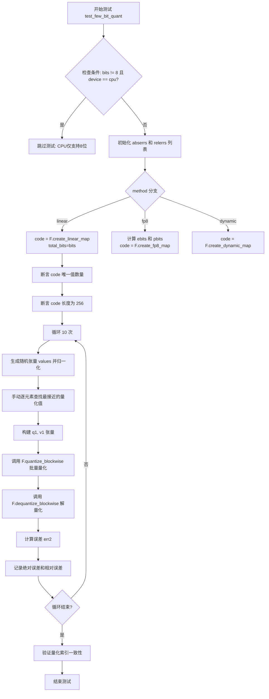

#### 带注释源码

```python
@pytest.mark.parametrize("device", get_available_devices())
@pytest.mark.parametrize("bits", range(2, 9), ids=id_formatter("bits"))
@pytest.mark.parametrize("method", ["linear", "fp8", "dynamic"])
def test_few_bit_quant(self, device, bits, method):
    """
    测试少比特量化功能，验证不同比特数和方法下的量化/解量化正确性。
    
    参数:
        device: 测试设备 (cuda/cpu/xpu等)
        bits: 量化比特数 (2-8)
        method: 量化方法 ("linear", "fp8", "dynamic")
    """
    # CPU实现仅支持8位，其他位数跳过
    if bits != 8 and device == "cpu":
        pytest.skip("CPU implementation only supports 8 bits")

    # 用于存储误差的列表
    abserrs = []  # 存储绝对误差
    relerrs = []  # 存储相对误差
    code = None   # 量化编码表

    # 根据量化方法创建对应的编码表
    if method == "linear":
        # 线性量化映射: 创建 total_bits 位的线性编码
        code = F.create_linear_map(True, total_bits=bits).to(device)
    elif method == "fp8":
        # FP8量化: 计算指数位和工作位
        ebits = math.ceil(bits / 2)      # 指数位数
        pbits = bits - ebits - 1          # 尾数位数
        code = F.create_fp8_map(True, ebits, pbits, bits).to(device)
    elif method == "dynamic":
        # 动态量化映射: 创建动态范围的编码表
        code = F.create_dynamic_map(True, bits - 0, bits).to(device)

    # 验证编码表的正确性
    # 不同数据类型可能有不同数量的零值表示 (无零/单零/双零)
    assert torch.unique(code).numel() in [2**bits, 2**bits - 1], \
        f"bits: {bits}, method: {method}"
    
    # 编码表长度应为256 (8位)
    assert code.numel() == 256

    # 迭代测试: 运行10次不同的随机数据
    for i in range(10):
        # 生成随机张量: shape (1, 32)
        values = torch.randn(1, 32, device=device)
        # 归一化到 [-1, 1] 范围
        values /= values.abs().max()
        # 可选: 将接近零的值偏移以避免数值问题
        # values[values.abs() < 1e-6] += 1e-5

        # 手动逐元素量化 (作为参考实现)
        q1 = []  # 量化索引
        v1 = []  # 量化值
        for v in values[0]:
            # 找到与编码表最接近的索引
            idx = torch.abs(v - code).argmin()
            q1.append(idx.item())
            v1.append(code[idx].item())

        # 转换为张量
        q1 = torch.tensor(q1, device=device)
        v1 = torch.tensor(v1, device=device)

        # 使用库函数进行块级量化
        q2, S2 = F.quantize_blockwise(values, code=code)
        # 解量化
        v2 = F.dequantize_blockwise(q2, S2)

        # 比较量化索引
        idx = torch.isclose(q1.int(), q2.int())
        
        # 计算解量化后的误差
        err2 = torch.abs(v2 - values)
        abserrs.append(err2.mean().item())  # 记录平均绝对误差
        relerrs.append((err2 / (1e-10 + values).abs()).mean().item())  # 记录平均相对误差

        if idx.sum():
            # 某些边界情况处理
            err1 = torch.abs(v1 - values).mean()
            # 可选: assert err2.mean() <= err1
        else:
            # 验证逐元素量化和块级量化结果一致
            torch.testing.assert_close(q1, q2)
```


### Test8BitBlockwiseQuantizeFunctional.test_fp8_quant

FP8量化测试方法，用于验证bitsandbytes库中FP8（8位浮点）量化功能的正确性，通过对不同指数位和精度位配置的测试数据（正态分布和均匀分布）进行量化与解量化，并计算绝对误差和相对误差来确保量化精度。

参数：

- `self`：Test8BitBlockwiseQuantizeFunctional类实例本身，无需显式传递
- `device`：`str`，测试设备（如"cuda"、"cpu"等），由pytest参数化提供

返回值：`None`，该方法为测试方法，无返回值

#### 流程图

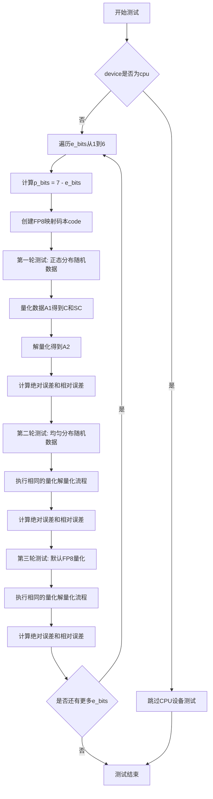

#### 带注释源码

```python
@pytest.mark.parametrize("device", get_available_devices())
def test_fp8_quant(self, device):
    """
    FP8量化测试：验证FP8量化功能在各种指数位/精度位配置下的正确性
    
    测试覆盖三种数据分布：
    1. torch.randn: 正态分布随机数据
    2. torch.rand: 均匀分布随机数据  
    3. 无code参数: 使用默认FP8量化配置
    """
    # TODO
    if device == "cpu":
        pytest.skip("CPU implementation segfaults")

    # 遍历不同的指数位配置 (1-6位)
    for e_bits in range(1, 7):
        # 精度位 = 7 - 指数位 (FP8总共8位，1位符号位)
        p_bits = 7 - e_bits
        # 创建FP8量化码本，True表示量化到有符号数
        code = F.create_fp8_map(True, e_bits, p_bits).to(device)

        # ====== 第一轮测试: 正态分布数据 ======
        abserr = []
        relerr = []
        for i in range(10):
            # 生成1024x1024的正态分布随机张量
            A1 = torch.randn(1024, 1024, device=device)
            # 使用FP8码本进行块级量化
            C, SC = F.quantize_blockwise(A1, code=code)
            # 解量化恢复
            A2 = F.dequantize_blockwise(C, SC)
            # 计算绝对误差
            diff = torch.abs(A1 - A2)
            # 计算相对误差 (加1e-8避免除零)
            reldiff = diff / torch.abs(A1 + 1e-8)
            abserr.append(diff.mean().item())
            relerr.append(reldiff.mean().item())
            # assert diff < 0.0075
        # print(sum(abserr)/len(abserr))
        # print(sum(relerr)/len(relerr))

        # ====== 第二轮测试: 均匀分布数据 ======
        abserr = []
        relerr = []
        for i in range(10):
            # 生成1024x1024的均匀分布随机张量 [0,1)
            A1 = torch.rand(1024, 1024, device=device)
            # 使用FP8码本进行块级量化
            C, SC = F.quantize_blockwise(A1, code=code)
            # 解量化恢复
            A2 = F.dequantize_blockwise(C, SC)
            # 计算绝对误差和相对误差
            diff = torch.abs(A1 - A2)
            reldiff = diff / torch.abs(A1 + 1e-8)
            abserr.append(diff.mean().item())
            relerr.append(reldiff.mean().item())
            # assert diff < 0.0075
        # print(sum(abserr)/len(abserr))
        # print(sum(relerr)/len(relerr))

        # ====== 第三轮测试: 默认FP8量化 ======
        abserr = []
        relerr = []
        for i in range(10):
            # 生成正态分布数据，使用默认量化参数
            A1 = torch.randn(1024, 1024, device=device)
            # 默认块级量化（不指定code）
            C, SC = F.quantize_blockwise(A1)
            # 解量化恢复
            A2 = F.dequantize_blockwise(C, SC)
            # 计算误差
            diff = torch.abs(A1 - A2)
            reldiff = diff / torch.abs(A1 + 1e-8)
            abserr.append(diff.mean().item())
            relerr.append(reldiff.mean().item())
            # assert diff < 0.0075
        # print(3, sum(abserr)/len(abserr))
        # print(3, sum(relerr)/len(relerr))
```


### `Test8BitBlockwiseQuantizeFunctional.test_bench_dequantization`

该函数是一个基准测试方法，用于测量块量化（blockwise quantization）和解量化（dequantization）的性能。它通过创建随机张量、执行量化操作并循环多次来评估GPU上的量化/解量化速度。

参数：

- `self`：`Test8BitBlockwiseQuantizeFunctional`，隐式参数，表示类的实例本身

返回值：`None`，该方法为基准测试方法，不返回任何结果，仅打印性能数据

#### 流程图

```mermaid
flowchart TD
    A[开始基准测试] --> B[创建1024x1024的随机半精度张量 a]
    B --> C[创建FP8量化码本 code]
    C --> D[对张量 a 进行块量化得到 qa 和统计信息 SA]
    D --> E[打印量化后最大值 qa.max]
    F[计算理论最大吞吐量 max_theoretical_mu] --> G[同步CUDA设备]
    G --> H[记录开始时间 t0]
    H --> I{循环 i: 0 to 99}
    I -->|是| J[执行量化操作 F.quantize_blockwise]
    J --> I
    I -->|否| K[同步CUDA设备]
    K --> L[计算总耗时并隐式输出]
    L --> M[结束基准测试]
```

#### 带注释源码

```python
@pytest.mark.benchmark
def test_bench_dequantization(self):
    """
    基准测试方法：测试解量化性能
    
    该方法用于评估块量化（blockwise quantization）的性能表现，
    通过反复执行量化操作来测量GPU的吞吐量。
    """
    
    # 创建一个1024x1024的半精度浮点随机张量，存放在CUDA设备上
    a = torch.rand(1024, 1024, device="cuda").half()
    
    # 创建FP8量化码本：3位指数，0位尾数，总共4位
    # 参数: (signed=True, ebits=3, pbits=0, bits=4)
    code = F.create_fp8_map(True, 3, 0, 4).cuda()
    
    # 使用指定码本对张量进行块量化
    # 返回: qa-量化后的数据, _SA-统计信息（被忽略）
    qa, _SA = F.quantize_blockwise(a, code=code)
    
    # 打印量化后张量的最大值，用于验证量化结果
    print(qa.max())

    # 计算理论最大吞吐量（用于参考对比）
    # 公式: (元素数 * 字节数) / (GPU带宽) * 时间转换
    max_theoretical_mu = 1024 * 1024 * 2 / 1024**3 / 672 * 1000 * 1000

    # 同步CUDA设备，确保所有之前的GPU操作已完成
    torch.cuda.synchronize()
    
    # 记录开始时间
    t0 = time.time()
    
    # 循环执行100次量化操作，用于获取更稳定的性能数据
    for i in range(100):
        # 执行块量化操作（不使用码本，使用默认设置）
        qa, _SA = F.quantize_blockwise(a)
    
    # 再次同步CUDA设备，确保所有量化操作完成
    torch.cuda.synchronize()
    
    # 注意：此处缺少性能计算和打印语句
    # 原始代码被注释: print((time.time()-t0)/1e6)
```


### `TestIGEMMFunctional.test_approx_igemm`

这是一个测试近似整数GEMM（IGEMM）功能的方法，通过量化输入矩阵、执行整数GEMM运算、解量化并与FP32参考实现对比，验证量化方案的精度是否在可接受范围内。

参数：

- `dim1`：`int`，第一个矩阵的维度，通过 pytest 参数化传入（默认 1024*2）
- `dim2`：`int`，第二个矩阵的维度，通过 pytest 参数化传入（默认 1024*16）
- `quant_methods`：`tuple`，量化方法元组，包含（量化A函数，量化B函数，解量化A函数，解量化B函数，矩阵乘解量化函数），从 `methods` 字典中取值
- `batched`：`bool`，是否使用批量模式（3D张量），通过 pytest 参数化传入

返回值：`None`，该方法为测试方法，通过 `torch.testing.assert_close` 断言验证结果正确性

#### 流程图

```mermaid
flowchart TD
    A[开始测试] --> B[调整dim1和dim2使其能被32整除]
    B --> C{循环5次迭代}
    C --> D{batched为True?}
    D -->|Yes| E[生成3D张量 A: 32×dim1×dim2/32<br/>B: 32×dim2/32×dim1]
    D -->|No| F[生成2D张量 A: dim1×dim2<br/>B: dim2×dim1]
    E --> G[使用quant_methods[0]量化A<br/>使用quant_methods[1]量化B]
    F --> G
    G --> H[验证量化后解量化精度<br/>atol=0.025, rtol=0.05]
    H --> I{batched为True?}
    I -->|Yes| J[执行torch.bmm进行FP32参考计算<br/>执行torch.bmm量化矩阵乘法]
    I -->|No| K[执行torch.mm进行FP32参考计算<br/>执行F.igemm进行整数GEMM]
    J --> L[使用quant_methods[4]解量化结果]
    K --> L
    L --> M[归一化结果除以标准差]
    M --> N[计算绝对误差和相对误差]
    N --> C
    C --> O[结束测试]
```

#### 带注释源码

```python
@pytest.mark.parametrize("dim1", [1024 * 2], ids=id_formatter("dim1"))
@pytest.mark.parametrize("dim2", [1024 * 16], ids=id_formatter("dim2"))
@pytest.mark.parametrize("quant_methods", methods.values(), ids=methods.keys())
@pytest.mark.parametrize("batched", TRUE_FALSE, ids=id_formatter("batched"))
def test_approx_igemm(self, dim1, dim2, quant_methods, batched):
    # 调整维度使其能被32整除，确保GPU计算对齐
    dim1 = dim1 - (dim1 % 32)
    dim2 = dim2 - (dim2 % 32)
    
    # 初始化误差记录列表
    errors = []
    relerrors = []
    
    # 循环5次迭代，收集多次运行的误差统计
    for i in range(5):
        if batched:
            # 批量模式：生成3D张量 (batch=32, seq, hidden)
            A = torch.normal(0, 0.5, size=(32, dim1, dim2 // 32), device="cuda")
            B = torch.normal(0, 0.5, size=(32, dim2 // 32, dim1), device="cuda")
            # 使用量化方法对A在维度2上量化，对B在维度1上量化
            maxA, Ac = quant_methods[0](A, 2)
            maxB, Bc = quant_methods[1](B, 1)
        else:
            # 非批量模式：生成2D张量
            A = torch.normal(0, 0.5, size=(dim1, dim2), device="cuda")
            B = torch.normal(0, 0.5, size=(dim2, dim1), device="cuda")
            # 使用量化方法对A在维度1上量化，对B在维度0上量化
            maxA, Ac = quant_methods[0](A, 1)
            maxB, Bc = quant_methods[1](B, 0)
        
        # 验证量化-解量化过程的精度
        torch.testing.assert_close(quant_methods[2](maxA, Ac), A, atol=0.025, rtol=0.05)
        
        if batched:
            # 批量模式：使用torch.bmm进行批次矩阵乘法
            out2 = torch.bmm(A, B)  # FP32参考实现
            C = torch.bmm(Ac.float(), Bc.float())  # 量化后的浮点矩阵乘法
        else:
            # 非批量模式：使用torch.mm和F.igemm
            out2 = torch.mm(A, B)  # FP32参考实现
            C = F.igemm(Ac, Bc)  # 整数GEMM核心计算
        
        # 使用专门的解量化函数将整数结果转回浮点
        out = quant_methods[4](maxA, maxB, C)
        
        # 归一化处理：除以标准差以消除量级影响
        std = out2.std()
        out /= std
        out2 /= std
        
        # 计算绝对误差和相对误差
        err = torch.abs(out - out2)
        relerr = err / torch.abs(out2)
        errors.append(err.mean().item())
        relerrors.append(relerr.mean().item())
```


### `TestIGEMMFunctional.test_igemm`

该方法用于测试 bitsandbytes 库中 INT8 矩阵乘法函数 `F.igemm` 的正确性，通过对比 INT8 矩阵乘法与 PyTorch 原生 float 类型矩阵乘法结果，验证不同矩阵维度、转置组合和批次维度下的数值一致性。

参数：

- `self`：测试类实例，无需显式传递
- `hidden_dim`：`int`，隐藏层维度大小，参数化为 32 或 256
- `batch_dim`：`int`，批次维度大小，参数化为 16 或 256
- `seq_dim`：`int`，序列维度大小，参数化为 16 或 256
- `transpose`：`tuple[bool, bool]`，两个布尔值组成的元组，分别表示矩阵 A 和 B 是否转置

返回值：`None`，该方法为测试方法，通过断言验证结果正确性，无显式返回值

#### 流程图

```mermaid
flowchart TD
    A[开始测试 test_igemm] --> B{检查 CUDA 13.0.2 回归问题}
    B -->|是| C[标记测试为 xfail]
    B -->|否| D[调整维度对齐要求]
    C --> D
    D --> E[循环 i 从 0 到 k-1]
    
    E --> F[生成 2D 矩阵 A 和 B]
    F --> G{根据 transpose 选择计算方式}
    G --> H[调用 F.igemm 执行 INT8 矩阵乘法]
    H --> I[调用 PyTorch float matmul 作为基准]
    I --> J[断言比较两种结果]
    
    J --> K[循环 i 从 0 到 k-1]
    K --> L[生成 3D 批次矩阵 A 和 B]
    L --> M{根据 transpose 选择计算方式}
    M --> N[调用 F.igemm 执行 INT8 矩阵乘法]
    N --> O[调用 PyTorch float matmul 作为基准]
    O --> P[断言比较两种结果]
    
    P --> Q[测试结束]
```

#### 带注释源码

```python
@pytest.mark.parametrize("hidden_dim", [32, 256], ids=id_formatter("hidden_dim"))
@pytest.mark.parametrize("batch_dim", [16, 256], ids=id_formatter("batch_dim"))
@pytest.mark.parametrize("seq_dim", [16, 256], ids=id_formatter("seq_dim"))
@pytest.mark.parametrize("transpose", BOOLEAN_TUPLES, ids=id_formatter("transpose"))
def test_igemm(self, hidden_dim, batch_dim, transpose, seq_dim):
    # 检查是否存在 CUDA 13.0.2 与 PyTorch 2.10+ 的已知回归问题
    # 该问题导致非转置情况下 batch_dim=256, seq_dim=256 时 cuBLAS 失败
    if (
        torch.version.cuda == "13.0"
        and torch.__version__ >= (2, 10)
        and not any(transpose)
        and batch_dim == 256
        and seq_dim == 256
    ):
        pytest.xfail("Failure due to regression in cuBLAS for CUDA Toolkit 13.0.2.")

    # 确保维度满足硬件对齐要求：hidden_dim 需能被 32 整除，batch_dim 和 seq_dim 需能被 16 整除
    hidden_dim = hidden_dim - (hidden_dim % 32)
    batch_dim = batch_dim - (batch_dim % 16)
    seq_dim = seq_dim - (seq_dim % 16)
    
    # 第一轮测试：2D 矩阵乘法（无批次维度）
    for i in range(k):
        # 根据转置参数确定矩阵 A 的形状：(batch_dim, hidden_dim) 或 (hidden_dim, batch_dim)
        shapeA = (batch_dim, hidden_dim) if not transpose[0] else (hidden_dim, batch_dim)
        # 根据转置参数确定矩阵 B 的形状：hidden_dim x (32*n) 或 (32*n) x hidden_dim
        shapeB = (
            (32 * random.randint(1, 4), hidden_dim) if transpose[1] else (hidden_dim, 32 * random.randint(1, 4))
        )
        
        # 生成随机 int8 矩阵，元素范围 [-128, 127]
        A = torch.randint(-128, 127, size=shapeA, device="cuda").to(torch.int8)
        B = torch.randint(-128, 127, size=shapeB, device="cuda").to(torch.int8)
        
        # 根据转置组合选择计算路径：
        # 1. 无转置：A @ B
        # 2. A 无转置，B 转置：A @ B.t()
        # 3. A 转置，B 无转置：A.t() @ B
        # 4. 全部转置：A.t() @ B.t()
        if not transpose[0] and not transpose[1]:
            out2 = torch.matmul(A.float(), B.float())
            out = F.igemm(A, B)
        elif not transpose[0] and transpose[1]:
            out2 = torch.matmul(A.float(), B.t().float())
            out = F.igemm(A, B.t())
        elif transpose[0] and not transpose[1]:
            out2 = torch.matmul(A.t().float(), B.float())
            out = F.igemm(A.t(), B)
        elif transpose[0] and transpose[1]:
            out2 = torch.matmul(A.t().float(), B.t().float())
            out = F.igemm(A.t(), B.t())

        # 验证 bitsandbytes INT8 矩阵乘法结果与 PyTorch float 结果一致
        torch.testing.assert_close(out.float(), out2)

    # 第二轮测试：3D 批次矩阵乘法（带批次维度）
    for i in range(k):
        # 3D 矩阵 A 形状：(batch_dim, seq_dim, hidden_dim)
        shapeA = (batch_dim, seq_dim, hidden_dim)
        # 矩阵 B 根据转置决定形状
        shapeB = (
            (32 * random.randint(1, 4), hidden_dim) if transpose[1] else (hidden_dim, 32 * random.randint(1, 4))
        )
        
        # 生成 3D 批次矩阵
        A = torch.randint(-128, 127, size=shapeA, device="cuda").to(torch.int8)
        B = torch.randint(-128, 127, size=shapeB, device="cuda").to(torch.int8)
        
        # 仅测试两种转置组合（非转置和 B 转置）
        if not transpose[0] and not transpose[1]:
            out2 = torch.matmul(A.float(), B.float())
            out = F.igemm(A, B)
        elif not transpose[0] and transpose[1]:
            out2 = torch.matmul(A.float(), B.t().float())
            out = F.igemm(A, B.t())

        # 验证批次矩阵乘法结果
        torch.testing.assert_close(out.float(), out2)
```


### `TestIGEMMFunctional.test_dim3_igemm`

该函数是一个测试3维IGEMM（整数矩阵乘法）功能的测试方法，通过参数化测试验证bitsandbytes库中F.igemm函数在处理3维输入时的正确性。

参数：

- `self`：对象实例本身，类型为 `TestIGEMMFunctional`，测试类实例
- `seq_dim`：序列维度，类型为 `int`，通过pytest参数化获取，测试32/256/512
- `hidden_dim`：隐藏层维度，类型为 `int`，通过pytest参数化获取，测试64/1024/4096
- `batch_dim`：批次维度，类型为 `int`，通过pytest参数化获取，测试2/8/16

返回值：无返回值（`None`），该方法为pytest测试用例，直接通过断言验证正确性

#### 流程图

```mermaid
graph TD
    A[开始 test_dim3_igemm] --> B[参数预处理: seq_dim隐藏维度调整为32的倍数]
    B --> C[参数预处理: hidden_dim调整为32的倍数]
    C --> D[参数预处理: batch_dim调整为2的倍数]
    D --> E[循环 i 从 0 到 24]
    E --> F[生成随机int8矩阵A: shape=(batch_dim, seq_dim, hidden_dim)]
    F --> G[生成随机int8矩阵B: shape=(batch_dim, seq_dim, 1024)]
    G --> H[使用torch.einsum计算参考结果: out2 = torch.einsum bsi,bso->io]
    H --> I[预分配int32输出张量iout: shape=(hidden_dim, 1024)]
    I --> J[调用F.igemm执行整数矩阵乘法]
    K --> L[torch.testing.assert_close验证结果]
    J --> L
    L --> M[循环结束]
    M --> N[测试通过/失败]
```

#### 带注释源码

```python
@pytest.mark.parametrize("seq_dim", [32, 256, 512], ids=id_formatter("seq_dim"))
@pytest.mark.parametrize("hidden_dim", [64, 1024, 4096], ids=id_formatter("hidden_dim"))
@pytest.mark.parametrize("batch_dim", [2, 8, 16], ids=id_formatter("batch_dim"))
def test_dim3_igemm(self, seq_dim, hidden_dim, batch_dim):
    # 参数预处理: 确保维度满足硬件要求 (32对齐和2对齐)
    seq_dim = seq_dim - (seq_dim % 32)
    hidden_dim = hidden_dim - (hidden_dim % 32)
    batch_dim = batch_dim - (batch_dim % 2)
    
    # 迭代25次测试以确保稳定性和随机性覆盖
    for i in range(25):
        # 生成随机int8矩阵A，维度为(batch_dim, seq_dim, hidden_dim)
        A = torch.randint(-128, 127, size=(batch_dim, seq_dim, hidden_dim), device="cuda").to(torch.int8)
        
        # 生成随机int8矩阵B，维度为(batch_dim, seq_dim, 1024)
        # 注意：B的最后一个维度固定为1024
        B = torch.randint(-128, 127, size=(batch_dim, seq_dim, 1024), device="cuda").to(torch.int8)
        
        # 使用torch.einsum计算参考结果 (批量矩阵乘法并求和)
        # 等价于: out2 = sum over batch of A[b,:,:] @ B[b,:,:].T -> resulting in (hidden_dim, 1024)
        out2 = torch.einsum("bsi, bso->io", A.float(), B.float())
        
        # 预分配int32类型的输出张量，避免频繁内存分配
        iout = torch.empty(A.shape[2], B.shape[2], dtype=torch.int32, device=A.device)
        
        # 调用bitsandbytes的igemm函数进行整数矩阵乘法
        out = F.igemm(A, B, out=iout)
        
        # 验证结果: 将int32输出转换为float后与torch计算结果比较
        torch.testing.assert_close(out.float(), out2)
```


### TestIGEMMFunctional.test_minmax_igemm

该方法是 `TestIGEMMFunctional` 测试类中的一个测试方法，用于验证基于 Min-Max 量化策略的 int8 矩阵乘法（IGEMM）功能的正确性。它通过比较量化后的矩阵乘法结果与原始浮点矩阵乘法结果的误差，确保量化方法的准确性。

参数：

- `self`：`TestIGEMMFunctional`，测试类实例本身
- `seq_dim`：`int`，序列维度大小，参数化为 [32, 512]
- `hidden_dim`：`int`，隐藏层维度大小，参数化为 [32, 1024*4]
- `batch_dim`：`int`，批次维度大小，参数化为 [2, 16]
- `transpose`：`bool`，是否转置矩阵 B，参数化为 True/False

返回值：`None`，该方法为测试方法，通过断言验证正确性，不返回任何值

#### 流程图

```mermaid
flowchart TD
    A[开始测试] --> B[定义内部函数 min_max]
    B --> C[调整维度确保对齐]
    C --> D[初始化误差列表]
    D --> E{循环 i in range k}
    E -->|每次迭代| F[生成随机矩阵A和B]
    F --> G[使用min_max函数量化矩阵A]
    G --> H{判断transpose}
    H -->|True| I[量化转置后的矩阵B]
    H -->|False| J[量化矩阵B]
    I --> K[执行F.igemm矩阵乘法]
    J --> K
    K --> L[执行torch.matmul参考实现]
    L --> M[应用量化缩放和偏移]
    M --> N[标准化结果]
    N --> O[计算误差和相对误差]
    O --> E
    E --> P{所有迭代完成}
    P --> Q[断言平均误差小于阈值]
    Q --> R[根据设备和版本断言相对误差]
    R --> S[结束测试]
```

#### 带注释源码

```python
@pytest.mark.parametrize("seq_dim", [32, 512], ids=id_formatter("seq_dim"))
@pytest.mark.parametrize("hidden_dim", [32, 1024 * 4], ids=id_formatter("hidden_dim"))
@pytest.mark.parametrize("batch_dim", [2, 16], ids=id_formatter("batch_dim"))
@pytest.mark.parametrize("transpose", TRUE_FALSE, ids=id_formatter("transpose"))
@pytest.mark.skipif(ROCM_WARP_SIZE_64, reason="this test is not supported on ROCm yet")
def test_minmax_igemm(self, seq_dim, hidden_dim, batch_dim, transpose):
    # 内部函数：实现 Min-Max 量化方法
    # 将输入张量x量化到int8范围，并返回量化值、最小值和缩放因子
    def min_max(x):
        maxA = torch.amax(x, dim=2, keepdim=True)  # 获取最大值
        minA = torch.amin(x, dim=2, keepdim=True)  # 获取最小值
        scale = (maxA - minA) / 2.0  # 计算缩放因子
        # 将x映射到[-127, 127]范围并转换为int8
        return (127 * (x - minA - scale) / scale).to(torch.int8), minA, scale

    # 调整维度以满足16和2的倍数要求，确保CUDA兼容性
    seq_dim = seq_dim - (seq_dim % 16)
    hidden_dim = hidden_dim - (hidden_dim % 16)
    batch_dim = batch_dim - (batch_dim % 2)
    
    # 初始化误差记录列表
    errs = []
    relerrs = []
    errs2 = []
    relerrs2 = []
    
    # 迭代执行多次测试
    for i in range(k):
        # 生成随机矩阵A，形状为 (batch_dim, seq_dim, hidden_dim)
        A = torch.normal(0.0, 0.5, size=(batch_dim, seq_dim, hidden_dim), device="cuda")
        
        # 根据transpose参数决定矩阵B的形状
        if transpose:
            B = torch.normal(0, 0.5, size=(256, hidden_dim), device="cuda")  # 转置形状
        else:
            B = torch.normal(0, 0.5, size=(hidden_dim, 256), device="cuda")   # 非转置形状
            
        # 使用min_max方法量化矩阵A
        Ac, minA, scale = min_max(A)
        
        if transpose:
            # 对转置情况下的B进行量化
            maxB, Bc = quant_multi(B, dim=(1 if transpose else 0))
            # 执行量化后的矩阵乘法 (Ac @ Bc.t())
            out = F.igemm(Ac, Bc.t())
            # 执行参考实现 (A @ B.t())
            out2 = torch.matmul(A, B.t())
            # 计算偏移量用于反量化
            offset = B.t().sum(0) * (minA + scale)
            out = out.float()
            # 应用缩放和偏移进行反量化
            out = (out * maxB.t() * scale / (127 * 127)) + offset

            # 另一种量化方法的验证
            maxA, Ac = quant_multi(A, dim=2)
            out3 = F.igemm(Ac, Bc.t())
            out3 = mm_dequant(maxA, maxB.t(), out3)
        else:
            # 非转置情况下的处理
            maxB, Bc = quant_multi(B, dim=0)
            offset = B.sum(0) * (minA + scale)
            out = F.igemm(Ac, Bc)
            out2 = torch.matmul(A, B)
            out = out.float()
            out = (out * maxB * scale / (127 * 127)) + offset

            maxA, Ac = quant_multi(A, dim=2)
            out3 = F.igemm(Ac, Bc)
            out3 = mm_dequant(maxA, maxB, out3)

        # 标准化输出以便于误差比较
        std = out2.std()
        out2 /= std
        out /= std
        out3 /= std

        # 计算误差
        err = torch.abs(out - out2)
        relerr = err / (torch.abs(out2) + 1e-7)

        err2 = torch.abs(out3 - out2)
        relerr2 = err2 / (torch.abs(out2) + 1e-7)

        # 记录误差
        errs.append(err.mean().item())
        relerrs.append(relerr.mean().item())
        errs2.append(err2.mean().item())
        relerrs2.append(relerr2.mean().item())
    
    # 断言平均误差小于阈值 0.015
    assert mean(errs) < 0.015

    # 针对特定硬件和软件版本的误差阈值处理
    # L40S GPU + CUDA 11.8 + PyTorch < 2.5 时允许更高的相对误差
    is_sm89 = torch.cuda.get_device_capability() == (8, 9)
    if torch.version.cuda == "11.8" and is_sm89 and torch.__version__ < (2, 5):
        assert mean(relerrs) < 0.41
    else:
        assert mean(relerrs) < 0.3
```


### `TestIGEMMFunctional.test_ibmm`

该方法是 `TestIGEMMFunctional` 测试类中的 IBMM（Integer Block Matrix Multiplication）功能测试方法，用于验证 bitsandbytes 库中 int8 张量的批量矩阵乘法实现与 PyTorch 原生实现的数值一致性。

参数：

- `self`：测试类实例，无需显式传递
- `dim1`：`int`，批量维度大小，参数化值为 [1, 64]
- `dim2`：`int`，矩阵 A 的特征维度，参数化值为 [32, 128]
- `dim3`：`int`，矩阵 A/B 的特征维度，参数化值为 [32, 256]
- `dim4`：`int`，矩阵 B 的特征维度，参数化值为 [32, 256]
- `transpose`：`tuple(bool, bool)`，表示 A 和 B 是否转置，参数化值为 BOOLEAN_TUPLES

返回值：`None`，该方法为测试方法，通过 `torch.testing.assert_close` 验证计算结果一致性

#### 流程图

```mermaid
flowchart TD
    A[开始测试 test_ibmm] --> B{检查 CUDA 版本}
    B -->|CUDA 13.0 且版本>=2.10 且 dim1=64| C[pytest.xfail 跳过测试]
    B --> D
    D[对齐维度: dim2/3/4 对齐到16的倍数] --> E[循环 k=20 次]
    E --> F[根据 transpose 确定张量形状]
    F --> G[生成 int8 随机张量 A 和 B]
    G --> H{根据 transpose 组合选择计算方式}
    H --> I[不转置: torch.bmm vs F.igemm]
    H --> J[A转置: torch.bmm with permute vs F.igemm]
    H --> K[B转置: torch.bmm with permute vs F.igemm]
    H --> L[都转置: torch.bmm with permute vs F.igemm]
    I --> M[torch.testing.assert_close 验证结果]
    J --> M
    K --> M
    L --> M
    M --> N{循环结束?}
    N -->|否| E
    N -->|是| O[结束测试]
```

#### 带注释源码

```python
@pytest.mark.parametrize("dim1", [1, 64], ids=id_formatter("dim1"))       # 参数化：批量维度
@pytest.mark.parametrize("dim2", [32, 128], ids=id_formatter("dim2"))    # 参数化：矩阵A特征维度1
@pytest.mark.parametrize("dim3", [32, 256], ids=id_formatter("dim3"))    # 参数化：矩阵A/B特征维度2
@pytest.mark.parametrize("dim4", [32, 256], ids=id_formatter("dim4"))    # 参数化：矩阵B特征维度
@pytest.mark.parametrize("transpose", BOOLEAN_TUPLES, ids=id_formatter("transpose"))  # 参数化：转置选项
def test_ibmm(self, dim1, dim2, dim3, dim4, transpose):
    # 检查已知的 CUDA 13.0.2 回归问题，避免误报
    if torch.version.cuda == "13.0" and torch.__version__ >= (2, 10) and dim1 == 64:
        pytest.xfail("Failure due to regression in cuBLAS for CUDA Toolkit 13.0.2.")

    # 确保维度能被16整除，符合 int8 矩阵乘法的内存对齐要求
    dim2 = dim2 - (dim2 % 16)
    dim3 = dim3 - (dim3 % 16)
    dim4 = dim4 - (dim4 % 16)
    
    # 重复测试 k=20 次以确保稳定性
    for i in range(k):
        # 根据转置标志确定输入张量形状
        # A 形状: (dim1, dim3, dim2) 或 (dim1, dim2, dim3)
        # B 形状: (dim1, dim4, dim3) 或 (dim1, dim3, dim4)
        shapeA = (dim1, dim3, dim2) if transpose[0] else (dim1, dim2, dim3)
        shapeB = (dim1, dim4, dim3) if transpose[1] else (dim1, dim3, dim4)
        
        # 生成随机 int8 张量，范围 [-128, 127]
        A = torch.randint(-128, 127, size=shapeA, device="cuda").to(torch.int8)
        B = torch.randint(-128, 127, size=shapeB, device="cuda").to(torch.int8)

        # 根据不同的转置组合执行矩阵乘法并验证
        if not transpose[0] and not transpose[1]:
            # 无转置：A (dim1,batch, n, m) @ B (dim1, m, k) -> (dim1, n, k)
            out2 = torch.bmm(A.float(), B.float())  # PyTorch 基准实现
            out = F.igemm(A, B)                      # bitsandbytes int8 实现
        elif not transpose[0] and transpose[1]:
            # A无转置，B转置
            out2 = torch.bmm(A.float(), B.permute([0, 2, 1]).float())
            out = F.igemm(A, B.permute([0, 2, 1]))
        elif transpose[0] and not transpose[1]:
            # A转置，B无转置
            out2 = torch.bmm(A.permute([0, 2, 1]).float(), B.float())
            out = F.igemm(A.permute([0, 2, 1]), B)
        elif transpose[0] and transpose[1]:
            # 都转置
            out2 = torch.bmm(A.permute([0, 2, 1]).float(), B.permute([0, 2, 1]).float())
            out = F.igemm(A.permute([0, 2, 1]), B.permute([0, 2, 1]))
        
        # 验证 int8 矩阵乘法结果与 PyTorch float 实现的数值一致性
        torch.testing.assert_close(out.float(), out2.float())
```


### `TestLLMInt8Functional.vectorwise_mm_dequant`

该函数是 `bitsandbytes` 库中用于测试 int8 矩阵乘法功能的参考实现（非优化版）。它模拟了向量级（vector-wise）量化矩阵乘法的反量化过程：接收两个缩放因子（S1, S2）和一个整数类型的矩阵乘法结果，将其转换回指定精度（fp16/bf16/fp32）的浮点张量。

参数：

-  `xq`：`torch.Tensor`，量化后的整数矩阵（通常是 int8 或 int32），为矩阵乘法的结果。
-  `S1`：`torch.Tensor`，第一个输入矩阵的缩放因子（Scaling Factor），用于将整数还原为原始浮点数。
-  `S2`：`torch.Tensor`，第二个输入矩阵的缩放因子。
-  `dtype`：`torch.dtype`，目标输出数据类型，默认为 `torch.half` (float16)。

返回值：`torch.Tensor`，反量化后的浮点矩阵，其形状与 `xq` 相同，数据类型为指定的 `dtype`。

#### 流程图

```mermaid
graph TD
    A[开始: vectorwise_mm_dequant] --> B[输入: xq, S1, S2, dtype]
    B --> C[将 xq 转换为浮点类型 float]
    C --> D{检查 S1 维度}
    D -->|3D 且 x 为 2D| E[Squeeze S1 维度]
    D -->|其他| F[保持 S1 不变]
    E --> G{检查 S2 维度}
    F --> G
    G -->|3D 且 x 为 2D| H[Squeeze S2 维度]
    G -->|其他| I[保持 S2 不变]
    H --> J
    I --> J
    J[执行反量化: x = x * (S1 / 127)]
    J --> K[执行反量化: x = x * (S2 / 127)]
    K --> L[转换数据类型: x.to(dtype)]
    L --> M[结束: 返回反量化结果]
```

#### 带注释源码

```python
@staticmethod
def vectorwise_mm_dequant(xq, S1, S2, dtype=torch.half):
    """Reference implementation for the F.int8_mm_dequant function."""
    # 定义 int8 有符号数的最大绝对值 (127.0)，用于归一化反量化
    C = 127.0

    # 1. 将量化整数结果转换为浮点数，以便进行乘法运算
    x = xq.float()
    
    # 2. 处理批量维度的不一致性
    # 如果是批量量化 (3D tensor)，但输入 x 是 2D，则去除 S1/S2 中的批量维度
    if len(S1.shape) == 3 and len(x.shape) == 2:
        S1 = S1.squeeze(0)
    if len(S2.shape) == 3 and len(x.shape) == 2:
        S2 = S2.squeeze(0)
        
    # 3. 应用第一个缩放因子 (S1)
    # 如果 S1 是矩阵 (2D)，按行进行缩放；否则按向量缩放
    # 注：参考实现中逻辑分支相同，均为逐元素乘法
    if len(S1.shape) == 2:
        x *= S1 / C
    else:
        x *= S1 / C
        
    # 4. 应用第二个缩放因子 (S2)
    x *= S2 / C
    
    # 5. 转换为目标数据类型（如 float16）并返回
    return x.to(dtype)
```


### `TestLLMInt8Functional.vectorwise_quant`

这是一个用于向量级量化的参考实现函数，通过计算输入张量在指定维度上的最大绝对值来实现对称量化，将浮点张量转换为int8表示。

参数：

- `x`：`torch.Tensor`，输入的需要进行量化的浮点张量
- `dim`：`int`，可选参数，指定沿着哪个维度计算最大绝对值，默认为1

返回值：`Tuple[torch.Tensor, torch.Tensor]`，返回包含两个张量的元组

- `xq`：`torch.Tensor`，量化后的int8类型张量
- `max1`：`torch.Tensor`，用于量化的最大绝对值（缩放因子），用于后续反量化

#### 流程图

```mermaid
flowchart TD
    A[开始: 输入张量x和维度dim] --> B[计算绝对值: abs(x)]
    B --> C[沿指定维度求最大值: torch.amax<br/>使用keepdim保持维度]
    C --> D[计算缩放因子: 127.0 / max1]
    D --> E[执行量化: x * 缩放因子<br/>然后四舍五入]
    E --> F[转换为int8类型]
    F --> G[返回量化结果xq和缩放因子max1]
```

#### 带注释源码

```python
@staticmethod
def vectorwise_quant(x, dim=1):
    """Reference implementation
    
    向量级量化参考实现
    
    参数:
        x: 输入的浮点张量
        dim: 沿着进行量化的维度，默认为1（即按列）
    
    返回:
        元组 (量化后的int8张量, 最大绝对值缩放因子)
    """
    # 计算输入张量在指定维度上的最大绝对值
    # keepdim=True 保持维度以便后续广播运算
    max1 = torch.amax(torch.abs(x), dim=dim, keepdim=True)
    
    # 执行量化：将浮点值映射到 [-127, 127] 范围内的int8值
    # 公式: xq = round(x * 127 / max1)
    xq = torch.round(x * (127.0 / max1)).to(torch.int8)
    
    # 返回量化结果和缩放因子
    # 缩放因子用于后续的反量化：x ≈ xq * max1 / 127
    return xq, max1
```


### `TestLLMInt8Functional.test_int8_linear_matmul`

该方法是 `TestLLMInt8Functional` 类的测试方法，用于验证 `int8_linear_matmul` 函数的正确性。该测试通过参数化测试覆盖不同的设备、维度和输入形状（2D/3D），生成随机的 int8 矩阵，使用 PyTorch 的 float 矩阵乘法作为参考实现，与 `F.int8_linear_matmul` 函数的结果进行对比验证。

参数：

- `self`：无需显式传递的 `TestLLMInt8Functional` 实例本身
- `device`：`str`，测试运行的设备（如 "cuda"、"cpu" 等），通过 `get_available_devices()` 获取
- `dim1`：`int`，矩阵 A 的第一个维度（或 batch 维度），参数化为 128
- `dim2`：`int`，3D 输入时矩阵 A 的中间维度，参数化为 256
- `dim3`：`int`，矩阵 A 的第二个维度（也是矩阵 B 的第二个维度），参数化为 499 和 512
- `dim4`：`int`，矩阵 B 的第一个维度，参数化为 512
- `dims`：`int`，输入维度（2 或 3），参数化为 (2, 3)
- `ldb`：`int`，未使用的参数（保留参数），参数化为 0

返回值：无返回值（`None`），该方法为测试方法，通过 `torch.testing.assert_close` 断言验证计算正确性

#### 流程图

```mermaid
flowchart TD
    A[开始测试] --> B{遍历 k 次迭代}
    B --> C{判断 dims == 2?}
    C -->|Yes| D[生成 2D int8 矩阵 A: (dim1, dim3)]
    C -->|No| E[生成 3D int8 矩阵 A: (dim1, dim2, dim3)]
    D --> F[生成 int8 矩阵 B: (dim4, dim3)]
    E --> F
    F --> G[计算参考结果: C1 = torch.matmul A.float, B.t.float]
    G --> H[计算测试结果: C2 = F.int8_linear_matmul A, B]
    H --> I[断言验证: torch.testing.assert_close C1, C2.float]
    I --> J[进入下一次迭代或结束]
```

#### 带注释源码

```python
@pytest.mark.parametrize("device", get_available_devices())
@pytest.mark.parametrize("dim1", [128], ids=id_formatter("dim1"))
@pytest.mark.parametrize("dim2", [256], ids=id_formatter("dim2"))
@pytest.mark.parametrize("dim3", [499, 512], ids=id_formatter("dim3"))
@pytest.mark.parametrize("dim4", [512], ids=id_formatter("dim4"))
@pytest.mark.parametrize("dims", (2, 3), ids=id_formatter("dims"))
@pytest.mark.parametrize("ldb", (0,), ids=id_formatter("ldb"))
def test_int8_linear_matmul(self, device, dim1, dim2, dim3, dim4, dims, ldb):
    """
    测试 int8_linear_matmul 函数的正确性
    参数:
        device: 运行测试的设备 (cuda/cpu/xpu 等)
        dim1: 矩阵 A 的第一个维度或 batch 大小
        dim2: 3D 输入时 A 的中间维度
        dim3: A 的列维度，也是 B 的列维度
        dim4: B 的行维度
        dims: 输入是 2D 还是 3D
        ldb: 保留参数，当前未使用
    """
    # k 是全局变量，定义为 20，表示迭代次数
    for i in range(k):
        # 根据 dims 参数生成不同形状的输入矩阵 A
        # A 和 B 都是 int8 类型的矩阵，元素值在 [-128, 127] 范围内
        if dims == 2:
            # 2D 情况: A 形状为 (dim1, dim3)
            A = torch.randint(-128, 127, size=(dim1, dim3), dtype=torch.int8, device=device)
        elif dims == 3:
            # 3D 情况: A 形状为 (dim1, dim2, dim3)，用于批处理矩阵乘法
            A = torch.randint(-128, 127, size=(dim1, dim2, dim3), dtype=torch.int8, device=device)
        
        # B 矩阵形状始终为 (dim4, dim3)，注意这里 B 需要转置
        B = torch.randint(-128, 127, size=(dim4, dim3), dtype=torch.int8, device=device)
        
        # 使用 PyTorch 原生 float 类型矩阵乘法作为参考实现
        # A.float() 和 B.t().float() 将 int8 转换为 float 进行精确的矩阵乘法
        C1 = torch.matmul(A.float(), B.t().float())
        
        # 调用 bitsandbytes 的 int8_linear_matmul 函数进行计算
        # 该函数使用 int8 运算进行矩阵乘法，可能涉及量化等技术
        C2 = F.int8_linear_matmul(A, B)
        
        # 使用 torch.testing.assert_close 验证结果的一致性
        # 比较参考实现 C1 和测试实现 C2.float() 的结果
        torch.testing.assert_close(C1, C2.float())
```


### `TestLLMInt8Functional.test_int8_linear_matmul_half`

该方法是一个集成测试，用于验证 Half 精度 (FP16) 的 Int8 量化矩阵乘法功能是否正确。测试通过生成随机的 FP16 输入矩阵，使用 `bitsandbytes` 的量化函数将矩阵转换为 INT8 格式，执行矩阵乘法，然后解量化回 FP16，最后与标准 FP16 矩阵乘法结果进行对比，验证误差是否在可接受范围内。

参数：

- `self`：TestLLMInt8Functional 实例本身（隐含参数）
- `device`：`str`，测试设备（如 "cuda"、"cpu" 等），从 `get_available_devices()` 参数化获取
- `dim1`：`int`，输入矩阵 A 的第一个维度，从 `[32]` 参数化获取
- `dim2`：`int`，当 dims=3 时输入矩阵 A 的第二个维度，从 `[32]` 参数化获取
- `dim3`：`int`，输入矩阵 A 的最后一个维度（inner dimension），从 `[32]` 参数化获取
- `dim4`：`int`，输入矩阵 B 的第一个维度，从 `[32]` 参数化获取
- `dims`：`int`，输入数据的维度数，从 `(2,)` 参数化获取（此处实际只测试 dims=2）

返回值：`None`，该方法为测试函数，无返回值，通过 `torch.testing.assert_close` 断言验证计算结果的正确性

#### 流程图

```mermaid
flowchart TD
    A[开始测试] --> B[循环 k 次]
    B --> C{判断 dims == 2?}
    C -->|Yes| D[生成 2D 张量 A: (dim1, dim3) FP16]
    C -->|No| E[生成 3D 张量 A: (dim1, dim2, dim3) FP16]
    D --> F[生成矩阵 B: (dim4, dim3) FP16 并 Xavier 初始化]
    E --> F
    F --> G[计算参考结果 C1 = A @ B.t]
    G --> H[将 A 展平为 2D: view(-1, A.shape[-1])]
    H --> I[调用 F.int8_vectorwise_quant 对 A 量化]
    J[调用 F.int8_vectorwise_quant 对 B 量化]
    I --> K[调用 F.int8_linear_matmul 执行 INT8 矩阵乘法]
    J --> K
    K --> L[调用 F.int8_mm_dequant 解量化结果]
    L --> M[将 C1 展平为 2D]
    M --> N[断言: C1 与 output 误差小于 atol=0.025, rtol=0.05]
    N --> O[结束测试]
```

#### 带注释源码

```python
@pytest.mark.parametrize("device", get_available_devices())
@pytest.mark.parametrize("dim1", [32], ids=id_formatter("dim1"))
@pytest.mark.parametrize("dim2", [32], ids=id_formatter("dim2"))
@pytest.mark.parametrize("dim3", [32], ids=id_formatter("dim3"))
@pytest.mark.parametrize("dim4", [32], ids=id_formatter("dim4"))
@pytest.mark.parametrize("dims", (2,), ids=id_formatter("dims"))
def test_int8_linear_matmul_half(self, device, dim1, dim2, dim3, dim4, dims):
    """测试 Half 精度 Int8 量化矩阵乘法功能"""
    # 迭代 k 次（k=20）以验证多次随机生成的数据
    for i in range(k):
        # 根据 dims 参数生成不同形状的输入矩阵 A
        if dims == 2:
            # 生成 2D 张量 (dim1, dim3)，均值为 0，标准差为 0.5，转换为 FP16
            A = torch.normal(0, 0.5, size=(dim1, dim3), device=device).half()
        elif dims == 3:
            # 生成 3D 张量 (dim1, dim2, dim3)，转换为 FP16
            A = torch.normal(0, 0.5, size=(dim1, dim2, dim3), device=device).half()
        
        # 生成权重矩阵 B，形状为 (dim4, dim3)，使用 Xavier 均匀初始化
        B = torch.randn((dim4, dim3), device=device).half()
        torch.nn.init.xavier_uniform_(B)
        
        # 计算参考结果：标准 FP16 矩阵乘法
        C1 = torch.matmul(A, B.t())

        # 将输入 A 展平为 2D 张量，以便进行向量级量化
        A = A.view(-1, A.shape[-1])

        # 对输入 A 和权重 B 进行向量级 Int8 量化
        # 返回量化后的矩阵和统计信息（缩放因子）
        CA, statsA, _ = F.int8_vectorwise_quant(A)
        CB, statsB, _ = F.int8_vectorwise_quant(B)
        
        # 执行 INT8 矩阵乘法，然后解量化回 FP16
        output = F.int8_mm_dequant(F.int8_linear_matmul(CA, CB), statsA, statsB)

        # 验证量化矩阵乘法结果与参考结果的误差在可接受范围内
        # atol: 绝对误差容限 rtol: 相对误差容限
        torch.testing.assert_close(C1.view(-1, C1.shape[-1]), output, atol=0.025, rtol=0.05)
```


### `TestLLMInt8Functional.test_dequant_mm`

该方法用于测试 int8 矩阵乘法的反量化（dequantization）功能，验证量化后的矩阵乘法结果与标准 float16 矩阵乘法结果的一致性，支持带偏置（bias）和不带偏置两种场景。

参数：

- `device`：`str`，测试设备（如 "cuda"、"cpu" 等），从 `get_available_devices()` 获取
- `dim1`：`int`，矩阵 A 的行维度，参数化为 64 或 256
- `dim4`：`int`，矩阵 B 的行维度（即输出维度），参数化为 64 或 1024
- `dims`：`int`，矩阵维度模式，固定为 2（表示二维矩阵）
- `has_bias`：`bool`，是否在矩阵乘法中加入偏置向量

返回值：无（`None`），该方法为测试函数，使用 `torch.testing.assert_close` 进行断言验证

#### 流程图

```mermaid
flowchart TD
    A["初始化参数<br/>inner=128, bias=None"] --> B{has_bias?}
    B -->|True| C["创建随机 bias tensor<br/>torch.randn(dim4, device, dtype=fp16)"]
    B -->|False| D["bias = None"]
    C --> E["生成随机矩阵 A, B<br/>torch.randn(dim1, inner)"]
    D --> E
    E --> F["计算参考结果 C1<br/>torch.matmul(A.half, B.t.half)"]
    F --> G{has_bias?}
    G -->|True| H["C1 += bias"]
    G -->|False| I["跳过"]
    H --> J["量化矩阵 A, B<br/>self.vectorwise_quant(A, dim=1)"]
    I --> J
    J --> K["int8 矩阵乘法<br/>F.int8_linear_matmul(A1, B1)"]
    K --> L["反量化得到 C4<br/>self.vectorwise_mm_dequant"]
    L --> M{has_bias?}
    M -->|True| N["C4 += bias"]
    M -->|False| O["跳过"]
    N --> P["标准化处理<br/>C1 /= std, C4 /= std"]
    O --> P
    P --> Q["调用 F.int8_mm_dequant<br/>带 bias 参数"]
    Q --> R["标准化 C5<br/>C5 /= std"]
    R --> S["断言验证<br/>torch.testing.assert_close"]
```

#### 带注释源码

```python
@pytest.mark.parametrize("device", get_available_devices())
@pytest.mark.parametrize("dim1", (64, 256), ids=id_formatter("dim1"))
@pytest.mark.parametrize("dim4", (64, 1024), ids=id_formatter("dim4"))
@pytest.mark.parametrize("dims", (2,), ids=id_formatter("dims"))
@pytest.mark.parametrize("has_bias", TRUE_FALSE, ids=id_formatter("has_bias"))
def test_dequant_mm(self, device, dim1, dim4, dims, has_bias):
    """
    测试 int8 矩阵乘法的反量化功能。
    
    该测试执行以下步骤：
    1. 创建随机输入矩阵 A (dim1 x inner) 和 B (dim4 x inner)
    2. 使用 float16 计算参考矩阵乘法结果 C1
    3. 使用 vectorwise_quant 对 A 和 B 进行量化
    4. 使用 int8_linear_matmul 执行量化矩阵乘法
    5. 使用两种方式反量化：self.vectorwise_mm_dequant 和 F.int8_mm_dequant
    6. 验证反量化结果与参考结果的一致性
    """
    inner = 128  # 矩阵乘法的内部维度（K维度）
    bias = None
    
    # 如果需要偏置，创建随机偏置向量
    if has_bias:
        bias = torch.randn(dim4, device=device, dtype=torch.float16)

    for i in range(1):  # 循环一次，主要用于结构一致性
        # 步骤1：生成随机输入矩阵
        A = torch.randn(dim1, inner, device=device)
        B = torch.randn(dim4, inner, device=device)
        
        # 步骤2：计算参考的 float16 矩阵乘法结果
        C1 = torch.matmul(A.half(), B.t().half())
        
        # 步骤3：如果有偏置，加到参考结果上
        if has_bias:
            C1 += bias

        # 步骤4：使用类方法对 A 和 B 进行向量级别量化
        # 返回量化值和缩放因子（max值）
        A1, maxA = self.vectorwise_quant(A, dim=1)
        B1, maxB = self.vectorwise_quant(B, dim=1)

        # 步骤5：执行 int8 矩阵乘法（量化矩阵相乘）
        C2 = F.int8_linear_matmul(A1, B1)

        # 步骤6：使用参考实现进行反量化（用于对比）
        C4 = self.vectorwise_mm_dequant(C2.float(), maxA, maxB.t())
        
        # 步骤7：如果有偏置，加到反量化结果上
        if has_bias:
            C4 += bias

        # 以下是注释掉的代码，原本用于更严格的验证
        # TODO: is something wrong here? If so, the problem goes deeper
        # n = C1.numel()
        # p = 0.06
        # std = C1.std(0).view(1, -1)
        # C1 /= std
        # C4 /= std
        # assert_all_approx_close(C1, C4, atol=0.02, rtol=0.1, count=int(n*0.06))
        # assert (count / n < p), f"error in more than {p} of elements: {count}/{n}={count/n}"

        # 步骤8：使用库函数 F.int8_mm_dequant 进行反量化
        # 这是实际要测试的核心函数调用，传入 bias 参数
        C5 = F.int8_mm_dequant(C2, maxA, maxB, bias=bias)
        
        # 步骤9：标准化处理（按列标准差缩放）
        std = C1.std(0).view(1, -1)
        C1 /= std
        C5 /= std
        
        # 步骤10：验证 F.int8_mm_dequant 的结果与参考实现一致
        torch.testing.assert_close(C5, C4, atol=0.015, rtol=0.1)
        
        # 步骤11：验证整体结果与参考矩阵乘法的一致性
        n = C5.numel()
        assert_all_approx_close(C1, C4, atol=0.015, rtol=0.1, count=int(0.01 * n))
```


### `TestLLMInt8Functional.test_int8_double_quant`

该方法是 `TestLLMInt8Functional` 类中的测试方法，用于测试 Int8 双重量化（double quantization）功能。它通过比较 `F.int8_double_quant` 函数与参考实现（`self.vectorwise_quant`）的结果来验证量化精度，并检查行方向和列方向量化的统计信息是否正确。

参数：

- `self`：`TestLLMInt8Functional`，测试类的实例本身
- `dim1`：`int`，输入矩阵的第一个维度大小，参数化为 2048 或 4096
- `dim2`：`int`，输入矩阵的第二个维度大小，参数化为 512 或 1024

返回值：`None`，该方法为测试方法，无返回值，通过断言验证正确性

#### 流程图

```mermaid
flowchart TD
    A[开始测试] --> B[循环 k 次]
    B --> C[生成随机 half 类型矩阵 A, 维度 dim1 x dim2]
    C --> D[调用参考实现 vectorwise_quant 进行列方向量化]
    C --> E[调用参考实现 vectorwise_quant 进行行方向量化]
    D --> F[获取列方向量化结果 out_col1 和统计 Scol]
    E --> G[获取行方向量化结果 out_row1 和统计 Srow]
    F --> H[调用 F.int8_double_quant 进行双重量化]
    G --> H
    H --> I[获取量化结果 CA, CAt, statsA, statsAt]
    I --> J[断言: CA 与 out_row1 近似相等, 容差为1]
    J --> K[断言: CAt 与 out_col1 近似相等, 容差为1]
    K --> L[计算不接近的元素数量]
    L --> M[检查列方向误差是否超过阈值 1/500]
    M --> N{列误差超限?}
    N -->|是| O[打印错误信息并断言失败]
    N -->|否| P[检查行方向误差是否超过阈值 1/500]
    P --> Q{行误差超限?}
    Q -->|是| R[打印错误信息并断言失败]
    Q -->|否| S[断言: Srow.flatten().float 与 statsA 相等]
    S --> T[断言: Scol.flatten().float 与 statsAt 相等]
    T --> U[进入下一次循环或结束]
```

#### 带注释源码

```python
@pytest.mark.parametrize("dim1", [2048, 4096], ids=id_formatter("dim1"))
@pytest.mark.parametrize("dim2", [512, 1024], ids=id_formatter("dim2"))
@pytest.mark.deprecated
def test_int8_double_quant(self, dim1, dim2):
    """
    测试 Int8 双重量化功能
    
    该测试验证 F.int8_double_quant 函数的正确性，通过与参考实现
    self.vectorwise_quant 进行比较，确保量化结果在容差范围内一致。
    同时检查行方向和列方向量化的统计信息是否正确。
    
    注意: 该测试已被标记为 deprecated
    """
    # k 是一个全局变量，表示测试迭代次数
    for i in range(k):
        # 生成随机 half 类型矩阵，维度为 dim1 x dim2，设备为 CUDA
        A = torch.randn(dim1, dim2, device="cuda").half()
        
        # 使用参考实现进行列方向量化 (dim=0)
        # 返回列方向量化结果和对应的缩放因子
        out_col1, Scol = self.vectorwise_quant(A, dim=0)
        
        # 使用参考实现进行行方向量化 (dim=1)
        # 返回行方向量化结果和对应的缩放因子
        out_row1, Srow = self.vectorwise_quant(A, dim=1)

        # 调用 bitsandbytes 的 int8_double_quant 函数进行双重量化
        # 返回:
        #   CA: 行方向量化结果 (与 out_row1 对应)
        #   CAt: 列方向量化结果 (与 out_col1 对应)
        #   statsA: 行方向量化的统计信息 (与 Srow 对应)
        #   statsAt: 列方向量化的统计信息 (与 Scol 对应)
        #   _: 还有一个返回值（可能是额外的统计信息），这里忽略
        CA, CAt, statsA, statsAt, _ = F.int8_double_quant(A)

        # 最大差异为 1，由于四舍五入的差异
        # 验证行方向量化结果 CA 与参考实现 out_row1 近似相等
        # 容差设置为 atol=1, rtol=0，允许由于舍入导致的 1 个单位的差异
        torch.testing.assert_close(CA, out_row1, atol=1, rtol=0)
        
        # 验证列方向量化结果 CAt 与参考实现 out_col1 近似相等
        torch.testing.assert_close(CAt, out_col1, atol=1, rtol=0)

        # 计算总元素数量
        n = CAt.numel()
        
        # 计算行方向量化中不接近（差异大于 1）的元素数量
        num_not_close_rows = (torch.isclose(CA, out_row1, atol=1) == 0).sum().item()
        
        # 计算列方向量化中不接近（差异大于 1）的元素数量
        num_not_close_cols = (torch.isclose(CAt, out_col1, atol=1) == 0).sum().item()

        # 允许 1:500 的误差比例，由于四舍五入差异
        min_error = 1 / 500
        
        # 检查列方向量化误差是否超过阈值
        if num_not_close_cols > (min_error * n):
            print(
                f"Min error exceeded {num_not_close_cols} elements are different. Error: {num_not_close_cols / n:.4f}"
            )
            assert False
            
        # 检查行方向量化误差是否超过阈值
        if num_not_close_rows > (min_error * n):
            print(
                f"Min error exceeded {num_not_close_rows} elements are different. Error: {num_not_close_rows / n:.4f}"
            )
            assert False

        # 验证统计信息的一致性
        # 将参考实现的缩放因子展平并转换为 float，与双重量化返回的统计信息比较
        torch.testing.assert_close(Srow.flatten().float(), statsA)
        torch.testing.assert_close(Scol.flatten().float(), statsAt)
```


### `TestLLMInt8Functional.test_integrated_int8_linear_matmul`

该测试方法通过多个维度（dim1, dim4, inner）的参数化测试，验证bitsandbytes库中Int8向量量化矩阵乘法的集成功能。它首先进行向量量化（vectorwise quantization），然后执行INT8矩阵乘法，最后通过反量化（dequantization）获取结果，并与PyTorch的标准半精度矩阵乘法结果进行对比，以验证量化实现的正确性和精度。

参数：

- `self`：TestLLMInt8Functional，测试类的实例，包含辅助方法如`vectorwise_quant`和`vectorwise_mm_dequant`
- `device`：`str`，测试设备（cuda, cpu, xpu等），从`get_available_devices()`获取
- `dim1`：`int`，输入矩阵A的第一个维度大小，参数化为1, 8, 2048, 4096
- `dim4`：`int`，输入矩阵B的第一个维度大小（即输出矩阵的维度），参数化为2, 128, 2048, 4096
- `inner`：`int`，矩阵乘法的内部维度（即A的第二个维度、B的第二个维度），参数化为4, 256, 512, 4096

返回值：`None`，该方法为测试函数，无返回值，通过断言验证正确性

#### 流程图

```mermaid
flowchart TD
    A[开始测试] --> B{device == cpu 且 inner > 2048?}
    B -->|是| C[跳过测试 Slow on CPU]
    B -->|否| D[循环 k=20 次]
    D --> E[生成随机半精度矩阵 A: dim1×inner]
    E --> F[生成随机半精度矩阵 B: dim4×inner]
    F --> G[计算参考输出 out1 = A @ B.t]
    G --> H[使用 F.int8_vectorwise_quant 对 A 量化得到 C1a, stats1a]
    H --> I[使用 F.int8_vectorwise_quant 对 B 量化得到 C2a, stats2a]
    I --> J[使用 self.vectorwise_quant 对 A 量化得到 A1, maxA]
    J --> K[使用 self.vectorwise_quant 对 B 量化得到 B1, maxB]
    K --> L[断言验证 maxA 与 stats1a 匹配]
    L --> M[断言验证 maxB 与 stats2a 匹配]
    M --> N[断言验证 C1a 与 A1 匹配]
    N --> O[断言验证 C2a 与 B1 匹配]
    O --> P[计算 INT8 矩阵乘法 out2 = F.int8_linear_matmul A1, B1]
    P --> Q[再次计算 C2 = F.int8_linear_matmul A1, B1]
    Q --> R[反量化得到 out3 = self.vectorwise_mm_dequant C2, maxA, maxB.t]
    R --> S[计算误差 err1 = |out1 - out2|.mean]
    S --> T[计算误差 err2 = |out1 - out3|.mean]
    T --> U{err2 <= err1 * 1.025?}
    U -->|是| V[测试通过]
    U -->|否| W[断言失败]
    C --> X[结束]
    V --> X
    W --> X
```

#### 带注释源码

```python
@pytest.mark.parametrize("device", get_available_devices())
@pytest.mark.parametrize(
    ("dim1", "dim4", "inner"),
    (
        pytest.param(dim1, dim4, inner, id=f"{dim1=},{dim4=},{inner=}")
        for (dim1, dim4, inner) in zip(
            (1, 8, 2048, 4096),    # dim1 的参数化取值：批量大小维度
            (2, 128, 2048, 4096), # dim4 的参数化取值：输出维度
            (4, 256, 512, 4096),  # inner 的参数化取值：内部维度/特征维度
        )
    ),
)
def test_integrated_int8_linear_matmul(self, device, dim1, dim4, inner):
    """
    集成Int8线性矩阵乘法测试
    验证bitsandbytes的int8_vectorwise_quant、int8_linear_matmul和int8_mm_dequant的集成功能
    """
    # CPU设备上inner维度太大时跳过，避免测试过慢
    if device == "cpu" and inner > 2048:
        pytest.skip("Slow on CPU")

    # 循环执行k次测试（k=20），验证结果稳定性
    for i in range(k):
        # 生成随机半精度矩阵A: shape (dim1, inner)
        A = torch.randn(dim1, inner, device=device).half()
        
        # 生成随机半精度矩阵B: shape (dim4, inner)
        B = torch.randn(dim4, inner, device=device).half()

        # 计算参考输出：标准PyTorch半精度矩阵乘法 (A @ B^T)
        out1 = torch.matmul(A.half(), B.t().half())

        # 使用functional模块的int8向量量化函数对A和B进行量化
        # 返回: 量化后的int8张量 C1a/C2a, 缩放因子 stats1a/stats2a, 以及其他统计信息(丢弃)
        C1a, stats1a, _ = F.int8_vectorwise_quant(A)
        C2a, stats2a, _ = F.int8_vectorwise_quant(B)

        # 使用测试类自身的vectorwise_quant方法进行参考量化实现
        # 返回: 量化后的int8张量 A1/B1, 最大绝对值缩放因子 maxA/maxB
        A1, maxA = self.vectorwise_quant(A, dim=1)
        B1, maxB = self.vectorwise_quant(B, dim=1)

        # 验证F.int8_vectorwise_quant与参考实现的缩放因子一致
        torch.testing.assert_close(maxA.flatten().float(), stats1a)
        torch.testing.assert_close(maxB.flatten().float(), stats2a)
        
        # 验证量化结果一致（允许1的整数误差，由于四舍五入差异）
        torch.testing.assert_close(C1a, A1, rtol=0, atol=1)
        torch.testing.assert_close(C2a, B1, rtol=0, atol=1)

        # 使用functional模块的int8矩阵乘法函数
        out2 = F.int8_linear_matmul(A1, B1)

        # 重复执行int8矩阵乘法（可能用于验证性能或一致性）
        C2 = F.int8_linear_matmul(A1, B1)

        # 使用测试类的参考实现进行反量化
        # 将int32乘积结果反量化回半精度: C * (maxA/127) * (maxB.T/127)
        out3 = self.vectorwise_mm_dequant(C2.float(), maxA, maxB.t())

        # 计算量化矩阵乘法与参考的绝对误差
        err1 = torch.abs(out1 - out2).mean().item()
        
        # 计算反量化结果与参考的绝对误差
        err2 = torch.abs(out1 - out3).mean().item()
        
        # 断言：反量化误差应小于等于量化误差的1.025倍
        # 验证反量化结果至少与直接量化结果精度相当（或更好）
        assert err2 <= err1 * 1.025
```


### `TestLLMInt8Functional.test_coo_double_quant`

该测试方法用于验证 COO（Coordinate）格式下的双重量化（double quantization）功能，测试 int8_vectorwise_quant 函数在给定阈值下对矩阵进行量化并正确分离异常值列的能力。

参数：

- `self`：TestLLMInt8Functional，测试类实例本身
- `device`：str，测试设备（如 cuda、cpu、xpu 等），通过 `get_available_devices()` 参数化获取
- `dim1`：int，测试矩阵的行维数，参数化为 512 或 2048
- `dim2`：int，测试矩阵的列维数，参数化为 1024 或 4096

返回值：无（测试方法返回 None），通过断言验证量化结果的正确性

#### 流程图

```mermaid
flowchart TD
    A[开始测试] --> B[设置阈值 threshold=2.00]
    B --> C[循环 k 次]
    C --> D[生成随机半精度矩阵 A: dim1 x dim2]
    D --> E[计算掩码 idx = abs(A) >= threshold]
    E --> F[调用 F.int8_vectorwise_quant 进行量化]
    F --> G{outlier_cols 是否为 None}
    G -->|是| H[跳过异常值处理]
    G -->|否| I[提取异常值部分 A1 = A * idx]
    I --> J[验证 A1 与零填充后的 A2 相等]
    J --> K[将原始矩阵异常值列置零]
    K --> L[反量化 CA 得到 A2]
    L --> M[验证 A 与 A2 的接近度 rtol=0.05 atol=1.5e-2]
    M --> H
    H --> C
    C --> N[测试结束]
```

#### 带注释源码

```python
@pytest.mark.parametrize("device", get_available_devices())
@pytest.mark.parametrize("dim1", [512, 2048], ids=id_formatter("dim1"))
@pytest.mark.parametrize("dim2", [1024, 4096], ids=id_formatter("dim2"))
def test_coo_double_quant(self, device, dim1, dim2):
    """测试 COO 格式的双重量化功能
    
    该测试验证 int8_vectorwise_quant 函数能够：
    1. 根据阈值正确识别矩阵中的异常值列
    2. 将异常值与正常值分离存储
    3. 反量化后结果与原始矩阵接近
    """
    threshold = 2.00  # 异常值检测阈值
    
    for i in range(k):  # k = 20，重复测试多次
        # 生成随机半精度浮点矩阵 A
        A = torch.randn(dim1, dim2, device=device).half()
        
        # 创建布尔掩码：绝对值大于等于阈值的元素为 True
        idx = torch.abs(A) >= threshold
        
        # 调用函数进行 int8 向量化量化，返回量化值、统计信息和异常值列索引
        CA, statsA, outlier_cols = F.int8_vectorwise_quant(A, threshold=threshold)
        
        # 如果存在异常值列
        if outlier_cols is not None:
            # 提取异常值部分（仅保留超过阈值的元素）
            A1 = A * idx
            # 创建零填充版本用于验证
            A2 = torch.zeros_like(A) + A1
            # 验证异常值提取的正确性
            torch.testing.assert_close(A1, A2)
            
            # 将原始矩阵中异常值列置零
            A[:, outlier_cols] = 0
            # 从量化值反量化得到 A2：CA * stats / 127
            A2 = (CA.float() * statsA.unsqueeze(1) / 127).half()
            # 验证反量化结果与处理后原始矩阵的接近程度
            # rtol=0.05 相对误差容限, atol=1.5e-2 绝对误差容限
            torch.testing.assert_close(A, A2, rtol=0.05, atol=1.5e-2)
```


### `TestLLMInt8Functional.test_coo_int8_vectorwise_quant`

该测试方法用于验证COO格式（Coordinate格式）稀疏矩阵的int8向量级量化功能。通过设置阈值将超过阈值的元素视为异常值，进行向量级量化并验证量化后重构数据的准确性。

参数：

-  `self`：`TestLLMInt8Functional` 类实例，表示测试类本身
-  `device`：`str`，测试设备，从 `get_available_devices()` 参数化获取（如 "cuda", "cpu", "xpu" 等）
-  `dim1`：`int`，输入矩阵的第一个维度，从 `[512, 2048]` 参数化获取
-  `dim2`：`int`，输入矩阵的第二个维度，从 `[1024, 4096]` 参数化获取

返回值：`None`，该方法为测试方法，无返回值，通过 pytest 框架执行断言验证

#### 流程图

```mermaid
flowchart TD
    A[开始测试] --> B[设置阈值 threshold = 3.00]
    B --> C[循环 k 次]
    C --> D[生成随机矩阵 A: shape (dim1, dim2), dtype half]
    D --> E[计算绝对值掩码: idx = abs(A) >= threshold]
    E --> F[调用 F.int8_vectorwise_quant 进行向量级量化]
    F --> G{outlier_cols 是否为 None?}
    G -->|是| H[跳过内部验证逻辑]
    G -->|否| I[计算重构矩阵 A2 = CA.float * statsA.unsqueeze(1) / 127]
    I --> J[将 A 的异常值列置零: A[:, outlier_cols] = 0]
    J --> K[验证: torch.testing.assert_close A * (idx == 0) 与 A2]
    H --> L[循环结束]
    K --> L
    L --> M[测试完成]
```

#### 带注释源码

```python
@pytest.mark.parametrize("device", get_available_devices())  # 参数化设备类型
@pytest.mark.parametrize("dim1", [512, 2048], ids=id_formatter("dim1"))  # 参数化矩阵行维度
@pytest.mark.parametrize("dim2", [1024, 4096], ids=id_formatter("dim2"))  # 参数化矩阵列维度
def test_coo_int8_vectorwise_quant(self, device, dim1, dim2):
    """
    测试 COO 格式稀疏矩阵的 int8 向量级量化功能。
    
    该测试通过以下步骤验证量化功能的正确性：
    1. 生成随机半精度浮点矩阵
    2. 根据阈值识别异常值（稀疏位置）
    3. 执行向量级 int8 量化
    4. 重构矩阵并与原始矩阵（异常值置零后）进行比对
    """
    threshold = 3.00  # 设置量化阈值，用于识别需要特殊处理的异常值
    
    # 迭代 k 次进行多次测试（k = 20，全局变量）
    for i in range(k):
        # 步骤1: 生成随机半精度浮点矩阵
        A = torch.randn(dim1, dim2, device=device).half()
        
        # 步骤2: 计算绝对值大于等于阈值的掩码（用于识别异常值）
        idx = torch.abs(A) >= threshold
        
        # 步骤3: 调用函数式接口进行 int8 向量级量化
        # 返回: CA-量化后的int8数据, statsA-缩放因子, outlier_cols-异常值列索引
        CA, statsA, outlier_cols = F.int8_vectorwise_quant(A, threshold=threshold)
        
        # 步骤4: 如果存在异常值列，则验证量化重构的准确性
        if outlier_cols is not None:
            # 使用量化因子重构矩阵: A2 = CA * stats / 127
            A2 = (CA.float() * statsA.unsqueeze(1) / 127).half()
            
            # 将原始矩阵 A 中异常值列置零
            A[:, outlier_cols] = 0
            
            # 验证: 比较 A（异常值置零后）与重构矩阵 A2
            # 允许相对误差 rtol=0.05，绝对误差 atol=1.5e-2
            torch.testing.assert_close(A * (idx == 0), A2, rtol=0.05, atol=1.5e-2)
```


### `TestSpMMFunctional.test_spmm_coo`

该方法是一个pytest测试函数，用于验证COO格式稀疏矩阵乘法的正确性。测试通过生成随机稀疏矩阵和密集矩阵，执行稀疏矩阵乘法（SpMM），并将结果与使用PyTorch标准密集矩阵乘法得到的结果进行比较，以验证实现的正确性。

参数：

- `self`：测试类实例，代表测试类本身
- `dim1`：`int`，参数化的矩阵A的第一个维度大小，测试中取值为256和1024
- `dim2`：`int`，参数化的矩阵A的第二个维度大小，测试中取值为128和512
- `transposed_B`：`bool`，参数化的布尔标志，指示矩阵B是否需要转置

返回值：无返回值（void），该方法为pytest测试用例，通过断言验证正确性

#### 流程图

```mermaid
flowchart TD
    A[开始测试] --> B[设置阈值 threshold = 1.5]
    B --> C[随机生成 dim3: 32-128 之间的整数]
    C --> D[循环 k 次: for i in range{k}]
    D --> E[生成随机矩阵 A: shape=(dim1, dim2), dtype=half, device=cuda]
    E --> F{transposed_B?}
    F -->|True| G[生成转置矩阵 B: shape=(dim3, dim2)]
    F -->|False| H[生成矩阵 B: shape=(dim2, dim3)]
    G --> I[根据阈值创建稀疏索引: idx = |A| >= threshold]
    H --> I
    I --> J[计算非零元素数量 nnz 和索引]
    J --> K[提取非零值 values = A[idx]]
    K --> L[创建COO格式稀疏张量: cooA = F.COOSparseTensor(...)]
    L --> M[创建掩码后的密集矩阵: A2 = A * idx]
    M --> N{transposed_B?}
    N -->|True| O[执行稀疏乘法: out2 = F.spmm_coo(cooA, B.t())]
    N -->|False| P[执行稀疏乘法: out2 = F.spmm_coo(cooA, B)]
    O --> Q[执行密集乘法: out1 = torch.matmul(A2, B.t())]
    P --> R[执行密集乘法: out1 = torch.matmul(A2, B)]
    Q --> S[断言验证: assert_all_approx_close(out1, out2, rtol=0.01, atol=0.03, count=30)]
    R --> S
    S --> T[测试结束]
```

#### 带注释源码

```python
@pytest.mark.parametrize("dim1", [256, 1024], ids=id_formatter("dim1"))
@pytest.mark.parametrize("dim2", [128, 512], ids=id_formatter("dim2"))
@pytest.mark.parametrize("transposed_B", TRUE_FALSE, ids=id_formatter("transposed_B"))
def test_spmm_coo(self, dim1, dim2, transposed_B):
    # 设置稀疏化阈值，只有绝对值大于等于此值的元素才会被保留为稀疏元素
    threshold = 1.5
    
    # 随机生成矩阵B的第三个维度，范围在32到128之间
    dim3 = torch.randint(32, 128, size=(1,)).item()
    # dim3 = 17  # 也可手动指定维度
    
    # 循环执行k次测试（k=20），验证结果的稳定性和一致性
    for i in range(k):
        # 生成随机矩阵A，形状为(dim1, dim2)，使用半精度浮点数
        A = torch.randn(dim1, dim2).cuda().half()
        
        # 根据transposed_B标志决定矩阵B的形状
        if transposed_B:
            # 转置情况：B的形状为(dim3, dim2)
            B = torch.randn(dim3, dim2).cuda().half()
        else:
            # 非转置情况：B的形状为(dim2, dim3)
            B = torch.randn(dim2, dim3).cuda().half()

        # 创建稀疏索引：标记绝对值大于等于阈值的元素位置
        idx = torch.abs(A) >= threshold
        
        # 计算非零（稀疏）元素的数量
        nnz = (idx == 1).sum().item()
        
        # 获取稀疏元素的行索引和列索引
        rows, cols = torch.where(idx)
        
        # 提取稀疏元素的实际值
        values = A[idx]
        
        # 创建COO格式的稀疏张量
        # 参数：行数、列数、非零元素数量、行索引、列索引、值
        cooA = F.COOSparseTensor(A.shape[0], A.shape[1], nnz, rows.int(), cols.int(), values)
        
        # 创建掩码后的密集矩阵（用于基准测试）
        A2 = A * idx

        # 根据是否转置B，执行稀疏矩阵乘法
        if transposed_B:
            # 使用转置矩阵B进行稀疏矩阵乘法
            out2 = F.spmm_coo(cooA, B.t())
            # 使用密集矩阵乘法计算基准结果
            out1 = torch.matmul(A2, B.t())
        else:
            # 使用矩阵B进行稀疏矩阵乘法
            out2 = F.spmm_coo(cooA, B)
            # 使用密集矩阵乘法计算基准结果
            out1 = torch.matmul(A2, B)

        # 验证稀疏矩阵乘法结果与密集矩阵乘法结果近似相等
        # 参数：相对容差rtol=0.01，绝对容差atol=0.03，允许30个元素不满足近似条件
        assert_all_approx_close(out1, out2, rtol=0.01, atol=3.0e-2, count=30)
```


### `TestSpMMFunctional.test_spmm_bench`

这是一个SpMM（Sparse Matrix Multiply）性能基准测试函数，用于比较稀疏矩阵乘法（使用COO格式）与密集矩阵乘法的性能差异，评估稀疏计算相对于密集计算的性能提升。

参数：

- `self`：TestSpMMFunctional 类实例，无需显式传递

返回值：`None`，该函数不返回任何值，仅通过打印输出性能数据

#### 流程图

```mermaid
flowchart TD
    A[开始基准测试] --> B[初始化矩阵维度]
    B --> C[创建密集矩阵A和B]
    C --> D[预热GPU: 10次密集矩阵乘法]
    D --> E[计时密集矩阵乘法k次]
    E --> F[根据threshold=4创建稀疏矩阵索引]
    F --> G[计算稀疏度: nnz/总元素数]
    G --> H[创建COO格式稀疏张量cooA]
    H --> I[预热GPU: 10次稀疏矩阵乘法]
    I --> J[计时稀疏矩阵乘法k次]
    J --> K[打印并比较性能数据]
    K --> L[结束]
```

#### 带注释源码

```python
@pytest.mark.benchmark  # pytest标记为基准测试
def test_spmm_bench(self):
    """
    SpMM性能基准测试：比较稀疏矩阵乘法与密集矩阵乘法的性能
    
    测试流程：
    1. 创建密集矩阵A和B
    2. 执行密集矩阵乘法并计时
    3. 将A转换为COO稀疏格式
    4. 执行稀疏矩阵乘法并计时
    5. 比较两种方法的性能差异
    """
    # ==================== 参数初始化 ====================
    batch = 2                  # 批次大小
    model = 1024 * 1           # 模型维度
    hidden = model * 4         # 隐藏层维度
    seq = 1024                 # 序列长度
    
    # 计算矩阵维度
    dim1 = batch * seq         # A的行数 (2048)
    dim2 = model              # A的列数/B的行数 (1024)
    dim3 = hidden             # B的列数 (4096)
    
    threshold = 4             # 稀疏化阈值，用于确定哪些元素变为零
    
    # ==================== 创建测试矩阵 ====================
    # 创建形状为 (2048, 1024) 的半精度随机矩阵A
    A = torch.randn(dim1, dim2, device="cuda").half()
    # 创建形状为 (1024, 4096) 的半精度随机矩阵B
    B = torch.randn(dim2, dim3, device="cuda").half()
    
    # ==================== 密集矩阵乘法基准 ====================
    # 预热GPU，执行10次矩阵乘法
    for i in range(10):
        C1 = bnb.matmul(A, B.t())  # B转置后进行矩阵乘法
    
    # 同步CUDA设备确保计时准确
    torch.cuda.synchronize()
    t0 = time.time()
    
    # 执行k次密集矩阵乘法并计时
    for i in range(k):
        C1 = bnb.matmul(A, B.t())
    
    # 同步并计算密集矩阵乘法耗时
    torch.cuda.synchronize()
    t8 = time.time() - t0
    
    # ==================== 创建稀疏矩阵 ====================
    # 根据阈值创建稀疏索引（绝对值>=threshold的元素保留）
    idx = torch.abs(A) >= threshold
    # 计算非零元素数量
    nnz = (idx == 1).sum().item()
    # 打印稀疏度百分比
    print(nnz / idx.numel())
    
    # 获取非零元素的行列索引
    rows, cols = torch.where(idx)
    # 获取非零元素的值
    values = A[idx]
    
    # 创建COO格式的稀疏张量
    # 参数: 行数, 列数, 非零元素数, 行索引, 列索引, 值
    cooA = F.COOSparseTensor(A.shape[0], A.shape[1], nnz, rows.int(), cols.int(), values)
    
    # ==================== 稀疏矩阵乘法基准 ====================
    # 预热GPU，执行10次稀疏矩阵乘法
    for i in range(10):
        out2 = F.spmm_coo(cooA, B)  # COO稀疏格式的矩阵乘法
    
    # 同步CUDA设备
    torch.cuda.synchronize()
    t0 = time.time()
    
    # 执行k次稀疏矩阵乘法并计时
    for i in range(k):
        out2 = F.spmm_coo(cooA, B)
    
    # 同步并计算稀疏矩阵乘法耗时
    torch.cuda.synchronize()
    tsp = time.time() - t0
    
    # ==================== 输出性能对比 ====================
    # 打印稀疏矩阵乘法时间、密集矩阵乘法时间
    print(tsp, t8)
    # 打印性能比值（稀疏/密集）
    print(tsp / t8)
```


### TestSpMMFunctional.test_spmm_coo_very_sparse

该测试方法用于验证极稀疏 COO 格式矩阵乘法功能的正确性，通过创建阈值过滤的稀疏矩阵并与密集矩阵相乘，比对自定义稀疏实现与 PyTorch 密集矩阵乘法的结果误差。

参数：

- `self`：TestSpMMFunctional 实例本身，类型为 `TestSpMMFunctional`，测试类实例
- `dim1`：矩阵 A 的行数，类型为 `int`，值为 2048，表示稀疏矩阵 A 的高度
- `dim2`：矩阵 A 的列数，类型为 `int`，值为 12288，表示稀疏矩阵 A 的宽度
- `dtype`：矩阵 B 的数据类型，类型为 `torch.dtype`，用于控制权重矩阵的量化方式
- `out_func`：输出初始化函数，类型为 `str`，可选 "zeros" 或 "ones"，用于初始化输出张量

返回值：`None`，该方法为测试用例，无返回值，直接通过断言验证计算正确性

#### 流程图

```mermaid
flowchart TD
    A[开始测试] --> B[获取输出初始化函数]
    B --> C[设置阈值 threshold=3.3]
    C --> D[生成随机矩阵 A half类型]
    D --> E{判断 dtype}
    E -->|float16| F[生成随机矩阵 B half类型并Xavier初始化]
    E -->|int8| G[生成随机矩阵 B 并量化到int8]
    F --> H[根据阈值创建稀疏索引]
    G --> H
    H --> I[计算非零元素数量 nnz]
    I --> J[获取非零元素的行列索引]
    J --> K[构建 COO 稀疏张量 cooA]
    K --> L[创建掩码后的密集矩阵 A2]
    L --> M[计算参考输出 out1 密集矩阵乘法]
    M --> N[初始化输出张量 out]
    N --> O[调用 spmm_coo_very_sparse 计算稀疏结果 out2]
    O --> P[标准化输出以消除数值差异]
    P --> Q[使用 assert_all_approx_close 验证结果误差]
    Q --> R[结束测试]
```

#### 带注释源码

```python
@pytest.mark.parametrize("dim1", [1 * 2048], ids=id_formatter("dim1"))
@pytest.mark.parametrize("dim2", [12288], ids=id_formatter("dim2"))
@pytest.mark.parametrize("dtype", [torch.float16], ids=describe_dtype)
@pytest.mark.parametrize("out_func", ["zeros", "ones"], ids=id_formatter("out_func"))
def test_spmm_coo_very_sparse(self, dim1, dim2, dtype, out_func):
    # 获取输出初始化函数（torch.zeros 或 torch.ones）
    out_func = getattr(torch, out_func)

    # 设置稀疏化阈值，超过此绝对值的元素将被保留为稀疏元素
    threshold = 3.3
    
    # 生成随机输入矩阵 A，形状为 (dim1, dim2)，half精度，CUDA设备
    A = torch.randn(dim1, dim2, device="cuda").half()
    
    # 根据 dtype 生成权重矩阵 B
    if dtype == torch.float16:
        # float16 类型：生成随机矩阵并使用 Xavier 均匀初始化
        B = torch.randn(dim2, dim2 * 4, device="cuda").half()
        torch.nn.init.xavier_uniform_(B)
    else:
        # 其他类型：生成随机矩阵并 Xavier 初始化后量化到 int8
        B = torch.randn(dim2, dim2 * 4, device="cuda").half()
        torch.nn.init.xavier_uniform_(B)

        # 计算缩放因子并将 B 量化到 int8 范围 [-127, 127]
        SB = torch.abs(B).max().float()
        B = torch.round(B / SB * 127).to(torch.int8)

    # 创建布尔索引，标记绝对值大于阈值的元素位置
    idx = torch.abs(A) >= threshold
    
    # 计算稀疏矩阵中的非零元素个数
    nnz = (idx == 1).sum().item()
    
    # 获取非零元素的行列索引
    rows, cols = torch.where(idx)
    
    # 提取非零元素值
    values = A[idx]
    
    # 使用 bitsandbytes 函数创建 COO 格式稀疏张量
    cooA = F.COOSparseTensor(A.shape[0], A.shape[1], nnz, rows.int(), cols.int(), values)
    
    # 创建掩码后的密集矩阵（用于参考计算）
    A2 = A * idx
    
    # 使用密集矩阵乘法计算参考输出
    out1 = torch.matmul(A2.half(), B.half())
    
    # 使用指定函数初始化输出张量
    out = out_func(out1.shape, dtype=torch.float16, device=out1.device)
    
    # 将初始化的输出加到参考结果中（确保输出已分配内存）
    out1 += out.clone()
    
    # 调用 bitsandbytes 的极稀疏 COO 矩阵乘法实现
    # out 参数指定输出张量，避免重复分配内存
    out2 = F.spmm_coo_very_sparse(cooA, B, out=out)
    
    # 计算允许的误差元素个数（基于输出元素总数的百分比）
    p = 200 / (2048 * 12288 * 4)
    n = out1.numel()
    count = math.ceil(p * n)
    
    # 计算标准差用于归一化，消除数值大小差异对误差比较的影响
    std = out1.std()
    out1 /= std
    out2 /= std
    
    # 使用自定义近似相等断言验证结果
    # rtol=0.01 相对误差容限，atol=3.0e-2 绝对误差容限
    # count=count 允许最多 count 个元素超出容限
    assert_all_approx_close(out1, out2.half(), rtol=0.01, atol=3.0e-2, count=count)
```


### TestSpMMFunctional.test_spmm_coo_dequant

该方法是TestSpMMFunctional类中的一个测试用例，用于测试COO稀疏矩阵乘法的解量化功能（int8 double quantization）。测试通过创建稀疏矩阵和量化矩阵，验证解量化后的稀疏矩阵乘法结果与参考实现的接近程度，并包含性能基准测试。

参数：

- `self`：TestSpMMFunctional，测试类实例本身
- `dim1`：int，稀疏矩阵A的第一个维度大小（参数化为1 * 2048）
- `dim2`：int，稀疏矩阵A的第二个维度大小（参数化为2048）
- `dtype`：torch.int8，权重矩阵B的数据类型（参数化为torch.int8）

返回值：无（None），该方法为测试用例，无返回值

#### 流程图

```mermaid
flowchart TD
    A[开始测试] --> B[设置threshold=6.0]
    B --> C[创建随机矩阵A和B]
    C --> D[对B进行int8双量化]
    D --> E[随机选择15列并设为8.0]
    E --> F[根据threshold构建稀疏矩阵cooA]
    F --> G[计算sparse输出out2 with dequant]
    G --> H[计算dense参考输出out1]
    H --> I[计算sparse输出out3 without dequant]
    I --> J[验证out2与out3结果接近]
    J --> K[验证out1与out2结果接近]
    K --> L[性能基准测试 - 5种方法各100次]
    L --> M[输出各方法耗时]
    M --> N[结束测试]
```

#### 带注释源码

```python
@pytest.mark.parametrize("dim1", [1 * 2048])  # 参数化：稀疏矩阵行数
@pytest.mark.parametrize("dim2", [2048])       # 参数化：稀疏矩阵列数
@pytest.mark.parametrize("dtype", [torch.int8]) # 参数化：权重数据类型
def test_spmm_coo_dequant(self, dim1, dim2, dtype):
    """
    测试COO稀疏矩阵乘法的解量化功能
    验证int8双量化的正确性和性能
    """
    threshold = 6.0  # 稀疏化阈值，用于确定哪些元素变为零
    
    # 创建随机输入矩阵A (half精度)
    A = torch.randn(dim1, dim2, device="cuda").half()
    
    # 创建权重矩阵B (float16精度)
    B = torch.empty(dim2, dim2 * 4, device="cuda", dtype=torch.float16)
    torch.nn.init.xavier_uniform_(B)
    Bt = B.t().contiguous()  # 转置并保证内存连续
    
    # 对权重矩阵B进行int8双量化
    # 返回：原始量化值、转置量化值、统计信息、转置统计信息、COO张量
    _CB, CBt, _statsB, statsBt, _coo_tensor = F.int8_double_quant(B)
    
    # 随机选择15列，将这些列的值设为8.0（模拟某些特定列的激活）
    rowidx = torch.randint(0, A.shape[-1], size=(15,))
    A[:, rowidx] = 8.0
    
    # 根据阈值创建稀疏矩阵
    idx = torch.abs(A) >= threshold  # 布尔索引
    nnz = (idx == 1).sum().item()   # 非零元素数量
    rows, cols = torch.where(idx)   # 行索引和列索引
    values = A[idx]                 # 非零值
    
    # 创建COO格式稀疏张量
    cooA = F.COOSparseTensor(A.shape[0], A.shape[1], nnz, rows.int(), cols.int(), values)
    A2 = A * idx  # 应用稀疏化掩码
    
    # 方法1：使用dequant_stats的稀疏矩阵乘法
    out2 = F.spmm_coo_very_sparse(cooA, CBt, dequant_stats=statsBt)
    
    # 参考实现：普通dense矩阵乘法
    out1 = torch.matmul(A2, B.half())
    
    # 方法2：不使用dequant的稀疏矩阵乘法 + 手动解量化
    out3 = F.spmm_coo_very_sparse(cooA, CBt.half())
    out3 = out3 * statsBt.half() / 127
    
    # 分析稀疏矩阵的结构特性
    values, counts = torch.unique(cooA.rowidx, return_counts=True)
    offset = counts.cumsum(0).int()
    max_count, _ = torch.sort(counts, descending=True)
    print(torch.median(max_count.float()))
    
    # 验证两种解量化方法的结果是否接近
    torch.testing.assert_close(out2, out3, rtol=0.05, atol=0.001)
    
    # 计算允许的误差元素数量
    p = 200 / (2048 * 12288 * 4)
    n = out1.numel()
    count = math.ceil(p * n)
    
    # 验证sparse结果与dense参考结果的接近程度
    assert_all_approx_close(out1, out2, rtol=0.01, atol=3.0e-2, count=count)
    
    # ============ 性能基准测试 ============
    
    # 基准1：标准CUDA Sparse FP16矩阵乘法 (100次迭代)
    torch.cuda.synchronize()
    t0 = time.time()
    for i in range(100):
        out2 = F.spmm_coo(cooA, B)
    torch.cuda.synchronize()
    print("cusparse fp16", time.time() - t0)
    
    # 基准2：Int8稀疏矩阵乘法 (100次迭代)
    torch.cuda.synchronize()
    t0 = time.time()
    for i in range(100):
        out2 = F.spmm_coo_very_sparse(cooA, CBt)
    torch.cuda.synchronize()
    print("int8", time.time() - t0)
    
    # 基准3：Int8稀疏矩阵乘法+解量化 (100次迭代)
    torch.cuda.synchronize()
    t0 = time.time()
    for i in range(100):
        out2 = F.spmm_coo_very_sparse(cooA, CBt, dequant_stats=statsBt)
    torch.cuda.synchronize()
    print("int8+dequant", time.time() - t0)
    
    # 基准4：普通Dense矩阵乘法 (100次迭代)
    torch.cuda.synchronize()
    t0 = time.time()
    for i in range(100):
        out2 = torch.matmul(A, B)
    torch.cuda.synchronize()
    print("matmul", time.time() - t0)
    
    # 基准5：混合方法 - bnb.matmul + 部分稀疏 (100次迭代)
    torch.cuda.synchronize()
    t0 = time.time()
    for i in range(100):
        out1 = bnb.matmul(A, Bt)
        out2 = F.spmm_coo_very_sparse(cooA, CBt, dequant_stats=statsBt)
        out = out1 + out2
    torch.cuda.synchronize()
    print("sparse+ matmul", time.time() - t0)
```


### `TestSparseTensorFunctional.test_coo2csr`

该测试方法用于验证 COO 格式的稀疏张量转换为 CSR 格式的功能是否正确。测试通过创建一个随机矩阵，根据阈值生成 COO 稀疏表示，然后调用 `F.coo2csr` 转换为 CSR 格式，最后验证行指针和值的正确性。

参数：

- `self`：`TestSparseTensorFunctional`，测试类的实例对象，无需显式传递

返回值：`None`，测试方法无返回值，通过 `assert` 语句验证转换结果的正确性

#### 流程图

```mermaid
flowchart TD
    A[开始测试] --> B[设置阈值 threshold=1]
    B --> C[创建128x128的半精度随机矩阵A]
    C --> D[计算绝对值并与阈值比较生成布尔索引idx]
    D --> E[统计非零元素个数nnz]
    E --> F[获取非零元素的行列坐标 rows, cols]
    F --> G[提取非零元素值values]
    G --> H[创建COO格式稀疏张量 cooA]
    H --> I[创建掩码后的密集矩阵 A2 = A * idx]
    I --> J[调用F.coo2csr转换为CSR格式]
    J --> K[计算每行非零元素个数 counts = csrA.rowptr[1:] - csrA.rowptr[:-1]]
    K --> L[断言counts数量等于矩阵行数]
    L --> M[验证counts与A2每行非零元素个数一致]
    M --> N[验证A2中的非零值与csrA.values一致]
    N --> O{验证通过?}
    O -->|是| P[测试通过]
    O -->|否| Q[抛出断言错误]
```

#### 带注释源码

```python
@pytest.mark.skipif(not torch.cuda.is_available(), reason="CUDA is required")
class TestSparseTensorFunctional:
    def test_coo2csr(self):
        """测试COO格式稀疏张量转换为CSR格式的功能"""
        # 步骤1: 设置阈值，用于确定哪些元素被视为非零
        threshold = 1
        
        # 步骤2: 创建一个128x128的半精度浮点数随机矩阵，并移至CUDA设备
        A = torch.randn(128, 128).half().cuda()
        
        # 步骤3: 计算矩阵绝对值并与阈值比较，生成布尔索引
        # 结果为True表示该位置元素绝对值 >= threshold
        idx = torch.abs(A) >= threshold
        
        # 步骤4: 统计满足条件的非零元素数量
        nnz = (idx == 1).sum().item()
        
        # 步骤5: 获取非零元素的行索引和列索引
        rows, cols = torch.where(idx)
        
        # 步骤6: 提取非零元素的值
        values = A[idx]
        
        # 步骤7: 使用functional模块创建COO格式的稀疏张量
        # 参数: 行数, 列数, 非零元素个数, 行索引, 列索引, 值
        cooA = F.COOSparseTensor(A.shape[0], A.shape[1], nnz, rows.int(), cols.int(), values)
        
        # 步骤8: 创建掩码后的密集矩阵（用于后续验证）
        A2 = A * idx
        
        # 步骤9: 调用functional模块的coo2csr函数进行格式转换
        # 将COO格式转换为CSR（Compressed Sparse Row）格式
        csrA = F.coo2csr(cooA)
        
        # 步骤10: 计算CSR格式中每行的非零元素个数
        # rowptr[i+1] - rowptr[i] = 第i行的非零元素个数
        counts = csrA.rowptr[1:] - csrA.rowptr[:-1]
        
        # 步骤11: 断言CSR行数等于原始矩阵行数
        assert counts.numel() == A.shape[0]
        
        # 步骤12: 验证CSR格式计算出的每行非零数与密集矩阵实际非零数一致
        torch.testing.assert_close(counts.long(), (A2 != 0).sum(1))
        
        # 步骤13: 验证非零元素的值完全一致
        idx = A2 != 0
        torch.testing.assert_close(A2[idx], csrA.values)
```


### `TestSparseTensorFunctional.test_coo2csc`

该方法是一个测试函数，用于验证将 COO（Coordinate）格式的稀疏张量转换为 CSC（Compressed Sparse Column）格式的功能是否正确。测试通过创建随机稀疏矩阵，执行转换，然后验证转换后的列指针和非零值与预期结果一致。

参数： 无（仅包含 `self` 参数）

返回值：`None`，该方法为测试函数，不返回任何值

#### 流程图

```mermaid
flowchart TD
    A[开始测试 test_coo2csc] --> B[设置阈值 threshold = 1]
    B --> C[创建128x128半精度浮点随机矩阵A]
    C --> D[找出绝对值大于等于threshold的元素位置idx]
    D --> E[计算非零元素个数nnz]
    E --> F[获取非零元素的行列索引和值]
    F --> G[创建COO格式稀疏张量cooA]
    G --> H[创建掩码后的密集矩阵A2]
    H --> I[调用F.coo2csc转换为CSC格式]
    I --> J[计算每列非零元素个数: counts = colptr[1:] - colptr[:-1]]
    J --> K{验证counts数量等于A的列数}
    K -->|是| L[验证counts与A2每列非零个数一致]
    L --> M[转置A2并获取非零位置]
    M --> N{验证转置后非零值与CSC values一致}
    N -->|是| O[测试通过]
    K -->|否| P[抛出断言错误]
    N -->|否| P
```

#### 带注释源码

```python
def test_coo2csc(self):
    """
    测试COO格式转CSC格式的稀疏张量转换功能
    
    该测试验证F.coo2csc函数能够正确地将COO（坐标格式）
    的稀疏张量转换为CSC（压缩稀疏列格式）
    """
    # 步骤1: 设置阈值，用于确定哪些元素被视为非零
    threshold = 1
    
    # 步骤2: 创建128x128的半精度浮点随机矩阵，并移至CUDA设备
    A = torch.randn(128, 128).half().cuda()
    
    # 步骤3: 找出绝对值大于等于阈值的元素位置，生成布尔掩码
    idx = torch.abs(A) >= threshold
    
    # 步骤4: 计算满足条件的非零元素总数
    nnz = (idx == 1).sum().item()
    
    # 步骤5: 获取非零元素的行索引和列索引
    rows, cols = torch.where(idx)
    
    # 步骤6: 获取非零元素的值
    values = A[idx]
    
    # 步骤7: 使用bitsandbytes库创建COO格式的稀疏张量
    # 参数: 行数, 列数, 非零元素个数, 行索引, 列索引, 值
    cooA = F.COOSparseTensor(
        A.shape[0], 
        A.shape[1], 
        nnz, 
        rows.int(), 
        cols.int(), 
        values
    )
    
    # 步骤8: 创建掩码后的密集矩阵副本（仅保留非零元素）
    A2 = A * idx
    
    # 步骤9: 调用functional模块的coo2csc函数进行格式转换
    # 将COO格式转换为CSC格式
    cscA = F.coo2csc(cooA)
    
    # 步骤10: 计算每列的非零元素个数
    # colptr是CSC格式的列指针数组，colptr[i]表示第i列开始的位置
    counts = cscA.colptr[1:] - cscA.colptr[:-1]
    
    # 步骤11: 验证转换后的列数等于原始矩阵的列数
    assert counts.numel() == A.shape[1]
    
    # 步骤12: 验证每列的非零元素个数与原始矩阵一致
    # 使用torch.testing.assert_close进行数值比较
    torch.testing.assert_close(counts.long(), (A2 != 0).sum(0))
    
    # 步骤13: PyTorch使用行主序，需要转置才能转换为列主序
    # 获取转置后矩阵的非零位置掩码
    idx = A2.t() != 0
    
    # 步骤14: 验证转置后矩阵的非零值与CSC格式存储的值一致
    torch.testing.assert_close(A2.t()[idx], cscA.values)
```


### TestQuantize4BitFunctional.test_4bit_quant

该方法是一个测试4位量化（4-bit quantization）功能的单元测试，用于验证 `bitsandbytes` 库中 4 位量化/解量化的正确性和精度。它通过参数化测试覆盖多种设备（CPU、CUDA、XPU、HPU）、数据类型（float32、float16、bfloat16）、量化类型（fp4、nf4）和分块大小（blocksize），并与预设的误差阈值进行比较以判断测试是否通过。

参数：

- `self`：测试类实例本身（TestQuantize4BitFunctional），无实际意义。
- `device`：`str`，测试运行的设备（如 "cuda"、"cpu"、"xpu"、"hpu"），通过 `get_available_devices()` 参数化获取。
- `dtype`：`torch.dtype`，输入张量的数据类型（torch.float32、torch.float16、torch.bfloat16），通过 `describe_dtype` 格式化参数名。
- `quant_type`：`str`，量化类型，"fp4"（4位浮点）或 "nf4"（归一化浮点4位），直接指定。
- `blocksize`：`int`，分块大小，用于分块量化，值列表根据是否运行在 ROCM_WARP_SIZE_64 环境而变化。

返回值：`None`，该方法为测试方法，无返回值，通过断言（assert）验证量化误差是否符合预期。

#### 流程图

```mermaid
flowchart TD
    A[开始测试 test_4bit_quant] --> B{检查 HPU 设备支持情况}
    B -->|不支持| C[跳过测试 pytest.skip]
    B -->|支持| D[生成随机输入张量 A1: 1024x1024, 指定 device 和 dtype]
    E[调用 F.quantize_4bit 进行 4 位量化] --> F[获取量化后的张量 qa 和统计信息 SA]
    F --> G[调用 F.dequantize_4bit 进行解量化]
    G --> H[获取解量化后的张量 A2]
    I{断言 A2.dtype == dtype} -->|失败| J[测试失败]
    I -->|成功| K[计算绝对误差 err = |A1 - A2|.float]
    K --> L[计算相对误差 relerr = err / (|A1| + 1e-8).float]
    L --> M[根据 quant_type 和 blocksize 获取预设误差阈值]
    N{判断误差是否在阈值内} -->|超出| O[测试失败]
    N -->|在范围内| P[测试通过]
```

#### 带注释源码

```python
def test_4bit_quant(self, device, dtype, quant_type, blocksize):
    """
    测试 4 位量化功能，验证量化/解量化精度是否符合预期阈值。
    
    参数:
        device: 测试设备 (cuda, cpu, xpu, hpu)
        dtype: 输入张量的数据类型 (float32, float16, bfloat16)
        quant_type: 量化类型，fp4 或 nf4
        blocksize: 分块大小，用于分块量化算法
    """
    
    # 如果是 HPU 设备，检查该量化类型和数据类型是否被支持
    if device == "hpu" and not is_supported_on_hpu(quant_type, dtype):
        pytest.skip("This configuration is not supported on HPU.")

    # 生成 1024x1024 的随机张量作为输入
    # 使用指定设备 (device) 和数据类型 (dtype)
    A1 = torch.randn(1024, 1024, device=device, dtype=dtype)
    
    # 调用 functional 模块的 quantize_4bit 函数进行 4 位量化
    # 输入: A1 (原始浮点张量), blocksize (分块大小), quant_type (量化类型)
    # 输出: qa (量化后的张量, 通常是 uint8), SA (统计信息，如缩放因子)
    qa, SA = F.quantize_4bit(A1, blocksize=blocksize, quant_type=quant_type)
    
    # 调用 dequantize_4bit 函数进行解量化
    # 输入: qa (量化数据), SA (统计信息), blocksize, quant_type
    # 输出: A2 (解量化后的浮点张量)
    A2 = F.dequantize_4bit(qa, SA, blocksize=blocksize, quant_type=quant_type)
    
    # 删除不再需要的变量以释放内存
    del qa, SA

    # 断言: 解量化后的数据类型必须与原始数据类型一致
    assert A2.dtype == dtype

    # 计算绝对误差: A1 与 A2 之差的绝对值
    err = (A1 - A2).abs().float()
    # 删除 A2 以释放显存/内存
    del A2

    # 计算相对误差: 绝对误差除以原始张量的绝对值 (加小量防止除零)
    relerr = (err / (A1.abs().float() + 1e-8)).mean()
    # 计算平均绝对误差
    err = err.mean()

    # 构建误差字典，存储不同配置下的预设误差阈值
    # 这些值是通过 1000 次采样测试平均得出的
    error_dict = dict()
    error_dict["fp4"] = dict()
    error_dict["nf4"] = dict()
    
    # fp4 量化类型的绝对误差阈值 (按 blocksize 分组)
    error_dict["fp4"]["err"] = {
        32: 0.088918, 64: 0.096545, 128: 0.102947, 256: 0.108685,
        512: 0.114087, 1024: 0.119312, 2048: 0.124460, 4096: 0.129573,
    }
    # fp4 量化类型的相对误差阈值
    error_dict["fp4"]["rel_err"] = {
        32: 0.242380, 64: 0.260130, 128: 0.275734, 256: 0.289842,
        512: 0.302852, 1024: 0.314982, 2048: 0.326402, 4096: 0.337228,
    }
    
    # nf4 量化类型的绝对误差阈值
    error_dict["nf4"]["err"] = {
        32: 0.067745, 64: 0.072792, 128: 0.076835, 256: 0.080326,
        512: 0.083535, 1024: 0.086603, 2048: 0.089592, 4096: 0.092537,
    }
    # nf4 量化类型的相对误差阈值
    error_dict["nf4"]["rel_err"] = {
        32: 0.189700, 64: 0.203299, 128: 0.215252, 256: 0.226044,
        512: 0.236021, 1024: 0.245365, 2048: 0.254146, 4096: 0.262457,
    }

    # 为 CPU + float32 + 大 blocksize 设置更宽松的容差
    # 因为 CPU 上 float32 大分块量化精度损失较大
    reltol = 2.8e-3 if dtype == torch.float32 and blocksize >= 128 and device == "cpu" else 1e-3
    errtol = 1.2e-3 if dtype == torch.float32 and blocksize >= 1024 and device == "cpu" else 1e-3

    # 断言: 绝对误差必须小于预设阈值加上容差
    assert err < error_dict[quant_type]["err"][blocksize] + errtol
    # 断言: 相对误差必须小于预设阈值加上容差
    assert relerr < error_dict[quant_type]["rel_err"][blocksize] + reltol
```


### `TestQuantize4BitFunctional.test_4bit_compressed_stats`

该测试方法用于验证 4bit 量化中压缩统计信息（compress_statistics）功能的正确性和精度。它通过比较普通量化与使用压缩统计信息量化后的反量化结果，确保两种方式的误差都在可接受范围内（误差 < 0.11，相对误差 < 0.28）。

参数：

- `device`：`str`，测试设备（从 `get_available_devices()` 获取）
- `quant_type`：`str`，量化类型，可选值为 "fp4"（4 位浮点）或 "nf4"（归一化 4 位）
- `blocksize`：`int`，量化块大小，可选值为 [32, 64, 128]（非 ROCM 环境）或 [64, 128]（ROCM 环境）
- `dtype`：`torch.dtype`，输入张量的数据类型，支持 `torch.float32` 或 `torch.float16`

返回值：无（测试函数，通过断言验证）

#### 流程图

```mermaid
flowchart TD
    A[开始测试] --> B{检查设备是否支持}
    B -->|HPU 不支持| C[跳过测试]
    B -->|支持| D[循环 10 次]
    D --> E[生成随机张量 A1: 1024x1024]
    E --> F[普通 4bit 量化: F.quantize_4bit]
    G[压缩统计量化: F.quantize_4bit with compress_statistics=True]
    F --> H[普通反量化: F.dequantize_4bit]
    G --> I[压缩反量化: F.dequantize_4bit]
    H --> J[计算误差 err1 = |A1 - A2|]
    I --> K[计算误差 err2 = |A1 - A3|]
    J --> L{验证精度}
    K --> L
    L -->|err < 0.11 且 relerr < 0.28| M[通过测试]
    L -->|不满足| N[断言失败]
    M --> D
    D --> O[结束测试]
```

#### 带注释源码

```python
@pytest.mark.parametrize("device", get_available_devices())
@pytest.mark.parametrize("quant_type", ["fp4", "nf4"])
@pytest.mark.parametrize(
    "blocksize", [32, 64, 128] if not ROCM_WARP_SIZE_64 else [64, 128], ids=id_formatter("blocksize")
)
@pytest.mark.parametrize("dtype", [torch.float32, torch.float16], ids=describe_dtype)
def test_4bit_compressed_stats(self, device, quant_type, blocksize, dtype):
    """
    测试 4bit 量化中压缩统计信息功能的精度。
    比较普通量化与使用 compress_statistics=True 的量化结果。
    """
    # 如果是 HPU 设备且不支持该配置，则跳过测试
    if device == "hpu" and not is_supported_on_hpu(quant_type, dtype):
        pytest.skip("FP4 quantization is not supported on HPU.")

    errs1 = []  # 存储普通量化的误差
    errs2 = []  # 存储压缩统计量化的误差
    
    # 循环 10 次进行测试
    for i in range(10):
        # 生成随机输入张量 (1024x1024)
        A1 = torch.randn(1024, 1024, device=device, dtype=dtype)
        
        # 普通 4bit 量化
        q2, SA2 = F.quantize_4bit(A1, blocksize=blocksize, quant_type=quant_type)
        
        # 压缩统计信息的 4bit 量化
        q3, SA3 = F.quantize_4bit(A1, blocksize=blocksize, compress_statistics=True, quant_type=quant_type)
        
        # 反量化
        A2 = F.dequantize_4bit(q2, SA2, quant_type=quant_type)
        A3 = F.dequantize_4bit(q3, SA3, quant_type=quant_type)

        # 计算普通量化的绝对误差
        err = (A1 - A2).abs().float()
        # 计算相对误差（添加小值避免除零）
        relerr = (err / (A1.abs().float() + 1e-15)).mean()
        err = err.mean()

        errs1.append(err.item())

        # 断言：普通量化误差应小于 0.11，相对误差小于 0.28
        assert err.item() < 0.11
        assert relerr.item() < 0.28

        # 计算压缩统计量化的绝对误差
        err = (A1 - A3).abs().float()
        relerr = (err / (A1.abs().float() + 1e-15)).mean()
        err = err.mean()

        errs2.append(err.item())

        # 断言：压缩统计量化误差应小于 0.11，相对误差小于 0.28
        assert err.item() < 0.11
        assert relerr.item() < 0.28
```


### `TestQuantize4BitFunctional.test_4bit_quant_large`

该测试方法用于验证 4 位量化功能在超大张量（接近 2^31-1 个元素）上的可用性和正确性，确保在 CUDA/XPU 设备上能够成功完成大张量的量化和解量化操作。

参数：

- `self`：`TestQuantize4BitFunctional`，测试类实例本身
- `device`：`str`，目标测试设备（如 "cuda"、"xpu"），通过 `get_available_devices(no_cpu=True)` 参数化获取
- `dtype`：`torch.dtype`，输入张量的数据类型（`torch.float32`、`torch.float16`、`torch.bfloat16`）
- `quant_type`：`str`，量化类型（"fp4" 表示 4 位浮点，或 "nf4" 表示归一化 4 位）
- `blocksize`：`int`，分块大小，用于分块量化（32、64 或 128），ROCM 环境下为 64 或 128

返回值：`None`，该方法为测试函数，无返回值，通过 `assert` 语句进行验证

#### 流程图

```mermaid
flowchart TD
    A[开始测试] --> B{检查设备是否为 cuda 或 xpu}
    B -->|否| C[跳过测试: 仅支持 CUDA 和 XPU]
    B -->|是| D[创建超大张量: torch.randn 2**31-1 个元素]
    E[调用 F.quantize_4bit 进行 4 位量化] --> F{验证量化结果}
    F -->|assert qa is not None| G[验证 qa.dtype == torch.uint8]
    G --> H[验证 qa.numel == 2**31-1+1//2]
    H --> I[删除原始张量 A1 释放内存]
    I --> J[调用 F.dequantize_4bit 解量化]
    J --> K{验证解量化结果}
    K -->|assert dq.dtype == dtype| L[验证 dq.numel == 2**31-1]
    L --> M[测试结束]
    C --> M
```

#### 带注释源码

```python
@pytest.mark.parametrize("device", get_available_devices(no_cpu=True))
@pytest.mark.skipif(not get_available_devices(no_cpu=True), reason="No accelerator device")
@pytest.mark.parametrize("dtype", [torch.float32, torch.float16, torch.bfloat16], ids=describe_dtype)
@pytest.mark.parametrize("quant_type", ["fp4", "nf4"])
@pytest.mark.parametrize(
    "blocksize", [32, 64, 128] if not ROCM_WARP_SIZE_64 else [64, 128], ids=id_formatter("blocksize")
)
def test_4bit_quant_large(self, device, dtype, quant_type, blocksize):
    """
    Test that we can successfully quantize a large tensor. Note that the following limitations apply:
    - On CUDA/XPU/ROCm, the maximum number of elements is limited to 2**31 - 1 due to int32 indexing in C++ kernels.
    - On CUDA, this test requires ~10GiB of memory for fp32
    - On CPU, there is a significantly higher memory overhead for the quantization, so we skip this test.
    - Verification of the accuracy for dequantization has too high memory overhead for this test.
    """

    # 仅在 CUDA 和 XPU 设备上执行测试，CPU 由于内存开销过大被跳过
    if device not in ["cuda", "xpu"]:
        pytest.skip("This test is only for CUDA and XPU devices due to memory constraints.")

    # 创建超大张量，元素数量为 2**31 - 1（int32 索引限制）
    A1 = torch.randn(2**31 - 1, device=device, dtype=dtype)
    
    # 调用 bitsandbytes functional 模块的 4 位量化函数
    qa, SA = F.quantize_4bit(A1, blocksize=blocksize, quant_type=quant_type)

    # 验证量化结果：量化张量非空
    assert qa is not None
    # 验证量化后数据类型为 uint8（每字节存储 2 个 4 位值）
    assert qa.dtype == torch.uint8
    # 验证量化后元素数量（每个字节存储 2 个 4 位值）
    assert qa.numel() == (2**31 - 1 + 1) // 2  # each byte holds 2 quantized values

    # 删除原始张量以释放内存，然后进行解量化
    del A1
    dq = F.dequantize_4bit(qa, SA)

    # 验证解量化结果：数据类型与原始数据一致
    assert dq.dtype == dtype
    # 验证解量化后元素数量与原始张量一致
    assert dq.numel() == 2**31 - 1
```


### `TestQuantize4BitFunctional.test_bench_4bit_dequant`

该函数是一个基准测试方法，用于测试 4bit 张量解量化（dequantization）操作的性能。它创建大规模的随机张量，进行 4bit 量化后，执行多次解量化操作并测量平均执行时间，以评估解量化吞吐量和内存带宽利用率。

参数：

- `self`：TestQuantize4BitFunctional 类实例（隐式参数），TestQuantize4BitFunctional，表示测试类实例
- `quant_type`：str，量化类型，指定使用 "nf4"（Normal Float 4-bit）或 "fp4"（Float 4-bit）量化格式

返回值：无（返回 None），该方法为基准测试函数，仅通过打印或内部计时器输出性能数据，不返回具体数值

#### 流程图

```mermaid
flowchart TD
    A[开始基准测试] --> B[设置 blocksize=256]
    B --> C[创建大规模半精度随机张量 a]
    C --> D[调用 F.quantize_4bit 对张量 a 进行 4bit 量化]
    D --> E[计算输入输出字节数和理论带宽]
    E --> F[创建辅助张量 b]
    F --> G[设置迭代次数 iters=100]
    G --> H[同步 CUDA 设备并记录起始时间]
    H --> I{迭代 i < iters?}
    I -->|是| J[调用 F.dequantize_4bit 执行解量化]
    J --> I
    I -->|否| K[同步 CUDA 设备并记录结束时间]
    K --> L[计算平均耗时并输出]
    L --> M[结束]
```

#### 带注释源码

```python
@pytest.mark.parametrize("quant_type", ["nf4"])
@pytest.mark.skipif(not torch.cuda.is_available(), reason="CUDA is required")
@pytest.mark.benchmark
def test_bench_4bit_dequant(self, quant_type):
    """
    4bit解量化基准测试方法
    
    该测试方法用于评估4bit张量解量化操作的实际性能，包括：
    - 量化/解量化吞吐量
    - 内存带宽利用率
    - 与理论性能的对比
    """
    # 设定分块大小为256，这是4bit量化中常用的块大小
    blocksize = 256
    
    # 创建大规模半精度浮点随机张量
    # 张量维度: (1024*12*4, 1024*12) = (49152, 12288)，约6亿元素
    a = torch.rand(1024 * 12 * 4, 1024 * 12, device="cuda").half()
    
    # 对张量进行4bit量化，返回量化数据qa和统计信息SA
    qa, SA = F.quantize_4bit(a, blocksize=blocksize, quant_type=quant_type)

    # 计算输入输出数据大小（字节）
    # 输入: half精度，每个元素2字节
    input_size = a.numel() / 2
    # 输出: half精度恢复后的数据
    output_size = a.numel() * 2
    # 总数据传输量
    num_bytes = input_size + output_size
    # 转换为GB
    GB = num_bytes / 1e9
    # 基于理论带宽768GB/s计算理论最小耗时
    max_theoretical_s = GB / 768
    # print(max_theoretical_s*1e6)  # 可用于调试的理论值
    
    # 创建辅助张量b（用于可能的内存操作对比）
    b = torch.randn(128, 1024 * 12, device="cuda").half()

    # 设置迭代次数，100次迭代用于获得稳定的平均性能
    iters = 100
    
    # CUDA同步，确保GPU操作完成
    torch.cuda.synchronize()
    # 记录起始时间
    t0 = time.time()
    
    # 执行指定次数的解量化操作
    for i in range(iters):
        # 执行4bit张量解量化，从量化数据qa和统计信息SA恢复原始精度
        F.dequantize_4bit(qa, SA, blocksize=blocksize, quant_type=quant_type)
        # b.copy_(a)  # 保留用于可能的内存拷贝对比
    
    # 再次同步确保所有操作完成
    torch.cuda.synchronize()
    # 输出平均耗时（微秒级别）
    # print((time.time()-t0)/iters*1e6)

    # 保留的矩阵乘法对比代码（已注释）
    # torch.cuda.synchronize()
    # t0 = time.time()
    # for i in range(iters):
    #    torch.matmul(b, a.t())
    # torch.cuda.synchronize()
    # print((time.time()-t0)/iters*1e6)
```


### `TestQuantize4BitFunctional.test_gemv_4bit`

该测试函数用于验证 4bit 量化矩阵向量乘法（GEMV）的正确性和精度。测试会比较 `bnb.matmul_4bit`（训练模式）、`F.gemv_4bit`（推理模式）和标准 `torch.matmul` 三种计算方式的结果差异，并针对不同数据类型（float16、bfloat16、float32）、不同维度、不同量化类型（nf4、fp4）和不同矩阵类型（fc1、fc2、attn、attn_packed）进行精度验证。

参数：

- `self`：`TestQuantize4BitFunctional`，测试类实例本身
- `device`：`str`，测试设备（如 "cuda"、"cpu"、"xpu" 等），通过 `get_available_devices()` 参数化获取
- `dim`：`int`，矩阵维度，通过 `@pytest.mark.parametrize` 参数化为 `[128, 256, 512, 1024]`
- `dtype`：`torch.dtype`，输入数据类型，通过 `@pytest.mark.parametrize` 参数化为 `[torch.float16, torch.bfloat16, torch.float32]`
- `storage_type`：`str`，量化存储类型，通过 `@pytest.mark.parametrize` 参数化为 `["nf4", "fp4"]`
- `double_quant`：`bool`，是否启用双重量化，通过 `@pytest.mark.parametrize` 参数化为 `TRUE_FALSE`
- `kind`：`str`，矩阵类型（决定 B 的形状），通过 `@pytest.mark.parametrize` 参数化为 `["fc1", "fc2", "attn", "attn_packed"]`

返回值：`None`，该函数为 pytest 测试函数，无返回值，通过断言进行验证

#### 流程图

```mermaid
flowchart TD
    A[开始测试] --> B[获取测试参数: device, dim, dtype, storage_type, double_quant, kind]
    B --> C[根据 kind 确定矩阵 A 和 B 的形状]
    C --> D[生成随机输入矩阵 A 和 B]
    E[对 B 进行 4bit 量化] --> E1[调用 F.quantize_4bit 量化矩阵 B]
    E1 --> E2[获取量化后的 qB 和 state]
    D --> F[计算参考结果 C3 = torch.matmul(A, B.t())]
    E2 --> G[根据设备类型处理量化权重]
    G --> G1{device == 'cpu' and has_avx512bf16?}
    G1 -->|Yes| G2[调用 _convert_weight_packed_for_cpu 转换权重]
    G1 -->|No| G3[直接使用 qB]
    G2 --> H[计算推理结果 C2 = F.gemv_4bit]
    G3 --> H
    H --> I[计算训练结果 C1 = bnb.matmul_4bit]
    I --> J[计算三组误差: err1=C1-C2, err2=C3-C2, err3=C3-C1]
    J --> K[计算相对误差和最大误差]
    K --> L[累积误差到列表]
    L --> M{迭代次数 < iters?}
    M -->|Yes| D
    M -->|No| N[计算平均误差和相对误差]
    N --> O{根据 dtype 进行精度断言验证}
    O --> P[测试通过 / 测试失败]
```

#### 带注释源码

```python
@pytest.mark.skipif(
    ROCM_WARP_SIZE_64, reason="gemv 4bit tests are partially enabled on MI300, others being fixed for warpsize 64"
)
@pytest.mark.parametrize("device", get_available_devices())
@pytest.mark.parametrize("double_quant", TRUE_FALSE, ids=lambda double_quant: f"DQ_{double_quant}")
@pytest.mark.parametrize("storage_type", ["nf4", "fp4"])
@pytest.mark.parametrize("kind", ["fc1", "fc2", "attn", "attn_packed"])
@pytest.mark.parametrize("dtype", [torch.float16, torch.bfloat16, torch.float32], ids=describe_dtype)
@pytest.mark.parametrize("dim", [128, 256, 512, 1024], ids=id_formatter("dim"))
def test_gemv_4bit(self, device, dim, dtype, storage_type, double_quant, kind):
    """
    测试 4bit GEMV (矩阵向量乘法) 的正确性和精度。
    比较 bnb.matmul_4bit (训练模式)、F.gemv_4bit (推理模式) 和 torch.matmul (参考) 三种计算结果。
    """
    # 定义量化存储类型为无符号 8 位整数
    quant_storage = torch.uint8
    
    # 检查 HPU 设备是否支持该配置，不支持则跳过测试
    if device == "hpu" and not is_supported_on_hpu(storage_type, dtype, quant_storage):
        pytest.skip("This configuration is not supported on HPU.")

    # 初始化误差和相对误差列表
    errs1 = []
    errs2 = []
    errs3 = []
    relerrs1 = []
    relerrs2 = []
    relerrs3 = []
    max_errs1 = []
    max_errs2 = []
    max_errs3 = []

    # CPU 设备迭代次数较少以加快测试速度
    iters = 10 if device == "cpu" else 100

    # 循环执行多次测试以验证稳定性和累积统计误差
    for i in range(iters):
        # 根据 kind 参数确定矩阵 A 和 B 的形状
        if kind == "fc1":
            # FC1 层: A shape [1, dim], B shape [dim*4, dim]
            A = torch.randn(1, dim, dtype=dtype, device=device)
            B = torch.randn(dim * 4, dim, dtype=dtype, device=device) / math.sqrt(dim)
        elif kind == "fc2":
            # FC2 层: A shape [1, 4*dim], B shape [dim, 4*dim]
            A = torch.randn(1, 4 * dim, dtype=dtype, device=device)
            B = torch.randn(dim, 4 * dim, dtype=dtype, device=device) / math.sqrt(dim)
        elif kind == "attn":
            # Attention 层: A shape [1, dim], B shape [dim, dim]
            A = torch.randn(1, dim, dtype=dtype, device=device)
            B = torch.randn(dim, dim, dtype=dtype, device=device) / math.sqrt(dim)
        elif kind == "attn_packed":
            # Packed Attention: A shape [1, dim], B shape [dim*3, dim] (QKV 打包)
            A = torch.randn(1, dim, dtype=dtype, device=device)
            B = torch.randn(dim * 3, dim, dtype=dtype, device=device) / math.sqrt(dim)

        # 使用 bitsandbytes 的 4bit 量化函数对权重 B 进行量化
        qB, state = F.quantize_4bit(
            B,
            quant_type=storage_type,
            compress_statistics=double_quant,
            quant_storage=quant_storage,
        )
        
        # 计算标准 PyTorch 矩阵乘法作为参考结果
        C3 = torch.matmul(A, B.t())
        
        # CPU 设备需要特殊处理：转换权重打包格式用于 GEMV
        if device == "cpu" and F.has_avx512bf16():
            qB, state = F._convert_weight_packed_for_cpu(qB, state)
            qB = qB.t()
        
        # 调用 F.gemv_4bit 执行推理模式下的 4bit GEMV
        C2 = F.gemv_4bit(A, qB.t(), state=state)
        
        # 启用梯度计算用于训练模式测试
        A.requires_grad = True
        # 调用 bnb.matmul_4bit 执行训练模式下的 4bit GEMV
        C1 = bnb.matmul_4bit(A, qB.t(), state)

        # 计算绝对误差
        err1 = (C1 - C2).abs().float()    # 训练 vs 推理
        err2 = (C3 - C2).abs().float()    # 参考 vs 推理
        err3 = (C3 - C1).abs().float()     # 参考 vs 训练

        # 计算用于相对误差归一化的幅值
        mag1 = torch.abs(C1).float() + 1e-5
        mag2 = torch.abs(C3).float() + 1e-5
        mag3 = torch.abs(C3).float() + 1e-5

        # 计算相对误差
        relerr1 = err1 / mag1
        relerr2 = err2 / mag2
        relerr3 = err3 / mag3

        # 获取最大误差
        max_err1 = err1.max()
        max_err2 = err2.max()
        max_err3 = err3.max()

        # 累积误差到列表
        errs1.append(err1.mean().item())
        errs2.append(err2.mean().item())
        errs3.append(err3.mean().item())

        relerrs1.append(relerr1.mean().item())
        relerrs2.append(relerr2.mean().item())
        relerrs3.append(relerr3.mean().item())

        max_errs1.append(max_err1.item())
        max_errs2.append(max_err2.item())
        max_errs3.append(max_err3.item())

        # 计算允许不接近的元素数量阈值
        c = int(C1.numel() * 0.0014 * (dim / 256)) + 1
        # 调用 assert_all_approx_close 进行近似相等检查（不抛出异常）
        c = assert_all_approx_close(C1, C2, 1e-5, 0.01, count=0, throw=False)
    
    # 计算归一化后的平均误差（除以 sqrt(dim) 进行缩放）
    err1 = sum(errs1) / len(errs1) / math.sqrt(dim)
    err2 = sum(errs2) / len(errs2) / math.sqrt(dim)
    err3 = sum(errs3) / len(errs3) / math.sqrt(dim)
    relerr1 = sum(relerrs1) / len(relerrs1) / math.sqrt(dim)
    relerr2 = sum(relerrs2) / len(relerrs2) / math.sqrt(dim)
    relerr3 = sum(relerrs3) / len(relerrs3) / math.sqrt(dim)
    maxerr1 = sum(max_errs1) / len(max_errs1) / math.sqrt(dim)
    maxerr2 = sum(max_errs2) / len(max_errs2) / math.sqrt(dim)
    maxerr3 = sum(max_errs3) / len(max_errs3) / math.sqrt(dim)
    
    # 计算推理 vs 训练 vs torch 的误差比率
    absratio = err2 / err3
    relratio = relerr2 / relerr3
    maxratio = relerr2 / relerr3

    # 根据数据类型进行精度断言验证
    if dtype == torch.float16:
        if dim <= 512:
            assert err1 < 7e-5
            # 针对特定设备（CUDA T4） fp4+double_quant+fc2 的特殊处理
            if (
                device == "cuda"
                and double_quant
                and storage_type == "fp4"
                and kind == "fc2"
                and torch.cuda.get_device_capability() == (7, 5)
            ):
                assert relerr1 < 0.00093
            else:
                assert relerr1 < 0.0008
        else:
            assert err1 < 6e-5
            assert relerr1 < 2e-4
        
        # 验证误差比率在合理范围内
        assert absratio < 1.005 and absratio > 0.995
        assert relratio < 1.005 and relratio > 0.992
        assert maxratio < 1.005 and maxratio > 0.992
        
    elif dtype == torch.float32:
        if dim <= 512:
            assert err1 < 5e-8
            assert relerr1 < 1e-6
            assert maxerr1 < 1.05e-7
        else:
            assert err1 < 5e-8
            assert relerr1 < 8e-6
            assert maxerr1 < 1e-7
        
        # 验证误差比率
        assert absratio < 1.005 and absratio > 0.995
        assert relratio < 1.005 and relratio > 0.995
        assert maxratio < 1.005 and maxratio > 0.995
        
    elif dtype == torch.bfloat16:
        if dim <= 512:
            # XPU 设备使用更宽松的阈值
            relerr_thres = 0.013 if hasattr(torch, "xpu") and torch.xpu.is_available() else 0.007
            assert err1 < 6e-4
            assert relerr1 < relerr_thres
            assert maxerr1 < 0.015
        else:
            assert err1 < 2e-4
            assert relerr1 < 0.002
            assert maxerr1 < 0.0012
        
        # 验证误差比率（bfloat16 允许稍大的范围）
        assert absratio < 1.005 and absratio > 0.995
        assert relratio < 1.05 and relratio > 0.96
        assert maxratio < 1.05 and maxratio > 0.97
```


### TestQuantize4BitFunctional.test_gemv_eye_4bit

该测试方法用于验证 4bit 量化 GEMV（矩阵向量乘法）在单位矩阵上的正确性，通过对比 bitsandbytes 的 4bit 矩阵乘法与 PyTorch 原生矩阵乘法的结果，确保量化实现与标准实现的数值一致性。

参数：

- `self`：`TestQuantize4BitFunctional`，测试类实例本身
- `device`：`str`，目标测试设备（从 `get_available_devices()` 参数化获取，包括 cuda、cpu、xpu 等）
- `storage_type`：`str`，量化存储类型（nf4 或 fp4）
- `dtype`：`torch.dtype`，输入数据类型（float16、bfloat16 或 float32）

返回值：`None`，该方法为 pytest 测试方法，无返回值，通过 `torch.testing.assert_close` 断言验证计算正确性

#### 流程图

```mermaid
flowchart TD
    A[开始测试] --> B{检查HPU兼容性}
    B -->|不兼容| C[跳过测试]
    B -->|兼容| D{检查Windows CPU回归}
    D -->|回归| C
    D -->|正常| E[获取测试维度列表]
    E --> F[遍历每个维度dim]
    F --> G[生成输入张量A和单位矩阵B]
    G --> H[对B进行4bit量化得到qB和state]
    I[计算PyTorch原生矩阵乘法C3 = A @ B.t]
    H --> I
    J[计算bnb矩阵乘法C2 = matmul_4bit]
    I --> J
    K[设置A.requires_grad=True]
    J --> K
    L[计算带梯度的矩阵乘法C1 = matmul_4bit]
    K --> L
    M[断言验证C3 ≈ A]
    L --> M
    N[断言验证C1 ≈ A]
    M --> N
    O[断言验证C2 ≈ A]
    N --> O
    F -->|下一个dim| P{所有维度测试完}
    O --> P
    P -->|是| Q[结束测试]
    P -->|否| F
```

#### 带注释源码

```python
@pytest.mark.parametrize("device", get_available_devices())
@pytest.mark.parametrize("storage_type", ["nf4", "fp4"], ids=["nf4", "fp4"])
@pytest.mark.parametrize("dtype", [torch.float16, torch.bfloat16, torch.float32], ids=describe_dtype)
@pytest.mark.skipif(ROCM_WARP_SIZE_64, reason="this test is not supported on ROCm yet")
def test_gemv_eye_4bit(self, device, storage_type, dtype):
    """
    测试4bit量化GEMV在单位矩阵上的正确性
    验证bitsandbytes的matmul_4bit与PyTorch原生matmul结果一致
    """
    # 检查HPU设备兼容性，不支持则跳过
    if device == "hpu" and not is_supported_on_hpu(storage_type, dtype):
        pytest.skip("This configuration is not supported on HPU.")

    # 检查Windows CPU上的torch 2.8.0回归问题
    if (
        device == "cpu"
        and platform.system() == "Windows"
        and version.parse(torch.__version__).release == (2, 8, 0)
    ):
        pytest.skip("Regression: CPU crash on Windows with torch 2.8.0")

    # 获取测试维度列表，4个随机维度
    dims = 4
    dims = get_test_dims(0, 8192, n=dims)
    # 确保维度是64的倍数，满足GPU计算要求
    dims = [dim + (64 - (dim % 64)) for dim in dims]
    
    # 遍历每个维度进行测试
    for dim in dims:
        # 生成随机输入A: 均值0, 标准差0.1
        A = torch.normal(0, 0.1, size=(1, 1, dim), dtype=dtype, device=device)
        # 创建dim x dim单位矩阵B
        B = torch.eye(dim, dtype=dtype, device=device)

        # 对单位矩阵B进行4bit量化
        # quant_type: nf4或fp4
        # compress_statistics=False: 不压缩统计信息
        qB, state = F.quantize_4bit(B, quant_type=storage_type, compress_statistics=False)
        
        # PyTorch原生矩阵乘法作为参考基准
        C3 = torch.matmul(A, B.t())
        
        # bitsandbytes 4bit矩阵乘法（推理模式）
        C2 = bnb.matmul_4bit(A, qB.t(), state)
        
        # 启用梯度，准备进行训练模式测试
        A.requires_grad = True
        # bitsandbytes 4bit矩阵乘法（训练/梯度模式）
        C1 = bnb.matmul_4bit(A, qB.t(), state)

        # 验证推理结果与PyTorch一致
        # 由于B是单位矩阵，A @ B.t 应该等于 A 本身
        torch.testing.assert_close(A, C3)
        # 验证训练模式结果正确
        torch.testing.assert_close(A, C1)
        # 验证推理模式结果正确
        torch.testing.assert_close(A, C2)
```

## 关键组件


### 张量索引与惰性加载

该测试文件通过 `torch.where(idx)` 和布尔索引 `A[idx]` 实现张量稀疏化处理，将密集张量转换为COO格式的稀疏表示，支持惰性加载的大规模张量（2^31-1元素）量化测试。

### 反量化支持

通过 `dequantize_blockwise`、`dequantize_4bit`、`mm_dequant`、`vectorwise_mm_dequant` 等函数实现反量化功能，支持8位块式反量化和4位反量化，并将量化后的矩阵乘法结果还原为原始精度。

### 量化策略

代码涵盖多种量化策略：块式量化（blockwise quantization）、动态量化（dynamic quantization）、线性量化（linear quantization）、FP8量化、NF4/FP4量化，以及向量级量化（vectorwise quantization）和双重量化（double quantization）。

### 整数矩阵乘法

通过 `igemm` 函数实现整数GEMM操作，配合 `int8_linear_matmul`、`int8_mm_dequant` 和 `int8_vectorwise_quant` 完成INT8矩阵乘法的量化、计算与反量化流程。

### 稀疏矩阵运算

支持COO格式稀疏张量操作，包括 `spmm_coo`、`spmm_coo_very_sparse`、`COOSparseTensor` 构建，以及COO到CSR/CSC格式转换（`coo2csr`、`coo2csc`）。

### 映射表生成

提供多种量化映射表创建函数：`create_dynamic_map`（动态量化）、`create_linear_map`（线性量化）、`create_fp8_map`（FP8量化）和 `create_normal_map`（正态分布映射）。

### 4位量化操作

实现完整的4位量化流程，包括 `quantize_4bit`（NF4/FP4格式）、`dequantize_4bit`、`gemv_4bit`（4位矩阵向量乘）和权重转换 `_convert_weight_packed_for_cpu`。

### 精度验证与误差控制

通过 `assert_all_approx_close` 函数进行数值精度验证，计算绝对误差和相对误差，确保量化误差在预期阈值内（如abserr < 0.011, relerr < 0.018）。

## 问题及建议


### 已知问题

-   **TODO 未完成**: `test_fp8_quant` 方法中存在 `# TODO` 注释，表明该测试实现不完整
-   **硬编码的魔法数字**: 代码中大量使用硬编码的数值如 `k = 20`、`iters = 100`、各种容差值（0.011, 0.018, 0.0035 等），缺乏统一的配置管理
-   **重复代码**: `quant`、`dequant`、`mm_dequant` 等函数与 `TestLLMInt8Functional` 类中的方法实现重复
-   **已过时的测试**: `test_int8_double_quant` 方法标记了 `@pytest.mark.deprecated`，但仍保留在代码库中
-   **Timer 类潜在缺陷**: `tick` 和 `tock` 方法的逻辑存在问题——`tick` 方法在非首次调用时会调用 `tock` 但不记录结果，可能导致计时不准确；CUDA Event 的生命周期管理也不清晰
-   **设备硬编码**: 多个测试直接硬编码 `"cuda"` 设备字符串，缺乏对其他设备（如 XPU、HPU）的灵活支持
-   **测试方法过长**: 许多测试方法（如 `test_minmax_igemm`、`test_ibmm`）包含大量代码行，功能过于复杂，应拆分
-   **不一致的错误处理**: 部分断言包含详细错误信息，部分则没有，错误报告风格不统一
-   **缺失文档字符串**: 多数测试方法缺少 docstring，难以理解测试意图和预期行为
-   **冗余的 mean 函数**: 自定义 `mean` 函数可以使用 Python 内置的 `statistics.mean`
-   **测试参数不一致**: 不同测试使用不同的迭代次数和容差阈值，导致测试结果难以对比
-   **可能的未使用导入**: 需要检查 `random`、`platform`、`version` 等导入的实际使用情况

### 优化建议

-   **提取配置常量**: 将所有魔法数字和硬编码值提取到配置类或常量文件中，统一管理测试参数
-   **消除代码重复**: 将重复的量化/反量化函数合并到共享的工具模块中
-   **重构 Timer 类**: 修复计时逻辑，确保准确记录每次操作的时间；添加上下文管理器支持
-   **补充文档**: 为所有测试方法添加详细的 docstring，说明测试目的、输入参数和预期结果
-   **统一断言风格**: 建立统一的错误消息格式，包含足够的调试信息
-   **移除过时代码**: 清理已标记为 deprecated 的测试，或明确说明保留原因
-   **优化测试结构**: 将大型测试方法拆分为多个小型、专注的测试方法
-   **增强设备兼容性**: 使用参数化设备配置替代硬编码，提高测试覆盖率
-   **改进基准测试**: 对于性能测试，考虑使用 pytest-benchmark 插件替代手动计时


## 其它


### 设计目标与约束

本代码的设计目标是全面测试 bitsandbytes 库中各类量化功能（8位块状量化、4位量化、Int8矩阵乘法、稀疏矩阵乘法）的正确性、性能和精度。核心约束包括：1）量化误差必须控制在预设阈值内（8位量化绝对误差<0.011，相对误差<0.018；4位量化根据blocksize有不同的误差容忍度）；2）测试需覆盖多种设备（CUDA、CPU、XPU、ROCm）；3）测试需支持多种数据类型（float32、float16、bfloat16）；4）大规模张量测试需考虑内存限制（int32索引限制为2^31-1元素）。

### 错误处理与异常设计

代码中的错误处理主要通过以下机制实现：1）使用pytest.skip装饰器有条件跳过不适用的测试场景（如CPU实现仅支持8位和blocksize=256、非CUDA设备跳过需要GPU的测试）；2）使用pytest.xfail标记已知回归问题（如CUDA Toolkit 13.0.2的cuBLAS回归）；3）使用torch.testing.assert_close进行数值精度验证，当精度不满足要求时抛出断言错误；4）Timer类使用torch.cuda.Event进行GPU时间测量，并在tock方法中处理未记录事件的情况。

### 数据流与状态机

测试数据流主要分为两类：量化流程和矩阵乘法流程。量化流程：输入张量A → F.quantize_blockwise/quantize_4bit → 量化编码C和统计信息S → F.dequantize_blockwise/dequantize_4bit → 输出张量A2 → 误差计算。矩阵乘法流程：输入张量A、B → 量化（vectorwise_quant/int8_vectorwise_quant）→ Int8矩阵乘法（F.int8_mm_dequant/igemm）→ 反量化 → 结果验证。状态机主要体现在Timer类：初始状态 → tick()记录开始 → tock()记录结束并计算耗时 → 可选的evict清除记录。

### 外部依赖与接口契约

本代码依赖以下外部包：1）torch - 张量操作和神经网络基础；2）bitsandbytes (bnb) - 量化功能核心库；3）einops - 张量重排；4）packaging.version - 版本比较；5）pytest - 测试框架。关键接口契约：F.quantize_blockwise(input, blocksize, nested, code) → (quantized_data, stats)；F.dequantize_blockwise(quantized_data, stats) → original_data；F.igemm(A, B) → Int8矩阵乘结果；F.gemv_4bit(input, weight, state) → 4位 GEMV 结果。所有量化函数需保持输入输出数据类型一致（除非明确进行类型转换）。

### 性能基准与度量指标

代码包含专门的性能测试：1）test_bench_dequantization - 测量反量化吞吐量；2）test_bench_4bit_dequant - 测量4位反量化性能；3）test_spmm_bench - 稀疏矩阵与稠密矩阵乘法性能对比。度量指标包括：绝对误差均值（abserr）、相对误差均值（relerr）、GPU时间（通过torch.cuda.Event）、内存占用（numel()）。测试通过设置迭代次数（k=20或更多）来获取统计上有意义的性能数据。

### 平台特定行为与兼容性

代码针对不同平台有差异化处理：1）CUDA设备：支持完整blocksize范围（64-4096），可测试大尺寸张量；2）CPU设备：仅支持blocksize=256和float32，测试迭代次数减少（10次 vs 100次）；3）ROCm设备：排除部分测试（ROCM_WARP_SIZE_64标志判断）；4）XPU设备：支持大规模张量测试但需明确跳过CPU测试。数据类型支持也因设备而异，CPU仅支持float32，GPU支持全部三种浮点类型。

### 测试用例参数化策略

代码采用全面的参数化测试策略：1）设备参数化：get_available_devices()返回当前可用设备列表；2）数据类型参数化：float32、float16、bfloat16；3）Blocksize参数化：根据设备和量化类型动态调整；4）量化方法参数化：linear、fp8、dynamic；5）维度参数化：各种矩阵维度组合；6）标志位参数化：signed/unsigned、nested、transpose、batched等。这种参数化确保了测试的全面覆盖，同时通过条件跳过避免不适用场景。

### 数值精度保证机制

代码通过多层次机制保证数值精度：1）误差阈值设定：基于大量实验统计数据设定（如4位量化各blocksize的err和rel_err字典）；2）相对误差计算：diff / (torch.abs(A1) + 1e-8) 避免除零；3）标准差归一化：在比较前对结果进行std归一化以处理尺度差异；4）近似close验证：使用rtol和atol参数进行torch.testing.assert_close；5）统计验证：通过多次迭代取平均减少随机误差影响。

### 代码组织与模块化设计

测试代码按功能模块组织：1）辅助函数模块（assert_all_approx_close、quant系函数、Timer类）；2）8位量化测试类（Test8BitBlockwiseQuantizeFunctional）；3）Int8 GEMM测试类（TestIGEMMFunctional、TestLLMInt8Functional）；4）稀疏矩阵测试类（TestSpMMFunctional、TestSparseTensorFunctional）；5）4位量化测试类（TestQuantize4BitFunctional）。每个测试类聚焦特定功能域，便于维护和扩展。

### 已知限制与边界条件

代码明确处理以下限制：1）索引限制：CUDA/XPU/ROCm使用int32索引，元素数上限为2^31-1；2）内存限制：大规模测试需10GiB以上显存；3）CPU性能：CPU实现较慢，测试迭代次数减少；4）CUDA版本特定问题：cuBLAS在13.0.2版本的回归；5）ROCm支持限制：部分功能（gemv 4bit、minmax igemm）尚未支持；6）Windows特定问题：torch 2.8.0在Windows CPU上存在崩溃问题。

    