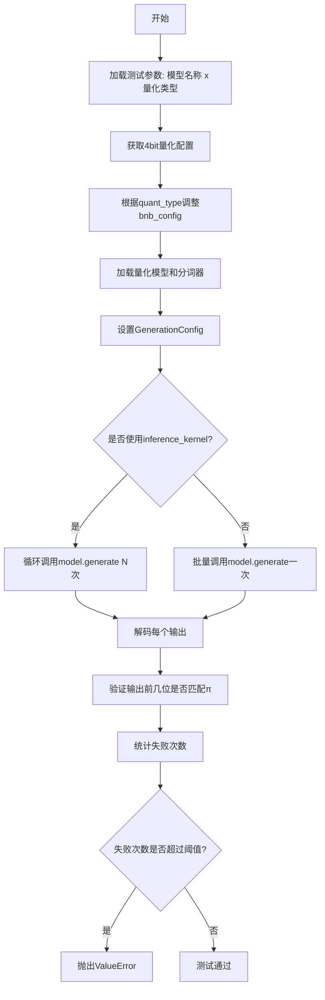
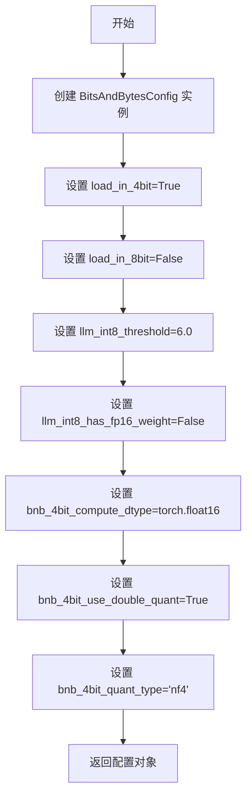
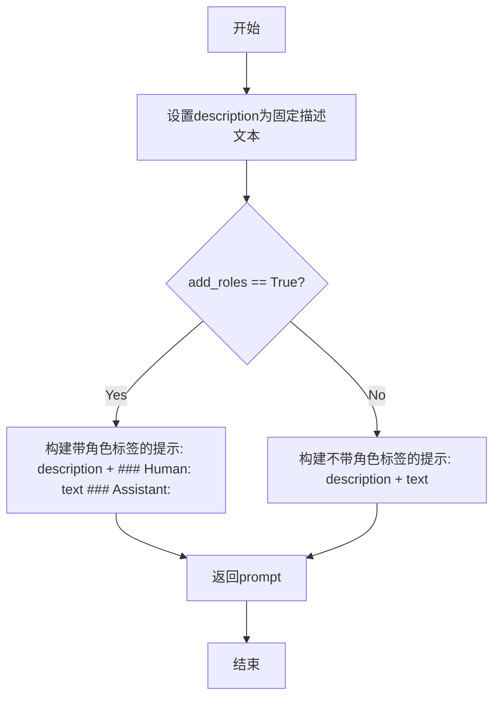
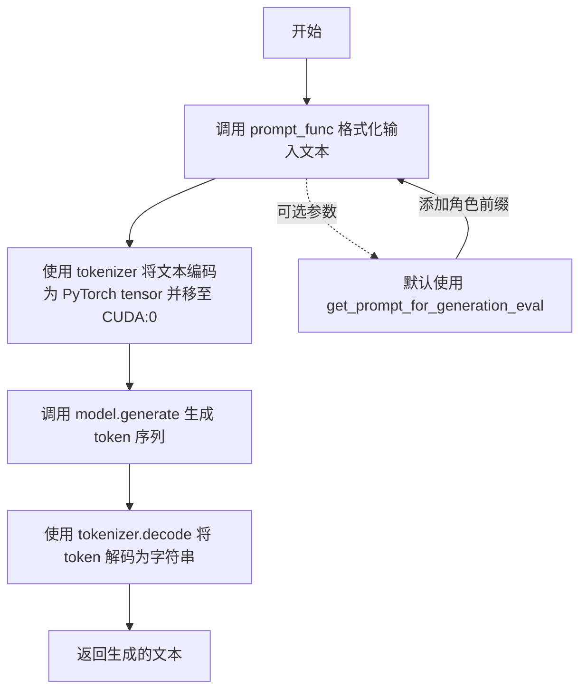

# `bitsandbytes\tests\test_generation.py` 详细设计文档

这是一个针对transformers库4bit量化模型的集成测试文件，主要验证不同量化配置（nf4/fp4）和推理选项下的模型生成能力，特别是模型生成数学常数π的准确性。

## 整体流程



## 类结构

```
测试模块 (无类定义)
├── 配置函数
│   ├── get_4bit_config()
│   ├── get_model_and_tokenizer(config)
│   └── get_prompt_for_generation_eval(text, add_roles)
├── 工具函数
│   └── generate(...)
└── 测试函数
    └── test_pi(...)
```

## 全局变量及字段


### `transformers`
    
transformers库导入，提供BitsAndBytesConfig、AutoModelForCausalLM、AutoTokenizer和GenerationConfig等模型量化与生成功能

类型：`module`
    


### `models`
    
测试用Bloom模型列表，当前包含bigscience/bloom-1b7模型

类型：`list`
    


### `dtypes`
    
量化数据类型列表，包含nf4和fp4两种4位量化格式

类型：`list`
    


### `TRUE_FALSE`
    
布尔参数组合，用于pytest参数化测试的True/False选项列表

类型：`list[bool]`
    


### `pytest`
    
pytest测试框架，提供importorskip、fixture和parametrize等测试装饰器和工具

类型：`module`
    


    

## 全局函数及方法


### `get_4bit_config`

获取 BitsAndBytesConfig 4bit 量化配置的函数，用于创建一个预定义的 4 位量化配置对象，以便在模型加载时启用 4bit 量化推理。

参数：

- 该函数无参数

返回值：`transformers.BitsAndBytesConfig`，返回一个配置对象，包含 4bit 量化所需的所有参数设置

#### 流程图



#### 带注释源码

```python
def get_4bit_config():
    """
    获取 BitsAndBytesConfig 4bit 量化配置
    
    该函数创建一个预设的 4 位量化配置，用于在加载 Transformer 模型时
    启用 4bit 量化，以减少显存占用和提高推理速度。
    
    Returns:
        transformers.BitsAndBytesConfig: 包含 4bit 量化配置的对象
    """
    return transformers.BitsAndBytesConfig(
        load_in_4bit=True,                  # 启用 4bit 量化加载
        load_in_8bit=False,                 # 禁用 8bit 量化
        llm_int8_threshold=6.0,             # INT8 量化阈值，用于 outlier detection
        llm_int8_has_fp16_weight=False,     # INT8 权重不包含 FP16 权重
        bnb_4bit_compute_dtype=torch.float16, # 4bit 计算使用 float16 数据类型
        bnb_4bit_use_double_quant=True,      # 启用双重量化，进一步减少显存
        bnb_4bit_quant_type="nf4",          # 使用 NF4 (Normal Float 4) 量化类型
    )
```


### `get_model_and_tokenizer`

该函数负责加载指定路径的预训练因果语言模型，并应用4位量化配置（bnb），同时加载对应的分词器，最终返回量化后的模型对象和分词器对象，以支持后续的推理任务。

参数：

- `config`：`Tuple[str, str]`，包含模型名称或路径（`model_name_or_path`）和量化类型（`quant_type`）的元组，例如 `("bigscience/bloom-1b7", "nf4")`

返回值：`Tuple[transformers.AutoModelForCausalLM, transformers.AutoTokenizer]`，返回量化后的因果语言模型对象和对应的分词器对象

#### 流程图

```mermaid
flowchart TD
    A[开始: get_model_and_tokenizer] --> B[解包config获取model_name_or_path和quant_type]
    B --> C[调用get_4bit_config获取默认4bit量化配置]
    C --> D{quant_type == '16bit'}
    D -- 是 --> E[设置bnb_config.load_in_4bit = False]
    D -- 否 --> F[设置bnb_config.bnb_4bit_quant_type = quant_type]
    E --> G[使用AutoModelForCausalLM.from_pretrained加载模型]
    F --> G
    G --> H[配置max_memory={0: '48GB'}和device_map='auto']
    H --> I[设置torch_dtype=torch.bfloat16并调用.eval]
    I --> J[使用AutoTokenizer.from_pretrained加载分词器]
    J --> K[返回model, tokenizer元组]
```

#### 带注释源码

```python
def get_model_and_tokenizer(config):
    """
    加载预训练因果语言模型（带量化）和分词器
    
    参数:
        config: 包含(model_name_or_path, quant_type)的元组
               - model_name_or_path: 模型名称或本地路径
               - quant_type: 量化类型，支持'nf4', 'fp4', '16bit'等
    
    返回:
        Tuple[model, tokenizer]: 量化后的模型对象和分词器对象
    """
    # 从config元组中解包出模型路径和量化类型
    model_name_or_path, quant_type = config
    
    # 获取默认的4bit量化配置（BitsAndBytesConfig）
    bnb_config = get_4bit_config()
    
    # 根据量化类型调整配置
    if quant_type == "16bit":
        # 16bit模式不使用4bit量化，禁用load_in_4bit
        bnb_config.load_in_4bit = False
    else:
        # 其他量化类型（如nf4, fp4）设置对应的4bit量化类型
        bnb_config.bnb_4bit_quant_type = quant_type
    
    # 使用transformers加载预训练模型并应用量化配置
    model = transformers.AutoModelForCausalLM.from_pretrained(
        model_name_or_path,
        quantization_config=bnb_config,       # 应用量化配置
        max_memory={0: "48GB"},                # 设置GPU 0的最大内存限制为48GB
        device_map="auto",                     # 自动将模型层分配到可用设备
        torch_dtype=torch.bfloat16,            # 使用bfloat16数据类型
    ).eval()                                   # 设置为评估模式（禁用dropout等）
    
    # 加载对应的分词器
    tokenizer = transformers.AutoTokenizer.from_pretrained(model_name_or_path)
    
    # 返回模型和分词器
    return model, tokenizer
```


### `get_prompt_for_generation_eval`

该函数用于生成对话评估的提示模板，根据输入文本和角色标签配置，构建适合大语言模型推理的提示格式。

参数：

- `text`：`str`，需要生成提示的原始输入文本
- `add_roles`：`bool`（默认值为 `True`），是否在提示中添加角色标签（### Human: 和 ### Assistant:）

返回值：`str`，构建完成的提示字符串，用于模型推理

#### 流程图



#### 带注释源码

```
def get_prompt_for_generation_eval(text, add_roles=True):
    """
    生成用于评估的对话提示模板。
    
    Args:
        text: 输入的文本内容
        add_roles: 是否添加角色标签，默认为True
        
    Returns:
        格式化后的提示字符串
    """
    # 定义对话场景描述，描述了人类与AI助手之间的对话
    description = (
        "A chat between a curious human and an artificial intelligence assistant. "
        "The assistant gives helpful, detailed, and polite answers to the user's questions."
    )
    
    # 根据add_roles参数决定是否添加角色标签
    if add_roles:
        # 添加角色标签，格式为: ### Human: {text} ### Assistant:
        prompt = f"{description} ### Human: {text} ### Assistant:"
    else:
        # 不添加角色标签，仅将描述与文本拼接
        prompt = f"{description} {text}"
    
    return prompt
```


### `generate`

该函数封装了模型生成（generation）和 token 解码流程，接收模型、分词器、输入文本和生成配置，首先通过提示函数格式化文本，然后使用分词器将文本转换为输入 tensor，接着调用模型的 generate 方法进行推理，最后将生成的 token 解码为文本并返回。

参数：

- `model`：`transformers.AutoModelForCausalLM`，用于生成文本的模型实例
- `tokenizer`：`transformers.AutoTokenizer`，用于编码输入文本和解码输出 token 的分词器
- `text`：`str`，用户输入的原始文本
- `generation_config`：`transformers.GenerationConfig`，控制生成行为的配置参数（如 max_new_tokens、do_sample、top_p、temperature 等）
- `prompt_func`：可调用对象，默认值为 `get_prompt_for_generation_eval`，用于将用户输入格式化为带角色提示的完整 prompt

返回值：`str`，模型生成的文本内容，已跳过特殊 token

#### 流程图



#### 带注释源码

```python
def generate(model, tokenizer, text, generation_config, prompt_func=get_prompt_for_generation_eval):
    """
    封装模型生成和 token 解码流程的函数
    
    参数:
        model: transformers 模型实例，用于文本生成
        tokenizer: transformers 分词器，用于编解码
        text: 用户输入的原始文本
        generation_config: 生成配置，控制生成策略
        prompt_func: 提示格式化函数，默认添加聊天角色模板
    
    返回:
        生成的文本字符串，已跳过特殊 token
    """
    # Step 1: 使用提示函数格式化输入文本
    # 默认添加聊天模板：描述 + Human: xxx + Assistant:
    text = prompt_func(text)
    
    # Step 2: 将文本编码为模型输入
    # return_tensors="pt" 返回 PyTorch tensor
    # .to("cuda:0") 将输入移至 GPU
    inputs = tokenizer(text, return_tensors="pt").to("cuda:0")
    
    # Step 3: 调用模型的 generate 方法进行推理
    # 使用 generation_config 中的参数控制生成行为
    outputs = model.generate(inputs=inputs["input_ids"], generation_config=generation_config)
    
    # Step 4: 将生成的 token 序列解码为可读文本
    # skip_special_tokens=True 跳过特殊 token（如 pad、eos 等）
    return tokenizer.decode(outputs[0], skip_special_tokens=True)
```

## 关键组件


### 4-bit量化配置组件 (get_4bit_config)

使用transformers.BitsAndBytesConfig创建4-bit量化配置，支持NF4和FP4量化类型，配置双重量化(bnb_4bit_use_double_quant)和计算数据类型(bnb_4bit_compute_dtype)。

### 模型与分词器加载组件 (get_model_and_tokenizer)

根据配置动态加载量化模型和分词器，支持不同的量化类型(nf4/fp4/16bit)，使用auto设备映射和bfloat16精度。

### 提示生成组件 (get_prompt_for_generation_eval)

生成符合对话格式的提示文本，包含描述信息和角色标记(Human/Assistant)，支持带或不带角色标签两种模式。

### 文本生成组件 (generate)

封装模型推理流程，将文本通过分词器转换为输入张量，调用模型generate方法，并解码输出结果。

### 测试夹具组件 (model_and_tokenizer)

Pytest session级fixture，通过product笛卡尔积组合模型和量化类型，为测试提供参数化的模型和分词器实例。

### 主测试组件 (test_pi)

测试量化模型推理功能，验证inference_kernel模式(逐个生成)和批量模式，支持double quantization开关，验证生成结果的正确性。

### 量化策略配置组件

通过bnb_4bit_quant_type参数支持nf4和fp4两种量化策略，nf4是一种归一化浮点量化方法，适合LLM权重分布。

### 反量化支持组件

通过bnb_4bit_compute_dtype控制反量化计算时的数据类型(fp16)，模型在推理时自动进行从4-bit到计算类型的反量化操作。

### 双重量化组件 (Double Quantization)

通过bnb_4bit_use_double_quant参数控制，对量化后的权重再次进行量化，进一步压缩模型大小。

### 推理内核模式组件 (inference_kernel)

测试中的两种生成模式：inference_kernel=True时逐个生成样本，inference_kernel=False时批量生成，用于测试不同生成方式的正确性。


## 问题及建议


### 已知问题

-   **设备硬编码**：代码中多处硬编码使用 `"cuda:0"`，缺乏灵活性，无法适配多GPU环境或自动设备选择
- **资源配置硬编码**：`max_memory={0: "48GB"}` 和 `n_cases = 6` 等参数硬编码，降低了测试的可配置性
- **资源释放不完整**：Fixture 中仅使用 `del model` 删除模型对象，未调用 `torch.cuda.empty_cache()` 释放GPU缓存，且未删除 tokenizer 对象
- **代码冗余**：`generation_config` 对象被创建两次，第二次重复赋值 `max_new_tokens` 操作多余
- **未使用的函数和参数**：`generate()` 函数定义后未被调用；`DQ` 参数虽然使用但逻辑表述不清晰；`get_prompt_for_generation_eval()` 函数在测试中被注释掉
- **测试逻辑与命名不符**：`test_pi` 函数实际测试的是字符串 "3.14159" 的前几位是否匹配，而不是验证真正的圆周率数值
- **参数化配置分散且可读性差**：TRUE_FALSE 从 tests.helpers 导入，但未在当前代码中明确其定义；`inference_kernel` 和 `DQ` 参数的 ids 格式化函数使用不直观
- **类型注解缺失**：整个代码缺乏类型提示，降低了代码可维护性和可读性

### 优化建议

-   将硬编码的设备、内存、模型列表等提取为配置文件或 fixture 参数，提高可配置性
-   完善资源释放逻辑，使用 `del model, tokenizer` 并配合 `torch.cuda.empty_cache()` 确保GPU内存释放
-   删除重复的 `generation_config` 赋值代码，统一配置方式
-   移除未使用的 `generate()` 函数或将其实际应用于测试中
-   修正测试逻辑或重命名函数以反映真实测试目的，或将 `math.pi` 比较改为更准确的验证方式
-   添加完整的类型注解，提升代码质量
-   将 TRUE_FALSE 等常量的定义移至代码顶部或单独的配置文件，提高可读性
-   增加设备可用性检查和异常处理，提升测试健壮性

## 其它


### 设计目标与约束

该代码旨在测试4位量化模型（NF4/FP4）在文本生成任务中的正确性和稳定性，验证量化配置（double_quant、compute_dtype、inference_kernel）对生成结果的影响。约束条件包括：仅支持CUDA设备、依赖transformers和bitsandbytes库、仅测试bigscience/bloom-1b7模型、测试为慢速测试（@pytest.mark.slow）。

### 错误处理与异常设计

代码包含以下错误处理机制：1）使用pytest.importorskip确保transformers库可用；2）通过hasattr检查模型是否具有量化配置；3）当failure_count超过阈值时抛出ValueError并打印详细输出用于调试；4）使用try-finally结构通过del model确保模型资源释放。异常信息包括失败计数、期望值（math.pi）和实际输出内容，便于问题定位。

### 数据流与状态机

数据流如下：1）pytest fixture初始化模型和tokenizer；2）测试参数化遍历模型类型、量化类型、double_quant开关、inference_kernel开关、数据类型；3）输入文本"3.14159"经tokenizer编码为tensor；4）模型执行generate操作；5）输出tensor经tokenizer解码为字符串；6）验证输出前几位是否匹配math.pi。状态机包含：模型加载态→推理态→结果验证态→资源清理态。

### 外部依赖与接口契约

主要依赖包括：1）transformers库提供BitsAndBytesConfig、AutoModelForCausalLM、AutoTokenizer、GenerationConfig；2）torch库提供float16/bfloat16张量类型和CUDA设备；3）pytest框架提供fixture和参数化测试；4）bitsandbytes库（隐式通过transformers）提供量化能力。接口契约：get_model_and_tokenizer返回(model, tokenizer)元组；generate函数接收(model, tokenizer, text, generation_config, prompt_func)返回解码后的字符串；fixture返回(request.param, model, tokenizer)三元组。

### 性能特征与基准

测试在CUDA设备上进行，使用48GB内存限制（max_memory={0: "48GB"}）。生成配置：max_new_tokens=20、do_sample=True、top_p=0.9、temperature=0.7。性能基准：单次生成20个token，测试用例共6个输出。inference_kernel=False时支持批量处理（list输入），inference_kernel=True时使用循环逐个生成。

### 测试策略

采用pytest参数化测试，覆盖维度：1）模型：bigscience/bloom-1b7；2）量化类型：nf4、fp4；3）double_quant：True/False；4）inference_kernel：True/False；5）数据类型：float16。测试标记：@pytest.mark.slow标识为慢速测试。验证逻辑：检查输出前7位是否匹配"3.14159"，允许一定失败率（failure_max根据模型类型调整）。

### 配置管理

量化配置通过get_4bit_config()集中定义，默认值：load_in_4bit=True、llm_int8_threshold=6.0、bnb_4bit_compute_dtype=torch.float16、bnb_4bit_use_double_quant=True、bnb_4bit_quant_type="nf4"。测试中通过model.config.quantization_config动态修改bnb_4bit_compute_dtype和bnb_4bit_use_double_quant参数。模型名称和数据类型通过pytest fixture参数化配置。

### 资源清理

使用pytest fixture的yield机制确保模型资源释放：yield后执行del model删除模型对象以释放GPU显存。测试使用device_map="auto"自动分配设备，测试完成后需显式清理避免显存泄漏。

### 平台兼容性

代码明确依赖CUDA设备（.to("cuda:0")），不支持CPU或非CUDA环境。max_memory={0: "48GB"}限制单GPU显存需求。模型加载使用torch_dtype=torch.bfloat16，要求GPU支持bf16计算。

### 版本兼容性

依赖transformers库的BitsAndBytesConfig、AutoModelForCausalLM、GenerationConfig等API，要求transformers版本支持4位量化功能。torch版本需支持bfloat16和cuda操作。测试代码使用pytest参数化功能，需pytest 3.0+版本支持。


    