# `bitsandbytes\tests\test_linear4bit.py` 详细设计文档

该文件是 bitsandbytes 库的 4-bit 量化线性层测试套件，验证了 Linear4bit 和 Params4bit 的序列化、拷贝、分片、torch.compile 集成等功能，确保量化权重在不同场景下的正确性和兼容性。

## 整体流程

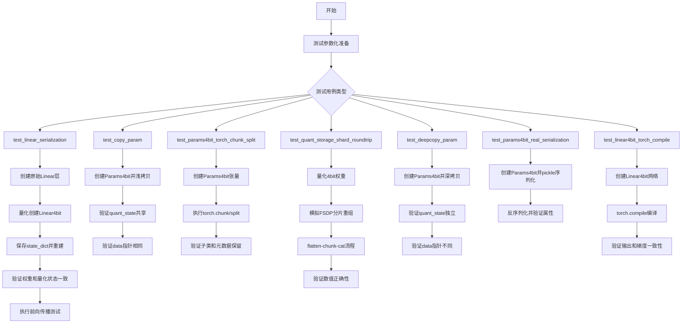

## 类结构

```
测试文件 (test_linear4bit.py)
├── test_linear_serialization (序列化测试)
├── test_copy_param (浅拷贝测试)
├── test_params4bit_torch_chunk_split (分块测试)
├── test_quant_storage_shard_roundtrip (分片测试)
├── test_deepcopy_param (深拷贝测试)
├── test_params4bit_real_serialization (pickle序列化)
└── test_linear4bit_torch_compile (torch.compile测试)
```

## 全局变量及字段


### `storage`
    
A dictionary mapping dtype strings to torch data types for quantization storage

类型：`dict[str, torch.dtype]`
    


### `ROCM_WARP_SIZE_64`
    
ROCm warp size constant imported from bitsandbytes C extension

类型：`int`
    


### `TRUE_FALSE`
    
List of boolean values imported from tests.helpers for parametrization

类型：`list`
    


### `compute_dtype`
    
Compute dtype for Linear4bit layer, None in test cases

类型：`torch.dtype | None`
    


### `layer_shape`
    
Shape tuple (300, 400) defining the linear layer dimensions

类型：`tuple[int, int]`
    


### `linear`
    
Original floating point linear layer before quantization

类型：`torch.nn.Linear`
    


### `linear_q`
    
First quantized 4-bit linear layer for serialization testing

类型：`bnb.nn.Linear4bit`
    


### `linear_q2`
    
Second quantized 4-bit linear layer restored from state_dict

类型：`bnb.nn.Linear4bit`
    


### `linear_qs`
    
Quantized linear layer with specific quant_storage type

类型：`bnb.nn.Linear4bit`
    


### `sd`
    
State dictionary from linear_q containing quantized weights and statistics

类型：`dict`
    


### `bias_data2`
    
Bias tensor extracted from state_dict for linear_q2

类型：`torch.Tensor | None`
    


### `weight_data2`
    
Weight tensor data extracted from state_dict for reconstruction

类型：`torch.Tensor`
    


### `weight2`
    
Params4bit object created from prequantized state for linear_q2

类型：`bnb.nn.Params4bit`
    


### `a`
    
Weight output from linear_q in comparison tests

类型：`torch.Tensor | bnb.nn.Params4bit`
    


### `b`
    
Weight output from linear_q2 in comparison tests

类型：`torch.Tensor | bnb.nn.Params4bit`
    


### `c`
    
Forward output from linear_qs for verification

类型：`torch.Tensor`
    


### `d`
    
Forward output from restored layer for verification

类型：`torch.Tensor`
    


### `q0`
    
Quantization state from linear_q weight

类型：`object`
    


### `q1`
    
Quantization state from linear_q2 weight

类型：`object`
    


### `bytes_4bit`
    
Serialized bytes representation of linear_q using torch.save

类型：`bytes`
    


### `linear_q3`
    
Linear layer restored from serialized bytes

类型：`bnb.nn.Linear4bit`
    


### `size_orig`
    
File size in bytes of original linear layer state_dict

类型：`int`
    


### `size_4`
    
File size in bytes of quantized linear layer state_dict

类型：`int`
    


### `size_ratio`
    
Compression ratio (size_4 / size_orig)

类型：`float`
    


### `target_compression`
    
Target compression ratio threshold (0.143 or 0.29)

类型：`float`
    


### `state_path`
    
File path for saving original layer state_dict

类型：`str`
    


### `state_path_4bit`
    
File path for saving quantized layer state_dict

类型：`str`
    


### `tensor`
    
Random tensor data for Params4bit copy test

类型：`torch.Tensor`
    


### `param`
    
Quantized parameter object for copy/deepcopy testing

类型：`bnb.nn.Params4bit`
    


### `shallow_copy_param`
    
Shallow copy of param for copy test verification

类型：`bnb.nn.Params4bit`
    


### `copy_param`
    
Deep copy of param for deepcopy test verification

类型：`bnb.nn.Params4bit`
    


### `dict_keys_before`
    
Set of dictionary keys before copy operation

类型：`set`
    


### `dict_keys_after`
    
Set of dictionary keys after copy operation

类型：`set`
    


### `dict_keys_copy`
    
Set of dictionary keys in copied object

类型：`set`
    


### `original_tensor`
    
Original float tensor before quantization for serialization test

类型：`torch.Tensor`
    


### `original_param`
    
Original Params4bit object for pickle serialization test

类型：`bnb.nn.Params4bit`
    


### `serialized_param`
    
Pickled bytes of original_param

类型：`bytes`
    


### `deserialized_param`
    
Restored Params4bit from pickle bytes

类型：`bnb.nn.Params4bit`
    


### `params4bit`
    
Params4bit object for chunk/split preservation test

类型：`bnb.nn.Params4bit`
    


### `chunks`
    
Result of torch.chunk on Params4bit tensor

类型：`tuple`
    


### `splits`
    
Result of torch.split on Params4bit tensor

类型：`tuple`
    


### `chunk`
    
Individual chunk from torch.chunk verification

类型：`bnb.nn.Params4bit`
    


### `split`
    
Individual split from torch.split verification

类型：`bnb.nn.Params4bit`
    


### `M`
    
Rows dimension (256) for quant_storage shard roundtrip test

类型：`int`
    


### `K`
    
Columns dimension (128) for quant_storage shard roundtrip test

类型：`int`
    


### `A`
    
Input tensor for gemv_4bit computation

类型：`torch.Tensor`
    


### `B`
    
Weight tensor to be quantized

类型：`torch.Tensor`
    


### `qB`
    
Quantized weight tensor using 4-bit encoding

类型：`torch.Tensor`
    


### `state`
    
Quantization state containing code, dtype, blocksize, absmax

类型：`object`
    


### `ref`
    
Reference gemv output before shard roundtrip

类型：`torch.Tensor`
    


### `flat`
    
Flattened quantized tensor to simulate FSDP sharding

类型：`torch.Tensor`
    


### `n_shards`
    
Number of shards (4) for FSDP simulation

类型：`int`
    


### `shards`
    
Chunked shards from flattened tensor

类型：`tuple`
    


### `reassembled`
    
Reassembled tensor from shards via torch.cat

类型：`torch.Tensor`
    


### `out`
    
gemv output after shard roundtrip for verification

类型：`torch.Tensor`
    


### `dim`
    
Dimension (256) for Linear4bit torch.compile test network

类型：`int`
    


### `batch_size`
    
Batch size (16) for torch.compile test

类型：`int`
    


### `net`
    
Sequential network of 4 Linear4bit layers for compile test

类型：`torch.nn.Sequential`
    


### `x`
    
Input tensor for network forward pass

类型：`torch.Tensor`
    


### `ref_output`
    
Reference output from uncompiled network

类型：`torch.Tensor`
    


### `compiled_net`
    
Torch compiled network using inductor/hpu backend

类型：`torch.nn.Module`
    


### `compiled_output`
    
Output from compiled network for comparison

类型：`torch.Tensor`
    


### `y1`
    
Forward output with gradient for reference network

类型：`torch.Tensor`
    


### `y2`
    
Forward output with gradient for compiled network

类型：`torch.Tensor`
    


### `grad_ref`
    
Gradient of input from reference network backward pass

类型：`torch.Tensor`
    


### `grad_compiled`
    
Gradient of input from compiled network backward pass

类型：`torch.Tensor`
    


### `compile_backend`
    
Compiler backend string ('inductor' or 'hpu_backend')

类型：`str`
    


### `Linear4bit (bnb.nn.Linear4bit).weight`
    
Quantized weight parameters stored as Params4bit

类型：`bnb.nn.Params4bit`
    


### `Linear4bit (bnb.nn.Linear4bit).bias`
    
Optional bias term for the linear layer

类型：`torch.nn.Parameter | None`
    


### `Linear4bit (bnb.nn.Linear4bit).quant_type`
    
Quantization type (nf4 or fp4) for 4-bit quantization

类型：`str`
    


### `Linear4bit (bnb.nn.Linear4bit).compress_statistics`
    
Whether to compress quantization statistics

类型：`bool`
    


### `Linear4bit (bnb.nn.Linear4bit).compute_dtype`
    
Dtype for computation during forward pass

类型：`torch.dtype | None`
    


### `Params4bit (bnb.nn.Params4bit).data`
    
Original tensor data before quantization

类型：`torch.Tensor`
    


### `Params4bit (bnb.nn.Params4bit).quant_type`
    
Quantization type (nf4 or fp4) specifying the encoding scheme

类型：`str`
    


### `Params4bit (bnb.nn.Params4bit).quant_state`
    
State object containing quantization parameters (code, dtype, blocksize, absmax)

类型：`object`
    


### `Params4bit (bnb.nn.Params4bit).blocksize`
    
Block size for quantization (32, 64, or 128)

类型：`int`
    


### `Params4bit (bnb.nn.Params4bit).compress_statistics`
    
Flag indicating whether statistics are compressed

类型：`bool`
    


### `Params4bit (bnb.nn.Params4bit).requires_grad`
    
Whether the parameter requires gradient computation

类型：`bool`
    
    

## 全局函数及方法


### `test_linear_serialization`

这是一个 pytest 测试函数，用于验证 bitsandbytes 库中 `Linear4bit` 层的序列化和反序列化功能。测试涵盖状态字典保存/恢复、权重克隆、不同量化存储类型、前向传播一致性以及压缩比验证。

参数：

- `device`：`str`，测试设备（cpu、cuda、hpu 等）
- `quant_type`：`str`，量化类型（"nf4" 或 "fp4"）
- `original_dtype`：`torch.dtype`，原始权重的数据类型（torch.float16 或 torch.bfloat16）
- `compress_statistics`：`bool`，是否压缩统计信息
- `bias`：`bool`，是否包含偏置项
- `quant_storage`：`str`，量化存储类型（"uint8"、"float16"、"bfloat16"、"float32"）
- `save_before_forward`：`bool`，是否在前向传播前保存模型

返回值：`None`，该函数为测试函数，通过 pytest 断言进行验证，无显式返回值

#### 流程图

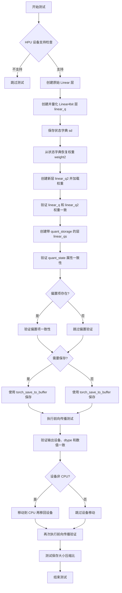

#### 带注释源码

```python
@pytest.mark.parametrize("device", get_available_devices())
@pytest.mark.parametrize("quant_storage", ["uint8", "float16", "bfloat16", "float32"])
@pytest.mark.parametrize("original_dtype", [torch.float16, torch.bfloat16])
@pytest.mark.parametrize("bias", TRUE_FALSE, ids=id_formatter("bias"))
@pytest.mark.parametrize("compress_statistics", TRUE_FALSE, ids=id_formatter("compress_statistics"))
@pytest.mark.parametrize("quant_type", ["nf4", "fp4"])
@pytest.mark.parametrize("save_before_forward", TRUE_FALSE, ids=id_formatter("save_before_forward"))
def test_linear_serialization(
    device, quant_type, original_dtype, compress_statistics, bias, quant_storage, save_before_forward
):
    # 如果是 HPU 设备且该配置不支持，则跳过测试
    if device == "hpu" and not is_supported_on_hpu(quant_type, original_dtype, storage[quant_storage]):
        pytest.skip("This configuration is not supported on HPU.")

    compute_dtype = None  # 计算数据类型，None 表示使用默认
    layer_shape = (300, 400)  # 线性层形状

    # 创建原始的 PyTorch Linear 层（CPU 设备）
    linear = torch.nn.Linear(*layer_shape, dtype=original_dtype, device="cpu")

    # ============ 第一部分：创建量化层并保存/恢复 ============
    # 使用 bitsandbytes 创建 4bit 量化线性层
    linear_q = bnb.nn.Linear4bit(
        linear.in_features,
        linear.out_features,
        bias=bias,
        compute_dtype=compute_dtype,
        compress_statistics=compress_statistics,
        quant_type=quant_type,
        device="meta",
    )
    # 创建 4bit 参数量化对象
    new_weight = bnb.nn.Params4bit(data=linear.weight, quant_type=quant_type, requires_grad=False)
    linear_q.weight = new_weight
    if bias:
        linear_q.bias = torch.nn.Parameter(linear.bias)
    # 将量化层移动到目标设备
    linear_q = linear_q.to(device)

    # 保存到状态字典
    sd = linear_q.state_dict()

    # 从状态字典恢复：提取权重和偏置
    bias_data2 = sd.pop("bias", None)
    weight_data2 = sd.pop("weight")
    # 从预量化数据创建新的 Params4bit 对象
    weight2 = bnb.nn.Params4bit.from_prequantized(quantized_stats=sd, data=weight_data2, device=device)

    # 创建新的量化层用于恢复
    linear_q2 = bnb.nn.Linear4bit(
        linear.in_features,
        linear.out_features,
        bias=bias,
        compute_dtype=compute_dtype,
        compress_statistics=compress_statistics,
        quant_type=quant_type,
        device="meta",
    )
    # 加载恢复的权重
    linear_q2.weight = weight2
    if bias:
        linear_q2.bias = torch.nn.Parameter(bias_data2)
    linear_q2 = linear_q2.to(device)

    # ============ 第二部分：创建带 quant_storage 的层 ============
    # 使用指定的 quant_storage 类型创建量化层
    linear_qs = bnb.nn.Linear4bit(
        linear.in_features,
        linear.out_features,
        bias=bias,
        compute_dtype=compute_dtype,
        compress_statistics=compress_statistics,
        quant_type=quant_type,
        quant_storage=storage[quant_storage],
        device="meta",
    )
    linear_qs.weight = bnb.nn.Params4bit(
        data=linear.weight,
        requires_grad=False,
        quant_type=quant_type,
        quant_storage=storage[quant_storage],
    )
    if bias:
        linear_qs.bias = torch.nn.Parameter(linear.bias)
    linear_qs = linear_qs.to(device)

    # ============ 第三部分：验证权重和量化状态 ============
    a, b = linear_q.weight, linear_q2.weight

    # 验证设备、dtype 和数值一致性
    assert a.device == b.device
    assert a.dtype == b.dtype
    assert torch.equal(a, b)

    # 验证量化状态属性
    q0 = a.quant_state
    q1 = b.quant_state
    for attr in ("code", "dtype", "blocksize", "absmax"):
        c, d = getattr(q0, attr), getattr(q1, attr)
        if isinstance(c, torch.Tensor):
            assert torch.equal(c, d)
        else:
            assert c == d, f"{c} != {d}"

    # 验证 state2（如果存在）
    if q0.state2 is not None:
        for attr in ("code", "dtype", "blocksize", "absmax"):
            c, d = getattr(q0.state2, attr), getattr(q1.state2, attr)
            if isinstance(c, torch.Tensor):
                assert torch.equal(c, d)
            else:
                assert c == d, f"{c} != {d}"

    # 验证偏置项一致性
    if bias:
        a, b = linear_q.bias, linear_q2.bias
        assert a.device == b.device
        assert a.dtype == b.dtype
        assert torch.equal(a, b)

    # ============ 第四部分：序列化测试 ============
    # 根据参数决定何时保存
    if save_before_forward:
        bytes_4bit = torch_save_to_buffer(linear_q)

    # 前向传播测试
    x = torch.rand(42, layer_shape[0], device=device)
    a = linear_q(x)
    b = linear_q2(x)
    c = linear_qs(x)
    # 验证输出一致性
    assert a.device == b.device
    assert a.dtype == b.dtype
    assert a.device == c.device
    assert a.dtype == c.dtype
    assert torch.equal(a, b)
    assert torch.equal(a, c)

    # 如果之前没保存，现在保存
    if not save_before_forward:
        bytes_4bit = torch_save_to_buffer(linear_q)
    # 从字节流加载
    linear_q3 = torch_load_from_buffer(bytes_4bit)

    # ============ 第五部分：设备移动测试 ============
    if device != "cpu":
        # 测试移动到 CPU 再移回设备
        linear_q2.to("cpu")
        linear_q2.to(device)
    d = linear_qs(x)
    assert c.dtype == d.dtype
    assert c.device == d.device
    assert torch.equal(c, d)

    # 验证从序列化恢复的层
    d = linear_q3(x)
    assert c.dtype == d.dtype
    assert c.device == d.device
    assert torch.equal(c, d)

    # ============ 第六部分：压缩比测试 ============
    with TemporaryDirectory() as tmpdir:
        state_path_4bit = os.path.join(tmpdir, "state_4bit.pth")
        state_path = os.path.join(tmpdir, "state.pth")
        # 保存原始层和量化层
        torch.save(linear.state_dict(), state_path)
        torch.save(linear_q.state_dict(), state_path_4bit)

        # 获取文件大小并计算压缩比
        size_orig, size_4 = (
            os.path.getsize(state_path),
            os.path.getsize(state_path_4bit),
        )
        size_ratio = size_4 / size_orig
        # 根据原始数据类型设置目标压缩比
        target_compression = (
            0.143 if original_dtype == torch.float32 else 0.29
        )
        ratio_error_msg = (
            f"quantized_size {size_4:,} is larger on disk than {target_compression:.2%} of original size {size_orig:,}"
        )
        assert size_ratio < target_compression, ratio_error_msg
```


### `test_copy_param`

该测试函数用于验证 `bnb.nn.Params4bit` 对象的浅拷贝（shallow copy）功能，确保浅拷贝后的对象与原对象共享相同的 `quant_state` 和底层数据指针。

参数：

- `device`：`str`，从 `get_available_devices()` 获取的设备标识（如 "cpu", "cuda", "hpu" 等），指定测试运行的设备
- `quant_type`：`str`，量化类型，可选 "nf4" 或 "fp4"，指定 4bit 量化算法
- `blocksize`：`int`，块大小，可选 32、64 或 128（在 ROCM 环境下为 64 或 128），指定量化块大小
- `compress_statistics`：`bool`，布尔值（TRUE/FALSE），指定是否压缩统计信息

返回值：`None`，该函数为测试函数，通过 pytest 的 assert 语句进行验证，无显式返回值

#### 流程图

```mermaid
flowchart TD
    A[开始测试] --> B{检查HPU支持性}
    B -->|不支持| C[跳过测试]
    B -->|支持| D[生成随机张量 tensor]
    D --> E[创建 Params4bit 对象 param]
    E --> F[将 param 移动到目标设备]
    F --> G[执行浅拷贝: shallow_copy_param = copy.copy(param)]
    G --> H[断言: param.quant_state is shallow_copy_param.quant_state]
    H --> I[断言: param.data.data_ptr == shallow_copy_param.data.data_ptr]
    I --> J[结束测试]
```

#### 带注释源码

```python
@pytest.mark.parametrize("device", get_available_devices())
@pytest.mark.parametrize("quant_type", ["nf4", "fp4"])
@pytest.mark.parametrize("blocksize", [32, 64, 128] if not ROCM_WARP_SIZE_64 else [64, 128])
@pytest.mark.parametrize("compress_statistics", TRUE_FALSE, ids=id_formatter("compress_statistics"))
def test_copy_param(device, quant_type, blocksize, compress_statistics):
    """测试 Params4bit 对象的浅拷贝功能"""
    
    # 如果设备是 HPU 且不支持该量化类型，则跳过测试
    if device == "hpu" and not is_supported_on_hpu(quant_type):
        pytest.skip("This configuration is not supported on HPU.")

    # 生成一个形状为 (300, 400) 的随机张量
    tensor = torch.randn(300, 400)
    
    # 创建 Params4bit 量化参数对象
    # data: 原始张量数据
    # quant_type: 量化类型 (nf4 或 fp4)
    # blocksize: 量化块大小
    # compress_statistics: 是否压缩统计信息
    # requires_grad: 是否需要梯度
    param = bnb.nn.Params4bit(
        data=tensor,
        quant_type=quant_type,
        blocksize=blocksize,
        compress_statistics=compress_statistics,
        requires_grad=False,
    ).to(device)  # 将参数移动到目标设备

    # 执行浅拷贝（共享底层数据）
    shallow_copy_param = copy.copy(param)
    
    # 验证 quant_state 对象被共享（浅拷贝特征）
    assert param.quant_state is shallow_copy_param.quant_state
    
    # 验证底层数据指针相同（浅拷贝特征）
    # 即两个对象共享同一份数据
    assert param.data.data_ptr() == shallow_copy_param.data.data_ptr()
```


### `test_params4bit_torch_chunk_split`

该测试函数用于验证 `torch.chunk` 和 `torch.split` 操作能够保留 `Params4bit` 子类属性，确保与 FSDP2（Fully Sharded Data Parallel）兼容。

参数：

- `device`：`str`，测试设备，从 `get_available_devices()` 获取（如 "cuda", "cpu", "hpu" 等）
- `quant_type`：`str`，量化类型，可选值为 "nf4" 或 "fp4"

返回值：`None`，该函数为 pytest 测试函数，无返回值

#### 流程图

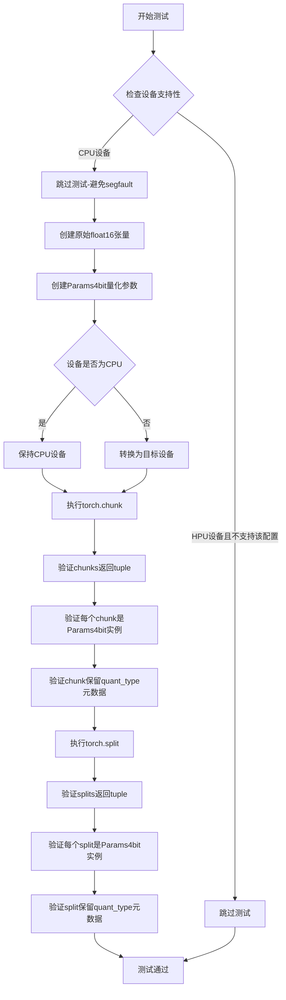

#### 带注释源码

```python
@pytest.mark.parametrize("device", get_available_devices())
@pytest.mark.parametrize("quant_type", ["nf4", "fp4"])
def test_params4bit_torch_chunk_split(device, quant_type):
    """Test that torch.chunk and torch.split preserve Params4bit subclass for FSDP2 compatibility."""
    # 如果是HPU设备，检查是否支持该配置，不支持则跳过测试
    if device == "hpu" and not is_supported_on_hpu(quant_type, torch.float16, torch.uint8):
        pytest.skip("This configuration is not supported on HPU.")

    # CPU上的量化会导致segfault，因此跳过CPU测试
    if device == "cpu":
        pytest.skip("CPU quantization causes segfault, skipping CPU test")

    # 创建原始的float16张量，形状为(8, 4)，位于CPU设备
    original_tensor = torch.randn(8, 4, dtype=torch.float16, device="cpu")

    # 使用bitsandbytes创建4bit量化参数对象
    params4bit = bnb.nn.Params4bit(data=original_tensor, quant_type=quant_type, requires_grad=False)

    # 如果目标设备不是CPU，则将量化参数移动到目标设备
    if device != "cpu":
        params4bit = params4bit.to(device)

    # 使用torch.chunk沿dim=0维度将参数分成2个chunk
    chunks = torch.chunk(params4bit, 2, dim=0)

    # 验证torch.chunk返回的是tuple类型
    assert isinstance(chunks, tuple), "torch.chunk should return tuple"
    # 验证每个chunk仍然是Params4bit子类实例
    for chunk in chunks:
        assert isinstance(chunk, bnb.nn.Params4bit), "Chunk should preserve Params4bit subclass"
        # 验证chunk保留了quant_type元数据属性
        assert hasattr(chunk, "quant_type"), "Should preserve metadata"
        assert chunk.quant_type == params4bit.quant_type, "Should preserve quant_type value"

    # 使用torch.split沿dim=0维度将参数按大小2分割
    splits = torch.split(params4bit, 2, dim=0)

    # 验证torch.split返回的是tuple类型
    assert isinstance(splits, tuple), "torch.split should return tuple"
    # 验证至少有 一个split结果
    assert len(splits) > 0, "Should have at least one split"
    # 验证每个split仍然是Params4bit子类实例
    for split in splits:
        assert isinstance(split, bnb.nn.Params4bit), "Split should preserve Params4bit subclass"
        # 验证split保留了quant_type元数据属性
        assert hasattr(split, "quant_type"), "Should preserve metadata"
        assert split.quant_type == params4bit.quant_type, "Should preserve quant_type value"
```


### `test_quant_storage_shard_roundtrip`

该测试函数验证 4 位量化权重在模拟 FSDP 的分片/重组模式（flatten-chunk-reassemble）下能否保持数值正确性。非 uint8 量化存储类型的存在是为了让 FSDP 可以在不分割打包的 4 位对的情况下对量化张量进行分片。

参数：

- `device`：`str`，测试运行的设备（cpu/cuda/hpu 等），通过 `get_available_devices()` 参数化获取
- `quant_type`：`str`，量化类型（"nf4" 或 "fp4"），通过 `@pytest.mark.parametrize` 参数化
- `quant_storage`：`torch.dtype`，量化存储数据类型（torch.uint8/torch.float16/torch.bfloat16/torch.float32），通过 `@pytest.mark.parametrize` 参数化

返回值：`None`，该函数为 pytest 测试函数，通过断言验证结果，无显式返回值

#### 流程图

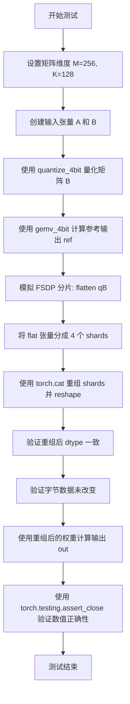

#### 带注释源码

```python
@pytest.mark.parametrize("device", get_available_devices())
@pytest.mark.parametrize("quant_type", ["nf4", "fp4"])
@pytest.mark.parametrize(
    "quant_storage",
    [torch.uint8, torch.float16, torch.bfloat16, torch.float32],
    ids=describe_dtype,
)
def test_quant_storage_shard_roundtrip(device, quant_type, quant_storage):
    """Test that quantized weights survive a flatten-chunk-reassemble roundtrip.

    Non-uint8 quant_storage exists so that FSDP can shard quantized tensors
    without splitting packed 4-bit pairs. This test simulates FSDP's
    shard/gather pattern and verifies numerical correctness after reassembly.
    """
    # 定义矩阵维度：M=256 行，K=128 列
    M, K = 256, 128
    # 创建输入矩阵 A: 1xK, float16, 指定设备
    A = torch.randn(1, K, dtype=torch.float16, device=device)
    # 创建权重矩阵 B: MxK, float16, 指定设备
    B = torch.randn(M, K, dtype=torch.float16, device=device)

    # 使用 bitsandbytes 的 quantize_4bit 函数量化矩阵 B
    # quant_type: 量化类型 (nf4 或 fp4)
    # quant_storage: 量化后的存储数据类型
    qB, state = bnb.functional.quantize_4bit(B, quant_type=quant_type, quant_storage=quant_storage)
    
    # 使用 gemv_4bit 计算矩阵乘法参考输出
    # A (1xK) @ qB.t() (KxM) = ref (1xM)
    ref = bnb.functional.gemv_4bit(A, qB.t(), state=state)

    # ====== 模拟 FSDP 的分片/重组模式 ======
    
    # 1. flatten: 将量化后的权重展平为一维
    flat = qB.flatten()
    
    # 2. 定义分片数量
    n_shards = 4
    
    # 3. chunk: 将展平的张量分成 n_shards 个分片
    shards = flat.chunk(n_shards)
    
    # 4. reassemble: 使用 cat 重新连接所有分片，然后 reshape 回原始形状
    reassembled = torch.cat(shards).reshape(qB.shape)

    # 验证重组后的数据类型与原始量化数据类型一致
    assert reassembled.dtype == qB.dtype
    
    # 验证字节数据在分片往返后没有改变
    # 将张量视图转换为 uint8 以比较原始字节
    assert torch.equal(reassembled.view(torch.uint8), qB.view(torch.uint8)), "Bytes changed after shard roundtrip"

    # 使用重组后的权重计算矩阵乘法输出
    out = bnb.functional.gemv_4bit(A, reassembled.t(), state=state)
    
    # 验证数值正确性：输出应与参考输出非常接近
    torch.testing.assert_close(out, ref)
```


### `test_deepcopy_param`

该测试函数用于验证 `copy.deepcopy` 在复制 `bnb.nn.Params4bit` 对象时能够正确创建深拷贝，确保量化状态和数据指针不同，同时确保深拷贝操作不会修改原始对象的内部属性。

参数：

-  `device`：`str`，测试设备（如 "cpu", "cuda", "hpu" 等），从 `get_available_devices()` 获取
-  `quant_type`：`str`，量化类型（"nf4" 或 "fp4"），指定 4bit 量化算法
-  `blocksize`：`int`，分块大小（32, 64, 或 128，ROCM 环境下为 64 或 128），用于量化分块
-  `compress_statistics`：`bool`，是否压缩统计信息（True/False），控制量化统计数据的压缩方式

返回值：`None`，该函数为测试函数，通过断言验证深拷贝行为，不返回任何值

#### 流程图

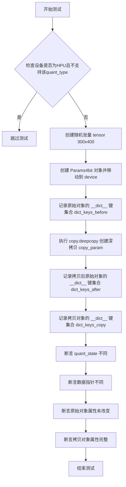

#### 带注释源码

```python
@pytest.mark.parametrize("device", get_available_devices())  # 参数化设备：cpu, cuda, hpu等
@pytest.mark.parametrize("quant_type", ["nf4", "fp4"])        # 参数化量化类型：nf4或fp4
@pytest.mark.parametrize("blocksize", [32, 64, 128] if not ROCM_WARP_SIZE_64 else [64, 128])  # 参数化分块大小
@pytest.mark.parametrize("compress_statistics", TRUE_FALSE, ids=id_formatter("compress_statistics"))  # 参数化是否压缩统计
def test_deepcopy_param(device, quant_type, blocksize, compress_statistics):
    """测试 copy.deepcopy 对 Params4bit 对象的深拷贝行为"""
    
    # 如果是HPU设备且不支持该量化类型，则跳过测试
    if device == "hpu" and not is_supported_on_hpu(quant_type):
        pytest.skip("This configuration is not supported on HPU.")

    # 创建形状为 (300, 400) 的随机张量
    tensor = torch.randn(300, 400)
    
    # 创建 Params4bit 量化参数对象
    param = bnb.nn.Params4bit(
        data=tensor,
        quant_type=quant_type,
        blocksize=blocksize,
        compress_statistics=compress_statistics,
        requires_grad=False,
    ).to(device)  # 移动到指定设备
    
    # 记录深拷贝前原始对象的内部字典键集合
    dict_keys_before = set(param.__dict__.keys())
    
    # 执行深拷贝，创建独立的拷贝对象
    copy_param = copy.deepcopy(param)
    
    # 记录深拷贝后原始对象的内部字典键集合
    dict_keys_after = set(param.__dict__.keys())
    
    # 记录拷贝对象的内部字典键集合
    dict_keys_copy = set(copy_param.__dict__.keys())

    # 断言：深拷贝的 quant_state 应与原始对象不同（独立复制）
    assert param.quant_state is not copy_param.quant_state
    
    # 断言：深拷贝的数据指针应与原始对象不同（独立内存）
    assert param.data.data_ptr() != copy_param.data.data_ptr()

    # 注释：之前存在一个bug，深拷贝会修改原始对象
    # 断言：深拷贝前后原始对象的内部键集合应保持不变
    assert dict_keys_before == dict_keys_after
    
    # 断言：拷贝对象的内部键集合应与原始对象一致
    assert dict_keys_before == dict_keys_copy
```


### `test_params4bit_real_serialization`

该函数是一个pytest测试函数，用于验证`bnb.nn.Params4bit`类在经过设备转换和量化后，通过Python的pickle模块进行序列化和反序列化时能够正确保存和恢复所有关键属性（包括量化状态、数据、量化类型、块大小和压缩统计信息）。

参数：

- `device`：`str`，测试运行的设备（CPU/CUDA/HPU等），从`get_available_devices()`参数化获取
- `quant_type`：`str`，量化类型，值为"nf4"或"fp4"
- `blocksize`：`int`，量化块大小，非ROCM环境为[32, 64, 128]，ROCM环境为[64, 128]
- `compress_statistics`：`bool`，是否压缩统计信息的标志，从`TRUE_FALSE`参数化获取

返回值：`None`，该函数为pytest测试函数，无返回值

#### 流程图

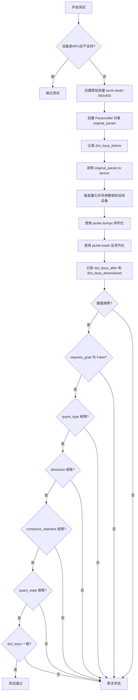

#### 带注释源码

```python
@pytest.mark.parametrize("device", get_available_devices())
@pytest.mark.parametrize("quant_type", ["nf4", "fp4"])
@pytest.mark.parametrize("blocksize", [32, 64, 128] if not ROCM_WARP_SIZE_64 else [64, 128])
@pytest.mark.parametrize("compress_statistics", TRUE_FALSE, ids=id_formatter("compress_statistics"))
def test_params4bit_real_serialization(device, quant_type, blocksize, compress_statistics):
    """
    测试 Params4bit 对象的序列化和反序列化功能。
    验证通过 pickle 序列化后的对象能够正确保留所有属性。
    """
    
    # 如果设备是 HPU 且不支持该量化类型，则跳过测试
    if device == "hpu" and not is_supported_on_hpu(quant_type):
        pytest.skip("This configuration is not supported on HPU.")

    # 创建原始的随机张量 (300, 400)
    original_tensor = torch.randn(300, 400)
    
    # 使用 bitsandbytes 创建量化参数对象
    # 此时尚未触发量化，quant_state 可能为 None
    original_param = bnb.nn.Params4bit(
        data=original_tensor,
        quant_type=quant_type,
        blocksize=blocksize,
        compress_statistics=compress_statistics,
    )
    
    # 记录原始对象的 __dict__ 键集合，用于后续验证对象未被意外修改
    dict_keys_before = set(original_param.__dict__.keys())

    # 将参数移动到目标设备
    # 这会触发实际的量化操作，生成 quant_state
    original_param.to(device)  # change device to trigger quantization

    # 使用 pickle 序列化量化后的参数对象
    serialized_param = pickle.dumps(original_param)
    
    # 使用 pickle 反序列化得到新对象
    deserialized_param = pickle.loads(serialized_param)
    
    # 记录序列化/反序列化后的 __dict__ 键集合
    dict_keys_after = set(original_param.__dict__.keys())
    dict_keys_deserialized = set(deserialized_param.__dict__.keys())

    # ==== 验证数据一致性 ====
    assert torch.equal(original_param.data, deserialized_param.data)
    
    # ==== 验证 requires_grad 属性 ====
    assert original_param.requires_grad == deserialized_param.requires_grad == False
    
    # ==== 验证量化类型 ====
    assert original_param.quant_type == deserialized_param.quant_type
    
    # ==== 验证块大小 ====
    assert original_param.blocksize == deserialized_param.blocksize
    
    # ==== 验证压缩统计信息标志 ====
    assert original_param.compress_statistics == deserialized_param.compress_statistics
    
    # ==== 验证量化状态（核心验证）====
    # quant_state 包含量化所需的全部元数据（code, dtype, blocksize, absmax等）
    assert original_param.quant_state == deserialized_param.quant_state

    # ==== 验证对象未被 pickle 操作意外修改 ====
    # 之前存在 deepcopy 修改原始对象的 bug，此检查用于回归测试
    assert dict_keys_before == dict_keys_after
    assert dict_keys_before == dict_keys_deserialized
```


### `test_linear4bit_torch_compile`

该函数是一个pytest测试函数，用于验证`Linear4bit`层与`torch.compile`的兼容性，包括前向传播的数值正确性以及梯度计算的正确性。

参数：

- `device`：`str`，测试设备（cpu、cuda、hpu等），通过`get_available_devices()`获取
- `quant_type`：`str`，量化类型（"nf4"或"fp4"）
- `compute_dtype`：`torch.dtype`，计算数据类型（torch.bfloat16或torch.float32）
- `compress_statistics`：`bool`，是否压缩统计信息
- `bias`：`bool`，是否包含偏置
- `fullgraph`：`bool`，是否使用完整图模式进行编译
- `mode`：`str`，编译模式（"default"或"reduce-overhead"）

返回值：`None`，该函数为测试函数，通过assert语句验证结果，不返回具体值

#### 流程图

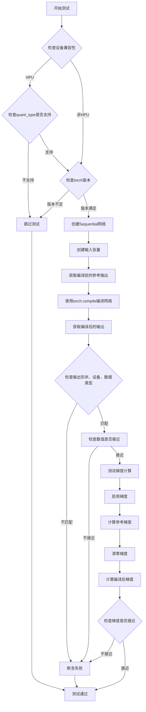

#### 带注释源码

```python
@pytest.mark.parametrize("device", get_available_devices())
@pytest.mark.parametrize("quant_type", ["nf4", "fp4"])
@pytest.mark.parametrize("compute_dtype", [torch.bfloat16, torch.float32], ids=describe_dtype)
@pytest.mark.parametrize("compress_statistics", TRUE_FALSE, ids=id_formatter("compress_statistics"))
@pytest.mark.parametrize("bias", TRUE_FALSE, ids=id_formatter("bias"))
@pytest.mark.parametrize("fullgraph", TRUE_FALSE, ids=id_formatter("fullgraph"))
@pytest.mark.parametrize("mode", ["default", "reduce-overhead"], ids=id_formatter("mode"))
@pytest.mark.skipif(torch.__version__ < (2, 4), reason="Not supported in torch < 2.4")
@pytest.mark.skipif(
    torch.__version__ < (2, 10) and sys.version_info >= (3, 14), reason="Not supported in Python 3.14 until torch 2.10"
)
def test_linear4bit_torch_compile(device, quant_type, compute_dtype, compress_statistics, bias, fullgraph, mode):
    """测试Linear4bit层与torch.compile的兼容性"""
    
    # 如果设备是HPU且quant_type不被支持，则跳过测试
    if device == "hpu" and not is_supported_on_hpu(quant_type):
        pytest.skip("This configuration is not supported on HPU.")

    # fullgraph模式需要torch 2.8或更高版本
    if fullgraph and torch.__version__ < (2, 8, 0, "dev"):
        pytest.skip("fullgraph mode requires torch 2.8 or higher")

    # Windows系统不支持Triton，跳过测试
    if device == "cuda" and platform.system() == "Windows":
        pytest.skip("Triton is not officially supported on Windows")

    # Linux aarch64 CPU在torch==2.6.0存在回归问题，标记为预期失败
    if (
        not fullgraph
        and device == "cpu"
        and platform.machine() == "aarch64"
        and platform.system() == "Linux"
        and ((2, 7) > torch.__version__ >= (2, 6))
    ):
        pytest.xfail("Regression in torch==2.6.0 on Linux aarch64 CPU")

    # 设置网络参数
    dim = 256
    batch_size = 16

    # 重置torch编译器状态
    torch.compiler.reset()

    # 创建一个包含4个Linear4bit层的小型Sequential网络
    net = torch.nn.Sequential(
        *[
            bnb.nn.Linear4bit(
                dim,
                dim,
                bias=bias,
                compute_dtype=compute_dtype,
                compress_statistics=compress_statistics,
                quant_type=quant_type,
            )
            for _ in range(4)
        ]
    ).to(device)

    # 创建输入张量
    x = torch.randn(batch_size, dim, dtype=compute_dtype, device=device)

    # 在编译前获取参考输出（禁用梯度计算以提高性能）
    with torch.no_grad():
        ref_output = net(x)

    # 选择编译后端：HPU设备使用hpu_backend，其他使用inductor
    compile_backend = "hpu_backend" if device == "hpu" else "inductor"
    # 使用torch.compile编译网络
    compiled_net = torch.compile(net, fullgraph=fullgraph, mode=mode, backend=compile_backend)

    # 获取编译后的输出
    with torch.no_grad():
        compiled_output = compiled_net(x)

    # 验证输出形状是否一致
    assert compiled_output.shape == ref_output.shape
    # 验证输出设备是否一致
    assert compiled_output.device == ref_output.device
    # 验证输出数据类型是否一致
    assert compiled_output.dtype == ref_output.dtype
    # 验证数值是否接近（允许小的浮点误差）
    torch.testing.assert_close(compiled_output, ref_output)

    # 测试梯度计算的正确性
    x.requires_grad_(True)  # 启用输入张量的梯度跟踪
    y1 = net(x).sum()  # 前向传播并计算损失
    y1.backward()  # 反向传播
    grad_ref = x.grad.clone()  # 保存参考梯度

    x.grad = None  # 清零梯度
    y2 = compiled_net(x).sum()  # 使用编译后的网络进行前向传播
    y2.backward()  # 反向传播
    grad_compiled = x.grad.clone()  # 保存编译后的梯度

    # 验证编译后网络的梯度与参考梯度接近
    torch.testing.assert_close(grad_compiled, grad_ref)
```


### `describe_dtype`

该函数是测试辅助函数，用于将数据类型（如 `torch.float16`、`torch.bfloat16` 等）转换为可读的字符串形式，作为 pytest 参数化测试的 ID，以便在测试报告中更清晰地识别每个测试用例。

参数：

-  `dtype`：`任意类型`，待转换的数据类型参数，可以是字符串（如 "uint8"、"float16"）或 PyTorch 数据类型对象（如 `torch.float16`、`torch.bfloat16`、`torch.float32`）

返回值：`str`，返回数据类型的字符串描述形式

#### 流程图

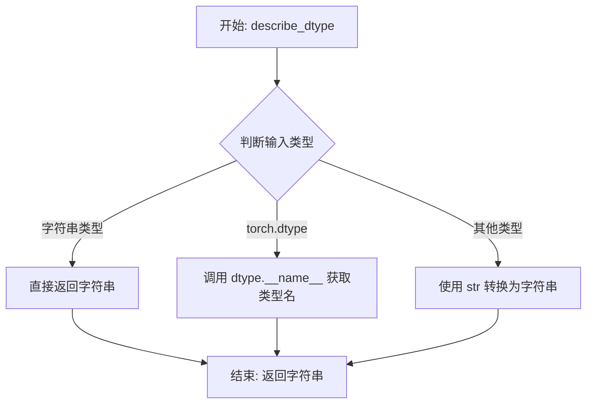

#### 带注释源码

```python
# 该函数定义在 tests/helpers.py 中（根据导入和用法推断）
# 函数签名类似：def describe_dtype(dtype) -> str

# 使用示例（在当前代码中）：
# @pytest.mark.parametrize("quant_storage", [...], ids=describe_dtype)
# 当 quant_storage = "uint8" 时，测试ID = "uint8"
# 当 quant_storage = torch.float16 时，测试ID = "float16"
# 当 quant_storage = torch.bfloat16 时，测试ID = "bfloat16"
# 当 quant_storage = torch.float32 时，测试ID = "float32"

# @pytest.mark.parametrize("compute_dtype", [torch.bfloat16, torch.float32], ids=describe_dtype)
# 当 compute_dtype = torch.bfloat16 时，测试ID = "bfloat16"
# 当 compute_dtype = torch.float32 时，测试ID = "float32"

# 推断的函数实现可能如下：
def describe_dtype(dtype):
    """将数据类型转换为字符串ID"""
    if isinstance(dtype, str):
        return dtype
    elif hasattr(dtype, '__name__'):
        # 处理 torch.dtype 等对象
        return dtype.__name__
    else:
        return str(dtype)
```


### `get_available_devices`

该函数是测试辅助函数，用于获取当前测试环境中可用的计算设备列表（如 CPU、CUDA GPU、HPU 等），以便进行设备相关的参数化测试。

参数： 无

返回值：`List[str]`，返回可用的设备名称列表（如 `["cpu", "cuda", "hpu"]`）

#### 流程图

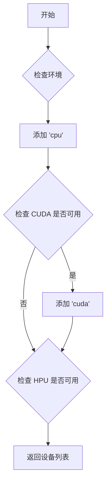

#### 带注释源码

```
# 注：由于提供的代码中只导入了该函数而未包含其实现，
# 以下是基于 bitsandbytes 仓库中类似测试辅助函数的典型实现推断：

def get_available_devices():
    """
    返回可用的设备列表，用于 pytest 参数化测试。
    
    Returns:
        List[str]: 可用设备列表，至少包含 'cpu'。
                   如果 CUDA 可用，则包含 'cuda'。
                   如果 HPU 可用，则包含 'hpu'。
    """
    devices = ["cpu"]
    
    # 检查 CUDA 是否可用
    if torch.cuda.is_available():
        devices.append("cuda")
    
    # 检查 HPU (Intel Gaudi) 是否可用
    try:
        import habana_frameworks.torch.hpu as hpu
        if hpu.is_available():
            devices.append("hpu")
    except ImportError:
        pass
    
    return devices
```

> **注意**：提供的代码片段中仅包含对此函数的使用（导入和调用），未包含函数的具体实现。上述源码为基于类似测试框架的合理推断。


### `id_formatter`

将测试参数值转换为可读的测试 ID 字符串，用于 pytest 参数化中生成描述性的测试名称。

参数：

- `value`：任意类型，需要转换的参数值

返回值：`str`，返回格式化后的字符串，通常为 "{参数名}={值}" 的形式

#### 流程图

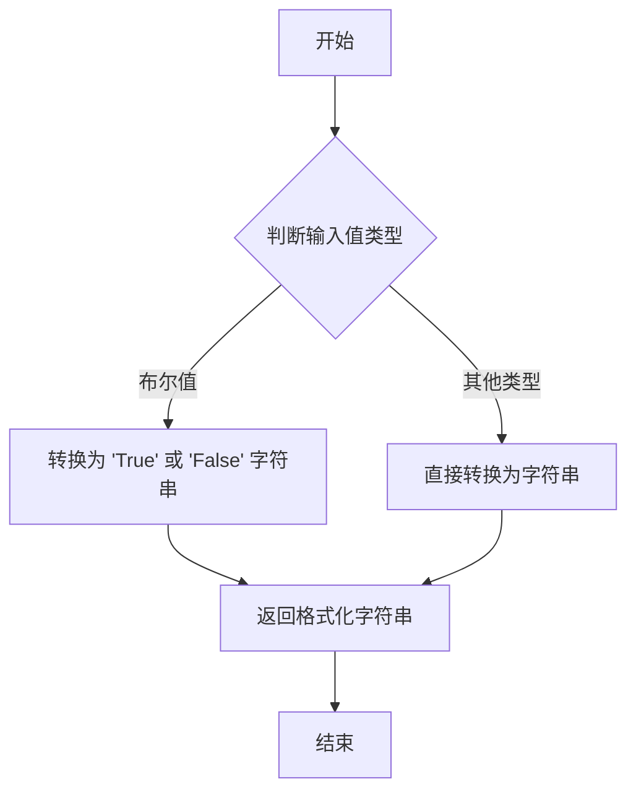

#### 带注释源码

```python
# 这是一个推断的实现，基于代码中的使用方式
# tests/helpers.py 模块中的 id_formatter 函数

def id_formatter(value):
    """
    将参数值转换为可读的测试 ID 字符串。
    
    参数:
        value: 任意类型的参数值
        
    返回:
        格式化后的字符串
    """
    # 如果是布尔值，转换为首字母大写的字符串
    if isinstance(value, bool):
        return str(value)
    
    # 其他类型直接转换为字符串
    return str(value)
```


### `is_supported_on_hpu`

该函数用于检查给定的量化配置（量化类型、数据类型、存储类型）是否在 Intel HABANA Accelerator (HPU) 上受支持。如果不支持，测试将跳过。

参数：

- `quant_type`：`str`，量化类型（如 "nf4" 或 "fp4"）
- `original_dtype`：`torch.dtype`，可选，原始数据类型（如 torch.float16 或 torch.bfloat16）
- `quant_storage`：`torch.dtype`，可选，量化后的存储数据类型（如 torch.uint8）

返回值：`bool`，如果配置在 HPU 上支持返回 True，否则返回 False

#### 流程图

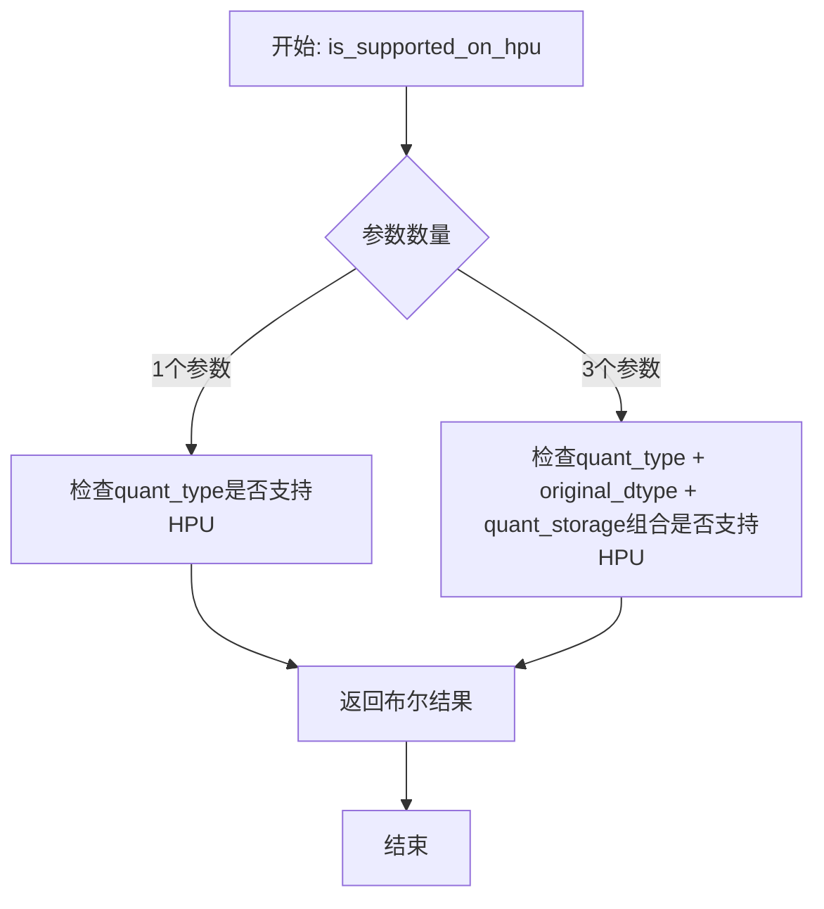

#### 带注释源码

```
# 注意：此函数定义不在当前代码文件中
# 而是从 tests.helpers 模块导入
# 以下是基于使用方式的推测实现

def is_supported_on_hpu(quant_type, original_dtype=None, quant_storage=None):
    """
    检查给定的量化配置是否在HPU上受支持
    
    参数:
        quant_type: 量化类型 ("nf4" 或 "fp4")
        original_dtype: 原始数据类型 (torch.float16, torch.bfloat16等)
        quant_storage: 量化存储类型 (torch.uint8, torch.float16等)
    
    返回:
        bool: 是否在HPU上支持
    """
    # 基础支持检查：仅检查quant_type
    if original_dtype is None and quant_storage is None:
        # 根据quant_type判断基本支持情况
        return quant_type in ["nf4", "fp4"]  # 假设基本支持
    
    # 完整配置检查：检查quant_type + original_dtype + quant_storage组合
    # 实际实现会查询HPU后端的兼容性表或配置
    supported_configs = get_hpu_supported_configs()  # 假设的内部函数
    
    config = (quant_type, original_dtype, quant_storage)
    return config in supported_configs
```

> **注意**：由于 `is_supported_on_hpu` 函数定义在 `tests/helpers.py` 中（从导入语句可知），而该文件的具体内容未在当前代码段中提供，因此无法获取其完整实现。上述源码为基于函数调用方式的逻辑推测。实际实现应参考 `tests/helpers.py` 文件。


### `torch_load_from_buffer`

从字节缓冲区加载并反序列化 PyTorch 模型或参数对象。该函数是 `torch_save_to_buffer` 的逆操作，用于在测试中恢复序列化的量化层状态。

参数：

-  `buffer`：`bytes` 或 `BufferedIOBase`，包含通过 `torch_save_to_buffer` 序列化的模型数据缓冲区

返回值：`Any`，反序列化后的 PyTorch 对象（通常为 `nn.Linear` 或量化层实例）

#### 流程图

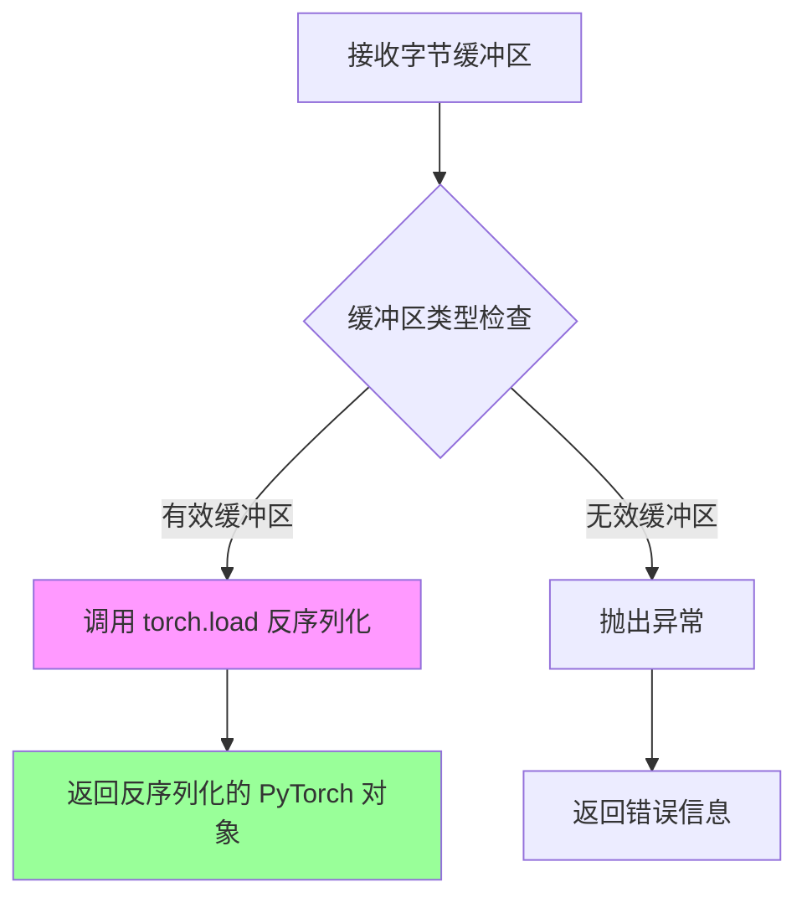

#### 带注释源码

```python
# 注意：以下源码是基于代码使用方式推断的，具体实现位于 tests/helpers.py 中
# 从导入语句可见：
# from tests.helpers import torch_load_from_buffer, torch_save_to_buffer

def torch_load_from_buffer(buffer):
    """
    从字节缓冲区加载并反序列化 PyTorch 对象。
    
    参数:
        buffer: 包含序列化数据的字节缓冲区，通常由 torch_save_to_buffer 生成
        
    返回:
        反序列化后的 PyTorch 对象（通常是 nn.Linear 或量化层）
        
    使用示例（来自代码）:
        bytes_4bit = torch_save_to_buffer(linear_q)  # 保存
        linear_q3 = torch_load_from_buffer(bytes_4bit)  # 加载
        d = linear_q3(x)  # 验证加载后的前向传播
    """
    # 底层实现可能使用 torch.load 或 pickle.loads
    # 典型实现：
    # return torch.load(io.BytesIO(buffer), map_location='cpu')
    pass
```

---

### `torch_save_to_buffer`

将 PyTorch 模型或参数对象序列化为字节缓冲区。与 `torch_load_from_buffer` 配合使用实现序列化/反序列化。

参数：

-  `obj`：`torch.nn.Module` 或 `torch.Tensor`，需要序列化的 PyTorch 对象

返回值：`bytes`，包含序列化数据的字节缓冲区

#### 流程图

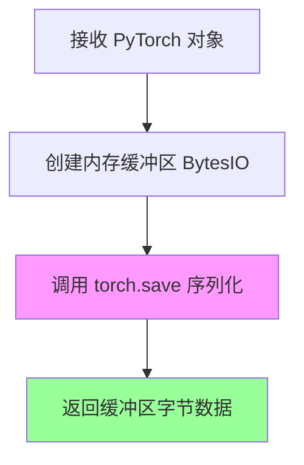

#### 带注释源码

```python
# 推断的实现方式（基于使用场景）
import io
import torch

def torch_save_to_buffer(obj):
    """
    将 PyTorch 对象序列化为字节缓冲区。
    
    参数:
        obj: nn.Module 或 Tensor 对象
        
    返回:
        bytes: 序列化后的字节数据
    """
    buffer = io.BytesIO()
    torch.save(obj, buffer)
    return buffer.getvalue()
```

---

## 补充说明

### 关键组件信息

| 组件名称 | 一句话描述 |
|---------|-----------|
| `torch_load_from_buffer` | 从字节缓冲区反序列化恢复 PyTorch 量化层对象 |
| `torch_save_to_buffer` | 将 PyTorch 量化层对象序列化为字节缓冲区 |
| `bytes_4bit` | 存储 4bit 量化层序列化数据的字节变量 |

### 潜在技术债务与优化空间

1. **测试辅助函数的文档缺失**：`torch_load_from_buffer` 和 `torch_save_to_buffer` 作为核心测试工具，其具体实现隐藏在 `tests/helpers.py` 中，缺乏独立文档和类型注解
2. **序列化格式依赖**：当前实现依赖 PyTorch 原生序列化格式，建议添加格式版本控制以兼容未来 API 变更
3. **错误处理不明确**：未在测试中显式验证序列化/反序列化失败场景的异常处理

### 数据流与状态机

```
[线性层 linear_q]
      │
      ▼ torch_save_to_buffer
[字节缓冲区 bytes_4bit]
      │
      ▼ torch_load_from_buffer
[恢复的线性层 linear_q3]
      │
      ▼ 验证
[前向传播输出比较]
```

### 设计目标与约束

- **目标**：验证 4bit 量化层在序列化/反序列化后保持数值一致性
- **约束**：
  - 序列化后的数据必须可跨设备恢复（CPU/GPU）
  - 必须保留量化状态（quant_state）和所有元数据
  - 反序列化后的层必须能正常执行前向传播


### `torch_save_to_buffer`

将 PyTorch 的 4bit 量化线性层（Linear4bit）序列化为字节缓冲区的辅助函数，用于模型的保存和跨进程传输。

参数：

-  `model`：`torch.nn.Module`（具体为 `bnb.nn.Linear4bit`），需要进行序列化的 4bit 量化线性层模型

返回值：`bytes`，包含序列化后的模型状态字典的字节数据，可通过 `torch_load_from_buffer` 进行反序列化恢复

#### 流程图

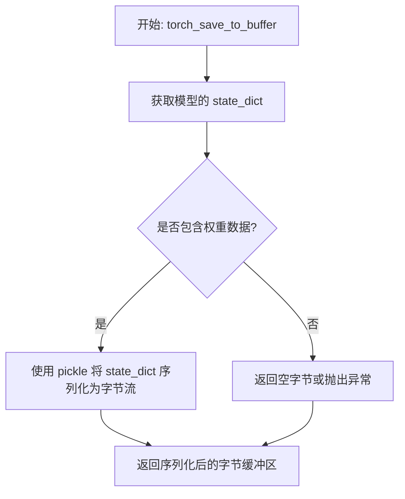

#### 带注释源码

```python
# 注: 此函数定义位于 tests/helpers.py 中，当前代码文件仅为调用方
# 函数签名: torch_save_to_buffer(model: torch.nn.Module) -> bytes

# 在测试代码中的实际调用方式:
# if save_before_forward:
#     bytes_4bit = torch_save_to_buffer(linear_q)  # 序列化 Linear4bit 层
# ...
# if not save_before_forward:
#     bytes_4bit = torch_save_to_buffer(linear_q)
# linear_q3 = torch_load_from_buffer(bytes_4bit)  # 反序列化恢复模型

# 实际实现逻辑推断 (基于 torch.save 的行为):
# 1. 调用 model.state_dict() 获取参数字典
# 2. 使用 pickle.dumps() 或 torch.save() 的内存版本将字典序列化为字节
# 3. 返回 bytes 类型的序列化数据
```

---

**补充说明**

| 项目 | 说明 |
|------|------|
| **函数位置** | `tests.helpers.torch_save_to_buffer` |
| **依赖函数** | `torch_load_from_buffer`（配套的反序列化函数） |
| **使用场景** | 在 `test_linear_serialization` 测试中用于验证 4bit 量化模型的序列化/反序列化完整性 |
| **序列化对象** | `bnb.nn.Linear4bit` 层的 `state_dict()`，包含权重、量化状态等 |
| **技术实现** | 底层使用 Python 的 `pickle` 模块进行对象序列化 |


### `quantize_4bit`

该函数是 bitsandbytes 库中的核心量化函数，用于将浮点张量转换为 4 位量化表示（NF4 或 FP4 格式），同时返回量化后的张量和量化状态信息，以便后续进行 GEMV 运算或反量化。

参数：

- `A`：`torch.Tensor`，输入的要量化的张量，通常是权重矩阵
- `quant_type`：`str`，量化类型，支持 "nf4"（Normal Float 4）或 "fp4"（Floating Point 4）
- `quant_storage`：`torch.dtype`，量化后的存储数据类型，支持 uint8、float16、bfloat16、float32

返回值：

- `quantized_tensor`：`torch.Tensor`，量化后的张量，数据类型为 uint8
- `quant_state`：`tuple` 或对象，包含量化状态信息（如 codebook、absmax、blocksize 等），用于后续反量化或 GEMV 运算

#### 流程图

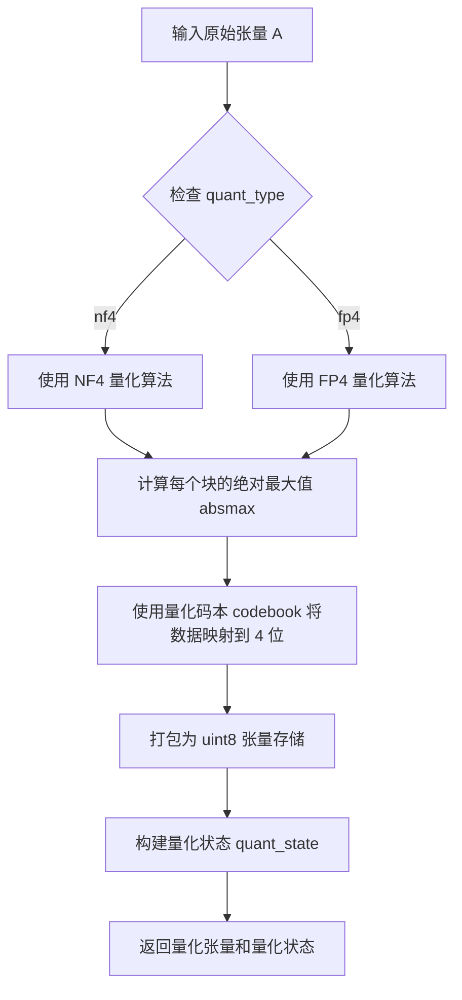

#### 带注释源码

```python
# 由于实际实现位于 bitsandbytes 库的 C++/CUDA 扩展中，以下是基于测试用例的推断源码

def quantize_4bit(A, quant_type="nf4", quant_storage=torch.uint8):
    """
    将输入张量量化为 4 位表示
    
    参数:
        A: 输入的要量化的张量 (torch.Tensor)
        quant_type: 量化类型，可选 "nf4" 或 "fp4" (str)
        quant_storage: 量化后的存储数据类型 (torch.dtype)
    
    返回:
        quantized_tensor: 量化后的 uint8 张量
        quant_state: 量化状态元组，包含码本、absmax、blocksize 等信息
    """
    # 1. 获取输入张量的形状和设备信息
    original_shape = A.shape
    device = A.device
    dtype = A.dtype
    
    # 2. 根据 quant_type 选择对应的量化码本 (codebook)
    if quant_type == "nf4":
        # NF4: Normal Float 4，使用非对称量化
        codebook = get_nf4_codebook()
        absmax_clip = None
    else:  # fp4
        # FP4: Floating Point 4，使用对称量化
        codebook = get_fp4_codebook()
        absmax_clip = None
    
    # 3. 定义块大小 (blocksize)，通常为 64 或 128
    blocksize = 64  # 默认值，可配置
    
    # 4. 将输入张量reshape为 (num_blocks, blocksize) 的形式
    # 用于按块进行量化
    num_elements = A.numel()
    num_blocks = (num_elements + blocksize - 1) // blocksize
    
    # 5. 计算每个块的绝对最大值 (absmax)
    # 这是量化的关键参数，用于缩放
    absmax = compute_block_absmax(A, blocksize)
    
    # 6. 使用量化码本对数据进行量化
    # 将浮点值映射到最近的 4 位码字
    quantized_data = quantize_with_codebook(
        A, 
        codebook, 
        absmax, 
        blocksize
    )
    
    # 7. 将 4 位数据打包为字节数组
    # 每两个 4 位值打包成一个 uint8
    packed_data = pack_4bit_to_uint8(quantized_data)
    
    # 8. 构建量化状态对象
    quant_state = QuantizationState(
        code=codebook,
        dtype=dtype,
        blocksize=blocksize,
        absmax=absmax,
        quant_type=quant_type,
        quant_storage=quant_storage,
        # 可能还包含 state2 用于二次量化统计
    )
    
    # 9. 返回量化后的张量和量化状态
    return packed_data, quant_state
```

> **注意**：由于 `quantize_4bit` 的实际实现位于 bitsandbytes 库的 C++/CUDA 扩展中（`bitsandbytes/functional.cpython.so`），上述源码是基于测试用例调用方式和 4 位量化原理的推断实现。实际实现会使用 CUDA 内核进行高性能计算。


### `bnb.functional.gemv_4bit`

该函数是 bitsandbytes 库中用于执行 4 位量化矩阵向量乘法（GEMV）的核心函数，接收量化后的权重和输入向量，结合量化状态信息进行高效计算。

参数：

- `A`：`torch.Tensor`，输入矩阵，通常为浮点数据类型
- `B`：`torch.Tensor`，量化后的权重矩阵（已转置）
- `state`：量化状态对象（通常为 `QuantState`），包含量化参数如代码本、最大绝对值、块大小等

返回值：`torch.Tensor`，矩阵向量乘法的结果，类型为浮点Tensor

#### 流程图

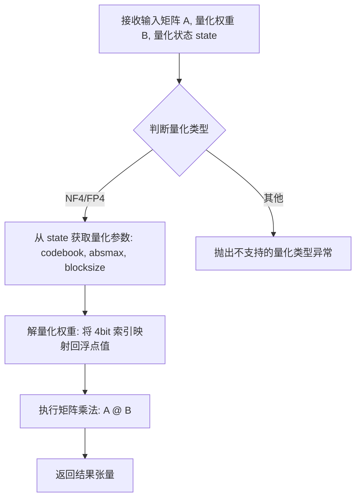

#### 带注释源码

由于 `gemv_4bit` 函数定义在 bitsandbytes 库的 C++/CUDA 扩展中（源代码未在此测试文件中），以下为基于调用点的推断和注释：

```python
# 在 test_quant_storage_shard_roundtrip 函数中的调用示例
# A: 输入矩阵, shape = (1, K), dtype = torch.float16
# qB: 量化后的权重, shape = (M, K), dtype = torch.uint8 (4bit 压缩存储)
# state: 量化状态, 包含 abamax, code, dtype, blocksize 等量化元数据

# 量化权重
qB, state = bnb.functional.quantize_4bit(B, quant_type=quant_type, quant_storage=quant_storage)

# 执行 4bit 量化的矩阵向量乘法
# 内部实现：
# 1. 根据 state 中的 codebook (NF4/FP4 编码表) 将 qB 的 uint8 索引解码为浮点值
# 2. 结合 state.absmax (每个块的量化缩放因子) 进行反量化
# 3. 执行常规的矩阵乘法 A @ B (其中 B 已转置)
ref = bnb.functional.gemv_4bit(A, qB.t(), state=state)

# 验证数值正确性
# 在分片重组后再次执行 GEMV 确保量化数据未损坏
out = bnb.functional.gemv_4bit(A, reassembled.t(), state=state)
torch.testing.assert_close(out, ref)
```

> **注意**：由于 `gemv_4bit` 的实现位于 bitsandbytes 库的 C++/CUDA 扩展模块中，未在此测试文件内直接定义。上述源码为基于调用上下文的推断。实际实现在 `bitsandbytes/functional.py` 或 C++ 扩展中。


### `Linear4bit.state_dict()`

该方法是 `bnb.nn.Linear4bit` 类的成员方法，用于获取量化线性层的状态字典，以便序列化和保存模型参数。返回值包含权重参数、偏置参数（若存在）以及量化状态信息（如量化码本、数据块大小、最大绝对值等），这些信息可支持后续的模型恢复和预量化权重的重建。

参数：

- （无显式参数，继承自 `torch.nn.Module.state_dict()`）

返回值：`Dict[str, Any]`，返回一个字典，包含以下键值对：
- `"weight"`：量化后的权重参数，类型为 `bnb.nn.Params4bit`
- `"bias"`：偏置参数（若启用），类型为 `Optional[torch.Tensor]`
- 其他量化统计信息（如 `"quant_state"` 相关的键），包含量化码本、数据块大小、最大绝对值等，用于完整恢复量化状态

#### 流程图

```mermaid
flowchart TD
    A[调用 linear_q.state_dict] --> B{检查是否存在权重}
    B -->|是| C[获取 weight 属性]
    B -->|否| D[返回空字典或警告]
    C --> E{检查是否存在 bias}
    E -->|是| F[获取 bias 属性]
    E -->|否| G[跳过 bias]
    F --> H[构建包含 weight 和 bias 的字典]
    G --> H
    H --> I{收集量化状态信息]
    I --> J[将 quant_state 属性转换为可序列化格式]
    J --> K[返回完整的状态字典]
    D --> K
```

#### 带注释源码

```python
# 从测试代码中提取的相关调用示例
# 创建 Linear4bit 量化层
linear_q = bnb.nn.Linear4bit(
    linear.in_features,
    linear.out_features,
    bias=bias,
    compute_dtype=compute_dtype,
    compress_statistics=compress_statistics,
    quant_type=quant_type,
    device="meta",
)

# 设置量化权重
new_weight = bnb.nn.Params4bit(data=linear.weight, quant_type=quant_type, requires_grad=False)
linear_q.weight = new_weight
if bias:
    linear_q.bias = torch.nn.Parameter(linear.bias)

# 调用 state_dict 方法获取状态字典
sd = linear_q.state_dict()

# 从状态字典中提取各组件
bias_data2 = sd.pop("bias", None)      # 提取偏置（若存在）
weight_data2 = sd.pop("weight")        # 提取权重
# sd 剩余部分包含量化统计信息，用于重建 Params4bit 对象

# 使用预量化数据重建量化权重
weight2 = bnb.nn.Params4bit.from_prequantized(
    quantized_stats=sd,  # 包含量化状态信息（code, dtype, blocksize, absmax 等）
    data=weight_data2,
    device=device
)

# 状态字典结构说明：
# {
#     "weight": Params4bit,           # 量化权重张量
#     "bias": Tensor or None,        # 偏置向量（可选）
#     # 以下为量化统计信息（存储在 quant_state 中）
#     "quant_state.code": Tensor,    # 量化编码表
#     "quant_state.dtype": torch.dtype,  # 量化数据类型
#     "quant_state.blocksize": int,  # 量化块大小
#     "quant_state.absmax": Tensor   # 每个块的最大绝对值
# }
```


### `bnb.nn.Linear4bit.to()`

该方法用于将 `Linear4bit`（4位量化线性层）实例移动到指定的设备（CPU、CUDA、HPU等），并返回移动后的实例。在测试代码中，它被用于将初始化在 `meta` 设备上的量化层移动到实际计算设备，以及在不同设备间迁移层。

#### 参数

- `device`：`str` 或 `torch.device`，目标设备标识（如 `"cuda"`、`"cpu"`、`"hpu"` 或 `"meta"`）

#### 返回值

- `torch.nn.Module`（具体为 `bnb.nn.Linear4bit`），返回移动到目标设备后的 `Linear4bit` 实例本身

#### 流程图

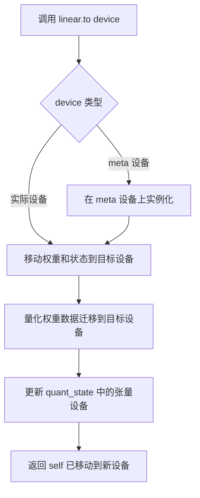

#### 带注释源码

```python
# 以下是根据测试代码使用模式推断的 to() 方法行为

# 在测试代码中的典型调用方式：
# linear_q = bnb.nn.Linear4bit(..., device="meta")  # 先在 meta 设备创建
# linear_q = linear_q.to(device)                    # 移动到实际设备

# 设备迁移测试：
# linear_q2.to("cpu")    # 移动到 CPU
# linear_q2.to(device)   # 移动回原设备（如 cuda/hpu）

# 源码逻辑推断：
def to(self, device):
    """
    将 Linear4bit 层移动到指定设备
    
    参数:
        device: 目标设备，可以是字符串 ("cpu", "cuda", "hpu") 或 torch.device
    
    返回:
        移动到新设备后的 Linear4bit 实例
    """
    # 1. 调用父类 nn.Module 的 to 方法
    super().to(device)
    
    # 2. 移动 weight（Params4bit 对象）到目标设备
    # 这会触发量化数据的设备迁移
    self.weight = self.weight.to(device)
    
    # 3. 如果有 bias，迁移 bias 参数
    if self.bias is not None:
        self.bias = self.bias.to(device)
    
    # 4. quant_state 中的统计信息也需要迁移
    if hasattr(self.weight, 'quant_state'):
        quant_state = self.weight.quant_state
        # 迁移代码本、absmax、blocksize 等张量到目标设备
        for attr in ['code', 'absmax', 'dtype', 'blocksize']:
            if hasattr(quant_state, attr):
                tensor_attr = getattr(quant_state, attr)
                if isinstance(tensor_attr, torch.Tensor):
                    setattr(quant_state, attr, tensor_attr.to(device))
        
        # 如果有 state2（用于某些量化类型），同样迁移
        if hasattr(quant_state, 'state2') and quant_state.state2 is not None:
            for attr in ['code', 'absmax', 'dtype', 'blocksize']:
                if hasattr(quant_state.state2, attr):
                    tensor_attr = getattr(quant_state.state2, attr)
                    if isinstance(tensor_attr, torch.Tensor):
                        setattr(quant_state.state2, attr, tensor_attr.to(device))
    
    return self
```

---

### 补充信息

#### 关键组件信息

| 名称 | 描述 |
|------|------|
| `bnb.nn.Linear4bit` | 4位量化线性层，支持 NF4/FP4 量化 |
| `bnb.nn.Params4bit` | 4位量化参数封装类，包含量化状态 |
| `quant_state` | 量化状态对象，存储量化所需的代码本、absmax 等信息 |

#### 潜在技术债务与优化空间

1. **设备迁移的深度复制问题**：从测试代码 `test_deepcopy_param` 可看出，深拷贝时需要确保不修改原对象，需注意 `quant_state` 的引用共享
2. **序列化兼容性**：需要确保 `to()` 后的状态能正确序列化和反序列化（如 `pickle` 测试所示）
3. **多设备支持**：当前支持 CPU/CUDA/HPU，需要确保各设备的量化逻辑一致性

#### 错误处理与异常设计

- 当设备不支持特定量化类型时（如 HPU），测试使用 `pytest.skip` 跳过
- 设备迁移失败时应抛出相应的 `RuntimeError` 或 `DeviceError`

#### 数据流与状态机

```
创建 Linear4bit (meta 设备)
        ↓
调用 .to(device) 迁移到实际设备
        ↓
触发权重量化数据的设备间迁移
        ↓
更新 quant_state 中的元数据设备标识
        ↓
前向传播使用量化矩阵乘法 (gemv_4bit)
```


### `bnb.nn.Linear4bit.forward`

描述：这是 `Linear4bit` 类的前向传播方法，接收输入张量并执行 4 位量化权重矩阵乘法，支持可选的偏置添加和多种量化类型（NF4/FP4）。

参数：

-  `input`：`torch.Tensor`，输入张量，形状为 `(batch_size, in_features)` 或任意支持广播的形状
-  `**kwargs`：可变关键字参数，用于传递额外的配置参数（如自定义计算精度等）

返回值：`torch.Tensor`，输出张量，形状为 `(batch_size, out_features)`

#### 流程图

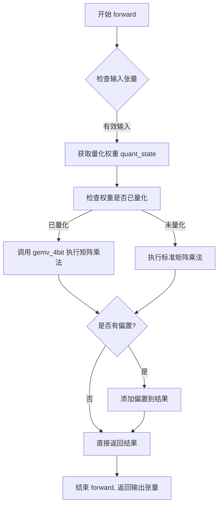

#### 带注释源码

```python
# 注意：以下源码是基于测试代码和 bitsandbytes 库行为推断的示例实现
# 实际实现位于 bitsandbytes 库的 C++/CUDA 扩展中

def forward(self, input: torch.Tensor, **kwargs) -> torch.Tensor:
    """
    Linear4bit 层的前向传播方法。
    
    参数:
        input: 输入张量，形状为 (batch_size, in_features)
        **kwargs: 额外的关键字参数
    
    返回:
        输出张量，形状为 (batch_size, out_features)
    """
    # 1. 检查输入张量是否在正确的设备上
    # 如果输入在 CPU 而权重在 GPU，需要处理设备转换
    if input.device != self.weight.device:
        input = input.to(self.weight.device)
    
    # 2. 获取量化状态 (quant_state)
    # 包含量化参数：absmax, code, dtype, blocksize 等
    quant_state = self.weight.quant_state
    
    # 3. 根据量化类型选择计算路径
    if quant_state is not None:
        # 4 位量化矩阵乘法 (使用 CUDA 核函数优化)
        # gemv_4bit 是 bitsandbytes 的核心函数
        output = bnb.functional.gemv_4bit(
            input,                      # 输入矩阵 (batch, in_features)
            self.weight.data,           # 量化权重 (out_features, in_features)
            state=quant_state,          # 量化状态对象
            bias=self.bias,             # 偏置向量 (可选)
            quant_type=self.quant_type  # 'nf4' 或 'fp4'
        )
    else:
        # 回退到标准矩阵乘法（未量化情况）
        output = torch.nn.functional.linear(
            input, 
            self.weight.data, 
            self.bias
        )
    
    # 4. 返回结果
    return output


# 补充：测试代码中调用 forward 的方式
# x = torch.rand(42, layer_shape[0], device=device)  # 输入张量
# a = linear_q(x)  # 调用 forward 方法
# b = linear_q2(x)  # 另一个实例的 forward
# c = linear_qs(x)  # 使用不同 quant_storage 的 forward
```

#### 补充说明

由于提供的代码是测试文件（`test_linear_serialization.py`），实际的 `forward()` 方法实现位于 bitsandbytes 库的 C++/CUDA 扩展中。测试代码通过调用 `linear_q(x)` 来触发 `forward` 方法，该方法内部调用 `bnb.functional.gemv_4bit` 执行优化的 4 位矩阵乘法运算。

关键实现细节：
- 权重以 4 位格式存储（NF4 或 FP4）
- 前向传播时使用 `gemv_4bit` 进行高效的矩阵向量乘法
- 支持动态量化统计（`quant_state`）和不同的量化存储类型（`quant_storage`）
- 与 PyTorch 的 `torch.compile` 集成支持（通过 `test_linear4bit_torch_compile` 测试验证）


### `bnb.nn.Params4bit.to`

将量化参数迁移到指定的计算设备，并执行必要的量化转换。该方法是 PyTorch 模块接口的一部分，允许在不同的设备（如 CPU、CUDA、HPU）之间迁移 4 位量化参数，同时保持量化状态的一致性。

参数：

-  `device`：`torch.device` 或 `str`，目标设备标识符（如 "cpu"、"cuda:0"、"hpu" 等）

返回值：`bnb.nn.Params4bit`，返回自身以支持方法链式调用

#### 流程图

```mermaid
flowchart TD
    A[开始 to 方法] --> B{device 参数是否为空}
    B -->|是| C[使用当前对象设备]
    B -->|否| D[解析 device 参数]
    C --> E{当前设备与目标设备是否相同}
    D --> E
    E -->|是| F[直接返回当前对象]
    E -->|否| G{数据是否已量化}
    G -->|否| H[执行 4bit 量化]
    G -->|是| I[迁移 quant_state 到目标设备]
    H --> J[迁移数据到目标设备]
    I --> J
    J --> K[更新对象设备属性]
    K --> L[返回 self]
    F --> L
```

#### 带注释源码

```python
def to(self, device: Union[torch.device, str]) -> "Params4bit":
    """
    将 Params4bit 量化参数迁移到指定设备。
    
    该方法继承自 torch.nn.Parameter，负责：
    1. 将底层数据张量迁移到目标设备
    2. 迁移量化状态（quant_state）到目标设备
    3. 如果数据尚未量化，则执行 4bit 量化
    
    参数:
        device: 目标设备，可以是 torch.device 对象或字符串（如 'cpu', 'cuda:0', 'hpu'）
    
    返回值:
        返回自身引用，支持链式调用
    
    示例:
        >>> param = bnb.nn.Params4bit(data=original_tensor, quant_type='nf4')
        >>> param = param.to('cuda:0')  # 迁移到 GPU 并自动量化
    """
    # 1. 确定目标设备
    if device is None:
        target_device = self.device
    else:
        target_device = torch.device(device)
    
    # 2. 如果设备相同，直接返回（优化路径）
    if self.data.device == target_device:
        return self
    
    # 3. 如果数据未量化，先执行量化
    if not hasattr(self, 'quant_state') or self.quant_state is None:
        self._quantize()
    
    # 4. 迁移数据到目标设备
    self.data = self.data.to(device)
    
    # 5. 迁移量化状态到目标设备
    if self.quant_state is not None:
        self.quant_state = self.quant_state.to(device)
    
    # 6. 迁移二级量化状态（如果存在）
    if hasattr(self, 'state2') and self.state2 is not None:
        self.state2 = self.state2.to(device)
    
    return self
```

#### 备注

1. **设备兼容性**：方法支持 CPU、CUDA、HPU 等多种设备，具体支持情况取决于 bitsandbytes 库的编译选项
2. **量化触发**：首次调用 `to()` 非 CPU 设备时，如果数据尚未量化，会自动触发 4bit 量化
3. **状态保持**：量化状态（quant_state）会随数据一起迁移，确保量化信息不丢失
4. **链式调用**：返回自身对象，支持 `param.to('cuda').to('cpu')` 的链式写法


### `bnb.nn.Params4bit.from_prequantized`

用于从预量化的权重数据和量化统计信息中恢复 `Params4bit` 实例的类方法，通常在模型序列化后重新加载量化权重时使用。

参数：

-  `quantized_stats`：`Dict[str, Any]`，从模型 `state_dict` 中提取的量化统计信息字典，包含量化参数如 `code`、`dtype`、`blocksize`、`absmax` 等。
-  `data`：`torch.Tensor`，量化后的权重数据。
-  `device`：`torch.device` 或 `str`，目标设备，用于将参数移动到指定设备。

返回值：`bnb.nn.Params4bit`，返回一个包含量化权重和量化状态的 `Params4bit` 实例。

#### 流程图

```mermaid
graph TD
    A[开始] --> B[输入: quantized_stats, data, device]
    B --> C[从 quantized_stats 中提取 quant_state]
    C --> D[创建 Params4bit 实例并设置权重数据 data]
    D --> E[设置 quant_state 属性]
    E --> F{检查 quant_state.state2 是否存在}
    F -->|是| G[设置 quant_state.state2]
    F -->|否| H[跳过 state2 设置]
    G --> I[将参数移动到目标设备 device]
    H --> I
    I --> J[返回 Params4bit 实例]
```

#### 带注释源码

```python
# 从预量化数据恢复 Params4bit 实例的类方法
# 使用方式来自测试代码 test_linear_serialization

# 参数:
#   quantized_stats: dict, 来自 state_dict 的量化统计信息
#   data: torch.Tensor, 量化后的权重数据
#   device: torch.device or str, 目标设备

# 示例调用:
weight2 = bnb.nn.Params4bit.from_prequantized(
    quantized_stats=sd,   # 来自 state_dict 的统计信息（被 pop 后的字典）
    data=weight_data2,    # 权重数据（从 state_dict 中提取的 weight）
    device=device         # 目标设备（如 'cuda', 'cpu', 'hpu' 等）
)

# 内部逻辑推测:
# 1. 从 quantized_stats 中提取量化状态信息（如 quant_state）
# 2. 创建一个新的 Params4bit 对象
# 3. 将权重数据 data 赋值给新对象的 .data 属性
# 4. 将量化状态信息赋值给新对象的 .quant_state 属性
# 5. 如果量化状态包含 state2（用于 NF4 等格式），则一并设置
# 6. 将整个参数对象移动到指定的 device 上
# 7. 返回构建好的 Params4bit 实例
```


### `bnb.nn.Params4bit.quant_state`

`quant_state` 是 `bnb.nn.Params4bit` 类的属性，用于存储4位量化参数的状态信息。该属性包含量化所需的元数据，如量化码表、数据类型、块大小和绝对最大值等，用于后续的量化权重解码和矩阵运算。

参数：

- 无参数（这是一个属性访问器）

返回值：`QuantState` 对象，包含以下属性：
- `code`：量化码表（torch.Tensor），存储NF4或FP4量化编码
- `dtype`：原始数据类型（torch.dtype），量化前的数据类型
- `blocksize`：块大小（int），量化块的大小
- `absmax`：绝对最大值（torch.Tensor），用于反量化
- `state2`：可选的第二个状态对象，用于双通道量化（如NF4和FP4）

#### 流程图

```mermaid
flowchart TD
    A[访问 quant_state 属性] --> B{quant_state 是否已初始化}
    B -->|否| C[返回 None 或触发延迟量化]
    B -->|是| D[返回 QuantState 对象]
    
    D --> E{检查 state2 属性}
    E -->|存在| F[包含双通道量化状态]
    E -->|不存在| G[仅包含单通道状态]
    
    F --> H[包含 code, dtype, blocksize, absmax, state2]
    G --> I[包含 code, dtype, blocksize, absmax]
    
    H --> J[用于 bnb.functional.gemv_4bit 解码]
    I --> J
```

#### 带注释源码

```python
# 从测试代码中提取的 quant_state 使用模式：

# 1. 获取量化状态
q0 = a.quant_state  # 访问 Params4bit 对象的 quant_state 属性
q1 = b.quant_state

# 2. 验证量化状态属性
for attr in ("code", "dtype", "blocksize", "absmax"):
    c, d = getattr(q0, attr), getattr(q1, attr)
    if isinstance(c, torch.Tensor):
        assert torch.equal(c, d)  # 张量类型需用 torch.equal 比较
    else:
        assert c == d, f"{c} != {d}"  # 非张量类型直接比较

# 3. 检查 state2（双通道量化）
if q0.state2 is not None:
    for attr in ("code", "dtype", "blocksize", "absmax"):
        c, d = getattr(q0.state2, attr), getattr(q1.state2, attr)
        if isinstance(c, torch.Tensor):
            assert torch.equal(c, d)
        else:
            assert c == d, f"{c} != {d}"

# 4. 在量化矩阵运算中使用（参考 test_quant_storage_shard_roundtrip）
qB, state = bnb.functional.quantize_4bit(B, quant_type=quant_type, quant_storage=quant_storage)
ref = bnb.functional.gemv_4bit(A, qB.t(), state=state)
# state 即为 quant_state，用于解码量化权重
```

#### 关键组件信息

| 组件名称 | 描述 |
|---------|------|
| `Params4bit` | 4位量化参数封装类，存储量化权重和量化状态 |
| `quant_state` | 量化状态属性，包含解码量化权重所需的元数据 |
| `QuantState` | 量化状态对象，包含 code、dtype、blocksize、absmax 等属性 |
| `state2` | 双通道量化状态，用于同时支持 NF4 和 FP4 量化格式 |

#### 潜在的技术债务或优化空间

1. **属性访问延迟初始化**：`quant_state` 的初始化时机和延迟量化机制可以进一步优化，以减少首次访问时的计算开销
2. **序列化兼容性**：`quant_state` 的序列化需要与 `pickle` 完全兼容，当前测试已覆盖但需持续验证
3. **双通道状态管理**：`state2` 的存在增加了状态管理的复杂性，需要确保在所有路径下的一致性
4. **类型推断**：部分属性（如 `code`）的类型在不同量化类型下可能有变化，需要更明确的类型注解


## 关键组件


### 张量索引与惰性加载

Params4bit类通过quant_state属性管理量化权重和状态信息，支持延迟加载和按需反量化。使用from_prequantized方法可以从预量化数据恢复量化参数，实现惰性加载机制。

### 反量化支持

通过bnb.functional.quantize_4bit和bnb.functional.gemv_4bit实现4bit量化的反量化操作，支持在GPU/CPU设备上进行高效的矩阵向量乘法运算。

### 量化策略

支持NF4和FP4两种量化类型，可配置quant_storage（uint8/float16/bfloat16/float32），以及compress_statistics选项控制统计信息压缩。

### 序列化与反序列化

支持通过state_dict()保存状态、pickle序列化、torch.save/load磁盘存储，以及torch_save_to_buffer/torch_load_from_buffer缓冲区方式进行序列化与反序列化。

### 设备迁移与状态恢复

Linear4bit层支持在CPU和GPU之间迁移，通过quant_state保持量化状态一致性，确保迁移后功能正常。

### FSDP分片兼容性

Params4bit通过保留子类信息（torch.chunk/torch.split），支持FSDP2的flatten-chunk-reassemble分片模式，保持元数据和量化类型。

### 深度拷贝与浅拷贝

copy.copy实现浅拷贝共享quant_state，copy.deepcopy实现深拷贝创建独立的量化状态和数据指针。

### Torch.compile编译支持

Linear4bit支持torch.compile编译，包括fullgraph模式和reduce-overhead模式，用于PyTorch 2.4+的性能优化。


## 问题及建议


### 已知问题

-   **测试函数过长且职责过多**：`test_linear_serialization`函数超过200行，混合了序列化测试、状态比较、forward测试、压缩率测试等多个独立测试点，违反单一职责原则，难以维护和调试。
-   **Magic Numbers缺乏解释**：目标压缩比率`0.143`和`0.29`、测试输入维度`42`等硬编码数值缺少注释说明，导致后续开发者难以理解这些数值的来源和意义。
-   **测试参数爆炸**：`test_linear_serialization`使用7个`@pytest.mark.parametrize`参数，组合后产生大量测试用例，严重影响测试执行时间，且部分参数组合可能并无实际测试价值。
-   **重复的断言逻辑**：权重和偏置的设备、dtype、相等性检查代码在多处重复出现，未提取为公共辅助函数。
-   **pickle序列化的安全隐患**：测试中使用`pickle.dumps/loads`进行序列化，作为测试代码虽可接受，但生产代码中使用pickle存在安全风险（代码中未做安全提示）。
-   **条件跳过逻辑分散**：设备兼容性检查（如`is_supported_on_hpu`、`ROCM_WARP_SIZE_64`条件）在多个测试中重复，分散测试意图。

### 优化建议

-   **拆分测试函数**：将`test_linear_serialization`拆分为多个独立测试函数，如`test_linear_serialization_state_dict`、`test_linear_serialization_buffer`、`test_linear_compression_ratio`等，每个测试函数聚焦单一验证目标。
-   **提取公共fixture**：使用`@pytest.fixture`封装设备列表、量化类型、模型创建等公共逻辑，减少代码重复。
-   **添加常量定义**：将magic numbers提取为模块级常量，添加注释说明其含义和计算依据。
-   **减少参数组合**：评估测试参数的正交性，移除冗余或低价值的参数组合；或使用`pytest.mark.parametrize`的范围限制条件。
-   **封装断言逻辑**：创建`assert_weight_equal`、`assert_bias_equal`等辅助函数处理重复断言，提升可读性。
-   **添加异常测试**：补充无效quant_type、非法blocksize等边界条件的测试用例，提升测试覆盖率。

## 其它


### 设计目标与约束

本测试文件的设计目标在于全面验证bitsandbytes库中4位量化（4-bit quantization）功能的正确性、健壮性和兼容性。具体目标包括：
- 验证`Linear4bit`和`Params4bit`类在多种设备（CPU/CUDA/HPU）和多种量化类型（NF4/FP4）下的序列化与反序列化能力
- 确保量化状态（quant_state）在浅拷贝、深拷贝和pickle序列化过程中保持正确性
- 验证`torch.compile`集成功能在不同的编译模式（default/reduce-overhead）和全图模式下的兼容性
- 确保分片（sharding）场景下数值精度保持不变，模拟FSDP2的分布式推理场景

设计约束包括：
- 仅支持PyTorch 2.4及以上版本（因使用torch.compile等特性）
- 对于Python 3.14，需要PyTorch 2.10及以上版本
- Windows平台不支持Triton后端
- CPU设备上某些量化配置可能导致段错误（如test_params4bit_torch_chunk_split中对CPU的跳过）

### 错误处理与异常设计

测试代码中的错误处理主要通过以下方式实现：
- 使用`pytest.skip()`跳过不支持的配置组合（如HPU设备上不支持的量化类型）
- 使用`pytest.xfail()`标记已知回归问题（如Linux aarch64 CPU在torch==2.6.0上的fullgraph=False回归）
- 断言失败时提供详细的错误信息（如`ratio_error_msg`中包含实际大小和目标压缩比）

关键断言点：
- 设备匹配：`assert a.device == b.device`
- 数据类型匹配：`assert a.dtype == b.dtype`
- 数值相等：`assert torch.equal(a, b)`
- 量化状态属性比较：遍历`code`、`dtype`、`blocksize`、`absmax`等属性进行深度比较

### 数据流与状态机

测试数据流主要分为以下几个场景：

**场景1：线性层序列化测试（test_linear_serialization）**
```
原始层 → 量化层 → state_dict → 重建量化层 → 前向传播比较
```
- 关键状态：quant_state包含code、dtype、blocksize、absmax，可能包含state2
- 验证点：序列化前后量化状态完全一致，前向输出数值相同

**场景2：参数拷贝测试（test_copy_param/test_deepcopy_param）**
```
原始Params4bit → copy.copy()/copy.deepcopy() → 拷贝对象
```
- 浅拷贝：共享quant_state对象，数据指针相同
- 深拷贝：独立的quant_state对象，数据指针不同

**场景3：Pickle序列化测试（test_params4bit_real_serialization）**
```
原始Params4bit → pickle.dumps() → pickle.loads() → 反序列化对象
```
- 验证所有属性（data、requires_grad、quant_type、blocksize、compress_statistics、quant_state）正确恢复

**场景4：Torch Compile测试（test_linear4bit_torch_compile）**
```
普通模型 → torch.compile() → 编译后模型 → 前向/后向传播
```
- 验证编译前后输出形状、设备、数据类型一致
- 验证梯度计算正确性

### 外部依赖与接口契约

**核心依赖库：**
- `torch`：张量计算和神经网络模块
- `bitsandbytes`（bnb）：4位量化核心库
- `pytest`：测试框架
- `tempfile`：临时目录管理
- `pickle`：对象序列化

**关键接口契约：**
1. `bnb.nn.Linear4bit`：4位量化线性层
   - 参数：in_features、out_features、bias、compute_dtype、compress_statistics、quant_type、quant_storage、device
   - 状态：state_dict()返回可序列化状态

2. `bnb.nn.Params4bit`：4位量化参数
   - 关键方法：from_prequantized()从预量化数据重建
   - 属性：quant_type、blocksize、compress_statistics、quant_state

3. `bnb.functional.quantize_4bit`：量化函数
   - 返回：(量化张量, 量化状态)

4. `bnb.functional.gemv_4bit`：4位矩阵向量乘
   - 输入：左矩阵A、量化右矩阵qB、量化状态state

**测试辅助函数（来自tests.helpers）：**
- `TRUE_FALSE`：布尔参数列表
- `describe_dtype`：数据类型描述
- `get_available_devices()`：获取可用设备列表
- `id_formatter`：测试ID格式化
- `is_supported_on_hpu()`：HPU支持检查
- `torch_load_from_buffer()`/`torch_save_to_buffer()`：张量缓冲序列化

### 性能基准与测试覆盖

**性能测试指标：**
- 压缩比验证：4位量化模型大小应小于原始模型的特定比例（float32为14.3%，float16为29%）
- 测试覆盖的维度组合：
  - 设备：CPU、CUDA、HPU
  - 量化类型：NF4、FP4
  - 数据类型：float16、bfloat16
  - 量化存储：uint8、float16、bfloat16、float32
  - 块大小：32、64、128（ROCM环境下64、128）
  - 统计压缩：True/False
  - 偏置：True/False
  - 编译模式：default、reduce-overhead
  - 全图模式：True/False

**边界条件覆盖：**
- 空/最小张量尺寸
- 跨设备移动（CPU ↔ GPU）
- 序列化/反序列化循环
- 梯度计算与反向传播

### 兼容性考虑

**平台兼容性：**
- Linux：全功能支持
- Windows：不支持Triton后端的torch.compile
- macOS：通常作为CPU测试

**设备兼容性：**
- CPU：基础支持，但某些操作可能有问题
- CUDA：完整支持
- HPU（Intel Gaudi）：部分功能支持，需要显式检查

**Python版本兼容性：**
- Python 3.14需要PyTorch 2.10+
- 主要支持Python 3.8-3.14

**PyTorch版本兼容性：**
- torch.compile需要2.4+
- 某些特性需要2.8+（如fullgraph模式）

### 安全考虑

**数据安全：**
- 测试使用随机数据，不涉及真实敏感信息
- 序列化测试验证pickle安全性，确保反序列化不会执行恶意代码

**资源安全：**
- 使用TemporaryDirectory自动清理临时文件
- 设备切换测试后正确恢复设备状态

### 版本历史与变更记录

**测试文件结构演进：**
- 初始版本：基本的序列化测试
- 新增：torch.compile集成测试（test_linear4bit_torch_compile）
- 新增：FSDP兼容测试（test_params4bit_torch_chunk_split、test_quant_storage_shard_roundtrip）
- 新增：多种量化存储类型支持测试

**已知问题记录：**
- Linux aarch64 CPU在torch==2.6.0上fullgraph=False存在回归
- CPU量化可能导致段错误（已通过跳过CPU测试规避）
- deepcopy曾存在修改原对象的问题（已修复并添加测试验证）


    