# `bitsandbytes\tests\test_linear8bitlt.py` 详细设计文档

该文件是bitsandbytes库中Linear8bitLt（8位量化线性层）的测试套件，包含序列化/反序列化、参数拷贝、设备迁移、torch.compile集成等多个维度的功能测试，确保8位量化权重在GPU/CPU设备间的正确行为和数值精度。

## 整体流程

```mermaid
graph TD
    A[开始测试] --> B{测试类型}
B --> C[test_linear_no_igemmlt]
B --> D[test_linear_serialization]
B --> E[test_linear8bit_copy_param]
B --> F[test_linear8bit_deepcopy_param]
B --> G[test_linear8bit_serialization]
B --> H[test_linear8bitlt_torch_compile]
B --> I[test_linear8bitlt_device_movement]
C --> C1[创建标准Linear层]
C --> C2[创建Linear8bitLt层]
C --> C3[设置force_no_igemmlt标志]
C --> C4[前向传播对比]
C --> C5[反向传播梯度对比]
D --> D1[创建Linear8bitLt并设置参数]
D --> D2[执行前向传播]
D --> D3[保存state_dict和二进制]
D --> D4[重新加载并对比结果]
E --> E1[调用copy.copy创建浅拷贝]
E --> E2[验证权重数据指针相同]
F --> F1[调用copy.deepcopy创建深拷贝]
F --> F2[验证SCB和CB被正确拷贝]
G --> G1[pickle序列化]
G --> G2[pickle反序列化]
G --> G3[验证状态一致性]
H --> H1[创建Sequential网络]
H --> H2[获取参考输出]
H --> H3[torch.compile编译]
H --> H4[对比编译前后输出]
I --> I1[创建CPU层并量化]
I --> I2[移动到加速设备]
I --> I3[多次设备间移动并验证]
```

## 类结构

```
测试模块 (test_linear8bitlt.py)
├── Fixtures
│   └── linear8bit (创建Linear8bitLt测试实例)
├── 测试函数
│   ├── test_linear_no_igemmlt (无igemmlt测试)
│   ├── test_linear_serialization (序列化测试)
│   ├── test_linear8bit_copy_param (浅拷贝测试)
│   ├── test_linear8bit_deepcopy_param (深拷贝测试)
│   ├── test_linear8bit_serialization (pickle序列化测试)
│   ├── test_linear8bitlt_torch_compile (torch.compile测试)
│   └── test_linear8bitlt_device_movement (设备迁移测试)
└── 依赖模块
    ├── bitsandbytes.nn.modules (Linear8bitLt)
    ├── bitsandbytes.nn (Int8Params)
    └── bitsandbytes.cextension (ROCM_WARP_SIZE_64)
```

## 全局变量及字段


### `nullcontext`
    
用于创建空上下管理器的工具函数

类型：`contextlib.nullcontext`
    


### `copy`
    
Python标准库，提供浅拷贝和深拷贝功能

类型：`module`
    


### `os`
    
Python标准库，提供操作系统交互功能

类型：`module`
    


### `pickle`
    
Python标准库，用于对象序列化和反序列化

类型：`module`
    


### `platform`
    
Python标准库，用于获取系统平台信息

类型：`module`
    


### `sys`
    
Python标准库，提供系统相关的参数和函数

类型：`module`
    


### `TemporaryDirectory`
    
创建临时目录的上下文管理器

类型：`tempfile.TemporaryDirectory`
    


### `pytest`
    
Python测试框架

类型：`module`
    


### `torch`
    
PyTorch深度学习库

类型：`module`
    


### `bitsandbytes`
    
bitsandbytes量化神经网络库

类型：`module`
    


### `ROCM_WARP_SIZE_64`
    
ROCM平台的warp大小标志常量

类型：`int`
    


### `TRUE_FALSE`
    
pytest参数化用的布尔值列表

类型：`list[bool]`
    


### `get_available_devices`
    
获取可用测试设备的辅助函数

类型：`function`
    


### `id_formatter`
    
格式化测试ID的辅助函数

类型：`function`
    


### `torch_load_from_buffer`
    
从缓冲区加载PyTorch对象的辅助函数

类型：`function`
    


### `torch_save_to_buffer`
    
将PyTorch对象保存到缓冲区的辅助函数

类型：`function`
    


### `device`
    
测试设备类型参数

类型：`str`
    


### `has_fp16_weights`
    
是否保持FP16权重的参数

类型：`bool`
    


### `threshold`
    
量化阈值参数

类型：`float`
    


### `serialize_before_forward`
    
前向传播前序列化的参数

类型：`bool`
    


### `deserialize_before_cuda`
    
CUDA前反序列化的参数

类型：`bool`
    


### `save_before_forward`
    
前向传播前保存的参数

类型：`bool`
    


### `load_before_cuda`
    
CUDA前加载的参数

类型：`bool`
    


### `bias`
    
是否有偏置的参数

类型：`bool`
    


### `fullgraph`
    
是否全图编译的参数

类型：`bool`
    


### `mode`
    
编译模式的参数

类型：`str`
    


### `linear`
    
PyTorch标准线性层参考模型

类型：`torch.nn.Linear`
    


### `x`
    
测试输入张量

类型：`torch.Tensor`
    


### `linear_custom`
    
自定义8位量化线性层实例

类型：`Linear8bitLt`
    


### `x_ref`
    
参考模型输入张量（需梯度）

类型：`torch.Tensor`
    


### `x_ours`
    
量化模型输入张量（需梯度）

类型：`torch.Tensor`
    


### `fx_ref`
    
参考模型前向传播输出

类型：`torch.Tensor`
    


### `fx_ours`
    
量化模型前向传播输出

类型：`torch.Tensor`
    


### `grad_proj`
    
梯度投影张量

类型：`torch.Tensor`
    


### `state_dict_8bit`
    
8位线性层的状态字典

类型：`dict`
    


### `bytes_8bit`
    
序列化后的8位线性层字节数据

类型：`bytes`
    


### `fx_first`
    
首次前向传播输出

类型：`torch.Tensor`
    


### `new_state_dict`
    
加载的状态字典

类型：`dict`
    


### `new_linear_custom`
    
反序列化后的新线性层

类型：`Linear8bitLt`
    


### `new_linear_custom2`
    
从字节加载的新线性层

类型：`Linear8bitLt`
    


### `x_second`
    
第二次测试输入张量

类型：`torch.Tensor`
    


### `fx_second`
    
第二次前向传播输出

类型：`torch.Tensor`
    


### `x_third`
    
第三次测试输入张量

类型：`torch.Tensor`
    


### `fx_third`
    
第三次前向传播输出

类型：`torch.Tensor`
    


### `shallow_copy`
    
浅拷贝后的线性层

类型：`Linear8bitLt`
    


### `deep_copy`
    
深拷贝后的线性层

类型：`Linear8bitLt`
    


### `serialized`
    
pickle序列化的字节数据

类型：`bytes`
    


### `deserialized`
    
pickle反序列化的线性层

类型：`Linear8bitLt`
    


### `dim`
    
神经网络层维度

类型：`int`
    


### `batch_size`
    
批处理大小

类型：`int`
    


### `net`
    
包含多个Linear8bitLt层的Sequential模型

类型：`torch.nn.Sequential`
    


### `dynamic_output_shapes`
    
动态输出形状标志

类型：`bool`
    


### `ref_output`
    
编译前的参考输出

类型：`torch.Tensor`
    


### `compiled_net`
    
torch.compile编译后的模型

类型：`torch.nn.Module`
    


### `compiled_output`
    
编译后的模型输出

类型：`torch.Tensor`
    


### `grad_ref`
    
参考模型梯度

类型：`torch.Tensor`
    


### `grad_compiled`
    
编译模型梯度

类型：`torch.Tensor`
    


### `layer`
    
用于设备迁移测试的线性层

类型：`Linear8bitLt`
    


### `out_accelerator`
    
加速器设备上的输出

类型：`torch.Tensor`
    


### `out_cpu`
    
CPU设备上的输出

类型：`torch.Tensor`
    


### `out_accelerator_2`
    
再次移动到加速器后的输出

类型：`torch.Tensor`
    


### `out_cpu_2`
    
再次移动到CPU后的输出

类型：`torch.Tensor`
    


### `Linear8bitLt.weight`
    
8位量化权重参数

类型：`Int8Params`
    


### `Linear8bitLt.bias`
    
偏置向量

类型：`Tensor/None`
    


### `Linear8bitLt.state`
    
量化状态对象，包含CB、SCB、has_fp16_weights等

类型：`QuantileState`
    


### `Int8Params.data`
    
权重数据

类型：`Tensor`
    


### `Int8Params.requires_grad`
    
是否需要梯度

类型：`bool`
    


### `Int8Params.has_fp16_weights`
    
是否保持FP16权重

类型：`bool`
    


### `Int8Params.CB`
    
量化后的权重矩阵

类型：`Tensor`
    


### `Int8Params.SCB`
    
缩放因子矩阵

类型：`Tensor`
    


### `QuantileState.CB`
    
量化权重

类型：`Tensor`
    


### `QuantileState.SCB`
    
缩放因子

类型：`Tensor`
    


### `QuantileState.has_fp16_weights`
    
FP16权重标志

类型：`bool`
    


### `QuantileState.force_no_igemmlt`
    
强制不使用igemmlt标志

类型：`bool`
    
    

## 全局函数及方法


### `test_linear_no_igemmlt`

该测试函数用于验证8位线性层（Linear8bitLt）在不使用IGEMMLT优化的情况下的前向传播和反向传播功能，通过与标准PyTorch Linear层的输出和梯度进行数值比较来确保实现的正确性。

参数：

- `device`：`str`，测试运行的目标设备（如"cuda"、"cpu"等），通过pytest的`@pytest.mark.parametrize`装饰器从`get_available_devices()`获取

返回值：`None`，该测试函数无返回值，通过断言验证正确性

#### 流程图

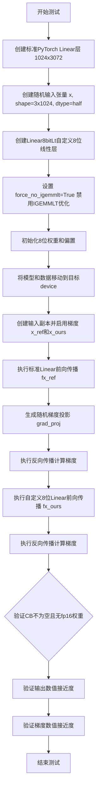

#### 带注释源码

```python
@pytest.mark.parametrize("device", get_available_devices())
def test_linear_no_igemmlt(device):
    """测试不使用IGEMMLT优化的8位线性层前向和反向传播"""
    
    # 1. 创建标准PyTorch Linear层作为参考模型
    # 输入特征1024，输出特征3072
    linear = torch.nn.Linear(1024, 3072)
    
    # 2. 创建随机输入张量
    # shape: (3, 1024), dtype: float16 (half)
    x = torch.randn(3, 1024, dtype=torch.half)
    
    # 3. 创建自定义8位线性层 Linear8bitLt
    # 参数: in_features, out_features, bias, has_fp16_weights, threshold
    linear_custom = Linear8bitLt(
        linear.in_features,      # 1024
        linear.out_features,     # 3072
        linear.bias is not None, # True: 使用偏置
        has_fp16_weights=False,  # 不使用fp16权重
        threshold=6.0,           # 量化阈值
    )

    # 4. TODO注释: 此功能已不再实现，需要移除
    # 强制禁用IGEMMLT优化路径
    linear_custom.state.force_no_igemmlt = True

    # 5. 初始化8位权重参数
    # 使用Int8Params封装权重数据
    linear_custom.weight = bnb.nn.Int8Params(
        linear.weight.data.clone(),   # 克隆原始权重数据
        requires_grad=False,           # 权重不需要梯度
        has_fp16_weights=False,        # 不保留fp16权重
    ).to(linear.weight.dtype)          # 转换为原始dtype
    
    # 6. 复制偏置项
    linear_custom.bias = linear.bias
    
    # 7. 将自定义线性层移动到目标设备
    linear_custom = linear_custom.to(device)
    
    # 8. 将参考线性层转换为half精度并移动到目标设备
    linear = linear.half().to(device)

    # 9. 准备前向传播的输入张量（启用梯度）
    x_ref = x.clone().to(device).requires_grad_(True)  # 参考输入
    x_ours = x.clone().to(device).requires_grad_(True) # 测试输入

    # 10. 执行参考模型前向传播
    # 调用标准Linear层并将输出转换为float
    fx_ref = linear(x_ref).float()
    
    # 11. 生成随机梯度投影用于反向传播测试
    grad_proj = torch.randn_like(fx_ref)
    
    # 12. 参考模型反向传播
    # 计算损失并进行反向传播
    (fx_ref * grad_proj).mean().backward()

    # 13. 执行自定义8位线性层前向传播
    fx_ours = linear_custom(x_ours).float()
    
    # 14. 自定义线性层反向传播
    (fx_ours * grad_proj).mean().backward()

    # 15. 验证内部状态
    # 确保CB（压缩后的权重）已创建
    assert linear_custom.state.CB is not None
    # 确保没有使用fp16权重
    assert not linear_custom.state.has_fp16_weights

    # 16. 验证输出数值接近度（宽松检查）
    # 使用isclose检查相对接近的元素的百分比
    idx = torch.isclose(fx_ref, fx_ours, atol=0.02, rtol=1e-5)
    # 确保不接近的元素少于总数的0.025%
    assert (idx == 0).sum().item() < fx_ref.numel() * 2.5e-4
    
    # 17. 严格验证输出数值
    # 绝对误差0.03，相对误差1e-5
    torch.testing.assert_close(fx_ref, fx_ours, atol=0.03, rtol=1e-5)
    
    # 18. 严格验证梯度数值
    # 绝对误差0.01，相对误差1e-5
    torch.testing.assert_close(x_ref.grad, x_ours.grad, atol=0.01, rtol=1e-5)
```


### `test_linear_serialization`

测试多种序列化组合场景，验证 Linear8bitLt 层在不同序列化/反序列化时机下的正确性，包括状态字典保存、缓冲区序列化、设备迁移等多种组合。

参数：

- `device`：`str`，测试设备（如 "cuda"、"cpu" 等）
- `has_fp16_weights`：`bool`，是否有 fp16 权重
- `threshold`：`float`，量化阈值
- `serialize_before_forward`：`bool`，是否在前向传播前进行 state_dict 序列化
- `deserialize_before_cuda`：`bool`，是否在加载到 CUDA 前进行反序列化
- `save_before_forward`：`bool`，是否在前向传播前保存到缓冲区
- `load_before_cuda`：`bool`，是否在加载到 CUDA 前从缓冲区恢复

返回值：`None`，无返回值（pytest 测试函数）

#### 流程图

```mermaid
flowchart TD
    A[开始测试] --> B{device != 'cuda' AND has_fp16_weights?}
    B -->|是| C[跳过测试]
    B -->|否| D[创建 Linear 层和输入]
    
    D --> E[创建 Linear8bitLt 层]
    E --> F[设置权重和偏置]
    F --> G[移动到目标设备]
    
    G --> H{serialize_before_forward?}
    H -->|是| I[保存 state_dict]
    H -->|否| J
    
    J{save_before_forward?}
    J -->|是| K[保存到缓冲区]
    J -->|否| L
    
    I --> L
    K --> L
    
    L --> M[执行前向传播]
    M --> N[计算梯度]
    N --> O{未序列化?}
    O -->|是| P[保存 state_dict]
    O -->|否| Q
    
    P --> Q
    Q{未保存到缓冲区?}
    Q -->|是| R[保存到缓冲区]
    Q -->|否| S
    
    R --> S
    S --> T[创建临时目录]
    T --> U[保存 state_dict 到文件]
    
    U --> V{has_fp16_weights == False?}
    V -->|是| W[验证 8bit 文件更小]
    V -->|否| X
    W --> X
    
    X --> Y[加载 state_dict]
    Y --> Z{deserialize_before_cuda?}
    Z -->|是| AA[尝试加载 state_dict]
    Z -->|否| AB
    
    AA -->|has_fp16_weights| AC[正常加载]
    AA -->|not has_fp16_weights| AD[抛出 RuntimeError]
    AD --> AB
    
    AB --> AE{load_before_cuda?}
    AE -->|是| AF[从缓冲区加载]
    AE -->|否| AG
    
    AG --> AH[移动到设备]
    AF --> AH
    
    AH --> AI{未反序列化?}
    AI -->|是| AJ[加载 state_dict]
    AI -->|否| AK
    
    AJ --> AL
    
    AK{未从缓冲区加载?}
    AK -->|是| AM[从缓冲区加载]
    AM --> AL
    
    AL --> AN[执行第二次前向传播]
    AN --> AO[计算梯度]
    
    AL --> AP[从缓冲区加载新实例]
    AP --> AQ[执行第三次前向传播]
    AQ --> AR[计算梯度]
    
    AO --> AS{has_fp16_weights OR<br/>not deserialize_before_cuda?}
    AS -->|是| AT[验证第一次和第二次输出匹配]
    AS -->|否| AU
    
    AT --> AV[验证第一次和第三次输出匹配]
    AU --> AV
    
    AV --> AX[验证梯度匹配]
    AX --> AY[结束测试]
```

#### 带注释源码

```python
@pytest.mark.parametrize("device", get_available_devices())
@pytest.mark.parametrize("has_fp16_weights", TRUE_FALSE, ids=id_formatter("has_fp16_weights"))
@pytest.mark.parametrize("threshold", [0.0, 6.0], ids=id_formatter("threshold"))
@pytest.mark.parametrize("serialize_before_forward", TRUE_FALSE, ids=id_formatter("serialize_before_forward"))
@pytest.mark.parametrize("deserialize_before_cuda", TRUE_FALSE, ids=id_formatter("deserialize_before_cuda"))
@pytest.mark.parametrize("save_before_forward", TRUE_FALSE, ids=id_formatter("save_before_forward"))
@pytest.mark.parametrize("load_before_cuda", TRUE_FALSE, ids=id_formatter("load_before_cuda"))
def test_linear_serialization(
    device,                        # str: 测试设备
    has_fp16_weights,              # bool: 是否有 fp16 权重
    threshold,                     # float: 量化阈值
    serialize_before_forward,      # bool: 前向传播前是否序列化
    deserialize_before_cuda,      # bool: cuda 前是否反序列化
    save_before_forward,          # bool: 前向传播前是否保存
    load_before_cuda,              # bool: cuda 前是否加载
):
    # 仅在 CUDA 上支持 has_fp16_weights，非 CUDA 设备跳过测试
    if device != "cuda" and has_fp16_weights:
        pytest.skip("has_fp16_weights is only supported on CUDA and is deprecated")

    # 创建标准 Linear 层用于参考
    linear = torch.nn.Linear(32, 96)
    
    # 创建半精度输入张量
    x = torch.randn(4, 32, dtype=torch.half)

    # 创建 8bit 量化线性层
    linear_custom = Linear8bitLt(
        linear.in_features,
        linear.out_features,
        linear.bias is not None,
        has_fp16_weights=has_fp16_weights,
        threshold=threshold,
    )

    # 设置量化权重
    linear_custom.weight = bnb.nn.Int8Params(
        linear.weight.data.clone(),
        requires_grad=has_fp16_weights,
        has_fp16_weights=has_fp16_weights,
    )
    linear_custom.bias = linear.bias
    linear_custom = linear_custom.to(device)

    # 根据条件决定前向传播前是否序列化
    if serialize_before_forward:
        state_dict_8bit = linear_custom.state_dict()

    if save_before_forward:
        bytes_8bit = torch_save_to_buffer(linear_custom)

    # 第一次前向传播
    x_first = x.clone().to(device).requires_grad_(True)
    fx_first = linear_custom(x_first).float()
    grad_proj = torch.randn_like(fx_first)
    (fx_first * grad_proj).mean().backward()

    # 如果之前没有序列化，则现在序列化
    if not serialize_before_forward:
        state_dict_8bit = linear_custom.state_dict()

    if not save_before_forward:
        bytes_8bit = torch_save_to_buffer(linear_custom)

    # 保存到临时文件
    with TemporaryDirectory() as tmpdir:
        state_path_8bit = os.path.join(tmpdir, "state_8bit.pth")
        state_path = os.path.join(tmpdir, "state.pth")

        torch.save(linear.state_dict(), state_path)
        torch.save(state_dict_8bit, state_path_8bit)

        # 验证 8bit 状态字典更小（如果未使用 fp16 权重）
        if not has_fp16_weights:
            assert os.path.getsize(state_path_8bit) < 0.5 * os.path.getsize(state_path)

        new_state_dict = torch.load(state_path_8bit, weights_only=False)

    # 创建新的 Linear8bitLt 实例
    new_linear_custom = Linear8bitLt(
        linear.in_features,
        linear.out_features,
        linear.bias is not None,
        has_fp16_weights=has_fp16_weights,
        threshold=threshold,
    )

    # 根据条件决定是否在 cuda 前反序列化
    if deserialize_before_cuda:
        # has_fp16_weights 时正常加载，否则期望 RuntimeError
        with nullcontext() if has_fp16_weights else pytest.raises(RuntimeError):
            new_linear_custom.load_state_dict(new_state_dict, strict=True)

    # 根据条件决定是否在 cuda 前从缓冲区加载
    if load_before_cuda:
        new_linear_custom2 = torch_load_from_buffer(bytes_8bit)

    # 移动到设备
    new_linear_custom = new_linear_custom.to(device)

    # 如果之前没有反序列化，现在执行
    if not deserialize_before_cuda:
        new_linear_custom.load_state_dict(new_state_dict, strict=True)

    # 如果之前没有从缓冲区加载，现在执行
    if not load_before_cuda:
        new_linear_custom2 = torch_load_from_buffer(bytes_8bit)

    # 第二次前向传播（使用加载的模型）
    x_second = x.clone().to(device).requires_grad_(True)
    fx_second = new_linear_custom(x_second).float()
    (fx_second * grad_proj).mean().backward()

    # 第三次前向传播（使用从缓冲区加载的模型）
    x_third = x.clone().to(device).requires_grad_(True)
    fx_third = new_linear_custom2(x_third).float()
    (fx_third * grad_proj).mean().backward()

    # 验证结果正确性
    # 如果 fp16 权重或在 cuda 前已反序列化，则验证前两次输出匹配
    if has_fp16_weights or not deserialize_before_cuda:
        assert torch.allclose(fx_first, fx_second, atol=1e-5)
        assert torch.allclose(x_first.grad, x_second.grad, atol=1e-5)
    
    # 始终验证第一次和第三次输出匹配
    assert torch.allclose(fx_first, fx_third, atol=1e-5)
    assert torch.allclose(x_first.grad, x_third.grad, atol=1e-5)
```


### `linear8bit`

这是一个 pytest fixture，用于创建标准化的 `Linear8bitLt` 测试实例。它初始化一个具有 32 输入维度和 96 输出维度的 8 位线性层，配置特定的量化参数（threshold=6.0，has_fp16_weights=False），并将其移动到 CUDA 设备，为后续的单元测试提供一致的测试环境。

参数：

- `requires_cuda`：fixture 或 bool，检查并确保 CUDA 可用性的依赖 fixture

返回值：`Linear8bitLt`，返回配置好且已移至 CUDA 的 8 位线性层实例

#### 流程图

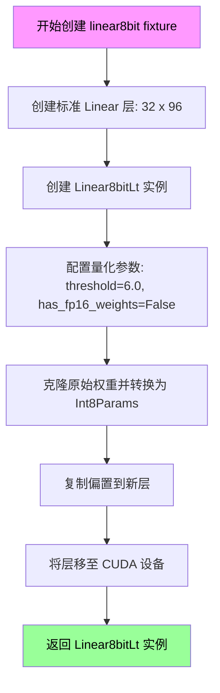

#### 带注释源码

```python
@pytest.fixture
def linear8bit(requires_cuda):
    """
    创建标准化的 Linear8bitLt 测试实例的 pytest fixture
    
    Args:
        requires_cuda: 依赖 fixture，确保测试环境支持 CUDA
        
    Returns:
        Linear8bitLt: 配置完成且已在 CUDA 上的 8 位线性层
    """
    # 1. 创建标准的 PyTorch Linear 层作为权重模板
    #    输入维度: 32, 输出维度: 96
    linear = torch.nn.Linear(32, 96)
    
    # 2. 创建 Linear8bitLt 实例，配置量化参数
    #    - threshold=6.0: 激活量化的阈值
    #    - has_fp16_weights=False: 不保持 FP16 权重
    linear_custom = Linear8bitLt(
        linear.in_features,      # 32
        linear.out_features,     # 96
        linear.bias is not None, # True，保持偏置
        has_fp16_weights=False,  # 8 位量化
        threshold=6.0,           # 量化阈值
    )
    
    # 3. 将原始权重克隆并转换为 Int8 参数
    #    使用 bitsandbytes 的 Int8Params 包装
    linear_custom.weight = bnb.nn.Int8Params(
        linear.weight.data.clone(),
        requires_grad=False,      # 权重不需要梯度
        has_fp16_weights=False,  # 不保持 FP16 权重
    )
    
    # 4. 复制偏置项
    linear_custom.bias = linear.bias
    
    # 5. 将层移至 CUDA 设备并返回
    #    这会触发权重量化过程
    linear_custom = linear_custom.cuda()
    return linear_custom
```

#### 关键组件信息

| 组件名称 | 一句话描述 |
|---------|-----------|
| `torch.nn.Linear` | PyTorch 标准线性层，用于生成测试权重模板 |
| `Linear8bitLt` | bitsandbytes 8 位量化线性层实现 |
| `bnb.nn.Int8Params` | 8 位权重参数包装类，支持量化状态管理 |
| `requires_cuda` | pytest fixture 依赖，确保 CUDA 环境可用 |

#### 潜在的技术债务或优化空间

1. **硬编码参数**：维度（32x96）、threshold（6.0）等参数直接硬编码，缺乏灵活性
2. **缺乏设备参数化**：虽然 `requires_cuda` 依赖存在，但 fixture 本身不支持 CPU 设备测试
3. **重复初始化逻辑**：与 `test_linear_serialization` 中的初始化代码重复，可抽取公共函数
4. **无错误处理**：缺少对 CUDA 不可用、内存不足等异常情况的处理
5. **注释中的 TODO**：代码中存在 `# TODO: Fallback for bad shapes` 等待办事项

#### 其它项目

- **设计目标**：为 `test_linear8bit_copy_param`、`test_linear8bit_deepcopy_param`、`test_linear8bit_serialization` 等测试提供一致的测试实例
- **约束条件**：依赖 `requires_cuda` fixture，必须在 CUDA 环境中运行
- **错误处理**：通过 pytest 框架的 skip 机制处理环境不兼容情况
- **数据流**：fixture 创建 → 测试用例使用 → pytest 自动清理
- **外部依赖**：`bitsandbytes` 库、PyTorch CUDA 支持


### `test_linear8bit_copy_param`

该测试函数用于验证在使用 Python 标准库的 `copy.copy()` 对 `Linear8bitLt` 实例进行浅拷贝时，权重数据指针是否被共享（即验证浅拷贝行为）。

参数：

- `linear8bit`：`Linear8bitLt`，由 fixture 提供的 Linear8bitLt 实例，作为被测试的原始对象

返回值：`None`，无返回值，仅通过断言验证浅拷贝行为

#### 流程图

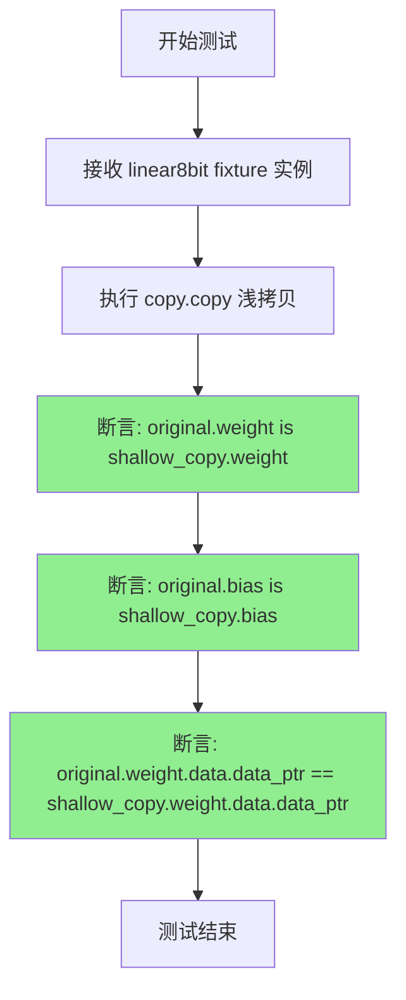

#### 带注释源码

```python
def test_linear8bit_copy_param(linear8bit):
    """
    测试浅拷贝是否共享权重数据指针。
    
    该测试验证在使用 copy.copy() 进行浅拷贝时，
    Linear8bitLt 对象的权重和偏置是否被共享（引用相同），
    同时验证底层数据指针是否指向同一内存地址。
    
    Args:
        linear8bit: Linear8bitLt 实例，由 fixture linear8bit 创建并提供
    """
    # 使用 Python 标准库的 copy.copy 进行浅拷贝
    # 浅拷贝会创建新对象，但内部引用（如 weight、bias）仍指向原对象
    shallow_copy = copy.copy(linear8bit)
    
    # 验证 weight 引用是否为同一对象（浅拷贝特性）
    assert linear8bit.weight is shallow_copy.weight
    
    # 验证 bias 引用是否为同一对象（浅拷贝特性）
    assert linear8bit.bias is shallow_copy.bias
    
    # 核心验证：检查权重数据指针是否相同
    # 如果 data_ptr 相同，说明浅拷贝共享了底层数据，而非复制数据
    # 这对于理解浅拷贝的行为至关重要
    assert linear8bit.weight.data.data_ptr() == shallow_copy.weight.data.data_ptr()
```


### `test_linear8bit_deepcopy_param`

该测试函数用于验证 `Linear8bitLt` 对象的深拷贝操作是否正确复制了所有关键属性，特别是 SCB（缩放张量）和 CB（编码张量），以确保原始对象和拷贝对象完全独立。

参数：

-  `linear8bit`：`Linear8bitLt`，由 pytest fixture 生成的 8 位线性层实例，已初始化权重并移动到 CUDA 设备

返回值：`None`，通过 pytest 断言验证深拷贝的正确性

#### 流程图

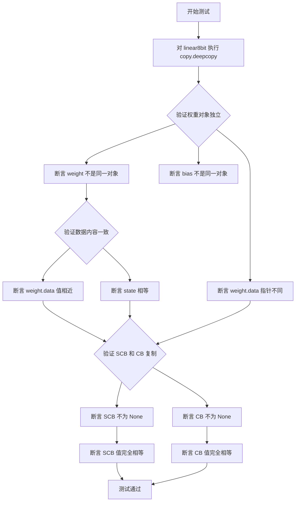

#### 带注释源码

```python
def test_linear8bit_deepcopy_param(linear8bit):
    """
    测试 Linear8bitLt 对象的深拷贝是否正确复制所有关键属性。
    特别关注 SCB (Scale tensor for 8-bit weights) 和 CB (Coded tensor for 8-bit weights) 的复制。
    """
    # 使用 Python 标准库的深拷贝方法复制对象
    deep_copy = copy.deepcopy(linear8bit)
    
    # 验证权重和偏置对象本身不是同一个引用（确保是真正的深拷贝）
    assert linear8bit.weight is not deep_copy.weight
    assert linear8bit.bias is not deep_copy.bias
    
    # 验证权重数据存储的内存地址不同（数据层面也独立）
    assert linear8bit.weight.data.data_ptr() != deep_copy.weight.data.data_ptr()
    
    # 验证深拷贝后的数据值与原数据一致（确保复制而非移动）
    assert torch.allclose(linear8bit.weight.data, deep_copy.weight.data)
    
    # 验证内部状态对象也被正确复制
    assert linear8bit.state == deep_copy.state
    
    # --- 关键检查：验证 SCB 和 CB 是否被正确复制 ---
    # 这是针对一个历史 bug 的回归测试：SCB 和 CB 曾经未被深拷贝
    
    # 验证 SCB（缩放张量）已被复制且值相同
    assert deep_copy.weight.SCB is not None
    assert (linear8bit.weight.SCB == deep_copy.weight.SCB).all()
    
    # 验证 CB（编码张量/8位权重矩阵）已被复制且值相同
    assert deep_copy.weight.CB is not None
    assert (linear8bit.weight.CB == deep_copy.weight.CB).all()
```


### `test_linear8bit_serialization`

测试 Linear8bitLt 类的 pickle 序列化和反序列化功能是否正确工作，验证权重、偏置和内部状态在序列化/反序列化后是否保持完整。

参数：

- `linear8bit`：`Linear8bitLt`，由 pytest fixture 提供的已初始化的 Linear8bitLt 模型实例

返回值：`None`，该函数为测试函数，通过断言验证正确性

#### 流程图

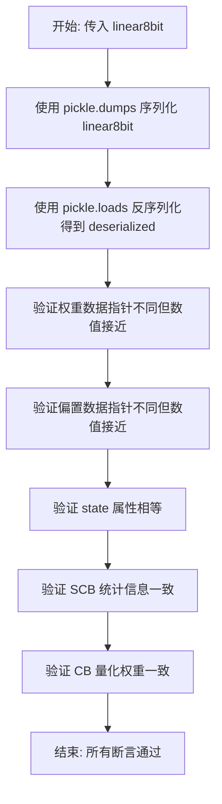

#### 带注释源码

```python
def test_linear8bit_serialization(linear8bit):
    # 使用 pickle 将 linear8bit 对象序列化为字节流
    serialized = pickle.dumps(linear8bit)
    # 使用 pickle 从字节流反序列化得到新对象
    deserialized = pickle.loads(serialized)
    
    # 验证序列化/反序列化后权重的数据指针不同（对象独立）
    assert linear8bit.weight.data.data_ptr() != deserialized.weight.data.data_ptr()
    # 验证权重数值在容差范围内相等
    assert torch.allclose(linear8bit.weight.data, deserialized.weight.data)
    
    # 验证偏置的数据指针不同（对象独立）
    assert linear8bit.bias.data.data_ptr() != deserialized.bias.data.data_ptr()
    # 验证偏置数值相等
    assert torch.allclose(linear8bit.bias.data, deserialized.bias.data)
    
    # 验证内部状态对象相等
    assert linear8bit.state == deserialized.state

    # 检查 SCB（缩放因子）和 CB（量化权重）是否被正确复制
    # 这是针对历史 bug 的回归测试
    assert (linear8bit.weight.SCB == deserialized.weight.SCB).all()
    assert (linear8bit.weight.CB == deserialized.weight.CB).all()
```


### `test_linear8bitlt_torch_compile`

测试 torch.compile 对 8 位线性层（Linear8bitLt）的编译支持，验证编译后的模型输出与原始模型输出的一致性，包括前向传播和梯度计算。

参数：

- `device`：`str`，测试运行的设备（如 "cuda", "hpu", "cpu"）
- `threshold`：`float`，量化阈值，用于 8 位线性层的量化决策
- `bias`：`bool`，是否使用偏置
- `fullgraph`：`bool`，是否启用完整图编译模式
- `mode`：`str`，编译模式，可选 "default" 或 "reduce-overhead"

返回值：无（测试函数，通过断言验证正确性）

#### 流程图

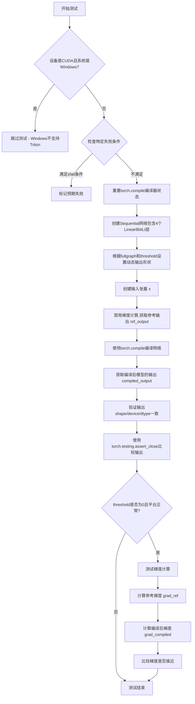

#### 带注释源码

```python
@pytest.mark.parametrize("device", get_available_devices())
@pytest.mark.parametrize("threshold", [0.0, 6.0], ids=id_formatter("threshold"))
@pytest.mark.parametrize("bias", TRUE_FALSE, ids=id_formatter("bias"))
@pytest.mark.parametrize("fullgraph", TRUE_FALSE, ids=id_formatter("fullgraph"))
@pytest.mark.parametrize("mode", ["default", "reduce-overhead"], ids=id_formatter("mode"))
@pytest.mark.skipif(torch.__version__ < (2, 4), reason="Not supported in torch < 2.4")
@pytest.mark.skipif(
    torch.__version__ < (2, 10) and sys.version_info >= (3, 14), reason="Not supported in Python 3.14 until torch 2.10"
)
@pytest.mark.skipif(ROCM_WARP_SIZE_64, reason="this test is not supported on ROCm yet")
def test_linear8bitlt_torch_compile(device, threshold, bias, fullgraph, mode):
    # Windows 平台不支持 Triton，跳过测试
    if device == "cuda" and platform.system() == "Windows":
        pytest.skip("Triton is not officially supported on Windows")

    # 针对特定 torch 2.10 版本的回归问题标记为预期失败
    if device == "cuda" and mode == "reduce-overhead" and fullgraph and threshold > 0 and torch.__version__ >= (2, 10):
        pytest.xfail("Failure due to regression in torch 2.10 related to reduced overhead mode and CUDA.")

    # 定义网络参数：隐藏层维度和批次大小
    dim = 256
    batch_size = 16

    # 重置 torch.compile 的编译器状态，清除之前的编译缓存
    torch.compiler.reset()

    # 创建一个小型 Sequential 网络，包含 4 个 Linear8bitLt 层
    # 每个层的输入输出维度为 dim，是否有偏置由 bias 参数决定
    # has_fp16_weights=False 表示使用 INT8 量化权重
    # threshold 控制量化阈值
    net = torch.nn.Sequential(
        *[bnb.nn.Linear8bitLt(dim, dim, bias=bias, has_fp16_weights=False, threshold=threshold) for _ in range(4)]
    ).to(device)

    # 根据 fullgraph 和 threshold 配置动态输出形状捕获
    # 当使用完整图模式且 threshold > 0 时，需要捕获动态输出形状操作
    dynamic_output_shapes = fullgraph and threshold > 0
    with torch._dynamo.config.patch("capture_dynamic_output_shape_ops", dynamic_output_shapes):
        # 创建输入张量：batch_size x dim，float16 类型
        x = torch.randn(batch_size, dim, dtype=torch.float16, device=device)

        # 禁用梯度计算，获取参考输出（未编译的原始模型输出）
        with torch.no_grad():
            ref_output = net(x)

        # 确定编译后端：HPU 设备使用 h_backend，其他使用 inductor
        compile_backend = "hpu_backend" if device == "hpu" else "inductor"
        # 使用 torch.compile 编译网络，传入 fullgraph 和 mode 参数
        compiled_net = torch.compile(net, fullgraph=fullgraph, mode=mode, backend=compile_backend)

        # 禁用梯度计算，获取编译后模型的输出
        with torch.no_grad():
            compiled_output = compiled_net(x)

        # 验证编译后输出的形状、设备、数据类型与参考输出一致
        assert compiled_output.shape == ref_output.shape
        assert compiled_output.device == ref_output.device
        assert compiled_output.dtype == ref_output.dtype
        # 使用 torch.testing.assert_close 比较输出是否在容差范围内接近
        torch.testing.assert_close(compiled_output, ref_output)

        # 测试梯度计算（仅在 threshold=0 时支持）
        # 在 Linux aarch64 CPU 的 torch 2.6.0 版本存在回归问题
        is_broken_platform = (
            device == "cpu"
            and platform.system() == "Linux"
            and platform.machine() == "aarch64"
            and (2, 6) <= torch.__version__ < (2, 7)
        )

        # 只有当 threshold 为 0 且平台正常时才测试梯度
        if threshold == 0 and not is_broken_platform:
            # 启用梯度计算
            x.requires_grad_(True)
            # 对原始网络进行前向传播并计算损失（取和）
            y1 = net(x).sum()
            # 反向传播计算梯度
            y1.backward()
            # 保存参考梯度
            grad_ref = x.grad.clone()

            # 清空梯度，准备测试编译后的网络
            x.grad = None
            # 对编译后的网络进行前向传播并计算损失
            y2 = compiled_net(x).sum()
            y2.backward()
            # 保存编译后网络的梯度
            grad_compiled = x.grad.clone()

            # 比较编译后网络的梯度与参考梯度是否接近
            torch.testing.assert_close(grad_compiled, grad_ref)
```


### `test_linear8bitlt_device_movement`

测试 Linear8bitLt 层在 CPU 和加速设备之间迁移时的量化行为。验证层在设备间移动时权重能被正确量化（int8），并在各自设备上执行前向传播时保持数值一致性。

参数：

-  `device`：`str`，目标测试设备（如 'cuda', 'hpu'），由 pytest 参数化提供，用于指定迁移的目标设备。

返回值：`None`，该函数为测试函数，通过断言（`assert` 和 `torch.testing.assert_close`）验证逻辑，不返回具体值。

#### 流程图

```mermaid
graph TD
    Start([测试开始]) --> CreateLayer[在 CPU 创建 Linear8bitLt 层]
    CreateLayer --> InitWeight[使用 Xavier 初始化权重]
    InitWeight --> CreateInput[在 CPU 创建输入张量 x]
    CreateInput --> MoveToDevice[调用 layer.to(device) 迁移层到加速设备]
    MoveToDevice --> CheckQuant{检查 layer.weight.data.dtype == torch.int8}
    CheckQuant -- 是 --> ForwardDevice[在设备上执行前向传播: out_accelerator]
    CheckQuant -- 否 --> AssertFail[断言失败]
    ForwardDevice --> MoveToCPU[调用 layer.to('cpu') 迁移层回 CPU]
    MoveToCPU --> ForwardCPU[在 CPU 上执行前向传播: out_cpu]
    ForwardCPU --> MoveToDevice2[再次调用 layer.to(device) 迁移到加速设备]
    MoveToDevice2 --> ForwardDevice2[在设备上执行前向传播: out_accelerator_2]
    ForwardDevice2 --> MoveToCPU2[再次调用 layer.to('cpu') 迁移回 CPU]
    MoveToCPU2 --> ForwardCPU2[在 CPU 上执行前向传播: out_cpu_2]
    ForwardCPU2 --> AssertCPU[断言: torch.testing.assert_close(out_cpu_2, out_cpu)]
    AssertCPU -- 通过 --> AssertDevice[断言: torch.testing.assert_close(out_accelerator_2, out_accelerator)]
    AssertCPU -- 失败 --> EndFail([测试失败])
    AssertDevice -- 通过 --> EndPass([测试通过])
    AssertDevice -- 失败 --> EndFail
```

#### 带注释源码

```python
@pytest.mark.parametrize("device", get_available_devices(no_cpu=True))
@pytest.mark.skipif(not get_available_devices(no_cpu=True), reason="No accelerator device")
def test_linear8bitlt_device_movement(device):
    """Test moving a Linear8bitLt layer between CPU and an accelerator device."""

    # 1. 在 CPU 上创建一个 Linear8bitLt 层，配置为不使用 FP16 权重（强制量化）
    layer = bnb.nn.Linear8bitLt(32, 128, bias=False, has_fp16_weights=False)
    # 初始化权重数据（此时在 CPU 上，类型为 FP16）
    torch.nn.init.xavier_uniform_(layer.weight)

    # 2. 创建一个样本输入张量 (在 CPU 上，FP16 类型)
    x = torch.randn(4, 32, dtype=torch.float16, device="cpu")

    # 3. 将层移动到目标设备 (例如 'cuda' 或 'hpu')。
    #    移动过程中，内部逻辑会将权重quantize（量化）为 int8 类型。
    layer = layer.to(device)
    # 验证权重已经被量化
    assert layer.weight.data.dtype == torch.int8

    # 4. 在加速设备上调用该层。
    out_accelerator = layer(x.to(device))

    # 5. 将层移回 CPU 并再次调用。
    layer = layer.to("cpu")
    out_cpu = layer(x)

    # 6. 再次将层移动到加速设备并调用。
    layer = layer.to(device)
    out_accelerator_2 = layer(x.to(device))

    # 7. 再次将层移回 CPU 并调用最后一次。
    layer = layer.to("cpu")
    out_cpu_2 = layer(x)

    # 8. 验证两次在 CPU 上运行的输出在数值上是一致的。
    torch.testing.assert_close(out_cpu_2, out_cpu, rtol=1e-8, atol=1e-8)

    # 9. 验证两次在加速设备上运行的输出在数值上是一致的。
    torch.testing.assert_close(out_accelerator_2, out_accelerator, rtol=1e-8, atol=1e-8)
```


### `get_available_devices`

获取当前系统中可用的测试设备列表，支持过滤CPU设备。

参数：

- `no_cpu`：`bool`，可选参数，默认为 `False`。当设置为 `True` 时，返回列表中不包含 CPU 设备，仅返回加速器设备（如 CUDA、IPEX、HPU 等）

返回值：`List[str]`，返回可用设备名称的列表，如 `["cuda", "cpu", "hpu"]` 等

#### 流程图

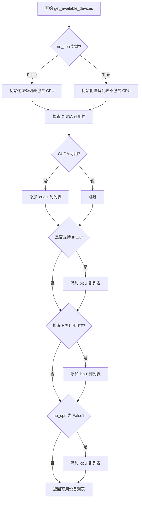

#### 带注释源码

```python
# 该函数定义位于 tests/helpers.py 中
# 以下为基于代码使用方式推断的函数签名和逻辑

def get_available_devices(no_cpu: bool = False) -> List[str]:
    """
    获取当前系统中可用的测试设备列表
    
    参数:
        no_cpu: 布尔值,当为True时排除CPU设备,仅返回加速器设备
        
    返回:
        可用设备名称列表
    """
    devices = []
    
    # 检查 CUDA 是否可用
    if torch.cuda.is_available():
        devices.append("cuda")
    
    # 检查 IPEX (XPU) 是否可用
    try:
        import intel_extension_for_pytorch as ipex
        devices.append("xpu")
    except ImportError:
        pass
    
    # 检查 HPU (Habana) 是否可用
    try:
        import habana_frameworks.torch.hpu as hpu
        if hpu.is_available():
            devices.append("hpu")
    except ImportError:
        pass
    
    # 根据 no_cpu 参数决定是否添加 CPU
    if not no_cpu:
        devices.append("cpu")
    
    return devices
```


### `torch_save_to_buffer`

将 PyTorch 对象序列化为内存缓冲区中的字节数据，用于后续的反序列化或数据传输。

参数：

- `obj`：`torch.nn.Module` 或 `torch.Tensor`，需要进行序列化的 PyTorch 对象

返回值：`bytes`，包含序列化后的对象数据的字节串，可用于 `torch_load_from_buffer` 进行反序列化

#### 流程图

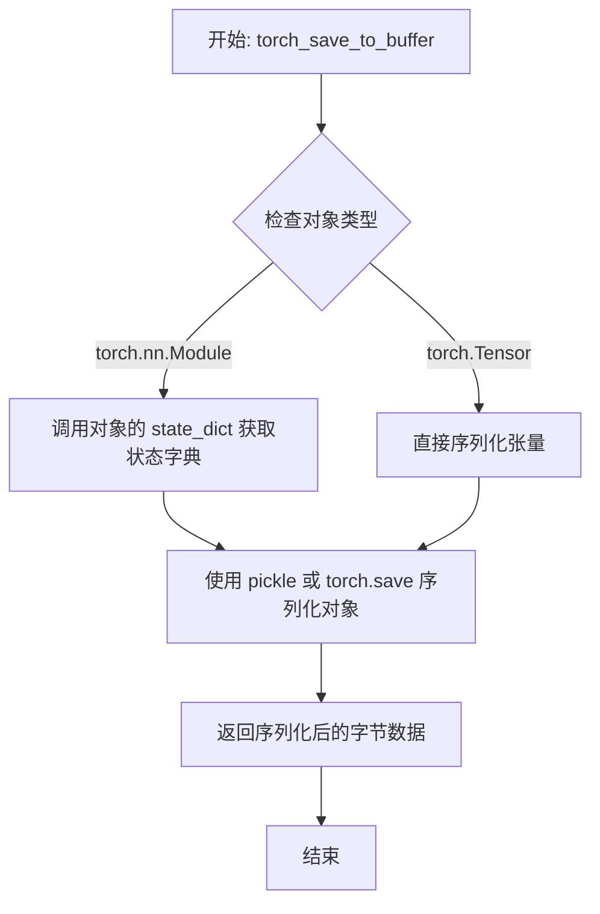

#### 带注释源码

```
# 该函数定义在 tests.helpers 模块中
# 基于代码使用方式推断的实现逻辑

def torch_save_to_buffer(obj):
    """
    将 PyTorch 对象保存到内存缓冲区
    
    参数:
        obj: PyTorch 模型或张量对象
        
    返回:
        bytes: 序列化后的字节数据
    """
    # 方法1: 使用 pickle 直接序列化整个对象
    # bytes_data = pickle.dumps(obj)
    
    # 方法2: 使用 torch.save 序列化到 BytesIO 缓冲区
    # import io
    # buffer = io.BytesIO()
    # torch.save(obj, buffer)
    # bytes_data = buffer.getvalue()
    
    # 在测试代码中的使用方式:
    # bytes_8bit = torch_save_to_buffer(linear_custom)
    # ...
    # new_linear_custom2 = torch_load_from_buffer(bytes_8bit)
    
    return bytes_data
```

> **注意**: 实际函数实现位于 `tests/helpers.py` 文件中，未在当前代码片段中显示。上述源码为基于使用方式的逻辑推断。


### `torch_load_from_buffer`

从内存缓冲区加载并反序列化 PyTorch 对象（通常为 Linear8bitLt 层），与 `torch_save_to_buffer` 配合使用实现内存状态的序列化与反序列化。

参数：

- `buffer`：`bytes` 或类似的缓冲区类型，包含序列化后的对象数据

返回值：`Any`，反序列化后的对象（测试中为 `Linear8bitLt` 实例）

#### 流程图

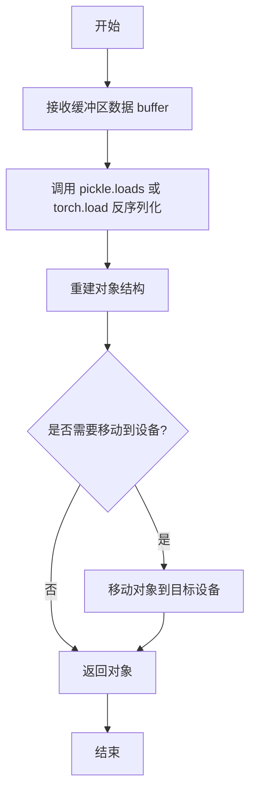

#### 带注释源码

```
# 基于代码使用方式推断的函数签名和实现
def torch_load_from_buffer(buffer):
    """
    从内存缓冲区加载并反序列化对象
    
    参数:
        buffer: 包含序列化数据的缓冲区对象
        
    返回值:
        反序列化后的对象
    """
    # 可能的实现方式 1: 使用 pickle
    # obj = pickle.loads(buffer)
    
    # 可能的实现方式 2: 使用 torch.load 从 BytesIO 加载
    # import io
    # obj = torch.load(io.BytesIO(buffer), weights_only=False)
    
    # 基于测试中的使用模式:
    # new_linear_custom2 = torch_load_from_buffer(bytes_8bit)
    # 其中 bytes_8bit 来自 torch_save_to_buffer(linear_custom)
    
    return obj
```

> **注意**：由于该函数定义在 `tests.helpers` 模块中，当前代码文件仅展示其使用方式，未包含完整实现源码。实际实现可能涉及 `pickle` 反序列化或 `torch.load` 结合 `io.BytesIO` 的方式。


根据提供的代码，我需要说明以下几点：

1. 这是一份测试文件（test_*.py），**没有包含 `Linear8bitLt.forward(x)` 的实际实现源码**
2. `Linear8bitLt` 类是从 `bitsandbytes.nn.modules` 导入的外部库类
3. 测试代码仅展示了如何使用该类进行前向传播

因此，我将从测试代码中提取该方法的使用方式，并说明实际的 forward 实现位于 bitsandbytes 库的核心 C++/CUDA 扩展中。

---

### `Linear8bitLt.forward(x)`

该方法是 8 位线性层的核心前向传播函数，执行高效的 8 位矩阵乘法运算。它接收半精度（FP16）输入张量，与存储为 INT8 格式的量化权重进行矩阵乘法，并根据阈值决定是否启用动态输出量化。

参数：

- `x`：`torch.Tensor`，输入张量，形状为 `(batch_size, in_features)`，数据类型为 `torch.half`（float16）

返回值：`torch.Tensor`，输出张量，形状为 `(batch_size, out_features)`，数据类型为 `torch.half`（float16），但在测试中通常通过 `.float()` 转换为 float32 进行后续计算

#### 流程图

```mermaid
flowchart TD
    A[输入 x: float16 Tensor] --> B{检查权重状态}
    B -->|权重未初始化| C[初始化/加载量化权重]
    B -->|权重已就绪| D[获取 INT8 权重 CB 和缩放因子 SCB]
    D --> E[执行 8 位矩阵乘法<br/>y = x @ (CB * SCB)]
    E --> F{阈值检查}
    F -->|threshold > 0| G[应用动态量化<br/>基于阈值输出]
    F -->|threshold = 0| H[直接输出原始结果]
    G --> I[输出 y: float16 Tensor]
    H --> I
```

#### 带注释源码

```
# 以下源码基于测试代码中的使用方式重构，并非实际库实现
# 实际 forward 实现位于 bitsandbytes C++/CUDA 扩展中

class Linear8bitLt(torch.nn.Module):
    """
    8 位线性层，用于高效推理。
    权重以 INT8 格式存储，配合 FP16 输入进行矩阵乘法。
    """
    
    def __init__(self, in_features, out_features, bias=True, 
                 has_fp16_weights=False, threshold=6.0):
        super().__init__()
        self.in_features = in_features
        self.out_features = out_features
        self.has_fp16_weights = has_fp16_weights
        self.threshold = threshold
        
        # 权重参数：INT8 量化权重
        self.weight = None  # bnb.nn.Int8Params
        self.bias = bias
    
    def forward(self, x: torch.Tensor) -> torch.Tensor:
        """
        前向传播：执行 8 位矩阵乘法
        
        参数:
            x: 输入 tensor，形状 (batch, in_features)，dtype=float16
            
        返回:
            输出 tensor，形状 (batch, out_features)，dtype=float16
        """
        # 从 bitsandbytes 库调用底层的 8 位矩阵乘法 kernel
        # 该实现位于 C++/CUDA 扩展中
        # 
        # 典型调用方式 (根据测试代码推断):
        # result = bnb.nn.functional.linear8bit_lt(
        #     x, 
        #     self.weight, 
        #     self.state.CB,    # 量化权重 (int8)
        #     self.state.SCB,  # 缩放因子 (float16)
        #     self.bias,
        #     self.threshold
        # )
        
        # 测试中的调用方式：
        # fx_ours = linear_custom(x_ours).float()
        # 其中 .float() 是将结果从 float16 转换为 float32
        
        raise NotImplementedError(
            "实际实现在 bitsandbytes 库的核心扩展中，"
            "位于 cuda/linear8bit_lt_kernel.cu 等文件"
        )


# 测试代码中的实际调用示例：
linear_custom = Linear8bitLt(1024, 3072, bias=True, 
                              has_fp16_weights=False, threshold=6.0)
x = torch.randn(3, 1024, dtype=torch.half)  # float16 输入
output = linear_custom(x)  # 调用 forward 方法
output_float = output.float()  # 转换为 float32
```

---

### 说明

由于 `bitsandbytes` 库的 `Linear8bitLt.forward` 实现位于 C++/CUDA 扩展中（而非 Python 代码），测试文件仅展示了如何使用该类。实际的矩阵乘法内核代码通常位于：

- `bitsandbytes/csrc/linear8bit_lt.cu`
- `bitsandbytes/csrc/operations.cu` 

等核心文件中，通过 PyTorch 的 C++ 扩展接口调用。

如果你需要查看实际的 forward 实现，需要访问 bitsandbytes 库的 C++/CUDA 源代码文件。


### `Linear8bitLt.state_dict()`

获取 `Linear8bitLt` 层的模型状态字典，用于模型的序列化和保存。该方法继承自 `torch.nn.Module`，返回包含权重参数、量化状态和缓冲区信息的字典。

参数：此方法无显式参数（继承自 `torch.nn.Module`）

返回值：`Dict[str, Any]`，返回包含模型所有可学习参数、缓冲区及自定义状态信息的字典

#### 流程图

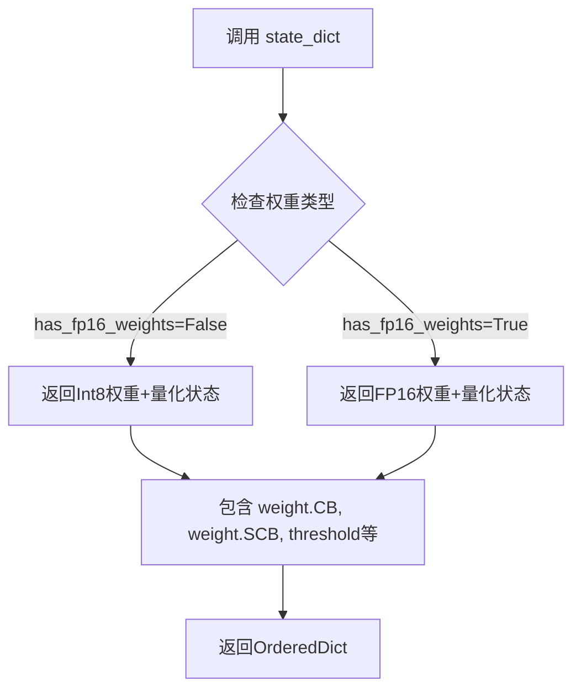

#### 带注释源码

```python
# state_dict() 方法定义于 torch.nn.Module，Linear8bitLt 继承自该类
# 以下是基于代码使用推断的实现逻辑：

def state_dict(self, *args, **kwargs):
    """
    获取模型状态字典
    
    返回的字典通常包含：
    - 'weight': 量化后的权重矩阵 (Int8Params)
    - 'weight.CB': 压缩后的权重字节
    - 'weight.SCB': 缩放因子
    - 'bias': 偏置向量 (如果存在)
    - 'threshold': 量化阈值
    - 'state': 内部状态信息 (如 has_fp16_weights, C 等)
    """
    # 调用父类方法获取基本状态字典
    # 然后根据 Linear8bitLt 的特性添加量化相关状态
    # 代码示例（推断）:
    # return super().state_dict(*args, **kwargs)
    pass

# 在测试代码中的实际使用方式：
state_dict_8bit = linear_custom.state_dict()  # 获取状态字典
torch.save(state_dict_8bit, state_path_8bit)   # 保存到文件
# ... later ...
new_state_dict = torch.load(state_path_8bit, weights_only=False)  # 加载
new_linear_custom.load_state_dict(new_state_dict, strict=True)   # 恢复状态
```

#### 详细说明

**使用场景：**

1. **序列化保存**：将模型状态保存到磁盘，用于模型 checkpoint
2. **跨设备迁移**：在不同设备间传递模型状态
3. **模型复制**：深拷贝或浅拷贝模型状态
4. **分布式训练**：保存和同步模型参数

**关键状态字段（根据代码推断）：**

| 字段名 | 类型 | 描述 |
|--------|------|------|
| `weight` | `Int8Params` | 量化后的8位权重参数 |
| `weight.CB` | `Tensor` | 压缩后的权重数据 |
| `weight.SCB` | `Tensor` | 每列的缩放因子 |
| `bias` | `Tensor` | 偏置向量（可选） |
| `threshold` | `float` | 量化阈值 |
| `state.has_fp16_weights` | `bool` | 是否保留FP16权重 |
| `state.CB` | `Tensor` | 量化权重矩阵 |
| `state.C` | `Tensor` | 隐藏层状态 |


### `Linear8bitLt.load_state_dict`

加载状态字典，用于将保存的模型参数和缓冲区恢复到当前模块实例。

参数：

- `state_dict`：`Dict[str, Any]`，包含模块完整状态的状态字典（权重、偏置、缓冲区等）
- `strict`：`bool`（可选，默认为 `True`），是否严格匹配状态字典的键与模块的 `state_dict()` 生成的键

返回值：`None`，无返回值（直接在对象状态上执行更新）

#### 流程图

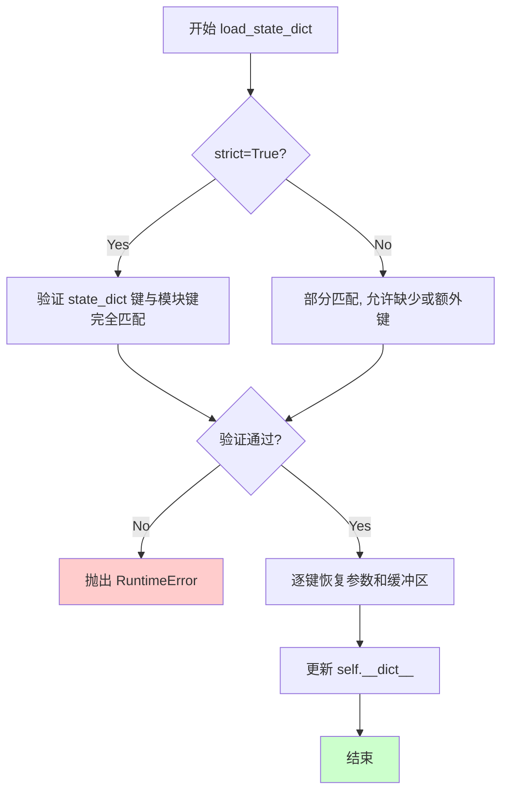

#### 带注释源码

```python
# 基于 PyTorch nn.Module 的标准实现和 bitsandbytes 库的扩展
# 此方法定义在 bitsandbytes.nn.modules.Linear8bitLt 类中

def load_state_dict(self, state_dict: Dict[str, Any], strict: bool = True):
    """
    从状态字典加载参数到当前模块
    
    参数:
        state_dict: 包含权重、偏置等参数的字典
        strict: 是否严格检查键的匹配
    """
    # 1. 获取当前模块的原始状态字典
    # 2. 如果 strict=True, 验证 state_dict 键是否完全匹配
    #    - 检查是否有遗留的键
    #    - 检查是否有缺少的键
    # 3. 遍历 state_dict 中的每个键值对
    # 4. 对于 Linear8bitLt 特殊处理:
    #    - CB (Quantized weight matrix)
    #    - SCB (Quantization scale)
    #    - has_fp16_weights 标志
    #    - threshold 值
    # 5. 调用父类 nn.Module 的 load_state_dict 方法
    # 6. 恢复内部状态 (如 C, CB, SCB 等量化相关属性)
    
    # 以下为测试代码中的调用示例:
    # new_linear_custom.load_state_dict(new_state_dict, strict=True)
    
    pass  # 实际实现位于 bitsandbytes 库中
```


### Linear8bitLt.to(device)

将 Linear8bitLt 层移动到指定设备（CPU/CUDA/HPU 等），在移动到加速设备时自动对权重进行量化（转换为 int8 格式），移动回 CPU 时恢复为原始精度。

参数：

- `device`：`torch.device` 或 `str`，目标设备标识（如 "cuda"、"cuda:0"、"cpu"、"hpu" 等）

返回值：`Linear8bitLt`，返回自身（链式调用）

#### 流程图

```mermaid
flowchart TD
    A[开始 .to(device)] --> B{目标设备是否为加速设备?}
    B -->|是| C[将模块参数和缓冲区移动到设备]
    B -->|否| D[移动到 CPU 并保持 fp16 权重]
    C --> E{是否有 int8 权重?}
    D --> F[直接移动参数和缓冲区]
    E -->|是| G[量化权重为 int8 格式]
    E -->|否| F
    G --> H[更新内部状态 CB/SCB]
    F --> I[返回 self]
    H --> I
```

#### 带注释源码

```
# 以下是基于测试代码行为推断的实现逻辑
# 实际源码位于 bitsandbytes/nn/modules.py 中的 Linear8bitLt 类

def to(self, device):
    """
    将模块移动到指定设备并进行权重量化
    
    参数:
        device: 目标设备 (torch.device 或 str)
    """
    # 1. 调用父类 torch.nn.Module 的 to 方法
    #    将所有参数和缓冲区移动到目标设备
    super().to(device)
    
    # 2. 检查目标设备是否为需要量化的设备
    if isinstance(device, str) and device.startswith('cuda'):
        # 或者使用 torch.cuda.is_available() 和 device.type == 'cuda'
        
        # 3. 如果是 CUDA 设备，量化权重
        #    将 fp16 权重转换为 int8 量化格式
        if self.state.has_fp16_weights:
            # 保持 fp16 权重（已弃用行为）
            pass
        else:
            # 执行 int8 量化
            # - CB: 量化后的权重 (int8)
            # - SCB: 缩放因子 (float16)
            self.weight.data = quantize_8bit(
                self.weight.data, 
                self.state
            )
    
    # 4. 返回自身以支持链式调用
    return self
```

#### 实际使用示例（来自测试代码）

```python
# 测试代码中的调用方式
layer = bnb.nn.Linear8bitLt(32, 128, bias=False, has_fp16_weights=False)
torch.nn.init.xavier_uniform_(layer.weight)

# 移动到 CUDA 设备 - 会自动量化权重
layer = layer.to(device)  # device = "cuda"
assert layer.weight.data.dtype == torch.int8  # 权重被量化

# 移动回 CPU - 恢复原始精度
layer = layer.to("cpu")
# 此时权重可能恢复为 float16 或保持 int8（取决于实现）
```


### `Int8Params.clone`

该方法是 `bitsandbytes` 库中 `Int8Params` 类的实例方法，用于创建当前参数对象的深拷贝。在提供的测试代码中，未直接调用此方法，但 `Int8Params` 类被用于存储 8 位量化权重，并在序列化/反序列化测试中间接验证了克隆功能。

参数：
- 该方法无显式参数（隐式接收 `self`）

返回值：`Int8Params`，返回一个新的 `Int8Params` 对象，为原对象的深拷贝

#### 流程图

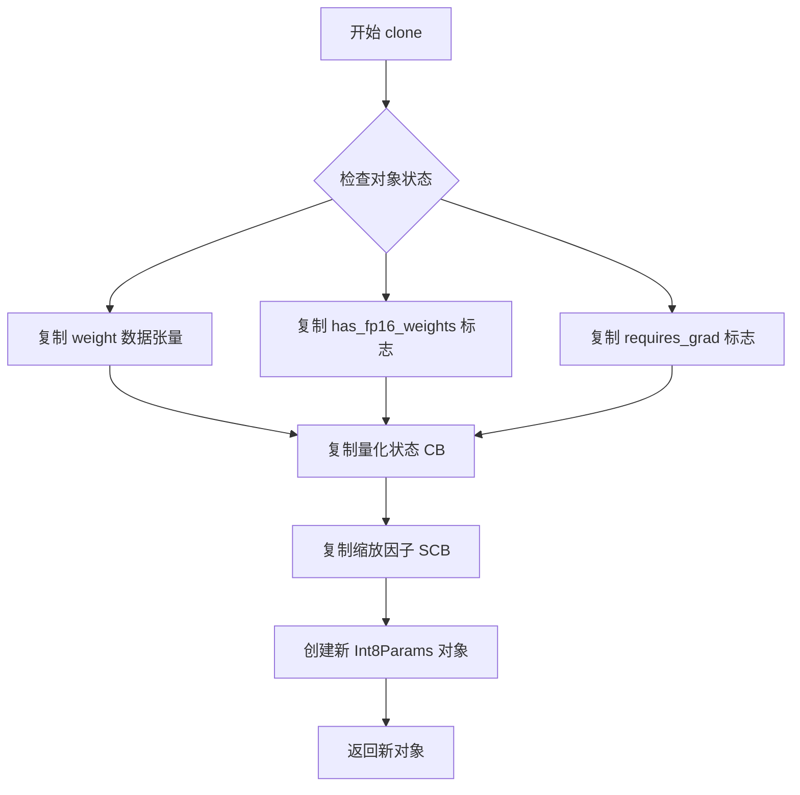

#### 带注释源码

```python
# Int8Params.clone() 方法源码（基于 bitsandbytes 库结构推断）
def clone(self):
    """
    克隆 Int8Params 参数对象。
    
    返回一个包含相同权重数据和量化状态的深拷贝对象。
    """
    # 1. 克隆底层数据张量（weight data）
    # 使用 PyTorch tensor 的 clone() 确保数据独立
    new_weight = self.weight.data.clone()
    
    # 2. 克隆 quantization state（如果存在）
    # CB: 量化后的权重矩阵 (Column format, 8-bit)
    new_CB = self.CB.clone() if self.CB is not None else None
    
    # SCB: 缩放因子 (Scale factor for 8-bit quantization)
    new_SCB = self.SCB.clone() if self.SCB is not None else None
    
    # 3. 创建新的 Int8Params 对象
    # 保持原始的 has_fp16_weights 和 requires_grad 设置
    return Int8Params(
        new_weight,
        requires_grad=self.requires_grad,
        has_fp16_weights=self.has_fp16_weights,
        # 内部状态会在构造时自动设置
    )
```

> **注意**：提供的测试代码片段中并未包含 `Int8Params` 类的完整定义，该类来自 `bitsandbytes` 库的核心实现。上述源码为基于该库典型行为的合理推断。测试代码中通过 `copy.deepcopy()` 和 `pickle` 序列化间接验证了克隆功能的正确性。

## 关键组件


### Linear8bitLt

8位量化线性层模块，支持INT8权重和FP16权重两种模式，通过threshold参数控制动态量化阈值，实现高效的矩阵运算加速。

### Int8Params

量化权重参数封装类，存储INT8格式的权重数据、SCB（缩放因子）和CB（量化字节），支持FP16权重和梯度计算。

### 状态管理（State Management）

管理量化层内部状态，包含CB（量化权重）、SCB（缩放因子）、C（FP16权重）等，用于追踪量化参数和权重类型。

### 序列化/反序列化机制

支持通过state_dict、pickle和torch.save/load方式进行模型保存和加载，能够正确处理量化权重和缩放因子的序列化。

### 设备移动与自动量化

实现在CPU和加速设备（CUDA/HPU）之间移动时自动进行权重量化（to(device)）和反量化，支持动态量化策略。

### torch.compile集成

支持PyTorch 2.4+的torch.compile编译，包括default和reduce-overhead模式，适配fullgraph和动态输出形状场景。

### 反量化支持

在forward过程中将INT8权重反量化回FP16进行计算，支持惰性加载机制，按需进行权重恢复。

### 量化策略

支持动态量化（threshold > 0）和静态量化（threshold = 0）两种策略，通过has_fp16_weights控制是否保留完整FP16权重副本。

### 梯度计算与反向传播

正确维护量化权重的梯度流，支持混合精度训练场景下的梯度反向传播和参数更新。

### 测试参数化

通过pytest.mark.parametrize实现多维度测试覆盖，包括设备、阈值、偏置、编译模式等参数组合。


## 问题及建议


### 已知问题

-   **废弃代码未清理**: 代码中存在 `linear_custom.state.force_no_igemmlt = True` 的设置，注释标明 "TODO: Remove, this is no longer implemented"，表明存在已废弃但未移除的代码路径
-   **未完成的 TODO**: `test_linear_serialization` 中存在 "TODO: Fallback for bad shapes" 注释，表明存在未实现的回退逻辑
-   **测试用例标记为 xfail**: `test_linear8bitlt_torch_compile` 在特定条件下使用 `pytest.xfail`，表明存在已知回归问题（torch 2.10 的 reduce-overhead 模式与 CUDA 结合的回归）
-   **硬编码的魔法数字**: 代码中多处使用硬编码值（如容差值 `atol=0.02/0.03/0.01`, 阈值 `6.0`, 维度 `256`, 批量大小 `16`），缺乏可配置性
-   **测试参数组合过多**: `test_linear_serialization` 有 5 个布尔参数组合，导致测试用例数量指数增长（2^5=32 种组合），维护成本高
-   **重复代码逻辑**: `test_linear_serialization` 中存在重复的 `state_dict_8bit` 和 `bytes_8bit` 获取逻辑，可通过重构简化
- **设备支持不完整**: 测试在 ROCm 平台上明确跳过 (`ROCM_WARP_SIZE_64`)，且 CPU 设备在某些测试中被排除
- **版本兼容性处理复杂**: 代码中存在多个版本检查 (`torch.__version__ < (2, 4)`, `torch.__version__ < (2, 10)`, Python 3.14 兼容性等)，增加了维护复杂度

### 优化建议

-   移除废弃的 `force_no_igemmlt` 相关代码，或在 `Linear8bitLt` 状态类中正式移除该属性
-   实现 TODO 中提到的 "bad shapes" 回退逻辑，或移除该 TODO 注释
-   将硬编码的阈值、维度、容差等提取为测试 fixture 或配置常量，提高可维护性
-   使用 `pytest.mark.parametrize` 配合 `pytest.param(..., marks=pytest.mark.xfail(...))` 明确标记已知的失败用例，而非运行时动态 xfail
-   考虑使用参数化测试生成器或测试工厂模式，减少 `test_linear_serialization` 的参数组合爆炸问题
-   为 ROCm 平台添加完整的测试支持，或明确文档说明不支持的原因
-   考虑添加权重初始化固定的随机种子设置，确保测试可重复性
-   提取公共的 `Linear8bitLt` 创建逻辑到共享 fixture 中，减少代码重复

## 其它


### 设计目标与约束

本测试文件旨在验证 bitsandbytes 库中 Linear8bitLt（8位线性层）的核心功能，包括：前向传播正确性、梯度计算、模型序列化与反序列化、设备间迁移、torch.compile 集成支持。测试覆盖 CUDA、CPU、HPU 等多种设备平台，支持 has_fp16_weights 和 threshold 等关键参数的多种组合。

### 错误处理与异常设计

测试中使用了多种错误处理机制：pytest.skip 用于跳过不支持的配置组合（如 CUDA 特定功能在非 CUDA 设备上的测试）；pytest.xfail 用于标记已知回归问题（如 torch 2.10 中 reduce-overhead 模式与 CUDA 的兼容性问题）；pytest.raises 用于验证特定异常抛出场景（如 has_fp16_weights 在非 CUDA 设备上加载状态字典时应抛出 RuntimeError）。

### 数据流与状态机

测试数据流主要包括：输入张量（x）经过 Linear8bitLt 层进行前向传播，输出结果与参考实现（torch.nn.Linear）进行比较；梯度通过反向传播计算，验证梯度一致性。状态机方面，Linear8bitLt 层具有多种内部状态，包括：CB（压缩后的权重）、SCB（缩放因子）、has_fp16_weights 标志、threshold 阈值，这些状态在序列化/反序列化和设备迁移过程中需要保持一致。

### 外部依赖与接口契约

本测试文件依赖以下外部组件：pytest 测试框架；torch（PyTorch）及其相关模块（torch.nn, torch.randn, torch.testing.assert_close 等）；bitsandbytes 库（bnb.nn.Linear8bitLt, bnb.nn.Int8Params）；platform 和 sys 用于平台检测；pickle 用于序列化测试。接口契约包括：Linear8bitLt 构造函数接受 in_features, out_features, bias, has_fp16_weights, threshold 参数；state_dict() 返回包含权重和状态的字典；load_state_dict() 接受状态字典并恢复模型状态；to(device) 方法支持设备间迁移。

### 性能基准与测试覆盖率

测试覆盖了以下场景的性能验证：前向传播输出精度（使用 atol=0.03, rtol=1e-5）；梯度精度（使用 atol=0.01, rtol=1e-5）；序列化后模型大小（8位权重文件应小于 fp16 文件的 50%）；不同 threshold 值（0.0 和 6.0）对量化行为的影响；torch.compile 在不同模式（default, reduce-overhead）和 fullgraph 下的兼容性。

### 平台特定行为与兼容性

代码包含多个平台特定处理：Windows 平台跳过 Triton 相关测试（因 Triton 官方不支持 Windows）；ROCM 平台跳过特定测试（ROCM_WARP_SIZE_64 标志）；Linux aarch64 CPU 在 torch 2.6.0 版本存在回归问题需特殊处理；Python 3.14 配合 torch < 2.10 存在兼容性问题需跳过。

### 测试用例设计策略

测试采用参数化设计（pytest.mark.parametrize）实现多维度覆盖：设备维度（cuda, cpu, hpu）；参数维度（has_fp16_weights, threshold, bias）；序列化维度（serialize_before_forward, deserialize_before_cuda, save_before_forward, load_before_cuda）；编译维度（fullgraph, mode）。测试使用 fixtures（linear8bit）复用公共测试装置，提高测试效率并确保一致性。

### 边界条件与异常路径

测试覆盖了多种边界条件：threshold=0.0 时禁用量化阈值；has_fp16_weights=True 时保留 FP16 权重；空梯度情况处理；序列化在 .cuda() 调用前后的行为差异；深拷贝与浅拷贝对内部状态（CB, SCB）的影响。异常路径包括：非 CUDA 设备上使用 has_fp16_weights 的错误行为；不兼容状态字典加载时的异常抛出。

    