# `bitsandbytes\tests\test_modules.py` 详细设计文档

该代码是一个全面的测试套件，用于验证 bitsandbytes 库中量化神经网络层（包括 8bit、4bit、NF4、FP4 线性层和嵌入层）的正确性、梯度传播、权重转换以及在 CPU、CUDA、HPU 等设备上的推理和训练兼容性。

## 整体流程

```mermaid
graph TD
    Start[测试开始] --> Config[参数化配置 (device, dtype, module type)]
    Config --> InitModel[初始化模型]
    InitModel --> CopyWeights[同步权重 (Reference -> Quantized)]
    CopyWeights --> Loop{迭代测试 (100次)}
    Loop --> Forward[前向传播]
    Forward --> Loss[计算Loss]
    Loss --> Backward[反向传播]
    Backward --> Check[梯度/输出校验]
    Check --> Assert{断言结果}
    Assert -->|通过| Next[结束/下一测试]
    Assert -->|失败| Error[抛出 AssertionError]
```

## 类结构

```
MockArgs (模拟参数对象)
MLP8bit (双层8bit量化MLP模型)
└── fc1: bnb.nn.Linear8bitLt
└── fc2: bnb.nn.Linear8bitLt
```

## 全局变量及字段


### `module_dict`
    
包含不同量化类型的线性层模块的字典，用于测试参数化

类型：`dict[str, Any]`
    


### `MockArgs.quant_type`
    
动态属性：量化类型参数，用于指定量化方法

类型：`str`
    


### `MockArgs.use_8bit_training`
    
动态属性：8位训练模式参数，控制是否使用8位训练

类型：`str`
    


### `MockArgs.clip_freq`
    
动态属性：剪切频率参数，用于频率剪切

类型：`int`
    


### `MLP8bit.fc1`
    
第一个8位量化全连接层

类型：`bnb.nn.Linear8bitLt`
    


### `MLP8bit.fc2`
    
第二个8位量化全连接层

类型：`bnb.nn.Linear8bitLt`
    
    

## 全局函数及方法


### `get_args`

该函数是一个全局辅助函数，用于创建并返回一个配置了量化训练相关参数的 MockArgs 对象，主要服务于测试场景中模拟训练参数的需求。

参数： 无

返回值：`MockArgs`，返回一个封装了量化训练配置参数的对象，包含 quant_type、use_8bit_training 和 clip_freq 三个属性。

#### 流程图

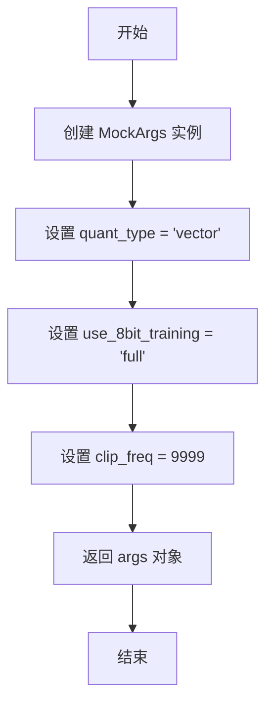

#### 带注释源码

```
def get_args():
    # 创建一个空的 MockArgs 实例对象
    # MockArgs 是一个动态属性的简单容器类
    args = MockArgs([])
    
    # 设置量化类型为 "vector"，表示使用向量量化方法
    args.quant_type = "vector"
    
    # 设置 8 位训练模式为 "full"，表示完全使用 8 位训练
    args.use_8bit_training = "full"
    
    # 设置裁剪频率为 9999，用于训练过程中的频率裁剪
    args.clip_freq = 9999
    
    # 返回配置好的参数对象，供调用者使用
    return args
```


### `assert_all_approx_close`

该函数用于比较两个张量是否在给定的容差范围内近似相等。如果不接近的张量元素数量超过指定阈值，则抛出断言错误。

参数：

- `a`：`torch.Tensor`，第一个用于比较的张量
- `b`：`torch.Tensor`，第二个用于比较的张量
- `atol`：`float`，绝对容差，默认值为 1e-8
- `rtol`：`float`，相对容差，默认值为 1e-5
- `count`：`int`，允许不接近的元素数量阈值，默认值为 10

返回值：`None`，该函数无返回值（隐式返回 None）

#### 流程图

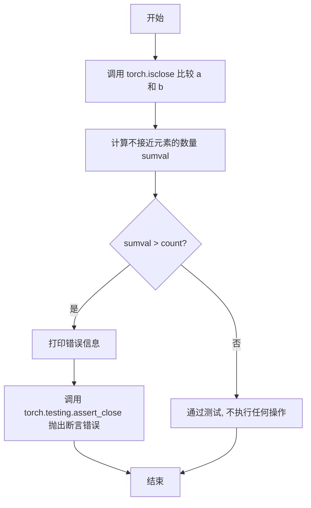

#### 带注释源码

```
def assert_all_approx_close(a, b, atol=1e-8, rtol=1e-5, count=10):
    """
    比较两个张量是否在给定容差范围内近似相等。
    
    参数:
        a: 第一个张量
        b: 第二个张量
        atol: 绝对容差
        rtol: 相对容差
        count: 允许不接近的最大元素数量
    """
    # 使用 torch.isclose 进行逐元素比较，返回布尔张量
    idx = torch.isclose(a, b, rtol=rtol, atol=atol)
    
    # 计算不满足接近条件的元素数量
    sumval = (idx == 0).sum().item()
    
    # 如果超过阈值，则打印详细信息并触发断言错误
    if sumval > count:
        print(f"Too many values not close: assert {sumval} < {count}")
        # 使用 torch.testing.assert_close 进行严格的张量比较
        torch.testing.assert_close(a, b, rtol=rtol, atol=atol)
```


### `test_linear8bitlt_inference`

这是一个 pytest 测试函数，用于验证 `Linear8bitLt` 8位线性层在推理模式下的行为。该测试创建了一个 8 位量化线性层，将其移动到指定设备并转换为半精度，然后执行 100 次前向传播，验证权重的数据类型、设备类型以及状态对象的正确初始化。

参数：

- `device`：`str`，测试运行的计算设备（如 "cuda"、"cpu" 等），通过 pytest 的 `parametrize` 装饰器从 `get_available_devices()` 获取
- `threshold`：`float`，用于 8 位量化的阈值参数，支持 0.0 和 3.0 两个值，通过 pytest 的 `parametrize` 装饰器提供

返回值：`None`，测试函数无返回值

#### 流程图

```mermaid
flowchart TD
    A[开始测试] --> B[创建 Linear8bitLt 层<br/>输入维度 32, 输出维度 64<br/>threshold=threshold<br/>has_fp16_weights=False]
    B --> C[将层移动到 device 设备]
    C --> D[转换为半精度 fp16]
    D --> E{断言检查}
    E --> F1[l1.weight.device.type == device]
    E --> F2[l1.weight.dtype == torch.int8]
    F1 --> G[设置 l1 为评估模式 eval()]
    G --> H[循环 100 次执行前向传播]
    H --> I[生成随机输入 b1<br/>shape: 16x8x32<br/>dtype: half]
    I --> J[执行前向传播 o1 = l1(b1)]
    J --> K{当前迭代 i == 1?}
    K -->|是| L[断言 l1.state.CB is not None]
    K -->|否| M[继续下一轮]
    L --> M
    M --> N[循环结束 测试通过]
    
    style F1 fill:#90EE90
    style F2 fill:#90EE90
    style L fill:#90EE90
```

#### 带注释源码

```python
@pytest.mark.parametrize("device", get_available_devices())
@pytest.mark.parametrize("threshold", [0.0, 3.0], ids=id_formatter("threshold"))
def test_linear8bitlt_inference(device, threshold):
    """
    测试 Linear8bitLt 8位线性层在推理模式下的功能
    
    参数:
        device: str, 测试运行的设备类型 (cuda/cpu/xpu等)
        threshold: float, 8位量化的阈值参数
    """
    # 创建 8 位量化线性层: 输入维度 32, 输出维度 64
    # threshold: 量化阈值，控制何时使用动态范围
    # has_fp16_weights=False: 不保存 FP16 权重副本，节省显存
    l1 = bnb.nn.Linear8bitLt(32, 64, threshold=threshold, has_fp16_weights=False).to(device).half()
    
    # 断言 1: 验证权重张量已正确放置到目标设备
    assert l1.weight.device.type == device
    
    # 断言 2: 验证权重已被量化为 int8 数据类型
    assert l1.weight.dtype == torch.int8

    # 设置模型为评估模式，关闭 dropout 等训练专用层
    l1.eval()
    
    # 执行 100 次前向传播以测试推理稳定性
    for i in range(100):
        # 生成随机输入张量: batch_size=16, sequence_length=8, input_dim=32
        # 转换为半精度 (fp16) 以匹配模型权重格式
        b1 = torch.randn(16, 8, 32, device=device).half()
        
        # 执行前向传播，计算输出
        o1 = l1(b1)
        
        # 在第 1 次迭代后验证量化状态已正确初始化
        # CB (Quantized Weight) 应该已经被创建
        if i == 1:
            assert l1.state.CB is not None
```


### `test_linear8bitlt_accumulated_gradient`

该测试函数用于验证 `Linear8bitLt` 层在累积梯度（gradient accumulation）训练场景下的行为是否与标准 FP16 线性层一致，确保 8bit 量化训练时梯度计算的准确性。

参数：

- `device`：`str`，测试运行的设备参数（通过 pytest.mark.parametrize 获取）

返回值：`None`，测试函数无返回值，通过断言验证正确性

#### 流程图

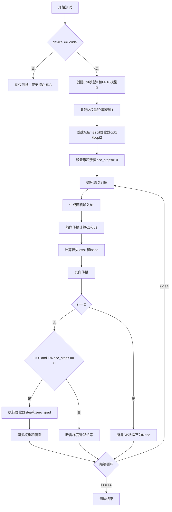

#### 带注释源码

```python
@pytest.mark.parametrize("device", get_available_devices())
def test_linear8bitlt_accumulated_gradient(device):
    """
    测试 Linear8bitLt 在累积梯度训练场景下的梯度计算正确性
    
    该测试验证8bit量化层与标准FP16层在累积梯度训练时
    能够产生近似相等的梯度和权重更新
    """
    # 仅在CUDA设备上运行测试，因为8bit训练依赖CUDA
    if device != "cuda":
        pytest.skip("Only supported on CUDA")

    # 创建两个 Sequential 模型：一个使用 8bit Linear，另一个使用标准 FP16 Linear
    # 每个 Sequential 包含两个 Linear 层，维度为 32x32
    l1 = torch.nn.Sequential(*[bnb.nn.Linear8bitLt(32, 32).to(device).half() for i in range(2)])
    l2 = torch.nn.Sequential(*[torch.nn.Linear(32, 32).to(device).half() for i in range(2)])
    
    # 将 FP16 模型的权重和偏置复制到 8bit 模型，确保初始权重一致
    l1[0].weight.data.copy_(l2[0].weight.data)
    l1[1].weight.data.copy_(l2[1].weight.data)
    l1[0].bias.data.copy_(l2[0].bias.data)
    l1[1].bias.data.copy_(l2[1].bias.data)

    # 创建两个 Adam32bit 优化器，分别用于 8bit 和 FP16 模型
    opt1 = bnb.optim.Adam32bit(l1.parameters(), lr=0.001)
    opt2 = bnb.optim.Adam32bit(l2.parameters(), lr=0.001)

    # 设置累积梯度步数，每10步更新一次参数
    acc_steps = 10

    # 进行15次训练迭代
    for i in range(15):
        # 生成随机输入 tensor，形状为 (16, 8, 32)，half precision
        b1 = torch.randn(16, 8, 32, device=device).half()
        
        # 分别通过 8bit 模型和 FP16 模型进行前向传播
        o1 = l1(b1)
        o2 = l2(b1)
        
        # 计算损失（取均值）
        loss1 = o1.mean()
        loss2 = o2.mean()
        
        # 反向传播计算梯度
        loss1.backward()
        loss2.backward()
        
        # 在第2次迭代时验证 8bit 层已正确初始化量化状态 CB
        if i == 2:
            assert l1[0].state.CB is not None
            assert l1[1].state.CB is not None

        # 当达到累积步数时，执行优化器 step 和梯度清零
        if i > 0 and i % acc_steps == 0:
            opt1.step()
            opt1.zero_grad(True)
            opt2.step()
            opt2.zero_grad(True)
            
            # 验证 8bit 和 FP16 模型的权重近似相等
            assert_all_approx_close(l1[0].weight, l2[0].weight, rtol=1.05, atol=0.01, count=2)
            assert_all_approx_close(l1[1].weight, l2[1].weight, rtol=1.05, atol=0.01, count=2)
            
            # 同步权重和偏置，防止微小差异随时间累积
            l1[0].weight.data.copy_(l2[0].weight.data)
            l1[1].weight.data.copy_(l2[1].weight.data)
            l1[0].bias.data.copy_(l2[0].bias.data)
            l1[1].bias.data.copy_(l2[1].bias.data)
        else:
            # 在累积步之间验证梯度近似相等
            assert_all_approx_close(l1[0].weight.grad, l2[0].weight.grad, rtol=1.05, atol=0.04, count=1)
            assert_all_approx_close(l1[1].weight.grad, l2[1].weight.grad, rtol=1.05, atol=0.04, count=1)
```


### `test_linear8bitlt_no_fp16_weights`

该测试函数验证 `Linear8bitLt` 层在不使用 FP16 权重（`has_fp16_weights=False`）情况下的推理功能，包括权重数据类型管理、设备转移、精度转换以及梯度反向传播的正确性。

参数：

- `device`：`str`，测试设备参数，由 `get_available_devices()` 返回的可用设备列表（如 "cuda", "cpu", "xpu" 等）
- `threshold`：`float`，量化阈值参数，值为 0.0 或 2.0，用于控制 8 位量化的阈值

返回值：`None`，测试函数无返回值

#### 流程图

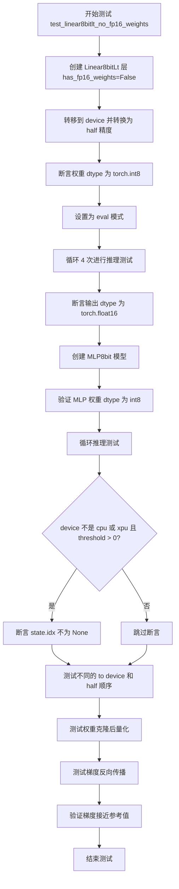

#### 带注释源码

```python
@pytest.mark.parametrize("device", get_available_devices())
@pytest.mark.parametrize("threshold", [0.0, 2.0])
def test_linear8bitlt_no_fp16_weights(device, threshold):
    # 创建 Linear8bitLt 层，禁用 FP16 权重，使用指定阈值
    l1 = (
        bnb.nn.Linear8bitLt(
            32,               # 输入维度
            64,               # 输出维度
            threshold=threshold,  # 量化阈值
            has_fp16_weights=False,  # 不使用 FP16 权重
        )
        .to(device)      # 转移到测试设备
        .half()          # 转换为半精度
    )
    # 验证权重数据类型为 int8
    assert l1.weight.dtype == torch.int8

    # 设置为推理模式
    l1.eval()
    # 循环执行 4 次推理测试
    for i in range(4):
        # 生成随机输入张量，float16 类型
        b1 = torch.randn(16, 8, 32, device=device, dtype=torch.float16)
        o1 = l1(b1)  # 执行前向传播
        # 验证输出数据类型为 float16
        assert o1.dtype == torch.float16

    # 创建 MLP8bit 模型（两个 Linear8bitLt 层串联）
    mlp = MLP8bit(32, 64, threshold=threshold, has_fp16_weights=False).to(device)
    # 验证两个全连接层的权重数据类型均为 int8
    assert mlp.fc1.weight.dtype == torch.int8
    assert mlp.fc2.weight.dtype == torch.int8

    # 循环推理测试
    for i in range(4):
        b1 = torch.randn(16, 8, 32, device=device, dtype=torch.float16)
        o1 = mlp(b1)
        assert o1.dtype == torch.float16
        # 如果阈值大于 0 且设备不是 CPU/XPU，验证量化状态存在
        if threshold > 0 and device not in ("cpu", "xpu"):
            assert mlp.fc1.state.idx is not None
            assert mlp.fc2.state.idx is not None

    # 测试不同的设备转移和精度转换顺序：先 to(device) 再 half()
    mlp = MLP8bit(32, 64, threshold=threshold, has_fp16_weights=False).to(device).half()
    assert mlp.fc1.weight.dtype == torch.int8
    assert mlp.fc2.weight.dtype == torch.int8

    for i in range(4):
        b1 = torch.randn(16, 8, 32, device=device, dtype=torch.float16)
        o1 = mlp(b1)
        assert o1.dtype == torch.float16
        if threshold > 0 and device not in ("cpu", "xpu"):
            assert mlp.fc1.state.idx is not None
            assert mlp.fc2.state.idx is not None

    # 测试顺序：先 half() 再 to(device)
    mlp = MLP8bit(32, 64, threshold=threshold, has_fp16_weights=False).half().to(device)

    for i in range(4):
        b1 = torch.randn(16, 8, 32, device=device, dtype=torch.float16)
        o1 = mlp(b1)
        assert o1.dtype == torch.float16
        if threshold > 0 and device not in ("cpu", "xpu"):
            assert mlp.fc1.state.idx is not None
            assert mlp.fc2.state.idx is not None
    # 验证权重类型和设备
    assert mlp.fc1.weight.dtype == torch.int8
    assert mlp.fc2.weight.dtype == torch.int8

    # 测试顺序：先 half() 再 to(device)（另一种写法）
    mlp = (
        MLP8bit(
            32,
            64,
            threshold=threshold,
            has_fp16_weights=False,
        )
        .half()
        .to(device)
    )

    for i in range(4):
        b1 = torch.randn(16, 8, 32, device=device, dtype=torch.float16)
        o1 = mlp(b1)
        assert o1.dtype == torch.float16
        if threshold > 0 and device not in ("cpu", "xpu"):
            assert mlp.fc1.state.idx is not None
            assert mlp.fc2.state.idx is not None
    # 验证权重类型和设备
    assert mlp.fc1.weight.dtype == torch.int8
    assert mlp.fc2.weight.dtype == torch.int8
    assert mlp.fc1.weight.device.type == device
    assert mlp.fc2.weight.device.type == device

    # 测试权重克隆后量化：先获取权重，再转移和转换
    mlp = MLP8bit(
        32,
        64,
        threshold=threshold,
        has_fp16_weights=False,
    )
    # 在量化前克隆权重，用于后续梯度参考
    w1, w2 = mlp.fc1.weight.clone().to(device), mlp.fc2.weight.clone().to(device)
    mlp = mlp.to(device).half()  # 触发量化

    for i in range(4):
        b1 = torch.randn(16, 8, 32, device=device, dtype=torch.float16)
        o1 = mlp(b1)
        assert o1.dtype == torch.float16
        if threshold > 0 and device not in ("cpu", "xpu"):
            assert mlp.fc1.state.idx is not None
            assert mlp.fc2.state.idx is not None

    # 验证最终权重类型、设备
    assert mlp.fc1.weight.dtype == torch.int8
    assert mlp.fc2.weight.dtype == torch.int8
    assert mlp.fc1.weight.device.type == device
    assert mlp.fc2.weight.device.type == device

    # 测试梯度反向传播
    b1 = torch.randn(16, 8, 32, device=device, requires_grad=True, dtype=torch.half)
    o1 = mlp(b1)
    assert o1.dtype == torch.float16
    assert o1.requires_grad
    grad_proj = torch.randn_like(o1)

    mlp.zero_grad()
    (o1 * grad_proj).sum().backward()  # 反向传播
    # 计算参考梯度：使用全精度权重
    grad_ref = grad_proj.flatten(2) @ w2.half() @ w1.half()
    scale = grad_ref.abs().mean()

    # 验证梯度接近参考值
    torch.testing.assert_close(b1.grad, grad_ref, rtol=0, atol=0.05 * scale)
    idx = torch.isclose(b1.grad, grad_ref, atol=0.01 * scale, rtol=0.1)
    # 允许少量误差（小于 0.5% 的元素）
    assert (idx == 0).sum().item() <= b1.numel() * 0.005
```


### `test_linear_kbit_fp32_bias`

该测试函数用于验证 8 位线性层（Linear8bitLt）和 NF4 线性层（LinearNF4）在 k-bit 权重下的 FP32 偏置处理和自动类型转换行为。

参数：

-  `device`：`str`，测试设备（如 cuda、cpu 等），通过 pytest 的 parametrize 从 `get_available_devices()` 获取
-  `module`：一个可调用对象（lambda 函数或类），用于创建线性层模块，参数为 (n_in, n_out, bias=True)，可以是 `bnb.nn.Linear8bitLt` 或 `bnb.nn.LinearNF4`

返回值：无（测试函数返回 `None`）

#### 流程图

```mermaid
flowchart TD
    A[开始测试 test_linear_kbit_fp32_bias] --> B[创建 Linear 模块: module(32, 64)]
    B --> C{module 是 Linear8bitLt 还是 LinearNF4}
    C -->|Linear8bitLt| D[使用 lambda 创建模块, bias=True]
    C -->|LinearNF4| E[直接使用 bnb.nn.LinearNF4 类]
    D --> F[将模块移到 device 设备上]
    E --> F
    F --> G[断言权重类型是 int8 或 uint8]
    G --> H[断言偏置类型是 float32]
    H --> I[循环 100 次执行推理]
    I --> J[生成随机输入 b1: shape 16x8x32, dtype=float16]
    J --> K[执行前向传播 o1 = l1(b1)]
    K --> L[断言偏置类型转换为 float16]
    L --> M[创建无偏置模块: module(32, 64, bias=False)]
    M --> N[移到 device 设备上]
    N --> O[断言权重类型是 int8 或 uint8]
    O --> P[断言偏置为 None]
    P --> Q[循环 100 次执行推理]
    Q --> R[生成随机输入 b1: shape 16x8x32, dtype=float16]
    R --> S[执行前向传播 o1 = l1(b1)]
    S --> T[断言偏置保持为 None]
    T --> U[测试结束]
```

#### 带注释源码

```python
@pytest.mark.parametrize("device", get_available_devices())
@pytest.mark.parametrize(
    "module",
    [
        # Linear8bitLt: lambda 函数创建模块，bias=True 为默认值
        lambda n_in, n_out, bias=True: bnb.nn.Linear8bitLt(n_in, n_out, bias=bias, has_fp16_weights=False),
        # LinearNF4: 直接使用 bnb.nn.LinearNF4 类
        bnb.nn.LinearNF4,
    ],
    ids=["Int8Lt", "NF4"],
)
def test_linear_kbit_fp32_bias(device, module):
    # 第一部分：测试有偏置的情况
    # 将模型转换为 fp16 会自动触发 int8 量化
    l1 = module(32, 64).to(device)
    
    # 验证权重量化后的数据类型为 int8 或 uint8
    assert l1.weight.dtype in [torch.int8, torch.uint8]
    
    # 验证偏置的初始数据类型为 float32
    assert l1.bias.dtype == torch.float32

    # 循环执行 100 次前向传播
    for i in range(100):
        # 生成随机输入: batch_size=16, sequence_length=8, hidden_dim=32, dtype=float16
        b1 = torch.randn(16, 8, 32, device=device, dtype=torch.float16)
        # 偏置会被自动转换为 float16（与输入数据类型匹配）
        o1 = l1(b1)
        # 验证偏置类型已转换为 float16
        assert l1.bias.dtype == torch.float16

    # 第二部分：测试无偏置的情况
    # 创建无偏置的线性层，同样会自动进行 fp16 -> int8 的量化
    l1 = module(32, 64, bias=False).to(device)
    
    # 验证权重量化后的数据类型
    assert l1.weight.dtype in [torch.int8, torch.uint8]
    
    # 验证偏置为 None（因为创建时设置了 bias=False）
    assert l1.bias is None

    # 再次循环执行 100 次前向传播
    for i in range(100):
        # 生成随机输入
        b1 = torch.randn(16, 8, 32, device=device, dtype=torch.float16)
        # 执行前向传播
        o1 = l1(b1)
        # 验证偏置保持为 None
        assert l1.bias is None
```


### `test_kbit_backprop`

该测试函数用于验证 bitsandbytes 库中各种低精度线性层（如 Int8、4bit、FP4、NF4 等）在训练场景下的反向传播梯度是否与标准 FP32/FP16 线性层近似一致，确保低精度量化不会导致梯度计算错误。

参数：

- `device`：`str`，测试设备（如 "cuda"、"cpu"、"hpu" 等），通过 pytest 参数化从 `get_available_devices()` 获取
- `module`：`Callable`，要测试的低精度线性层模块构造函数（如 `bnb.nn.Linear8bitLt`、`bnb.nn.Linear4bit` 等），通过 pytest 参数化从 `module_dict.values()` 获取
- `dtype`：`torch.dtype`，计算数据类型（`torch.float16` 或 `torch.bfloat16`），通过 pytest 参数化指定

返回值：`None`，该函数为测试函数，无返回值，通过断言验证正确性

#### 流程图

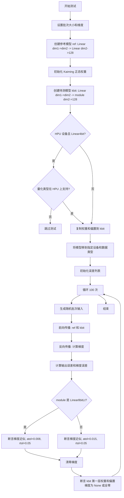

#### 带注释源码

```python
@pytest.mark.parametrize("device", get_available_devices())                      # 参数化设备: cuda, cpu, hpu 等
@pytest.mark.parametrize("module", module_dict.values(), ids=module_dict.keys()) # 参数化模块: Int8Lt, 4bit, FP4, NF4 等
@pytest.mark.parametrize("dtype", [torch.float16, torch.bfloat16])               # 参数化数据类型: fp16, bf16
def test_kbit_backprop(device, module, dtype):
    """
    测试低精度线性层 (Int8/4bit/FP4/NF4) 的反向传播梯度是否与标准线性层近似。
    验证 bitsandbytes 量化层在训练时的梯度计算正确性。
    """
    b = 16       # 批次大小
    dim1 = 36    # 输入维度
    dim2 = 84    # 隐藏层维度

    # 创建参考模型: 两个标准 Linear 层的顺序模型
    ref = nn.Sequential(*[torch.nn.Linear(dim1, dim2), torch.nn.Linear(dim2, 128)])
    # 使用 Kaiming 正态分布初始化权重 (适合 ReLU 激活)
    torch.nn.init.kaiming_normal_(ref[0].weight)
    torch.nn.init.kaiming_normal_(ref[1].weight)
    # 冻结第二层权重，不参与梯度计算
    ref[1].weight.requires_grad_(False)

    # 创建待测模型: 第一层为标准 Linear，第二层为待测的低精度模块
    kbit = nn.Sequential(*[torch.nn.Linear(dim1, dim2), module(dim2, 128)])

    # HPU 设备特定检查: 如果是 Linear4bit 且量化类型不被支持则跳过
    if (
        device == "hpu"
        and isinstance(kbit[1], bnb.nn.Linear4bit)
        and not is_supported_on_hpu(kbit[1].weight.quant_type, dtype)
    ):
        pytest.skip("This configuration not supported on HPU")

    # 复制参考模型的权重和偏置到待测模型 (detach 避免追踪计算图)
    kbit[0].weight.detach().copy_(ref[0].weight)
    kbit[1].weight.detach().copy_(ref[1].weight)
    kbit[0].bias.detach().copy_(ref[0].bias)
    kbit[1].bias.detach().copy_(ref[1].bias)
    # 冻结待测模型第二层的权重，不参与梯度计算
    kbit[1].weight.requires_grad_(False)

    # 将模型移动到指定设备和数据类型
    ref = ref.to(device=device, dtype=dtype)
    kbit = kbit.to(device=device, dtype=dtype)
    kbit = kbit.to(device=device, dtype=dtype)  # 重复调用确保转换完成

    # 初始化误差记录列表
    errs1 = []   # 输出绝对误差
    errs2 = []   # 梯度绝对误差
    relerrs1 = [] # 输出相对误差
    relerrs2 = [] # 梯度相对误差

    # 循环 100 次进行统计验证
    for i in range(100):
        # 生成随机批次输入
        batch = torch.randn(b, dim1, device=device, dtype=dtype)
        
        # 前向传播
        out1 = ref(batch)   # 参考模型输出
        out2 = kbit(batch)  # 待测模型输出

        # 反向传播: 计算损失梯度
        out1.mean().backward()
        out2.mean().backward()

        # 获取梯度
        grad1 = ref[0].weight.grad   # 参考模型第一层权重梯度
        grad2 = kbit[0].weight.grad  # 待测模型第一层权重梯度
        bgrad1 = ref[0].bias.grad    # 参考模型第一层偏置梯度
        bgrad2 = kbit[0].bias.grad   # 待测模型第一层偏置梯度

        # 计算绝对误差
        err1 = (out1 - out2).abs().float()
        err2 = (grad1 - grad2).abs().float()

        # 计算相对误差 (添加小常数避免除零)
        relerr1 = err1 / (out1.abs().float() + 1e-9)
        relerr2 = err2 / (grad1.abs().float() + 1e-9)

        # 记录误差统计
        errs1.append(err1.mean().item())
        errs2.append(err2.mean().item())
        relerrs1.append(relerr1.mean().item())
        relerrs2.append(relerr2.mean().item())

        # 根据模块类型选择不同的容差阈值进行验证
        if isinstance(module, bnb.nn.Linear8bitLt):
            # Int8Lt 模块使用更严格的容差
            assert_all_approx_close(grad1, grad2, atol=0.008, rtol=0.05, count=1)
            torch.testing.assert_close(bgrad1, bgrad2, atol=0.008, rtol=0.05)
        else:
            # 其他低精度模块 (4bit/FP4/NF4) 使用稍宽松的容差
            assert_all_approx_close(grad1, grad2, atol=0.015, rtol=0.05, count=1)
            torch.testing.assert_close(bgrad1, bgrad2, atol=0.02, rtol=0.05)

        # 清零梯度，为下一次迭代做准备
        ref.zero_grad()
        kbit.zero_grad()

        # 验证待测模型第一层的梯度已被正确清零
        # (权重和偏置梯度应为 None 或全零)
        assert kbit[0].weight.grad is None or kbit[0].weight.grad.sum().item() == 0
        assert kbit[0].weight.grad is None or kbit[0].bias.grad.sum().item() == 0
```


### `test_embedding_lossless`

该函数是一个pytest测试用例，用于验证不同量化嵌入层（8bit、FP4、NF4）在使用二值化权重（-1, 1）时的无损压缩能力。测试通过将量化嵌入层的输出与标准浮点嵌入层的输出进行比较，确保量化过程不会引入误差。

参数：

- `device`：`str`，测试运行的设备（如cuda、cpu、hpu等），通过`get_available_devices()`参数化获取
- `embedding_class`：`type`，嵌入层类类型，可选`bnb.nn.Embedding8bit`、`bnb.nn.EmbeddingFP4`、`bnb.nn.EmbeddingNF4`
- `input_shape`：`tuple`，输入令牌的形状，可选`(10,)`、`(10, 10)`、`(10, 10, 10)`
- `embedding_dim`：`int`，嵌入维度，可选64或65
- `quant_storage`：`torch.dtype`，量化存储类型，可选`torch.uint8`、`torch.float32`或`None`

返回值：`None`，该函数为pytest测试用例，无返回值，通过`torch.testing.assert_close`进行断言验证

#### 流程图

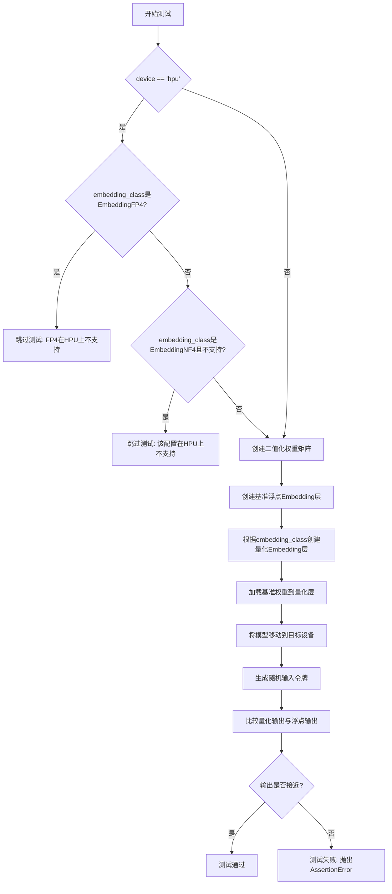

#### 带注释源码

```python
@pytest.mark.parametrize("device", get_available_devices())
@pytest.mark.parametrize("embedding_dim", [64, 65])
@pytest.mark.parametrize("input_shape", [(10,), (10, 10), (10, 10, 10)], ids=str)
@pytest.mark.parametrize(
    "embedding_class,quant_storage",
    [
        (bnb.nn.Embedding8bit, None),
        (bnb.nn.EmbeddingFP4, torch.uint8),
        (bnb.nn.EmbeddingFP4, torch.float32),
        (bnb.nn.EmbeddingNF4, torch.uint8),
        (bnb.nn.EmbeddingNF4, torch.float32),
    ],
    ids=lambda x: x.__name__ if inspect.isclass(x) else str(x),
)
def test_embedding_lossless(device, embedding_class, input_shape, embedding_dim, quant_storage):
    # 如果设备是HPU且不支持当前配置，则跳过测试
    if device == "hpu":
        if embedding_class is bnb.nn.EmbeddingFP4:
            pytest.skip("FP4 is not supported on HPU")
        elif embedding_class is bnb.nn.EmbeddingNF4 and not is_supported_on_hpu("nf4", torch.float32, quant_storage):
            pytest.skip("This configuration is not supported on HPU")

    num_embeddings = 128  # 嵌入表中嵌入向量的数量

    # 创建二值化权重矩阵：随机生成float32张量，大于0为1，小于等于0为-1
    # 使用{-1, 1}二值化权重可以实现无损压缩，因为二值化信息可以完全由符号位表示
    src_weight = (torch.randn((num_embeddings, embedding_dim), dtype=torch.float32) > 0).to(
        torch.float32
    ) * 2 - 1

    # 创建基准浮点Embedding层，冻结参数，使用预定义的二值化权重
    emb_base = nn.Embedding(
        num_embeddings=num_embeddings,
        embedding_dim=embedding_dim,
        _freeze=True,
        _weight=src_weight,
    )
    
    # 根据embedding_class创建量化嵌入层
    # Embedding8bit不需要quant_storage参数，其他量化类型需要
    if embedding_class is bnb.nn.Embedding8bit:
        e = embedding_class(num_embeddings=num_embeddings, embedding_dim=embedding_dim)
    else:
        e = embedding_class(num_embeddings=num_embeddings, embedding_dim=embedding_dim, quant_storage=quant_storage)

    # 从基准层加载权重到量化层，实现权重量化
    e.load_state_dict(emb_base.state_dict())

    # 将模型移动到指定设备
    emb_base.to(device)
    e.to(device)

    # 生成随机整数令牌序列，值域为[0, num_embeddings)
    input_tokens = torch.randint(low=0, high=num_embeddings, size=input_shape, device=device)

    # 验证量化嵌入层的输出与基准浮点嵌入层的输出完全一致
    # 由于使用二值化权重，量化应该完全无损
    torch.testing.assert_close(
        actual=e(input_tokens),
        expected=emb_base(input_tokens),
    )
```


### `test_embedding_error`

这是一个测试函数，用于验证不同量化方法（8bit、FP4、NF4）在嵌入层中的误差是否符合预期范围。

参数：

- `device`：str，测试设备（如cuda、cpu等），通过get_available_devices()获取
- `embedding_class`：type，嵌入层的量化类（如bnb.nn.Embedding8bit、bnb.nn.EmbeddingFP4、bnb.nn.EmbeddingNF4）
- `input_shape`：tuple，输入张量的形状（如(10,)、(10, 10)、(10, 10, 10)）
- `embedding_dim`：int，嵌入向量的维度（如64、65）
- `quant_storage`：torch.dtype，量化存储类型（如torch.uint8、torch.float32或None）

返回值：None，该函数为测试函数，使用pytest断言验证结果

#### 流程图

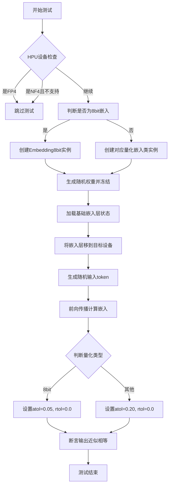

#### 带注释源码

```python
@pytest.mark.parametrize("device", get_available_devices())  # 参数化设备
@pytest.mark.parametrize("embedding_dim", [64, 65])  # 参数化嵌入维度
@pytest.mark.parametrize("input_shape", [(10,), (10, 10), (10, 10, 10)], ids=str)  # 参数化输入形状
@pytest.mark.parametrize(
    "embedding_class,quant_storage",
    [
        (bnb.nn.Embedding8bit, None),
        (bnb.nn.EmbeddingFP4, torch.uint8),
        (bnb.nn.EmbeddingFP4, torch.float32),
        (bnb.nn.EmbeddingNF4, torch.uint8),
        (bnb.nn.EmbeddingNF4, torch.float32),
    ],
    ids=lambda x: x.__name__ if inspect.isclass(x) else str(x),
)
def test_embedding_error(device, embedding_class, input_shape, embedding_dim, quant_storage):
    """
    测试嵌入层的量化误差是否在可接受范围内
    
    参数:
        device: 测试设备
        embedding_class: 量化嵌入类
        input_shape: 输入形状
        embedding_dim: 嵌入维度
        quant_storage: 量化存储类型
    """
    # HPU设备特殊处理：跳过不支持的配置
    if device == "hpu":
        if embedding_class is bnb.nn.EmbeddingFP4:
            pytest.skip("FP4 is not supported on HPU")
        elif embedding_class is bnb.nn.EmbeddingNF4 and not is_supported_on_hpu("nf4", torch.float32, quant_storage):
            pytest.skip("This configuration is not supported on HPU")

    # 判断是否为8bit嵌入（用于设置容差）
    is_8bit = embedding_class is bnb.nn.Embedding8bit

    num_embeddings = 128  # 嵌入数量

    # 生成随机权重（用于对比的基准）
    src_weight = torch.rand((num_embeddings, embedding_dim), dtype=torch.float32)

    # 创建基准嵌入层（冻结的float32嵌入）
    emb_base = nn.Embedding(
        num_embeddings=num_embeddings,
        embedding_dim=embedding_dim,
        _freeze=True,
        _weight=src_weight,
    )
    
    # 根据量化类型创建对应的嵌入层
    if is_8bit:
        e = embedding_class(num_embeddings=num_embeddings, embedding_dim=embedding_dim)
    else:
        e = embedding_class(num_embeddings=num_embeddings, embedding_dim=embedding_dim, quant_storage=quant_storage)

    # 加载基准嵌入层的权重到量化嵌入层
    e.load_state_dict(emb_base.state_dict())

    # 将两个嵌入层都移到目标设备
    emb_base.to(device)
    e.to(device)

    # 生成随机输入token
    input_tokens = torch.randint(low=0, high=num_embeddings, size=input_shape, device=device)

    # 验证量化嵌入层的输出与基准的误差在容差范围内
    # 8bit使用更严格的容差(0.05)，其他量化方法使用较宽松的容差(0.20)
    torch.testing.assert_close(
        actual=e(input_tokens),
        expected=emb_base(input_tokens),
        atol=0.05 if is_8bit else 0.20,
        rtol=0.0,
    )
```


### `test_4bit_linear_warnings`

该测试函数用于验证 4bit 线性层在推理模式下是否正确触发 UserWarning 警告，确保当模型在推理状态（batch_size=1）运行时能够提醒用户可能的风险。

参数：

-  `device`：`str`，测试设备标识符（如 "cuda"、"cpu" 等），通过 pytest 参数化从 `get_available_devices()` 获取

返回值：`None`，该函数为测试函数，无返回值

#### 流程图

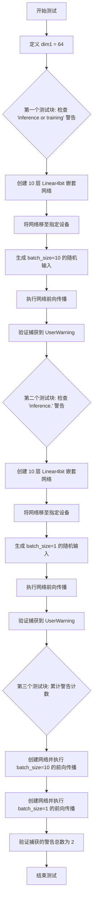

#### 带注释源码

```python
@pytest.mark.parametrize("device", get_available_devices())  # 参数化设备：cuda/cpu/xpu 等
def test_4bit_linear_warnings(device):
    """
    测试 4bit 线性层在推理模式下是否正确触发警告
    验证逻辑：
    1. 当 batch_size > 1 时，应触发包含 "inference or training" 的警告
    2. 当 batch_size = 1 时（纯推理场景），应触发包含 "inference." 的警告
    3. 连续执行两种场景后，总警告数应为 2
    """
    dim1 = 64  # 定义线性层维度

    # 测试用例 1：验证 batch_size > 1 时触发警告
    # 预期匹配正则表达式 "inference or training"
    with pytest.warns(UserWarning, match=r"inference or training"):
        # 创建由 10 个 Linear4bit 层组成的sequential网络
        net = nn.Sequential(*[bnb.nn.Linear4bit(dim1, dim1, quant_type="nf4") for i in range(10)])
        net = net.to(device)  # 将模型移至测试设备
        inp = torch.rand(10, dim1, device=device, dtype=torch.float16)  # batch_size=10
        net(inp)  # 执行前向传播，触发警告

    # 测试用例 2：验证 batch_size = 1 时触发警告
    # 预期匹配正则表达式 "inference."
    with pytest.warns(UserWarning, match=r"inference."):
        net = nn.Sequential(*[bnb.nn.Linear4bit(dim1, dim1, quant_type="nf4") for i in range(10)])
        net = net.to(device)
        inp = torch.rand(1, dim1, device=device, dtype=torch.float16)  # batch_size=1
        net(inp)

    # 测试用例 3：验证连续执行后警告总数
    # 用于检测是否存在重复警告或警告遗漏
    with pytest.warns(UserWarning) as record:
        # 第一次前向传播：batch_size=10
        net = nn.Sequential(*[bnb.nn.Linear4bit(dim1, dim1, quant_type="nf4") for i in range(10)])
        net = net.to(device)
        inp = torch.rand(10, dim1, device=device, dtype=torch.float16)
        net(inp)

        # 第二次前向传播：batch_size=1
        net = nn.Sequential(*[bnb.nn.Linear4bit(dim1, dim1, quant_type="nf4") for i in range(10)])
        net = net.to(device)
        inp = torch.rand(1, dim1, device=device, dtype=torch.float16)
        net(inp)

    # 断言：验证总共捕获了 2 个 UserWarning
    assert len(record) == 2
```


### `test_4bit_embedding_warnings`

该测试函数用于验证 4bit Embedding 层在推理模式下当 embedding 维度不能被块大小整除时是否会正确触发 UserWarning 警告。

参数：

- `device`：`str`，测试设备参数，由 `get_available_devices()` 参数化提供，表示运行测试的设备（如 "cuda"、"cpu" 等）

返回值：`None`，无返回值（pytest 测试函数）

#### 流程图

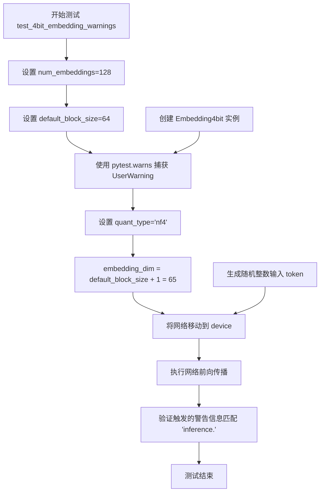

#### 带注释源码

```python
@pytest.mark.parametrize("device", get_available_devices())  # 参数化设备
def test_4bit_embedding_warnings(device):
    """
    测试 4bit Embedding 在推理模式下的警告触发
    
    当 embedding_dim 不能被默认块大小整除时，应该触发警告
    """
    num_embeddings = 128  # 设置嵌入条目数量
    default_block_size = 64  # 默认块大小

    # 预期触发 UserWarning，警告信息应匹配 "inference."
    with pytest.warns(UserWarning, match=r"inference."):
        # 创建 4bit Embedding 层
        # embedding_dim = 65 (default_block_size + 1)，不能被 64 整除
        net = bnb.nn.Embedding4bit(
            num_embeddings=num_embeddings, 
            embedding_dim=default_block_size + 1,  # 65
            quant_type="nf4"  # 使用 NF4 量化类型
        )
        net.to(device)  # 将模型移动到指定设备
        
        # 生成随机整数索引作为输入
        inp = torch.randint(low=0, high=num_embeddings, size=(1,), device=device)
        net(inp)  # 执行前向传播，触发警告
```


### `test_4bit_embedding_weight_fsdp_fix`

该函数是一个测试用例，用于验证 4bit 嵌入层（Embedding4bit）在经过 FSDP（Fully Sharded Data Parallel）修复后，前向传播能够正确恢复权重量化状态。测试通过检查 `quant_state` 是否在推理后被正确设置来确保功能的正确性。

参数：

- `requires_cuda`：`pytest.fixture`，PyTorch 测试框架的 fixture，用于确保测试在 CUDA 环境下运行

返回值：`None`，无返回值（测试函数）

#### 流程图

```mermaid
flowchart TD
    A[开始] --> B[设置参数: num_embeddings=64, embedding_dim=32]
    B --> C[创建 Embedding4bit 模块]
    C --> D[将模块移至 CUDA 设备]
    D --> E[重置 weight.quant_state 为 None]
    E --> F[生成随机输入 tokens]
    F --> G[执行前向传播: module(input_tokens)]
    G --> H{检查 quant_state 是否不为 None}
    H -->|是| I[测试通过]
    H -->|否| J[测试失败]
```

#### 带注释源码

```python
def test_4bit_embedding_weight_fsdp_fix(requires_cuda):
    """
    测试 Embedding4bit 在 FSDP 场景下权重量化状态的恢复
    
    该测试验证当使用 FSDP 分布式训练后，Embedding4bit 的权重量化状态
    能够在首次前向传播时被正确初始化和恢复。
    """
    # 定义嵌入层的参数：嵌入数量和嵌入维度
    num_embeddings = 64
    embedding_dim = 32

    # 创建 4bit 量化嵌入层模块
    module = bnb.nn.Embedding4bit(num_embeddings=num_embeddings, embedding_dim=embedding_dim)

    # 将模块移至 CUDA 设备
    module.cuda()

    # 模拟 FSDP 场景：重置量化状态为 None
    # 在真实的 FSDP 训练中，权重会被分片和重新分发，量化状态需要重新初始化
    module.weight.quant_state = None

    # 生成随机输入 token，模拟实际推理场景
    input_tokens = torch.randint(low=0, high=num_embeddings, size=(1,), device="cuda")

    # 执行前向传播
    module(input_tokens)

    # 断言验证：前向传播后量化状态应当被正确恢复
    # 这是 FSDP fix 的核心：确保推理时量化状态不会丢失
    assert module.weight.quant_state is not None
```


### test_4bit_linear_weight_fsdp_fix

这是一个测试函数，用于验证 `Linear4bit` 模块在 FSDP（Fully Sharded Data Parallel）场景下，当权重量化状态被重置为 `None` 后，前向传播能否正确恢复量化状态。

参数：
- `requires_cuda`：`pytest.fixture`，用于确保测试在 CUDA 环境中运行。如果 CUDA 不可用，测试将被跳过。

返回值：`None`，该函数没有返回值，通过断言验证量化状态恢复的正确性。

#### 流程图

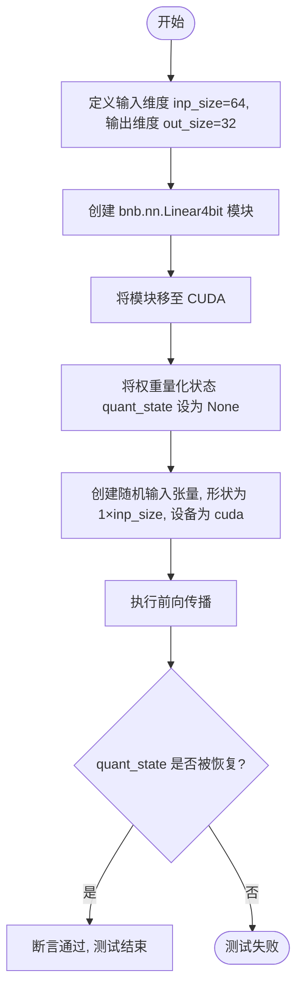

#### 带注释源码

```python
def test_4bit_linear_weight_fsdp_fix(requires_cuda):
    """
    测试 Linear4bit 模块在 FSDP 场景下权重量化状态的恢复。
    
    该测试模拟了 FSDP 中权重被重新分片后，量化状态丢失的场景。
    验证在前向传播时，量化状态能够被正确恢复。
    
    参数:
        requires_cuda: pytest fixture, 确保测试在 CUDA 环境中运行。
    """
    # 定义输入和输出维度
    inp_size = 64
    out_size = 32

    # 创建一个 Linear4bit 层, 输入维度 64, 输出维度 32
    module = bnb.nn.Linear4bit(inp_size, out_size)

    # 将模块移至 CUDA 设备
    module.cuda()

    # 模拟 FSDP 场景: 权重量化状态被重置为 None
    # 这通常发生在权重被重新分片或跨设备移动后
    module.weight.quant_state = None

    # 创建随机输入张量, 形状为 (batch_size=1, inp_size=64), 设备为 cuda
    input_tensor = torch.randn((1, inp_size), device="cuda")

    # 执行前向传播, 此操作应该触发量化状态的重新初始化
    module(input_tensor)

    # 断言: 验证量化状态已被成功恢复, 不再为 None
    assert module.weight.quant_state is not None, "量化状态未能在前向传播后恢复"
```


### `test_embedding_not_implemented_error`

这是一个测试函数，用于验证 `Embedding4bit` 和 `Embedding8bit` 类的 `state_dict()` 方法在调用时是否正确抛出 `NotImplementedError` 异常。该测试确保了这些嵌入层目前不支持保存状态字典的功能。

参数： 无

返回值：`None`，该函数为测试函数，不返回任何值

#### 流程图

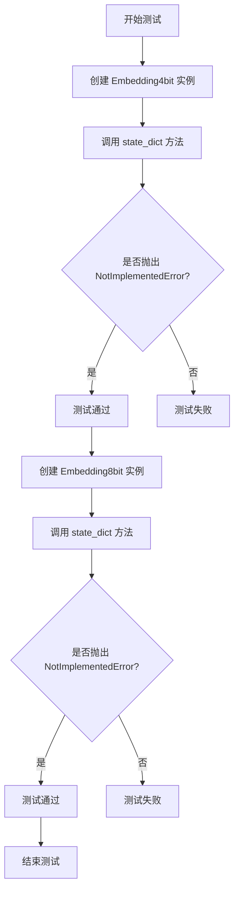

#### 带注释源码

```python
def test_embedding_not_implemented_error():
    """
    测试 Embedding4bit 和 Embedding8bit 的 state_dict 方法是否抛出 NotImplementedError
    
    该测试验证以下两点：
    1. Embedding4bit.state_dict() 应该抛出 NotImplementedError
    2. Embedding8bit.state_dict() 应该抛出 NotImplementedError
    """
    
    # 测试 Embedding4bit 类的 state_dict 方法
    # 预期行为：调用 state_dict() 应抛出 NotImplementedError 异常
    with pytest.raises(NotImplementedError):
        emb = bnb.nn.Embedding4bit(32, 32)  # 创建一个 4bit 嵌入层实例，32 个词，维度为 32
        emb.state_dict()  # 调用 state_dict 方法，预期抛出 NotImplementedError

    # 测试 Embedding8bit 类的 state_dict 方法
    # 预期行为：调用 state_dict() 应抛出 NotImplementedError 异常
    with pytest.raises(NotImplementedError):
        emb = bnb.nn.Embedding8bit(32, 32)  # 创建一个 8bit 嵌入层实例，32 个词，维度为 32
        emb.state_dict()  # 调用 state_dict 方法，预期抛出 NotImplementedError
```


### `MockArgs.__init__`

该方法是一个简单的动态属性初始化器，通过遍历输入字典并使用 `setattr` 将键值对动态设置为类的实例属性，实现类似命名空间的动态对象创建功能。

参数：

- `initial_data`：`Dict[str, Any]`，包含初始化数据的字典，键为属性名称，值为对应的属性值

返回值：`None`，构造函数不返回任何值

#### 流程图

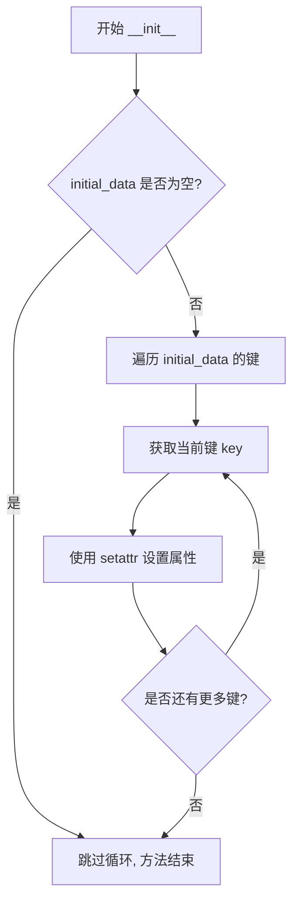

#### 带注释源码

```python
class MockArgs:
    def __init__(self, initial_data):
        """
        初始化 MockArgs 实例
        
        参数:
            initial_data: dict, 包含要设置的属性键值对
                         例如: {'quant_type': 'vector', 'use_8bit_training': 'full'}
        """
        # 遍历 initial_data 字典中的所有键
        for key in initial_data:
            # 使用 setattr 动态设置实例属性
            # 将 key 作为属性名, initial_data[key] 作为属性值
            setattr(self, key, initial_data[key])
```


### `MLP8bit.__init__`

该方法是 `MLP8bit` 类的构造函数，用于初始化一个包含两个 8 位量化线性层的双层多层感知机（MLP）。它接受输入维度、隐藏维度和量化参数，创建两个 `Linear8bitLt` 层构成一个对称的 MLP 结构。

参数：

- `dim1`：`int`，输入和输出维度
- `dim2`：`int`，隐藏层维度
- `has_fp16_weights`：`bool`，默认为 `True`，指定是否使用 FP16 权重
- `threshold`：`float`，默认为 `0.0`，量化阈值参数

返回值：`None`，该方法为构造函数，不返回任何值

#### 流程图

```mermaid
flowchart TD
    A[开始 __init__] --> B[调用 super().__init__ 初始化 nn.Module]
    --> C[创建 fc1 层: Linear8bitLt dim1 → dim2]
    --> D[创建 fc2 层: Linear8bitLt dim2 → dim1]
    --> E[结束 __init__]
    
    C -->|has_fp16_weights| C1[使用 FP16 权重]
    C -->|threshold| C2[应用量化阈值]
    D -->|has_fp16_weights| D1[使用 FP16 权重]
    D -->|threshold| D2[应用量化阈值]
```

#### 带注释源码

```python
class MLP8bit(torch.nn.Module):
    """8 位量化多层感知机，包含两个线性层"""
    
    def __init__(self, dim1, dim2, has_fp16_weights=True, threshold=0.0):
        """
        初始化 MLP8bit 模块
        
        参数:
            dim1: 输入和输出的维度
            dim2: 隐藏层维度
            has_fp16_weights: 是否使用 FP16 权重进行量化
            threshold: 量化阈值，用于控制量化粒度
        """
        # 调用父类 nn.Module 的初始化方法
        super().__init__()
        
        # 创建第一个 8 位量化线性层 (输入 -> 隐藏)
        # dim1: 输入维度
        # dim2: 输出维度
        # has_fp16_weights: 控制是否保持 FP16 权重副本
        # threshold: 量化阈值
        self.fc1 = bnb.nn.Linear8bitLt(
            dim1,
            dim2,
            has_fp16_weights=has_fp16_weights,
            threshold=threshold,
        )
        
        # 创建第二个 8 位量化线性层 (隐藏 -> 输出)
        # 使用对称结构: dim2 -> dim1
        self.fc2 = bnb.nn.Linear8bitLt(
            dim2,
            dim1,
            has_fp16_weights=has_fp16_weights,
            threshold=threshold,
        )
    
    def forward(self, x):
        """前向传播: 依次通过两个线性层"""
        x = self.fc1(x)
        x = self.fc2(x)
        return x
```


### `MLP8bit.forward(x)`

该方法实现了一个双层的8位量化MLP（多层感知机），输入数据依次经过两个8位量化线性层变换后输出。

参数：

- `x`：`torch.Tensor`，输入的张量数据，形状为 (batch_size, input_dim)

返回值：`torch.Tensor`，经过两层8位量化线性层变换后的输出张量，形状为 (batch_size, input_dim)

#### 流程图


#### 带注释源码

```python
def forward(self, x):
    """
    前向传播方法，将输入依次通过两个8位量化线性层
    
    参数:
        x: torch.Tensor - 输入张量
        
    返回:
        torch.Tensor - 经过两层变换后的输出张量
    """
    # 第一层：8位量化线性变换 (dim1 -> dim2)
    x = self.fc1(x)
    
    # 第二层：8位量化线性变换 (dim2 -> dim1)
    x = self.fc2(x)
    
    return x
```

## 关键组件


### 张量索引与惰性加载

代码中通过检查`state.CB`和`state.idx`属性来验证张量索引的惰性加载机制，确保在首次前向传播时才初始化相关状态。

### 反量化支持

测试覆盖了权重从int8/FP4/NF4等量化格式反量化为float16进行计算的过程，包括前向传播和反向传播中的梯度计算与验证。

### 量化策略

代码涵盖了多种量化策略，包括vector量化、Int8Lt线性层、FP4和NF4嵌入层、4bit线性层，以及不同的计算精度（fp32/fp16/bf16）配置。

### 阈值量化控制

通过`threshold`参数控制动态量化阈值，测试了阈值在0.0、2.0、3.0等不同取值下的行为，验证超过阈值的激活值会被特殊处理。

### 梯度累积与参数同步

`test_linear8bitlt_accumulated_gradient`测试了在训练过程中使用累积梯度步时，8bit权重与全精度权重的同步机制和数值接近性验证。

### FSDP权重状态修复

`test_4bit_embedding_weight_fsdp_fix`和`test_4bit_linear_weight_fsdp_fix`测试了分布式训练后权重量化状态（quant_state）的恢复，确保FSDP重分布后量化状态正确初始化。

### 嵌入层量化精度测试

通过`test_embedding_lossless`和`test_embedding_error`分别验证了使用{-1,1}值的嵌入层可实现无损量化压缩，以及普通浮点嵌入层的量化误差范围。

### 设备兼容性验证

测试覆盖了CUDA、CPU、HPU等多种设备，通过`get_available_devices()`和`is_supported_on_hpu()`确保量化模块在不同硬件平台上的兼容性。


## 问题及建议


### 已知问题

-   **硬编码的魔法数字**: 代码中存在大量未作解释的硬编码值，如阈值 `threshold=0.0, 3.0`、容差值 `atol=1e-8, rtol=1e-5, count=10`、`acc_steps = 10`、循环次数 `for i in range(100)` 等，降低了代码可维护性。
-   **未完成的TODO**: 存在 `# TODO: Remove support for training int8 weights` 注释，表明存在已知的技术债务需要清理。
-   **代码重复**: `test_linear8bitlt_no_fp16_weights` 函数中包含多个几乎相同的测试代码块，仅在 `.to(device).half()`、`.half().to(device)` 等设备/类型转换顺序上有所不同，造成代码冗余。
-   **不一致的状态检查**: 部分测试检查 `state.CB`，部分检查 `state.idx`，状态验证逻辑不统一。
-   **不一致的dtype处理**: 代码混合使用 `torch.float16` 和 `.half()` 两种方式，增加理解难度。
-   **测试容差可能导致 flaky 测试**: `assert_all_approx_close` 函数使用的容差值（如 `rtol=1.05, atol=0.01`）在某些硬件上可能导致测试不稳定。
-   **缺失的异常处理**: 多个测试函数缺少适当的异常处理机制。
-   **测试组织结构不佳**: 所有测试以函数形式散落，缺乏按功能模块组织的类结构，不利于长期维护。

### 优化建议

-   **提取重复代码**: 将 `test_linear8bitlt_no_fp16_weights` 中重复的测试逻辑提取为辅助函数，减少代码冗余。
-   **统一状态检查**: 标准化对量化状态的检查方式，统一使用一种状态验证接口。
-   **统一dtype处理**: 统一使用 `torch.float16` 或 `.half()` 之一，避免混用。
-   **参数化配置**: 将魔法数字提取为配置文件或测试fixture，提高可配置性。
-   **清理TODO**: 尽快处理或规划处理 `# TODO: Remove support for training int8 weights` 任务。
-   **重构为测试类**: 将相关测试函数组织成测试类，提高代码结构化程度和可维护性。
-   **增加文档注释**: 为关键测试函数和复杂逻辑添加文档字符串，说明测试目的和预期行为。

## 其它


### 设计目标与约束

本代码的测试目标是验证 bitsandbytes 库中量化神经网络层（8bit、4bit、NF4、FP4 等）在不同设备（CUDA、CPU、HPU等）上的功能正确性，包括推理、训练、梯度计算、权重更新等核心功能。约束条件包括：仅支持特定量化类型与计算精度组合，需在支持 CUDA 或 HPU 的环境中运行完整测试，部分量化方式不支持训练模式等。

### 错误处理与异常设计

测试中主要通过 pytest 断言进行错误检测，典型异常处理场景包括：设备不支持时使用 pytest.skip 跳过测试（如 HPU 不支持 FP4/NF4 特定配置），使用 pytest.warns 捕获预期警告（如 4bit 线性层首次推理警告），使用 pytest.raises 验证特定异常抛出（如 Embedding 的 state_dict 未实现错误）。数值精度验证通过 assert_all_approx_close 和 torch.testing.assert_close 进行容差检查。

### 数据流与状态机

量化层的数据流遵循以下状态转换：初始化时权重为 float32 -> 调用 .to(device).half() 后转换为量化格式 (int8/uint8/NF4/FP4) -> 推理时根据 threshold 决定是否启用动态量化 -> 训练时维护 CB (quantized weight) 和 state.idx (动态量化索引) 状态。状态机关键节点：l1.state.CB 非空表示已进行量化，l1.state.idx 非空表示启用动态量化。

### 外部依赖与接口契约

主要依赖包括：torch (PyTorch 基础)、bitsandbytes (核心量化库)、pytest (测试框架)、tests.helpers (设备检测工具)。关键接口契约：Linear8bitLt(dim_in, dim_out, has_fp16_weights, threshold) 返回量化线性层；Linear4bit/LinearFP4/LinearNF4 支持 quant_type、compress_statistics、compute_dtype 等参数；Embedding8bit/EmbeddingFP4/EmbeddingNF4 支持 quant_storage 参数指定量化存储类型。

### 性能特征与基准

测试覆盖了推理性能（100 次迭代）、梯度计算精度（与标准 float32 线性层对比）、累积梯度场景（10 步累积后对比权重）。数值精度要求：8bit 量化梯度容差 atol=0.008/rtol=0.05，4bit/NF4 量化梯度容差 atol=0.015/rtol=0.05，嵌入层无损压缩（{-1,1}值）需完全匹配，有损压缩（随机浮点）容差为 0.05（8bit）或 0.20（4bit）。

### 兼容性考虑

设备兼容性：get_available_devices() 返回可用设备列表，包括 cuda、cpu、hpu、xpu 等。数据类型兼容性：支持 float16、bfloat16 计算类型，部分模块支持 float32。阈值设置：threshold=0.0 表示纯静态量化，threshold>0 启用动态量化（仅在非 CPU/XPU 设备上）。FSDP 兼容性：测试验证了 Linear4bit 和 Embedding4bit 在 FSDP 场景下 weight.quant_state 正确恢复。

### 安全考虑

测试代码不涉及敏感数据处理，权重数据使用 torch.randn 随机生成。内存安全：使用 clone() 避免原始数据修改，使用 zero_grad() 正确清理梯度。数值安全：梯度检查时使用 .detach() 分离计算图，防止意外梯度传播。

### 测试策略

采用参数化测试策略 (@pytest.mark.parametrize)，覆盖多维度组合：设备维度（cpu/cuda/hpu/xpu）、量化类型维度（int8/uint8/fp4/nf4）、阈值维度（0.0/2.0/3.0）、精度维度（float16/bfloat16）、输入形状维度（1D/2D/3D）。关键测试场景包括：推理模式验证、梯度累积训练验证、无损/有损压缩验证、警告消息验证、异常抛出验证。

    