# `bitsandbytes\tests\test_ops.py` 详细设计文档

该文件是bitsandbytes库的量化功能测试套件，主要测试int8和4bit量化操作，包括矩阵乘法、向量量化、块式量化以及非连续张量的处理。

## 整体流程

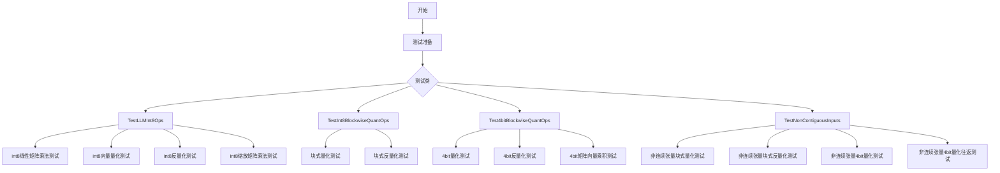

## 类结构

```
测试模块
├── TestLLMInt8Ops (8位整数运算测试类)
├── TestInt8BlockwiseQuantOps (8位块式量化测试类)
├── Test4bitBlockwiseQuantOps (4位块式量化测试类)
└── TestNonContiguousInputs (非连续张量测试类)
```

## 全局变量及字段


### `ROCM_WARP_SIZE_64`
    
一个布尔常量，表示当前平台是否使用 ROCm 的 64 位 warp size，用于条件性地选择不同的 blocksize 参数

类型：`bool`
    


### `TRUE_FALSE`
    
一个从 tests.helpers 导入的列表，用于 pytest 参数化测试，包含布尔值 True 和 False

类型：`list`
    


### `opcheck`
    
一个函数包装器，根据 PyTorch 版本选择性地调用 torch.library.opcheck 进行算子检查，若版本低于 2.4 则为空操作

类型：`function`
    


    

## 全局函数及方法


### `get_available_devices`

获取可用的计算设备列表，用于测试参数化。

参数：此函数没有显式参数

返回值：`List[str]`，返回支持的设备名称列表（如 "cpu", "cuda", "mps", "hpu" 等）

#### 流程图

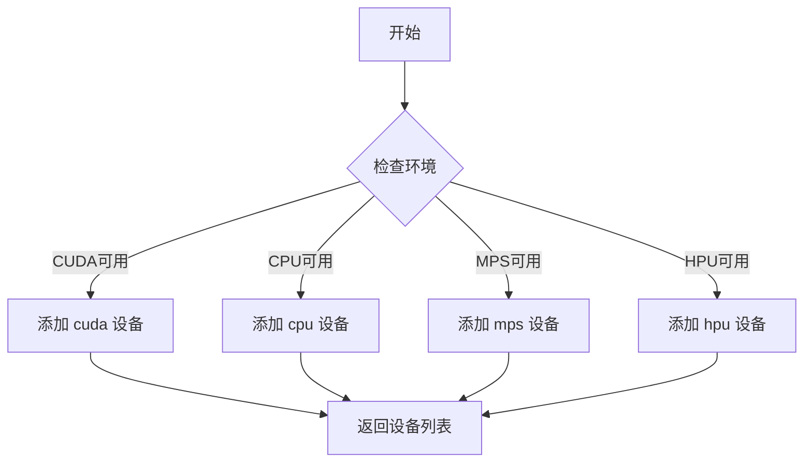

#### 带注释源码

```
# 注：由于该函数定义在 tests/helpers.py 中，以下是基于代码用法的推断
def get_available_devices():
    """
    返回当前环境中可用的计算设备列表。
    
    该函数被测试框架用于参数化测试，常见的设备包括：
    - "cpu": CPU 设备
    - "cuda": NVIDIA CUDA 设备
    - "mps": Apple Metal Performance Shaders
    - "hpu": Intel Habana Gaudi
    
    返回:
        List[str]: 可用设备名称列表
    """
    devices = []
    
    # 检测 CPU（通常总是可用）
    devices.append("cpu")
    
    # 检测 CUDA 是否可用
    if torch.cuda.is_available():
        devices.append("cuda")
    
    # 检测 MPS 是否可用（macOS 上的 GPU 加速）
    if torch.backends.mps.is_available():
        devices.append("mps")
    
    # 检测 HPU 是否可用（Intel Habana）
    # 可能通过特定的环境变量或库检测
    
    return devices
```

> **注意**：由于 `get_available_devices` 函数定义在 `tests/helpers.py` 模块中，源代码未直接在提供的代码文件中展示。上述源码是根据该函数在测试中的使用方式推断的。该函数主要用于 pytest 参数化，为不同的测试方法提供可用的计算设备列表。


### `id_formatter`

该函数是 pytest 参数化的辅助函数，用于生成友好的测试 ID 字符串，使测试输出更易读。它接受一个参数名称作为上下文信息，返回一个转换函数，该函数将实际的参数值转换为可读的字符串描述。

参数：

- `param_name`：`str`，表示参数的名称，用于上下文和命名返回值

返回值：`Callable[[Any], str]`，返回一个函数，该函数接受任意类型的参数值，并将其转换为字符串描述

#### 流程图

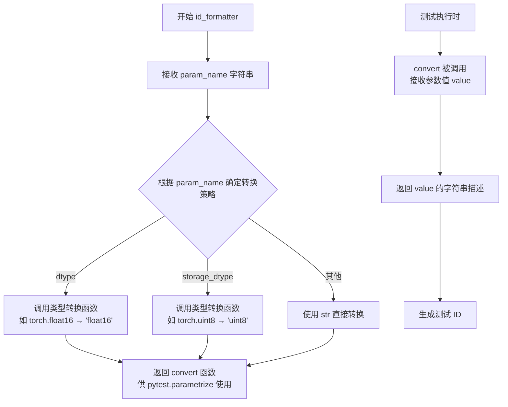

#### 带注释源码

```python
# 注意：此函数定义不在提供的代码中
# 这是一个基于使用方式推断的实现
# 实际定义位于 tests/helpers.py

def id_formatter(param_name: str) -> Callable[[Any], str]:
    """
    为 pytest 参数化生成友好的测试 ID。
    
    参数:
        param_name: 参数名称，用于确定转换策略
        
    返回:
        一个函数，接收参数值并返回字符串描述
    """
    
    def convert(value: Any) -> str:
        """
        将参数值转换为字符串描述。
        
        参数:
            value: pytest 参数化的实际值（如 torch.float16）
            
        返回:
            人类可读的字符串（如 'float16'）
        """
        # 处理 torch dtype 类型
        if hasattr(value, '__name__'):
            return value.__name__
        
        # 处理普通值直接转字符串
        return str(value)
    
    return convert


# 使用示例（在测试文件中）：
# @pytest.mark.parametrize("dtype", [torch.float16, torch.bfloat16, torch.float32], 
#                          ids=id_formatter("dtype"))
# 等价于：
# ids=['float16', 'bfloat16', 'float32']
```

#### 说明

- `id_formatter` 是 **辅助函数**，不直接执行核心量化逻辑
- 主要用于 **提升测试可读性**，将 `torch.float16` 转换为 `'float16'`
- 属于 **测试基础设施代码**，而非业务逻辑
- 在提供的代码中作为导入的外部函数使用，定义应在 `tests/helpers.py` 中


### `is_supported_on_hpu`

该函数用于检查给定的量化配置（量化类型、数据类型和存储数据类型）是否在华为 Ascend 处理器（HPU）上受支持。如果不支持，则测试会跳过该配置。

参数：

- `quant_type`：`str`，量化类型，常见值为 "fp4" 或 "nf4"
- `dtype`：`torch.dtype`，输入数据的精度类型，如 torch.float16、torch.bfloat16、torch.float32
- `storage_dtype`：`torch.dtype`，量化后数据的存储类型，如 torch.uint8 或 torch.bfloat16

返回值：`bool`，如果该配置在 HPU 上支持则返回 True，否则返回 False

#### 流程图

```mermaid
flowchart TD
    A[开始 is_supported_on_hpu] --> B{quant_type == 'fp4'}
    B -->|是| C{storage_dtype == torch.uint8}
    B -->|否| D{dtype in [float16, bfloat16, float32]}
    C -->|是| E[返回 True]
    C -->|否| F[返回 False]
    D -->|是| G[检查其他条件...]
    D -->|否| H[返回 False]
    G --> I{storage_dtype == torch.uint8}
    I -->|是| E
    I -->|否| F
```

#### 带注释源码

```
# 该函数定义位于 tests/helpers.py 模块中
# 本代码文件中仅为导入引用，以下为基于使用方式的推断实现

def is_supported_on_hpu(quant_type: str, dtype: torch.dtype, storage_dtype: torch.dtype) -> bool:
    """
    检查给定的量化配置是否在 HPU 设备上受支持。
    
    参数:
        quant_type: 量化类型，'fp4' 或 'nf4'
        dtype: 输入/输出数据类型，torch.float16/bfloat16/float32
        storage_dtype: 量化后的存储类型，torch.uint8 或 torch.bfloat16
    
    返回:
        bool: 是否支持
    """
    # 根据实际硬件支持和驱动情况判断
    # 此函数的实际实现在 tests/helpers.py 中
    # 以下逻辑基于代码使用方式的推测
    
    # FP4 量化通常仅支持 uint8 存储
    if quant_type == "fp4":
        return storage_dtype == torch.uint8
    
    # NF4 量化的支持情况取决于 dtype 和 storage_dtype 的组合
    if quant_type == "nf4":
        # 通常 float16/bfloat32 配合 uint8 存储是支持的
        if dtype in [torch.float16, torch.bfloat16, torch.float32]:
            return storage_dtype in [torch.uint8, torch.bfloat16]
    
    return False
```

> **注意**：该函数的具体实现位于 `tests/helpers.py` 模块中，本代码文件仅通过 `from tests.helpers import ... is_supported_on_hpu` 导入并使用。上面的源码是根据该函数在测试中的调用方式进行的逻辑推断。


### `TestLLMInt8Ops.test_int8_linear_matmul`

该测试方法用于验证 `bitsandbytes` 库中 int8 线性矩阵乘法操作 (`int8_linear_matmul`) 的正确性，通过生成随机的 int8 输入矩阵，执行矩阵乘法运算，并验证输出结果的形状、数据类型和设备属性是否符合预期，同时使用 `opcheck` 进行操作注册检查。

参数：

-  `self`：测试类实例，无需显式传递
-  `device`：`str`，测试设备标识符，通过 `get_available_devices()` 参数化获取（如 "cpu", "cuda" 等）

返回值：`None`，该方法为测试函数，无返回值，通过断言验证正确性

#### 流程图

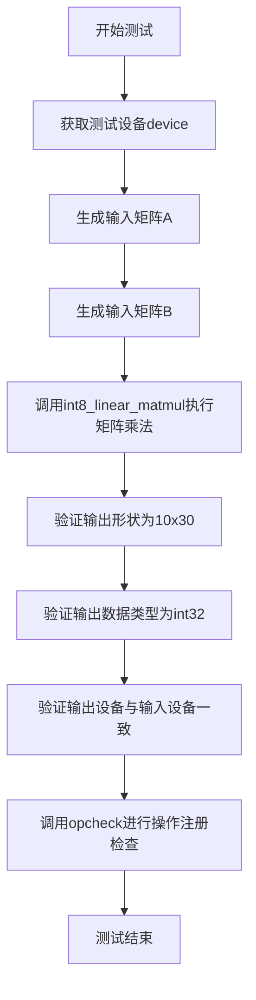

#### 带注释源码

```python
@pytest.mark.parametrize("device", get_available_devices())  # 参数化测试,遍历所有可用设备
def test_int8_linear_matmul(self, device):
    # 创建形状为(10, 20)的int8输入矩阵A,元素范围[-128, 127]
    A = torch.randint(-128, 127, (10, 20), dtype=torch.int8, device=device)
    
    # 创建形状为(30, 20)的int8输入矩阵B,元素范围[-128, 127]
    B = torch.randint(-128, 127, (30, 20), dtype=torch.int8, device=device)
    
    # 调用bitsandbytes库的int8线性矩阵乘法操作
    # 执行A @ B.T的矩阵乘法,输出形状应为(10, 30)
    out = torch.ops.bitsandbytes.int8_linear_matmul.default(A, B)

    # 断言:验证输出矩阵形状为(10, 30)
    assert out.shape == (10, 30)
    
    # 断言:验证输出数据类型为int32
    assert out.dtype == torch.int32
    
    # 断言:验证输出设备与输入矩阵A的设备一致
    assert out.device == A.device

    # 使用torch.library.opcheck验证操作是否正确注册
    # 该函数在torch>=2.4时可用,否则为空操作
    opcheck(torch.ops.bitsandbytes.int8_linear_matmul.default, (A, B))
```


### `TestLLMInt8Ops.test_int8_linear_matmul_out`

该测试方法用于验证 `bitsandbytes` 库中 `int8_linear_matmul` 算子的输出版本（out 版本），该算子执行 int8 类型的矩阵乘法运算，支持预先分配输出张量，避免额外的内存分配开销。

参数：

- `self`：`TestLLMInt8Ops`，测试类的实例本身
- `device`：`str`，指定测试运行的设备（如 "cuda"、"cpu" 等），通过 `get_available_devices()` 参数化获取

返回值：`None`，该方法为测试方法，无返回值，仅通过断言验证计算结果的正确性

#### 流程图

```mermaid
flowchart TD
    A[开始测试] --> B[获取测试设备 device]
    B --> C[创建输入张量 A: int8, shape (10, 20)]
    C --> D[创建输入张量 B: int8, shape (30, 20)]
    D --> E[创建预分配输出张量 out: int32, shape (10, 30)]
    E --> F[调用 torch.ops.bitsandbytes.int8_linear_matmul.out A B out]
    F --> G{断言验证}
    G --> H[验证 out.shape == (10, 30)]
    G --> I[验证 out.dtype == torch.int32]
    G --> J[验证 out.device == A.device]
    H --> K[调用 opcheck 验证算子注册信息]
    I --> K
    J --> K
    K --> L[结束测试]
```

#### 带注释源码

```python
@pytest.mark.parametrize("device", get_available_devices())  # 参数化设备，支持多设备测试
def test_int8_linear_matmul_out(self, device):
    """测试 int8_linear_matmul 算子的 out 版本功能"""
    
    # 创建输入矩阵 A: int8 类型，shape (10, 20)，值域 [-128, 127]
    # 作为左矩阵，与 B 进行矩阵乘法
    A = torch.randint(-128, 127, (10, 20), dtype=torch.int8, device=device)
    
    # 创建输入矩阵 B: int8 类型，shape (30, 20)
    # 作为右矩阵，列数必须与 A 的列数匹配 (20)
    B = torch.randint(-128, 127, (30, 20), dtype=torch.int8, device=device)

    # 创建预分配输出张量 out: int32 类型，shape (10, 30)
    # out 版本算子需要预先分配输出内存，避免额外分配开销
    out = torch.empty((10, 30), dtype=torch.int32, device=device)
    
    # 调用 bitsandbytes 的 int8 矩阵乘法算子
    # 计算 A @ B^T，结果存储到 out 张量中
    # 内部实现通常使用 CUDA kernel 进行高度优化的整数矩阵乘法
    torch.ops.bitsandbytes.int8_linear_matmul.out(A, B, out)

    # ======== 断言验证结果 ========
    
    # 验证输出形状正确：矩阵乘法 (10, 20) @ (30, 20) -> (10, 30)
    assert out.shape == (10, 30)
    
    # 验证输出数据类型为 int32（int8 乘法累加结果）
    assert out.dtype == torch.int32
    
    # 验证输出设备与输入设备一致
    assert out.device == A.device

    # 使用 PyTorch 的 opcheck 验证算子的注册信息和元数据
    # 确保算子正确定义在 torch.ops.bitsandbytes 命名空间中
    opcheck(torch.ops.bitsandbytes.int8_linear_matmul.out, (A, B, out))
```


### `TestLLMInt8Ops.test_int8_vectorwise_quant`

这是一个测试函数，用于验证 `bitsandbytes` 库中的 `int8_vectorwise_quant` 算子。该函数通过参数化测试，验证不同阈值（threshold）和不同设备（device）下，向量级 int8 量化功能的正确性，包括输出的形状、数据类型、设备一致性，以及异常值列的检测逻辑。

参数：

- `self`：`TestLLMInt8Ops`，测试类的实例，隐式参数
- `threshold`：`float`，量化阈值，用于决定是否检测异常值列。当 threshold > 0.0 时，函数会检测并返回异常值列；当 threshold = 0.0 时，异常值列返回 None
- `device`：`str`，目标测试设备（如 "cuda"、"cpu" 等），通过 `get_available_devices()` 参数化获取

返回值：`tuple`，包含三个元素：
- `out_row`：`torch.Tensor`，形状为 (10, 20)，数据类型为 torch.int8，表示量化后的输入矩阵
- `row_stats`：`torch.Tensor`，形状为 (10,)，数据类型为 torch.float32，表示每行的缩放因子（统计信息）
- `outlier_cols`：`torch.Tensor` 或 `None`，一维张量，表示异常值列的索引。当 threshold > 0.0 时返回包含异常列索引的 Tensor，否则返回 None

#### 流程图

```mermaid
flowchart TD
    A[开始测试] --> B[生成输入张量 A: shape=(10,20), dtype=float16]
    B --> C[设置 A[1][0] = 1000.0 作为异常值]
    C --> D[调用 torch.ops.bitsandbytes.int8_vectorwise_quant]
    D --> E{检查 threshold > 0.0?}
    E -->|Yes| F[获取 outlier_cols]
    E -->|No| G[outlier_cols 应为 None]
    F --> H[验证输出形状: out_row=(10,20), row_stats=(10,)]
    G --> H
    H --> I[验证数据类型: out_row=int8, row_stats=float32]
    I --> J[验证设备一致性: out_row.device == A.device]
    J --> K{检查 threshold > 0.0?}
    K -->|Yes| L[验证 outlier_cols 非空<br>dim=1, shape[0]<=20]
    K -->|No| M[验证 outlier_cols is None]
    L --> N[执行 opcheck 验证算子注册]
    M --> N
    N --> O[结束测试]
```

#### 带注释源码

```python
@pytest.mark.parametrize("threshold", [0.0, 6.0])  # 参数化阈值：0.0表示不检测异常值，6.0表示检测异常值
@pytest.mark.parametrize("device", get_available_devices())  # 参数化设备，支持多设备测试
def test_int8_vectorwise_quant(self, threshold, device):
    """测试 int8_vectorwise_quant 算子的正确性"""
    
    # 创建输入张量 A：形状 (10, 20)，float16 类型，位于指定设备
    A = torch.randn(10, 20, dtype=torch.float16, device=device)
    
    # 手动设置一个极端异常值，用于验证异常值检测功能
    # A[1][0] = 1000.0 是一个远大于普通值的异常数
    A[1][0] = 1000.0

    # 调用 bitsandbytes 的 int8 向量级量化算子
    # 输入：A: float16 tensor
    # 参数：threshold 用于决定是否检测并返回异常列
    # 输出：量化后的张量、行统计信息、异常列索引（可选）
    out_row, row_stats, outlier_cols = torch.ops.bitsandbytes.int8_vectorwise_quant(A, threshold=threshold)

    # 断言 1: 验证量化输出形状为 (10, 20)，与输入形状一致
    assert out_row.shape == (10, 20)
    
    # 断言 2: 验证量化后的数据类型为 int8
    assert out_row.dtype == torch.int8
    
    # 断言 3: 验证输出设备与输入设备一致
    assert out_row.device == A.device
    
    # 断言 4: 验证行统计信息形状为 (10,)
    assert row_stats.shape == (10,)
    
    # 断言 5: 验证行统计信息数据类型为 float32
    assert row_stats.dtype == torch.float32
    
    # 断言 6: 验证行统计信息设备与输入设备一致
    assert row_stats.device == A.device

    # 条件断言：根据 threshold 判断异常列的行为
    if threshold > 0.0:
        # 当 threshold > 0 时，应该返回异常列索引
        assert outlier_cols is not None  # 异常列不应为空
        assert outlier_cols.dim() == 1  # 应为一维张量
        assert outlier_cols.shape[0] <= A.shape[1]  # 异常列数量不应超过总列数
        assert outlier_cols.device == A.device  # 设备一致性
    else:
        # 当 threshold = 0 时，不检测异常列，应返回 None
        assert outlier_cols is None

    # 使用 torch.library.opcheck 验证算子的实现正确性
    # 这是一个运行时检查，确保算子符合 PyTorch 的自定义算子规范
    # 验证不带参数调用（使用默认 threshold）
    opcheck(torch.ops.bitsandbytes.int8_vectorwise_quant, (A,))
    
    # 验证带指定 threshold 参数调用
    opcheck(torch.ops.bitsandbytes.int8_vectorwise_quant, (A, threshold))
```


### `TestLLMInt8Ops.test_int8_mm_dequant`

该测试方法用于验证 `int8_mm_dequant` 操作的正确性，该操作将 int32 矩阵根据行统计信息和列统计信息反量化为 float16 矩阵。

参数：

- `self`：TestLLMInt8Ops，测试类实例
- `device`：`str`，测试设备（如 "cuda"、"cpu" 等）

函数内部变量：

- `A`：`torch.Tensor`（shape: (256, 256), dtype: torch.int32），输入的 int32 矩阵
- `row_stats`：`torch.Tensor`（shape: (256,), dtype: torch.float32），用于反量化的行统计信息
- `col_stats`：`torch.Tensor`（shape: (256,), dtype: torch.float32），用于反量化的列统计信息
- `out`：`torch.Tensor`，反量化后的 float16 输出矩阵

返回值：无明确返回值，但通过 `assert` 语句验证输出属性

#### 流程图

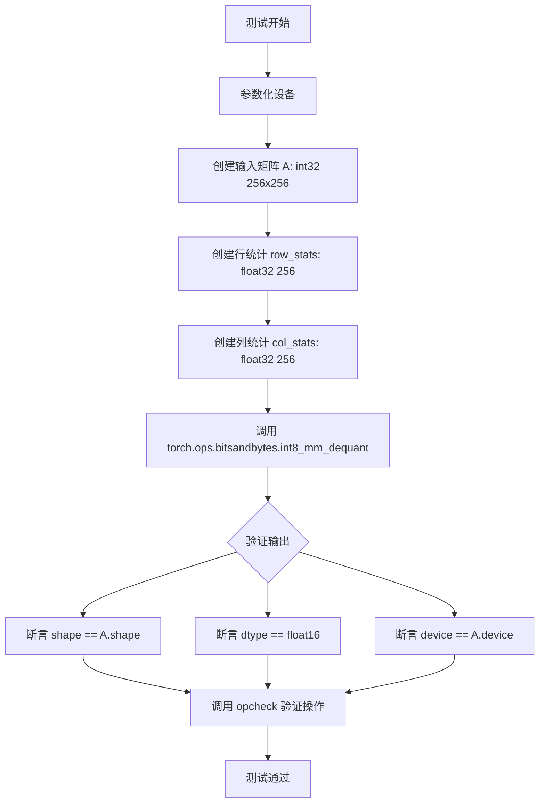

#### 带注释源码

```python
@pytest.mark.parametrize("device", get_available_devices())  # 参数化测试设备
def test_int8_mm_dequant(self, device):
    # 创建 int32 类型的输入矩阵 A，shape 为 (256, 256)
    A = torch.randint(-128, 127, (256, 256), dtype=torch.int32, device=device)
    
    # 创建用于反量化的行统计信息，shape 为 (256,)
    row_stats = torch.randn(256, dtype=torch.float32, device=device)
    
    # 创建用于反量化的列统计信息，shape 为 (256,)
    col_stats = torch.randn(256, dtype=torch.float32, device=device)
    
    # 调用 bitsandbytes 的 int8_mm_dequant 操作进行反量化
    out = torch.ops.bitsandbytes.int8_mm_dequant(A, row_stats, col_stats)

    # 验证输出形状与输入矩阵形状一致
    assert out.shape == A.shape
    # 验证输出数据类型为 float16
    assert out.dtype == torch.float16
    # 验证输出设备与输入设备一致
    assert out.device == A.device

    # 使用 torch.library.opcheck 验证操作的实现正确性
    opcheck(torch.ops.bitsandbytes.int8_mm_dequant, (A, row_stats, col_stats))
```


### `TestLLMInt8Ops.test_int8_scaled_mm`

该测试方法用于验证 `bitsandbytes` 库中 `int8_scaled_mm` 算子的正确性，该算子执行 INT8 量化矩阵乘法运算，支持可选的偏置项和多种输出数据类型（float16/bfloat16/float32）。

参数：

- `self`：方法隐式参数，TestLLMInt8Ops 类实例
- `device`：`str`，测试设备（CPU/CUDA/HPU等），从 `get_available_devices()` 参数化获取
- `dtype`：`torch.dtype`，输出数据类型，可选 float16/bfloat16/float32
- `has_bias`：`bool`，是否在矩阵乘法中包含偏置向量

#### 流程图

```mermaid
flowchart TD
    A[开始测试] --> B[准备输入数据]
    B --> C[创建INT8矩阵A: shape 10x20]
    B --> D[创建INT8矩阵B: shape 30x20]
    B --> E[创建row_stats: shape 10]
    B --> F[创建col_stats: shape 30]
    B --> G{has_bias?}
    G -->|True| H[创建偏置向量 bias: shape 30]
    G -->|False| I[bias = None]
    H --> J[调用int8_scaled_mm算子]
    I --> J
    J --> K[验证输出形状: (10, 30)]
    J --> L[验证输出dtype]
    J --> M[验证输出设备]
    J --> N[调用opcheck验证算子合规性]
    K --> O[测试通过]
    L --> O
    M --> O
    N --> O
```

#### 带注释源码

```python
@pytest.mark.parametrize("device", get_available_devices())
@pytest.mark.parametrize("dtype", [torch.float16, torch.bfloat16, torch.float32], ids=id_formatter("dtype"))
@pytest.mark.parametrize("has_bias", TRUE_FALSE)
def test_int8_scaled_mm(self, device, dtype, has_bias):
    """
    测试 int8_scaled_mm 算子的功能正确性
    
    参数:
        device: 测试设备 (CPU/CUDA/HPU等)
        dtype: 输出数据类型 (float16/bfloat16/float32)
        has_bias: 是否包含偏置项
    """
    # 准备INT8输入矩阵 A: 10x20, 元素范围 [-128, 127]
    A = torch.randint(-128, 127, (10, 20), dtype=torch.int8, device=device)
    
    # 准备INT8权重矩阵 B: 30x20, 元素范围 [-128, 127]
    B = torch.randint(-128, 127, (30, 20), dtype=torch.int8, device=device)
    
    # 行统计信息: 用于反量化, shape 与 A 的行数相同
    row_stats = torch.randn(10, dtype=torch.float32, device=device)
    
    # 列统计信息: 用于反量化, shape 与 B 的行数（即输出维度）相同
    col_stats = torch.randn(30, dtype=torch.float32, device=device)
    
    # 偏置向量: 如果 has_bias 为 True, 创建否则为 None
    bias = torch.randn(30, dtype=dtype, device=device) if has_bias else None
    
    # 调用 bitsandbytes 的 int8_scaled_mm 算子执行量化矩阵乘法
    # 内部流程: A @ B -> int32 中间结果 -> 使用 row_stats/col_stats 反量化 -> 输出 dtype
    out = torch.ops.bitsandbytes.int8_scaled_mm(
        A, B, row_stats, col_stats, bias=bias, dtype=dtype
    )
    
    # ==== 验证输出形状 ====
    assert out.shape == (10, 30), "输出形状应为 (10, 30)"
    
    # ==== 验证输出数据类型 ====
    assert out.dtype == dtype, f"输出dtype应为 {dtype}"
    
    # ==== 验证输出设备 ====
    assert out.device == A.device, "输出设备应与输入设备一致"
    
    # ==== 使用 torch.library.opcheck 验证算子实现的合规性 ====
    # (仅在 torch >= 2.4 时执行, 否则为 no-op)
    opcheck(
        torch.ops.bitsandbytes.int8_scaled_mm,
        (A, B, row_stats, col_stats, bias, dtype)
    )
```


### `TestInt8BlockwiseQuantOps.test_quantize_blockwise`

该方法是 `bitsandbytes` 库中 `TestInt8BlockwiseQuantOps` 测试类的核心测试方法，用于验证 int8 分块量化操作（`quantize_blockwise`）的正确性。测试通过参数化方式覆盖多种设备、数据类型和分块大小，并对量化输出进行全面的断言检查。

参数：

- `self`：测试类实例方法的标准第一个参数，无实际传递意义
- `device`：str，从 `get_available_devices()` 获取，支持的设备（如 "cpu", "cuda" 等）
- `dtype`：torch.dtype，量化前输入张量的数据类型，可选 torch.float16、torch.bfloat16、torch.float32
- `blocksize`：int，分块量化的大小，用于决定每个量化 block 包含的元素数量，可选值受 ROCM_WARP_SIZE_64 影响

返回值：`Tuple[torch.Tensor, torch.Tensor]`，量化后的张量（out）和对应的分块绝对最大值（absmax）

#### 流程图

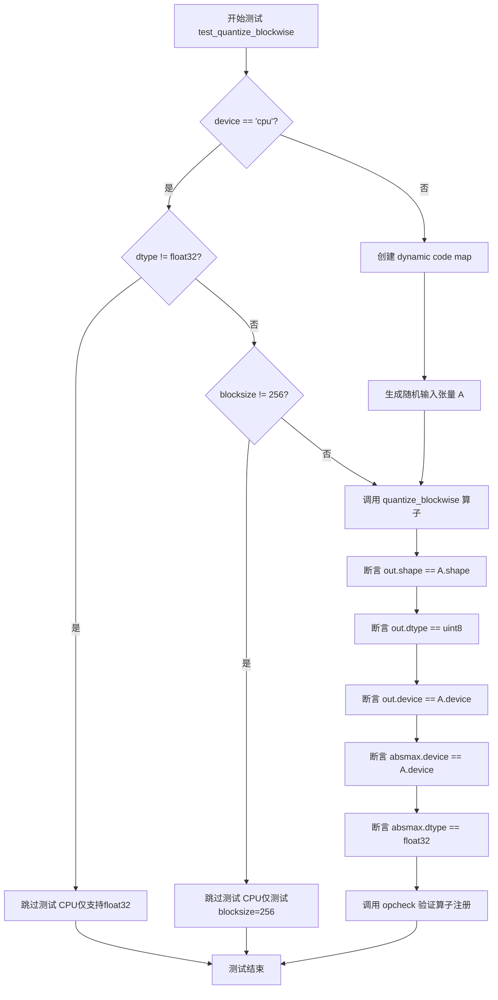

#### 带注释源码

```python
@pytest.mark.parametrize("device", get_available_devices())
@pytest.mark.parametrize("dtype", [torch.float16, torch.bfloat16, torch.float32], ids=id_formatter("dtype"))
@pytest.mark.parametrize("blocksize", [64, 128, 256, 512] if not ROCM_WARP_SIZE_64 else [128, 256, 512])
def test_quantize_blockwise(self, device, dtype, blocksize):
    # 条件跳过逻辑：CPU后端仅支持float32数据类型
    if device == "cpu":
        if dtype != torch.float32:
            pytest.skip("CPU implementation is only available for float32")
        # CPU实现较慢，仅测试blocksize=256以节省测试时间
        if blocksize != 256:
            pytest.skip("CPU implementation is slow; only test blocksize=256")

    # 创建量化所需的动态code映射，并移动到目标设备
    code = bitsandbytes.functional.create_dynamic_map().to(device)
    # 生成指定形状和数据类型的随机输入张量
    A = torch.randn(1024, 1024, dtype=dtype, device=device)
    # 调用bitsandbytes的quantize_blockwise算子进行分块量化
    out, absmax = torch.ops.bitsandbytes.quantize_blockwise(A, code, blocksize)

    # 断言验证量化输出的形状与输入一致
    assert out.shape == A.shape
    # 断言验证量化后的数据类型为uint8（无符号8位整数）
    assert out.dtype == torch.uint8
    # 断言验证输出设备与输入设备一致
    assert out.device == A.device

    # 断言验证absmax（分块绝对最大值）的设备和数据类型
    assert absmax.device == A.device
    assert absmax.dtype == torch.float32

    # 使用torch.library.opcheck验证算子的正确性和注册信息
    opcheck(torch.ops.bitsandbytes.quantize_blockwise, (A, code, blocksize))
```


### `TestInt8BlockwiseQuantOps.test_dequantize_blockwise`

该测试方法用于验证 `bitsandbytes` 库中 `dequantize_blockwise` 操作的正确性，通过对块级量化后的 uint8 张量进行反量化，验证输出张量的形状、数据类型和设备是否与预期一致。

参数：

- `self`：测试类实例（`TestInt8BlockwiseQuantOps`），隐式参数，无需用户传递
- `device`：字符串类型 (`str`)，测试设备（如 "cuda", "cpu" 等），通过 `pytest.mark.parametrize` 参数化获取
- `dtype`：torch.dtype 类型 (`torch.dtype`)，输出张量的目标数据类型（float16, bfloat16, float32），通过 `pytest.mark.parametrize` 参数化获取
- `blocksize`：整数类型 (`int`)，块大小（64, 128, 256, 512 等），通过 `pytest.mark.parametrize` 参数化获取

返回值：无（`None`），这是一个测试方法，通过断言验证功能正确性，不返回任何值

#### 流程图

```mermaid
flowchart TD
    A[开始测试] --> B{检查设备与数据类型}
    B -->|CPU 且非 float32| C[跳过测试]
    B -->|其他情况| D[创建 uint8 随机输入张量 A]
    D --> E[创建 codebook - dynamic_map]
    E --> F[计算块数量: blocks = -&#40;numel // -blocksize&#41;]
    F --> G[创建随机 abamax 张量]
    G --> H[调用 dequantize_blockwise.default 反量化]
    H --> I{断言验证}
    I -->|shape| J[验证 out.shape == A.shape]
    I -->|dtype| K[验证 out.dtype == dtype]
    I -->|device| L[验证 out.device == A.device]
    J --> M[调用 opcheck 验证操作注册]
    K --> M
    L --> M
    M --> N[测试结束]
    C --> N
```

#### 带注释源码

```python
@pytest.mark.parametrize("device", get_available_devices())
@pytest.mark.parametrize("dtype", [torch.float16, torch.bfloat16, torch.float32], ids=id_formatter("dtype"))
@pytest.mark.parametrize("blocksize", [64, 128, 256, 512] if not ROCM_WARP_SIZE_64 else [128, 256, 512])
def test_dequantize_blockwise(self, device, dtype, blocksize):
    """
    测试 dequantize_blockwise 操作的反量化功能
    
    参数:
        device: 测试运行设备 (cuda/cpu 等)
        dtype: 输出张量的目标数据类型
        blocksize: 量化块大小
    """
    # CPU 实现仅支持 float32，其他组合跳过测试
    if device == "cpu" and dtype != torch.float32:
        pytest.skip("CPU implementation is only available for float32")

    # 创建随机 uint8 量化数据 (1024x1024)
    A = torch.randint(0, 255, (1024, 1024), dtype=torch.uint8, device=device)
    
    # 创建 codebook (动态量化映射表)，转换为 float32
    code = bitsandbytes.functional.create_dynamic_map().to(device, dtype=torch.float32)

    # 计算需要的块数量 (向上取整)
    n = A.numel()
    blocks = -(n // -blocksize)  # 等价于 math.ceil(n / blocksize)
    
    # 为每个块创建随机 abamax (最大绝对值，用于反量化缩放)
    absmax = torch.randn((blocks,), device=device, dtype=torch.float32)

    # 调用 bitsandbytes 的块级反量化操作
    # 参数: A-量化数据, absmax-缩放因子, code-编码表, blocksize-块大小, dtype-目标类型
    out = torch.ops.bitsandbytes.dequantize_blockwise.default(A, absmax, code, blocksize, dtype)

    # 验证输出形状与输入一致
    assert out.shape == A.shape
    # 验证输出数据类型正确
    assert out.dtype == dtype
    # 验证输出设备与输入一致
    assert out.device == A.device

    # 使用 torch.library.opcheck 验证操作注册正确性 (torch >= 2.4)
    opcheck(torch.ops.bitsandbytes.dequantize_blockwise.default, (A, absmax, code, blocksize, dtype))
```


### `Test4bitBlockwiseQuantOps.test_quantize_4bit`

该方法是 `Test4bitBlockwiseQuantOps` 测试类中的一个测试用例，用于验证 4bit 分块量化操作（quantize_4bit）的功能正确性。它通过参数化测试覆盖多种设备、数据类型、存储数据类型、量化类型和分块大小，验证量化后的输出张量及其统计信息（absmax）是否符合预期。

参数：

- `device`：`str`，测试设备（如 "cuda"、"cpu" 等），通过 `get_available_devices()` 获取
- `dtype`：`torch.dtype`，输入张量的数据类型（torch.float16、torch.bfloat16 或 torch.float32）
- `storage_dtype`：`torch.dtype`，量化后输出张量的存储数据类型（torch.uint8 或 torch.bfloat16）
- `quant_type`：`str`，量化类型（"fp4" 表示 FP4，"nf4" 表示 NF4）
- `blocksize`：`int`，分块大小（用于分组量化，常见值为 32、64、128、256、512）

返回值：`tuple`，包含两个元素：

- `out`：`torch.Tensor`，量化后的输出张量，形状与输入相同，数据类型为 `storage_dtype`
- `absmax`：`torch.Tensor`，每个分块的最大绝对值，用于反量化，形状为 (分块数量,)，数据类型为 `torch.float32`

#### 流程图

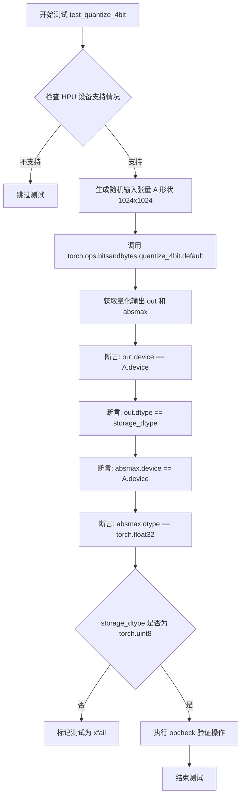

#### 带注释源码

```python
@pytest.mark.parametrize("device", get_available_devices())                  # 参数化设备: cuda, cpu, mps 等
@pytest.mark.parametrize("dtype", [torch.float16, torch.bfloat16, torch.float32], ids=id_formatter("dtype"))  # 参数化输入数据类型
@pytest.mark.parametrize("storage_dtype", [torch.uint8, torch.bfloat16], ids=id_formatter("storage_dtype"))  # 参数化存储数据类型
@pytest.mark.parametrize("quant_type", ["fp4", "nf4"])                      # 参数化量化类型: FP4 或 NF4
@pytest.mark.parametrize("blocksize", [32, 64, 128, 256, 512] if not ROCM_WARP_SIZE_64 else [64, 128, 256, 512])  # 参数化分块大小
def test_quantize_4bit(self, device, dtype, storage_dtype, quant_type, blocksize):
    # 检查 HPU 设备是否支持当前配置，如不支持则跳过
    if device == "hpu" and not is_supported_on_hpu(quant_type, dtype, storage_dtype):
        pytest.skip("This configuration is not supported on HPU.")

    # 生成形状为 1024x1024 的随机输入张量，使用指定的数据类型和设备
    A = torch.randn(1024, 1024, dtype=dtype, device=device)

    # 调用 bitsandbytes 库的 4bit 量化算子，返回量化结果和分块最大绝对值
    out, absmax = torch.ops.bitsandbytes.quantize_4bit.default(A, blocksize, quant_type, storage_dtype)

    # 断言: 量化输出设备与输入设备一致
    assert out.device == A.device
    # 断言: 量化输出数据类型与指定的存储数据类型一致
    assert out.dtype == storage_dtype

    # 断言: absmax 设备与输入设备一致
    assert absmax.device == A.device
    # 断言: absmax 数据类型为 float32
    assert absmax.dtype == torch.float32

    # 如果存储数据类型不是 uint8，标记测试预期失败（opcheck 对其他类型不支持）
    if storage_dtype != torch.uint8:
        pytest.xfail("opcheck fails for storage_dtype != torch.uint8")

    # 使用 torch.library.opcheck 验证算子实现的正确性（PyTorch 2.4+）
    opcheck(torch.ops.bitsandbytes.quantize_4bit.default, (A, blocksize, quant_type, storage_dtype))
```


### `Test4bitBlockwiseQuantOps.test_dequantize_4bit`

该测试方法用于验证 4 位块量化（blockwise quantization）的解量化（dequantization）功能，通过调用 `torch.ops.bitsandbytes.dequantize_4bit` 算子将量化后的 4 位数据解量化回原始精度（float16/bfloat16/float32），并验证输出的形状、设备和数据类型是否正确。

参数：

- `self`：测试类实例，无需额外描述
- `device`：字符串类型（如 `"cuda"`, `"cpu"`, `"hpu"`, `"mps"`），指定测试运行的计算设备
- `dtype`：torch.dtype 类型（torch.float16, torch.bfloat16, torch.float32），指定解量化后的目标数据类型
- `storage_dtype`：torch.dtype 类型（torch.uint8 或 torch.bfloat16），指定量化数据的存储数据类型
- `quant_type`：字符串类型（`"fp4"` 或 `"nf4"`），指定量化类型（4 位浮点或归一化 4 位浮点）
- `blocksize`：整数类型（32, 64, 128, 256, 512 等），指定每个量化块的大小
- `A`（内部调用参数）：torch.Tensor，量化后的输入张量，形状为 `quantized_shape`
- `absmax`（内部调用参数）：torch.Tensor，绝对最大值张量，用于反量化缩放
- `shape`（内部调用参数）：tuple，解量化后的目标形状

返回值：torch.Tensor，解量化后的浮点张量，形状为 `shape`，数据类型为 `dtype`

#### 流程图

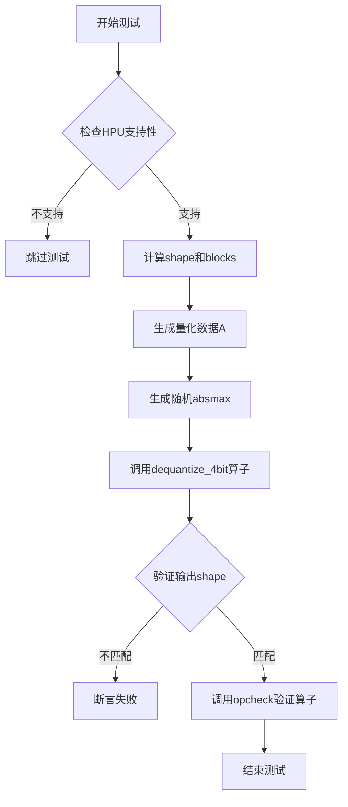

#### 带注释源码

```python
@pytest.mark.parametrize("device", get_available_devices())
@pytest.mark.parametrize("dtype", [torch.float16, torch.bfloat16, torch.float32], ids=id_formatter("dtype"))
@pytest.mark.parametrize("storage_dtype", [torch.uint8, torch.bfloat16], ids=id_formatter("storage_dtype"))
@pytest.mark.parametrize("quant_type", ["fp4", "nf4"])
@pytest.mark.parametrize("blocksize", [32, 64, 128, 256, 512] if not ROCM_WARP_SIZE_64 else [64, 128, 256, 512])
def test_dequantize_4bit(self, device, dtype, storage_dtype, quant_type, blocksize):
    """
    测试 4 位块量化解量化功能
    
    参数:
        device: 测试设备 (cuda, cpu, hpu, mps)
        dtype: 解量化目标数据类型 (float16, bfloat16, float32)
        storage_dtype: 量化数据存储类型 (uint8, bfloat16)
        quant_type: 量化类型 (fp4, nf4)
        blocksize: 量化块大小
    """
    # 检查 HPU 设备是否支持该配置，不支持则跳过
    if device == "hpu" and not is_supported_on_hpu(quant_type, dtype, storage_dtype):
        pytest.skip("This configuration is not supported on HPU.")

    # 定义输出形状为 128x128
    shape = (128, 128)

    # 计算总元素数量
    n = prod(shape)
    # 计算块数量（向上取整）
    blocks = -(n // -blocksize)
    # 计算量化后数据的形状（每个 uint8 存储 2 个 4 位值）
    quantized_shape = ((n + 1) // (storage_dtype.itemsize * 2), 1)

    # 生成随机量化数据 A
    # 首先生成 n+1 个字节的 uint8 数据（确保足够存储 n 个 4 位值）
    A = (
        torch.randint(0, 255, ((n + 1) // 2,), dtype=torch.uint8, device=device)
        .view(storage_dtype)          # 转换为存储数据类型
        .reshape(quantized_shape)     # 重塑为量化形状
        .contiguous()                 # 确保内存连续
    )

    # 生成随机绝对最大值（用于反量化缩放）
    absmax = torch.randn((blocks,), dtype=torch.float32, device=device)

    # 调用 bitsandbytes 的 4 位解量化算子
    out = torch.ops.bitsandbytes.dequantize_4bit.default(
        A,          # 量化输入
        absmax,     # 绝对最大值
        blocksize,  # 块大小
        quant_type, # 量化类型
        shape,      # 目标形状
        dtype       # 目标数据类型
    )

    # 验证输出设备与输入设备一致
    assert out.device == A.device
    # 验证输出形状与目标形状一致
    assert out.shape == shape

    # 使用 torch.library.opcheck 验证算子实现正确性
    opcheck(
        torch.ops.bitsandbytes.dequantize_4bit.default,
        (A, absmax, blocksize, quant_type, shape, dtype),
    )
```


### `Test4bitBlockwiseQuantOps.test_gemv_4bit`

该方法是 `Test4bitBlockwiseQuantOps` 类中的一个集成测试用例，用于验证 4 位块量化矩阵向量乘法（GEMV）功能的正确性。测试通过生成随机输入矩阵和权重矩阵，对权重进行 4 位量化，然后执行融合的量化矩阵向量乘法运算，最后验证输出结果的设备、数据类型、形状和数值有效性。

参数：

- `self`：pytest测试类实例方法的标准参数，无需显式传入
- `device`：`str`，测试设备参数，由 `get_available_devices()` 参数化提供，支持 cpu/cuda/mps/hpu 等设备
- `dtype`：`torch.dtype`，输入和输出数据类型，参数化为 `torch.float16`、`torch.bfloat16` 或 `torch.float32`
- `storage_dtype`：`torch.dtype`，量化权重存储的数据类型，参数化为 `torch.uint8` 或 `torch.bfloat16`
- `quant_type`：`str`，量化类型，参数化为 `"fp4"`（浮点 4 位）或 `"nf4"`（归一化浮点 4 位）
- `blocksize`：`int`，块量化的大小，参数化为 32/64/128/256/512（ROCM 环境下为 64/128/256/512）

返回值：`None`，该方法为测试用例，通过 pytest 断言验证功能正确性，无显式返回值

#### 流程图

```mermaid
flowchart TD
    A[开始测试] --> B{检查HPU支持性}
    B -->|不支持| C[跳过测试]
    B -->|支持| D[设置参数: out_features=1024, in_features=256]
    D --> E{检查CPU/MPS blocksize限制}
    E -->|blocksize > in_features| F[跳过测试]
    E -->|通过| G[生成随机输入矩阵A: shape (1,1,256)]
    G --> H[生成随机权重矩阵B: shape (1024,256)]
    H --> I[调用quantize_4bit对B进行4位量化]
    I --> J[获取4bit量化类型代码code]
    J --> K{Check: CPU设备且支持AVX512BF16?}
    K -->|是| L[执行CPU特殊转换处理]
    K -->|否| M[直接调用gemv_4bit计算]
    L --> M
    M --> N[断言验证: out.device == A.device]
    N --> O[断言验证: out.dtype == dtype]
    O --> P[断言验证: out.shape == (1,1,1024)]
    P --> Q[断言验证: out.isreal().all]
    Q --> R[调用opcheck验证操作注册]
    R --> S[测试完成]
```

#### 带注释源码

```python
@pytest.mark.parametrize("device", get_available_devices())
@pytest.mark.parametrize("dtype", [torch.float16, torch.bfloat16, torch.float32], ids=id_formatter("dtype"))
@pytest.mark.parametrize("storage_dtype", [torch.uint8, torch.bfloat16], ids=id_formatter("storage_dtype"))
@pytest.mark.parametrize("quant_type", ["fp4", "nf4"])
@pytest.mark.parametrize("blocksize", [32, 64, 128, 256, 512] if not ROCM_WARP_SIZE_64 else [128, 256, 512])
@pytest.mark.skipif(ROCM_WARP_SIZE_64, reason="this test is not supported on ROCm yet")
def test_gemv_4bit(self, device, dtype, storage_dtype, quant_type, blocksize):
    # 检查HPU设备是否支持当前量化配置，不支持则跳过测试
    if device == "hpu" and not is_supported_on_hpu(quant_type, dtype, storage_dtype):
        pytest.skip("This configuration is not supported on HPU.")

    # 定义输出特征维度和输入特征维度
    out_features = 1024
    in_features = 256

    # CPU和MPS设备仅支持blocksize <= in_features，超出则跳过
    if device in ("cpu", "mps") and blocksize > in_features:
        pytest.skip("CPU/MPS implementation only supports blocksize <= in_features")

    # 创建输入矩阵A: 三维张量 (batch=1, seq=1, in_features=256)
    A = torch.randn((1, 1, in_features), dtype=dtype, device=device)
    # 创建权重矩阵B: 二维张量 (out_features=1024, in_features=256)
    B = torch.randn((out_features, in_features), dtype=dtype, device=A.device)
    # 对权重矩阵B进行4位量化，返回量化后张量B_q和absmax统计量
    B_q, absmax = torch.ops.bitsandbytes.quantize_4bit(B, blocksize, quant_type, storage_dtype)
    # 获取4bit量化类型的codebook（编码本），用于反量化
    code = bitsandbytes.functional.get_4bit_type(quant_type, device=A.device, blocksize=blocksize)

    # 针对CPU设备且支持AVX512BF16的特殊处理路径
    if device == "cpu" and bitsandbytes.functional.has_avx512bf16():
        # 构建量化状态对象，包含量化参数和元数据
        state = bitsandbytes.functional.QuantState(
            absmax=absmax,
            shape=B.shape,
            dtype=A.dtype,
            blocksize=blocksize,
            code=code,
            quant_type=quant_type,
        )
        # 对CPU后端进行权重 packed 格式转换
        B_q, state = bitsandbytes.functional._convert_weight_packed_for_cpu(B_q, state)
        # 更新absmax为转换后的统计量
        absmax = state.absmax
    
    # 执行4bit量化的矩阵向量乘法: out = A @ B (其中B经过4bit量化)
    # 参数依次为: 输入A, 量化权重B_q, 原始权重shape, absmax统计量, codebook, blocksize
    out = torch.ops.bitsandbytes.gemv_4bit.default(A, B_q, B.shape, absmax, code, blocksize)

    # 断言验证输出设备与输入设备一致
    assert out.device == A.device
    # 断言验证输出数据类型与预期dtype一致
    assert out.dtype == dtype
    # 断言验证输出形状为 (1, 1, out_features=1024)
    assert out.shape == (1, 1, out_features)
    # 断言验证输出所有元素均为实数（无NaN/Inf）
    assert out.isreal().all()

    # 使用torch.library.opcheck验证操作注册和元数据正确性
    # (在torch>=2.4时执行实际检查，旧版本为no-op)
    opcheck(torch.ops.bitsandbytes.gemv_4bit.default, (A, B_q, B.shape, absmax, code, blocksize))
```


### `TestNonContiguousInputs.test_quantize_blockwise_non_contiguous`

该测试方法用于验证 `bitsandbytes` 库中的 `quantize_blockwise` 操作能够正确处理非连续性张量（non-contiguous tensors）。这是一个回归测试，针对 issue #1342 和 #1690，确保量化操作在张量不连续时仍能产生与连续张量相同的结果。

参数：

-  `self`：`TestNonContiguousInputs`，测试类实例本身
-  `device`：`str`，运行测试的设备（如 cuda、cpu 等），通过 `get_available_devices()` 参数化获取
-  `dtype`：`torch.dtype`，输入张量的数据类型（float16、bfloat16 或 float32），通过参数化获取
-  `blocksize`：`int`，块量化的大小（64、128 或 256），通过参数化获取

返回值：无（`None`），该方法为测试函数，使用 `pytest` 断言验证结果，不返回任何值。

#### 流程图

```mermaid
flowchart TD
    A[开始测试] --> B{device == 'cpu'?}
    B -->|是| C[跳过测试 - 仅针对CUDA后端]
    B -->|否| D[创建动态量化代码映射<br/>code = create_dynamic_map.to device]
    D --> E[创建完整张量<br/>A_full = randn 3x4x6x256]
    E --> F[通过切片创建非连续张量<br/>A_noncontig = A_full[:, ::2, :, :]
    assert not is_contiguous]
    F --> G[创建连续副本<br/>A_contig = contiguous]
    G --> H[量化非连续张量<br/>out_nc, absmax_nc = quantize_blockwise]
    H --> I[量化连续张量<br/>out_c, absmax_c = quantize_blockwise]
    I --> J[断言 abmax_nc ≈ absmax_c]
    J --> K[断言 out_nc ≈ out_c]
    K --> L[测试通过]
```

#### 带注释源码

```python
@pytest.mark.parametrize("device", get_available_devices())  # 参数化设备：cuda, cpu等
@pytest.mark.parametrize("dtype", [torch.float16, torch.bfloat16, torch.float32], ids=id_formatter("dtype"))  # 参数化数据类型
@pytest.mark.parametrize("blocksize", [64, 128, 256])  # 参数化块大小
def test_quantize_blockwise_non_contiguous(self, device, dtype, blocksize):
    """
    回归测试 #1342 和 #1690: 量化必须正确处理非连续张量
    验证 quantize_blockwise 对连续和非连续输入产生相同结果
    """
    # CPU后端不需要此修复，跳过测试
    if device == "cpu":
        pytest.skip("Non-contiguous fix targets CUDA backend only")

    # 创建动态量化代码映射并转移到目标设备
    code = bitsandbytes.functional.create_dynamic_map().to(device)

    # 创建一个完整的多维张量 (3, 4, 6, 256)
    A_full = torch.randn(3, 4, 6, 256, dtype=dtype, device=device)
    
    # 通过步长切片创建非连续张量 (取第0,2,4个元素)
    # 这会创建一个非连续视图，模拟真实场景中的非连续输入
    A_noncontig = A_full[:, ::2, :, :]
    
    # 验证张量确实是非连续的
    assert not A_noncontig.is_contiguous()

    # 创建连续副本用于对比
    A_contig = A_noncontig.contiguous()

    # 使用 bitsandbytes 的 blockwise 量化操作处理非连续张量
    out_nc, absmax_nc = torch.ops.bitsandbytes.quantize_blockwise(
        A_noncontig,  # 非连续输入张量
        code,         # 动态量化代码
        blocksize     # 块大小
    )

    # 使用相同的量化操作处理连续张量
    out_c, absmax_c = torch.ops.bitsandbytes.quantize_blockwise(
        A_contig,     # 连续输入张量（副本）
        code,         # 相同的量化代码
        blocksize     # 相同的块大小
    )

    # 验证量化后的绝对最大值（absmax）相同
    # 这是关键验证点：确保非连续张量的统计量计算正确
    torch.testing.assert_close(absmax_nc, absmax_c)

    # 验证量化后的输出数据相同
    # 确保非连续张量的量化值计算正确
    torch.testing.assert_close(out_nc, out_c)
```


### TestNonContiguousInputs.test_dequantize_blockwise_non_contiguous

这是一个回归测试方法，用于验证 `bitsandbytes` 库在处理非连续（non-contiguous）张量时的反量化（dequantize）功能是否正确。该测试针对 Issue #1342 和 #1690，确保量化操作能够正确处理非连续内存布局的张量。

参数：

- `self`：TestCase 实例本身的引用，类型为 `TestNonContiguousInputs`，表示测试类实例
- `device`：字符串类型，表示测试运行的设备（如 "cuda"、"cpu" 等），通过 `get_available_devices()` 参数化获取
- `dtype`：torch.dtype 类型（torch.float16、torch.bfloat16 或 torch.float32），表示输入张量的数据类型
- `blocksize`：整数类型（64、128 或 256），表示量化块大小

返回值：`None`，此方法为 pytest 测试方法，无返回值，通过断言验证正确性

#### 流程图

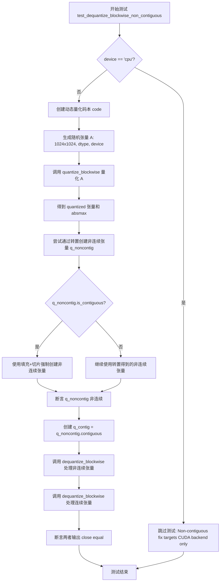

#### 带注释源码

```python
@pytest.mark.parametrize("device", get_available_devices())
@pytest.mark.parametrize("dtype", [torch.float16, torch.bfloat16, torch.float32], ids=id_formatter("dtype"))
@pytest.mark.parametrize("blocksize", [64, 128, 256])
def test_dequantize_blockwise_non_contiguous(self, device, dtype, blocksize):
    """
    回归测试: 验证非连续张量的反量化功能
    
    针对问题 #1342 和 #1690: 量化必须正确处理非连续张量
    此测试确保 dequantize_blockwise 操作在非连续张量上产生正确结果
    """
    # CPU 后端不需要此修复，跳过测试
    if device == "cpu":
        pytest.skip("Non-contiguous fix targets CUDA backend only")

    # 创建动态量化码本（codebook），用于量化操作
    # 转换为指定设备的 float32 类型码本
    code = bitsandbytes.functional.create_dynamic_map().to(device, dtype=torch.float32)

    # ============================================================
    # 步骤 1: 创建原始连续张量并量化
    # ============================================================
    # 生成 1024x1024 的随机浮点张量 A
    A = torch.randn(1024, 1024, dtype=dtype, device=device)
    # 调用 bitsandbytes 的块级量化操作
    quantized, absmax = torch.ops.bitsandbytes.quantize_blockwise(A, code, blocksize)
    # quantized: uint8 类型的量化后张量
    # absmax: 每个块的绝对最大值，用于反量化时的缩放

    # ============================================================
    # 步骤 2: 创建非连续张量
    # ============================================================
    # 方法1: 通过转置创建非连续张量
    # 两次转置 (t().t()) 通常会使张量变为非连续
    q_noncontig = quantized.t().t()
    
    # 如果转置后仍然是连续的，使用备用方法
    if q_noncontig.is_contiguous():
        # 方法2: 通过填充+切片强制创建非连续张量
        # 创建一个稍大的张量 (1024x1025)，然后只使用前 1024 列
        # 这种切片操作会产生非连续张量
        q_padded = torch.zeros(1024, 1025, dtype=torch.uint8, device=device)
        q_padded[:, :1024] = quantized  # 复制数据到左侧
        q_noncontig = q_padded[:, :1024]  # 切片创建非连续视图

    # 验证确实创建了非连续张量
    assert not q_noncontig.is_contiguous()
    
    # 创建连续副本用于对比测试
    q_contig = q_noncontig.contiguous()

    # ============================================================
    # 步骤 3: 执行反量化并验证结果一致性
    # ============================================================
    # 对非连续张量进行反量化
    out_nc = torch.ops.bitsandbytes.dequantize_blockwise(
        q_noncontig,  # 非连续量化张量
        absmax,       # 块级绝对最大值
        code,         # 量化码本
        blocksize,    # 块大小
        dtype         # 目标数据类型
    )
    
    # 对连续张量进行反量化
    out_c = torch.ops.bitsandbytes.dequantize_blockwise(
        q_contig,    # 连续量化张量（副本）
        absmax,
        code,
        blocksize,
        dtype
    )

    # ============================================================
    # 步骤 4: 验证两者输出完全一致
    # ============================================================
    # 这是测试的核心断言：确保非连续张量产生与连续张量相同的结果
    torch.testing.assert_close(out_nc, out_c)
```


### `TestNonContiguousInputs.test_quantize_4bit_non_contiguous`

这是一个回归测试方法，用于验证 4bit 量化操作能够正确处理非连续张量（non-contiguous tensors）。该测试针对 CUDA 设备，通过比较非连续张量与其连续副本的量化结果，确保量化逻辑在处理非连续内存布局时不会出错。

参数：

- `self`：类的实例对象，无需显式传递
- `device`：`str`，测试运行的设备（通过 `get_available_devices()` 参数化获取）
- `dtype`：`torch.dtype`，输入张量的数据类型（`torch.float16`、`torch.bfloat16` 或 `torch.float32`）
- `quant_type`：`str`，量化类型（`"fp4"` 或 `"nf4"`）
- `blocksize`：`int`，量化块大小（`64`、`128` 或 `256`）

返回值：`None`，该方法为测试方法，无返回值，通过 `torch.testing.assert_close` 断言验证结果正确性

#### 流程图

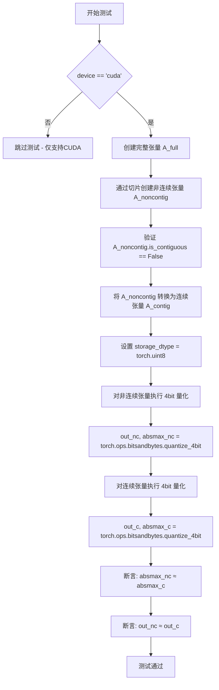

#### 带注释源码

```python
@pytest.mark.parametrize("device", get_available_devices())
@pytest.mark.parametrize("dtype", [torch.float16, torch.bfloat16, torch.float32], ids=id_formatter("dtype"))
@pytest.mark.parametrize("quant_type", ["fp4", "nf4"])
@pytest.mark.parametrize("blocksize", [64, 128, 256])
def test_quantize_4bit_non_contiguous(self, device, dtype, quant_type, blocksize):
    """
    回归测试：验证 4bit 量化能正确处理非连续张量（对应 issue #1342）
    """
    # 仅在 CUDA 设备上运行此测试
    if device != "cuda":
        pytest.skip("Non-contiguous fix targets CUDA backend only")

    # 步骤1：创建一个多维完整张量 (3, 4, 6, 256)
    A_full = torch.randn(3, 4, 6, 256, dtype=dtype, device=device)
    
    # 步骤2：通过切片创建非连续张量（跳步切片导致内存不连续）
    A_noncontig = A_full[:, ::2, :, :]
    
    # 验证：张量确实是非连续的
    assert not A_noncontig.is_contiguous()

    # 步骤3：创建对应的连续副本（用于对比测试）
    A_contig = A_noncontig.contiguous()
    
    # 步骤4：设置存储数据类型为 uint8
    storage_dtype = torch.uint8

    # 步骤5：对非连续张量进行 4bit 量化
    out_nc, absmax_nc = torch.ops.bitsandbytes.quantize_4bit(
        A_noncontig, blocksize, quant_type, storage_dtype
    )

    # 步骤6：对连续张量进行 4bit 量化（使用相同参数）
    out_c, absmax_c = torch.ops.bitsandbytes.quantize_4bit(
        A_contig, blocksize, quant_type, storage_dtype
    )

    # 步骤7：验证量化结果一致性
    # 比较绝对最大值（每个量化块的缩放因子）
    torch.testing.assert_close(absmax_nc, absmax_c)
    
    # 比较量化后的数据
    torch.testing.assert_close(out_nc, out_c)
```


### `TestNonContiguousInputs.test_quantize_4bit_roundtrip_non_contiguous`

端到端测试方法，验证 4bit 量化对非连续张量的处理是否正确。该测试通过量化非连续输入、解量化，然后与连续路径的结果进行比较，确保量化/解量化往返过程对连续性和非连续性张量都能产生一致的结果。

参数：

- `self`：`TestNonContiguousInputs`，测试类实例
- `device`：`str`，从 `get_available_devices()` 获取的可用设备（如 "cuda"）
- `dtype`：`torch.dtype`，输入张量的数据类型（`torch.float16`、`torch.bfloat16`、`torch.float32`）
- `quant_type`：`str`，量化类型（"fp4" 或 "nf4"）
- `blocksize`：`int`，量化块大小（64、128、256）

返回值：`None`，pytest 测试方法无返回值

#### 流程图

```mermaid
flowchart TD
    A[开始测试] --> B{device == 'cuda'}
    B -->|否| C[跳过测试: 仅支持 CUDA]
    B -->|是| D[创建完整张量 A_full: 3x4x6x256]
    D --> E[通过切片创建非连续张量 A_noncontig: A_full[:, ::2, :, :]]
    E --> F[验证 A_noncontig 非连续]
    F --> G[将非连续张量转为连续张量 A_contig]
    G --> H[调用 quantize_4bit 量化非连续张量<br/>q_nc, absmax_nc = torch.ops.bitsandbytes.quantize_4bit<br/>A_noncontig, blocksize, quant_type, storage_dtype]
    H --> I[调用 quantize_4bit 量化连续张量<br/>q_c, absmax_c = torch.ops.bitsandbytes.quantize_4bit<br/>A_contig, blocksize, quant_type, storage_dtype]
    I --> J[调用 dequantize_4bit 解量化非连续结果<br/>deq_nc = torch.ops.bitsandbytes.dequantize_4bit<br/>q_nc, absmax_nc, blocksize, quant_type, shape, dtype]
    J --> K[调用 dequantize_4bit 解量化连续结果<br/>deq_c = torch.ops.bitsandbytes.dequantize_4bit<br/>q_c, absmax_c, blocksize, quant_type, shape, dtype]
    K --> L{deq_nc ≈ deq_c}
    L -->|是| M[测试通过]
    L -->|否| N[测试失败: 抛出 AssertionError]
```

#### 带注释源码

```python
@pytest.mark.parametrize("device", get_available_devices())
@pytest.mark.parametrize("dtype", [torch.float16, torch.bfloat16, torch.float32], ids=id_formatter("dtype"))
@pytest.mark.parametrize("quant_type", ["fp4", "nf4"])
@pytest.mark.parametrize("blocksize", [64, 128, 256])
def test_quantize_4bit_roundtrip_non_contiguous(self, device, dtype, quant_type, blocksize):
    """End-to-end test: quantize non-contiguous, dequantize, compare with contiguous path."""
    # 仅在 CUDA 设备上运行，因为非连续修复针对 CUDA 后端
    if device != "cuda":
        pytest.skip("Non-contiguous fix targets CUDA backend only")

    # 步骤 1: 创建完整的 4D 张量 (3, 4, 6, 256)
    # 用于模拟真实场景中的非连续张量来源
    A_full = torch.randn(3, 4, 6, 256, dtype=dtype, device=device)
    
    # 步骤 2: 通过切片创建非连续张量
    # 使用 ::2 步长切片使得张量在内存上不连续
    # 这是复现 issue #1342 的关键
    A_noncontig = A_full[:, ::2, :, :]
    
    # 断言: 验证张量确实是非连续的
    assert not A_noncontig.is_contiguous()

    # 步骤 3: 创建对应的连续张量作为参考
    A_contig = A_noncontig.contiguous()
    
    # 存储数据类型为 uint8 (8位无符号整数)
    storage_dtype = torch.uint8

    # 步骤 4: 量化非连续张量
    # 调用 bitsandbytes 的 4bit 量化操作
    q_nc, absmax_nc = torch.ops.bitsandbytes.quantize_4bit(
        A_noncontig, blocksize, quant_type, storage_dtype
    )

    # 步骤 5: 量化连续张量（对照组）
    q_c, absmax_c = torch.ops.bitsandbytes.quantize_4bit(
        A_contig, blocksize, quant_type, storage_dtype
    )

    # 步骤 6: 获取原始张量形状用于解量化
    shape = A_contig.shape

    # 步骤 7: 解量化非连续张量的量化结果
    deq_nc = torch.ops.bitsandbytes.dequantize_4bit(
        q_nc, absmax_nc, blocksize, quant_type, shape, dtype
    )

    # 步骤 8: 解量化连续张量的量化结果（对照组）
    deq_c = torch.ops.bitsandbytes.dequantize_4bit(
        q_c, absmax_c, blocksize, quant_type, shape, dtype
    )

    # 步骤 9: 验证往返结果一致性
    # 使用 torch.testing.assert_close 进行浮点数近似比较
    torch.testing.assert_close(deq_nc, deq_c)
```

## 关键组件


### 张量索引与惰性加载

通过 `TestNonContiguousInputs` 类实现非连续张量测试，确保量化操作正确处理通过切片创建的张量（如 `A_full[:, ::2, :, :]`），验证索引操作不会导致数据错误或额外内存分配。

### 反量化支持

`dequantize_blockwise` 和 `dequantize_4bit` 操作实现从量化格式（uint8/fp4/nf4）恢复原始精度（float16/bfloat16/float32），结合 `absmax` 缩放因子进行数值重建。

### 量化策略

包括三种量化方式：向量级量化（int8_vectorwise_quant）按行统计异常值；块级量化（quantize_blockwise）将张量划分为固定大小块进行独立缩放；4位量化（quantize_4bit）支持fp4和nf4两种格式。

### 8位矩阵运算

`int8_linear_matmul` 实现int8矩阵乘法，`int8_scaled_mm` 支持带偏置的缩放矩阵乘法并输出目标精度，`int8_mm_dequant` 完成矩阵乘法后的反量化计算。

### 4位矩阵运算

`gemv_4bit` 实现4位权重与输入的矩阵向量乘法，`quantize_4bit` 和 `dequantize_4bit` 处理4位格式的量化与反量化流程。

### 设备与精度适配

通过 `ROCM_WARP_SIZE_64` 判断ROCm平台，动态调整块大小；测试覆盖CPU/CUDA/HPU等多种设备，以及float16/bfloat16/float32精度。

## 问题及建议


### 已知问题

-   **重复的测试参数配置**：blocksize 参数在不同测试类中重复定义，且根据 ROCM_WARP_SIZE_64 条件有不同的值，维护时需同时修改多处。
-   **硬编码的张量维度**：多处使用 (1024, 1024)、(10, 20)、(30, 20) 等硬编码尺寸，缺乏统一的测试fixture或常量定义。
-   **分散的设备跳过逻辑**：device=='cpu'、device=='hpu'、device=='mps' 等跳过条件在多个测试方法中重复出现，导致代码冗余。
-   **已知的失败用例未修复**：test_quantize_4bit 中对 storage_dtype != torch.uint8 使用 pytest.xfail，表明该场景已知不工作但未实现。
-   **重复的断言模式**：几乎每个测试都重复检查 shape、dtype、device，一致的断言逻辑未抽取为辅助函数。
-   **版本兼容代码冗余**：torch.__version__ >= (2, 4) 的检查和 opcheck 的条件定义分散在文件头部，增加维护成本。
- **测试逻辑内联**：test_gemv_4bit 中包含复杂的张量准备和条件处理逻辑（如 has_avx512bf18 判断），测试职责过重。
- **非连续张量测试覆盖不全**：TestNonContiguousInputs 仅针对 CUDA 后端，CPU 和其他后端的非连续张量处理未验证。
- **缺乏错误输入测试**：未覆盖非法 blocksize、dtype 不匹配、shape 不兼容等边界情况的测试。
- **opcheck 降级处理不当**：旧版本 PyTorch 下 opcheck 是空操作，可能掩盖底层 C++ 扩展的实际问题。

### 优化建议

-   **提取公共测试fixture**：将常用的设备列表、dtype 列表、blocksize 列表等定义为 pytest fixture 或模块级常量。
-   **创建设备跳过装饰器**：封装常见设备跳过条件为自定义 pytest mark 或 fixture，减少重复代码。
-   **抽取断言辅助函数**：编写 assert_tensor_properties(out, expected_shape, expected_dtype, expected_device) 等辅助函数。
-   **统一 blocksize 配置**：在模块级别根据 ROCM_WARP_SIZE_64 定义统一的 BLOCKSIZES 常量。
-   **修复或移除 xfail**：对 storage_dtype != torch.uint8 的场景进行实现，或在文档中明确说明限制。
-   **增强测试覆盖率**：添加异常输入测试（负数 blocksize、不兼容的 dtype 组合、空张量等）。
-   **简化版本兼容代码**：使用 try/except 导入或依赖 torch.utils.backcompat 等官方兼容性方案。
-   **拆分复杂测试**：将 test_gemv_4bit 中的复杂设置逻辑抽取为独立的辅助函数或 fixture。
-   **扩展非连续张量测试**：为 CPU、HPU 等后端添加非连续张量回归测试。

## 其它


### 设计目标与约束

本测试套件旨在验证bitsandbytes量化库的核心功能，包括int8和4bit量化操作。设计目标包括：1）确保量化/反量化操作的数值正确性；2）验证非连续张量的正确处理；3）覆盖多种硬件平台（CPU、CUDA、HPU、MPS）；4）支持多种数据类型（float16、bfloat16、float32）。约束条件包括：CPU实现仅支持float32和blocksize=256；某些操作不支持ROCM平台；HPU平台存在特定的量化类型和存储类型限制。

### 错误处理与异常设计

测试采用pytest框架的条件跳过机制处理错误场景。使用`pytest.skip()`处理不支持的配置组合，如设备不支持、版本不兼容等情况。使用`pytest.xfail()`标记预期失败的测试（如storage_dtype不等于uint8时的opcheck失败）。对于断言失败，使用`torch.testing.assert_close()`进行近似相等比较，适用于浮点数量化误差的容差处理。

### 数据流与状态机

量化数据流遵循以下路径：输入浮点张量 → 量化操作（生成量化值+统计信息）→ 存储/传输 → 反量化操作 → 输出浮点张量。int8量化使用row_stats和col_stats进行缩放；4bit块级量化使用absmax和codebook。状态管理通过QuantState对象维护，包含absmax、shape、dtype、blocksize、code和quant_type等属性。测试验证了量化-反量化的往返一致性。

### 外部依赖与接口契约

核心依赖包括：PyTorch 2.4+用于opcheck功能（旧版本作为no-op）；bitsandbytes库自身（bitsandbytes.cextension、bitsandbytes.functional）；测试辅助模块（tests.helpers）。外部接口契约通过torch.ops.bitsandbytes命名空间暴露，包括：int8_linear_matmul、int8_vectorwise_quant、int8_mm_dequant、int8_scaled_mm、quantize_blockwise、dequantize_blockwise、quantize_4bit、dequantize_4bit、gemv_4bit。所有操作遵循PyTorch的device和dtype传播规则。

### 性能考虑与基准测试

测试未包含显式性能基准，但通过参数化测试覆盖了不同blocksize（32/64/128/256/512）和矩阵维度（10x20到1024x1024）的组合。CPU实现对blocksize=256进行了特殊优化，其他blocksize会被跳过以避免测试时间过长。测试验证了opcheck兼容性，确保操作在底层CUDA/HIP内核中的实现效率。

### 版本兼容性

代码明确处理PyTorch版本兼容性：torch.library.opcheck仅在torch>=2.4时可用，否则使用lambda作为no-op。ROCM平台支持通过ROCM_WARP_SIZE_64常量区分，64-warp模式下blocksize参数范围受限。测试ID格式化器用于生成清晰的测试名称，包含dtype和storage_dtype信息。

### 安全性考虑

测试主要关注功能正确性，无直接安全敏感操作。量化操作使用整数运算避免浮点时序攻击。输入值范围通过torch.randint限制在int8范围内（-128到127）。所有张量操作在已分配的GPU/CPU内存内完成，无外部资源泄露风险。

### 部署注意事项

该测试代码为开发/验证用途，部署时需确保：1）bitsandbytes库正确安装且与PyTorch版本兼容；2）CUDA/HIP驱动支持所需计算能力；3）测试环境具有足够GPU内存（部分测试使用1024x1024矩阵）；4）如需在ROCM环境运行，需注意部分测试被标记为不支持。

    