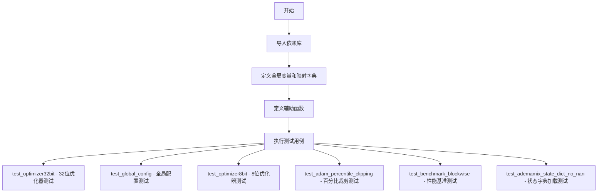
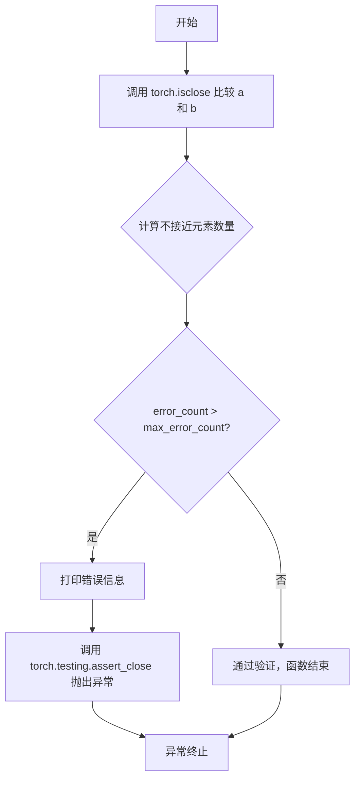
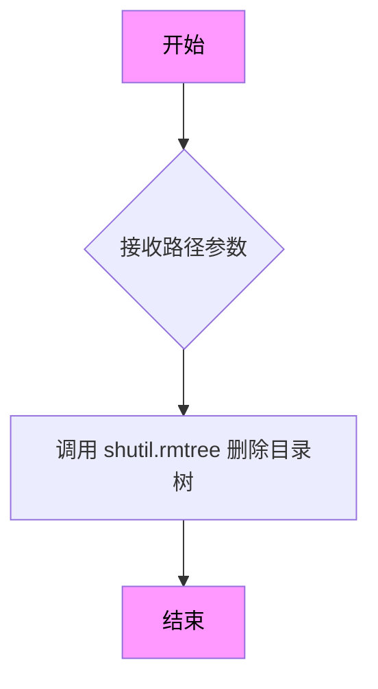
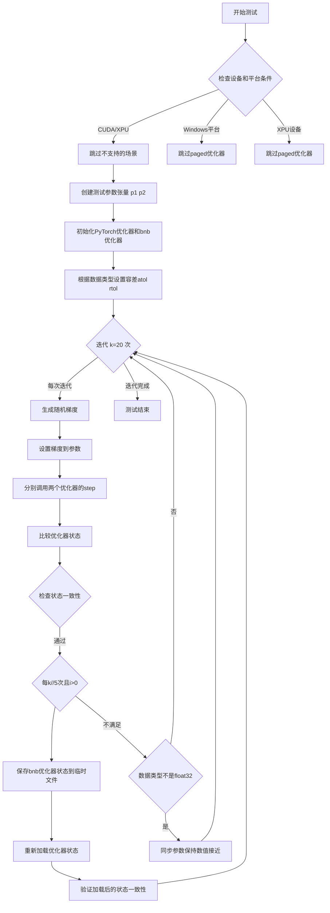
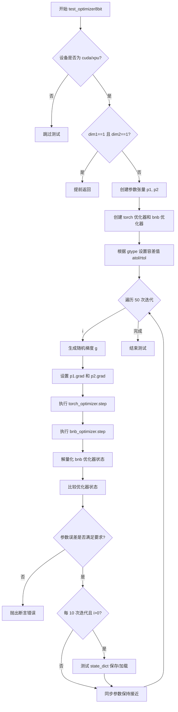
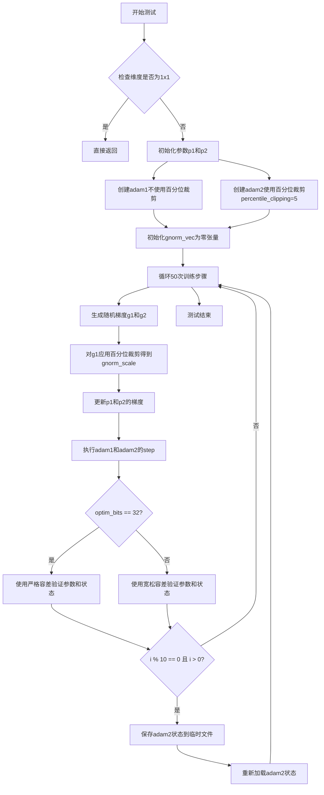
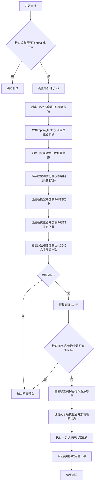

# `bitsandbytes\tests\test_optim.py` 详细设计文档

这是一个bitsandbytes库的优化器测试文件，用于验证各种优化器（Adam, Lion, AdEMAMix等）的数值正确性、状态字典保存加载、以及8-bit和32-bit优化器的性能，支持float32/float16/bfloat16等多种数值精度。

## 整体流程



## 类结构

```
无类定义（纯测试模块）
```

## 全局变量及字段


### `k`
    
全局迭代次数常量，用于控制测试中的迭代次数

类型：`int`
    


### `str2optimizers`
    
优化器名称到PyTorch原生优化器和bitsandbytes优化器类元组的映射字典

类型：`Dict[str, Tuple[Optional[Callable], Callable]]`
    


### `str2statenames`
    
优化器名称到优化器状态变量名列表的映射字典，用于对齐PyTorch和bnb优化器的状态变量

类型：`Dict[str, List[Union[Tuple[str, str], Tuple[str, str, str, str]]]]`
    


### `optimizer_names_32bit`
    
32位精度优化器测试名称列表，包含adam、paged_adamw、paged_adam、momentum、rmsprop、lion等优化器

类型：`List[str]`
    


### `optimizer_names_8bit`
    
8位精度优化器测试名称列表，包含adam8bit_blockwise、lion8bit_blockwise、momentum8bit_blockwise等优化器

类型：`List[str]`
    


### `optimizer_names_benchmark`
    
性能基准测试优化器列表，包含各种8位分块优化器用于性能评估

类型：`List[str]`
    


### `ademamix_state_dict_opts`
    
AdEMAMix优化器状态字典测试选项列表，包含优化器名称和对应的工厂函数

类型：`List[Tuple[str, Callable]]`
    


    

## 全局函数及方法


### `assert_most_approx_close`

该函数是一个数值近似断言函数，用于比较两个张量是否在指定的容差范围内接近。如果不接近的元素数量超过允许的最大错误计数，则抛出断言错误。

参数：

- `a`：`torch.Tensor`，第一个要比较的张量
- `b`：`torch.Tensor`，第二个要比较的张量
- `rtol`：`float`，相对容差（relative tolerance），默认值为 `1e-3`
- `atol`：`float`，绝对容差（absolute tolerance），默认值为 `1e-3`
- `max_error_count`：`int`，允许的最大不接近元素数量，默认值为 `0`

返回值：`None`，该函数不返回任何值，仅在断言失败时抛出异常

#### 流程图



#### 带注释源码

```python
def assert_most_approx_close(a, b, rtol=1e-3, atol=1e-3, max_error_count=0):
    """
    数值近似断言函数，用于比较两个张量是否在指定容差范围内接近。
    
    参数:
        a: 第一个要比较的张量
        b: 第二个要比较的张量
        rtol: 相对容差，默认 1e-3
        atol: 绝对容差，默认 1e-3
        max_error_count: 允许的最大不接近元素数量，默认 0
    """
    # 使用 torch.isclose 检查两个张量的元素是否在容差范围内接近
    idx = torch.isclose(a, b, rtol=rtol, atol=atol)
    
    # 计算不接近的元素数量
    # idx == 0 表示不接近的元素，sum().item() 将其转为 Python 整数
    error_count = (idx == 0).sum().item()
    
    # 如果不接近的元素数量超过允许的最大值
    if error_count > max_error_count:
        # 打印详细的错误信息
        print(f"Too many values not close: assert {error_count} < {max_error_count}")
        
        # 调用 torch.testing.assert_close 触发断言错误
        # 这会抛出详细的比较失败异常，包含实际的差异信息
        torch.testing.assert_close(a, b, rtol=rtol, atol=atol)
```


### `get_temp_dir`

该函数用于创建唯一的临时目录，基于UUID生成唯一的目录名称，常用于测试过程中保存和加载优化器状态。

参数：

- （无参数）

返回值：`str`，返回创建的临时目录的绝对路径字符串。

#### 流程图

```mermaid
flowchart TD
    A[开始] --> B[生成UUID]
    B --> C[构建路径: /tmp/autoswap/{uuid}]
    C --> D{目录是否已存在}
    D -->|否| E[创建目录 os.makedirs]
    D -->|是| F[跳过创建]
    E --> G[返回路径字符串]
    F --> G
    G --> H[结束]
```

#### 带注释源码

```python
def get_temp_dir():
    """创建唯一的临时目录用于测试过程中的文件暂存。
    
    该函数生成一个基于UUID的唯一路径，确保每次调用都会返回
    一个全新的目录，避免文件名冲突。常用于保存优化器状态字典
    或模型检查点，以便后续加载测试。
    
    Returns:
        str: 创建的临时目录的绝对路径，格式为 /tmp/autoswap/{uuid}
    """
    # 使用UUID生成唯一的目录名称，确保全局唯一性
    path = f"/tmp/autoswap/{uuid.uuid4()}"
    # 创建目录，exist_ok=True 表示如果目录已存在不会抛出异常
    os.makedirs(path, exist_ok=True)
    # 返回创建的目录路径
    return path
```


### `rm_path`

该函数是一个简单的目录清理工具函数，用于删除指定路径的整个目录树。

参数：

- `path`：`str`，要删除的目录路径

返回值：`None`，该函数不返回任何值，仅执行目录删除操作

#### 流程图



#### 带注释源码

```python
def rm_path(path):
    """
    删除指定路径的目录树。
    
    参数:
        path: str, 要删除的目录路径
    
    返回:
        None
    
    注意:
        - 该函数会递归删除目录及其所有内容
        - 如果目录不存在，会抛出 FileNotFoundError 异常
    """
    shutil.rmtree(path)
```


### `test_optimizer32bit`

32位优化器一致性测试函数，用于验证bitsandbytes库中的32位优化器与PyTorch原生优化器在各种数据类型（float32/float16/bfloat16）和维度下的行为一致性，并通过状态保存/加载验证优化器的序列化能力。

参数：

- `dim1`：整数，测试矩阵的第一维大小（固定为1024），用于创建测试参数张量的维度
- `dim2`：整数，测试矩阵的第二维大小（可选32/1024/4097/1），用于创建测试参数张量的维度
- `gtype`：`torch.dtype`，梯度数据类型，支持float32/float16/bfloat16三种精度
- `optim_name`：字符串，优化器名称，用于从`str2optimizers`字典获取对应的PyTorch和bnb优化器实现
- `device`：字符串，计算设备（cuda/xpu），用于指定张量和优化器运行的设备

返回值：`None`，该函数为pytest测试函数，无返回值，通过断言验证正确性

#### 流程图



#### 带注释源码

```python
@pytest.mark.parametrize("optim_name", optimizer_names_32bit, ids=id_formatter("opt"))
@pytest.mark.parametrize("gtype", [torch.float32, torch.float16, torch.bfloat16], ids=describe_dtype)
@pytest.mark.parametrize("dim1", [1024], ids=id_formatter("dim1"))
@pytest.mark.parametrize("dim2", [32, 1024, 4097, 1], ids=id_formatter("dim2"))
@pytest.mark.parametrize("device", get_available_devices(no_cpu=True), ids=id_formatter("device"))
@pytest.mark.skipif(not get_available_devices(no_cpu=True), reason="No device")
def test_optimizer32bit(dim1, dim2, gtype, optim_name, device):
    """
    32位优化器一致性测试：验证bitsandbytes优化器与PyTorch原生优化器的行为一致性
    
    参数:
        dim1: 矩阵第一维大小
        dim2: 矩阵第二维大小  
        gtype: 梯度数据类型（float32/float16/bfloat16）
        optim_name: 优化器名称
        device: 计算设备（cuda/xpu）
    """
    
    # 设备兼容性检查：仅支持CUDA和XPU设备
    if device not in ["cuda", "xpu"]:
        pytest.skip("Optimizers are only supported on CUDA and XPU")

    # Windows平台paged优化器存在已知问题，跳过测试
    if optim_name.startswith("paged_") and sys.platform == "win32":
        pytest.skip("Paged optimizers can have issues on Windows.")

    # XPU设备暂不支持paged优化器
    if optim_name.startswith("paged_") and device == "xpu":
        pytest.skip("Paged optimizers are not supported on XPU currently.")

    # bfloat16对momentum和rmsprop支持不完整，跳过
    if gtype == torch.bfloat16 and optim_name in ["momentum", "rmsprop"]:
        pytest.skip()
    
    # 特殊情况：1x1矩阵跳过测试
    if dim1 == 1 and dim2 == 1:
        return
    
    # 创建两个相同初始值的参数张量，一个用于PyTorch优化器，一个用于bnb优化器
    p1 = torch.randn(dim1, dim2, device=device, dtype=gtype) * 0.1
    p2 = p1.clone()
    p1 = p1.float()  # PyTorch优化器使用float32进行内部计算

    # 从预定义字典获取优化器构造函数并初始化
    torch_optimizer = str2optimizers[optim_name][0]([p1])
    bnb_optimizer = str2optimizers[optim_name][1]([p2])

    # 根据数据类型设置数值比较容差
    if gtype == torch.float32:
        atol, rtol = 1e-6, 1e-5
    elif gtype == torch.bfloat16:
        atol, rtol = 1e-3, 1e-2
    else:
        atol, rtol = 1e-4, 1e-3

    # 主测试循环：执行k=20次优化步骤
    for i in range(k):
        # 生成随机梯度
        g = torch.randn(dim1, dim2, device=device, dtype=gtype) * 0.01
        p1.grad = g.clone().float()
        p2.grad = g.clone()

        # 分别调用两个优化器执行一步更新
        bnb_optimizer.step()
        torch_optimizer.step()

        # 验证优化器内部状态的一致性
        for name1, name2 in str2statenames[optim_name]:
            torch.testing.assert_close(
                torch_optimizer.state[p1][name1],
                bnb_optimizer.state[p2][name2].to(device),
                atol=atol,
                rtol=rtol,
            )

        # 验证参数更新的一致性，Lion优化器允许最多15个边界误差
        assert_most_approx_close(p1, p2.float(), atol=atol, rtol=rtol, max_error_count=15)

        # 定期保存和加载优化器状态，验证序列化功能
        if i % (k // 5) == 0 and i > 0:
            path = get_temp_dir()
            torch.save(bnb_optimizer.state_dict(), join(path, "opt.pt"))
            del bnb_optimizer
            bnb_optimizer = None
            bnb_optimizer = str2optimizers[optim_name][1]([p2])
            bnb_optimizer.load_state_dict(torch.load(join(path, "opt.pt")))
            rm_path(path)
            
            # 重新验证加载后的状态一致性
            assert_most_approx_close(p1, p2.float(), atol=atol, rtol=rtol, max_error_count=10)
            for name1, name2 in str2statenames[optim_name]:
                assert_most_approx_close(
                    torch_optimizer.state[p1][name1],
                    bnb_optimizer.state[p2][name2],
                    atol=atol,
                    rtol=rtol,
                    max_error_count=10,
                )

        # 对于非float32类型，需要同步参数以保持数值接近
        if gtype != torch.float32:
            # Adam缓冲区应该是32位的，但参数可能是16位
            # 随着每次更新差异会增大，因此复制状态保持权重接近
            p1.data = p1.data.to(p2.dtype).float()
            p2.copy_(p1.data)
            torch.testing.assert_close(p1.to(p2.dtype), p2)
        
        # LARS/LAMB特殊检查：验证unorm_vec大于0
        if optim_name in ["lars", "lamb"]:
            assert bnb_optimizer.state[p2]["unorm_vec"] > 0.0
```


### `test_global_config`

测试全局配置功能，验证 GlobalOptimManager 能否通过全局配置覆盖特定参数的优化器设置（如 optim_bits），并确保不同参数使用不同优化器配置时能正确运行。

参数：

- `dim1`：`int`，第一个维度大小，参数化值为 1024
- `dim2`：`int`，第二个维度大小，参数化值为 32, 1024, 4097
- `gtype`：`torch.dtype`，梯度数据类型，参数化为 torch.float32 或 torch.float16
- `device`：`str`，计算设备，从可用设备中获取（CUDA 或 XPU）

返回值：`None`，无返回值，该函数为测试函数，通过断言验证正确性

#### 流程图

```mermaid
flowchart TD
    A[开始 test_global_config] --> B{device in [cuda, xpu]?}
    B -->|否| C[跳过测试: Optimizers are only supported on CUDA and XPU]
    B -->|是| D{dim1==1 and dim2==1?}
    D -->|是| E[直接返回]
    D -->|否| F[在 CPU 上创建 p1, p2, p3 随机张量]
    F --> G[定义 mask, beta1=0.9, beta2=0.999, lr=0.001, eps=1e-8]
    G --> H[初始化 GlobalOptimManager 单例]
    H --> I[使用 override_config 覆盖 p3 的 optim_bits 为 8]
    I --> J[注册参数 p1, p2, p3 到全局优化器]
    J --> K[将 p1, p2, p3 移动到目标 device]
    K --> L[创建 bnb.optim.Adam 优化器实例 adam2]
    L --> M{根据 gtype 设置 atol 和 rtol}
    M --> N[循环 50 次训练步骤]
    N --> O[为 p1, p2, p3 生成随机梯度]
    O --> P[调用 adam2.step 执行优化器更新]
    P --> Q[断言 p3 的状态为 uint8 类型]
    Q --> R[循环结束]
    R --> S[测试结束]
```

#### 带注释源码

```python
@pytest.mark.parametrize("dim1", [1024], ids=id_formatter("dim1"))  # 参数化：第一个维度
@pytest.mark.parametrize("dim2", [32, 1024, 4097], ids=id_formatter("dim2"))  # 参数化：第二个维度
@pytest.mark.parametrize("gtype", [torch.float32, torch.float16], ids=describe_dtype)  # 参数化：梯度数据类型
@pytest.mark.parametrize("device", get_available_devices(no_cpu=True))  # 参数化：设备
@pytest.mark.skipif(not get_available_devices(no_cpu=True), reason="No device")  # 无设备时跳过
def test_global_config(dim1, dim2, gtype, device):
    """测试 GlobalOptimManager 全局配置覆盖功能"""
    
    # 检查设备是否支持（仅 CUDA 和 XPU）
    if device not in ["cuda", "xpu"]:
        pytest.skip("Optimizers are only supported on CUDA and XPU")

    # 边界情况：最小维度直接返回
    if dim1 == 1 and dim2 == 1:
        return
    
    # 在 CPU 上创建三个参数张量，初始化为较小的随机值
    p1 = torch.randn(dim1, dim2, device="cpu", dtype=gtype) * 0.1
    p2 = torch.randn(dim1, dim2, device="cpu", dtype=gtype) * 0.1
    p3 = torch.randn(dim1, dim2, device="cpu", dtype=gtype) * 0.1
    
    # 创建掩码（虽然在测试中未使用，但可能是为未来功能预留）
    mask = torch.rand_like(p2) < 0.1
    
    # 定义 Adam 优化器的超参数
    beta1 = 0.9
    beta2 = 0.999
    lr = 0.001
    eps = 1e-8

    # 获取 GlobalOptimManager 单例并初始化
    bnb.optim.GlobalOptimManager.get_instance().initialize()
    
    # 关键：覆盖 p3 的优化器配置，将其设置为 8-bit 优化
    bnb.optim.GlobalOptimManager.get_instance().override_config(p3, "optim_bits", 8)

    # 注册所有参数到全局优化器管理器
    bnb.optim.GlobalOptimManager.get_instance().register_parameters([p1, p2, p3])
    
    # 将参数移动到目标计算设备
    p1 = p1.to(device)
    p2 = p2.to(device)
    p3 = p3.to(device)

    # 创建 Adam 优化器，使用全局配置（p1, p2 用默认 32-bit，p3 用覆盖的 8-bit）
    adam2 = bnb.optim.Adam([p1, p2, p3], lr, (beta1, beta2), eps)

    # 根据数据类型设置数值容差（float32 需要更严格的容差）
    if gtype == torch.float32:
        atol, rtol = 1e-6, 1e-5
    else:
        atol, rtol = 1e-4, 1e-3

    # 执行 50 次优化步骤
    for i in range(50):
        # 生成随机梯度，添加偏置避免极小梯度
        g1 = torch.randn(dim1, dim2, device=device, dtype=gtype) * 0.1 + 0.001
        g2 = torch.randn(dim1, dim2, device=device, dtype=gtype) * 0.1 + 0.001
        g3 = torch.randn(dim1, dim2, device=device, dtype=gtype) * 0.1 + 0.001
        
        # 设置梯度
        p1.grad = g1
        p2.grad = g2
        p3.grad = g3

        # 执行优化步骤
        adam2.step()

        # 断言：验证 p3 的状态确实使用了 8-bit 量化（uint8 类型）
        assert adam2.state[p3]["state1"].dtype == torch.uint8
        assert adam2.state[p3]["state2"].dtype == torch.uint8
```


### `test_optimizer8bit`

8位优化器一致性测试函数，用于验证 bitsandbytes 库中的8位优化器（如 Adam8bit、Lion8bit、Momentum8bit、RMSprop8bit、AdEMAMix8bit）与参考实现（PyTorch 原生优化器或自定义参考实现）的行为一致性。

参数：

- `dim1`：`int`，参数张量的第一维大小
- `dim2`：`int`，参数张量的第二维大小
- `gtype`：`torch.dtype`，数据类型（torch.float32、torch.float16、torch.bfloat16）
- `optim_name`：`str`，优化器名称（如 "adam8bit_blockwise"、"lion8bit_blockwise" 等）
- `device`：`str`，运行设备（"cuda" 或 "xpu"）

返回值：`None`，该函数为 pytest 测试函数，无返回值

#### 流程图



#### 带注释源码

```python
@pytest.mark.parametrize("optim_name", optimizer_names_8bit, ids=id_formatter("opt"))
@pytest.mark.parametrize("gtype", [torch.float32, torch.float16, torch.bfloat16], ids=describe_dtype)
@pytest.mark.parametrize("dim2", [32, 1024, 4097], ids=id_formatter("dim2"))
@pytest.mark.parametrize("dim1", [1024], ids=id_formatter("dim1"))
@pytest.mark.parametrize("device", get_available_devices(no_cpu=True))
@pytest.mark.skipif(not get_available_devices(no_cpu=True), reason="No device")
def test_optimizer8bit(dim1, dim2, gtype, optim_name, device):
    # 检查设备是否支持：仅支持 CUDA 和 XPU
    if device not in ["cuda", "xpu"]:
        pytest.skip("8-bit optimizers are only supported on CUDA and XPU")

    # 设置打印精度为6位小数，便于调试输出
    torch.set_printoptions(precision=6)

    # 边界情况处理：避免单元素张量导致的问题
    if dim1 == 1 and dim2 == 1:
        return

    # 创建测试参数：张量 p1 用于参考优化器，p2 用于 bnb 优化器
    # p1 保持 float32 用于参考实现，p2 使用指定数据类型 gtype
    p1 = torch.randn(dim1, dim2, device=device, dtype=gtype) * 0.1
    p2 = p1.clone()
    p1 = p1.float()  # 参考优化器使用 float32
    
    # 8位块量化的块大小
    blocksize = 256

    # 根据优化器名称创建对应的参考实现和 bnb 实现
    # str2optimizers 字典映射优化器名称到 (参考优化器工厂, bnb优化器工厂) 元组
    torch_optimizer = str2optimizers[optim_name][0]([p1])
    bnb_optimizer = str2optimizers[optim_name][1]([p2])

    # 根据数据类型设置数值容差
    # float32 需要更严格的容差，bfloat16 和 float16 可以放宽
    if gtype == torch.float32:
        atol, rtol = 3e-3, 1e-3
        patol, prtol = 1e-5, 1e-3
    elif gtype == torch.bfloat16:
        atol, rtol = 3e-3, 1e-3
        patol, prtol = 1e-4, 1e-2
    else:
        atol, rtol = 3e-3, 1e-3
        patol, prtol = 1e-5, 1e-3

    # 用于记录误差的列表
    errors = []
    relerrors = []

    # 执行50次优化迭代
    for i in range(50):
        # 生成随机梯度，使用小幅度随机值
        g = torch.randn(dim1, dim2, device=device, dtype=gtype) * 0.01
        
        # 为两个优化器设置梯度
        p1.grad = g.clone().float()  # 参考优化器用 float32 梯度
        p2.grad = g.clone()          # bnb 优化器用原始类型梯度

        # 分别执行优化步骤
        torch_optimizer.step()
        bnb_optimizer.step()

        # 解量化 bnb 优化器的状态以便与参考优化器比较
        # 8位优化器内部使用量化状态，需要反量化回来
        dequant_states = []
        for name1, name2, qmap, max_val in str2statenames[optim_name]:
            # AdEMAMix 有特殊的双状态结构需要分别解量化
            if optim_name == "ademamix8bit_blockwise" and name1 == "m1_m2":
                m1 = F.dequantize_blockwise(
                    code=bnb_optimizer.state[p2][qmap],
                    absmax=bnb_optimizer.state[p2][max_val][0],
                    A=bnb_optimizer.state[p2][name2][0],
                    blocksize=blocksize,
                )
                m2 = F.dequantize_blockwise(
                    code=bnb_optimizer.state[p2][qmap],
                    absmax=bnb_optimizer.state[p2][max_val][1],
                    A=bnb_optimizer.state[p2][name2][1],
                    blocksize=blocksize,
                )
                # 堆叠两个解量化后的状态
                s1 = torch.stack((m1, m2))
            else:
                # 标准块量化解量化
                s1 = F.dequantize_blockwise(
                    code=bnb_optimizer.state[p2][qmap],
                    absmax=bnb_optimizer.state[p2][max_val],
                    A=bnb_optimizer.state[p2][name2],
                    blocksize=blocksize,
                )

            # 验证解量化状态与参考状态接近（允许最多20个不接近的点）
            num_not_close = torch.isclose(torch_optimizer.state[p1][name1], s1, atol=atol, rtol=rtol) == 0
            assert num_not_close.sum().item() < 20
            dequant_states.append(s1.clone())

        # 计算参数误差和相对误差
        err = torch.abs(p1 - p2)
        relerr = err / (torch.abs(p1) + 1e-9)
        
        # 根据数据类型验证误差范围
        if g.dtype == torch.bfloat16:
            assert err.mean() <= 0.00017
            assert relerr.mean() <= 0.0016
        else:
            assert err.mean() < 0.00006
            assert relerr.mean() < 0.0006

        # 记录误差历史
        errors.append(err.mean().item())
        relerrors.append(relerr.mean().item())

        # 每10次迭代测试 state_dict 保存和加载功能
        if i % 10 == 0 and i > 0:
            for (name1, name2, qmap, max_val), s in zip(str2statenames[optim_name], dequant_states):
                # 保存原始状态的副本
                s1cpy = s.clone()
                raws1cpy = bnb_optimizer.state[p2][name2].clone()
                qmap1 = bnb_optimizer.state[p2][qmap].clone()

                # 创建临时目录保存 state_dict
                path = get_temp_dir()
                torch.save(bnb_optimizer.state_dict(), join(path, "opt.pt"))
                
                # 销毁当前优化器，重新创建并加载 state_dict
                del bnb_optimizer
                bnb_optimizer = None
                bnb_optimizer = str2optimizers[optim_name][1]([p2])
                bnb_optimizer.load_state_dict(torch.load(join(path, "opt.pt")))
                rm_path(path)
                
                # 验证加载的状态与原始状态一致
                torch.testing.assert_close(raws1cpy, bnb_optimizer.state[p2][name2])
                torch.testing.assert_close(qmap1, bnb_optimizer.state[p2][qmap])

                # 重新解量化加载后的状态并验证
                if optim_name == "ademamix8bit_blockwise" and name1 == "m1_m2":
                    s1 = torch.stack(
                        (
                            F.dequantize_blockwise(
                                code=bnb_optimizer.state[p2][qmap],
                                absmax=bnb_optimizer.state[p2][max_val][0],
                                A=bnb_optimizer.state[p2][name2][0],
                                blocksize=blocksize,
                            ),
                            F.dequantize_blockwise(
                                code=bnb_optimizer.state[p2][qmap],
                                absmax=bnb_optimizer.state[p2][max_val][1],
                                A=bnb_optimizer.state[p2][name2][1],
                                blocksize=blocksize,
                            ),
                        )
                    )
                else:
                    s1 = F.dequantize_blockwise(
                        code=bnb_optimizer.state[p2][qmap],
                        absmax=bnb_optimizer.state[p2][max_val],
                        A=bnb_optimizer.state[p2][name2],
                        blocksize=blocksize,
                    )

                torch.testing.assert_close(s1cpy, s1)

                # 验证解量化状态与参考优化器状态一致
                num_not_close = torch.isclose(torch_optimizer.state[p1][name1], s1, atol=atol, rtol=rtol) == 0
                assert num_not_close.sum().item() < 20

            # 验证参数在 state_dict 保存/加载后仍然接近
            assert_most_approx_close(p1, p2.float(), patol, prtol, max_error_count=0)

        # 由于8位优化器参数会快速发散，需要定期同步参数
        # 这使得我们可以持续与 Adam 参考实现比较误差
        p1.data = p1.data.to(gtype).float()
        p2.copy_(p1.data)
        torch.testing.assert_close(p1.to(gtype), p2)
        
        # 同时同步优化器状态
        for (name1, name2, qmap, max_val), s in zip(str2statenames[optim_name], dequant_states):
            torch_optimizer.state[p1][name1].copy_(s.data)
```


### `test_adam_percentile_clipping`

该测试函数用于验证 Adam 优化器的百分位裁剪（percentile clipping）功能，比较使用和不使用百分位裁剪的 Adam 优化器在训练过程中的表现是否一致，并测试状态字典的保存与加载功能。

参数：

- `requires_cuda`：`pytest.fixture`，用于确保测试环境具有 CUDA 支持（但在代码中未被使用）
- `dim1`：`int`，输入张量的第一维大小，参数化为 1024
- `dim2`：`int`，输入张量的第二维大小，参数化为 32、1024、4097
- `gtype`：`torch.dtype`，梯度数据类型，参数化为 torch.float32
- `optim_bits`：`int`，优化器位数，参数化为 8 或 32

返回值：`None`，该函数为测试函数，无返回值

#### 流程图



#### 带注释源码

```python
@pytest.mark.parametrize("optim_bits", [32, 8], ids=id_formatter("optim_bits"))
@pytest.mark.parametrize("gtype", [torch.float32], ids=describe_dtype)
@pytest.mark.parametrize("dim2", [32, 1024, 4097], ids=id_formatter("dim2"))
@pytest.mark.parametrize("dim1", [1024], ids=id_formatter("dim1"))
@pytest.mark.deprecated
def test_adam_percentile_clipping(requires_cuda, dim1, dim2, gtype, optim_bits):
    """测试Adam优化器的百分位裁剪功能
    
    比较使用百分位裁剪和不使用百分位裁剪的Adam优化器的输出，
    验证两者在训练过程中产生相近的结果，并测试状态字典的序列化。
    
    参数:
        requires_cuda: pytest fixture，确保CUDA可用（代码中未使用）
        dim1: 第一个维度大小
        dim2: 第二个维度大小
        gtype: 梯度数据类型
        optim_bits: 优化器位数，8或32
    """
    # 边界条件检查：避免单元素张量导致的问题
    if dim1 == 1 and dim2 == 1:
        return
    
    # 初始化参数张量，从CPU复制到CUDA
    p1 = torch.randn(dim1, dim2, device="cpu", dtype=gtype) * 0.1
    beta1 = 0.9
    beta2 = 0.999
    lr = 0.001
    eps = 1e-8
    p1 = p1.cuda()
    p2 = p1.clone()
    
    # 创建两个Adam优化器实例：
    # adam1: 不使用百分位裁剪（基准）
    # adam2: 使用百分位裁剪（percentile_clipping=5）
    adam1 = bnb.optim.Adam([p1], lr, (beta1, beta2), eps, optim_bits=optim_bits)
    adam2 = bnb.optim.Adam(
        [p2],
        lr,
        (beta1, beta2),
        eps,
        optim_bits=optim_bits,
        percentile_clipping=5,  # 启用百分位裁剪，窗口大小为5
    )

    # 用于记录梯度范数的向量
    gnorm_vec = torch.zeros(100).cuda()
    step = 0

    # 执行50次训练迭代
    for i in range(50):
        step += 1
        # 生成随机梯度，随迭代增加偏置以模拟真实训练
        g1 = torch.randn(dim1, dim2, device="cuda", dtype=gtype) * 0.1 + (0.01 * i)
        g2 = g1.clone()
        p2.grad = g2

        # 对g1应用百分位裁剪，获取缩放因子
        # 返回值：当前梯度范数、裁剪值、梯度缩放因子
        _current_gnorm, _clip_val, gnorm_scale = F.percentile_clipping(g1, gnorm_vec, step, 5)
        # 应用缩放后的梯度
        g1 = (g1.float() * gnorm_scale).to(gtype)
        p1.grad = g1

        # 执行优化器步骤
        adam1.step()
        adam2.step()

        # 验证优化器输出：
        # 注意：gnorm_scale不是确定性的（由于warp归约），因此允许轻微差异
        if optim_bits == 32:
            # 32位优化器：使用严格容差
            torch.testing.assert_close(p1, p2)
            torch.testing.assert_close(
                adam1.state[p1]["state1"],
                adam2.state[p2]["state1"],
                atol=5e-5,
                rtol=1e-4,
            )
            torch.testing.assert_close(
                adam1.state[p1]["state2"],
                adam2.state[p2]["state2"],
                atol=5e-5,
                rtol=1e-4,
            )
        elif optim_bits == 8:
            # 8位优化器：使用更宽松的容差（量化误差）
            torch.testing.assert_close(p1, p2, atol=1e-4, rtol=1e-3)
            torch.testing.assert_close(
                adam1.state[p1]["state1"],
                adam2.state[p2]["state1"],
                atol=2,
                rtol=1e-3,
            )
            torch.testing.assert_close(
                adam1.state[p1]["state2"],
                adam2.state[p2]["state2"],
                atol=2,
                rtol=1e-3,
            )
            # 同步状态以继续测试（8位状态发散较快）
            adam1.state[p1]["state1"].copy_(adam2.state[p2]["state1"])
            adam1.state[p1]["state2"].copy_(adam2.state[p2]["state2"])
        
        # 每10次迭代测试状态字典保存/加载
        if i % 10 == 0 and i > 0:
            path = get_temp_dir()
            torch.save(adam2.state_dict(), join(path, "opt.pt"))
            del adam2
            adam2 = None
            adam2 = bnb.optim.Adam(
                [p2],
                lr,
                (beta1, beta2),
                eps,
                optim_bits=optim_bits,
                percentile_clipping=5,
            )
            adam2.load_state_dict(torch.load(join(path, "opt.pt")))
```


### `test_benchmark_blockwise`

该函数是一个性能基准测试（benchmark），用于评估 8 位块状（blockwise）优化器（如 Adam、Lion、AdEMAMix 的 8 位版本）在给定张量维度（`dim1` x `dim2`）和数据类型（`gtype`）下的执行速度。测试通过运行优化器的 `step` 方法并测量经过“预热”（burn-in）期后的平均耗时，来验证优化器的效率是否符合预期。

参数：

- `dim1`：`int`，张量的第一维度（测试中固定为 4096）。
- `dim2`：`int`，张量的第二维度（测试中固定为 4096）。
- `gtype`：`torch.dtype`，张量的数据类型（如 `torch.float32`, `torch.float16`, `torch.bfloat16`）。
- `optim_name`：`str`，要测试的优化器名称（如 `'adam8bit_blockwise'`, `'paged_adam8bit_blockwise'`）。
- `device`：`str` 或 `torch.device`，运行测试的设备（通常为 CUDA 或 XPU）。

返回值：`None`，该函数无返回值，主要副作用是打印基准测试结果。

#### 流程图

```mermaid
flowchart TD
    A([开始 test_benchmark_blockwise]) --> B{检查维度<br>dim1==1 and dim2==1?}
    B -- 是 --> C([跳过测试 return])
    B -- 否 --> D[初始化: 创建随机张量 p1<br>device=device, dtype=gtype]
    D --> E[初始化: 根据 optim_name<br>创建 bnb_optimizer]
    E --> F[初始化: 创建梯度张量 g<br>设置 p1.grad = g]
    F --> G[循环 500 次<br>for i in range(total_steps)]
    G --> H{当前迭代 i == 100<br>burn-in 结束?}
    H -- 是 --> I[sync_gpu; 记录时间 t0]
    H -- 否 --> J
    I --> J[执行优化器步进<br>bnb_optimizer.step]
    J --> G
    G --> K([循环结束])
    K --> L[sync_gpu 同步]
    L --> M[计算耗时 s = time.time - t0]
    M --> N[打印结果: 优化器名, 类型, 耗时, 参数量, 每参量耗时]
    N --> O([结束])
```

#### 带注释源码

```python
@pytest.mark.parametrize("dim1", [4096], ids=id_formatter("dim1"))
@pytest.mark.parametrize("dim2", [4096], ids=id_formatter("dim2"))
@pytest.mark.parametrize("gtype", [torch.float32, torch.bfloat16, torch.float16], ids=describe_dtype)
@pytest.mark.parametrize("optim_name", optimizer_names_benchmark, ids=id_formatter("opt"))
@pytest.mark.benchmark
def test_benchmark_blockwise(dim1, dim2, gtype, optim_name, device):
    # 如果张量维度为 1x1，则直接返回，不进行测试
    if dim1 == 1 and dim2 == 1:
        return
    
    # 1. 初始化测试参数：创建指定维度和类型的随机张量 p1
    p1 = torch.randn(dim1, dim2, device=device, dtype=gtype) * 0.1

    # 2. 初始化优化器：根据 optim_name 从全局字典 str2optimizers 中获取对应的 bnb 实现并初始化
    # str2optimizers 字典映射优化器名称到 (PyTorch原生优化器, bnb优化器) 元组，这里使用 [1] 获取 bnb 版本
    bnb_optimizer = str2optimizers[optim_name][1]([p1])

    # 3. 初始化梯度：创建随机梯度并赋值给 p1
    g = torch.randn(dim1, dim2, device=device, dtype=gtype) * 0.01
    p1.grad = g
    
    # 设置总步数和预热步数（burn-in）
    total_steps = 500
    for i in range(total_steps):
        # 预热阶段：前 100 次迭代不计入性能统计，用于预热 GPU/内核
        if i == total_steps // 5:
            # 同步 GPU，确保之前的所有操作完成
            sync_gpu(p1)
            # 记录性能测试开始时间
            t0 = time.time()

        # 执行优化器更新步骤
        bnb_optimizer.step()

    # 4. 性能统计：同步设备并计算耗时
    sync_gpu(p1)
    s = time.time() - t0
    
    # 打印基准测试结果
    print("")
    # 计算有效的参数量（总步数 - 预热步数）* 张量总元素数
    params = (total_steps - total_steps // 5) * dim1 * dim2
    print(optim_name, gtype, s, params, s / params)
    # assert s < 3.9  # 注释掉的性能断言
```


### `test_ademamix_state_dict_no_nan`

该函数是一个回归测试，用于验证 AdEMAMix 优化器在保存和加载 state_dict 后能够继续训练而不产生 NaN 值。该测试针对 8 位和 32 位 AdEMAMix 优化器（包括 scheduled 版本），确保状态序列化和反序列化过程中数据的完整性和数值稳定性。

参数：

- `optim_name`：`str`，优化器名称，用于参数化测试（如 "AdEMAMix8bit"、"AdEMAMix32bit" 等）
- `optim_factory`：`Callable`，创建优化器实例的工厂函数，根据 optim_name 参数化为不同的 AdEMAMix 变体
- `device`：`str`，测试运行的设备（cuda 或 xpu），通过参数化获取可用设备

返回值：`None`，该函数为 pytest 测试函数，无返回值，通过断言验证正确性

#### 流程图



#### 带注释源码

```python
@pytest.mark.parametrize(
    "optim_name,optim_factory",
    ademamix_state_dict_opts,
    ids=[x[0] for x in ademamix_state_dict_opts],
)
@pytest.mark.parametrize("device", get_available_devices(no_cpu=True))
@pytest.mark.skipif(not get_available_devices(no_cpu=True), reason="No device")
def test_ademamix_state_dict_no_nan(optim_name, optim_factory, device):
    """Test that AdEMAMix can save/load state_dict and continue training without NaN.

    Regression test for https://github.com/bitsandbytes-foundation/bitsandbytes/issues/1382
    """
    # 检查设备是否支持（仅支持 CUDA 和 XPU）
    if device not in ["cuda", "xpu"]:
        pytest.skip("Optimizers are only supported on CUDA and XPU")

    import torch.nn as nn

    # 设置随机种子以确保测试可重复性
    torch.manual_seed(42)
    # 创建线性层模型并移至指定设备
    model = nn.Linear(256, 64).to(device)
    # 使用工厂函数创建优化器实例
    opt = optim_factory(model.parameters())

    # 训练 10 步以填充优化器状态
    for _ in range(10):
        x = torch.randn(8, 256, device=device)
        loss = model(x).sum()
        loss.backward()
        opt.step()
        opt.zero_grad()

    # 保存模型状态字典（深拷贝以避免引用）
    model_sd = {k: v.clone() for k, v in model.state_dict().items()}
    # 保存优化器状态字典
    opt_sd = opt.state_dict()
    # 获取临时目录用于保存检查点
    path = get_temp_dir()
    # 保存优化器和模型状态到文件
    torch.save(opt_sd, join(path, "opt.pt"))
    torch.save(model_sd, join(path, "model.pt"))

    # 创建新模型并从保存的检查点加载权重
    model2 = nn.Linear(256, 64).to(device)
    model2.load_state_dict(torch.load(join(path, "model.pt")))
    # 创建新优化器并加载保存的状态字典
    opt2 = optim_factory(model2.parameters())
    opt2.load_state_dict(torch.load(join(path, "opt.pt")))
    # 清理临时文件和目录
    rm_path(path)

    # 验证加载的状态与原始状态字节级一致
    orig_params = list(model.parameters())
    loaded_params = list(model2.parameters())
    for p_idx in range(len(orig_params)):
        s1 = opt.state[orig_params[p_idx]]
        s2 = opt2.state[loaded_params[p_idx]]
        for k in s1:
            if isinstance(s1[k], torch.Tensor):
                # 验证形状匹配
                assert s1[k].shape == s2[k].shape, f"Shape mismatch for param {p_idx} {k}"
                # 验证数据类型匹配
                assert s1[k].dtype == s2[k].dtype, f"Dtype mismatch for param {p_idx} {k}"
                # 验证数值完全一致
                torch.testing.assert_close(s1[k], s2[k])

    # 恢复训练并验证不产生 NaN 或 Inf
    for i in range(10):
        x = torch.randn(8, 256, device=device)
        loss = model2(x).sum()
        # 检查 loss 是否为 NaN
        assert not torch.isnan(loss), f"NaN loss at step {i} after loading state_dict"
        # 检查 loss 是否为 Inf
        assert not torch.isinf(loss), f"Inf loss at step {i} after loading state_dict"
        loss.backward()
        opt2.step()
        opt2.zero_grad()

        # 检查模型参数中是否有 NaN 或 Inf
        for p in model2.parameters():
            assert not p.isnan().any(), f"NaN in parameters at step {i} after loading state_dict"
            assert not p.isinf().any(), f"Inf in parameters at step {i} after loading state_dict")

    # 验证从相同检查点加载的两个优化器产生完全相同的更新
    # 使用固定随机种子确保输入一致
    torch.manual_seed(999)
    x_orig = torch.randn(8, 256, device=device)
    x_loaded = x_orig.clone()

    # 重置模型到保存的检查点权重
    model.load_state_dict(model_sd)
    model2.load_state_dict(model_sd)

    # 创建两个新优化器并加载相同的状态字典
    opt_fresh = optim_factory(model.parameters())
    opt_fresh.load_state_dict(opt_sd)
    opt_fresh2 = optim_factory(model2.parameters())
    opt_fresh2.load_state_dict(opt_sd)

    # 执行前向传播和反向传播
    loss_a = model(x_orig).sum()
    loss_a.backward()
    opt_fresh.step()
    opt_fresh.zero_grad()

    loss_b = model2(x_loaded).sum()
    loss_b.backward()
    opt_fresh2.step()
    opt_fresh2.zero_grad()

    # 验证两组参数完全一致
    for p_a, p_b in zip(model.parameters(), model2.parameters()):
        torch.testing.assert_close(p_a, p_b)
```

## 关键组件


### 张量索引与状态管理

代码中通过`str2statenames`字典定义了各种优化器的状态名称映射，例如`("exp_avg", "state1")`表示PyTorch优化器的`exp_avg`状态对应bnb优化器的`state1`。在测试中，通过`torch_optimizer.state[p1][name1]`和`bnb_optimizer.state[p2][name2]`进行状态比较，支持8位优化器时还会额外包含`qmap`和`absmax`用于量化映射。

### 反量化支持

在`test_optimizer8bit`函数中使用`F.dequantize_blockwise`函数对8位优化器的状态进行反量化。该函数接收量化码本（code）、绝对最大值（absmax）、量化参数（A）和块大小（blocksize）作为输入，将uint8格式的量化状态重新转换为float32张量以便与标准优化器进行比较。

### 量化策略

代码支持多种量化优化器变体，包括8bit_blockwise（块级量化）、paged_（分页内存管理）和scheduled（调度策略）。通过`str2optimizers`字典将优化器名称映射到对应的工厂函数，并使用`optim_bits`参数控制量化位数（32或8位）。GlobalOptimManager允许运行时动态覆盖特定参数的量化配置。

### 优化器配置映射

`str2optimizers`字典作为核心配置，映射优化器字符串名称到元组（PyTorch参考实现，bnb实现），支持adam、lion、momentum、rmsprop、ademamix等主流优化器及其量化变体。`str2statenames`字典则定义了各优化器需要追踪的内部状态变量名称和别名。

### 临时目录管理

`get_temp_dir`函数创建唯一的临时目录用于保存优化器状态检查点，`rm_path`函数负责清理。测试中间会定期保存和加载优化器状态，以验证序列化/反序列化功能的正确性。

### 参数同步与状态复制

在混合精度训练测试中，代码通过`p1.data = p1.data.to(p2.dtype).float()`和`p2.copy_(p1.data)`保持参数同步，并通过`torch_optimizer.state[p1][name1].copy_(s.data)`将反量化后的状态复制回PyTorch优化器，确保不同精度优化器的状态一致性。

### 梯度裁剪与归一化

`F.percentile_clipping`函数用于百分位梯度裁剪，在`test_adam_percentile_clipping`测试中通过`gnorm_scale`对梯度进行缩放，帮助稳定训练过程。


## 问题及建议


### 已知问题

-   **全局魔法数字k=20**：k作为迭代次数被硬编码在文件顶部，缺乏文档说明其含义和用途，降低了代码可读性。
-   **str2optimizers中遗留代码**：字典中包含pytorch原生优化器的映射（adam_pytorch、lion_pytorch、momentum_pytorch），代码中有TODO注释"maybe remove these three"，表明这些是不必要的遗留代码。
-   **重复的状态名称映射**：str2statenames中存在重复映射（如"ademamix"和"ademamix_scheduled"指向相同列表），造成数据冗余和维护困难。
-   **硬编码的blocksize**：在test_optimizer8bit中blocksize=256被硬编码，应作为参数传入或从优化器配置中获取。
-   **临时目录操作的线程安全问题**：get_temp_dir使用uuid生成路径，但rm_path直接删除目录，在并发测试场景下可能存在竞态条件风险。
-   **设备检查逻辑重复**：多处重复检查device not in ["cuda", "xpu"]和调用get_available_devices，可抽象为装饰器或辅助函数。
-   **重复的条件判断**：多个测试函数中都有`if dim1 == 1 and dim2 == 1: return`的早返回逻辑，应提取为共享的fixture或参数化逻辑。
-   **deprecated测试函数未清理**：test_ademadamix_percentile_clipping标记为@pytest.mark.deprecated但仍保留在代码库中，增加维护负担。
-   **测试代码大量重复**：test_optimizer32bit和test_optimizer8bit包含相似的测试逻辑（创建参数、执行步骤、验证状态、序列化/反序列化），可抽象为通用测试框架。

### 优化建议

-   将k值重命名为有意义的常量（如MAX_ITERATIONS或STEP_COUNT）并添加文档注释。
-   清理str2optimizers中标记为TODO的pytorch原生优化器映射，统一使用bnb.optim命名空间。
-   使用str2statenames的别名机制或从优化器类动态获取状态名称，而非手动维护映射表。
-   将blocksize、atol、rtol等数值常量提取为模块级配置或测试参数。
-   为临时目录操作添加锁机制或使用pytest的tmp_path fixture替代手动管理。
-   创建设备验证装饰器（如@requires_cuda_or_xpu）简化测试函数。
-   抽取通用的优化器测试逻辑为基类或辅助函数，减少test_optimizer32bit和test_optimizer8bit的代码重复。
-   移除deprecated的test_adam_percentile_clipping测试函数或添加明确的时间表说明。
-   为str2optimizers、str2statenames等全局变量添加docstring说明其数据结构和使用方式。

## 其它


### 设计目标与约束

验证bitsandbytes库中各种优化器（32位和8位）与PyTorch原生优化器的数值一致性，确保在CUDA/XPU设备上正确运行，支持float32/float16/bfloat16数据类型，优化器包括Adam、Lion、Momentum、RMSprop、AdEMAMix及其paged和8bit_blockwise变体。

### 错误处理与异常设计

测试中使用pytest.skip处理不支持的场景（如Windows上的paged优化器、XPU上的paged优化器、非CUDA/XPU设备）；使用torch.testing.assert_close进行数值比较验证；使用try-except捕获NaN/Inf值确保训练稳定性；对于Lion等噪声较大的优化器，使用max_error_count参数允许一定数量的边界误差。

### 数据流与状态机

测试数据流：初始化参数p1（PyTorch优化器用）和p2（bnb优化器用）→生成随机梯度g→分别执行两步优化→比较参数和状态（state1/state2）→定期保存/加载state_dict验证序列化正确性；对于8bit优化器，还需对量化状态进行dequantize_blockwise后比较；每轮迭代后同步参数以保持数值接近。

### 外部依赖与接口契约

依赖包括：torch、bitsandbytes (bnb)、bitsandbytes.functional (F)、lion_pytorch、pytest；str2optimizers字典定义了优化器名称到(PyTorch优化器类, bnb优化器类)的映射；str2statenames定义了优化器状态名称映射关系；GlobalOptimManager用于全局优化器配置；测试通过标准pytest参数化机制运行。

### 测试覆盖范围

参数化测试覆盖：optimizer_names_32bit (11种)、optimizer_names_8bit (6种)、optimizer_names_benchmark (9种)、dtype (float32/float16/bfloat16)、dim1/dim2 (多种维度组合)、device (CUDA/XPU)；包含边界测试：dim1=1/dim2=1跳过；定期state_dict序列化和反序列化测试。

### 性能基准测试

test_benchmark_blockwise测试大规模矩阵(4096x4096)上500次迭代的优化器性能，测量burn-in后100-500次迭代的执行时间，计算每秒处理的参数数量，用于验证8bit优化器的效率优势。

### 兼容性考虑

平台限制：paged优化器在Windows上有问题；设备限制：优化器仅支持CUDA和XPU；数据类型限制：bfloat16不支持momentum和rmsprop；Windows平台特殊处理；SymPy算子兼容性由get_available_devices()动态检测。

### 数值精度与容差

根据数据类型设置不同容差：float32使用atol=1e-6/rtol=1e-5；bfloat16使用atol=1e-3/rtol=1e-2；float16使用atol=1e-4/rtol=1e-3；8bit优化器使用更宽松的atol=3e-3/rtol=1e-3；Lion优化器允许最多15个误差点以应对边界噪声。

### 回归测试与问题追踪

test_ademamix_state_dict_no_nan是针对GitHub issue #1382的回归测试，验证AdEMAMix优化器在保存/加载state_dict后继续训练不会产生NaN，确保状态序列化/反序列化的字节级准确性。

### 资源清理与副作用管理

使用get_temp_dir()创建临时目录，测试结束后使用rm_path()删除；优化器对象在序列化测试中被del并设为None后重新创建；避免测试间的状态污染。

    