# `bitsandbytes\tests\test_parametrize.py` 详细设计文档

该文件是bitsandbytes库的pytest测试套件，专注于测试4-bit量化参数化功能，包括参数替换、预量化参数处理、state dict持久化、MoE模型支持以及不同数据设备和数据类型的兼容性验证。

## 整体流程

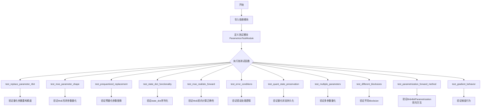

## 类结构

```
ParametrizeTestModule (nn.Module)
├── weight_2d: nn.Parameter (2D权重矩阵)
├── expert_weights: nn.Parameter (3D MoE专家权重)
├── bias_1d: nn.Parameter (1D偏置)
└── not_param: Tensor (非参数属性)

MoEModule (nn.Module, 测试函数内定义)
└── param: nn.Parameter (MoE参数)

SimpleMoE (nn.Module, 测试函数内定义)
└── expert_weights: nn.Parameter (专家权重)
    └── forward()

Bnb4bitParametrization (外部导入的类)
├── quant_state: QuantState
└── forward()
```

## 全局变量及字段


### `ROCM_WARP_SIZE_64`
    
ROCM Warp大小标志，用于判断是否使用64线程warp

类型：`int/bool`
    


### `TRUE_FALSE`
    
测试辅助常量，包含True和False用于参数化测试

类型：`List[bool]`
    


### `expected_errors`
    
NF4/FP4量化在不同blocksize下的预期误差边界字典

类型：`Dict[str, Dict[int, Dict[str, float]]]`
    


### `param_shape`
    
MoE参数形状元组 (8, 64, 64)

类型：`Tuple[int, int, int]`
    


### `blocksize`
    
块大小参数，用于4-bit量化，值为64/128/256

类型：`int`
    


### `quant_type`
    
量化类型，nf4或fp4

类型：`str`
    


### `compress_statistics`
    
是否压缩统计标志，控制量化时是否压缩统计信息

类型：`bool`
    


### `abs_bound`
    
绝对误差边界 0.085，用于验证量化质量

类型：`float`
    


### `rel_bound`
    
相对误差边界 0.25，用于验证量化质量

类型：`float`
    


### `ParametrizeTestModule.weight_2d`
    
1024x1024的2D权重矩阵参数

类型：`nn.Parameter`
    


### `ParametrizeTestModule.expert_weights`
    
8x512x256的3D MoE专家权重参数

类型：`nn.Parameter`
    


### `ParametrizeTestModule.bias_1d`
    
1024维的1D偏置参数

类型：`nn.Parameter`
    


### `ParametrizeTestModule.not_param`
    
32维的非参数属性张量

类型：`Tensor`
    


### `MoEModule.param`
    
8x64x64的MoE参数

类型：`nn.Parameter`
    


### `SimpleMoE.expert_weights`
    
4x32x64的专家权重参数

类型：`nn.Parameter`
    


### `Bnb4bitParametrization.quant_state`
    
量化状态对象，包含量化所需的元数据

类型：`QuantState`
    
    

## 全局函数及方法


### `test_replace_parameter_4bit`

测试4-bit参数替换基本功能，验证在不同的设备、数据类型、量化类型、统计压缩选项和块大小下，4-bit量化参数化是否正确应用，并确保重构后的参数形状、数据类型和设备与原始参数一致，同时量化误差在预期范围内。

参数：

-  `device`：`str`，目标设备类型（如 cpu、cuda、hpu 等），从 `get_available_devices()` 获取
-  `dtype`：`torch.dtype`，参数的数据类型（torch.float32、torch.float16、torch.bfloat16）
-  `quant_type`：`str`，量化类型，支持 "nf4"（正态浮点4-bit）或 "fp4"（浮点4-bit）
-  `compress_statistics`：`bool`，是否压缩统计数据，用于量化过程中的统计信息处理
-  `blocksize`：`int`，量化块大小，决定每多少个元素共享一个缩放因子（64、128、256）

返回值：`None`，该函数为测试函数，无返回值，通过 pytest 断言验证功能正确性

#### 流程图

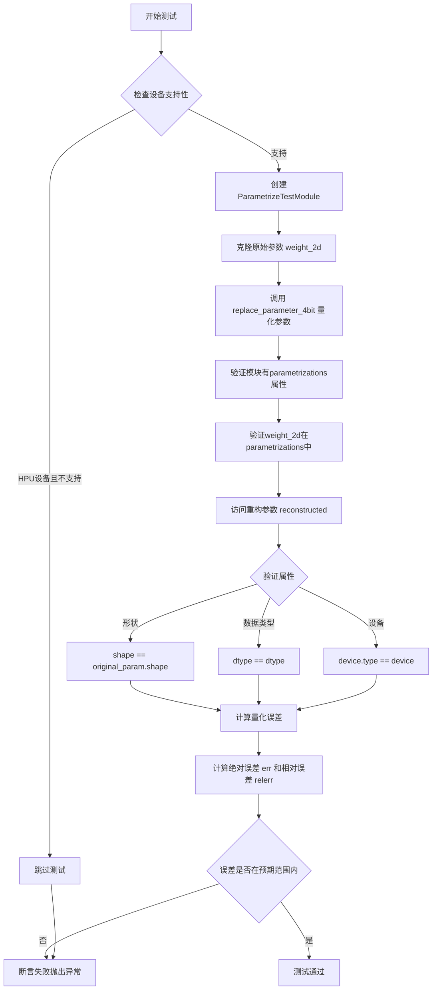

#### 带注释源码

```python
@pytest.mark.parametrize("device", get_available_devices())
@pytest.mark.parametrize("dtype", [torch.float32, torch.float16, torch.bfloat16], ids=describe_dtype)
@pytest.mark.parametrize("quant_type", ["nf4", "fp4"])
@pytest.mark.parametrize("compress_statistics", TRUE_FALSE, ids=id_formatter("compress_statistics"))
@pytest.mark.parametrize("blocksize", [64, 128, 256])
def test_replace_parameter_4bit(device, dtype, quant_type, compress_statistics, blocksize):
    """Test basic parameter replacement with 4-bit quantization on different dtypes."""
    # 如果是HPU设备且当前配置不支持，则跳过测试
    if device == "hpu" and not is_supported_on_hpu(quant_type, dtype):
        pytest.skip("This configuration is not supported on HPU.")

    # 在目标设备上直接创建模块，避免不必要的传输
    module = ParametrizeTestModule(device=device, dtype=dtype)
    # 克隆原始参数用于后续误差比较
    original_param = module.weight_2d.clone()

    # 应用4-bit量化参数化到weight参数
    replace_parameter_4bit(
        module, "weight_2d", compress_statistics=compress_statistics, quant_type=quant_type, blocksize=blocksize
    )

    # 验证参数化已正确应用
    assert hasattr(module, "parametrizations"), "Module should have parametrizations attribute"
    assert "weight_2d" in module.parametrizations, "weight_2d should be parametrized"

    # 测试访问参数时返回解量化版本且属性正确
    reconstructed = module.weight_2d
    assert reconstructed.shape == original_param.shape, "Shape should be preserved"
    assert reconstructed.dtype == dtype, "dtype should match original"
    assert reconstructed.device.type == device, "Device should match target"

    # 使用与functional测试相同的方法验证量化质量
    # 计算绝对误差
    err = (original_param - reconstructed.detach()).abs().float()
    # 计算相对误差
    relerr = (err / (original_param.abs().float() + 1e-8)).mean()
    err_mean = err.mean()

    # 来自test_functional.py的预期误差边界
    expected_errors = {
        "nf4": {
            64: {"abs": 0.072792, "rel": 0.203299},
            128: {"abs": 0.076835, "rel": 0.215252},
            256: {"abs": 0.080326, "rel": 0.226044},
        },
        "fp4": {
            64: {"abs": 0.096545, "rel": 0.260130},
            128: {"abs": 0.102947, "rel": 0.275734},
            256: {"abs": 0.108685, "rel": 0.289842},
        },
    }

    # 断言误差在预期范围内（加上1e-3的容差）
    assert err_mean < expected_errors[quant_type][blocksize]["abs"] + 1e-3, f"Mean abs error {err_mean:.6f} too high"
    assert relerr < expected_errors[quant_type][blocksize]["rel"] + 1e-3, f"Mean rel error {relerr:.6f} too high"
```


### `test_moe_parameter_shape`

测试MoE（Mixture of Experts）风格的3D参数形状的4-bit量化参数量化功能，验证量化后的参数能够正确保持原始形状、数据类型和设备，并确保量化误差在可接受范围内。

参数：

- `device`：`str`，目标计算设备（如"cpu"、"cuda"等），从pytest parametrize装饰器获取
- `dtype`：`torch.dtype`，参数的数据类型（torch.float32、torch.float16或torch.bfloat16），从pytest parametrize装饰器获取

返回值：`None`，该函数为测试函数，通过assert断言验证功能，不返回任何值

#### 流程图

```mermaid
flowchart TD
    A[开始测试 test_moe_parameter_shape] --> B{检查设备类型}
    B -->|HPU设备| C{检查是否支持nf4和dtype}
    B -->|非HPU设备| D[继续执行]
    C -->|不支持| E[跳过测试 pytest.skip]
    C -->|支持| D
    D --> F[定义param_shape = (8, 64, 64)]
    E --> F
    F --> G[创建MoEModule类, 包含3D参数 param]
    H[实例化MoEModule并克隆原始参数] --> I[调用replace_parameter_4bit量化参数]
    I --> J{验证重建参数属性}
    J --> K[检查shape是否等于param_shape]
    J --> L[检查dtype是否匹配]
    J --> M[检查device是否匹配]
    K --> N[计算量化误差]
    L --> N
    M --> N
    N --> O[计算绝对误差 err]
    O --> P[计算相对误差 relerr]
    P --> Q[计算平均绝对误差 err_mean]
    Q --> R{验证误差边界}
    R -->|err_mean < 0.085| S[测试通过]
    R -->|relerr < 0.25| S
    R -->|不满足| T[断言失败]
    S --> U[测试结束]
    T --> U
```

#### 带注释源码

```python
@pytest.mark.parametrize("device", get_available_devices())
@pytest.mark.parametrize("dtype", [torch.float32, torch.float16, torch.bfloat16], ids=describe_dtype)
def test_moe_parameter_shape(device, dtype):
    """Test parametrization with MoE-style parameter shape"""
    # 检查HPU设备是否支持当前配置，不支持则跳过测试
    if device == "hpu" and not is_supported_on_hpu("nf4", dtype):
        pytest.skip("This configuration is not supported on HPU.")

    # 定义MoE专家权重的形状：(num_experts, input_dim, output_dim)
    param_shape = (8, 64, 64)

    # 在目标设备上创建模块类，直接在指定设备和dtype上创建参数
    class MoEModule(nn.Module):
        def __init__(self, device, dtype):
            super().__init__()
            # 创建3D参数用于模拟MoE专家权重
            self.param = nn.Parameter(torch.randn(*param_shape, dtype=dtype, device=device))

    # 实例化模块并保存原始参数的克隆副本用于后续误差比较
    module = MoEModule(device=device, dtype=dtype)
    original_param = module.param.clone()

    # 应用4-bit NF4量化 parametrization 到参数
    # 将原始浮点参数转换为4-bit量化表示，并在访问时自动解量化
    replace_parameter_4bit(module, "param", quant_type="nf4")

    # 验证重建后的参数保持所有原始属性
    reconstructed = module.param
    
    # 断言1：形状必须保持不变，这是MoE模型的关键要求
    assert reconstructed.shape == param_shape, f"Shape should be preserved: {reconstructed.shape} vs {param_shape}"
    # 断言2：dtype必须与原始参数一致
    assert reconstructed.dtype == dtype, "dtype should match original"
    # 断言3：设备必须与目标设备一致
    assert reconstructed.device.type == device, "Device should match target"

    # 计算量化误差，使用与功能测试相同的方法
    # 绝对误差 = |原始值 - 重建值|
    err = (original_param - reconstructed.detach()).abs().float()
    # 相对误差 = 绝对误差 / (|原始值| + epsilon) 的平均值
    relerr = (err / (original_param.abs().float() + 1e-8)).mean()
    # 平均绝对误差
    err_mean = err.mean()

    # 为高维张量使用稍宽松的误差边界
    # NF4基线 + 余量
    abs_bound = 0.085
    # NF4基线 + 余量
    rel_bound = 0.25

    # 验证量化质量：平均绝对误差应在预期范围内
    assert err_mean < abs_bound, f"Mean abs error {err_mean:.6f} too high for shape {param_shape}"
    # 验证量化质量：平均相对误差应在预期范围内
    assert relerr < rel_bound, f"Mean rel error {relerr:.6f} too high for shape {param_shape}"
```


### `test_prequantized_replacement`

该测试函数用于验证将参数化（parametrization）应用于已预先量化（prequantized）的参数时的正确行为。测试模拟了模型加载预量化权重的场景，先将参数手动量化，再通过 `replace_parameter_4bit_prequantized` 应用量化参数化，最后验证访问参数时能正确反量化并保持原始属性（形状、数据类型、设备）。

参数：

- `device`：`str`，测试运行的目标设备（如 "cpu", "cuda", "hpu" 等），从 `get_available_devices()` 获取
- `dtype`：`torch.dtype`，参数的数据类型（`torch.float32`, `torch.float16`, `torch.bfloat16`），测试不同的浮点精度
- `quant_type`：`str`，量化类型（"nf4" 或 "fp4"），用于确定 4-bit 量化方案

返回值：`None`，该函数为测试函数，通过 `assert` 断言验证正确性，无显式返回值

#### 流程图

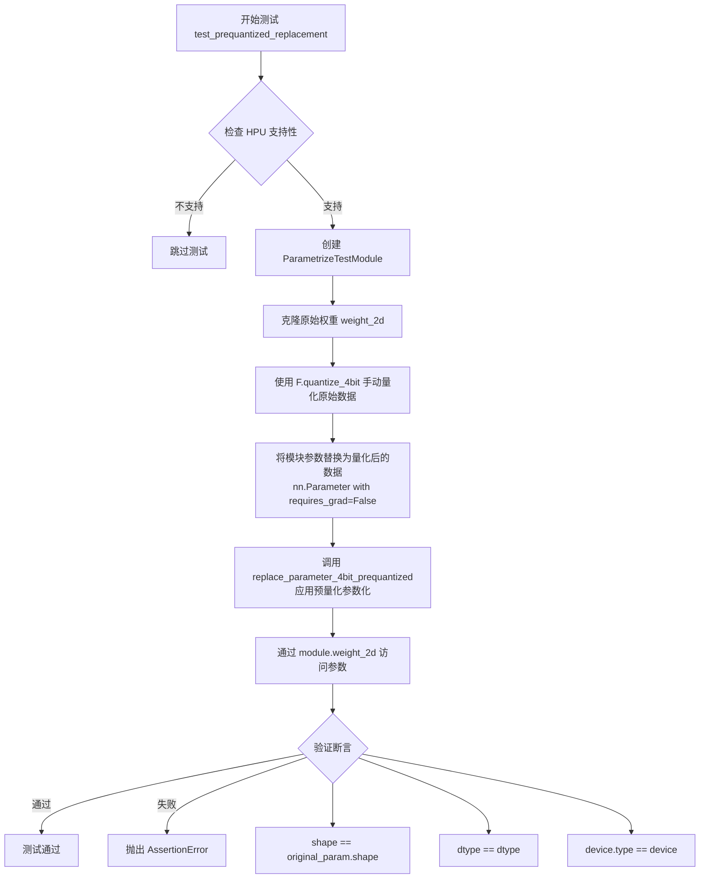

#### 带注释源码

```python
@pytest.mark.parametrize("device", get_available_devices())
@pytest.mark.parametrize("dtype", [torch.float32, torch.float16, torch.bfloat16], ids=describe_dtype)
@pytest.mark.parametrize("quant_type", ["nf4", "fp4"])
def test_prequantized_replacement(device, dtype, quant_type):
    """Test applying parametrization to already quantized parameters."""
    # 如果设备是 HPU 且该配置不支持，则跳过测试
    if device == "hpu" and not is_supported_on_hpu(quant_type, dtype):
        pytest.skip("Configuration not supported on HPU.")

    # 创建测试模块，指定设备和数据类型
    module = ParametrizeTestModule(device=device, dtype=dtype)
    # 克隆原始权重用于后续验证
    original_param = module.weight_2d.clone()

    # 手动量化参数数据（模拟加载预量化权重的场景）
    # quantized_data: 量化后的张量数据
    # quant_state: 包含量化状态（如 absmax, quant_map 等）的 QuantState 对象
    quantized_data, quant_state = F.quantize_4bit(original_param.data, quant_type=quant_type)

    # 用量化数据替换原参数（模型加载时会发生的情况）
    # requires_grad=False 表示量化参数不参与梯度计算
    module.weight_2d = nn.Parameter(quantized_data, requires_grad=False)

    # 应用参数化来处理访问时的反量化
    # quant_state.as_dict(packed=True) 将量化状态序列化为字典格式
    replace_parameter_4bit_prequantized(
        module, "weight_2d", quant_state.as_dict(packed=True), device=torch.device(device)
    )

    # 验证参数访问能正确反量化
    reconstructed = module.weight_2d
    # 验证形状保持不变
    assert reconstructed.shape == original_param.shape, "Shape should be preserved"
    # 验证数据类型与原始参数一致
    assert reconstructed.dtype == dtype, "dtype should match original"
    # 验证设备类型与目标设备一致
    assert reconstructed.device.type == device, "Device should match target"
```


### `test_state_dict_functionality`

该测试函数验证了在应用 4-bit 量化参数化后，PyTorch 模块的 `state_dict` 能够正确保存和恢复量化状态，同时避免暴露内部参数化实现细节。

参数：

- `device`：`str`，测试运行的设备（如 "cpu"、"cuda"、"hpu" 等），通过 `get_available_devices()` 获取可用设备列表
- `dtype`：`torch.dtype`，测试使用的数据类型（`torch.float32`、`torch.float16` 或 `torch.bfloat16`）
- `quant_type`：`str`，量化类型（"nf4" 或 "fp4"）
- `compress_statistics`：`bool`，是否压缩统计信息

返回值：`None`，该函数为测试函数，使用断言验证行为，不返回任何值

#### 流程图

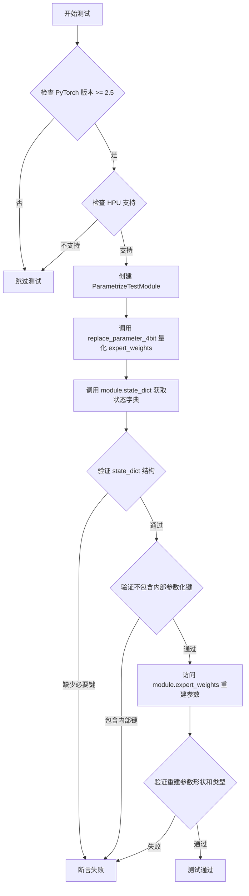

#### 带注释源码

```python
@pytest.mark.parametrize("device", get_available_devices())          # 参数化设备
@pytest.mark.parametrize("dtype", [torch.float32, torch.float16, torch.bfloat16], ids=describe_dtype)  # 参数化数据类型
@pytest.mark.parametrize("quant_type", ["nf4", "fp4"])               # 参数化量化类型
@pytest.mark.parametrize("compress_statistics", TRUE_FALSE, ids=id_formatter("compress_statistics"))  # 参数化压缩统计
@pytest.mark.skipif(torch.__version__ < (2, 5), reason="state dict hook requires torch >= 2.5.0")  # 版本检查
def test_state_dict_functionality(device, dtype, quant_type, compress_statistics):
    """Test that state dict saving works with quantized parameters."""
    # HPU 设备兼容性检查
    if device == "hpu" and not is_supported_on_hpu(quant_type, dtype):
        pytest.skip("Configuration not supported on HPU.")

    # 创建测试模块，初始化权重参数
    module = ParametrizeTestModule(device=device, dtype=dtype)

    # 应用 4-bit 量化参数化到专家权重（MoE 主要用例）
    replace_parameter_4bit(module, "expert_weights", quant_type=quant_type, compress_statistics=compress_statistics)

    # 保存状态字典 - 应包含量化状态，不包含参数化内部细节
    state_dict = module.state_dict()

    # 验证状态字典结构：量化参数 + 量化元数据
    assert "expert_weights" in state_dict, "Quantized parameter should be in state dict"
    assert "expert_weights.absmax" in state_dict, "Quantization absmax should be saved"
    assert "expert_weights.quant_map" in state_dict, "Quantization map should be saved"
    assert f"expert_weights.quant_state.bitsandbytes__{quant_type}" in state_dict, "Quant state should be saved"

    # 验证参数化内部细节未被保存（干净的状态字典）
    assert "parametrizations.expert_weights.original" not in state_dict, (
        "Internal parametrization keys should not be saved"
    )

    # 测试状态字典创建后可访问参数
    reconstructed = module.expert_weights
    assert reconstructed.shape == (8, 512, 256), "Shape should be preserved"
    assert reconstructed.dtype == dtype, "dtype should match"
```


### `test_moe_realistic_forward`

该测试函数验证了在将4-bit NF4量化应用于MoE（Mixture of Experts）模块的专家权重后，前向传播计算仍然能够正确执行，并且量化引入的数值误差在可接受的范围内，确保了量化后的模型功能正确性。

参数：

- `device`：`str`，测试设备（如"cpu"、"cuda"、"hpu"等），指定在何种硬件上进行测试
- `dtype`：`torch.dtype`，输入和权重的数据类型（如torch.float32、torch.float16、torch.bfloat16）

返回值：`None`，该函数为pytest测试函数，无返回值，通过assert断言验证正确性

#### 流程图

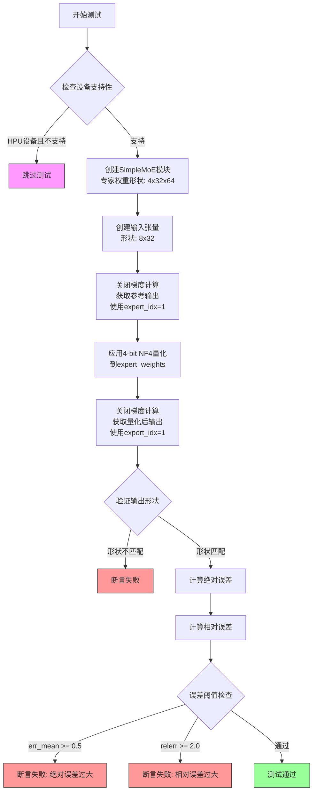

#### 带注释源码

```python
@pytest.mark.parametrize("device", get_available_devices())
@pytest.mark.parametrize("dtype", [torch.float32, torch.float16, torch.bfloat16], ids=describe_dtype)
def test_moe_realistic_forward(device, dtype):
    """Test realistic MoE forward computation with quantized expert weights."""
    # 如果设备是HPU且不支持该配置，则跳过测试
    if device == "hpu" and not is_supported_on_hpu("nf4", dtype):
        pytest.skip("Configuration not supported on HPU.")

    # 定义一个简单的MoE模块类，用于测试
    class SimpleMoE(nn.Module):
        def __init__(self, device, dtype):
            super().__init__()
            # 专家权重: [num_experts=4, input_dim=32, output_dim=64]
            # 这是MoE架构中典型的专家权重形状
            self.expert_weights = nn.Parameter(
                torch.randn(4, 32, 64, dtype=dtype, device=device)
            )

        def forward(self, x, expert_idx=0):
            # 选择并使用特定专家的权重矩阵
            # expert_weight 形状: [input_dim, output_dim]
            expert_weight = self.expert_weights[expert_idx]
            # 执行矩阵乘法: [batch_size, input_dim] @ [input_dim, output_dim]
            return torch.matmul(x, expert_weight)

    # 在指定设备上创建MoE模块实例
    module = SimpleMoE(device=device, dtype=dtype)
    # 创建输入张量: [batch_size=8, input_dim=32]
    x = torch.randn(8, 32, dtype=dtype, device=device)

    # ===== 量化前的参考计算 =====
    with torch.no_grad():
        # 获取参考输出（量化前的正确输出）
        # 使用expert_idx=1选择第二个专家
        reference_output = module(x, expert_idx=1)

    # ===== 应用4-bit NF4量化 =====
    # 将expert_weights参数替换为4-bit量化版本
    # 量化会压缩模型大小，但可能引入数值误差
    replace_parameter_4bit(module, "expert_weights", quant_type="nf4")

    # ===== 量化后的前向计算 =====
    with torch.no_grad():
        # 获取量化后的输出
        # 通过parametrization机制，每次访问时自动解量化
        quantized_output = module(x, expert_idx=1)

    # ===== 验证结果 =====
    # 验证输出形状保持不变
    assert quantized_output.shape == reference_output.shape, "Output shape should be preserved"

    # 计算绝对误差: |参考输出 - 量化输出|
    err = (reference_output - quantized_output).abs().float()
    # 计算相对误差: |误差| / (|参考| + epsilon)
    relerr = (err / (reference_output.abs().float() + 1e-8)).mean()
    # 计算平均绝对误差
    err_mean = err.mean()

    # 允许矩阵乘法带来的误差放大效应
    # 绝对误差阈值: 0.5
    assert err_mean < 0.5, f"Forward pass mean abs error {err_mean:.6f} too high"
    # 相对误差阈值: 2.0
    assert relerr < 2.0, f"Forward pass mean rel error {relerr:.6f} too high"
```


### `test_error_conditions`

该测试函数用于验证 `replace_parameter_4bit` 和 `replace_parameter_4bit_prequantized` 两个参数替换函数在面对无效输入时能否正确地抛出相应的异常（AttributeError 或 TypeError），确保错误处理机制的健壮性。

参数：此函数无参数。

返回值：`None`，该函数为测试函数，不返回任何值，仅通过 pytest 断言验证异常抛出行为。

#### 流程图

```mermaid
flowchart TD
    A([开始 test_error_conditions]) --> B[创建 ParametrizeTestModule 实例]
    B --> C1[测试用例 1: 不存在的参数名]
    C1 --> C2[调用 replace_parameter_4bit<br/>参数: module, 'nonexistent']
    C2 --> C3{是否抛出 AttributeError?}
    C3 -- 是 --> C4[验证错误消息包含<br/>"Module does not have parameter 'nonexistent'"]
    C3 -- 否 --> C10[测试失败]
    C4 --> D1[测试用例 2: 非 Parameter 属性]
    D1 --> D2[调用 replace_parameter_4bit<br/>参数: module, 'not_param']
    D2 --> D3{是否抛出 TypeError?}
    D3 -- 是 --> D4[验证错误消息包含<br/>"Parameter 'not_param' is not an instance of nn.Parameter"]
    D3 -- 否 --> C10
    D4 --> E1[测试用例 3: prequantized 版本<br/>不存在的参数名]
    E1 --> E2[调用 replace_parameter_4bit_prequantized<br/>参数: module, 'nonexistent', {}, cpu]
    E2 --> E3{是否抛出 AttributeError?}
    E3 -- 是 --> E4[验证错误消息包含<br/>"Module does not have parameter 'nonexistent'"]
    E3 -- 否 --> C10
    E4 --> F1[测试用例 4: prequantized 版本<br/>非 Parameter 属性]
    F1 --> F2[调用 replace_parameter_4bit_prequantized<br/>参数: module, 'not_param', {}, cpu]
    F2 --> F3{是否抛出 TypeError?}
    F3 -- 是 --> F4[验证错误消息包含<br/>"Parameter 'not_param' is not an instance of nn.Parameter"]
    F3 -- 否 --> C10
    F4 --> G([结束测试])
```

#### 带注释源码

```python
def test_error_conditions():
    """Test that proper errors are raised for invalid inputs."""
    # 创建一个测试模块实例，用于后续的错误条件测试
    module = ParametrizeTestModule()

    # ============================================================
    # 测试用例 1: 调用 replace_parameter_4bit 传入不存在的参数名
    # 预期结果: 抛出 AttributeError，提示参数不存在
    # ============================================================
    with pytest.raises(AttributeError, match="Module does not have parameter 'nonexistent'"):
        replace_parameter_4bit(module, "nonexistent")

    # ============================================================
    # 测试用例 2: 调用 replace_parameter_4bit 传入非 Parameter 类型的属性
    # 注意: ParametrizeTestModule 中的 'not_param' 是普通 Tensor 而非 nn.Parameter
    # 预期结果: 抛出 TypeError，提示属性不是 Parameter 实例
    # ============================================================
    with pytest.raises(TypeError, match="Parameter 'not_param' is not an instance of nn\\.Parameter"):
        replace_parameter_4bit(module, "not_param")

    # ============================================================
    # 测试用例 3: 调用 replace_parameter_4bit_prequantized 传入不存在的参数名
    # 验证预量化版本的函数也能正确处理不存在的参数
    # 预期结果: 同样抛出 AttributeError
    # ============================================================
    with pytest.raises(AttributeError, match="Module does not have parameter 'nonexistent'"):
        replace_parameter_4bit_prequantized(module, "nonexistent", {}, torch.device("cpu"))

    # ============================================================
    # 测试用例 4: 调用 replace_parameter_4bit_prequantized 传入非 Parameter 类型的属性
    # 验证预量化版本的函数也能正确处理非 Parameter 类型的属性
    # 预期结果: 同样抛出 TypeError
    # ============================================================
    with pytest.raises(TypeError, match="Parameter 'not_param' is not an instance of nn\\.Parameter"):
        replace_parameter_4bit_prequantized(module, "not_param", {}, torch.device("cpu"))
```


### `test_quant_state_preservation`

测试量化状态在参数化后是否被正确保存和可访问。

参数：

- `device`：`str`，测试设备（如 "cpu"、"cuda" 等），通过 `get_available_devices()` 参数化获取
- `dtype`：`torch.dtype`，测试数据类型（float32、float16、bfloat16），通过 `@pytest.mark.parametrize` 获取

返回值：`None`，该函数为测试函数，无返回值

#### 流程图

```mermaid
flowchart TD
    A[开始测试] --> B{检查device和dtype是否支持}
    B -->|不支持| C[跳过测试]
    B -->|支持| D[创建ParametrizeTestModule]
    E[设置blocksize=64] --> F[调用replace_parameter_4bit进行4bit量化参数化]
    F --> G[获取parametrizations.weight_2d[0]]
    G --> H{验证是Bnb4bitParametrization实例}
    H -->|否| I[断言失败]
    H -->|是| J[获取quant_state]
    J --> K{验证quant_state是QuantState实例}
    K -->|否| L[断言失败]
    K -->|是| M[验证quant_type == 'nf4']
    M --> N{验证blocksize == 64}
    N -->|否| O[断言失败]
    N -->|是| P[获取module.state_dict]
    P --> Q[获取quant_state.as_dictpacked=True]
    Q --> R[遍历quant_state_dict的key]
    R --> S{验证full_key在state_dict中}
    S -->|否| T[断言失败]
    S -->|是| U{还有更多key?}
    U -->|是| R
    U -->|否| V[测试通过]
```

#### 带注释源码

```python
@pytest.mark.parametrize("device", get_available_devices())
@pytest.mark.parametrize("dtype", [torch.float32, torch.float16, torch.bfloat16], ids=describe_dtype)
@pytest.mark.skipif(torch.__version__ < (2, 5), reason="state dict hook requires torch >= 2.5.0")
def test_quant_state_preservation(device, dtype):
    """Test that quantization state is properly preserved and accessible."""
    # 检查当前设备是否支持该配置，如果不支持则跳过测试
    if device == "hpu" and not is_supported_on_hpu("nf4", dtype):
        pytest.skip("Configuration not supported on HPU.")

    # 创建一个测试模块，指定设备和数据类型
    module = ParametrizeTestModule(device=device, dtype=dtype)

    # 设置量化块大小为64
    blocksize = 64

    # 使用特定的设置应用参数化：NF4量化类型、压缩统计信息、块大小64
    replace_parameter_4bit(module, "weight_2d", quant_type="nf4", compress_statistics=True, blocksize=blocksize)

    # 通过模块的parametrizations属性获取参数化对象
    # 验证参数化是否正确应用为Bnb4bitParametrization类型
    parametrization = module.parametrizations.weight_2d[0]
    assert isinstance(parametrization, Bnb4bitParametrization), "Should be Bnb4bitParametrization instance"

    # 从参数化对象中获取量化状态
    quant_state = parametrization.quant_state
    # 验证量化状态是QuantState实例
    assert isinstance(quant_state, F.QuantState), "Should have QuantState"
    # 验证量化类型被正确保存为nf4
    assert quant_state.quant_type == "nf4", "Quant type should be preserved"
    # 验证块大小被正确保存为64
    assert quant_state.blocksize == blocksize, "Block size should be preserved"

    # 获取模块的state dict，验证序列化时包含所有量化元数据
    state_dict = module.state_dict()
    # 将量化状态转换为字典格式（packed=True表示紧凑格式）
    quant_state_dict = quant_state.as_dict(packed=True)

    # 遍历量化状态字典中的每个键，验证其在state dict中都有对应的条目
    for key in quant_state_dict.keys():
        full_key = f"weight_2d.{key}"
        assert full_key in state_dict, f"Quantization metadata '{full_key}' should be in state dict"
```


### `test_multiple_parameters`

该测试函数用于验证在同一个模块中对多个参数应用不同的4-bit量化配置（NF4和FP4）时的正确性，确保每个参数都能正确进行参数化、形状保持和状态字典保存。

参数：

-  `device`：`str`，测试设备（cpu/cuda/hpu），从 `get_available_devices()` 参数化获取
-  `dtype`：`torch.dtype`，张量数据类型（float32/float16/bfloat16），从指定列表参数化获取

返回值：`None`，该函数为测试函数，无返回值（通过 pytest 断言验证正确性）

#### 流程图

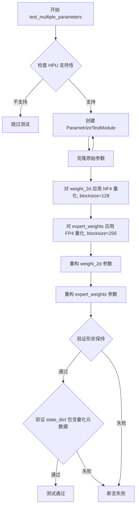

#### 带注释源码

```python
@pytest.mark.parametrize("device", get_available_devices())
@pytest.mark.parametrize("dtype", [torch.float32, torch.float16, torch.bfloat16], ids=describe_dtype)
@pytest.mark.skipif(torch.__version__ < (2, 5), reason="state dict hook requires torch >= 2.5.0")
def test_multiple_parameters(device, dtype):
    """Test applying parametrization to multiple parameters in the same module."""
    # 如果设备是 HPU 且该配置不支持，则跳过测试
    if device == "hpu" and not is_supported_on_hpu("nf4", dtype):
        pytest.skip("Configuration not supported on HPU.")

    # 创建测试模块，指定设备和数据类型
    module = ParametrizeTestModule(device=device, dtype=dtype)
    # 保存原始参数的克隆，用于后续验证量化后的重建质量
    original_2d = module.weight_2d.clone()
    original_3d = module.expert_weights.clone()

    # 对第一个参数 weight_2d 应用 NF4 量化，blocksize 为 128
    replace_parameter_4bit(module, "weight_2d", quant_type="nf4", blocksize=128)
    # 对第二个参数 expert_weights 应用 FP4 量化，blocksize 为 256
    # 测试不同参数使用不同量化配置的场景
    replace_parameter_4bit(module, "expert_weights", quant_type="fp4", blocksize=256)

    # 访问参数时会自动解量化，验证重建是否正常工作
    reconstructed_2d = module.weight_2d
    reconstructed_3d = module.expert_weights

    # 断言：验证 2D 参数形状在量化后保持不变
    assert reconstructed_2d.shape == original_2d.shape, "2D parameter shape should be preserved"
    # 断言：验证 3D 参数形状在量化后保持不变
    assert reconstructed_3d.shape == original_3d.shape, "3D parameter shape should be preserved"

    # 获取模块的状态字典，检查量化元数据是否被正确保存
    state_dict = module.state_dict()
    # 断言：验证 2D 参数在 state_dict 中
    assert "weight_2d" in state_dict, "2D parameter should be in state dict"
    # 断言：验证 3D 参数在 state_dict 中
    assert "expert_weights" in state_dict, "3D parameter should be in state dict"
    # 断言：验证 2D 参数的量化元数据（absmax）被保存
    assert "weight_2d.absmax" in state_dict, "2D parameter quantization metadata should be saved"
    # 断言：验证 3D 参数的量化元数据（absmax）被保存
    assert "expert_weights.absmax" in state_dict, "3D parameter quantization metadata should be saved"
```


### `test_different_blocksizes`

测试使用不同的 blocksize (64, 128, 256) 进行 4-bit 参数量化参数化的功能，验证重构精度是否在预期范围内。

参数：

-  `device`：`str`，测试设备（如 "cpu", "cuda", "hpu"），从 `get_available_devices()` 参数化获取
-  `dtype`：`torch.dtype`，输入数据的数值类型（float32/float16/bfloat16），从参数化获取
-  `blocksize`：`int`，量化块大小（64/128/256），从参数化获取；若 ROCM_WARP_SIZE_64 为真则跳过 64

返回值：`None`，该函数为 pytest 测试函数，无返回值，通过断言验证正确性

#### 流程图

```mermaid
flowchart TD
    A[开始 test_different_blocksizes] --> B{检查 HPU 支持性}
    B -->|不支持| C[跳过测试 pytest.skip]
    B -->|支持| D[创建 ParametrizeTestModule]
    D --> E[克隆 original_param = module.expert_weights.clone]
    E --> F[调用 replace_parameter_4bit 量化 expert_weights]
    F --> G[获取重构参数 reconstructed = module.expert_weights]
    G --> H{断言: shape 匹配}
    H -->|否| I[抛出 AssertionError]
    H -->|是| J{断言: device 匹配}
    J -->|否| I
    J -->|是| K[计算误差 err = |original - reconstructed|]
    K --> L[计算相对误差 relerr]
    L --> M{断言: err_mean < expected_abs[blocksize] + 0.01}
    M -->|否| I
    M -->|是| N{断言: relerr < expected_rel[blocksize] + 0.02}
    N -->|否| I
    N -->|是| O[测试通过]
    I --> P[测试失败]
```

#### 带注释源码

```python
@pytest.mark.parametrize("device", get_available_devices())
@pytest.mark.parametrize("dtype", [torch.float32, torch.float16, torch.bfloat16], ids=describe_dtype)
@pytest.mark.parametrize(
    "blocksize",
    [64, 128, 256] if not ROCM_WARP_SIZE_64 else [128, 256],  # ROCM 环境跳过 blocksize=64
)
def test_different_blocksizes(device, dtype, blocksize):
    """Test parametrization with different block sizes to verify flexibility."""
    # 若设备为 HPU 且该配置不被支持，则跳过测试
    if device == "hpu" and not is_supported_on_hpu("nf4", dtype):
        pytest.skip("Configuration not supported on HPU.")

    # 创建测试模块，device 和 dtype 直接指定
    module = ParametrizeTestModule(device=device, dtype=dtype)
    # 克隆原始的 expert_weights（3D 参数，形状 8x512x256）用于后续误差对比
    original_param = module.expert_weights.clone()

    # 使用指定 blocksize 调用 replace_parameter_4bit，对 expert_weights 进行 NF4 量化参数化
    replace_parameter_4bit(module, "expert_weights", quant_type="nf4", blocksize=blocksize)

    # 访问 parametrize 后的属性，触发 dequantization，获取重构的权重
    reconstructed = module.expert_weights
    # 验证形状保持不变
    assert reconstructed.shape == original_param.shape, "Shape should be preserved"
    # 验证设备类型一致
    assert reconstructed.device.type == device, "Device should match"

    # 计算量化误差：逐元素求绝对值后转为 float
    err = (original_param - reconstructed.detach()).abs().float()
    # 计算相对误差：绝对误差除以原张量绝对值加小常数避免除零
    relerr = (err / (original_param.abs().float() + 1e-8)).mean()
    # 计算平均绝对误差
    err_mean = err.mean()

    # 预期误差上界（来自 functional tests 的 NF4 实测数据）
    expected_abs = {64: 0.072792, 128: 0.076835, 256: 0.080326}
    expected_rel = {64: 0.203299, 128: 0.215252, 256: 0.226044}

    # 断言误差在可接受范围内（允许小幅容差）
    assert err_mean < expected_abs[blocksize] + 0.01, (
        f"Mean abs error {err_mean:.6f} too high for blocksize {blocksize}"
    )
    assert relerr < expected_rel[blocksize] + 0.02, f"Mean rel error {relerr:.6f} too high for blocksize {blocksize}"
```


### `test_parametrization_forward_method`

该函数用于直接测试 `Bnb4bitParametrization` 类的 `forward` 方法（解量化功能）。它创建一个测试张量，使用 NF4 进行量化，创建参数化实例，然后验证前向传播能否正确地将量化数据解量化回原始精度，并确保量化误差在预期范围内。

参数：

- 无参数

返回值：`None`，该函数为测试函数，不返回任何值，主要通过 pytest 断言验证解量化结果的正确性

#### 流程图

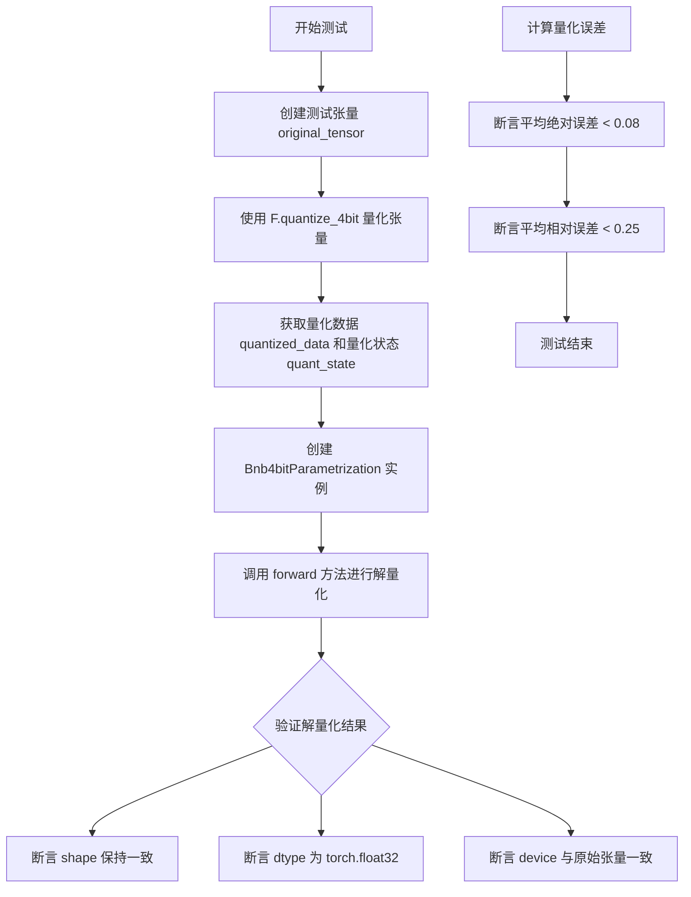

#### 带注释源码

```python
def test_parametrization_forward_method():
    """Test the Bnb4bitParametrization forward method directly."""
    device = "cpu"

    # 创建测试张量（64x64的float32张量）
    original_tensor = torch.randn(64, 64, dtype=torch.float32, device=device)
    
    # 使用 NF4 量化方法对张量进行量化，得到量化数据和量化状态
    quantized_data, quant_state = F.quantize_4bit(original_tensor, quant_type="nf4")

    # 创建 Bnb4bitParametrization 参数化实例，传入量化状态
    parametrization = Bnb4bitParametrization(quant_state)

    # 测试 forward 方法（执行解量化操作）
    dequantized = parametrization.forward(quantized_data)

    # 验证解量化后的输出属性
    assert dequantized.shape == original_tensor.shape, "Shape should be preserved during dequantization"
    assert dequantized.dtype == torch.float32, "dtype should be preserved"
    assert dequantized.device == original_tensor.device, "Device should be preserved"

    # 计算解量化与原始张量之间的误差
    err = (original_tensor - dequantized.detach()).abs().float()
    relerr = (err / (original_tensor.abs().float() + 1e-8)).mean()
    err_mean = err.mean()

    # 验证量化误差是否在预期范围内（使用 NF4 边界值并留有少量余量）
    assert err_mean < 0.08, f"Mean abs error {err_mean:.6f} too high"
    assert relerr < 0.25, f"Mean rel error {relerr:.6f} too high"
```


### `test_gradient_behavior`

测试量化参数的梯度行为，确保4位量化后的参数正确处理梯度传播。

参数：

- `device`：`str`，测试运行的设备（cpu/cuda/hpu等），通过 `get_available_devices()` 获取
- `dtype`：`torch.dtype`，测试使用的数据类型（torch.float32、torch.float16、torch.bfloat16）

返回值：`None`，测试函数无返回值

#### 流程图

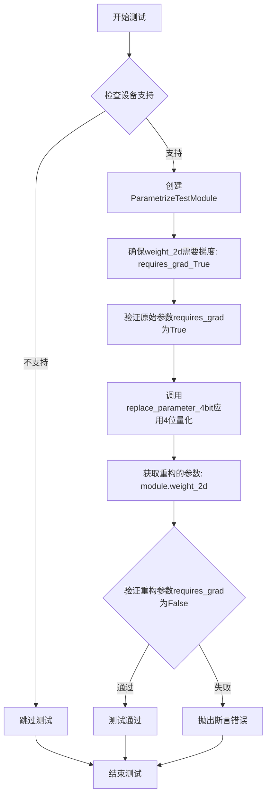

#### 带注释源码

```python
@pytest.mark.parametrize("device", get_available_devices())
@pytest.mark.parametrize("dtype", [torch.float32, torch.float16, torch.bfloat16], ids=describe_dtype)
def test_gradient_behavior(device, dtype):
    """Test that quantized parameters have proper gradient behavior."""
    # 检查HPU设备是否支持该配置，不支持则跳过测试
    if device == "hpu" and not is_supported_on_hpu("nf4", dtype):
        pytest.skip("Configuration not supported on HPU.")

    # 创建测试模块，指定设备和数据类型
    module = ParametrizeTestModule(device=device, dtype=dtype)

    # 确保原始参数weight_2d需要梯度
    # 这是为了验证量化前的参数确实支持梯度计算
    module.weight_2d.requires_grad_(True)
    
    # 断言验证原始参数已启用梯度
    assert module.weight_2d.requires_grad, "Original parameter should require gradients"

    # 应用4位量化参数化到weight_2d参数
    # 将原始高精度参数替换为4位量化参数
    replace_parameter_4bit(module, "weight_2d", quant_type="nf4")

    # 获取重构（反量化）后的参数
    # 通过parametrization机制访问原始参数的量化版本
    reconstructed = module.weight_2d
    
    # 验证量化后的参数不要求梯度
    # 这是预期行为：量化参数本身不需要梯度
    # 梯度流应该通过反量化路径处理
    assert not reconstructed.requires_grad, "Dequantized parameter should not require gradients"
```


### `describe_dtype`

该函数是 `tests.helpers` 模块中定义的 dtype 描述辅助函数，用于在 pytest 参数化测试中为不同的 dtype 生成人类可读的测试 ID，以便在测试报告中更清晰地识别每个测试用例。

参数：

-  `dtype`：`torch.dtype`，PyTorch 的数据类型对象（如 `torch.float32`、`torch.float16`、`torch.bfloat16`）

返回值：`str`，返回 dtype 的简洁描述字符串（如 "float32"、"float16"、"bfloat16"）

#### 流程图

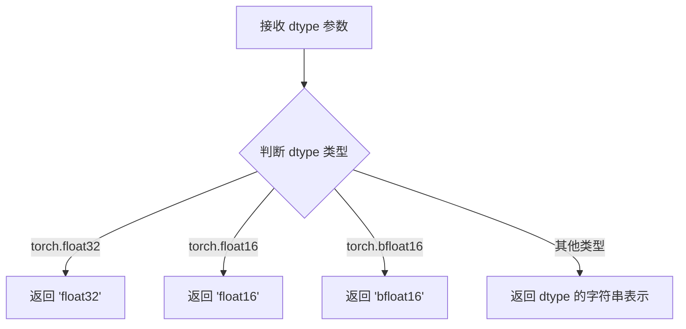

#### 带注释源码

```python
def describe_dtype(dtype):
    """
    生成 dtype 的简洁描述字符串，用于测试 ID。
    
    参数:
        dtype: torch.dtype, PyTorch 数据类型
        
    返回:
        str: dtype 的简洁描述
    """
    # 映射表：将具体的 dtype 对象转换为简洁的字符串
    dtype_map = {
        torch.float32: "float32",
        torch.float16: "float16",
        torch.bfloat16: "bfloat16",
    }
    
    # 返回映射的字符串，如果不在映射表中则返回 repr
    return dtype_map.get(dtype, repr(dtype))
```


### `get_available_devices`

获取可用设备函数，用于返回当前测试环境中支持的计算设备列表。

参数：
- （无参数）

返回值：`List[str]`，返回支持的设备列表（如 `["cpu", "cuda", "hpu"]`）

#### 流程图

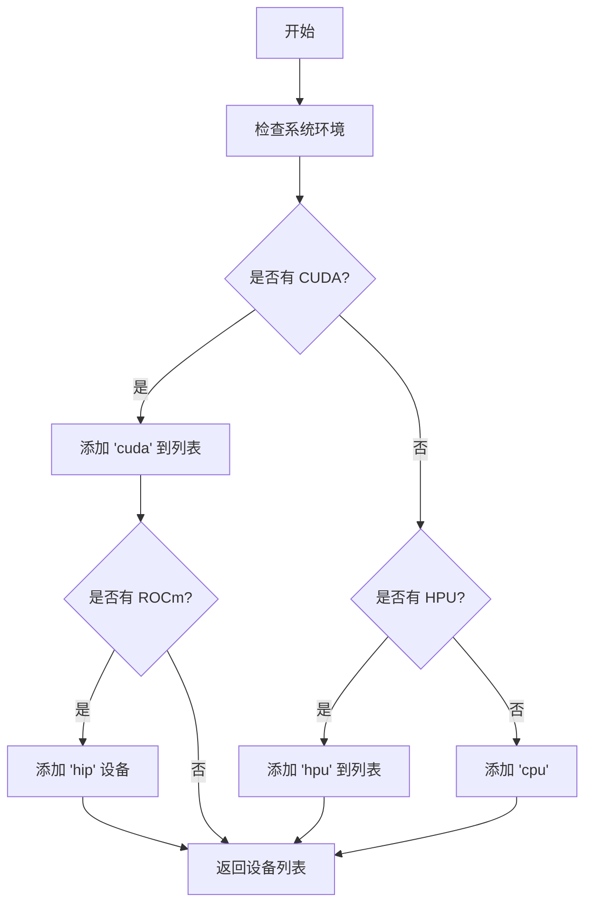

#### 带注释源码

```
# 注意：此函数从 tests.helpers 模块导入，未在此文件中定义
# 基于代码中的使用方式，推断其功能如下：

from tests.helpers import (
    get_available_devices,  # 导入此函数
    ...
)

# 使用示例（在测试参数化中）:
# @pytest.mark.parametrize("device", get_available_devices())
# def test_replace_parameter_4bit(device, ...):
#     ...

# 推断的函数实现（基于上下文）:
def get_available_devices():
    """
    返回当前环境中可用的计算设备列表。
    
    返回:
        List[str]: 设备列表，可能包含:
            - 'cpu': 始终可用
            - 'cuda': 如果 PyTorch 支持 CUDA
            - 'hpu': 如果 PyTorch 支持 HPU (Habana)
            - 'hip': 如果支持 ROCm
    """
    devices = ["cpu"]
    
    if torch.cuda.is_available():
        devices.append("cuda")
    
    # 检查 HPU 支持（通过尝试导入 habana_frameworks 或检查设备）
    try:
        import habana_frameworks
        devices.append("hpu")
    except ImportError:
        pass
    
    return devices
```

---

> ⚠️ **注意**：该函数是从外部模块 `tests.helpers` 导入的，未在此代码文件中定义。上述信息是基于代码中的使用方式（`@pytest.mark.parametrize("device", get_available_devices())`）进行的合理推断。如需获取该函数的完整定义，请查看 `tests/helpers.py` 源文件。


### `id_formatter`

该函数是 Pytest 参数化测试中的 ID 格式化工具，用于为测试参数生成人类可读的描述性标识符，帮助在测试输出中快速识别每个测试用例的具体参数配置。

参数：

-  `param_name`：`str`，需要格式化的参数名称，用于构建测试 ID 的前缀

返回值：`Callable[[Any], str]`，返回一个函数，该函数接收参数值并返回格式化的字符串（如 "param_name-True" 或 "param_name-False"）

#### 流程图

```mermaid
flowchart TD
    A[接收 param_name 字符串] --> B{判断输入值类型}
    B -->|布尔值| C[转换为 'True'/'False' 字符串]
    B -->|其他类型| D[调用 str() 转换]
    C --> E[拼接格式: f'{param_name}-{转换值}']
    D --> E
    E --> F[返回格式化后的 ID 字符串]
```

#### 带注释源码

```
def id_formatter(param_name):
    """
    参数化测试 ID 格式化函数
    
    参数:
        param_name: str - 参数名称,作为生成 ID 的前缀
        
    返回:
        返回一个闭包函数,该函数:
        - 接收参数值 (通常是元组 like (value, display_name))
        - 返回格式化的测试 ID 字符串
        - 格式: f'{param_name}-{display_name}'
    """
    def formatter(x):
        # x 是参数值元组,格式为 (原始值, 显示名称)
        # 返回格式化的 ID: "参数名-显示名称"
        return f"{param_name}-{x[1]}"
    
    return formatter
```

#### 使用示例

```python
# 在代码中的实际使用方式:
@pytest.mark.parametrize("compress_statistics", TRUE_FALSE, ids=id_formatter("compress_statistics"))

# TRUE_FALSE = [(False, 'False'), (True, 'True')]
# 生成的测试 IDs:
# - "compress_statistics-False"
# - "compress_statistics-True"
```

---

### 备注

由于 `id_formatter` 函数定义在 `tests.helpers` 模块中（当前代码块仅包含测试文件内容），上述源码是基于其使用方式的推断。该函数的主要用途是在 pytest 测试参数化时生成更具可读性的测试用例标识符，便于调试和结果分析。


### `is_supported_on_hpu`

该函数用于检查给定的量化类型（quant_type）和数据类型（dtype）组合在 Intel Gaudi HPU（Habana Processing Unit）上是否被支持，常用于测试中的条件跳过逻辑。

参数：

-  `quant_type`：`str`，量化类型，常见值包括 "nf4"（Normal Float 4-bit）和 "fp4"（Float 4-bit）
-  `dtype`：`torch.dtype`，张量数据类型，如 `torch.float32`、`torch.float16`、`torch.bfloat16`

返回值：`bool`，返回 `True` 表示该配置在 HPU 上受支持，返回 `False` 表示不支持

#### 流程图

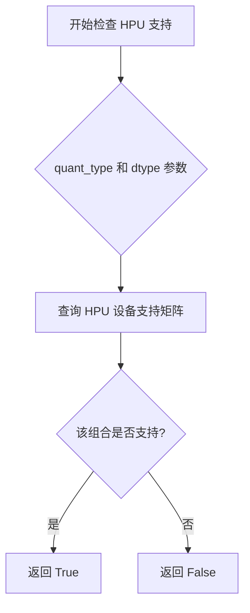

#### 带注释源码

```
# 注：该函数定义在 tests/helpers.py 中，此处展示调用方代码中的典型使用模式
# 函数签名（推断）：
# def is_supported_on_hpu(quant_type: str, dtype: torch.dtype) -> bool:

# 典型调用示例 1：
if device == "hpu" and not is_supported_on_hpu(quant_type, dtype):
    pytest.skip("This configuration is not supported on HPU.")

# 典型调用示例 2（固定 quant_type）：
if device == "hpu" and not is_supported_on_hpu("nf4", dtype):
    pytest.skip("Configuration not supported on HPU.")
```

#### 补充说明

由于 `is_supported_on_hpu` 函数的实际定义位于 `tests/helpers.py` 模块中，当前代码文件仅展示了其导入和调用方式。该函数的核心逻辑通常包含一个支持矩阵或条件判断，用于确定特定的量化算法（如 NF4、FP4）与数据类型（如 float32、float16、bfloat16）的组合是否能在 Intel Gaudi HPU 硬件上正常运行。这一检查机制对于确保测试套件在不支持的硬件配置上跳过执行至关重要，从而避免不必要的测试失败。


### `replace_parameter_4bit`

该函数用于将 PyTorch 模块中的参数替换为 4-bit 量化参数化（Parametrization），通过在参数访问时自动进行解量化，实现模型权重的压缩存储与实时解压使用。

参数：

-  `module`：`nn.Module`，需要进行参数化替换的 PyTorch 模块
-  `param_name`：`str`，模块中需要替换为量化参数的参数名称
-  `compress_statistics`：`bool`，是否压缩量化统计信息（absmax 等），默认为 False
-  `quant_type`：`str`，量化类型，支持 "nf4"（Normal Float 4）或 "fp4"（Float 4）
-  `blocksize`：`int`，量化分块大小，影响量化精度和压缩比，常见值为 64、128、256

返回值：无返回值（None），直接修改传入的 module 对象，添加量化参数化结构

#### 流程图

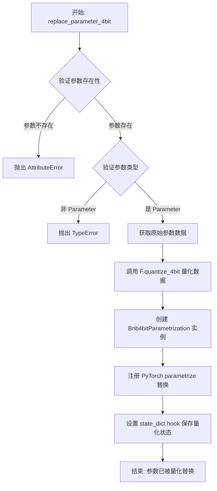

#### 带注释源码

```python
def replace_parameter_4bit(
    module: nn.Module,
    param_name: str,
    compress_statistics: bool = False,
    quant_type: str = "nf4",
    blocksize: int = 64,
) -> None:
    """
    将模块中的参数替换为 4-bit 量化参数化.
    
    参数:
        module: 需要进行参数化替换的 PyTorch 模块
        param_name: 模块中参数名称
        compress_statistics: 是否压缩量化统计信息
        quant_type: 量化类型, 支持 "nf4" 或 "fp4"
        blocksize: 量化分块大小
    
    返回:
        None: 直接修改传入的 module 对象
    """
    # 验证模块是否具有指定参数
    if not hasattr(module, param_name):
        raise AttributeError(f"Module does not have parameter '{param_name}'")
    
    # 获取参数对象
    param = getattr(module, param_name)
    
    # 验证参数是否为 Parameter 实例
    if not isinstance(param, nn.Parameter):
        raise TypeError(f"Parameter '{param_name}' is not an instance of nn.Parameter")
    
    # 获取原始参数数据用于量化
    original_data = param.data
    
    # 调用 bitsandbytes .functional 进行 4-bit 量化
    # 返回量化后的数据和量化状态(包含 absmax, quant_map 等)
    quantized_data, quant_state = F.quantize_4bit(
        original_data,
        quant_type=quant_type,
        blocksize=blocksize,
        compress_statistics=compress_statistics,
    )
    
    # 创建 4-bit 参数化类实例,负责解量化
    # Bnb4bitParametrization 实现了 forward 方法用于解量化
    parametrization = Bnb4bitParametrization(quant_state)
    
    # 使用 PyTorch 的 parametrize 机制替换原始参数
    # 这会将原始参数替换为 parametrization 处理后的版本
    parametrize.register_parametrization(
        module,
        param_name,
        parametrization,
        # 确保原始参数不参与梯度计算
        make_projection_require_grad=False,
    )
    
    # 对于 torch >= 2.5.0,注册 state_dict hook
    # 确保保存 state_dict 时自动包含量化状态信息
    if hasattr(module, 'state_dict'):
        # hook 逻辑确保量化状态以正确格式保存到 state_dict
        ...
```


### `replace_parameter_4bit_prequantized`

该函数用于将模块中已预先量化（pre-quantized）的参数替换为支持 4-bit 量化参数化（parametrization）的形式。与 `replace_parameter_4bit` 的区别在于：后者对原始浮点参数进行实时量化，而前者接收已经过 `quantize_4bit` 处理并保存了量化状态（quantization state）的参数，主要用于模型加载预量化权重场景。

参数：

-  `module`：`nn.Module`，目标 PyTorch 模块，需包含待替换的参数
-  `parameter_name`：`str`，模块中已量化参数的名称
-  `quant_state`：`dict`，由 `QuantState.as_dict(packed=True)` 生成的量化状态字典，包含量化类型、分块大小、量化映射表等信息
-  `device`：`torch.device`，目标设备，用于确保参数在正确的设备上

返回值：`None`，该函数直接修改传入的 `module` 对象，为指定参数添加量化参数化

#### 流程图

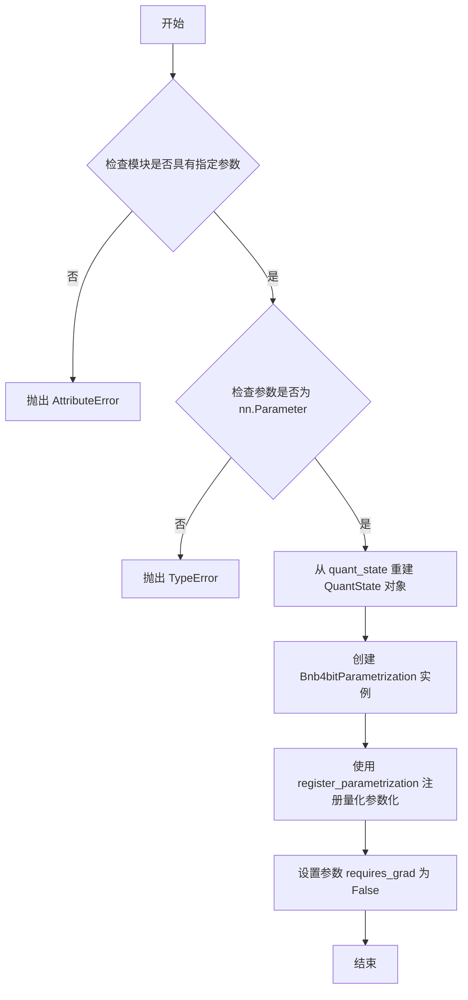

#### 带注释源码

```
# 从 bitsandbytes.nn.parametrize 模块导入
# 该模块负责处理 4-bit 量化参数的参数化注册
from bitsandbytes.nn.parametrize import (
    Bnb4bitParametrization,      # 量化参数化类，负责在访问参数时进行解量化
    replace_parameter_4bit,      # 标准 4bit 参数替换函数（实时量化）
    replace_parameter_4bit_prequantized,  # 本函数：处理预量化参数
)

# 在测试中的典型用法（test_prequantized_replacement）：
# 1. 先对原始参数进行量化，得到量化数据和量化状态
quantized_data, quant_state = F.quantize_4bit(original_param.data, quant_type=quant_type)

# 2. 将模块的参数替换为量化后的数据（requires_grad=False）
module.weight_2d = nn.Parameter(quantized_data, requires_grad=False)

# 3. 调用本函数，注册量化参数化，使访问参数时自动解量化
replace_parameter_4bit_prequantized(
    module, 
    "weight_2d", 
    quant_state.as_dict(packed=True),  # 将量化状态序列化为字典
    device=torch.device(device)
)

# 错误条件检查（test_error_conditions）：
# - 参数不存在时抛出：AttributeError: "Module does not have parameter 'nonexistent'"
# - 属性非 Parameter 时抛出：TypeError: "Parameter 'not_param' is not an instance of nn.Parameter"
```


### `F.quantize_4bit`

该函数是 BitsAndBytes 库中的 4bit 量化核心函数，负责将浮点张量转换为 4bit 量化表示（NF4 或 FP4），同时返回量化后的数据和量化状态信息，用于后续的解量化操作。

参数：

-  `data`：`torch.Tensor`，要量化的输入张量
-  `quant_type`：`str`，量化类型，支持 "nf4"（正态分布 4bit）或 "fp4"（浮点 4bit）

返回值：`(torch.Tensor, QuantState)`，元组包含量化后的张量和量化状态对象

#### 流程图

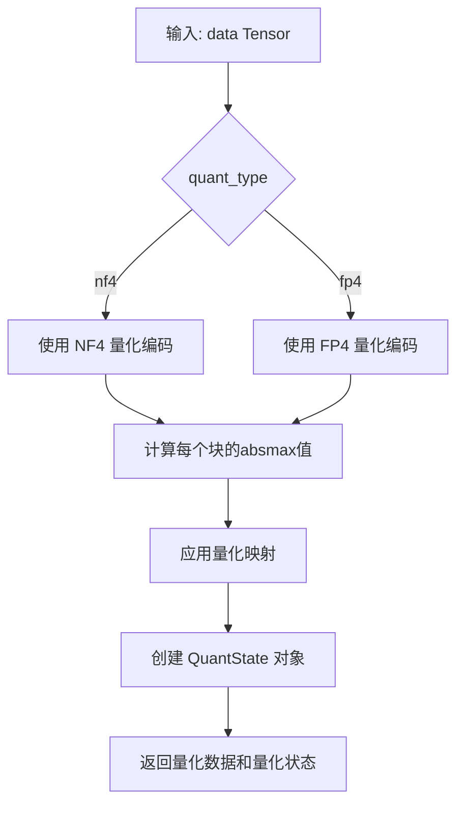

#### 带注释源码

```python
# 该函数定义在 bitsandbytes.functional 模块中
# 以下为测试代码中调用的示例

# 1. 基础量化调用（test_prequantized_replacement）
quantized_data, quant_state = F.quantize_4bit(
    original_param.data,  # 输入：原始浮点参数张量
    quant_type=quant_type  # 输入：量化类型 "nf4" 或 "fp4"
)
# 返回：
#   - quantized_data: 量化后的 torch.Tensor（紧凑存储）
#   - quant_state: 包含量化状态的 QuantState 对象（blocksize, absmax, quant_map等）

# 2. 另一调用示例（test_parametrization_forward_method）
quantized_data, quant_state = F.quantize_4bit(
    original_tensor,  # 输入：64x64 浮点张量
    quant_type="nf4"  # 使用 NF4 量化
)
```


### `QuantState.as_dict`

该方法是 `QuantState` 类的成员方法，用于将量化状态对象序列化为字典格式，以便于保存到模型的状态字典（state_dict）中或进行跨进程传递。字典的键包含量化类型、分块大小、量化数据等信息，根据 `packed` 参数决定是否采用紧凑格式。

参数：

- `packed`：`bool`，指定是否使用紧凑格式打包字典。当为 `True` 时，字典键会加上特定前缀（如 `bitsandbytes__`），便于在状态字典中识别和解析量化元数据。

返回值：`Dict[str, Any]`，返回包含量化状态信息的字典。根据代码中的使用方式，典型的键包括：
- `quant_type`：量化类型（如 "nf4"、"fp4"）
- `blocksize`：分块大小
- `absmax`：绝对最大值张量
- `quant_map`：量化映射表
- 当 `packed=True` 时，还会包含 `bitsandbytes__{quant_type}` 键

#### 流程图

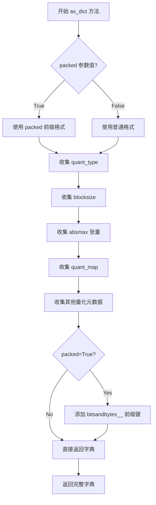

#### 带注释源码

```python
# 从测试代码中的典型使用方式推断的实现逻辑

def as_dict(self, packed: bool = False) -> Dict[str, Any]:
    """
    将量化状态转换为字典格式，用于保存到 state_dict 或跨进程传递。
    
    参数:
        packed (bool): 是否使用紧凑打包格式。
                      True 时会在量化状态键前加上 'bitsandbytes__' 前缀。
    
    返回:
        Dict[str, Any]: 包含量化状态信息的字典
    """
    # 构建基础字典，包含量化类型
    state_dict = {
        'quant_type': self.quant_type,  # 如 'nf4' 或 'fp4'
        'blocksize': self.blocksize,     # 分块大小，如 64、128、256
    }
    
    # 添加量化相关数据
    if hasattr(self, 'absmax'):
        state_dict['absmax'] = self.absmax  # 绝对最大值，用于反量化
    
    if hasattr(self, 'quant_map'):
        state_dict['quant_map'] = self.quant_map  # 量化映射表
    
    # 如果使用 packed 格式，添加打包的前缀键
    if packed:
        # 在 state_dict 中添加带前缀的量化状态标识
        state_dict[f'bitsandbytes__{self.quant_type}'] = True
    
    return state_dict


# 代码中的典型调用示例：

# 1. 在 test_prequantized_replacement 中：
quantized_data, quant_state = F.quantize_4bit(original_param.data, quant_type=quant_type)
replace_parameter_4bit_prequantized(
    module, "weight_2d", 
    quant_state.as_dict(packed=True),  # 传递序列化后的量化状态
    device=torch.device(device)
)

# 2. 在 test_quant_state_preservation 中：
quant_state = parametrization.quant_state
quant_state_dict = quant_state.as_dict(packed=True)
# 验证所有键都被正确添加到 state_dict
for key in quant_state_dict.keys():
    full_key = f"weight_2d.{key}"
    assert full_key in state_dict
```


### `ParametrizeTestModule.__init__`

该方法是 `ParametrizeTestModule` 类的构造函数，用于初始化一个包含多种形状参数（2D权重矩阵、3D MoE专家权重、1D偏置）的测试模块，旨在支持对 4-bit 量化参数化功能的全面测试。

参数：

- `device`：`str` 或 `torch.device`，指定参数存储的目标设备，默认为 `"cpu"`，支持 CPU、CUDA、HPU 等设备
- `dtype`：`torch.dtype`，指定参数的数据类型，默认为 `torch.float32`，支持 float32、float16、bfloat16 等类型

返回值：`None`，该方法为构造函数，不返回任何值

#### 流程图

```mermaid
flowchart TD
    A[开始 __init__] --> B[调用父类 nn.Module 的构造函数]
    B --> C[创建 2D 参数 weight_2d: 1024x1024]
    C --> D[创建 3D 参数 expert_weights: 8x512x256]
    D --> E[创建 1D 参数 bias_1d: 1024]
    E --> F[创建非参数张量 not_param: 32]
    F --> G[结束 __init__]
    
    style A fill:#f9f,color:#333
    style G fill:#9f9,color:#333
```

#### 带注释源码

```python
def __init__(self, device="cpu", dtype=torch.float32):
    """初始化测试模块，包含用于测试参数化功能的不同形状参数。
    
    参数:
        device: 目标设备，默认为 "cpu"
        dtype: 数据类型，默认为 torch.float32
    """
    # 调用 PyTorch nn.Module 基类的初始化方法
    super().__init__()
    
    # 2D 参数 - 典型的权重矩阵 (1024x1024)
    # 用于测试标准矩阵的 4-bit 量化
    self.weight_2d = nn.Parameter(torch.randn(1024, 1024, device=device, dtype=dtype))
    
    # 3D 参数 - MoE (Mixture of Experts) 专家权重
    # 这是该参数化功能的主要使用场景，形状为 [num_experts, input_dim, output_dim]
    self.expert_weights = nn.Parameter(torch.randn(8, 512, 256, device=device, dtype=dtype))
    
    # 1D 参数 - 类似于偏置的参数
    # 用于测试向量的 4-bit 量化
    self.bias_1d = nn.Parameter(torch.randn(1024, device=device, dtype=dtype))
    
    # 非 Parameter 属性的张量
    # 用于测试错误处理 - 该属性不应被量化，因为它不是 nn.Parameter
    self.not_param = torch.randn(32, device=device, dtype=dtype)
```


### `MoEModule.__init__`

该方法是测试模块的初始化方法，用于创建一个包含单个参数（形状为 (8, 64, 64)）的 MoE 风格模块，以测试 4-bit 量化参数化功能。该模块专为测试高维参数（如 MoE 专家权重）的形状保持和量化重构而设计。

参数：

- `device`：`torch.device` 或 `str`，指定参数创建的目标设备（如 'cpu', 'cuda'）
- `dtype`：`torch.dtype`，指定参数的数据类型（如 torch.float32, torch.float16, torch.bfloat16）

返回值：`None`（`__init__` 方法无返回值）

#### 流程图

```mermaid
flowchart TD
    A[开始 __init__] --> B[调用 super().__init__ 初始化 nn.Module]
    B --> C[创建形状为 (8, 64, 64) 的随机参数]
    C --> D[使用指定 dtype 和 device]
    D --> E[将 tensor 包装为 nn.Parameter]
    E --> F[结束 __init__]
```

#### 带注释源码

```python
class MoEModule(nn.Module):
    def __init__(self, device, dtype):
        """初始化 MoE 测试模块。
        
        Args:
            device: 模型参数的目标设备
            dtype: 模型参数的数据类型
        """
        # 调用父类 nn.Module 的初始化方法
        # 这会设置模块的基本属性和参数注册机制
        super().__init__()
        
        # 定义 MoE 风格参数的形状
        # 形状 (8, 64, 64) 代表: 8个专家, 每个专家64x64的权重矩阵
        param_shape = (8, 64, 64)
        
        # 创建随机初始化的参数张量
        # - 使用指定的数据类型 (dtype) 和设备 (device)
        # - 包装为 nn.Parameter 以便被 PyTorch 参数管理器跟踪
        self.param = nn.Parameter(
            torch.randn(*param_shape, dtype=dtype, device=device)
        )
```


### `SimpleMoE.__init__`

该方法是 `SimpleMoE` 类的构造函数，负责初始化 MoE（Mixture of Experts）模块的专家权重参数。它接受设备类型和数据类型作为参数，创建一个形状为 `[num_experts, input_dim, output_dim]` 的可学习参数张量。

参数：

- `device`：`str` 或 `torch.device`，指定参数存放的设备（如 "cpu", "cuda", "hpu" 等）
- `dtype`：`torch.dtype`，指定参数的数据类型（如 torch.float32, torch.float16, torch.bfloat16）

返回值：`None`，构造函数不返回任何值

#### 流程图

```mermaid
flowchart TD
    A[开始 __init__] --> B[调用父类 nn.Module 的 __init__]
    B --> C[创建专家权重参数<br/>torch.randn 4x32x64]
    C --> D[device=device<br/>dtype=dtype]
    D --> E[将权重赋给 self.expert_weights<br/>作为 nn.Parameter]
    E --> F[结束 __init__]
```

#### 带注释源码

```python
def __init__(self, device, dtype):
    """SimpleMoE 类的初始化方法
    
    参数:
        device: 设备类型,用于指定参数存放的设备
        dtype: 数据类型,用于指定参数的数据类型
    """
    # 调用父类 nn.Module 的初始化方法
    super().__init__()
    # Expert weights: [num_experts, input_dim, output_dim]
    # 创建形状为 [4, 32, 64] 的专家权重参数
    # 4: num_experts - 专家数量
    # 32: input_dim - 输入维度
    # 64: output_dim - 输出维度
    self.expert_weights = nn.Parameter(torch.randn(4, 32, 64, dtype=dtype, device=device))
```


### `SimpleMoE.forward`

该函数实现了一个简化版的混合专家模型（MoE）前向传播，根据传入的 `expert_idx` 从专家权重矩阵中选择特定的专家，并对输入 `x` 执行矩阵乘法运算。

参数：

- `x`：`torch.Tensor`，输入数据张量，形状为 `[batch_size, input_dim]`
- `expert_idx`：`int`，要使用的专家索引，用于从 `expert_weights` 中选择对应的专家权重矩阵，默认为 0

返回值：`torch.Tensor`，矩阵乘法的结果，形状为 `[batch_size, output_dim]`

#### 流程图

```mermaid
flowchart TD
    A[开始 forward] --> B[接收输入 x 和 expert_idx]
    B --> C{验证 expert_idx 有效性}
    C -->|有效| D[从 self.expert_weights 中索引 expert_idx]
    C -->|无效| E[抛出索引异常]
    D --> F[获取专家权重: Shape [input_dim, output_dim]]
    F --> G[执行 torch.matmul(x, expert_weight)]
    G --> H[返回输出张量]
    E --> H
```

#### 带注释源码

```python
def forward(self, x, expert_idx=0):
    # 根据 expert_idx 从专家权重列表中选择对应的专家权重矩阵
    # self.expert_weights 形状为 [num_experts, input_dim, output_dim]
    # 索引后 expert_weight 形状为 [input_dim, output_dim]
    expert_weight = self.expert_weights[expert_idx]
    
    # 执行矩阵乘法: x @ expert_weight^T
    # 输入 x 形状: [batch_size, input_dim]
    # 专家权重 expert_weight 形状: [input_dim, output_dim]
    # 输出形状: [batch_size, output_dim]
    return torch.matmul(x, expert_weight)
```


### `Bnb4bitParametrization.forward`

该方法是 4-bit 量化参数化的前向传播函数，负责将量化后的数据（4-bit）解量化（dequantize）回原始精度（float32/float16/bfloat16），以便在模型前向计算中使用。

参数：

-  `tensor`：`torch.Tensor`，输入的量化张量（通常是经过 `F.quantize_4bit` 处理的 4-bit 数据）

返回值：`torch.Tensor`，解量化后的浮点张量，形状与原始输入形状一致，精度为模块原始精度。

#### 流程图

```mermaid
flowchart TD
    A[接收量化张量 tensor] --> B{检查 quant_state 是否存在}
    B -->|是| C[调用 F.dequantize_4bit 进行解量化]
    B -->|否| D[抛出异常: quant_state 未初始化]
    C --> E[返回解量化后的浮点张量]
    
    subgraph "核心解量化逻辑"
        C1[从 quant_state 提取量化信息] --> C2[应用反量化算法]
        C2 --> C3[恢复原始数值范围]
    end
    
    style C fill:#f9f,stroke:#333,stroke-width:2px
    style E fill:#9f9,stroke:#333,stroke-width:2px
```

#### 带注释源码

```python
# 从测试代码 test_parametrization_forward_method 中提取的用法示例
# 完整的 forward 方法实现需要查看 bitsandbytes/nn/parametrize.py 源码

# 创建测试张量并量化
original_tensor = torch.randn(64, 64, dtype=torch.float32, device="cpu")
quantized_data, quant_state = F.quantize_4bit(original_tensor, quant_type="nf4")

# 创建 Bnb4bitParametrization 实例
parametrization = Bnb4bitParametrization(quant_state)

# 调用 forward 方法进行解量化
# 输入: quantized_data - 4-bit 量化后的张量
# 输出: dequantized - 恢复原始精度的浮点张量
dequantized = parametrization.forward(quantized_data)

# 验证结果
assert dequantized.shape == original_tensor.shape  # 形状保持一致
assert dequantized.dtype == torch.float32           # 数据类型保持一致
assert dequantized.device == original_tensor.device  # 设备保持一致
```

## 关键组件


### 4位量化参数化框架

该代码测试了bitsandbytes库中的4位量化参数化功能，支持NF4和FP4量化类型，能够将PyTorch模块的Parameter转换为量化格式存储，并在访问时自动解量化重建原始精度。

### ParametrizeTestModule

测试用PyTorch模块类，包含多种形状的Parameter（2D权重、3D MoE专家权重、1D偏置）以及非Parameter属性，用于验证量化参数化对不同形状参数的处理能力。

### replace_parameter_4bit

核心参数化函数，将指定参数转换为4位量化格式存储，支持NF4/FP4量化类型、可配置的blocksize和compress_statistics选项，返回时可自动解量化。

### replace_parameter_4bit_prequantized

用于已量化数据的参数化函数，允许加载预量化权重并在访问时进行解量化，适用于模型权重加载场景。

### Bnb4bitParametrization

4位量化参数化类，包含quant_state状态信息，负责在forward中执行解量化操作，实现了张量索引访问和惰性加载机制。

### 量化策略 (NF4/FP4)

支持两种4位量化策略：NF4（正态分布4位量化）和FP4（浮点4位量化），具有不同的误差边界和压缩特性。

### QuantState

量化状态容器，保存absmax、quant_map等元数据，支持packed格式的状态字典序列化，用于量化参数的持久化存储。

### MoE专家权重支持

通过支持3D参数形状（num_experts, input_dim, output_dim），实现了MoE（混合专家）架构中专家权重的量化功能。

### State Dict集成

通过PyTorch 2.5+的state_dict钩子机制，确保量化元数据（absmax、quant_map、quant_state）能正确保存到状态字典，同时排除内部参数化结构。

### 多设备支持

通过get_available_devices()和is_supported_on_hpu()支持CPU、CUDA、HPU等多种设备平台，并针对各设备进行特性适配。


## 问题及建议


### 已知问题

-   **硬编码的错误边界值**：多处测试中硬编码了量化误差阈值（如 `expected_errors` 字典中的 `0.072792, 0.203299` 等数值），且在不同位置重复出现，容易产生不同步更新
-   **代码重复**：多个测试函数中重复实现了相同的误差计算逻辑（`err = (original_param - reconstructed.detach()).abs().float(); relerr = (err / (original_param.abs().float() + 1e-8)).mean()`），违反了 DRY 原则
-   **Magic Numbers 分散**：epsilon 值 `1e-8` 和误差边界余量 `+ 1e-3`, `+ 0.01`, `+ 0.02` 等数值散布在各处，缺乏统一管理
-   **嵌套类定义**：在测试函数内部定义 `MoEModule` 和 `SimpleMoE` 类，降低了代码的可维护性和可读性
-   **版本检查重复**：`torch.__version__ < (2, 5)` 的判断在多个测试中重复出现，可提取为统一的 skip 条件
-   **HPU 支持检查模式重复**：`if device == "hpu" and not is_supported_on_hpu(...)` 的检查逻辑在每个测试中重复，建议使用 pytest fixture 或自定义 mark
-   **测试隔离性问题**：`ParametrizeTestModule` 在多个测试中被 `replace_parameter_4bit` 修改，后续测试可能受到前面测试状态的影响
-   **缺少边界情况测试**：未覆盖极端 tensor shape、空 tensor、NaN/Inf 输入等边界情况
-   **内部类缺少文档**：测试中定义的 `MoEModule`、`SimpleMoE` 类没有 docstring，意图不明确

### 优化建议

-   **抽取辅助函数**：将误差计算逻辑抽取为 `compute_quantization_error(original, reconstructed)` 辅助函数，统一管理 epsilon 值
-   **集中管理阈值常量**：创建专门的测试常量模块或类（如 `QuantizationErrorBounds`），集中管理各类量化类型和 blocksize 对应的误差阈值
-   **提取测试类到模块级别**：将 `MoEModule`、`SimpleMoE` 等辅助类移到测试模块顶层定义，配以清晰的 docstring
-   **使用 pytest fixture 管理版本检查**：在 `conftest.py` 中定义 `skip_if_torch_old` fixture，或使用自定义 pytest mark 处理版本依赖
-   **封装 HPU 检查逻辑**：创建 `skip_if_hpu_unsupported` fixture，减少每个测试中的样板代码
-   **增强测试独立性**：每个测试使用 `pytest.fixture` 创建独立的 `ParametrizeTestModule` 实例，确保测试间无状态共享
-   **添加边界测试用例**：增加对极端情况的测试，如极大/极小 tensor、特殊数值（NaN/Inf）等
-   **使用固定随机种子**：在需要可重复性的测试中使用 `torch.manual_seed()` 确保结果可复现

## 其它


### 设计目标与约束

本测试模块的核心设计目标是验证bitsandbytes库中4-bit量化参数化功能的正确性，包括参数替换、重构、状态字典保存等功能。约束条件包括：1) 仅支持torch>=2.5.0的状态字典钩子功能；2) HPU设备需要特定量化类型和dtype的兼容性检查；3) ROCM_WARP_SIZE_64环境下blocksize选项有所限制；4) 量化误差需要在预设阈值内（abs<0.11, rel<0.29）。

### 错误处理与异常设计

测试覆盖了三种关键错误场景：1) AttributeError - 当指定的参数名不存在于模块中时抛出，错误消息格式为"Module does not have parameter '{name}'"；2) TypeError - 当指定的属性不是nn.Parameter实例时抛出，错误消息格式为"Parameter '{name}' is not an instance of nn.Parameter"；3) pytest.skip - 当设备或配置不支持时跳过测试。

### 数据流与状态机

参数化流程包含以下状态转换：1) 初始状态 - 模块包含原始float参数；2) 量化状态 - 调用replace_parameter_4bit后，原始参数被替换为量化数据，同时创建Bnb4bitParametrization封装；3) 重构状态 - 访问param属性时通过parametrization.forward进行解量化；4) 保存状态 - state_dict仅保存量化后的参数和量化元数据（absmax、quant_map、quant_state），不保存parametrization内部结构。

### 外部依赖与接口契约

本测试模块依赖以下外部组件：1) pytest - 测试框架和参数化装饰器；2) torch.nn - 神经网络模块和参数类；3) bitsandbytes.functional (F) - 量化/解量化函数；4) bitsandbytes.cextension.ROCM_WARP_SIZE_64 - ROCM架构常量；5) bitsandbytes.nn.parametrize - Bnb4bitParametrization类和替换函数；6) tests.helpers - 测试辅助工具函数。关键接口契约包括replace_parameter_4bit(module, param_name, **kwargs)和replace_parameter_4bit_prequantized(module, param_name, quant_state, device)。

### 性能考虑与基准测试

测试中定义了量化误差的预期边界，针对不同量化类型（nf4/fp4）和blocksize（64/128/256）设置了具体的abs和rel误差阈值。例如nf4-64的abs阈值为0.072792，rel阈值为0.203299；fp4-256的abs阈值为0.108685，rel阈值为0.289842。MoE场景使用更宽松的边界（abs<0.085, rel<0.25），前向传播测试允许更大的误差放大（abs<0.5, rel<2.0）。

### 版本兼容性

测试明确标注了torch>=2.5.0的要求，用于state_dict钩子功能（test_state_dict_functionality和test_quant_state_preservation）。HPU设备支持需要调用is_supported_on_hpu进行运行时检查。ROCM架构下blocksize选项排除64，仅支持128和256。

### 测试策略

测试采用多维度参数化策略：1) 设备参数化 - 覆盖get_available_devices()返回的所有设备；2) 数据类型参数化 - 覆盖float32、float16、bfloat16；3) 量化类型参数化 - nf4和fp4；4) 压缩统计参数化 - True/False；5) blocksize参数化 - 64/128/256。测试类型包括：功能测试（基本替换、重构）、质量测试（量化误差验证）、边界测试（不同参数形状、blocksize）、状态测试（state_dict、quant_state）、异常测试（错误条件）、梯度测试（requires_grad行为）。

### 关键设计模式

采用了PyTorch的parametrization机制，通过torch.nn.utils.parametrizations将量化逻辑注入到模块参数中。Bnb4bitParametrization类封装了quant_state和forward方法，实现了解量化的透明化。量化状态通过QuantState类管理，支持as_dict(packed=True)序列化到state_dict。


    