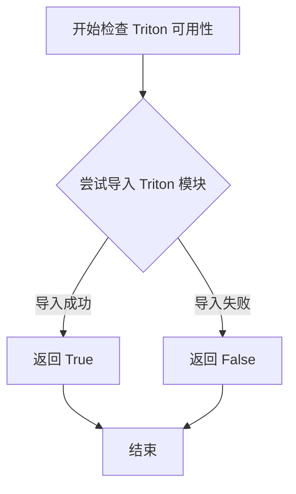
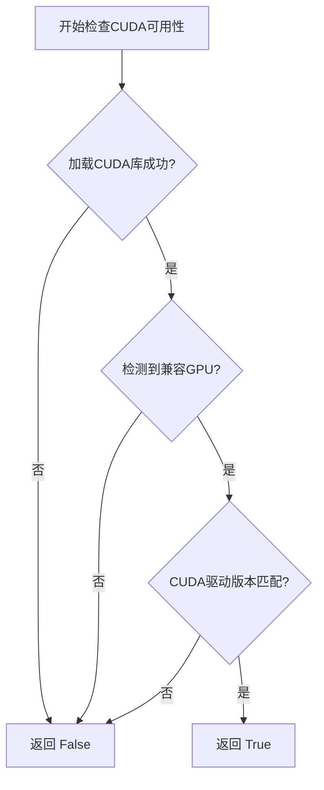
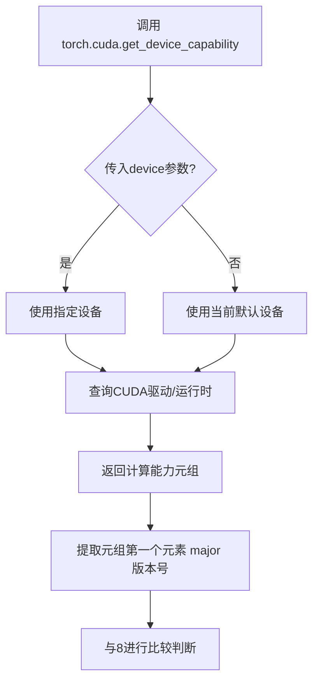

# `bitsandbytes\tests\test_triton.py` 详细设计文档

这是一个pytest测试文件，用于验证bitsandbytes库中SwitchBackLinear模块（Triton加速的8-bit量化线性层）与标准PyTorch Linear层以及Linear8bitLt模块在前向传播和梯度计算上的一致性。

## 整体流程

```mermaid
graph TD
    A[开始测试] --> B{检查Triton和GPU可用性}
    B -- 不可用 --> C[跳过测试]
    B -- 可用 --> D[创建标准Linear层]
    D --> E[创建SwitchBackLinear层]
    E --> F[创建Linear8bitLt基线层]
    F --> G[复制权重和偏置到各层]
    G --> H[创建输入张量x1, x2, x3]
    H --> I[前向传播: out_standard = standard(x1)]
    I --> J[反向传播计算梯度]
    J --> K[前向传播: out_sb = switchback(x2)]
    K --> L[反向传播计算梯度]
    L --> M[前向传播: out_baseline = baseline(x3)]
    M --> N[反向传播计算梯度]
    N --> O[计算输出误差: err_sb vs err_baseline]
    O --> P{err_sb < 2 * err_baseline?}
    P -- 否 --> Q[断言失败]
    P -- 是 --> R[计算偏置梯度误差]
    R --> S{err_sb < 2 * err_baseline?}
    S -- 否 --> Q
    S -- 是 --> T[计算权重梯度误差]
    T --> U{err_sb < 2 * err_baseline?}
    U -- 否 --> Q
    U -- 是 --> V[计算输入梯度误差]
    V --> W{err_sb < 2 * err_baseline?}
    W -- 否 --> Q
    W -- 是 --> X[测试通过]
```

## 类结构

```
测试模块 (test_switchback.py)
└── test_switchback (测试函数)
    ├── 依赖: SwitchBackLinear (bitsandbytes.nn.triton_based_modules)
    ├── 依赖: Linear8bitLt (bitsandbytes.nn)
    └── 依赖: is_triton_available (bitsandbytes.triton.triton_utils)
```

## 全局变量及字段


### `dim`
    
线性层的输入特征维度大小

类型：`int`
    


### `batch`
    
输入数据的批处理大小

类型：`int`
    


### `standard`
    
标准PyTorch线性层，作为功能验证的基准模型

类型：`torch.nn.Linear`
    


### `switchback`
    
基于Triton实现的SwitchBack量化线性层，支持向量级量化

类型：`SwitchBackLinear`
    


### `baseline`
    
8位量化线性层，用于与量化方法对比的基线模型

类型：`Linear8bitLt`
    


### `x1`
    
随机生成的输入张量，启用了梯度计算，用于标准线性层

类型：`torch.Tensor`
    


### `x2`
    
输入张量的克隆，独立梯度，用于SwitchBack线性层

类型：`torch.Tensor`
    


### `x3`
    
输入张量的克隆，独立梯度，用于基线线性层

类型：`torch.Tensor`
    


### `out_standard`
    
标准线性层的前向传播输出

类型：`torch.Tensor`
    


### `out_sb`
    
SwitchBack线性层的前向传播输出

类型：`torch.Tensor`
    


### `out_baseline`
    
基线线性层的前向传播输出

类型：`torch.Tensor`
    


### `err_sb`
    
SwitchBack输出与标准输出的绝对误差均值，用于评估量化误差

类型：`float`
    


### `err_baseline`
    
基线输出与标准输出的绝对误差均值，用于评估量化误差

类型：`float`
    


### `vector_wise_quantization`
    
控制是否启用向量级量化模式的标志参数

类型：`bool`
    


    

## 全局函数及方法


### `test_switchback`

这是一个pytest测试函数，用于验证`SwitchBackLinear`模块与标准`torch.nn.Linear`模块以及`Linear8bitLt`基线模块在前向传播和反向传播过程中的数值一致性，确保SwitchBack实现满足预期的精度要求。

**参数：**

- `vector_wise_quantization`：`bool`，控制是否使用向量级量化（通过`TRUE_FALSE`参数化获取）

**返回值：** `None`，该函数为测试函数，无显式返回值，主要通过`assert`语句进行验证

#### 流程图

```mermaid
flowchart TD
    A[开始测试] --> B{参数: vector_wise_quantization}
    B --> C[设置 dim=83, batch=13]
    C --> D[创建标准Linear模型 standard]
    D --> E[创建SwitchBackLinear模型 switchback]
    E --> F[创建Linear8bitLt模型 baseline]
    F --> G[复制权重和偏置到三个模型]
    G --> H[创建输入张量 x1, x2, x3]
    H --> I[前向传播: standard(x1)]
    I --> J[计算损失并反向传播]
    J --> K[前向传播: switchback(x2)]
    K --> L[计算损失并反向传播]
    L --> M[前向传播: baseline(x3)]
    M --> N[计算损失并反向传播]
    N --> O[计算输出误差: err_sb, err_baseline]
    O --> P{断言: err_sb < 2 * err_baseline}
    P -->|失败| Q[测试失败]
    P -->|通过| R[计算偏置梯度误差]
    R --> S{断言: err_sb < 2 * err_baseline}
    S -->|失败| Q
    S -->|通过| T[计算权重梯度误差]
    T --> U{断言: err_sb < 2 * err_baseline}
    U -->|失败| Q
    U -->|通过| V[计算输入梯度误差]
    V --> W{断言: err_sb < 2 * err_baseline}
    W -->|失败| Q
    W -->|通过| X[测试通过]
```

#### 带注释源码

```python
import pytest
import torch

from bitsandbytes.nn import Linear8bitLt
from bitsandbytes.nn.triton_based_modules import SwitchBackLinear
from bitsandbytes.triton.triton_utils import is_triton_available
from tests.helpers import TRUE_FALSE


# 条件跳过装饰器：仅在Triton可用、CUDA可用且计算能力>=8.0时运行
@pytest.mark.skipif(
    not is_triton_available() or not torch.cuda.is_available() or not torch.cuda.get_device_capability()[0] >= 8,
    reason="This test requires triton and a GPU with compute capability 8.0 or higher.",
)
@pytest.mark.deprecated  # 标记为已弃用的测试
@pytest.mark.parametrize("vector_wise_quantization", TRUE_FALSE)
def test_switchback(vector_wise_quantization):
    """
    测试SwitchBackLinear模块与标准Linear和Linear8bitLt的数值一致性
    
    参数:
        vector_wise_quantization: bool, 是否使用向量级量化
    """
    # 测试配置：维度83，批量大小13
    for dim in [83]:
        for batch in [13]:
            # 创建标准PyTorch Linear模块作为参考
            standard = torch.nn.Linear(dim, 4 * dim).cuda().half()
            # 创建SwitchBackLinear模块（待测试）
            switchback = (
                SwitchBackLinear(dim, 4 * dim, vector_wise_quantization=vector_wise_quantization).cuda().half()
            )
            # 创建8bit量化基线模块
            baseline = Linear8bitLt(dim, 4 * dim).cuda().half()
            
            # 将标准模型的权重和偏置复制到其他两个模型，确保初始化一致
            switchback.weight.data.copy_(standard.weight)
            switchback.bias.data.copy_(standard.bias)
            baseline.weight.data.copy_(standard.weight)
            baseline.bias.data.copy_(standard.bias)

            # 创建三个相同输入张量的副本，用于分别测试三个模型
            x1 = torch.randn(batch, dim).cuda().half().requires_grad_(True)
            x2 = x1.clone().detach().requires_grad_(True)
            x3 = x1.clone().detach().requires_grad_(True)

            # ===== 前向传播测试 =====
            out_standard = standard(x1)  # 标准模型前向传播
            (2**10 * out_standard.abs().mean()).backward()  # 缩放损失并反向传播

            print(x2.dtype)
            out_sb = switchback(x2)  # SwitchBack模型前向传播
            (2**10 * out_sb.abs().mean()).backward()  # 缩放损失并反向传播

            out_baseline = baseline(x3)  # Baseline模型前向传播
            (2**10 * out_baseline.abs().mean()).backward()  # 缩放损失并反向传播

            # ===== 输出误差验证 =====
            err_sb = (out_standard - out_sb).abs().mean()  # SwitchBack输出与标准输出误差
            err_baseline = (out_standard - out_baseline).abs().mean()  # Baseline输出与标准输出误差
            print("OUT", err_sb, err_baseline)
            assert err_sb < 2 * err_baseline  # SwitchBack误差应小于Baseline误差的2倍

            # ===== 偏置梯度误差验证 =====
            err_sb = (standard.bias.grad - switchback.bias.grad).abs().mean()
            err_baseline = (standard.bias.grad - baseline.bias.grad).abs().mean()

            print("GW2", err_sb, err_baseline)
            assert err_sb < 2 * err_baseline

            # ===== 权重梯度误差验证 =====
            err_sb = (standard.weight.grad - switchback.weight.grad).abs().mean()
            err_baseline = (standard.weight.grad - baseline.weight.grad).abs().mean()

            print("GW1", err_sb, err_baseline)
            assert err_sb < 2 * err_baseline

            # ===== 输入梯度误差验证 =====
            err_sb = (x1.grad - x2.grad).abs().mean()
            err_baseline = (x1.grad - x3.grad).abs().mean()

            print("GX1", err_sb, err_baseline)
            assert err_sb < 2 * err_baseline
```


### `is_triton_available`

该函数用于检测当前环境中 Triton 是否可用，通过尝试导入 Triton 模块来判断其是否已安装。

参数：此函数无参数。

返回值：`bool`，返回 True 表示 Triton 可用，返回 False 表示 Triton 不可用。

#### 流程图



#### 带注释源码

```
# 由于提供的代码片段中未包含 is_triton_available 函数的定义，
# 仅包含对该函数的使用，以下为基于使用方式的推断：

def is_triton_available():
    """
    检查 Triton 是否可用。
    
    该函数通常通过尝试导入 'triton' 模块来检测 Triton 是否已安装。
    如果导入成功则返回 True，否则返回 False。
    
    Returns:
        bool: Triton 是否可用
    """
    try:
        import triton
        return True
    except ImportError:
        return False

# 在测试代码中的实际使用方式：
@pytest.mark.skipif(
    not is_triton_available() or not torch.cuda.is_available() or not torch.cuda.get_device_capability()[0] >= 8,
    reason="This test requires triton and a GPU with compute capability 8.0 or higher.",
)
def test_switchback(vector_wise_quantization):
    # 测试代码...
```


### `torch.cuda.is_available`

该函数是PyTorch的CUDA运行时检查接口，用于探测当前系统是否满足CUDA执行的前置条件（包括CUDA驱动、运行时库及兼容硬件的可用性），返回布尔值表示GPU加速是否可用。

参数：

- 该函数无参数

返回值：`bool`，返回`True`表示CUDA可用（可使用GPU进行计算），返回`False`表示CUDA不可用

#### 流程图



#### 带注释源码

```python
import torch

# 调用PyTorch的CUDA可用性检查函数
# 该函数内部实现逻辑（Python层面等价描述）：

def cuda_is_available():
    """
    检查CUDA是否可用于PyTorch运算
    
    检查流程：
    1. 验证CUDA运行时库是否已正确加载
    2. 确认系统中存在支持CUDA的GPU设备
    3. 核对CUDA驱动版本与运行时版本的兼容性
    
    Returns:
        bool: CUDA可用返回True，否则返回False
    """
    # 实际PyTorch内部实现位于_C模块
    # 以下为等价调用形式：
    return torch._C._cuda_getDeviceCount() > 0

# 在测试代码中的典型使用场景：
@pytest.mark.skipif(
    not is_triton_available() or not torch.cuda.is_available() or not torch.cuda.get_device_capability()[0] >= 8,
    reason="This test requires triton and a GPU with compute capability 8.0 or higher.",
)
def test_switchback(vector_wise_quantization):
    # torch.cuda.is_available() 用于在运行测试前
    # 确保测试环境具备CUDA计算能力
    # 配合 torch.cuda.get_device_capability() 可进一步
    # 验证GPU的计算能力版本（如sm_80及以上）
    pass
```


### `torch.cuda.get_device_capability`

获取CUDA设备的计算能力（compute capability），用于判断GPU是否支持特定的CUDA功能（如Tensor Core）。

参数：

-  `device`：`Optional[int]`，指定设备索引，默认为None（当前设备）

返回值：`Tuple[int, int]`，返回元组(major, minor)，表示设备的主要和次要计算能力版本

#### 流程图



#### 带注释源码

```python
# PyTorch源码实现（简化版）
# 位置：torch/cuda/__init__.py

def get_device_capability(device: Optional[int] = None) -> Tuple[int, int]:
    """
    获取CUDA设备的计算能力（Compute Capability）
    
    参数:
        device: 设备索引，None表示当前设备
    
    返回:
        (major, minor) 元组，如(8, 0)表示Compute Capability 8.0
    """
    # 如果未指定设备，获取当前活动设备
    if device is None:
        device = torch.cuda.current_device()
    
    # 调用CUDA API获取设备属性
    # 对应CUDA的 cudaDeviceGetAttribute()
    prop = torch.cuda.get_device_properties(device)
    
    # 返回主要和次要计算能力版本
    # major: 主版本号（如8表示Ampere架构）
    # minor: 次版本号（如0表示8.0）
    return prop.major, prop.minor


# 在测试代码中的使用方式：
# 检查GPU计算能力是否 >= 8.0（支持Tensor Core）
torch.cuda.get_device_capability()[0] >= 8
```

---

### 补充说明

#### 关键组件信息

| 名称 | 描述 |
|------|------|
| `torch.cuda.get_device_capability` | PyTorch CUDA模块的设备能力查询函数 |
| `torch.cuda.get_device_properties` | 获取设备完整属性的底层函数 |

#### 潜在技术债务或优化空间

1. **硬编码版本号**：代码中直接使用 `8` 作为判断条件，建议抽取为常量 `MIN_COMPUTE_CAPABILITY = 8`
2. **缺少错误处理**：未检查CUDA是否可用就调用该函数，可能导致运行时错误
3. **重复调用**：测试中每次执行skipif都会调用该函数，可考虑缓存结果

#### 设计目标与约束

- **设计目标**：为CUDA功能特性检测提供版本判断依据
- **约束**：仅在CUDA可用时生效，返回值依赖CUDA驱动版本

## 关键组件


### SwitchBackLinear

SwitchBackLinear 是 bitsandbytes 库中的一个基于 Triton 的线性层实现，支持向量级别（vector-wise）的量化策略，用于在 GPU 上执行高效的 8 位线性运算。

### Linear8bitLt

Linear8bitLt 是 bitsandbytes 提供的 8 位量化线性层，用作测试中的基准（baseline）实现，用于与 SwitchBackLinear 的数值精度进行对比验证。

### vector_wise_quantization

向量级别量化策略参数，控制 SwitchBackLinear 是否采用向量方向的量化方式，该参数会影响量化精度和计算效率的权衡。

### Triton 依赖检查

通过 is_triton_available()、torch.cuda.is_available() 和 compute capability >= 8.0 的多重检查，实现对 Triton 运行时和 GPU 计算能力的惰性依赖加载与兼容性验证。

### 梯度验证机制

通过比较标准 PyTorch Linear、SwitchBackLinear 和 Linear8bitLt 三者的前向传播输出、权重梯度、偏置梯度和输入梯度，验证量化模型的数值精度是否在可接受的误差范围内（2倍基准误差以内）。

### 张量数据类型

使用 half() (fp16) 精度进行测试，确保在 CUDA 设备上运行的张量采用半精度浮点格式，以模拟实际的量化推理场景。

### 误差阈值比较

采用绝对误差均值（abs().mean()）作为度量标准，通过 assert 断言验证 SwitchBackLinear 的误差小于等于基准 Linear8bitLt 误差的 2 倍，确保量化模型的梯度计算一致性。


## 问题及建议


### 已知问题

- **硬编码的测试参数**：dim 和 batch 值被硬编码为 83 和 13，缺乏多维度测试覆盖
- **使用 deprecated 标记**：测试标记为 `@pytest.mark.deprecated` 但仍在执行，说明 SwitchBackLinear 可能已被弃用但测试代码未同步更新或移除
- **重复的梯度比较逻辑**：输出、偏置梯度、权重梯度、输入梯度的比较代码高度重复，未抽象为通用辅助函数
- **调试用的 print 语句**：代码中多处使用 `print()` 进行调试输出，应使用标准日志记录框架
- **Magic Number**：阈值 `2 * err_baseline` 是硬编码的 magic number，缺乏常量定义
- **缺乏资源清理**：测试完成后未显式释放 CUDA 内存，可能导致内存泄漏
- **数据复制效率**：多次调用 `copy_` 复制权重和偏置，可考虑使用引用或更高效的内存管理
- **断言错误信息不详细**：assert 语句仅比较数值，未输出足够的上下文信息用于调试

### 优化建议

- 将 dim 和 batch 参数纳入 `@pytest.mark.parametrize` 实现参数化测试，覆盖多种维度（如 128、256、512）和批量大小
- 提取梯度比较逻辑为通用辅助函数，减少代码重复并提高可维护性
- 使用 Python `logging` 模块替代 `print` 语句，便于控制日志级别
- 定义明确的常量（如误差阈值倍数）替代 magic number
- 使用 `pytest fixtures` 管理 CUDA 资源，结合 `yield` 实现自动清理
- 为 assert 语句添加自定义错误消息，包含实际值、预期值和上下文信息
- 考虑在测试中使用 `@torch.no_grad()` 上下文管理器减少不必要的梯度计算内存占用

## 其它


### 测试概述

该测试文件用于验证 SwitchBackLinear 模块（一种基于 Triton 的混合量化线性层）与标准 PyTorch Linear 层和 8 位量化 Linear8bitLt 层之间的数值一致性。测试通过比较前向传播输出、梯度计算结果来评估 SwitchBackLinear 的准确性和可靠性。

### 测试环境与依赖

测试需要以下环境条件：
- Python pytest 框架
- PyTorch 库（支持 CUDA）
- Triton 编译器（必须可用）
- CUDA 设备（计算能力 >= 8.0）
- bitsandbytes 库及其依赖模块

### 测试用例设计

测试采用参数化设计，变量包括：
- `vector_wise_quantization`: 布尔值，控制向量级量化模式
- `dim`: 输入维度，固定为 83
- `batch`: 批次大小，固定为 13

### 性能基准与验证标准

测试建立了两类基准：
1. **标准基准**: PyTorch 原生 nn.Linear 层
2. **8位量化基准**: Linear8bitLt 量化层

验证规则：
- 输出误差 < 2倍 8位量化基准误差
- 偏置梯度误差 < 2倍 8位量化基准误差
- 权重梯度误差 < 2倍 8位量化基准误差
- 输入梯度误差 < 2倍 8位量化基准误差

### 测试数据生成策略

使用相同随机种子逻辑生成三组输入张量：
- `x1`: 用于标准线性层
- `x2`: 用于 SwitchBackLinear 层
- `x3`: 用于 Linear8bitLt 层

所有输入均克隆自相同基础数据，确保比较的公平性。

### 梯度验证逻辑

通过反向传播计算梯度，使用 `(2**10 * output.abs().mean()).backward()` 作为损失代理，模拟实际训练场景中的梯度计算。

### 错误处理机制

- 使用 `@pytest.mark.skipif` 装饰器处理环境不满足条件的情况
- 测试标记为 `@pytest.mark.deprecated`，表明该测试可能已在新版本中弃用
- 断言失败时抛出 AssertionError 并显示具体误差值

### 外部依赖与接口契约

关键依赖模块：
- `bitsandbytes.nn.Linear8bitLt`: 8位量化线性层
- `bitsandbytes.nn.triton_based_modules.SwitchBackLinear`: 待测试的 Triton 混合量化层
- `bitsandbytes.triton.triton_utils.is_triton_available`: Triton 可用性检查
- `tests.helpers.TRUE_FALSE`: 测试参数生成辅助函数

### 潜在优化空间

1. 当前测试仅覆盖单一维度（83）和批次（13），建议扩展参数化范围
2. 缺少对不同精度（float32、float16、bfloat16）的对比测试
3. 未测试非方阵变换场景
4. 建议添加内存占用和推理速度的性能基准测试

### 已知限制

1. 测试仅在 CUDA 计算能力 >= 8.0 的 GPU 上运行
2. 依赖 Triton 编译器，不支持 CPU-only 环境
3. 测试标记为 deprecated，可能在未来版本中移除
4. 仅验证数值误差，未覆盖功能正确性边界情况

    