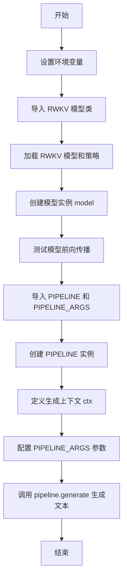
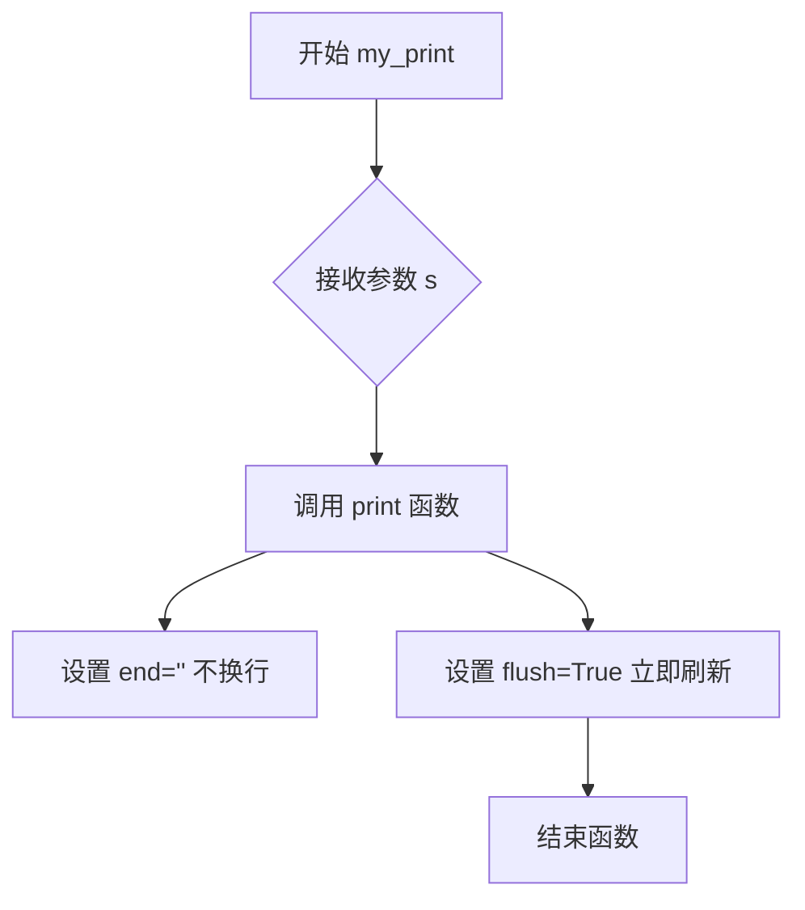
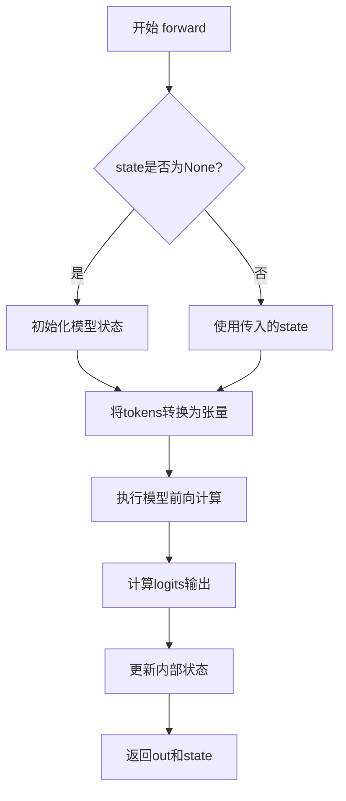
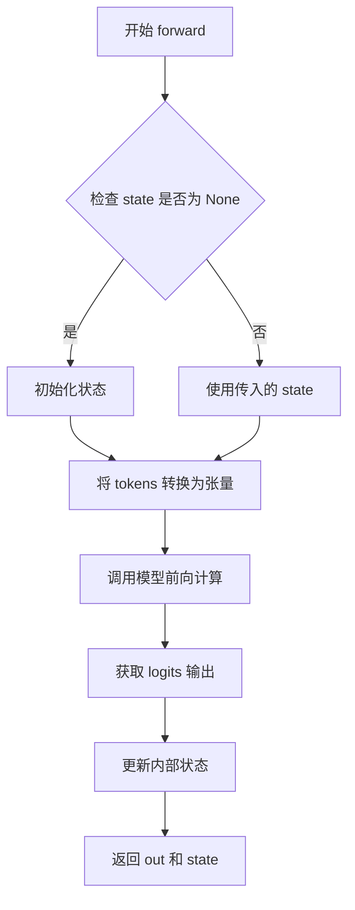
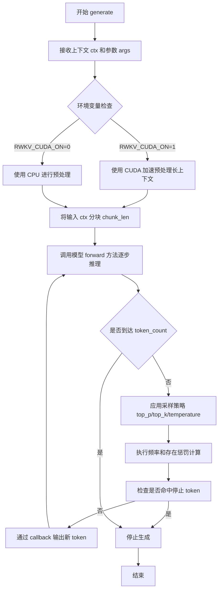

# `ChatRWKV\API_DEMO.py` 详细设计文档

ChatRWKV 是一个基于 RWKV (Receptance Weighted Key Value) 架构的语言模型推理脚本，用于加载预训练模型并通过 pipelien 生成文本。该脚本配置模型加载策略（支持 CUDA fp16、CPU fp32 等），并利用词pipeline进行文本生成，支持温度、top-p、top-k等采样参数控制。

## 整体流程



## 类结构

```
RWKV (rwkv.model)
├── model.forward() - 前向传播方法
└── 生成逻辑
PIPELINE (rwkv.utils)
├── __init__() - 初始化pipeline
└── generate() - 文本生成方法
PIPELINE_ARGS (rwkv.utils)
└── 参数配置类 (temperature, top_p, top_k, alpha_frequency, alpha_presence, token_ban, token_stop, chunk_len)
```

## 全局变量及字段


### `model`
    
RWKV 语言模型实例，用于加载和执行模型推理

类型：`RWKV`
    


### `pipeline`
    
PIPELINE 管道实例，用于文本生成和词汇处理

类型：`PIPELINE`
    


### `ctx`
    
输入上下文字符串，作为模型生成的 Prompt

类型：`str`
    


### `args`
    
PIPELINE_ARGS 参数对象，包含生成温度、top_p、top_k 等控制参数

类型：`PIPELINE_ARGS`
    


### `out`
    
模型输出的 logits 张量，表示下一个 token 的概率分布

类型：`torch.Tensor`
    


### `state`
    
RNN 状态对象，用于在多次 forward 调用中保持上下文状态

类型：`dict/tensor`
    


### `my_print`
    
回调函数，用于实时输出模型生成的 token

类型：`function`
    


### `RWKV.model`
    
模型文件路径字符串

类型：`str`
    


### `RWKV.strategy`
    
模型运行策略字符串，指定计算设备和精度（如 'cuda fp16'）

类型：`str`
    


### `PIPELINE.model`
    
关联的 RWKV 模型实例

类型：`RWKV`
    


### `PIPELINE.vocab_file`
    
词汇表文件路径，用于 token 映射

类型：`str`
    


### `PIPELINE_ARGS.temperature`
    
生成温度参数，控制随机性（越高越随机）

类型：`float`
    


### `PIPELINE_ARGS.top_p`
    
核采样阈值，只考虑累积概率超过该值的 token

类型：`float`
    


### `PIPELINE_ARGS.top_k`
    
top-k 采样参数，限制考虑的最高概率 token 数量

类型：`int`
    


### `PIPELINE_ARGS.alpha_frequency`
    
频率惩罚系数，降低重复token的出现概率

类型：`float`
    


### `PIPELINE_ARGS.alpha_presence`
    
存在惩罚系数，鼓励生成新token

类型：`float`
    


### `PIPELINE_ARGS.token_ban`
    
禁止生成的 token ID 列表

类型：`list[int]`
    


### `PIPELINE_ARGS.token_stop`
    
停止生成的 token ID 列表，遇到这些 token 时停止

类型：`list[int]`
    


### `PIPELINE_ARGS.chunk_len`
    
输入分块长度，用于长上下文分段处理以节省显存

类型：`int`
    
    

## 全局函数及方法


### `my_print`

打印回调函数，用于流式输出生成的token。该函数作为回调被传递给 `pipeline.generate()` 方法，在每个 token 生成时立即打印，实现实时流式输出效果。

参数：

- `s`：`str`，要打印的字符串内容，即生成的 token

返回值：`None`，无返回值

#### 流程图



#### 带注释源码

```python
def my_print(s):
    """
    打印回调函数，用于流式输出生成的token
    
    参数:
        s: str - 要打印的字符串内容，即模型生成的token
        
    返回值:
        None - 无返回值
    """
    # 打印内容，end='' 设置为不换行，flush=True 设置为立即刷新输出缓冲区
    # 这样可以实现实时流式输出效果，用户可以看到token逐个生成
    print(s, end='', flush=True)
```

#### 使用示例

```python
# 在 pipeline.generate 中作为回调函数使用
pipeline.generate(
    ctx,                    # 上下文输入
    token_count=200,        # 要生成的token数量
    args=args,              # 生成参数
    callback=my_print       # 使用 my_print 作为回调函数
)
```

---

#### 技术债务与优化空间

1. **函数功能单一**：当前函数仅支持打印到标准输出，可以考虑扩展为支持自定义输出目标（如文件、GUI组件等）
2. **缺乏错误处理**：没有处理可能的编码异常或输出错误
3. **无状态记录**：无法记录已输出的token历史，后续需要追溯输出内容时只能依赖重新运行


### `RWKV.forward`

该方法是RWKV模型的核心前向传播接口，接收token序列和当前状态，计算下一个token的logits概率分布并返回更新后的状态，支持RNN风格的状态传递以实现高效的推理过程。

#### 参数

- `tokens`：`list[int]` 或 `torch.Tensor`，输入的token ID序列，表示需要模型处理的文本tokens
- `state`：`tuple` 或 `None`，模型内部状态。首次调用时设为`None`初始化状态，后续调用时传入上一次返回的状态以实现状态保持

#### 返回值

- `out`：`torch.Tensor`，模型输出的logits，形状为`[vocab_size]`，表示每个token的预测概率得分
- `state`：`tuple`，更新后的模型状态，可用于下一次前向传播以实现增量推理

#### 流程图



#### 带注释源码

```python
# model.forward 方法调用示例（来自代码第54-60行）
# 第一次调用：传入tokens序列和初始状态None
out, state = model.forward([187, 510, 1563, 310, 247], None)
print(out.detach().cpu().numpy())  # 获取logits输出

# 第二次调用：分步输入tokens并保持状态
out, state = model.forward([187, 510], None)
out, state = model.forward([1563], state)      # RNN模式：使用之前的状态
out, state = model.forward([310, 247], state)  # 继续使用状态
print(out.detach().cpu().numpy())               # 与第一次完整输入的结果相同

# 关键特性：
# 1. tokens可以是任意长度的列表，会自动转换为模型所需张量
# 2. state为None时自动初始化状态
# 3. 传入state时会在之前状态基础上继续计算（状态保持）
# 4. 返回的out是torch.Tensor，需要detach()后再转为numpy
```

---

### 潜在技术债务与优化空间

1. **状态管理不透明**：state的内部结构未在代码中明确文档化，用户需要通过试错理解其结构
2. **缺乏错误处理**：未对tokens类型、state格式进行显式校验，可能导致运行时错误
3. **状态序列化缺失**：state对象无法直接序列化保存，不利于长对话的状态恢复
4. **类型注解缺失**：Python代码中未使用类型提示（Type Hints），影响IDE支持和代码可维护性

### 其它项目

#### 设计目标与约束

- **设计目标**：提供高效的RNN风格推理接口，支持增量计算和状态复用，减少重复计算开销
- **精度支持**：fp16（GPU）、fp32（CPU）、bf16（CPU兼容）、int8量化（节省显存）
- **上下文长度**：ctx4096模型支持最长4096个token的上下文

#### 外部依赖与接口契约

- **依赖库**：torch、numpy、rwkv（pip安装）
- **环境变量**：
  - `RWKV_V7_ON`：启用RWKV-7模型支持
  - `RWKV_JIT_ON`：启用JIT编译加速
  - `RWKV_CUDA_ON`：编译CUDA核心（10x加速，需CUDA环境）
- **模型文件**：需要预训练的RWKV模型文件（.pth格式）

#### 状态机说明

```
┌─────────────────┐     ┌─────────────────┐     ┌─────────────────┐
│   initial       │────▶│   processing    │────▶│   output ready  │
│   state=None    │     │   tokens        │     │   out+new_state │
└─────────────────┘     └─────────────────┘     └─────────────────┘
         ▲                                              │
         │              ┌─────────────────┐             │
         └──────────────│   state reuse   │─────────────┘
                        │ (for next call)  │
                        └─────────────────┘
```


### `PIPELINE.generate`

该方法是 RWKV 模型进行文本生成的核心函数，通过接收上下文文本、目标 token 数量、生成参数和回调函数，驱动模型逐个预测并输出 token，最终返回生成的完整文本。

参数：

-  `ctx`：`str`，输入的上下文文本，作为生成的条件和起点。
-  `token_count`：`int`，指定要生成的 token 数量，控制输出长度。
-  `args`：`PIPELINE_ARGS` 对象，包含生成控制的参数，如 temperature、top_p、top_k、alpha_frequency、alpha_presence、token_ban、token_stop、chunk_len 等。
-  `callback`：`callable` 函数，接收每个生成的 token 并执行相应操作（如打印、存储），用于流式输出。

返回值：`str`，返回生成的文本内容，由所有生成的 token 解码后拼接而成。

#### 流程图

```mermaid
graph TD
A[开始] --> B[输入 ctx, token_count, args, callback]
B --> C[初始化 token 列表为空]
C --> D[将上下文 ctx 编码为 token 序列]
D --> E[初始化模型状态 state 为 None]
E --> F{处理上下文: 按 chunk_len 分块处理}
F --> G[对每个 chunk 调用 model.forward 得到 logits 和 state]
G --> H{循环生成 token: i < token_count}
H -->|是| I[根据 logits 和 args 参数采样下一个 token]
I --> J[调用 callback 处理生成的 token（如打印）]
J --> K[将 token 添加到 token 列表]
K --> L[更新模型状态: model.forward([token], state)]
L --> M[i = i + 1]
M --> H
H -->|否| N[将生成的 token 序列解码为文本]
N --> O[返回生成的文本]
O --> P[结束]
```

#### 带注释源码

```python
def generate(self, ctx, token_count, args=None, callback=None):
    """
    RWKV 模型文本生成主函数。
    
    参数:
        ctx (str): 上下文文本，作为生成的条件。
        token_count (int): 要生成的 token 数量。
        args (PIPELINE_ARGS, optional): 生成参数对象，包含温度、top-p、top-k 等配置。默认为 None。
        callback (callable, optional): 回调函数，每个生成 token 时调用，接收 token 字符串。默认为 None。
    
    返回:
        str: 生成的文本内容。
    """
    # 如果未提供 args，则使用默认参数
    if args is None:
        args = PIPELINE_ARGS()
    
    # 初始化生成的 token 列表
    tokens = []
    
    # 将上下文文本编码为 token 序列
    input_tokens = self.tokenizer.encode(ctx)
    
    # 初始化模型状态为 None（初始无状态）
    state = None
    
    # 处理输入上下文：分块以节省显存
    # 遍历输入 token，每 chunk_len 个 token 为一块
    for i in range(0, len(input_tokens), args.chunk_len):
        chunk = input_tokens[i:i + args.chunk_len]
        # 调用模型前向传播，得到 logits 和更新后的 state
        logits, state = self.model.forward(chunk, state)
    
    # 循环生成指定数量的 token
    for _ in range(token_count):
        # 根据模型输出的 logits 和生成参数采样下一个 token
        token = self.sample(logits, args)
        
        # 将采样的 token 解码为字符串
        token_str = self.tokenizer.decode([token])
        
        # 如果提供了回调函数，则调用它处理生成的 token（如打印）
        if callback:
            callback(token_str)
        
        # 将生成的 token 添加到列表
        tokens.append(token)
        
        # 使用刚生成的 token 更新模型状态，准备生成下一个 token
        logits, state = self.model.forward([token], state)
    
    # 将生成的 token 序列解码为完整的文本字符串
    generated_text = self.tokenizer.decode(tokens)
    
    # 返回生成的文本
    return generated_text
```


### `RWKV.forward()`

该方法是 RWKV 语言模型的前向传播函数，接收 token 列表和可选的 RNN 状态作为输入，返回 logits 输出和更新后的状态，支持 RNN 模式的连续推理。

#### 参数

- `tokens`：`list[int]`，输入的 token 序列列表，表示需要模型处理的文本 token
- `state`：`any`，RNN 状态对象，首次调用时为 `None`，后续调用时传入上一次返回的状态以实现连续推理

#### 返回值

- `out`：`torch.Tensor`，模型输出的 logits 向量，表示下一个 token 的概率分布
- `state`：`any`，更新后的 RNN 状态，可用于下一次 forward 调用以实现状态保持

#### 流程图



#### 带注释源码

```python
# 代码中调用示例
out, state = model.forward([187], None)  # 首次调用，state 为 None
out, state = model.forward([187, 510, 1563, 310, 247], None)  # 批量 token 输入
out, state = model.forward([187, 510], None)  # 新的输入序列
out, state = model.forward([1563], state)  # 使用之前的状态继续推理（RNN 模式）
out, state = model.forward([310, 247], state)  # 继续使用状态推理
print(out.detach().cpu().numpy())  # 获取 logits 结果
```


### PIPELINE.generate()

该方法是 RWKV 模型推理管道的核心生成方法，负责接收上下文输入并基于给定的生成参数（temperature、top_p、top_k 等）通过回调函数逐步输出生成的 token 序列。

参数：

- `ctx`：`str`，输入的上下文字符串，模型将基于此上下文进行续写
- `token_count`：`int`，需要生成的 token 数量
- `args`：`PIPELINE_ARGS`，生成参数配置对象，包含 temperature（温度）、top_p（核采样概率）、top_k（top-k 采样）、alpha_frequency（频率惩罚）、alpha_presence（存在惩罚）、token_ban（禁止生成的 token 列表）、token_stop（停止 token 列表）、chunk_len（分块长度）等配置
- `callback`：`Callable[[str], None]`，回调函数，每生成一个 token 或一段文本时被调用，用于实时处理输出

返回值：`None`，该方法通过回调函数返回结果，不直接返回值

#### 流程图



#### 带注释源码

```python
# 由于 PIPELINE 类是从 rwkv.utils 模块导入的外部库类，
# 其 generate 方法的源码不在当前代码文件中。
# 以下是基于调用方式推断的方法签名和典型实现逻辑：

def generate(self, ctx: str, token_count: int, args: PIPELINE_ARGS, callback: Callable[[str], None]):
    """
    基于给定上下文和参数生成文本
    
    参数:
        ctx: 输入上下文字符串
        token_count: 需要生成的 token 数量
        args: 生成参数配置
        callback: 处理每个生成 token 的回调函数
    """
    # 1. 预处理上下文
    # 如果设置了 RWKV_CUDA_ON='1'，使用 CUDA 加速长上下文的编码
    # 否则使用 CPU 进行预处理
    
    # 2. 根据 chunk_len 将长上下文分块处理以节省显存
    
    # 3. 循环生成 token_count 个 token
    #    - 调用 model.forward() 获取 logits
    #    - 根据 args 中的采样策略（top_p, top_k, temperature）选择下一个 token
    #    - 应用 alpha_frequency 和 alpha_presence 惩罚
    #    - 检查是否命中 token_stop 中的停止 token
    #    - 通过 callback(字符) 输出结果
    
    # 4. 达到 token_count 或遇到停止 token 时退出
    pass

# 实际调用示例（来自代码）:
pipeline.generate(
    ctx,                          # 上下文字符串
    token_count=200,              # 生成200个token
    args=args,                    # PIPELINE_ARGS配置对象
    callback=my_print             # 打印回调函数
)
```

#### 关键组件信息

| 名称 | 一句话描述 |
|------|-----------|
| PIPELINE | RWKV 模型的推理管道封装类，负责文本生成的核心逻辑 |
| PIPELINE_ARGS | 生成参数的配置类，包含采样策略和惩罚参数 |
| RWKV | RWKV 语言模型的主类，提供 forward 方法进行推理 |
| model.forward() | 模型的前向传播方法，接收 token 序列并输出 logits |

#### 潜在的技术债务或优化空间

1. **CUDA 编译状态检查缺失**：代码中设置了 `RWKV_CUDA_ON='0'`，但未检查目标机器是否真正支持 CUDA 编译，应添加环境检测和优雅降级
2. **硬编码的模型路径**：模型路径直接写在代码中，应抽取到配置文件或命令行参数
3. **错误处理不完善**：缺少对模型加载失败、CUDA 不可用等情况的异常捕获
4. **分块策略固定**：`chunk_len=256` 是硬编码值，对于不同显存大小的设备应动态调整
5. **状态管理不透明**：state 的深拷贝（deepcopy）提示在注释中，但未实现具体的状态保存/恢复机制

#### 其它项目

**设计目标与约束**：
- 支持多种精度模式（fp16/fp32/bf16/xxxi8）以适配不同硬件
- 支持长上下文（ctx4096）处理
- 通过分块策略减少显存占用

**错误处理与异常设计**：
- 模型路径不存在时需捕获 FileNotFoundError
- CUDA 不可用时自动回退到 CPU 模式
- 生成过程中 token 超出词汇表时需处理

**数据流与状态机**：
- 首次调用使用 `state=None` 初始化状态
- 后续调用可复用 state 实现 RNN 风格的连续推理
- 状态可通过 deepcopy 克隆以支持并行生成

**外部依赖与接口契约**：
- 依赖 `rwkv` pip 包
- 依赖 `rwkv_vocab_v20230424` 词汇表文件
- callback 接口约定为接收字符串参数、无返回值


## 关键组件


### RWKV 模型类

负责加载和管理 RWKV 语言模型，支持多种运行策略（fp16/fp32/bf16/量化）和设备分配

### PIPELINE 文本生成管道

封装分词器和生成逻辑，提供 generation 接口，支持 temperature、top_p、top_k、alpha_frequency、alpha_presence 等采样参数

### 模型前向传播 (model.forward)

实现 RNN 风格的状态传递，支持分段输入和状态复用，用于连续推理场景

### 量化策略支持

通过策略字符串（如 cuda fp16i8）实现 int8 量化，可节省 50% VRAM/RAM，包含 fp16i8 等多种精度选项

### 环境配置管理

通过 os.environ 设置 RWKV_V7_ON（启用 v7 模型）、RWKV_JIT_ON（ JIT 编译）、RWKV_CUDA_ON（CUDA 加速）来控制运行时行为

### PIPELINE_ARGS 生成参数

定义生成时的采样策略，包括 temperature、top_p、top_k、token_ban（屏蔽词）、token_stop（停止符）、chunk_len（分块长度）

### 状态管理与克隆

RNN 保持内部状态，通过 deep copy 实现状态克隆，支持在同一上下文中多次推理

### CUDA 加速支持

可选编译 CUDA kernel 可获得约 10x 加速，需 C++ 编译器和 CUDA 库支持


## 问题及建议


### 已知问题

-   **CUDA 编译未启用**：代码中 `os.environ["RWKV_CUDA_ON"] = '0'`，但模型加载使用 `strategy='cuda fp16'`，导致无法使用编译后的 CUDA kernel，注释明确指出设置为 '1' 可提升 10 倍性能。
-   **硬编码的模型路径**：模型路径 `E://RWKV-Runner//models//RWKV-x070-World-1.5B-v3-20250127-ctx4096` 硬编码在代码中，缺乏动态配置机制，导致代码不可移植。
-   **缺少错误处理**：模型文件路径不存在、CUDA 不可用、内存不足等场景没有异常捕获和友好提示。
-   **JIT 编译配置被注释**：代码中保留了 JIT 编译相关配置的注释块，但均未启用，导致无法利用 PyTorch JIT 优化。
-   **状态复用缺乏保护**：代码注释提到 `use deepcopy to clone states`，但实际代码直接传递 state 对象，可能导致状态意外污染。
-   **测试代码未清理**：开头的推理测试代码 (`out, state = model.forward(...)`) 直接留在文件中，会在导入时执行不必要的计算。
-   **numpy 输出配置不够精确**：`np.set_printoptions` 设置了固定 linewidth，但未针对不同终端做适配。

### 优化建议

-   **启用 CUDA 编译**：将 `os.environ["RWKV_CUDA_ON"] = '1'`，并在确保 C++ 编译器和 CUDA 库可用的环境中运行，以获得 10 倍性能提升。
-   **外部化配置**：将模型路径、strategy 参数等通过命令行参数、环境变量或配置文件传入，避免硬编码。
-   **添加异常处理**：使用 try-except 包装模型加载和推理逻辑，捕获 `FileNotFoundError`、`RuntimeError`（CUDA 相关）等异常，并提供明确的错误信息。
-   **启用 JIT 优化**：取消注释 JIT 相关配置，根据目标设备（CPU/GPU）选择性启用 `torch._C._jit_set_profiling_executor(True)` 等选项。
-   **状态管理改进**：使用 `copy.deepcopy(state)` 显式克隆状态后再复用，并在文档中说明状态管理的正确方式。
-   **分离测试代码**：将推理测试代码移至 `if __name__ == "__main__":` 块中，避免模块导入时执行不必要操作。
-   **参数调优**：根据 `PIPELINE_ARGS` 的注释，结合实际场景调整 `temperature`、`top_p`、`alpha_frequency` 等生成参数，以获得更好的生成质量。


## 其它


### 设计目标与约束

本代码旨在演示如何使用RWKV语言模型进行文本生成，主要设计目标包括：1）支持长上下文（ctx4096）处理；2）提供灵活的模型加载策略（支持fp16、fp32、bf16、int8量化等多种精度）；3）实现高效的文本生成接口。约束条件包括：fp16模式不支持CPU运行，CUDA编译需要C++编译器和CUDA库支持，模型路径必须使用正斜杠"/"。

### 错误处理与异常设计

代码主要通过Python异常机制处理错误。模型加载失败时RWKV类会抛出异常；文件路径不存在时会出现FileNotFoundError；CUDA不可用时回退到CPU模式。建议增加：模型路径有效性检查、CUDA可用性预检测、生成过程中的超时处理、内存不足时的优雅降级策略。

### 数据流与状态机

数据流主要分为三个阶段：初始化阶段（环境变量设置→模型加载→Pipeline创建→参数配置）、生成阶段（输入文本→分词→模型推理→采样解码→输出文本）、状态管理（模型状态state的保存与复用）。state对象用于在多次调用间保持RNN状态，支持增量推理。

### 外部依赖与接口契约

核心依赖包括：torch>=1.0、numpy、rwkv库（pip install rwkv）。模型文件需预先下载放置在指定路径。PIPELINE_ARGS参数契约：temperature控制随机性（0.0-2.0），top_p核采样阈值，top_k控制候选词数量，alpha_frequency和alpha_presence用于频率和存在惩罚，token_ban禁止特定token生成，token_stop指定停止token，chunk_len控制分块长度以节省显存。

### 配置管理

配置通过环境变量和环境对象PIPELINE_ARGS管理。环境变量：RWKV_V7_ON（启用7模型）、RWKV_JIT_ON（启用JIT编译）、RWKV_CUDA_ON（启用CUDA加速）。生成参数通过PIPELINE_ARGS类集中配置，支持热修改。模型路径和策略在创建RWKV实例时指定。

### 性能优化策略

代码注释中列出了多项JIT优化选项（已注释）：torch._C._jit_set_profiling_executor、torch._jit_override_can_fuse_on_cpu/gpu、torch._C._jit_set_texpr_fuser_enabled等。实际使用的优化策略包括：JIT编译（RWKV_JIT_ON=1）、CUDA加速（CUDA_ON=1时10x加速）、分块处理（chunk_len参数减少显存占用）、状态复用（避免重复计算）。

### 内存管理

显存管理主要通过以下方式：1）策略选择（fp16i8等量化策略可节省50%显存）；2）分块处理（chunk_len参数控制单次处理长度）；3）状态管理（使用deepcopy克隆状态）。CPU内存通过fp32或bf16精度换取了兼容性。模型策略表达式如"cuda fp16 *6 -> cpu fp32 *1"可实现多设备分层管理。

### 安全性考虑

当前代码安全性考量有限，主要包括：1）模型文件路径需防止路径遍历攻击；2）用户输入ctx应进行长度限制防止资源耗尽；3）生成参数应设置上限防止异常值。建议增加：输入长度验证、敏感信息过滤、生成token数量上限控制。

### 兼容性设计

代码兼容性设计包括：多精度支持（fp16/fp32/bf16/int8）、多设备支持（cuda/cpu）、多模型版本支持（rwkv-4/rwkv-7）、跨平台路径处理（虽代码要求正斜杠）。Python版本需兼容目标rwkv库要求。

### 版本升级策略

rwkv库版本升级时需注意：模型版本兼容性（RWKV_V7_ON环境变量控制）、API变更（RWKV类和PIPELINE类接口）、策略语法变化、词汇表更新（当前使用rwkv_vocab_v20230424）。建议在配置中明确记录各依赖版本。

### 测试策略建议

建议增加以下测试用例：1）各精度模式的加载和推理测试；2）长上下文处理测试；3）状态保存和恢复测试；4）参数边界值测试；5）内存使用监控测试；6）CUDA/cpu回退测试。

### 部署和运维注意事项

部署时需注意：1）模型文件预先下载并验证完整性；2）CUDA库和C++编译器准备好以启用CUDA加速；3）显存/内存资源评估（1.5B模型fp16约3GB显存）；4）生成token数量和并发数限制；5）日志和监控设置。建议使用虚拟环境隔离依赖，配置优雅退出机制处理中断信号。


    